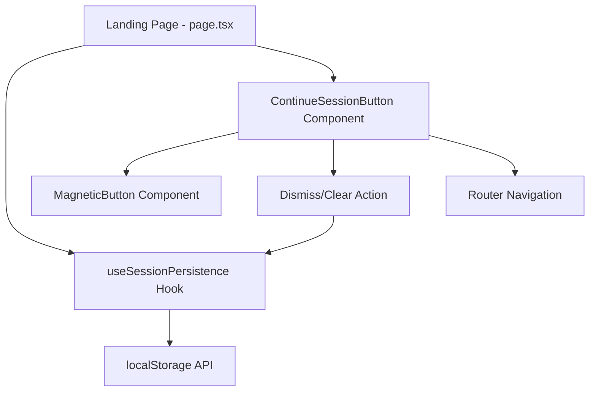
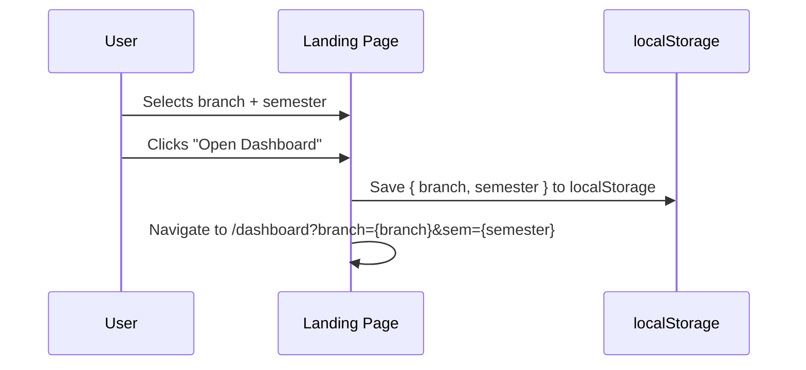
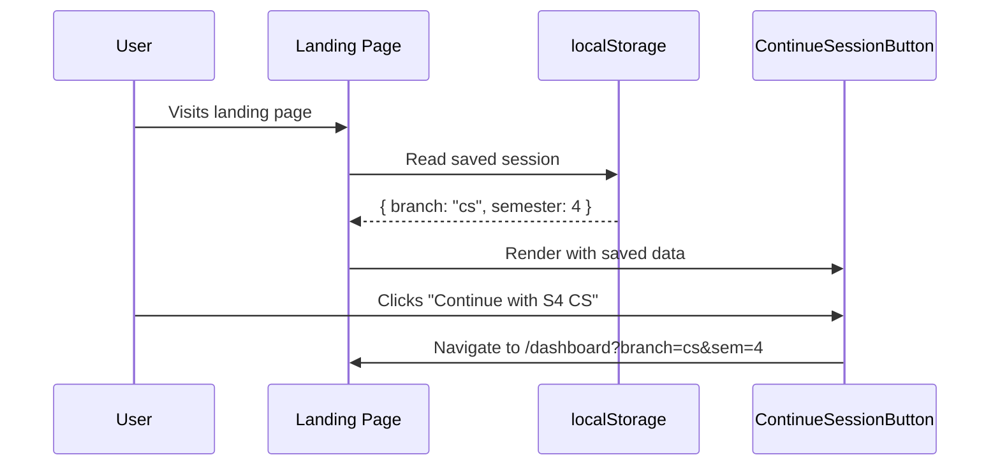
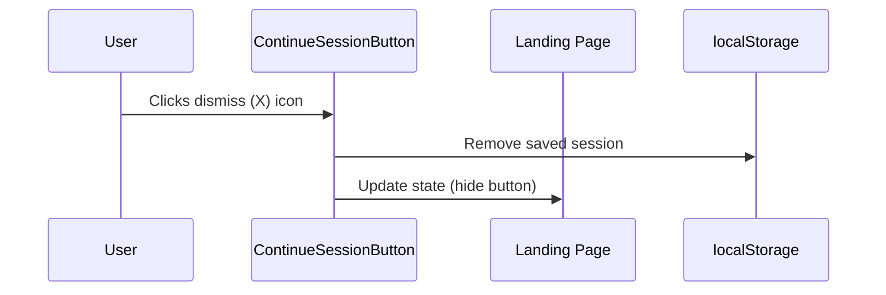

# Design Document: Continue with Session

## Overview

This feature adds a persistent "Continue with S{semester} {branch}" button to the landing page hero section, providing a quick-resume experience for returning users. When a user selects a branch and semester and navigates to the dashboard, their selection is saved to localStorage. On subsequent visits to the landing page, a styled button appears below the selector card allowing one-click navigation back to their previous dashboard context.

The button reuses the existing `MagneticButton` component for visual consistency, includes a dismiss (X) icon to clear the saved selection, and integrates seamlessly with the existing Framer Motion animations on the landing page.

## Architecture



## Sequence Diagrams

### First Visit Flow (Save Selection)



### Return Visit Flow (Resume Session)



### Dismiss Flow (Clear Session)



## Components and Interfaces

### Component 1: useSessionPersistence (Custom Hook)

**Purpose**: Encapsulates all localStorage read/write logic for the saved session, providing a clean reactive interface to the landing page.

**Interface**:
```typescript
interface SavedSession {
  branch: string;
  semester: number;
}

interface UseSessionPersistenceReturn {
  savedSession: SavedSession | null;
  saveSession: (branch: string, semester: number) => void;
  clearSession: () => void;
}

function useSessionPersistence(): UseSessionPersistenceReturn;
```

**Responsibilities**:
- Read saved session from localStorage on mount (client-side only)
- Provide `saveSession` to persist a new selection
- Provide `clearSession` to remove the saved selection
- Handle SSR safety (no localStorage access during server render)
- Validate stored data integrity before returning

### Component 2: ContinueSessionButton

**Purpose**: Renders the "Continue with S{semester} {branch}" button with dismiss functionality, animated entrance, and navigation behavior.

**Interface**:
```typescript
interface ContinueSessionButtonProps {
  session: SavedSession;
  onContinue: () => void;
  onDismiss: () => void;
}

function ContinueSessionButton(props: ContinueSessionButtonProps): JSX.Element | null;
```

**Responsibilities**:
- Display formatted label: "Continue with S{semester} {branchLabel}"
- Map branch ID to short display label (e.g., "cs" → "CS", "ec" → "EC")
- Render using MagneticButton for consistent styling
- Include a dismiss (X) icon button that stops event propagation
- Animate entrance/exit with Framer Motion (AnimatePresence)

### Component 3: MagneticButton (Existing — No Changes)

**Purpose**: Reusable button with blue gradient styling and magnetic hover effect.

**Interface** (existing):
```typescript
interface MagneticButtonProps {
  children: React.ReactNode;
  className?: string;
  onClick?: () => void;
}
```

**Responsibilities**:
- Provide magnetic hover effect via spring physics
- Render blue gradient button with shimmer animation
- Accept children for flexible content

## Data Models

### Model: SavedSession

```typescript
interface SavedSession {
  branch: string;   // Branch ID: "cs" | "ec" | "me" | "ce" | "ee"
  semester: number; // Semester number: 1-8
}
```

**Validation Rules**:
- `branch` must be one of: "cs", "ec", "me", "ce", "ee"
- `semester` must be an integer between 1 and 8 (inclusive)
- If stored data fails validation, treat as no saved session (clear invalid data)

### Model: localStorage Schema

```typescript
// Key: "ktunode-session"
// Value: JSON string of SavedSession

const STORAGE_KEY = "ktunode-session";
```

**Validation Rules**:
- Value must be valid JSON
- Parsed value must conform to SavedSession interface
- Invalid or corrupted data is silently cleared

## Key Functions with Formal Specifications

### Function 1: useSessionPersistence()

```typescript
function useSessionPersistence(): UseSessionPersistenceReturn
```

**Preconditions:**
- Component is mounted in a client-side environment
- localStorage is available (browser context)

**Postconditions:**
- Returns current saved session or null
- `saveSession` persists valid data to localStorage and updates state
- `clearSession` removes data from localStorage and sets state to null
- Never throws — handles all storage errors gracefully

**Loop Invariants:** N/A

### Function 2: validateSession()

```typescript
function validateSession(data: unknown): data is SavedSession
```

**Preconditions:**
- `data` is any value parsed from localStorage (could be null, undefined, malformed)

**Postconditions:**
- Returns `true` if and only if data has valid `branch` (one of known IDs) and valid `semester` (integer 1-8)
- Returns `false` for any invalid, null, or undefined input
- No side effects

**Loop Invariants:** N/A

### Function 3: getBranchShortLabel()

```typescript
function getBranchShortLabel(branchId: string): string
```

**Preconditions:**
- `branchId` is a non-empty string

**Postconditions:**
- Returns uppercase short label for known branches: "cs" → "CS", "ec" → "EC", "me" → "ME", "ce" → "CE", "ee" → "EE"
- Returns `branchId.toUpperCase()` for unknown branch IDs (graceful fallback)
- No side effects

**Loop Invariants:** N/A

## Algorithmic Pseudocode

### Session Persistence Algorithm

```typescript
// On component mount
function initializeSession(): SavedSession | null {
  // SSR guard
  if (typeof window === "undefined") return null;

  const raw = localStorage.getItem(STORAGE_KEY);
  if (!raw) return null;

  try {
    const parsed = JSON.parse(raw);
    if (validateSession(parsed)) {
      return parsed;
    }
    // Invalid data — clean up
    localStorage.removeItem(STORAGE_KEY);
    return null;
  } catch {
    // Corrupted JSON — clean up
    localStorage.removeItem(STORAGE_KEY);
    return null;
  }
}

// Save session on dashboard navigation
function saveSession(branch: string, semester: number): void {
  const session: SavedSession = { branch, semester };
  if (!validateSession(session)) return;
  
  try {
    localStorage.setItem(STORAGE_KEY, JSON.stringify(session));
  } catch {
    // Storage full or unavailable — fail silently
  }
}

// Clear session on dismiss
function clearSession(): void {
  try {
    localStorage.removeItem(STORAGE_KEY);
  } catch {
    // Fail silently
  }
}
```

### Validation Algorithm

```typescript
const VALID_BRANCHES = ["cs", "ec", "me", "ce", "ee"] as const;

function validateSession(data: unknown): data is SavedSession {
  if (data === null || data === undefined || typeof data !== "object") {
    return false;
  }

  const obj = data as Record<string, unknown>;

  // Validate branch
  if (typeof obj.branch !== "string") return false;
  if (!VALID_BRANCHES.includes(obj.branch as any)) return false;

  // Validate semester
  if (typeof obj.semester !== "number") return false;
  if (!Number.isInteger(obj.semester)) return false;
  if (obj.semester < 1 || obj.semester > 8) return false;

  return true;
}
```

### Button Render Algorithm

```typescript
function ContinueSessionButton({ session, onContinue, onDismiss }: ContinueSessionButtonProps) {
  const label = `Continue with S${session.semester} ${getBranchShortLabel(session.branch)}`;

  return (
    <AnimatePresence>
      <motion.div
        initial={{ opacity: 0, y: 16, scale: 0.95 }}
        animate={{ opacity: 1, y: 0, scale: 1 }}
        exit={{ opacity: 0, y: -8, scale: 0.95 }}
        transition={{ duration: 0.4, ease: [0.16, 1, 0.3, 1] }}
      >
        <MagneticButton onClick={onContinue} className="...same as Open Dashboard...">
          {label}
          <ArrowRight />
          <DismissIcon onClick={onDismiss} /> {/* stops propagation */}
        </MagneticButton>
      </motion.div>
    </AnimatePresence>
  );
}
```

## Example Usage

```typescript
// In src/app/page.tsx — Home component

export default function Home() {
  const router = useRouter();
  const { savedSession, saveSession, clearSession } = useSessionPersistence();

  // Existing state...
  const [selectedBranch, setSelectedBranch] = useState("");
  const [selectedSemester, setSelectedSemester] = useState<number | "">("");

  const handleLaunch = () => {
    const p = new URLSearchParams();
    if (selectedBranch) p.set("branch", selectedBranch);
    if (selectedSemester) p.set("sem", String(selectedSemester));

    // Save session before navigating
    if (selectedBranch && selectedSemester) {
      saveSession(selectedBranch, selectedSemester as number);
    }

    router.push(`/dashboard${p.toString() ? `?${p.toString()}` : ""}`);
  };

  const handleContinue = () => {
    if (!savedSession) return;
    router.push(`/dashboard?branch=${savedSession.branch}&sem=${savedSession.semester}`);
  };

  const handleDismiss = () => {
    clearSession();
  };

  return (
    // ... existing hero content ...

    {/* Continue button — appears below selector card */}
    {savedSession && (
      <ContinueSessionButton
        session={savedSession}
        onContinue={handleContinue}
        onDismiss={handleDismiss}
      />
    )}

    // ... rest of page ...
  );
}
```

## Correctness Properties

*A property is a characteristic or behavior that should hold true across all valid executions of a system—essentially, a formal statement about what the system should do. Properties serve as the bridge between human-readable specifications and machine-verifiable correctness guarantees.*

### Property 1: Round-trip persistence

*For any* valid branch ∈ {"cs", "ec", "me", "ce", "ee"} and semester ∈ [1..8], calling `saveSession(branch, semester)` followed by `initializeSession()` SHALL return `{ branch, semester }` with identical values.

**Validates: Requirements 1.1, 1.2, 2.1, 2.2**

### Property 2: Validation rejects invalid data

*For any* data where `data.branch ∉ VALID_BRANCHES` or `data.semester ∉ [1..8]` or data is not a well-formed object (including null, undefined, arrays, numbers, strings), `validateSession(data)` SHALL return `false`.

**Validates: Requirements 3.1, 3.2, 3.5**

### Property 3: Invalid storage is self-healing

*For any* string stored in localStorage under the STORAGE_KEY that is either invalid JSON or valid JSON that fails validation, `initializeSession()` SHALL return `null` and remove the invalid entry from localStorage.

**Validates: Requirements 3.3, 3.4**

### Property 4: Button label format is deterministic

*For any* valid Saved_Session, the rendered button label SHALL be exactly `"Continue with S${session.semester} ${session.branch.toUpperCase()}"` — producing labels like "Continue with S4 CS".

**Validates: Requirements 4.2**

### Property 5: Navigation URL correctness

*For any* valid Saved_Session with branch `b` and semester `s`, clicking the Continue_Button SHALL navigate to the URL `/dashboard?branch=${b}&sem=${s}`.

**Validates: Requirements 5.1**

### Property 6: Invalid inputs are not persisted

*For any* input where branch is not a valid Branch_ID or semester is not an integer in [1..8], calling `saveSession` SHALL NOT write any data to localStorage.

**Validates: Requirements 1.3**

## Error Handling

### Error Scenario 1: Corrupted localStorage Data

**Condition**: localStorage contains invalid JSON or data that doesn't match SavedSession schema
**Response**: `initializeSession()` catches the error, removes the corrupted entry, and returns null
**Recovery**: Button simply doesn't appear; user proceeds with normal flow

### Error Scenario 2: localStorage Unavailable

**Condition**: Browser has localStorage disabled (private browsing in some browsers, storage quota exceeded)
**Response**: All localStorage operations are wrapped in try/catch; failures are silent
**Recovery**: Feature degrades gracefully — no "Continue" button appears, no errors shown

### Error Scenario 3: Stale Branch/Semester Data

**Condition**: Stored branch ID or semester is no longer valid (e.g., app updates valid branches)
**Response**: `validateSession()` rejects the data, clears it from storage
**Recovery**: Button doesn't appear; user selects fresh values

### Error Scenario 4: Dismiss Click Propagation

**Condition**: User clicks the X dismiss icon but the click also triggers the parent button's onClick
**Response**: Dismiss handler calls `event.stopPropagation()` to prevent navigation
**Recovery**: Only the dismiss action fires; session is cleared without navigating

## Testing Strategy

### Unit Testing Approach

- Test `validateSession()` with valid inputs, boundary values, and invalid/malformed data
- Test `getBranchShortLabel()` for all known branches and unknown fallback
- Test `useSessionPersistence` hook with mocked localStorage (read, write, clear, error scenarios)
- Test `ContinueSessionButton` renders correct label format
- Test dismiss click stops propagation and calls onDismiss

**Property-Based Testing Approach**

**Property Test Library**: fast-check (already in devDependencies)

- Generate arbitrary valid branch/semester pairs → verify round-trip persistence
- Generate arbitrary invalid data → verify validateSession rejects all
- Generate random strings for localStorage → verify initializeSession never throws

### Integration Testing Approach

- Verify button appears after navigating to dashboard and returning to landing page
- Verify button navigates to correct dashboard URL
- Verify dismiss clears button and localStorage entry
- Verify first-time visitors see no continue button

## Performance Considerations

- localStorage access is synchronous but fast (< 1ms for small JSON)
- Reading happens once on mount via `useEffect` — no re-reads on re-renders
- The button uses `AnimatePresence` for smooth enter/exit without layout shift
- No additional network requests or API calls
- Component is conditionally rendered (not hidden with CSS) to avoid unnecessary DOM nodes

## Security Considerations

- localStorage data is client-only and contains no sensitive information (branch ID + semester number)
- Input validation prevents injection of unexpected values into URL parameters
- The stored data is validated before use — never blindly trusted
- No PII is stored; branch and semester are non-identifying academic preferences

## Dependencies

- **Existing (no new dependencies)**:
  - `react` / `react-dom` — Component rendering and hooks
  - `next/navigation` — Router for navigation
  - `framer-motion` — AnimatePresence for button animation
  - `lucide-react` — X icon for dismiss, ArrowRight for button
  - `localStorage` Web API — Persistence layer
