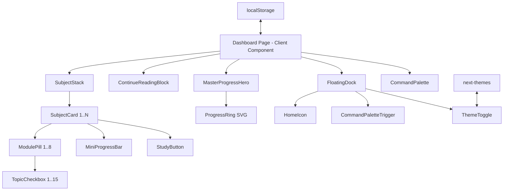

# Design Document: Premium Dashboard

## Overview

The Premium Dashboard replaces the existing tabbed dashboard at `src/app/dashboard/page.tsx` with a bento-grid layout featuring a master progress hero, continue-reading action block, interactive subject stack with 3-level drilldown, and a floating global controls dock. The implementation uses Next.js 16 (App Router), Tailwind CSS v4, and Framer Motion 12, following the project's dark glassmorphism aesthetic from the FolioSync design system.

The dashboard is a fully client-side interactive page (`"use client"`) since it relies heavily on state management, animations, localStorage, and browser APIs. Data is persisted to `localStorage` for progress tracking, with the `next-themes` package handling dark/light mode persistence.

### Key Design Decisions

1. **Client Component architecture**: The entire dashboard page is a Client Component because every section requires interactivity (expand/collapse, checkboxes, animations, localStorage). Server Components would add complexity without benefit here.
2. **localStorage for persistence**: Progress state is stored in localStorage rather than a backend API, keeping the feature self-contained and fast. This aligns with the existing codebase pattern.
3. **Framer Motion `layout` animations**: Used for smooth expand/collapse transitions in the Subject Stack, avoiding manual height calculations.
4. **Single state tree**: All progress data lives in a single React state object, making percentage calculations reactive and consistent across components.

## Architecture



### State Flow

```mermaid
flowchart LR
    subgraph State
        S[progressState: Record<subjectCode, Set<topicId>>]
        R[readingHistory: {subjectCode, topicName, timestamp}]
        EX[expandedCards: Set<subjectCode>]
        SM[selectedModules: Record<subjectCode, moduleIndex>]
    end
    
    subgraph Derived
        SP[subjectProgress: Record<subjectCode, number>]
        GP[semesterCompletion: number]
    end
    
    S --> SP
    S --> GP
    SP --> K[MiniProgressBar]
    GP --> J[ProgressRing]
```

## Components and Interfaces

### Component Tree

| Component | Props | Responsibility |
|-----------|-------|----------------|
| `DashboardPage` | — | Root client component, manages all state, renders bento grid |
| `MasterProgressHero` | `studentName: string`, `semesterCompletion: number` | Displays greeting + animated progress ring |
| `ProgressRing` | `percentage: number`, `size: number`, `strokeWidth: number` | SVG circular arc with spring animation |
| `ContinueReadingBlock` | `lastViewed: ReadingHistory \| null`, `isLoading: boolean` | Shows last-read topic or empty state |
| `SubjectStack` | `subjects: Subject[]`, `progress: ProgressState`, `onToggleTopic: fn` | Renders vertical list of subject cards |
| `SubjectCard` | `subject: Subject`, `progress: number`, `isExpanded: boolean`, `selectedModule: number \| null`, `onExpand: fn`, `onSelectModule: fn`, `onToggleTopic: fn` | Expandable card with drilldown |
| `ModulePill` | `module: Module`, `isSelected: boolean`, `onClick: fn` | Clickable module indicator |
| `TopicCheckbox` | `topic: Topic`, `isChecked: boolean`, `onChange: fn` | Custom styled checkbox |
| `MiniProgressBar` | `percentage: number` | Horizontal progress indicator |
| `StudyButton` | `subjectCode: string` | Navigation button to reading view |
| `FloatingDock` | — | Fixed bottom dock with controls |
| `CommandPalette` | `isOpen: boolean`, `onClose: fn` | Modal overlay for search/navigation |
| `ThemeToggle` | — | Dark/light mode switch using `next-themes` |

### Key Interfaces

```typescript
interface Subject {
  code: string;        // e.g., "CS301"
  name: string;        // e.g., "Operating Systems"
  modules: Module[];   // max 8 displayed
}

interface Module {
  index: number;       // 1-based
  title: string;
  topics: Topic[];     // max 15 displayed
}

interface Topic {
  id: string;          // unique identifier: `${subjectCode}-M${moduleIndex}-T${topicIndex}`
  name: string;
}

interface ReadingHistory {
  subjectCode: string;
  topicName: string;
  timestamp: number;
}

interface ProgressState {
  // Set of completed topic IDs per subject
  [subjectCode: string]: string[];
}

interface DashboardState {
  progress: ProgressState;
  readingHistory: ReadingHistory | null;
  expandedCards: string[];           // subject codes
  selectedModules: Record<string, number | null>;  // subjectCode -> moduleIndex
}
```

### Utility Functions

```typescript
// Truncates a string to maxLength, appending ellipsis if truncated
function truncate(str: string, maxLength: number): string;

// Calculates percentage as whole number: round((checked/total) * 100)
function calcPercentage(checked: number, total: number): number;

// Computes SVG stroke-dasharray for a given percentage and circumference
function calcStrokeDasharray(percentage: number, circumference: number): string;

// Validates and parses persisted state from localStorage
function loadProgress(): ProgressState | null;

// Persists progress state to localStorage
function saveProgress(state: ProgressState): boolean;
```

## Data Models

### localStorage Schema

**Key: `ktunode-premium-progress`**

```json
{
  "version": 1,
  "updatedAt": 1700000000000,
  "progress": {
    "CS301": ["CS301-M1-T1", "CS301-M1-T2", "CS301-M2-T1"],
    "CS302": ["CS302-M1-T1"]
  }
}
```

**Key: `ktunode-reading-history`**

```json
{
  "subjectCode": "CS301",
  "topicName": "K-Map Simplification",
  "timestamp": 1700000000000
}
```

### Validation Schema

The persisted progress data must conform to:
- `version`: number (currently 1)
- `updatedAt`: number (Unix timestamp)
- `progress`: object where keys are non-empty strings and values are arrays of strings

If validation fails, the state is treated as corrupted (Requirement 7.3).

## Correctness Properties

*A property is a characteristic or behavior that should hold true across all valid executions of a system — essentially, a formal statement about what the system should do. Properties serve as the bridge between human-readable specifications and machine-verifiable correctness guarantees.*

### Property 1: Truncation preserves content within limit

*For any* string and any positive max-length limit, the `truncate` function SHALL return a string whose visible character count (excluding ellipsis) is at most `maxLength`, AND if the original string length is ≤ `maxLength` the output SHALL equal the original string exactly, AND if the original string length > `maxLength` the output SHALL end with "…" and have total length of `maxLength + 1` (or `maxLength` if ellipsis replaces the last char).

**Validates: Requirements 1.2, 2.2**

### Property 2: Progress percentage calculation correctness

*For any* non-negative integer `checked` and positive integer `total` where `checked ≤ total`, the `calcPercentage` function SHALL return `Math.round((checked / total) * 100)`, which is always an integer between 0 and 100 inclusive. Furthermore, the SVG `stroke-dasharray` computed from this percentage SHALL equal `(percentage / 100) * circumference` for the filled portion.

**Validates: Requirements 1.4, 1.8, 3.7, 3.8**

### Property 3: Drilldown list capping

*For any* subject with `N` modules where `N > 0`, the Subject_Card SHALL display exactly `min(N, 8)` Module_Pills. Similarly, *for any* module with `M` topics where `M > 0`, the expanded module SHALL display exactly `min(M, 15)` Topic_Checkboxes.

**Validates: Requirements 3.3, 3.5**

### Property 4: Expand/collapse toggle is an involution

*For any* Subject_Card in collapsed state, performing expand then collapse SHALL return the card to its original collapsed state with no Module_Pills or Topic_Checkboxes visible. Similarly, *for any* Module_Pill in selected state, deselecting it SHALL hide all Topic_Checkboxes for that module.

**Validates: Requirements 3.4, 3.6**

### Property 5: Independent card expansion (no accordion)

*For any* set of Subject_Cards where some subset is expanded, expanding or collapsing any single card SHALL NOT change the expanded/collapsed state of any other card in the stack.

**Validates: Requirements 3.13**

### Property 6: Progress persistence round-trip

*For any* valid `ProgressState` object, serializing it to localStorage via `saveProgress` and then deserializing it via `loadProgress` SHALL produce an object deeply equal to the original. The computed `semesterCompletion` and per-subject percentages derived from the restored state SHALL equal those computed from the original state.

**Validates: Requirements 5.6, 7.1, 7.2**

## Error Handling

| Scenario | Behavior |
|----------|----------|
| localStorage unavailable (private browsing) | Graceful degradation: progress works in-memory for the session, non-blocking toast warns user that progress won't persist |
| Corrupted persisted state (unparseable JSON or schema-invalid) | Reset all checkboxes to unchecked, set completion to 0%, show non-blocking notification (Req 7.3) |
| Persistence write failure | Retain previous persisted state, show non-blocking error toast, do NOT revert the UI checkbox (optimistic UI with error indication) (Req 7.4) |
| Reading history points to non-existent topic | Fall back to empty-state prompt in Continue_Reading_Block (Req 2.6) |
| Student name unavailable | Display generic "Welcome back" greeting (Req 1.3) |
| Subject has 0 modules or module has 0 topics | Render the card/pill but show an empty state message inside the expanded area |

### Error Notification Pattern

Use a lightweight toast component (positioned top-right, auto-dismiss after 5 seconds) for non-blocking notifications. The toast should not overlap with the Floating_Dock.

## Testing Strategy

### Unit Tests (Example-based)

- Rendering tests for each component with specific props
- Edge cases: empty name, 0% progress, 100% progress, corrupted localStorage
- Responsive layout verification at breakpoint boundaries
- Animation configuration value assertions (spring stiffness, damping, duration)
- Keyboard shortcut (⌘+K) triggers Command_Palette
- Floating_Dock positioning and z-index
- Subject_Card styling (border-radius, colors, hover states)

### Property-Based Tests

Property-based testing is appropriate for this feature because it contains pure utility functions (truncation, percentage calculation, stroke-dasharray computation) and state management logic (expand/collapse, persistence round-trip) that have clear universal properties across a wide input space.

**Library**: [fast-check](https://github.com/dubzzz/fast-check) (JavaScript/TypeScript PBT library)

**Configuration**:
- Minimum 100 iterations per property test
- Each test tagged with: `Feature: premium-dashboard, Property {number}: {property_text}`

**Properties to implement**:
1. Truncation preserves content within limit (validates string handling)
2. Progress percentage calculation correctness (validates math)
3. Drilldown list capping (validates UI constraints)
4. Expand/collapse toggle involution (validates state transitions)
5. Independent card expansion (validates no side effects)
6. Progress persistence round-trip (validates serialization)

### Integration Tests

- Navigation from Study_Button to Reading_View
- Navigation from "Jump Back In" to correct topic
- Theme toggle persistence across simulated page reload
- Full expand → check topic → verify both progress indicators update flow

### Accessibility Testing

- All interactive elements have minimum 44×44px tap targets on mobile
- Keyboard navigation through Subject_Stack (Tab, Enter, Space)
- ARIA attributes on expandable cards (`aria-expanded`, `aria-controls`)
- Screen reader announcements for progress changes
- Focus management when Command_Palette opens/closes
