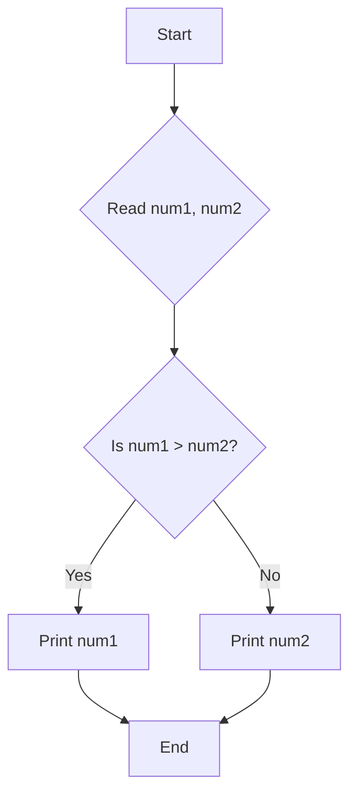
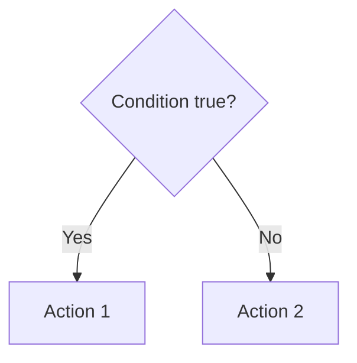
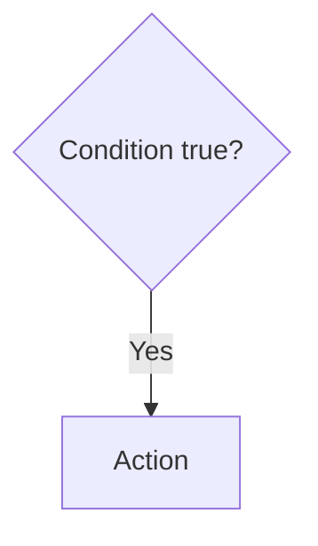
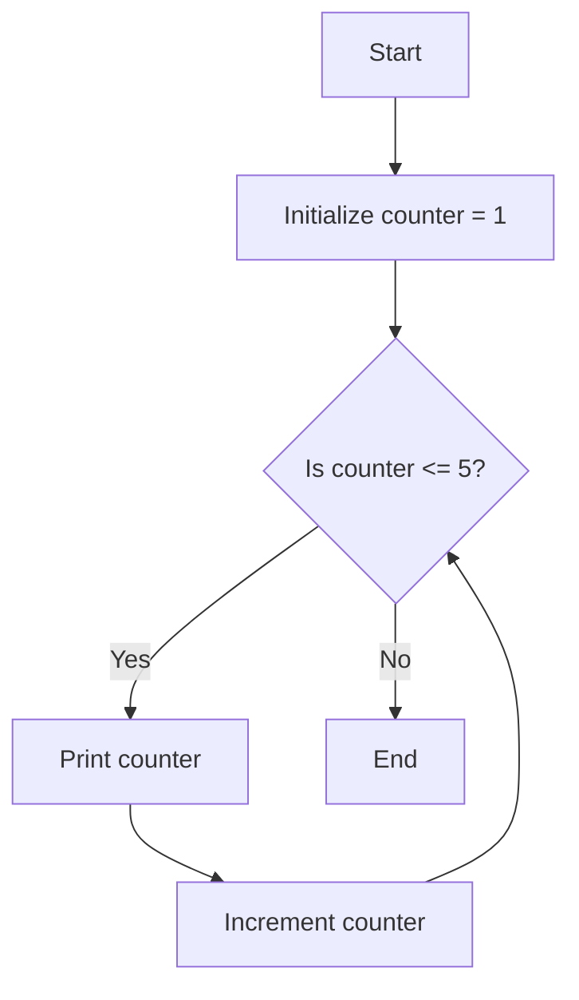

# Module 4: Computational Approaches to Problems

Welcome back, everyone! In this module, we're going to dive into the heart of what makes us computational thinkers: **Computational Approaches to Problems**. We’ve spent time understanding what algorithms are, how to think systematically, and now we’re going to explore *how* we approach solving problems using these computational ideas. This isn't just about writing Python code; it’s about a mindset, a way of breaking down the world into solvable pieces.

Think about your journey so far. We've established that computing can be a powerful tool for tackling real-world challenges (that’s CO1!). We’ve also learned that before we even think about code, we need to truly *understand* the problem and represent it clearly (CO2!). Now, we're building on that foundation to actively *solve* those problems using effective algorithms and translate them into programs (CO3!), all while understanding the strategies we're employing (CO4!). This module bridges the gap between understanding a problem and actively *solving* it computationally.

We’ll be drawing inspiration from some excellent minds. George Pólya, in his classic "How to Solve It," gives us a fantastic framework for problem-solving in general. Maureen Sprankle and Jim Hubbard’s "Problem Solving & Programming Concepts" grounds us in the practicalities of programming, and John V. Guttag’s "Introduction to Computation and Programming Using Python" is our go-to for understanding how Python itself helps us implement these ideas.

***

## 1. The Art of Decomposing: Breaking Down Complexities

One of the most fundamental computational approaches is **decomposition**. Imagine you have a massive, complex task, like building a robot. You wouldn't try to assemble the entire thing at once, would you? Of course not! You'd break it down into smaller, more manageable parts: the chassis, the motor system, the sensors, the control unit, and so on. Each of these parts can then be further decomposed. This is exactly what we do in computational problem-solving.

**Decomposition** is the process of breaking down a large, complex problem into smaller, simpler, and more manageable sub-problems. Each sub-problem is easier to understand, solve, and manage.

### Why is Decomposition so Powerful? (Connecting to CO2 & CO3)

*   **Reduces Complexity:** Tackling one small piece at a time feels much less daunting than staring at the whole, overwhelming problem.
*   **Facilitates Understanding:** By focusing on smaller parts, we can grasp the specifics of each component more deeply. This directly supports **CO2**, where we emphasize articulating and modeling the problem. If you can't break it down, you can't model it effectively.
*   **Enables Solution Development:** Once we have our sub-problems, we can devise solutions for each individually. This is the bedrock of **CO3** – creating effective algorithms for formulated models.
*   **Promotes Reusability:** Sometimes, a sub-problem we solve might be a common task that can be reused in other problems or even within the same problem multiple times. Think of a function to calculate the square root; you might need that in many places.

### Diagrammatic Illustration: Planning a Trip

Let’s visualize this with a simple, everyday example: **Planning a Vacation**.

Imagine the problem: "Plan a one-week vacation to Italy."

This is too broad! We need to decompose it.

```
+-----------------------+
| Plan Vacation to Italy|
|     (1 Week)          |
+-----------+-----------+
            |
            v
+-----------------------+
| 1. Destination Choice |
|   (e.g., Rome, Florence)|
+-----------+-----------+
            |
            v
+-----------------------+
| 2. Travel Arrangements|
|  - Flights            |
|  - Local Transport    |
+-----------+-----------+
            |
            v
+-----------------------+
| 3. Accommodation      |
|  - Hotels             |
|  - Airbnb             |
+-----------+-----------+
            |
            v
+-----------------------+
| 4. Itinerary Planning |
|  - Daily Activities   |
|  - Sightseeing        |
+-----------+-----------+
            |
            v
+-----------------------+
| 5. Budgeting          |
|  - Estimate Costs     |
|  - Track Expenses     |
+-----------+-----------+
            |
            v
+-----------------------+
| 6. Packing            |
|  - Clothes            |
|  - Essentials         |
+-----------------------+
```

See how we’ve taken a big goal and broken it down into logical steps? Each of these is a smaller problem that we can tackle. For example, "Travel Arrangements" can be further decomposed into "Book Flights" and "Research Train Tickets."

**Remember this:** Decomposition is the first, crucial step in transforming a vague idea into a structured plan for action. It’s a key problem-solving strategy (CO4).

***

## 2. Algorithmic Thinking: Step-by-Step Solutions

Once we’ve decomposed a problem into smaller, manageable parts, the next step is to figure out *how* to solve each of those parts. This is where **algorithmic thinking** comes in. At its core, an algorithm is a finite sequence of well-defined, unambiguous instructions that accomplishes a specific task.

Think of it like a recipe. A recipe tells you exactly what ingredients you need and the precise steps to follow to create a dish. If you follow the recipe correctly, you’ll get the desired outcome – a delicious meal! Algorithms are the computational equivalent of recipes.

### Key Characteristics of Algorithms

Algorithms aren't just random steps; they have specific qualities:

*   **Finiteness:** An algorithm must terminate after a finite number of steps. It can't run forever.
*   **Definiteness:** Each step must be precisely defined; the actions to be carried out must be unambiguously specified. No guesswork allowed!
*   **Input:** An algorithm has zero or more precisely defined inputs. These are the data it operates on.
*   **Output:** An algorithm has one or more precisely defined outputs. These are the results of the computation.
*   **Effectiveness:** Each step must be basic enough that it can, in principle, be carried out exactly and quickly by a person using pencil and paper.

This emphasis on definiteness and effectiveness is vital for **CO3**: translating algorithms into executable programs. If your steps aren't clear, your program won't know what to do.

### Algorithmic Representations: Flowcharts and Pseudocode

How do we represent these step-by-step instructions before we write them in Python? Two common ways are:

#### a) Flowcharts

Flowcharts are graphical representations of an algorithm. They use standard symbols to depict different types of actions and decisions. This visual approach can be incredibly helpful for understanding the logic flow, especially for beginners. It directly supports **CO2** by providing a clear model.

Common Flowchart Symbols:

*   **Oval/Terminator:** Represents the start or end of the algorithm.
*   **Rectangle:** Represents a process or an action (e.g., "Calculate sum").
*   **Parallelogram:** Represents input or output operations (e.g., "Read number," "Print result").
*   **Diamond:** Represents a decision point, usually with a condition (e.g., "Is number > 10?"). This leads to different paths.
*   **Arrows:** Connect the symbols to show the direction of flow.

##### Example: Finding the Larger of Two Numbers

Let's create a simple flowchart for finding the larger of two numbers, say `num1` and `num2`.



This flowchart clearly shows the process: start, get the numbers, make a decision, print the larger one, and end. It’s unambiguous and effective.

#### b) Pseudocode

Pseudocode is a way of writing algorithms using a blend of natural language and programming-like constructs. It’s not a formal programming language, so it doesn’t need to adhere to strict syntax rules. The goal is to describe the logic clearly and concisely. This is a bridge to **CO3**, preparing us to write actual Python code.

Characteristics of Pseudocode:

*   Uses English-like phrases.
*   Often uses keywords like `IF`, `THEN`, `ELSE`, `WHILE`, `FOR`, `READ`, `PRINT`, `SET`.
*   Indentation is used to show structure and blocks of code.

##### Example: Finding the Larger of Two Numbers in Pseudocode

```
START
  READ num1
  READ num2

  IF num1 > num2 THEN
    PRINT num1
  ELSE
    PRINT num2
  END IF
END
```

This pseudocode is very similar to what the flowchart depicts but uses text. It's easier to write and modify than a full flowchart for complex logic.

**Remember this:** Both flowcharts and pseudocode are tools for *designing* algorithms before you code. They help you think through the steps logically, which is a core part of **CO3** and **CO4**.

***

## 3. Types of Computational Approaches: Iteration and Selection

When we devise algorithms, we often encounter patterns of execution. Two fundamental patterns are **selection** and **iteration**. Understanding these helps us build robust algorithms.

### a) Selection (Decision Making)

Selection allows an algorithm to choose between different paths of execution based on a condition. This is what we saw in our "finding the larger number" example using the `IF...THEN...ELSE` structure.

**Think about it:** When you’re driving, you encounter selections all the time. If the traffic light is red, you stop. If it's green, you go. This is a simple selection process.

#### Diagrammatic/Algorithmic Representation:

We use conditional statements for selection.

**Flowchart Snippet:**



**Pseudocode Snippet:**

```
IF condition THEN
  -- perform action 1
ELSE
  -- perform action 2
END IF
```

Or, a simpler form if there’s no `ELSE`:

**Flowchart Snippet:**



**Pseudocode Snippet:**

```
IF condition THEN
  -- perform action
END IF
```

These selection structures are crucial for creating algorithms that can adapt to different inputs and scenarios, a key aspect of building effective solutions (**CO3**).

### b) Iteration (Repetition / Looping)

Iteration, also known as looping, is when an algorithm repeats a block of instructions multiple times. This is incredibly powerful for processing collections of data or performing tasks a set number of times.

**Think about it:** Imagine you're sorting a deck of cards. You might pick up each card and place it in its correct position. You repeat the "pick up and place" action for every card in the deck. That’s iteration!

There are generally two main types of loops:

*   **Count-controlled loops:** These repeat a specific number of times. Think of "do this 10 times."
*   **Condition-controlled loops:** These repeat as long as a certain condition remains true (or until a condition becomes false). Think of "keep doing this until the job is done."

#### Diagrammatic/Algorithmic Representation:

#### i) Count-Controlled Loop (e.g., `FOR` loop)

**Example:** Print numbers from 1 to 5.

**Flowchart Snippet:**



**Pseudocode Snippet:**

```
FOR counter FROM 1 TO 5
  PRINT counter
END FOR
```

This is like a pre-defined number of repetitions.

#### ii) Condition-Controlled Loop (e.g., `WHILE` loop)

**Example:** Keep asking for user input until they enter "quit".

**Flowchart Snippet:**

```mermaid
graph TD
    A[Start] --> B[Initialize input = ""];
    B --> C{Is input NOT equal to "quit"?};
    C -- Yes --> D[Read user_input];
    D --> E[Update input = user_input];
    E --> C;
    C -- No --> F[End];
```

**Pseudocode Snippet:**

```
WHILE input IS NOT "quit"
  READ user_input
  SET input = user_input
END WHILE
```

This loop continues as long as the condition (`input IS NOT "quit"`) is true. When it becomes false (the user types "quit"), the loop terminates.

These iterative structures are fundamental to solving many problems, from processing lists of data to simulations. They directly enable **CO3** by allowing us to build efficient algorithms for repetitive tasks.

**Remember this:** Selection lets your algorithm *choose*, and iteration lets it *repeat*. Both are powerful building blocks for computational solutions (CO4).

***

## 4. Abstraction: Focusing on the Essential

Another powerful computational thinking skill is **abstraction**. Abstraction is the process of simplifying complex reality by modeling classes based on relevant attributes or behaviors, focusing on what is essential and ignoring irrelevant details.

**Think about it:** When you use a television remote, you don't need to understand the intricate electronics inside. You only need to know the essential functions: power button, volume up/down, channel change. The complex internal workings are abstracted away, presenting you with a simple interface.

In programming, abstraction helps us manage complexity. We create functions or modules that perform specific tasks without needing to know the nitty-gritty details of how they work internally. This is related to **decomposition**, but abstraction is more about *hiding* complexity and providing a simpler view.

### How Abstraction Helps:

*   **Simplifies Design:** We can think about how different parts of a system interact without getting bogged down in their internal details.
*   **Promotes Reusability:** An abstract function (like a "sort" function) can be used in many different contexts without needing to be rewritten each time.
*   **Focuses on the "What," not the "How":** When you call a function like `sort_list(my_list)`, you know *what* it will do (sort the list), but you don't necessarily need to know *how* it achieves that sorting internally (e.g., bubble sort, quicksort).

### Algorithmic Representation: Function Calls

A common way to represent abstraction is through the concept of **functions** or **procedures**. These are named blocks of code that perform a specific task. You can call them by their name, and they execute their internal logic.

**Example:** Imagine a program that needs to calculate the area of a circle multiple times.

Instead of writing the formula `pi * radius * radius` everywhere, we can create an **abstracted function**:

**Pseudocode:**

```
// This is an abstracted function to calculate circle area
FUNCTION calculate_circle_area(radius):
  PI = 3.14159
  area = PI * radius * radius
  RETURN area
END FUNCTION

// --- Main part of the program ---
// Calculate area for a circle with radius 5
radius1 = 5
area1 = calculate_circle_area(radius1)
PRINT "Area 1:", area1

// Calculate area for a circle with radius 10
radius2 = 10
area2 = calculate_circle_area(radius2)
PRINT "Area 2:", area2
```

In this example, `calculate_circle_area` is an abstraction. We pass in the `radius` (the input), and it returns the `area` (the output). The details of the calculation are encapsulated within the function. This directly supports **CO3** by allowing us to break down complex programs into reusable, manageable units.

**Remember this:** Abstraction is about hiding details and presenting a simplified interface. It's about focusing on the essential. This is crucial for building complex systems and is a hallmark of good algorithmic design (CO4).

***

## 5. Putting It Together: A Simple Problem

Let’s take a simple problem and walk through these computational approaches.

**Problem:** Calculate the sum of all even numbers between 1 and 10 (inclusive).

### Step 1: Understanding and Articulating the Problem (CO2)

We need to find numbers that are both even and within the range 1 to 10. Then, we need to add them up.
*   Numbers in range: 1, 2, 3, 4, 5, 6, 7, 8, 9, 10
*   Even numbers in range: 2, 4, 6, 8, 10
*   Sum: 2 + 4 + 6 + 8 + 10 = 30

### Step 2: Decomposition (Optional for this small problem, but good practice)

We can think of this as two sub-problems:
1.  Identify all numbers in the range.
2.  For each number, check if it's even.
3.  If it's even, add it to a running total.

### Step 3: Algorithmic Design (Using Selection and Iteration)

We can use a loop (iteration) to go through each number from 1 to 10. Inside the loop, we'll use a selection (an `IF` statement) to check if the number is even. If it is, we add it to a `sum` variable.

**Pseudocode:**

```
START
  SET sum = 0  // Initialize our running total
  SET start_range = 1
  SET end_range = 10

  FOR number FROM start_range TO end_range
    // Selection: Check if the number is even
    IF number MOD 2 IS EQUAL TO 0 THEN  // MOD 2 gives the remainder when divided by 2
      // Iteration: Add to sum if it's even
      SET sum = sum + number
    END IF
  END FOR

  PRINT "The sum of even numbers is:", sum
END
```

**Flowchart:**

```mermaid
graph TD
    A[Start] --> B[SET sum = 0];
    B --> C[SET start_range = 1];
    C --> D[SET end_range = 10];
    D --> E[FOR number FROM start_range TO end_range];
    E --> F{number MOD 2 == 0?};
    F -- Yes --> G[SET sum = sum + number];
    F -- No --> H[Skip addition];
    G --> I[Next iteration];
    H --> I;
    I --> J{End of FOR loop?};
    J -- No --> E;
    J -- Yes --> K[PRINT "The sum of even numbers is:", sum];
    K --> L[End];
```

### Step 4: Translation to Python (CO3)

```python
# Initialize the sum and the range
total_sum = 0
start_range = 1
end_range = 10

# Iterate through numbers from start_range to end_range
for number in range(start_range, end_range + 1):
  # Selection: Check if the number is even
  if number % 2 == 0:
    # Iteration: Add the even number to the total_sum
    total_sum = total_sum + number

# Output the result
print(f"The sum of even numbers between {start_range} and {end_range} is: {total_sum}")
```

This simple example demonstrates how we combine decomposition, iteration, selection, and our understanding of a problem to create a working algorithm and then translate it into code. This is the essence of **CO3** and **CO4**.

***

## Sample Questions with Answers

**Q1. What is the primary purpose of decomposition in problem-solving?**

**Answer:** The primary purpose of decomposition is to break down a large, complex problem into smaller, more manageable, and simpler sub-problems. This reduces complexity, facilitates understanding, and makes it easier to devise solutions for each part. It's a foundational strategy for tackling any significant task, computational or otherwise.

**Q2. Differentiate between selection and iteration in algorithmic thinking, providing a simple example for each.**

**Answer:**
*   **Selection:** Allows an algorithm to make decisions and choose between different paths of execution based on a condition.
    *   **Example:** An `IF` statement that checks if a user's age is 18 or older to allow access to a restricted website.
*   **Iteration:** Involves repeating a block of instructions multiple times.
    *   **Example:** A `FOR` loop that processes each item in a shopping cart to calculate the total bill.

**Q3. Explain the concept of abstraction using an analogy related to everyday life.**

**Answer:** Abstraction can be understood by thinking about using a microwave oven. You don't need to know the complex physics of how microwaves heat food or the specific engineering of the heating element. You only need to interact with the essential controls: setting the time and power level, and pressing "start." The complex internal workings are abstracted away, providing a simple interface to achieve the desired outcome (heating food). This allows you to use the microwave effectively without needing to be an expert in electronics or thermodynamics.

**Q4. Which pseudocode construct best represents a count-controlled loop?**
    a) IF ... THEN ... ELSE
    b) WHILE ... DO
    c) FOR ... TO ...
    d) READ ... PRINT ...

**Answer:** c) `FOR ... TO ...`

**Reasoning:** Count-controlled loops are designed to execute a specified number of times. The `FOR` loop (or its variations like `FOR ... TO ...`, `FOR EACH`) is the standard construct for this purpose, allowing you to define a starting point, an ending point, and often a step or increment. `IF...THEN...ELSE` is for selection, `WHILE...DO` is for condition-controlled iteration, and `READ/PRINT` are for input/output.

**Q5. Consider the following pseudocode snippet:
```
SET count = 0
WHILE count < 5
  PRINT "Hello"
  SET count = count + 1
END WHILE
```
Describe the output and the algorithmic approach used. How does this relate to a course outcome?**

**Answer:**
*   **Output:** The word "Hello" will be printed five times.
*   **Algorithmic Approach:** This snippet uses a **condition-controlled loop** (a `WHILE` loop). The loop continues as long as the condition `count < 5` is true. Inside the loop, "Hello" is printed, and the `count` variable is incremented. Once `count` reaches 5, the condition becomes false, and the loop terminates.
*   **Relation to Course Outcome:** This directly relates to **CO3** (Use effective algorithms to solve the formulated models and translate algorithms into executable programs) and **CO4** (Interpret the problem-solving strategies, a systematic approach to solving computational problems). It demonstrates the use of iteration (a systematic approach) to achieve a repetitive task, which is a fundamental algorithmic concept that can be translated into Python.
