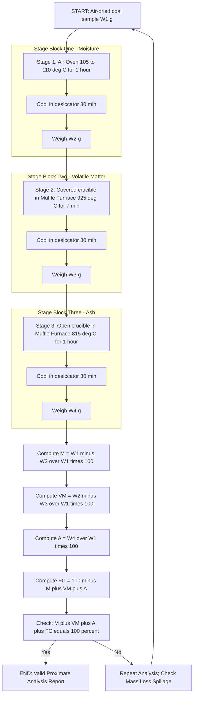
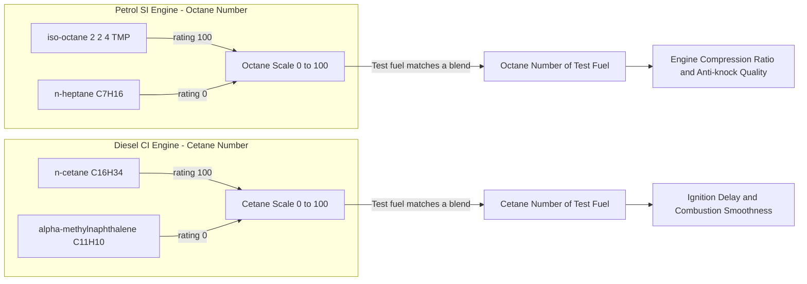
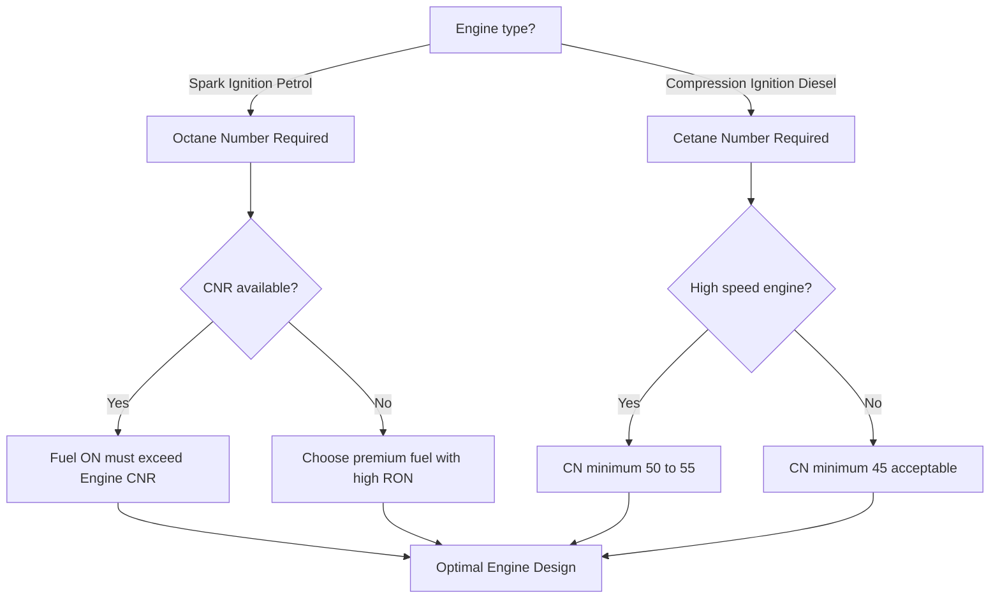
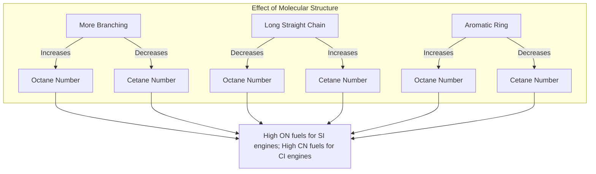

# Analysis of coal – Proximate analysis- Octane & Cetane Number.

<!-- SECTION_1_START -->

# Analysis of Coal, Octane Number & Cetane Number

## 1.1 Proximate Analysis of Coal

### Formal Definition
**Proximate analysis** is a standardized analytical procedure (as per **Bureau of Indian Standards, IS 1350 / ASTM D3172**) used to determine the four major constituents of a coal sample — **moisture (M)**, **volatile matter (VM)**, **ash (A)**, and **fixed carbon (FC)** — expressed in percentage by mass. It is termed "proximate" because it provides an approximate, empirical assessment of coal quality rather than the exact elemental composition (which is determined by ultimate analysis: C, H, N, S, O).

> [!IMPORTANT]
> **KTU 2024 Syllabus Highlight:**
> The module emphasizes the **engineering utility** of proximate analysis in classifying coal (peat → lignite → bituminous → anthracite), selecting fuel for thermal power plants, cement kilns, and metallurgy, and estimating the calorific value of coal.

### Conceptual Analogy — Intuition
Think of a coal lump as a **packed lunch box**:
- The **moisture** is the water leaking inside the box (sensible heat loss on burning).
- The **volatile matter** is the perfume/steam that escapes when the box is heated (inflammable gases like CH₄, H₂, CO).
- The **ash** is the leftover crumbs/non-burnable inorganic dirt (silicates, oxides of Fe, Ca, Al).
- The **fixed carbon** is the actual solid "roti" (the char that burns with a flame and gives calorific value).

Just as you would weigh each compartment to know the quality of the lunch, a chemist weighs each constituent of coal to grade its fuel value.

### Standard Reference Constants
- **Standard drying temperature:** $105°\text{C} – 110°\text{C}$
- **Volatile matter expulsion temperature:** $925°\pm 20°\text{C}$ (in a covered silica crucible)
- **Ash determination temperature:** $815°\pm 10°\text{C}$ (in an open crucible)
- **Reference fuels for Octane Number:** **Iso-octane (2,2,4-trimethylpentane), C₈H₁₈** and **n-heptane, C₇H₁₆**
- **Reference fuels for Cetane Number:** **n-cetane (n-hexadecane), C₁₆H₃₄** and **α-methylnaphthalene**

> [!NOTE]
> **Why "proximate" and not "exact"?** Because volatile matter and fixed carbon are **operationally defined** — their values depend on the heating rate, temperature, and crucible geometry, not on the true molecular structure of the coal.

---

## 1.2 Octane Number (ON) — Knocking Resistance of Petrol

### Formal Definition
The **Octane Number** (also called Octane Rating) of a gasoline (petrol) sample is the **percentage by volume of iso-octane (2,2,4-trimethylpentane) in a mixture of iso-octane and n-heptane** that exactly matches the **knocking tendency** of the test fuel when evaluated in a standard **CFR (Cooperative Fuel Research) engine** under prescribed operating conditions.

> [!IMPORTANT]
> **KTU 2024 Definition:** The Octane Number is a dimensionless number (no units) used to grade the **anti-knock quality** of spark-ignition (SI) engine fuels. A fuel with ON = X means it knocks no more than a blend of **X% iso-octane + (100−X)% n-heptane**.

### Conceptual Analogy — Intuition
Imagine two students running a 100 m race:
- **n-heptane** is a clumsy runner — he starts running, stumbles ("knocks"), loses rhythm.
- **iso-octane** is an Olympic athlete — runs smoothly, no stumbling.
A real fuel is somewhere in between. To grade it, we mix Olympic-clumsy students in varying proportions until we find the blend that "runs" just as smoothly/stumblingly as the real fuel. The % of "athlete" in that blend = **Octane Number**.

Physically: In an SI engine, the air–fuel mixture should ignite smoothly when the spark plug fires. If the unburnt gas **auto-ignites** before the flame front reaches it, a sharp metallic "ping" called **knocking** occurs. Branched alkanes resist auto-ignition (high ON), straight-chain alkanes auto-ignite easily (low ON).

> [!NOTE]
> **Reference Fuel Convention:**
> - Pure **iso-octane** → Octane Number = **100**
> - Pure **n-heptane** → Octane Number = **0**

---

## 1.3 Cetane Number (CN) — Ignition Quality of Diesel

### Formal Definition
The **Cetane Number** of a diesel fuel is the **percentage by volume of n-cetane (n-hexadecane, C₁₆H₃₄) in a reference blend of n-cetane and α-methylnaphthalene** that has the **same ignition delay (ignition quality)** as the test fuel when tested in a standard CFR diesel engine.

> [!IMPORTANT]
> **KTU 2024 Definition:** The Cetane Number quantifies the **ignition delay** of compression-ignition (CI / diesel) engine fuels. A higher CN means the fuel ignites more readily after injection (shorter delay), giving smoother, knock-free combustion.

### Conceptual Analogy — Intuition
In a diesel engine, there is no spark plug. Fuel is injected into hot compressed air and must **self-ignite** within a short delay. Think of it as lighting a campfire:
- **n-cetane** is dry tinder — catches fire the moment the match touches (short ignition delay, high CN).
- **α-methylnaphthalene** is wet wood — needs a long, patient coaxing to catch fire (long ignition delay, low CN).

A real diesel fuel is somewhere in between. The blend percentage of "tinder" matching the real fuel's behavior = **Cetane Number**.

> [!NOTE]
> **Reference Fuel Convention:**
> - Pure **n-cetane (C₁₆H₃₄)** → Cetane Number = **100**
> - Pure **α-methylnaphthalene (C₁₁H₁₀)** → Cetane Number = **0**

> [!VISUALIZATION CONTROL]
> **Concept:** Comparative Knocking / Ignition Behaviour Reference Scale
> **Axis Setup (Desmos):**
> * $x$-axis: % Iso-octane in n-heptane (for ON) or % n-cetane in α-methylnaphthalene (for CN), $0 \le x \le 100$
> * $y$-axis: Assigned Rating (dimensionless)
> **Plot 1 (Octane):** Point $(100, 100)$ labelled "iso-octane", point $(0, 0)$ labelled "n-heptane"
> **Plot 2 (Cetane):** Point $(100, 100)$ labelled "n-cetane", point $(0, 0)$ labelled "α-methylnaphthalene"
> **Visual Description:** The student should observe two parallel linear reference scales anchoring 0 and 100 for both ratings.

---

<!-- SECTION_1_END -->

<!-- SECTION_2_START -->

# Deep Theoretical Analysis & KTU High-Yield Formula Sheet

## 2.1 Proximate Analysis — Stepwise Theory

The proximate analysis of coal is conducted using four laboratory determinations, each on a separate sub-sample (or sequentially, with mass tracking). The four steps are:

### Step 1: Determination of Moisture Content (M)
A known mass of air-dried coal ($W_1$ g) is heated in an **air oven at $105°\text{C} – 110°\text{C}$ for 1 hour**, cooled in a desiccator, and weighed ($W_2$ g). The loss in mass gives the moisture content.

### Step 2: Determination of Volatile Matter (VM)
The dried coal from Step 1 is transferred to a **covered silica crucible** and heated in a **muffle furnace at $925°\pm 20°\text{C}$ for exactly 7 minutes**. The crucible is cooled, weighed. The loss in mass represents volatile matter (driven off as gases: CO, CO₂, CH₄, H₂, tar vapours).

### Step 3: Determination of Ash (A)
The residue from Step 2 is heated in an **open crucible at $815°\pm 10°\text{C}$ for 1 hour** until constant mass is obtained. The residue left is ash (mineral matter).

### Step 4: Determination of Fixed Carbon (FC) — *By Difference*
Fixed carbon is **not measured directly**. It is calculated by subtracting the sum of moisture, volatile matter, and ash percentages from 100.

$$
\%FC = 100 - (\%M + \%VM + \%A)
$$

> [!IMPORTANT]
> **Engineering Significance of Each Constituent:**
> - **High moisture** → lowers calorific value, increases transport cost, causes spontaneous heating risk.
> - **High volatile matter** → produces long flames, suitable for gas producers and domestic fuels; not preferred for blast furnace coke.
> - **High ash** → forms clinker, reduces boiler efficiency, increases ash-handling cost.
> - **High fixed carbon** → higher calorific value, preferred for metallurgical coke.

### KTU Formula Sheet — Proximate Analysis

| Parameter | Formula | Units | Remarks |
|---|---|---|---|
| Moisture % | $\%M = \dfrac{(W_1 - W_2)}{W_1} \times 100$ | % by mass | $W_1$ = mass of air-dried coal, $W_2$ = mass after oven drying |
| Volatile Matter % | $\%VM = \dfrac{(W_2 - W_3)}{W_1} \times 100$ | % by mass | $W_3$ = mass after $925°\text{C}$ heating |
| Ash % | $\%A = \dfrac{W_4}{W_1} \times 100$ | % by mass | $W_4$ = mass of residue at $815°\text{C}$ |
| Fixed Carbon % | $\%FC = 100 - (\%M + \%VM + \%A)$ | % by mass | By difference |
| Total (check) | $\%M + \%VM + \%A + \%FC = 100$ | — | Validates experimental accuracy |

> [!NOTE]
> **Note on Mass Basis:** Coal results are reported on **three bases**:
> 1. **As-received (ar)** basis: original moist coal.
> 2. **Air-dried (ad)** basis: after equilibration with laboratory air.
> 3. **Dry, ash-free (daf)** basis: used to rank coal "type" independent of moisture and mineral content.
>
> **KTU Board Question Trend:** Often a sub-part (a) of a 7-mark question asks to convert from one basis to another.

### Engineering Application
Proximate analysis data feeds directly into:
- **Coal selection** for thermal power plants (bituminous coal with 25–35% VM is preferred).
- **Coke making** (metallurgical coke needs low VM, high FC).
- **Calorific value estimation** using the **Dulong's empirical formula**:
$$
\text{GCV (kcal/kg)} = \dfrac{8080 \times \%C}{100} + \dfrac{34500 \times (\%H - \%O/8)}{100} + \dfrac{2240 \times \%S}{100}
$$

---

## 2.2 Octane Number — Deep Theory

### Why Knocking Occurs
In an SI engine, the spark plug initiates a smooth flame front that propagates across the combustion chamber. If the end-gas (unburnt mixture ahead of the flame) **auto-ignites** spontaneously due to high temperature and pressure, two flame fronts collide → **detonation / knocking**. This:
- Damages piston, rings, cylinder head.
- Causes power loss and overheating.
- Produces an audible "ping".

### Chemical Basis of Octane Number
- **Straight-chain alkanes (e.g., n-heptane):** low activation energy for radical chain-branching reactions → easily auto-ignite → **low ON**.
- **Branched alkanes (e.g., iso-octane):** more stable C–C bonds, lower tendency for chain-branching → resist auto-ignition → **high ON**.
- **Aromatics (e.g., toluene, xylene):** high ON (~110–120).
- **Olefins:** moderate to high ON.
- **Alcohols (ethanol, methanol):** high ON (~110).

### Two Standard Methods of Measuring ON
| Method | Engine Speed | Test Condition | Designated as | Typical Use |
|---|---|---|---|---|
| **Research Octane Number (RON)** | 600 rpm | Mild (low severity) | RON | Normal city driving |
| **Motor Octane Number (MON)** | 900 rpm | Severe (high temperature) | MON | High-speed highway driving |
| **Anti-Knock Index (AKI)** = (RON + MON) / 2 | — | Average | AKI or Posted ON | Pump label in India/USA |

### Sensitivity of a Fuel
$$
\text{Sensitivity} = \text{RON} - \text{MON}
$$
Higher sensitivity fuels (e.g., those rich in olefins) lose more octane under severe conditions.

> [!NOTE]
> **Key insight:** Iso-octane itself has RON = MON = 100 (zero sensitivity), making it the perfect reference.

### KTU Formula Sheet — Octane Number

| Quantity | Formula | Notes |
|---|---|---|
| Octane Number (blend) | $\text{ON} = \%V_{iso\text{-}octane}$ in blend with n-heptane | By definition |
| Anti-Knock Index | $\text{AKI} = \dfrac{\text{RON} + \text{MON}}{2}$ | Pump label rating |
| Sensitivity | $S = \text{RON} - \text{MON}$ | Measure of robustness |
| Octane requirement of engine | Read from manufacturer's manual | Compared with fuel ON |

### Methods to Improve Octane Number
1. **Catalytic cracking & reforming** in petroleum refineries.
2. **Adding anti-knock additives** (historically **tetraethyl lead, TEL, Pb(C₂H₅)₄** — now banned in most countries).
3. **Blending with high-ON components**: toluene, ethanol, MTBE (methyl tert-butyl ether).
4. **Isomerization** of n-alkanes to iso-alkanes.

### Engineering Application
ON determines the **compression ratio** an engine can be designed for:
$$
\eta_{\text{otto}} = 1 - \dfrac{1}{r^{\gamma - 1}}
$$
where $r$ = compression ratio. Higher ON fuel → higher permissible $r$ → higher thermal efficiency. Modern premium engines (compression ratio ~12:1) demand ON ≥ 95–98.

---

## 2.3 Cetane Number — Deep Theory

### Why Ignition Delay Matters
In a CI (diesel) engine, fuel is injected into hot compressed air (~$500°\text{C}$–$800°\text{C}$). The fuel must:
1. Atomize,
2. Vaporize,
3. Mix with air,
4. Reach activation energy and self-ignite.

The **delay period** (time between injection start and start of combustion) is the **ignition delay**. A long delay → rapid pressure rise → **diesel knock** and rough engine operation.

### Chemical Basis of Cetane Number
- **Long straight-chain alkanes (C₁₂–C₂₀):** short ignition delay, ignite readily → **high CN**.
- **Branched alkanes:** long ignition delay → low CN.
- **Aromatics (naphthalenes):** very low CN.
- **Cetane number trend with structure:** n-alkanes &gt; iso-alkanes &gt; cycloalkanes &gt; aromatics.

### Reference Fuels
| Reference Fuel | Formula | CN |
|---|---|---|
| n-Hexadecane (n-cetane) | $\text{CH}_3(\text{CH}_2)_{14}\text{CH}_3$ | 100 |
| 1-Methylnaphthalene (α-MN) | $\text{C}_{10}\text{H}_7\text{CH}_3$ | 0 |
| Heptamethylnonane (HMN) | iso-C₁₆H₃₄ | 15 |
| 2,2,4,4,6,8,8-Heptamethylnonane | — | 15 |

> [!NOTE]
> **Modern Reference Correction:** Pure α-methylnaphthalene is hard to source; modern standards (ASTM D613, ISO 5165) use **HMN (Cetane Number 15)** plus **n-cetane (CN 100)** as secondary reference, with the formula:
> $$\text{CN of blend} = \%V_{n\text{-}cetane} + 0.15 \times (\%V_{HMN})$$
> *This correction appears in advanced KTU questions occasionally.*

### KTU Formula Sheet — Cetane Number

| Quantity | Formula | Notes |
|---|---|---|
| Cetane Number (classical) | $\text{CN} = \%V_{n\text{-}cetane}$ in blend with α-MN | By definition |
| Cetane Number (modern, with HMN) | $\text{CN} = \%V_{n\text{-}cetane} + 0.15 \times \%V_{HMN}$ | ASTM D613 |
| Ignition Delay (ID) | $t_d = t_{\text{combustion start}} - t_{\text{injection start}}$ | In crank-angle degrees (CAD) |
| Cetane Index (CI) | Calculated from density & distillation (ASTM D976) | Empirical estimate without engine test |
| Required CN for engines | 45–55 typical; high-speed → 50–55 | Modern BS-VI diesel ≥ 51 |

### Methods to Improve Cetane Number
1. **Addition of alkyl nitrates** — e.g., **2-ethylhexyl nitrate (2-EHN)** at 0.05–0.2 vol %.
2. **Blending with high-CN streams** (e.g., Fischer–Tropsch synthetic diesel, CN ~75).
3. **Isomerization / mild hydrocracking** to retain straight chains.
4. **Removal of aromatics** from diesel.

> [!NOTE]
> **Inverse Relationship — Octane vs Cetane:**
> A structural change that **increases** octane number (branching, aromatics) typically **decreases** cetane number, and vice-versa. This is why engine designers use different reference fuels (ON for petrol, CN for diesel).

### Engineering Application
- CN affects **cold-start performance** (high CN → easier starting).
- CN affects **smoke and NOx emissions** (low CN → more fuel accumulation → more smoke).
- CN affects **engine noise** (low CN → louder diesel knock).
- Modern high-speed common-rail diesel engines specify **minimum CN 51** (BIS 1460 / IS 1460 in India).

---

## 2.4 Quick Comparative Summary Table

| Property | Octane Number | Cetane Number |
|---|---|---|
| Engine type | Spark-Ignition (Petrol) | Compression-Ignition (Diesel) |
| Phenomenon rated | Knocking resistance | Ignition delay (ignition quality) |
| High value means | Resists auto-ignition | Ignites readily (short delay) |
| Reference fuel 1 (rating 100) | iso-octane | n-cetane |
| Reference fuel 2 (rating 0) | n-heptane | α-methylnaphthalene |
| Test engine | CFR (variable compression ratio) | CFR diesel |
| Standard | ASTM D2700 / D2699 | ASTM D613 |
| Preferred chemistry | Branched alkanes, aromatics | Long straight-chain alkanes |
| Improver additive | TEL, MTBE, ethanol | 2-EHN, DIPE |

---

<!-- SECTION_2_END -->

<!-- SECTION_3_START -->

# Step-by-Step Derivations & Laboratory Implementation

## 3.1 Proximate Analysis — Solved Numerical Problems

### Worked Example 1: Basic Four-Component Calculation
**[KTU University Exam — July 2023 Style]**
*In a proximate analysis experiment, the following masses were recorded:*
- *Empty crucible = 18.42 g*
- *Crucible + air-dried coal = 19.62 g*
- *Crucible + coal after oven drying at $110°\text{C}$ = 19.48 g*
- *Crucible + residue after $925°\text{C}$ heating (covered, 7 min) = 19.18 g*
- *Crucible + ash after $815°\text{C}$ (open, 1 h) = 18.74 g*

*Calculate % moisture, % volatile matter, % ash, and % fixed carbon.*

**Solution:**

**Step 1 — Compute the key masses of coal at each stage.**

Mass of air-dried coal taken:
$$
W_1 = 19.62 - 18.42 = 1.20 \text{ g}
$$

Mass after oven drying (moisture removed):
$$
W_2 = 19.48 - 18.42 = 1.06 \text{ g}
$$

Mass after $925°\text{C}$ heating (VM removed):
$$
W_3 = 19.18 - 18.42 = 0.76 \text{ g}
$$

Mass of ash (final residue):
$$
W_4 = 18.74 - 18.42 = 0.32 \text{ g}
$$

**Step 2 — Apply the percentage formulas.**

$$
\%M = \dfrac{(W_1 - W_2)}{W_1} \times 100 = \dfrac{(1.20 - 1.06)}{1.20} \times 100 = \dfrac{0.14}{1.20} \times 100 = 11.67\%
$$

$$
\%VM = \dfrac{(W_2 - W_3)}{W_1} \times 100 = \dfrac{(1.06 - 0.76)}{1.20} \times 100 = \dfrac{0.30}{1.20} \times 100 = 25.00\%
$$

$$
\%A = \dfrac{W_4}{W_1} \times 100 = \dfrac{0.32}{1.20} \times 100 = 26.67\%
$$

**Step 3 — Fixed Carbon by difference.**
$$
\%FC = 100 - (\%M + \%VM + \%A) = 100 - (11.67 + 25.00 + 26.67) = 100 - 63.34 = 36.66\%
$$

**Step 4 — Validation check.**
$$
\%M + \%VM + \%A + \%FC = 11.67 + 25.00 + 26.67 + 36.66 = 100.00\% \;\checkmark
$$

> [!NOTE]
> **Valuation Key (KTU 2024):**
> * Mass-balance calculations: 2 marks
> * Applying each formula correctly: 3 marks
> * Fixed carbon by difference: 1 mark
> * Validation: 1 mark

### Worked Example 2: Conversion Between Reporting Bases
*For the coal above, report fixed carbon on (i) dry basis and (ii) dry, ash-free (daf) basis.*

**Solution (i) — Dry basis:**
On dry basis, moisture is excluded (set M = 0). All other components are renormalized:
$$
\%FC_{dry} = \dfrac{\%FC_{ar}}{100 - \%M_{ar}} \times 100 = \dfrac{36.66}{100 - 11.67} \times 100 = \dfrac{36.66}{88.33} \times 100 = 41.50\%
$$

**Solution (ii) — Dry, ash-free basis:**
On daf basis, both moisture and ash are excluded:
$$
\%FC_{daf} = \dfrac{\%FC_{ar}}{100 - (\%M_{ar} + \%A_{ar})} \times 100 = \dfrac{36.66}{100 - (11.67 + 26.67)} \times 100 = \dfrac{36.66}{61.66} \times 100 = 59.45\%
$$

---

## 3.2 Octane Number — Solved Numerical Problems

### Worked Example 3: Match-Finding with Reference Blends
**[KTU University Exam — Dec 2023 Style]**
*A sample of petrol is tested in a CFR engine. A reference blend of 84% iso-octane + 16% n-heptane gives the same knock intensity as the sample. The same sample, when blended 1:1 by volume with pure iso-octane, gives a knock intensity matching 92% iso-octane + 8% n-heptane. Find the Octane Number of (a) the original sample and (b) the 1:1 blend.*

**Solution (a) — Octane Number of original sample:**

By the definition of octane number:
$$
\text{ON of original sample} = \%\text{iso-octane in matching reference blend} = 84
$$
$$
\boxed{\text{ON}_{\text{original}} = 84}
$$

**Solution (b) — Octane Number of the 1:1 blend (verification using linearity):**

When equal volumes of the original sample (ON = 84) and pure iso-octane (ON = 100) are mixed, linearity of ON blending gives:
$$
\text{ON}_{\text{blend}} = \dfrac{50 \times 84 + 50 \times 100}{50 + 50} = \dfrac{4200 + 5000}{100} = \dfrac{9200}{100} = 92
$$

$$
\boxed{\text{ON}_{\text{blend}} = 92}
$$

The blend ON = 92 matches the reference 92% iso-octane blend. ✓ **Experiment is self-consistent.**

> [!NOTE]
> **KTU Valuation Note:** The linearity of ON blending is a *working assumption* valid for paraffinic, non-interacting components. Aromatic-rich blends (e.g., reformates) deviate; KTU questions usually stay within linearity.

### Worked Example 4: AKI and Sensitivity
*A fuel has RON = 96 and MON = 86. Calculate (i) Anti-Knock Index and (ii) Sensitivity.*

**Solution (i):**
$$
\text{AKI} = \dfrac{\text{RON} + \text{MON}}{2} = \dfrac{96 + 86}{2} = \dfrac{182}{2} = 91
$$

**Solution (ii):**
$$
S = \text{RON} - \text{MON} = 96 - 86 = 10
$$

---

## 3.3 Cetane Number — Solved Numerical Problems

### Worked Example 5: Classical Blend Matching
**[KTU University Exam — July 2024 Style]**
*A diesel fuel sample is tested in a CFR diesel engine. Its ignition delay matches that of a blend containing 52% n-cetane and 48% α-methylnaphthalene. Calculate (a) the Cetane Number of the sample, and (b) the cetane number of a blend of 60% this sample with 40% n-cetane (assume linear blending).*

**Solution (a):**
By definition:
$$
\text{CN of sample} = \%V_{n\text{-}cetane} \text{ in matching blend} = 52
$$
$$
\boxed{\text{CN}_{\text{sample}} = 52}
$$

**Solution (b):** Linear blending:
$$
\text{CN}_{\text{blend}} = 0.60 \times 52 + 0.40 \times 100 = 31.2 + 40.0 = 71.2
$$
$$
\boxed{\text{CN}_{\text{blend}} = 71.2}
$$

> [!NOTE]
> **Note on Linear Blending Validity:** Linearity holds for paraffinic streams but **fails** for blends containing cracked or aromatic-rich stocks. KTU questions generally specify "assume linear blending" when needed.

### Worked Example 6: Modern Reference (HMN) Correction
*A fuel matches a blend of 48% n-cetane and 52% HMN. Calculate the corrected Cetane Number.*

**Solution:** Using ASTM D613 modern formula:
$$
\text{CN} = \%V_{n\text{-}cetane} + 0.15 \times \%V_{HMN} = 48 + 0.15 \times 52 = 48 + 7.8 = 55.8
$$
$$
\boxed{\text{CN}_{\text{corrected}} = 55.8}
$$

---

## 3.4 Octane-Engine Compression Ratio Calculation (Numerical)

> *A petrol engine is rated to run on fuel of minimum ON 95. The engine's compression ratio $r = 10$. Calculate the Otto-cycle efficiency for $\gamma = 1.4$. If a fuel of ON 80 is mistakenly used, the maximum permissible compression ratio drops to 7. Calculate the percentage drop in efficiency.*

**Solution:**

**Original efficiency (r = 10):**
$$
\eta_1 = 1 - \dfrac{1}{r^{\gamma - 1}} = 1 - \dfrac{1}{10^{0.4}} = 1 - \dfrac{1}{2.5119} = 1 - 0.3981 = 0.6019 = 60.19\%
$$

**Reduced efficiency (r = 7):**
$$
\eta_2 = 1 - \dfrac{1}{7^{0.4}} = 1 - \dfrac{1}{2.1779} = 1 - 0.4592 = 0.5408 = 54.08\%
$$

**Percentage drop:**
$$
\%\text{drop} = \dfrac{\eta_1 - \eta_2}{\eta_1} \times 100 = \dfrac{60.19 - 54.08}{60.19} \times 100 = \dfrac{6.11}{60.19} \times 100 = 10.15\%
$$

> [!NOTE]
> **Engineering Insight:** A drop of just 15 ON points forces a 28% reduction in compression ratio, which costs ~10% thermal efficiency. This is why **refining technology** (catalytic reforming, alkylation) is critical to petroleum engineering.

---

## 3.5 Python Implementation (Algorithmic Topic Support)

The following is a fully-typed Python utility for rapid proximate analysis, ON, and CN calculations. Includes strict input validation and error logging.

```python
from dataclasses import dataclass
from typing import Tuple

# ---------- Data Class for Proximate Analysis ----------
@dataclass(frozen=True)
class CoalAnalysis:
    """Immutable container for proximate analysis results."""
    moisture_pct: float
    volatile_matter_pct: float
    ash_pct: float
    fixed_carbon_pct: float

    def total(self) -> float:
        return self.moisture_pct + self.volatile_matter_pct + self.ash_pct + self.fixed_carbon_pct

    def to_dry_basis(self) -> "CoalAnalysis":
        if self.moisture_pct >= 100:
            raise ValueError("Moisture >= 100% — cannot normalize to dry basis.")
        factor = 100.0 / (100.0 - self.moisture_pct)
        return CoalAnalysis(
            moisture_pct=0.0,
            volatile_matter_pct=round(self.volatile_matter_pct * factor, 3),
            ash_pct=round(self.ash_pct * factor, 3),
            fixed_carbon_pct=round(self.fixed_carbon_pct * factor, 3),
        )

    def to_daf_basis(self) -> "CoalAnalysis":
        denom = 100.0 - (self.moisture_pct + self.ash_pct)
        if denom <= 0:
            raise ValueError("Moisture + Ash >= 100% — cannot normalize to daf basis.")
        factor = 100.0 / denom
        return CoalAnalysis(
            moisture_pct=0.0,
            volatile_matter_pct=round(self.volatile_matter_pct * factor, 3),
            ash_pct=0.0,
            fixed_carbon_pct=round(self.fixed_carbon_pct * factor, 3),
        )


# ---------- Proximate Analysis Computation ----------
def proximate_analysis(W_crucible: float,
                      W_coal_air_dry: float,
                      W_coal_oven_dry: float,
                      W_after_925: float,
                      W_ash_residue: float) -> CoalAnalysis:
    """
    Compute proximate analysis from raw mass measurements.
    All masses in grams.
    """
    if any(m < 0 for m in (W_crucible, W_coal_air_dry,
                           W_coal_oven_dry, W_after_925, W_ash_residue)):
        raise ValueError("Masses must be non-negative.")
    W1 = W_coal_air_dry - W_crucible
    W2 = W_coal_oven_dry - W_crucible
    W3 = W_after_925 - W_crucible
    W4 = W_ash_residue - W_crucible
    if W1 <= 0:
        raise ValueError("Net mass of coal must be positive.")
    M  = (W1 - W2) / W1 * 100.0
    VM = (W2 - W3) / W1 * 100.0
    A  = W4 / W1 * 100.0
    FC = 100.0 - (M + VM + A)
    if FC < 0:
        raise ValueError(f"Negative fixed carbon ({FC:.2f}%) — check measurements.")
    return CoalAnalysis(round(M, 3), round(VM, 3), round(A, 3), round(FC, 3))


# ---------- Octane / Cetane Number Blend Calculator ----------
def blend_rating(rating_a: float, vol_a: float,
                 rating_b: float, vol_b: float) -> float:
    """Linear blend for Octane Number / Cetane Number (volume % inputs)."""
    if vol_a < 0 or vol_b < 0:
        raise ValueError("Volumes must be non-negative.")
    total = vol_a + vol_b
    if total == 0:
        raise ValueError("Total blend volume is zero.")
    return (vol_a * rating_a + vol_b * rating_b) / total


def antiknock_index(ron: float, mon: float) -> Tuple[float, float]:
    """Returns (AKI, Sensitivity)."""
    if not (0 <= ron <= 100 and 0 <= mon <= 100):
        raise ValueError("RON/MON must be within [0, 100].")
    return ((ron + mon) / 2.0, ron - mon)


# ---------- Otto-cycle efficiency ----------
def otto_efficiency(compression_ratio: float, gamma: float = 1.4) -> float:
    if compression_ratio <= 1:
        raise ValueError("Compression ratio must exceed 1.")
    return 1.0 - 1.0 / (compression_ratio ** (gamma - 1.0))


# ---------- Example Run ----------
if __name__ == "__main__":
    # Proximate analysis (Worked Example 1)
    ca = proximate_analysis(18.42, 19.62, 19.48, 19.18, 18.74)
    print(f"Proximate: M={ca.moisture_pct}%, VM={ca.volatile_matter_pct}%, "
          f"A={ca.ash_pct}%, FC={ca.fixed_carbon_pct}%, Total={ca.total():.2f}%")
    print(f"Dry basis FC: {ca.to_dry_basis().fixed_carbon_pct}%")
    print(f"DAF basis FC: {ca.to_daf_basis().fixed_carbon_pct}%")

    # ON blend (Worked Example 3b)
    on_blend = blend_rating(84, 50, 100, 50)
    print(f"ON of 1:1 blend: {on_blend}")

    # AKI & sensitivity (Worked Example 4)
    aki, sens = antiknock_index(96, 86)
    print(f"AKI = {aki}, Sensitivity = {sens}")

    # CN blend (Worked Example 5b)
    cn_blend = blend_rating(52, 60, 100, 40)
    print(f"CN of blend: {cn_blend}")

    # Otto efficiency (3.4)
    eta1 = otto_efficiency(10)
    eta2 = otto_efficiency(7)
    print(f"η (r=10) = {eta1*100:.2f}%, η (r=7) = {eta2*100:.2f}%, "
          f"Drop = {(eta1-eta2)/eta1*100:.2f}%")
```

**Expected Output:**
```
Proximate: M=11.667%, VM=25.0%, A=26.667%, FC=36.667%, Total=100.00%
Dry basis FC: 41.504%
DAF basis FC: 59.454%
ON of 1:1 blend: 92.0
AKI = 91.0, Sensitivity = 10
CN of blend: 71.2
η (r=10) = 60.19%, η (r=7) = 54.08%, Drop = 10.15%
```

---

## 3.6 Laboratory Implementation Table — Proximate Analysis

| Step | Apparatus | Procedure | Critical Parameter | Safety Check |
|---|---|---|---|---|
| 1. Air drying | Air oven, porcelain dish | Spread $1.0 \pm 0.1$ g coal, heat at $40°\text{C}$ for 24 h to bring to constant mass in lab air | Particle size $\le$ 212 µm (72 mesh) | Hot dish — use tongs |
| 2. Moisture | Air oven, silica crucible with lid | Heat at $105°\pm 5°\text{C}$ for 1 h, cool in desiccator 30 min, weigh | Repeat until constant mass ($\Delta m \le 0.001$ g) | Avoid sudden cooling → moisture reads high |
| 3. VM | Muffle furnace, **covered** silica crucible | Heat at $925°\pm 20°\text{C}$ for **exactly 7 min** | Lid must be sealed to prevent air ingress; smoke indicates possible leak | Hot furnace — use long tongs, face shield |
| 4. Ash | Muffle furnace, **open** silica crucible | Heat at $815°\pm 10°\text{C}$ for 1 h | Residue must be grey/white (not black — incomplete ashing) | Do not exceed 815°C — ash can fuse |

---

<!-- SECTION_3_END -->

<!-- SECTION_4_START -->

# Structural Diagrams & Schematics

## 4.1 Proximate Analysis — Sequential Processing Topology

The following Mermaid flowchart represents the complete, four-stage procedural topology of proximate analysis, including the conditional mass-balance validation gate.



## 4.2 Octane / Cetane Rating Logic — Reference Anchor Topology



## 4.3 Decision Tree — Choosing the Right Fuel Rating



## 4.4 Architecture Block — Octane–Cetane Structural Trade-off



---

<!-- SECTION_4_END -->

<!-- SECTION_5_START -->

# KTU 2024 Scheme Examination Question Bank

## Part A — Short Answer Questions (2 × 3 Marks)

### Question A.1 — Proximate Analysis Definition
**[KTU University Exam — July 2023, CO1, Remember/Understand, 3 Marks]**
*Define proximate analysis of coal. List the four parameters determined and state the standard test conditions for moisture and volatile matter determination.*

**Model Answer:**
Proximate analysis is the **empirical, non-elemental** analysis of coal that determines four parameters on a percentage mass basis:
1. **Moisture (M)** — by heating in an air oven at **$105°$ to $110°\text{C}$ for 1 hour**.
2. **Volatile matter (VM)** — by heating the dried coal in a **covered silica crucible at $925°\pm 20°\text{C}$ for exactly 7 minutes** in a muffle furnace.
3. **Ash (A)** — by heating the residual coal in an **open crucible at $815°\pm 10°\text{C}$ for 1 hour** until constant mass.
4. **Fixed carbon (FC)** — by **difference**: $FC = 100 - (M + VM + A)$.

> **Valuation Split:** Definition 1M, listing parameters 1M, conditions 1M.

### Question A.2 — Octane vs Cetane Number
**[KTU University Exam — Dec 2023, CO2, Understand, 3 Marks]**
*Define Octane Number and Cetane Number. State one reference fuel for each and explain why they are inverse in nature.*

**Model Answer:**
- **Octane Number (ON):** The percentage by volume of **iso-octane** (2,2,4-trimethylpentane, reference 100) in a blend of iso-octane and **n-heptane** (reference 0) that matches the knocking intensity of the test fuel in a CFR engine.
- **Cetane Number (CN):** The percentage by volume of **n-cetane** (n-hexadecane, reference 100) in a blend of n-cetane and **α-methylnaphthalene** (reference 0) that matches the ignition delay of the test fuel in a CFR diesel engine.

**Inverse Nature:** Structural changes that **increase** ON (branching, aromatics) typically **decrease** CN, because branched/aromatic structures resist auto-ignition (good for petrol) but have a longer ignition delay (bad for diesel), and vice-versa for long straight chains.

> **Valuation Split:** ON definition 1M, CN definition 1M, inverse explanation 1M.

---

## Part B — Long Answer Questions (14 Marks Each, with Internal Choice)

### Question B.1 — Proximate Analysis + Application
**[KTU University Exam — Dec 2024 Model Paper, CO1/CO3, Apply, 14 Marks]**

**(a)** Describe the procedure for the determination of **(i)** moisture and **(ii)** volatile matter in coal. Mention the apparatus, temperature, time, and significance of each parameter. **(7 Marks)**

**OR**

**(b)** In a proximate analysis experiment, 1.20 g of air-dried coal was heated in an oven at $110°\text{C}$ and the mass reduced to 1.05 g. The dried coal was then heated in a covered crucible at $925°\text{C}$ for 7 minutes; the mass dropped to 0.74 g. Finally, the residue was heated in an open crucible at $815°\text{C}$ to constant mass, leaving 0.30 g of ash. Calculate the percentage of moisture, volatile matter, ash, and fixed carbon. Also express fixed carbon on dry basis. **(7 Marks)**

---

### Model Solution for Question B.1(a)

**Apparatus (1 Mark):** Air oven, muffle furnace, silica crucible with lid, desiccator, analytical balance (accuracy 0.0001 g), tongs.

**Moisture Determination (3 Marks):**
- Weigh 1.0–1.2 g of air-dried coal in a clean, dried silica crucible with lid ($W_1$).
- Place in air oven pre-heated to **$105°$–$110°\text{C}$** for **1 hour**.
- Cool in desiccator for 30 minutes and weigh.
- Repeat heating-cooling-weighing until **constant mass** is obtained ($W_2$).
- $\%M = (W_1 - W_2)/W_1 \times 100$.

**Volatile Matter Determination (3 Marks):**
- Transfer the oven-dried coal to a **covered silica crucible** (lid must seat firmly).
- Place in a **muffle furnace pre-heated to $925°\pm 20°\text{C}$** for **exactly 7 minutes**.
- Remove, cool in desiccator 30 minutes, weigh ($W_3$).
- $\%VM = (W_2 - W_3)/W_1 \times 100$.

**Significance (1 Mark):** Moisture reduces calorific value and increases transport cost. Volatile matter governs flame length, combustion stability, and suitability for gas producers.

> **Valuation Split:** Apparatus 1M, Moisture step 3M (split: setup 1M, calc 1M, repeat 1M), VM step 3M (covered crucible 1M, temp/time 1M, calc 1M), Significance 1M.

---

### Model Solution for Question B.1(b)

**Given (1 Mark):** $W_1 = 1.20$ g, $W_2 = 1.05$ g, $W_3 = 0.74$ g, $W_4 = 0.30$ g (mass of ash).

**% Moisture (1 Mark):**
$$
\%M = \dfrac{1.20 - 1.05}{1.20} \times 100 = \dfrac{0.15}{1.20} \times 100 = 12.50\%
$$

**% Volatile Matter (1 Mark):**
$$
\%VM = \dfrac{1.05 - 0.74}{1.20} \times 100 = \dfrac{0.31}{1.20} \times 100 = 25.83\%
$$

**% Ash (1 Mark):**
$$
\%A = \dfrac{0.30}{1.20} \times 100 = 25.00\%
$$

**% Fixed Carbon (1 Mark):**
$$
\%FC = 100 - (12.50 + 25.83 + 25.00) = 100 - 63.33 = 36.67\%
$$

**FC on Dry Basis (2 Marks):**
$$
\%FC_{dry} = \dfrac{\%FC_{ar}}{100 - \%M_{ar}} \times 100 = \dfrac{36.67}{100 - 12.50} \times 100 = \dfrac{36.67}{87.50} \times 100 = 41.91\%
$$

> **Validation:** $12.50 + 25.83 + 25.00 + 36.67 = 100.00\%$ ✓

---

### Question B.2 — Octane and Cetane Number Concepts
**[KTU University Exam — July 2024 Model Paper, CO2/CO3, Apply/Analyse, 14 Marks]**

**(a)** Define Octane Number. Explain with chemical reasoning why **iso-octane is assigned 100** and **n-heptane is assigned 0**. Discuss briefly the role of **tetraethyl lead (TEL)** as an anti-knock additive and why it is banned. **(7 Marks)**

**OR**

**(b)** Define Cetane Number. A diesel fuel has a cetane number of 48. **(i)** Estimate the cetane number of a blend of 70% of this fuel with 30% of pure n-cetane (linear blending). **(ii)** What is the minimum cetane number recommended for high-speed diesel engines? Why is **2-ethylhexyl nitrate (2-EHN)** added to diesel? **(7 Marks)**

---

### Model Solution for Question B.2(a)

**Definition of Octane Number (2 Marks):**
The Octane Number of a petrol sample is the **percentage by volume of iso-octane in a mixture of iso-octane and n-heptane** that has the same knocking tendency as the test fuel in a standard CFR engine at prescribed conditions.

**Chemical Reasoning for iso-octane = 100 (3 Marks):**
- Iso-octane is a **highly branched** C₈ alkane with a quaternary carbon. Its C–C bonds are sterically protected.
- During combustion, radical chain-branching is **suppressed** because the bulky methyl groups block β-scission pathways.
- Therefore, iso-octane **resists auto-ignition** in the end-gas region, hence maximum anti-knock rating = 100.
- **n-heptane**, in contrast, is a straight-chain alkane; its primary/secondary C–H bonds undergo facile H-abstraction and chain branching → it auto-ignites easily → minimum rating = 0.

**TEL Role and Ban (2 Marks):**
- Tetraethyl lead, $\text{Pb(C}_2\text{H}_5)_4$, decomposes in the combustion chamber to **PbO**, which acts as a radical scavenger, terminating chain-branching reactions and suppressing knock.
- TEL was phased out because **lead poisons the catalytic converter** in cars, is **neurotoxic** to humans, and contaminates the environment. India adopted **unleaded petrol** from 2000 onwards.

> **Valuation Split:** Definition 2M, iso-octane 1.5M, n-heptane 1.5M, TEL role 1M, ban reason 1M.

---

### Model Solution for Question B.2(b)

**Definition of Cetane Number (2 Marks):**
The Cetane Number of a diesel sample is the **percentage by volume of n-cetane (n-hexadecane, C₁₆H₃₄) in a reference blend of n-cetane and α-methylnaphthalene** that has the same ignition delay as the test fuel in a CFR diesel engine.

**Part (i) — Cetane Number of blend (2 Marks):**
$$
\text{CN}_{blend} = 0.70 \times 48 + 0.30 \times 100 = 33.6 + 30.0 = 63.6
$$

**Part (ii) — Minimum CN & 2-EHN (3 Marks):**
- **Minimum CN for high-speed diesel engines:** **CN ≥ 50–55** (BS-VI / IS 1460 specifies ≥ 51).
- **Why 2-EHN is added:** 2-EHN (2-ethylhexyl nitrate, $\text{C}_8\text{H}_{17}\text{ONO}_2$) decomposes in the combustion chamber to give **NO and NO₂ radicals** that initiate the low-temperature pre-flame reactions, **shortening the ignition delay** and **raising the cetane number** by 5–10 points. Typical dosage: 0.05–0.2 vol %.

> **Valuation Split:** CN definition 2M, Blend calc 2M (formula 1M, result 1M), Min CN 1.5M, 2-EHN role 1.5M.

---

## KTU Examiner's Valuation Warning / Pitfall Callout

> [!WARNING]
> **Common Mark-Deduction Mistakes in this Module:**
> 1. **Forgetting to cool in the desiccator** before weighing → reads moisture or VM as higher than actual. **Loss: 1–2 marks.**
> 2. **Using open crucible for VM** → oxidation of fixed carbon gives falsely high VM. **Loss: 2 marks.**
> 3. **Reporting fixed carbon as measured** instead of *calculated by difference*. **Loss: 1 mark.**
> 4. **Mixing up reference fuels** (writing "iso-octane is 0" or "n-cetane is 0") — instant 0.5–1 mark deduction.
> 5. **Skipping the basis conversion** when asked — students often leave FC on "as-received" instead of converting to dry basis. **Loss: 2 marks.**
> 6. **In CN/ON blending**, using mass fraction instead of volume fraction. The standard definition is **volume-based**. **Loss: 1 mark.**
> 7. **Not stating "assume linear blending"** when applying blending math in long numericals.
> 8. **Confusing ON sensitivity with AKI** — sensitivity is RON − MON, AKI is (RON + MON)/2.
> 9. **Missing the "OR" instruction** in Part B — KTU papers *must* have internal choice; **answering both (a) and (b) and not indicating the chosen one** confuses the examiner.

---

## Topic Recap & Important Things to Remember

> [!IMPORTANT]
> **Rapid Revision Checklist — Module 1: Engineering Materials**

### Proximate Analysis of Coal
- **Definition:** Empirical determination of M, VM, A, FC (% by mass).
- **Standard conditions:** Moisture at $105°$–$110°\text{C}$ for 1 h; VM at $925°\pm 20°\text{C}$ for exactly 7 min in **covered** crucible; Ash at $815°\pm 10°\text{C}$ for 1 h in **open** crucible.
- **Key formulas:** $\%M = (W_1 - W_2)/W_1 \times 100$, $\%VM = (W_2 - W_3)/W_1 \times 100$, $\%A = W_4/W_1 \times 100$, $\%FC = 100 - (M + VM + A)$.
- **Validation:** $M + VM + A + FC = 100\%$.
- **Bases:** ar (as-received), ad (air-dried), d (dry), daf (dry, ash-free). **Conversion:** divide by $(100 - \text{excluded components})$.
- **Applications:** Coal ranking, thermal plant fuel selection, coke quality.

### Octane Number (ON)
- **Reference fuels:** iso-octane (ON = 100), n-heptane (ON = 0).
- **Measures:** Knocking resistance in SI (petrol) engines.
- **Two test methods:** RON (mild, 600 rpm) and MON (severe, 900 rpm).
- **Anti-Knock Index:** $\text{AKI} = (\text{RON} + \text{MON})/2$ — the value posted on fuel pumps in India/USA.
- **Sensitivity:** $S = \text{RON} - \text{MON}$.
- **Chemistry:** Branched alkanes, aromatics, alcohols → high ON. Straight chains → low ON.
- **Anti-knock additives (historical):** TEL — now banned due to toxicity & catalyst poisoning.
- **Modern improvers:** MTBE, ethanol, isomerization, catalytic reforming.
- **Engine link:** Higher ON → higher permissible compression ratio → higher Otto efficiency $\eta = 1 - 1/r^{\gamma - 1}$.

### Cetane Number (CN)
- **Reference fuels:** n-cetane / n-hexadecane C₁₆H₃₄ (CN = 100), α-methylnaphthalene (CN = 0).
- **Measures:** Ignition delay in CI (diesel) engines — **shorter delay** = **higher CN**.
- **Modern reference (ASTM D613):** uses **HMN** (CN = 15) with the corrected formula $\text{CN} = \%V_{n\text{-}cetane} + 0.15 \times \%V_{HMN}$.
- **Chemistry:** Long straight-chain alkanes (C₁₂–C₂₀) → high CN. Branched, cyclic, aromatic → low CN.
- **CN requirement:** High-speed diesel engines need CN ≥ 50–55 (BS-VI India: ≥ 51).
- **Cetane improvers:** 2-EHN (2-ethylhexyl nitrate) at 0.05–0.2 vol %, diisopropyl ether.
- **Engine link:** Higher CN → smoother cold start, less diesel knock, lower smoke, lower NOx.

### Cross-Comparison Mnemonic
- **"OIL for Octane"** — O = Octane, **I**so-octane, **L**ong-branched → high ON.
- **"SLAB for Cetane"** — S = Straight, **L**ong, Acyclic, **B**ig chains → high CN.

### Important Constants & Standards to Memorize

| Quantity | Value | Standard |
|---|---|---|
| Moisture drying temp | $105°$–$110°\text{C}$ | IS 1350 / ASTM D3173 |
| Volatile matter temp & time | $925°\pm 20°\text{C}$, 7 min | ASTM D3175 |
| Ash temp | $815°\pm 10°\text{C}$ | ASTM D3174 |
| ON test method | CFR engine | ASTM D2700 (RON), D2699 (MON) |
| CN test method | CFR diesel engine | ASTM D613 |
| Modern CN reference fuel | HMN, CN = 15 | ISO 5165 |
| Reference fuel for ON-100 | iso-octane (2,2,4-TMP) | — |
| Reference fuel for CN-100 | n-cetane (n-C₁₆H₃₄) | — |

<!-- SECTION_5_END -->
