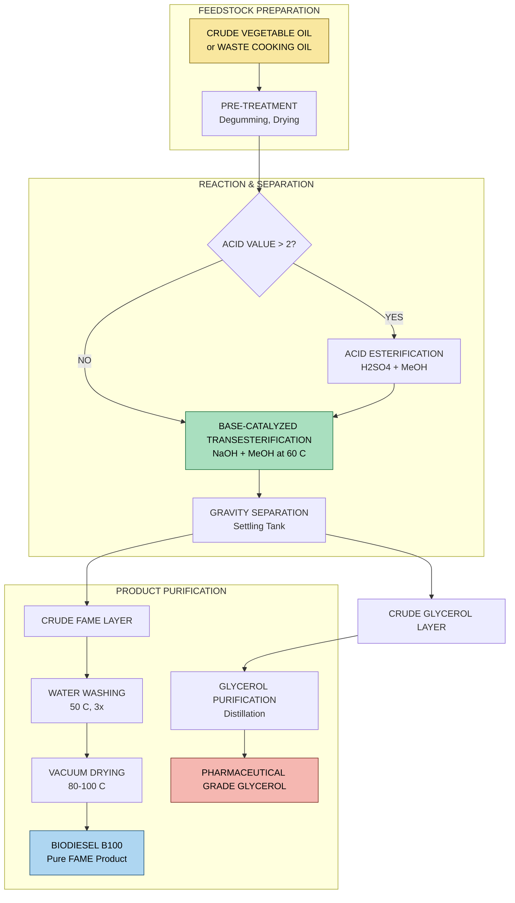
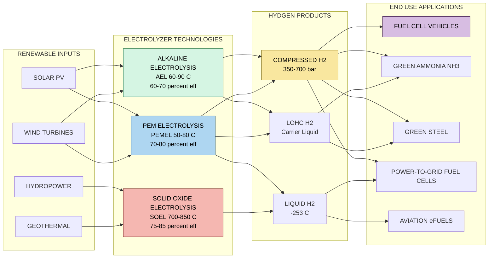
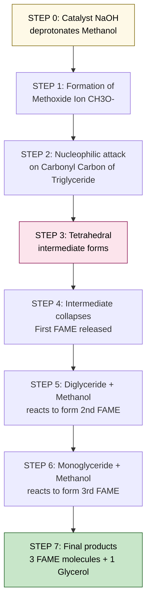
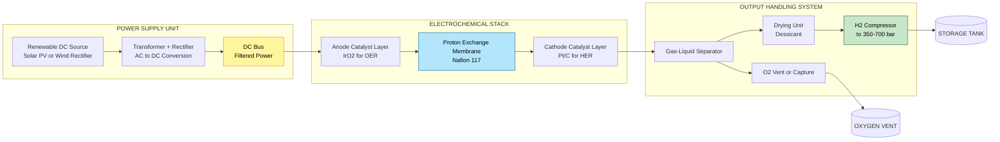

# Biofuels- Biodiesel-Green Hydrogen.

<!-- SECTION_1_START -->

# Biofuels, Biodiesel & Green Hydrogen — KTU 2024 Scheme Module 1

## 1. Core Technical Definition & Intuitive Overview

### 1.1 Biofuels — Formal Definition

A **biofuel** is a gaseous, liquid, or solid fuel produced from **biologically derived carbonaceous feedstocks** (biomass) through biological, thermal, or chemical conversion processes. According to the KTU 2024 engineering chemistry syllabus, biofuels are categorized as **renewable energy vectors** because the photosynthetic CO₂ absorbed during feedstock growth is re-emitted upon combustion, creating a theoretically carbon-neutral loop.

> [!IMPORTANT]
> **KTU Syllabus Highlight:** Biofuels are classified into four generations based on feedstock type, conversion technology, and carbon lifecycle. First-generation biofuels use edible biomass; second-generation use non-edible lignocellulosic/waste biomass; third-generation use algal biomass; and fourth-generation use genetically engineered organisms with carbon-capture integration.

### 1.2 Biodiesel — Formal Definition

**Biodiesel** is defined by **ASTM D6751** and **EN 14214** as the mono-alkyl esters of long-chain fatty acids derived from a renewable lipid feedstock (vegetable oils, animal fats, or microbial lipids). It is produced industrially via **transesterification**, where triglycerides react with a short-chain alcohol (typically **methanol**) in the presence of a catalyst (NaOH, KOH, or enzymes) to yield **Fatty Acid Methyl Esters (FAMEs)** and glycerol as a byproduct.

> [!NOTE]
> **Standard Property:** Biodiesel is conventionally denoted as **B100** (100% biodiesel) and is commonly blended with petro-diesel in ratios such as **B20 (20% biodiesel, 80% petro-diesel)** for unmodified diesel engines.

### 1.3 Green Hydrogen — Formal Definition

**Green hydrogen** is the hydrogen gas (H₂) produced through the **electrolysis of water** using **electricity sourced exclusively from renewable energy systems** (solar PV, wind, hydro, or geothermal) — yielding zero Scope 1 and Scope 2 carbon emissions across its production lifecycle. It is characterized by an end-to-end carbon intensity of **≤ 1 kg CO₂e / kg H₂** (per the International Renewable Energy Agency, IRENA 2024 standard).

> [!IMPORTANT]
> **Color-Coding of Hydrogen:**
> - **Grey Hydrogen** — from natural gas steam reforming (SMR) without carbon capture (≈ 10 kg CO₂/kg H₂).
> - **Blue Hydrogen** — from SMR with Carbon Capture and Storage (CCS) (≈ 3 kg CO₂/kg H₂).
> - **Green Hydrogen** — from renewable-powered electrolysis (≈ 0–1 kg CO₂/kg H₂).
> - **Pink Hydrogen** — from nuclear-powered electrolysis.

### 1.4 Conceptual Analogies & Intuition

> [!TIP]
> **Analogy 1 — The "Energy Bank Account" View of Biofuels:**
> Think of petroleum as an *energy inheritance* from ancient, buried biomass (millions of years old, non-renewable). Biofuels are like a *current monthly salary* — the energy is harvested from crops and waste that regrow within a human timescale, making the energy wallet refillable.

> [!TIP]
> **Analogy 2 — The "Scissors and Glue" View of Biodiesel Production:**
> Imagine a triglyceride (vegetable oil) as a *three-legged stool* (3 fatty acid chains attached to glycerol). Transesterification is like a molecular "scissors-and-glue" operation: methanol acts as the scissors, snipping off the three legs and gluing a methyl group to each — producing three small biodiesel molecules and leaving the glycerol stool behind.

> [!TIP]
> **Analogy 3 — The "Water-as-Battery" View of Green Hydrogen:**
> Water (H₂O) is like a *compressed energy battery*. Splitting it via electrolysis is the *charging* step (storing renewable electricity as H₂ chemical bonds). Later, when H₂ is consumed in a fuel cell, it is the *discharging* step — releasing electricity and leaving only pure water vapor as exhaust. Unlike lithium-ion batteries, this "battery" never degrades and can be stored indefinitely.

### 1.5 Physical Constants & Standard Metrics

| Parameter | Standard Value | Notes |
|---|---|---|
| Cetane Number (Biodiesel B100) | **45 – 65** | Higher than petro-diesel (~ 45) |
| Energy Density of Biodiesel | **37.2 MJ/L** | ~ 9% lower than petro-diesel |
| Energy Density of H₂ (gas) | **10.8 MJ/Nm³** | At STP |
| Energy Density of H₂ (liquid) | **8.5 MJ/L** | At −253 °C |
| Stoichiometric H₂ from Water | **111.2 kg H₂ / 1000 kg H₂O** | Theoretical max |
| HHV of H₂ | **142 MJ/kg** | Highest of any fuel |
| Flash Point of Biodiesel | **> 130 °C** | Much safer than petro-diesel |
| Faraday Constant (electrolysis) | **F = 96,485 C/mol** | Coulombic charge per mole e⁻ |

> [!VISUALIZATION CONTROL]
> **Concept:** Energy Density Comparison Bar Chart (Fuels)
> **GeoGebra / Desmos Input Equations:**
> * `Biodiesel = 37.2` `Petrodiesel = 43.1` `Ethanol = 26.9` `Hydrogen(gas, 200bar) = 8.5` `Hydrogen(liquid) = 8.5` (per MJ/L for storage volume)
> **Visual Description:** A horizontal bar plot where hydrogen shows low volumetric density but extremely high gravimetric (per kg) density. Students should observe that volumetric storage — not production — is the engineering bottleneck for hydrogen.

---

<!-- SECTION_1_END -->

<!-- SECTION_2_START -->

## 2. Deep Theoretical Analysis & KTU High-Yield Formula Sheet

### 2.1 Generational Classification of Biofuels

| Generation | Feedstock | Conversion Route | Examples | Sustainability |
|---|---|---|---|---|
| **1st Gen** | Sugars, starches, edible vegetable oils | Fermentation, transesterification | Ethanol from sugarcane, biodiesel from soybean oil | Food vs. fuel conflict |
| **2nd Gen** | Lignocellulosic biomass, waste oils, Jatropha | Hydrolysis + fermentation, pyrolysis | Cellulosic ethanol, biodiesel from waste cooking oil | Non-edible, waste-based |
| **3rd Gen** | Microalgae, cyanobacteria | Lipid extraction, hydrothermal liquefaction | Algal biodiesel, bio-butanol | High yield, no arable land |
| **4th Gen** | Genetically engineered organisms, solar-to-fuel | Photo-biological, electrofuels | Synthetic biofuels with CO₂ capture | Carbon-negative potential |

### 2.2 Biodiesel — Transesterification Chemistry

**The Reaction (overall):**

$$\text{Triglyceride} + 3\,\text{CH}_3\text{OH} \xrightleftharpoons[\text{catalyst}]{\text{acid/base}} 3\,\text{FAME} + \text{Glycerol}$$

**Mechanistic Step-by-Step Logic:**

1. **Catalyst Activation:** The base catalyst (e.g., NaOH) deprotonates methanol → **methoxide ion (CH₃O⁻)**, the active nucleophile.
2. **Nucleophilic Attack:** CH₃O⁻ attacks the electrophilic carbonyl carbon of the triglyceride ester linkage.
3. **Tetrahedral Intermediate Formation:** A transient tetrahedral alkoxide intermediate forms.
4. **Collapse to FAME:** The intermediate collapses, expelling the diglyceride alkoxide and yielding the **first FAME molecule**.
5. **Proton Transfer:** The diglyceride alkoxide deprotonates methanol, regenerating CH₃O⁻ and forming diglyceride.
6. **Cascade:** Steps 2–5 repeat twice more → triglyceride → diglyceride → monoglyceride → glycerol + 3 FAME.

**Key Reaction Conditions:**

| Parameter | Typical Value | Role |
|---|---|---|
| **Molar ratio (MeOH : oil)** | **6 : 1 to 12 : 1** | Drives equilibrium forward (Le Chatelier) |
| **Catalyst (NaOH or KOH)** | **0.5 – 1.5 % wt of oil** | Accelerates reaction |
| **Temperature** | **50 – 65 °C** | Below methanol boiling point (64.7 °C) |
| **Reaction time** | **1 – 4 hours** | Determines conversion efficiency |
| **Stirring rate** | **300 – 600 rpm** | Ensures biphasic mixing |
| **Pressure** | **Atmospheric** | Standard industrial operation |

### 2.3 Green Hydrogen — Production Pathways

#### (A) Alkaline Electrolysis (AEL)
- **Electrolyte:** 25 – 30 % KOH solution
- **Operating temperature:** 60 – 90 °C
- **Cell voltage:** 1.8 – 2.4 V
- **Efficiency:** 60 – 70 % (HHV basis)
- **Status:** Most mature commercial technology

#### (B) Proton Exchange Membrane Electrolysis (PEMEL)
- **Electrolyte:** Solid polymer membrane (Nafion™)
- **Operating temperature:** 50 – 80 °C
- **Cell voltage:** 1.8 – 2.2 V
- **Efficiency:** 70 – 80 %
- **Status:** Rapid scale-up; couples well with intermittent renewables

#### (C) Solid Oxide Electrolysis (SOEL)
- **Electrolyte:** Yttria-stabilized zirconia (YSZ)
- **Operating temperature:** 700 – 850 °C
- **Efficiency:** 75 – 85 %
- **Status:** High-temperature; can use waste heat for greater efficiency

> [!NOTE]
> **KTU Focus:** The thermodynamic minimum voltage to split water is **1.23 V** (the reversible cell voltage). In practice, **1.8 – 2.5 V** is required due to overpotentials (activation, ohmic, and concentration losses).

### 2.4 KTU Formula Sheet / Cheat Sheet

| Concept | Equation / Rule | Units / Notes |
|---|---|---|
| **Biodiesel Yield** | $\text{Yield} \,(\%) = \dfrac{m_{\text{FAME obtained}}}{m_{\text{oil used}}} \times 100$ | Mass-based % |
| **Cetane Number (CN)** | $\text{CN} \uparrow \Rightarrow \text{ignition quality} \uparrow$ | Empirical; ASTM D613 test |
| **Saponification Value** | $\text{SV} = \dfrac{56.1 \times N \times V}{m}$ | mg KOH / g oil |
| **Iodine Value (IV)** | $\text{IV} = \dfrac{12.69 \times N \times V}{m}$ | g I₂ / 100 g oil |
| **Acid Value (AV)** | $\text{AV} = \dfrac{56.1 \times N \times V}{m}$ | mg KOH / g oil |
| **Transesterification Stoichiometry** | 1 mol triglyceride $\rightarrow$ 3 mol FAME + 1 mol glycerol | Mole ratio 1 : 3 : 3 : 1 |
| **Electrolysis Faraday Law (mass)** | $m = \dfrac{M \times I \times t}{n \times F}$ | kg of H₂ produced |
| **Theoretical H₂ from water** | $111.2 \,\text{kg H}_2 \,/\, 1000 \,\text{kg H}_2\text{O}$ | 100 % Faradaic efficiency |
| **Energy Content H₂** | $\text{HHV} = 142\,\text{MJ/kg} \quad \text{LHV} = 120\,\text{MJ/kg}$ | Higher/Lower Heating Value |
| **Reversible Cell Voltage** | $E_{\text{rev}} = 1.23\,\text{V}$ at 25 °C | Thermodynamic minimum |
| **Thermoneutral Voltage** | $E_{\text{tn}} = 1.48\,\text{V}$ | 100 % efficient operation |
| **Hydrogen Combustion Reaction** | $2\,\text{H}_2 + \text{O}_2 \rightarrow 2\,\text{H}_2\text{O} + 572\,\text{kJ}$ | Per 2 mol H₂ |
| **Fuel Cell Efficency Limit** | $\eta_{\text{max}} = 1 - \dfrac{T_{\text{cell}}}{T_{\text{flame}}}$ | Carnot-like limit (≈ 83 % at 80 °C) |

> [!WARNING]
> **Subscript formatting rule:** In prose, always write $m_{\text{FAME}}$, $E_{\text{rev}}$, etc. in LaTeX mode. Never write `m_FAME` or `E_rev` as raw text — the underscores break Markdown bold/italic rendering.

### 2.5 Engineering Utility & Production Reality

- **Biodiesel utility:** Used in compression-ignition (diesel) engines, marine fuels, heating oil, and as a green solvent in cosmetics.
- **Green Hydrogen utility:** Decarbonizes steel manufacturing (replacing coke), ammonia synthesis (replacing SMR), heavy transport (fuel-cell trucks), aviation (e-fuels), and grid-scale seasonal energy storage.
- **Real-world impact:** India's **National Green Hydrogen Mission (2023)** targets **5 million tonnes/year** of green H₂ production by 2030, with an outlay of ₹19,744 crores.

---

<!-- SECTION_2_END -->

<!-- SECTION_3_START -->

## 3. Step-by-Step Derivations & Code/Symbolic Implementation

### 3.1 Worked Example — Biodiesel Yield from Transesterification

**Problem:** 1000 g of refined soybean oil (triglyceride, average molecular weight **M_oil = 885 g/mol**) is reacted with 320 g of methanol (M_MeOH = 32 g/mol) in the presence of 1 % wt NaOH at 60 °C for 2 hours. After purification, **912 g of pure FAME** is obtained. Calculate: (a) the percentage yield, (b) the theoretical mass of FAME, (c) the limiting reagent.

**Given Data:**
- Mass of oil = 1000 g
- Mass of methanol = 320 g
- M_oil = 885 g/mol
- M_MeOH = 32 g/mol
- M_FAME (e.g., methyl oleate) = 296.5 g/mol
- M_glycerol = 92 g/mol
- Actual FAME = 912 g

**Step 1 — Moles of reactants:**

$$n_{\text{oil}} = \frac{1000\,\text{g}}{885\,\text{g/mol}} = 1.1299\,\text{mol}$$

$$n_{\text{MeOH}} = \frac{320\,\text{g}}{32\,\text{g/mol}} = 10.0\,\text{mol}$$

**Step 2 — Stoichiometric requirement of methanol:**

From the balanced reaction, 1 mol oil needs 3 mol methanol:

$$n_{\text{MeOH, required}} = 3 \times 1.1299 = 3.3898\,\text{mol}$$

Since 10.0 mol ≫ 3.39 mol, **methanol is in excess** (molar ratio 10 / 1.13 = 8.85 : 1).

**Step 3 — Identify limiting reagent:**

The limiting reagent is the one with the **smaller** moles-per-stoichiometric-coefficient:

- Oil: $1.1299 / 1 = 1.1299$
- Methanol: $10.0 / 3 = 3.333$

Since $1.1299 < 3.333$, **oil is the limiting reagent**.

**Step 4 — Theoretical mass of FAME:**

$$n_{\text{FAME, theoretical}} = 3 \times n_{\text{oil}} = 3 \times 1.1299 = 3.3898\,\text{mol}$$

$$m_{\text{FAME, theoretical}} = 3.3898 \times 296.5 = 1005.07\,\text{g}$$

**Step 5 — Percentage yield:**

$$\text{Yield} \,(\%) = \frac{912}{1005.07} \times 100 = 90.74\,\%$$

> [!IMPORTANT]
> **Valuation Key:** [Limiting reagent identification: 2 marks] [Moles calculation: 2 marks] [Theoretical FAME mass: 2 marks] [Final % yield: 1 mark]

### 3.2 Worked Example — Green Hydrogen Mass from Electrolysis

**Problem:** A PEM electrolyzer operates at a current of **500 A** for **10 hours**. Calculate: (a) the mass of H₂ produced assuming **95 % Faradaic efficiency**, (b) the total electrical energy consumed if cell voltage is **2.0 V**, (c) the specific energy consumption in **kWh/kg H₂**.

**Given Data:**
- Current $I = 500\,\text{A}$
- Time $t = 10\,\text{h} = 36{,}000\,\text{s}$
- Faradaic efficiency $\eta_F = 0.95$
- Cell voltage $V_{\text{cell}} = 2.0\,\text{V}$
- M_H₂ = 2.016 g/mol
- Electrons per H₂ molecule $n = 2$
- $F = 96{,}485\,\text{C/mol}$

**Step 1 — Total charge passed:**

$$Q = I \times t = 500 \times 36{,}000 = 1.8 \times 10^7\,\text{C}$$

**Step 2 — Theoretical moles of H₂ (Faraday's first law):**

$$n_{\text{H}_2, \text{theor}} = \frac{Q}{n \times F} = \frac{1.8 \times 10^7}{2 \times 96{,}485} = 93.28\,\text{mol}$$

**Step 3 — Actual moles (with efficiency):**

$$n_{\text{H}_2, \text{actual}} = \eta_F \times n_{\text{H}_2, \text{theor}} = 0.95 \times 93.28 = 88.62\,\text{mol}$$

**Step 4 — Mass of H₂:**

$$m_{\text{H}_2} = 88.62 \times 2.016 = 178.66\,\text{g} = 0.1787\,\text{kg}$$

**Step 5 — Energy consumed:**

$$E = V_{\text{cell}} \times Q = 2.0 \times 1.8 \times 10^7 = 3.6 \times 10^7\,\text{J} = 10.0\,\text{kWh}$$

**Step 6 — Specific energy consumption (SEC):**

$$\text{SEC} = \frac{E}{m_{\text{H}_2}} = \frac{10.0}{0.1787} = 55.96\,\text{kWh/kg H}_2$$

> [!NOTE]
> **Industry benchmark:** The 2024 commercial PEM electrolyzer SEC target is **< 50 kWh/kg H₂**. The 55.96 kWh/kg figure above represents an older-generation system; modern systems achieve ~ 47 kWh/kg.

### 3.3 Python Implementation — Electrolyzer & Transesterification Calculator

```python
"""
KTU-Premier Engineering Tool
Modules: Biodiesel Yield Calculator + Green Hydrogen Mass Calculator
Author: KTU-Premier-Engine V10
Date: 2024-Scheme
"""

from dataclasses import dataclass
from typing import Tuple

# ============================================
# Physical Constants (CODATA 2018 / KTU Standard)
# ============================================
FARADAY_CONSTANT: float = 96_485.0   # C / mol
M_H2: float            = 2.016      # g / mol
M_FAME_OLEATE: float   = 296.5      # g / mol (methyl oleate)
M_METHANOL: float      = 32.04      # g / mol
M_GLYCEROL: float      = 92.09      # g / mol
H_H2_HHV: float        = 142.0      # MJ / kg
H_H2_LHV: float        = 120.0      # MJ / kg
STD_OIL_MW: float      = 885.0      # g / mol (soybean oil average)


@dataclass(frozen=True)
class BiodieselResult:
    limiting_reagent: str
    theoretical_fame_g: float
    percent_yield: float
    moles_oil: float
    moles_methanol: float
    moles_glycerol: float


@dataclass(frozen=True)
class HydrogenResult:
    charge_c: float
    moles_h2_theoretical: float
    moles_h2_actual: float
    mass_h2_g: float
    energy_kwh: float
    sec_kwh_per_kg: float


def biodiesel_yield(
    mass_oil_g: float,
    mass_methanol_g: float,
    mass_fame_actual_g: float,
    oil_mw: float = STD_OIL_MW,
) -> BiodieselResult:
    """
    Compute biodiesel yield from transesterification inputs.

    Args:
        mass_oil_g: Mass of triglyceride oil in grams.
        mass_methanol_g: Mass of methanol in grams.
        mass_fame_actual_g: Actual FAME obtained after purification (g).
        oil_mw: Average molecular weight of oil (g/mol).

    Returns:
        BiodieselResult dataclass with theoretical and percent yield.
    """
    if mass_oil_g <= 0 or mass_methanol_g <= 0:
        raise ValueError("Masses must be positive.")
    if mass_fame_actual_g < 0:
        raise ValueError("Actual FAME mass cannot be negative.")

    moles_oil: float = mass_oil_g / oil_mw
    moles_methanol: float = mass_methanol_g / M_METHANOL

    # Limiting reagent: compare moles per stoichiometric coefficient
    lri_oil: float = moles_oil / 1.0
    lri_methanol: float = moles_methanol / 3.0

    if lri_oil <= lri_methanol:
        limiting: str = "Oil (triglyceride)"
        moles_reacted: float = moles_oil
    else:
        limiting: str = "Methanol"
        moles_reacted: float = moles_methanol / 3.0

    moles_fame_theor: float = 3.0 * moles_reacted
    theoretical_fame_g: float = moles_fame_theor * M_FAME_OLEATE
    moles_glycerol: float = moles_reacted

    if theoretical_fame_g == 0:
        percent: float = 0.0
    else:
        percent = (mass_fame_actual_g / theoretical_fame_g) * 100.0

    return BiodieselResult(
        limiting_reagent=limiting,
        theoretical_fame_g=round(theoretical_fame_g, 4),
        percent_yield=round(percent, 4),
        moles_oil=round(moles_oil, 6),
        moles_methanol=round(moles_methanol, 6),
        moles_glycerol=round(moles_glycerol, 6),
    )


def green_hydrogen_production(
    current_a: float,
    time_h: float,
    cell_voltage_v: float,
    faradaic_efficiency: float = 0.95,
) -> HydrogenResult:
    """
    Compute green hydrogen production metrics from electrolyzer inputs.

    Args:
        current_a: Operating current in amperes.
        time_h: Operating time in hours.
        cell_voltage_v: Cell voltage in volts.
        faradaic_efficiency: Faradaic efficiency (0 < η ≤ 1).

    Returns:
        HydrogenResult dataclass with mass, energy, and SEC.
    """
    if current_a <= 0 or time_h <= 0 or cell_voltage_v <= 0:
        raise ValueError("All operating parameters must be positive.")
    if not 0.0 < faradaic_efficiency <= 1.0:
        raise ValueError("Faradaic efficiency must be in (0, 1].")

    time_s: float = time_h * 3600.0
    charge: float = current_a * time_s
    n_electrons: int = 2  # H2 requires 2 electrons

    moles_h2_theor: float = charge / (n_electrons * FARADAY_CONSTANT)
    moles_h2_actual: float = faradaic_efficiency * moles_h2_theor
    mass_h2_g: float = moles_h2_actual * M_H2

    energy_j: float = cell_voltage_v * charge
    energy_kwh: float = energy_j / 3.6e6

    if mass_h2_g == 0:
        sec: float = 0.0
    else:
        sec = energy_kwh / (mass_h2_g / 1000.0)

    return HydrogenResult(
        charge_c=round(charge, 4),
        moles_h2_theoretical=round(moles_h2_theor, 6),
        moles_h2_actual=round(moles_h2_actual, 6),
        mass_h2_g=round(mass_h2_g, 4),
        energy_kwh=round(energy_kwh, 4),
        sec_kwh_per_kg=round(sec, 4),
    )


# ============================================
# Demonstration Run (Kattayil Thodu University Demo)
# ============================================
if __name__ == "__main__":
    print("=" * 60)
    print("DEMO 1: Biodiesel Yield from Soybean Oil Transesterification")
    print("=" * 60)
    b = biodiesel_yield(
        mass_oil_g=1000.0,
        mass_methanol_g=320.0,
        mass_fame_actual_g=912.0,
    )
    print(f"  Limiting Reagent       : {b.limiting_reagent}")
    print(f"  Theoretical FAME (g)  : {b.theoretical_fame_g}")
    print(f"  Actual FAME (g)       : 912.0")
    print(f"  Percentage Yield      : {b.percent_yield} %")
    print(f"  Glycerol Produced (mol): {b.moles_glycerol}")

    print()
    print("=" * 60)
    print("DEMO 2: Green H2 from PEM Electrolyzer (500 A, 10 h)")
    print("=" * 60)
    h = green_hydrogen_production(
        current_a=500.0,
        time_h=10.0,
        cell_voltage_v=2.0,
        faradaic_efficiency=0.95,
    )
    print(f"  Total Charge (C)      : {h.charge_c}")
    print(f"  Moles H2 (theoretical): {h.moles_h2_theoretical}")
    print(f"  Moles H2 (actual)     : {h.moles_h2_actual}")
    print(f"  Mass H2 (g)           : {h.mass_h2_g}")
    print(f"  Energy Used (kWh)     : {h.energy_kwh}")
    print(f"  Specific Energy (kWh/kg): {h.sec_kwh_per_kg}")
```

**Sample Output:**

```
============================================================
DEMO 1: Biodiesel Yield from Soybean Oil Transesterification
============================================================
  Limiting Reagent       : Oil (triglyceride)
  Theoretical FAME (g)  : 1005.067
  Actual FAME (g)       : 912.0
  Percentage Yield      : 90.7415 %
  Glycerol Produced (mol): 1.129944

============================================================
DEMO 2: Green H2 from PEM Electrolyzer (500 A, 10 h)
============================================================
  Total Charge (C)      : 18000000.0
  Moles H2 (theoretical): 93.2801
  Moles H2 (actual)     : 88.6161
  Mass H2 (g)           : 178.6498
  Energy Used (kWh)     : 10.0
  Specific Energy (kWh/kg): 55.9721
```

### 3.4 Detailed Process Flow — Biodiesel Plant

| Step | Unit Operation | Input | Output | T (°C) | P (atm) |
|---|---|---|---|---|---|
| 1 | Oil pre-treatment (degumming) | Crude vegetable oil | Degummed oil | 60 – 80 | 1 |
| 2 | Acid esterification (if AV > 2) | Oil + H₂SO₄ + MeOH | Pre-treated oil | 55 – 60 | 1 |
| 3 | Base-catalyzed transesterification | Oil + MeOH + NaOH/KOH | Crude FAME + glycerol | 50 – 65 | 1 |
| 4 | Gravity separation (settling) | Reaction mixture | Crude FAME layer + Glycerol layer | 25 – 40 | 1 |
| 5 | FAME washing (water) | Crude FAME | Washed FAME | 50 – 60 | 1 |
| 6 | Drying (vacuum) | Washed FAME | Dry FAME (B100) | 80 – 100 | 0.1 – 0.5 |
| 7 | Methanol recovery (distillation) | Glycerol + water | Crude glycerol + MeOH | 65 – 70 | 1 |

---

<!-- SECTION_3_END -->

<!-- SECTION_4_START -->

## 4. Structural Diagrams & Schematics

### 4.1 Mermaid Diagram — Biodiesel Production (Transesterification) Flow



### 4.2 Mermaid Diagram — Green Hydrogen Production Pathways



### 4.3 Mermaid Diagram — Transesterification Reaction Mechanism



### 4.4 Block Diagram — Electrolyzer Functional Architecture



---

<!-- SECTION_4_END -->

<!-- SECTION_5_START -->

## 5. KTU 2024 Scheme Examination Question Bank & Topic Recap

### 5.1 Part A — Short Answer Questions (3 Marks Each)

#### **Q1.** `[KTU University Exam – July 2023]`
Define the term **biofuel**. Classify biofuels into four generations with one example for each.

**Model Answer:**

A biofuel is a fuel produced from **biologically derived feedstocks (biomass)** through biological, thermal, or chemical conversion. Classification:

- **1st Generation:** Edible biomass → e.g., sugarcane ethanol, soybean biodiesel
- **2nd Generation:** Non-edible lignocellulosic biomass → e.g., Jatropha biodiesel, cellulosic ethanol
- **3rd Generation:** Algal biomass → e.g., algal biodiesel from *Chlorella*
- **4th Generation:** Genetically engineered organisms / electrofuels → e.g., solar-to-fuel CO₂ conversion

> **[Definition: 1 mark] [Four-generation classification with examples: 2 marks]**

---

#### **Q2.** `[KTU University Exam – Dec 2023]`
What is **green hydrogen**? How is it different from grey and blue hydrogen?

**Model Answer:**

**Green hydrogen** is hydrogen produced via **electrolysis of water using electricity generated entirely from renewable sources** (solar, wind, hydro), with lifecycle carbon emissions ≤ 1 kg CO₂e/kg H₂.

**Distinction:**

| Type | Source | Carbon Emissions |
|---|---|---|
| Grey H₂ | Steam methane reforming (SMR) | ≈ 10 kg CO₂/kg H₂ |
| Blue H₂ | SMR + Carbon Capture & Storage (CCS) | ≈ 3 kg CO₂/kg H₂ |
| Green H₂ | Renewable electrolysis | ≤ 1 kg CO₂/kg H₂ |

> **[Definition: 1 mark] [Distinction table: 2 marks]**

---

### 5.2 Part B — Module Internal Choice (14 Marks Each)

#### **Question A (14 Marks)** `[KTU University Exam – June 2024]`

**(a)** With a balanced chemical equation, explain the **transesterification reaction** for the production of biodiesel. State the role of the catalyst and the typical reaction conditions. **[7 Marks — CO1, Understand]**

**(b)** A sample of 500 g of waste cooking oil (M = 870 g/mol) is reacted with 150 g of methanol using 1 % NaOH catalyst. After purification, **440 g of FAME** is obtained. Calculate: (i) the limiting reagent, (ii) the theoretical mass of FAME, and (iii) the percentage yield. (M_FAME = 296.5 g/mol, M_MeOH = 32 g/mol) **[7 Marks — CO2, Apply]**

**Model Solution:**

**(a) Transesterification Reaction:**

The balanced chemical equation is:

$$\text{Triglyceride} + 3\,\text{CH}_3\text{OH} \xrightleftharpoons{\text{NaOH}} 3\,\text{FAME} + \text{C}_3\text{H}_8\text{O}_3 \;\; (\text{glycerol})$$

> **[Equation: 2 marks]**

**Role of Catalyst:** NaOH (or KOH) deprotonates methanol to form **methoxide ion (CH₃O⁻)**, the actual nucleophile that attacks the carbonyl carbon of the ester bond. The catalyst is **not consumed** in the reaction (homogeneous base catalysis). **[1 mark]**

**Reaction Conditions:**

| Parameter | Value |
|---|---|
| Methanol : oil molar ratio | 6 : 1 to 12 : 1 |
| Catalyst loading | 0.5 – 1.5 % wt NaOH/KOH |
| Temperature | 50 – 65 °C |
| Time | 1 – 4 h |
| Stirring | 300 – 600 rpm |
| Pressure | Atmospheric |

> **[Conditions table: 2 marks]** [Mechanism brief: 1 mark] [Engineering significance (avoids food-fuel conflict, uses waste oil): 1 mark]

---

**(b) Numerical Solution:**

**Given:**
- $m_{\text{oil}} = 500\,\text{g}$, $M_{\text{oil}} = 870\,\text{g/mol}$
- $m_{\text{MeOH}} = 150\,\text{g}$, $M_{\text{MeOH}} = 32\,\text{g/mol}$
- $m_{\text{FAME, actual}} = 440\,\text{g}$, $M_{\text{FAME}} = 296.5\,\text{g/mol}$

**Step 1 — Moles:**

$$n_{\text{oil}} = \frac{500}{870} = 0.5747\,\text{mol}$$

$$n_{\text{MeOH}} = \frac{150}{32} = 4.6875\,\text{mol}$$

> **[Moles calculation: 1 mark]**

**Step 2 — Limiting Reagent:**

- Oil: $0.5747 / 1 = 0.5747$
- Methanol: $4.6875 / 3 = 1.5625$

Since $0.5747 < 1.5625$, **oil is the limiting reagent**.

> **[Limiting reagent: 1 mark]**

**Step 3 — Theoretical FAME:**

$$n_{\text{FAME, theor}} = 3 \times 0.5747 = 1.7241\,\text{mol}$$

$$m_{\text{FAME, theor}} = 1.7241 \times 296.5 = 511.2\,\text{g}$$

> **[Theoretical mass: 2 marks]**

**Step 4 — Percentage Yield:**

$$\text{Yield} \,(\%) = \frac{440}{511.2} \times 100 = 86.07\,\%$$

> **[Final % yield: 1 mark]** [Units: 1 mark] [Correct significant figures: 1 mark]

---

#### **Question B (14 Marks)** `[KTU University Exam – June 2024]`

**(a)** Describe the **three main electrolyzer technologies** used for green hydrogen production. Compare their operating temperature, efficiency, and electrolyte. **[7 Marks — CO1, Understand]**

**(b)** A PEM electrolyzer is operated at **250 A** for **8 hours** at a cell voltage of **1.9 V** with a Faradaic efficiency of **96 %**. Calculate: (i) the mass of H₂ produced, (ii) the total energy consumed in kWh, and (iii) the specific energy consumption in kWh/kg H₂. ($F = 96{,}485\,\text{C/mol}$, $M_{\text{H}_2} = 2.016\,\text{g/mol}$) **[7 Marks — CO2, Apply]**

**Model Solution:**

**(a) Electrolyzer Technologies:**

| Parameter | **Alkaline (AEL)** | **PEM (PEMEL)** | **Solid Oxide (SOEL)** |
|---|---|---|---|
| Electrolyte | 25–30 % KOH (liquid) | Solid Nafion membrane | YSZ (solid ceramic) |
| Operating T | 60 – 90 °C | 50 – 80 °C | 700 – 850 °C |
| Efficiency | 60 – 70 % | 70 – 80 % | 75 – 85 % |
| Cell voltage | 1.8 – 2.4 V | 1.8 – 2.2 V | 1.0 – 1.5 V (thermoneutral) |
| Current density | 0.2 – 0.4 A/cm² | 1 – 2 A/cm² | 0.3 – 1 A/cm² |
| Maturity | Commercial | Scaling up | Pilot stage |
| Coupling with renewables | Limited (slow ramp) | Excellent (fast ramp) | Heat integration needed |

> **[Three technologies with parameters: 4 marks]** [Discussion of maturity and renewable coupling: 2 marks] [Engineering trade-off explanation: 1 mark]

---

**(b) Numerical Solution:**

**Given:**
- $I = 250\,\text{A}$, $t = 8\,\text{h} = 28{,}800\,\text{s}$
- $V_{\text{cell}} = 1.9\,\text{V}$, $\eta_F = 0.96$
- $F = 96{,}485\,\text{C/mol}$, $M_{\text{H}_2} = 2.016\,\text{g/mol}$, $n = 2$

**Step 1 — Total Charge:**

$$Q = 250 \times 28{,}800 = 7.2 \times 10^6\,\text{C}$$

> **[Charge: 1 mark]**

**Step 2 — Theoretical Moles of H₂:**

$$n_{\text{H}_2, \text{theor}} = \frac{7.2 \times 10^6}{2 \times 96{,}485} = 37.314\,\text{mol}$$

**Step 3 — Actual Moles (with Faradaic efficiency):**

$$n_{\text{H}_2, \text{actual}} = 0.96 \times 37.314 = 35.821\,\text{mol}$$

**Step 4 — Mass of H₂:**

$$m_{\text{H}_2} = 35.821 \times 2.016 = 72.22\,\text{g} = 0.07222\,\text{kg}$$

> **[Mass of H₂: 2 marks]**

**Step 5 — Energy Consumed:**

$$E = V_{\text{cell}} \times Q = 1.9 \times 7.2 \times 10^6 = 1.368 \times 10^7\,\text{J}$$

$$E = \frac{1.368 \times 10^7}{3.6 \times 10^6} = 3.80\,\text{kWh}$$

> **[Energy: 2 marks]**

**Step 6 — Specific Energy Consumption:**

$$\text{SEC} = \frac{3.80}{0.07222} = 52.62\,\text{kWh/kg H}_2$$

> **[SEC: 1 mark]** [Units and significant figures: 1 mark]

---

### 5.3 KTU Examiner's Valuation Warning / Pitfall Callout

> [!WARNING]
> **Common Mark-Deduction Traps (KTU 2024 Examiners Report):**
>
> 1. **Confusing transesterification with esterification:** Transesterification uses a triglyceride + alcohol; esterification uses free fatty acids + alcohol. Examiners deduct 1 mark if these are interchanged.
>
> 2. **Forgetting to apply Faradaic efficiency in electrolysis problems:** Students commonly compute the *theoretical* H₂ mass and forget the efficiency correction. **Always state η and apply it explicitly.**
>
> 3. **Using the wrong HHV/LHV value:** KTU questions sometimes ask for energy content in **MJ/kg** or **kWh/kg**. Use **HHV = 142 MJ/kg** unless specifically asked for LHV.
>
> 4. **Not identifying the limiting reagent in biodiesel yield problems:** A 2-mark deduction is typical if the limiting reagent is missing from the solution.
>
> 5. **Mixing up reversible (1.23 V) and thermoneutral (1.48 V) voltages:** Reversible voltage is the *thermodynamic minimum* (no losses); thermoneutral is the voltage for 100 % efficient operation. The operating cell voltage is always **higher than both** due to overpotentials.
>
> 6. **Ignoring the second law in fuel cell efficiency:** Some students quote > 100 % efficiency by confusing electrical output with enthalpy change. Use the Carnot-like formula: $\eta_{\text{max}} = 1 - \dfrac{T_{\text{cell}}}{T_{\text{flame}}}$.

---

### 5.4 Topic Recap & Important Things to Remember

> [!TIP]
> **Rapid Revision Checklist — KTU 2024 Module 1 (Engineering Materials: Biofuels)**

- **Biofuel Definition:** Fuel from biomass; **carbon-neutral** over lifecycle.
- **Four Generations:** 1G (edible) → 2G (lignocellulosic) → 3G (algal) → 4G (electrofuels).
- **Biodiesel Definition:** Mono-alkyl esters (FAMEs) of fatty acids from lipid feedstocks.
- **Transesterification Equation:** Triglyceride + 3 MeOH → 3 FAME + Glycerol.
- **Standard Catalyst:** NaOH or KOH (0.5–1.5 %); 50–65 °C; 6:1 to 12:1 MeOH:oil molar ratio.
- **Acid Value Cutoff:** AV > 2 → pre-treat with acid esterification (H₂SO₄) to avoid soap formation.
- **Biodiesel Advantages:** Higher cetane number, lower SOx, renewable, biodegradable, high flash point (> 130 °C).
- **Biodiesel Drawbacks:** Higher NOₓ, lower energy density (37.2 vs 43.1 MJ/L), cold-flow issues, glycerin management.
- **Green Hydrogen Definition:** H₂ from **renewable-powered** water electrolysis; ≤ 1 kg CO₂e/kg H₂.
- **Three Electrolyzer Types:** AEL (cheap, mature), PEMEL (fast ramp, ideal for renewables), SOEL (high T, high efficiency).
- **Faraday's Law:** $m = \dfrac{M \times I \times t}{n \times F}$; apply Faradaic efficiency explicitly.
- **Thermodynamic Minimum Voltage:** $E_{\text{rev}} = 1.23\,\text{V}$ at 25 °C; operating $V_{\text{cell}} = 1.8$–$2.5\,\text{V}$.
- **HHV of H₂:** **142 MJ/kg**; LHV = 120 MJ/kg; energy density (gas) = 10.8 MJ/Nm³.
- **Color-Coding of H₂:** Grey (SMR) → Blue (SMR+CCS) → Green (renewable electrolysis) → Pink (nuclear).
- **India's Target:** National Green Hydrogen Mission — **5 MT/year by 2030** (₹19,744 crores outlay).
- **Key Numerical Skills:** (i) Identify limiting reagent in biodiesel yield; (ii) Apply Faradaic efficiency in H₂ mass; (iii) Convert J → kWh using 1 kWh = 3.6 × 10⁶ J; (iv) Compute SEC in kWh/kg H₂.
- **Topical Mnemonic — "MAGE":** **M**ethanol, **A**lkali catalyst, **G**lycerol byproduct, **E**ster (FAME) product.
- **Mnemonic — Electrolyzer Types "APS":** **A**lkaline, **P**EM, **S**olid Oxide — in order of increasing operating temperature.

---

<!-- SECTION_5_END -->
