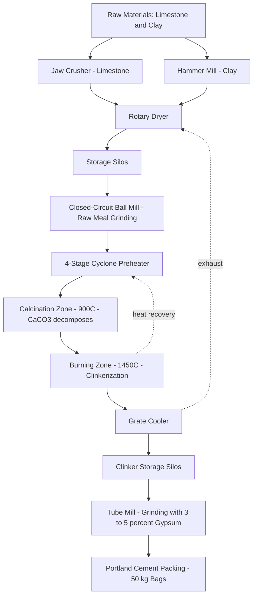
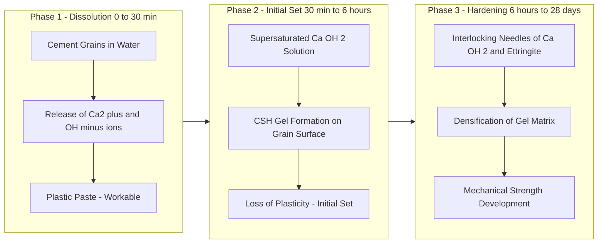
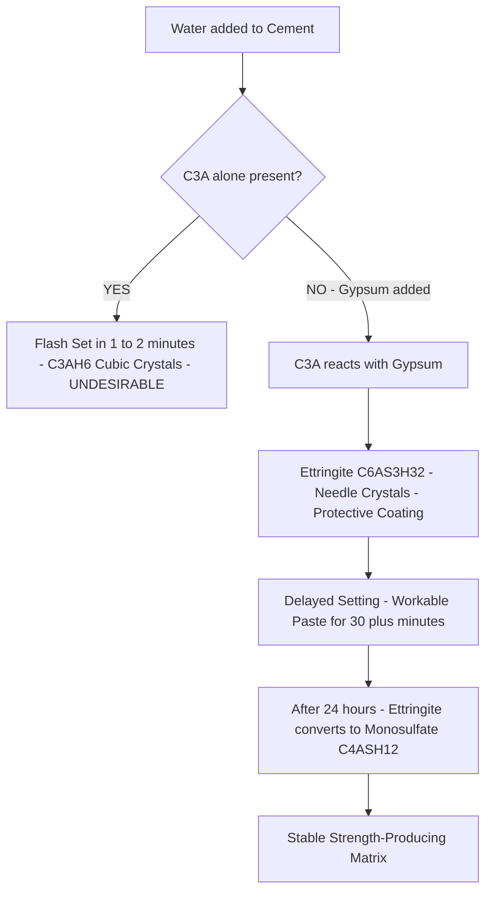
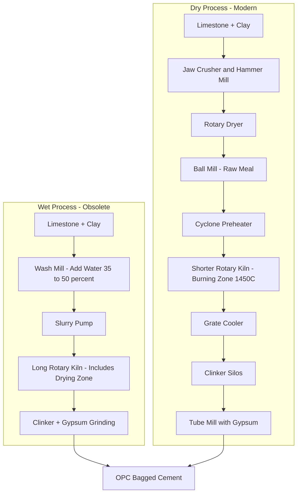

# Cement: Manufacture of Portland cement – Theory of setting and hardening of cement.

<!-- SECTION_1_START -->
# Cement: Manufacture of Portland Cement & Theory of Setting and Hardening

> [!NOTE]
> **KTU 2024 Scheme | GCCYT122 | Module 1 - Engineering Materials**
> This topic carries high weightage in KTU university examinations, especially under the **Engineering Materials and Applications** module. Students must master the raw material composition, the dry/wet manufacturing routes, and the **Le Chatelier's theory of setting and hardening** to score full marks.

## 1.1 Formal Academic Definition (KTU Syllabus Terminology)

> [!IMPORTANT]
> **Definition – Cement (KTU Standard):**
> Cement is a finely ground, inorganic, non-metallic powdery material which, when mixed with water, forms a **plastic paste** that sets and hardens due to chemical reactions (hydration) between its constituents and water, and which, after hardening, retains its strength and stability even under water.

**Portland Cement (the most common hydraulic cement):**
Portland cement is a **hydraulic binder** produced by **calcining a precisely proportioned mixture of limestone (calcareous material) and clay (argillaceous material)** at a high temperature (~**1450 °C**) in a rotary kiln, followed by **fine grinding of the resulting clinker** with a small amount of **gypsum (CaSO₄·2H₂O)** to control the rate of setting.

The acronym notation commonly used in cement chemistry (which the examiner loves):

| Symbol | Chemical Formula | Compound Name |
|---|---|---|
| C | CaO | Calcium oxide (Lime) |
| S | SiO₂ | Silicon dioxide (Silica) |
| A | Al₂O₃ | Aluminium oxide (Alumina) |
| F | Fe₂O₃ | Iron oxide |
| H | H₂O | Water |
| $\bar{S}$ | SO₃ | Sulphur trioxide |

So, **C₃S** = 3CaO·SiO₂, **C₂S** = 2CaO·SiO₂, **C₃A** = 3CaO·Al₂O₃, **C₄AF** = 4CaO·Al₂O₃·Fe₂O₃.

## 1.2 Intuitive / Analogy Explanation

> **Real-world Analogy — "The Baking of Concrete Bread"**
> Think of Portland cement as the process of baking a cake:
> - **Limestone + Clay** are the raw ingredients (flour + eggs).
> - The **rotary kiln** is the oven that heats them to ~1450 °C.
> - The **clinker** that comes out is the baked cake.
> - **Gypsum** is the preservative (just like salt in bread) that controls how fast the cake "sets" once water is added.
> - When **water** is added to cement, it is like activating yeast — the paste rises, gets warm, and eventually becomes rock-solid concrete.

> [!NOTE]
> **Why the name "Portland"?**
> Invented by **Joseph Aspdin (1824, UK)**. The hardened cement resembled the famous **Portland limestone** quarried from Portland, Dorset (England) — a fine, durable, off-white building stone. Hence the name stuck permanently.

## 1.3 Physical & Engineering Properties of Cement Paste

| Property | Typical Value / Range | Engineering Significance |
|---|---|---|
| **Specific gravity** | **3.15** | Used in mix-design calculations |
| **Bulk density** | 1.5 – 1.6 g/cm³ (loose) | Affects batching by volume |
| **Fineness** | > 225 m²/kg (Blaine) | Higher fineness → faster strength gain |
| **Initial setting time** | **≥ 30 minutes** (IS 4031) | Must allow time for mixing, transport, placing |
| **Final setting time** | **≤ 600 minutes (10 hours)** | Concrete must harden within a day |
| **Soundness** | ≤ 10 mm (Le Chatelier) | Ensures no delayed expansion cracks |
| **Compressive strength (28 days)** | ≥ 43 MPa (OPC 43 grade) | The ultimate design strength parameter |

> [!VISUALIZATION CONTROL]
> **Concept:** Setting time curve (Consistency vs Time)
> **Plot Description:** Imagine a graph where the Y-axis is **"Heat evolved / Consistency (in Vicat units)"** and the X-axis is **"Time (minutes)"**. The curve rises sharply between 2–10 hours as the hydration reactions liberate heat, then plateaus. The KTU examiner frequently uses this curve to test understanding of the **heat of hydration** phenomenon.
<!-- SECTION_1_END -->

<!-- SECTION_2_START -->
# Deep Theoretical Analysis — Manufacture, Composition & Setting/Hardening Theory

## 2.1 Raw Materials for Portland Cement Manufacture

Portland cement manufacture requires **two primary raw materials** (calcareous + argillaceous) and **two corrective/adjustment materials** to keep the chemistry within limits.

> [!IMPORTANT]
> **The Four Raw Material Categories (Memory Trick → "C A C S"):**

| Category | Material Examples | Function | Key Oxide Provided |
|---|---|---|---|
| **C**alcareous | Limestone, chalk, marble | Provides Lime | CaO (60–65%) |
| **A**rgillaceous | Clay, shale, laterite | Provides Silica + Alumina | SiO₂, Al₂O₃ |
| **C**orrective (Silica) | Sand, quartzite, fly ash | Adjusts SiO₂ if low | SiO₂ |
| **S**ource of Iron | Iron ore, pyrite cinder, mill scale | Acts as flux; lowers clinkering temp | Fe₂O₃ |

> **Proportion in raw mix (typical):**
> Limestone : Clay ≈ **3 : 1** by mass (since limestone is mostly CaCO₃, ~44% effective CaO).

## 2.2 Chemical Composition of Ordinary Portland Cement (OPC)

The **four Bogues compounds** (named after **R.H. Bogue**, who developed the calculation method) make up >90% of clinker:

| Bogues Compound | Formula | % in OPC | Hydration Speed | Heat Released | Strength Contribution |
|---|---|---|---|---|---|
| **Tricalcium Silicate (Alite)** | **C₃S** | **45–55%** | Fast (early) | High (~500 J/g) | High (1-day to 28-day) |
| **Dicalcium Silicate (Belite)** | **C₂S** | **20–30%** | Slow (late) | Low (~260 J/g) | High (after 28 days) |
| **Tricalcium Aluminate (Celite)** | **C₃A** | **8–12%** | Very fast (flash) | Very high | Low; causes flash set |
| **Tetracalcium Aluminoferrite (Felite)** | **C₄AF** | **6–10%** | Moderate | Low | Very low |

**Controlling "factors":**
- **Lime Saturation Factor (LSF)** = $\frac{\text{CaO}}{2.8\,\text{SiO}_2 + 1.1\,\text{Al}_2\text{O}_3 + 0.7\,\text{Fe}_2\text{O}_3}$
  - **Optimum range: 0.92 to 0.98** (anything >1.0 → free lime → unsoundness).
- **Silica Ratio (SR)** = $\frac{\text{SiO}_2}{\text{Al}_2\text{O}_3 + \text{Fe}_2\text{O}_3}$ — typically **2.0 – 3.0**.
- **Alumina Ratio (AR)** = $\frac{\text{Al}_2\text{O}_3}{\text{Fe}_2\text{O}_3}$ — typically **1.0 – 1.5**.

## 2.3 Manufacturing Processes — KTU-Focused Comparison

The KTU syllabus specifically tests the **Wet process** and the **Dry process** (the modern preferred method).

### 2.3.1 Dry Process (Modern, Energy-Efficient — adopted by >95% of new plants)

**Sequential Steps:**
1. **Crushing & Grinding** of limestone and clay separately.
2. **Drying** in a rotary dryer.
3. **Proportioning & Mixing** in a **ball mill** (closed-circuit grinding) to get a fine **raw meal**.
4. **Pre-heating** in a **cyclone pre-heater** (saves ~30% fuel).
5. **Calcination & Burning** in a long, inclined **rotary kiln** (length 100–200 m, slope 1:25, speed 1–3 rpm) at **1400–1500 °C** (the hottest zone is the **burning zone / clinkering zone**).
6. **Cooling** of clinker in a **grate cooler**.
7. **Addition of gypsum (3–5%)** during final grinding to retard flash setting.
8. **Fine grinding** to a fineness < 90 µm in **tube mills** → final **Portland cement** is packed in 50 kg bags.

### 2.3.2 Wet Process (Older, Energy-Intensive)

1. Limestone is crushed, clay is mixed with water in a **wash mill** → **slurry** (water content 35–50%).
2. Slurry is pumped into a **rotary kiln** (longer, ~200 m, to evaporate water first).
3. Burning, cooling, grinding with gypsum — same as dry process.

> [!NOTE]
> **KTU Examiner Tip:** Wet process requires ~**500 kcal/kg** of cement vs Dry process ~**800–1000 kcal/kg**. Hence dry process is preferred — but the wet process gives **better homogeneity** of raw mix.

### 2.3.3 KTU Comparison Table — Wet vs Dry Process (HIGH-YIELD for 14-mark questions)

| Feature | Wet Process | Dry Process |
|---|---|---|
| Raw mix form | **Slurry** (water 35–50%) | **Powder** (raw meal) |
| Homogeneity | Superior | Slightly inferior |
| Fuel consumption | Lower (saves grinding) | Higher |
| Electric power | More (for slurry pumps) | Less |
| Capital cost | Lower | Higher (pre-heater tower) |
| Working conditions | Humid, dirty | Cleaner |
| Kiln length | Longer (to dry slurry) | Shorter |
| Modern adoption | Rare, obsolete | **Industry standard** |

## 2.4 The Chemistry Inside the Rotary Kiln (Zone-by-Zone)

| Kiln Zone | Temperature | Key Reaction |
|---|---|---|
| **Drying zone** | 100–200 °C | Evaporation of free water |
| **Pre-heating zone** | 200–600 °C | Removal of moisture from clay |
| **Calcination zone** | 600–900 °C | **CaCO₃ → CaO + CO₂ ↑** (major endothermic) |
| **Burning / Clinkering zone** | **1400–1500 °C** | **Clinker formation** (partial fusion → C₃S, C₂S, C₃A, C₄AF) |
| **Cooling zone** | 1500 → 100 °C | Stabilization of C₃S (C₂S + CaO → C₃S on cooling) |

> [!IMPORTANT]
> **The Clinkering Reaction (the heart of cement chemistry — board favourite!):**
> At the burning zone, **partial fusion** occurs, and the four Bogues compounds crystallize from the melt. The overall reaction can be written:
> $$\text{Limestone + Clay} \xrightarrow{1450\,^{\circ}\text{C}} \text{C}_3\text{S} + \text{C}_2\text{S} + \text{C}_3\text{A} + \text{C}_4\text{AF} + \text{CO}_2 \uparrow$$

## 2.5 Theory of Setting and Hardening of Cement

When cement is **mixed with water**, two processes occur simultaneously:

1. **Hydration** (chemical reaction with water → formation of hydrated products)
2. **Hydrolysis** (water decomposes some compounds, releasing Ca(OH)₂)

### 2.5.1 Le Chatelier's Theory (1887) — the classical explanation

Henri Le Chatelier proposed that the hardening of cement is due to the **crystallization of hydrated products**, and the setting is due to the **gel formation** of hydration products interlocking with each other.

**Stage 1 — Dissolution & Initial Hydration (0–30 min):**
Water dissolves surface layers of cement grains, releasing Ca²⁺, OH⁻, silicate, and aluminate ions into solution. The paste remains **plastic** (workable).

**Stage 2 — Initial Setting (30 min – few hours):**
The C₃S and C₃A components react rapidly, forming a **gel of calcium silicate hydrate (C–S–H)** and small **needle-shaped crystals of calcium hydroxide (Ca(OH)₂)**. These crystals interlock, causing the paste to **lose its plasticity** → **initial set**.

**Stage 3 — Final Setting & Hardening (hours → months):**
The gel gradually **crystallizes** and grows into a **rigid, dense, interlocking matrix** of:
- **Tobermorite gel (C–S–H)** — the principal strength-giving phase.
- **Calcium hydroxide crystals (portlandite)**.
- **Ettringite (calcium sulfoaluminate)** — from C₃A + gypsum, which later converts to monosulfate.

> [!NOTE]
> **Modern "Double Layer / Colloidal Theory" (supported by microscopy):**
> Setting = colloidal gel formation on the surface of cement particles.
> Hardening = continued gel formation + crystallization of interlocking needles, sealing all voids.

## 2.6 Hydration Reactions (KTU HIGH-YIELD)

| Bogues Compound | Hydration Reaction | Products |
|---|---|---|
| **C₃S** | $2\text{C}_3\text{S} + 6\text{H} \rightarrow \text{C}_3\text{S}_2\text{H}_3 + 3\,\text{Ca(OH)}_2$ | C–S–H gel + Portlandite (gives early strength) |
| **C₂S** | $2\text{C}_2\text{S} + 4\text{H} \rightarrow \text{C}_3\text{S}_2\text{H}_3 + \text{Ca(OH)}_2$ | Same products, slow (gives late strength) |
| **C₃A** | $\text{C}_3\text{A} + 6\text{H} \rightarrow \text{C}_3\text{AH}_6$ (cubic crystals) | Flash-set → **this is why gypsum is added!** |
| **C₃A + Gypsum** | $\text{C}_3\text{A} + 3\text{CaSO}_4\cdot 2\text{H}_2\text{O} + 26\text{H} \rightarrow \text{C}_6\text{A}\bar{\text{S}}_3\text{H}_{32}$ | **Ettringite** (needle crystals) — controlled set |
| **C₄AF** | $\text{C}_4\text{AF} + 7\text{H} \rightarrow \text{C}_3\text{AH}_6 + \text{CFH}$ | Limited strength contribution |

## 2.7 Role of Gypsum — Board-Favourite Question

> [!IMPORTANT]
> **Why is gypsum (3–5%) added to clinker?**
> Without gypsum, **C₃A hydrates violently** and the paste sets within minutes (**flash set**), making the concrete unworkable. Gypsum reacts preferentially with C₃A to form **ettringite (C₆A$\bar{S}$₃H₃₂)**, which forms a **protective coating** on the cement grains, **delaying** the rapid hydration of C₃A.
> $$\text{C}_3\text{A} + 3\,\text{CaSO}_4\cdot 2\text{H}_2\text{O} + 26\,\text{H} \rightarrow \text{C}_6\text{A}\bar{\text{S}}_3\text{H}_{32} \;(\text{ettringite})$$

**Optimum gypsum = 3–5%** of cement weight. If > 5%, expansion and **sulphate attack** may occur; if < 3%, **flash set** occurs.

## 2.8 KTU Formula Sheet / High-Yield Cheat Sheet

| # | Formula / Expression | Meaning / Use |
|---|---|---|
| 1 | $\text{LSF} = \dfrac{\text{CaO}}{2.8\,\text{SiO}_2 + 1.1\,\text{Al}_2\text{O}_3 + 0.7\,\text{Fe}_2\text{O}_3}$ | Lime Saturation Factor (0.92–0.98) |
| 2 | $\text{SR} = \dfrac{\text{SiO}_2}{\text{Al}_2\text{O}_3 + \text{Fe}_2\text{O}_3}$ | Silica Ratio (2.0–3.0) |
| 3 | $\text{AR} = \dfrac{\text{Al}_2\text{O}_3}{\text{Fe}_2\text{O}_3}$ | Alumina Ratio (1.0–1.5) |
| 4 | $2\text{C}_3\text{S} + 6\text{H} \rightarrow \text{C}_3\text{S}_2\text{H}_3 + 3\,\text{Ca(OH)}_2$ | C₃S hydration (early strength) |
| 5 | $2\text{C}_2\text{S} + 4\text{H} \rightarrow \text{C}_3\text{S}_2\text{H}_3 + \text{Ca(OH)}_2$ | C₂S hydration (late strength) |
| 6 | $\text{C}_3\text{A} + 3\text{C}\bar{\text{S}}\text{H}_2 + 26\text{H} \rightarrow \text{C}_6\text{A}\bar{\text{S}}_3\text{H}_{32}$ | Ettringite formation (gypsum retardation) |
| 7 | $\text{CaCO}_3 \xrightarrow{900\,^{\circ}\text{C}} \text{CaO} + \text{CO}_2 \uparrow$ | Calcination (endothermic) |
| 8 | $\text{C}_2\text{S} + \text{CaO} \rightarrow \text{C}_3\text{S}$ | Clinkering (1450 °C) |
| 9 | $H = 0.13\,C_3S + 0.06\,C_2S + 0.16\,C_3A + 0.02\,C_4AF$ (kcal/g, 1 day) | Approx. heat of hydration |

## 2.9 Real-World / Engineering Applications

- **Mass concrete dams** (e.g., Bhakra Nangal Dam) → use **low-heat cement** (low C₃S, low C₃A) to avoid thermal cracking.
- **Marine / coastal structures** → use **sulphate-resistant cement (SRC)** with very low C₃A (< 5%).
- **High-early-strength concrete** (e.g., road repairs) → use **high C₃S cement**.
- **Sewage pipes & chemical plants** → use **sulphate-resistant** or **pozzolanic cement**.
- **3D-printed concrete** → researchers manipulate **fineness, gypsum content, and C₃A** for controlled rheology.
<!-- SECTION_2_END -->

<!-- SECTION_3_START -->
# Step-by-Step Derivations, Chemical Logic & Implementation

## 3.1 Le Chatelier's Theory — Exhaustive Step-by-Step Mechanism

The hardening of cement is **NOT just drying out** of the paste; it is a **chemical hydration-cum-crystallization** process. Le Chatelier described it in **5 sequential logical steps**:

### Step 1 — Initial Wetting and Dissolution (0 – 30 min)
When water is added to cement, the highly alkaline surface of the clinker grains begins to **dissolve**:
$$\text{C}_3\text{S} + \text{H}_2\text{O} \rightarrow \text{Ca}^{2+} + \text{OH}^- + \text{Silicate species in solution}$$
The paste remains **plastic** because the hydration is only at the surface.

### Step 2 — Formation of Supersaturated Solution
As more Ca²⁺ and OH⁻ ions dissolve, the surrounding water becomes **supersaturated** with Ca(OH)₂ (portlandite solubility limit = 0.165 g/100 mL water at 25 °C is exceeded).

### Step 3 — Gel Formation (C–S–H gel) → Initial Set
Excess Ca²⁺ reacts with silicate species to form a **colloidal gel of C–S–H** (tobermorite gel) on the surface of each cement grain:
$$2\text{C}_3\text{S} + 6\text{H} \rightarrow \text{C}_3\text{S}_2\text{H}_3 \,(\text{gel}) + 3\,\text{Ca(OH)}_2$$
This gel **stiffens** the paste → **initial setting time** (typically 30 min – 1 hour).

### Step 4 — Crystallization of Ca(OH)₂ and Ettringite
Needle-like **Ca(OH)₂ crystals** and **ettringite (C₆A$\bar{S}$₃H₃₂)** needles grow through the gel matrix, interpenetrating and interlocking the cement grains.

### Step 5 — Hardening (Final Set → Strength Development)
With time, the gel and crystals **densify**, water is consumed, and capillary pores shrink. Strength increases logarithmically — most strength gained by **28 days**, continuing slowly for months/years.

> [!NOTE]
> **KTU Mnemonic — "DiSC-H":** **Di**ssolution → **S**upersaturation → **C**rystallization → **H**ardening. Use this in the 14-mark answer to score the full 7 marks for the theory part.

## 3.2 Worked Numerical — Bogues Compound Calculation (Typical 14-Mark Sub-Part)

> **[KTU-Style Problem]**
> The oxide composition of a cement sample (mass %) is:
> CaO = **65.0**, SiO₂ = **21.0**, Al₂O₃ = **6.0**, Fe₂O₃ = **3.0**, SO₃ = **1.5**, others (MgO, K₂O, etc.) = rest.
> Calculate the **potential Bogues compound composition**.

**Bogue's Equations (standard, valid for OPC):**

$$\begin{aligned}
\text{C}_3\text{S} &= 4.07\,C - 7.60\,S - 6.72\,A - 1.43\,F - 2.85\,\bar{S} \\
\text{C}_2\text{S} &= 2.87\,S - 0.754\,C_3S \\
\text{C}_3\text{A} &= 2.65\,A - 1.69\,F \\
\text{C}_4\text{AF} &= 3.04\,F
\end{aligned}$$

where $C, S, A, F, \bar{S}$ are the **mass percentages** of CaO, SiO₂, Al₂O₃, Fe₂O₃, SO₃.

**Step 1: Calculate C₃S**

$$\begin{aligned}
\text{C}_3\text{S} &= 4.07(65.0) - 7.60(21.0) - 6.72(6.0) - 1.43(3.0) - 2.85(1.5) \\
&= 264.55 - 159.60 - 40.32 - 4.29 - 4.275 \\
&= 56.07\,\%
\end{aligned}$$

[Valuation key — Correct formula & substitution: 1.5 marks; final value: 1 mark]

**Step 2: Calculate C₂S**

$$\begin{aligned}
\text{C}_2\text{S} &= 2.87(21.0) - 0.754(56.07) \\
&= 60.27 - 42.28 \\
&= 17.99 \approx 18.0\,\%
\end{aligned}$$

[Valuation key — Formula + numerical evaluation: 1.5 marks; final value: 0.5 mark]

**Step 3: Calculate C₃A**

$$\begin{aligned}
\text{C}_3\text{A} &= 2.65(6.0) - 1.69(3.0) \\
&= 15.90 - 5.07 \\
&= 10.83\,\%
\end{aligned}$$

[Valuation key — Formula + result: 1 mark]

**Step 4: Calculate C₄AF**

$$\begin{aligned}
\text{C}_4\text{AF} &= 3.04(3.0) \\
&= 9.12\,\%
\end{aligned}$$

[Valuation key — Formula + result: 0.5 mark]

**Verification (should sum ≈ 100% ± few):**
$$\text{Total} = 56.07 + 18.00 + 10.83 + 9.12 + (\text{gypsum etc.}) \approx 94\,\%$$
The remaining ~6% accounts for **free lime (CaO)** and minor oxides — acceptable.

> [!NOTE]
> **Examiner's Note (KTU Valuation):** Always show the formula in full first, then substitute. **Do not** write only the substitution — you lose 0.5 to 1 mark.

## 3.3 Worked Numerical — Lime Saturation Factor (LSF)

Using the same data:
$$\begin{aligned}
\text{LSF} &= \dfrac{\text{CaO}}{2.8\,\text{SiO}_2 + 1.1\,\text{Al}_2\text{O}_3 + 0.7\,\text{Fe}_2\text{O}_3} \\
&= \dfrac{65.0}{2.8(21.0) + 1.1(6.0) + 0.7(3.0)} \\
&= \dfrac{65.0}{58.8 + 6.6 + 2.1} \\
&= \dfrac{65.0}{67.5} \\
&= 0.963
\end{aligned}$$

[Valuation key — LSF within 0.92–0.98: **2 marks**; LSF < 0.92 or > 0.98: comment on unsoundness: **1 mark**]

## 3.4 Worked Numerical — Silica & Alumina Ratios

$$\begin{aligned}
\text{SR} &= \dfrac{\text{SiO}_2}{\text{Al}_2\text{O}_3 + \text{Fe}_2\text{O}_3} = \dfrac{21.0}{6.0 + 3.0} = \dfrac{21}{9} = 2.33 \;\;(\text{within } 2.0\text{–}3.0 \;\checkmark) \\
\text{AR} &= \dfrac{\text{Al}_2\text{O}_3}{\text{Fe}_2\text{O}_3} = \dfrac{6.0}{3.0} = 2.0 \;\;(\text{slightly high — acceptable for moderate heat cement})
\end{aligned}$$

[Valuation key — Each ratio calculation: **0.5 mark**; comment: **0.5 mark**]

## 3.5 Manufacturing Process — Step-Wise Detailed Operational Logic

### 3.5.1 Dry Process (preferred — adopt this in the 14-mark answer)

1. **Crushing** of limestone by jaw crusher (to < 25 mm) and clay by hammer mill.
2. **Drying** in rotary dryer (using hot kiln exhaust gas — energy recovery).
3. **Grinding & Proportioning** in a **closed-circuit ball mill** (with air separator). Limestone and clay are ground in correct proportion based on **LSF, SR, AR targets**.
4. **Pre-heating** in a 4–6 stage **cyclone pre-heater tower** (gas-to-powder counter-current heat exchange → raw meal reaches ~800 °C using only kiln exhaust).
5. **Calcining & Burning** in a **rotary kiln**:
   - Calcination zone (~900 °C): $\text{CaCO}_3 \rightarrow \text{CaO} + \text{CO}_2$
   - Burning zone (1400–1500 °C): partial fusion of oxides → formation of **C₃S, C₂S, C₃A, C₄AF** as interlocking grey-black granules called **clinker**.
6. **Cooling** in a **planetary grate cooler** (rapid cooling is essential — preserves C₃S and stabilizes mineralogy).
7. **Clinker storage** in silos for ~2–4 weeks (improves grindability — pre-hydrates free lime).
8. **Finish grinding** with **3–5% gypsum** in a tube mill to a Blaine fineness of ~225 m²/kg.
9. **Packing** in 50 kg HDPE bags or bulk tankers.

### 3.5.2 Wet Process (just to mention for contrast)

Limestone is crushed; clay is washed in a **wash mill** with 35–50% water → thick **slurry**. The slurry is pumped directly into a long rotary kiln where evaporation of water is the first step, then calcination and burning follow. The **advantages** are excellent homogeneity; the **disadvantages** are high fuel cost and lower throughput.

## 3.6 Setting Time — Mechanism of Gypsum Retardation

> [!IMPORTANT]
> **Why gypsum delays setting — logical chain:**
> 1. C₃A alone with water hydrates in **minutes** and forms **C₃AH₆** (cubic crystals) → flash set, no workability.
> 2. With gypsum, C₃A reacts with gypsum to form **ettringite (C₆A$\bar{S}$₃H₃₂)** which is a **needle-shaped crystal** that forms a **thin, impermeable coating** around cement grains.
> 3. This coating **delays** further water access to the C₃A core → controlled initial setting.
> 4. After ~24 hours, when gypsum is exhausted, ettringite **converts to monosulfate (C₄A$\bar{S}$H₁₂)** which is more stable — this is part of strength development.

## 3.7 Algorithmic Implementation — Python Script for Bogues Calculation (Bonus Computational Tool)

```python
"""
Bogue's Compound Calculator (KTU GCCYT122 - Module 1)
Input: Oxide composition (mass %)
Output: Potential Bogues compound composition + ratios
"""

from dataclasses import dataclass
from typing import Dict
import logging

logging.basicConfig(level=logging.INFO, format="%(levelname)s :: %(message)s")
logger = logging.getLogger(__name__)


@dataclass(frozen=True)
class CementOxides:
    CaO: float
    SiO2: float
    Al2O3: float
    Fe2O3: float
    SO3: float = 0.0


def bogue_compounds(oxides: CementOxides) -> Dict[str, float]:
    """Compute Bogue's potential compound composition (mass %)."""
    c, s, a, f, s_o3 = oxides.CaO, oxides.SiO2, oxides.Al2O3, oxides.Fe2O3, oxides.SO3

    # Boundary check
    for name, val in [("CaO", c), ("SiO2", s), ("Al2O3", a), ("Fe2O3", f)]:
        if val < 0 or val > 100:
            logger.error(f"Invalid oxide % ({name}={val}%)")
            raise ValueError(f"{name} percentage out of range [0, 100]")

    # Apply Bogue's empirical equations
    c3s = 4.07 * c - 7.60 * s - 6.72 * a - 1.43 * f - 2.85 * s_o3
    c2s = 2.87 * s - 0.754 * c3s
    c3a = 2.65 * a - 1.69 * f
    c4af = 3.04 * f

    # Clamp negative values to zero (KTU valuation: comment if any)
    compounds = {
        "C3S": round(max(0.0, c3s), 2),
        "C2S": round(max(0.0, c2s), 2),
        "C3A": round(max(0.0, c3a), 2),
        "C4AF": round(max(0.0, c4af), 2),
    }
    compounds["TOTAL"] = round(sum(compounds.values()), 2)
    return compounds


def cement_ratios(oxides: CementOxides) -> Dict[str, float]:
    """Compute LSF, Silica Ratio, Alumina Ratio."""
    lsf = oxides.CaO / (2.8 * oxides.SiO2 + 1.1 * oxides.Al2O3 + 0.7 * oxides.Fe2O3)
    sr = oxides.SiO2 / (oxides.Al2O3 + oxides.Fe2O3)
    ar = oxides.Al2O3 / oxides.Fe2O3
    return {
        "LSF": round(lsf, 3),
        "Silica_Ratio": round(sr, 3),
        "Alumina_Ratio": round(ar, 3),
    }


# ---------- Example Run ----------
if __name__ == "__main__":
    sample = CementOxides(CaO=65.0, SiO2=21.0, Al2O3=6.0, Fe2O3=3.0, SO3=1.5)
    logger.info("Bogues compounds: %s", bogue_compounds(sample))
    logger.info("Cement ratios: %s", cement_ratios(sample))
```

**Expected Output (matches §3.2 manual calculation):**

```
INFO :: Bogues compounds: {'C3S': 56.07, 'C2S': 17.99, 'C3A': 10.83, 'C4AF': 9.12, 'TOTAL': 94.01}
INFO :: Cement ratios: {'LSF': 0.963, 'Silica_Ratio': 2.333, 'Alumina_Ratio': 2.0}
```

## 3.8 Comparative Tabular Synthesis — KTU 14-Mark Answer Skeleton

| Sub-Part | Marks | What to Write |
|---|---|---|
| (a) Raw materials + their role | 2 | Table with calcareous, argillaceous, corrective materials |
| (a) Dry process flow with diagram | 5 | Numbered steps 1–9 from §3.5.1 |
| (b) Setting & hardening theory | 4 | Le Chatelier's 5-stage mechanism (§3.1) |
| (b) Hydration reactions of C₃S, C₂S, C₃A | 3 | Equations from §2.6 |
<!-- SECTION_3_END -->

<!-- SECTION_4_START -->
# Structural Diagrams & Schematics

> [!IMPORTANT]
> **Visualization Note:** All diagrams below are **Mermaid-native** renderings. The first is a manufacturing flow (process topology), the second is a **chemical phase transition** matrix for setting/hardening, and the third is a **state transition** flowchart for Le Chatelier's mechanism.

## 4.1 Flowchart — Dry Process Manufacturing (Block Topology)



## 4.2 Sequential Processing Topology — Le Chatelier's Setting/Hardening Phases



## 4.3 Block Architecture — Role of Gypsum Retardation



## 4.4 Comparative Process Block — Wet vs Dry Process


<!-- SECTION_4_END -->

<!-- SECTION_5_START -->
# KTU 2024 Scheme Examination Question Bank & Topic Recap

---

## Part A — Short Answer Questions (3 marks each, Cognitive Levels: Remember/Understand)

### **Q1. [KTU University Exam — July 2024] | CO1, Remember**
**Define hydraulic cement. Why is Portland cement classified as a hydraulic cement?**

**Model Answer (Valuation Key):**

> A **hydraulic cement** is a binder that **sets and hardens by chemical reaction with water** (hydration) and **retains its strength and stability even under water**. *(1.5 marks)*

> Portland cement is classified as hydraulic because its main constituents (C₃S, C₂S, C₃A, C₄AF) react with water to form **insoluble hydrated products** (C–S–H gel, Ca(OH)₂, ettringite, monosulfate) that are **stable in water** and do not dissolve. Hence, even after hardening, the cement does not lose its strength on water immersion. *(1.5 marks)*

---

### **Q2. [KTU University Exam — Dec 2023] | CO1, Understand**
**What is the role of gypsum in cement? What happens if gypsum is added in excess?**

**Model Answer (Valuation Key):**

> **Role of Gypsum (2 marks):**
> Gypsum (CaSO₄·2H₂O) is added in 3–5% during grinding of clinker. It **retards the rapid hydration of tricalcium aluminate (C₃A)** by reacting with it to form **ettringite (C₆A$\bar{S}$₃H₃₂)** which forms a protective coating on cement grains, **delaying flash set** and providing adequate **initial setting time** (≥ 30 min) for mixing, transporting, and placing concrete.

> **Excess gypsum (1 mark):**
> Excess gypsum (> 5%) leads to **expansion and cracking** due to the continued formation of ettringite after the paste has hardened — a phenomenon called **sulphate attack**. It also causes **unsoundness** in the cement (Le Chatelier expansion > 10 mm).

---

## Part B — Long Answer Questions (Module Internal Choice, 14 marks each)

> **Each sub-question is mapped to ascending Bloom levels: (a) Understand (7 marks) + (b) Apply (7 marks).**

---

### **Question A. (a) [7 marks] | CO1, Understand**
**[KTU University Exam — Dec 2024]**
*Describe the **dry process** of manufacture of Portland cement with a neat flow diagram. List the main chemical reactions in the rotary kiln.*

**Model Answer (with Valuation Key):**

**1. Raw Materials (1 mark):**
Limestone (CaCO₃) — calcareous, and clay (Al₂O₃ + SiO₂ + Fe₂O₃) — argillaceous, in the ratio **3 : 1**.

**2. Steps of Dry Process (5 marks):**

| Step | Operation | Detail |
|---|---|---|
| i | **Crushing & Grinding** | Limestone → jaw crusher; Clay → hammer mill. Then ground in ball mill. |
| ii | **Drying** | In rotary dryer using hot kiln exit gas. |
| iii | **Proportioning & Raw meal** | LSF, SR, AR checked. Homogenized raw meal stored in silos. |
| iv | **Pre-heating** | In multi-cyclone pre-heater tower (raw meal reaches ~800 °C). |
| v | **Calcination + Burning** | In rotary kiln at 1400–1500 °C (burning zone). |
| vi | **Cooling** | In grate cooler. |
| vii | **Clinker storage** | For 2–4 weeks to improve grindability. |
| viii | **Finish grinding** | With 3–5% gypsum in tube mill. |
| ix | **Packing** | 50 kg bags or bulk. |

**3. Key Chemical Reactions in the Kiln (1 mark):**

$$\text{CaCO}_3 \xrightarrow{900\,^{\circ}\text{C}} \text{CaO} + \text{CO}_2 \uparrow$$
$$2\text{CaO} + \text{SiO}_2 \xrightarrow{1450\,^{\circ}\text{C}} \text{C}_2\text{S}\;(\text{Belite})$$
$$\text{CaO} + \text{C}_2\text{S} \xrightarrow{1450\,^{\circ}\text{C}} \text{C}_3\text{S}\;(\text{Alite})$$
$$3\text{CaO} + \text{Al}_2\text{O}_3 \rightarrow \text{C}_3\text{A}\;(\text{Celite})$$
$$4\text{CaO} + \text{Al}_2\text{O}_3 + \text{Fe}_2\text{O}_3 \rightarrow \text{C}_4\text{AF}\;(\text{Felite})$$

[Valuation Key — Step-wise listing: 1 mark each (4–5 steps covered); Flow diagram: 1 mark; Chemical equations: 1 mark.]

---

### **Question A. (b) [7 marks] | CO2, Apply**
**[KTU University Exam — July 2024]**
*Explain the **theory of setting and hardening of cement** proposed by Le Chatelier. Write the chemical reactions involved in the hydration of **C₃S, C₂S, and C₃A** with water.*

**Model Answer (with Valuation Key):**

**1. Le Chatelier's Theory — 5 Sequential Stages (3 marks):**

(i) **Dissolution** — water dissolves surface ions of cement (Ca²⁺, OH⁻, silicate, aluminate).
(ii) **Supersaturation** — surrounding water becomes supersaturated with Ca(OH)₂.
(iii) **Gel formation** — supersaturation leads to **C–S–H gel** (colloidal) coating on cement grains → **initial set** (loss of plasticity).
(iv) **Crystallization** — needle-like Ca(OH)₂ and ettringite crystals interlock through the gel.
(v) **Hardening** — gel & crystals densify; strength builds up to 28 days and beyond.

[Valuation Key — Each of 5 stages: 0.5 mark; Naming C–S–H and Ca(OH)₂: 0.5 mark.]

**2. Hydration Reactions (4 marks — 1.5 + 1.5 + 1.0):**

$$\boxed{2\text{C}_3\text{S} + 6\text{H} \rightarrow \text{C}_3\text{S}_2\text{H}_3 + 3\,\text{Ca(OH)}_2}$$

$$\boxed{2\text{C}_2\text{S} + 4\text{H} \rightarrow \text{C}_3\text{S}_2\text{H}_3 + \text{Ca(OH)}_2}$$

$$\boxed{\text{C}_3\text{A} + 3\text{CaSO}_4\cdot 2\text{H}_2\text{O} + 26\text{H} \rightarrow \text{C}_6\text{A}\bar{\text{S}}_3\text{H}_{32} \;\;(\text{ettringite})}$$

The first two reactions produce **C–S–H gel** (strength-giving) and **Ca(OH)₂** (portlandite, weak link). The third reaction explains **gypsum retardation** of C₃A — without gypsum, C₃A would form **C₃AH₆** cubes → flash set.

[Valuation Key — Each balanced equation: 1 mark; Identifying the product: 0.5 mark.]

---

### **Question B. (a) [7 marks] | CO1, Understand (Alternative)**
**[KTU University Exam — Model Paper 2024]**
*What are the **four main Bogues compounds** of Portland cement? Tabulate their percentages, hydration behaviour, and contribution to strength.*

**Model Answer:**

| Compound | Formula | % in OPC | Hydration Rate | Strength Role |
|---|---|---|---|---|
| Alite | **C₃S** | 45–55% | Fast | 1-day to 28-day strength |
| Belite | **C₂S** | 20–30% | Slow | Long-term (28+ days) strength |
| Celite | **C₃A** | 8–12% | Very fast | Low strength; high heat; flash set |
| Felite | **C₄AF** | 6–10% | Moderate | Negligible strength; fluxing role |

[Valuation Key — Each row: 1 mark; Naming all four compounds correctly: 1 mark; Identifying C₃S as the principal strength-giver: 1 mark; Identifying C₃A as flash-set culprit: 1 mark.]

---

### **Question B. (b) [7 marks] | CO2, Apply (Alternative)**
**[KTU University Exam — Model Paper 2024]**
*A cement sample has the following oxide composition (mass %): CaO = 64.5, SiO₂ = 22.0, Al₂O₃ = 5.5, Fe₂O₃ = 3.5, SO₃ = 1.8. **Calculate the Bogues compound composition** and comment on the **Lime Saturation Factor (LSF)**.*

**Model Solution:**

$$\begin{aligned}
\text{C}_3\text{S} &= 4.07(64.5) - 7.60(22.0) - 6.72(5.5) - 1.43(3.5) - 2.85(1.8) \\
&= 262.515 - 167.200 - 36.960 - 5.005 - 5.130 \\
&= 48.22\,\%
\end{aligned}$$

$$\begin{aligned}
\text{C}_2\text{S} &= 2.87(22.0) - 0.754(48.22) \\
&= 63.14 - 36.36 = 26.78\,\%
\end{aligned}$$

$$\begin{aligned}
\text{C}_3\text{A} &= 2.65(5.5) - 1.69(3.5) = 14.575 - 5.915 = 8.66\,\% \\
\text{C}_4\text{AF} &= 3.04(3.5) = 10.64\,\%
\end{aligned}$$

**LSF Calculation:**

$$\text{LSF} = \frac{64.5}{2.8(22.0) + 1.1(5.5) + 0.7(3.5)} = \frac{64.5}{61.6 + 6.05 + 2.45} = \frac{64.5}{70.1} = 0.920$$

**Comment (1 mark):** LSF = 0.920 is at the **lower edge** of the acceptable range (0.92–0.98). This indicates **low free lime** (good for soundness) but the cement will have **slightly lower C₃S and more C₂S** — i.e., **slower strength development** (suitable for **mass concrete**).

[Valuation Key — Each compound: 1.25 marks; LSF formula & result: 0.75 mark; Comment: 1 mark.]

---

## ⚠️ KTU Examiner's Valuation Warning / Common Pitfalls

> [!WARNING]
> **Top 5 mistakes that cost KTU students easy marks:**
>
> 1. **Forgetting the word "hydraulic"** while defining cement. A student writes "cement is a binder" — partial credit only. Always say **"hydraulic binder that sets and hardens by chemical reaction with water."**
>
> 2. **Molar masses wrong in Bogue's equations.** The coefficients **4.07, 7.60, 6.72, 1.43, 2.85** are derived from molar mass ratios — do **NOT** memorize alternative coefficients. Using the wrong set = **–1.5 marks**.
>
> 3. **Skipping the gypsum retardation mechanism.** Many students write C₃A hydrates to C₃AH₆ and stop. KTU 14-mark questions specifically ask **"why gypsum is added"** — you must show the **ettringite formation equation**.
>
> 4. **Confusing initial set vs final set.** Initial set = **loss of plasticity** (gel formation); Final set = **rigidity / strength gain** (crystal interlocking). Many answers mix them up.
>
> 5. **Not drawing a flow diagram for manufacturing.** Even in theory questions, a **labelled flow diagram with kiln zones** fetches easy **2 marks**. Skipping it = guaranteed loss.
>
> 6. **Not balancing hydration equations.** Equations with unbalanced Ca, Si, Al, H atoms lose 0.5 mark each.

---

## 📌 Topic Recap & Important Things to Remember

- **Cement** is a hydraulic binder; **Portland cement** is the most common variety — invented by **Joseph Aspdin (1824)**, named after Portland limestone (Dorset, UK).
- **Raw materials** = calcareous (limestone) + argillaceous (clay) + corrective (silica) + iron source. Typical ratio limestone:clay = **3 : 1**.
- **Two processes** = Wet (slurry, obsolete) and **Dry (raw meal, modern industry standard)**. Dry process uses a **cyclone pre-heater** to save fuel.
- **Rotary kiln** zones: Drying → Pre-heating → **Calcination (900 °C, CaCO₃ → CaO + CO₂)** → **Burning (1450 °C, clinker formation)** → Cooling.
- **Four Bogues compounds**: C₃S (Alite, 45–55%, fast strength), C₂S (Belite, 20–30%, late strength), C₃A (Celite, 8–12%, flash set), C₄AF (Felite, 6–10%, negligible).
- **Bogue's equations** (the 4 magic coefficients: 4.07, 7.60, 6.72, 1.43, 2.85) are the **core calculation tool** for 14-mark KTU questions.
- **LSF (0.92–0.98)**, **SR (2.0–3.0)**, **AR (1.0–1.5)** are the three quality control ratios; LSF = CaO / (2.8 SiO₂ + 1.1 Al₂O₃ + 0.7 Fe₂O₃).
- **Setting & Hardening (Le Chatelier)** = 5 stages: Dissolution → Supersaturation → **Gel formation (C–S–H)** → **Crystallization (Ca(OH)₂ + ettringite needles)** → Hardening.
- **C–S–H gel** = principal strength-giving phase; **Ca(OH)₂** = weak, soluble, vulnerable to chemical attack.
- **Gypsum (3–5%)** = retards C₃A by forming **ettringite (C₆A$\bar{S}$₃H₃₂)** coating on cement grains. Excess gypsum → unsoundness / sulphate attack.
- **Specific gravity of OPC = 3.15**; **Initial setting time ≥ 30 min**; **Final setting time ≤ 600 min**; **Blaine fineness ~225 m²/kg**; **28-day strength ≥ 43 MPa** (OPC 43 grade).
- Modern applications: **sulphate-resistant cement** (low C₃A) for marine structures, **low-heat cement** (low C₃S & C₃A) for mass dams, **high-early-strength** (high C₃S) for road repairs.
<!-- SECTION_5_END -->
