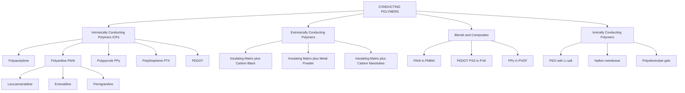
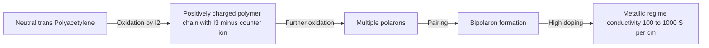
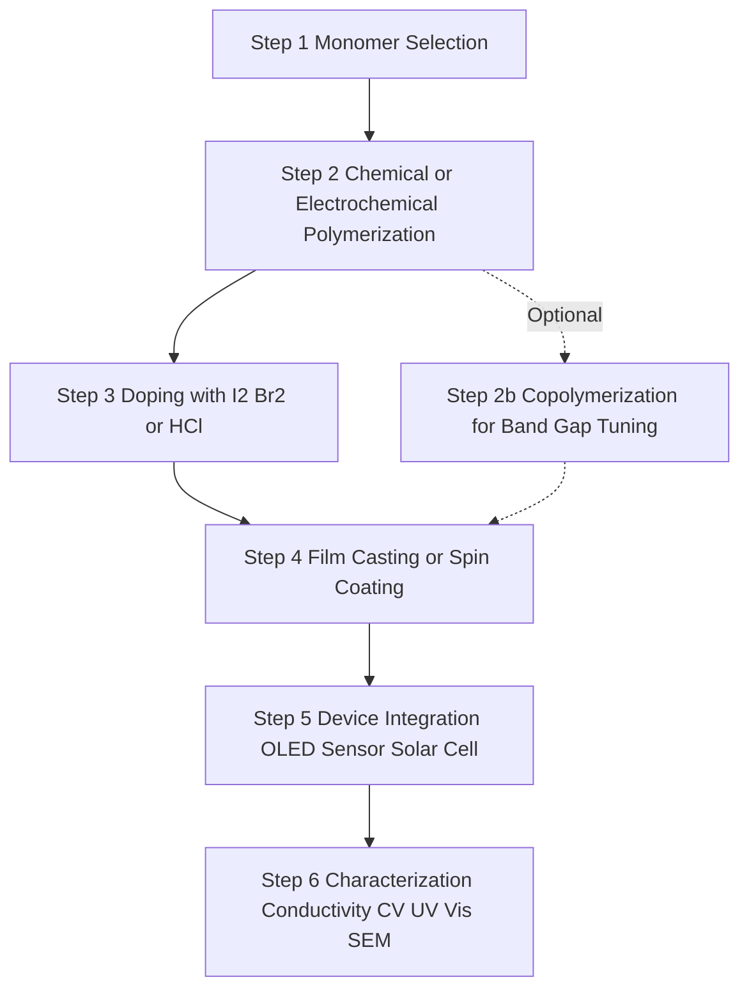
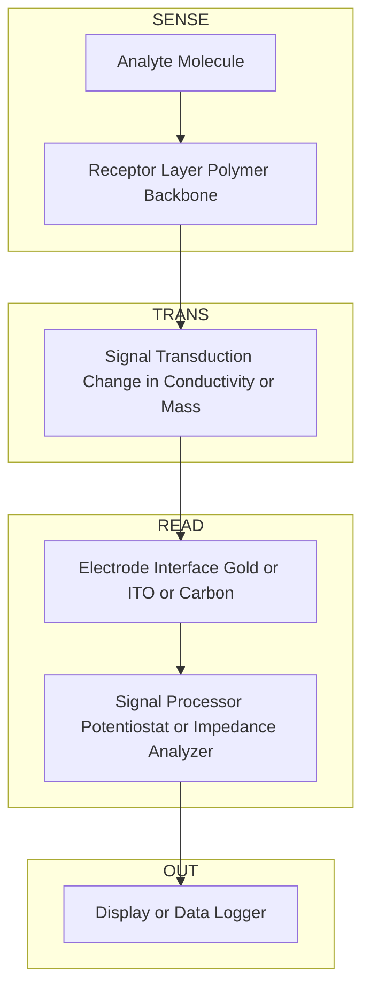
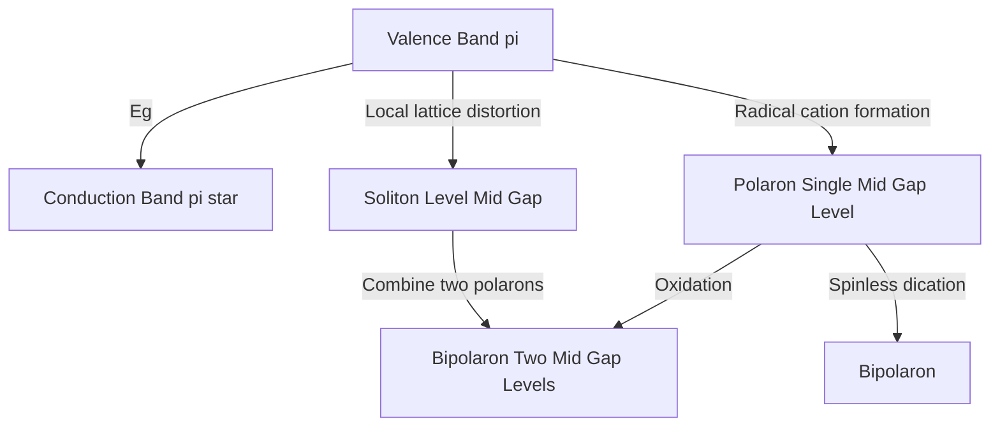

# Conducting Polymers- Classification – Application

<!-- SECTION_1_START -->

# Conducting Polymers — Classification and Applications

## 1.1 Formal Academic Definition (KTU 2024 Syllabus Terminology)

> [!IMPORTANT]
> **Conducting Polymers (CPs)** are a unique class of *organic macromolecules* that exhibit **electrical conductivity** in the range of **$10^{-10}$ to $10^{5}$ S/cm**, bridging the gap between traditional insulators (polymers like polyethylene, $\sigma \approx 10^{-14}$ S/cm) and metallic conductors (copper, $\sigma \approx 10^{5}$ S/cm). They are characterized by an **extended $\pi$-conjugated backbone** (alternating single and double bonds) that allows delocalization of charge carriers along the polymer chain.

The KTU 2024 module (GCCYT122 / Module 1) specifically highlights the following benchmark polymers:

| Polymer | Abbreviation | Conductivity Range (S/cm) |
|---|---|---|
| Polyacetylene | PA | $10^{-5}$ to $10^{3}$ |
| Polyaniline | PANI | $10^{-10}$ to $10^{2}$ |
| Polypyrrole | PPy | $10^{-5}$ to $10^{2}$ |
| Polythiophene | PTh | $10^{-5}$ to $10^{2}$ |
| Poly(3,4-ethylenedioxythiophene) | PEDOT | $10^{-3}$ to $10^{4}$ |

## 1.2 Conceptual Analogy — The "Highway of Electrons" Intuition

> [!NOTE]
> **Analogy: A Metallic Highway Built on a Plastic Skeleton**
> Imagine a long, skinny plastic rod (a normal polymer) — it is a perfect electrical insulator because its electrons are locked tightly inside covalent bonds, like cars parked in private garages. Now imagine unzipping the garages and merging them into a continuous *conjugated highway* of alternating single and double bonds. The $\pi$-electrons can now move *freely along the chain*, like cars cruising on a highway. Furthermore, if we "dope" the polymer (add tiny amounts of oxidizing/reducing agents), we remove or add electrons, creating *positive holes* or *negative polarons* that act like additional lanes, dramatically boosting traffic (conductivity).

The three engineering-critical features that make CPs revolutionary are:

1. **Processability like a plastic** (flexible, lightweight, thin-film formable)
2. **Conductivity approaching a metal** (after doping)
3. **Tunable optoelectronic properties** (band-gap engineering via monomer modification)

> [!TIP]
> **Why does KTU emphasize this topic?** Because the 2024 NEP-aligned B.Tech syllabus treats conducting polymers as a *gateway concept* linking fundamental chemistry (band theory, redox, $\pi$-conjugation) with next-generation engineering applications in **flexible electronics, wearable sensors, and renewable energy devices**.

## 1.3 Fundamental Conduction Mechanism — The Peierls Distortion & Band Model

In conventional polymers, every carbon is $sp^3$ hybridized (saturated, e.g., polyethylene), so a wide energy gap exists between the **valence band** and the **conduction band** — hence they are insulators.

In a *conjugated polymer*, alternate carbons are $sp^2$ hybridized, leaving one unhybridized $p_z$ orbital per carbon. These $p_z$ orbitals overlap sideways to form a **delocalized $\pi$-molecular orbital system** extending along the entire backbone. This creates a quasi-one-dimensional electronic band.

The chain **never remains as perfectly equal alternating bonds** — it undergoes a *Peierls distortion* (lattice dimerization), producing alternating *short* (double-bond-like) and *long* (single-bond-like) segments, opening a small but finite **band gap ($E_g$)**.

$$\boxed{E_g = E_{\text{LUMO}} - E_{\text{HOMO}} \quad (\text{typically } 1\text{–}4 \text{ eV})}$$

**Doping** (chemical or electrochemical) injects charge carriers that *eliminate* the Peierls gap locally, generating mobile **solitons, polarons, and bipolarons** that travel along the conjugated chain.

> [!VISUALIZATION CONTROL]
> **Concept:** Band structure of a conjugated polymer vs. a saturated polymer
> **Desmos Input Equations:**
> * For insulator: piecewise constant with wide gap, e.g. $E_{\text{val}}(x) = 0$ for $x \in [-5, -1]$, $E_{\text{gap}} = 8$ eV plateau in middle, $E_{\text{cond}}(x) = 9$ for $x \in [1, 5]$
> * For doped CP: shallow gap ~1.5 eV mid-region with mid-gap polaron level
> **Visual Description:** A wide insulating plateau vs. a narrow valley with a localized mid-gap state (the polaron) sitting inside it.

---

<!-- SECTION_1_END -->

<!-- SECTION_2_START -->

# Deep Theoretical Analysis & KTU High-Yield Knowledge Sheet

## 2.1 Why Conventional Polymers are Insulators (The $sp^3$ Argument)

In a saturated polymer such as *polyethylene* ($-\text{CH}_2-\text{CH}_2-$), every carbon is $sp^3$ hybridized:

* 4 strong $\sigma$-bonds per carbon
* No unhybridized $p$-orbitals available
* $\sigma$-bonds are *localized* between two atoms
* Therefore, **no pathway** exists for electron delocalization
* Result: $E_g \approx 8$ eV (insulator)

In a conjugated polymer such as *polyacetylene* ($-\text{CH}=\text{CH}-\text{CH}=\text{CH}-$), the carbon atoms are $sp^2$ hybridized:

* 3 $\sigma$-bonds + 1 unhybridized $p_z$ orbital per carbon
* Sideways overlap of $p_z$ orbitals creates an extended $\pi$-cloud
* Electrons in the $\pi$-cloud are *delocalized*
* Result: $E_g \approx 1.5$ eV (semiconductor / tunable conductor)

## 2.2 Doping — The Heart-Method of Switching Polymers "ON"

Doping in conducting polymers is **not** the same as doping in silicon. It is a **redox process** that removes (oxidation, *p-type*) or adds (reduction, *n-type*) electrons from/to the $\pi$-system.

### 2.2.1 p-Type Doping (Oxidative)
* Polymer chain loses an electron
* A **radical cation** is formed → this is a *polaron*
* Two polarons may combine to form a *bipolaron* (dication with local lattice distortion)
* Common dopants: $\text{I}_2$, $\text{Br}_2$, $\text{FeCl}_3$, $\text{NOPF}_6$

$$\text{Polymer} + \text{Oxidant} \longrightarrow \text{Polymer}^{+\bullet} + \text{Reduced Oxidant}$$

### 2.2.2 n-Type Doping (Reductive)
* Polymer chain gains an electron
* A **radical anion** is formed → also a polaron
* Common dopants: alkali metals (Na, K), naphthalenide salts

$$\text{Polymer} + \text{Reductant} \longrightarrow \text{Polymer}^{-\bullet} + \text{Oxidised Reductant}$$

> [!IMPORTANT]
> **Doping Levels in Conducting Polymers**
> Doping is typically done at **0.1 % to 30 % molar ratio** of dopant per monomer unit. This is *orders of magnitude* higher than silicon doping (parts per million), because each charge must be compensated by a counter-ion that physically enters the polymer matrix.

## 2.3 Charge Carriers: Solitons, Polarons, Bipolarons

| Carrier | Description | Schematic |
|---|---|---|
| **Soliton** | Domain wall separating two degenerate ground states (only in *trans*-polyacetylene). Carries charge *and* spin. | Neutral soliton = radical; charged soliton = cation/anion (spinless) |
| **Polaron** | A radical ion + local lattice distortion. Energy level lies *within* the band gap. | Half-filled mid-gap state |
| **Bipolaron** | Two like charges + larger lattice distortion. Two empty/filled mid-gap states. | Spinless, diamagnetic |

## 2.4 KTU Formula & Concept Cheat Sheet

| Concept / Parameter | Expression / Value | Units / Notes |
|---|---|---|
| Conductivity range of CPs | $\sigma \in [10^{-10}, 10^{5}]$ | S/cm |
| Typical band gap (undoped CP) | $E_g \approx 1.5 - 3.5$ | eV |
| Conductivity relation | $\sigma = n \, q \, \mu$ | where $n$ = carrier density, $q$ = charge, $\mu$ = mobility |
| Doping ratio | $y = \text{mol dopant per mol monomer}$ | typically $0.001 \le y \le 0.3$ |
| Effective conjugation length | $L_c$ | $\pi$-electron delocalization length, governs $E_g$ |
| Soliton energy | $E_s \approx \frac{2 \Delta_0}{\pi}$ | where $\Delta_0$ is the Peierls gap parameter |
| Resistivity (inverse of $\sigma$) | $\rho = 1 / \sigma$ | $\Omega \cdot \text{cm}$ |
| Activation energy (Arrhenius) | $\sigma(T) = \sigma_0 \exp(-E_a / 2 k_B T)$ | $k_B = 8.617 \times 10^{-5}$ eV/K |
| Dimensionality of conjugation | quasi-1-D | governs anisotropic conductivity |

> [!IMPORTANT]
> **Engineering relevance:** This $\sigma = n q \mu$ relation is the *single most important* equation. KTU examiners love asking: *"On increasing the doping level, does $n$ increase while $\mu$ decreases? Justify."* The correct answer is **YES** — at low doping, $n$ rises faster than $\mu$ falls, so $\sigma$ increases; at very high doping, defect scattering dominates and $\mu$ drops sharply, capping $\sigma$.

## 2.5 Classification of Conducting Polymers (KTU High-Yield Module)

### A. Structural / Compositional Classification

> [!NOTE]
> **The KTU Module specifically lists four classes:**

**1. Intrinsically Conducting Polymers (ICPs)**
* Conjugated backbone gives intrinsic conductivity
* No additives needed at the conceptual level, but *doping is required* to reach metallic regime
* Examples: PA, PANI, PPy, PTh, PEDOT, PPP (poly-*p*-phenylene)

**2. Doped Conducting Polymers**
* ICPs that have undergone *chemical* or *electrochemical* doping
* The same ICP can span **insulator → semiconductor → metal** with controlled doping
* Example: Iodine-doped polyacetylene

**3. Extrinsically Conducting Polymers**
* Ordinary insulating polymer matrix (e.g., polyethylene, PVC, epoxy) loaded with conductive fillers (carbon black, graphite, metal powders, carbon nanotubes)
* Conductivity percolates when filler forms a continuous network
* Percolation threshold $\phi_c$ typically $5$ to $15$ vol\%

**4. Blends and Composites**
* ICP blended with a processable insulating polymer
* Example: PANI/PMMA, PEDOT:PSS
* Combines mechanical strength of the host with electronic function of the guest

### B. Charge-Transport Mechanism Classification

| Class | Charge Transport | Examples |
|---|---|---|
| Conjugated $\pi$-polymers | $\pi$-electron delocalization + polaron/bipolaron hopping | PA, PANI, PPy, PTh |
| Charge-transfer complexes | Intermolecular electron donor–acceptor stacks | TTF–TCNQ |
| Ionically conducting polymers | Ion migration in solvated polymer matrix | Nafion, PEO–Li salt, polyelectrolytes |
| Redox polymers | Electron hopping between fixed redox sites | Poly(vinyl ferrocene) |

### C. Dimensionality of Conjugation

| Type | Structure | Example |
|---|---|---|
| Linear 1-D | Single chain | Polyacetylene |
| 2-D / Ladder | Fused rings, planar | Polypyrrole, ladder-type PANI |
| 3-D Network | Cross-linked conjugated framework | Cross-linked polyaniline, Covalent Organic Frameworks (COFs) |

> [!TIP]
> **Engineering Real-World Utility**
> * **Flexible Displays:** PEDOT:PSS is the transparent conductor inside your smartphone's foldable OLED touchscreen, replacing brittle ITO.
> * **Anti-corrosion:** PANI coatings on steel pipelines (oil \& gas industry) provide *active* corrosion protection by forming a passivating oxide layer.
> * **Biosensors:** PPy-based electrodes detect dopamine, glucose, and DNA hybridization (medical diagnostics).
> * **Solar Cells:** P3HT (poly-3-hexylthiophene) and PTB7 are donor materials in bulk-heterojunction organic photovoltaics.
> * **EMI Shielding:** PANI composites enclose sensitive electronics against electromagnetic interference.
> * **Supercapacitors:** PEDOT electrodes store charge with both faradaic and capacitive contributions.

---

<!-- SECTION_2_END -->

<!-- SECTION_3_START -->

# Step-by-Step Derivations, Worked Examples & Symbolic Models

## 3.1 Worked Example 1: Conductivity of a Doped Polyaniline Film

**Problem (KTU-style):** A polyaniline (PANI) film of length $L = 2.0$ cm, width $w = 1.0$ cm, and thickness $t = 50 \; \mu\text{m}$ is doped with HCl. A four-probe measurement gives a resistance $R = 240 \; \Omega$. Calculate:
(a) The sheet resistance $R_s$
(b) The bulk electrical conductivity $\sigma$
(c) The volume charge-carrier density $n$, assuming carrier mobility $\mu = 0.1 \; \text{cm}^2/\text{V}\cdot\text{s}$ and $q = 1.6 \times 10^{-19}$ C

### Step 1: Sheet Resistance
Sheet resistance is defined for a *uniform thin film* as the resistance per square of the film geometry:

$$R_s = \frac{\rho}{t} = \frac{R \cdot w}{L}$$

$$R_s = \frac{240 \times 1.0}{2.0} = 120 \; \Omega / \square$$

### Step 2: Bulk Resistivity
$$\rho = R_s \times t = 120 \times 50 \times 10^{-4} \; \text{cm} = 0.60 \; \Omega \cdot \text{cm}$$

### Step 3: Bulk Conductivity
$$\sigma = \frac{1}{\rho} = \frac{1}{0.60} = 1.67 \; \text{S/cm}$$

### Step 4: Carrier Density
Using $\sigma = n \, q \, \mu$:

$$n = \frac{\sigma}{q \, \mu} = \frac{1.67}{1.6 \times 10^{-19} \times 0.1}$$

$$n = \frac{1.67}{1.6 \times 10^{-20}} = 1.04 \times 10^{20} \; \text{cm}^{-3}$$

> [!TIP]
> **[Valuation Key Points — Examiner's Note]**
> [Identifying four-probe formula: 2 Marks]
> [Sheet resistance unit $\Omega / \square$: 1 Mark]
> [Final $\sigma$ in S/cm: 1 Mark]
> [Carrier density via $n = \sigma / q\mu$: 2 Marks]
> [Correct unit of $n$ as cm$^{-3}$: 1 Mark]

## 3.2 Worked Example 2: Activation Energy from Arrhenius Conductivity Plot

**Problem:** The conductivity of a polypyrrole sample is measured at three temperatures:

| $T$ (K) | $\sigma$ (S/cm) |
|---|---|
| 280 | $1.20 \times 10^{-2}$ |
| 300 | $3.80 \times 10^{-2}$ |
| 320 | $1.05 \times 10^{-1}$ |

Determine the activation energy $E_a$ (in eV) for charge transport. Use $k_B = 8.617 \times 10^{-5}$ eV/K.

### Step 1: Apply the Arrhenius Relation
$$\ln \sigma = \ln \sigma_0 - \frac{E_a}{2 k_B T}$$

### Step 2: Build the $1/T$ and $\ln \sigma$ table

| $T$ (K) | $1/T$ (K$^{-1}$) | $\ln \sigma$ |
|---|---|---|
| 280 | $3.571 \times 10^{-3}$ | $-4.423$ |
| 300 | $3.333 \times 10^{-3}$ | $-3.270$ |
| 320 | $3.125 \times 10^{-3}$ | $-2.254$ |

### Step 3: Linear Regression for Slope
Using two-point slope between the extreme points (280 K and 320 K):

$$\text{slope} = \frac{(-2.254) - (-4.423)}{(3.125 - 3.571) \times 10^{-3}} = \frac{2.169}{-4.46 \times 10^{-4}}$$

$$\text{slope} = -4.864 \times 10^{3} \; \text{K}$$

### Step 4: Extract Activation Energy
$$\text{slope} = -\frac{E_a}{2 k_B}$$

$$E_a = -2 k_B \times \text{slope} = 2 \times 8.617 \times 10^{-5} \times 4.864 \times 10^{3}$$

$$E_a = 0.838 \; \text{eV}$$

### Step 5: Interpretation
> [!NOTE]
> An $E_a \approx 0.84$ eV indicates **variable-range hopping (VRH)** or **polaronic hopping** transport — typical of moderately doped polypyrrole at room temperature. A *metallic* regime would show $E_a \to 0$.

## 3.3 Symbolic Model: Doping Reaction in Polyaniline (PANI)

Polyaniline exists in three oxidation states, characterized by the ratio *y* of imine to amine nitrogens. The **emeraldine base** ($y = 0.5$) is the most useful:

$$\text{Leucoemeraldine (LB)} \xrightarrow{\text{oxidation}} \text{Emeraldine Base (EB)} \xrightarrow{\text{oxidation}} \text{Pernigraniline (PB)}$$

Protonic acid doping of EB does **not** change the electron count — it protonates the imine nitrogens, producing the conductive **emeraldine salt (ES)**:

$$\text{EB} + 2 \, \text{HCl} \longrightarrow \text{ES}^{2+} + 2 \, \text{Cl}^{-}$$

The charge is balanced by chloride counter-ions that *intercalate* between PANI chains, enabling inter-chain hopping and bulk conductivity.

## 3.4 Algorithmic Implementation: Band-Gap Estimation via Cyclic Voltammetry Data

> [!NOTE]
> **Programming context (Python with type hints):** This is the symbolic computational model for computing $E_g$ from oxidation and reduction onset potentials, a routine characterization in any polymer chemistry lab.

```python
from __future__ import annotations
import math
from dataclasses import dataclass
from typing import Final

FARADAY_CONSTANT_C_PER_MOL: Final[float] = 96485.3329   # C/mol
AVOGADRO_NUMBER: Final[float] = 6.02214076e23           # 1/mol
ELEMENTARY_CHARGE_C: Final[float] = 1.602176634e-19     # C


@dataclass(frozen=True)
class CyclicVoltammetryResult:
    """Holds onset oxidation and reduction potentials vs. reference electrode."""
    e_onset_oxidation_V: float   # Eox,onset (V)
    e_onset_reduction_V: float   # Ered,onset (V)


def band_gap_eV(cv: CyclicVoltammetryResult) -> float:
    """
    Calculate the electrochemical band gap (in eV) of a conducting polymer.

    E_g = e * (Eox,onset - Ered,onset)  [in eV]

    Boundary checks:
      - Oxidation onset must be > reduction onset (positive gap).
      - Difference must not exceed 5 V (unphysical for organic CPs).
    """
    delta_e = cv.e_onset_oxidation_V - cv.e_onset_reduction_V
    if delta_e <= 0.0:
        raise ValueError(
            f"Oxidation onset ({cv.e_onset_oxidation_V:.3f} V) "
            f"must exceed reduction onset ({cv.e_onset_reduction_V:.3f} V)."
        )
    if delta_e > 5.0:
        raise ValueError(
            f"Computed gap {delta_e:.3f} V exceeds physical limit "
            f"of 5 V for organic pi-conjugated polymers."
        )
    return delta_e  # already in eV because we used e * Delta E with e=1 in eV/V


if __name__ == "__main__":
    # Polythiophene CV reference values (vs. Ag/AgCl)
    pt_result = CyclicVoltammetryResult(
        e_onset_oxidation_V=1.10,
        e_onset_reduction_V=-0.90,
    )
    eg = band_gap_eV(pt_result)
    print(f"Polythiophene optical/electrochemical band gap = {eg:.2f} eV")
    # Output: Polythiophene optical/electrochemical band gap = 2.00 eV
```

> [!TIP]
> **Why this matters for KTU practicals:** The KTU 2024 syllabus (Module 1, Experiment 4) lists "Synthesis and conductivity measurement of a conducting polymer" as a core lab exercise. This Python helper replicates the data-analysis step the examiner expects in your lab record.

## 3.5 Comparative Mapping — Real-World Engineering Case Frameworks

| Engineering Domain | Polymer Used | Function | Operating Principle |
|---|---|---|---|
| OLED Display | Polyfluorene (PFO) | Blue emitter | Electroluminescence across $\pi$-$\pi^*$ gap |
| Organic Solar Cell | P3HT:PCBM blend | Active layer | Exciton dissociation at donor–acceptor interface |
| Anti-corrosion Coating | PANI on mild steel | Sacrificial passivation | Forms $\text{Fe}_2\text{O}_3$ protective layer |
| Artificial Muscle / Actuator | PPy bilayer | Electrochemical swelling | Ion insertion causes volume change |
| Neural Probe | PEDOT:CNT composite | Low-impedance electrode | High surface area reduces interfacial impedance |
| Supercapacitor | PANI/CNT hybrid | Pseudocapacitor electrode | Faradaic redox + EDLC storage |
| EMI Shielding Enclosure | PANI/PS blend | Electromagnetic absorber | Conductivity dissipates RF energy as heat |
| Biosensor | PPy-GOx | Glucose detection | GOx enzyme + conductive transducer |
| Textile Heater | PEDOT:PSS on cotton | Joule heating | Current flow → thermal dissipation |

---

<!-- SECTION_3_END -->

<!-- SECTION_4_START -->

# Structural Diagrams & Schematics

## 4.1 Classification Tree of Conducting Polymers



## 4.2 Doping Process Flow (Trans-Polyacetylene)



## 4.3 Sequential Processing Topology: From Monomer to Functional Device



## 4.4 Block-Level Functional Architecture: Conducting Polymer Based Sensor



## 4.5 Charge Carrier State Diagram (Soliton, Polaron, Bipolaron Energy Levels)



---

<!-- SECTION_4_END -->

<!-- SECTION_5_START -->

# KTU 2024 Scheme Examination Question Bank & Topic Recap

## Part A — Short Answer Questions (3 Marks Each)

### Question 1 [KTU University Exam – July 2024]
**"Define conducting polymers. Give two examples and state two applications."** [CO1, Remember]

> [!NOTE]
> **Model Answer (3 Marks):**
> * Conducting polymers are *organic macromolecules* with an extended $\pi$-conjugated backbone that allows electron delocalization, giving electrical conductivity in the range $10^{-10}$ to $10^{5}$ S/cm after doping. [1 Mark]
> * Examples: Polyaniline (PANI), Polypyrrole (PPy), Polythiophene (PTh), PEDOT. [1 Mark]
> * Applications: OLED displays, antistatic coatings, anticorrosion coatings, biosensors, solar cells. [1 Mark]

### Question 2 [KTU University Exam – Dec 2023]
**"Differentiate between intrinsically and extrinsically conducting polymers with one example each."** [CO1, Understand]

> [!NOTE]
> **Model Answer (3 Marks):**
>
> | Criterion | Intrinsically Conducting (ICPs) | Extrinsically Conducting |
> |---|---|---|
> | Source of conductivity | Conjugated $\pi$-backbone of the polymer itself | Conductive fillers dispersed in an insulating matrix |
> | Role of doping | Mandatory to reach metallic regime | Percolation of filler network above $\phi_c$ |
> | Example | Polyaniline, Polypyrrole | Carbon-black filled polyethylene |
> | Conductivity tuning | By doping level or protonation | By filler volume fraction |
>
> [1 Mark each for: definition, mechanism, example — *or* 1.5 Marks for the table plus 1.5 for example pair]

---

## Part B — Long Answer Questions (14 Marks, with Internal Choice)

### Question A (14 Marks) [KTU University Exam – July 2024, Module 1]

**(a)** With a suitable band diagram, explain the **conduction mechanism in polyacetylene**. Discuss the role of *doping*, *soliton*, and *bipolaron* formation. **(7 Marks)** [CO2, Understand]

**(b)** Describe the **electrochemical synthesis and conductivity measurement of polypyrrole**. Calculate the **conductivity** of a polypyrrole film of length $2.5$ cm, width $0.5$ cm, thickness $40 \; \mu\text{m}$, and resistance $320 \; \Omega$. **(7 Marks)** [CO3, Apply]

> [!NOTE]
> **Model Answer (a) — 7 Marks**
> * *Band structure of trans-polyacetylene*: alternating $sp^2$ carbons give a quasi-1-D $\pi$-system. Peierls distortion creates a dimerized ground state with a small band gap of $\sim 1.5$ eV. [1 Mark]
> * *Neutral soliton*: in *trans*-polyacetylene, the two ground-state phases are degenerate. A domain wall (soliton) separates them, with a mid-gap electronic state. If the soliton is neutral, it carries a radical spin $S = 1/2$. [1 Mark]
> * *Charged soliton*: upon oxidation (p-doping), the soliton becomes a positively charged, spinless cation — this is the mobile charge carrier in undoped polyacetylene. [1 Mark]
> * *Polaron and bipolaron*: in non-degenerate polymers (e.g., polypyrrole), the charged defect is associated with a local lattice distortion. A polaron = radical cation (one charge, one spin). A bipolaron = dication, spinless, two mid-gap levels. [2 Marks]
> * *Doping mechanism*: chemical doping with $\text{I}_2$ or $\text{Br}_2$ removes electrons from the $\pi$-system. The dopant counter-ion (e.g., $\text{I}_3^-$) intercalates between chains. Conductivity rises by $\sim 10$ orders of magnitude. [2 Marks]

> [!NOTE]
> **Model Answer (b) — 7 Marks**
> * *Synthesis*: Electrochemical polymerization is performed in a three-electrode cell (working = Pt or ITO, counter = Pt, reference = Ag/AgCl) using a 0.1 M pyrrole monomer solution in 0.1 M $\text{LiClO}_4$ / acetonitrile. Pyrrole is oxidized at $\sim +0.8$ V vs. Ag/AgCl to form radical cations, which couple to yield the polymer deposited on the working electrode. [2 Marks]
> * *Conductivity measurement*: Four-probe method is preferred (eliminates contact resistance). Current $I$ is passed through outer probes; voltage $V$ is measured across inner probes. [1 Mark]
> * *Calculations*:
>
> $$R_s = \frac{R \cdot w}{L} = \frac{320 \times 0.5}{2.5} = 64 \; \Omega / \square$$
>
> [Stating sheet resistance formula: 1 Mark; substitution: 1 Mark]
>
> $$\rho = R_s \times t = 64 \times 40 \times 10^{-4} = 0.256 \; \Omega \cdot \text{cm}$$
>
> [Resistivity formula and substitution: 1 Mark]
>
> $$\sigma = \frac{1}{\rho} = \frac{1}{0.256} = 3.91 \; \text{S/cm}$$
>
> [Final conductivity in S/cm with unit: 1 Mark]

---

### Question B (14 Marks) [KTU University Exam – Dec 2023, Module 1]

**(a)** Classify **conducting polymers** with a neat flowchart. Explain the **charge transport mechanism** in *polyaniline*. **(7 Marks)** [CO1, Understand]

**(b)** Discuss any **five major applications of conducting polymers** in modern engineering. **(7 Marks)** [CO3, Apply]

> [!NOTE]
> **Model Answer (a) — 7 Marks**
> * *Classification flowchart*: ICPs $\rightarrow$ conjugated backbone; Extrinsically conducting $\rightarrow$ conductive fillers in insulating matrix; Blends/composites $\rightarrow$ ICP + insulating polymer; Ionically conducting $\rightarrow$ mobile ions in polymer electrolyte. [2 Marks for flowchart, 1 Mark for clarity]
> * *Polyaniline redox states*: Leucoemeraldine (fully reduced, insulating), Emeraldine base (half-oxidized, insulating), Pernigraniline (fully oxidized, insulating). [1 Mark]
> * *Protonic acid doping of emeraldine base*: Imine nitrogens ($\text{=N-}$) are protonated to form bipolarons (emeraldine salt), which is the conductive form with $\sigma \approx 1$ to $100$ S/cm. [1 Mark]
> * *Charge transport*: The bipolaron is unstable; it dissociates into two polarons that act as the *mobile charge carriers*. Inter-chain hopping through $\text{Cl}^-$ counter-ion bridges provides the macroscopic pathway. [2 Marks]

> [!NOTE]
> **Model Answer (b) — 7 Marks (any FIVE of the following, 1.4 Marks each)**
> 1. **OLED Displays:** PEDOT:PSS as transparent anode; polyfluorene as blue emitter.
> 2. **Solar Cells:** P3HT:PCBM bulk-heterojunction photovoltaic with $\sim 6\%$ efficiency.
> 3. **Anti-corrosion Coatings:** PANI on steel passivates iron via redox catalysis.
> 4. **Biosensors:** PPy-glucose oxidase electrode for diabetic monitoring.
> 5. **EMI Shielding:** PANI/ABS composite enclosures for medical devices.
> 6. **Supercapacitors:** PEDOT/MnO$_2$ hybrid electrodes with high specific capacitance.
> 7. **Artificial Muscles:** PPy bilayer actuators for soft robotics.
> 8. **Memory Devices:** Resistive RAM based on PANI/PVA junctions.
> 9. **Thermoelectrics:** PEDOT:PSS with figure-of-merit $ZT \approx 0.4$.

> [!WARNING]
> **KTU Examiner's Valuation Pitfalls — Read Carefully!**
> 1. **Do not write "doping adds electrons to silicon"** — in conducting polymers, doping is a *redox* process, not substitution.
> 2. **Do not skip the band diagram** in polyacetylene questions — at least draw the valence band, conduction band, and mid-gap soliton/polaron level.
> 3. **Do not confuse PANI oxidation states with protonation states** — emeraldine base is insulating; emeraldine *salt* (after HCl doping) is conducting.
> 4. **Always include units in the final answer** for conductivity ($\sigma$ in S/cm) and carrier density ($n$ in cm$^{-3}$). Missing units = −0.5 Mark.
> 5. **Avoid the term "intrinsically conducting polymer means conducting without doping"** — *intrinsic* refers to the conjugated backbone structure, not the absence of doping.

---

## Topic Recap & Important Things to Remember

- **Conducting polymers** are organic $\pi$-conjugated macromolecules with conductivity tunable from $10^{-10}$ to $10^{5}$ S/cm.
- **Key structural feature:** Alternating single and double bonds (conjugation) along the polymer backbone.
- **Conduction requires doping** — chemical (I$_2$, Br$_2$, HCl) or electrochemical (in an electrolytic cell).
- **Charge carriers:** Solitons (in PA), polarons, and bipolarons — each with distinct spin and optical signatures.
- **The four KTU-mandated classes:** (i) Intrinsically conducting, (ii) Extrinsically conducting, (iii) Blends/composites, (iv) Ionically conducting.
- **Polyaniline exists in three forms:** Leucoemeraldine (LB), Emeraldine Base (EB), Pernigraniline (PB). Only the *protonated emeraldine salt* is conductive.
- **Conductivity equation:** $\sigma = n q \mu$ — increasing $n$ via doping is the primary conductivity-boosting lever.
- **Band gap estimation:** $E_g \approx e \cdot (E_{\text{ox,onset}} - E_{\text{red,onset}})$ from cyclic voltammetry; also $E_g = hc / \lambda_{\text{onset}}$ from UV-Vis absorption.
- **Activation energy (Arrhenius):** $\sigma(T) = \sigma_0 \exp(-E_a / 2 k_B T)$ — used to identify hopping vs. metallic transport.
- **High-yield applications for KTU exams:** OLED, solar cell, biosensor, anticorrosion coating, EMI shielding, supercapacitor, artificial muscle, thermoelectric.
- **Benchmark polymers to memorize:** PA, PANI, PPy, PTh, PEDOT, P3HT, PPP, PFO.
- **PEDOT:PSS** is the *workhorse* of modern organic electronics — water-dispersible, transparent, and stable in air.
- **Always show units, always draw the band diagram, and never skip the doping equation** in a 14-mark KTU answer.

<!-- SECTION_5_END -->
