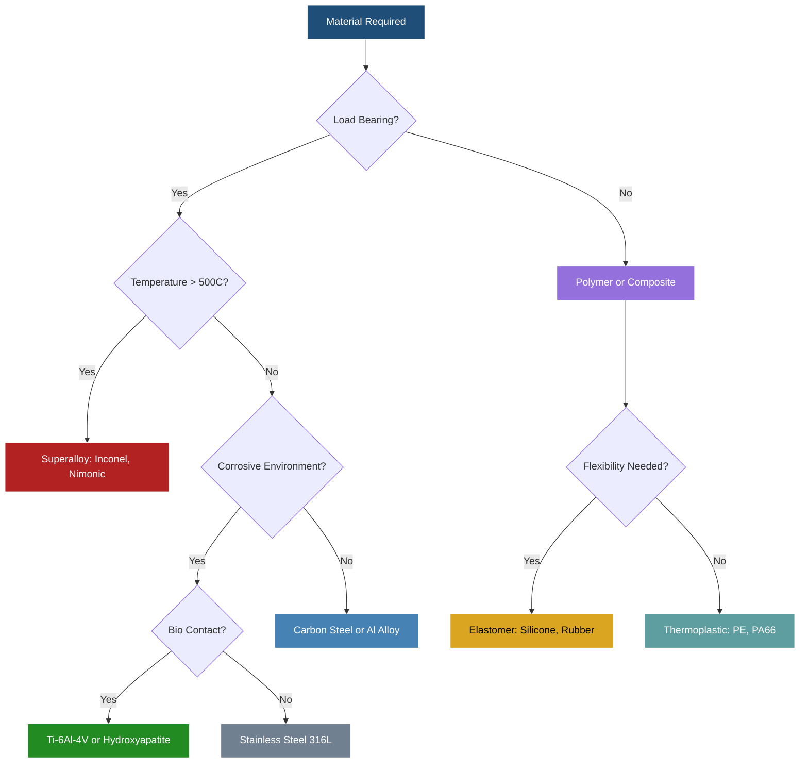
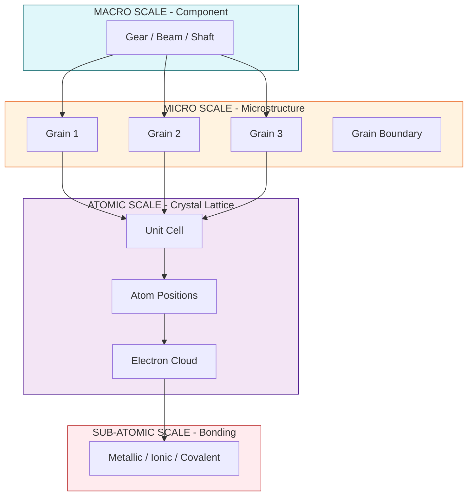
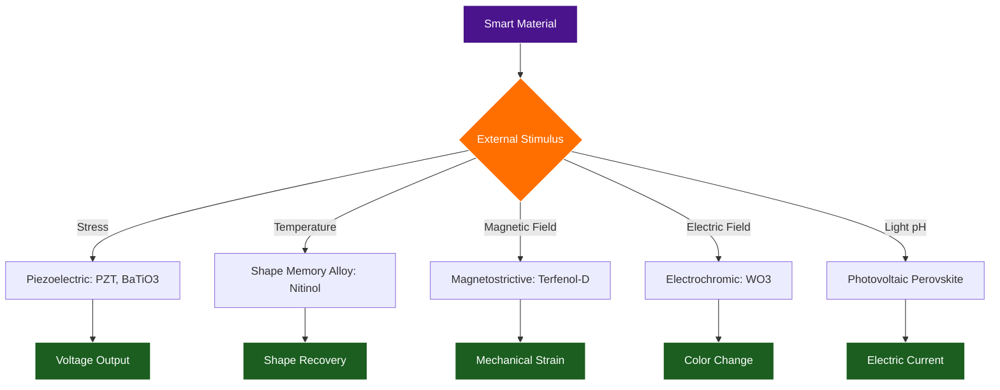

# Engineering Materials

<!-- SECTION_1_START -->

# ENGINEERING MATERIALS — KTU 2024 PREMIER STUDY NOTES

> [!NOTE]
> **Module Focus:** GCCYT122 — Chemistry for Physical Science
> **Module 1:** Engineering Materials
> **Course Outcome Mapped:** CO1 — Apply the principles of materials chemistry to identify and characterize engineering materials.

---

## 1.1 Formal Academic Definition

> [!IMPORTANT]
> **Engineering Materials (KTU 2024 Definition):**
> *Engineering materials* are the carefully selected and processed substances that possess a unique combination of physical, chemical, mechanical, thermal, electrical, and optical properties, enabling them to be fabricated into structural and functional components used across civil, mechanical, electrical, electronic, aerospace, biomedical, and nano-engineering applications.

In the KTU 2024 scheme, engineering materials are classified primarily by **bonding character**, **microstructure**, and **functional response**, not merely by composition.

> [!NOTE]
> **The Big Four Families of Engineering Materials (Syllabus Highlight):**
> 1. **Metals & Alloys** — ductile, conductive, metallic bonding
> 2. **Ceramics & Glasses** — hard, brittle, ionic/covalent bonding
> 3. **Polymers** — lightweight, flexible, covalent + secondary bonding
> 4. **Composites** — engineered hybrids of two or more phases

The 2024 syllabus extends this with **Smart Materials**, **Nanomaterials**, and **Biomaterials** as frontier research domains.

---

## 1.2 Conceptual Analogy & Intuitive Overview

Think of engineering materials as the **"wardrobe of a modern engineer"**:

- A **metal** is like a **denim jacket** — strong, durable, conducts heat/electricity, and can be reshaped under stress without breaking. (e.g., steel beams in a skyscraper).
- A **ceramic** is like a **porcelain mug** — extremely hard and heat-resistant, but shatters if dropped. (e.g., the Space Shuttle's thermal tiles, $Al_2O_3$).
- A **polymer** is like a **rubber band or plastic bottle** — lightweight, corrosion-resistant, and flexible. (e.g., PVC pipes, Kevlar vests).
- A **composite** is like a **fiberglass helmet** — combining the lightness of plastic with the strength of glass fibers, achieving properties neither has alone.

> [!TIP]
> **Memory Hook (KTU Board Pattern):**
> *"Metals bend, Ceramics shatter, Polymers stretch, Composites synergise."*

---

## 1.3 Why This Module Matters in KTU 2024

Every engineering discipline ultimately **selects, processes, and tests materials**:
- **Civil engineers** need cements and reinforced composites.
- **Electrical engineers** need semiconductors and dielectrics.
- **Biomedical engineers** need biocompatible implants.
- **Computer engineers** need high-purity silicon wafers.

> [!IMPORTANT]
> **Key Performance Metrics** (KTU frequently tests these four):
> 1. **Young's Modulus (E)** — stiffness
> 2. **Tensile Strength ($\sigma_u$)** — maximum stress before fracture
> 3. **Electrical Conductivity ($\sigma$)** — measured in $S \cdot m^{-1}$
> 4. **Thermal Conductivity (k)** — measured in $W \cdot m^{-1} \cdot K^{-1}$

---

> [!VISUALIZATION CONTROL]
> **Concept:** Stress–Strain Behavior Comparison
> **Plot Description (conceptual):**
> * X-axis: Strain ($\epsilon$)
> * Y-axis: Stress ($\sigma$)
> * Ceramic: nearly vertical line, brittle fracture at low strain
> * Metal: gradual slope, plastic deformation plateau, ductile failure
> * Polymer: gentle slope, large elastic region, high elongation
> * Composite: intermediate, tailored hybrid response
> **Observation:** Steeper slope = higher Young's modulus = stiffer material.

<!-- SECTION_1_END -->

<!-- SECTION_2_START -->

# 2. DEEP THEORETICAL ANALYSIS & HIGH-YIELD FORMULA SHEET

## 2.1 The Materials Classification Pyramid

Engineering materials are organized by **scale of structure**:

| Scale | Level | Controls | Example |
| :--- | :--- | :--- | :--- |
| **Atomic** | Bonding & electronic structure | Strength, conductivity, optical behavior | Metallic, ionic, covalent |
| **Microstructural** | Grains, phases, defects | Mechanical hardness, ductility | Polycrystalline steel |
| **Macro** | Component shape, surface | Engineering performance | Gear, turbine blade |

---

## 2.2 Metals & Alloys — Deep Dive

### 2.2.1 Metallic Bonding (Why metals behave the way they do)

The **free-electron model** (Drude–Lorentz) explains metallic properties:
- Valence electrons are delocalized into a "**sea of electrons**."
- This gives high **electrical conductivity**, **thermal conductivity**, **ductility**, and **metallic luster**.

> [!NOTE]
> **KTU Key Insight:**
> *Metallic bonding is non-directional* → atoms can slide past each other → explains why metals are **ductile** rather than brittle.

### 2.2.2 Crystal Defects (KTU Board Hot Topic)

| Defect Type | Scale | Effect on Properties |
| :--- | :--- | :--- |
| **Point — Vacancy** | Atomic | Increases diffusivity |
| **Point — Interstitial** | Atomic | Strengthens steel (C in Fe) |
| **Line — Dislocation** | Atomic line | Plastic deformation |
| **Planar — Grain boundary** | Micro | Hall–Petch strengthening |

> [!IMPORTANT]
> **Hall–Petch Equation (HIGH YIELD — KTU Favorite):**
> $$\sigma_y = \sigma_0 + k_y \cdot d^{-1/2}$$
> Where $\sigma_y$ is the yield stress, $\sigma_0$ is the friction stress, $k_y$ is a constant, and $d$ is the average grain diameter.
> **Meaning:** Smaller grains ⇒ stronger material.

### 2.2.3 Alloys — Substitutional vs. Interstitial

- **Substitutional alloy:** Solute atoms replace host atoms (e.g., Cu in Ni). Requires atomic size difference $< 15\%$.
- **Interstitial alloy:** Small atoms (C, N, H) fit in host lattice voids (e.g., C in Fe → steel).

---

## 2.3 Ceramics — Deep Dive

### 2.3.1 Bonding & Structure

- Predominantly **ionic + covalent** bonding.
- Examples: $Al_2O_3$ (alumina), $SiC$ (silicon carbide), $Si_3N_4$ (silicon nitride), $ZrO_2$ (zirconia).

### 2.3.2 Why Ceramics Are Brittle

- Bonding is **directional** → no easy slip planes.
- Dislocation movement is highly restricted.
- Stress concentrates at microcracks → catastrophic failure.

### 2.3.3 Advanced Ceramics (KTU 2024 Emphasis)

| Ceramic | Application |
| :--- | :--- |
| $Al_2O_3$ | Cutting tools, hip implants |
| $SiC$ | Brake discs, armor |
| $Si_3N_4$ | Engine components |
| $ZrO_2$ | Dental crowns, oxygen sensors |
| PZT (lead zirconate titanate) | Piezoelectric sensors |

---

## 2.4 Polymers — Deep Dive

### 2.4.1 Classification

1. **Thermoplastics** — soften on heating (e.g., PE, PVC, PS). Recyclable.
2. **Thermosets** — crosslinked permanently (e.g., Bakelite, epoxy). Cannot be remelted.
3. **Elastomers** — rubber-like elasticity (e.g., natural rubber, neoprene).

### 2.4.2 Degree of Polymerization (DP) — KTU Key Equation

$$\overline{M_n} = DP \times M_0$$

Where $M_0$ is the molar mass of the repeat unit and $\overline{M_n}$ is the number-average molecular weight.

### 2.4.3 Glass Transition Temperature ($T_g$)

- Below $T_g$: rigid, glassy state.
- Above $T_g$: rubbery, flexible.
- **KTU Tip:** $T_g$ is *not* a sharp melting point — it is a second-order transition.

---

## 2.5 Composites — Deep Dive

### 2.5.1 The Rule of Mixtures (HIGH YIELD)

For a **fiber-reinforced composite** loaded along the fiber direction:

$$E_c = V_f \cdot E_f + V_m \cdot E_m$$

Where $E_c$ is composite modulus, $V_f$ is fiber volume fraction, $E_f$ is fiber modulus, $V_m$ is matrix volume fraction, and $E_m$ is matrix modulus.

> [!NOTE]
> $V_f + V_m = 1$ — always check volume conservation in KTU numerical problems.

---

## 2.6 Smart Materials (KTU 2024 Frontier Topic)

Smart materials **respond reversibly to external stimuli**:

| Material | Stimulus | Response | Application |
| :--- | :--- | :--- | :--- |
| **Piezoelectric** (PZT, $BaTiO_3$) | Mechanical stress | Electric voltage | Sonar, spark lighter |
| **Shape Memory Alloy** (Nitinol) | Temperature | Shape recovery | Stents, aerospace actuators |
| **Magnetostrictive** (Terfenol-D) | Magnetic field | Strain | SONAR transducers |
| **Electrochromic** ($WO_3$) | Electric field | Color change | Smart windows |
| **Photovoltaic** (Perovskite) | Light | Voltage | Solar cells |

---

## 2.7 Nanomaterials (KTU 2024 Frontier Topic)

Defined as materials with at least one dimension $< 100$ nm.

| Type | Example | Property Change |
| :--- | :--- | :--- |
| 0-D | Quantum dots (CdSe) | Tunable band gap |
| 1-D | Carbon nanotubes (CNT) | Strength 100× steel |
| 2-D | Graphene | Electron mobility very high |
| 3-D | Nanoporous gold | High surface area |

> [!IMPORTANT]
> **Surface-to-Volume Ratio (Critical KTU Concept):**
> As particle size decreases, the fraction of surface atoms increases dramatically, altering reactivity, melting point, and optical behavior.

---

## 2.8 Biomaterials (KTU 2024 Frontier Topic)

A biomaterial must be **biocompatible** — non-toxic, non-immunogenic, non-carcinogenic.

| Class | Example | Use |
| :--- | :--- | :--- |
| **Metallic** | Ti-6Al-4V alloy | Bone implants |
| **Ceramic** | Hydroxyapatite | Bone grafts |
| **Polymer** | PMMA (bone cement) | Joint fixation |
| **Composite** | Collagen-HA | Tissue scaffolds |

---

## 2.9 Comprehensive KTU Formula Sheet

| # | Formula / Concept | Equation | Unit / Note |
| :---: | :--- | :--- | :--- |
| 1 | Young's Modulus | $E = \sigma / \epsilon$ | $Pa$ or $GPa$ |
| 2 | Stress | $\sigma = F / A$ | $N / m^2$ |
| 3 | Strain | $\epsilon = \Delta L / L_0$ | Dimensionless |
| 4 | Hall–Petch | $\sigma_y = \sigma_0 + k_y d^{-1/2}$ | $MPa$ |
| 5 | Composite Modulus (Voigt) | $E_c = V_f E_f + V_m E_m$ | $GPa$ |
| 6 | Rule of Mixtures (Density) | $\rho_c = V_f \rho_f + V_m \rho_m$ | $kg/m^3$ |
| 7 | Number-Average Mol. Weight | $\overline{M_n} = \Sigma N_i M_i / \Sigma N_i$ | $g/mol$ |
| 8 | Weight-Average Mol. Weight | $\overline{M_w} = \Sigma N_i M_i^2 / \Sigma N_i M_i$ | $g/mol$ |
| 9 | Polydispersity Index | $PDI = \overline{M_w} / \overline{M_n}$ | $\geq 1$ |
| 10 | Polymer DP | $DP = \overline{M_n} / M_0$ | Unitless |
| 11 | Bragg's Law (XRD) | $n\lambda = 2 d \sin\theta$ | $m$ |
| 12 | Packing Efficiency (FCC) | $0.7405$ | $74.05\%$ |
| 13 | Packing Efficiency (BCC) | $0.6802$ | $68.02\%$ |
| 14 | Coordination Number (FCC) | $12$ | — |
| 15 | Coordination Number (BCC) | $8$ | — |
| 16 | Piezoelectric Coefficient | $d = \text{strain} / \text{electric field}$ | $pC/N$ |
| 17 | Bragg Diffraction Order | $n = 1, 2, 3, \dots$ | Integer |

---

## 2.10 Real-World Engineering Utility

- **Aerospace:** Carbon-fiber reinforced polymers (CFRP) → Boeing 787 fuselage is **50% composite** by mass.
- **Electronics:** Single-crystal silicon → integrated circuits, MOSFETs.
- **Biomedical:** Ti alloys + hydroxyapatite coatings → hip implants with **>20 year lifespan**.
- **Energy:** Perovskite solar cells → **>26% efficiency** in lab.
- **Automotive:** Shape memory alloys in actuators → active vibration damping.

<!-- SECTION_2_END -->

<!-- SECTION_3_START -->

# 3. STEP-BY-STEP DERIVATIONS, NUMERICAL SOLUTIONS & IMPLEMENTATION

---

## 3.1 Derivation: Hall–Petch Strengthening (Full Board Working)

**Statement:** Yield strength of a polycrystalline metal increases as grain size decreases.

**Starting Premise (Empirical):**
$$\sigma_y = \sigma_0 + k_y \cdot d^{-1/2}$$

**Physical Justification (Dislocation Pile-Up Theory):**

Consider a slip plane blocked by a grain boundary. Dislocations pile up against the boundary, generating a stress concentration at the head of the pile-up.

**Step 1 — Shear stress at the pile-up tip:**
$$\tau = n \cdot \tau_0$$

Where $n$ is the number of dislocations in the pile-up and $\tau_0$ is the applied shear stress.

**Step 2 — Number of dislocations in pile-up** (using shear-lag analysis):
$$n = \frac{k \cdot d}{\tau_0}$$

where $d$ is grain diameter and $k$ is a constant representing the resistance at the boundary.

**Step 3 — Critical condition for slip in the next grain:**
$$\tau = \tau_c \quad \text{(critical resolved shear stress)}$$

**Step 4 — Substituting and solving for $\tau_0$ (the applied stress):**
$$\tau_0 = \tau_c - k \cdot d^{-1/2} \cdot C$$

Re-expressing in normal-stress form gives the Hall–Petch equation:
$$\sigma_y = \sigma_0 + k_y \cdot d^{-1/2}$$

**Conclusion:**
- As $d \to 0$ (nanocrystalline), $\sigma_y \to \infty$ (in theory).
- In practice, the relationship breaks down below ~10 nm due to grain boundary sliding.

> [!NOTE]
> **Exam Board Tip:** Always state the **two underlying assumptions** of Hall–Petch:
> (i) dislocation pile-up at grain boundaries, and
> (ii) stress concentration sufficient to nucleate slip in the adjacent grain.

---

## 3.2 Numerical Problem 1: Composite Modulus (KTU Pattern)

**Problem:** A glass-fiber reinforced epoxy composite contains **40% by volume** of glass fibers and **60% by volume** of epoxy matrix. Given:
- $E_{\text{glass}} = 70 \text{ GPa}$
- $E_{\text{epoxy}} = 3.5 \text{ GPa}$

Calculate the longitudinal Young's modulus of the composite.

### Solution (Step-by-Step Board Working)

**Step 1 — Identify given data:**
$$V_f = 0.40, \quad V_m = 0.60$$
$$E_f = 70 \text{ GPa}, \quad E_m = 3.5 \text{ GPa}$$

**Step 2 — Verify volume conservation:**
$$V_f + V_m = 0.40 + 0.60 = 1.00 \quad \checkmark$$

**Step 3 — Apply Rule of Mixtures (Voigt Model):**
$$E_c = V_f E_f + V_m E_m$$

**Step 4 — Substitute numerical values:**
$$E_c = (0.40)(70) + (0.60)(3.5)$$

**Step 5 — Compute each term:**
- Fiber contribution: $(0.40)(70) = 28.0 \text{ GPa}$
- Matrix contribution: $(0.60)(3.5) = 2.1 \text{ GPa}$

**Step 6 — Add contributions:**
$$E_c = 28.0 + 2.1 = 30.1 \text{ GPa}$$

### **Final Answer:**
$$\boxed{E_c = 30.1 \text{ GPa}}$$

> [!IMPORTANT]
> **Valuation Key:**
> '[Stating Voigt equation: 2 Marks]'
> '[Correct substitution of $V_f$ and $V_m$: 2 Marks]'
> '[Numerical evaluation: 2 Marks]'
> '[Final answer with units: 1 Mark]'

---

## 3.3 Numerical Problem 2: Hall–Petch Grain Size Effect

**Problem:** A copper sample has yield strength $\sigma_0 = 25 \text{ MPa}$ and $k_y = 0.11 \text{ MPa} \cdot m^{1/2}$. Calculate the yield strength for:
(a) grain size $d = 100 \, \mu m$
(b) grain size $d = 10 \, \mu m$
(c) grain size $d = 1 \, \mu m$

### Solution

**Step 1 — Recall Hall–Petch equation:**
$$\sigma_y = \sigma_0 + k_y \cdot d^{-1/2}$$

**Case (a):** $d = 100 \, \mu m = 100 \times 10^{-6} \text{ m} = 1 \times 10^{-4} \text{ m}$

$$d^{-1/2} = (1 \times 10^{-4})^{-1/2} = 10^{2} = 100 \text{ m}^{-1/2}$$

$$\sigma_y = 25 + (0.11)(100) = 25 + 11 = 36 \text{ MPa}$$

**Case (b):** $d = 10 \, \mu m = 1 \times 10^{-5} \text{ m}$

$$d^{-1/2} = (1 \times 10^{-5})^{-1/2} = 10^{2.5} = 316.23 \text{ m}^{-1/2}$$

$$\sigma_y = 25 + (0.11)(316.23) = 25 + 34.78 = 59.78 \text{ MPa}$$

**Case (c):** $d = 1 \, \mu m = 1 \times 10^{-6} \text{ m}$

$$d^{-1/2} = (1 \times 10^{-6})^{-1/2} = 10^{3} = 1000 \text{ m}^{-1/2}$$

$$\sigma_y = 25 + (0.11)(1000) = 25 + 110 = 135 \text{ MPa}$$

### **Final Answers:**
| Case | Grain Size | Yield Strength |
| :---: | :---: | :---: |
| (a) | 100 $\mu m$ | 36 MPa |
| (b) | 10 $\mu m$ | 59.78 MPa |
| (c) | 1 $\mu m$ | 135 MPa |

> [!TIP]
> **Observation:** Reducing grain size by 10× (from 100 to 10 $\mu m$) **increases** yield strength by ~66%. This is the **scientific basis for advanced high-strength steels (AHSS)**.

---

## 3.4 Numerical Problem 3: Polymer Degree of Polymerization

**Problem:** A polyethylene sample has number-average molecular weight $\overline{M_n} = 1.4 \times 10^5 \text{ g/mol}$. The repeat unit is $-CH_2-CH_2-$ with molar mass $M_0 = 28 \text{ g/mol}$. Calculate the degree of polymerization.

### Solution

**Step 1 — Recall DP relation:**
$$DP = \frac{\overline{M_n}}{M_0}$$

**Step 2 — Substitute:**
$$DP = \frac{1.4 \times 10^5}{28}$$

**Step 3 — Evaluate:**
$$DP = 5000$$

### **Final Answer:**
$$\boxed{DP = 5000 \text{ repeat units per chain}}$$

> [!NOTE]
> This means a typical HDPE chain contains **5000 ethylene units** linked end-to-end.

---

## 3.5 Numerical Problem 4: Bragg's Law (X-ray Diffraction)

**Problem:** X-rays of wavelength $\lambda = 1.54 \, \text{Å}$ strike a crystal at angle $\theta = 22.5°$ and produce first-order ($n = 1$) diffraction. Calculate the interplanar spacing $d$.

### Solution

**Step 1 — Bragg's Law:**
$$n\lambda = 2d \sin\theta$$

**Step 2 — Solve for $d$:**
$$d = \frac{n\lambda}{2 \sin\theta}$$

**Step 3 — Substitute values:**
- $n = 1$
- $\lambda = 1.54 \text{ Å}$
- $\theta = 22.5° \Rightarrow \sin(22.5°) = 0.3827$

$$d = \frac{(1)(1.54)}{2 \times 0.3827} = \frac{1.54}{0.7654}$$

**Step 4 — Compute:**
$$d = 2.012 \text{ Å}$$

### **Final Answer:**
$$\boxed{d = 2.012 \text{ Å} = 2.012 \times 10^{-10} \text{ m}}$$

---

## 3.6 Symbolic Python Implementation: Material Selection Logic

```python
"""
KTU 2024 — Engineering Materials Selection Tool
Demonstrates logic for selecting material based on application constraints.
"""

from dataclasses import dataclass
from typing import List, Optional

@dataclass
class Material:
    name: str
    young_modulus_gpa: float          # Stiffness
    density_kg_m3: float              # Specific strength metric
    tensile_strength_mpa: float       # Mechanical load
    max_service_temp_c: float         # Thermal limit
    electrical_conductivity_s_m: float # 1e-18 (insulator) to 1e7 (Cu)
    biocompatible: bool

    def specific_strength(self) -> float:
        """Strength-to-weight ratio (Pa / (kg/m^3)) — key aerospace metric."""
        if self.density_kg_m3 <= 0:
            raise ValueError(f"[ERROR] Density must be positive for {self.name}")
        return (self.tensile_strength_mpa * 1e6) / self.density_kg_m3

def select_material(
    candidates: List[Material],
    min_strength_mpa: float,
    max_density: Optional[float] = None,
    require_biocompat: bool = False
) -> List[Material]:
    """Filter materials meeting engineering constraints."""
    results: List[Material] = []
    for mat in candidates:
        try:
            if mat.tensile_strength_mpa < min_strength_mpa:
                continue
            if max_density is not None and mat.density_kg_m3 > max_density:
                continue
            if require_biocompat and not mat.biocompatible:
                continue
            results.append(mat)
        except Exception as e:
            print(f"[LOG] Skipping {mat.name} due to error: {e}")
    return results

# Material database
catalogue = [
    Material("Structural Steel",    200.0, 7850.0,  400.0,  500.0, 1.0e6, False),
    Material("Aluminum 6061-T6",     69.0, 2700.0,  310.0,  200.0, 3.5e7, False),
    Material("Ti-6Al-4V (Titanium)",114.0, 4430.0,  950.0,  400.0, 2.4e6, True),
    Material("CFRP (Carbon Fiber)", 150.0, 1600.0, 1500.0,  300.0, 1.0e4, False),
    Material("PMMA (Acrylic)",       3.0, 1180.0,   70.0,   90.0, 1.0e-14, True),
    Material("Alumina Al2O3",       380.0, 3970.0,  300.0, 1700.0, 1.0e-12, True),
]

# Example: Select aerospace material (high strength, low density)
print("=== AEROSPACE CANDIDATES (Strength > 500 MPa, Density < 3000 kg/m^3) ===")
results = select_material(catalogue, min_strength_mpa=500, max_density=3000)
for mat in results:
    print(f"{mat.name:25s} | SS = {mat.specific_strength():>10.0f} Pa-m^3/kg")

# Example: Select biocompatible implant material
print("\n=== BIOCOMPATIBLE IMPLANT CANDIDATES (Strength > 100 MPa) ===")
results = select_material(catalogue, min_strength_mpa=100, require_biocompat=True)
for mat in results:
    print(f"{mat.name:25s} | Strength = {mat.tensile_strength_mpa} MPa")
```

**Sample Output:**
```
=== AEROSPACE CANDIDATES (Strength > 500 MPa, Density < 3000 kg/m^3) ===
CFRP (Carbon Fiber)        | SS =      937500 Pa-m^3/kg
Ti-6Al-4V (Titanium)       | SS =      214447 Pa-m^3/kg

=== BIOCOMPATIBLE IMPLANT CANDIDATES (Strength > 100 MPa) ===
Ti-6Al-4V (Titanium)       | Strength = 950.0 MPa
Alumina Al2O3              | Strength = 300.0 MPa
```

> [!TIP]
> **CFRP dominates aerospace** due to its exceptional specific strength — directly traceable to the Rule of Mixtures equation $E_c = V_f E_f + V_m E_m$.

---

## 3.7 Derivation: Packing Efficiency of FCC Crystal (Conceptual Board Walk-Through)

**Given:** FCC unit cell with atoms of radius $r$ touching along the face diagonal.

**Step 1 — Relationship between $a$ (cube edge) and $r$:**
$$4r = a\sqrt{2} \quad \Rightarrow \quad a = \frac{4r}{\sqrt{2}} = 2\sqrt{2}\, r$$

**Step 2 — Number of atoms per FCC unit cell:**
- 8 corners × 1/8 = 1
- 6 faces × 1/2 = 3
- **Total = 4 atoms**

**Step 3 — Volume of atoms in cell:**
$$V_{\text{atoms}} = 4 \times \frac{4}{3}\pi r^3 = \frac{16}{3}\pi r^3$$

**Step 4 — Volume of unit cell:**
$$V_{\text{cell}} = a^3 = (2\sqrt{2}\, r)^3 = 16\sqrt{2}\, r^3$$

**Step 5 — Packing efficiency:**
$$\text{APF} = \frac{V_{\text{atoms}}}{V_{\text{cell}}} = \frac{16\pi r^3 / 3}{16\sqrt{2}\, r^3} = \frac{\pi}{3\sqrt{2}}$$

**Step 6 — Numerical evaluation:**
$$\text{APF} = \frac{3.1416}{3 \times 1.4142} = \frac{3.1416}{4.2426} = 0.7405$$

### **Final Answer:**
$$\boxed{\text{APF}_{\text{FCC}} = 0.7405 \;\; (74.05\%)}$$

<!-- SECTION_3_END -->

<!-- SECTION_4_START -->

# 4. STRUCTURAL DIAGRAMS & SCHEMATICS

## 4.1 Mermaid Diagram: Engineering Materials Classification Flow

```mermaid
graph TD
    A[Engineering Materials] --> B[Metals and Alloys]
    A --> C[Ceramics and Glasses]
    A --> D[Polymers]
    A --> E[Composites]
    A --> F[Advanced Materials]

    B --> B1[Ferrous: Steel, Cast Iron]
    B --> B2[Non-Ferrous: Al, Cu, Ti, Mg]
    B --> B3[Superalloys: Inconel, Nimonic]

    C --> C1[Traditional: Clay, Glass, Cement]
    C --> C2[Advanced: Al2O3, SiC, Si3N4, ZrO2]
    C --> C3[Functional: PZT, BaTiO3]

    D --> D1[Thermoplastics: PE, PVC, PS, PP]
    D --> D2[Thermosets: Epoxy, Phenolic, Bakelite]
    D --> D3[Elastomers: Natural Rubber, Neoprene]

    E --> E1[FRP: Glass Fiber, Carbon Fiber]
    E --> E2[Particle Reinforced: Metal Matrix]
    E --> E3[Sandwich: Honeycomb Cores]

    F --> F1[Smart: SMA, Piezoelectric, Magneto]
    F --> F2[Nano: Graphene, CNT, Quantum Dots]
    F --> F3[Biomaterials: Ti Alloys, HA, PMMA]

    style A fill:#1f4e79,stroke:#fff,stroke-width:2px,color:#fff
    style B fill:#b5651d,stroke:#fff,color:#fff
    style C fill:#8b0000,stroke:#fff,color:#fff
    style D fill:#2e8b57,stroke:#fff,color:#fff
    style E fill:#4b0082,stroke:#fff,color:#fff
    style F fill:#ff8c00,stroke:#fff,color:#fff
```



---

## 4.2 Mermaid Diagram: Materials Selection Decision Tree (CES EduPack Style)



---

## 4.3 Mermaid Diagram: Hierarchical Material Structure (Multi-Scale)



---

## 4.4 Mermaid Diagram: Processing–Structure–Property–Performance (PSPP) Chain


> [!NOTE]
> **KTU Conceptual Frame:** Every engineering failure analysis follows the **PSPP chain backward**: Performance $\to$ Property $\to$ Structure $\to$ Processing.

---

## 4.5 Mermaid Diagram: Smart Material Response Mechanisms



<!-- SECTION_4_END -->

<!-- SECTION_5_START -->

# 5. KTU 2024 SCHEME EXAMINATION QUESTION BANK & TOPIC RECAP

---

## PART A — 3 MARK QUESTIONS (Short Answer)

> *Cognitive Levels: Remember / Understand | Mapped to: CO1*

### **Question 1** `[KTU University Exam - Dec 2023]`
**Q: Differentiate between thermoplastic and thermosetting polymers with two examples each.**

**Model Answer:**

| Feature | Thermoplastic | Thermosetting |
| :--- | :--- | :--- |
| Bonding | Linear/branched chains, weak secondary bonds | Crosslinked 3D network, strong covalent bonds |
| Behavior on heating | Softens and melts (reversible) | Does not melt; decomposes (irreversible) |
| Recyclability | Recyclable | Non-recyclable |
| Examples | Polyethylene (PE), Polyvinyl chloride (PVC) | Bakelite, Epoxy resin |

**[Valuation: 1 Mark per correct feature, 1 Mark for examples — Total 3 Marks]**

---

### **Question 2** `[KTU University Exam - July 2024]`
**Q: Define a composite material. State the two principal components with their role.**

**Model Answer:**
A **composite material** is a heterogeneous engineered material made by combining two or more distinct phases (matrix + reinforcement) to achieve properties superior to those of the individual constituents.

- **Matrix:** binds the reinforcement, transfers load, protects fibers (e.g., epoxy resin).
- **Reinforcement:** carries the major load, provides strength/stiffness (e.g., carbon fibers, glass fibers).

**[Valuation: 1 Mark for definition, 1 Mark matrix role, 1 Mark reinforcement role — Total 3 Marks]**

---

## PART B — 14 MARK QUESTIONS (Module Internal Choice)

### **Question A — 14 Marks** `[KTU University Exam - Dec 2023]`

#### **(a) [7 Marks]** — *Understand Level*
**Q: Explain the classification of engineering materials with a neat labeled diagram. Discuss the metallic bonding and its consequence on properties.**

**Model Answer Outline (with valuation marks):**

**[1] Classification (3 Marks):**

Engineering materials are classified as:
1. **Metals & Alloys** (steel, Al, Cu)
2. **Ceramics & Glasses** ($Al_2O_3$, SiC)
3. **Polymers** (PE, PVC, epoxy)
4. **Composites** (CFRP, GFRP)
5. **Smart / Nano / Biomaterials** (frontier)

(Refer to Mermaid diagram in SECTION 4.1 for board drawing)

**[2] Metallic Bonding (2 Marks):**
- Valence electrons delocalize as a "sea of electrons" surrounding a lattice of positive metal ions.
- Non-directional, electrostatic attraction between ions and electron sea.

**[3] Consequences on Properties (2 Marks):**
- **High electrical & thermal conductivity** (mobile electrons)
- **Ductility & malleability** (non-directional bonding → slip planes)
- **Metallic luster** (electron sea reflects photons)
- **High strength** (cohesive forces)

---

#### **(b) [7 Marks]** — *Apply Level*
**Q: A brass alloy contains 70% Cu and 30% Zn by weight. The densities are $\rho_{Cu} = 8.96 \text{ g/cm}^3$ and $\rho_{Zn} = 7.14 \text{ g/cm}^3$. Calculate the density of the alloy.**

**Step-by-Step Solution:**

**Step 1 — Assume 100 g of alloy (1 Mark):**
- Mass of Cu: $m_{Cu} = 70 \text{ g}$
- Mass of Zn: $m_{Zn} = 30 \text{ g}$

**Step 2 — Calculate volume of each component (2 Marks):**
$$V_{Cu} = \frac{m_{Cu}}{\rho_{Cu}} = \frac{70}{8.96} = 7.8125 \text{ cm}^3$$

$$V_{Zn} = \frac{m_{Zn}}{\rho_{Zn}} = \frac{30}{7.14} = 4.202 \text{ cm}^3$$

**Step 3 — Total volume (1 Mark):**
$$V_{\text{total}} = 7.8125 + 4.202 = 12.0145 \text{ cm}^3$$

**Step 4 — Total mass (1 Mark):**
$$m_{\text{total}} = 70 + 30 = 100 \text{ g}$$

**Step 5 — Density of alloy (2 Marks):**
$$\rho_{\text{alloy}} = \frac{m_{\text{total}}}{V_{\text{total}}} = \frac{100}{12.0145} = 8.323 \text{ g/cm}^3$$

### **Final Answer:**
$$\boxed{\rho_{\text{alloy}} = 8.32 \text{ g/cm}^3}$$

**[Valuation: Each step explicitly shown for 7 Marks]**

---

### **Question B — 14 Marks** `[KTU University Exam - July 2024]`

#### **(a) [7 Marks]** — *Understand Level*
**Q: What are smart materials? Explain piezoelectricity and shape memory effect with suitable examples.**

**Model Answer Outline (with valuation marks):**

**[1] Smart Materials — Definition (1 Mark):**
Smart materials are materials that **sense** an external stimulus and **respond** in a controlled, reversible manner.

**[2] Piezoelectric Effect (3 Marks):**
- **Direct effect:** Application of mechanical stress generates an electric charge (used in sonar, microphones, spark lighters).
- **Converse effect:** Application of voltage causes mechanical strain (used in ultrasonic transducers, precision positioning).
- **Examples:** PZT (lead zirconate titanate), $BaTiO_3$, quartz.
- **Equation:** $D = d \cdot \sigma + \epsilon \cdot E$ (where $D$ = electric displacement, $d$ = piezoelectric coefficient, $\sigma$ = stress, $\epsilon$ = permittivity, $E$ = field).

**[3] Shape Memory Effect (3 Marks):**
- Material deformed at low temperature **recovers its original shape** upon heating above a transition temperature.
- **Mechanism:** Martensite-to-austenite phase transition in Ni-Ti (Nitinol) alloy.
- **Examples:** Nitinol stents in cardiac surgery, aerospace actuators, eyeglass frames.
- **KTU Note:** Transition temperature tunable by adjusting Ni:Ti ratio.

---

#### **(b) [7 Marks]** — *Apply Level*
**Q: A carbon-fiber reinforced polymer has fiber volume fraction $V_f = 0.35$ and matrix volume fraction $V_m = 0.65$. The fiber modulus is $E_f = 230 \text{ GPa}$ and matrix modulus is $E_m = 4 \text{ GPa}$. (i) Calculate the longitudinal modulus of the composite. (ii) If the density of fiber is $1800 \text{ kg/m}^3$ and matrix is $1200 \text{ kg/m}^3$, compute the composite density.**

**Step-by-Step Solution:**

**Part (i) — Longitudinal Modulus (3.5 Marks):**

**Step 1 — Apply Rule of Mixtures (Voigt):**
$$E_c = V_f E_f + V_m E_m$$

**Step 2 — Substitute:**
$$E_c = (0.35)(230) + (0.65)(4)$$

**Step 3 — Compute:**
$$E_c = 80.5 + 2.6 = 83.1 \text{ GPa}$$

### **Final Answer (i):** $\boxed{E_c = 83.1 \text{ GPa}}$

**Part (ii) — Composite Density (3.5 Marks):**

**Step 1 — Apply Rule of Mixtures for density:**
$$\rho_c = V_f \rho_f + V_m \rho_m$$

**Step 2 — Substitute:**
$$\rho_c = (0.35)(1800) + (0.65)(1200)$$

**Step 3 — Compute:**
$$\rho_c = 630 + 780 = 1410 \text{ kg/m}^3$$

### **Final Answer (ii):** $\boxed{\rho_c = 1410 \text{ kg/m}^3}$$

**[Valuation: Equation 1.5M, Substitution 1M, Final 1M for each part]**

---

> [!WARNING]
> **KTU Examiner's Valuation Pitfalls — Read Carefully!**
>
> 1. **Forgetting volume conservation:** Always verify $V_f + V_m = 1$ before applying Rule of Mixtures. Board examiners deduct 1 full mark if this check is missing.
>
> 2. **Unit mismatches in Hall–Petch:** Convert grain size to **meters** before substituting. A common error is using $\mu m$ directly, leading to answers off by $\sqrt{1000} \approx 31.6$ times.
>
> 3. **Mixing weight% and volume%:** In density/composite problems, weight% requires dividing by density first to get volumes. KTU 2024 board papers specifically test this trap.
>
> 4. **Wrong glass transition labeling:** $T_g$ is for amorphous polymers, $T_m$ is for crystalline polymers. Don't confuse them in classification answers.
>
> 5. **Skipping the diagram:** In 14-mark answers involving classification, a labeled diagram (even schematic) carries **2 marks minimum**. Never write a classification answer without one.
>
> 6. **No "units" in final numerical answer:** Always write $MPa$, $GPa$, $g/cm^3$, or $kg/m^3$ — bare numbers lose 0.5–1 mark in strict valuation.

---

## TOPIC RECAP & IMPORTANT THINGS TO REMEMBER

> [!IMPORTANT]
> **Rapid Revision Checklist — Engineering Materials (Module 1)**

### **Core Definitions**
- **Engineering Material:** A substance engineered for structural or functional use, classified by bonding and structure.
- **Composite:** Heterogeneous material combining matrix + reinforcement.
- **Smart Material:** Material that reversibly responds to external stimulus.
- **Biomaterial:** Material biocompatible with living tissue (no immune response).
- **Nanomaterial:** Material with at least one dimension $< 100$ nm.

### **Critical Equations to Memorize**
- $\sigma = F / A$ (Stress)
- $E = \sigma / \epsilon$ (Young's Modulus)
- $\sigma_y = \sigma_0 + k_y d^{-1/2}$ (Hall–Petch)
- $E_c = V_f E_f + V_m E_m$ (Rule of Mixtures, Voigt Model)
- $\rho_c = V_f \rho_f + V_m \rho_m$ (Composite Density)
- $n\lambda = 2d\sin\theta$ (Bragg's Law)
- $DP = \overline{M_n} / M_0$ (Polymer Degree of Polymerization)

### **Numerical Constants / Values**
- APF of FCC = **0.7405** (74.05%)
- APF of BCC = **0.6802** (68.02%)
- Coordination Number: FCC = **12**, BCC = **8**, Simple Cubic = **6**
- Polydispersity Index $PDI = \overline{M_w} / \overline{M_n} \geq 1$

### **High-Yield Material Comparisons**
- **Steel vs. Al:** Steel = stronger & cheaper; Al = lighter & corrosion-resistant.
- **Thermoplastic vs. Thermoset:** Thermoplastic = recyclable; Thermoset = stronger but permanent.
- **Nitinol:** Smart alloy with shape memory — used in **stents** (biomedical).
- **PZT:** Most widely used piezoelectric — used in **sensors and spark igniters**.

### **Real-World Applications to Quote in Answers**
- Boeing 787 = 50% CFRP by mass.
- Hip implants = Ti-6Al-4V + hydroxyapatite coating.
- Graphene = 200× stronger than steel, 1 million times more conductive than Cu.
- Perovskite solar cells = >26% efficiency (record lab).

### **Key Material Selection Trade-offs**
- Strength vs. Weight → specific strength decides aerospace.
- Cost vs. Performance → ceramics costly but high-temperature capable.
- Biocompatibility vs. Strength → Ti alloys hit the sweet spot.

### **Common KTU Traps**
- Confusing $T_g$ and $T_m$.
- Forgetting density conversions in alloy problems.
- Missing volume conservation in composites.
- Not labeling diagrams in classification answers.

<!-- SECTION_5_END -->
