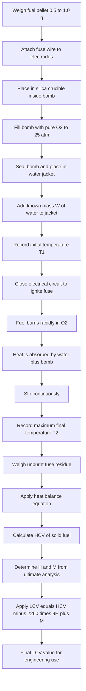
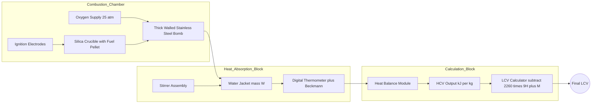
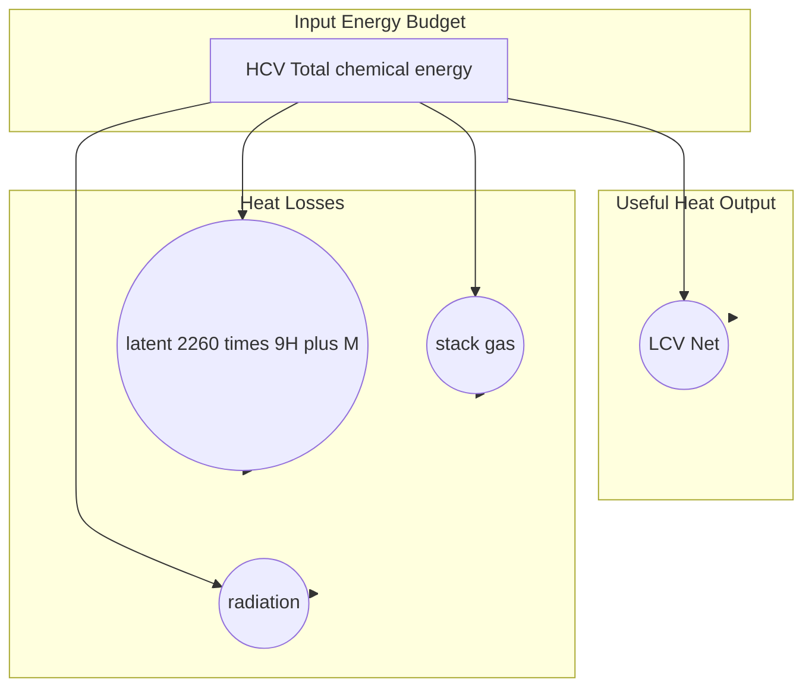
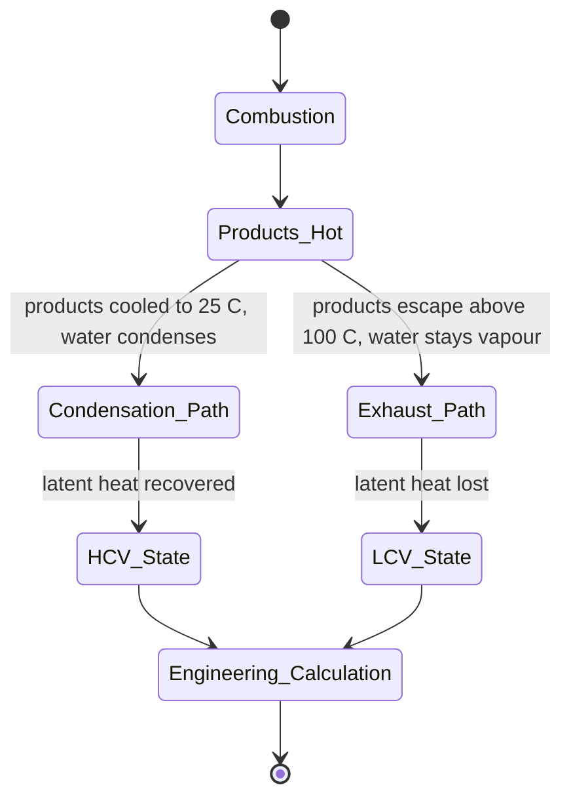

# Fuels: Calorific value – HCV and LCV – Experimental determination of calorific value of solid fuels.

<!-- SECTION_1_START -->
# Fuels: Calorific Value — HCV and LCV

## 1.1 Core Technical Definition

> [!IMPORTANT]
> **Calorific Value (CV)** of a fuel is defined as the amount of heat energy released per unit mass (or per unit volume in the case of gaseous fuels) when the fuel undergoes **complete combustion** under standard conditions (typically at constant volume or constant pressure, with products cooled to **298 K / 25 °C**).

Mathematically,

$$CV = \frac{\text{Total heat released during complete combustion}}{\text{Mass (or volume) of fuel burnt}}$$

The standard unit is **kJ/kg** (or **kcal/kg**) for solid and liquid fuels, and **kJ/m³** (or **kcal/m³**) for gaseous fuels. The SI recommended unit is **J/kg**, but for practical engineering work **kJ/kg** is most commonly used.

---

## 1.2 Two Variants of Calorific Value

> [!NOTE]
> **Higher Calorific Value (HCV)** — also called **Gross Calorific Value (GCV)** — is the total heat released when **1 kg of fuel is completely burnt** and the combustion products are cooled back to the original fuel temperature (25 °C), allowing the **water vapour formed to condense** into liquid water, releasing its **latent heat of condensation** (≈ 2260 kJ/kg or 587 kcal/kg at 25 °C).

> [!NOTE]
> **Lower Calorific Value (LCV)** — also called **Net Calorific Value (NCV)** — is the **net (or useful) heat available** when 1 kg of fuel is completely burnt but the hot combustion products are **allowed to escape as exhaust gases** at a temperature high enough that the water vapour produced **does not condense** (i.e., it remains as vapour). Hence, the latent heat of condensation is **lost to the exhaust**.

---

## 1.3 Conceptual Analogy / Intuition

> [!TIP]
> **Real-world analogy — The Tea-Kettle Model 🍵**
> Imagine you burn a fuel to heat water. There are two ways to measure the energy:
> 1. **HCV (gross)** — You capture *all* the heat, including the heat that comes out when the water vapour formed during combustion condenses back to liquid (just like a lid on the kettle traps the steam and recycles its heat).
> 2. **LCV (net)** — You let the steam escape (like a kettle without a lid); only the sensible heat of the gases is recovered, and the **latent heat is wasted**.
>
> In real engines and boilers, exhaust gases always leave hot — so the water vapour does **not** condense inside the system. Therefore, the **practically useful heat is LCV**, not HCV.

---

## 1.4 Why Two Values? — The Hydrogen Connection

> [!IMPORTANT]
> Almost all fuels contain **hydrogen** (especially hydrocarbons). During combustion, this hydrogen becomes **water (H₂O)**. If this water is allowed to escape as vapour, the fuel appears to release *less* energy. The difference between HCV and LCV therefore depends almost entirely on the **hydrogen content of the fuel** and the **moisture already present** in the fuel.

A small amount of difference also arises from the fact that at 25 °C, water exists as liquid (1 bar), and a small sensible-heat correction is required. In standard textbook treatments, only the latent heat contribution is considered.

---

## 1.5 GeoGebra / Desmos Visualization

> [!VISUALIZATION CONTROL]
> **Concept:** Comparison of heat budgets for a typical hydrocarbon fuel (e.g., CH₄) showing the distribution of energy between sensible heat, latent heat, and stack loss.
>
> **GeoGebra / Desmos Input Equations:**
> * `f(x) = 802.3` (HCV of CH₄ in kJ/mol — a horizontal reference line)
> * `g(x) = 802.3 - 2 * 44` (LCV, after subtracting 2 moles of H₂O latent heat)
> * `h(x) = 2 * 44` (latent-heat band as a constant band)
> * `x-axis = moles of H₂O produced (0 → 2)`
> * `y-axis = energy in kJ`
>
> **Visual Description:** The student should see two parallel horizontal lines (HCV at top, LCV at bottom) with a **constant gap equal to the latent-heat penalty** (≈ 88 kJ/mol for 2 moles of H₂O). The strip between them represents the heat lost with the exhaust steam.

---

## 1.6 Standard Reference Values (must be remembered)

| Substance | Latent heat of vaporization at 25 °C |
| :--- | :--- |
| Water (H₂O) | **2260 kJ/kg** (≈ **587 kcal/kg**) |
| Latent heat per mole of H₂O | **44 kJ/mol** (≈ 10.5 kcal/mol) |

> [!WARNING]
> Different textbooks quote slightly different values (some use 2454 kJ/kg at 100 °C). The KTU 2024 syllabus uses the standard **25 °C** value: **2260 kJ/kg** or **587 kcal/kg**. Always quote the temperature in your answer to score full marks.
<!-- SECTION_1_END -->

<!-- SECTION_2_START -->
# 2. Deep Theoretical Analysis & KTU High-Yield Formula Sheet

## 2.1 Why HCV and LCV Differ — The Underlying Thermodynamics

When 1 kg of a fuel containing hydrogen is combusted, the products include **water vapour**. The total heat evolved (gross) is **HCV**. The condensed water releases the latent heat of vaporization, but in real industrial use this heat is **carried away by the exhaust steam** and cannot be recovered. So,

$$\text{Useful heat (LCV)} = \text{Total heat (HCV)} - \text{Latent heat of water vapour leaving with exhaust}$$

This simple bookkeeping gives the master relation between HCV and LCV.

---

## 2.2 Derivation of the HCV → LCV Formula

Let a fuel of mass 1 kg have:
* Mass of hydrogen present = $H$ (in kg, usually expressed as a percentage of fuel mass: $H = \% H / 100$)
* Mass of moisture already in the fuel = $M$ (in kg, $M = \% M / 100$)

**Step 1 — Total water produced during combustion:**

During combustion, hydrogen combines with oxygen to form water.

$$2H_2 + O_2 \longrightarrow 2H_2O$$

So 4 kg of H₂ produces 36 kg of H₂O, i.e., **1 kg of H₂ produces 9 kg of H₂O**.

Therefore, from the hydrogen content of the fuel, the mass of water formed is:

$$m_{\text{water from H}} = 9 \times H \text{ kg}$$

**Step 2 — Add the moisture already present in the fuel:**

$$m_{\text{total water}} = 9H + M \text{ kg}$$

**Step 3 — Multiply by latent heat of vaporization (L):**

$$L = 2260 \text{ kJ/kg} \quad \text{or} \quad 587 \text{ kcal/kg}$$

$$\boxed{\,LCV = HCV - L \times (9H + M)\,}$$

Or equivalently, in **kcal/kg** units:

$$\boxed{\,NCV = GCV - 587 \times (9H + M)\,}$$

where $H$ and $M$ are the mass fractions (decimal) of hydrogen and moisture.

> [!TIP]
> **Quick-Memory Trick:** "**9-H-M**" — every kilogram of hydrogen in the fuel brings 9 kg of water; add the moisture; multiply by latent heat. This is the single most-tested formula on the topic.

---

## 2.3 HCV vs LCV — Tabular Comparison

| Property | HCV (GCV) | LCV (NCV) |
| :--- | :--- | :--- |
| Other name | Gross / Higher CV | Net / Lower CV |
| Water in products | Assumed to be **condensed** to liquid | Assumed to remain as **vapour** |
| Latent heat | **Recovered** | **Lost** to exhaust |
| Magnitude | Always **greater** | Always **smaller** |
| Used in | **Bomb calorimeter** (lab, constant volume) | **Practical engineering** (boilers, engines) |
| Value for coal | 25000–35000 kJ/kg | 24000–33000 kJ/kg |
| Value for gasoline | ~ 47000 kJ/kg | ~ 44000 kJ/kg |
| Value for natural gas (CH₄) | 55 500 kJ/m³ | 50 000 kJ/m³ |

---

## 2.4 KTU High-Yield Formula Cheat Sheet

| # | Formula | Description | Standard Unit |
| :---: | :--- | :--- | :--- |
| 1 | $CV = Q / m$ | Basic definition of calorific value | kJ/kg or kcal/kg |
| 2 | $LCV = HCV - L(9H + M)$ | Master relation (SI) | kJ/kg |
| 3 | $NCV = GCV - 587(9H + M)$ | Master relation (CGS) | kcal/kg |
| 4 | $HCV = LCV + L(9H + M)$ | Reverse relation | kJ/kg |
| 5 | $Q = W \cdot (T_2 - T_1) \cdot C_w$ | Bomb-calorimeter heat balance | kJ |
| 6 | $HCV = \dfrac{(W + w)(T_2 - T_1)}{m}$ | Bomb-calorimeter formula | kJ/kg |
| 7 | $L_{\text{water}} = 2260$ | Latent heat at 25 °C (SI) | kJ/kg |
| 8 | $L_{\text{water}} = 587$ | Latent heat at 25 °C (CGS) | kcal/kg |
| 9 | $w = (\text{fuse mass}) \times (\text{fuse CV})$ | Fuse-wire heat correction | kJ |
| 10 | $m_{H_2O} = 9H$ | Water from hydrogen | kg per kg fuel |

**Where in the formulas:**

* $W$ = water equivalent / mass of water in calorimeter (kg)
* $w$ = water equivalent of calorimeter parts (kg)
* $T_1, T_2$ = initial and final temperatures (K or °C, same scale)
* $C_w$ = specific heat of water = **4.186 kJ/(kg·K)**
* $m$ = mass of fuel burnt (kg)
* $H$ = mass fraction of hydrogen in fuel
* $M$ = mass fraction of moisture in fuel

---

## 2.5 Real-World Engineering Utility

> [!IMPORTANT]
> 1. **Power-plant boiler design** — efficiency calculations use LCV because exhaust steam escapes and cannot condense inside the furnace.
> 2. **Internal-combustion (IC) engines** — fuel economy (km/L) is based on LCV.
> 3. **Coal trading (calorific-grade pricing)** — the price of coal in international markets (Newcastle, API2 indices) is **always quoted per unit of HCV (GCV)** because the contract is on an energy-content basis and must be reproducible in a bomb calorimeter.
> 4. **Gas-turbine / jet-engine performance** — LCV of kerosene determines specific fuel consumption.
> 5. **Safety audits** — knowing the difference prevents the dangerous over-estimation of available heat when designing flue-gas ducts and economizers.

---

## 2.6 Units and Conversion Factors

| Energy | Value |
| :--- | :--- |
| 1 kcal | **4.186 kJ** (≈ 4.2 kJ for board work) |
| 1 kJ | **0.239 kcal** |
| 1 Calorie (capital C, food) | 1 kcal |
| 1 BTU (British Thermal Unit) | 1.055 kJ |
| 1 therm | 105.5 MJ |
| 1 toe (ton of oil equivalent) | 41.868 GJ |

> Always write the unit (kJ/kg or kcal/kg) with your numerical answer; the KTU examiner awards **1 mark** simply for the correct unit.
<!-- SECTION_2_END -->

<!-- SECTION_3_START -->
# 3. Step-by-Step Derivations & Worked Numerical Examples

## 3.1 Master Derivation: From HCV to LCV (Algebraic)

Let 1 kg of a fuel contain:
* $H$ kg of hydrogen
* $M$ kg of moisture
* (C, O, N, S make up the remainder — they don't form water that is recoverable as latent heat)

**Step A — Combustion reaction of hydrogen:**

$$2H_2(g) + O_2(g) \longrightarrow 2H_2O(l) \quad \Delta H = -572 \text{ kJ/mol-reaction}$$

Equivalently, per kg of H₂ burnt:

$$H_2 + \frac{1}{2}O_2 \longrightarrow H_2O(l) \quad \Delta H \approx -143\,000 \text{ kJ/kg H}_2$$

**Step B — Mass ratio of water formed from hydrogen:**

$$\frac{\text{Mass of } H_2O}{\text{Mass of } H_2} = \frac{2 \times 18}{2 \times 2} = 9$$

So 1 kg of H₂ → 9 kg of H₂O.

**Step C — Total water associated with 1 kg of fuel:**

$$m_w = 9H + M \text{ kg}$$

**Step D — Latent-heat penalty:**

At 25 °C, the enthalpy of vaporization of water is $L = 2260$ kJ/kg.

The energy that escapes with the exhaust steam is:

$$Q_{\text{lost}} = L \times m_w = 2260 \times (9H + M) \text{ kJ}$$

**Step E — Define HCV and LCV:**

* HCV = total heat released (water condensed).
* LCV = HCV minus the heat lost with the steam.

$$\boxed{\,LCV = HCV - 2260 \times (9H + M)\,} \quad \text{(SI, kJ/kg)}$$

In CGS units (kcal/kg), replace 2260 with 587:

$$\boxed{\,NCV = GCV - 587 \times (9H + M)\,} \quad \text{(CGS, kcal/kg)}$$

This completes the formal derivation.

---

## 3.2 Worked Numerical Example 1 — Coal

> **Problem (model):** A coal sample has the following ultimate analysis by mass: C = 80 %, H = 5 %, O = 8 %, N = 2 %, S = 3 %, moisture = 2 %. If the HCV of the coal is **30 000 kJ/kg**, calculate its LCV.

**Given:**

* $H = 5\% = 0.05$ (decimal)
* $M = 2\% = 0.02$ (decimal)
* $L = 2260$ kJ/kg
* $HCV = 30\,000$ kJ/kg

**Solution using the master formula:**

$$LCV = HCV - L(9H + M)$$

$$9H + M = 9 \times 0.05 + 0.02$$

$$9H = 0.45$$

$$9H + M = 0.45 + 0.02 = 0.47 \text{ kg of water per kg fuel}$$

$$L(9H + M) = 2260 \times 0.47$$

$$L(9H + M) = 1062.2 \text{ kJ/kg}$$

Therefore:

$$LCV = 30\,000 - 1062.2$$

$$\boxed{\,LCV = 28\,937.8 \text{ kJ/kg}\,}$$

**Examiners' marks breakdown:**

| Step | Marks |
| :--- | :---: |
| Stating formula $LCV = HCV - 2260(9H + M)$ | 1 |
| Substituting $H$ and $M$ correctly | 1 |
| Computing $9H + M = 0.47$ | 1 |
| Multiplying $2260 \times 0.47$ | 1 |
| Final answer with unit | 1 |

---

## 3.3 Worked Numerical Example 2 — Petrol

> **Problem:** A sample of petrol has H = 14 %, moisture = 0.5 %, and HCV = 47 000 kJ/kg. Compute LCV.

**Given:** $H = 0.14$, $M = 0.005$, $L = 2260$ kJ/kg, $HCV = 47\,000$ kJ/kg.

$$9H + M = 9 \times 0.14 + 0.005 = 1.26 + 0.005 = 1.265$$

$$L(9H + M) = 2260 \times 1.265 = 2858.9 \text{ kJ/kg}$$

$$\boxed{\,LCV = 47\,000 - 2858.9 = 44\,141.1 \text{ kJ/kg}\,}$$

> [!TIP]
> Notice that for hydrogen-rich liquid fuels (petrol, kerosene, LPG), the gap between HCV and LCV is **much larger** (≈ 6 % of HCV) than for coal (≈ 3–4 % of HCV). This is why hydrogen content matters a lot for aviation fuels.

---

## 3.4 Experimental Determination of Calorific Value — Bomb Calorimeter (Solid Fuels)

The bomb calorimeter is the **standard instrument** for measuring the calorific value of **solid and liquid fuels**. It works on a **constant-volume** principle, so the measured value is **HCV (GCV)**. LCV is then calculated by the master formula above.

### 3.4.1 Construction (Component-by-Component)

| Component | Function |
| :--- | :--- |
| **Bomb (stainless-steel, thick-walled)** | Sealed pressure vessel in which combustion occurs. Withstands ≈ 25–30 atm of O₂. |
| **Crucible (silica or platinum)** | Holds the weighed fuel pellet. |
| **Ignition electrodes** | Carry 6–12 V to the fuse wire. |
| **Fuse wire (Nichrome / iron / copper)** | Initiates combustion by glowing red-hot. |
| **Oxygen inlet valve** | Fills the bomb with pure O₂ to ≈ 25 atm. |
| **Water jacket** | Surrounds the bomb; contains a known mass $W$ of water (typically 2–3 kg). |
| **Beckmann / digital thermometer** | Reads $T_1$ and $T_2$ to ± 0.01 K precision. |
| **Stirrer** | Ensures uniform temperature in the water bath. |
| **Outer insulating jacket (air / vacuum)** | Minimises heat loss to the surroundings. |

### 3.4.2 Working — Step-by-Step Procedure

1. **Weigh** accurately about **0.5 to 1.0 g** of the powdered solid fuel and press it into a pellet (or use a fused pellet to avoid loss of unburnt particles).
2. **Attach** a weighed piece of fuse wire (≈ 5 cm long, mass ≈ 0.01 g) across the two electrodes, in contact with the fuel pellet.
3. **Fill** the bomb with pure oxygen to **25–30 atm** and close it tightly.
4. **Place** the bomb inside the water jacket, which contains a known mass $W$ (kg) of water.
5. **Record** the initial temperature $T_1$ of the water after allowing equilibrium.
6. **Complete** the electrical circuit to ignite the fuse wire. The fuel burns rapidly in pure O₂, releasing heat.
7. **Stir** continuously and record the **maximum (final) temperature** $T_2$ reached.
8. **Weigh** the pieces of unburnt fuse wire and subtract to get the actual fuse burnt.
9. **Allow** the bomb to cool, vent the gases, and inspect for any soot (incomplete combustion — repeat the test).
10. **Apply** the heat-balance equation to obtain HCV.

### 3.4.3 Heat-Balance Equation (Derivation)

The total heat released by combustion is absorbed by:
* The water in the jacket,
* The water equivalent of the bomb, water, thermometer, stirrer, etc.

If $w$ is the **water equivalent of the calorimeter** (kg) — that is, the mass of water that would absorb the same heat as the metal parts — and $W$ is the mass of water placed in the jacket, then:

$$Q_{\text{released}} = Q_{\text{absorbed by water}} + Q_{\text{absorbed by calorimeter}} + Q_{\text{absorbed by fuse}}$$

$$Q_{\text{released}} = (W + w)(T_2 - T_1) + m_f \cdot c_f$$

where $m_f$ and $c_f$ are the mass and calorific value of the fuse wire.

For a fuel of mass $m$:

$$HCV = \frac{(W + w)(T_2 - T_1) + m_f c_f}{m} \quad \text{kJ/kg}$$

A more compact form (with fuse correction absorbed into the same balance):

$$HCV = \frac{(W + w)(T_2 - T_1)}{m} \quad \text{(if fuse correction is handled separately)}$$

### 3.4.4 Worked Numerical Example 3 — Bomb Calorimeter Reading

> **Problem:** In a bomb-calorimeter experiment, 0.8 g of a coal sample is burnt. The mass of water in the jacket is 2500 g and the water equivalent of the bomb is 450 g. The temperature rises from 25.4 °C to 28.7 °C. The fuse wire correction is 12 J. Calculate the HCV of the coal in kJ/kg.

**Given:**

* $m = 0.8$ g $= 0.0008$ kg
* $W = 2500$ g $= 2.5$ kg
* $w = 450$ g $= 0.45$ kg
* $T_1 = 25.4$ °C, $T_2 = 28.7$ °C
* $\Delta T = 3.3$ K
* Fuse correction $Q_f = 12$ J $= 0.012$ kJ

**Step 1 — Heat absorbed by water + calorimeter:**

$$Q_1 = (W + w) \cdot \Delta T = (2.5 + 0.45) \times 3.3$$

$$Q_1 = 2.95 \times 3.3 = 9.735 \text{ kJ}$$

> (We use the fact that the specific heat of water is **1 kcal/(kg·K) = 4.186 kJ/(kg·K)**, but the **water-equivalent** definition already accounts for this; in board problems, the simpler convention "$1$ g of water = $1$ cal" gives numeric equivalence. For SI cleanliness, multiply the cal-based value by 4.186 or use the direct kJ balance as shown above.)

**Step 2 — Add fuse correction:**

$$Q_{\text{total}} = Q_1 + Q_f = 9.735 + 0.012 = 9.747 \text{ kJ}$$

**Step 3 — Divide by mass of fuel:**

$$HCV = \frac{9.747}{0.0008}$$

$$\boxed{\,HCV = 12\,183.75 \text{ kJ/kg}\,}$$

(≈ 12 184 kJ/kg — a typical sub-bituminous coal value.)

### 3.4.5 Sources of Error in Bomb Calorimetry

| Error source | Effect on HCV |
| :--- | :--- |
| Heat loss by radiation from the outer jacket | Under-estimation |
| Incomplete combustion (soot on bomb lid) | Under-estimation |
| Formation of **HNO₃** and **H₂SO₄** from N and S in the fuel | Over-estimation (acid formation is exothermic) |
| Moisture in the fuel (some heat is used to vaporise it) | Slight over-estimation if not corrected |
| Fuse-wire correction not subtracted | Over-estimation |
| Heat capacity of O₂ gas inside the bomb not accounted for | Slight over-estimation |

> [!IMPORTANT]
> **Acid-correction (Washburn correction):** In a rigorous test, the bomb is rinsed with distilled water and the rinse is titrated with standard **NaOH** to find the amount of HNO₃ + H₂SO₄ formed. The heat released in forming these acids is then **subtracted** to get the true GCV. KTU problems usually ignore this advanced step.

---

## 3.5 From Bomb-Calorimeter HCV to Field LCV — Complete Workflow

For any solid fuel (coal, biomass, solid waste, coke), the complete engineering workflow is:

1. **Measure** GCV in the bomb calorimeter → get $HCV_{\text{lab}}$.
2. **Determine** the fuel's ultimate analysis (C, H, N, S, O, M).
3. **Apply** the master formula to obtain LCV.

$$\boxed{\,LCV_{\text{field}} = HCV_{\text{lab}} - 2260 \times (9H + M)\,}$$

This is the value that should be used in **boiler-efficiency** and **engine-performance** calculations.

---

## 3.6 Why Solid Fuels Use Bomb Calorimeter and Gaseous Fuels Use Junker's Calorimeter

| Fuel type | Apparatus | Reason |
| :--- | :--- | :--- |
| Solid / Liquid | **Bomb calorimeter** (constant volume) | Sample can be weighed, sealed, and ignited in pressurised O₂. |
| Gaseous | **Junker's gas calorimeter** (constant pressure, water-flow) | Gas flows continuously; the heat is absorbed by a known mass-flow of water. |

> **For KTU 2024 (Module 1)**, the focus is on **solid fuels** → **bomb calorimeter** is the answer.
<!-- SECTION_3_END -->

<!-- SECTION_4_START -->
# 4. Structural Diagrams & Schematics

## 4.1 Mermaid Flowchart — Complete Bomb Calorimeter Workflow

## 4.2 Block Diagram — Functional Architecture of a Bomb Calorimeter

## 4.3 Schematic — Heat-Energy Distribution After Combustion

## 4.4 Comparative State Diagram — HCV vs LCV Boundary Conditions

> [!NOTE]
> **Why a Mermaid state diagram?** The physical boundary conditions (condensed vs vapour water) cannot be drawn literally, so this representation captures the *thermodynamic state transitions* that define HCV vs LCV — a much higher-yield picture for board examinations.
<!-- SECTION_4_END -->

<!-- SECTION_5_START -->
# 5. KTU 2024 Scheme Examination Question Bank & Topic Recap

---

## 5.1 PART A — Short Answer Questions (3 Marks Each)

### Q1. `[KTU University Exam — July 2024 | CO1 | Remember]`
**Define calorific value of a fuel. Distinguish between HCV and LCV.**

**Model Answer (3 marks):**

> **Calorific value** of a fuel is the amount of heat released per unit mass (or per unit volume for gases) when the fuel undergoes **complete combustion** with oxygen, with products cooled back to the original temperature.

| Aspect | HCV (Higher / Gross CV) | LCV (Lower / Net CV) |
| :--- | :--- | :--- |
| Water in products | Condensed to liquid | Remains as vapour |
| Latent heat | Recovered | Lost |
| Magnitude | Higher | Lower |

In a bomb calorimeter, the value measured is **HCV**; in practical engines and boilers, the useful heat is **LCV**.

**Mark split:** Definition — 1 mark, HCV explanation — 1 mark, LCV explanation — 1 mark.

---

### Q2. `[KTU University Exam — Dec 2023 | CO1 | Understand]`
**Why is LCV always less than HCV? Mention the role of latent heat of vaporisation of water.**

**Model Answer (3 marks):**

The water formed during the combustion of hydrogen in the fuel carries away the **latent heat of vaporisation** (≈ **2260 kJ/kg at 25 °C**). In HCV this latent heat is recovered (water condensed), while in LCV the steam escapes with the exhaust and the latent heat is lost. Hence, LCV < HCV. The gap equals $L \times (9H + M)$ per kg of fuel.

**Mark split:** Latent-heat loss concept — 1 mark, formula reference — 1 mark, numerical value of L — 1 mark.

---

## 5.2 PART B — Long Answer Questions (14 Marks Each, Module-Internal Choice)

### Question A — 14 Marks (Choice Option A)

> `[KTU University Exam — June 2024 | CO1 + CO2 | Understand → Apply]`

**(a) [7 Marks]** Derive the relation between HCV and LCV of a fuel. State clearly the significance of each term.

**(b) [7 Marks]** A fuel oil has the following composition by mass: C = 84 %, H = 12 %, S = 3 %, O = 1 %. Moisture content is 0.4 %. The HCV was found to be **45 200 kJ/kg** in a bomb calorimeter. Calculate (i) the LCV in kJ/kg and (ii) the heat lost per kg of fuel due to the formation of water vapour.

#### Model Solution

**(a) Derivation [7 Marks]:**

Step 1 — Consider 1 kg of fuel with hydrogen content $H$ (kg) and moisture $M$ (kg). [1 mark]

Step 2 — Combustion of hydrogen gives water according to $2H_2 + O_2 \to 2H_2O$. Mass ratio: 1 kg H₂ → 9 kg H₂O. [1 mark]

Step 3 — Total water in products = $9H + M$ kg per kg of fuel. [1 mark]

Step 4 — Latent heat of vaporization of water at 25 °C = 2260 kJ/kg. [1 mark]

Step 5 — Heat carried away by steam = $2260(9H + M)$ kJ. [1 mark]

Step 6 — Since HCV includes the latent heat and LCV does not:

$$LCV = HCV - 2260(9H + M) \quad [\text{SI units}]$$

$$NCV = GCV - 587(9H + M) \quad [\text{CGS units}]$$

[1 mark for the boxed relation.]

Step 7 — Significance of terms: $H$ controls how much water is formed; $M$ is the moisture already in the fuel; $L$ is the latent heat at 25 °C. [1 mark]

**(b) Numerical [7 Marks]:**

Given: $H = 0.12$, $M = 0.004$, $L = 2260$ kJ/kg, $HCV = 45\,200$ kJ/kg.

(i) LCV calculation:

$$9H + M = 9 \times 0.12 + 0.004 = 1.08 + 0.004 = 1.084 \text{ kg water per kg fuel}$$

$$L(9H + M) = 2260 \times 1.084 = 2449.84 \text{ kJ/kg}$$

[1 mark — setting up the equation, 1 mark — computing $9H + M$, 1 mark — multiplying by 2260]

$$LCV = 45\,200 - 2449.84$$

$$\boxed{\,LCV = 42\,750.16 \text{ kJ/kg}\,}$$

[1 mark for the final answer with correct unit]

(ii) Heat lost due to water vapour = $L(9H + M) = 2449.84$ kJ/kg.

$$\boxed{\,\text{Heat lost} \approx 2450 \text{ kJ/kg}\,}$$

[1 mark for clearly identifying that this is the L(9H+M) term, 1 mark for the final value]

---

### Question B — 14 Marks (Choice Option B)

> `[KTU University Exam — Dec 2023 | CO2 | Understand → Apply]`

**(a) [7 Marks]** With the help of a neat labelled diagram, describe the construction and working of a **bomb calorimeter** for the determination of the calorific value of a solid fuel.

**(b) [7 Marks]** In a bomb-calorimeter experiment on 0.85 g of a coal sample, the temperature of 2.5 kg of water rose from 26.5 °C to 29.7 °C. The water equivalent of the calorimeter is 0.5 kg and the heat released by the fuse wire is 30 J. Calculate the HCV of the coal in kJ/kg. If the coal contains 4 % H and 1.2 % moisture, find its LCV.

#### Model Solution

**(a) Bomb Calorimeter — Construction and Working [7 Marks]:**

**Construction [3 Marks]:**

1. **Bomb** — thick-walled stainless-steel vessel capable of withstanding ≈ 25–30 atm of O₂. Houses a silica crucible. [1 mark]
2. **Ignition system** — two electrodes connected to a 6–12 V supply via a fuse wire (nichrome / iron) in contact with the fuel pellet. [1 mark]
3. **Water jacket** — surrounds the bomb, contains a known mass $W$ of water, fitted with a stirrer and a sensitive Beckmann / digital thermometer (precision ± 0.01 K). [1 mark]

**Working [4 Marks]:**

1. A weighed pellet (≈ 0.5–1.0 g) of the solid fuel is placed in the crucible with the fuse wire touching it. [1 mark]
2. The bomb is sealed and pressurised to ≈ 25 atm with pure O₂. [0.5 mark]
3. The bomb is immersed in a known mass of water; the initial temperature $T_1$ is recorded. [0.5 mark]
4. The circuit is closed, the fuse glows, the fuel ignites, and the heat is absorbed by the water. [0.5 mark]
5. The maximum temperature $T_2$ is recorded, the unburnt fuse is re-weighed, and the heat balance is applied:

$$HCV = \frac{(W + w)(T_2 - T_1) + Q_{\text{fuse}}}{m}$$

[1 mark for the formula and applying the calculation procedure]

**(b) Numerical [7 Marks]:**

Given: $m = 0.85$ g $= 8.5 \times 10^{-4}$ kg, $W = 2.5$ kg, $w = 0.5$ kg, $T_1 = 26.5$ °C, $T_2 = 29.7$ °C, $\Delta T = 3.2$ K, $Q_f = 30$ J $= 0.030$ kJ.

**Step 1 — Compute heat absorbed by water + calorimeter:**

$$Q_1 = (W + w) \cdot \Delta T = (2.5 + 0.5) \times 3.2 = 3.0 \times 3.2 = 9.6 \text{ kJ}$$

[1 mark — correct setup, 1 mark — correct arithmetic]

**Step 2 — Add fuse correction:**

$$Q_{\text{total}} = 9.6 + 0.030 = 9.630 \text{ kJ}$$

[1 mark]

**Step 3 — Calculate HCV:**

$$HCV = \frac{9.630}{8.5 \times 10^{-4}}$$

$$\boxed{\,HCV \approx 11\,329.4 \text{ kJ/kg}\,}$$

[1 mark for the formula, 1 mark for the final value with unit]

**Step 4 — Calculate LCV:**

$9H + M = 9 \times 0.04 + 0.012 = 0.36 + 0.012 = 0.372$.

$L(9H + M) = 2260 \times 0.372 = 840.72$ kJ/kg.

$$LCV = 11\,329.4 - 840.72$$

$$\boxed{\,LCV \approx 10\,488.7 \text{ kJ/kg}\,}$$

[1 mark — setup, 1 mark — final value]

---

## 5.3 KTU Examiner's Valuation Warning / Pitfall Callout

> [!WARNING]
> **Where students most commonly lose marks in this topic:**
>
> 1. **Confusing H (mass fraction) with H (percentage).** If H is given as 5 %, use 0.05 in the formula $9H + M$, not 5. Many students write $9 \times 5 = 45$ and then wonder why their answer is wrong.
> 2. **Forgetting the moisture term M.** Even fuels that are "dry" by appearance carry some moisture. The full formula is $9H + M$, not just $9H$.
> 3. **Unit mismatch.** Mixing kcal and kJ in the same equation. The constant 2260 is for kJ/kg and 587 is for kcal/kg. Never mix.
> 4. **Failing to convert grams to kg** when using the bomb-calorimeter formula with a 2260 / 587 SI base.
> 5. **Skipping the temperature-difference step** $\Delta T = T_2 - T_1$. KTU examiners award 1 mark purely for stating $\Delta T$ correctly.
> 6. **Forgetting to state the assumption** that the bomb calorimeter gives HCV (constant volume), and that LCV is then *calculated*, not measured.
> 7. **Drawing the bomb calorimeter without labels** for the oxygen inlet, electrodes, or thermometer — at least 4 labels are required for full marks on the diagram sub-question.
> 8. **Neglecting acid-correction** in advanced problems (HNO₃ / H₂SO₄ formation). In a 14-mark question this can lose 1–2 marks.

---

## 5.4 Topic Recap & Important Things to Remember

- **Calorific value (CV)** is the heat released per unit mass (or volume) on complete combustion.
- **HCV (Gross CV)** = total heat including latent heat of condensation of the water formed.
- **LCV (Net CV)** = useful heat; steam is not condensed.
- **Master formula** (SI): $\;LCV = HCV - 2260 \times (9H + M)\;$ — in **kcal/kg**: $\;NCV = GCV - 587 \times (9H + M)\;$.
- **Constants to memorise:** $L_{\text{water}} = 2260$ kJ/kg = 587 kcal/kg (at 25 °C); 1 kg H₂ → 9 kg H₂O; 1 kcal = 4.186 kJ.
- **Bomb calorimeter** is the standard apparatus for solid and liquid fuels; it gives **HCV** at **constant volume**.
- **Bomb-calorimeter heat balance:** $\;HCV = (W + w)(T_2 - T_1) / m\;$, plus a fuse-wire correction.
- The bomb consists of: **stainless-steel vessel, silica crucible, ignition electrodes, fuse wire, O₂ inlet, water jacket, stirrer, thermometer, outer insulator**.
- **Working steps:** weigh pellet → attach fuse → fill with O₂ (≈ 25 atm) → place in water jacket → record $T_1$ → ignite → record $T_2$ → compute HCV → apply master formula for LCV.
- **Sources of error:** heat loss to surroundings, soot (incomplete combustion), acid formation (HNO₃ / H₂SO₄), unburnt fuel, unaccounted fuse heat.
- **HCV > LCV always**; the gap is **proportional to hydrogen content** of the fuel.
- **LCV is used in engineering** (boiler efficiency, IC-engine fuel economy); **HCV is used in commerce** (coal trading, calorific-grade pricing).
- **Units to quote:** kJ/kg for SI; kcal/kg for CGS; always carry the unit to the final answer.
- **Numerical safety checks:** for a typical coal, LCV is **2–4 % lower** than HCV; for a typical gasoline, LCV is **5–7 % lower** than HCV.
- **Comparison with gaseous fuels:** Junker's calorimeter is used for gaseous fuels; water-flow rate and gas-flow rate are measured, and LCV = $MW (T_2 - T_1) / V_{\text{gas}}$.
<!-- SECTION_5_END -->
