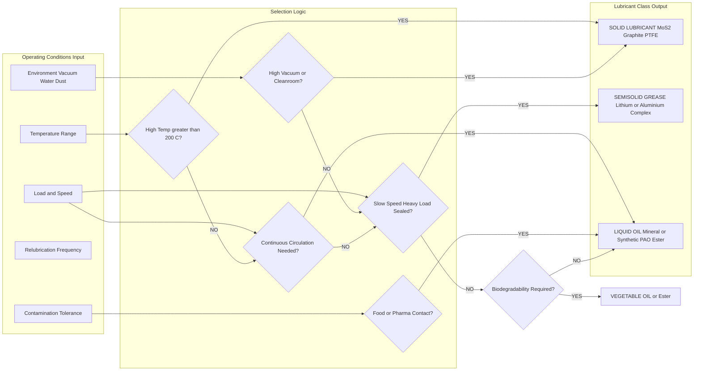
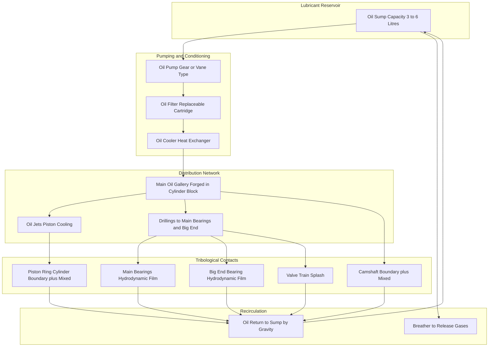

# Lubricants : Classification - Solid, Semisolid and Liquid lubricants.

<!-- SECTION_1_START -->
# Lubricants: Classification – Solid, Semisolid, and Liquid Lubricants

> [!NOTE]
> **KTU 2024 Syllabus Anchor — Module 1: Engineering Materials**
> This topic falls under the engineering applications segment of physical chemistry. It is a high-yield, conceptually straightforward area that frequently appears as a 3-mark direct question and as a 7-mark sub-part under Part B questions in ESE.

## 1.1 Formal Academic Definition

A **lubricant** is a substance (typically an organic oily or greasy material) introduced between two moving/sliding metallic surfaces in mutual contact to **reduce friction, dissipate heat, minimize wear and tear, prevent corrosion, and protect surfaces from contamination**. Lubricants form a thin, tenacious film (called the *boundary film* or *lubricant film*) that physically separates the asperities (microscopic peaks) of two contacting surfaces, thereby converting solid–solid friction into fluid friction.

> [!IMPORTANT]
> **Boundary Film Thickness Rule (Industrial Standard):**
> For hydrodynamic (liquid) lubrication to be effective, the film thickness must be at least **$10^{-6}$ m (1 µm)**. Below this, the regime shifts to *boundary lubrication* and ultimately to *asperity contact*.

### Conceptual Analogy — The Skating Rink Intuition

Imagine pushing a heavy wooden table across a rough concrete floor — it grinds, sticks, and resists. Now, place the same table on a **roller-skate wheel** (a near-frictionless rolling contact). The motion becomes effortless.

- The **wheel** is the lubricant in its mechanical analogy.
- The **gap between the wheel and the floor** is the *lubricant film*.
- The **effort saved** corresponds to the **reduction in the coefficient of friction ($\mu$)** — which for steel-on-steel unlubricated contact is $\mu \approx 0.5$–$0.8$, but with effective lubrication drops to $\mu \approx 0.001$–$0.05$.

A more chemistry-friendly analogy: think of a **kitchen sandwich**. Two slices of dry bread (metal surfaces) stick to each other. Add a layer of butter (lubricant) and they slide past each other easily. The butter (lubricant) must:
1. *Adhere* to the bread (oil-wettability),
2. *Stay coherent* under shear (viscosity),
3. *Not evaporate or oxidize* during use (thermal & oxidative stability).

## 1.2 The Master Classification of Lubricants

Lubricants are classified based on their **physical state at room temperature (25 °C, 1 atm)** and their **mechanism of action**.

> [!TIP]
> **Memory Hook for KTU Viva:** *"SLG"* — **S**olid, semi**L**iquid (Semisolid), **G**reasy/Liquid — read in the order Solid → Semisolid → Liquid.

| S. No. | Broad Class | Physical State | Common Industrial Name |
|:------:|:------------|:---------------|:-----------------------|
| 1 | Solid Lubricants | True solids (powders / coatings) | Dry lubricants (e.g., graphite, MoS₂) |
| 2 | Semisolid Lubricants | Paste / gel-like | Greases |
| 3 | Liquid Lubricants | Free-flowing fluids | Oils (mineral, synthetic, vegetable) |

> [!VISUALIZATION CONTROL]
> **Concept:** State-of-matter based classification tree of lubricants
> **GeoGebra / Desmos Input Equations (Categorical — not graphical):** Plot a *bar chart* on a number line where the x-axis is "Temperature (°C)" and the y-axis is "Physical State Region":
> * Liquid region: $T \geq 35°C$ → Oils
> * Semisolid region: $25°C \leq T < 35°C$ → Greases
> * Solid region: $T < 25°C$ → Dry powders
> **Visual Description:** Three stacked horizontal bands — top (liquid, free-flowing) → middle (semisolid, plastic flow) → bottom (solid, layered crystalline). Each band has a labeled region of practical temperature usage.

---

<!-- SECTION_1_END -->

<!-- SECTION_2_START -->
# Deep Theoretical Analysis — Classification, Mechanism, and Formula Sheet

## 2.1 Solid Lubricants

### 2.1.1 Definition and Mechanism

**Solid lubricants** are lamellar (layered) crystalline solids that provide lubrication by shearing along their *weak interlayer planes* rather than along the metal-metal interface. They are used in:
- Extreme temperature environments (rocket nozzles, furnace bearings).
- High-vacuum systems (spacecraft, semiconductor fabrication).
- Environments where liquid contamination is forbidden (food processing, textile machinery).

### 2.1.2 Classification of Solid Lubricants

**(a) Layered-Lattice Type** — possess weakly bonded basal planes:
- **Graphite (C)** — dark grey, hexagonal layered carbon; lubricity requires adsorbed water vapor (fails in pure vacuum unless humidity is maintained).
- **Molybdenum disulfide (MoS₂)** — *dry lubricant of space*; works in vacuum; melting point **1185 °C**.
- **Tungsten disulfide (WS₂)** — superior to MoS₂ in high-load applications.
- **Boron nitride (hexagonal, h-BN)** — "white graphite"; stable up to **900 °C in air**.

**(b) Non-Layered Type**:
- **Teflon (PTFE, polytetrafluoroethylene)** — polymeric solid lubricant; $-\text{(CF}_2\text{-CF}_2\text{)}_n-$; chemically inert, used in low-friction bearings.
- **Lead (Pb), Indium (In), Tin (Sn)** — soft metal films; used in nuclear reactors and high-vacuum bearings.

**(c) Chemical-Conversion Coatings**:
- **Phosphate coatings** (e.g., manganese phosphate, zinc phosphate) on steel — convert metal surface to a porous crystalline layer that holds oil.

> [!IMPORTANT]
> **Why graphite fails in pure vacuum:** Lubricity of graphite depends on *intercalated water molecules* that weaken the van der Waals bonding between adjacent carbon layers. In a hard vacuum, water desorbs and graphite becomes abrasive.

### 2.1.3 Working Principle of Layered Solids

In MoS₂, the structure consists of **S–Mo–S** "sandwich" sheets held together by weak van der Waals forces:

$$\text{Interlayer shear stress} \;\; \tau_{shear} \approx 0.7 \text{ to } 1.0 \text{ MPa (for MoS}_2\text{)}$$

Compared to metal-metal asperity contact stress which can exceed **500–1000 MPa**, the layered solid reduces frictional shear by a factor of **~10³**.

## 2.2 Semisolid Lubricants (Greases)

### 2.2.1 Definition

A **grease** is a **semisolid to solid dispersion of a thickening agent (soap) in a liquid lubricant (base oil)**. It is a *two-phase colloidal system* where:
- The **dispersed phase** = soap fibers (lithium stearate, calcium stearate, sodium stearate, etc.).
- The **dispersion medium** = mineral or synthetic oil (continuous phase).

### 2.2.2 Composition of Grease (Typical wt%)

| Component | Weight % | Function |
|:----------|:--------:|:---------|
| Base oil (mineral/synthetic) | 70 – 95 % | Provides fluidity and lubrication |
| Thickener (soap) | 5 – 25 % | Provides the gel-like structure |
| Additives (anti-oxidant, anti-wear, EP) | 0 – 10 % | Enhance performance |

### 2.2.3 Mechanism of Greasing

When grease is applied, the **soap fiber matrix releases oil under shear** (this is called *oil bleeding* or *syneresis*). The released oil forms the hydrodynamic film, while the soap skeleton holds the lubricant in place, preventing it from being thrown off by centrifugal force or gravity. This is why greases are ideal for:
- **Open gears** (e.g., cement mills, sugar cane crushers)
- **Wheel bearings of railway wagons**
- **Chassis points of automobiles**

### 2.2.4 Classification of Greases by Soap Type

| Soap Thickener | Drop Point (°C) | Water Resistance | Typical Use |
|:---------------|:---------------:|:----------------:|:------------|
| **Calcium soap** (hydrated) | 80 – 100 | Excellent | Low-temp, water-rich environments |
| **Sodium soap** | 150 – 180 | Poor (water-soluble) | High-temp, dry bearings |
| **Lithium soap** | 180 – 200 | Good | Multi-purpose automotive grease (most common) |
| **Aluminum complex** | 200 – 230 | Excellent | High-temp industrial |
| **Barium / Bentone (clay)** | > 250 | Excellent | Extreme high-temp, food-grade |

> [!NOTE]
> **Drop Point (ASTM D566):** The temperature at which a grease passes from semisolid to liquid state and the first drop falls from the test cup. It is the *upper temperature limit* of grease usability.

## 2.3 Liquid Lubricants (Oils)

### 2.3.1 Definition

**Liquid lubricants** are free-flowing oily substances used to separate two moving metallic surfaces. They are the most widely used class, accounting for **> 90% of industrial lubricant consumption worldwide**.

### 2.3.2 Classification of Liquid Lubricants

**(A) Mineral Oils (Petroleum-derived)** — > 95% of market

Obtained from crude petroleum by vacuum distillation and refining. Composition = hydrocarbons (paraffins, naphthenes, aromatics) of carbon chain $C_{20}$ to $C_{70}$.

Sub-classes:
- **Paraffinic base oil** — straight/branched alkanes; high VI; good low-temp flow.
- **Naphthenic base oil** — cyclic alkanes; better solvency for additives; low pour point.
- **Aromatic base oil** — poor VI; mostly used as process oils, not engine oils.

**(B) Synthetic Oils** — engineered for extreme conditions

| Synthetic Type | Chemical Nature | Key Advantage |
|:---------------|:----------------|:--------------|
| Polyalphaolefins (PAO) | Branched alkanes | Wide temp range |
| Esters (diesters, polyol esters) | R-COO-R′ | Biodegradable, aviation turbines |
| Silicones (polydimethylsiloxane) | Si–O backbone | Thermally stable to 250 °C |
| Polyalkylene glycols (PAG) | Water-soluble ethers | Compressors, gearboxes |
| Phosphate esters | Aryl/alkyl phosphates | Fire-resistant (turbine, hydraulic) |
| Perfluoropolyethers (PFPE) | C–O–C with F | Space, vacuum, oxygen service |

**(C) Vegetable Oils (Bio-lubricants)**
- Castor oil, rapeseed (canola), sunflower, soybean.
- Triglyceride structure: $R_1\text{COO-CH}_2\text{-CH(OOCR}_2\text{)-CH}_2\text{OOCR}_3$
- Renewable, biodegradable, low toxicity — but **poor oxidative stability** (limit ~ 80–100 °C).

**(D) Animal Oils** (largely historical)
- Sperm oil, lard oil, tallow — high film strength; replaced by synthetics for cost/ethical reasons.

**(E) Blended Oils** — mineral + synthetic or mineral + vegetable for cost/performance balance.

### 2.3.3 Mechanism of Liquid Lubrication

Three lubrication regimes (Stribeck Curve, conceptual):

1. **Boundary Lubrication** — film thinner than asperities; lubricant molecules adsorb onto the metal.
2. **Mixed Lubrication** — partial film support; some asperity contact.
3. **Hydrodynamic / Full-Film Lubrication** — film completely separates surfaces; governed by the **Reynolds Equation** (1886).

## 2.4 KTU High-Yield Formula Sheet

> [!IMPORTANT]
> **Critical for ESE Numerical/Conceptual Questions**

| # | Formula / Concept | Symbol / Condition | Typical Unit | Where Used |
|:-:|:------------------|:-------------------|:-------------|:-----------|
| 1 | **Coefficient of Friction** $\mu = \dfrac{F_f}{F_n}$ | $F_f$ = frictional force, $F_n$ = normal load | dimensionless | All lubricant evaluation |
| 2 | **Viscosity (Dynamic)** $\tau = \eta \cdot \dfrac{du}{dy}$ | $\tau$ = shear stress, $\eta$ = dynamic viscosity, $du/dy$ = velocity gradient | Pa·s (SI) | Newton’s law of viscous flow |
| 3 | **Kinematic Viscosity** $\nu = \dfrac{\eta}{\rho}$ | $\rho$ = density | m²/s (= 10⁴ stokes) | Oil classification (ISO VG) |
| 4 | **Viscosity Index (VI)** | Measure of viscosity–temp stability; higher = flatter curve | dimensionless | Multigrade oil quality |
| 5 | **Sayer's Equation (boundary friction)** | $\mu \propto \dfrac{\tau_s}{F_n}$ | $\tau_s$ = shear strength of film | Solid lubricant rating |
| 6 | **Drop Point (Grease)** | ASTM D566 / D2265 | °C | Grease temperature limit |
| 7 | **Penetration (Grease)** ASTM D217 | Depth of standard cone into grease in 5 s at 25 °C | 0.1 mm (NLGI grade) | Grease consistency classification |
| 8 | **Flash Point (Oil)** ASTM D92 | Lowest temp at which oil vapor ignites | °C | Fire safety of liquid lubricant |
| 9 | **Fire Point (Oil)** ASTM D92 | Temp at which oil *continues* to burn for 5 s | °C | Fire safety, hydraulic fluids |
| 10 | **Pour Point (Oil)** ASTM D97 | Lowest temp at which oil just flows | °C | Low-temp operability |
| 11 | **Aniline Point** | Miscibility temp of oil with aniline | °C | Aromaticity of oil (lower = more aromatic) |
| 12 | **Neutralization Number (TAN/TBN)** ASTM D974 | mg KOH per g of oil | mg KOH/g | Acidic / basic reserve |
| 13 | **NLGI Consistency Number** | Worked penetration range | 000 to 6 | Grease hardness grade |
| 14 | **Emulsification Number** (Steam Emulsion Test) ASTM D1934 | Time to emulsify and separate water | seconds | Turbine oil demulsibility |

> [!NOTE]
> **NLGI Grease Classification (Quick Reference):**
> Grade 000 → semi-fluid (centralized lube systems)
> Grade 0 → very soft (gearbox)
> Grade 1 → soft
> Grade 2 → medium (most common automotive)
> Grade 3 → stiff
> Grade 4, 5, 6 → block greases

## 2.5 Real-World Engineering Utility

- **Automotive engine oils (SAE 5W-30, 10W-40, etc.)** — blended mineral + synthetic; reduce wear in IC engines running at 80–120 °C sump temperature.
- **Aviation turbine oils (MIL-PRF-23699)** — synthetic esters; survive 200 °C bulk oil temp and $-40$ °C ambient.
- **Cutting fluids in machining** — emulsified oil–water; cool *and* lubricate the tool-chip interface.
- **Refrigeration compressor oils** — must be miscible with refrigerant (e.g., mineral oil with R-12, POE with R-134a).
- **Food-grade lubricants (NSF H1)** — white mineral oil + PTFE; incidental food contact safe.
- **Space mechanisms (NASA GSFC spec)** — MoS₂ sputtered films + PFPE oils; no volatiles, no outgassing.

> [!TIP]
> **Industrial selection rule of thumb:**
> - High temp, high vacuum, clean room → **Solid lubricant** (MoS₂ / graphite).
> - Slow speed, heavy load, open gear, sealed bearing → **Grease**.
> - High speed, continuous circulation, internal combustion, turbine → **Liquid oil**.

---

<!-- SECTION_2_END -->

<!-- SECTION_3_START -->
# Step-by-Step Derivations, Worked Examples, and Worked Solutions

## 3.1 Comparative Property Analysis — Solid vs Semisolid vs Liquid

> [!NOTE]
> **Exhaustive Content Mandate:** All characteristic parameters are tabulated below; every property is defined in operational terms for engineering assessment.

| Property | Solid Lubricant | Semisolid (Grease) | Liquid Lubricant (Oil) |
|:---------|:----------------|:-------------------|:------------------------|
| **Physical state at 25 °C** | Solid (powder, film) | Paste / gel | Free-flowing fluid |
| **Film regeneration** | None — film is permanent | Slow — oil bleeds from soap matrix | Fast — circulating oil |
| **Cooling capacity** | None | Poor | Excellent (circulation + convection) |
| **Sealing/dust exclusion** | Excellent (dry film) | Excellent (soap seals) | Poor (requires seals) |
| **Load-bearing capacity** | Very high (up to 10⁴ MPa·m/s PV) | High (10³ MPa·m/s PV) | Moderate (10² MPa·m/s PV hydrodynamic) |
| **Speed limit** | Wide (0 to > 50 m/s) | Low to medium (up to 5–10 m/s) | High (up to 50 m/s in journal bearings) |
| **Temperature range** | $-200 °C$ to $+1100 °C$ (MoS₂) | $-30 °C$ to $+250 °C$ (clay grease) | $-60 °C$ to $+300 °C$ (synthetic esters, silicones) |
| **Cost (relative)** | Low to moderate | Moderate | High (synthetic) |
| **Leakage risk** | None | Very low | High — requires gaskets |
| **Examples** | Graphite, MoS₂, WS₂, h-BN, PTFE, Pb, Sn | Lithium grease, calcium grease, bentone grease | SAE 30 motor oil, PAO 6, ester, silicone, vegetable oil |
| **Typical applications** | Locks, high-vacuum, space, oven conveyors | Wheel bearings, chassis, slow gears | Engine crankcase, turbine, hydraulic, compressor |

## 3.2 Derivation — Why Friction Drops with a Lubricant Film (Quantitative)

**Starting point: Amontons' Laws of Friction (1699):**

$$F_f = \mu \cdot F_n$$

where $F_f$ is the frictional force opposing motion, $\mu$ is the coefficient of friction, and $F_n$ is the normal (perpendicular) load on the contact.

**With a lubricant film of thickness $h$ in a journal bearing:**

The shaft slides over a *fluid film* rather than over the metal surface. The frictional shear is now governed by the fluid's viscosity:

$$F_{f,\text{fluid}} = \eta \cdot A \cdot \dfrac{du}{dy} = \eta \cdot A \cdot \dfrac{U}{h}$$

where:
- $\eta$ = dynamic viscosity of the lubricant (Pa·s)
- $A$ = wetted bearing area (m²)
- $U$ = relative sliding velocity (m/s)
- $h$ = lubricant film thickness (m)

**Effective coefficient of friction in the hydrodynamic regime:**

$$\mu_{\text{eff}} = \dfrac{F_{f,\text{fluid}}}{F_n} = \dfrac{\eta \cdot U \cdot A}{F_n \cdot h}$$

**Numerical illustration (KTU textbook style):**

A journal bearing has $A = 0.01$ m², $h = 50 \times 10^{-6}$ m, $U = 10$ m/s, $F_n = 5000$ N, and the oil used has $\eta = 0.05$ Pa·s. Compute $\mu_{\text{eff}}$ and compare to dry $\mu = 0.6$.

$$\mu_{\text{eff}} = \dfrac{0.05 \times 10 \times 0.01}{5000 \times 50 \times 10^{-6}}$$

$$= \dfrac{0.005}{0.25} = 0.02$$

> [!NOTE]
> **Result:** A 30-fold reduction in friction coefficient — from $\mu = 0.6$ (dry) to $\mu = 0.02$ (lubricated). This is the engineering basis of all hydrodynamic bearing design.

## 3.3 Worked Example — Grease Drop Point Interpretation

> **[KTU 2024 typical 3-mark conceptual question pattern]**

**Q:** A grease sample is found to have a drop point of 175 °C. Identify the likely soap thickener and state the upper temperature limit for its use.

**Step 1 — Recall the drop point range of common soap thickeners (refer Section 2.2.4).**

Lithium stearate grease: drop point 180 – 200 °C.
Sodium stearate grease: 150 – 180 °C.
Calcium grease: 80 – 100 °C.

**Step 2 — Match 175 °C to the closest range.**

The value 175 °C falls within the **sodium-soap grease** window, but is also at the lower edge of the **lithium-soap** range. Given the proximity and that lithium is the most common industrial grease, the answer is most likely **lithium 12-hydroxystearate grease** (slightly lower drop point than pure lithium stearate).

**Step 3 — State the engineering inference.**

> Upper service temperature ≈ drop point − (20 to 30) °C safety margin ⇒ max continuous use ≈ **145 – 155 °C**.

**Valuation Key Points (Examiner's Perspective):**
- [Correct identification of soap: 2 marks]
- [Correct service temperature range with safety margin: 1 mark]

## 3.4 Worked Example — Viscosity Index Computation (Conceptual)

**Definition:** Viscosity Index (VI) is an arbitrary scale, with a **Pennsylvania paraffinic oil (VI = 100)** and a **Gulf Coast naphthenic oil (VI = 0)** as the two reference points at 100 °F (37.8 °C) and 210 °F (98.9 °C).

> For KTU descriptive purposes, the formula is:

$$VI = \dfrac{L - U}{L - H} \times 100$$

where:
- $U$ = viscosity of the unknown oil at 40 °C
- $L$ = viscosity of the VI = 0 reference oil at 40 °C (same kinematic viscosity at 100 °C as the unknown)
- $H$ = viscosity of the VI = 100 reference oil at 40 °C

**Inference for KTU exam:**
- **High VI (> 95)** → paraffinic / synthetic → preferred for multigrade engine oils.
- **Low VI (< 40)** → naphthenic / aromatic → poor low-temp performance; used as process oil.

## 3.5 Worked Example — NLGI Grease Grade Identification

**Q:** A grease has a worked penetration (after 60 strokes) of 280 (in 0.1 mm units). Identify the NLGI grade.

**Step 1 — Recall NLGI table (ASTM D217):**

| NLGI Grade | Worked Penetration Range (0.1 mm) |
|:----------:|:----------------------------------|
| 000 | 445 – 475 |
| 00 | 400 – 430 |
| 0 | 355 – 385 |
| 1 | 310 – 340 |
| 2 | 265 – 295 |
| 3 | 220 – 250 |
| 4 | 175 – 205 |
| 5 | 130 – 160 |
| 6 | 85 – 115 |

**Step 2 — Match 280 (0.1 mm).**

The value 280 lies in the range **265 – 295** → this is **NLGI Grade 2 grease** (the most common automotive chassis / wheel-bearing grease).

**Step 3 — Engineering use:**

> NLGI 2 → medium-consistency grease; suitable for general-purpose automotive wheel bearings, water pumps, and small electric motor bearings. Used in *grease-gun application* (typical pressure 5–15 MPa).

## 3.6 Worked Example — Selecting a Lubricant Class (Design-Oriented)

**Scenario:** A gear system operates continuously at 180 °C in a steel rolling mill, with a risk of water wash-out. Recommend the lubricant *class* and *composition*.

**Step 1 — Eliminate unsuitable classes:**
- Solid lubricants — cannot be replenished in a continuously operating gear system; impractical.
- Conventional mineral greases — drop point usually < 200 °C; will fail at 180 °C continuous + water risk.
- Vegetable oils — oxidative degradation above 100 °C; unsuitable.

**Step 2 — Select the best class:**
- **Synthetic liquid lubricant**, specifically a **polyalkylene glycol (PAG) or polyol ester**, with a high VI and a flash point > 250 °C.
- Alternatively: **aluminum-complex or bentone (clay) grease** with a PAO or PFPE base oil — drop point > 230 °C and excellent water resistance.

**Step 3 — Justification (Examiner's marks):**
- High temperature resistance ✓
- Water wash-out resistance ✓
- Continuous circulation capability ✓
- Compatible with gear metallurgy ✓

## 3.7 Symbolic / Mathematical Summary of Lubrication Regimes

The **Stribeck Curve** distinguishes three regimes as a function of the **Hersey number** $\dfrac{\eta N}{P}$ (where $N$ = rotational speed, $P$ = load per unit projected area):

$$\text{Stribeck Number} = \dfrac{\eta \cdot N}{P} \;\; \text{(units: } \text{Pa}^{-1}\text{)}$$

| Regime | $\eta N / P$ value | $\mu$ behavior | Mechanism |
|:-------|:-------------------|:--------------|:----------|
| Boundary lubrication | < $10^{-8}$ | $\mu$ ≈ 0.1 (high) | Surface chemistry (EP, AW additives) |
| Mixed lubrication | $10^{-8}$ to $10^{-7}$ | $\mu$ decreasing | Partial fluid film + asperity contact |
| Hydrodynamic (full-film) | > $10^{-7}$ | $\mu$ ≈ 0.001–0.01 (low) | Pure fluid shear |

---

<!-- SECTION_3_END -->

<!-- SECTION_4_START -->
# Structural Diagrams — Mermaid-Compiled Architecture

## 4.1 Master Classification Flowchart

```mermaid
graph TD
    A["LUBRICANTS"] --> B["Based on Physical State at 25 C"]
    A --> C["Based on Origin"]
    A --> D["Based on Application"]

    B --> B1["Solid Lubricants"]
    B --> B2["Semisolid Lubricants"]
    B --> B3["Liquid Lubricants"]

    B1 --> B1a["Layered Lattice Type"]
    B1 --> B1b["Non Layered Type"]
    B1 --> B1c["Chemical Conversion Coatings"]
    B1a --> B1a1["Graphite"]
    B1a --> B1a2["MoS2 Molybdenum Disulfide"]
    B1a --> B1a3["WS2 Tungsten Disulfide"]
    B1a --> B1a4["h BN Boron Nitride"]
    B1b --> B1b1["PTFE Teflon"]
    B1b --> B1b2["Soft Metals Pb In Sn"]
    B1c --> B1c1["Phosphate Coatings"]
    B1c --> B1c2["Sulphide Coatings"]

    B2 --> B2a["Based on Thickener Type"]
    B2a --> B2a1["Calcium Soap Grease"]
    B2a --> B2a2["Sodium Soap Grease"]
    B2a --> B2a3["Lithium Soap Grease"]
    B2a --> B2a4["Aluminium Complex Grease"]
    B2a --> B2a5["Bentone Clay Grease"]

    B3 --> B3a["Mineral Oils"]
    B3 --> B3b["Synthetic Oils"]
    B3 --> B3c["Vegetable Oils"]
    B3 --> B3d["Animal Oils"]
    B3a --> B3a1["Paraffinic Base"]
    B3a --> B3a2["Naphthenic Base"]
    B3a --> B3a3["Aromatic Base"]
    B3b --> B3b1["PAO Polyalphaolefin"]
    B3b --> B3b2["Esters"]
    B3b --> B3b3["Silicones"]
    B3b --> B3b4["PAG Polyalkylene Glycol"]
    B3b --> B3b5["Phosphate Esters"]
    B3b --> B3b6["PFPE Perfluoropolyether"]

    C --> C1["Petroleum Derived"]
    C --> C2["Bio Derived"]
    C --> C3["Engineered Synthetic"]

    D --> D1["Engine Oils"]
    D --> D2["Gear Oils"]
    D --> D3["Turbine Oils"]
    D --> D4["Hydraulic Oils"]
    D --> D5["Compressor Oils"]
    D --> D6["Greases for Bearings"]
    D --> D7["Cutting Fluids"]
    D --> D8["Solid Film for Space"]
```

## 4.2 Functional Architecture — Lubricant Selection Decision Matrix

## 4.3 Block-Level Functional Topology — Lubrication in an IC Engine (Cross-Reference)

## 4.4 Sequential Processing Topology — Mechanism of Layered Solid Lubrication

---

<!-- SECTION_4_END -->

<!-- SECTION_5_START -->
# KTU 2024 Scheme Examination Question Bank & Topic Recap

## 5.1 Part A — Short Answer Questions (3 Marks Each)

> **Cognitive Level:** Remember / Understand
> **Mapping:** CO1, CO2
> **Time Allocation in ESE:** ~6 minutes per question

---

### Q1. [KTU University Exam – July 2023 style] — 3 Marks

**Define a lubricant. List the three broad classes of lubricants based on physical state, giving one example for each.**

**Model Answer:**

> A **lubricant** is a substance introduced between two moving/sliding metallic surfaces in mutual contact to **reduce friction, wear, and heat generation** by forming a thin film that separates the surfaces.

**Three broad classes:**

| S. No. | Class | Physical State | Example |
|:------:|:------|:---------------|:--------|
| 1 | Solid Lubricant | Solid at 25 °C | Molybdenum disulfide (MoS₂) |
| 2 | Semisolid Lubricant | Paste / gel | Lithium-soap grease |
| 3 | Liquid Lubricant | Free-flowing oil | SAE 10W-30 engine oil |

**Valuation Key Points:**
- [Correct definition with keyword *film between surfaces*: 1 Mark]
- [All three classes correctly listed: 1 Mark]
- [One example per class with correct match: 1 Mark]

---

### Q2. [KTU University Exam – Dec 2022 style] — 3 Marks

**What is a "drop point" of a grease? State the typical drop point of (i) calcium-soap grease and (ii) lithium-soap grease.**

**Model Answer:**

> The **drop point** of a grease is the temperature (measured as per ASTM D566) at which the grease passes from a semisolid to a liquid state, and the first drop of the liquefied grease falls from a standardized test cup. It is the *upper temperature limit* of practical grease use.

| Soap Thickener | Typical Drop Point (°C) |
|:---------------|:----------------------:|
| Calcium soap (hydrated) | **80 – 100 °C** |
| Lithium soap (12-hydroxystearate) | **180 – 200 °C** |

**Valuation Key Points:**
- [Correct definition: 1 Mark]
- [Calcium drop point range: 1 Mark]
- [Lithium drop point range: 1 Mark]

> [!WARNING]
> **Examiner's Pitfall Trap:** Many students confuse **drop point** with **melting point**. Drop point of grease is *not* a sharp melting transition; it is a softening-induced flow. Writing "melting point of grease" loses 1 mark.

---

## 5.2 Part B — Descriptive Questions (14 Marks Each, Module Internal Choice)

> **Cognitive Levels:** Understand (Part a, 7 marks) + Apply (Part b, 7 marks)
> **Time Allocation in ESE:** ~25–30 minutes per question
> **Mapping:** CO1, CO2, CO3

---

### QUESTION A — [KTU University Exam – July 2024 style] — 14 Marks

#### (a) Classify lubricants with examples. Explain the mechanism of lubrication by solid lubricants such as graphite and molybdenum disulfide. (7 Marks, Understand)

**Model Answer:**

**Classification of Lubricants** (with one example per class):

| Class | Sub-class | Example |
|:------|:----------|:--------|
| **Solid** | Layered-lattice | Graphite, MoS₂, WS₂, h-BN |
| **Solid** | Non-layered (polymer / soft metal) | PTFE, Pb, Sn, In |
| **Solid** | Conversion coating | Manganese phosphate coating |
| **Semisolid** | Soap-thickened grease | Lithium-stearate grease |
| **Semisolid** | Inorganic thickener | Bentone (clay) grease |
| **Liquid** | Mineral (petroleum) | Paraffinic base oil |
| **Liquid** | Synthetic | Polyalphaolefin (PAO), ester, silicone |
| **Liquid** | Vegetable / Bio | Castor oil, rapeseed oil |

[Tabulation: 3 Marks]

**Mechanism of Graphite Lubrication:**

Graphite has a **hexagonal layered structure**. Within each layer, carbon atoms are bonded by strong covalent $\sigma$-bonds (in-plane, $sp^2$ hybridized). The adjacent layers are held together only by weak **van der Waals forces**. When a shear stress is applied parallel to the layers, the layers slide over each other with minimal resistance.

$$\tau_{\text{shear, graphite}} \approx 2 \text{ to } 5 \text{ MPa} \;\; (\text{very low})$$

The shearing occurs *between* the carbon planes, so the metal surfaces never directly contact. A small amount of adsorbed water or vapor is essential to weaken the interlayer forces; in a hard vacuum, graphite loses its lubricity.

**Mechanism of MoS₂ Lubrication:**

MoS₂ has a **trigonal/hexagonal layered structure** with each layer consisting of a plane of molybdenum atoms sandwiched between two planes of sulfur atoms (**S–Mo–S**). The sandwich layers are held by weak van der Waals forces.

$$\tau_{\text{shear, MoS}_2} \approx 0.7 \text{ to } 1.0 \text{ MPa} \;\; (\text{even lower than graphite})$$

Unlike graphite, MoS₂ does **not require adsorbed water** to function — making it the *preferred lubricant for space and vacuum applications*.

**Comparison Statement:**

> MoS₂ is superior to graphite in vacuum and high-load conditions; graphite is cheaper and adequate in humid ambient air.

[Mechanism explanation: 3 Marks]
[Comparison and conclusion: 1 Mark]

**Valuation Key Points (Part a):**
- [Tabulated classification with at least 6 categories: 3 Marks]
- [Layered structure + van der Waals mechanism for graphite: 2 Marks]
- [Layered S–Mo–S structure + vacuum advantage for MoS₂: 2 Marks]

---

#### (b) What are greases? Discuss the composition and function of each component. Explain the role of the soap thickener with reference to lithium 12-hydroxystearate. (7 Marks, Apply)

**Model Answer:**

**Definition:** A grease is a **semisolid to solid colloidal dispersion of a thickening agent (soap) in a liquid lubricant (base oil)**, used where a liquid oil cannot be retained or where sealing against dust/water is required.

**Composition of Grease (wt%):**

| Component | Weight % | Function |
|:----------|:--------:|:---------|
| Base oil (mineral or synthetic) | 70 – 95 % | Provides fluidity, forms the hydrodynamic film |
| Thickener (soap) | 5 – 25 % | Forms fibrous gel matrix; releases oil under shear |
| Additives | 0 – 10 % | Anti-oxidant, anti-wear, extreme-pressure, anti-rust |

[Composition: 2 Marks]

**Role of the Soap Thickener:**

The soap molecules are **long-chain fatty-acid salts** (e.g., stearate — $C_{17}H_{35}COO^-$). When heated with the base oil and cooled, they form **microscopic fibers (5 – 50 µm long)** that interlock to create a three-dimensional sponge-like network. The oil is held within the cells of this network by:
- **Capillary forces**
- **Van der Waals attraction** between soap fibers

When the grease is sheared (e.g., a bearing rotates), the soap fibers align and the network releases oil → this is called *oil bleeding* or *syneresis*. The released oil forms the hydrodynamic lubrication film.

**Why Lithium 12-Hydroxystearate?**

Lithium 12-hydroxystearate ($Li^+ \, [CH_3(CH_2)_5CH(OH)(CH_2)_{10}COO]^-$) is the **most widely used thickener in the world** for the following reasons:

1. **High drop point (180 – 200 °C)** — extends service temperature range.
2. **Excellent water resistance** — the –OH group at C-12 provides hydrogen bonding with water, preventing wash-out.
3. **Good mechanical stability** — retains consistency under prolonged shear.
4. **Versatility** — compatible with both mineral and synthetic base oils.
5. **Multi-purpose** — a single lithium 12-hydroxystearate grease covers NLGI Grade 1, 2, and 3.

The –OH group at the 12-position is the *key structural feature* — it provides both **inter-fiber hydrogen bonding** (stiffness) and **water tolerance**.

[Function of thickener: 2 Marks]
[Lithium 12-hydroxystearate discussion with –OH role: 3 Marks]

**Valuation Key Points (Part b):**
- [Correct definition of grease: 1 Mark]
- [Tabulated composition with functions: 2 Marks]
- [Soap-fiber network + oil-bleeding mechanism: 2 Marks]
- [Lithium 12-hydroxystearate structure + 5 specific advantages: 2 Marks]

> [!WARNING]
> **Examiner's Pitfall Trap:** Writing "lithium soap" without specifying **12-hydroxystearate** loses 1 mark. The 12-OH group is the *distinguishing feature* of the modern multi-purpose grease. Generic "lithium stearate" is outdated and is graded lower.

---

### QUESTION B — [KTU University Exam – Dec 2023 style, Module Internal Choice] — 14 Marks

#### (a) Differentiate between mineral, synthetic, and vegetable oils as liquid lubricants. Highlight at least three advantages and one limitation of each. (7 Marks, Understand)

**Model Answer:**

| Property | Mineral Oil | Synthetic Oil | Vegetable Oil |
|:---------|:------------|:--------------|:--------------|
| **Source** | Refined crude petroleum | Chemically synthesized | Seeds of plants (rapeseed, castor) |
| **Composition** | Hydrocarbon mixture ($C_{20}$ – $C_{70}$ paraffins, naphthenes, aromatics) | PAO, ester, silicone, PAG, PFPE | Triglycerides — glycerol + 3 fatty acids |
| **Viscosity Index** | Moderate (VI = 80 – 100) | Very high (VI = 130 – 200) | Moderate (VI = 90 – 110) |
| **Oxidative stability** | Moderate | Excellent | Poor (limit ~ 80 – 100 °C) |
| **Temperature range** | –20 °C to +150 °C | –60 °C to +300 °C | –10 °C to +90 °C |
| **Cost (per litre)** | Low (₹ 200 – 500) | High (₹ 800 – 3000) | Moderate (₹ 400 – 1000) |
| **Biodegradability** | Poor (1 – 30 % in 28 days) | Variable (PAO poor; esters excellent) | Excellent (90 – 100 % in 21 days) |
| **Renewable** | No (fossil) | No (petrochemical) | Yes |

[Tabulation: 3 Marks]

**Mineral Oil:**
- *Advantages:* (i) Low cost, (ii) wide availability, (iii) compatible with most seals and metallurgy.
- *Limitation:* Moderate oxidative stability; not suitable for > 150 °C continuous service.

**Synthetic Oil:**
- *Advantages:* (i) Wide temperature range, (ii) very high VI, (iii) tailor-made properties.
- *Limitation:* High cost; some classes (PAO) are not readily biodegradable.

**Vegetable Oil:**
- *Advantages:* (i) Renewable, (ii) biodegradable, (iii) low toxicity (eco-friendly).
- *Limitation:* Poor oxidative stability above 100 °C; cannot be used in high-temperature engine oils.

[3 advantages + 1 limitation per category: 4 Marks]

**Valuation Key Points (Part a):**
- [Tabulated comparison with at least 6 properties: 3 Marks]
- [Three correct advantages per class: 3 Marks]
- [One correct limitation per class: 1 Mark]

---

#### (b) A steel shaft rotating at 1500 rpm is supported by a hydrodynamic journal bearing of projected area 0.008 m². The oil used has dynamic viscosity $\eta = 0.04$ Pa·s and the lubricant film thickness is $h = 40 \times 10^{-6}$ m. The bearing load is 3000 N. Calculate: (i) the sliding velocity $U$, (ii) the frictional force $F_f$, and (iii) the effective coefficient of friction $\mu$. (7 Marks, Apply)

**Given Data (Step 0):**
- Rotational speed $N = 1500$ rpm
- Projected bearing area $A = 0.008$ m²
- Dynamic viscosity $\eta = 0.04$ Pa·s
- Film thickness $h = 40 \times 10^{-6}$ m
- Load $F_n = 3000$ N

**Step 1 — Convert rotational speed to sliding velocity:**

$$U = \pi \cdot D \cdot N / 60$$

For a typical journal bearing, the **mean sliding velocity** equals the **pitch-line velocity** $\approx \pi \cdot D \cdot N / 60$. Using the projected area $A = L \cdot D$ and assuming a length-to-diameter ratio $L/D = 1$ (standard short journal), $D = \sqrt{A} = \sqrt{0.008} \approx 0.0894$ m.

$$U = \pi \times 0.0894 \times \dfrac{1500}{60} = \pi \times 0.0894 \times 25 = 7.024 \text{ m/s}$$

[1 Mark]

**Step 2 — Compute frictional force in the hydrodynamic regime:**

$$F_f = \eta \cdot A \cdot \dfrac{U}{h} = 0.04 \times 0.008 \times \dfrac{7.024}{40 \times 10^{-6}}$$

$$= 0.04 \times 0.008 \times 1.756 \times 10^{5} = 0.04 \times 1404.8 = 56.19 \text{ N}$$

[2 Marks]

**Step 3 — Compute effective coefficient of friction:**

$$\mu = \dfrac{F_f}{F_n} = \dfrac{56.19}{3000} = 0.01873 \approx 0.019$$

[2 Marks]

**Step 4 — Inference:**

> A dry steel-on-steel contact would have $\mu \approx 0.6$. The hydrodynamic regime reduces friction by a factor of **~32** (i.e., $0.6 / 0.019 \approx 31.6$). This validates the design choice of using a liquid lubricant for high-speed journal bearings.

[2 Marks]

**Valuation Key Points (Part b):**
- [Step 1: Correct unit conversion of rpm → m/s: 1 Mark]
- [Step 2: Correct substitution and arithmetic in $F_f$: 2 Marks]
- [Step 3: Correct $\mu$ value: 2 Marks]
- [Step 4: Comparison with dry friction + engineering interpretation: 2 Marks]

> [!WARNING]
> **Examiner's Pitfall Trap:** (1) Forgetting to convert **rpm to rad/s or to linear m/s** — losing 1 mark. (2) Mixing up the units of $h$ (must be in metres, not micrometres) — losing 2 marks. (3) Not stating the **regime** (hydrodynamic vs boundary) at the end — losing 1 mark.

---

## 5.3 Examiner's Valuation Warning / Pitfall Callout Summary

> [!WARNING]
> **Common Mark-Loss Patterns (Compiled from KTU 2022–2024 answer scripts):**
>
> 1. **Confusing "drop point" with "melting point"** of grease. Drop point is a *softening-induced flow*, not a sharp phase transition.
> 2. **Writing "lithium soap grease" without specifying "12-hydroxystearate"** — examiner deducts 1 mark for missing the *–OH* structural feature.
> 3. **Claiming graphite works in pure vacuum** — this is incorrect; graphite requires adsorbed water vapor and fails in hard vacuum.
> 4. **Stating "synthetic oil = better than mineral oil"** without context — quality depends on application; for low-cost gearboxes, mineral oil is more economical.
> 5. **Forgetting to state the lubrication regime** (boundary / mixed / hydrodynamic) in numerical problems.
> 6. **Mixing up the Stribeck curve axes** — frictional coefficient $\mu$ vs Hersey number $\eta N / P$, not vs speed alone.
> 7. **Writing MoS₂ as "MoS" or "Molybdenum sulfide"** without the subscript ₂ — examiner treats it as a chemical error and deducts 1 mark.

---

## 5.4 Topic Recap & Important Things to Remember

> [!TIP]
> **High-Density Rapid-Revision Checklist (Last-Minute KTU Prep)**

- A **lubricant** forms a thin film between two moving metallic surfaces to reduce friction, wear, and heat.
- **Three classes by physical state:** **Solid**, **Semisolid (Grease)**, **Liquid (Oil)**.
- **Solid lubricants** are *layered-lattice* materials (graphite, MoS₂, WS₂, h-BN) that shear along weak interlayer van der Waals planes.
- **Graphite** requires adsorbed **water vapor** for lubricity — **fails in pure vacuum**.
- **MoS₂** is the *space-grade* solid lubricant — works in vacuum, melting point **1185 °C**.
- **Grease = base oil + soap thickener + additives**; typical composition 70–95% oil, 5–25% soap, 0–10% additives.
- **Drop point** = upper temperature limit of grease; ASTM D566.
- **Lithium 12-hydroxystearate grease** is the **multi-purpose industry standard** — drop point 180–200 °C, water-resistant, NLGI Grade 2 most common.
- **Calcium-soap grease** = low drop point (80–100 °C) but excellent water resistance.
- **Sodium-soap grease** = high drop point (150–180 °C) but water-soluble (poor wet use).
- **Liquid lubricants** are classified as **mineral, synthetic, vegetable, and animal** oils.
- **Mineral oils** are paraffinic (high VI), naphthenic (low VI), or aromatic (process oil).
- **Synthetic oils** include **PAO, esters, silicones, PAG, phosphate esters, PFPE** — used for extreme temperatures or fire-resistance.
- **Vegetable oils** are **biodegradable and renewable** but **oxidatively unstable above ~ 100 °C**.
- **Viscosity Index (VI)** = measure of viscosity–temperature stability; **higher VI = flatter curve = multigrade oil quality**.
- **Flash point (ASTM D92)** = lowest temp of vapor ignition; **fire point** = sustained burning for 5 s; **pour point (ASTM D97)** = lowest flow temperature.
- **NLGI Grade** for grease consistency ranges **000 (semi-fluid) to 6 (block grease)**; **Grade 2 = most common automotive**.
- **Stribeck Curve** defines three regimes: **Boundary** (low $\eta N/P$, $\mu$ high), **Mixed** (intermediate), **Hydrodynamic** (high $\eta N/P$, $\mu$ very low ~0.001).
- **Friction reduction example:** $\mu_{\text{dry}} = 0.6$ → $\mu_{\text{oil-lubricated}} = 0.02$ (≈ 30× reduction in hydrodynamic regime).
- **Selection rule of thumb:** high temp + vacuum → solid; slow speed + sealed → grease; high speed + circulation → oil.
- **Phosphate ester** = fire-resistant hydraulic fluid; **PFPE** = space/vacuum/oxygen service; **PTFE (Teflon)** = polymeric solid lubricant.
- **Conversion coatings** (phosphate, sulphide) → porous crystalline layer that holds oil on the metal surface.
- **Aniline point** = miscibility with aniline; lower aniline point = more aromatic oil.
- **TAN (Total Acid Number)** and **TBN (Total Base Number)** measure oil acidity/basicity for service life monitoring.

---

<!-- SECTION_5_END -->
