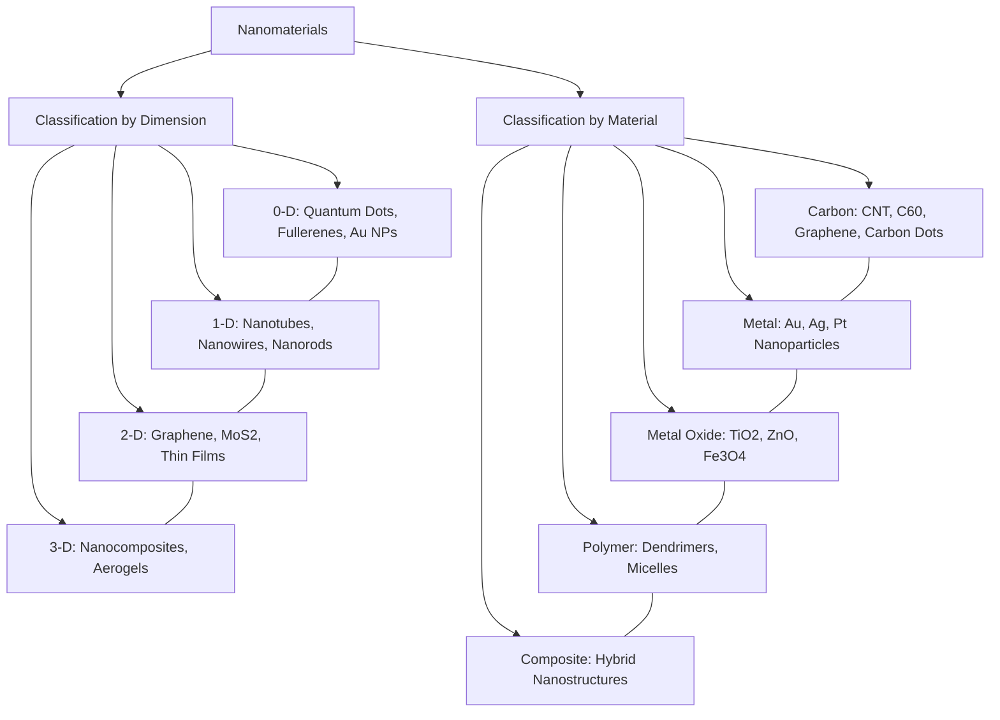
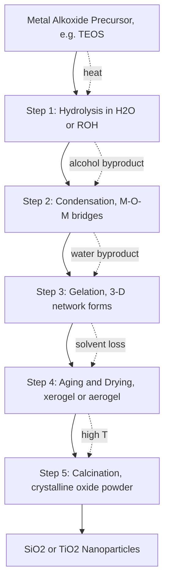
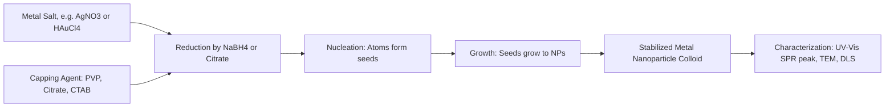
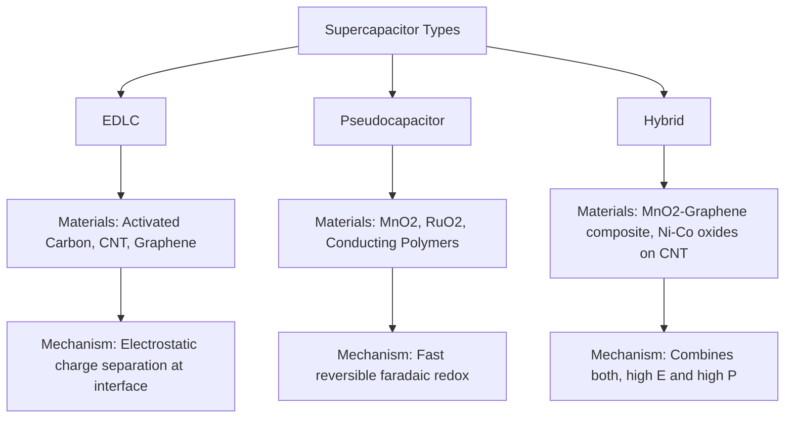
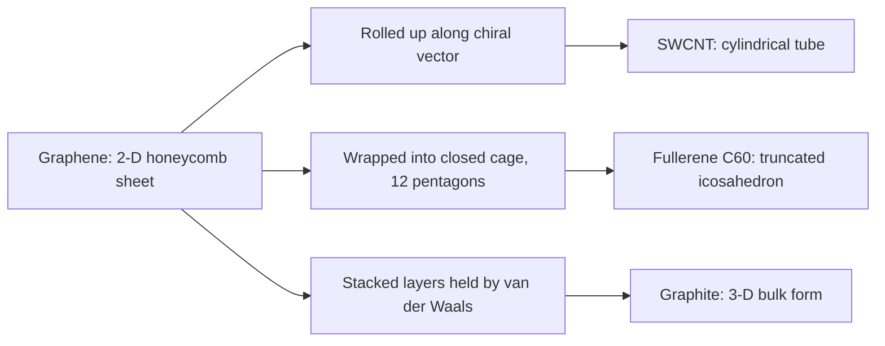

# Nanomaterials: Classification based on Dimension & Materials-Synthesis –  Sol   gel   & Chemical Reduction - Applications of nanomaterials –Supercapacitor Materials - Carbon Nanotubes, Fullerenes & Graphene – structure, properties & application.

<!-- SECTION_1_START -->
# Nanomaterials – Foundations, Classification & Structural Overview

## 1.1 Core Technical Definition

A **nanomaterial** is defined as a material with at least one external dimension in the nanoscale, typically ranging from **1 nm to 100 nm**, exhibiting size-dependent properties that differ significantly from those of the corresponding bulk material. The IUPAC and KTU 2024 scheme define the term "nanoscale" as the size range approximately from **1 nm to 100 nm**, where properties such as optical, magnetic, electrical, and mechanical behaviour deviate from classical bulk behaviour due to quantum confinement and surface-area dominance.

> [!IMPORTANT]
> **KTU 2024 Definition:** A nanomaterial is a natural, incidental, or manufactured material containing particles in an unbound state, as an aggregate, or as an agglomerate, and where, for **50 % or more** of the particles in the number size distribution, one or more external dimensions lie in the range **1 nm – 100 nm**.

> [!NOTE]
> **The "Nano" Scale at a Glance:**
> - 1 nm = $10^{-9}$ m = one billionth of a metre
> - Diameter of a DNA strand ≈ 2.5 nm
> - Thickness of a graphene sheet = **0.34 nm** (single atomic layer)
> - Diameter of a C$_{60}$ buckyball ≈ 0.7 nm

## 1.2 Intuitive Real-World Analogy

Imagine taking a **gold ring** (Au, bulk gold). It appears shiny, yellow, inert, and conducts electricity well. Now, divide that same gold into particles of size ~10 nm (still gold by chemistry, but a billion times smaller in volume). The nanoparticles no longer look yellow; they appear **deep ruby-red** in solution, become chemically reactive, melt at a *lower temperature*, and exhibit dramatically different electronic behaviour.

> **Analogy:** A *sheet of paper* (bulk) and a *crumpled paper ball* (nanostructured) have the same mass, but very different surface area, stiffness, and reactivity. The same is true of nanomaterials — the chemistry stays the same, but **surface-to-volume ratio** and **quantum effects** completely transform the physics.

This size-dependent transformation is the very reason nanomaterials are central to modern engineering — from **drug delivery** and **supercapacitors** to **structural composites** and **sensors**.

> [!VISUALIZATION CONTROL]
> **Concept:** Surface-to-volume ratio as a function of particle size
> **Desmos Input Equations:**
> * `S_V = 6/d` (for a sphere, ratio in nm⁻¹)
> * Plot: `y = 6/x` for x from 1 to 1000
> **Visual Description:** As particle diameter d decreases toward 1 nm, S_V rises hyperbolically. Students should observe that 10 nm particles have **100×** more surface area per unit volume than 1 µm particles — explaining enhanced catalytic and chemical activity.

## 1.3 Why Nanomaterials Behave Differently – Two Governing Phenomena

1. **Surface-area dominance (Geometric effect):** For a sphere of diameter $d$, the surface-to-volume ratio is $S/V = 6/d$. As $d$ decreases, a much larger fraction of atoms resides on the surface, making the material more reactive, more adsorptive, and catalytically superior.
2. **Quantum confinement (Electronic effect):** When the particle size becomes comparable to or smaller than the **de Broglie wavelength** of electrons (a few nm), the electronic energy levels become discretized. This produces bandgap widening, photoluminescence, and tunable colour — properties that bulk solids simply cannot exhibit.

> [!TIP]
> **Engineering Take-away:** Any property that depends on **surface atoms** (catalysis, adsorption, dissolution rate) or on **electron energy levels** (colour, conductivity, fluorescence) is dramatically altered at the nanoscale.

<!-- SECTION_1_END -->

<!-- SECTION_2_START -->
# Deep Theoretical Analysis & KTU High-Yield Formula Sheet

## 2.1 Classification of Nanomaterials Based on Dimension

KTU 2024 expects students to recognize the four structural families shown below. Each class exhibits a unique dimensionality in the nanoscale regime.

| Dimensionality | Class | Examples | Key Features |
|---|---|---|---|
| **0-D (zero-dimensional)** | All three dimensions ≤ 100 nm | Metal nanoparticles (Au, Ag), quantum dots (CdSe, ZnS), fullerenes (C$_{60}$) | Highest surface-to-volume ratio; strong quantum confinement; emit/single particles |
| **1-D (one-dimensional)** | Two dimensions ≤ 100 nm, one long | Carbon nanotubes (CNT), nanowires, nanorods, nanobelts | Electrons confined in radial direction; excellent for sensors, field emission, interconnects |
| **2-D (two-dimensional)** | One dimension ≤ 100 nm (thickness) | Graphene, MoS$_{2}$ sheets, thin films, nanosheets | Confinement in thickness; large lateral area; ultra-thin devices |
| **3-D (three-dimensional)** | All dimensions > 100 nm, but built from nanoscale units | Nanocomposites, bulk nanostructured materials, aerogels | Properties arise from nano-building blocks; bulk-shaped but nano-functional |

> [!NOTE]
> **KTU Memory Trick — "0–1–2–3 equals how many are BIG":**
> * **0-D** = 0 big dimensions → 0-D nanoparticle
> * **1-D** = 1 big dimension → nanotube/nanowire
> * **2-D** = 2 big dimensions → sheet/film
> * **3-D** = 3 big dimensions → bulk nanocomposite

## 2.2 Classification Based on Materials Type

| Material Class | Representative Examples | Engineering Use |
|---|---|---|
| **Carbon-based** | Fullerene (C$_{60}$), Carbon Nanotubes (SWCNT, MWCNT), Graphene, Carbon dots | Structural composites, electrodes, sensors |
| **Metal-based** | Au, Ag, Pt, Cu nanoparticles | Catalysis, antimicrobial coatings, plasmonics |
| **Metal-oxide based** | TiO$_{2}$, ZnO, Fe$_{3}$O$_{4}$, Al$_{2}$O$_{3}$ | Photocatalysis, UV-blockers, MRI contrast agents |
| **Polymeric** | Polymeric nanoparticles, dendrimers, micelles | Drug delivery, controlled release |
| **Composite** | Polymer–clay, metal–oxide–carbon hybrids | Multi-functional devices |

## 2.3 Sol–Gel Synthesis of Nanomaterials

The **sol–gel process** is a wet-chemical route that converts a solution (sol) into a solid network (gel) through hydrolysis and polycondensation reactions. It is widely used to produce metal-oxide nanoparticles, thin films, and porous glasses.

### 2.3.1 Process Stages

1. **Hydrolysis:** The metal alkoxide precursor reacts with water to form hydroxyl groups.
2. **Condensation (Polycondensation):** Hydroxyl and alkoxide groups combine to form M–O–M bridges, releasing water or alcohol.
3. **Gelation:** A 3-D oxo-bridged network (the gel) forms throughout the solvent.
4. **Aging & Drying:** Solvent is removed, leading to a dense xerogel or aerogel.
5. **Calcination:** High-temperature treatment yields the final crystalline oxide powder.

### 2.3.2 Generic Reaction Steps (example: tetraethyl orthosilicate, TEOS)

$$
\begin{aligned}
\text{Step 1 — Hydrolysis:}\quad & \mathrm{Si(OC_2H_5)_4 + 4\,H_2O \longrightarrow Si(OH)_4 + 4\,C_2H_5OH} \\[4pt]
\text{Step 2 — Condensation (alcohol elimination):}\quad & \mathrm{Si(OH)_4 + Si(OC_2H_5)_4 \longrightarrow (OC_2H_5)_3Si{-}O{-}Si(OC_2H_5)_3 + C_2H_5OH} \\[4pt]
\text{Step 3 — Network (gel) formation:}\quad & \mathrm{n\,Si(O{-}Si)(OH) \longrightarrow [SiO_2]_n + n\,H_2O}
\end{aligned}
$$

### 2.3.3 Example: Synthesis of TiO$_{2}$ Nanoparticles

$$
\begin{aligned}
\text{Hydrolysis:}\quad & \mathrm{Ti(OC_4H_9)_4 + 4\,H_2O \longrightarrow Ti(OH)_4 + 4\,C_4H_9OH} \\[4pt]
\text{Condensation:}\quad & \mathrm{n\,Ti(OH)_4 \longrightarrow [TiO_2]_n + 2n\,H_2O}
\end{aligned}
$$

> [!IMPORTANT]
> **Advantages of sol–gel route:** Low processing temperature (~RT to 200 °C), high purity, fine stoichiometric control, ability to form thin films and bulk aerogels, and low equipment cost — all reasons it is a KTU-favoured technique.

## 2.4 Chemical Reduction Method for Metal Nanoparticles

This is the most common chemical route for producing **noble-metal nanoparticles** (Au, Ag, Pt). A metal-salt precursor is reduced using a chemical reducing agent in the presence of a **capping/stabilizing agent** to prevent agglomeration.

### 2.4.1 Silver (Ag) Nanoparticle Synthesis — Model Reaction

$$
\begin{aligned}
\text{Reduction:}\quad & \mathrm{AgNO_3 + NaBH_4 \longrightarrow Ag^{0} \text{ (nano)} + \tfrac{1}{2}\,B_2H_6 + \tfrac{1}{2}\,H_2 + NaNO_3} \\[4pt]
\text{Stabilization:}\quad & \mathrm{Ag^{0}_{nucleus} + citrate \longrightarrow Ag_{NP}\text{-}citrate\ shell}
\end{aligned}
$$

### 2.4.2 Gold (Au) Nanoparticle Synthesis (Turkevich method)

$$
\begin{aligned}
\text{Step 1:}\quad & 2\,\mathrm{HAuCl_4 + 3\,C_6H_8O_7 \longrightarrow 2\,Au^{0} + 3\,CH_2(COOH){-}C(OH)(COOH){-}CH_2{-}COOH + 8\,HCl} \\[4pt]
\text{Step 2:}\quad & \mathrm{Au^{0}_{atoms} \xrightarrow[\text{aggregation}]{\text{citrate capping}} Au_{NP}\ \text{(spherical, 10-20 nm, wine-red)}}
\end{aligned}
$$

> [!TIP]
> **Why the colour?** The reduction creates nano-Au of size ~10–20 nm. Surface plasmon resonance (SPR) at the nanoscale causes absorption near 520 nm, giving the characteristic **ruby-red** colour. Bulk gold is yellow because no SPR exists.

### 2.4.3 Role of Capping Agents

| Capping Agent | Function | Examples |
|---|---|---|
| Electrostatic stabilizers | Charge repulsion between particles | Citrate, NaBH$_{4}$ by-products |
| Steric stabilizers | Physical barrier | PVP, PEG, surfactants |
| Electro-steric | Combined | Thiol-PEG, CTAB |

## 2.5 KTU High-Yield Formula & Concept Cheat Sheet

| Concept / Quantity | Symbol | Formula / Value | Engineering Meaning |
|---|---|---|---|
| Surface-to-volume ratio (sphere) | $S/V$ | $6/d$ (d in m) | Catalysis, dissolution rate |
| Volume of a spherical NP | $V$ | $\tfrac{4}{3}\pi r^3$ | Loading capacity, density |
| Surface atoms fraction | $f_{surf}$ | $4\,N_a^{1/3}\,r_{atom}/d$ | Explains surface dominance |
| Energy of supercapacitor | $E$ | $E = \tfrac{1}{2}CV^2$ | Stored energy, J |
| Capacitance (EDLC) | $C$ | $C = \varepsilon_r \varepsilon_0 A/d$ | Helmholtz double-layer model |
| Power of supercapacitor | $P$ | $P = V^2/(4R_{ESR})$ | Rate of delivery |
| CNT chiral vector | $\vec{C}_h$ | $\vec{C}_h = n\vec{a}_1 + m\vec{a}_2$ | Determines metallic/semi. nature |
| Graphene lattice constant | $a$ | $a = 2.46\ \text{Å}$ | Bond length = 1.42 Å |
| Fullerene C$_{60}$ diameter | $D$ | $D \approx 0.7\ \text{nm}$ | Cavity for drug loading |
| de Broglie wavelength (e⁻) | $\lambda$ | $\lambda = h/\sqrt{2mE}$ | Confinement criterion |

> [!IMPORTANT]
> **Confinement rule of thumb:** When particle diameter $d$ approaches the **exciton Bohr radius** ($a_B$) of the semiconductor, quantum confinement becomes significant. For CdSe, $a_B \approx 5.6$ nm; for ZnO, $a_B \approx 2.3$ nm. Particles below these sizes show pronounced blue-shift of photoluminescence.

## 2.6 Real-World Engineering Utility

* **Catalysis:** Pt and Pd nanoparticles on supports are used in catalytic converters and fuel cells (Hydrogen Economy).
* **Medical:** Au nanoparticles are FDA-approved for photothermal cancer therapy; polymeric nano-capsules deliver drugs with controlled release.
* **Electronics:** CNT thin-film transistors and graphene electrodes form next-generation flexible displays.
* **Energy:** Supercapacitors using CNT/graphene electrodes power electric vehicles and grid storage.
* **Environment:** TiO$_{2}$ photocatalytic nanoparticles degrade organic pollutants in water under UV light.

<!-- SECTION_2_END -->

<!-- SECTION_3_START -->
# Step-by-Step Derivations, Reactions & Process Walkthroughs

## 3.1 Exhaustive Sol–Gel Walkthrough (SiO$_{2}$ from TEOS)

Let us perform the full sol–gel derivation and mass balance for preparing 1.00 g of SiO$_{2}$ xerogel from TEOS.

### 3.1.1 Given
- Precursor: Si(OC$_{2}$H$_{5}$)$_{4}$ (TEOS), molar mass = 208.33 g/mol
- Product: SiO$_{2}$, molar mass = 60.08 g/mol
- Target: 1.00 g SiO$_{2}$

### 3.1.2 Step-by-Step Calculation

$$
\begin{aligned}
\text{Moles of SiO}_2 \text{ required} &= \frac{1.00\ \text{g}}{60.08\ \text{g/mol}} = 1.6646 \times 10^{-2}\ \text{mol} \\[4pt]
\text{From stoichiometry (1 TEOS → 1 SiO}_2\text{):} \quad n_{\text{TEOS}} &= 1.6646 \times 10^{-2}\ \text{mol} \\[4pt]
\text{Mass of TEOS needed} &= n \times M = 1.6646 \times 10^{-2} \times 208.33 = 3.468\ \text{g} \\[4pt]
\text{Volume of TEOS (}\rho = 0.934\ \text{g/mL}\text{)} &= \frac{3.468}{0.934} = 3.71\ \text{mL} \\[4pt]
\text{Moles of H}_2\text{O for full hydrolysis} &= 4 \times n_{\text{TEOS}} = 6.658 \times 10^{-2}\ \text{mol} \\[4pt]
\text{Volume of H}_2\text{O} &= 6.658 \times 10^{-2} \times 18.015 = 1.199\ \text{g} = 1.199\ \text{mL} \\[4pt]
\text{Ethanol produced} &= 4 \times n_{\text{TEOS}} = 6.658 \times 10^{-2}\ \text{mol} = 3.07\ \text{g}
\end{aligned}
$$

**Valuation note:** Each balanced equation step carries weight; the examiner expects the student to clearly state the mole ratio and then convert using molar mass.

## 3.2 Chemical Reduction Walkthrough — Silver Nanoparticles

### 3.2.1 Procedure (textbook-grade)

1. **Preparation of precursor solution:** Dissolve 0.017 g of AgNO$_{3}$ in 100 mL of deionized water (10$^{-3}$ M).
2. **Reducing agent preparation:** Dissolve 0.038 g of NaBH$_{4}$ in 20 mL ice-cold water.
3. **Capping agent:** Add 1 mL of 1 % sodium citrate solution.
4. **Mixing (under ice-cold, vigorous stirring):** Dropwise add NaBH$_{4}$ into AgNO$_{3}$ solution.
5. **Observation:** Solution turns **pale yellow → bright yellow**, indicating formation of Ag nanoparticles.
6. **Characterization:** UV–Vis absorption peak appears near 400–420 nm (SPR band).

### 3.2.2 Balanced Ionic Equation

$$
\begin{aligned}
\text{Half-reaction (oxidation):}\quad & \mathrm{BH_4^- + 8\,OH^- \longrightarrow B(OH)_4^- + 4\,H_2O + 8\,e^-} \\[4pt]
\text{Half-reaction (reduction):}\quad & \mathrm{Ag^+ + e^- \longrightarrow Ag^{0}} \\[4pt]
\text{Overall:}\quad & \mathrm{BH_4^- + 8\,Ag^+ + 8\,OH^- \longrightarrow 8\,Ag^{0} + B(OH)_4^- + 4\,H_2O}
\end{aligned}
$$

> [!NOTE]
> **Why ice-cold?** At low temperature, reduction is slowed, favouring **nucleation–growth separation** and producing smaller, monodisperse particles. Higher temperatures → larger and broader size distribution.

## 3.3 Derivation – Why Surface-to-Volume Ratio Drives Reactivity

Consider a cube of side $L$ divided into $n^3$ smaller cubes, each of side $L/n$. Total surface area:

$$
\begin{aligned}
A_{\text{small}} &= n^3 \times 6\,(L/n)^2 = 6\,n\,L^2 \\[4pt]
A_{\text{original}} &= 6\,L^2 \\[4pt]
\text{Ratio}\ \frac{A_{\text{small}}}{A_{\text{original}}} &= n
\end{aligned}
$$

For a sphere, similarly $S/V = 6/d$, meaning a 10 nm particle has $\sim$100× the surface atoms per unit volume of a 1 µm particle. This is why TiO$_{2}$ at the nano-scale catalytically oxidizes pollutants in **minutes** while bulk TiO$_{2}$ is essentially inert.

## 3.4 Supercapacitor Materials — Step-by-Step Working Principle

A supercapacitor stores energy in two distinct ways, and KTU 2024 expects you to identify the **material–mechanism** relationship.

### 3.4.1 Electric Double-Layer Capacitor (EDLC)

- **Mechanism:** Pure electrostatic charge separation at the electrode/electrolyte interface (no faradaic reaction).
- **Capacitance:** $C = \varepsilon_r \varepsilon_0 A / d$, where $d$ is the **Helmholtz layer thickness** (~0.5–1 nm).
- **Material requirement:** High surface area; high electrical conductivity; controlled pore size.
- **Preferred materials:** Activated carbon (1500–3000 m$^{2}$/g), carbon aerogels, **carbon nanotubes**, **graphene**.

### 3.4.2 Pseudocapacitor

- **Mechanism:** Fast, reversible faradaic (redox) reactions at the surface.
- **Material requirement:** Multiple oxidation states; high surface area.
- **Preferred materials:** Conducting polymers (PANI, PEDOT), metal oxides like **MnO$_{2}$**, **RuO$_{2}$**, **Co$_{3}$O$_{4}$**, Ni(OH)$_{2}$.

### 3.4.3 Hybrid Supercapacitors

Combine EDLC + pseudocapacitive electrodes. Example: **MnO$_{2}$/Graphene composite** — high energy density + high power density.

### 3.4.4 Numerical — Energy Stored in a Graphene Supercapacitor

Given: $C = 300$ F (typical for graphene-based SC), $V = 2.7$ V.

$$
E = \tfrac{1}{2}CV^2 = \tfrac{1}{2} \times 300 \times (2.7)^2 = 1093.5\ \text{J} = 1.094\ \text{kJ}
$$

Compared to a typical electrolytic capacitor of 0.01 F at the same voltage ($E = 0.036$ J), the supercapacitor stores **~30 000× more energy** — explaining its central role in EVs.

## 3.5 Carbon Nanotube Structure Derivation

A single-walled carbon nanotube (SWCNT) can be visualized as a **single graphene sheet rolled into a seamless cylinder**. Its structure is fully described by the **chiral vector**:

$$
\vec{C}_h = n\,\vec{a}_1 + m\,\vec{a}_2
$$

where $\vec{a}_1$ and $\vec{a}_2$ are graphene lattice unit vectors, with $n$ and $m$ non-negative integers.

### 3.5.1 Diameter of a Chiral Nanotube

$$
d = \frac{\sqrt{3}\,a_{0}}{\pi}\,\sqrt{n^2 + nm + m^2}
$$

where $a_0 = 1.42$ Å is the C–C bond length. For example, for a $(10,10)$ "armchair" nanotube:

$$
d = \frac{\sqrt{3} \times 1.42}{\pi}\sqrt{100+100+100} = \frac{2.459}{3.1416}\times 17.32 \approx 13.6\ \text{Å} = 1.36\ \text{nm}
$$

### 3.5.2 Electrical Nature of CNTs

* If $(n-m)$ is a multiple of 3 → **metallic** CNT.
* Otherwise → **semiconducting** CNT.
* Special cases:
  * $m = 0$ → **zigzag** tube
  * $n = m$ → **armchair** tube (always metallic)
  * all others → **chiral** tube

> [!TIP]
> **KTU Quick Check:** Given $(12, 4)$: $n - m = 8$, not divisible by 3 → **semiconducting**.

## 3.6 Fullerene (C$_{60}$) Structure Derivation

The C$_{60}$ molecule has the geometry of a **truncated icosahedron** — the same as a soccer ball — composed of 12 pentagons and 20 hexagons.

### 3.6.1 Key Structural Metrics

- Number of vertices: 60 (one per C atom)
- Number of faces: 32 (12 pentagons + 20 hexagons)
- Number of edges: 90
- Inner diameter of cage: ~0.7 nm
- C–C bond length: 1.38 Å (along 6:6, hexagon–hexagon edge) and 1.45 Å (along 6:5, hexagon–pentagon edge)

### 3.6.2 Euler's Formula Verification

For a convex polyhedron: $V - E + F = 2$.

$$
V - E + F = 60 - 90 + 32 = 2 \ \checkmark
$$

This confirms the closed-cage topology of C$_{60}$.

## 3.7 Graphene Structural Derivation

Graphene is a 2-D monolayer of $sp^2$-hybridized carbon atoms arranged in a **honeycomb lattice**. Each atom has 3 σ-bonds and contributes 1 electron to a delocalized π-band perpendicular to the plane.

### 3.7.1 Lattice Parameters

- C–C bond length: $a_0 = 1.42$ Å
- Hexagonal lattice constant: $a = a_0\sqrt{3} \approx 2.46$ Å
- Number of atoms per unit cell: 2
- Layer spacing in graphite: 3.35 Å
- Theoretical specific surface area: $\sim 2630\ \text{m}^{2}/\text{g}$

### 3.7.2 Electronic Band Structure

The conduction and valence bands meet at the **K and K′ points** of the Brillouin zone, making pristine graphene a **zero-gap semiconductor** (semi-metal). Charge carriers behave as **massless Dirac fermions**, yielding an extremely high carrier mobility ($\sim 200\,000\ \text{cm}^{2}\,\text{V}^{-1}\,\text{s}^{-1}$).

<!-- SECTION_3_END -->

<!-- SECTION_4_START -->
# Structural Diagrams & Schematics

## 4.1 Classification Matrix — Dimension vs Material

## 4.2 Sol–Gel Process Flow

## 4.3 Chemical Reduction Process Flow (Metal Nanoparticles)

## 4.4 Supercapacitor Architecture and Material Mapping

## 4.5 Carbon Allotrope Structural Topology

## 4.6 Sequential Comparison — CNT, Fullerene, Graphene

| Feature | Carbon Nanotube (SWCNT) | Fullerene (C$_{60}$) | Graphene |
|---|---|---|---|
| Hybridization | sp$^{2}$ | sp$^{2}$ (strained) | sp$^{2}$ |
| Geometry | Cylinder | Closed cage | Flat sheet |
| Dimensionality | 1-D | 0-D | 2-D |
| Diameter | 0.4 – 2 nm | 0.7 nm | thickness 0.34 nm |
| Length | up to cm | 1 molecule | unlimited (lateral) |
| Conductivity | metallic or semiconducting | semi-insulating | semi-metal, high mobility |
| Tensile strength | 30 – 100 GPa | – | ~130 GPa |
| Optical | IR to UV plasmon | Visible absorption | broad absorption |
| Typical use | Sensors, interconnects, EMI shielding | Drug delivery, lubricants | Touch screens, supercapacitors, composites |

<!-- SECTION_4_END -->

<!-- SECTION_5_START -->
# KTU 2024 Scheme Examination Question Bank & Topic Recap

## 5.1 Part A — Short-Answer Questions (3 Marks Each)

### Q1. [KTU University Exam – July 2024] CO1, Remember
**Define nanomaterials. Mention the two classifications with one example each.**

**Model Answer:**
A nanomaterial is a material having at least one external dimension in the size range **1 nm to 100 nm**, exhibiting size-dependent properties. Classifications:
- **By dimension:** e.g. 0-D quantum dots, 1-D carbon nanotubes, 2-D graphene, 3-D nanocomposites.
- **By material:** e.g. carbon-based (fullerene), metal-based (Au nanoparticle), metal-oxide (TiO$_{2}$), polymeric, composite.

*Valuation key:* [Correct definition with size range: 1 Mark] [Two classifications with one example each: 2 Marks]

### Q2. [KTU University Exam – Dec 2023] CO1, Understand
**What is the difference between EDLC and pseudocapacitor? Give one example material for each.**

**Model Answer:**
| Feature | EDLC | Pseudocapacitor |
|---|---|---|
| Mechanism | Electrostatic charge separation | Fast reversible redox reactions |
| Material | Activated carbon, graphene | MnO$_{2}$, RuO$_{2}$, PANI |
| Formula | $C = \varepsilon_r \varepsilon_0 A / d$ | Faradaic charge-transfer |

*Valuation key:* [Mechanism difference: 1 Mark] [Material examples with one line explanation: 2 Marks]

## 5.2 Part B — 14-Mark Questions (ESE Module Internal Choice)

### Question A (14 Marks) — Sol–Gel, Chemical Reduction & Applications

**[KTU University Exam – July 2024] CO2, CO3, Apply & Understand**

#### (a) (7 Marks) — Sol–Gel Synthesis
**Explain the sol–gel method for the preparation of silica (SiO$_{2}$) nanoparticles with neat equations. List any four advantages of the method.**

**Step-by-step Model Solution:**

1. **Definition (1 Mark):** Sol–gel is a wet-chemical process in which a 'sol' (colloidal suspension) is converted into a 'gel' (continuous solid network) via hydrolysis and condensation reactions.
2. **Precursor identification (1 Mark):** Tetraethyl orthosilicate (TEOS), Si(OC$_{2}$H$_{5}$)$_{4}$.
3. **Hydrolysis equation (2 Marks):**
   $$\mathrm{Si(OC_2H_5)_4 + 4\,H_2O \longrightarrow Si(OH)_4 + 4\,C_2H_5OH}$$
4. **Condensation equation (2 Marks):**
   $$\mathrm{n\,Si(OH)_4 \longrightarrow [SiO_2]_n + 2n\,H_2O}$$
5. **Four advantages (1 Mark):**
   - Low processing temperature
   - High chemical purity
   - Fine size and shape control
   - Suitable for thin films and bulk monoliths

*Valuation key:* [Steps 1 and 2: 2 Marks] [Balanced equations: 4 Marks] [Advantages: 1 Mark]

#### (b) (7 Marks) — Chemical Reduction + Application
**Describe the chemical reduction method for the preparation of silver (Ag) nanoparticles. Mention any two applications of nanomaterials in supercapacitors.**

**Step-by-step Model Solution:**

1. **Principle (1 Mark):** A metal salt is reduced using a chemical reducing agent in the presence of a capping agent to form stable nanoparticles.
2. **Reaction (3 Marks):**
   $$\mathrm{AgNO_3 + NaBH_4 \longrightarrow Ag^{0}\,(nano) + \tfrac{1}{2}\,B_2H_6 + \tfrac{1}{2}\,H_2 + NaNO_3}$$
3. **Role of capping agent (1 Mark):** Sodium citrate or PVP prevents aggregation by steric/electrostatic repulsion.
4. **Characterization cue (1 Mark):** Appearance of SPR band at ~400–420 nm in UV–Vis spectrum.
5. **Two supercapacitor applications (1 Mark):**
   - **Graphene electrodes** in EDLCs for high surface area and fast charge transfer.
   - **MnO$_{2}$/CNT composites** in pseudocapacitors for high specific capacitance.

*Valuation key:* [Principle: 1] [Balanced equation: 3] [Capping: 1] [SPR: 1] [Applications: 1]

---

### Question B (14 Marks) — Carbon Nanostructures (CNT, Fullerene, Graphene)

**[KTU University Exam – Dec 2023] CO2, CO3, Understand & Apply**

#### (a) (7 Marks) — Graphene & Fullerenes
**Discuss the structure and properties of graphene. Explain the structure of C$_{60}$ fullerene and highlight any three applications.**

**Step-by-step Model Solution:**

1. **Graphene structure (2 Marks):** A 2-D monolayer of $sp^2$-hybridized carbon in a honeycomb lattice; lattice constant $a = 2.46$ Å, C–C bond 1.42 Å.
2. **Properties (2 Marks):**
   - Extremely high carrier mobility ($\sim 200\,000\ \text{cm}^{2}\,\text{V}^{-1}\,\text{s}^{-1}$)
   - Tensile strength ~130 GPa, Young's modulus ~1 TPa
   - Theoretical surface area ~2630 m$^{2}$/g
   - Excellent thermal conductivity (~5000 W/m·K)
3. **C$_{60}$ structure (1.5 Marks):** Truncated icosahedron, 60 vertices, 32 faces (12 pentagons + 20 hexagons), diameter ~0.7 nm.
4. **Three applications (1.5 Marks):**
   - Drug delivery (cavity encapsulation)
   - Lubricants (spherical shape)
   - Organic photovoltaics (electron acceptors)

*Valuation key:* [Graphene structure: 2] [Properties: 2] [C60: 1.5] [Applications: 1.5]

#### (b) (7 Marks) — Carbon Nanotubes
**Describe the structure of single-walled carbon nanotubes (SWCNTs). What are armchair, zigzag, and chiral CNTs? List three important applications of CNTs.**

**Step-by-step Model Solution:**

1. **SWCNT structure (2 Marks):** Roll a single graphene sheet along the chiral vector $\vec{C}_h = n\vec{a}_1 + m\vec{a}_2$ to form a seamless cylinder.
2. **Three types (2 Marks):**
   - **Armchair** ($n = m$): always metallic
   - **Zigzag** ($m = 0$): metallic or semiconducting
   - **Chiral** ($n \neq m \neq 0$): spirals around axis
3. **Electrical rule (1 Mark):** $(n - m)$ divisible by 3 → metallic; else semiconducting.
4. **Three applications (2 Marks):**
   - Field-effect transistors (semiconducting SWCNT)
   - Structural composites (exceptional tensile strength)
   - Hydrogen storage and supercapacitor electrodes

*Valuation key:* [SWCNT visualization: 2] [Three types: 2] [Rule: 1] [Applications: 2]

> [!WARNING]
> **KTU Examiner's Valuation Warning — Common Pitfalls:**
> 1. Students often confuse **roll-up direction** of graphene to form CNT — examiners expect mention of the **chiral vector** $(n,m)$.
> 2. In sol–gel derivations, students forget to **state the role of the calcination step** — it converts amorphous gel to crystalline oxide and is a 1-mark item.
> 3. In supercapacitors, students mix up the role of **C** in $E = \tfrac{1}{2}CV^2$ — examiners deduct 1 mark for unit inconsistency.
> 4. For chemical reduction, examiners **deduct marks** if the student does not specify the **capping agent's role** in controlling particle size.
> 5. In fullerenes, students forget that C$_{60}$ is a **closed cage** with both pentagons and hexagons — listing only hexagons loses 1 mark.

## 5.3 Topic Recap & Important Things to Remember

> [!TIP]
> **Rapid Revision Checklist — KTU Module 1: Engineering Materials (Nanomaterials)**

* **Size range:** 1 nm – 100 nm; **50 %** of particles must be in this range by number.
* **Two origins of new properties:** surface-area dominance ($S/V = 6/d$) and quantum confinement (when $d \sim a_B$).
* **Dimension classes:** 0-D (dot), 1-D (tube/wire), 2-D (sheet/film), 3-D (bulk nanocomposite).
* **Material classes:** Carbon / Metal / Metal-oxide / Polymer / Composite.
* **Sol–gel:** hydrolysis → condensation → gelation → aging → drying → calcination. TEOS + H$_2$O → Si(OH)$_4$ → SiO$_2$.
* **Chemical reduction:** Salt + Reducing agent (NaBH$_4$ / citrate) + Capping agent → metal nanoparticles with characteristic SPR band (Ag: ~400 nm, Au: ~520 nm).
* **Supercapacitor energy:** $E = \tfrac{1}{2}CV^2$. EDLC = carbon; Pseudocapacitor = MnO$_2$ / RuO$_2$ / PANI.
* **Graphene:** 2-D honeycomb, $sp^2$, semi-metal, mobility $2 \times 10^5\ \text{cm}^{2}\,\text{V}^{-1}\,\text{s}^{-1}$, surface area 2630 m$^{2}$/g.
* **C$_{60}$ Fullerene:** 0-D truncated icosahedron, 12 pentagons + 20 hexagons, $\sim 0.7$ nm cage, 32 faces, 90 edges.
* **SWCNT:** 1-D tube defined by chiral vector $(n,m)$; $(n-m) \mod 3 = 0$ → metallic, else semiconducting. Armchair always metallic.
* **Key engineering applications:** Catalysis (Pt, Pd NPs), energy (graphene SC, CNT electrodes), medicine (Au NPs, drug delivery), environment (TiO$_2$ photocatalysis), electronics (CNT FETs, graphene touch screens).
* **Common KTU must-draw items:** sol–gel block flow chart; classification table; comparison table of C-allotropes.

<!-- SECTION_5_END -->
