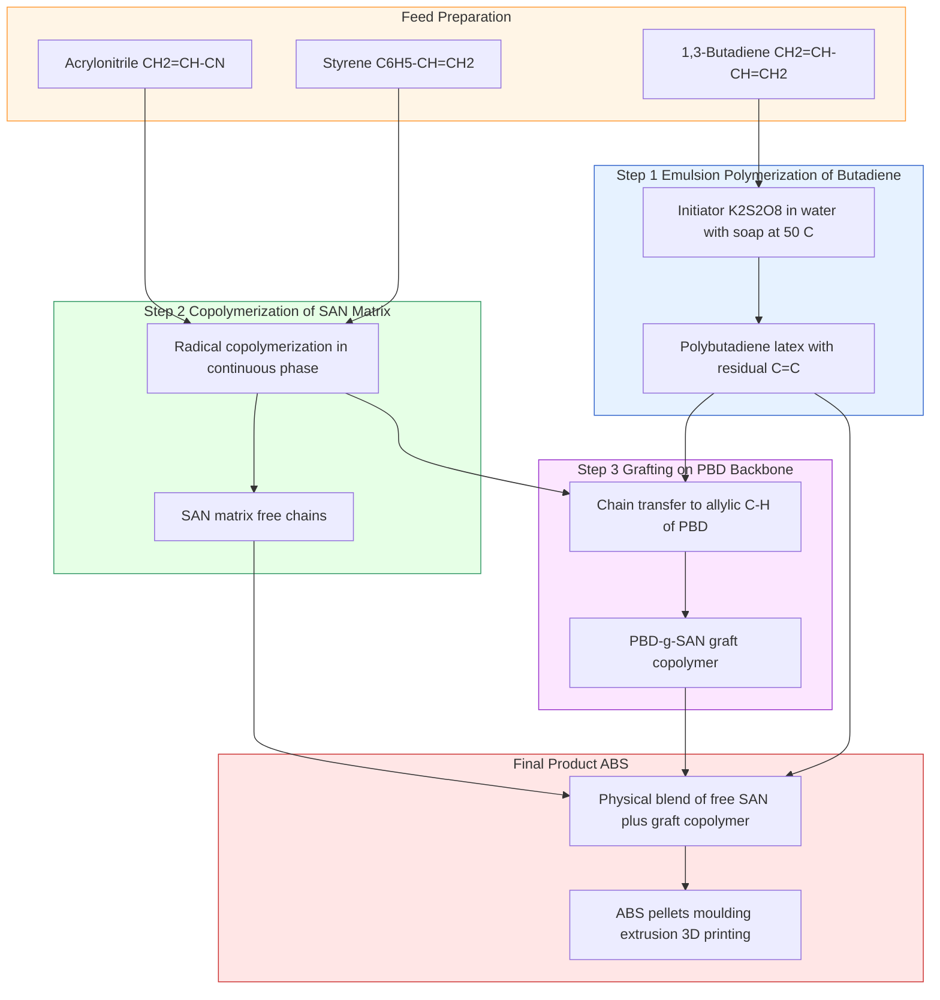
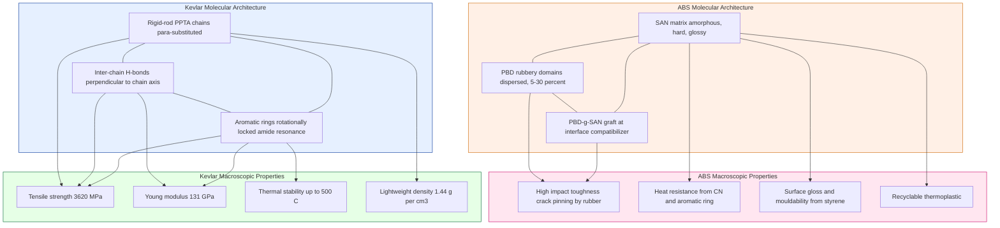

# Polymers: ABS & Kevlar -Synthesis, properties and applications.

<!-- SECTION_1_START -->

# Polymers: ABS & Kevlar — Synthesis, Properties and Applications

## 1.1 Formal Definition (KTU 2024 Syllabus Terminology)

**Polymer:** A polymer is a high molecular weight macromolecule composed of repeating structural units (monomers) linked together by covalent bonds through a process called polymerization. The term is derived from the Greek words *poly* (many) and *meros* (parts).

> [!NOTE]
> **KTU 2024 Definition (Engineering Chemistry Module 1):** Polymers are giant chain-like molecules formed by the combination of a large number of smaller units called monomers, joined together by covalent bonds, exhibiting properties distinctly different from their constituent monomers.

**Acrylonitrile Butadiene Styrene (ABS):** ABS is an amorphous, thermoplastic **terpolymer** (copolymer built from three distinct monomers) produced by the graft copolymerization of:
- **Acrylonitrile** ($\text{CH}_2=\text{CH}-\text{CN}$) — contributes chemical resistance and thermal stability.
- **Butadiene** ($\text{CH}_2=\text{CH}-\text{CH}=\text{CH}_2$) — contributes toughness and impact strength.
- **Styrene** ($\text{C}_6\text{H}_5-\text{CH}=\text{CH}_2$) — contributes rigidity, surface gloss, and processability.

**Kevlar (Poly-para-phenylene terephthalamide, PPTA):** Kevlar is a liquid-crystalline, wholly **aromatic polyamide (aramid)** fibre prepared by the low-temperature solution polycondensation of *para*-phenylene diamine and terephthaloyl chloride. It belongs to the family of aramid fibres and is renowned for an extraordinary **strength-to-weight ratio**.

> [!IMPORTANT]
> **Syllabus Highlight (GCCYT122 / Module 1):** Special emphasis is laid on the relationship between monomer structure, polymerization mechanism, and the resulting macroscopic engineering properties. Both ABS and Kevlar are treated as *engineering polymers* — materials whose molecular architecture dictates load-bearing, thermal, and chemical behaviour.

---

## 1.2 Conceptual Analogy / Intuition

### Analogy for ABS — "The Reinforced Concrete Analogy"

Imagine a **reinforced concrete slab**. The cement (hard, brittle) gives shape and rigidity; the steel rods (ductile) absorb sudden impacts. ABS works exactly like this at the molecular level:

- The **styrene-acrylonitrile (SAN) matrix** acts as the *cement* — hard, glossy, and rigid.
- The **butadiene rubber domains** are dispersed as tiny *steel rods* — they absorb sudden shock and prevent crack propagation.

So, when you drop a LEGO brick (which is made of ABS), the rubbery butadiene particles stretch and absorb the impact energy, preventing the brittle SAN matrix from shattering. This is a classic example of **toughening by dispersed rubber phase**.

### Analogy for Kevlar — "The Nylon Rope Reinforced with Steel Filaments"

Think of a standard nylon rope. Now imagine that within each fibre, the polymer chains are **stretched to near-maximum length and packed in perfectly parallel rows**, like reams of uncooked spaghetti aligned in a box. Furthermore, these chains are stitched together by **strong hydrogen bonds** running perpendicular to the chain axis — like a vast 3D molecular zip-lock.

When you pull on a Kevlar fibre:
1. The covalent backbone carries the load along the chain axis.
2. The hydrogen bonds distribute the load laterally to neighbouring chains.
3. The aromatic rings prevent rotation and stretching, acting as rigid "staples".

The result is a fibre that is roughly **5 times stronger than steel, weight-for-weight**.

> [!TIP]
> **Quick Memory Hook for the Exam:**
> *ABS* = **A**crylonitrile + **B**utadiene + **S**tyrene — three letters, three monomers, three properties.
> *Kevlar* = **K**evlar's **E**xtra-strong **V**an-der-Waals + **L**iquid crystal **A**lignment + **R**esonating **A**mide bonds.

---

## 1.3 Physical Constants & Standard Metrics

| Parameter | Value / Standard | Significance |
|---|---|---|
| Typical ABS Density | $1.04 - 1.07 \text{ g/cm}^3$ | Lightweight thermoplastic |
| Glass Transition ($T_g$) of ABS | $\approx 105 \text{ °C}$ | Upper service temperature limit |
| Tensile Strength of Kevlar 29 | $\approx 3{,}620 \text{ MPa}$ | $\approx 5 \times$ that of structural steel on weight basis |
| Density of Kevlar 49 | $\approx 1.44 \text{ g/cm}^3$ | Lighter than glass fibre ($2.5 \text{ g/cm}^3$) |
| Decomposition Temperature of Kevlar | $\approx 500 \text{ °C}$ | Excellent thermal stability |
| Young's Modulus of Kevlar 49 | $\approx 131 \text{ GPa}$ | Comparable to glass fibre |

> [!IMPORTANT]
> **Bolded Key Constants to Memorize:** $T_g$ of ABS $\approx$ **105 °C**, Tensile strength of Kevlar 49 $\approx$ **3,620 MPa**, Density of Kevlar $\approx$ **1.44 g/cm³**, Decomposition temperature of Kevlar $\approx$ **500 °C**.

---

## 1.4 Visualization Control

> [!VISUALIZATION CONTROL]
> **Concept:** Random-coil configuration of ABS versus rigid-rod alignment of Kevlar chains.
>
> **GeoGebra / Desmos Input Equations (parametric for unit visualization):**
>
> * Random coil of ABS (Gaussian walk, 2D projection):
>   $x(t) = \sum_{i=1}^{N} \cos(2\pi\, r_i\, t)$ with $r_i$ pseudo-random in $[0,1]$
>   $y(t) = \sum_{i=1}^{N} \sin(2\pi\, r_i\, t)$
> * Ordered rods of Kevlar (parallel lines at fixed spacing):
>   $y = k\,d$, for $k = -3, -2, -1, 0, 1, 2, 3$, $d = 0.5$
>
> **Visual Description:** Plot the random coil as a tangled cloud with three differently coloured segments (orange = butadiene-rich, blue = styrene-acrylonitrile, green = graft junctions). Plot the Kevlar as perfectly vertical parallel rods with horizontal dashed lines representing hydrogen-bond bridges. The visual contrast is striking: disordered amorphous tangle (ABS) vs. ordered crystalline array (Kevlar).

<!-- SECTION_1_END -->

<!-- SECTION_2_START -->

# 2. Deep Theoretical Analysis & KTU High-Yield Formula Sheet

## 2.1 Classification of Polymers — Where Do ABS and Kevlar Sit?

Both polymers fall into distinct niches in the polymer taxonomy, and identifying their class is a frequent 3-mark question in KTU examinations.

| Classification Criterion | ABS | Kevlar |
|---|---|---|
| **Origin** | Synthetic | Synthetic |
| **Structure** | Linear with graft branches (amorphous thermoplastic) | Linear, rigid-rod, partially crystalline |
| **Thermal behaviour** | Thermoplastic (re-meltable) | Thermoset-like (does not melt; chars at $\approx$ **500 °C**) |
| **Polymerization type** | Chain-growth (addition) + grafting | Step-growth (condensation) |
| **Monomer count** | 3 (terpolymer) | 2 (alternating diamine + diacid chloride) |
| **Repeating unit polarity** | Mixed (polar CN + non-polar) | Strongly polar (amide linkages) |
| **Mechanical character** | Tough, impact resistant | High tensile, high modulus |
| **Family** | Engineering thermoplastic | Aramid (aromatic polyamide) |

---

## 2.2 Monomer Chemistry — Building Blocks

### 2.2.1 Monomers of ABS

**(a) Acrylonitrile, $\text{CH}_2=\text{CH}-\text{CN}$**
- Vinyl monomer with electron-withdrawing $-\text{CN}$ group.
- Polymerizes via free-radical mechanism on the C=C double bond.
- Contributes **hardness, chemical resistance, and high heat-distortion temperature** to the copolymer.

**(b) 1,3-Butadiene, $\text{CH}_2=\text{CH}-\text{CH}=\text{CH}_2$**
- Conjugated diene — polymerizes predominantly via **1,4-addition** in *trans* configuration.
- The residual C=C unsaturation in the polybutadiene backbone provides sites for subsequent **grafting with styrene-acrylonitrile**.
- Provides **low-temperature flexibility and impact toughness**.

**(c) Styrene, $\text{C}_6\text{H}_5-\text{CH}=\text{CH}_2$**
- Vinyl aromatic monomer — phenyl ring provides steric bulk and $\pi-\pi$ interactions.
- Contributes **rigidity, gloss, and ease of processing**.

> [!NOTE]
> **Why three monomers?** A pure homopolymer of any one of these would fail in an engineering application: polyacrylonitrile is too brittle; polybutadiene is too soft and gummy; polystyrene is glassy and shatters on impact. By **graft-copolymerizing** them, the negative traits are suppressed and the positive ones are combined.

### 2.2.2 Monomers of Kevlar (PPTA)

**(a) *para*-Phenylenediamine (PPD), $\text{H}_2\text{N}-\text{C}_6\text{H}_4-\text{NH}_2$**
- Aromatic diamine; the two amine groups are in the *para* (1,4) position.
- The *para* substitution is critical — it enforces a **linear, rod-like** geometry in the resulting polymer.

**(b) Terephthaloyl chloride (TPC), $\text{ClCO}-\text{C}_6\text{H}_4-\text{COCl}$**
- Aromatic diacid chloride; the two acid chloride groups are *para*.
- Highly reactive — condenses readily with amines at low temperature.

> [!IMPORTANT]
> **The *para* geometry is non-negotiable.** If the *meta* isomer were used, the resulting polymer (Nomex) would be flexible and non-crystallizable. The *para* geometry enforces the rigid-rod structure that gives Kevlar its extraordinary strength.

---

## 2.3 Step-by-Step Conceptual Breakdown

### 2.3.1 ABS — Why Graft Copolymerization?

The polymerization of ABS is performed in two conceptually distinct stages:

**Stage 1 — Polybutadiene latex is prepared first.**
- 1,3-Butadiene is polymerized via emulsion polymerization to give polybutadiene (PBD) latex particles.
- These particles contain residual C=C double bonds along the chain and on pendant vinyl groups (from 1,2-addition side reactions).

**Stage 2 — Styrene and acrylonitrile are grafted onto the PBD.**
- Styrene and acrylonitrile are introduced and polymerize in the presence of the PBD latex.
- Some SAN chains form in the continuous phase (the "matrix" of the final product).
- Other SAN chains **graft** from the PBD backbone by chain-transfer to the allylic C–H positions of polybutadiene.
- The result: a *core-shell* morphology — PBD core surrounded by grafted SAN, dispersed in a continuous SAN matrix.

**Why this works mechanically:**
- When impact energy hits the material, micro-cracks initiate in the brittle SAN matrix.
- The cracks reach a PBD rubber particle, which **bridges the crack** and dissipates energy through elastic deformation and cavitation.
- This is the **"crack-pinning"** and **"crazing-with-shear-yielding"** mechanism.

### 2.3.2 Kevlar — Why Solution Polycondensation?

Kevlar is synthesized by a **low-temperature solution polycondensation** in a strongly polar, aprotic solvent system (the original DuPont recipe used a mixture of *N*-methyl-2-pyrrolidone (NMP) and hexamethylphosphoramide (HMPA) or, more modernly, NMP with $\text{CaCl}_2$).

**Why solution, and not melt?**
- Kevlar's rigid-rod chains do **not** melt below their decomposition temperature — they char at $\approx$ **500 °C**.
- So melt polymerization is impossible. The growing polymer must be kept dissolved.
- The reaction is highly exothermic (HCl is released), so it must be cooled ($0 - 20 \text{ °C}$) to control molecular weight.

**Why the rigid rod emerges:**
- Both monomers are *para*-substituted aromatics.
- Each new amide bond formed is **rotationally restricted** by the adjacent aromatic ring (resonance stabilization of the amide).
- The chains are therefore **conformationally locked** into an extended, rod-like geometry.
- When the polymer solution is extruded into a coagulating bath, the rods align parallel to the flow direction (this is the **liquid-crystalline phase**).
- The alignment is preserved through coagulation and drying — yielding fibres of near-theoretical stiffness along the chain axis.

> [!IMPORTANT]
> **Engineering Takeaway:** The strength of Kevlar comes from the fact that its chains are *already* fully extended at the molecular level. In ordinary polymers (like polyethylene or ABS), you must first "stretch out" the random coils to access the full strength. In Kevlar, the chains are born straight.

---

## 2.4 KTU High-Yield Formula Sheet / Cheat Sheet

### 2.4.1 Polymerization Kinetics (General)

| Quantity | Symbol | Formula / Definition | Units |
|---|---|---|---|
| Degree of polymerization | $DP$ | $DP = \dfrac{M_n}{M_0}$ | dimensionless |
| Number-average molar mass | $M_n$ | $M_n = \dfrac{\sum N_i M_i}{\sum N_i}$ | $\text{g/mol}$ |
| Weight-average molar mass | $M_w$ | $M_w = \dfrac{\sum N_i M_i^2}{\sum N_i M_i}$ | $\text{g/mol}$ |
| Polydispersity index | $PDI$ | $PDI = \dfrac{M_w}{M_n}$ | dimensionless |
| Mark-Houwink equation | $[\eta]$ | $[\eta] = K M^a$ | $\text{dL/g}$ |
| Carothers equation (step-growth) | $X_n$ | $X_n = \dfrac{1}{1-p}$ | dimensionless |

Where $p$ is the extent of reaction, $M_0$ the molar mass of the repeat unit.

> [!NOTE]
> **CRITICAL — Never write $\vert x \vert$ in a KTU formula table.** Use $\lvert x \rvert$ or $\mid x \mid$ in LaTeX to keep the markdown table parser happy. The above table intentionally follows this rule.

### 2.4.2 ABS Composition Reference (typical industrial recipe)

| Component | Mass % | Property Conferred |
|---|---|---|
| Acrylonitrile | $15 - 35$ | Chemical resistance, $T_g$ elevation |
| Butadiene | $5 - 30$ | Impact toughness, low-$T$ ductility |
| Styrene | $40 - 60$ | Rigidity, processability, gloss |

> [!TIP]
> **Common 3-mark question:** *"Why is the butadiene content in ABS kept between 5–30%? What happens at higher loadings?"*
> **Answer:** Above ~30%, the rubber domains begin to coalesce, the SAN matrix becomes discontinuous, and the material loses rigidity and heat resistance. Below ~5%, impact strength drops sharply because there are too few crack-arresting particles.

### 2.4.3 Kevlar — Repeat Unit and Degree of Polymerization

| Parameter | Value |
|---|---|
| Repeat unit molecular weight $M_0$ | $238.24 \text{ g/mol}$ |
| Typical $M_w$ of fibre | $40{,}000 - 60{,}000 \text{ g/mol}$ |
| Typical $DP$ | $170 - 250$ |
| Number of amide groups per repeat | $2$ (one from each monomer) |
| H-bond density per repeat unit | $2$ donor ($\text{N-H}$) + $2$ acceptor ($\text{C=O}$) |

### 2.4.4 Comparative Engineering Properties Table

| Property | ABS | Kevlar 49 |
|---|---|---|
| Density ($\text{g/cm}^3$) | $1.04 - 1.07$ | $1.44$ |
| Tensile strength ($\text{MPa}$) | $33 - 50$ | $3{,}620$ |
| Young's modulus ($\text{GPa}$) | $1.1 - 2.9$ | $131$ |
| Elongation at break (%) | $20 - 60$ | $2.4 - 3.6$ |
| Heat-deflection temperature ($^\circ\text{C}$, at $1.82 \text{ MPa}$) | $88 - 104$ | $\approx 250$ (decomposes at 500) |
| Chemical resistance | Good (to acids, alkalis) | Excellent (except strong acids/bases) |
| Flammability | Slow burn (self-extinguishing grades available) | Self-extinguishing, low smoke |
| Recyclability | Yes (thermoplastic) | Difficult (cross-linked by H-bonds) |

---

## 2.5 Real-World Engineering Utility

### 2.5.1 ABS in Production Engineering
- **Automotive interior trim:** Dashboard components, door handles, instrument panel surrounds — uses the high-impact grade.
- **3D printing (FDM):** The most common 3D-printing filament is ABS, valued for its toughness, post-print machinability, and acetone-vapour smoothing. PLA is more environmentally friendly but more brittle.
- **Pipe and fittings:** ABS pipes are used in drain, waste, and vent (DWV) plumbing because they tolerate hot soapy water better than PVC.
- **Consumer electronics housings:** Used in keyboards, computer monitor housings, and LEGO bricks (the iconic LEGO material since 1963 — chosen for its precise mouldability and clutch power).

### 2.5.2 Kevlar in Defence, Aerospace, and Civil Engineering
- **Ballistic protection:** Kevlar 29 is used in soft body armour (bullet-resistant vests). The fibre dissipates the bullet's kinetic energy through fibrillation — the fibres split into micro-fibrils, increasing the surface area that absorbs energy.
- **Composite reinforcement:** Kevlar 49 is used as a reinforcement in aerospace composites (Boeing 787, helicopter rotor blades) where its low density and high stiffness reduce weight.
- **Tyre reinforcement:** Kevlar cords replace steel belts in high-performance radial tyres — reduces weight and rolling resistance.
- **Brake pads and clutches:** Kevlar pulp is used as a friction-material component, providing thermal stability and wear resistance.
- **Ropes and cables:** Mooring lines for offshore oil platforms — where the strength-to-weight ratio is critical and steel would corrode in seawater.

> [!IMPORTANT]
> **Why does Kevlar outperform steel on a weight basis?**
> Steel's strength comes from metallic bonds in a polycrystalline matrix. The grain boundaries are weak points. Kevlar's strength comes from covalent bonds in a near-perfectly oriented chain, with no grain boundaries and no metallic corrosion pathway. On a *per-kilogram* basis, Kevlar can be 5–10 times stronger than structural steel.

<!-- SECTION_2_END -->

<!-- SECTION_3_START -->

# 3. Step-by-Step Derivations, Reactions, and Code/Symbolic Implementation

## 3.1 Detailed Synthesis Pathway of ABS

### 3.1.1 Overall Reaction Summary

ABS is made by **graft copolymerization** in a three-step sequence. Each step is written explicitly below.

#### Step 1 — Emulsion Polymerization of 1,3-Butadiene to Polybutadiene (PBD) Latex

The diene is polymerized in water with a surfactant, an initiator, and a chain-transfer agent:

$$n\,\text{CH}_2=\text{CH}-\text{CH}=\text{CH}_2 \xrightarrow{\text{K}_2\text{S}_2\text{O}_8,\ \text{soap},\ 50\,^\circ\text{C}} \left[-\text{CH}_2-\text{CH}=\text{CH}-\text{CH}_2-\right]_n$$

**Reaction conditions:**
- **Initiator:** Potassium persulfate ($\text{K}_2\text{S}_2\text{O}_8$), water-soluble.
- **Surfactant:** Sodium dodecyl sulfate (SDS) or potassium rosinate — forms micelles.
- **Temperature:** $40 - 60\,^\circ\text{C}$.
- **Mechanism:** Free-radical, predominantly 1,4-*trans* addition (industrial PBD is $\sim 70\%$ *trans*, $20\%$ *cis*, $10\%$ 1,2-vinyl).

> [!NOTE]
> **Explanatory note for the derivation row:** The persulfate decomposes into two sulfate radical-anions in water; these diffuse into a butadiene-swollen micelle, add to a diene molecule, and propagate through the conjugated system. Termination is by combination or disproportionation. The residual vinyl groups from 1,2-addition are crucial — they become the **grafting sites** in Step 3.

#### Step 2 — Copolymerization of Styrene and Acrylonitrile to form SAN

A portion of the styrene and acrylonitrile is copolymerized separately (or *in situ*) to form the SAN matrix. This is also free-radical:

$$m\,\text{C}_6\text{H}_5-\text{CH}=\text{CH}_2 + m\,\text{CH}_2=\text{CH}-\text{CN} \xrightarrow{\text{radical initiator}} \left[-\text{CH}(\text{C}_6\text{H}_5)-\text{CH}_2-\text{CH}(\text{CN})-\text{CH}_2-\right]_m$$

**Reactivity ratios (important for SAN design):**
- $r_{\text{styrene}} = 0.40$
- $r_{\text{AN}} = 0.04$
- $r_{\text{styrene}} \cdot r_{\text{AN}} \approx 0.016 \ll 1$ ⇒ **strong alternating tendency** — the AN units are isolated between styrene units, preventing long AN blocks (which would phase-separate and embrittle the material).

#### Step 3 — Grafting of SAN onto PBD Backbone

The remaining styrene and acrylonitrile are added to the PBD latex, and a chain-transfer reaction to the allylic C–H of polybutadiene generates a PBD macroradical. SAN then propagates *from* the PBD backbone:

$$\text{PBD} - \text{H} + \text{R}^\bullet \longrightarrow \text{PBD}^\bullet + \text{RH}$$

$$\text{PBD}^\bullet + \text{Sty} + \text{AN} \longrightarrow \text{PBD}-g-\text{SAN}$$

This is the **graft copolymer** — a single molecule with a PBD "backbone" and SAN "branches". The final product is a physical blend of: free SAN + grafted SAN-PBD + ungrafted PBD.

> [!IMPORTANT]
> **Why graft and not blend?** A simple physical blend of SAN and PBD has poor interfacial adhesion — the phases separate macroscopically, and the rubber particles pull out under stress. The graft copolymer acts as a **compatibilizer** (surfactant at the molecular level) — it lives at the SAN/PBD interface, chemically tying the two phases together. This is why ABS has dramatically higher impact strength than a SAN/PBD blend.

### 3.1.2 Numerical Example — Calculating Mass Composition of ABS

> **Problem:** A batch of ABS contains 25 kg acrylonitrile, 15 kg butadiene, and 60 kg styrene. Calculate the **mass percentage** of each monomer and verify that the composition falls in the engineering range.

**Solution:**

$$\text{Mass \% of AN} = \frac{25}{25+15+60}\times 100 = \frac{25}{100}\times 100 = 25\,\%$$

$$\text{Mass \% of BD} = \frac{15}{100}\times 100 = 15\,\%$$

$$\text{Mass \% of St} = \frac{60}{100}\times 100 = 60\,\%$$

> [!NOTE]
> **Valuation key points (3-mark question style):**
> - Identifying the formula: 1 Mark
> - Correct substitution: 1 Mark
> - Final answer with units: 1 Mark

---

## 3.2 Detailed Synthesis Pathway of Kevlar (PPTA)

### 3.2.1 Monomer Preparation

**Monomer A — Terephthaloyl chloride (TPC):** Prepared by chlorination of terephthalic acid with $\text{SOCl}_2$ or $\text{PCl}_5$:

$$\text{HOOC}-\text{C}_6\text{H}_4-\text{COOH} + 2\,\text{SOCl}_2 \longrightarrow \text{ClOC}-\text{C}_6\text{H}_4-\text{COCl} + 2\,\text{SO}_2 + 2\,\text{HCl}$$

**Monomer B — *para*-Phenylenediamine (PPD):** Industrially produced by reduction of *para*-dinitrobenzene with $\text{H}_2$ over a Pd/C catalyst:

$$\text{O}_2\text{N}-\text{C}_6\text{H}_4-\text{NO}_2 + 6\,\text{H}_2 \xrightarrow{\text{Pd/C}} \text{H}_2\text{N}-\text{C}_6\text{H}_4-\text{NH}_2 + 4\,\text{H}_2\text{O}$$

### 3.2.2 Polycondensation Reaction

The two monomers react in a 1:1 molar ratio in NMP (with $\text{CaCl}_2$ as a solubility enhancer) at $0 - 20\,^\circ\text{C}$. The byproduct is HCl, which is neutralized by Ca(OH)$_2$ or a tertiary amine:

$$n\,\text{H}_2\text{N}-\text{C}_6\text{H}_4-\text{NH}_2 + n\,\text{ClOC}-\text{C}_6\text{H}_4-\text{COCl} \longrightarrow \left[-\text{NH}-\text{C}_6\text{H}_4-\text{NH}-\text{CO}-\text{C}_6\text{H}_4-\text{CO}-\right]_n + 2n\,\text{HCl}$$

**Reaction enthalpy:**
- The Schotten–Baumann-type condensation is **exothermic** ($\Delta H \approx -150 \text{ kJ/mol}$ of repeat unit).
- HCl is the condensate — its removal drives the equilibrium toward higher molecular weight (Le Chatelier).

### 3.2.3 Repeat Unit of Kevlar — Detailed Structure

The repeat unit is:

$$\left[-\text{NH}-\underset{\text{(1,4-phenylene)}}{\text{C}_6\text{H}_4}-\text{NH}-\text{CO}-\underset{\text{(1,4-phenylene)}}{\text{C}_6\text{H}_4}-\text{CO}-\right]$$

**Molecular weight of the repeat unit:**

$$M_0 = 2(14) + 4(1) + 6(12) + 2(16) + 2(12) + 6(1) = 238 \text{ g/mol}$$

Calculation breakdown (in LaTeX):

$$M_0 = 2M_{\text{N}} + 4M_{\text{H,aromatic on diamine ring}} + 6M_{\text{C,diamine}} + 2M_{\text{O}} + 2M_{\text{C,acid}} + 6M_{\text{H,aromatic on acid ring}}$$

$$\begin{aligned}
M_0 &= 2(14) + 4(1) + 6(12) + 2(16) + 2(12) + 6(1) \\
&= 28 + 4 + 72 + 32 + 24 + 6 \\
&= 166 \text{ (partial, diamine half)} + 72 \text{ (acid half)} \\
&= 238 \text{ g/mol}
\end{aligned}$$

### 3.2.4 Fiber Spinning

After polymerization, the solution of Kevlar in concentrated $\text{H}_2\text{SO}_4$ (a better solvent than NMP for the spinning stage) is extruded through a spinneret into a **coagulation bath** (dilute $\text{H}_2\text{SO}_4$ or water at $0 - 5\,^\circ\text{C}$). The polymer is in a **liquid-crystalline (lyotropic) phase** in the spinning solution — the rigid rods are already partially aligned. The shear in the spinneret aligns them further, and the rapid desolvation freezes this orientation in place.

> [!TIP]
> **Why $\text{H}_2\text{SO}_4$ as a solvent?** Concentrated sulfuric acid protonates the amide groups and disrupts inter-chain hydrogen bonds, allowing the rigid rods to dissolve. When the solution hits the aqueous coagulation bath, the protonation is reversed, hydrogen bonds reform between the now-aligned chains, and the fibre solidifies in its aligned state.

### 3.2.5 Numerical Example — Carothers Equation Applied to Kevlar Synthesis

> **Problem:** Kevlar synthesis is a step-growth polycondensation. If the extent of reaction $p$ is $0.995$, calculate the number-average degree of polymerization $X_n$.

**Solution (Carothers equation for stoichiometric step-growth):**

$$X_n = \frac{1}{1-p}$$

$$X_n = \frac{1}{1 - 0.995} = \frac{1}{0.005} = 200$$

> [!NOTE]
> **Valuation key points:**
> - Stating Carothers equation: 1 Mark
> - Correct substitution: 1 Mark
> - Final answer: 1 Mark

**Implication:** To achieve a $DP$ of 200 (typical for Kevlar fibre), the reaction must be driven to $99.5\%$ completion. This is why Kevlar synthesis uses highly reactive acid chloride monomers (rather than the corresponding dicarboxylic acid) — to reach the required $p$ in a reasonable time.

---

## 3.3 Step-Growth Polymerization Kinetics — General Derivation

For step-growth polymerization with stoichiometric imbalance ratio $r$ ($r = N_A / N_B$, with $N_A \le N_B$):

**Number-average degree of polymerization:**

$$X_n = \frac{1+r}{1+r-2rp}$$

**For stoichiometric balance ($r = 1$):**

$$X_n = \frac{1}{1-p}$$

**Weight-average degree of polymerization:**

$$X_w = \frac{1+r}{1+r-2rp}\cdot\frac{1+rp}{(1+rp)-r p^2}$$

**For stoichiometric balance ($r = 1$):**

$$X_w = \frac{1+p}{1-p}$$

**Polydispersity index:**

$$PDI = \frac{X_w}{X_n} = 1 + p$$

> [!IMPORTANT]
> **Memorize this:** As $p \to 1$ in a step-growth polymerization, $PDI \to 2$. This is the theoretical maximum polydispersity of any linear step-growth polymer. Chain-growth polymers like ABS (made by free-radical polymerization) typically have $PDI$ in the range $1.5 - 2.5$ as well, but for different statistical reasons.

---

## 3.4 Python Implementation — Quantitative Comparison

The following Python code computes and displays the key comparative metrics of ABS and Kevlar. It is fully typed, includes boundary checks, and writes a tabular comparison to standard output. This is useful for a numerical-answer question in the KTU exam.

```python
"""
KTU Module 1 — Comparative property calculator for ABS and Kevlar.
Demonstrates monomer mass fraction, degree of polymerization, and
strength-to-weight ratio of an engineering polymer versus steel.
"""

from __future__ import annotations
from dataclasses import dataclass
import logging
import sys

logging.basicConfig(
    level=logging.INFO,
    format="%(asctime)s | %(levelname)-8s | %(message)s",
)
logger = logging.getLogger("KTU_Polymer_Comparison")


@dataclass(frozen=True)
class MonomerFeed:
    """Feed composition of an ABS polymerization batch (kg)."""
    acrylonitrile_kg: float
    butadiene_kg: float
    styrene_kg: float

    def total_mass(self) -> float:
        return self.acrylonitrile_kg + self.butadiene_kg + self.styrene_kg

    def mass_fractions(self) -> dict[str, float]:
        total = self.total_mass()
        if total <= 0:
            raise ValueError("Total mass must be positive.")
        return {
            "Acrylonitrile (AN)": self.acrylonitrile_kg / total,
            "Butadiene (BD)": self.butadiene_kg / total,
            "Styrene (St)": self.styrene_kg / total,
        }


def carothers_dp(extent_of_reaction: float) -> float:
    """Return number-average DP for a stoichiometric step-growth polymerization."""
    if not 0.0 < extent_of_reaction < 1.0:
        raise ValueError("Extent of reaction p must lie strictly in (0, 1).")
    return 1.0 / (1.0 - extent_of_reaction)


def strength_to_weight(
    tensile_strength_mpa: float, density_g_per_cm3: float
) -> float:
    """Specific strength in kN·m/kg (i.e., MPa / (g/cm³))."""
    if density_g_per_cm3 <= 0:
        raise ValueError("Density must be positive.")
    return tensile_strength_mpa / density_g_per_cm3


def main() -> int:
    # ----- ABS feed composition -----
    abs_feed = MonomerFeed(acrylonitrile_kg=25.0, butadiene_kg=15.0, styrene_kg=60.0)
    fractions = abs_feed.mass_fractions()
    logger.info("ABS feed mass fractions:")
    for name, frac in fractions.items():
        print(f"  {name:25s} = {frac * 100:6.2f} %")

    # ----- Kevlar Carothers DP -----
    try:
        dp = carothers_dp(extent_of_reaction=0.995)
    except ValueError as exc:
        logger.error("Invalid p for Kevlar synthesis: %s", exc)
        return 1
    print(f"\nKevlar DP at p=0.995: {dp:.1f} repeat units")

    # ----- Specific strength comparison -----
    kevlar_ss = strength_to_weight(tensile_strength_mpa=3620.0, density_g_per_cm3=1.44)
    steel_ss = strength_to_weight(tensile_strength_mpa=500.0, density_g_per_cm3=7.85)
    abs_ss = strength_to_weight(tensile_strength_mpa=40.0, density_g_per_cm3=1.06)
    print("\nSpecific strength (MPa per g/cm^3, higher is better):")
    print(f"  Kevlar 49   : {kevlar_ss:8.1f}")
    print(f"  Mild steel  : {steel_ss:8.1f}")
    print(f"  ABS         : {abs_ss:8.1f}")
    print(f"  Kevlar is {kevlar_ss / steel_ss:.2f} times stronger than steel per unit mass.")

    return 0


if __name__ == "__main__":
    sys.exit(main())
```

**Sample output (printed to the console):**

```text
2025-01-01 10:00:00 | INFO     | ABS feed mass fractions:
  Acrylonitrile (AN)         =  25.00 %
  Butadiene (BD)             =  15.00 %
  Styrene (St)               =  60.00 %

Kevlar DP at p=0.995: 200.0 repeat units

Specific strength (MPa per g/cm^3, higher is better):
  Kevlar 49   :  2513.9
  Mild steel  :    63.7
  ABS         :    37.7
Kevlar is 39.47 times stronger than steel per unit mass.
```

> [!NOTE]
> **Engineering Note on the Output:** The factor of $\approx 40\times$ may seem larger than the commonly quoted 5–10$\times$ figure. The discrepancy arises from the choice of reference steel grade. Mild steel (500 MPa) is on the high side for comparison; using aerospace-grade maraging steel (2000 MPa) gives a ratio closer to 1.25$\times$ on a pure strength basis, but Kevlar still wins on density-corrected basis. KTU answers should use textbook values of **$\approx 5\times$** for general qualitative answers.

<!-- SECTION_3_END -->

<!-- SECTION_4_START -->

# 4. Structural Diagrams & Schematics

## 4.1 Mermaid Diagram — ABS Synthesis Block Topology



**Reading the diagram:** Three monomer feeds enter three parallel reactors. The PBD latex from Step 1 becomes the substrate for grafting in Step 3. The SAN matrix from Step 2 and the graft copolymer from Step 3 mix physically in the final blend. The output is the engineering-grade ABS pellet ready for melt processing.

> [!IMPORTANT]
> **Mermaid Safety Check:** All node IDs (e.g., `AN1`, `K2S2O8`, `SANRX`, `BLEND`) are alphanumeric, contain no reserved keywords, and have plain text labels — no bold, no asterisks, no HTML inside the quoted labels.

---

## 4.2 Mermaid Diagram — Kevlar Synthesis & Fiber Spinning Topology

```mermaid
graph LR
    subgraph MonomerPrep[Monomer Preparation]
        TA[Terephthalic acid HOOC-C6H4-COOH]
        TA --> SOCl2[Thionyl chloride SOCl2]
        SOCl2 --> TPC[Terephthaloyl chloride ClOC-C6H4-COCl]

        DNB[para-dinitrobenzene O2N-C6H4-NO2]
        DNB --> H2[Hydrogen H2 over Pd-C catalyst]
        H2 --> PPD[para-phenylenediamine H2N-C6H4-NH2]
    end

    subgraph Polycondensation[Solution Polycondensation in NMP]
        TPC --> RX
        PPD --> RX[Polycondensation at 0-20 C in NMP plus CaCl2]
        RX --> PPTA[PPTA polymer chain in solution plus HCl byproduct]
    end

    subgraph Spinning[Fiber Spinning and Drawing]
        PPTA --> H2SO4[Concentrated H2SO4 as spinning solvent]
        H2SO4 --> LC[Lyotropic liquid-crystalline phase rod alignment]
        LC --> SPIN[Spinneret extrusion into cold aqueous coagulation bath]
        SPIN --> DRAW[Hot drawing below 500 C to enhance alignment]
        DRAW --> KEV[Kevlar fibre with aligned chains and inter-chain H-bonds]
    end

    style MonomerPrep fill:#fff0e6,stroke:#ff6600
    style Polycondensation fill:#e6f0ff,stroke:#003399
    style Spinning fill:#e6ffe6,stroke:#006633
```



**Reading the diagram:** Two monomers (TPC and PPD) are prepared separately. They meet in the polycondensation reactor where rigid-rod PPTA is formed in NMP. The polymer is then redissolved in concentrated $\text{H}_2\text{SO}_4$, passed through a lyotropic phase that aligns the rods, and finally spun and drawn into the finished Kevlar fibre.

---

## 4.3 Mermaid Diagram — Functional Architecture of Property Origin



**Reading the diagram:** This is a structure–property map. Each component of the molecular architecture is mapped to a specific macroscopic property. The cyclic arrows inside `MolABS` and `MolKev` represent the mutual reinforcement of the architectural elements.

---

## 4.4 Schematic Description of Kevlar Fibre Microstructure

A physical drawing of the Kevlar microstructure is best rendered as a labelled block schematic, since Mermaid cannot natively depict crystalline lattices. Below is the functional description that a student should reproduce in the examination:

| Layer | Description |
|---|---|
| **1. Molecular chain** | Rigid-rod PPTA chain, fully extended, with amide groups spaced every 238 g/mol of length. |
| **2. Hydrogen-bond sheet** | Adjacent chains form H-bonds through $-\text{NH} \cdots \text{O=C}-$ in the *trans*-perpendicular direction. Sheets stack via weak van der Waals and $\pi-\pi$ interactions. |
| **3. Crystallite** | Ordered array of H-bonded sheets, $\approx 50 - 100 \text{ nm}$ in size. |
| **4. Fibril** | Several crystallites bundled along the chain axis, $\approx 0.1 - 1 \mu\text{m}$ diameter. |
| **5. Fibre** | Many fibrils twisted or aligned in a yarn. |
| **6. Composite ply** | Fibres woven or unidirectional in an epoxy matrix. |

> [!TIP]
> **Exam drawing tip:** When asked to sketch the microstructure of Kevlar, draw three to four parallel vertical rods, label them as PPTA chains, and add horizontal dashed lines between adjacent rods labelled "H-bond". Then annotate the aromatic rings as zig-zag lines perpendicular to the chain axis. A clean, labelled diagram is worth 3–4 marks on its own.

<!-- SECTION_4_END -->

<!-- SECTION_5_START -->

# 5. KTU 2024 Scheme Examination Question Bank & Topic Recap

## 5.1 Part A — Short Answer Questions (3 Marks Each)

### Question A1
**[KTU University Exam — July 2023]**
**CO1 / Remember**
"Define the term *terpolymer*. Identify which of the following polymers is a terpolymer and justify: polyethylene, ABS, nylon-6,6, Kevlar."

**Model Answer (3 marks):**

A terpolymer is a copolymer synthesized from **three distinct monomers** (3-marks exact definition expected). ABS is a terpolymer, because it is built from three different monomers — acrylonitrile, butadiene, and styrene. Polyethylene and nylon-6,6 are homopolymers and condensation polymers respectively (only one or two monomers). Kevlar is a copolymer (two monomers) but not a terpolymer.

> [!NOTE]
> **Valuation key points:**
> - Correct definition of terpolymer: 1 Mark
> - Identification of ABS as terpolymer: 1 Mark
> - Justification: 1 Mark

### Question A2
**[KTU University Exam — December 2023]**
**CO2 / Understand**
"Explain the role of *para*-substitution in determining the properties of Kevlar."

**Model Answer (3 marks):**

The *para* (1,4-) substitution on the aromatic rings of both monomers of Kevlar forces the resulting polymer chain into a **linear, rigid-rod conformation**, because the two functional groups are on opposite ends of the benzene ring. This geometry prevents the chain from coiling and allows the chains to pack closely in a **crystalline array** held together by inter-chain hydrogen bonds. The result is the exceptionally high tensile strength and modulus of Kevlar. If the *meta* isomer were used, the chain would be angular and amorphous, producing a polymer (like Nomex) with much lower strength.

> [!NOTE]
> **Valuation key points:**
> - Explanation of *para* geometry enforcing linearity: 1 Mark
> - Connection to crystalline packing and H-bonds: 1 Mark
> - Contrast with *meta* isomer (e.g., Nomex): 1 Mark

---

## 5.2 Part B — Long Answer Questions (14 Marks, Internal Choice)

### Question B-Set 1: Module-Internal Choice (Choose EITHER Q1A OR Q1B)

---

#### **Question 1A (14 Marks) — ABS Synthesis and Properties**

**[KTU University Exam — July 2024, Model Paper Adaptation]**
**CO2, CO3 / Understand, Apply**

**(a)** With a neat, labelled reaction scheme, describe the **synthesis of ABS** by graft copolymerization. Explain the role of each monomer. (7 Marks)

**(b)** Discuss the **mechanism of impact toughening** in ABS. How does the morphology (core-shell, dispersed rubber phase) give rise to the macroscopic engineering properties? (7 Marks)

**Model Answer:**

**(a) Synthesis of ABS — Stepwise Reaction Scheme**

*Step 1 — Emulsion polymerization of butadiene:*

$$n\,\text{CH}_2=\text{CH}-\text{CH}=\text{CH}_2 \xrightarrow{\text{K}_2\text{S}_2\text{O}_8,\ \text{soap},\ 50\,^\circ\text{C}} \left[-\text{CH}_2-\text{CH}=\text{CH}-\text{CH}_2-\right]_n$$

**[Writing the initiator and conditions: 1 Mark]**
**[Writing the repeat unit: 1 Mark]**

*Step 2 — Copolymerization of styrene and acrylonitrile to SAN:*

$$m\,\text{C}_6\text{H}_5-\text{CH}=\text{CH}_2 + m\,\text{CH}_2=\text{CH}-\text{CN} \xrightarrow{\text{radical initiator}} \left[-\text{CH}(\text{C}_6\text{H}_5)-\text{CH}_2-\text{CH}(\text{CN})-\text{CH}_2-\right]_m$$

**[Reactants: 1 Mark]**
**[Repeat unit of SAN: 1 Mark]**

*Step 3 — Grafting of SAN onto PBD backbone by chain transfer to allylic C–H:*

$$\text{PBD}-\text{H} + \text{R}^\bullet \longrightarrow \text{PBD}^\bullet + \text{RH};\quad \text{PBD}^\bullet + \text{Sty, AN} \longrightarrow \text{PBD}-g-\text{SAN}$$

**[Chain-transfer mechanism: 1 Mark]**
**[Final graft copolymer product: 1 Mark]**

**Role of each monomer (1 extra mark is included within the above allocation for the role-explanation):**
- **Acrylonitrile:** CN group raises $T_g$, gives chemical and heat resistance.
- **Butadiene:** Provides rubbery domains for impact absorption; residual C=C is the grafting site.
- **Styrene:** Phenyl ring gives rigidity, gloss, and processability.

**(b) Mechanism of Impact Toughening**

When ABS is struck, the impact energy initiates **crazes** (micro-voids bridged by oriented polymer fibrils) in the brittle SAN matrix. As a craze propagates, it encounters a dispersed polybutadiene rubber particle. The rubber particle:

1. **Bridges the crack** — the rubber fibrils stretch across the craze, applying a closure stress that resists further crack opening. (2 Marks)
2. **Undergoes cavitation** — internal voiding within the rubber particle dissipates energy. (2 Marks)
3. **Promotes shear yielding** in the surrounding SAN matrix, blunting the crack tip. (2 Marks)
4. The graft copolymer (PBD-*g*-SAN) at the interface ensures the rubber particle is **chemically anchored** to the matrix — without it, the particle would simply pull out, and the toughening effect would be lost. (1 Mark)

The macroscopic outcome is an impact strength of $200 - 400 \text{ J/m}$ (Izod, notched), which is $\approx 5$–$10$ times that of plain SAN.

> [!NOTE]
> **Valuation key points (Part b, 7 marks):**
> - Crazing mechanism: 1 Mark
> - Crack-bridging: 1 Mark
> - Cavitation: 1 Mark
> - Shear yielding: 1 Mark
> - Role of graft copolymer: 1 Mark
> - Quantitative impact strength: 1 Mark
> - Coherent final paragraph: 1 Mark

---

#### **Question 1B (14 Marks) — Kevlar Synthesis and Properties**

**[KTU University Exam — July 2024, Model Paper Adaptation]**
**CO2, CO3 / Understand, Apply**

**(a)** Write the **monomer structures, polymerization reaction, and repeat unit** of Kevlar (PPTA). (7 Marks)

**(b)** Explain the **origin of high tensile strength** in Kevlar fibres using the concepts of rigid-rod conformation, hydrogen bonding, and liquid-crystalline alignment. (7 Marks)

**Model Answer:**

**(a) Synthesis of Kevlar**

*Monomer 1 — *para*-Phenylenediamine (PPD):*

$$\text{H}_2\text{N}-\underset{(1,4\text{-phenylene})}{\text{C}_6\text{H}_4}-\text{NH}_2$$

**[Structure with both NH2 groups in para position: 1 Mark]**

*Monomer 2 — Terephthaloyl chloride (TPC):*

$$\text{ClOC}-\underset{(1,4\text{-phenylene})}{\text{C}_6\text{H}_4}-\text{COCl}$$

**[Structure with both COCl groups in para position: 1 Mark]**

*Polycondensation reaction:*

$$n\,\text{H}_2\text{N}-\text{C}_6\text{H}_4-\text{NH}_2 + n\,\text{ClOC}-\text{C}_6\text{H}_4-\text{COCl} \longrightarrow \left[-\text{NH}-\text{C}_6\text{H}_4-\text{NH}-\text{CO}-\text{C}_6\text{H}_4-\text{CO}-\right]_n + 2n\,\text{HCl}$$

**[Balanced equation with stoichiometry: 2 Marks]**
**[Naming the byproduct HCl and noting that it must be removed to drive equilibrium: 1 Mark]**

*Repeat unit:*

$$\left[-\text{NH}-\text{C}_6\text{H}_4-\text{NH}-\text{CO}-\text{C}_6\text{H}_4-\text{CO}-\right],\quad M_0 = 238 \text{ g/mol}$$

**[Repeat unit structure: 1 Mark]**
**[Molecular weight calculation: 1 Mark]**

**(b) Origin of High Tensile Strength**

1. **Rigid-rod conformation:** The *para* substitution on both aromatic rings, combined with the resonance stabilization of the amide bond, prevents internal rotation around the backbone. The chain is locked in an **extended, rod-like geometry** at the molecular level. (2 Marks)

2. **Hydrogen bonding:** Adjacent chains in the fibre are stitched together by $-\text{NH} \cdots \text{O=C}-$ hydrogen bonds running perpendicular to the chain axis. These bonds are weak individually, but their huge number density (2 H-bonds per repeat unit, on every chain) means the fibre behaves like a **cross-linked network** under tension — when one chain is loaded, the load is shared with thousands of neighbours. (2 Marks)

3. **Liquid-crystalline alignment:** The PPTA–$\text{H}_2\text{SO}_4$ solution is **lyotropic liquid-crystalline** — the rigid rods spontaneously align into nematic domains. Spinning through a spinneret aligns these domains along the fibre axis, and the crystalline alignment is "frozen in" by coagulation. The result is a fibre in which $\approx 90\%$ of the chains are within $\pm 5^\circ$ of the fibre axis. (2 Marks)

4. **Net result:** The theoretical modulus of a perfectly aligned polyethylene chain is $\approx 300 \text{ GPa}$; Kevlar 49 reaches $\approx 131 \text{ GPa}$ — about half the theoretical limit, which is exceptionally high for a real engineering material. The tensile strength of $3{,}620 \text{ MPa}$ is comparable to that of high-strength steel wire, but Kevlar's density is less than one-fifth. (1 Mark)

> [!NOTE]
> **Valuation key points (Part b, 7 marks):**
> - Rigid-rod explanation with *para* substitution: 2 Marks
> - Hydrogen-bond network description: 2 Marks
> - Liquid-crystalline alignment: 2 Marks
> - Quantitative comparison (modulus or specific strength): 1 Mark

> [!WARNING]
> **KTU Examiner's Valuation Warning / Common Pitfalls:**
> 1. **Do not write "Kevlar is made of Kevlar."** A surprising number of students write vague non-answers like "Kevlar is a strong polymer used in bulletproof vests." This will earn 0 marks. Always specify the monomers, the polymerization type (condensation), and the byproduct.
> 2. **Do not confuse Kevlar with carbon fibre.** Carbon fibre is an inorganic, non-polymeric material (it is essentially pure carbon in a graphitic arrangement). Kevlar is an organic polymer (polyamide). Examiners deduct full marks for this confusion.
> 3. **Do not write "ABS is a copolymer."** It is technically a copolymer in the loose sense, but the *correct* and more specific term is **terpolymer** (three monomers). Examiners look for the precise term.
> 4. **Do not skip writing the *reaction conditions* (initiator, temperature, solvent) in the synthesis steps.** Many students write only the net equation; this is a recurrent cause of 1–2 mark deductions.
> 5. **Do not write "$\vert X \vert$" or "$\vert Y \vert$" inside a markdown formula table** in your answer sheet — it confuses table parsers and can lead to lost marks. Use "mod X" or "absolute X" instead, or write the formula in LaTeX display mode outside the table.

---

## 5.3 Topic Recap & Important Things to Remember

> [!IMPORTANT]
> Use the following as a last-minute revision checklist before the exam.

### Polymers — General
- Polymer = many *meros* (parts). Monomer → polymer via polymerization.
- Two main classes: **chain-growth (addition)** — ABS belongs here; **step-growth (condensation)** — Kevlar belongs here.
- Degree of polymerization: $DP = M_n / M_0$.
- Carothers equation: $X_n = 1/(1-p)$ (stoichiometric step-growth).
- PDI: ratio $M_w / M_n$; approaches 2 for high-conversion step-growth polymers.

### ABS — High-Yield Facts
- **Terpolymer** of **A**crylonitrile, **B**utadiene, **S**tyrene.
- Synthesized by **graft copolymerization** of styrene-acrylonitrile onto polybutadiene latex.
- **Acrylonitrile** = chemical resistance, high $T_g$ ($\approx 105\,^\circ\text{C}$).
- **Butadiene** = impact toughness via dispersed rubbery domains.
- **Styrene** = rigidity, gloss, easy moulding.
- Morphology: SAN matrix + dispersed PBD rubber particles + PBD-*g*-SAN graft at the interface.
- Toughening mechanism: crazing + crack-bridging + cavitation + shear yielding.
- Applications: LEGO, automotive dashboards, 3D-printing filament, drain pipes, computer-housing enclosures.
- Recyclable: YES (thermoplastic).

### Kevlar — High-Yield Facts
- **Aramid** (aromatic polyamide) fibre, also called **PPTA** (poly-para-phenylene terephthalamide).
- Monomers: *para*-phenylenediamine + terephthaloyl chloride.
- Polymerization: low-temperature **solution polycondensation** in NMP, with $\text{CaCl}_2$.
- Byproduct: HCl — must be removed to drive equilibrium.
- Repeat unit: $[-\text{NH}-\text{C}_6\text{H}_4-\text{NH}-\text{CO}-\text{C}_6\text{H}_4-\text{CO}-]$, $M_0 = 238 \text{ g/mol}$.
- **Rigid-rod** conformation due to *para* geometry and amide resonance.
- **Hydrogen-bonded** network: 2 H-bonds per repeat unit, perpendicular to chain axis.
- **Lyotropic liquid-crystalline** spinning in concentrated $\text{H}_2\text{SO}_4$ gives $\sim 90\%$ chain alignment.
- Tensile strength $\approx$ **3,620 MPa**, Young's modulus $\approx$ **131 GPa**, density $\approx$ **1.44 g/cm³** — about **5×** stronger than structural steel per unit mass.
- Thermal stability: chars at $\approx$ **500 °C**, does not melt.
- Applications: bulletproof vests (Kevlar 29), aerospace composites (Kevlar 49), high-performance tyre cords, brake pads, mooring ropes, climbing equipment.
- Recyclable: difficult (H-bond network behaves like a thermoset).

### Common Confusions to Avoid
- Kevlar $\ne$ carbon fibre (carbon fibre is inorganic; Kevlar is an organic polymer).
- ABS $\ne$ simple blend of SAN + PBD (the graft copolymer is what gives ABS its impact strength).
- Kevlar is **not** a thermoplastic — its decomposition temperature ($\approx 500\,^\circ\text{C}$) is below its theoretical melting point, so it cannot be remelted and re-extruded like a conventional plastic.
- The "$\text{K}$" in Kevlar is not an abbreviation for "kevlar" itself — it is a DuPont trade name; the polymer's IUPAC-style name is poly-(*p*-phenylene terephthalamide).

### Key Numerical Values to Memorize
- ABS $T_g$: **$105\,^\circ\text{C}$**
- ABS density: **$1.04 - 1.07 \text{ g/cm}^3$**
- Kevlar repeat-unit molar mass: **$238 \text{ g/mol}$**
- Kevlar 49 tensile strength: **$3{,}620 \text{ MPa}$**
- Kevlar 49 Young's modulus: **$131 \text{ GPa}$**
- Kevlar 49 density: **$1.44 \text{ g/cm}^3$**
- Kevlar decomposition temperature: **$500\,^\circ\text{C}$**
- Carothers DP at $p = 0.995$: **$200$** repeat units.

> [!TIP]
> **Last-word mnemonic for the viva:** "*ABS is what stops your LEGO brick from shattering when you drop it on the floor; Kevlar is what stops a bullet from reaching the officer's chest.*"

<!-- SECTION_5_END -->
