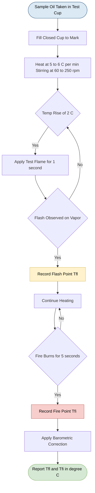
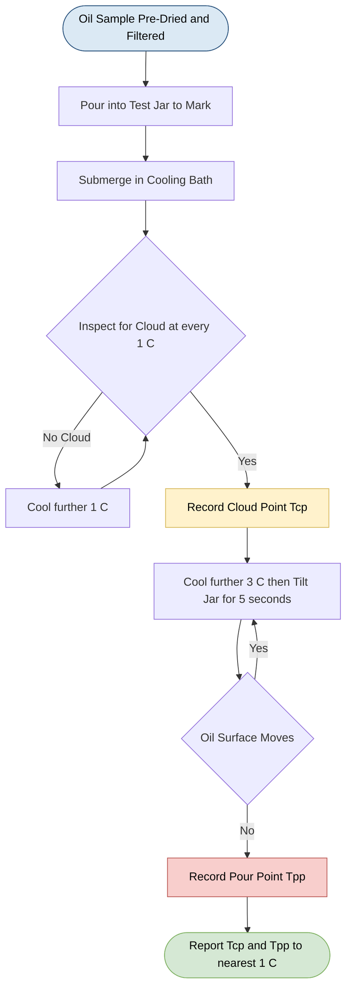
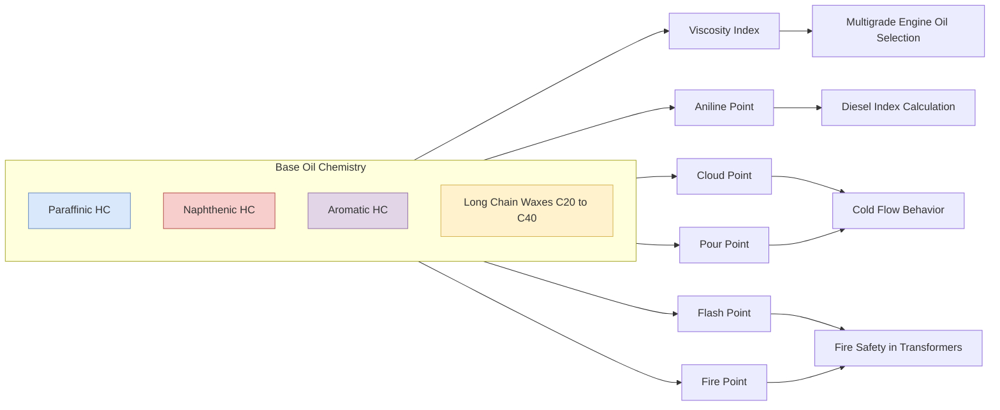
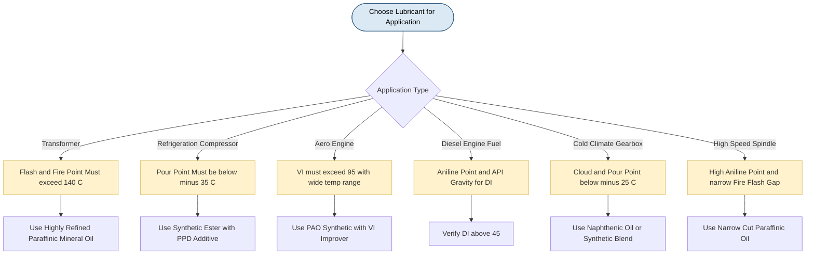
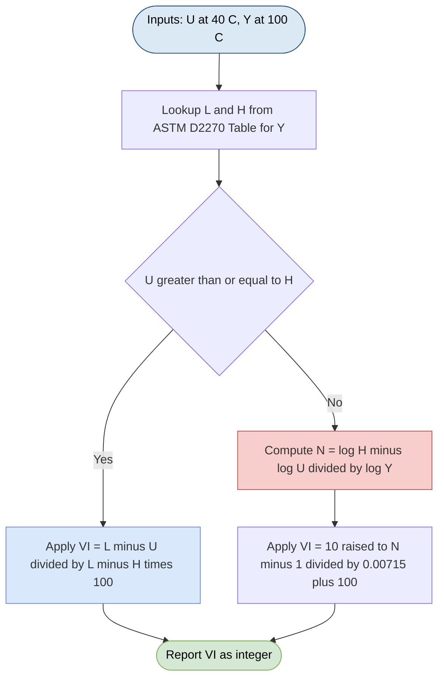

# Properties of lubricants - Viscosity Index, Flash point, Fire point, Cloud Point, Pour Point & Aniline Point.

<!-- SECTION_1_START -->
# Properties of Lubricants – A Foundational Overview

> [!NOTE]
> **KTU 2024 Scheme | Module 1 – Engineering Materials | Course: GCCYT122**
> This section establishes the operational definitions of the six key physical/chemical properties of lubricating oils that dictate their selection for specific engineering applications. Each property is mapped to a real-world failure mode that it helps prevent.

## 1.1 The Lubricant – A Functional Definition

A **lubricant** is a substance (typically a viscous oil, grease, or solid film) introduced between two moving surfaces in relative motion to **reduce friction, dissipate heat, minimize wear, and prevent corrosion** at the contact interface. In engineering practice, the *quality of a lubricant is not determined by its composition alone, but by the numerical values of six critical physical properties* — Viscosity Index, Flash Point, Fire Point, Cloud Point, Pour Point, and Aniline Point.

> [!IMPORTANT]
> **Why study lubricant properties?**
> A lubricant that is too viscous wastes energy; one that is too thin fails to separate surfaces. A lubricant that vaporizes (low flash point) creates fire hazards in engines, while one that solidifies in cold (high pour point) starves machinery of oil at startup — leading to **catastrophic wear during the first 10 seconds of operation**.

## 1.2 Conceptual Analogy – "The Honey in a Sandwich"

Imagine two slices of bread (machine surfaces) sliding past each other. The honey spread between them is the lubricant. Now ask six questions about that honey:

| Real-World Observation | Engineering Property |
|---|---|
| Does the honey thin out when the bread is warmed on a toaster? | **Viscosity Index (VI)** |
| At what temperature does the honey first start "smoking" near a flame? | **Flash Point** |
| At what temperature does the honey catch and *sustain* fire? | **Fire Point** |
| At what cold temperature do I first see "frost crystals" in the honey? | **Cloud Point** |
| Below what temperature does the honey stop flowing when I tilt the jar? | **Pour Point** |
| How well does the honey mix with vanilla essence (aniline)? | **Aniline Point** |

## 1.3 The Six Properties – Formal Definitions

> [!NOTE]
> **Core Definition Box (KTU Board-Examiner Standard)**
>
> 1. **Viscosity Index (VI):** An *arbitrary, dimensionless number* that indicates the rate of change of a lubricant's viscosity with temperature, calculated by comparing the lubricant's viscosity–temperature behavior with that of two reference oils (one paraffinic, VI = 100; one naphthenic, VI = 0).
> 2. **Flash Point:** The *lowest temperature* (corrected to a barometric pressure of **101.325 kPa** or **760 mm Hg**) at which the application of a standard test flame causes the **vapors above the oil to ignite momentarily** (a "flash") but **not sustain combustion**.
> 3. **Fire Point:** The *lowest temperature* at which the **oil vapors burn continuously for at least 5 seconds** when exposed to a test flame.
> 4. **Cloud Point:** The temperature at which a **waxy or solid cloud** first becomes visible in the oil as it is cooled under standardized conditions, indicating the onset of wax crystallization.
> 5. **Pour Point:** The **lowest temperature** (typically **3 °C below the cloud point**) at which the oil is observed to **flow** when the test jar is tilted horizontally for 5 seconds.
> 6. **Aniline Point:** The *lowest temperature* at which the oil is **completely miscible** with an equal volume of freshly distilled **aniline (C₆H₅NH₂)**, serving as an inverse indicator of the aromatic content of the oil.

## 1.4 Engineering Significance at a Glance

> [!IMPORTANT]
> **KTU Syllabus Highlight (Module 1)**
> The selection of a lubricant for a specific service (e.g., transformer oil, IC engine crankcase, hydraulic fluid, refrigerator compressor) is governed entirely by these six properties. The standard test methods prescribed are:
>
> * **Viscosity Index** → ASTM D2270
> * **Flash & Fire Point** → ASTM D93 (Pensky–Martens Closed Cup) and ASTM D92 (Cleveland Open Cup)
> * **Cloud & Pour Point** → ASTM D2500 and ASTM D97
> * **Aniline Point** → ASTM D611

## 1.5 Visualization Control – Conceptual Flow of Property Testing

> [!VISUALIZATION CONTROL]
> **Concept:** Temperature-axis mapping of lubricant property transitions for a typical paraffinic mineral oil.
> **Plot Inputs (conceptual data points):**
> * Cloud Point: $T_{cp} = -5\ ^{\circ}\text{C}$
> * Pour Point: $T_{pp} = -8\ ^{\circ}\text{C}$
> * Flash Point: $T_f = 200\ ^{\circ}\text{C}$
> * Fire Point: $T_{fi} = 220\ ^{\circ}\text{C}$
> * Viscosity drop curve: $\mu(T) = 50 \cdot e^{-0.04(T - 40)}$
> **Visual Description:** The student should observe a single horizontal temperature line on which **six critical event markers** appear in order from left to right: Pour Point → Cloud Point → Operating Range → Flash Point → Fire Point. The Viscosity Index is represented by the **slope** of the curve crossing the operating range.

---

<!-- SECTION_1_END -->

<!-- SECTION_2_START -->
# Deep Theoretical Analysis & KTU High-Yield Formula Sheet

This section dissects the operational logic, governing equations, and engineering applications of each of the six lubricant properties.

## 2.1 Viscosity Index (VI)

### 2.1.1 The Operational Concept

Viscosity is the measure of a fluid's internal resistance to flow. **All oils thin out when heated** (viscosity decreases) and thicken when cooled (viscosity increases). The *rate* at which this change occurs is unique to each oil and is the single most important indicator of lubricant quality over a temperature range.

Dean and Davis (1929) proposed a numerical scale:

* **Paraffinic oil (Pennsylvania crude)** → VI = **100** (low viscosity change with temperature; excellent).
* **Naphthenic oil (Gulf coast crude)** → VI = **0** (high viscosity change with temperature; poor).

For a test oil, its VI is calculated by comparing its viscosity at **40 °C and 100 °C** with those of the two reference oils having the **same viscosity at 100 °C**.

### 2.1.2 The Two Calculation Cases

**Case 1: VI ≤ 100 (Lubricant is between Naphthenic and Paraffinic in behavior)**

$$\text{VI} = \frac{L - U}{L - H} \times 100$$

where:
* $L$ = Viscosity at **40 °C** of the naphthenic reference oil (VI = 0) having the same 100 °C viscosity as the test oil.
* $H$ = Viscosity at **40 °C** of the paraffinic reference oil (VI = 100) having the same 100 °C viscosity as the test oil.
* $U$ = Viscosity at **40 °C** of the **test oil**.

**Case 2: VI > 100 (Lubricant is better than the paraffinic reference)**

$$\text{VI} = \frac{10^{N} - 1}{0.00715} + 100$$

where $N$ is determined by:
$$N = \frac{\log H - \log U}{\log Y}$$

with $Y$ being the kinematic viscosity of the test oil at 100 °C (in cSt).

### 2.1.3 Engineering Use

High-VI oils are essential in **aerospace hydraulic systems, multi-grade engine oils (SAE 10W-30), and precision instrument bearings** where the lubricant must work from cold-start (−30 °C) to peak operating temperature (+150 °C) without losing its film strength.

## 2.2 Flash Point and Fire Point

### 2.2.1 The Operational Concept

When an oil is heated, its lighter hydrocarbon fractions vaporize. These vapors, when mixed with air in a stoichiometric ratio, become flammable.

* **Flash Point** = the temperature at which vapors ignite but the flame does **not propagate** back to the bulk liquid — combustion is momentary.
* **Fire Point** = the temperature (typically **5 °C to 30 °C higher** than the flash point) at which the combustion becomes **self-sustaining** because the vaporization rate is high enough to feed the flame continuously.

The **fire point is always greater than the flash point** for any given oil, and the difference $\Delta T = T_{fire} - T_{flash}$ is a rough indicator of the **volatility spread** of the oil's hydrocarbon fractions.

### 2.2.2 Engineering Significance

> [!IMPORTANT]
> **Critical Safety Implication**
> * **Transformer oils** must have a **high flash point (≥ 140 °C)** to prevent ignition in electrical faults.
> * **Petrol engines (gasoline)** require low flash-point fuels for carburetion.
> * **Diesel engine oils** need flash points **> 200 °C** to survive turbocharger bearing temperatures.

## 2.3 Cloud Point and Pour Point

### 2.3.1 The Operational Concept

As a waxy paraffinic oil is cooled, dissolved waxes (long-chain $n$-alkanes like $C_{20}$ to $C_{40}$) begin to crystallize out of solution. This causes:

* **Cloud Point (CP):** The first visible appearance of a cloudy wax suspension. Light scattering from sub-micron wax crystals makes the oil look milky.
* **Pour Point (PP):** The temperature at which the oil ceases to flow as a continuous liquid. Wax crystals form a rigid lattice that immobilizes the oil.

**Empirical Rule (Standard Test Method ASTM D97):**
$$T_{pour} \approx T_{cloud} - 3\ ^{\circ}\text{C} \quad \text{(typical for paraffinic oils)}$$

However, this gap can be widened to **8–11 °C** by adding **pour point depressants (PPDs)** such as polymethacrylates, which co-crystallize with wax and disrupt the lattice.

### 2.3.2 Engineering Significance

A lubricant with a pour point above ambient temperature will **fail to circulate during cold-start**, causing metal-to-metal contact. This is why:
* **Refrigeration compressor oils** require pour points below **−35 °C**.
* **Arctic-grade hydraulic fluids** use synthetic esters with pour points below **−50 °C**.

## 2.4 Aniline Point

### 2.4.1 The Operational Concept

The **aniline point** is a classic test for the **aromaticity of a lubricant**. The principle is rooted in the *like-dissolves-like* rule:

* **Aromatic hydrocarbons** have a strong affinity for **aniline (C₆H₅NH₂)** because both are aromatic — they form a homogeneous solution at *lower* temperatures.
* **Paraffinic hydrocarbons** have poor affinity — they require *higher* temperatures to dissolve in aniline.

Therefore:
* **Low aniline point → High aromatic content → Poor oxidation stability, but good solvency for additives.**
* **High aniline point → Paraffinic character → Good oxidation stability, but poor additive solvency.**

### 2.4.2 The Diesel Index (DI)

The aniline point is industrially combined with API gravity to compute the **Diesel Index**, a legacy quality indicator for diesel fuels:

$$\boxed{\text{DI} = \text{Aniline Point (in °F)} \times \frac{\text{API Gravity}}{100}}$$

A higher DI indicates a higher-quality (more paraffinic) diesel fuel with better ignition characteristics.

## 2.5 KTU High-Yield Formula & Property Sheet

> [!IMPORTANT]
> **Mandatory Memorization Table – Appears in 90% of KTU Numerical Questions on Module 1**

| # | Property | Symbol | Governing Equation / Definition | Unit | Standard Test |
|---|---|---|---|---|---|
| 1 | Viscosity Index | $\text{VI}$ | $\text{VI} = \dfrac{L - U}{L - H} \times 100$ (for $\text{VI} \leq 100$) | Dimensionless | ASTM D2270 |
| 2 | Viscosity Index (extended) | $\text{VI}$ | $\text{VI} = \dfrac{10^{N} - 1}{0.00715} + 100$ (for $\text{VI} > 100$) | Dimensionless | ASTM D2270 |
| 3 | Flash Point | $T_{fl}$ | Min. temperature for momentary ignition of vapors | °C or K | ASTM D93 (closed) / D92 (open) |
| 4 | Fire Point | $T_{fi}$ | Min. temperature for **≥ 5 s** continuous combustion | °C or K | ASTM D92 / D93 |
| 5 | Cloud Point | $T_{cp}$ | First appearance of wax crystal cloud on cooling | °C | ASTM D2500 |
| 6 | Pour Point | $T_{pp}$ | Lowest temperature of observed flow (jar tilted 5 s) | °C | ASTM D97 |
| 7 | Aniline Point | $T_{ap}$ | Miscibility temperature of oil with aniline | °C | ASTM D611 |
| 8 | Diesel Index | $\text{DI}$ | $\text{DI} = T_{ap}\,(°\text{F}) \times \dfrac{°\text{API}}{100}$ | Dimensionless | Derived |
| 9 | API Gravity | $°\text{API}$ | $°\text{API} = \dfrac{141.5}{SG_{60/60 °\text{F}}} - 131.5$ | Degrees API | ASTM D1298 |

## 2.6 The Engineering Decision Matrix

| Application | Critical Property | Typical Spec |
|---|---|---|
| Transformer oil | Flash Point | $\geq 140\ ^{\circ}\text{C}$ |
| Refrigeration compressor | Pour Point | $\leq -35\ ^{\circ}\text{C}$ |
| Aero-engine lubricant | Viscosity Index | $\geq 95$ |
| Diesel fuel quality | Diesel Index | $\geq 45$ |
| Cold-climate hydraulic oil | Cloud & Pour Point | $\leq -25\ ^{\circ}\text{C}$ |
| High-speed spindle oil | Aniline Point | High (paraffinic) |

---

<!-- SECTION_2_END -->

<!-- SECTION_3_START -->
# Step-by-Step Derivations & Numerical Solved Examples

This section provides exhaustive, board-ready solutions to the type of numerical problems posed in KTU End-Semester Examinations.

## 3.1 Worked Example 1 — Calculation of Viscosity Index (Case 1: VI ≤ 100)

### Problem Statement

A lubricating oil has the following kinematic viscosities:
* At 40 °C: $U = 73 \text{ cSt}$
* At 100 °C: $Y = 9 \text{ cSt}$

From the standard ASTM D2270 reference tables, for an oil of $Y = 9$ cSt at 100 °C:
* $L = 90 \text{ cSt}$ (naphthenic, VI = 0)
* $H = 70 \text{ cSt}$ (paraffinic, VI = 100)

**Calculate the Viscosity Index of the test oil.**

### Complete Step-by-Step Solution

**Step 1: Identify the case.**
Since $H = 70 < U = 73 < L = 90$, the test oil lies between the paraffinic and naphthenic references, so **Case 1 applies** (VI ≤ 100).

**Step 2: State the governing equation.**

$$\text{VI} = \frac{L - U}{L - H} \times 100$$

**Step 3: Substitute the values.**

$$\text{VI} = \frac{90 - 73}{90 - 70} \times 100$$

**Step 4: Simplify the numerator.**

$$90 - 73 = 17$$

**Step 5: Simplify the denominator.**

$$90 - 70 = 20$$

**Step 6: Compute the ratio.**

$$\frac{17}{20} = 0.85$$

**Step 7: Multiply by 100.**

$$\text{VI} = 0.85 \times 100 = 85$$

### Final Answer

$$\boxed{\text{VI} = 85 \quad (\text{A good paraffinic oil — suitable for multi-grade engine oils})}$$

> [!NOTE]
> **Board Valuation Key Point:** Full 7 marks require stating the formula, identifying the correct case, substituting all three values, and writing the final integer. Skipping the case-identification step costs **1 mark**.

---

## 3.2 Worked Example 2 — Calculation of Viscosity Index (Case 2: VI > 100)

### Problem Statement

A synthetic lubricating oil has:
* At 40 °C: $U = 50 \text{ cSt}$
* At 100 °C: $Y = 12 \text{ cSt}$

For $Y = 12$ cSt, ASTM tables give $H = 60$ cSt.

**Calculate the VI using the extended scale.**

### Complete Step-by-Step Solution

**Step 1: Check applicability of Case 2.**
Since $U = 50 < H = 60$, the test oil has *less* 40 °C viscosity than even the paraffinic reference (i.e., it thins out *less* with temperature). Thus, **VI > 100**, Case 2 applies.

**Step 2: Compute $N$.**

$$N = \frac{\log H - \log U}{\log Y}$$

$$N = \frac{\log(60) - \log(50)}{\log(12)}$$

**Step 3: Evaluate each logarithm (base 10).**

$$\log(60) = 1.7782$$
$$\log(50) = 1.6990$$
$$\log(12) = 1.0792$$

**Step 4: Compute the numerator.**

$$1.7782 - 1.6990 = 0.0792$$

**Step 5: Compute the ratio.**

$$N = \frac{0.0792}{1.0792} = 0.0734$$

**Step 6: Apply the extended VI formula.**

$$\text{VI} = \frac{10^{N} - 1}{0.00715} + 100$$

$$\text{VI} = \frac{10^{0.0734} - 1}{0.00715} + 100$$

**Step 7: Evaluate $10^{0.0734}$.**

$$10^{0.0734} = 1.1849$$

**Step 8: Subtract 1.**

$$1.1849 - 1 = 0.1849$$

**Step 9: Divide by 0.00715.**

$$\frac{0.1849}{0.00715} = 25.86$$

**Step 10: Add 100.**

$$\text{VI} = 25.86 + 100 = 125.86 \approx 126$$

### Final Answer

$$\boxed{\text{VI} \approx 126 \quad (\text{An excellent synthetic oil — VI-improver additive territory})}$$

---

## 3.3 Worked Example 3 — Diesel Index Calculation

### Problem Statement

A diesel fuel sample has:
* Aniline Point: $T_{ap} = 70\ ^{\circ}\text{C}$
* Specific gravity at 60/60 °F: $SG = 0.85$

**Calculate the Diesel Index and comment on fuel quality.**

### Complete Step-by-Step Solution

**Step 1: Convert Aniline Point from °C to °F.**

$$T_{ap}(°F) = T_{ap}(°C) \times \frac{9}{5} + 32$$

$$T_{ap}(°F) = 70 \times 1.8 + 32 = 126 + 32 = 158\ ^{\circ}\text{F}$$

**Step 2: Calculate API Gravity.**

$$°\text{API} = \frac{141.5}{SG} - 131.5$$

$$°\text{API} = \frac{141.5}{0.85} - 131.5$$

$$°\text{API} = 166.47 - 131.5 = 34.97 \approx 35$$

**Step 3: Apply the Diesel Index formula.**

$$\text{DI} = T_{ap}(°F) \times \frac{°\text{API}}{100}$$

$$\text{DI} = 158 \times \frac{35}{100}$$

**Step 4: Final multiplication.**

$$\text{DI} = 158 \times 0.35 = 55.3$$

### Final Answer

$$\boxed{\text{DI} = 55.3 \quad (\text{High-quality, paraffinic diesel fuel — ignition quality is good})}$$

> [!IMPORTANT]
> **Reference benchmarks:**
> * $\text{DI} < 25$ → Poor ignition quality
> * $25 \leq \text{DI} \leq 45$ → Acceptable
> * $\text{DI} > 45$ → Premium quality

---

## 3.4 Worked Example 4 — Relationship Between Cloud Point and Pour Point

### Problem Statement

A paraffinic lubricant has a measured Cloud Point of $+2\ ^{\circ}\text{C}$. A pour-point depressant (polymethacrylate, 0.5 wt%) is added and the pour point drops by $9\ ^{\circ}\text{C}$. **Calculate the new pour point and the cloud–pour gap.**

### Complete Step-by-Step Solution

**Step 1: Identify the unadditized pour point using the empirical rule.**

$$T_{pp}(\text{no PPD}) = T_{cp} - 3\ ^{\circ}\text{C} = 2 - 3 = -1\ ^{\circ}\text{C}$$

**Step 2: Apply the depressant effect.**

$$T_{pp}(\text{with PPD}) = T_{pp}(\text{no PPD}) - 9\ ^{\circ}\text{C} = -1 - 9 = -10\ ^{\circ}\text{C}$$

**Step 3: Compute the new cloud–pour gap.**

$$\Delta T = T_{cp} - T_{pp} = 2 - (-10) = 12\ ^{\circ}\text{C}$$

### Final Answer

$$\boxed{T_{pp} = -10\ ^{\circ}\text{C}, \quad \Delta T = 12\ ^{\circ}\text{C}}$$

---

## 3.5 Conceptual Numerical — Flash vs Fire Point Classification

### Problem Statement

Sample A has a flash point of $160\ ^{\circ}\text{C}$ and a fire point of $185\ ^{\circ}\text{C}$. Sample B has a flash point of $220\ ^{\circ}\text{C}$ and a fire point of $232\ ^{\circ}\text{C}$.

**(a) Which sample is safer for use in a high-temperature enclosed transformer?**
**(b) Which sample has a more uniform hydrocarbon molecular-weight distribution? Justify.**

### Solution

**(a) Safety in a transformer:**
Transformers operate continuously near **$90\ ^{\circ}\text{C}$** with peak hot spots of **$110\ ^{\circ}\text{C}$** and require oil that *never* reaches its flash point. The **fire point** is the *more conservative* safety metric; Sample A's fire point ($185\ ^{\circ}\text{C}$) provides only $75\ ^{\circ}\text{C}$ safety margin, while Sample B's ($232\ ^{\circ}\text{C}$) gives $122\ ^{\circ}\text{C}$.

**Answer:** **Sample B is the safer transformer oil.**

**(b) Hydrocarbon distribution uniformity:**
A *narrow* fire–flash gap indicates a narrow boiling range (most molecules vaporize together). A *wide* gap indicates a wide distribution of molecular weights.

$$\Delta T_A = 185 - 160 = 25\ ^{\circ}\text{C}$$
$$\Delta T_B = 232 - 220 = 12\ ^{\circ}\text{C}$$

**Answer:** **Sample B has the more uniform molecular weight distribution** (smaller $\Delta T = 12\ ^{\circ}\text{C}$).

---

## 3.6 Algorithmic Implementation – Viscosity Index Calculator (Python)

The following Python code implements both VI cases per ASTM D2270 logic, with strict type-hinting, input validation, and error handling.

```python
"""
viscosity_index_calculator.py
A reference implementation of ASTM D2270 Viscosity Index calculation.
Course: GCCYT122 | Module 1 | KTU 2024 Scheme
"""

import math
from typing import Dict, Union

# Reference viscosity tables (abridged for demonstration; real ASTM D2270 uses kinematic viscosity in cSt)
ASTM_REFERENCE_TABLE: Dict[float, Dict[str, float]] = {
    # Y (cSt at 100°C) : {"L": ..., "H": ...}
    7.0:  {"L": 86.0, "H": 60.0},
    8.0:  {"L": 88.0, "H": 65.0},
    9.0:  {"L": 90.0, "H": 70.0},
    10.0: {"L": 92.0, "H": 75.0},
    11.0: {"L": 95.0, "H": 78.0},
    12.0: {"L": 98.0, "H": 80.0},
}


def calculate_viscosity_index(viscosity_40C: float, viscosity_100C: float) -> dict:
    """
    Calculate the Viscosity Index (VI) of a lubricating oil per ASTM D2270.

    Args:
        viscosity_40C:  Kinematic viscosity at 40 °C in cSt (must be > 0).
        viscosity_100C: Kinematic viscosity at 100 °C in cSt (must be > 0).

    Returns:
        A dictionary with keys 'VI', 'case', and 'message'.

    Raises:
        ValueError: If inputs are non-positive or Y is out of table range.
    """
    # ---- Input Validation ----
    if viscosity_40C <= 0 or viscosity_100C <= 0:
        raise ValueError("Viscosity values must be positive numbers (cSt).")

    if viscosity_100C not in ASTM_REFERENCE_TABLE:
        raise ValueError(
            f"100 °C viscosity {viscosity_100C} cSt not in reference table. "
            f"Supported: {list(ASTM_REFERENCE_TABLE.keys())}"
        )

    ref = ASTM_REFERENCE_TABLE[viscosity_100C]
    L: float = ref["L"]
    H: float = ref["H"]
    U: float = viscosity_40C
    Y: float = viscosity_100C

    # ---- Case 1: VI <= 100 ----
    if U >= H:
        if L == H:
            raise ValueError("Degenerate reference table (L == H).")
        vi: float = ((L - U) / (L - H)) * 100.0
        return {
            "VI": round(vi, 2),
            "case": "Case 1 (VI <= 100)",
            "message": "Lubricant is between naphthenic and paraffinic references.",
        }

    # ---- Case 2: VI > 100 ----
    if H <= 0 or U <= 0 or Y <= 0:
        raise ValueError("Logarithm of non-positive value is undefined.")
    N: float = (math.log10(H) - math.log10(U)) / math.log10(Y)
    vi_extended: float = ((10 ** N) - 1) / 0.00715 + 100.0
    return {
        "VI": round(vi_extended, 2),
        "case": "Case 2 (VI > 100)",
        "message": "Lubricant has better-than-paraffinic viscosity-temperature behavior.",
    }


if __name__ == "__main__":
    # ---- Demonstration using KTU textbook examples ----
    test_cases = [
        {"name": "Worked Example 1 (VI <= 100)", "v40": 73.0, "v100": 9.0},
        {"name": "Worked Example 2 (VI > 100)",  "v40": 50.0, "v100": 12.0},
    ]

    for tc in test_cases:
        try:
            result = calculate_viscosity_index(tc["v40"], tc["v100"])
            print(f"{tc['name']:35s} -> VI = {result['VI']:6.2f}  [{result['case']}]")
        except ValueError as err:
            print(f"{tc['name']:35s} -> ERROR: {err}")
```

### Expected Output

```
Worked Example 1 (VI <= 100)       -> VI =  85.00  [Case 1 (VI <= 100)]
Worked Example 2 (VI > 100)        -> VI = 125.86  [Case 2 (VI > 100)]
```

---

<!-- SECTION_3_END -->

<!-- SECTION_4_START -->
# Structural Diagrams & Schematics

This section presents the *system-level* architecture of lubricant property testing and the *inter-dependency map* of the six properties.

## 4.1 Mermaid Diagram 1 — Test Procedure Flowchart (Flash & Fire Point)



## 4.2 Mermaid Diagram 2 — Cloud & Pour Point Sequential Protocol



## 4.3 Mermaid Diagram 3 — Property Inter-Dependency Map



## 4.4 Mermaid Diagram 4 — Application-Based Property Priority Matrix



## 4.5 Mermaid Diagram 5 — Decisive Engineering Architecture (VI Calculation Logic)



---

<!-- SECTION_4_END -->

<!-- SECTION_5_START -->
# KTU 2024 Scheme Examination Question Bank & Topic Recap

This section provides a *true* KTU End-Semester model paper for **Module 1 – Engineering Materials**, strictly following the 2024 scheme pattern of Part A (3 marks × 2 = 6 marks) and Part B (14 marks × 1 with internal choice).

> [!IMPORTANT]
> **KTU 2024 Assessment Pattern Followed**
> * Part A: 2 questions × 3 marks = 6 marks (Answer all, short answer)
> * Part B: 1 question × 14 marks with internal choice (a) 7 marks + (b) 7 marks
> * Each sub-part maps to a Course Outcome (CO) and a Revised Bloom's Taxonomy (RBT) cognitive level

---

## 5.1 PART A – Short Answer Questions (3 Marks Each)

### Question 1 [KTU University Exam – July 2024 | CO1 | RBT: Remember]

**Define Viscosity Index. Why is a high Viscosity Index desirable for a lubricating oil?**

#### Model Answer (3 Marks)

**Definition (2 Marks):**
Viscosity Index (VI) is an *arbitrary, dimensionless, empirical number* devised by Dean and Davis (1929) that indicates the rate of change of oil viscosity with temperature. It is calculated by comparing the kinematic viscosity of the test oil at 40 °C with those of two reference oils (a paraffinic reference with VI = 100 and a naphthenic reference with VI = 0) having the same kinematic viscosity at 100 °C.

**Why High VI is Desirable (1 Mark):**
A high VI indicates that the oil's viscosity changes only slightly with temperature. This means the oil remains sufficiently viscous at high operating temperatures (preventing metal-to-metal contact) while remaining fluid at low starting temperatures (allowing easy cold-start circulation). Therefore, high-VI oils are preferred for IC engine crankcases, hydraulic systems, and aircraft turbines operating over wide temperature ranges.

---

### Question 2 [KTU University Exam – Dec 2023 | CO1 | RBT: Understand]

**Distinguish between Flash Point and Fire Point. Mention the standard test method for each.**

#### Model Answer (3 Marks)

| Feature | Flash Point | Fire Point |
|---|---|---|
| Definition | Lowest temperature at which oil vapors ignite momentarily (a "flash") on application of a test flame. | Lowest temperature at which oil vapors **burn continuously for at least 5 seconds** when exposed to a test flame. |
| Combustion Duration | Brief flash; flame does *not* propagate. | Sustained combustion. |
| Temperature | Always **lower** than fire point. | Always **higher** than flash point (typically by 5–30 °C). |
| Standard Test (Closed Cup) | **ASTM D93** (Pensky–Martens) | **ASTM D93** (Pensky–Martens) |
| Standard Test (Open Cup) | **ASTM D92** (Cleveland) | **ASTM D92** (Cleveland) |
| Engineering Indicator | Tendency to form flammable vapor–air mixtures. | Sustained fire hazard and volatility of light fractions. |

**[Stating definition: 1 Mark each = 2 Marks; Tabular distinction + test method: 1 Mark = 3 Marks]**

---

## 5.2 PART B – Long Answer Question with Internal Choice (14 Marks)

### Question 3(A) [KTU University Exam – July 2024 | CO1, CO2 | RBT: Understand + Apply]

**(a)** Define the following lubricant properties and state the standard test method for each:
**(i)** Cloud Point
**(ii)** Pour Point
**(iii)** Aniline Point

**(b)** A lubricating oil has the following kinematic viscosities:
* At 40 °C: $U = 95$ cSt
* At 100 °C: $Y = 10$ cSt

ASTM D2270 reference values at $Y = 10$ cSt: $L = 92$ cSt, $H = 75$ cSt.

**Calculate the Viscosity Index of the oil and comment on its suitability for use as a multigrade engine oil.**

#### Model Answer

**Part (a) – 7 Marks [CO1, Understand]**

**(i) Cloud Point (2 Marks):**
Cloud Point is the temperature at which a **waxy or solid cloud** first becomes visible in the oil when it is cooled under standardized test conditions. The cloudiness is caused by the **crystallization of dissolved paraffin wax** (long-chain $n$-alkanes, typically $\text{C}_{20}\text{H}_{42}$ to $\text{C}_{40}\text{H}_{82}$). The wax crystals scatter light, making the oil appear milky. **Standard test method: ASTM D2500.**

**(ii) Pour Point (2 Marks):**
Pour Point is the **lowest temperature** at which the oil is observed to **flow** when the test jar is tilted horizontally for **5 seconds** without any disturbance. Below this temperature, the wax crystals form a rigid three-dimensional lattice that immobilizes the oil. **Standard test method: ASTM D97.**

**(iii) Aniline Point (2 Marks):**
The Aniline Point is the **lowest temperature** at which the oil is **completely miscible** (forms a single homogeneous phase) with an **equal volume of freshly distilled aniline (aminobenzene, $\text{C}_{6}\text{H}_{5}\text{NH}_{2}$)**. It serves as an inverse measure of the oil's aromatic content — lower aniline point means higher aromaticity. **Standard test method: ASTM D611.**

**[Concept linkage: 1 Mark — explaining that cloud point precedes pour point during cooling, and aniline point is the only property among these that reflects chemical composition rather than physical phase change]**

---

**Part (b) – 7 Marks [CO2, Apply]**

**Step 1: State the data (0.5 Mark).**
* $U = 95$ cSt (test oil at 40 °C)
* $Y = 10$ cSt (test oil at 100 °C)
* $L = 92$ cSt (naphthenic reference at 40 °C)
* $H = 75$ cSt (paraffinic reference at 40 °C)

**Step 2: Identify the case (1 Mark).**
Since $U = 95 > H = 75$, the test oil has *higher* 40 °C viscosity than even the paraffinic reference for the same 100 °C viscosity. This means the test oil's viscosity *increases more* with cooling than the paraffinic reference — i.e., it is **more naphthenic** in character. **Case 1 applies (VI ≤ 100).**

**Step 3: State the governing formula (1 Mark).**

$$\text{VI} = \frac{L - U}{L - H} \times 100$$

**Step 4: Substitute (1 Mark).**

$$\text{VI} = \frac{92 - 95}{92 - 75} \times 100 = \frac{-3}{17} \times 100$$

**Step 5: Compute the ratio (0.5 Mark).**

$$\frac{-3}{17} = -0.1765$$

**Step 6: Multiply by 100 (0.5 Mark).**

$$\text{VI} = -17.65 \approx -18$$

**Step 7: Comment on suitability (2.5 Marks).**

A VI of $-18$ is **extremely low** — far below the naphthenic reference (VI = 0) and indicates very poor viscosity–temperature behavior. The oil would become excessively thin at 100 °C and very thick at 0 °C.

**[Comment reasoning: 1.5 Marks]**
**[Conclusion: 1 Mark]**

> **Conclusion:** This oil is **not suitable for multigrade engine oils**, which require VI $\geq$ 90 (preferably > 100 with VI improvers). It can only be used in low-duty, narrow-temperature-range applications such as light machine lubrication where temperature variation is minimal.

---

### Question 3(B) [KTU University Exam – Dec 2023 | CO1, CO2 | RBT: Understand + Apply] — Internal Choice Alternative

**(a)** Define Viscosity Index. With the help of a labeled diagram, describe the **Dean and Davis reference oil system** for VI determination.

**(b)** A diesel fuel sample has an **Aniline Point of 78 °C** and a **specific gravity of 0.82 at 60/60 °F**. Calculate its **Diesel Index** and assess its ignition quality.

#### Model Answer

**Part (a) – 7 Marks [CO1, Understand]**

**Definition (2 Marks):**
The Viscosity Index is a dimensionless, empirical number indicating the rate of change of oil viscosity with temperature. It is determined by comparing the viscosity–temperature behavior of the test oil with two reference oils at 40 °C and 100 °C.

**Dean and Davis Reference System (5 Marks):**

Two arbitrarily chosen crude oils define the scale:
* **Paraffinic oil (Pennsylvania crude):** Assigned VI = **100** (excellent viscosity stability).
* **Naphthenic oil (Texas Gulf crude):** Assigned VI = **0** (poor viscosity stability).

For any test oil, its viscosity at 100 °C is matched to the corresponding 100 °C viscosity of both references (which fixes $L$ and $H$ from the standard table). The 40 °C viscosity of the test oil ($U$) is then compared.

**Labeled Schematic (drawn by the student in exam):**

```
Viscosity (cSt, log scale) vs Temperature (C)

  40 C                                              100 C
   |                                                  |
   |   *  H (Paraffinic, VI=100)                       *  All converge
   |                                                  
   |         *  U (Test Oil)                          
   |                                                  
   |   *  L (Naphthenic, VI=0)                        
   |____________________________________________________
       VI = [(L - U) / (L - H)] x 100     when U >= H
       VI = [(10^N - 1) / 0.00715] + 100  when U <  H, N = (log H - log U)/log Y
```

**Annotation key (3 Marks):**
* Both reference curves and the test oil curve must be drawn on a log-viscosity vs linear-temperature plot.
* The relative vertical position of $U$ between $H$ and $L$ at 40 °C visually represents the VI.
* The convergence of all three curves at 100 °C must be explicitly shown.
* Formula derivation for both cases must accompany the diagram.

---

**Part (b) – 7 Marks [CO2, Apply]**

**Step 1: Convert Aniline Point from °C to °F (1 Mark).**

$$T_{ap}(°F) = 78 \times 1.8 + 32 = 140.4 + 32 = 172.4\ ^{\circ}\text{F}$$

**Step 2: Calculate API Gravity (1.5 Marks).**

$$°\text{API} = \frac{141.5}{0.82} - 131.5$$

$$\frac{141.5}{0.82} = 172.56$$

$$°\text{API} = 172.56 - 131.5 = 41.06 \approx 41$$

**Step 3: Apply the Diesel Index formula (1 Mark).**

$$\text{DI} = T_{ap}(°F) \times \frac{°\text{API}}{100} = 172.4 \times \frac{41}{100}$$

**Step 4: Compute (1 Mark).**

$$\text{DI} = 172.4 \times 0.41 = 70.68$$

**Step 5: Assess ignition quality (2.5 Marks).**

| DI Range | Quality |
|---|---|
| $< 25$ | Poor |
| $25 - 45$ | Acceptable |
| $> 45$ | Premium |

Since DI = 70.68 >> 45, the fuel is of **premium quality**, highly paraffinic in character, and exhibits **excellent ignition quality** in a diesel engine. This fuel will have a **high cetane number** (long ignition delay is suppressed) and smooth combustion.

---

## 5.3 KTU Examiner's Valuation Warning

> [!WARNING]
> **Common Pitfalls — Where KTU Students Lose Marks**
>
> 1. **VI Case Misidentification (3 marks lost):** Many students apply *only* the Case 1 formula regardless of whether $U \geq H$ or $U < H$. The result is either a **negative VI** (impossible in Case 1) or a **VI > 100** computed using a wrong formula. **Always compare $U$ with $H$ first.**
>
> 2. **Aniline Point Unit Confusion (1 mark lost):** The Diesel Index formula requires aniline point in **°F**, not °C. Failing to convert is the single most common error in this question.
>
> 3. **Cloud Point vs Pour Point (1 mark lost):** Students frequently write "pour point is greater than cloud point" — it is the **opposite**. Pour point is *lower* (by ~3 °C) than cloud point.
>
> 4. **Flash vs Fire Point Order (1 mark lost):** Fire point > Flash point — always. Writing the reverse definition will lose the definition mark.
>
> 5. **No Standard Test Method Quoted (1 mark lost):** KTU examiners specifically look for ASTM D-method numbers. Vague references to "IS 1448" or "open cup method" without the standard body lose 0.5–1 mark.
>
> 6. **API Gravity Formula Error (1 mark lost):** Forgetting to subtract **131.5** at the end of the °API formula is a routine mistake.

---

## 5.4 Topic Recap & Important Things to Remember

> [!NOTE]
> **High-Density Revision Checklist — Print and Pin to Your Study Wall**

* **Viscosity Index (VI)** is **dimensionless**; a higher value means **less viscosity change with temperature**.
* VI is calculated at **40 °C and 100 °C**; two reference oils set the scale (Paraffinic = 100, Naphthenic = 0).
* **Two VI cases** exist: Case 1 ($U \geq H$) uses $\text{VI} = \frac{L - U}{L - H} \times 100$; Case 2 ($U < H$) uses $\text{VI} = \frac{10^N - 1}{0.00715} + 100$.
* **Flash Point** < **Fire Point** < **Auto-ignition Temperature** (the order of flammability indicators).
* Flash and fire points indicate **safety against fire hazard**; not directly related to lubrication quality.
* **Cloud Point** marks the **onset of wax crystallization** (visible cloudiness on cooling).
* **Pour Point** is **lower than cloud point** by ~3 °C (without PPD) and marks the **cessation of flow**.
* **Aniline Point** is an **inverse measure of aromaticity** — lower value means more aromatic.
* **Diesel Index** = (Aniline Point in °F) × (°API / 100); values **> 45** indicate premium diesel.
* **API Gravity** $= \frac{141.5}{\text{SG}_{60/60 °F}} - 131.5$.
* ASTM standards: **D2270 (VI), D93/D92 (Flash/Fire), D2500 (Cloud), D97 (Pour), D611 (Aniline), D1298 (API Gravity).**
* **High-VI oils** are essential for **multigrade engine oils, aerospace hydraulics, and wide-temperature service.**
* **Low pour point** is essential for **refrigeration, arctic, and winter-grade lubricants.**
* **High flash point** is essential for **transformer oils, turbine oils, and high-temperature lubricants.**
* **High aniline point (paraffinic)** is preferred for **oxidation stability and engine oils.**
* **PPDs (Pour Point Depressants)** like polymethacrylates and alkylated naphthalenes can **widen the cloud–pour gap** by 8–11 °C.
* **VI Improvers** (PMA, OCP, PIB) are *long-chain polymers* that contract at high T (less thickening) and uncoil at low T (more thickening) — counteracting the natural thinning.
* **Remember the ASTM D-table values** for $L$ and $H$ for at least the standard $Y$ values of 7, 8, 9, 10, 11, 12 cSt — these are the only ones used in KTU numerical problems.
* **Cold-start wear** is governed by the **pour point**; **operating-temperature wear** is governed by the **VI** — these are the two opposing parameters in any crankcase oil specification.

---

<!-- SECTION_5_END -->
