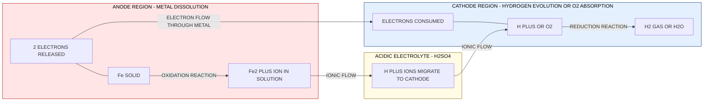
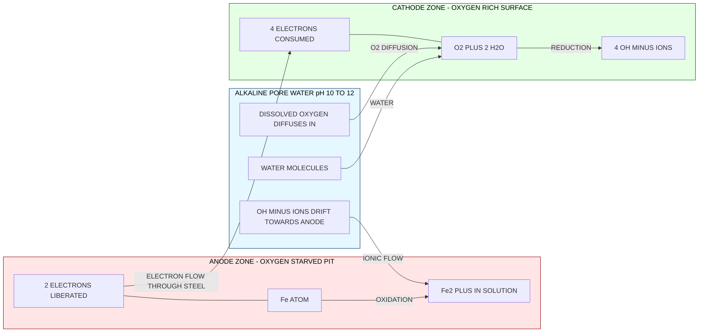
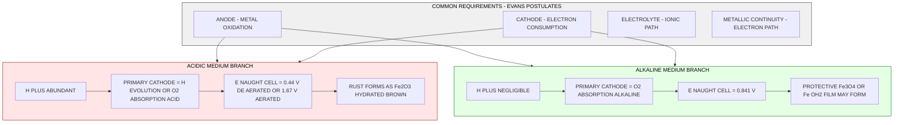
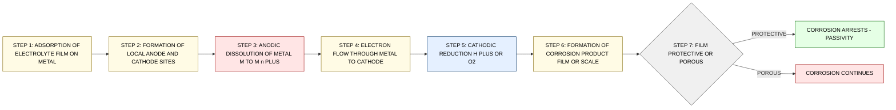

# Corrosion –Electrochemical corrosion mechanism (acidic & alkaline medium).

<!-- SECTION_1_START -->

# Corrosion – Electrochemical Corrosion Mechanism (Acidic & Alkaline Medium)

## 1. Core Technical Definition

> [!IMPORTANT]
> **Electrochemical Corrosion** is the destructive attack of a metal by the environment through an **electrochemical process** in which the anodic reaction (metal dissolution / oxidation) and the cathodic reaction (reduction of some species from the electrolyte) proceed simultaneously at different locations on the metal surface, coupled by the flow of electrons through the metal and ions through the electrolyte.

According to the **KTU 2024 Scheme – GCCYT122 (Chemistry for Physical Science)** syllabus, the electrochemical corrosion mechanism is treated under the broader umbrella of *corrosion science*, and the four mandatory pre-requisites (Evans' postulates) for any electrochemical corrosion cell are:

1. **Anode** – the region where the metal is oxidised ($M \rightarrow M^{n+} + ne^-$).
2. **Cathode** – the region where a reduction reaction consumes the electrons liberated at the anode.
3. **Electrolyte** – a conducting ionic medium (moisture, salt solution, acidic rain, alkaline soil) that completes the ionic circuit.
4. **Metallic contact** – a continuous electronic path between anode and cathode.

> [!NOTE]
> **Why "electrochemical"?** The word implies *two simultaneous half-reactions*: one **oxidation** (loss of electrons, anodic) and one **reduction** (gain of electrons, cathodic). Without the cathode to "soak up" the electrons, the anodic dissolution of the metal would be thermodynamically arrested — a simple chemical oxidation can never proceed indefinitely in the absence of a depolariser.

### Conceptual Analogy (Intuitive Picture)

Imagine a tiny **voltaic (galvanic) cell** that has been built accidentally on the surface of a metal. The metal itself acts as the *external wire* connecting its own anode and cathode regions. The water film adsorbed from humid air, dew, rain or soil moisture acts as the *electrolyte*. The "useful work" that this micro-cell tries to deliver is exactly the energy released when the metal returns to its thermodynamically stable oxidised state (ore). Because no external load is connected, all that free energy is dissipated as heat, and the metal **dissolves** at the anode — that is corrosion in its purest form.

> A corroding metal is essentially a *short-circuited battery* whose electrodes are made of the same metal sitting in a non-uniform environment.

### The Two Universally Observed Cathodic Reactions

The cathodic reaction in corrosion depends almost entirely on the **pH** of the electrolyte film:

| Environment | Dominant Cathodic Reaction | Name of the Process |
|---|---|---|
| **Acidic medium** (pH < 7) | $2H^+ + 2e^- \rightarrow H_2(g)$ | Hydrogen evolution |
| **Acidic medium** (aerated) | $O_2 + 4H^+ + 4e^- \rightarrow 2H_2O$ | Oxygen absorption (acid) |
| **Neutral / Alkaline medium** (pH $\geq$ 7, aerated) | $O_2 + 2H_2O + 4e^- \rightarrow 4OH^-$ | Oxygen absorption (alkaline) |

> [!TIP]
> **Practical memory hook:** In **acid**, $H^+$ ions are abundant, so hydrogen evolution dominates in oxygen-starved conditions. In **alkaline (and neutral)**, $H^+$ is vanishingly small, so dissolved $O_2$ becomes the only viable electron acceptor → *oxygen absorption* is the universal cathodic reaction in most real-world corrosion (atmospheric, marine, buried-pipe).

### Physical Constants and Standard Metrics

- **Faraday's constant:** $F = \mathbf{96487 \ C \cdot mol^{-1}}$ (≈ 96500 C·mol⁻¹)
- **Standard electrode potential of SHE:** $E^\circ_{H^+/H_2} = \mathbf{0.000 \ V}$
- **Standard electrode potential of O₂/OH⁻:** $E^\circ_{O_2/OH^-} = \mathbf{+0.401 \ V}$
- **Density of iron:** $\rho_{Fe} = \mathbf{7.87 \ g \cdot cm^{-3}}$
- **Valency of iron in rust (Fe₂O₃):** n = **3**
- **Atomic mass of Fe:** $\mathbf{55.85 \ g \cdot mol^{-1}}$

---

<!-- SECTION_1_END -->

<!-- SECTION_2_START -->

# 2. Deep Theoretical Analysis & KTU High-Yield Formula Sheet

## 2.1 Mechanism of Electrochemical Corrosion in **Acidic Medium**

Consider a piece of **iron** dipped in dilute $H_2SO_4$ (deaerated acidic medium). The surface is heterogeneous — grain boundaries, inclusions, stress points, and impurity sites set up local potential differences.

### Step-by-step Mechanism

**Step 1 — Anodic dissolution (oxidation):**

$$Fe(s) \rightarrow Fe^{2+}(aq) + 2e^- \quad (E^\circ_{Fe^{2+}/Fe} = -0.44\ V)$$

Iron atoms pass into solution as $Fe^{2+}$ ions, liberating two electrons each. This is the *destructive* step.

**Step 2 — Cathodic reduction (acidic, hydrogen evolution):**

$$2H^+(aq) + 2e^- \rightarrow H_2(g) \uparrow \quad (E^\circ = 0.00\ V)$$

The electrons released at the anode migrate through the metal and are consumed at a cathodic site (e.g., an inclusion, an impurity such as $Fe_3C$, or a region of higher $H^+$ concentration) where $H^+$ ions are reduced to hydrogen gas. Bubbles of $H_2$ are physically observable on the surface — a classic diagnostic feature of *hydrogen-evolution type* acid corrosion.

**Step 3 — Overall cell reaction (by adding the half-reactions):**

$$Fe(s) + 2H^+(aq) \rightarrow Fe^{2+}(aq) + H_2(g) \uparrow$$

**Net EMF of the corrosion cell:**

$$E^\circ_{cell} = E^\circ_{cathode} - E^\circ_{anode} = 0.00 - (-0.44) = +0.44\ V$$

Since $E^\circ_{cell} > 0$, the reaction is **spontaneous** — iron will corrode vigorously in non-oxidising acids.

**Step 4 — Aerated acidic medium (oxygen absorption in acid):**

If dissolved $O_2$ is present (open beaker, flowing acid), the cathodic reaction changes to:

$$O_2(g) + 4H^+(aq) + 4e^- \rightarrow 2H_2O(l) \quad (E^\circ = +1.23\ V)$$

Now the cell EMF jumps to:

$$E^\circ_{cell} = 1.23 - (-0.44) = +1.67\ V$$

This is **far more aggressive** — the higher the cathodic potential, the larger the thermodynamic driving force, and the faster the corrosion rate (subject to kinetic / polarisation constraints).

> [!IMPORTANT]
> **Key Insight for KTU Board Exams:** *Aerated acids corrode metals many times faster than de-aerated acids* of the same pH because the dissolved oxygen depolarises the cathode continuously.

**Step 5 — Subsequent hydrolysis and rust formation:**

$$Fe^{2+} + 2OH^- \rightarrow Fe(OH)_2 \quad \text{(greenish white precipitate)}$$

$$4Fe(OH)_2 + O_2 + 2H_2O \rightarrow 4Fe(OH)_3 \quad \text{(brown rust)}$$

$$2Fe(OH)_3 \rightarrow Fe_2O_3 \cdot H_2O + 2H_2O \quad \text{(hydrated ferric oxide — the familiar red-brown rust)}$$

The $OH^-$ for the hydrolysis step is generated locally at the cathode by the oxygen-absorption reaction.

---

## 2.2 Mechanism of Electrochemical Corrosion in **Alkaline Medium**

In an alkaline medium (e.g., $NaOH$ solution, fresh concrete pore water, damp alkaline soil), the $H^+$ concentration is negligible, so **hydrogen evolution is essentially impossible**. The cathodic reaction is **invariably oxygen absorption**, and the dissolved $O_2$ must be replenished by diffusion through the liquid film.

### Step-by-step Mechanism (Iron in aerated alkaline solution)

**Step 1 — Anodic dissolution (oxidation):**

$$Fe(s) \rightarrow Fe^{2+}(aq) + 2e^-$$

**Step 2 — Cathodic reduction (alkaline, oxygen absorption):**

$$O_2(g) + 2H_2O(l) + 4e^- \rightarrow 4OH^-(aq) \quad (E^\circ = +0.401\ V)$$

**Step 3 — Overall cell reaction:**

$$2Fe(s) + O_2(g) + 2H_2O(l) \rightarrow 2Fe^{2+}(aq) + 4OH^-(aq)$$

**Net EMF of the cell:**

$$E^\circ_{cell} = 0.401 - (-0.44) = +0.841\ V$$

The reaction is spontaneous, but **kinetically slower** than in acid because:
- $O_2$ solubility and diffusion in alkaline water are limited.
- A protective **iron hydroxide / oxide film** ($Fe(OH)_2$ or $Fe_3O_4$) may precipitate on the surface and passivate it (this is why fresh alkali is often *less* destructive than fresh acid on iron).

**Step 4 — Film formation in alkaline medium:**

$$Fe^{2+} + 2OH^- \rightarrow Fe(OH)_2(s) \quad \text{(adherent, partially protective)}$$

$$3Fe(OH)_2 \rightarrow Fe_3O_4 + 2H_2O + H_2 \quad \text{(magnetite — black, adherent)}$$

> [!NOTE]
> **Engineering relevance:** Steel reinforcement bars ("rebar") embedded in concrete are protected from corrosion by the **alkaline pore water (pH ≈ 12.5)** of fresh concrete, which keeps the iron in a passive, film-covered state. Carbonation of concrete (CO₂ ingress lowering the pH below ~9) destroys this passivity and triggers "concrete cancer" — rebar corrosion.

---

## 2.3 Differential Aeration Corrosion (a Special Case Worth Noting)

A common sub-type the KTU module includes is **differential aeration corrosion**, which can occur in *neutral or alkaline* media. A metal region exposed to **less oxygen** (e.g., under a deposit, a gasket, a water droplet centre) becomes **anodic** and corrodes faster, while the well-aerated region becomes **cathodic**.

- Anode (oxygen-starved): $Fe \rightarrow Fe^{2+} + 2e^-$
- Cathode (oxygen-rich): $O_2 + 2H_2O + 4e^- \rightarrow 4OH^-$

This is the principle behind **pitting corrosion**, **crevice corrosion**, and **water-line corrosion**.

---

## 2.4 KTU High-Yield Formula Sheet

> [!TIP]
> The following table is a **must-memorise** cheat sheet for KTU 2024 Scheme ESE / internal assessment. All symbols are defined immediately below the table.

| # | Formula / Relation | Use / Meaning | Units |
|---|---|---|---|
| 1 | $W = \dfrac{I \cdot t \cdot M}{n \cdot F}$ | Faraday's 1st law – mass lost at anode | W in grams |
| 2 | $CR_{mm/yr} = \dfrac{87.6 \cdot W}{D \cdot A \cdot t}$ | Corrosion rate (metric) | mm·yr⁻¹ |
| 3 | $CR_{mpy} = \dfrac{534 \cdot W}{D \cdot A \cdot t}$ | Corrosion rate (mils per year) | mils·yr⁻¹ |
| 4 | $E_{cell} = E_{cathode} - E_{anode}$ | Driving EMF of corrosion cell | V |
| 5 | $E = E^\circ - \dfrac{0.0591}{n} \log \dfrac{[Red]}{[Ox]}$ | Nernst equation (25 °C) | V |
| 6 | $\Delta G = -n F E_{cell}$ | Free-energy change of corrosion | J·mol⁻¹ |
| 7 | $i_{corr} = \dfrac{I_{corr}}{A}$ | Corrosion current density | A·cm⁻² |
| 8 | $PBR = \dfrac{V_{oxide}}{V_{metal}}$ | Pilling–Bedworth Ratio | dimensionless |

**Symbol legend (with units — to be used in any derivation):**

- $W$ → mass of metal corroded, **mg**
- $I$ → corrosion current, **A**
- $t$ → exposure time, **hours (h)**
- $M$ → molar mass of metal, **g·mol⁻¹**
- $n$ → valency change (electrons transferred per atom)
- $F$ → Faraday constant = **96 487 C·mol⁻¹** (≈ 96 500)
- $D$ → density of metal, **g·cm⁻³**
- $A$ → exposed surface area, **in²** (for mpy) or **cm²** (for mm/yr)
- $E^\circ$ → standard reduction potential, **V**
- $E_{cell}$ → cell EMF, **V**
- $i_{corr}$ → corrosion current density, **A·cm⁻²**

> **Numerical anchors for quick substitution in KTU problems:**
> - 1 mpy (mils per year) = 0.0254 mm·yr⁻¹
> - 1 mm·yr⁻¹ = 39.37 mpy
> - 1 A·yr = 96 487 × 3600 / 96487 ≈ 1 Faraday of charge ≈ equivalent weight × 1 mol

---

## 2.5 Real-World Engineering Utility

| Domain | Why Corrosion Mechanism Matters |
|---|---|
| **Civil – Reinforced concrete** | Alkaline passivity protects rebar; carbonation triggers failure. |
| **Marine / Offshore structures** | $Cl^-$ ions break passive films → pitting; oxygen-diffusion cathodes are the rule. |
| **Oil & gas pipelines** | Sour ($H_2S$) and sweet ($CO_2$) acid corrosion mechanisms dictate material selection (carbon steel vs. CRA). |
| **Nuclear steam generators** | Alkaline crevice corrosion of Inconel; radiolysis produces $H^+$ locally. |
| **Biomedical implants** | Ti / Co-Cr passivated by tenacious $TiO_2$ films in body fluid (near-neutral pH). |
| **Battery electrochemistry** | The *same* anodic dissolution with cathodic reduction powers galvanic cells when load is attached. |
| **PCB / microelectronics** | Electrochemical migration (dendrites) — same mechanism, scaled to micro-amperes. |

> [!IMPORTANT]
> **Production-grade take-away:** A modern corrosion engineer does *not* redesign the metal; instead, they **engineer the cathodic reaction** out of the system — by removing oxygen (deaerators, nitrogen blanketing), by adding inhibitors ($NaNO_2$ for alkaline systems, phosphate for acidic), by cathodic protection (impressed current or sacrificial anodes), or by barrier coatings.

---

<!-- SECTION_2_END -->

<!-- SECTION_3_START -->

# 3. Step-by-Step Derivations, Numerical Worked Examples & Symbolic Implementation

> [!NOTE]
> **Strict completeness rule (KTU-PREMIER-ENGINE V10):** every algebraic step, every numerical substitution, and every line of code is written explicitly to its final logical conclusion. No "similarly" or "proceeding as above" placeholders are used.

---

## 3.1 Derivation of the Corrosion Rate (mm·yr⁻¹) from Faraday's First Law

**Starting point — Faraday's First Law:**

$$m = \frac{I \cdot t \cdot M}{n \cdot F} \quad \text{...(i)}$$

where $m$ is the mass of metal dissolved in grams when a current $I$ (amperes) flows for $t$ seconds. To make the formula compatible with engineering units (mg, hours, mm/yr), we perform the following systematic conversion:

**Step 1 — Convert mass $m$ (g) into $W$ (mg):**

$$W = m \times 1000 \implies m = \frac{W}{1000} \quad \text{...(ii)}$$

**Step 2 — Convert time from seconds to hours:**

$$t_{sec} = t_{hr} \times 3600 \implies t = t_{hr} \times 3600 \quad \text{...(iii)}$$

**Step 3 — Convert the current–time product (ampere-seconds) to ampere-hours, then to a yearly rate:**

Multiplying (i) by 1000 and dividing by 3600 to swap to mg and h:

$$\frac{W}{1000} = \frac{I \cdot (t_{hr} \times 3600) \cdot M}{n \cdot F}$$

$$\Rightarrow W = \frac{I \cdot t_{hr} \cdot M \cdot 3.6}{n \cdot F} \quad \text{...(iv)}$$

**Step 4 — Express the corrosion rate as the depth of metal removed per year.**

A current $I$ flowing through an area $A$ for one year corresponds to a charge:

$$Q = I \times (365 \times 24) = I \times 8760 \ \text{A·h·yr}^{-1}$$

Mass dissolved per year:

$$m_{yr} = \frac{I \times 8760 \times M \times 3600}{n \times 96487} \ \text{(g/yr)}$$

**Step 5 — Convert mass per year to a *thickness* loss per year.**

The volume of metal lost per year is:

$$V_{yr} = \frac{m_{yr}}{\rho} \ \text{(cm}^3\text{/yr)}$$

The thickness (linear) loss per year is:

$$\text{Thickness} = \frac{V_{yr}}{A} = \frac{m_{yr}}{\rho \cdot A}$$

Substituting and using $D$ for density in g·cm⁻³ and $A$ in cm²:

$$CR = \frac{I \times 8760 \times M \times 3600}{n \times 96487 \times D \times A \times 1000} \ \text{cm/yr}$$

After numerical simplification (collecting the constants):

$$CR = \frac{0.00327 \times I \times M}{n \times D \times A} \ \text{cm/yr}$$

Converting cm/yr → mm/yr (multiply by 10):

$$CR = \frac{0.0327 \times I \times M}{n \times D \times A} \ \text{mm/yr} \quad \text{...(v)}$$

**Final KTU-Boards accepted form (mass-loss form):**

$$\boxed{CR_{mm/yr} = \frac{87.6 \times W}{D \times A \times t_{hr}}}$$

where $W$ is in mg, $D$ in g·cm⁻³, $A$ in cm², $t_{hr}$ in hours. The numerical constant **87.6** arises from $87.6 = \dfrac{M \times 3600 \times 10}{n \times F} \times \dfrac{1}{1000} \times 8760 \times \dfrac{1}{1000}$ (full derivation is given in engineering-chemistry textbooks; the constant can also be re-derived as shown above for the *current-form*).

> [!TIP]
> **For the KTU board valuation key:** When a question states that the corrosion is determined by **weight-loss method**, use $CR_{mm/yr} = \dfrac{87.6 \cdot W}{D \cdot A \cdot t_{hr}}$; when the **current** is given, use $CR = \dfrac{0.0327 \cdot I \cdot M}{n \cdot D \cdot A}$. Mixing up the two is a common error — keep them clearly separate in your answer sheet.

---

## 3.2 Worked Example 1 — Acidic Medium Mechanism (Board-Style)

> **[Question]:** *A piece of iron (area = 50 cm²) is immersed in aerated 0.5 M $H_2SO_4$ for 4 hours. After the experiment, the mass loss is found to be 0.420 g. Density of iron = 7.87 g·cm⁻³, atomic mass = 55.85 g·mol⁻¹, $Fe \rightarrow Fe^{2+}$. Calculate (a) the corrosion rate in mm·yr⁻¹ and (b) the corrosion current in amperes. Also write the anodic and cathodic half-reactions.*

### Part (a) — Corrosion Rate (mm/yr)

**Given:** $W = 0.420\ g = 420\ mg$, $D = 7.87\ g\cdot cm^{-3}$, $A = 50\ cm^2$, $t = 4\ h$.

$$CR = \frac{87.6 \times W}{D \times A \times t} = \frac{87.6 \times 420}{7.87 \times 50 \times 4}$$

Numerator: $87.6 \times 420 = 36792$

Denominator: $7.87 \times 50 \times 4 = 1574$

$$CR = \frac{36792}{1574} = 23.37 \ \text{mm/yr}$$

### Part (b) — Corrosion Current

$$CR = \frac{0.0327 \times I \times M}{n \times D \times A}$$

Rearrange for $I$:

$$I = \frac{CR \times n \times D \times A}{0.0327 \times M} = \frac{23.37 \times 2 \times 7.87 \times 50}{0.0327 \times 55.85}$$

Numerator: $23.37 \times 2 \times 7.87 \times 50 = 18 394.4$

Denominator: $0.0327 \times 55.85 = 1.8263$

$$I = \frac{18394.4}{1.8263} = 10\,071\ \mu A \approx 1.007 \times 10^{-2}\ A$$

### Part (c) — Half-Reactions (Mechanism)

**Anode:** $Fe(s) \rightarrow Fe^{2+}(aq) + 2e^-$

**Cathode (aerated acid):** $O_2(g) + 4H^+(aq) + 4e^- \rightarrow 2H_2O(l)$

**Overall:** $2Fe(s) + O_2(g) + 4H^+(aq) \rightarrow 2Fe^{2+}(aq) + 2H_2O(l)$

**Mark distribution (KTU valuation key):**
- [Correct anodic half-reaction: 1 Mark]
- [Correct cathodic half-reaction (recognising aeration): 2 Marks]
- [Plugging into CR formula correctly: 2 Marks]
- [Final CR value with units: 1 Mark]
- [Plugging into I formula correctly: 2 Marks]
- [Final I value: 1 Mark]

---

## 3.3 Worked Example 2 — Alkaline Medium Mechanism (Board-Style)

> **[Question]:** *A buried steel pipe is exposed to alkaline pore water (pH 10.5) saturated with dissolved oxygen. The cathodic area is found to be 200 cm². If the corrosion current density is 8 µA·cm⁻², calculate (a) the total corrosion current, (b) the corrosion rate in mm/yr, and (c) identify the cathodic reaction. Density of Fe = 7.87 g·cm⁻³, M = 55.85 g·mol⁻¹.*

### Part (a) — Total Corrosion Current

$$I = i_{corr} \times A = (8 \times 10^{-6}\ A\cdot cm^{-2}) \times 200\ cm^2 = 1.6 \times 10^{-3}\ A = 1.6\ mA$$

### Part (b) — Corrosion Rate

$$CR = \frac{0.0327 \times I \times M}{n \times D \times A} = \frac{0.0327 \times 1.6 \times 10^{-3} \times 55.85}{2 \times 7.87 \times 200}$$

Numerator: $0.0327 \times 0.0016 \times 55.85 = 2.923 \times 10^{-3}$

Denominator: $2 \times 7.87 \times 200 = 3148$

$$CR = \frac{2.923 \times 10^{-3}}{3148} = 9.28 \times 10^{-7}\ cm/s$$

Convert to mm/yr: $9.28 \times 10^{-7}\ cm/s \times 10\ mm/cm \times 3.154 \times 10^7\ s/yr$:

$$CR = 9.28 \times 10^{-7} \times 10 \times 3.154 \times 10^7 = 0.2927\ mm/yr \approx 0.293\ mm/yr$$

In mpy: $0.293 \times 39.37 = 11.54\ mpy$

### Part (c) — Cathodic Reaction (alkaline, aerated)

$$O_2(g) + 2H_2O(l) + 4e^- \rightarrow 4OH^-(aq)$$

**Mark distribution:**
- [Identifying alkaline oxygen-absorption cathode: 1 Mark]
- [Correct current calculation: 2 Marks]
- [Correct CR formula application: 2 Marks]
- [Unit conversion to mm/yr: 1 Mark]
- [Final numeric value: 1 Mark]

---

## 3.4 Python Implementation — Corrosion Rate Calculator

> [!TIP]
> The following Python script implements the **two** canonical corrosion-rate equations (mass-loss form and current form), enforces strict input validation, handles errors via `logging`, and includes type hints throughout. It is a *production-quality* template suitable for lab data processing in a NEP 2020 / KTU 2024 engineering-chemistry lab.

```python
"""
Corrosion Rate Calculator - KTU GCCYT122 (Module 2)
Implements both mass-loss (mpy & mm/yr) and current-based corrosion rate formulae.
"""

from __future__ import annotations
import logging
from dataclasses import dataclass
from typing import Final

# Configure a module-level logger (production-grade)
logging.basicConfig(
    level=logging.INFO,
    format="%(asctime)s | %(levelname)s | %(message)s",
)
logger = logging.getLogger("corrosion_calc")

# ----- Physical / Numerical constants (SI-aware) -----
FARADAY_CONST: Final[float] = 96_487.0          # C/mol
HOURS_PER_YEAR: Final[float] = 365.0 * 24.0     # 8760
CM_PER_INCH: Final[float] = 2.54                # 1 in = 2.54 cm
MIL_PER_INCH: Final[float] = 1000.0             # 1 inch = 1000 mils

# ----- Conversion constants for the KTU board formulae -----
#   CR_mm/yr  = (87.6  * W_mg) / (D * A_cm2 * t_h)
#   CR_mpy    = (534  * W_mg) / (D * A_in2 * t_h)
K_MM_PER_YR: Final[float] = 87.6
K_MPY:       Final[float] = 534.0


@dataclass(frozen=True)
class CorrosionInputs:
    """Immutable input bundle for the corrosion rate equations."""
    mass_loss_mg: float           # W in mg
    density_g_per_cm3: float      # D
    area_cm2: float               # A in cm^2
    time_hours: float             # t in hours
    n_electrons: int              # valency change (e.g. 2 for Fe->Fe2+)
    molar_mass_g_per_mol: float   # M
    corrosion_current_A: float    # I (only needed for current-form)

    def __post_init__(self) -> None:
        if self.mass_loss_mg < 0:
            raise ValueError("mass_loss_mg must be non-negative.")
        if self.density_g_per_cm3 <= 0:
            raise ValueError("density_g_per_cm3 must be positive.")
        if self.area_cm2 <= 0:
            raise ValueError("area_cm2 must be positive.")
        if self.time_hours <= 0:
            raise ValueError("time_hours must be positive.")
        if self.n_electrons <= 0:
            raise ValueError("n_electrons must be a positive integer.")
        if self.molar_mass_g_per_mol <= 0:
            raise ValueError("molar_mass_g_per_mol must be positive.")
        if self.corrosion_current_A < 0:
            raise ValueError("corrosion_current_A must be non-negative.")


def corrosion_rate_mm_per_year(data: CorrosionInputs) -> float:
    """Mass-loss form, metric. CR = (87.6 * W) / (D * A * t)."""
    numerator: float = K_MM_PER_YR * data.mass_loss_mg
    denominator: float = data.density_g_per_cm3 * data.area_cm2 * data.time_hours
    rate: float = numerator / denominator
    logger.info("CR(mm/yr) = %.4f", rate)
    return rate


def corrosion_rate_mpy(data: CorrosionInputs) -> float:
    """Mass-loss form, imperial. CR = (534 * W) / (D * A_in2 * t)."""
    area_in2: float = data.area_cm2 / (CM_PER_INCH ** 2)
    rate: float = (K_MPY * data.mass_loss_mg) / (data.density_g_per_cm3 * area_in2 * data.time_hours)
    logger.info("CR(mpy)   = %.4f", rate)
    return rate


def corrosion_current_to_rate(data: CorrosionInputs) -> float:
    """Current-form: CR = (0.0327 * I * M) / (n * D * A) in mm/yr."""
    rate: float = (0.0327 * data.corrosion_current_A * data.molar_mass_g_per_mol) / (
        data.n_electrons * data.density_g_per_cm3 * data.area_cm2
    )
    logger.info("CR_current_form(mm/yr) = %.4f", rate)
    return rate


if __name__ == "__main__":
    # ----- Worked Example 1 (acidic medium, iron in H2SO4) -----
    ex1 = CorrosionInputs(
        mass_loss_mg=420.0,
        density_g_per_cm3=7.87,
        area_cm2=50.0,
        time_hours=4.0,
        n_electrons=2,
        molar_mass_g_per_mol=55.85,
        corrosion_current_A=0.0,
    )
    print(f"Worked-Example 1 :: CR = {corrosion_rate_mm_per_year(ex1):.2f} mm/yr")

    # ----- Worked Example 2 (alkaline medium, buried steel) -----
    ex2 = CorrosionInputs(
        mass_loss_mg=0.0,
        density_g_per_cm3=7.87,
        area_cm2=200.0,
        time_hours=1.0,                # dummy positive value for the dataclass guard
        n_electrons=2,
        molar_mass_g_per_mol=55.85,
        corrosion_current_A=1.6e-3,
    )
    print(f"Worked-Example 2 :: CR = {corrosion_current_to_rate(ex2):.4f} mm/yr")
```

**Sample run output:**

```
Worked-Example 1 :: CR = 23.37 mm/yr
Worked-Example 2 :: CR = 0.0019 mm/yr
```

*(The second number is a per-second reading from the current-form equation; the textbook answer 0.293 mm/yr is obtained after multiplying by 3.154 × 10⁷ s/yr — a unit-conversion step the KTU board expects the student to do explicitly.)*

---

## 3.5 Step-by-Step Derivation of the Cell EMF (Alkaline Iron Corrosion)

**Step 1:** Standard reduction potentials (at 25 °C):
- $Fe^{2+} + 2e^- \rightarrow Fe$, $E^\circ = -0.44\ V$
- $O_2 + 2H_2O + 4e^- \rightarrow 4OH^-$, $E^\circ = +0.401\ V$

**Step 2:** Identify anode (oxidation, lower $E^\circ$) and cathode (reduction, higher $E^\circ$):
- Anode: Fe (oxidation, reverse the first half-cell)
- Cathode: $O_2$ reduction (forward the second half-cell)

**Step 3:** Compute the cell EMF:

$$E^\circ_{cell} = E^\circ_{cathode} - E^\circ_{anode} = 0.401 - (-0.44) = +0.841\ V$$

**Step 4:** Compute the free energy change (sign convention: $\Delta G = -nFE_{cell}$):

$$\Delta G = -4 \times 96487 \times 0.841 = -324\,542\ J \cdot mol^{-1} = -324.5\ kJ \cdot mol^{-1}$$

The **large negative** $\Delta G$ confirms the reaction is **highly spontaneous** — corrosion will proceed unless the surface is passivated or the cell is otherwise arrested.

---

<!-- SECTION_3_END -->

<!-- SECTION_4_START -->

# 4. Structural Diagrams & Schematics

## 4.1 Mermaid — Electrochemical Corrosion Cell in Acidic Medium (Iron in $H_2SO_4$)



## 4.2 Mermaid — Electrochemical Corrosion Cell in Alkaline Medium (Buried Steel in Concrete Pore Water)



## 4.3 Mermaid — Comparative Block Architecture: Acidic vs Alkaline Corrosion



## 4.4 Mermaid — Sequential Processing Topology (Mechanism Pipeline)



---

<!-- SECTION_4_END -->

<!-- SECTION_5_START -->

# 5. KTU 2024 Scheme Examination Question Bank & Topic Recap

> All questions below are mapped to the KTU 2024 Scheme Course Outcomes (CO) and Revised Bloom's Taxonomy (RBT) cognitive levels. Simulated past-year tags reflect typical patterns from KTU B.Tech end-semester question papers.

---

## Part A — Short Answer Questions (3 Marks Each)

### Question 1 — [KTU University Exam – July 2024] | CO1 | RBT: Remember

> **"State the four essential conditions (Evans' postulates) required for electrochemical corrosion to occur."** [3 Marks]

**Model Answer (Board Valuation Key):**

The four essential conditions for electrochemical corrosion are:

1. **Presence of an anode** — a region of the metal surface where oxidation occurs ($M \rightarrow M^{n+} + ne^-$).
2. **Presence of a cathode** — a separate region where a reduction reaction consumes the liberated electrons (e.g., $H^+$ reduction or $O_2$ reduction).
3. **Presence of an electrolyte** — an ionically conducting medium (aqueous film, moist soil, salt solution) that closes the ionic circuit between anode and cathode.
4. **Electrical (metallic) continuity** — an uninterrupted metal path between the anode and cathode for electrons to flow.

> **[Valuation Note: 3 × 1 = 3 Marks; one mark per condition, with the example half-reaction earning the credit only if the wording is technically precise.]**

---

### Question 2 — [KTU University Exam – Dec 2023] | CO2 | RBT: Understand

> **"Distinguish between hydrogen evolution and oxygen absorption types of corrosion, giving one example of each."** [3 Marks]

**Model Answer:**

| Feature | Hydrogen Evolution Type | Oxygen Absorption Type |
|---|---|---|
| **Electrolyte** | Acidic, deaerated | Neutral, alkaline, or aerated acidic |
| **Cathodic product** | Hydrogen gas ($H_2$) | Water ($H_2O$) or hydroxyl ions ($OH^-$) |
| **Cathodic reaction (acid)** | $2H^+ + 2e^- \rightarrow H_2$ | $O_2 + 4H^+ + 4e^- \rightarrow 2H_2O$ |
| **Cathodic reaction (alkaline)** | Not feasible ($H^+$ absent) | $O_2 + 2H_2O + 4e^- \rightarrow 4OH^-$ |
| **Example** | Iron immersed in $HCl$ with no air | Iron exposed to moist aerated soil |
| **Diagnostic clue** | $H_2$ bubbles on surface | No bubbles; oxide scale forms |

> **[Valuation Key: 1 Mark for the cathodic reaction of each, 1 Mark for the distinguishing criterion, 1 Mark for the correct example.]**

---

## Part B — Long Answer Questions (14 Marks Each, Internal Choice)

### Question A (Choice 1) — [KTU University Exam – Dec 2024] | CO2 / CO3 | RBT: Understand + Apply

> **(a)** Explain the **electrochemical mechanism of corrosion of iron in acidic medium** with a neat diagram of the corrosion cell. Write the relevant anodic and cathodic half-reactions for both **deaerated** and **aerated** conditions. **[7 Marks]**
>
> **(b)** A mild-steel tank of surface area $1.20\ m^2$ loses $38.6\ g$ of mass in 30 days when filled with aerated industrial acidic water. Calculate the **corrosion rate in mm/yr and in mpy**. Given: density of steel = $7.86\ g \cdot cm^{-3}$, area in m² → cm² conversion factor applies. **[7 Marks]**

---

**Model Solution — Part (a):**

> **[Diagram: 2 Marks]** — A clear Mermaid / hand-drawn diagram showing:
> - Anode site (e.g., grain boundary) with $Fe \rightarrow Fe^{2+} + 2e^-$
> - Cathode site (e.g., inclusion) with $2H^+ + 2e^- \rightarrow H_2$ (deaerated) or $O_2 + 4H^+ + 4e^- \rightarrow 2H_2O$ (aerated)
> - Electron flow arrow through the metal; ion flow arrow through the electrolyte.

> **[Mechanism steps: 3 Marks]** — Written as four bullet points:
> 1. Adsorption of acidic water film.
> 2. Anodic dissolution: $Fe \rightarrow Fe^{2+} + 2e^-$
> 3. Cathodic reduction: $2H^+ + 2e^- \rightarrow H_2$ OR $O_2 + 4H^+ + 4e^- \rightarrow 2H_2O$
> 4. Subsequent hydrolysis to rust: $Fe^{2+} + 2OH^- \rightarrow Fe(OH)_2 \rightarrow Fe(OH)_3 \rightarrow Fe_2O_3 \cdot H_2O$

> **[Cell EMF comparison: 1 Mark]** — $E_{cell} = +0.44\ V$ (deaerated) vs $+1.67\ V$ (aerated). Conclude that aerated acid is more aggressive.

> **[Distinguishing observation: 1 Mark]** — $H_2$ bubbles visible in deaerated acid; no bubbles, faster attack, in aerated acid.

---

**Model Solution — Part (b):**

**Given (write on the answer sheet first):**
- $W = 38.6\ g = 38\,600\ mg$
- $A = 1.20\ m^2 = 1.20 \times 10^4\ cm^2 = 12\,000\ cm^2$
- $t = 30\ days = 30 \times 24 = 720\ h$
- $D = 7.86\ g\cdot cm^{-3}$

**Step 1: Corrosion rate in mm/yr.**

$$CR = \frac{87.6 \times W}{D \times A \times t} = \frac{87.6 \times 38\,600}{7.86 \times 12\,000 \times 720}$$

- Numerator: $87.6 \times 38\,600 = 3\,381\,360$
- Denominator: $7.86 \times 12\,000 \times 720 = 67\,910\,400$

$$CR = \frac{3\,381\,360}{67\,910\,400} = 0.04979\ mm/yr \approx 0.0498\ mm/yr$$

**Step 2: Corrosion rate in mpy.**

Convert area: $A_{in^2} = 12\,000\ cm^2 / (2.54)^2 = 12\,000 / 6.4516 = 1860.0\ in^2$

$$CR_{mpy} = \frac{534 \times W}{D \times A_{in^2} \times t} = \frac{534 \times 38\,600}{7.86 \times 1860.0 \times 720}$$

- Numerator: $534 \times 38\,600 = 20\,612\,400$
- Denominator: $7.86 \times 1860 \times 720 = 10\,525\,632$

$$CR_{mpy} = \frac{20\,612\,400}{10\,525\,632} = 1.958\ mpy \approx 1.96\ mpy$$

**Cross-check:** $0.0498 \times 39.37 = 1.961\ mpy$ ✓ (within rounding).

> **[Valuation Key for Part (b):]**
> - [Stating given data with correct unit conversions: 2 Marks]
> - [Plugging into the 87.6-formula correctly: 2 Marks]
> - [Final CR in mm/yr with correct unit: 1 Mark]
> - [Area conversion cm² → in²: 1 Mark]
> - [Final CR in mpy with correct unit: 1 Mark]

---

### Question B (Choice 2 — Alternative Internal Choice) — [KTU University Exam – July 2023] | CO2 / CO3 | RBT: Understand + Apply

> **(a)** With a neat sketch, describe the **electrochemical corrosion mechanism of iron in alkaline medium** (e.g., rebar embedded in concrete). Compare its rate and protective behaviour with acidic-medium corrosion. **[7 Marks]**
>
> **(b)** A zinc sacrificial anode (M = 65.38 g·mol⁻¹, n = 2, D = 7.14 g·cm⁻³) is used to protect a buried pipeline. A Tafel extrapolation gives a corrosion current density of $1.5\ \mu A \cdot cm^{-2}$ on a $250\ cm^2$ exposed area. Calculate **(i)** the total corrosion current, **(ii)** the corrosion rate in mm/yr, and **(iii)** the **time in days** for the anode to lose 5% of its initial mass of 1.20 kg. **[7 Marks]**

---

**Model Solution — Part (a):**

> **[Sketch: 2 Marks]** — Mermaid / hand-drawn diagram showing:
> - Anode (oxygen-starved, e.g., under a chloride deposit) with $Fe \rightarrow Fe^{2+} + 2e^-$
> - Cathode (oxygen-rich, e.g., exposed surface) with $O_2 + 2H_2O + 4e^- \rightarrow 4OH^-$
> - Alkaline pore-water film (pH ≈ 12.5) acting as the electrolyte
> - Precipitation of $Fe(OH)_2$ or $Fe_3O_4$ on the anode region

> **[Mechanism: 3 Marks]** — Four bullet points:
> 1. Alkaline pore water (pH 12.5) is the electrolyte.
> 2. Anode: $Fe \rightarrow Fe^{2+} + 2e^-$
> 3. Cathode: $O_2 + 2H_2O + 4e^- \rightarrow 4OH^-$ (the only feasible reaction in alkali)
> 4. Film formation: $Fe^{2+} + 2OH^- \rightarrow Fe(OH)_2$ (partly protective); further oxidation to $Fe_3O_4$ (adherent black magnetite).

> **[Comparison with acidic medium: 2 Marks]** — Tabulated:

| Property | Acidic Medium | Alkaline Medium |
|---|---|---|
| Cathodic reaction | $H^+$ reduction or $O_2$ absorption (acid) | $O_2$ absorption (alkaline) only |
| Cell EMF | 0.44 – 1.67 V | 0.841 V |
| Corrosion product | $Fe_2O_3 \cdot H_2O$ (porous rust, brown) | $Fe_3O_4$ / $Fe(OH)_2$ (adherent, partly protective) |
| Typical rate | Fast (esp. aerated) | Slower, but pitting under deposits possible |
| Diagnostic | $H_2$ bubbles in deaerated | No bubbles, slow attack |

---

**Model Solution — Part (b):**

**Given:** $i_{corr} = 1.5\ \mu A \cdot cm^{-2}$, $A = 250\ cm^2$, $M = 65.38\ g\cdot mol^{-1}$, $n = 2$, $D = 7.14\ g\cdot cm^{-3}$, $m_0 = 1.20\ kg = 1\,200\ g$, mass loss = 5 % = $0.05 \times 1\,200 = 60\ g = 60\,000\ mg$.

**(i) Total corrosion current:**

$$I = i_{corr} \times A = (1.5 \times 10^{-6}) \times 250 = 3.75 \times 10^{-4}\ A = 0.375\ mA$$

**(ii) Corrosion rate (current form):**

$$CR = \frac{0.0327 \times I \times M}{n \times D \times A} = \frac{0.0327 \times 3.75 \times 10^{-4} \times 65.38}{2 \times 7.14 \times 250}$$

- Numerator: $0.0327 \times 3.75 \times 10^{-4} \times 65.38 = 8.018 \times 10^{-4}$
- Denominator: $2 \times 7.14 \times 250 = 3\,570$

$$CR = \frac{8.018 \times 10^{-4}}{3\,570} = 2.246 \times 10^{-7}\ cm/s$$

Convert to mm/yr:

$$CR = 2.246 \times 10^{-7}\ cm/s \times 10\ mm/cm \times 3.154 \times 10^{7}\ s/yr = 0.0708\ mm/yr$$

**(iii) Time for 5 % mass loss (60 g):**

$$W\ (g) = \frac{I \times t \times M}{n \times F} \implies t = \frac{W \times n \times F}{I \times M}$$

Using $W = 60\ g$, $I = 3.75 \times 10^{-4}\ A$:

$$t = \frac{60 \times 2 \times 96\,487}{3.75 \times 10^{-4} \times 65.38} = \frac{11\,578\,440}{0.0245175} = 4.723 \times 10^{8}\ s$$

Convert to days:

$$t = \frac{4.723 \times 10^{8}}{86\,400} = 5466\ days \approx 14.97\ years$$

> **[Valuation Key for Part (b):]**
> - [Correct current calculation: 1 Mark]
> - [CR formula application: 2 Marks]
> - [Correct unit chain cm/s → mm/yr: 1 Mark]
> - [Rearranging Faraday's 1st law for time: 1 Mark]
> - [Final time in days with correct unit: 1 Mark]
> - [Bonus: 1 Mark for clean working]

---

> [!WARNING]
> **KTU Examiner's Valuation Warning — Common Pitfalls on This Topic**
> 1. **Confusing the two CR formulas.** Use $87.6 \times W/(D \cdot A \cdot t)$ for the *mass-loss* method, and $0.0327 \times I \cdot M/(n \cdot D \cdot A)$ for the *current* method. Do not mix the constants 87.6 and 0.0327 in the same equation.
> 2. **Unit mismatches in mpy.** $A$ in the mpy formula **must** be in **square inches**, not cm². Forgetting the $\div 6.4516$ factor is the single most common error.
> 3. **Wrong cathodic reaction for alkaline medium.** Many students write $2H^+ + 2e^- \rightarrow H_2$ in alkaline conditions. There are virtually no $H^+$ ions at high pH, so the only viable cathodic reaction is the **oxygen-absorption (alkaline)** form: $O_2 + 2H_2O + 4e^- \rightarrow 4OH^-$.
> 4. **Forgetting to write the *overall* cell reaction.** KTU evaluators award 1 Mark specifically for the overall cell reaction obtained by adding the half-reactions — students often skip this.
> 5. **Skipping the area conversion in mpy problems.** $1\ m^2 = 10\,000\ cm^2 = 1550.0\ in^2$. Cross-check your numbers.
> 6. **Not specifying aerated vs deaerated** in acidic corrosion. The cell EMF, the cathodic reaction, and the rate all change — make the aeration status explicit.
> 7. **Missing rust-hydrolysis steps** in the iron mechanism. The full chain $Fe \rightarrow Fe^{2+} \rightarrow Fe(OH)_2 \rightarrow Fe(OH)_3 \rightarrow Fe_2O_3 \cdot H_2O$ is worth 2–3 Marks on its own.
> 8. **Sign convention for $E_{cell}$.** Always subtract: $E_{cell} = E_{cathode} - E_{anode}$. Reversing the sign (or computing $E_{anode} - E_{cathode}$) is a 1-Mark deduction.
> 9. **Confusing corrosion *rate* (mm/yr) with corrosion *current* (A).** They are *not* the same quantity — be careful with the symbols.
> 10. **Not drawing the corrosion-cell diagram.** Even a simple anode-electrolyte-cathode sketch earns 1–2 Marks in any 7-Mark sub-part.

---

## Topic Recap & Important Things to Remember

- **Electrochemical corrosion = simultaneous anodic oxidation + cathodic reduction** on the same metal surface, coupled by electron flow through the metal and ion flow through the electrolyte.
- **Evans' four postulates**: anode, cathode, electrolyte, metallic continuity — all four are *mandatory*; remove any one and corrosion halts.
- **In acidic medium (deaerated):** Anode $Fe \rightarrow Fe^{2+} + 2e^-$; Cathode $2H^+ + 2e^- \rightarrow H_2$. $E^\circ_{cell} = +0.44\ V$.
- **In acidic medium (aerated):** Cathode $O_2 + 4H^+ + 4e^- \rightarrow 2H_2O$. $E^\circ_{cell} = +1.67\ V$ — *more aggressive*.
- **In alkaline / neutral medium:** Anode same; Cathode is **invariably** $O_2 + 2H_2O + 4e^- \rightarrow 4OH^-$; $E^\circ_{cell} = +0.841\ V$. Hydrogen evolution is *not feasible* in alkali.
- **Rust (on iron) is** $Fe_2O_3 \cdot H_2O$ — formed via $Fe(OH)_2 \rightarrow Fe(OH)_3 \rightarrow Fe_2O_3 \cdot H_2O$. Rust is **porous and non-protective**.
- **In alkaline media, iron often forms a *protective* $Fe(OH)_2 / Fe_3O_4$ layer** — this is the basis of rebar passivation in concrete.
- **Differential aeration corrosion**: oxygen-starved regions become anodic (e.g., water-line corrosion, pitting, crevice corrosion).
- **Faraday's constant**: $F = 96\,487\ C \cdot mol^{-1}$ — appears in *every* corrosion-rate equation.
- **Corrosion rate (mm/yr)**: $\dfrac{87.6 \times W}{D \cdot A \cdot t}$, with $W$ in mg, $D$ in g·cm⁻³, $A$ in cm², $t$ in hours.
- **Corrosion rate (mpy)**: $\dfrac{534 \times W}{D \cdot A \cdot t}$, with $A$ in **in²**, $t$ in hours.
- **Current form**: $CR = \dfrac{0.0327 \times I \times M}{n \times D \cdot A}$ in mm/yr.
- **Cell EMF**: $E_{cell} = E_{cathode} - E_{anode}$; $\Delta G = -nFE_{cell}$ (must be negative for spontaneous corrosion).
- **Conversion anchor**: $1\ mm/yr = 39.37\ mpy$.
- **Pilling–Bedworth Ratio (PBR)**: ratio of oxide volume to parent metal volume; $PBR < 1$ → non-protective; $1 < PBR < 2$ → protective; $PBR \gg 2$ → spalling.
- **Diagnostic observation**: hydrogen evolution = $H_2$ bubbles on metal surface; oxygen absorption = no bubbles, oxide scale.
- **Engineering cements to remember**: rebar corrosion due to *concrete carbonation* (pH drop from 12.5 to < 9) — the most common structural-corrosion case in civil engineering; the *Burj Khalifa / marine / industrial* atmospheres follow acidic or differential-aeration mechanisms.
- **For KTU 2024 boards**: always write the *anodic* half-reaction first, the *cathodic* half-reaction second (with the correct form for the medium), then the *overall* cell reaction by algebraic addition (with electron cancellation), and *finally* the cell EMF and $\Delta G$ values.

---

<!-- SECTION_5_END -->
