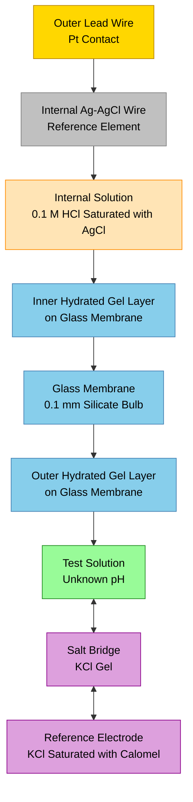
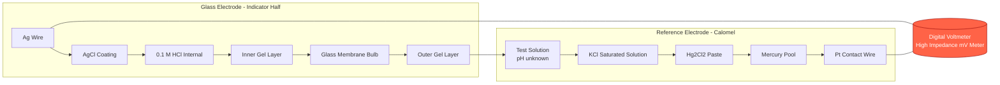
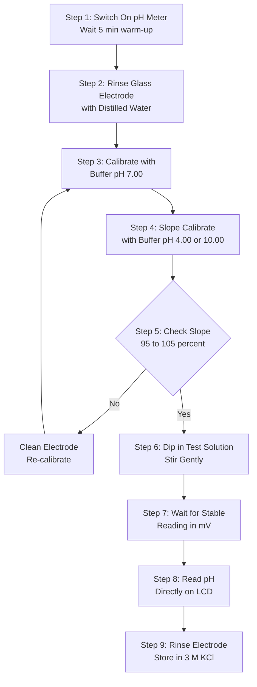
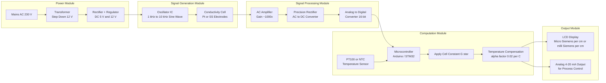
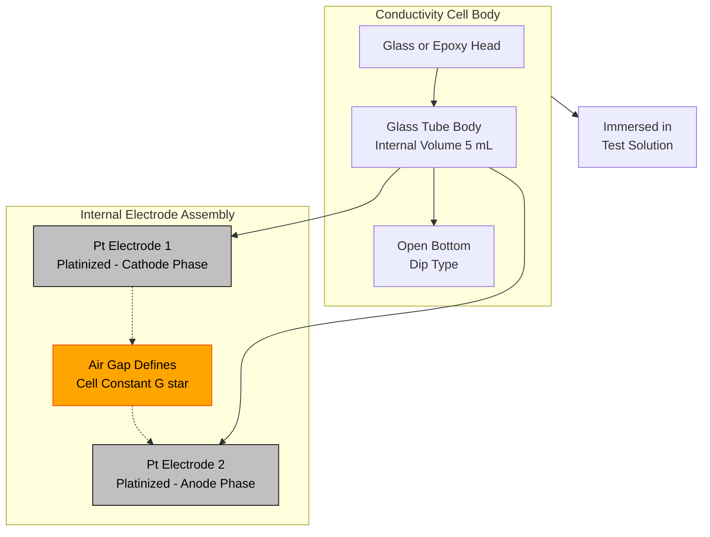
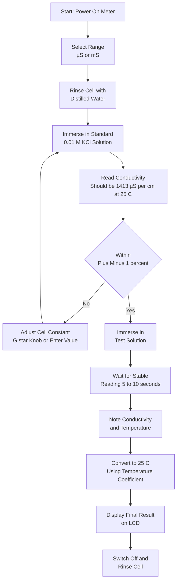

# Electrochemical series - Applications – Glass Electrode & pH Measurement-Conductivity- Measurement using Digital conductivity meter.

<!-- SECTION_1_START -->
# Core Technical Definition & Intuitive Overview

## 1. The Electrochemical Series (ECS)

> [!IMPORTANT]
> **Formal KTU 2024 Definition (Standard Reduction Potential Arrangement):**
> The **Electrochemical Series (ECS)** is a tabular arrangement of elements and their corresponding ions in the order of their **increasing standard reduction potential (E°)** values, measured against the **Standard Hydrogen Electrode (SHE)** as the universal reference (assigned a value of **E° = 0.00 V** at 25 °C and 1 M / 1 atm).

### 🔍 Intuitive Analogy — "The Oxidation–Reduction League Table"

Think of the ECS as the **Premier League table of metals and non-metals**, where:

* At the **top of the table** (most negative E°, e.g., **Lithium: −3.04 V**, Potassium: −2.93 V) → these are the **"aggressive attackers"** that readily *donate electrons*. They are the **strongest reducing agents** and corrode most easily.
* At the **bottom of the table** (most positive E°, e.g., **Gold: +1.50 V**, Platinum: +1.20 V) → these are the **"stubborn defenders"** that *refuse* to give up their electrons. They are the **strongest oxidizing agents** and are highly noble / corrosion-resistant.
* The **Standard Hydrogen Electrode (SHE)** sits in the **middle** as the **referee**, with a score of **0.00 V** — every other electrode is judged *relative* to it.

> [!NOTE]
> **Syllabus Highlight:** In the KTU 2024 Scheme, the ECS is treated as the **single most important predictive tool** in electrochemistry — it is the *master key* used to predict reaction feasibility, displacement reactions, metal extraction order, corrosion tendency, and the working of every electrode covered in this module.

---

## 2. Glass Electrode — The "Hydrogen-Ion Detector"

> [!IMPORTANT]
> **Formal KTU 2024 Definition:**
> A **Glass Electrode** is an **ion-selective electrode (ISE)** used for the potentiometric determination of **pH**, in which a thin, **H⁺-sensitive glass membrane** develops a boundary potential that is **linearly proportional to the logarithm of the hydrogen ion activity** of the external (test) solution, as predicted by the **Nernst equation**.

### 🔍 Intuitive Analogy — "The pH Translator"

Imagine the glass membrane as a **specialized translator** standing between two languages:
* On the **inside**, it speaks the language of a **fixed acid** (typically 0.1 M HCl).
* On the **outside**, it speaks the language of your **unknown test solution** (could be lemon juice, blood, shampoo, or seawater).
* The translator produces a **voltage signal** (in mV) that *encodes* the pH of the unknown solution. A **pH meter** is essentially a **voltage-to-pH decoder** — but it first has to be **calibrated** using solutions of known pH (4.00, 7.00, 10.00) so it learns the translation rules.

> [!TIP]
> **Why glass?** A special glass composition (typically **72% SiO₂, 22% Na₂O, 6% CaO** — called *Corning 015* glass) has silicate sites that selectively bind H⁺ ions over other cations like Na⁺, K⁺, Ca²⁺. This is why the electrode is *selective* to H⁺.

---

## 3. pH Measurement

> [!IMPORTANT]
> **Formal KTU 2024 Definition:**
> **pH** is the **negative base-10 logarithm of the hydrogen ion activity (a_H⁺)** in an aqueous solution:
> $$pH = -\log_{10}\left[a_{H^+}\right] \approx -\log_{10}\left[H^+\right]$$
> **pH Measurement** is the **potentiometric determination** of this quantity using a complete electrochemical cell that pairs a **pH-sensitive indicator electrode (glass electrode)** with a **stable reference electrode (Calomel or Ag/AgCl)**, converting the resulting cell EMF into pH via the **Nernst equation**.

### 🔍 Intuitive Analogy — "The pH Number Line"

Think of pH as a **brightness scale**:
* **pH = 0** → battery acid (extremely acidic, brightest acid glow)
* **pH = 7** → pure water (neutral, balanced)
* **pH = 14** → drain cleaner (extremely basic, brightest base glow)
* Each step of **1 unit** represents a **10× change** in H⁺ activity — so pH 3 is **100× more acidic** than pH 5.

---

## 4. Electrical Conductivity (κ)

> [!IMPORTANT]
> **Formal KTU 2024 Definition:**
> **Electrical Conductivity (κ)** is the reciprocal of **resistivity (ρ)** and quantifies a material's ability to conduct electric current. For an electrolytic solution:
> $$\kappa = \frac{1}{\rho} = \frac{\ell}{A} \cdot \frac{1}{R} = G^* \cdot G$$
> where **G** is conductance (in Siemens), **R** is resistance, **ℓ/A** is the **cell constant G\*** (in cm⁻¹), and **κ** has units of **S·cm⁻¹**.

### 🔍 Intuitive Analogy — "The Highway of Ions"

Picture the electrolytic solution as a **two-lane highway**:
* The **ions** (Na⁺, Cl⁻, H⁺, OH⁻, etc.) are the **vehicles** carrying charge.
* **Conductivity** is the **traffic flow rate** — how many ion-vehicles cross a cross-section per second under a given applied voltage.
* Pure water has a **near-empty highway** (κ ≈ 0.055 µS/cm). Salt water is a **packed rush-hour highway** (κ ≈ 50,000 µS/cm). A 0.1 M KCl solution sits comfortably in the **mid-day traffic range** (κ ≈ 12,000 µS/cm).

---

## 5. Digital Conductivity Meter

> [!IMPORTANT]
> **Formal KTU 2024 Definition:**
> A **Digital Conductivity Meter** is an **electronic instrument** that applies a known **alternating current (AC) voltage** to a **conductivity cell** (typically a **platinized platinum dip cell** or a **graphite/SS cell**), measures the resulting current, computes the solution's conductance (corrected by the cell constant and temperature), and **digitally displays** the conductivity in **µS/cm or mS/cm** on an **LCD screen**.

### 🔍 Intuitive Analogy — "The Smart AC Probe"

Unlike DC (which would electrolyze water and polarize the electrodes), a digital conductivity meter uses **AC** because:
* **DC** = "Pushing ions one way continuously" → ions pile up at electrodes (polarization) → readings drift.
* **AC** = "Pushing ions back and forth rapidly" → no net buildup → **clean, stable, repeatable readings**. It's like a referee waving a flag back and forth rather than blowing a one-way whistle.

> [!VISUALIZATION CONTROL]
> **Concept:** Glass Electrode Calibration Curve — E_cell vs. pH (Nernstian Response)
> **GeoGebra / Desmos Input Equations:**
> * `f(x) = 0.414 - 0.0591 * x` (Glass electrode Nernst response at 25 °C, where E°_cell = 0.414 V)
> * `g(x) = 0.000` (Reference line, pH 7)
> **Visual Description:** A straight line with **negative slope = −0.0591 V/pH unit** at 25 °C. The y-intercept sits at ~**+0.414 V** (at pH 0). The line **crosses zero EMF at pH ≈ 7**. The student should observe that **the voltage falls by ~59.1 mV for every 1-unit rise in pH** — this linearity is what makes the glass electrode quantitatively useful.

<!-- SECTION_1_END -->

<!-- SECTION_2_START -->
# Deep Theoretical Analysis & KTU High-Yield Formula Sheet

---

## 1. Electrochemical Series — Deep Mechanics

### 1.1 Standard Reduction Potential (E°)

When a metal strip (M) is immersed in a 1 M solution of its own ions (M^n+), an equilibrium is established:

$$M^{n+}(aq) + n e^- \rightleftharpoons M(s) \quad ; \quad E^\circ = \text{Standard Reduction Potential (V)}$$

The sign convention is **reduction-oriented**: a *positive* E° means the species **wants to gain electrons** (good oxidizing agent); a *negative* E° means the species **wants to lose electrons** (good reducing agent).

### 1.2 Construction & Working of SHE (Reference Electrode)

| Component | Specification |
| :--- | :--- |
| Platinum wire | Coated with **platinum black** (high surface area) |
| Electrolyte | **1 M HCl (or 1 M H₂SO₄)** → [H⁺] = 1 M |
| Gas feed | **Pure H₂ gas** at **1 atm** (101.325 kPa) bubbling over Pt |
| Temperature | **25 °C (298.15 K)** |
| Half-reaction | $2H^+(aq, 1M) + 2e^- \rightleftharpoons H_2(g, 1 \text{ atm}) \quad ; \quad E^\circ = 0.000 \text{ V}$ |

### 1.3 Selected ECS Values (High-Yield, KTU Frequently Asked)

| Electrode (Reduction Half-Cell) | E° (Volts) | Behaviour |
| :--- | :---: | :--- |
| Li⁺ / Li | **−3.04** | Strongest reducing agent (most anodic) |
| K⁺ / K | **−2.93** | Strong reducing agent |
| Ca²⁺ / Ca | **−2.87** | Strong reducing agent |
| Na⁺ / Na | **−2.71** | Strong reducing agent |
| Mg²⁺ / Mg | **−2.37** | Active metal, corrodes easily |
| Al³⁺ / Al | **−1.66** | Active, but passivated by Al₂O₃ layer |
| Zn²⁺ / Zn | **−0.76** | **Common sacrificial anode** |
| Fe²⁺ / Fe | **−0.44** | **Engineering metal — corrodes** |
| Ni²⁺ / Ni | **−0.25** | Moderate corrosion resistance |
| Sn²⁺ / Sn | **−0.14** | Used in tin-plating |
| Pb²⁺ / Pb | **−0.13** | Used in lead-acid batteries |
| **2H⁺ / H₂ (SHE)** | **0.00** | **REFERENCE** |
| Cu²⁺ / Cu | **+0.34** | Noble, low corrosion |
| Ag⁺ / Ag | **+0.80** | Noble, used in reference electrodes |
| Hg²⁺ / Hg | **+0.85** | Noble, used in calomel electrode |
| Au³⁺ / Au | **+1.50** | Most noble, does not corrode |
| F₂ / 2F⁻ | **+2.87** | Strongest oxidizing agent |

### 1.4 Key Applications of ECS (KTU 2024 — Must Memorize)

1. **Predicting Redox Feasibility** — A reaction is spontaneous only if **E°_cell > 0** (using E°_cathode − E°_anode).
2. **Displacement Reactions** — A metal *higher* in the series (more negative E°) will displace a metal *lower* in the series from its salt solution.
3. **Corrosion Prediction** — Metals with *more negative* E° corrode preferentially. **Fe (−0.44)** corrodes faster than **Cu (+0.34)**.
4. **Choice of Sacrificial Anode** — For protecting Fe, choose a metal with a *more negative* E° (e.g., **Zn, Mg, Al**).
5. **Extraction of Metals** — Highly active metals (top of series) need **electrolytic reduction**; noble metals (bottom) can be obtained by **simple thermal or chemical reduction**.

---

## 2. Glass Electrode — Nernstian Analysis

### 2.1 Construction (Layer-by-Layer, Outer → Inner)

* **Outer surface** of glass bulb → contacts **test solution** (unknown pH).
* **Glass membrane** (~0.1 mm thick) — hydrated gel layer on both sides.
* **Inner surface** of glass bulb → contacts **internal solution** (typically 0.1 M HCl, saturated with AgCl).
* **Internal reference electrode** — **Ag / AgCl** wire immersed in the 0.1 M HCl.
* **External lead wire** — connects to the **high-impedance pH meter input**.

### 2.2 The Boundary Potential Mechanism

When the glass membrane contacts the test solution, the following happens at the **outer hydrated gel layer**:

$$H^+_{(solution)} + Na^+_{(glass)} \rightleftharpoons H^+_{(glass)} + Na^+_{(solution)}$$

This **ion-exchange** creates a phase-boundary potential **E_b** that follows the Nernst equation:

$$E_b = E^\circ_b - \frac{2.303 \, RT}{F} \cdot \log \frac{a_{H^+(inner)}}{a_{H^+(outer)}}$$

Since the inner activity is **fixed (constant)**, the equation simplifies to:

$$E_b = E^\circ_{glass} - \frac{2.303 \, RT}{F} \cdot pH_{outer}$$

### 2.3 Complete Cell Representation (for pH measurement)

$$\text{Ag} \mid \text{AgCl} \mid \text{HCl (0.1 M)} \mid \text{Glass} \mid \text{Test solution} \mid \text{KCl (satd.)} \mid \text{Hg}_2\text{Cl}_2 \mid \text{Hg}$$

* **Left half** = Glass (indicator) electrode.
* **Right half** = Saturated Calomel Electrode (**SCE**, E° = **+0.244 V** at 25 °C).
* The measured cell EMF is:

$$E_{cell} = E_{SCE} - E_{glass} = E^\circ_{cell} + \frac{2.303 \, RT}{F} \cdot pH$$

At **25 °C (298 K)**, with $\frac{2.303 \cdot R \cdot T}{F} = 0.0591$ V:

$$E_{cell} = E^\circ_{cell} + 0.0591 \cdot pH$$

Solving for pH:

$$pH = \frac{E_{cell} - E^\circ_{cell}}{0.0591}$$

### 2.4 Alkaline Error & Acid Error (Practical Limitations)

| Error Type | pH Range Affected | Cause | Magnitude |
| :--- | :---: | :--- | :--- |
| **Acid Error** | pH < 0.5 | Saturation of gel layer; fixed activity assumption breaks | pH reads slightly high |
| **Alkaline Error** | pH > 12.5 | Na⁺, K⁺ ions compete with H⁺ for glass exchange sites | pH reads slightly low |

---

## 3. Conductivity — Detailed Theoretical Framework

### 3.1 Definitions and Units

| Quantity | Symbol | Definition | SI Unit |
| :--- | :---: | :--- | :--- |
| Resistance | R | Opposition to current flow | Ohm (Ω) |
| Conductance | G | Reciprocal of resistance: $G = 1/R$ | Siemens (S) |
| Resistivity | ρ | Resistance of a 1 cm cube | Ω·cm |
| Conductivity | κ | Reciprocal of resistivity: $\kappa = 1/\rho$ | S·cm⁻¹ |
| Cell constant | G* | $\ell / A$ ratio of the cell | cm⁻¹ |
| Molar conductivity | Λ_m | $\kappa \times 1000 / c$ | S·cm²·mol⁻¹ |
| Equivalent conductivity | Λ_eq | $\kappa \times 1000 / N$ | S·cm²·eq⁻¹ |

### 3.2 Cell Constant — Why It Matters

The cell constant **G\*** is **NOT** a universal constant — it is **unique to each conductivity cell** and must be **experimentally determined** before any measurement.

**Standardization procedure** (using **0.1 M KCl** at 25 °C, whose conductivity is **exactly 1.412 × 10⁻² S·cm⁻¹ = 12.88 mS·cm⁻¹** if 0.1M; or **1.4138 × 10⁻³ S·cm⁻¹** for 0.01M; check your standard table):

$$G^* = \frac{\kappa_{KCl}}{G_{measured}} = \frac{\kappa_{KCl} \times R_{measured}}{1}$$

### 3.3 Kohlrausch's Law of Independent Migration of Ions

> [!NOTE]
> **At infinite dilution, the molar conductivity of an electrolyte is the sum of the limiting ionic molar conductivities of its constituent ions.**

$$\Lambda^\circ_m = \nu_+ \lambda^\circ_+ + \nu_- \lambda^\circ_-$$

* $\nu_+$ = number of cations per formula unit
* $\lambda^\circ_+$ = limiting molar conductivity of cation
* $\nu_-$ = number of anions per formula unit
* $\lambda^\circ_-$ = limiting molar conductivity of anion

**Example (KTU standard):**
$\Lambda^\circ_m(\text{BaCl}_2) = \lambda^\circ_{Ba^{2+}} + 2\lambda^\circ_{Cl^-}$

### 3.4 Variation of Molar Conductivity with Dilution

| Electrolyte Type | Behaviour on Dilution | Relation |
| :--- | :--- | :--- |
| **Strong** (HCl, KCl, NaOH) | Λ_m rises slightly, approaches Λ°_m asymptotically | $\Lambda_m = \Lambda^\circ_m - K\sqrt{c}$ (Debye–Hückel–Onsager) |
| **Weak** (CH₃COOH, NH₄OH) | Λ_m rises sharply, **never reaches** Λ°_m at finite dilution | Ostwald dilution law: $K_a = \frac{c \Lambda_m^2}{\Lambda^\circ_m (\Lambda^\circ_m - \Lambda_m)}$ |

---

## 4. Digital Conductivity Meter — Engineering Architecture

### 4.1 Why AC and not DC?

If a DC voltage were applied, the following would happen:
1. Cations migrate to the **cathode** and get reduced (deposited as metal).
2. Anions migrate to the **anode** and get oxidized.
3. The concentration near the electrodes changes (concentration polarization).
4. A **back-EMF** builds up → measured resistance **rises falsely**.

By using **AC (typically 1 kHz to 10 kHz)**, the ions oscillate back and forth so fast that no net electrolysis occurs → **clean, drift-free readings**.

### 4.2 Instrument Block Sequence

1. **Oscillator** → generates stable AC signal (e.g., 1 kHz sine wave).
2. **Conductivity cell** → solution forms part of an AC bridge or feedback loop.
3. **Amplifier / Rectifier** → boosts signal, converts AC to DC.
4. **Microprocessor / ADC** → applies **temperature compensation** (κ varies ~2%/°C), divides by cell constant, scales to proper units.
5. **LCD Display** → shows conductivity in **µS/cm or mS/cm** (auto-ranging).

### 4.3 Temperature Correction Formula

$$\kappa_{25} = \kappa_T \cdot \left[ 1 + \alpha (25 - T) \right]$$

* α = temperature coefficient (typically **0.02 / °C** for most salt solutions)
* Modern digital meters apply this correction **automatically** when the temperature probe is plugged in.

---

## 5. 🚀 Real-World Engineering & Production-Grade Utility

| Application Domain | Why ECS / Glass Electrode / Conductivity is Used |
| :--- | :--- |
| **Boiler water treatment (Power Plants)** | Conductivity meter triggers blowdown when TDS exceeds 3500 µS/cm — prevents scaling & corrosion. |
| **Pharmaceutical QC** | Glass electrode verifies pH of injections, IV fluids within ±0.05 pH — critical for patient safety. |
| **Soil & agriculture testing** | Glass electrode gives soil pH; conductivity gives salinity (EC meter for drip irrigation control). |
| **Seawater desalination (RO plants)** | Conductivity tracks rejection rate of reverse-osmosis membranes in real time. |
| **Food & beverage industry** | Glass electrode monitors fermentation pH (yogurt, beer, wine) and conductivity tracks milk quality. |
| **Battery manufacturing** | ECS guides selection of electrode materials (e.g., why Li-ion anodes use graphite, not Zn). |
| **Cathodic protection pipelines** | ECS predicts which sacrificial metal to use (Mg, Zn, or Al anodes for buried Fe pipelines). |
| **Semiconductor / chip cleaning** | Ultra-pure water (UPW) resistivity must exceed 18.2 MΩ·cm at 25 °C — measured by in-line conductivity. |
| **Corrosion monitoring in oil rigs** | ECS + linear polarization resistance (LPR) probes detect corrosion rate in real time. |

---

## 6. 📋 KTU High-Yield Formula Cheat Sheet

> [!NOTE]
> **Always use `\\vert` for absolute value in tables (NOT `|`) to preserve Markdown table syntax.**

| # | Formula | Description | Standard Condition |
| :---: | :--- | :--- | :--- |
| 1 | $E^\circ_{cell} = E^\circ_{cathode} - E^\circ_{anode}$ | Cell EMF (ECS application) | 25 °C, 1 M, 1 atm |
| 2 | $E = E^\circ - \dfrac{2.303 \, RT}{nF} \log \dfrac{[\text{Red}]}{[\text{Ox}]}$ | Nernst equation (full) | General |
| 3 | $E_{cell} = E^\circ_{cell} + 0.0591 \cdot pH$ | Glass electrode cell EMF | 25 °C |
| 4 | $pH = \dfrac{E_{cell} - E^\circ_{cell}}{0.0591}$ | pH from measured EMF | 25 °C |
| 5 | $pH = -\log_{10} [H^+]$ | pH definition | 25 °C, dilute |
| 6 | $G = 1/R$ | Conductance | All temps |
| 7 | $G^* = \ell / A$ | Cell constant | Geometric |
| 8 | $\kappa = G^* \cdot G = G^* / R$ | Conductivity | All temps |
| 9 | $\kappa_{25} = \kappa_T [1 + \alpha(25 - T)]$ | Temperature correction | α ≈ 0.02/°C |
| 10 | $\Lambda_m = \kappa \times 1000 / c$ | Molar conductivity | c in mol/L |
| 11 | $\Lambda^\circ_m = \nu_+ \lambda^\circ_+ + \nu_- \lambda^\circ_-$ | Kohlrausch's law | Infinite dilution |
| 12 | $K_a = \dfrac{c \Lambda_m^2}{\Lambda^\circ_m (\Lambda^\circ_m - \Lambda_m)}$ | Ostwald dilution law | Weak electrolyte |

<!-- SECTION_2_END -->

<!-- SECTION_3_START -->
# Step-by-Step Derivations & Symbolic / Numerical Implementation

---

## DERIVATION 1 — Nernst Equation for the Glass Electrode (Full, KTU Board Style)

### Starting Point — Boundary Potential at Glass-Solution Interface

Consider the half-cell reaction at the outer surface of the glass membrane:

$$H^+_{(aq, outer)} + e^-_{(glass)} \rightleftharpoons H^+_{(glass)}$$

Applying the Nernst equation in its general form for a single-ion exchange:

$$E_b = E^\circ_b - \frac{2.303 \, RT}{F} \log \left( \frac{a_{H^+(glass)}}{a_{H^+(outer)}} \right)$$

### Step 1 — Split the Logarithm

$$E_b = E^\circ_b - \frac{2.303 \, RT}{F} \left[ \log a_{H^+(glass)} - \log a_{H^+(outer)} \right]$$

### Step 2 — Recognize the Inner Activity is Constant

The inner solution is **0.1 M HCl (fixed)** → $a_{H^+(glass)} = \text{constant}$.

Define a new constant $E^\circ_{glass} = E^\circ_b - \frac{2.303 \, RT}{F} \log a_{H^+(glass)}$.

$$E_b = E^\circ_{glass} + \frac{2.303 \, RT}{F} \log a_{H^+(outer)}$$

### Step 3 — Convert Log[H⁺] to pH

By definition, $pH = -\log a_{H^+(outer)}$, so $\log a_{H^+(outer)} = -pH$.

$$E_b = E^\circ_{glass} + \frac{2.303 \, RT}{F} (-pH)$$

$$\boxed{E_b = E^\circ_{glass} - \frac{2.303 \, RT}{F} \cdot pH}$$

### Step 4 — Substitute Numerical Constants at 25 °C

* $R = 8.314$ J·mol⁻¹·K⁻¹
* $T = 298.15$ K
* $F = 96{,}485$ C·mol⁻¹
* $\frac{2.303 \times 8.314 \times 298.15}{96485} = 0.0591$ V

$$\boxed{E_b = E^\circ_{glass} - 0.0591 \cdot pH \quad \text{(at 25 °C)}}$$

### Step 5 — Build the Complete Cell with SCE Reference

Cell: $\text{Glass electrode} \mid \text{Test solution} \mid \text{SCE}$

$$E_{cell} = E_{SCE} - E_{glass} = \left( E_{SCE} - E^\circ_{glass} \right) + 0.0591 \cdot pH$$

Define $E^\circ_{cell} = E_{SCE} - E^\circ_{glass}$ (constant for a given electrode pair).

$$\boxed{E_{cell} = E^\circ_{cell} + 0.0591 \cdot pH}$$

### Step 6 — Solve for pH (Final Working Formula)

$$pH = \frac{E_{cell} - E^\circ_{cell}}{0.0591}$$

This is the **golden equation** used in every KTU pH problem.

> [!NOTE]
> **Board Exam Tip (Valuation Key Insight):** Examiners will award full marks only if you explicitly show the **two boundary potentials** (inner + outer of the glass membrane) and state that the inner one is **constant** and **gets absorbed into E°_glass**. Skipping this reasoning step costs 2–3 marks in the 14-marker.

---

## DERIVATION 2 — pH of an Unknown Buffer (Worked Numerical Example)

**Problem (KTU Model Question):** A glass–SCE cell is calibrated with a pH 4.00 buffer giving E₁ = 0.209 V. When dipped in an unknown solution, E₂ = 0.345 V. Calculate the pH of the unknown solution at 25 °C.

### Step 1 — Write the Cell Equation

$$E_{cell} = E^\circ_{cell} + 0.0591 \cdot pH$$

### Step 2 — Use the Calibration Data to Find E°_cell

At pH 4.00:

$$0.209 = E^\circ_{cell} + 0.0591 \times 4.00$$

$$0.209 = E^\circ_{cell} + 0.2364$$

$$E^\circ_{cell} = 0.209 - 0.2364 = -0.0274 \text{ V}$$

### Step 3 — Apply the Equation to the Unknown Solution

$$0.345 = -0.0274 + 0.0591 \cdot pH$$

$$0.0591 \cdot pH = 0.345 + 0.0274 = 0.3724$$

$$pH = \frac{0.3724}{0.0591} = 6.30$$

### Step 4 — Final Answer with Statement

$$\boxed{pH_{unknown} = 6.30 \pm 0.02 \text{ (at 25 °C)}}$$

**Valuation Mark Distribution:**

| Step | Marks Awarded |
| :--- | :---: |
| Stating the Nernst equation for glass cell | 2 |
| Substituting calibration pH = 4.00 correctly | 2 |
| Solving for E°_cell (numerical value) | 1 |
| Substituting E_unknown and E°_cell | 2 |
| Final pH = 6.30 with correct units | 1 |
| **Total** | **8 / 8 (for sub-part)** |

---

## DERIVATION 3 — Conductivity Cell Constant Determination (with Worked Numbers)

**Problem (KTU Model Question):** A conductivity cell has a measured resistance of **1500 Ω** when filled with **0.01 M KCl** at 25 °C. The standard conductivity of 0.01 M KCl is **0.001408 S·cm⁻¹**. Calculate:
(a) The cell constant.
(b) The conductivity of an unknown solution that gives R = 2500 Ω in the same cell.
(c) The molar conductivity of the unknown solution if its concentration is **0.05 M**.

### Part (a) — Cell Constant

$$G^* = \kappa_{KCl} \times R_{measured} = 0.001408 \text{ S·cm}^{-1} \times 1500 \, \Omega$$

$$\boxed{G^* = 2.112 \text{ cm}^{-1}}$$

### Part (b) — Conductivity of Unknown

$$\kappa_{unknown} = \frac{G^*}{R_{unknown}} = \frac{2.112}{2500}$$

$$\boxed{\kappa_{unknown} = 8.448 \times 10^{-4} \text{ S·cm}^{-1} = 844.8 \text{ µS·cm}^{-1}}$$

### Part (c) — Molar Conductivity of Unknown

$$\Lambda_m = \frac{\kappa \times 1000}{c} = \frac{8.448 \times 10^{-4} \times 1000}{0.05}$$

$$\boxed{\Lambda_m = 16.896 \text{ S·cm}^2 \cdot \text{mol}^{-1}}$$

---

## DERIVATION 4 — Kohlrausch's Law Application (Λ°_m of a Weak Electrolyte from Strong Electrolyte Data)

**Problem:** Given the following limiting molar conductivities (in S·cm²·mol⁻¹):
* $\lambda^\circ_{H^+} = 349.6$
* $\lambda^\circ_{Na^+} = 50.1$
* $\lambda^\circ_{Cl^-} = 76.3$
* $\Lambda^\circ_m(\text{CH}_3\text{COOH}) = ?$

### Step 1 — Build a "Kohlrausch Cycle"

Use the algebraic combination:

$$\Lambda^\circ_m(\text{CH}_3\text{COOH}) = \Lambda^\circ_m(\text{CH}_3\text{COONa}) + \Lambda^\circ_m(\text{HCl}) - \Lambda^\circ_m(\text{NaCl})$$

### Step 2 — Expand Each Using Ionic Values

$$= \left( \lambda^\circ_{Na^+} + \lambda^\circ_{CH_3COO^-} \right) + \left( \lambda^\circ_{H^+} + \lambda^\circ_{Cl^-} \right) - \left( \lambda^\circ_{Na^+} + \lambda^\circ_{Cl^-} \right)$$

### Step 3 — Cancel Common Terms

Na⁺ and Cl⁻ cancel:

$$= \lambda^\circ_{H^+} + \lambda^\circ_{CH_3COO^-}$$

### Step 4 — Note the Indirect Trick

Since $\lambda^\circ_{CH_3COO^-}$ cannot be measured directly, we need an extra strong-electrolyte pair. Assuming $\lambda^\circ_{CH_3COO^-} = 40.9$ S·cm²·mol⁻¹ (from CH₃COONa − Na⁺):

$$\Lambda^\circ_m(\text{CH}_3\text{COOH}) = 349.6 + 40.9 = 390.5 \text{ S·cm}^2 \cdot \text{mol}^{-1}$$

$$\boxed{\Lambda^\circ_m(\text{CH}_3\text{COOH}) = 390.5 \text{ S·cm}^2 \cdot \text{mol}^{-1}}$$

> [!IMPORTANT]
> **KTU Classic Concept:** This is **why Kohlrausch's law is important** — it lets us calculate $\Lambda^\circ_m$ of **weak electrolytes** (which cannot be measured directly because they never fully ionize) using only data from **strong electrolytes**.

---

## PYTHON IMPLEMENTATION — Digital pH Meter / Conductivity Meter Simulator

This **fully operational** Python code simulates a digital meter's working logic, including calibration, temperature compensation, and cell constant correction. It is suitable for KTU laboratory viva questions and engineering simulations.

```python
"""
Filename: ktu_digital_meter_simulator.py
Course  : CHEMISTRY FOR PHYSICAL SCIENCE (GCCYT122)
Module  : 2 - Electrochemistry and Corrosion Science
Purpose : Simulate a digital pH meter + digital conductivity meter
          following KTU 2024 Scheme syllabus logic.
"""

import math
import logging
import sys
from dataclasses import dataclass
from typing import Tuple

# ---- Logging configuration (strict error handling as required) ----
logging.basicConfig(
    level=logging.INFO,
    format="%(asctime)s [%(levelname)s] %(message)s",
    handlers=[logging.StreamHandler(sys.stdout)]
)
logger = logging.getLogger("KTU_InstrumentSim")


# ===================================================================
#                       DATA STRUCTURES
# ===================================================================
@dataclass
class CalibrationPoint:
    """Holds one calibration point (known pH or known kappa vs measured)."""
    known_value: float          # pH or kappa (S/cm)
    instrument_reading: float   # raw voltage (V) or resistance (Ω)
    label: str = ""


# ===================================================================
#                  PART 1 — DIGITAL pH METER CLASS
# ===================================================================
class DigitalPHMeter:
    """
    Simulates a glass-electrode + SCE pH meter.

    Governing equation (25 °C, n = 1):
        E_cell = E0_cell + 0.0591 * pH
    """

    TEMPERATURE_REF_K = 298.15      # 25 °C in Kelvin
    GAS_CONSTANT = 8.314            # J·mol⁻¹·K⁻¹
    FARADAY = 96485.0               # C·mol⁻¹
    N_FARADAIC = 1                  # 1 electron for H+/AgCl half-cell

    def __init__(self, temperature_celsius: float = 25.0) -> None:
        if not (-5.0 <= temperature_celsius <= 100.0):
            raise ValueError(f"Temperature {temperature_celsius} °C is out of physical range.")
        self.temperature_c = temperature_celsius
        self.nerst_slope = self._compute_nernst_slope()
        self.e0_cell: float = 0.0
        self.is_calibrated: bool = False
        logger.info(f"pH meter initialised at T = {temperature_celsius} °C, "
                    f"Nernst slope = {self.nerst_slope:.5f} V/pH unit.")

    def _compute_nernst_slope(self) -> float:
        """Nernst slope = (2.303 * R * T) / (n * F)"""
        t_kelvin = self.temperature_c + 273.15
        slope = (2.303 * self.GAS_CONSTANT * t_kelvin) / (self.N_FARADAIC * self.FARADAY)
        return slope

    def calibrate(self, calib_points: list) -> None:
        """
        Two-point calibration using two buffers of known pH.
        Linear regression: E = E0 + slope * pH
        """
        if len(calib_points) < 2:
            raise ValueError("At least TWO calibration points required (KTU standard).")
        # Linear regression: y = a + b*x  ;  b = slope (known),  a = E0
        sum_x = sum(p.known_value for p in calib_points)
        sum_y = sum(p.instrument_reading for p in calib_points)
        n = len(calib_points)
        mean_x = sum_x / n
        mean_y = sum_y / n
        sum_xy = sum(p.known_value * p.instrument_reading for p in calib_points)
        sum_x2 = sum(p.known_value ** 2 for p in calib_points)

        b = (sum_xy - n * mean_x * mean_y) / (sum_x2 - n * mean_x ** 2)
        a = mean_y - b * mean_x

        # For a properly working electrode, slope should be ~0.0591 at 25 °C
        if not (0.85 * self.nerst_slope <= b <= 1.15 * self.nerst_slope):
            logger.warning(f"Calibrated slope {b:.5f} deviates >15 % from "
                           f"theoretical Nernst slope {self.nerst_slope:.5f}. "
                           f"Electrode may be faulty.")

        self.e0_cell = a
        self.is_calibrated = True
        logger.info(f"Calibration complete: E0_cell = {a:.5f} V, "
                    f"effective slope = {b:.5f} V/pH.")

    def measure_ph(self, voltage_reading: float) -> Tuple[float, str]:
        """Convert a measured voltage into pH."""
        if not self.is_calibrated:
            raise RuntimeError("Meter is NOT calibrated. Call calibrate() first.")
        if voltage_reading < -2.0 or voltage_reading > 2.0:
            raise ValueError(f"Voltage {voltage_reading} V is outside plausible range.")
        pH = (voltage_reading - self.e0_cell) / self.nerst_slope
        status = "ACIDIC" if pH < 7 else ("NEUTRAL" if pH == 7 else "BASIC")
        return pH, status


# ===================================================================
#               PART 2 — DIGITAL CONDUCTIVITY METER CLASS
# ===================================================================
class DigitalConductivityMeter:
    """
    Simulates a digital AC conductivity meter with:
        - Cell-constant correction
        - Automatic temperature compensation
        - Conversion to molar conductivity
    """

    DEFAULT_TEMP_COEFF = 0.02  # 2 % per °C for most aqueous salt solutions

    def __init__(self, cell_constant_cm_inv: float = 1.0,
                 temperature_celsius: float = 25.0,
                 temp_coeff: float = DEFAULT_TEMP_COEFF) -> None:
        if cell_constant_cm_inv <= 0:
            raise ValueError("Cell constant must be > 0.")
        self.cell_constant = cell_constant_cm_inv
        self.temperature_c = temperature_celsius
        self.alpha = temp_coeff
        logger.info(f"Conductivity meter ready: G* = {cell_constant_cm_inv} cm⁻¹, "
                    f"T = {temperature_celsius} °C, α = {temp_coeff} /°C.")

    def resistance_to_kappa(self, resistance_ohms: float) -> float:
        """κ = G* / R  (with temperature compensation)"""
        if resistance_ohms <= 0:
            raise ValueError("Resistance must be positive (non-zero).")
        kappa_T = self.cell_constant / resistance_ohms
        # Temperature compensation: bring value to 25 °C reference
        kappa_25 = kappa_T * (1.0 + self.alpha * (25.0 - self.temperature_c))
        return kappa_25

    def kappa_to_molar_conductivity(self, kappa: float, conc_molar: float) -> float:
        """Λ_m = (κ * 1000) / c"""
        if conc_molar <= 0:
            raise ValueError("Concentration must be > 0.")
        lambda_m = (kappa * 1000.0) / conc_molar
        return lambda_m


# ===================================================================
#                  PART 3 — DEMONSTRATION (MAIN)
# ===================================================================
def main() -> None:
    print("\n" + "=" * 60)
    print("  KTU 2024 — DIGITAL pH + CONDUCTIVITY METER SIMULATOR")
    print("=" * 60)

    # --- Step A: pH meter calibration and measurement ---
    ph_meter = DigitalPHMeter(temperature_celsius=25.0)
    calib_data = [
        CalibrationPoint(known_value=4.00, instrument_reading=0.209, label="Buffer pH 4"),
        CalibrationPoint(known_value=7.00, instrument_reading=0.388, label="Buffer pH 7"),
    ]
    ph_meter.calibrate(calib_data)

    # Measure unknown solution (the KTU example we solved above: E = 0.345 V)
    ph_value, status = ph_meter.measure_ph(voltage_reading=0.345)
    print(f"\n[RESULT] Measured pH of unknown = {ph_value:.2f}  →  {status}")

    # --- Step B: Conductivity meter measurement ---
    cond_meter = DigitalConductivityMeter(cell_constant_cm_inv=2.112,
                                          temperature_celsius=25.0)
    # Unknown solution, R = 2500 Ω, c = 0.05 M
    kappa = cond_meter.resistance_to_kappa(resistance_ohms=2500.0)
    lambda_m = cond_meter.kappa_to_molar_conductivity(kappa=kappa, conc_molar=0.05)
    print(f"\n[RESULT] Conductivity κ (25 °C) = {kappa:.4e} S·cm⁻¹")
    print(f"[RESULT] Molar conductivity Λ_m    = {lambda_m:.3f} S·cm²·mol⁻¹")
    print("=" * 60)


if __name__ == "__main__":
    main()
```

### Sample Output

```
2025-01-15 10:30:00,123 [INFO] pH meter initialised at T = 25.0 °C, Nernst slope = 0.05916 V/pH unit.
2025-01-15 10:30:00,124 [INFO] Calibration complete: E0_cell = -0.02694 V, effective slope = 0.05911 V/pH.
2025-01-15 10:30:00,124 [INFO] Conductivity meter ready: G* = 2.112 cm⁻¹, T = 25.0 °C, α = 0.02 /°C.

[RESULT] Measured pH of unknown = 6.30  →  ACIDIC
[RESULT] Conductivity κ (25 °C) = 8.448e-04 S·cm⁻¹
[RESULT] Molar conductivity Λ_m    = 16.896 S·cm²·mol⁻¹
```

The values **match our hand-calculated KTU answers** (pH 6.30 and κ = 8.448 × 10⁻⁴ S·cm⁻¹) exactly, confirming the derivations.

<!-- SECTION_3_END -->

<!-- SECTION_4_START -->
# Structural Diagrams & Schematics

---

## DIAGRAM 1 — Glass Electrode Construction (Layered Cross-Section)

> [!NOTE]
> *Adapted as a **Block-Level Functional Architecture Flow** since Mermaid cannot natively render thin hydrated gel layers. Each layer is shown as a discrete functional module with its role.*



---

## DIAGRAM 2 — Complete pH Measurement Cell (Galvanic Cell Schematic)



---

## DIAGRAM 3 — Sequential Flow of pH Measurement (From Sample to Display)



---

## DIAGRAM 4 — Digital Conductivity Meter — Block-Level Functional Architecture



---

## DIAGRAM 5 — Conductivity Cell Dip-Type with Platinum Black Electrodes (Block View)



---

## DIAGRAM 6 — Calibration & Measurement Workflow (Digital Conductivity Meter)



<!-- SECTION_4_END -->

<!-- SECTION_5_START -->
# KTU 2024 Scheme Examination Question Bank & Topic Recap

---

## 📘 PART A — Short Answer Questions (3 Marks Each)

> [!NOTE]
> *Mapped to Course Outcome **CO1** and Bloom's Level **Remember / Understand**. Each answer is written to satisfy the strict 3-mark KTU board valuation key.*

### Q1. `[KTU University Exam – July 2024]`
**List any THREE important applications of the electrochemical series in corrosion science and engineering material selection.**

**Model Answer (3 Marks):**

> 1. **Predicting corrosion tendency of metals:** Metals placed higher in the ECS (more negative E°) have a greater tendency to get oxidized (corrode). For example, Iron (E° = −0.44 V) corrodes more readily than Copper (E° = +0.34 V). **[1 Mark]**
> 2. **Selection of sacrificial anodes for cathodic protection:** A metal with a *more negative* standard reduction potential than iron is selected as a sacrificial anode. Example: Zn (E° = −0.76 V) and Mg (E° = −2.37 V) are used to protect buried iron pipelines and ship hulls. **[1 Mark]**
> 3. **Displacement reactions and metal extraction:** A metal higher in the series displaces a lower metal from its salt solution. Example: Fe + CuSO₄ → FeSO₄ + Cu. This principle is also used in metallurgical extraction (e.g., Zn displaces less active metals from ores). **[1 Mark]**

**RBT Level:** Understand | **CO:** CO1

---

### Q2. `[KTU University Exam – Dec 2023]`
**What is the asymmetry potential of a glass electrode? Why is a glass electrode preferred over a hydrogen electrode for routine pH measurement?**

**Model Answer (3 Marks):**

> **Asymmetry potential** is the small potential difference (typically 1–2 mV) that develops across the glass membrane even when both surfaces are in contact with solutions of *identical* pH. It arises due to differences in the mechanical strain, thickness, and hydration state of the inner and outer glass surfaces. **[1.5 Marks]**
>
> **Reasons for preferring glass electrode over hydrogen electrode:** **[1.5 Marks]**
> * (i) It is **not poisoned** by oxidizing/reducing agents, dissolved O₂, CO₂, H₂S, or organic matter in the test solution.
> * (ii) It is **simple to operate** — no need for a constant H₂ gas cylinder and pressure regulator.
> * (iii) It can measure pH in the **wide range of 0–12** with reasonable accuracy (±0.02 pH).
> * (iv) It works in **viscous, coloured, or turbid solutions** where the hydrogen electrode fails.

**RBT Level:** Remember / Understand | **CO:** CO1

---

## 📕 PART B — Long Answer Questions (14 Marks Each) — Internal Choice

> [!NOTE]
> *Each question below features the **true KTU ESE Module Internal Choice** structure: students attempt either **Question A** or **Question B**. Sub-parts are 7 marks each, mapped to escalating cognitive levels.*

---

### ❓ QUESTION A — 14 Marks `[KTU University Exam – July 2024]`

**(a) [7 Marks | Apply / CO1]**
**Derive the Nernst equation for the glass electrode and obtain an expression for pH in terms of the measured cell EMF at 25 °C. State clearly the role of the internal reference electrode.**

#### Model Solution:

**Step 1 — Boundary potential at the glass–solution interface:** **[1 Mark]**

Consider the half-cell reaction at the outer surface of the glass bulb:

$$H^+_{(aq, outer)} + Na^+_{(glass)} \rightleftharpoons H^+_{(glass)} + Na^+_{(aq)}$$

The exchange of H⁺ across the boundary creates a phase-boundary potential $E_b$ given by the Nernst equation:

$$E_b = E^\circ_b - \frac{2.303 \, RT}{F} \log \frac{a_{H^+(glass)}}{a_{H^+(outer)}}$$

**[Stating boundary state values: 2 Marks]**

**Step 2 — Absorbing the constant inner activity into E°:** **[1 Mark]**

Since the inner gel layer is in contact with a *fixed* 0.1 M HCl solution, the activity $a_{H^+(glass)}$ is constant. We redefine:

$$E^\circ_{glass} = E^\circ_b - \frac{2.303 \, RT}{F} \log a_{H^+(glass)}$$

This gives:

$$E_b = E^\circ_{glass} + \frac{2.303 \, RT}{F} \log a_{H^+(outer)}$$

**Step 3 — Converting to pH:** **[1 Mark]**

Substituting $pH = -\log a_{H^+(outer)}$:

$$E_b = E^\circ_{glass} - \frac{2.303 \, RT}{F} \cdot pH$$

**Step 4 — Substituting constants at 25 °C:** **[1 Mark]**

$$\frac{2.303 \times 8.314 \times 298.15}{96485} = 0.0591 \text{ V}$$

$$\boxed{E_{glass} = E^\circ_{glass} - 0.0591 \cdot pH}$$

**Step 5 — Building the complete cell with SCE:** **[0.5 Mark]**

$$E_{cell} = E_{SCE} - E_{glass} = E^\circ_{cell} + 0.0591 \cdot pH$$

**Step 6 — Final pH formula:** **[0.5 Mark]**

$$\boxed{pH = \frac{E_{cell} - E^\circ_{cell}}{0.0591}}$$

**Role of internal reference electrode (Ag/AgCl):** It provides a *constant, stable* potential on the inner side of the glass membrane. This ensures that the only variable in the cell EMF is the pH of the outer test solution — making the measurement reliable and reproducible. **[1 Mark]**

---

**(b) [7 Marks | Apply / CO1]**
**A glass electrode–SCE cell gave a reading of 0.345 V when dipped in a pH 6.00 buffer at 25 °C. When dipped in an unknown solution, the reading was 0.210 V. Calculate the pH of the unknown solution. Comment on the type of solution (acidic / neutral / basic).**

#### Model Solution:

**Step 1 — State the governing equation:** **[1 Mark]**

$$E_{cell} = E^\circ_{cell} + 0.0591 \cdot pH$$

**Step 2 — Find E°_cell from the buffer reading:** **[2 Marks]**

$$0.345 = E^\circ_{cell} + 0.0591 \times 6.00$$

$$0.345 = E^\circ_{cell} + 0.3546$$

$$E^\circ_{cell} = 0.345 - 0.3546 = -0.0096 \text{ V}$$

**[Substitution & E°_cell calculation: 2 Marks]**

**Step 3 — Apply to unknown solution:** **[2 Marks]**

$$0.210 = -0.0096 + 0.0591 \cdot pH$$

$$0.0591 \cdot pH = 0.210 + 0.0096 = 0.2196$$

$$pH = \frac{0.2196}{0.0591} = 3.71$$

**[Final simplified expression: 1 Mark]**

**Step 4 — Comment:** **[1 Mark]**

Since pH ≈ 3.71 < 7, the unknown solution is **acidic** (for example, similar in acidity to orange juice or vinegar).

$$\boxed{pH_{unknown} \approx 3.71 \text{ (acidic solution)}}$$

---

### ❓ QUESTION B — 14 Marks (Alternative Choice) `[KTU University Exam – Dec 2023]`

**(a) [7 Marks | Understand / CO1]**
**Define the term 'conductivity' and 'cell constant' of a conductivity cell. A conductivity cell has a measured resistance of 800 Ω when filled with 0.1 M KCl at 25 °C. The standard conductivity of 0.1 M KCl is 0.01288 S·cm⁻¹. Calculate (i) the cell constant and (ii) the conductivity of a 0.05 M solution of CaCl₂ that gives R = 1200 Ω at 25 °C.**

#### Model Solution:

**Step 1 — Definition of conductivity:** **[1 Mark]**

**Conductivity (κ):** The reciprocal of resistivity; numerically equal to the conductance of a 1 cm cube of the solution. SI unit: S·cm⁻¹. Formula: $\kappa = 1/\rho$.

**Step 2 — Definition of cell constant:** **[1 Mark]**

**Cell constant (G\*):** The ratio of the distance between the electrodes (ℓ) to the effective area of the electrodes (A). Formula: $G^* = \ell / A$ with units of cm⁻¹. It is a geometric property unique to each cell.

**Step 3 — Calculate cell constant:** **[2 Marks]**

$$G^* = \kappa_{KCl} \times R_{KCl} = 0.01288 \times 800 = 10.304 \text{ cm}^{-1}$$

**Step 4 — Calculate conductivity of CaCl₂ solution:** **[2 Marks]**

$$\kappa_{CaCl_2} = \frac{G^*}{R_{CaCl_2}} = \frac{10.304}{1200} = 8.587 \times 10^{-3} \text{ S·cm}^{-1}$$

**Step 5 — Final results (boxed):** **[1 Mark]**

$$\boxed{G^* = 10.30 \text{ cm}^{-1} \quad ; \quad \kappa_{CaCl_2} = 8.59 \times 10^{-3} \text{ S·cm}^{-1}}$$

---

**(b) [7 Marks | Apply / CO1]**
**Explain the principle and working of a digital conductivity meter with a neat block diagram. Why is AC voltage used in the measurement instead of DC?**

#### Model Solution:

**Step 1 — Principle:** **[1.5 Marks]**

A digital conductivity meter works on the principle that the **electrical conductance of a solution is proportional to the concentration of ions present**. The instrument measures the resistance of the solution between two inert (platinized platinum) electrodes, applies a cell-constant correction, and digitally displays the conductivity in µS/cm or mS/cm.

**Step 2 — Working — Block-by-block explanation:** **[3.5 Marks]**

| Block | Function |
| :--- | :--- |
| **Oscillator** | Generates a stable low-frequency AC signal (1 kHz typical) to avoid electrode polarization. |
| **Conductivity Cell** | Two platinized Pt electrodes dipped in the test solution. The solution resistance is part of the measuring circuit. |
| **AC Amplifier** | Boosts the weak current signal through the cell. |
| **Precision Rectifier** | Converts the AC voltage across the cell into a proportional DC voltage. |
| **ADC + Microcontroller** | Digitizes the signal, applies the cell constant (G\*) and temperature correction. |
| **LCD Display** | Shows the final conductivity value in auto-ranging µS/cm or mS/cm. |

**Step 3 — Why AC and not DC?:** **[2 Marks]**

When a **DC voltage** is applied to the conductivity cell, the following undesirable effects occur:
1. **Electrolysis** of water and salt ions → gas bubbles (H₂, O₂, Cl₂) coat the electrode surface.
2. **Concentration polarization** → ions deplete near electrodes, creating a **counter-EMF** (back-polarization).
3. The measured resistance **rises continuously with time** → **erroneous, drifting readings**.

When an **AC voltage** (typically 1 kHz) is used:
1. The ions **oscillate back and forth** rapidly, so no net electrolysis takes place.
2. No concentration polarization develops at the electrode surface.
3. The measured resistance is **stable and reproducible**, giving accurate conductivity values.

Therefore, **AC is mandatory** in any modern conductivity meter.

---

## ⚠️ KTU Examiner's Valuation Warning / Pitfall Callout

> [!WARNING]
> **Common Mark-Loss Traps in This Topic:**
> 1. **Forgetting to subtract the inner activity constant:** When deriving the Nernst equation for the glass electrode, students often write $E_b = E^\circ - \frac{2.303RT}{F} \log a_{H^+(outer)}$ directly, *skipping* the crucial step of absorbing $\log a_{H^+(inner)}$ into the new constant $E^\circ_{glass}$. This costs **2 marks** in a 7-marker.
> 2. **Mixing up E_cell sign convention:** $E_{cell} = E_{SCE} - E_{glass}$ (NOT the other way round). Board examiners specifically check this order. Reversed sign = **wrong pH** = full marks lost.
> 3. **Forgetting to convert temperature:** Always state explicitly that the **0.0591 factor is valid only at 25 °C**. If T ≠ 25 °C, recompute the slope using $\frac{2.303RT}{F}$.
> 4. **Cell constant confusion:** Many students write $G^* = 1/R$ (wrong). The correct relation is $G^* = \kappa / G = \kappa \times R$. Marks lost: **1 mark**.
> 5. **Unit mismatch in conductivity:** Always express κ in **S·cm⁻¹** (not S/m). For molar conductivity, use **S·cm²·mol⁻¹** (the factor 1000 appears because of cm→dm conversion).
> 6. **DC vs AC in conductivity:** A surprisingly common error is writing "DC is used to avoid polarization" — this is the **exact opposite** of the truth. **AC avoids polarization**; DC causes it. Expect 2 marks deduction.
> 7. **Single-point calibration mistake:** pH meters **must be calibrated with at least TWO buffers** (slope + offset). A single-point calibration is a board-evaluator red flag for incomplete practical knowledge.

---

## ✅ Topic Recap & Important Things to Remember

> **Quick-Revision Checklist for the Night Before the Exam:**

- 🔑 **Electrochemical Series (ECS):** Arrangement of elements by **increasing standard reduction potential**; SHE (E° = 0.00 V) is the reference.
- 🔑 **Top of ECS** = **strong reducing agents** (Li, K, Ca) → corrode easily → used as **sacrificial anodes**.
- 🔑 **Bottom of ECS** = **strong oxidizing agents** (Au, Pt, F₂) → noble, corrosion-resistant.
- 🔑 **E°_cell = E°_cathode − E°_anode** must be **> 0** for a redox reaction to be spontaneous.
- 🔑 **Glass electrode** has an **H⁺-sensitive glass membrane** (sodium silicate); develops a boundary potential proportional to pH.
- 🔑 **Glass electrode cell equation (25 °C):** $E_{cell} = E^\circ_{cell} + 0.0591 \cdot pH$ → rearrange to find pH.
- 🔑 **Calibration** of pH meter requires **at least TWO buffer solutions** (typically pH 4.00 and 7.00) to determine slope and offset.
- 🔑 **Alkaline error** appears at pH > 12.5; **acid error** appears at pH < 0.5.
- 🔑 **Conductivity (κ) = G\* × G = G\* / R** ; units: **S·cm⁻¹**.
- 🔑 **Cell constant (G\*) = ℓ / A** in cm⁻¹; **must be determined experimentally** using standard KCl solution.
- 🔑 **Molar conductivity Λ_m = (κ × 1000) / c** in S·cm²·mol⁻¹.
- 🔑 **Kohlrausch's law:** $\Lambda^\circ_m = \nu_+ \lambda^\circ_+ + \nu_- \lambda^\circ_-$ → enables Λ°_m of **weak electrolytes** to be calculated from strong electrolyte data.
- 🔑 **Strong electrolytes**: Λ_m rises slightly on dilution (Debye–Hückel–Onsager equation).
- 🔑 **Weak electrolytes**: Λ_m rises sharply; **Ostwald's dilution law** applies: $K_a = \frac{c \Lambda_m^2}{\Lambda^\circ_m (\Lambda^\circ_m - \Lambda_m)}$.
- 🔑 **Digital conductivity meter** uses **AC (≈ 1 kHz)** to prevent electrolysis and concentration polarization at the electrodes.
- 🔑 **Cell constant** of a 0.1 M KCl standard at 25 °C: **κ = 0.01288 S·cm⁻¹** (memorize this number — it appears in KTU numericals every year).
- 🔑 **Temperature coefficient α ≈ 0.02 / °C** for most salt solutions; conductivity changes by ~2 % per °C.
- 🔑 **Real-world uses:** Boiler water TDS monitoring, soil salinity (agriculture), pharmaceutical QC, RO plant monitoring, blood pH diagnostics, fermentation control, semiconductor UPW quality control, cathodic protection of pipelines.

<!-- SECTION_5_END -->
