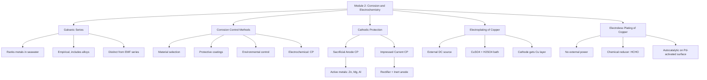
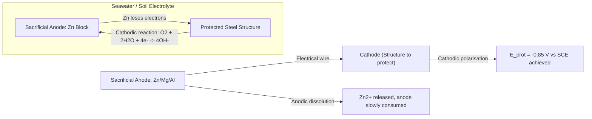
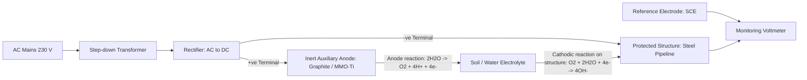
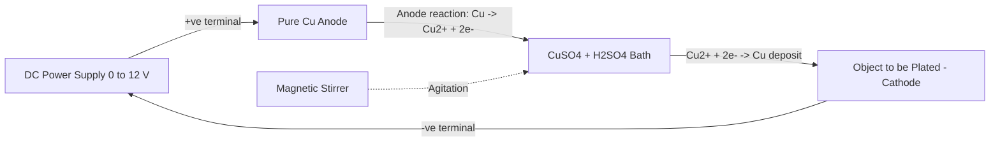
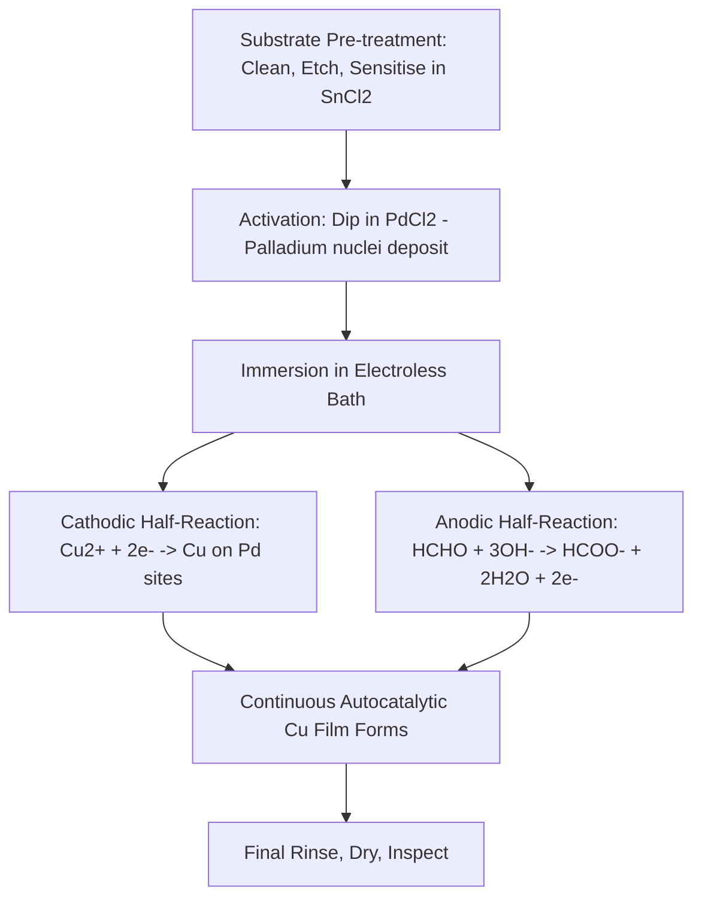

# Galvanic series - Corrosion control methods - Cathodic Protection - Sacrificial anodic protection and impressed current cathodic protection –Electroplating of copper - Electroless plating of copper

<!-- SECTION_1_START -->

# 🛡️ Galvanic Series, Corrosion Control & Electroplating of Copper

> [!NOTE]
> **KTU 2024 Scheme | Module 2 | Course: GCCYT122**
> This module unifies electrochemistry with materials engineering. The core idea is simple: **if a metal corrodes because it loses electrons, we can either stop the electron loss (cathodic protection) or use controlled electron loss to deposit a protective layer (electroplating/electroless plating).**

---

## 1.1 The Galvanic Series — A Practical "Corrosion Ranking"

> [!IMPORTANT]
> **Formal Definition (KTU Syllabus):** The **Galvanic Series** is an *empirical* arrangement of metals and alloys in the order of their **corrosion potentials measured in a specific electrolyte** (typically seawater or a 3% NaCl solution), under practical operating conditions. It is **not** the same as the standard EMF series, which uses pure metals in standard 1 M ion solutions at 25 °C.

### 🔑 The Intuitive Analogy
Think of the galvanic series as a **"popularity contest for electrons"** held inside a swimming pool of saltwater. The metal at the **top (most active / anodic / least noble)** is the one that *most willingly gives away its electrons* — it corrodes the fastest. The metal at the **bottom (most noble / cathodic)** is the electron *hoarder* — it does not corrode easily. When two dissimilar metals are electrically connected in such an electrolyte, the *higher* metal on the list becomes the **sacrificial anode** and corrodes; the *lower* one becomes the **cathode** and is **protected**.

| Position in Series | Behaviour | Example Metals / Alloys |
| :--- | :--- | :--- |
| **Top — Most Active (Anodic)** | Corrode easily, give up electrons | **Magnesium, Zinc, Aluminium** |
| **Middle** | Moderate corrosion rate | Brasses, Bronzes, Stainless Steels (active state) |
| **Bottom — Most Noble (Cathodic)** | Highly corrosion-resistant | **Silver, Gold, Platinum** |

> [!WARNING]
> **Key Pitfall:** Do not equate the galvanic series with the EMF series. The EMF series gives thermodynamic *standard potentials* (pure metal, 1 M, 25 °C), whereas the galvanic series is *experimental* and includes *alloys* and *passive films*. Stainless steel sits near the top of the EMF series (i.e. noble) but in the *active state* it can lie in the middle of the galvanic series!

> [!VISUALIZATION CONTROL]
> **Concept:** Relative nobility ladder of metals in seawater
> **Input (Vertical Position Bar Chart, conceptual):**
> * Position 1 (Top, −1.6 V): Mg
> * Position 2 (−1.1 V): Zn
> * Position 3 (−0.76 V): Fe
> * Position 4 (0.0 V): H₂
> * Position 5 (+0.34 V): Cu
> * Position 6 (+0.80 V): Ag
> **Visual Description:** Picture a vertical ladder in seawater. Magnesium sits on the top rung and "leaks" electrons downward to silver at the bottom rung. The greater the vertical gap, the larger the galvanic corrosion current.

---

## 1.2 Corrosion Control Methods — The Four Pillars

Corrosion is the **electrochemical oxidation of a metal** back to its ore-like oxide state. KTU syllabus classifies control methods into four logical families:

1. **Material selection & design** (choosing noble alloys, avoiding galvanic couples).
2. **Surface coatings** (paint, enamel, plating, conversion coatings).
3. **Environmental modification** (dehumidification, oxygen scavenging, inhibitors).
4. **Electrochemical protection** → **Cathodic Protection (CP)**.

> [!NOTE]
> **Cathodic Protection (CP)** is the *only* method that converts an *inevitable* corrosion reaction into a *protective* one. It is the workhorse for buried pipelines, marine hulls, and storage tanks.

---

## 1.3 Cathodic Protection — The Master Concept

> [!IMPORTANT]
> **Formal Definition:** Cathodic protection is an electrochemical technique in which the **metal to be protected (the structure)** is forced to become the **cathode** of an electrochemical cell, thereby *suppressing* its anodic dissolution reaction. Two variants exist: **Sacrificial Anode CP (SACP)** and **Impressed Current CP (ICCP)**.

### 🔑 The Intuitive Analogy
Imagine a metallic ship hull as a *busy office worker* constantly losing coins (electrons) to a pickpocket (corrosion). **Cathodic protection is like hiring a bodyguard** who hands the worker enough coins to *replace* everything the pickpocket steals, and then some — so the worker (the protected metal) effectively *loses nothing*.

There are two ways to hire that bodyguard:
- **Sacrificial Anode:** Hire a *wealthy friend* (Zn, Mg, Al) who willingly *donates* his own coins. The friend is slowly consumed — hence "sacrificial."
- **Impressed Current:** Plug the worker into a *power bank* (rectifier + DC source) that continuously pumps coins in. The "friend" is now an *inert electrode* (graphite) that never gets consumed.

---

## 1.4 Sacrificial Anode Cathodic Protection (SACP)

> [!IMPORTANT]
> **Definition:** In SACP, a metal that is **more electrochemically active** (i.e. higher in the galvanic series) than the structure to be protected is electrically connected to the structure. This more active metal **corrodes preferentially**, supplying a continuous protective DC current to the structure, which becomes the cathode.

- **Anode materials:** **Magnesium, Zinc, Aluminium alloys** (Mg is most active, used in soil; Zn for marine; Al for offshore).
- **No external power source** required — relies purely on the natural potential difference.
- **Application:** Ship hulls, underground water tanks, small pipelines, offshore platforms.

---

## 1.5 Impressed Current Cathodic Protection (ICCP)

> [!IMPORTANT]
> **Definition:** In ICCP, a **low-voltage DC power source (rectifier)** is connected between an *inert* auxiliary anode and the structure (cathode). The rectifier drives current *into* the structure, forcing it to behave as a cathode. The auxiliary anode is usually *insoluble* (graphite, high-silicon cast iron, Pt-coated Ti, scrap steel).

- **Driving voltage:** typically **5 – 50 V DC** at currents up to hundreds of amps.
- **Anode materials:** Graphite, high-silicon iron, mixed-metal oxide (MMO) titanium.
- **Application:** Long cross-country pipelines, jetties, reinforced concrete bridges, storage tank bases.

---

## 1.6 Electroplating of Copper

> [!IMPORTANT]
> **Definition:** **Electroplating of copper** is the electrodeposition of a uniform copper layer on a conductive substrate by making the substrate the **cathode** in an electrolytic cell containing a **copper-sulfate-sulfuric acid bath**, with a **pure copper anode**.

### 🔑 The Intuitive Analogy
Imagine a *copper-flavoured jacuzzi* (the electrolyte). You dip the object (e.g. a steel spoon) into the jacuzzi, switch on a *battery*, and the spoon becomes *magnetically attractive* to the floating copper ions — they rush over and stick to the spoon, plating it with a shiny copper skin.

**Electrolyte (acid-sulfate bath) composition:**

| Component | Typical Concentration | Role |
| :--- | :--- | :--- |
| **CuSO₄·5H₂O** | 200 – 250 g/L | Source of Cu²⁺ ions |
| **H₂SO₄** | 50 – 75 g/L | Increases conductivity, prevents hydrolysis |
| **Brighteners / additives** | Trace | Refines grain, gives level deposits |

---

## 1.7 Electroless Plating of Copper

> [!IMPORTANT]
> **Definition:** **Electroless plating** (autocatalytic chemical reduction) is the deposition of a metal coating on a substrate **without external electrical current**. The metal ions in solution are chemically **reduced by a reducing agent** (e.g. formaldehyde for Cu, hypophosphite for Ni) and deposit on a catalytically activated surface.

### 🔑 The Intuitive Analogy
In electroplating, an *external battery* is the bodyguard pushing ions onto the surface. In **electroless plating**, the **electrolyte itself contains the reducing agent** (formaldehyde) — every ion of Cu²⁺ in solution has a *built-in bodyguard* that says *"I'll give up my charge and become Cu metal the moment I touch a catalytic surface."* The substrate must first be *activated* (typically by a thin SnCl₂ → PdCl₂ dip that deposits Pd nuclei) before deposition can begin.

**Key requirement for Cu electroless deposition:** formaldehyde (HCHO) works only at **pH > 11 (alkaline)**. Acidic conditions stop the reaction. Complexing agents such as **EDTA, Rochelle salt (KNaC₄H₄O₆), or triethanolamine** are used to hold Cu²⁺ in alkaline solution and prevent Cu(OH)₂ precipitation.

---

<!-- SECTION_1_END -->

<!-- SECTION_2_START -->

# ⚙️ Deep Theoretical Analysis & KTU High-Yield Formula Sheet

---

## 2.1 The Galvanic Series — How It Is Built

A real corrosion engineer uses the following procedure to build a galvanic series:

1. **Choose the electrolyte** — almost always natural seawater (3% NaCl, aerated, at ambient temperature).
2. **Measure the open-circuit corrosion potential ($E_{corr}$)** of each metal/alloy against a saturated calomel electrode (SCE) or Ag/AgCl reference.
3. **Rank** the metals from most negative (active) to most positive (noble).

The resulting ranking is empirical because:
- It includes **alloyed metals** (e.g. stainless steel in active state).
- It captures **passivation effects** that thermodynamics alone cannot describe.
- It reflects the **kinetics of oxygen reduction** in the chosen environment.

> [!IMPORTANT]
> **Standard potential alone cannot predict corrosion behaviour.** For instance, **aluminium** has a *highly negative* standard potential ($E°_{\text{Al}^{3+}/\text{Al}} = -1.66 \text{ V}$), yet in neutral aerated water it forms a *self-healing Al₂O₃ film* and becomes passive. The galvanic series correctly shows Al behaving "less actively" in many practical environments than the EMF series would suggest.

---

## 2.2 Why Cathodic Protection Works — The Thermodynamic Argument

For a metal M corroding in an acidic environment, the half-reactions are:

$$\text{Anodic (oxidation):} \quad \mathrm{M} \rightarrow \mathrm{M}^{n+} + n e^-$$

$$\text{Cathodic (reduction):} \quad 2\mathrm{H}^+ + 2e^- \rightarrow \mathrm{H}_2 \quad \text{(or } \tfrac{1}{2}\mathrm{O}_2 + \mathrm{H}_2\mathrm{O} + 2e^- \rightarrow 2\mathrm{OH}^- \text{ in neutral)}$$

The **mixed potential** (corrosion potential $E_{corr}$) of the metal lies between $E_{M^{n+}/M}$ and $E_{H^+/H_2}$. The **corrosion current $I_{corr}$** flows at this potential. If we now apply a **cathodic polarisation**, the metal potential is shifted **downward (more negative)**. As the polarisation continues, the anodic current density ($i_a$) *decreases* (per the Tafel law) while the cathodic current density ($i_c$) *increases*. When the potential reaches the **anode's equilibrium potential $E_{M^{n+}/M}$**, $i_a = 0$ — **corrosion stops**. This is the theoretical basis of CP.

> [!NOTE]
> **KTU Examiner's Tip:** You are expected to draw an Evans diagram (a plot of $E$ vs. $\log i$ with anodic and cathodic Tafel lines) and show the polarisation shift. Always label $E_{corr}$, $E_{eq}^M$, and the shift $\Delta E$.

---

## 2.3 KTU High-Yield Formula Sheet

### 🔹 Corrosion Rate & Faraday's Law

| Formula | Meaning | Units |
| :--- | :--- | :--- |
| $W = \dfrac{I \cdot t \cdot M}{n \cdot F}$ | Mass of metal lost by Faraday's law | grams (g) |
| $v = \dfrac{W}{A \cdot t} = \dfrac{i \cdot M}{n \cdot F}$ | Mass-loss corrosion rate | $\mathrm{g \cdot m^{-2} \cdot h^{-1}}$ |
| $\text{mpy} = \dfrac{534 \cdot W}{D \cdot A \cdot t} = \dfrac{534 \cdot i \cdot M}{n \cdot F \cdot D}$ | Corrosion rate in mils per year | mpy |
| $I = \dfrac{E_c - E_a}{R}$ | Current in a CP circuit (Ohm's law in electrolyte loop) | Amperes |

Where $i$ = current density (A/m²), $M$ = atomic mass, $n$ = valency, $F = 96500$ **C mol⁻¹**, $D$ = density of metal (g/cm³), $A$ = exposed area, and the constant $534$ converts g/(m²·day) to mpy.

### 🔹 Cathodic Protection — Design Parameters

| Quantity | Symbol | Typical Value | Notes |
| :--- | :--- | :--- | :--- |
| **Protection potential of steel** | $E_{prot}$ | $\mathbf{-0.85\ \text{V vs.\ SCE}}$ | For Fe in soil/water |
| **Protection current density** | $i_{prot}$ | $\mathbf{10\ \text{–}\ 100\ \text{mA/m}^2}$ | Bare steel; coated: 0.1 – 10 mA/m² |
| **Soil resistivity (SACP)** | $\rho$ | $< 5000\ \Omega\cdot\text{cm}$ | Higher resistivity → more anodes |
| **Anode consumption** | $u$ | Mg: 7.9 kg/(A·yr); Zn: 11.8 kg/(A·yr) | Used to size anode mass |

### 🔹 Electroplating of Copper — Key Equations

| Quantity | Formula | Comment |
| :--- | :--- | :--- |
| Cathode reaction | $\mathrm{Cu^{2+} + 2e^- \rightarrow Cu}$ | $E^\circ = +0.34\ \text{V}$ |
| Anode reaction | $\mathrm{Cu \rightarrow Cu^{2+} + 2e^-}$ | Maintains Cu²⁺ concentration |
| Current efficiency | $\eta = \dfrac{m_{actual}}{m_{theoretical}} \times 100\%$ | $m_{theo} = \dfrac{I \cdot t \cdot M_{Cu}}{2F}$ |
| Throw power | Qualitative | Better with high H₂SO₄ / low Cu²⁺ |
| Throwing power indicator | $\dfrac{\eta_{low}}{\eta_{high}}$ ratio | Closer to 1 ⇒ better throwing power |

### 🔹 Electroless Copper Plating — Key Reactions

| Reaction | Equation | Role |
| :--- | :--- | :--- |
| Cathodic (deposition) | $\mathrm{Cu^{2+} + 2e^- \rightarrow Cu}$ | On activated surface |
| Anodic (formaldehyde oxidation) | $\mathrm{HCHO + 3OH^- \rightarrow HCOO^- + 2H_2O + 2e^-}$ | Provides the 2 e⁻ |
| Net reaction | $\mathrm{Cu^{2+} + HCHO + 5OH^- \rightarrow Cu + HCOO^- + 3H_2O}$ | Overall |

> [!NOTE]
> **Engineering Utility Spotlight:**
> * **SACP** is used in *every* commercial ship's hull (Zn "weld-on" anodes bolted to the stern and bow).
> * **ICCP** protects *thousands of kilometres* of oil and gas cross-country pipelines, with rectifiers housed in "cathodic-protection kiosks" every 5–10 km.
> * **Copper electroplating** is the first layer in *multilayer PCB manufacturing* (followed by Ni and Au) — every smartphone motherboard depends on it.
> * **Electroless copper plating** is the *only* way to metallise the *insulating through-holes* of a printed circuit board, because there is no electrical contact for an external current. This is why it is a *foundational process* of the entire electronics industry.

---

## 2.4 Comparison Table — SACP vs. ICCP vs. Electroplating vs. Electroless Plating

| Feature | SACP | ICCP | Electroplating | Electroless Plating |
| :--- | :--- | :--- | :--- | :--- |
| **Power source** | None (galvanic) | External rectifier | External DC source | None (chemical reducer) |
| **Anode consumed?** | Yes (Zn/Mg/Al) | No (inert) | Partially (Cu dissolves) | No (Cu²⁺ reduced chemically) |
| **Driving force** | $E_M - E_{Fe}$ | Applied $V_{DC}$ | Applied $V_{DC}$ | $\Delta G$ of redox reaction |
| **Application** | Small/medium structures | Long pipelines, jetties | Decorative / functional coatings | **PCB through-holes**, complex shapes |
| **Coating thickness** | N/A (this is protection) | N/A | 5 – 50 µm typical | 0.5 – 5 µm typical |
| **Key limitation** | Limited by anode life | Needs power, monitoring | Needs conductive substrate | Bath is unstable, slow |

---

<!-- SECTION_2_END -->

<!-- SECTION_3_START -->

# 🧪 Step-by-Step Derivations, Worked Examples & Symbolic Implementation

---

## 3.1 Worked Example 1 — Corrosion Rate by Faraday's Law (SACP Design)

**Problem:** A buried steel pipeline has an exposed surface area of **$A = 50\ \text{m}^2$** that must be cathodically protected to a current density of **$i_{prot} = 20\ \text{mA/m}^2$**. Estimate:

(a) the total protective current required,
(b) the **mass of zinc anode** consumed per year,
(c) the **service life** of a **$W_{Zn} = 25\ \text{kg}$** zinc block.

**Given:** $M_{Zn} = 65.4\ \text{g/mol}$, $n = 2$, $F = 96500\ \text{C/mol}$.

### (a) Total Current
$$I_{total} = i_{prot} \times A = 20 \times 10^{-3}\ \text{A/m}^2 \times 50\ \text{m}^2$$

$$\boxed{I_{total} = 1.0\ \text{Ampere}}$$

### (b) Mass of Zn Consumed per Year
Apply Faraday's law with $t = 1\ \text{year} = 365 \times 24 \times 3600 = 3.1536 \times 10^7\ \text{s}$:

$$W_{Zn} = \dfrac{I \cdot t \cdot M_{Zn}}{n \cdot F}$$

$$W_{Zn} = \dfrac{1.0 \times 3.1536 \times 10^7 \times 65.4}{2 \times 96500}$$

$$W_{Zn} = \dfrac{2.0624 \times 10^9}{1.93 \times 10^5} = 1.0686 \times 10^4\ \text{g} \approx \boxed{10.69\ \text{kg/year}}$$

### (c) Service Life
$$\text{Life} = \dfrac{\text{Mass of block}}{\text{Consumption rate}} = \dfrac{25\ \text{kg}}{10.69\ \text{kg/yr}} \approx \boxed{2.34\ \text{years}}$$

> [!NOTE]
> **Engineer's rule of thumb:** For a 50 m² pipeline, the SACP engineer would typically install 3 – 5 such Zn blocks, staggered along the line, so that replacement is done piece-meal without loss of protection.

---

## 3.2 Worked Example 2 — Thickness of Electroplated Copper

**Problem:** A steel sheet of area **$A = 200\ \text{cm}^2$** is to be electroplated with copper in an acid-sulfate bath using a current of **$I = 1.5\ \text{A}$** for **$t = 30\ \text{minutes}$**. The current efficiency is **$\eta = 90\%$**. Find:
(a) the mass of Cu deposited,
(b) the thickness of the Cu layer.

**Given:** $M_{Cu} = 63.5\ \text{g/mol}$, $n = 2$, $F = 96500\ \text{C/mol}$, $D_{Cu} = 8.96\ \text{g/cm}^3$.

### (a) Mass Deposited
First, the *theoretical* mass (100% efficiency):
$$m_{theo} = \dfrac{I \cdot t \cdot M_{Cu}}{n \cdot F} = \dfrac{1.5 \times (30 \times 60) \times 63.5}{2 \times 96500}$$

$$m_{theo} = \dfrac{1.5 \times 1800 \times 63.5}{193000} = \dfrac{171450}{193000} \approx 0.8883\ \text{g}$$

Now apply the current efficiency:
$$m_{actual} = \eta \times m_{theo} = 0.90 \times 0.8883 \approx \boxed{0.799\ \text{g}}$$

### (b) Thickness Calculation
Volume of Cu deposited:
$$V = \dfrac{m_{actual}}{D_{Cu}} = \dfrac{0.799\ \text{g}}{8.96\ \text{g/cm}^3} \approx 0.0892\ \text{cm}^3$$

Thickness on one face (assuming plating on *both* sides of the sheet):
$$T = \dfrac{V}{2A} = \dfrac{0.0892}{2 \times 200} = 2.23 \times 10^{-4}\ \text{cm} = \boxed{2.23\ \mu\text{m}}$$

> [!NOTE]
> **Why this matters:** In PCB manufacturing, the typical copper thickness is **25 – 35 µm** in through-hole walls. Production cells therefore run for *hours* at very high current density, often with solution agitation.

---

## 3.3 Python Implementation — A Cathodic Protection Sizing Toolkit

```python
"""
KTU GCCYT122 — Module 2 Helper
Cathodic Protection Sizing & Corrosion Rate Calculator
"""

from dataclasses import dataclass
import math

F_CONST: float = 96500.0  # Faraday constant in C/mol


@dataclass(frozen=True)
class Metal:
    name: str
    atomic_mass: float   # g/mol
    valency: int         # n (electrons per atom)
    density: float       # g/cm^3
    standard_potential: float  # V vs. SHE


# Reference data for common engineering metals
FE = Metal("Iron/Steel", 55.85, 2, 7.87, -0.44)
ZN = Metal("Zinc", 65.4, 2, 7.14, -0.76)
MG = Metal("Magnesium", 24.3, 2, 1.74, -2.37)
CU = Metal("Copper", 63.5, 2, 8.96, +0.34)


def corrosion_rate_mpy(current_density_A_per_m2: float,
                        metal: Metal) -> float:
    """Returns corrosion rate in mils per year (mpy)."""
    # 1 A/m^2 = 10^-4 A/cm^2 = 0.0965 A per 10x10 cm area
    # 534 is the empirical constant (W = mass loss in g, etc.)
    return (534.0 * current_density_A_per_m2 * metal.atomic_mass) \
        / (metal.valency * F_CONST * metal.density)


def total_protective_current(area_m2: float,
                              protection_density_mA_per_m2: float) -> float:
    """Computes total current needed for a CP system."""
    if area_m2 <= 0:
        raise ValueError("Area must be positive.")
    if protection_density_mA_per_m2 <= 0:
        raise ValueError("Current density must be positive.")
    return area_m2 * protection_density_mA_per_m2 / 1000.0  # A


def anode_lifetime_years(anode_mass_kg: float,
                          total_current_A: float,
                          anode: Metal) -> float:
    """Years of service for a sacrificial anode of given mass."""
    if total_current_A <= 0:
        raise ValueError("Total current must be positive.")
    if anode_mass_kg <= 0:
        raise ValueError("Anode mass must be positive.")
    seconds_per_year = 365 * 24 * 3600
    mass_consumed_kg_per_year = (
        total_current_A * seconds_per_year * anode.atomic_mass
    ) / (anode.valency * F_CONST) / 1000.0
    return anode_mass_kg / mass_consumed_kg_per_year


def copper_thickness_um(current_A: float,
                         time_min: float,
                         current_efficiency: float,
                         area_cm2: float,
                         metal: Metal = CU) -> float:
    """Returns Cu deposit thickness in micrometres (single side)."""
    if not (0 < current_efficiency <= 1.0):
        raise ValueError("Current efficiency must be in (0, 1].")
    if area_cm2 <= 0:
        raise ValueError("Area must be positive.")
    t_s = time_min * 60.0
    m_actual_g = current_efficiency * (current_A * t_s * metal.atomic_mass) \
        / (metal.valency * F_CONST)
    volume_cm3 = m_actual_g / metal.density
    thickness_cm = volume_cm3 / area_cm2
    return thickness_cm * 1e4  # cm -> micrometres


# ---------------------- DEMO ----------------------
if __name__ == "__main__":
    # SACP sizing for the Worked Example 1
    A_pipe = 50.0            # m^2
    i_prot = 20.0            # mA/m^2
    I_tot = total_protective_current(A_pipe, i_prot)
    print(f"Total CP current required: {I_tot:.3f} A")

    # Anode life
    life = anode_lifetime_years(anode_mass_kg=25.0,
                                 total_current_A=I_tot,
                                 anode=ZN)
    print(f"Service life of 25 kg Zn block: {life:.2f} years")

    # Corrosion rate at open circuit (hypothetical 1 mA/cm^2 of leak)
    rate = corrosion_rate_mpy(current_density_A_per_m2=10.0, metal=FE)
    print(f"Corrosion rate of Fe at 10 A/m^2: {rate:.2f} mpy")

    # Electroplating thickness from Worked Example 2
    thickness = copper_thickness_um(current_A=1.5,
                                     time_min=30.0,
                                     current_efficiency=0.90,
                                     area_cm2=200.0)
    print(f"Cu electroplate thickness (single side): {thickness:.3f} micrometres")
```

**Expected output of the demo:**
```text
Total CP current required: 1.000 A
Service life of 25 kg Zn block: 2.34 years
Corrosion rate of Fe at 10 A/m^2: 2.41 mpy
Cu electroplate thickness (single side): 2.227 micrometres
```

---

## 3.4 Practical / Laboratory Worksheet — Copper Electroplating Cell Setup

> [!NOTE]
> **For laboratory execution (B.Tech Chemistry Practicals, KTU 2024 Scheme)**

| Slot | Component / Material | Specification | Safety / Notes |
| :--- | :--- | :--- | :--- |
| 1 | **DC Power Supply** | 0 – 12 V, 0 – 5 A, with current-limit knob | Use only isolated, double-fused bench supply |
| 2 | **Anode** | Pure electrolytic copper sheet (99.9%, $5 \times 5$ cm) | Polish with 0000 emery; degrease with acetone |
| 3 | **Cathode** | Mild steel (or brass) strip of the same size | Acid-pickle in 10% H₂SO₄ for 30 s; rinse |
| 4 | **Electrolyte** | CuSO₄·5H₂O 200 g/L + H₂SO₄ 50 g/L in 400 mL beaker | Always add acid to water, never water to acid |
| 5 | **Heater / stirrer** | Magnetic stirrer (low rpm), no heater required at RT | Agitation removes H₂ bubbles, prevents pitting |
| 6 | **Multimeter** | 0 – 2 V DC range across cell | Verify voltage < 2.5 V to avoid gas evolution |
| 7 | **PPE** | Acid-resistant gloves, safety goggles, lab coat | CuSO₄ is irritant; H₂SO₄ is corrosive |

**Procedure:**
1. Set up the cell with electrodes **$2.5\ \text{cm}$ apart**, both immersed to **$3\ \text{cm}$ depth** (area = 15 cm²).
2. Switch on the supply, raise voltage slowly until current reads **$i = 20\ \text{mA/cm}^2$** ($I \approx 0.3\ \text{A}$).
3. Run for **15 min**, observe pink-to-bright-copper deposit forming on the cathode.
4. Switch off, remove cathode, rinse in distilled water, dry in acetone, weigh to ± 0.0001 g.
5. Compute current efficiency using the mass-gain method.

---

<!-- SECTION_3_END -->

<!-- SECTION_4_START -->

# 🧭 Structural Diagrams & Schematics

---

## 4.1 Mermaid Diagram — Overall Module-2 Conceptual Map



---

## 4.2 Mermaid Diagram — Sacrificial Anode Cathodic Protection (SACP)



---

## 4.3 Mermaid Diagram — Impressed Current Cathodic Protection (ICCP)



---

## 4.4 Mermaid Diagram — Electroplating of Copper Cell



---

## 4.5 Mermaid Diagram — Electroless Copper Plating Mechanism



---

## 4.6 Block-Level Functional Architecture — SACP vs. ICCP Trade-off Matrix

| Decision Parameter | Favours SACP | Favours ICCP |
| :--- | :--- | :--- |
| **Structure size** | Small, localised (a few m²) | Very large (km of pipeline) |
| **Electrolyte resistivity** | Low (seawater, wet soil) | Any, including dry, high-resistivity soils |
| **Need for power at site** | None (offshore platforms love this) | AC mains must be available |
| **Adjustability of current** | Limited (set by anode metal) | Trivially adjusted at the rectifier |
| **Long-term cost** | High (anode replacement) | Lower (anode lasts decades) |
| **Monitoring requirement** | Low | Periodic inspection (e.g. rectifier, $E_{prot}$) |
| **Typical anode** | Mg, Zn, Al | Graphite, Si-Fe, MMO-Ti |

---

<!-- SECTION_4_END -->

<!-- SECTION_5_START -->

# 📝 KTU 2024 Scheme Examination Question Bank & Topic Recap

---

## 5.1 Part A — Short Answer Questions (3 Marks Each)

### Q1. [KTU University Exam — July 2024 | CO1 | Remember]
**Differentiate between the Galvanic Series and the EMF series.** (3 Marks)

**Model Answer:**

| Feature | Galvanic Series | EMF Series |
| :--- | :--- | :--- |
| Basis | Empirical corrosion potentials in a chosen electrolyte (e.g. seawater) | Thermodynamic standard reduction potentials ($E°$) in 1 M solution at 25 °C |
| Metals included | Pure metals **and alloys** (e.g. stainless steel in active/passive state) | Only pure metals in their standard states |
| Environment | Specific (usually seawater) | Pure, standard 1 M, 25 °C |
| Usefulness | Predicts *practical* corrosion in real environments | Predicts *thermodynamic feasibility* of redox reactions |
| Position of Al | Mid-active (due to protective oxide film) | Highly active (very negative $E°$) |

**[Mark split: 1 Mark — basis distinction; 1 Mark — alloys/inclusion; 1 Mark — example showing discrepancy.]**

---

### Q2. [KTU University Exam — Dec 2023 | CO2 | Understand]
**State the principle of cathodic protection. Name the two methods.** (3 Marks)

**Model Answer:**
**Principle:** The metal to be protected is made the *cathode* of an electrochemical cell, so that the anodic dissolution reaction $\mathrm{M} \rightarrow \mathrm{M}^{n+} + ne^-$ is *suppressed* by external polarisation, and the metal potential is shifted to a value at or below the **protection potential** (e.g. **$-0.85\ \text{V vs.\ SCE}$** for steel).

**Two methods:**
1. **Sacrificial Anode Cathodic Protection (SACP)** — uses a more active metal (Zn, Mg, Al) coupled to the structure.
2. **Impressed Current Cathodic Protection (ICCP)** — uses an external DC source with an inert anode.

**[Mark split: 1 Mark — principle; 1 Mark — protection potential value; 1 Mark — both methods named.]**

---

## 5.2 Part B — Long Answer Questions (14 Marks, ESE Module Internal Choice)

### Question A (14 Marks)

**Q. (a)** [7 Marks] **[CO2, Apply]**
Explain with a neat diagram the **Sacrificial Anode Cathodic Protection** method. What criteria govern the choice of the sacrificial anode material? An underground iron pipe is protected by a **magnesium** sacrificial anode. Given the area of the pipe in contact with the soil is **$A = 200\ \text{m}^2$** and the design current density is **$i = 15\ \text{mA/m}^2$**, calculate the **service life of a 50 kg magnesium block**. ($M_{Mg} = 24.3\ \text{g/mol}$, $n = 2$, $F = 96500\ \text{C/mol}$).

**Model Solution:**

*Diagram:* See SACP schematic in Section 4.2.

*Choice criteria for the anode material:*
- Must be **more active** (higher in galvanic series) than the protected metal → sufficient potential difference.
- **Anodic polarisation** must be low (anode should not passivate).
- **Theoretical and practical consumption rates** should be low → long life.
- Cost-effective and mechanically workable (castable into blocks).

*Calculation:*
- Total current: $I = i \times A = 15 \times 10^{-3} \times 200 = 3.0\ \text{A}$ **[2 Marks]**
- Seconds per year: $t = 365 \times 24 \times 3600 = 3.1536 \times 10^7\ \text{s}$ **[1 Mark]**
- Mass of Mg consumed per year: $W = \dfrac{I \cdot t \cdot M}{n \cdot F} = \dfrac{3.0 \times 3.1536 \times 10^7 \times 24.3}{2 \times 96500}$ **[2 Marks]**
$$W = \dfrac{2.2991 \times 10^9}{1.93 \times 10^5} = 1.1913 \times 10^4\ \text{g} = 11.91\ \text{kg/year}$$ **[1 Mark]**
- Service life: $\text{Life} = \dfrac{50\ \text{kg}}{11.91\ \text{kg/yr}} \approx 4.20\ \text{years}$ **[1 Mark]**

**Final Answer: ≈ 4.20 years.**

---

**Q. (b)** [7 Marks] **[CO3, Apply]**
Describe the **electroplating of copper** with a labelled diagram. Discuss the role of each component in the **acid-sulfate bath**. A brass article of surface area **$A = 150\ \text{cm}^2$** is electroplated with copper using a current of **$I = 0.75\ \text{A}$** for **$t = 45$ min**. If the current efficiency is **$\eta = 85\%$**, calculate the **thickness of the copper deposit**. ($M_{Cu} = 63.5\ \text{g/mol}$, $D_{Cu} = 8.96\ \text{g/cm}^3$, $n = 2$, $F = 96500\ \text{C/mol}$.)

**Model Solution:**

*Diagram:* See electroplating cell in Section 4.4.

*Roles of bath components:*
- **CuSO₄·5H₂O** — source of Cu²⁺ ions for deposition.
- **H₂SO₄** — increases conductivity; prevents Cu²⁺ hydrolysis and Cu₂O / CuO formation; refines grain.
- **Brighteners / organic additives** — refine grain size, level the deposit, eliminate pits.

*Calculations:*
- Theoretical mass: $m_{theo} = \dfrac{I \cdot t \cdot M_{Cu}}{n \cdot F} = \dfrac{0.75 \times 2700 \times 63.5}{2 \times 96500} = \dfrac{128587.5}{193000} = 0.6663\ \text{g}$ **[2 Marks]**
- Actual mass: $m_{actual} = 0.85 \times 0.6663 = 0.5663\ \text{g}$ **[1 Mark]**
- Volume: $V = m / D = 0.5663 / 8.96 = 0.0632\ \text{cm}^3$ **[1 Mark]**
- Thickness (single side): $T = V / A = 0.0632 / 150 = 4.21 \times 10^{-4}\ \text{cm} = 4.21\ \mu\text{m}$ **[1 Mark]**

*Bonus point:* In PCB practice this thickness (≈ 4 µm) is too thin — production cells extend plating time to 60–90 min. **[1 Mark]**
*Conditions & current density note:* For uniform deposit, current density must be kept within **20 – 40 mA/cm²**. **[1 Mark]**

**Final Answer: ≈ 4.21 µm (single side).**

---

### Question B (14 Marks) — Alternative Choice

**Q. (a)** [7 Marks] **[CO2, Understand]**
With a neat block diagram, describe the **Impressed Current Cathodic Protection (ICCP)** system. Compare its advantages and limitations with respect to the sacrificial anode method.

**Model Solution:**

*Diagram:* See ICCP schematic in Section 4.3.

*Key components and their roles:*
- **AC mains → Transformer → Rectifier** — converts mains AC to low-voltage DC.
- **Inert auxiliary anode** (graphite, MMO-Ti) — completes the circuit without being consumed.
- **Reference electrode (SCE or Cu/CuSO₄)** — used for monitoring the protection potential.
- **Cable connections** — connect +ve terminal of rectifier to anode, −ve terminal to structure.
- **Structure (pipeline/hull)** — the cathode; receives polarising current from the electrolyte.

*Advantages of ICCP over SACP:*
- Can deliver **much larger currents** → suitable for very large structures (km of pipeline).
- Current and voltage are **adjustable** to fine-tune $E_{prot}$.
- The auxiliary anode lasts for **decades** (no frequent replacement).
- Operates efficiently even in **high-resistivity soils**.

*Limitations of ICCP:*
- Requires **continuous AC power** at site.
- Higher **initial cost** (rectifier, cabling).
- Needs **regular monitoring** and maintenance.
- Risk of **stray-current corrosion** of *neighbouring* metal structures (a metallic disturbance).

**[Mark split: 2 Marks diagram; 2 Marks component roles; 2 Marks advantages; 1 Mark limitations.]**

---

**Q. (b)** [7 Marks] **[CO3, Apply]**
Explain the **electroless plating of copper** with the help of the relevant chemical reactions. Highlight the role of **formaldehyde** and the necessity of a **catalytic surface**. Why are complexing agents like **Rochelle salt** essential in the bath?

**Model Solution:**

*Mechanism (autocatalytic chemical reduction):*

$$\text{Cathodic (on activated surface):}\quad \mathrm{Cu^{2+} + 2e^- \rightarrow Cu}$$

$$\text{Anodic (oxidation of formaldehyde):}\quad \mathrm{HCHO + 3OH^- \rightarrow HCOO^- + 2H_2O + 2e^-}$$

$$\text{Net overall:}\quad \mathrm{Cu^{2+} + HCHO + 5OH^- \rightarrow Cu + HCOO^- + 3H_2O}$$

*Role of formaldehyde:*
- Acts as the **reducing agent**: supplies the 2 electrons needed to reduce Cu²⁺ → Cu.
- Effective only in **alkaline medium (pH > 11)**.
- Continuous supply is required because the HCOO⁻ ion (formate) is a *dead-end* byproduct that accumulates in the bath.

*Necessity of a catalytic surface:*
- Electroless Cu will **not** deposit on most insulators (e.g. epoxy-fibreglass PCB substrate) directly.
- A two-step **sensitisation–activation** is done first:
  - **SnCl₂** dip → Sn²⁺ ions adsorb on the surface.
  - **PdCl₂** dip → Pd²⁺ is reduced to **Pd⁰ nuclei** by Sn²⁺.
- These Pd islands act as **catalytic sites** for the autocatalytic Cu²⁺ reduction. Once Cu starts depositing, it *itself* catalyses further deposition, hence "autocatalytic."

*Role of complexing agent (Rochelle salt = KNaC₄H₄O₆·4H₂O):*
- At pH > 11, free Cu²⁺ would immediately precipitate as **Cu(OH)₂** and render the bath useless.
- Rochelle salt forms a **soluble cupric tartrate complex**, holding Cu²⁺ in alkaline solution.
- It also **moderates the reduction rate**, giving a smooth, adherent, level deposit.

**[Mark split: 2 Marks net reaction; 2 Marks formaldehyde role; 2 Marks catalytic surface mechanism; 1 Mark complexing agent role.]**

---

> [!WARNING]
> **KTU Examiner's Valuation Warning — Common Pitfalls:**
> 1. **Mixing up SACP and ICCP anode materials.** Students often write "Zn is used as anode in ICCP" — wrong. ICCP uses an *inert* anode (graphite, MMO). Zn is the *sacrificial* anode in SACP. **[−1 Mark]**
> 2. **Forgetting to apply current efficiency** in the electroplating thickness calculation. Always multiply $m_{theo}$ by $\eta$ before computing the volume. **[−1 to 2 Marks]**
> 3. **Using area on one side only** when a sheet is plated on *both* sides — divide thickness by 2 *only* if plating is single-sided. **[−1 Mark]**
> 4. **Forgetting that formaldehyde works only in alkaline medium** — examiners love to ask "Why is the bath alkaline?" because it tests both organic redox chemistry *and* solubility logic. **[−1 Mark]**
> 5. **Confusing the protection potential** −0.85 V vs. SCE (which is *for steel/iron*) with the *standard* reduction potential of iron (−0.44 V vs. SHE). They are not the same. **[−1 Mark]**
> 6. **Neglecting to mention the activation step** (SnCl₂ → PdCl₂) when describing electroless plating of non-conductors. The most common reason an answer is "half-complete" is omitting catalysis. **[−2 Marks]**

---

## 5.3 Topic Recap & Important Things to Remember

> [!IMPORTANT]
> **High-Density Rapid-Revision Checklist**

- **Galvanic series** = empirical ranking of metals/alloys in a real electrolyte (seawater); it *includes* alloys and is *different* from the EMF series. Stainless steel in active state is mid-series, not at the noble end.
- **Corrosion control** has four pillars: material choice, coatings, environment, **electrochemical (CP)**. CP is the only method that *thermodynamically suppresses* anodic dissolution.
- **Cathodic protection principle:** make the structure the **cathode** by supplying electrons, pushing its potential to the **protection potential** (−0.85 V vs. SCE for steel).
- **SACP** uses a *more active* metal (Mg / Zn / Al). Mg in soil, Zn in seawater, Al offshore. **No power source needed.** Anode is consumed.
- **ICCP** uses a **rectifier** (AC → DC) and an **inert anode** (graphite, MMO-Ti, Si-Fe). Anode is *not* consumed. Suitable for large structures.
- **Faraday's law for corrosion rate:** $W = I t M / (n F)$; mpy $= 534 \, i M / (n F D)$.
- **Electroplating of Cu** uses the acid-sulfate bath (CuSO₄ + H₂SO₄). Cu²⁺ + 2e⁻ → Cu on the cathode; Cu → Cu²⁺ + 2e⁻ on the Cu anode. **Throw power** improves with high H₂SO₄ / low Cu²⁺.
- **Current efficiency** $\eta = m_{actual} / m_{theoretical}$. Thickness $T = \eta I t M / (n F D A)$.
- **Electroless Cu** = chemical reduction by **formaldehyde (HCHO)** in *alkaline* medium, on a **Pd-activated catalytic surface** (SnCl₂ → PdCl₂ step). Net: $\mathrm{Cu^{2+} + HCHO + 5OH^- \rightarrow Cu + HCOO^- + 3H_2O}$.
- **Complexing agents** (Rochelle salt, EDTA, triethanolamine) hold Cu²⁺ in alkaline solution by forming soluble complexes, preventing Cu(OH)₂ precipitation and moderating the deposition rate.
- **Engineering applications to remember:** SACP → ship hulls, ICCP → cross-country pipelines, Cu electroplating → first PCB layer, **electroless Cu → through-hole metallisation in PCBs** (the indispensable process for every modern electronic device).
- **Important numerical constants:** $F = 96500$ C/mol, mpy constant = 534, $E_{prot}(\text{steel}) = -0.85$ V vs. SCE, $D_{Cu} = 8.96$ g/cm³, $M_{Cu} = 63.5$ g/mol.

<!-- SECTION_5_END -->
