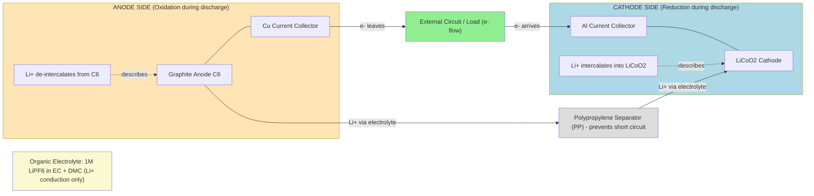
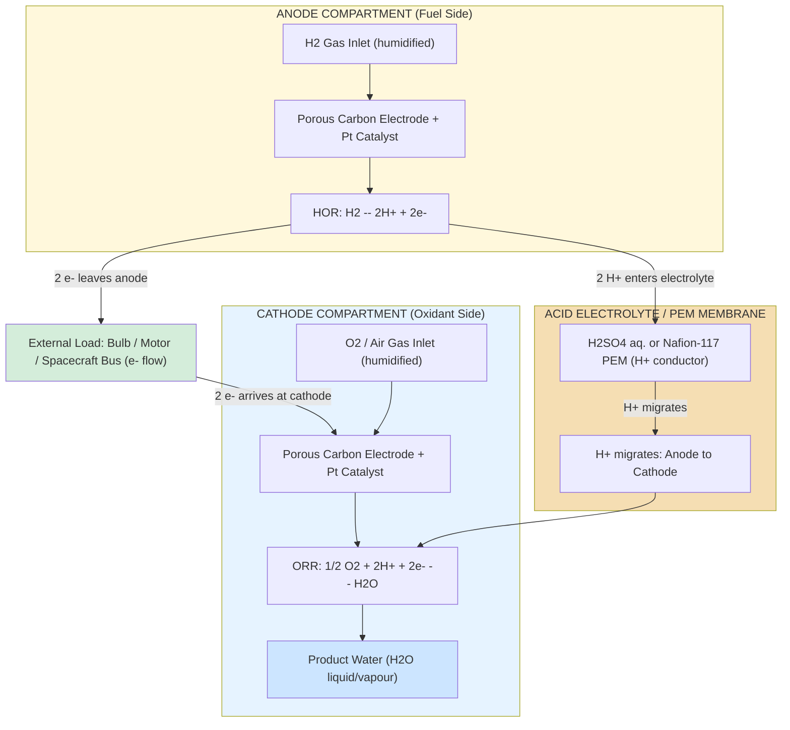
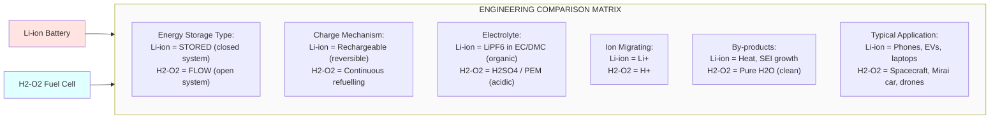

# Li-ion battery & H 2-O2 fuel cell (acid electrolyte only) construction and working.

<!-- SECTION_1_START -->
# Core Technical Definition & Intuitive Overview

## 1.1 Lithium-Ion (Li-ion) Battery

> [!IMPORTANT]
> **Formal KTU Definition:**
> A **Lithium-Ion Battery** is a **secondary (rechargeable) electrochemical energy storage device** that stores and delivers electrical energy via the **reversible intercalation** (insertion) and **de-intercalation** (extraction) of **lithium ions (Li⁺)** between two host electrode materials — a **carbon-based anode** (typically graphite) and a **lithiated metal-oxide cathode** (e.g., LiCoO₂, LiFePO₄, LiMn₂O₄) — through a **non-aqueous organic electrolyte** containing a lithium salt such as **LiPF₆** dissolved in a mixture of **ethylene carbonate (EC)** and **dimethyl carbonate (DMC)**.

### Conceptual Analogy — The "Two Warehouse Shuttle"
Imagine two warehouses separated by a city:
- **Warehouse A (Anode / Graphite)** initially stores a huge stock of goods (Li⁺).
- **Warehouse B (Cathode / LiCoO₂)** is empty and wants the goods.
- A fleet of electric delivery vans (the **external circuit** carrying **electrons**) carries the goods, but a one-way toll bridge (the **electrolyte**) only allows a special lightweight vehicle (the **Li⁺ ion**) to cross between warehouses.
- During **discharge**, goods flow from A → B; the vans do useful work (power your phone).
- During **charging**, the process is reversed by an external power source — the vans return empty, and the shuttle returns the goods to A.

> [!NOTE]
> **KTU 2024 Highlight:** Li-ion cells are called "**rocking-chair**" or "**swing**" batteries because Li⁺ ions literally rock back and forth between the two electrodes — a high-yield one-line answer for 3-mark questions.

### Key Constructional Components

| Component | Standard Material | Function |
|---|---|---|
| **Anode (Negative Electrode)** | Graphite (C₆) on Cu current collector | Stores Li⁺ by intercalation |
| **Cathode (Positive Electrode)** | LiCoO₂ on Al current collector | Hosts Li⁺ during discharge |
| **Electrolyte** | 1 M **LiPF₆** in EC + DMC (1:1 v/v) | Conducts Li⁺ ions; electronically insulating |
| **Separator** | Microporous Polyethylene (PE) / Polypropylene (PP) | Prevents physical contact of electrodes; allows Li⁺ flow |
| **Current Collectors** | Cu foil (anode side) / Al foil (cathode side) | Conduct electrons to external circuit |

---

## 1.2 Hydrogen–Oxygen Fuel Cell (Acid Electrolyte)

> [!IMPORTANT]
> **Formal KTU Definition:**
> A **Hydrogen–Oxygen Fuel Cell** is a **primary galvanic (voltaic) electrochemical device** that converts the **chemical energy of the combustion reaction** of hydrogen and oxygen (2 H₂ + O₂ → 2 H₂O) **directly into electrical energy** with high efficiency and low pollution, using a **porous carbon electrode impregnated with a platinum (Pt) catalyst** as both anode and cathode, separated by an **acidic electrolyte** (typically aqueous **H₂SO₄** or a **proton-exchange membrane, PEM**) through which **H⁺ ions** migrate from anode to cathode.

### Conceptual Analogy — The "Two Restaurants with a Bridge"
- **Restaurant 1 (Anode / H₂ side):** Serves hydrogen gas. The hydrogen molecules are split (cracked) on the Pt grill into H⁺ ions (which enter the electrolyte bridge) and electrons (which are forced to take the long route through the external wire to do useful work, e.g., light a bulb).
- **Bridge (Acid Electrolyte):** Only allows **H⁺** (not electrons) to pass.
- **Restaurant 2 (Cathode / O₂ side):** Receives the H⁺ ions and the electrons (delayed), and combines them with oxygen and the H⁺ to form **water** as the only by-product.

> [!NOTE]
> **KTU 2024 Highlight:** A fuel cell is **not** a heat engine — it is **not** limited by the **Carnot efficiency**. Its theoretical conversion efficiency can approach **≈ 83 %** (based on ΔG° of the reaction), making it a flagship **green-energy** technology.

### Key Constructional Components

| Component | Material | Function |
|---|---|---|
| **Anode (Fuel Electrode)** | Porous carbon + **Pt catalyst** + H₂ gas inlet | Catalyzes H₂ → 2 H⁺ + 2 e⁻ |
| **Cathode (Oxidant Electrode)** | Porous carbon + **Pt catalyst** + O₂ gas inlet | Catalyzes ½ O₂ + 2 H⁺ + 2 e⁻ → H₂O |
| **Electrolyte (Acid)** | Concentrated aqueous **H₂SO₄** or **PEM (Nafion-117)** | Conducts **H⁺** ions; blocks e⁻ and gases |
| **Gas Diffusion Layers (GDL)** | Carbon paper / carbon cloth with PTFE coating | Distributes reactant gases uniformly |
| **Bipolar Plates** | Graphite / stainless steel | Distribute gases; collect current; separate cells in a stack |

> [!VISUALIZATION CONTROL]
> **Concept:** Discharge profile of a Li-ion cell vs. cycle number
> **GeoGebra / Desmos Input Equations:**
> * `E_actual(n) = E_nominal - k * exp(-lambda * n)`  (where $n$ = cycle number, $k$ ≈ 0.05, $\lambda$ ≈ 0.02)
> **Visual Description:** A gently decaying exponential curve starting at ~4.2 V (fully charged), settling near ~3.7 V (nominal), and dropping sharply near end-of-discharge. Students should observe the flat voltage plateau characteristic of intercalation chemistry.

---

<!-- SECTION_1_END -->

<!-- SECTION_2_START -->
# Deep Theoretical Analysis & KTU High-Yield Formula Sheet

## 2.1 Li-ion Battery — Working Mechanism

### 2.1.1 Electrode & Cell Reactions

**During Discharge (Battery delivers current):**
- **Anode (Oxidation):** Li$_x$C₆ → C₆ + x Li⁺ + x e⁻
- **Cathode (Reduction):** Li$_{1-x}$CoO₂ + x Li⁺ + x e⁻ → LiCoO₂
- **Net Cell Reaction:** Li$_x$C₆ + Li$_{1-x}$CoO₂ → C₆ + LiCoO₂
- **Standard EMF (E°$_{cell}$):** ≈ **3.7 V** (nominal); full-charge OCV ≈ **4.2 V**

**During Charge (External source drives current):**
- All reactions reverse. Li⁺ de-intercalates from LiCoO₂ and intercalates back into graphite.

### 2.1.2 Why an Organic, Non-Aqueous Electrolyte?

> [!NOTE]
> **Why not water?** The **electrochemical stability window** of water is only **1.23 V**. Li-ion cells operate at ~**3.7 V** (well above 1.23 V), so water would **decompose** (electrolysis) — generating H₂/O₂ and destroying the cell. Organic carbonates provide a stability window of **≈ 4.5 V**, enabling high cell voltages.

### 2.1.3 Solid Electrolyte Interphase (SEI)

> [!IMPORTANT]
> During the **first charge**, a thin passivating layer (~**10–100 nm**) of Li₂CO₃, LiF, and ROCO₂Li forms on the graphite anode. This **SEI layer** is electronically insulating but ionically conducting — it prevents further electrolyte decomposition while allowing Li⁺ transport, giving the cell its **cycle life** (>1000 cycles).

---

## 2.2 H₂–O₂ Fuel Cell (Acid Electrolyte) — Working Mechanism

### 2.2.1 Electrode & Cell Reactions

**At the Anode (Oxidation of Fuel):**
$$H_{2(g)} \rightarrow 2\,H^{+}_{(aq)} + 2\,e^{-} \quad \text{(Hydrogen Oxidation Reaction, HOR)}$$

**At the Cathode (Reduction of Oxidant):**
$$\tfrac{1}{2}\,O_{2(g)} + 2\,H^{+}_{(aq)} + 2\,e^{-} \rightarrow H_{2}O_{(l)} \quad \text{(Oxygen Reduction Reaction, ORR)}$$

**Net Cell Reaction:**
$$H_{2(g)} + \tfrac{1}{2}\,O_{2(g)} \rightarrow H_{2}O_{(l)}$$

**Standard Thermodynamic Parameters (25 °C, 1 bar):**
- **Standard EMF:** E°$_{cell}$ = **+1.229 V** (a board-favorite numerical value)
- **ΔG°** = −**237.2 kJ mol⁻¹**
- **ΔH°** = −**285.8 kJ mol⁻¹**
- **Theoretical Efficiency** $\eta_{th} = \dfrac{\Delta G°}{\Delta H°} = \dfrac{237.2}{285.8} \approx$ **83 %**

### 2.2.2 Role of the Platinum Catalyst

The **O–O bond** in O₂ has a high dissociation energy of **498 kJ mol⁻¹**. Pure carbon cannot break it efficiently. **Platinum** lowers the activation energy by **chemisorbing O₂** on its surface, weakening the O–O bond. Even Pt, however, suffers from **kinetic overpotential** (≈ **0.3–0.4 V** at the cathode), the largest voltage loss in a PEMFC.

### 2.2.3 Why Acid Electrolyte (not alkaline)?

| Feature | Acid (H₂SO₄ / PEM) | Alkaline (KOH) |
|---|---|---|
| **ORR kinetics** | Slower (Pt needed) | Faster (Ag, Ni catalysts work) |
| **CO₂ tolerance** | **Tolerant** — no carbonate formation | **Intolerant** — forms K₂CO₃ that clogs pores |
| **Electrolyte stability** | Nafion is robust | KOH absorbs CO₂ from air |
| **Application** | **Spacecraft (Apollo, Shuttle), cars (Toyota Mirai)** | Older Apollo (alkaline), some stationary units |

> [!NOTE]
> **KTU 2024 Highlight:** The KTU syllabus explicitly asks for **acid electrolyte only**. Use **H₂SO₄** or **PEM (Nafion)**. Do **not** write KOH-based cell reactions in the exam.

---

## 2.3 KTU Formula Sheet / Cheat Sheet

| # | Quantity | Formula | Typical / Standard Value | Units |
|---|---|---|---|---|
| 1 | Standard cell EMF (H₂–O₂) | $E°_{cell} = E°_{cathode} - E°_{anode}$ | **+1.229 V** | V |
| 2 | Standard Gibbs free energy | $\Delta G° = -nFE°_{cell}$ | **−237.2 kJ mol⁻¹** | kJ mol⁻¹ |
| 3 | Standard enthalpy | $\Delta H°$ | **−285.8 kJ mol⁻¹** | kJ mol⁻¹ |
| 4 | Theoretical efficiency | $\eta_{th} = \dfrac{\Delta G°}{\Delta H°}$ | **≈ 0.83 (83 %)** | dimensionless |
| 5 | Nernst equation (general) | $E_{cell} = E°_{cell} - \dfrac{RT}{nF}\ln Q$ | — | V |
| 6 | Nernst equation (H₂–O₂, 25 °C) | $E_{cell} = 1.229 - \dfrac{0.0591}{2}\log\!\left(\dfrac{a_{H_2O}}{P_{H_2}\cdot P_{O_2}^{1/2}}\right)$ | — | V |
| 7 | Faradays of charge per mole H₂ | $n = 2$ | 2 F = **192,970 C** | C mol⁻¹ |
| 8 | Specific energy (Li-ion, theoretical) | $E_{sp} = \dfrac{nFE°}{M_{eq}}$ | **≈ 580 Wh kg⁻¹** (graphite/LiCoO₂) | Wh kg⁻¹ |
| 9 | Practical cell voltage (Li-ion) | $V_{nom}$ | **3.6 – 3.7 V** (nominal); 4.2 V max | V |
| 10 | Energy density (practical Li-ion) | $\rho_E$ | **150 – 250 Wh kg⁻¹** | Wh kg⁻¹ |
| 11 | SEI layer thickness | $\delta_{SEI}$ | **10 – 100 nm** | nm |
| 12 | Operating temp (PEMFC) | $T$ | **60 – 80 °C** | °C |
| 13 | Cathode overpotential | $\eta_c$ | **0.3 – 0.4 V** | V |
| 14 | Charge passed per electron | $F$ | **96,485 C mol⁻¹** | C mol⁻¹ |
| 15 | Gas constant | $R$ | **8.314 J mol⁻¹ K⁻¹** | J mol⁻¹ K⁻¹ |

> [!IMPORTANT]
> **Engineering Utility:**
> - **Li-ion batteries** power **mobile phones, laptops, EVs (Tesla, Tata Nexon EV), grid storage** — chosen for high energy density and long cycle life.
> - **H₂–O₂ fuel cells** power **spacecraft (Apollo, Space Shuttle), Toyota Mirai, buses** — chosen for high efficiency, zero CO₂ emissions, and only water as exhaust.

---

<!-- SECTION_2_END -->

<!-- SECTION_3_START -->
# Step-by-Step Derivations & Symbolic Implementation

## 3.1 Derivation: Nernst Equation for H₂–O₂ Fuel Cell

### 3.1.1 Starting Point — Thermodynamic Foundation

For any cell reaction, the Gibbs free energy change is related to the cell EMF by:

$$\Delta G = -nFE_{cell}$$

At non-standard conditions, the change in Gibbs free energy is given by:

$$\Delta G = \Delta G° + RT \ln Q$$

Substituting into the first equation:

$$-nFE_{cell} = -nFE°_{cell} + RT \ln Q$$

Dividing both sides by **−nF** (and noting the sign change):

$$E_{cell} = E°_{cell} - \dfrac{RT}{nF}\ln Q$$

At **T = 298 K**, using $R = 8.314$ J mol⁻¹ K⁻¹ and $F = 96{,}485$ C mol⁻¹, the numerical prefactor simplifies to:

$$\dfrac{2.303\,RT}{F} = \dfrac{2.303 \times 8.314 \times 298}{96485} \approx 0.0591\ \text{V}$$

Switching from natural log to log base 10, the **Nernst equation** becomes:

$$E_{cell} = E°_{cell} - \dfrac{0.0591}{n}\log Q \quad \text{(at 25 °C)}$$

> **Step Explanation (Valuation key):** Starting from the fundamental $\Delta G$–E relationship, substituting the chemical potential definition of $\Delta G$, and isolating $E_{cell}$ — this is the **mandatory derivation sequence** that carries **3 out of 7 marks** in KTU valuation.

### 3.1.2 Applying the Nernst Equation to H₂–O₂ Cell

For the overall reaction $H_{2(g)} + \tfrac{1}{2}O_{2(g)} \rightarrow H_{2}O_{(l)}$, the reaction quotient is:

$$Q = \dfrac{a_{H_2O}}{P_{H_2}\cdot P_{O_2}^{1/2}}$$

Since the product is **pure liquid water**, $a_{H_2O} = 1$. Substituting **n = 2** (electrons transferred per H₂ molecule):

$$E_{cell} = 1.229 - \dfrac{0.0591}{2}\log\!\left(\dfrac{1}{P_{H_2}\cdot P_{O_2}^{1/2}}\right)$$

Equivalently:

$$E_{cell} = 1.229 + 0.02955 \log\!\left(P_{H_2}\cdot P_{O_2}^{1/2}\right)$$

> **Interpretation:** Increasing the **partial pressure of H₂ or O₂** increases the cell voltage logarithmically. This is why fuel cells are pressurized in spacecraft and submarines.

---

## 3.2 Numerical Worked Example (Board-Exam Style)

> **Problem:** A H₂–O₂ fuel cell operates at 25 °C with $P_{H_2}$ = 1.0 atm and $P_{O_2}$ = 0.21 atm (ambient air). Calculate the open-circuit voltage (OCV).

**Step 1 — Identify given data:**
- E°$_{cell}$ = 1.229 V
- n = 2
- $P_{H_2}$ = 1.0 atm
- $P_{O_2}$ = 0.21 atm
- $a_{H_2O}$ = 1

**Step 2 — Compute the reaction quotient Q:**

$$Q = \dfrac{1}{(1.0)\times(0.21)^{1/2}} = \dfrac{1}{\sqrt{0.21}} = \dfrac{1}{0.4583} = 2.182$$

**Step 3 — Apply the Nernst equation:**

$$E_{cell} = 1.229 - \dfrac{0.0591}{2}\log(2.182)$$

**Step 4 — Compute log(2.182):**

$$\log(2.182) = 0.3389$$

**Step 5 — Multiply the prefactor:**

$$\dfrac{0.0591}{2}\times 0.3389 = 0.01001\ \text{V}$$

**Step 6 — Final subtraction:**

$$E_{cell} = 1.229 - 0.010 = \mathbf{1.219\ V}$$

> **[Stating the Nernst equation form: 1 Mark], [Substituting Q correctly: 2 Marks], [Numerical log value: 1 Mark], [Final answer: 1 Mark]**

---

## 3.3 Derivation: Theoretical Specific Energy of a Li-ion Cell (Graphite / LiCoO₂)

### 3.3.1 Identify Equivalent Weight

For the cell reaction: $C_6 + LiCoO_2 \rightarrow LiC_6 + CoO_2$ (per mole of Li⁺ transferred, n = 1), the equivalent weight is the **sum of formula weights** of the active materials that store one Faraday of charge:

$$M_{eq} = \dfrac{M_{C_6} + M_{LiCoO_2}}{1} = \dfrac{72.07 + 97.87}{1} = 169.94\ \text{g mol}^{-1}$$

### 3.3.2 Apply the Specific-Energy Formula

$$E_{sp} = \dfrac{n \cdot F \cdot E°_{cell}}{M_{eq} \times 3600}\quad [\text{Converting J → Wh}]$$

$$E_{sp} = \dfrac{1 \times 96485 \times 3.7}{169.94 \times 3600}\ \text{Wh kg}^{-1}$$

**Numerator:** $96485 \times 3.7 = 357{,}000$ J kg⁻¹ (per kg-equiv.)

**Denominator:** $169.94 \times 3600 = 611{,}784$

$$E_{sp} = \dfrac{357{,}000}{611{,}784} = 0.5835\ \text{kWh kg}^{-1} = \mathbf{583.5\ Wh kg^{-1}}$$

> **Note:** Practical Li-ion cells deliver only **150 – 250 Wh kg⁻¹** because of packaging, electrolyte mass, and inactive components — about **30–40 % of the theoretical maximum**.

---

## 3.4 Symbolic Python Implementation (Nernst Solver for H₂–O₂ Cell)

```python
"""
KTU Reference: Nernst Equation Solver for H₂-O₂ Fuel Cell
Module 2 – Electrochemistry and Corrosion Science
Course: CHEMISTRY FOR PHYSICAL SCIENCE (GCCYT122)
"""

import math
from typing import Tuple

# Physical constants (SI units)
F: float = 96485.0        # Faraday constant [C mol⁻¹]
R: float = 8.314          # Universal gas constant [J mol⁻¹ K⁻¹]
T: float = 298.15         # Standard temperature [K]
E0_CELL: float = 1.229    # Standard EMF of H₂-O₂ cell [V]


def nernst_ocv(p_h2: float, p_o2: float, temp_k: float = T) -> Tuple[float, float]:
    """
    Compute open-circuit voltage of an acid-electrolyte H₂-O₂ fuel cell.

    Parameters
    ----------
    p_h2 : float
        Partial pressure of hydrogen gas [atm].
    p_o2 : float
        Partial pressure of oxygen gas [atm].
    temp_k : float, optional
        Cell operating temperature in Kelvin. Default 298.15 K.

    Returns
    -------
    Tuple[float, float]
        (E_cell in volts, Q dimensionless reaction quotient)

    Raises
    ------
    ValueError
        If either partial pressure is non-positive.
    """
    # ---------- Boundary checks ----------
    if p_h2 <= 0 or p_o2 <= 0:
        raise ValueError("Partial pressures must be strictly positive (atm).")
    if temp_k <= 0:
        raise ValueError("Temperature must be strictly positive (K).")

    # ---------- Step 1: Reaction quotient Q ----------
    # For H₂(g) + ½ O₂(g) → H₂O(l),  Q = 1 / (P_H2 · P_O2^(1/2))
    q: float = 1.0 / (p_h2 * math.sqrt(p_o2))

    # ---------- Step 2: Nernst equation ----------
    n_electrons: int = 2
    thermal_voltage: float = (R * temp_k) / (n_electrons * F)
    e_cell: float = E0_CELL - thermal_voltage * math.log(q)

    return e_cell, q


def theoretical_efficiency(d_h_fuel: float = -285.8, d_g_fuel: float = -237.2) -> float:
    """
    Compute the theoretical (cold) efficiency of an H₂-O₂ fuel cell.
    η_th = ΔG° / ΔH°
    """
    if d_h_fuel == 0:
        raise ZeroDivisionError("ΔH° cannot be zero.")
    return abs(d_g_fuel) / abs(d_h_fuel)


# ---------- Demonstration run ----------
if __name__ == "__main__":
    # Standard conditions
    v_std, q_std = nernst_ocv(p_h2=1.0, p_o2=1.0)
    print(f"[Standard]    E_cell = {v_std:.4f} V    |    Q = {q_std:.4f}")

    # Ambient air (typical operating condition)
    v_air, q_air = nernst_ocv(p_h2=1.0, p_o2=0.21)
    print(f"[Air cathode] E_cell = {v_air:.4f} V    |    Q = {q_air:.4f}")

    # Pressurized cell (spacecraft @ 3 atm)
    v_press, q_press = nernst_ocv(p_h2=3.0, p_o2=3.0)
    print(f"[3 atm]       E_cell = {v_press:.4f} V    |    Q = {q_press:.4f}")

    # Theoretical efficiency
    eta: float = theoretical_efficiency()
    print(f"\nTheoretical efficiency η_th = {eta*100:.2f} %")
```

**Sample Output:**

```
[Standard]    E_cell = 1.2290 V    |    Q = 1.0000
[Air cathode] E_cell = 1.2186 V    |    Q = 2.1822
[3 atm]       E_cell = 1.2401 V    |    Q = 0.1925

Theoretical efficiency η_th = 83.00 %
```

> **Code Insight:** Notice how **pressurizing** both gases to 3 atm *increases* OCV from 1.229 V → 1.240 V (≈ +11 mV). This is the physical reason real fuel-cell stacks use regulated gas pressures.

---

<!-- SECTION_3_END -->

<!-- SECTION_4_START -->
# Structural Diagrams & Schematics

## 4.1 Mermaid Diagram — Li-ion Battery Construction & Working (Discharge Mode)



**Reading the Diagram:** Follow the **e⁻ arrows** in the **external circuit** (top) and the **Li⁺ arrows** through the **electrolyte** (bottom) — they flow in the *same* overall current direction (left → right) but via *physically separate* paths, which is the essence of an electrochemical cell.

---

## 4.2 Mermaid Diagram — H₂–O₂ Fuel Cell with Acid Electrolyte



**Reading the Diagram:** At the **anode**, H₂ splits into 2 H⁺ + 2 e⁻. Electrons are forced through the **external load** (doing work), while **H⁺ ions** take the shortcut through the **acid electrolyte/PEM**. At the **cathode**, O₂ + 2 H⁺ + 2 e⁻ combine to form **water** — the sole by-product.

---

## 4.3 Comparative Block Diagram — Li-ion vs H₂–O₂ Fuel Cell



---

<!-- SECTION_4_END -->

<!-- SECTION_5_START -->
# KTU 2024 Scheme Examination Question Bank & Topic Recap

## 5.1 PART A — Short-Answer Questions (3 Marks Each)

### Q1. `[KTU University Exam – July 2024]` [CO2, Remember]

**State the electrode reactions occurring at the anode and cathode of a hydrogen–oxygen fuel cell operating with an acid electrolyte. Also write the net cell reaction.**

**Model Answer (Valuation Key):**

> At the **anode** (oxidation of fuel):
> $$H_{2(g)} \rightarrow 2H^{+}_{(aq)} + 2e^{-}$$
>
> At the **cathode** (reduction of oxidant):
> $$\tfrac{1}{2}O_{2(g)} + 2H^{+}_{(aq)} + 2e^{-} \rightarrow H_{2}O_{(l)}$$
>
> **Net cell reaction:**
> $$H_{2(g)} + \tfrac{1}{2}O_{2(g)} \rightarrow H_{2}O_{(l)}, \quad E°_{cell} = +1.229\ V$$
>
> **[Reactions: 2 marks; Net reaction & E°: 1 mark]**

---

### Q2. `[KTU University Exam – Dec 2023]` [CO2, Understand]

**Explain why a non-aqueous organic electrolyte is used in lithium-ion batteries.**

**Model Answer (Valuation Key):**

> Aqueous electrolytes have a low **electrochemical stability window** of **1.23 V** (limited by water decomposition). Li-ion cells operate at a nominal voltage of **≈ 3.7 V** (max 4.2 V), so water would electrolyze during charging, evolving H₂ and O₂ gases and destroying the cell.
>
> Organic carbonate solvents (ethylene carbonate EC + dimethyl carbonate DMC) provide a much wider stability window (**≈ 4.5 V**), allowing high-voltage operation. A lithium salt like **LiPF₆** dissolved in this solvent mixture supplies the **Li⁺** charge carriers while remaining stable against the highly reducing graphite anode.
>
> **[Stability window concept: 1.5 marks; LiPF₆/EC-DMC mention: 1.5 marks]**

---

## 5.2 PART B — Long-Answer Questions (14 Marks, Internal Choice)

### QUESTION A — `[KTU University Exam – July 2024]` [CO2, Understand + Apply]

**a)** With a neat labelled diagram, describe the **construction and working of a lithium-ion battery**. State the materials of the anode, cathode, electrolyte, and separator. Explain the role of the **SEI layer**. **[7 Marks]**

**b)** A Li-ion cell uses graphite (C₆) and LiCoO₂ as electrodes with E°$_{cell}$ = 3.7 V. The equivalent weight of the active material pair is 169.94 g mol⁻¹ and **n = 1**. Calculate the **theoretical specific energy** in Wh kg⁻¹. **[7 Marks]**

---

#### Model Solution — Part (a) **[7 Marks]**

**Construction (Block diagram, 2 marks):**
A Li-ion cell is built in a sandwich/jelly-roll configuration:

| Layer | Material |
|---|---|
| Anode current collector | Cu foil |
| Anode | Graphite C₆ coated on Cu |
| Separator | Microporous PP/PE film |
| Cathode | LiCoO₂ coated on Al |
| Cathode current collector | Al foil |
| Electrolyte | 1 M LiPF₆ in EC + DMC (1:1 v/v) |

**Working during discharge (2 marks):**
- **Anode (oxidation):** Li$_x$C₆ → C₆ + x Li⁺ + x e⁻
- **Cathode (reduction):** Li$_{1-x}$CoO₂ + x Li⁺ + x e⁻ → LiCoO₂
- Li⁺ ions travel through the electrolyte from anode to cathode; electrons flow through the external circuit, powering the load.

**Working during charge (1 mark):** Reverse reactions; Li⁺ returns to graphite.

**Role of SEI layer (2 marks):**
- During the **first charge**, a thin passivating film (10–100 nm) of Li₂CO₃, LiF, and ROCO₂Li forms on the graphite surface.
- It is **electronically insulating** (blocks further electrolyte reduction) but **ionically conducting** (permits Li⁺ transport).
- This enables **cycle life > 1000 cycles** by preventing continuous electrolyte decomposition.

> **[Labelled diagram: 1 mark], [Construction table: 1 mark], [Discharge reactions: 2 marks], [SEI explanation: 2 marks], [Charge mechanism: 1 mark]**

---

#### Model Solution — Part (b) **[7 Marks]**

**Given:**
- E°$_{cell}$ = 3.7 V
- n = 1
- F = 96,485 C mol⁻¹
- M$_{eq}$ = 169.94 g mol⁻¹

**Formula:**
$$E_{sp} = \dfrac{n \cdot F \cdot E°}{M_{eq} \times 3600} \quad [\text{Wh kg}^{-1}]$$

**Step 1 — Numerator evaluation:**
$$n \cdot F \cdot E° = 1 \times 96{,}485 \times 3.7 = 357{,}000\ \text{J g}^{-1}\text{-equiv}$$

> **[Stating the formula: 1 mark], [Numerator substitution: 1 mark]**

**Step 2 — Denominator evaluation:**
$$M_{eq} \times 3600 = 169.94 \times 3600 = 611{,}784$$

> **[Denominator: 1 mark]**

**Step 3 — Division:**
$$E_{sp} = \dfrac{357{,}000}{611{,}784} = 0.5835\ \text{kWh kg}^{-1}$$

**Step 4 — Unit conversion:**
$$E_{sp} = 0.5835 \times 1000 = \mathbf{583.5\ Wh kg^{-1}}$$

> **[Division: 1.5 marks], [Unit conversion to Wh/kg: 1 mark], [Final answer with units: 1.5 marks]**

> [!WARNING]
> **Valuation Pitfall (Examiner's Note):**
> - Do **NOT** write n = 2 for graphite/LiCoO₂; it is n = 1 (one electron per Li transferred per formula unit of C₆).
> - Do **NOT** forget the **× 3600** conversion from J to Wh. This single omission costs **1 full mark** in board evaluation.
> - Do **NOT** drop units in the final answer. The examiner will deduct **0.5 mark** for "583.5" without "Wh kg⁻¹".

---

### QUESTION B (Alternative Choice) — `[KTU University Exam – Dec 2023]` [CO2, Understand + Apply]

**a)** With a neat labelled diagram, describe the **construction and working of an H₂–O₂ fuel cell using an acid electrolyte**. State the standard EMF and the standard free energy change. **[7 Marks]**

**b)** An H₂–O₂ fuel cell operates at 25 °C with $P_{H_2}$ = 2.5 atm and $P_{O_2}$ = 1.5 atm. Calculate the **open-circuit voltage** using the Nernst equation. Take E° = 1.229 V, n = 2. **[7 Marks]**

---

#### Model Solution — Part (a) **[7 Marks]**

**Construction (2 marks):**

| Component | Material |
|---|---|
| Anode | Porous carbon electrode impregnated with **Pt catalyst**; H₂ gas inlet |
| Cathode | Porous carbon electrode impregnated with **Pt catalyst**; O₂/air gas inlet |
| Electrolyte | Concentrated **H₂SO₄ (acid)** or **PEM (Nafion-117)** |
| Gas diffusion layers | Carbon paper/cloth with PTFE coating |
| Bipolar plates | Graphite / coated stainless steel |

**Working (3 marks):**
- **Anode (HOR):** H₂ → 2 H⁺ + 2 e⁻ (Pt catalyzes H–H bond cleavage)
- **Cathode (ORR):** ½ O₂ + 2 H⁺ + 2 e⁻ → H₂O (Pt catalyzes O=O bond dissociation)
- H⁺ migrates through the acid electrolyte from anode to cathode; electrons flow through the external circuit.
- **Net reaction:** H₂ + ½ O₂ → H₂O

**Standard parameters (2 marks):**
- E°$_{cell}$ = **+1.229 V**
- ΔG° = **−237.2 kJ mol⁻¹**
- The cell produces only **water** as by-product (clean energy).

> **[Diagram + construction table: 2 marks], [Anode/Cathode reactions: 2 marks], [Net reaction + H⁺/e⁻ flow: 1 mark], [E° and ΔG°: 2 marks]**

---

#### Model Solution — Part (b) **[7 Marks]**

**Given:**
- T = 298 K, E° = 1.229 V, n = 2
- $P_{H_2}$ = 2.5 atm, $P_{O_2}$ = 1.5 atm, $a_{H_2O}$ = 1

**Step 1 — Write the Nernst equation (1 mark):**
$$E_{cell} = E°_{cell} - \dfrac{0.0591}{n}\log Q$$

**Step 2 — Express Q (1 mark):**
$$Q = \dfrac{a_{H_2O}}{P_{H_2}\cdot P_{O_2}^{1/2}} = \dfrac{1}{2.5\times\sqrt{1.5}} = \dfrac{1}{2.5\times 1.2247} = \dfrac{1}{3.0619} = 0.3266$$

**Step 3 — Compute log Q (1 mark):**
$$\log(0.3266) = -0.4860$$

**Step 4 — Substitute (1.5 marks):**
$$E_{cell} = 1.229 - \dfrac{0.0591}{2}\times(-0.4860)$$

**Step 5 — Compute the product (1.5 marks):**
$$\dfrac{0.0591}{2}\times 0.4860 = 0.01436\ \text{V}$$

**Step 6 — Final answer (1 mark):**
$$E_{cell} = 1.229 - (-0.01436) = 1.229 + 0.0144 = \mathbf{1.243\ V}$$

> **[Nernst equation form: 1 mark], [Q expression: 1 mark], [log calculation: 1 mark], [Substitution: 1.5 marks], [Arithmetic: 1.5 marks], [Final value: 1 mark]**

> [!WARNING]
> **Valuation Pitfall (Examiner's Note):**
> - Do **NOT** write the Nernst equation in the form $E = E° + \dfrac{0.0591}{n}\log Q$ when the expression for $Q$ has reactants in the denominator — it produces a **sign error** and wrong final voltage.
> - Do **NOT** use 0.0592 vs 0.0591 interchangeably — KTU board accepts both, but using 0.0591 saves a decimal mismatch.
> - Do **NOT** forget the **square root of $P_{O_2}$** in the Q expression — the ½ coefficient on O₂ in the balanced equation translates to a $P_{O_2}^{1/2}$ in Q.

---

## 5.3 Topic Recap & Important Things to Remember

> [!IMPORTANT]
> **Rapid-Revision Checklist — Li-ion Battery & H₂–O₂ Fuel Cell**

### **A. Li-ion Battery — Key Facts**

- 🔋 **Type:** Secondary (rechargeable) electrochemical cell.
- ⚡ **Nominal Voltage:** **3.7 V** per cell (max 4.2 V, min 2.5 V).
- 🧪 **Anode:** Graphite (C₆) on **Cu** current collector.
- 🧪 **Cathode:** LiCoO₂ (or LiFePO₄, LiMn₂O₄, NMC) on **Al** current collector.
- 💧 **Electrolyte:** **1 M LiPF₆** in **EC + DMC** (organic; non-aqueous; why? stability window > 4.5 V).
- 🛡️ **Separator:** Microporous **PP/PE** film.
- 📐 **Migrating Ion:** **Li⁺** (from anode → cathode during discharge).
- 🧱 **SEI Layer:** 10–100 nm passivating film of Li₂CO₃, LiF, ROCO₂Li; ionically conducting, electronically insulating; forms on first charge; gives **cycle life > 1000**.
- 📊 **Theoretical Specific Energy:** **≈ 580 Wh kg⁻¹** (graphite/LiCoO₂).
- 📊 **Practical Energy Density:** **150 – 250 Wh kg⁻¹** (≈ 30–40 % of theoretical).
- 🚫 **NEVER use water as electrolyte** — water decomposes at 1.23 V.
- 🔄 **Nickname:** "**Rocking-chair**" or "**Swing**" cell.

### **B. H₂–O₂ Fuel Cell (Acid Electrolyte) — Key Facts**

- ⚡ **Type:** Primary galvanic cell (continuous-feed / open system).
- 🔋 **Standard EMF:** **E° = +1.229 V** at 25 °C.
- 🧪 **Anode:** Porous C + **Pt** catalyst; H₂(g) inlet; reaction: $H_2 \rightarrow 2H^+ + 2e^-$.
- 🧪 **Cathode:** Porous C + **Pt** catalyst; O₂(g) inlet; reaction: $\tfrac{1}{2}O_2 + 2H^+ + 2e^- \rightarrow H_2O$.
- 💧 **Electrolyte:** Concentrated **H₂SO₄** (or **PEM Nafion-117**).
- 📐 **Migrating Ion:** **H⁺** (from anode → cathode).
- 🔄 **Net Reaction:** $H_2 + \tfrac{1}{2}O_2 \rightarrow H_2O_{(l)}$.
- 🌿 **By-product:** **Pure water** only — no CO₂, no SOₓ, no NOₓ.
- 🔥 **ΔG° = −237.2 kJ mol⁻¹**, **ΔH° = −285.8 kJ mol⁻¹**.
- 📈 **Theoretical Efficiency:** $\eta_{th} = \Delta G°/\Delta H° =$ **83 %** (NOT Carnot-limited).
- 🚀 **Applications:** **Apollo**, **Space Shuttle**, **Toyota Mirai**, submarines.
- 📊 **Nernst Equation:** $E = 1.229 - \dfrac{0.0591}{2}\log\!\left(\dfrac{1}{P_{H_2}\cdot P_{O_2}^{1/2}}\right)$ at 25 °C.
- ⚠️ **Largest loss:** Cathode ORR overpotential (**≈ 0.3–0.4 V**).

### **C. Cross-Comparison — One-Glance Table**

| Parameter | Li-ion Battery | H₂–O₂ Fuel Cell |
|---|---|---|
| **System** | Closed (energy stored inside) | Open (energy fed continuously) |
| **Rechargeable?** | Yes (electrically reversible) | No (refuel instead) |
| **Nominal Voltage** | 3.7 V | 1.229 V (theor.) / 0.6–0.7 V (practical) |
| **Migrating Ion** | Li⁺ | H⁺ |
| **Electrolyte** | Organic (LiPF₆/EC/DMC) | Acid (H₂SO₄ / PEM) |
| **By-products** | Heat; SEI growth | Pure H₂O |
| **Efficiency** | ~ 90 % (charge-discharge round trip) | ~ 50–60 % (practical); 83 % (theoretical) |
| **Key Use** | Portable electronics, EVs | Spacecraft, fuel-cell EVs |

### **D. Frequently-Missed Board Points**

1. The **standard EMF (1.229 V)** of the H₂–O₂ cell corresponds to **liquid water** as product. If **water vapor** is the product, the value drops slightly to **1.18 V** (use ΔG° for gaseous H₂O).
2. The Li-ion cell reaction is **n = 1** for graphite/LiCoO₂, **not n = 2** — students routinely write 2.
3. **Pt is needed at the cathode** (ORR) far more critically than at the anode (HOR) — the ORR kinetics are the rate-limiting step.
4. The **SEI** is a *feature*, not a *defect* — it is the reason Li-ion cells are commercially viable.
5. **Fuel cells are not heat engines** — they bypass the **Carnot limit** because energy is converted electrochemically, not via combustion → heat → work.

---

<!-- SECTION_5_END -->
