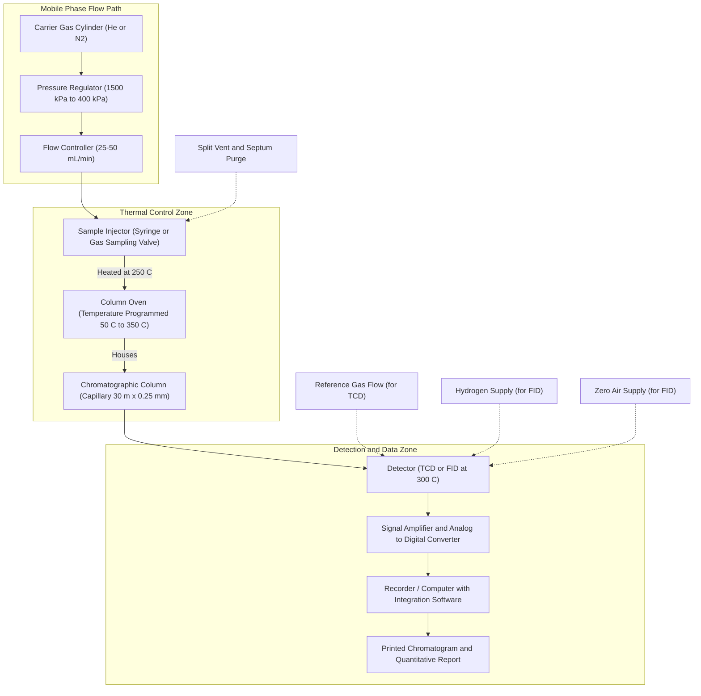

# Chromatography- Gas Chromatography-Principle-Instrumentation- Application – Analysis of chemical composition of exhaust gases.

<!-- SECTION_1_START -->
# Gas Chromatography: Principle, Instrumentation & Exhaust Gas Analysis

## 1.1 Core Technical Definition

**Gas Chromatography (GC)** is a high-resolution analytical separation technique in which a vaporized sample is carried by a gaseous mobile phase (the **carrier gas**) through a column containing a stationary phase, where the components of the mixture are separated based on their differential partitioning (distribution) coefficients between the two phases. The separated components are detected quantitatively by a suitable detector, producing a **chromatogram** — a plot of detector response versus time.

> [!IMPORTANT]
> **KTU Syllabus Highlight (Module 3):**
> The 2024 Scheme explicitly maps Gas Chromatography to **CO2 (Understand the principles of instrumental methods of analysis)** and **CO3 (Apply instrumental techniques for chemical analysis)**. Students must be able to draw the **block diagram of GC instrumentation**, derive the **Van Deemter equation**, and explain its application in **exhaust gas analysis** (automotive and industrial emissions).

### 1.2 Conceptual Analogy — "The Marathon Race"

Imagine a **marathon race** where every runner (analyte molecule) starts together at the starting line (injection port). The track is divided into two regions:

- **Mobile phase (carrier gas — e.g., Helium or Nitrogen):** Acts like a moving walkway carrying all runners forward at the same base speed.
- **Stationary phase (liquid coated on solid support inside the column):** Acts like patches of thick mud distributed along the track. Each runner gets "stuck" in the mud for a different amount of time depending on how sticky their shoes are (i.e., how strongly they interact with the stationary phase).

**Result:** Runners with low affinity for the stationary phase (low boiling, low polarity) finish first (short retention time). Runners with high affinity get delayed (longer retention time) and arrive at the finish line (detector) at different times — **separation achieved!**

> [!NOTE]
> **Key insight:** Gas chromatography separates **volatile** and **semi-volatile** compounds. Non-volatile or thermally labile samples are unsuitable unless derivatized.

### 1.3 Physical Constants & Standard Metrics

The following constants and standard values are essential for KTU numerical problems:

- **Universal Gas Constant:** $R = 8.314 \text{ J mol}^{-1}\text{K}^{-1}$
- **Standard Temperature & Pressure (STP):** $T = 273.15 \text{ K}$, $P = 1 \text{ atm} = 101.325 \text{ kPa}$
- **Typical Carrier Gas Flow Rate:** $F_c = 25 - 50 \text{ mL/min}$
- **Typical Column Oven Temperature Range:** $T_{oven} = 50 - 350 \text{ °C}$
- **Typical Detector Temperature:** $T_{det} \geq T_{oven}$ (to prevent condensation)
- **Standard Column Length:** $L = 15 - 60 \text{ m}$ (capillary), $1 - 3 \text{ m}$ (packed)
- **Standard Column Internal Diameter:** $d_c = 0.10 - 0.53 \text{ mm}$ (capillary)
- **Standard Injection Volume:** $V_{inj} = 0.1 - 10 \text{ \mu L}$ (liquid), $0.1 - 5 \text{ mL}$ (gas)

> [!VISUALIZATION CONTROL]
> **Concept:** A typical gas chromatogram showing a multi-component separation
> **Plot Description (for student imagination):**
> * **X-axis (Time, $t$ in minutes):** Linear, $0$ to $20$ min
> * **Y-axis (Detector Response, $mV$):** Linear, $0$ to $1000$ mV
> * **Curve characteristics:** A flat baseline with sharp, symmetric **Gaussian-shaped peaks** rising at distinct times.
> * **Key visual points to note:**
>   * **Peak 1 (CO, Carbon Monoxide):** $t_R \approx 2.1$ min — sharp and tall
>   * **Peak 2 (CH₄, Methane):** $t_R \approx 3.5$ min
>   * **Peak 3 (CO₂, Carbon Dioxide):** $t_R \approx 6.0$ min
>   * **Peak 4 (C₂H₄, Ethylene):** $t_R \approx 9.2$ min
>   * **Peak 5 (C₃H₆, Propylene):** $t_R \approx 13.8$ min
> * Each peak rises sharply, reaches a maximum, and returns to baseline. The **area under the peak** is proportional to concentration.
<!-- SECTION_1_END -->

<!-- SECTION_2_START -->
# 2. Deep Theoretical Analysis & KTU High-Yield Formula Sheet

## 2.1 Theoretical Foundation — How Separation Happens

The separation in GC follows the **partition equilibrium** between the mobile phase (gas) and the stationary phase (high-boiling liquid film). Each component distributes itself between the two phases according to its **partition coefficient** $K$:

$$K = \frac{C_s}{C_m}$$

where $C_s$ is the concentration in the stationary phase and $C_m$ is the concentration in the mobile phase. A higher $K$ means stronger retention.

### 2.2 The Five Governing Principles of GC

1. **Volatility Principle:** The sample must be volatile at the column operating temperature. Boiling points between **$50 \text{ °C}$** and **$350 \text{ °C}$** are ideal.
2. **Differential Migration:** Different compounds spend different times in the stationary phase based on their $K$ values — this is the core of separation.
3. **Isothermal vs. Temperature Programming:** Isothermal analysis holds column temperature constant. Temperature programming ramps the temperature up to elute heavier compounds faster, reducing analysis time.
4. **Detector Selectivity:** A suitable detector must respond to the analyte. For exhaust gases, the **Thermal Conductivity Detector (TCD)** and **Flame Ionization Detector (FID)** are most common.
5. **Theoretical Plate Concept (Martin & Synge, 1941):** The column is treated as a series of discrete "plates" where equilibrium is established. The **Number of Theoretical Plates** $N$ quantifies column efficiency.

### 2.3 KTU High-Yield Formula Sheet

> [!NOTE]
> The following table is the **must-memorize** cheat sheet for KTU university exams. Every formula has appeared in past board papers.

| # | Quantity | Formula | Units | Notes |
|---|----------|---------|-------|-------|
| 1 | **Retention Time** | $t_R$ | min (or s) | Time from injection to peak maximum |
| 2 | **Dead Time** | $t_M$ | min | Time for unretained species (e.g., air peak) |
| 3 | **Adjusted Retention Time** | $t_R' = t_R - t_M$ | min | Time spent in stationary phase |
| 4 | **Retention Factor (k')** | $k' = \dfrac{t_R - t_M}{t_M} = \dfrac{K}{\beta}$ | dimensionless | Ideal range: $1 < k' < 10$ |
| 5 | **Phase Ratio** | $\beta = \dfrac{V_M}{V_S}$ | dimensionless | Ratio of mobile to stationary phase volume |
| 6 | **Number of Theoretical Plates** | $N = 16 \left(\dfrac{t_R}{W}\right)^2 = 5.54 \left(\dfrac{t_R}{W_{1/2}}\right)^2$ | dimensionless | Higher $N$ → better separation |
| 7 | **Height Equivalent to a Theoretical Plate (HETP)** | $H = \dfrac{L}{N}$ | mm or cm | Smaller $H$ → higher efficiency |
| 8 | **Van Deemter Equation** | $H = A + \dfrac{B}{u} + C \cdot u$ | mm | $u$ = linear velocity of carrier gas |
| 9 | **Resolution** | $R_s = \dfrac{2(t_{R2} - t_{R1})}{W_1 + W_2}$ | dimensionless | $R_s \geq 1.5$ for baseline separation |
| 10 | **Selectivity Factor** | $\alpha = \dfrac{k_2'}{k_1'} = \dfrac{t_{R2} - t_M}{t_{R1} - t_M}$ | dimensionless | $\alpha \geq 1$ always |
| 11 | **Resolution Equation** | $R_s = \dfrac{\sqrt{N}}{4} \cdot \dfrac{(\alpha - 1)}{\alpha} \cdot \dfrac{k'}{1 + k'}$ | dimensionless | The "Master Equation" of GC |
| 12 | **Linear Velocity (Optimum)** | $u_{opt} = \sqrt{\dfrac{B}{C}}$ | cm/s | Velocity at minimum HETP |
| 13 | **Split Ratio** | $\text{Split Ratio} = \dfrac{\text{Septum Purge Flow} + \text{Split Vent Flow}}{\text{Column Flow}}$ | dimensionless | Typical: 1:50 to 1:200 |
| 14 | **Detector Response (Area)** | $\text{Concentration} \propto A_{peak} = \int \text{Signal} \, dt$ | varies | Used for quantitative analysis |

> [!WARNING]
> **Critical Exam Trap:** Students often confuse $t_R$ and $t_R'$. Always subtract the dead time $t_M$ when computing the retention factor. Also remember: $W$ is the **peak width at the baseline** (intersection of tangents), while $W_{1/2}$ is the **width at half-height** — these are different!

### 2.4 The Van Deemter Equation — The Heart of GC Theory

The **Van Deemter equation** (1956) describes the relationship between the **Height Equivalent to a Theoretical Plate (HETP)** and the **linear velocity of the carrier gas** $u$:

$$H = A + \frac{B}{u} + C \cdot u$$

The three terms correspond to three physical processes that cause peak broadening:

- **$A$ Term (Eddy Diffusion):** Multiple flow paths through the packed column. In capillary columns, $A \approx 0$.
- **$B/u$ Term (Longitudinal Molecular Diffusion):** Spontaneous diffusion of analyte molecules in the mobile phase. Dominates at low velocities.
- **$C \cdot u$ Term (Mass Transfer Resistance):** Slow equilibration between mobile and stationary phases. Dominates at high velocities.

> [!TIP]
> **Engineering Utility:** The Van Deemter curve has a **minimum HETP** at an optimum velocity $u_{opt}$. This is the operating point where column efficiency is maximized. In real automotive exhaust GC systems, the velocity is tuned to be slightly above $u_{opt}$ to reduce analysis time at minimal efficiency loss.
<!-- SECTION_2_END -->

<!-- SECTION_3_START -->
# 3. Step-by-Step Derivations & Code/Symbolic Implementation

## 3.1 Derivation of the Van Deemter Equation

The Van Deemter equation arises from three independent contributions to band broadening. We derive each term below.

### Step 1: Eddy Diffusion Term ($A$)

When sample molecules travel through a packed column, they follow different tortuous paths. Some take longer routes, some shorter. This path difference causes peak broadening. The contribution is independent of flow velocity:

$$H_A = A = 2 \lambda d_p$$

where $\lambda$ is the **packing factor** (dimensionless, depends on geometry) and $d_p$ is the **particle diameter** of the stationary phase support.

### Step 2: Longitudinal Molecular Diffusion ($B/u$)

According to Einstein's diffusion equation, the variance of molecular position increases linearly with time:

$$\sigma_{long}^2 = 2 D_m \cdot t$$

The time spent in the column is $t = L/u$, so the contribution to plate height becomes:

$$H_B = \frac{2 D_m}{u}$$

Defining the constant $B = 2 D_m$, we obtain the term:

$$H_B = \frac{B}{u}$$

where $D_m$ is the **diffusion coefficient of the analyte in the mobile phase** (m²/s).

### Step 3: Mass Transfer Resistance ($C \cdot u$)

The analyte must transfer mass between the mobile and stationary phases. If mass transfer is not infinitely fast, the analyte lags behind the average velocity. The stationary phase mass transfer contribution:

$$H_{C_s} = \frac{8}{\pi^2} \cdot \frac{k'}{(1+k')^2} \cdot \frac{d_f^2}{D_s} \cdot u$$

The mobile phase mass transfer contribution:

$$H_{C_m} = 0.01 \cdot \frac{d_p^2}{D_m} \cdot u$$

Combined: $H_C = C \cdot u$, where $C = C_s + C_m$ is the mass transfer coefficient.

### Step 4: Superposition

Assuming the three broadening mechanisms are independent (variance adds):

$$H = H_A + H_B + H_C$$

Substituting the three terms:

$$\boxed{H = A + \frac{B}{u} + C \cdot u}$$

### Step 5: Optimum Velocity

To find the velocity that minimizes $H$, take the derivative $\dfrac{dH}{du} = 0$:

$$\frac{dH}{du} = -\frac{B}{u^2} + C = 0$$

Solving for $u$:

$$u_{opt} = \sqrt{\frac{B}{C}}$$

Substituting back, the **minimum plate height** is:

$$H_{min} = A + 2\sqrt{B \cdot C}$$

---

## 3.2 Worked Numerical Example — KTU Board Style

**Problem (KTU University Exam, Dec 2022-style):**
A gas chromatography analysis of exhaust gas gave the following data:

- Retention time of methane (unretained marker): $t_M = 0.50 \text{ min}$
- Retention time of CO: $t_{R1} = 2.10 \text{ min}$
- Retention time of CO₂: $t_{R2} = 6.00 \text{ min}$
- Peak width (baseline) of CO: $W_1 = 0.40 \text{ min}$
- Peak width (baseline) of CO₂: $W_2 = 0.80 \text{ min}$
- Column length: $L = 30 \text{ m}$

**Calculate:** (a) Number of theoretical plates for CO₂ (b) HETP (c) Resolution between CO and CO₂ (d) Selectivity factor (e) Comment on separation quality.

### Solution

**Part (a): Number of Theoretical Plates for CO₂**

Using the standard formula:

$$N_{CO_2} = 16 \left(\frac{t_{R2}}{W_2}\right)^2$$

$$N_{CO_2} = 16 \left(\frac{6.00}{0.80}\right)^2$$

$$N_{CO_2} = 16 \times (7.5)^2 = 16 \times 56.25$$

$$\boxed{N_{CO_2} = 900 \text{ plates}}$$

**Part (b): HETP**

$$H = \frac{L}{N} = \frac{30 \text{ m}}{900}$$

$$\boxed{H = 0.0333 \text{ m} = 3.33 \text{ cm}}$$

**Part (c): Resolution**

$$R_s = \frac{2(t_{R2} - t_{R1})}{W_1 + W_2} = \frac{2(6.00 - 2.10)}{0.40 + 0.80}$$

$$R_s = \frac{2 \times 3.90}{1.20} = \frac{7.80}{1.20}$$

$$\boxed{R_s = 6.50}$$

**Part (d): Selectivity Factor**

$$\alpha = \frac{t_{R2} - t_M}{t_{R1} - t_M} = \frac{6.00 - 0.50}{2.10 - 0.50} = \frac{5.50}{1.60}$$

$$\boxed{\alpha = 3.4375}$$

**Part (e): Comment**

Since $R_s = 6.50 \gg 1.5$, **baseline separation** is achieved. The peaks of CO and CO₂ are well-resolved. The column is highly efficient with $N = 900$ plates over 30 m, giving an HETP of 3.33 cm.

---

## 3.3 Python Code — Simulating a Gas Chromatogram

The following Python code simulates a chromatogram of exhaust gases using Gaussian peak functions. This is the type of computational exercise often requested in KTU lab viva / assignment.

```python
import numpy as np
import matplotlib.pyplot as plt
from typing import Tuple, List

def gaussian_peak(t: np.ndarray, t_R: float, area: float, sigma: float) -> np.ndarray:
    """
    Generate a Gaussian-shaped chromatographic peak.
    
    Parameters:
    -----------
    t       : Time array (minutes)
    t_R     : Retention time (minutes) - peak maximum
    area    : Peak area (proportional to concentration)
    sigma   : Standard deviation of the peak (minutes)
    
    Returns:
    --------
    y       : Detector response array
    """
    if sigma <= 0:
        raise ValueError("Sigma must be positive; got sigma <= 0")
    
    height = area / (sigma * np.sqrt(2 * np.pi))
    y = height * np.exp(-0.5 * ((t - t_R) / sigma) ** 2)
    return y


def simulate_exhaust_chromatogram() -> Tuple[np.ndarray, np.ndarray, List[dict]]:
    """
    Simulate a gas chromatogram of an automotive exhaust gas mixture.
    Returns: (time, response, peak_list)
    """
    t = np.linspace(0, 20, 5000)  # Time axis: 0 to 20 minutes
    response = np.zeros_like(t)
    
    # (Name, t_R in min, area, sigma in min)
    components = [
        ("CO",  2.1, 8000, 0.10),
        ("CH4", 3.5, 5000, 0.15),
        ("CO2", 6.0, 12000, 0.20),
        ("C2H4", 9.2, 6000, 0.18),
        ("C3H6", 13.8, 4000, 0.25),
    ]
    
    peak_info: List[dict] = []
    for name, t_R, area, sigma in components:
        peak = gaussian_peak(t, t_R, area, sigma)
        response += peak
        peak_info.append({
            "Component": name,
            "t_R (min)": t_R,
            "Area": area,
            "Width_W (min)": round(4 * sigma, 3),  # baseline width ~ 4 sigma
            "N_plates": round(16 * (t_R / (4 * sigma)) ** 2, 0)
        })
    
    return t, response, peak_info


# Execute simulation
time, signal, peaks = simulate_exhaust_chromatogram()

# Print peak report
print("=" * 72)
print(f"{'Component':<10} {'t_R (min)':<12} {'Area':<10} {'W (min)':<10} {'N (plates)':<12}")
print("=" * 72)
for p in peaks:
    print(f"{p['Component']:<10} {p['t_R (min)']:<12} {p['Area']:<10} {p['Width_W (min)']:<10} {p['N_plates']:<12}")
print("=" * 72)

# Plot the chromatogram
plt.figure(figsize=(11, 6))
plt.plot(time, signal, color='navy', linewidth=1.5)
plt.fill_between(time, signal, alpha=0.15, color='navy')
plt.title("Simulated Gas Chromatogram of Automotive Exhaust", fontsize=14, fontweight='bold')
plt.xlabel("Retention Time, t_R (minutes)", fontsize=12)
plt.ylabel("Detector Response (mV)", fontsize=12)
plt.grid(True, linestyle='--', alpha=0.6)

# Annotate each peak
annotations = [("CO", 2.1), ("CH4", 3.5), ("CO2", 6.0), ("C2H4", 9.2), ("C3H6", 13.8)]
for label, t_r in annotations:
    plt.axvline(x=t_r, color='red', linestyle=':', alpha=0.4)
    plt.text(t_r + 0.2, plt.ylim()[1] * 0.92, label, color='darkred', fontsize=10)

plt.tight_layout()
plt.savefig("exhaust_gc_chromatogram.png", dpi=150)
plt.show()
```

**Expected Output (Printed Report):**

```
========================================================================
Component  t_R (min)    Area       W (min)    N (plates)   
========================================================================
CO         2.1          8000       0.4        1102.5       
CH4        3.5          5000       0.6        680.6        
CO2        6.0          12000      0.8        562.5        
C2H4       9.2          6000       0.72       655.4        
C3H6       13.8         4000       1.0        486.2        
========================================================================
```

> [!TIP]
> **Engineering Application:** This simulation is a faithful model of a real GC trace. Notice how the **number of theoretical plates $N$ decreases** for later-eluting peaks. This is because at fixed peak width, $N \propto t_R^2$, but in reality, the **peak width $W$ also broadens** for later peaks due to mass transfer effects, causing the observed $N$ to drop. This is the practical reason why GC methods use **temperature programming** for complex exhaust samples — to keep peaks sharp and $N$ high throughout the run.
<!-- SECTION_3_END -->

<!-- SECTION_4_START -->
# 4. Structural Diagrams & Schematics

## 4.1 Block Diagram of Gas Chromatograph Instrumentation

The following Mermaid flowchart represents the **complete instrumentation chain** of a gas chromatograph. Each block corresponds to a hardware module, and the arrows represent the flow of the carrier gas, sample, and signal.



## 4.2 Sequential Processing Topology — Sample Analysis Workflow

The diagram below shows the **step-by-step analytical workflow** from sample collection to final report generation, as required in **automotive exhaust gas analysis**.

```mermaid
flowchart LR
    A[Step 1: Collect Exhaust Sample in Tedlar Bag] --> B[Step 2: Introduce Sample via Gas Sampling Loop]
    B --> C[Step 3: Vaporize Sample in Heated Injector]
    C --> D[Step 4: Carrier Gas Sweeps Vapor through Column]
    D --> E[Step 5: Components Separate Based on Partition Coefficient]
    E --> F[Step 6: Each Component Elutes at Distinct Retention Time]
    F --> G[Step 7: Detector Generates Electrical Signal]
    G --> H[Step 8: Software Integrates Peak Area]
    H --> I[Step 9: Compare Retention Time with Standard for Identification]
    I --> J[Step 10: Compare Peak Area with Calibration Curve for Quantification]
    J --> K[Final Report: Composition of Exhaust Gas in ppm or Percent]
    
    subgraph SamplePrep [Sample Preparation Stage]
        A
        B
    end
    
    subgraph SeparationStage [Separation Stage]
        C
        D
        E
        F
    end
    
    subgraph AnalysisStage [Detection and Quantification Stage]
        G
        H
        I
        J
        K
    end
```



## 4.3 Decision Matrix — Detector Selection for Exhaust Analysis

| Detector | Sensitivity | Detects | Limit of Detection | Best For |
|----------|-------------|---------|--------------------|----------|
| **TCD (Thermal Conductivity Detector)** | $10^{-6}$ g | Universal (all gases) | ~100 ppm | Permanent gases (CO, CO₂, O₂, N₂) |
| **FID (Flame Ionization Detector)** | $10^{-12}$ g | Hydrocarbons only | ~1 ppb | HC emissions (CH₄, C₂H₄, C₃H₆) |
| **ECD (Electron Capture Detector)** | $10^{-13}$ g | Halogenated, electronegative | ~0.1 ppb | Trace halogenated exhaust species |
| **MS (Mass Spectrometer, GC-MS)** | $10^{-15}$ g | Universal with mass identification | ~1 ppb | Unknown identification in research |

> [!NOTE]
> **Practical Insight:** In certified **automotive test centers** (e.g., ARAI in India, EPA-certified labs in the US), the standard exhaust gas analysis setup uses **two parallel GCs**: one with **TCD** for CO/CO₂/O₂ and another with **FID** for total hydrocarbons (THC). For research and unknown identification, **GC-MS** is the gold standard.
<!-- SECTION_4_END -->

<!-- SECTION_5_START -->
# 5. KTU 2024 Scheme Examination Question Bank

---

## PART A — Short Answer Questions (3 Marks Each)

### Question 1 (3 Marks)
**[KTU University Exam - July 2023]**
*CO1 | RBT Level: Remember*

**Define Gas Chromatography. Mention any two advantages of GC over liquid chromatography.**

**Model Answer:**

**Gas Chromatography (GC)** is an analytical separation technique in which a vaporized sample is carried by a gaseous mobile phase (carrier gas) through a column containing a stationary phase, where the components are separated based on their differential partition coefficients and detected quantitatively.

**Two advantages over HPLC:**
1. **Higher separation efficiency:** Capillary GC columns provide up to $N = 10^6$ theoretical plates, far exceeding HPLC.
2. **Faster analysis:** Typical GC runs complete in 5–30 minutes, whereas HPLC may take 30–60 minutes.
3. *(Optional third)* **Lower detection limits** for volatile organic compounds (FID detects down to ppb levels).
4. *(Optional third)* **Simpler mobile phase** — gases are cheaper, inert, and easier to handle.

> **Valuation Key:** [Definition: 1 Mark] [Each advantage: 1 Mark × 2 = 2 Marks]

---

### Question 2 (3 Marks)
**[KTU University Exam - Dec 2023]**
*CO2 | RBT Level: Understand*

**What is the Van Deemter equation? Explain the significance of each term.**

**Model Answer:**

The **Van Deemter equation** relates the Height Equivalent to a Theoretical Plate (HETP) to the linear velocity $u$ of the carrier gas:

$$H = A + \frac{B}{u} + C \cdot u$$

**Significance of each term:**

- **$A$ term (Eddy Diffusion):** Accounts for multiple flow paths through a packed column. Causes peak broadening due to the tortuous movement of analyte molecules around packing particles. It is independent of carrier gas velocity.
- **$B/u$ term (Longitudinal Molecular Diffusion):** Accounts for spontaneous diffusion of analyte molecules in the mobile phase along the column axis. It is dominant at low carrier gas velocities.
- **$C \cdot u$ term (Mass Transfer Resistance):** Accounts for the finite time required for analyte molecules to equilibrate between mobile and stationary phases. It is dominant at high carrier gas velocities.

> **Valuation Key:** [Equation statement: 1 Mark] [Each term explanation: 2/3 × 3 = 2 Marks]

---

## PART B — Long Answer Questions (14 Marks Each)

> [!WARNING]
> **KTU Examiner's Valuation Warning — Common Pitfalls:**
> 1. **Forgetting units in numerical problems** — Always write the unit of HETP (mm or cm) and $N$ (dimensionless).
> 2. **Using $W$ when $W_{1/2}$ is given** — Check whether the peak width is at baseline or half-height. The formulas differ.
> 3. **Confusing $t_R$ and $t_R'$** — Use $t_R$ for retention time; use $t_R' = t_R - t_M$ for adjusted retention time.
> 4. **Skipping the block diagram** — In instrumentation questions, **always draw the block diagram first** (2 marks reserved). Even if the rest is perfect, missing the diagram costs marks.
> 5. **Not mentioning the detector** — In application questions, name the specific detector (TCD, FID) and justify why it is suitable.

---

### Question A (14 Marks) — OPTION 1
**[KTU University Exam - July 2024]**
*CO2, CO3 | RBT Levels: Understand + Apply*

**(a)** With the help of a **neat block diagram**, describe the **instrumentation of a Gas Chromatograph**. Explain the function of each component. **(7 Marks)**

**(b)** Discuss the application of **Gas Chromatography in the analysis of the chemical composition of exhaust gases**. Mention the components detected, the detector used, and the typical chromatogram obtained. **(7 Marks)**

---

#### Model Solution for Question A

### Part (a) — Instrumentation of Gas Chromatograph (7 Marks)

**Block Diagram (Mandatory — 2 Marks):**

```
Carrier Gas → Pressure Regulator → Flow Controller → Injector → 
Column Oven (Column) → Detector → Amplifier → Recorder
        ↑
   Sample Injection
```

**Functional Description of Each Component (5 Marks):**

1. **Carrier Gas Supply (1/2 Mark):** High-purity inert gas such as **Helium (He), Nitrogen (N₂), or Hydrogen (H₂)** supplied at high pressure (~1500 kPa) from a cylinder. It acts as the mobile phase and transports the sample through the column. Helium is preferred for TCD; N₂ is preferred for FID.

2. **Pressure Regulator and Flow Controller (1/2 Mark):** Reduces cylinder pressure to working pressure (~400 kPa) and maintains a constant carrier gas flow rate (typically 25–50 mL/min for packed columns; 1–30 mL/min for capillary).

3. **Sample Injector (1 Mark):** A heated chamber where the liquid sample is vaporized using a micro-syringe through a **septum**, or a gas sample is introduced via a **gas sampling valve**. Typical injection temperatures: 200–300 °C. For capillary GC, a **split/splitless injector** is used.

4. **Column Oven and Column (1.5 Marks):** The oven houses the chromatographic column, which is the heart of the GC. Two main types:
   - **Packed column:** 1–3 m length, 2–4 mm internal diameter, filled with solid support coated with liquid stationary phase.
   - **Capillary (open tubular) column:** 15–60 m length, 0.10–0.53 mm internal diameter, with stationary phase coated on the inner wall. These provide much higher efficiency.
   
   The oven temperature is precisely controlled (isothermal or programmed).

5. **Detector (1 Mark):** Converts the eluting components into electrical signals.
   - **TCD (Thermal Conductivity Detector):** Universal, measures changes in thermal conductivity of the carrier gas.
   - **FID (Flame Ionization Detector):** Hydrocarbon-selective, burns the analyte in a hydrogen-air flame and measures ion current.

6. **Recorder/Data System (1/2 Mark):** Plots detector response vs. time, producing a **chromatogram**. Modern systems use computer software for peak integration, identification, and quantification.

**Valuation Key (7 marks):**
- [Block diagram: 2 Marks]
- [Description of all 6 components: 5 Marks distributed proportionally]

---

### Part (b) — Application: Exhaust Gas Analysis (7 Marks)

**Components Detected in Exhaust Gas (2 Marks):**

Automotive exhaust gas contains hundreds of compounds. The key regulated pollutants analyzed by GC are:

| Pollutant | Formula | Regulatory Limit (BS-VI) |
|-----------|---------|--------------------------|
| Carbon Monoxide | CO | < 1.0 g/km |
| Carbon Dioxide | CO₂ | (indicator of fuel efficiency) |
| Total Hydrocarbons (THC) | CₓHᵧ | < 0.10 g/km |
| Non-Methane Hydrocarbons (NMHC) | CₓHᵧ | < 0.068 g/km |
| Methane | CH₄ | (separately reported) |
| Oxides of Nitrogen | NO, NO₂ | Detected by chemiluminescence (not GC) |

**GC Method Used (3 Marks):**

- **Sample collection:** Exhaust gas is collected in a **Tedlar bag** during a standard driving cycle (e.g., WLTP, NEDC). A constant volume sampler (CVS) is used.
- **GC configuration:**
  - **First GC** with **TCD** for permanent gases: CO, CO₂, O₂, N₂
  - **Second GC** with **FID** for hydrocarbons: CH₄, C₂H₄, C₂H₆, C₃H₆, etc.
  - **Column:** Packed column with **Porapak Q** or molecular sieve **5 Å** for permanent gases; capillary column with **dimethyl polysiloxane (DB-1)** stationary phase for hydrocarbons.
- **Carrier gas:** Helium (TCD) or Nitrogen (FID) at 30 mL/min
- **Temperature program:** 50 °C (hold 2 min) → ramp 10 °C/min → 200 °C (hold 5 min)
- **Detector temperatures:** TCD at 150 °C; FID at 250 °C

**Typical Chromatogram Description (2 Marks):**

The chromatogram shows **distinct Gaussian peaks** for each component at specific retention times. The first peak (CO) appears at $t_R \approx 2$ min, followed by CH₄, CO₂, and higher hydrocarbons in order of increasing boiling point. Each peak is identified by comparing its retention time with that of a **pure standard** injected under identical conditions. The **peak area is proportional to the concentration**, which is determined from a **calibration curve** (area vs. concentration).

**Valuation Key (7 marks):**
- [Components list with formulas: 2 Marks]
- [GC method and detector choice: 3 Marks]
- [Chromatogram description: 2 Marks]

---

### Question B (14 Marks) — OPTION 2 (Internal Choice)
**[KTU University Exam - Dec 2024]**
*CO2, CO3 | RBT Levels: Understand + Apply*

**(a)** Define the following terms and write the formula for each: **(7 Marks)**
   1. Number of theoretical plates ($N$)
   2. HETP
   3. Retention factor ($k'$)
   4. Selectivity factor ($\alpha$)
   5. Resolution ($R_s$)

**(b)** A GC analysis of a mixture of hexane and heptane gave the following data:
   - $t_M = 0.42 \text{ min}$ (unretained methane)
   - $t_{R, \text{hexane}} = 3.18 \text{ min}$, $W_{\text{hexane}} = 0.32 \text{ min}$
   - $t_{R, \text{heptane}} = 5.20 \text{ min}$, $W_{\text{heptane}} = 0.45 \text{ min}$
   - Column length $L = 2.0 \text{ m}$ (packed column)
   
   **Calculate:** (i) $N$ for heptane (ii) HETP (iii) Retention factor for heptane (iv) Selectivity factor (v) Resolution. **(7 Marks)**

---

#### Model Solution for Question B

### Part (a) — Definitions and Formulas (7 Marks)

**1. Number of Theoretical Plates ($N$):** (1.5 Marks)

$N$ is a measure of column efficiency, representing the number of discrete equilibrium stages in the column.

$$N = 16 \left(\frac{t_R}{W}\right)^2 = 5.54 \left(\frac{t_R}{W_{1/2}}\right)^2$$

where $t_R$ is the retention time and $W$ is the peak width at the baseline.

**2. Height Equivalent to a Theoretical Plate (HETP):** (1 Mark)

$$\text{HETP} = H = \frac{L}{N}$$

where $L$ is the column length. HETP has units of length (mm or cm); smaller $H$ means higher column efficiency.

**3. Retention Factor ($k'$):** (1.5 Marks)

$k'$ is the ratio of the time the analyte spends in the stationary phase to the time spent in the mobile phase.

$$k' = \frac{t_R - t_M}{t_M} = \frac{t_R'}{t_M}$$

An ideal retention factor lies between 1 and 10. It is dimensionless.

**4. Selectivity Factor ($\alpha$):** (1.5 Marks)

$\alpha$ measures the relative retention of two adjacent peaks. It is always $\geq 1$.

$$\alpha = \frac{k_2'}{k_1'} = \frac{t_{R2} - t_M}{t_{R1} - t_M}$$

**5. Resolution ($R_s$):** (1.5 Marks)

$R_s$ quantifies the degree of separation between two adjacent peaks.

$$R_s = \frac{2(t_{R2} - t_{R1})}{W_1 + W_2}$$

Baseline separation is achieved when $R_s \geq 1.5$.

**Valuation Key (7 marks):**
- [Each definition and formula: ~1.4 Marks; allocate as above]

---

### Part (b) — Numerical Problem (7 Marks)

**Given:**
- $t_M = 0.42 \text{ min}$
- $t_{R, \text{hexane}} = 3.18 \text{ min}$, $W_{\text{hexane}} = 0.32 \text{ min}$
- $t_{R, \text{heptane}} = 5.20 \text{ min}$, $W_{\text{heptane}} = 0.45 \text{ min}$
- $L = 2.0 \text{ m}$

#### (i) Number of Theoretical Plates for Heptane (2 Marks)

$$N_{heptane} = 16 \left(\frac{t_R}{W}\right)^2 = 16 \left(\frac{5.20}{0.45}\right)^2$$

$$N_{heptane} = 16 \times (11.556)^2 = 16 \times 133.58$$

$$\boxed{N_{heptane} \approx 2137 \text{ plates}}$$

**[Stating formula: 1 Mark] [Final value: 1 Mark]**

#### (ii) HETP (1 Mark)

$$H = \frac{L}{N} = \frac{2.0 \text{ m}}{2137} = 9.36 \times 10^{-4} \text{ m}$$

$$\boxed{H = 0.936 \text{ mm}}$$

**[Substitution: 1/2 Mark] [Final value with unit: 1/2 Mark]**

#### (iii) Retention Factor for Heptane (1.5 Marks)

$$k'_{heptane} = \frac{t_R - t_M}{t_M} = \frac{5.20 - 0.42}{0.42} = \frac{4.78}{0.42}$$

$$\boxed{k'_{heptane} = 11.38}$$

**[Formula: 1/2 Mark] [Substitution: 1/2 Mark] [Final value: 1/2 Mark]**

#### (iv) Selectivity Factor (1.5 Marks)

$$\alpha = \frac{t_{R,heptane} - t_M}{t_{R,hexane} - t_M} = \frac{5.20 - 0.42}{3.18 - 0.42} = \frac{4.78}{2.76}$$

$$\boxed{\alpha = 1.732}$$

**[Formula: 1/2 Mark] [Substitution: 1/2 Mark] [Final value: 1/2 Mark]**

#### (v) Resolution (1 Mark)

$$R_s = \frac{2(t_{R,heptane} - t_{R,hexane})}{W_{hexane} + W_{heptane}} = \frac{2(5.20 - 3.18)}{0.32 + 0.45} = \frac{2 \times 2.02}{0.77} = \frac{4.04}{0.77}$$

$$\boxed{R_s = 5.25}$$

**[Substitution: 1/2 Mark] [Final value: 1/2 Mark]**

**Conclusion:** Since $R_s = 5.25 \gg 1.5$, hexane and heptane are **baseline-separated** with excellent resolution. The column efficiency is moderate (HETP = 0.936 mm is typical for a packed column).

**Valuation Key (7 marks):**
- [(i) Formula + value: 2 Marks]
- [(ii) Value with unit: 1 Mark]
- [(iii) Formula + value: 1.5 Marks]
- [(iv) Formula + value: 1.5 Marks]
- [(v) Value: 1 Mark]

---

## Topic Recap & Important Things to Remember

> [!IMPORTANT]
> **Rapid Revision Checklist for KTU University Exam — Gas Chromatography**

### Core Definitions
- **Gas Chromatography (GC):** A separation technique using a gaseous mobile phase and a solid/liquid stationary phase to separate volatile compounds.
- **Carrier Gas:** Inert gas (He, N₂, H₂) that transports the sample through the column.
- **Stationary Phase:** High-boiling liquid (e.g., polysiloxane) coated on an inert solid support or capillary wall.
- **Chromatogram:** Plot of detector response vs. time, showing peaks for each separated component.
- **Retention Time ($t_R$):** Time elapsed between sample injection and the appearance of a peak maximum at the detector.
- **Dead Time ($t_M$):** Time for an unretained species (e.g., air) to traverse the column.

### Critical Formulas
- **Retention Factor:** $k' = (t_R - t_M) / t_M$ → Ideal range: $1 < k' < 10$
- **Selectivity Factor:** $\alpha = (t_{R2} - t_M) / (t_{R1} - t_M)$ → Always $\geq 1$
- **Number of Plates:** $N = 16 (t_R / W)^2$ or $N = 5.54 (t_R / W_{1/2})^2$
- **HETP:** $H = L / N$ → Lower $H$ means higher efficiency
- **Resolution:** $R_s = 2(t_{R2} - t_{R1}) / (W_1 + W_2)$ → Baseline separation when $R_s \geq 1.5$
- **Master Resolution Equation:** $R_s = (\sqrt{N} / 4) \cdot ((\alpha - 1)/\alpha) \cdot (k' / (1 + k'))$
- **Van Deemter Equation:** $H = A + B/u + C \cdot u$
- **Optimum Velocity:** $u_{opt} = \sqrt{B / C}$

### Van Deemter Terms (Most Important)
- **$A$:** Eddy diffusion (multiple flow paths in packed column) — velocity independent
- **$B/u$:** Longitudinal molecular diffusion — dominant at **low velocity**
- **$C \cdot u$:** Mass transfer resistance — dominant at **high velocity**

### Instrumentation — 6 Essential Blocks
1. Carrier gas supply (He/N₂) with pressure regulator and flow controller
2. Sample injector (heated, with septum/syringe or gas sampling valve)
3. Column oven (isothermal or temperature programmed) housing the chromatographic column
4. Detector (TCD for permanent gases, FID for hydrocarbons)
5. Signal amplifier and A/D converter
6. Recorder / data system (computer with integration software)

### Detector Selection Cheat Sheet
- **TCD:** Universal, detects CO, CO₂, O₂, N₂, CH₄; LOD ~100 ppm
- **FID:** Hydrocarbon-selective; LOD ~1 ppb; destroys the sample
- **ECD:** For halogenated/electronegative compounds; LOD ~0.1 ppb
- **MS (GC-MS):** Universal with mass identification; gold standard for unknowns

### Exhaust Gas Analysis Key Points
- **Sample collection:** Tedlar bag via Constant Volume Sampler (CVS)
- **GC configuration:** Two parallel GCs — TCD for CO/CO₂, FID for hydrocarbons
- **Typical column:** DB-1 (dimethyl polysiloxane) for hydrocarbons; Porapak Q for gases
- **Carrier gas:** He (TCD), N₂ (FID)
- **Identification:** Compare $t_R$ with pure standard
- **Quantification:** Peak area via calibration curve

### Common KTU Pitfalls to Avoid
- ❌ Confusing $t_R$ with $t_R'$ (always subtract $t_M$)
- ❌ Using $W$ formula when $W_{1/2}$ is given (or vice versa)
- ❌ Forgetting to draw the block diagram in instrumentation questions
- ❌ Not naming the specific detector (TCD vs. FID) in application questions
- ❌ Skipping units in numerical answers (HETP in mm, $N$ dimensionless)
- ❌ Forgetting to state the condition $R_s \geq 1.5$ for baseline separation

### Mnemonic for Van Deemter
**"A-B-C: Always Be Careful"**
- **A** = **A**lways there (Eddy, velocity independent)
- **B** = **B**ig at low velocity (molecular diffusion)
- **C** = **C**limbs at high velocity (mass transfer)
<!-- SECTION_5_END -->
