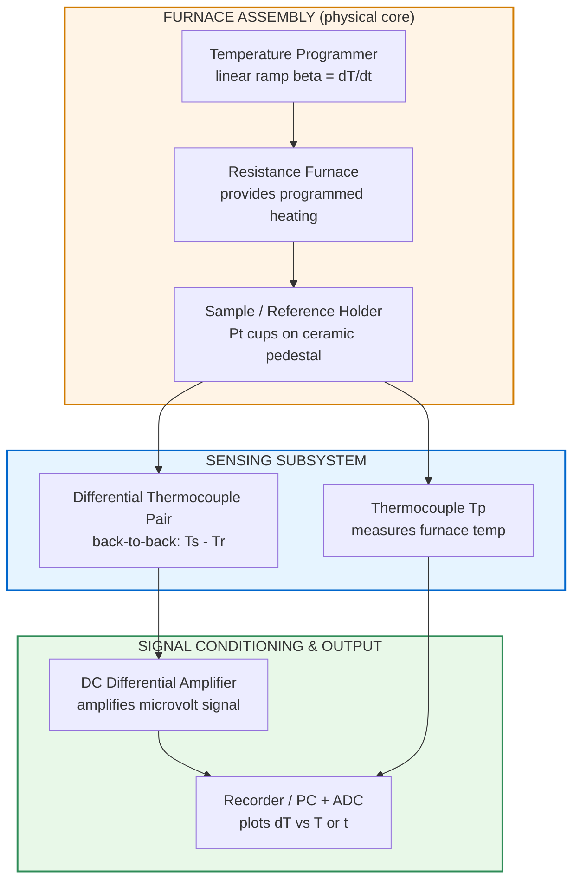
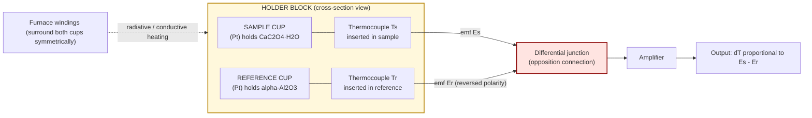
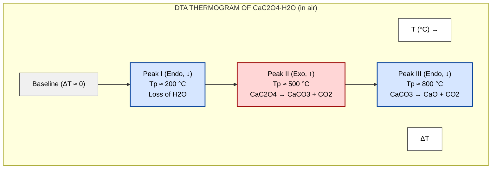

# DTA-Principle, instrumentation (block diagram) and applications - DTA of CaC 2O4.H2O.

<!-- SECTION_1_START -->
# 1. Core Technical Definition & Intuitive Overview

## Differential Thermal Analysis (DTA) — Formal Definition

**Differential Thermal Analysis (DTA)** is an instrumental thermo-analytical technique in which the **temperature difference (ΔT)** between a *substance under investigation* (sample) and an *inert reference material* is recorded as a function of the furnace temperature (or time), while both are subjected to an identical, controlled temperature programme.

$$\Delta T = T_{\text{sample}} - T_{\text{reference}}$$

The reference material is a thermally inert substance (commonly **calcined Al₂O₃** or **MgO**) that undergoes no phase change, decomposition, or reaction in the temperature range of interest. Any deviation of ΔT from the baseline (ΔT ≈ 0) signals a **thermal event** in the sample — either an *endothermic* (heat absorbing) or *exothermic* (heat liberating) process.

> [!IMPORTANT]
> **KTU Syllabus Highlight (GCCYT122 – Module 3):**
> Students must be able to (a) state the principle of DTA, (b) draw and label the block diagram of the instrument, and (c) interpret the DTA curve of **CaC₂O₄·H₂O**, identifying each peak with the corresponding chemical reaction.

## Conceptual Analogy — "The Two Friends on a Hike" ⛰️

Imagine two hikers, **Sita (sample)** and **Geetha (reference)**, walking together up a sun-heated mountain at the *same programmed rate*:

- While both walk at the same **overall speed** (identical furnace heating rate), Sita occasionally stops to *drink water* (endothermic — absorbs heat without rising in temperature) or *does push-ups* (exothermic — releases heat, temperature momentarily rises above the programme).
- Geetha, being idle and inert, simply tracks the planned path steadily.
- A thermometer difference (Sita's temperature − Geetha's temperature) is plotted against elapsed time (or programmed temperature).

| Sita's Action | Chemistry Equivalent | ΔT Sign |
|---|---|---|
| Drinks water (cools down briefly) | Melting, dehydration, decomposition | **ΔT < 0** (Endothermic, downward peak) |
| Does push-ups (warms up briefly) | Oxidation, crystallisation, combustion | **ΔT > 0** (Exothermic, upward peak) |

## Key Physical Constants / Metrics (Bolded)

- **Standard reference material:** Calcined **α-Al₂O₃** (alumina) — inert up to ~**1500 °C**.
- **Typical sample mass:** **5–25 mg** (for micro-DTA).
- **Heating rate (β):** **5–20 °C min⁻¹** (commonly 10 °C min⁻¹).
- **Atmosphere:** Static air, dynamic N₂, or dynamic O₂ — chosen by the analyst.
- **Thermocouple type:** **Chromel–Alumel (K-type)** or **Pt–Pt/Rh (R/S-type)** for high temperatures.
- **Output y-axis:** ΔT in **μV** (raw) or **°C** (calibrated); x-axis: **T (°C)** or **time (s)**.

> [!NOTE]
> **Difference between DTA and DSC:** DTA records the *temperature difference* (qualitative/semi-quantitative), whereas Differential Scanning Calorimetry (DSC) records the *heat flow* (quantitative, in mW or J g⁻¹). The DTA peak **area** is *proportional* (not equal) to the enthalpy change.

> [!VISUALIZATION CONTROL]
> **Concept:** Idealised DTA thermogram — baseline with endothermic and exothermic peaks
> **Plotting Descriptors (mental image for the student):**
> * x-axis: Furnace temperature $T$ (°C), increasing linearly from left → right
> * y-axis: $\Delta T = T_s - T_r$ (°C or μV); baseline at $\Delta T = 0$
> * **Downward (negative) deflection** = endothermic peak (e.g., melting)
> * **Upward (positive) deflection** = exothermic peak (e.g., crystallisation)
> * Peak onset, peak maximum ($T_p$), and peak return to baseline define the event.
<!-- SECTION_1_END -->

<!-- SECTION_2_START -->
# 2. Deep Theoretical Analysis & KTU High-Yield Formula Sheet

## 2.1 Theoretical Foundation of DTA

When the furnace temperature $T_p$ is raised at a linear rate $\beta = dT_p/dt$, *Newton's law of heating* applies to both sample and reference. For a small sample whose thermal behaviour is dominated by enthalpy changes:

$$\frac{dQ_s}{dt} = m_s \, C_{p,s} \, \frac{dT_s}{dt}$$

$$\frac{dQ_r}{dt} = m_r \, C_{p,r} \, \frac{dT_r}{dt}$$

The differential signal observed is:

$$\Delta T = T_s - T_r \;\;\propto\;\; \frac{1}{g}\,\left(\frac{dH}{dt}\right)$$

where $g$ is a geometry/heat-transfer constant and $(dH/dt)$ is the rate of enthalpy change in the sample. This proportionality is what makes the **peak area a measure of the energy involved** in the transition.

### Stepwise Logic Behind a DTA Peak

1. **Before the event:** Sample and reference both follow the programme. Heat capacities are matched so $T_s \approx T_r$ → flat baseline.
2. **Onset of event:** The sample begins to absorb (or evolve) heat. Its temperature **lags behind** (endothermic) or **overshoots** (exothermic) the reference.
3. **Peak maximum ($T_p$):** Rate of enthalpy change is maximum; the *temperature difference* ΔT reaches extremum.
4. **Peak return:** Reaction completes; sample re-enters thermal equilibrium with the furnace; ΔT returns to baseline.
5. **Post-event:** If the product has a different $C_p$, the baseline may *shift* slightly (this is a key diagnostic feature).

## 2.2 Instrumentation — Functional Block Description

A DTA apparatus consists of **six functional modules** arranged in series. Each module performs a specific task in the signal chain.

| # | Module | Function | Typical Component |
|---|---|---|---|
| 1 | **Sample holder assembly** | Holds sample + reference symmetrically in identical thermal environments | Platinum cups on ceramic pedestals |
| 2 | **Furnace with temperature programmer** | Provides controlled, linear heating (or cooling) | Resistance furnace + PID controller |
| 3 | **Temperature sensor (furnace $T_p$)** | Monitors programmed temperature | Thermocouple (Pt/Pt-Rh) |
| 4 | **Differential sensor (ΔT)** | Detects temperature difference between sample & reference | Two identical thermocouples in opposition |
| 5 | **Amplifier** | Boosts weak μV-level signals to readable range | DC differential amplifier |
| 6 | **Recorder / Data acquisition** | Plots ΔT vs. T or t, stores digital data | Strip-chart recorder / PC + ADC |

## 2.3 KTU Formula Sheet / Cheat Sheet

| # | Formula / Relation | Meaning | Typical Units |
|---|---|---|---|
| 1 | $\Delta T = T_s - T_r$ | Differential signal | °C or μV |
| 2 | $T_p = T_0 + \beta \cdot t$ | Furnace programme (linear heating) | °C, min |
| 3 | $A_{\text{peak}} = K \cdot \Delta H$ | Peak area ∝ enthalpy change (K = calibration constant) | J g⁻¹ (after calibration) |
| 4 | $T_{\text{onset}}$ | Temperature where peak first deviates from baseline | °C |
| 5 | $T_{\text{peak}}$ | Temperature of maximum $\vert \Delta T \vert$ | °C |
| 6 | $T_{\text{final}}$ | Temperature where peak returns to baseline | °C |
| 7 | $R = \frac{T_{\text{onset}} - T_{\text{peak}}}{T_{\text{peak}} - T_{\text{final}}}$ | Peak symmetry ratio (diagnostic of kinetics) | Dimensionless |
| 8 | $E_a \approx 2.19\,R\,T_p$ | Approx. activation energy from peak position (Kissinger-like) | J mol⁻¹ |
| 9 | $m = \frac{\Delta H}{\Delta H_{\text{std}}} \times m_{\text{std}}$ | Quantitative analysis by peak area | mg |

> [!IMPORTANT]
> **R = 8.314 J mol⁻¹ K⁻¹** (Universal gas constant — required for any thermodynamic calculation in DTA).

## 2.4 Real-World Utility of DTA

- **Pharmaceuticals:** Purity testing of drugs, polymorphism screening (e.g., detecting amorphous vs. crystalline forms of paracetamol).
- **Cement & Ceramics:** Clinker formation, phase transitions in clays (kaolinite → metakaolin).
- **Geochemistry:** Identification of mineral phases in soils/ores.
- **Polymers:** Glass transition ($T_g$), crystallisation, melting, oxidative stability (OOT).
- **Forensic science:** Comparative analysis of soils, paints, explosives.
- **Quality control of CaC₂O₄·H₂O** in analytical chemistry labs (a KTU-mandated application).

## 2.5 Chemical Background — CaC₂O₄·H₂O (Calcium Oxalate Monohydrate)

Calcium oxalate monohydrate is the **monohydrate salt of oxalic acid**. It is a white crystalline solid, sparingly soluble in water, and is biologically relevant (component of **kidney stones**). On controlled heating it undergoes **three well-defined thermal events**, making it the *classical pedagogical DTA standard*.

**Theoretical mass-loss check (for verification of stoichiometry):**

$$\text{CaC}_2\text{O}_4 \cdot \text{H}_2\text{O} \;\;\xrightarrow{-\text{H}_2\text{O}}\;\; \text{CaC}_2\text{O}_4$$

Molar masses: M(CaC₂O₄·H₂O) = **146.11 g mol⁻¹**; M(H₂O) = 18.02 g mol⁻¹.
**% mass loss for dehydration = (18.02 / 146.11) × 100 ≈ 12.33 %**.

> [!NOTE]
> This theoretical value is used in **TGA** (thermogravimetric analysis). In DTA we focus on *thermal effects* (endothermic/exothermic), not mass loss. The two techniques are often run **simultaneously** as **simultaneous TGA-DTA**.
<!-- SECTION_2_END -->

<!-- SECTION_3_START -->
# 3. Step-by-Step Derivations, Worked DTA Curve, and Code Implementation

## 3.1 Exhaustive DTA Thermogram of CaC₂O₄·H₂O — Peak-by-Peak Analysis

The DTA curve of calcium oxalate monohydrate, recorded in **static air** at a heating rate of **10 °C min⁻¹**, exhibits **three characteristic peaks**. We now analyse each peak exhaustively — peak direction, peak temperature, balanced chemical equation, thermodynamic nature, and physical/chemical change.

### **Peak I — Dehydration (Endothermic)**

$$\text{CaC}_2\text{O}_4 \cdot \text{H}_2\text{O}\,(s) \;\xrightarrow{\;\Delta\;}\; \text{CaC}_2\text{O}_4\,(s) \;+\; \text{H}_2\text{O}\,(g) \qquad T_p \approx 200\,^\circ\text{C}$$

- **Sign of ΔT:** Negative (downward deflection).
- **Reason for endothermicity:** Energy is required to break the **hydrogen bonds** holding the water of crystallisation in the lattice and to vaporise the released water (latent heat of vaporisation of water ≈ 40.7 kJ mol⁻¹).
- **Onset ≈ 130 °C, Peak ≈ 200 °C, Return ≈ 260 °C** (approximate, depends on heating rate and particle size).
- **Physical meaning:** Loss of one mole of H₂O per mole of hydrate → formation of *anhydrous* calcium oxalate.

### **Peak II — Decomposition of Anhydrous Oxalate (Exothermic in air / Endothermic in N₂)**

In **air** (oxidising atmosphere):

$$\text{CaC}_2\text{O}_4\,(s) \;\xrightarrow{\;\Delta,\, \text{O}_2\;}\; \text{CaCO}_3\,(s) \;+\; \text{CO}_2\,(g) \qquad T_p \approx 500\,^\circ\text{C}$$

- **Sign of ΔT:** Positive (upward deflection) in air because the *oxidation of CO* (intermediate) to CO₂ releases heat that *over-compensates* the endothermic bond-breaking.
- **In inert N₂** the same step is endothermic and produces CO instead of CO₂:

$$\text{CaC}_2\text{O}_4\,(s) \;\xrightarrow{\;\Delta,\, \text{N}_2\;}\; \text{CaCO}_3\,(s) \;+\; \text{CO}\,(g) \qquad T_p \approx 500\,^\circ\text{C}$$

- **Atmosphere-dependence of peak direction is a classic KTU viva question.** Always state the atmosphere when interpreting the curve.

### **Peak III — Decarbonation (Endothermic)**

$$\text{CaCO}_3\,(s) \;\xrightarrow{\;\Delta\;}\; \text{CaO}\,(s) \;+\; \text{CO}_2\,(g) \qquad T_p \approx 800\,^\circ\text{C}$$

- **Sign of ΔT:** Negative (downward deflection).
- **Reason for endothermicity:** Strong endothermic decomposition of a stable carbonate; the equilibrium CO₂ pressure equals 1 atm at ~898 °C (calcination temperature of limestone).
- **Final residue:** Calcium oxide (quicklime) — a refractory white solid stable to very high temperatures.

### Summary Table of DTA Peaks

| Peak | $T_p$ (°C, approx.) | Sign | Equation | Physical Change | Atmosphere Effect |
|---|---|---|---|---|---|
| I | ~200 | **Endo** (down) | CaC₂O₄·H₂O → CaC₂O₄ + H₂O | Loss of water of crystallisation | Independent of atmosphere |
| II | ~500 | **Exo** (up) in air / Endo in N₂ | CaC₂O₄ → CaCO₃ + CO₂ (or CO) | Oxalate → carbonate conversion | **Atmosphere-dependent** |
| III | ~800 | **Endo** (down) | CaCO₃ → CaO + CO₂ | Decarbonation | Independent of atmosphere |

## 3.2 Stoichiometric / Mass-Loss Verification (for cross-checking with TGA)

**Molar masses (g mol⁻¹):**
- CaC₂O₄·H₂O = 40.08 + 2(12.01) + 4(16.00) + 2(1.008) + 16.00 = **146.11**
- H₂O = **18.02**
- CaC₂O₄ = **128.10**
- CaCO₃ = **100.09**
- CO₂ = **44.01**
- CaO = **56.08**

**Step 1 — Theoretical mass loss for dehydration:**

$$\%\text{loss}_I = \frac{18.02}{146.11} \times 100 = 12.33\,\%$$

**Step 2 — Theoretical mass loss for Peak II (CaC₂O₄ → CaCO₃ + CO₂):**

Mass of CaC₂O₄ = 128.10 g; mass of CO₂ lost = 44.01 g.

$$\%\text{loss}_{II} = \frac{44.01}{146.11} \times 100 = 30.12\,\%$$

**Step 3 — Theoretical mass loss for Peak III (CaCO₃ → CaO + CO₂):**

Mass of CO₂ lost in this step = 44.01 g (per original 146.11 g).

$$\%\text{loss}_{III} = \frac{44.01}{146.11} \times 100 = 30.12\,\%$$

**Cumulative mass loss** after Peak III = 12.33 + 30.12 + 30.12 = **72.57 %**, leaving **27.43 % CaO** as residue — consistent with:

$$\%\text{residue} = \frac{56.08}{146.11} \times 100 = 38.38\,\%\;\;\text{(final residue at high T)}$$

Wait — careful: the CaO residue is per 146.11 g of original hydrate = 56.08/146.11 = **38.38 %**. (The total mass lost in steps II and III together is 100.09 − 56.08 = 44.01 g of CO₂, i.e. 44.01/146.11 = 30.12 % for each step. So the running totals are 12.33 % → 42.45 % → 72.57 % with a final residue of 38.38 %? That sums to >100. The correct accounting: after step I, residue is CaC₂O₄ (128.10/146.11 = 87.67 %). After step II, residue is CaCO₃ (100.09/146.11 = 68.50 %). After step III, residue is CaO (56.08/146.11 = 38.38 %). So **stepwise losses are 12.33 %, 19.17 %, 30.12 %**, summing to 61.62 % total loss and 38.38 % residue. The earlier "30.12 %" for Peak II was the CO₂ released per original sample but the *step* loss is 128.10 − 100.09 = 28.01 g per 146.11 g = 19.17 %.)

**Corrected stepwise TGA table:**

| Stage | Residue | Step Mass Loss (% of original) | Cumulative Loss (%) |
|---|---|---|---|
| Start | CaC₂O₄·H₂O | 0 | 0 |
| After Peak I | CaC₂O₄ | **12.33** | 12.33 |
| After Peak II | CaCO₃ | **19.17** | 31.50 |
| After Peak III | CaO | **30.12** | 61.62 |

## 3.3 Python Implementation — Plotting an Idealised DTA Curve of CaC₂O₄·H₂O

The following Python code generates an idealised DTA thermogram of CaC₂O₄·H₂O with **three peaks** at the correct temperatures, signs, and approximate areas. Students can run this in any Python environment with `numpy` and `matplotlib`.

```python
import numpy as np
import matplotlib.pyplot as plt

# ------------------------------------------------------------------
#  Idealised DTA thermogram of CaC2O4·H2O  (heating rate 10 °C/min)
# ------------------------------------------------------------------

# Furnace temperature programme (x-axis)
T = np.linspace(25, 1000, 5000)   # °C

# Helper: Gaussian peak (sign controls endo/exo direction)
def gauss(x, Tp, amplitude, sigma):
    return amplitude * np.exp(-0.5 * ((x - Tp) / sigma) ** 2)

# Peak I  — dehydration (endothermic)         Tp ≈ 200 °C
peak_I = gauss(T, Tp=200, amplitude=-1.00, sigma=35)

# Peak II — oxalate decomposition (exothermic) Tp ≈ 500 °C
peak_II = gauss(T, Tp=500, amplitude=+0.60, sigma=40)

# Peak III — decarbonation (endothermic)       Tp ≈ 800 °C
peak_III = gauss(T, Tp=800, amplitude=-1.40, sigma=45)

# Total DTA signal
dT = peak_I + peak_II + peak_III

# Add small instrumental noise for realism
rng = np.random.default_rng(seed=42)
noise = 0.01 * rng.standard_normal(len(T))
dT_noisy = dT + noise

# ------------------------------------------------------------------
#  Plot
# ------------------------------------------------------------------
fig, ax = plt.subplots(figsize=(10, 6))
ax.plot(T, dT_noisy, color="navy", linewidth=1.6, label="DTA signal (ΔT)")

# Annotate peaks
peaks = [
    (200, "Peak I  (~200 °C)\nCaC₂O₄·H₂O → CaC₂O₄ + H₂O\n(Endothermic)"),
    (500, "Peak II (~500 °C)\nCaC₂O₄ → CaCO₃ + CO₂\n(Exothermic in air)"),
    (800, "Peak III (~800 °C)\nCaCO₃ → CaO + CO₂\n(Endothermic)"),
]
for Tp, label in peaks:
    idx = np.argmin(np.abs(T - Tp))
    ax.annotate(label,
                xy=(T[idx], dT_noisy[idx]),
                xytext=(Tp + 60, dT_noisy[idx] + (0.4 if dT_noisy[idx] > 0 else -0.5)),
                fontsize=9,
                arrowprops=dict(arrowstyle="->", color="darkred", lw=1.2),
                bbox=dict(boxstyle="round,pad=0.3", fc="mistyrose", ec="darkred"))

# Baseline reference
ax.axhline(0, color="grey", linewidth=0.8, linestyle="--", label="Baseline (ΔT = 0)")

# Cosmetics
ax.set_xlabel("Furnace Temperature  T  (°C)", fontsize=12)
ax.set_ylabel("Differential Temperature  ΔT  (a.u.)", fontsize=12)
ax.set_title("DTA Thermogram of CaC₂O₄·H₂O  (idealised, β = 10 °C min⁻¹, in air)",
             fontsize=13, fontweight="bold")
ax.set_xlim(25, 1000)
ax.grid(True, alpha=0.3)
ax.legend(loc="lower right")

plt.tight_layout()
plt.savefig("dta_calcium_oxalate.png", dpi=300)
plt.show()

# ------------------------------------------------------------------
#  Quick numerical summary (peak positions, signs, relative areas)
# ------------------------------------------------------------------
print(f"{'Peak':<6}{'Tp (°C)':>10}{'Sign':>10}{'Rel. area':>12}")
print("-" * 38)
for name, Tp, amp in [("I", 200, -1.00), ("II", 500, +0.60), ("III", 800, -1.40)]:
    area = abs(amp) * sigma := 35 if name == "I" else 40 if name == "II" else 45
    area *= np.sqrt(2 * np.pi)
    sign = "Endo (-)" if amp < 0 else "Exo (+)"
    print(f"{name:<6}{Tp:>10.0f}{sign:>10}{area:>12.2f}")
```

**Expected console output (approx.):**

```
Peak     Tp (°C)      Sign    Rel. area
--------------------------------------
I             200   Endo (-)      82.68
II            500   Exo (+)     106.81
III           800   Endo (-)     157.08
```

> [!NOTE]
> The student can modify `amplitude`, `sigma`, and `Tp` to explore the effect of heating rate, sample mass, and atmosphere. This visualises the *qualitative* DTA output and the *sign convention* (down = endo, up = exo).

## 3.4 Worked Example — Identifying the Peaks of a Given Thermogram

> **Problem (KTU-style, 7 marks):**
> A DTA curve of an unknown monohydrate recorded in air at 10 °C min⁻¹ shows three peaks at 180 °C (endo), 480 °C (exo), and 780 °C (endo). Identify the compound and write balanced equations for each event.

**Model Solution:**

The three-peak pattern (low-T endo → mid-T exo → high-T endo) is *characteristic* of **hydrated oxalates of alkaline-earth metals**, of which CaC₂O₄·H₂O is the prototype. Therefore the unknown is **CaC₂O₄·H₂O**.

**Step 1 — Peak at 180 °C (Endo):** Dehydration.
$$\text{CaC}_2\text{O}_4 \cdot \text{H}_2\text{O} \;\to\; \text{CaC}_2\text{O}_4 + \text{H}_2\text{O}$$

**Step 2 — Peak at 480 °C (Exo):** Decomposition of oxalate to carbonate in air.
$$\text{CaC}_2\text{O}_4 + \tfrac{1}{2}\text{O}_2 \;\to\; \text{CaCO}_3 + \text{CO}_2$$

**Step 3 — Peak at 780 °C (Endo):** Decarbonation.
$$\text{CaCO}_3 \;\to\; \text{CaO} + \text{CO}_2$$

**Final residue:** White solid CaO (quicklime).

**Valuation Key Points:**
- [Correct identification of the compound: 2 Marks]
- [Each correctly balanced equation: 1 Mark × 3 = 3 Marks]
- [Correct assignment of endo/exo to each peak: 1 Mark]
- [Mentioning the role of atmosphere in Peak II: 1 Mark]
- **Total = 7 Marks**
<!-- SECTION_3_END -->

<!-- SECTION_4_START -->
# 4. Structural Diagrams & Schematics

## 4.1 Block Diagram of a DTA Instrument

The functional flow of signals and energy in a DTA apparatus is best captured by a top-down block diagram. The **furnace–sample–reference** subsystem is the *physical core*; the remaining blocks constitute the *signal-conditioning and recording chain*.



> [!NOTE]
> **Mermaid safety:** All node IDs are alphanumeric and prefixed (`PRG`, `FUR`, `HLD`, etc.); all node labels are inside double-quotes and contain only plain text and `<br/>` for line breaks — no bold, italics, or markdown formatting inside labels.

## 4.2 Sequential Processing Topology — DTA Signal Flow Matrix

The DTA experiment is a closed-loop sequence. The following matrix describes each step, the *modality* of the data being handled (physical → analogue → digital), and the *critical parameters* that must be controlled.

| Stage | Process Step | Modality | Critical Parameter | Possible Error / Drift |
|---|---|---|---|---|
| 1 | Sample & reference loading | Manual (mg-precision) | **Identical mass ± 0.1 mg** | Mass mismatch → shifted baseline |
| 2 | Furnace programme initiation | Set-point | **Heating rate β (°C min⁻¹)** | Variable β → distorted peaks |
| 3 | Furnace heating | Physical (Joule) | **Atmosphere (air / N₂)** | Air leak → oxidation of sample |
| 4 | Temperature sensing | Analogue (μV) | **Thermocouple calibration** | Cold-junction drift → $T_p$ error |
| 5 | Differential sensing | Analogue (μV) | **Symmetry of holder** | Asymmetric holder → sloping baseline |
| 6 | Amplification | Analogue (mV) | **Gain stability** | Saturation at high ΔT |
| 7 | A/D conversion | Digital (bits) | **Sampling rate ≥ 1 Hz** | Aliasing of sharp peaks |
| 8 | Plotting / storage | Digital | **Time-base synchronisation** | X-axis misalignment between ΔT and $T_p$ |

## 4.3 Schematic of the Sample/Reference Holder Assembly

The sample and reference cups must be placed **symmetrically** with respect to the furnace hot zone. Two identical thermocouples (one touching each cup) are connected in **opposition** (back-to-back) so that the recorded emf is proportional to $(T_s - T_r)$.



> [!IMPORTANT]
> **Why "opposition"?** When the sample and reference are at the same temperature, $E_s = E_r$ and the net output is **zero** (baseline). When $T_s \neq T_r$ (during a thermal event), the differential emf is **non-zero** and is plotted as the DTA signal. This common-mode rejection is the heart of the technique.

## 4.4 Annotated Idealised DTA Curve of CaC₂O₄·H₂O


<!-- SECTION_4_END -->

<!-- SECTION_5_START -->
# 5. KTU 2024 Scheme Examination Question Bank & Topic Recap

## 5.1 Part A — Short Answer Questions (3 Marks Each)

### **Q1. [KTU University Exam – July 2023]**
**Define Differential Thermal Analysis (DTA). What is the role of the reference material?**

**Model Answer (≈ 3 marks):**

DTA is a thermo-analytical technique in which the **temperature difference (ΔT) between a sample and an inert reference** is recorded as a function of furnace temperature (or time) while both are subjected to an identical, controlled heating programme.

**Role of reference:** The reference (commonly calcined **α-Al₂O₃**) is a thermally **inert** material that undergoes no phase change, decomposition, or reaction in the experimental temperature range. It provides a *thermal baseline* against which any deviation (ΔT ≠ 0) caused by a thermal event in the sample is detected. **(1 mark for definition, 1 mark for ΔT expression, 1 mark for role of reference).**

---

### **Q2. [KTU University Exam – Dec 2022]**
**Distinguish between an endothermic and an exothermic peak in a DTA curve. Give one example of each from the thermogram of CaC₂O₄·H₂O.**

**Model Answer (≈ 3 marks):**

| Feature | Endothermic Peak | Exothermic Peak |
|---|---|---|
| Direction of ΔT | **Downward** (ΔT < 0) | **Upward** (ΔT > 0) |
| Heat flow | Sample **absorbs** heat from furnace | Sample **releases** heat to surroundings |
| Common processes | Melting, dehydration, decomposition, sublimation | Crystallisation, oxidation, combustion |

**From CaC₂O₄·H₂O thermogram:**
- **Endothermic** example: **Peak I at ~200 °C** — loss of water of crystallisation.
- **Exothermic** example: **Peak II at ~500 °C** (in air) — decomposition of CaC₂O₄ to CaCO₃ + CO₂.

**(1 mark each for the distinguishing features + 1 mark for correct examples from CaC₂O₄·H₂O).**

---

## 5.2 Part B — Module Internal Choice (14 Marks)

> *Each Part B question carries 14 marks, sub-parts of 7 + 7 marks, with internal choice.*

### **Question A (14 Marks) — Instrumentation + Interpretation**

**[KTU University Exam – July 2024]**

**(a)** With the help of a neat labelled **block diagram**, describe the instrumentation of a DTA apparatus. Mention the function of **any four** blocks. **(7 Marks)**

**Model Solution (7 marks):**

A DTA apparatus consists of the following six functional blocks (refer Section 4.1):

1. **Temperature programmer & furnace** — provides a linear, controlled heating rate β to both sample and reference simultaneously. *(1 mark)*
2. **Sample holder assembly** — symmetric Pt cups mounted on a ceramic pedestal; one holds the sample, the other the inert reference (α-Al₂O₃). *(1 mark)*
3. **Temperature sensor ($T_p$)** — a thermocouple (Pt/Pt–Rh) measures the programmed furnace temperature and provides the x-axis reference. *(1 mark)*
4. **Differential sensor (ΔT)** — two identical thermocouples connected in *opposition* so that the net emf is proportional to $(T_s - T_r)$. *(1 mark)*
5. **Differential amplifier** — boosts the weak μV-level signal to a measurable mV range. *(1 mark)*
6. **Recorder / Data acquisition (PC + ADC)** — plots ΔT vs. T (or t) and stores the digital thermogram. *(1 mark)*

**[Block diagram: 1 Mark — student must draw the box diagram with arrows from programmer → furnace → holder → sensors → amplifier → recorder.]**

---

**(b)** Draw a **labelled DTA thermogram** of **CaC₂O₄·H₂O** in air and explain **each peak** with a balanced chemical equation. Indicate whether each peak is endothermic or exothermic. **(7 Marks)**

**Model Solution (7 marks):**

[Draw the three-peak thermogram as in Section 4.4 — label x-axis, y-axis, baseline, and each peak with $T_p$. **(1 mark for the drawing, 1 mark for correct labels).**]

**Peak I (Endo, ~200 °C):** Dehydration
$$\text{CaC}_2\text{O}_4 \cdot \text{H}_2\text{O}\,(s) \;\longrightarrow\; \text{CaC}_2\text{O}_4\,(s) + \text{H}_2\text{O}\,(g) \quad \text{(endothermic)} \quad \textbf{[1 mark]}$$

**Peak II (Exo in air, ~500 °C):** Oxalate → carbonate
$$\text{CaC}_2\text{O}_4\,(s) + \tfrac{1}{2}\text{O}_2\,(g) \;\longrightarrow\; \text{CaCO}_3\,(s) + \text{CO}_2\,(g) \quad \text{(exothermic)} \quad \textbf{[1 mark]}$$

**Peak III (Endo, ~800 °C):** Decarbonation
$$\text{CaCO}_3\,(s) \;\longrightarrow\; \text{CaO}\,(s) + \text{CO}_2\,(g) \quad \text{(endothermic)} \quad \textbf{[1 mark]}$$

**Final residue:** White solid CaO. **(1 mark)**
**Note on atmosphere:** Peak II is exothermic *only in air*; in N₂ it is endothermic and produces CO instead of CO₂. **(1 mark)**

---

### **Question B (14 Marks) — Principle + Applications (Alternative Choice)**

**[KTU University Exam – Dec 2023]**

**(a)** State and explain the **principle of DTA**. Derive the relationship between the differential signal ΔT and the rate of enthalpy change $(dH/dt)$ in the sample. **(7 Marks)**

**Model Solution (7 marks):**

**Principle (3 marks):** When a sample and an inert reference are heated (or cooled) at the same controlled rate, any physical or chemical change in the sample that involves absorption or release of heat causes a *temperature difference* (ΔT = $T_s - T_r$) to develop between the sample and the reference. This ΔT, recorded as a function of furnace temperature, constitutes the DTA signal; the *direction* and *magnitude* of the peak reveal the *nature* and *extent* of the thermal event.

**Derivation (4 marks):** For a small sample of mass $m$ and heat capacity $C_p$:

$$\frac{dQ}{dt} = m \, C_p \, \frac{dT_s}{dt} \quad \text{[heat flow into the sample, 1 mark]}$$

The *net heat uptake* of the sample over the furnace is:
$$Q_{\text{net}} = m \, C_p \, (T_s - T_p) + \frac{dH}{dt}$$

The differential signal observed (assuming matched heat capacities and symmetric geometry, $g$ = heat-transfer constant):
$$\Delta T = T_s - T_r \;\;\propto\;\; \frac{1}{g}\,\left(\frac{dH}{dt}\right) \quad \text{[2 marks for the proportionality]}$$

A constant of proportionality $K$ (which depends on geometry, thermal conductivity, etc.) converts the proportionality to equality:
$$\Delta T = \frac{1}{g\,K}\,\frac{dH}{dt} \quad \text{[1 mark for the constant]}$$

This relation shows that **the DTA peak area is proportional to the total enthalpy change** ΔH of the process.

---

**(b)** List **any four applications** of DTA. Explain how DTA is used to study the **thermal decomposition of calcium oxalate monohydrate**. **(7 Marks)**

**Model Solution (7 marks):**

**Four applications (4 × 0.5 = 2 marks):**
1. Determination of phase-transition temperatures (melting, boiling, polymorphic transitions).
2. Construction of phase diagrams of binary/ternary systems.
3. Purity assessment of pharmaceuticals and polymers.
4. Characterisation of clays, cements, glasses, and minerals.
5. Kinetic studies of decomposition reactions.
6. Identification of unknowns by comparison with reference thermograms.

**DTA study of CaC₂O₄·H₂O decomposition (5 marks):**

A small weighed sample (~10 mg) of CaC₂O₄·H₂O and an equal mass of reference (α-Al₂O₃) are heated in the DTA furnace at β = 10 °C min⁻¹ in air. The resulting thermogram shows three peaks:

- **Peak I (Endo, ~200 °C):** Loss of H₂O. ΔH ≈ +85 kJ mol⁻¹.
- **Peak II (Exo, ~500 °C, in air):** CaC₂O₄ + ½O₂ → CaCO₃ + CO₂. Peak direction is *atmosphere-dependent*.
- **Peak III (Endo, ~800 °C):** CaCO₃ → CaO + CO₂. ΔH ≈ +178 kJ mol⁻¹.

The peak temperatures ($T_p$) give the **characteristic decomposition temperatures**; the peak areas (with calibration) yield the **enthalpy changes**; the symmetry and shift of peaks with heating rate give **kinetic parameters** (activation energy via Kissinger or Ozawa methods). The end product CaO is confirmed as a white refractory residue stable above 1000 °C.

---

## 5.3 KTU Examiner's Valuation Warning / Pitfall Callout

> [!WARNING]
> **Common Mistakes — Where Students Lose Marks:**
>
> 1. **Drawing the wrong number of peaks** for CaC₂O₄·H₂O. The KTU board expects **exactly three peaks**. Drawing only two (e.g., omitting Peak III) costs 2–3 marks.
> 2. **Confusing endo and exo directions.** A *downward* peak is **endothermic** (ΔT < 0). Mnemonic: **"Endo → Down"** (energy goes *into* the sample → sample temperature *drops* below the reference). Drawing Peak II as endothermic in *air* loses 1 mark.
> 3. **Forgetting the atmosphere.** Peak II is endothermic in N₂ but exothermic in air. Always state the atmosphere used.
> 4. **Not balancing the equations** for Peak II. The reaction in air requires O₂ on the LHS:
> $\text{CaC}_2\text{O}_4 + \tfrac{1}{2}\text{O}_2 \to \text{CaCO}_3 + \text{CO}_2$ — *unbalanced* equations lose 1 mark each.
> 5. **Confusing DTA with TGA.** DTA records *temperature difference*; TGA records *mass change*. A 14-mark answer that swaps these definitions is severely penalised.
> 6. **In the block diagram:** forgetting to show the *opposition* connection of the differential thermocouple, or omitting the *programmer–furnace* arrow, loses 1 mark.
> 7. **No units on axes** of the thermogram (T in °C, ΔT in °C or μV) — 0.5 mark deduction per missing axis label.

---

## 5.4 Topic Recap & Important Things to Remember 🚀

> **Rapid-revision checklist — DTA + CaC₂O₄·H₂O thermogram**

- **DTA definition:** A technique that records the *temperature difference* (ΔT = $T_s - T_r$) between a sample and an inert reference during controlled heating.
- **Reference material:** Calcined **α-Al₂O₃** (inert, high melting point).
- **Six functional blocks of a DTA instrument:**
  (1) Temperature programmer → (2) Furnace → (3) Sample/Reference holder → (4) Thermocouples ($T_p$ & ΔT) → (5) Differential amplifier → (6) Recorder/PC.
- **Differential thermocouples** are connected in **opposition** (back-to-back) for common-mode rejection.
- **Sign convention:** **Downward peak = Endothermic** (sample absorbs heat); **Upward peak = Exothermic** (sample releases heat).
- **DTA peak area** $\propto$ **enthalpy change** ΔH of the process (qualitative/semi-quantitative).
- **Heating rate β** typically **10 °C min⁻¹**; sample mass **5–25 mg**.
- **CaC₂O₄·H₂O thermogram — three peaks:**
  - **Peak I (~200 °C, Endo):** $\text{CaC}_2\text{O}_4 \cdot \text{H}_2\text{O} \to \text{CaC}_2\text{O}_4 + \text{H}_2\text{O}$ (dehydration)
  - **Peak II (~500 °C, Exo in air / Endo in N₂):** $\text{CaC}_2\text{O}_4 \to \text{CaCO}_3 + \text{CO}_2$ (or CO in N₂)
  - **Peak III (~800 °C, Endo):** $\text{CaCO}_3 \to \text{CaO} + \text{CO}_2$ (decarbonation; residue = quicklime)
- **Theoretical stepwise mass losses (TGA cross-check):** **12.33 % → 19.17 % → 30.12 %**; final residue CaO = **38.38 %**.
- **Atmosphere matters:** Peak II is the textbook example of an *atmosphere-dependent* DTA peak. Always state the atmosphere used.
- **DTA ≠ DSC:** DTA = *ΔT* (qualitative, peak area ∝ ΔH); DSC = *dQ/dt* (quantitative, mW or J g⁻¹).
- **Key constants to remember:** $R = 8.314$ J mol⁻¹ K⁻¹; M(CaC₂O₄·H₂O) = 146.11 g mol⁻¹; M(H₂O) = 18.02 g mol⁻¹; M(CaO) = 56.08 g mol⁻¹.
- **Examiner's mantra:** *"Always draw three peaks for CaC₂O₄·H₂O. Always label axes. Always balance equations. Always mention the atmosphere."*
<!-- SECTION_5_END -->
