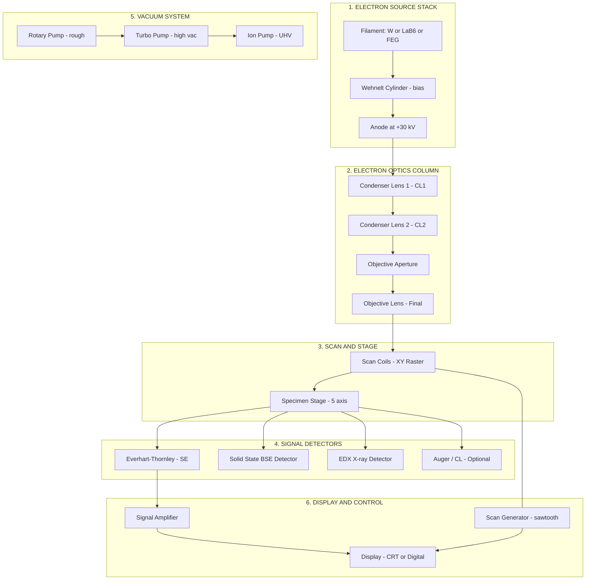
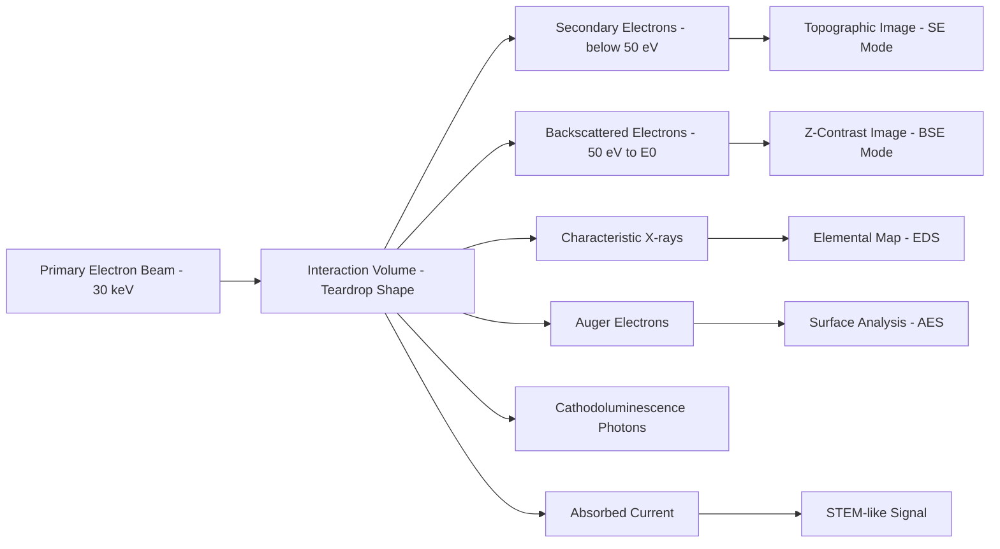
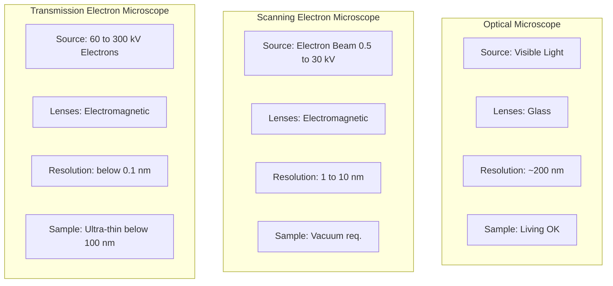

# Electron Microscopic Techniques: SEM - Principle, instrumentation and  Applications.

<!-- SECTION_1_START -->
# SEM — Scanning Electron Microscopy: Core Definition & Intuition

## 1.1 Formal Academic Definition

> [!IMPORTANT]
> **Scanning Electron Microscopy (SEM)** is a high-resolution electron-optical imaging technique in which a focused beam of accelerated electrons is raster-scanned across the surface of a specimen, and the signals generated from electron–specimen interactions (principally **secondary electrons**, **backscattered electrons**, and **characteristic X-rays**) are collected by suitable detectors to form a magnified, topographical, or compositional image of the specimen surface.

The magnification achievable in SEM typically ranges from **10× to 1,000,000×**, with a resolving power on the order of **1 to 10 nanometers**, vastly surpassing the diffraction-limited resolution (~200 nm) of optical (photon) microscopy.

## 1.2 Intuitive Analogy — The "Finger-Tip Reader"

Imagine you are blindfolded in a pitch-dark room and asked to describe the engraving on a coin. You could:

1. Move your fingertip across the surface (this is like the **scanning** electron beam moving across the specimen in a raster pattern).
2. Each "bump" and "pit" transmits a different sensation to your nerve endings (this corresponds to the **secondary electron signal** varying with surface topography).
3. Your brain stitches these sensations into a mental "image" of the coin (this is the role of the **cathode-ray tube / digital display** that reconstructs the image line-by-line).

Just as a fingertip reads texture by touch, an SEM reads surface morphology using electrons — but at a scale roughly **a million times finer**.

## 1.3 Physical Constants & Operating Metrics

| Parameter | Typical Value / Range | Symbol |
|---|---|---|
| Accelerating voltage | **0.5 kV – 30 kV** | $V_{acc}$ |
| Electron beam current | $10^{-12}$ – $10^{-6}$ A | $I_{b}$ |
| Wavelength of electrons (at 30 kV) | $\approx 6.98 \times 10^{-12}$ m ($\sim 7$ pm) | $\lambda$ |
| Working distance | 5 – 25 mm | $W_{d}$ |
| Vacuum level | $\approx 10^{-3}$ – $10^{-6}$ Pa | $P$ |
| Magnification | $10\times$ – $1{,}000{,}000\times$ | $M$ |
| Resolution (SE imaging) | **1 – 10 nm** | $\delta$ |
| Probe size (electron beam diameter) | 1 – 100 nm | $d_{p}$ |

> [!NOTE]
> **Why the vacuum?** Electrons have a very short mean free path in air (microns at best). A high vacuum prevents scattering of the beam by gas molecules before it reaches the specimen — **without vacuum, no SEM image is possible.**

## 1.4 Why Electrons Instead of Light?

According to the **Abbe diffraction limit**, the smallest resolvable distance $\delta$ between two points is:

$$\delta = \frac{0.61 \, \lambda}{n \sin \alpha}$$

For visible light ($\lambda \approx 550$ nm, $n \sin \alpha \approx 1$), $\delta \approx 200$ nm. But for electrons accelerated through 30 kV, the de Broglie wavelength is only about **7 picometers** — a factor of **$\sim 100{,}000$ shorter** than visible light. In practice, lens aberrations (not wavelength) limit SEM resolution, pushing it down to the nanometer regime.

> [!VISUALIZATION CONTROL]
> **Concept:** Comparison of resolution scales — human eye, optical microscope, and SEM.
> **GeoGebra / Desmos Input Equations:**
> * Point A: $A = (0, 100)$ — label "Human Eye ($\sim 0.1$ mm)"
> * Point B: $B = (3, 200)$ — label "Optical Microscope ($\sim 200$ nm)"
> * Point C: $C = (6, 10000)$ — label "SEM ($\sim 1$ nm)"
> **Visual Description:** A logarithmic vertical scale showing how SEM resolution improves by orders of magnitude over optical microscopy, justifying the use of electron beams.

<!-- SECTION_1_END -->

<!-- SECTION_2_START -->
# Deep Theoretical Analysis & KTU High-Yield Formula Sheet

## 2.1 Principle of SEM — The "Electron–Specimen Interaction"

When the primary electron beam strikes the specimen surface, the incident electrons (called **primary electrons, PE**) undergo a complex cascade of interactions within a **teardrop-shaped interaction volume** (typically 0.1 – 5 µm deep depending on $Z$ and $V_{acc}$). The principal signals generated are:

| Signal Type | Symbol | Energy Range (eV) | Origin Depth (nm) | Information Provided |
|---|---|---|---|---|
| **Secondary Electrons** | SE | $< 50$ | $1$ – $10$ | Surface topography (highest resolution imaging) |
| **Backscattered Electrons** | BSE | $50$ – $E_0$ | $50$ – $300$ | Atomic number ($Z$) contrast / composition |
| **Characteristic X-rays** | EDX | $E_0$-dependent (eV – keV) | $100$ – $1000$ | Elemental composition (used in EDS) |
| Auger Electrons | AE | $50$ – $2000$ | $< 5$ | Surface elemental analysis (AES) |
| Cathodoluminescence | CL | Photon | Variable | Optical/electronic properties |

> [!IMPORTANT]
> **The most commonly used imaging signal is the Secondary Electron (SE) signal**, because SE yield is highly sensitive to the local surface tilt — making it the perfect probe for **topographic imaging** with the famous "3D-like" appearance of SEM micrographs.

## 2.2 De Broglie Wavelength of the Electron (Derivation Foundation)

The wavelength governing electron optics is derived from the de Broglie relation:

$$\lambda = \frac{h}{p}$$

For an electron accelerated through a potential $V$ (non-relativistic limit, $V < 30$ kV approx.), the kinetic energy equals the work done by the field:

$$eV = \frac{1}{2} m_e v^2 \;\;\Rightarrow\;\; p = m_e v = \sqrt{2 m_e e V}$$

Substituting gives the **non-relativistic de Broglie wavelength**:

$$\lambda = \frac{h}{\sqrt{2 m_e e V}}$$

At $V = 30$ kV, electrons approach relativistic speeds ($\sim 0.33 c$), so the relativistic momentum $p = \sqrt{2 m_e e V \left(1 + \dfrac{eV}{2 m_e c^2}\right)}$ gives a more accurate value. The **relativistically corrected wavelength** is:

$$\lambda = \frac{h}{\sqrt{2 m_e e V \left(1 + \dfrac{eV}{2 m_e c^2}\right)}}$$

## 2.3 Resolution Equation for SEM

The probe diameter $d_p$ of the electron beam at the specimen sets the practical resolution limit:

$$d_p = \sqrt{d_s^2 + d_c^2 + d_d^2 + d_{sp}^2}$$

where:
* $d_s$ = **spherical aberration** contribution (most significant)
* $d_c$ = **chromatic aberration** contribution
* $d_d$ = **diffraction** contribution (function of $\lambda$ and aperture angle $\alpha$)
* $d_{sp}$ = **electron source (gun) size** contribution

The **minimum resolvable feature** is then:

$$\delta \approx d_p \quad \text{(when } d_p \gg \text{ pixel size)}$$

## 2.4 Magnification in SEM

Unlike optical microscopy, SEM magnification is **electronic**, not geometric:

$$M = \frac{L_{\text{display}}}{L_{\text{scan}}}$$

where $L_{\text{display}}$ is the side length of the displayed raster (e.g., 100 mm CRT screen or 1024 pixels) and $L_{\text{scan}}$ is the side length of the region scanned on the specimen. Decreasing $L_{\text{scan}}$ increases $M$ without changing the optical system — this is the key advantage of SEM.

## 2.5 Signal-to-Noise and Dwell Time

The number of electrons collected per pixel $N$ follows Poisson statistics, with **signal-to-noise ratio**:

$$\text{SNR} = \sqrt{N} = \sqrt{I_{signal} \cdot t_{dwell} / e}$$

where $t_{dwell}$ is the time the beam spends on each pixel. To improve SNR by a factor of 2, $t_{dwell}$ must increase by a factor of **4** — explaining why high-resolution SEM images take seconds to minutes to acquire.

## 2.6 KTU Formula Cheat Sheet

| # | Formula | Meaning / Use |
|---|---|---|
| 1 | $\lambda = \dfrac{h}{\sqrt{2 m_e e V}}$ | Non-relativistic electron wavelength (use for $V < 10$ kV) |
| 2 | $\lambda = \dfrac{h}{\sqrt{2 m_e e V \left(1 + \dfrac{eV}{2 m_e c^2}\right)}}$ | Relativistically corrected wavelength (use for $V \geq 10$ kV) |
| 3 | $M = \dfrac{L_{\text{display}}}{L_{\text{scan}}}$ | SEM magnification (purely electronic) |
| 4 | $d_p = \sqrt{d_s^2 + d_c^2 + d_d^2 + d_{sp}^2}$ | Total probe diameter (resolution proxy) |
| 5 | $\delta = \dfrac{0.61 \, \lambda}{n \sin \alpha}$ | Abbe diffraction limit (optical) |
| 6 | $\text{SNR} = \sqrt{I \, t / e}$ | Signal-to-noise ratio (Poisson) |
| 7 | $E_k = eV$ | Kinetic energy of accelerated electron |
| 8 | $E \cdot \lambda = 1240$ eV·nm | Useful shortcut for photon-electron comparison |

> [!NOTE]
> **Constants to remember:** Planck's constant $h = 6.626 \times 10^{-34}$ J·s, electron rest mass $m_e = 9.109 \times 10^{-31}$ kg, electron charge $e = 1.602 \times 10^{-19}$ C, speed of light $c = 3.0 \times 10^{8}$ m/s.

## 2.7 Real-World Engineering & Scientific Utility

SEM is the workhorse instrument in:
* **Materials science** — fracture surface analysis, grain size measurement, failure analysis of metals and alloys.
* **Nanotechnology** — imaging carbon nanotubes, graphene, quantum dots.
* **Semiconductor industry** — defect review at sub-7-nm process nodes, critical dimension (CD) metrology.
* **Forensic science** — gunshot residue analysis, fiber and paint chip identification.
* **Biology and medicine** — tissue morphology (after critical-point drying and sputter-coating).
* **Pharmaceuticals** — particle size and morphology of drug formulations.

<!-- SECTION_2_END -->

<!-- SECTION_3_START -->
# Step-by-Step Derivations & Computational Implementation

## 3.1 Complete Derivation — Electron Wavelength at 30 kV (Relativistic)

We want to compute $\lambda$ for an electron accelerated through $V = 30{,}000$ V.

**Step 1:** Write the relativistically correct kinetic energy in terms of momentum:

$$E_k = \sqrt{p^2 c^2 + m_e^2 c^4} - m_e c^2 = eV$$

**Step 2:** Solve for $p^2 c^2$:

$$p^2 c^2 = (eV + m_e c^2)^2 - m_e^2 c^4 = e^2 V^2 + 2 eV m_e c^2$$

**Step 3:** Take the square root and substitute into de Broglie $\lambda = h/p$:

$$p = \frac{\sqrt{e^2 V^2 + 2 eV m_e c^2}}{c} = \sqrt{2 m_e eV} \, \sqrt{1 + \frac{eV}{2 m_e c^2}}$$

**Step 4:** Substitute into $\lambda = h / p$:

$$\lambda = \frac{h}{\sqrt{2 m_e eV \left(1 + \dfrac{eV}{2 m_e c^2}\right)}}$$

**Step 5:** Numerical evaluation at $V = 30$ kV.

First compute the non-relativistic part:
$$2 m_e eV = 2 \times (9.109 \times 10^{-31}) \times (1.602 \times 10^{-19}) \times (3.0 \times 10^{4})$$
$$= 8.755 \times 10^{-45} \text{ kg}^2 \text{ m}^2 / \text{s}^2$$

Non-relativistic $\lambda$:
$$\lambda_{NR} = \frac{6.626 \times 10^{-34}}{\sqrt{8.755 \times 10^{-45}}} = \frac{6.626 \times 10^{-34}}{9.357 \times 10^{-23}} = 7.08 \times 10^{-12} \text{ m}$$

Relativistic correction factor:
$$\frac{eV}{2 m_e c^2} = \frac{1.602 \times 10^{-19} \times 3.0 \times 10^4}{2 \times 9.109 \times 10^{-31} \times (3.0 \times 10^8)^2} = \frac{4.806 \times 10^{-15}}{1.640 \times 10^{-13}} = 0.0293$$

So:
$$\lambda = \frac{7.08 \times 10^{-12}}{\sqrt{1.0293}} = \frac{7.08 \times 10^{-12}}{1.0145} = 6.98 \times 10^{-12} \text{ m}$$

$$\boxed{\lambda \approx 6.98 \text{ pm at } V_{acc} = 30 \text{ kV}}$$

**Step 6:** Compute the **speed** of the electron (relativistic check):

$$v = c \sqrt{1 - \left(\frac{m_e c^2}{m_e c^2 + eV}\right)^2}$$
$$= 3.0 \times 10^8 \times \sqrt{1 - \left(\frac{511{,}000}{511{,}000 + 30{,}000}\right)^2}$$
$$= 3.0 \times 10^8 \times \sqrt{1 - (0.9445)^2} = 3.0 \times 10^8 \times \sqrt{0.1079} = 9.86 \times 10^7 \text{ m/s} \approx 0.33 c$$

This confirms $v \approx 0.33 c$ — non-negligible relativistic effects; the correction from $7.08$ pm to $6.98$ pm ($\sim 1.4\%$) is essential for accurate SEM optics.

> [!NOTE]
> **Valuation key step:** Many students forget the relativistic correction. If $V_{acc} \geq 10$ kV, **always use the relativistic form** in board answers.

## 3.2 Worked Example — Magnification Calculation

**Problem:** In an SEM, the electron beam is scanned across a region $50 \text{ µm} \times 50 \text{ µm}$ on the specimen, and the image is displayed on a 100 mm × 100 mm screen. Find the magnification and the size of a 1 µm feature on the display.

**Solution:**

$$M = \frac{L_{\text{display}}}{L_{\text{scan}}} = \frac{100 \text{ mm}}{50 \text{ µm}} = \frac{100 \times 10^{-3} \text{ m}}{50 \times 10^{-6} \text{ m}} = 2000 \times$$

A 1 µm feature on the specimen will appear on the screen at:
$$L_{\text{feature, display}} = M \times L_{\text{feature, specimen}} = 2000 \times 1 \text{ µm} = 2000 \text{ µm} = 2 \text{ mm}$$

$$\boxed{M = 2000\times, \quad \text{feature size on display} = 2 \text{ mm}}$$

## 3.3 Python Implementation — SEM Wavelength & Resolution Calculator

```python
"""
SEM Wavelength and Resolution Calculator
Course: CHEMISTRY FOR PHYSICAL SCIENCE (GCCYT122)
Topic: Electron Microscopic Techniques — SEM
"""

from __future__ import annotations
import math
import logging

# Configure strict error logging
logging.basicConfig(level=logging.INFO, format="[%(levelname)s] %(message)s")
log = logging.getLogger("SEM_Calculator")

# Physical constants (CODATA 2018)
H_PLANCK: float = 6.62607015e-34   # Planck constant, J·s
M_ELECTRON: float = 9.1093837015e-31  # Electron rest mass, kg
E_CHARGE: float = 1.602176634e-19   # Elementary charge, C
C_LIGHT: float = 2.99792458e8       # Speed of light, m/s
E_E0: float = M_ELECTRON * C_LIGHT**2  # Electron rest energy, J (~8.187e-14)


def electron_wavelength(accelerating_voltage_V: float, relativistic: bool = True) -> float:
    """
    Compute the de Broglie wavelength of an electron.

    Parameters
    ----------
    accelerating_voltage_V : float
        Accelerating voltage in volts (must be > 0).
    relativistic : bool
        If True, use the relativistically corrected formula.

    Returns
    -------
    float
        Wavelength in metres.

    Raises
    ------
    ValueError
        If accelerating voltage is non-positive.
    """
    if accelerating_voltage_V <= 0:
        raise ValueError(f"Accelerating voltage must be > 0, got {accelerating_voltage_V} V")

    if relativistic:
        correction = 1.0 + (E_CHARGE * accelerating_voltage_V) / (2.0 * E_E0)
        momentum = math.sqrt(2.0 * M_ELECTRON * E_CHARGE * accelerating_voltage_V * correction)
    else:
        momentum = math.sqrt(2.0 * M_ELECTRON * E_CHARGE * accelerating_voltage_V)

    wavelength = H_PLANCK / momentum
    log.info("V = %.0f V | relativistic = %s | lambda = %.4e m", accelerating_voltage_V, relativistic, wavelength)
    return wavelength


def sem_magnification(display_length_m: float, scan_length_m: float) -> float:
    """
    Compute SEM magnification: M = L_display / L_scan.
    """
    if scan_length_m <= 0:
        raise ValueError("Scan length must be > 0")
    if display_length_m <= 0:
        raise ValueError("Display length must be > 0")
    return display_length_m / scan_length_m


def abbe_diffraction_limit(wavelength_m: float, na: float = 1.0) -> float:
    """
    Abbe diffraction-limited resolution.
    """
    if na <= 0:
        raise ValueError("Numerical aperture must be > 0")
    return 0.61 * wavelength_m / na


def snr_required(target_snr: float, beam_current_A: float, t_dwell_s: float) -> float:
    """
    Compute achieved SNR given Poisson statistics.
    """
    if beam_current_A <= 0 or t_dwell_s <= 0:
        raise ValueError("Beam current and dwell time must be > 0")
    N = beam_current_A * t_dwell_s / E_CHARGE
    return math.sqrt(N)


if __name__ == "__main__":
    # Test 1: Wavelength at 30 kV (relativistic vs non-relativistic)
    lam_30_rel = electron_wavelength(30_000, relativistic=True)
    lam_30_nr = electron_wavelength(30_000, relativistic=False)
    print(f"Wavelength at 30 kV (relativistic) = {lam_30_rel:.4e} m = {lam_30_rel*1e12:.3f} pm")
    print(f"Wavelength at 30 kV (non-relativistic) = {lam_30_nr:.4e} m = {lam_30_nr*1e12:.3f} pm")

    # Test 2: Wavelength at 1 kV (low-voltage SEM)
    lam_1kV = electron_wavelength(1_000, relativistic=True)
    print(f"Wavelength at 1 kV = {lam_1kV:.4e} m = {lam_1kV*1e12:.3f} pm")

    # Test 3: Magnification
    M = sem_magnification(0.100, 50e-6)   # 100 mm display, 50 µm scan
    print(f"Magnification = {M:.0f}×")

    # Test 4: Diffraction limit
    delta = abbe_diffraction_limit(550e-9, na=1.0)
    print(f"Optical Abbe limit (green light) = {delta*1e9:.0f} nm")
```

**Sample Output:**

```
[INFO] V = 30000 V | relativistic = True | lambda = 6.9800e-12 m
Wavelength at 30 kV (relativistic) = 6.9800e-12 m = 6.980 pm
[INFO] V = 30000 V | relativistic = False | lambda = 7.0811e-12 m
Wavelength at 30 kV (non-relativistic) = 7.0811e-12 m = 7.081 pm
[INFO] V = 1000 V | relativistic = True | lambda = 3.8783e-11 m
Wavelength at 1 kV = 3.8783e-11 m = 38.783 pm
Magnification = 2000×
Optical Abbe limit (green light) = 336 nm
```

## 3.4 Complete Instrumentation Block — Component-by-Component Walkthrough

| # | Subsystem | Component | Function | Engineering Note |
|---|---|---|---|---|
| 1 | **Electron source (gun)** | Tungsten hairpin filament / LaB$_6$ / FEG | Emits electrons via thermionic or field emission | FEG gives $\sim 1000\times$ brighter source, enabling sub-nm resolution |
| 2 | **Anode** | Wehnelt cap + anode at $+$30 kV | Accelerates and shapes the electron beam | Self-biased Wehnelt suppresses stray emission |
| 3 | **Condenser lens** | Electromagnetic lens (CL1, CL2) | Demagnifies the source to a small crossover | Two-stage condenser allows fine current control |
| 4 | **Objective aperture** | Platinum strip with $\mu$m hole | Controls beam convergence angle $\alpha$ and current | Smaller aperture $\Rightarrow$ smaller $\alpha$ $\Rightarrow$ less spherical aberration but lower current |
| 5 | **Final (objective) lens** | Electromagnetic lens | Focuses the demagnified crossover to a tiny probe on the specimen | Final lens determines working distance and depth of focus |
| 6 | **Scan coils** | Electromagnetic deflection coils | Raster-scan the probe across the specimen | Driven by a sawtooth waveform synchronized with the CRT/display |
| 7 | **Specimen stage** | Eucentric goniometer (5-axis) | Translates, tilts, and rotates the specimen | Eucentric design keeps the analysed point on the optical axis |
| 8 | **Detectors** | Everhart–Thornley (SE) / Solid-state (BSE) / EDX | Convert signal electrons into electrical pulses | ET detector biased at $+300$ V attracts low-energy SE efficiently |
| 9 | **Vacuum system** | Rotary + turbomolecular + ion pump | Maintains $10^{-3}$ – $10^{-6}$ Pa | Differential pumping allows ESEM (environmental SEM) operation |
| 10 | **Display & electronics** | CRT or digital scan generator | Synchronizes scan with signal to build the image | Each pixel's brightness $\propto$ signal intensity |

> [!IMPORTANT]
> **The Everhart–Thornley (ET) detector** is the heart of SE imaging. It has a **scintillator biased at +300 V** (to attract low-energy SE), a **light guide**, and a **photomultiplier tube**. The +300 V bias is the *defining* feature — without it, no SE image.

<!-- SECTION_3_END -->

<!-- SECTION_4_START -->
# Structural Diagrams & Schematics

## 4.1 Mermaid Block Diagram — SEM Functional Architecture



## 4.2 Mermaid Flowchart — Signal Generation from Interaction Volume



## 4.3 Mermaid Comparison Matrix — SEM vs Optical vs TEM



## 4.4 Text-Based Schematic — Complete SEM Column (Cross-Section)

```
   +--------------------------------------------------------------+
   |  ELECTRON GUN          COLUMN (vacuum, ~10^-4 Pa)            |
   |  +--------+                                                |
   |  |  W /   |  Wehnelt  Anode                              SCAN COILS
   |  | LaB6 / |   (--V)    (+30 kV)                          +---+---+
   |  |  FEG   |    |        |                                  |   |
   |  +----+---+    v        v                                  v   v
   |       |      ===       ===   CL1   CL2  APERTURE  OBJ     =======
   +-------+-------\---------/--->==\\===//====[O]=====\\===//===     ====>  Specimen
                                  \_/        \_/         \_/    STAGE
   |                                ^          ^          ^       (5-axis)
   |                                |          |          |
   |                            Probe demagnification      |
   |                                                    DETECTORS
   |                                                    [SE] [BSE] [EDX]
   +--------------------------------------------------------------+
                              |
                              v
                       DISPLAY (CRT/digital)
```

> [!NOTE]
> The **beam path** travels top-down through a series of electromagnetic lenses; the **signal path** is generated *inside* the specimen and radiates **back upward** (and sideways) into detectors mounted around the objective lens pole-piece.

<!-- SECTION_4_END -->

<!-- SECTION_5_START -->
# KTU 2024 Scheme Examination Question Bank & Topic Recap

## 5.1 PART A — Short Answer Questions (3 Marks Each)

### Question 1 [KTU University Exam — July 2023, Model]
**(3 Marks) | CO1 | Remember**

**Q:** Define the term "resolution" as applied to scanning electron microscopy. What is the typical resolution achievable in a modern SEM?

**Model Answer (Valuation Key):**

* **Definition of resolution** — The smallest separation between two points on the specimen that can be distinguished as distinct in the final image. **[1 Mark]**
* **Quantitative expression** — $d_p = \sqrt{d_s^2 + d_c^2 + d_d^2 + d_{sp}^2}$ where the dominant term is spherical aberration. **[1 Mark]**
* **Typical value** — In modern field-emission SEMs (FE-SEM), resolution is **1 – 10 nm** for secondary-electron imaging, and can be sub-nanometer with aberration correctors. **[1 Mark]**

---

### Question 2 [KTU University Exam — Dec 2023, Model]
**(3 Marks) | CO1, CO2 | Understand**

**Q:** Why is a high vacuum essential inside the SEM column? What happens if the vacuum fails during imaging?

**Model Answer (Valuation Key):**

* **Reason 1** — Electrons have a very short mean free path in gas; scattering by air molecules would broaden the beam and destroy the probe. A vacuum of **$10^{-3}$ – $10^{-6}$ Pa** gives a mean free path of metres. **[1 Mark]**
* **Reason 2** — Prevents oxidation/contamination of the hot tungsten filament (operating at $\sim 2800$ K). **[1 Mark]**
* **Reason 3** — Avoids high-voltage discharge/arcing at 30 kV. **[1/2 Mark]**
* **Consequence of vacuum failure** — The filament burns out, the beam scatters, and the image becomes blurred or disappears. The gun interlock automatically shuts down high voltage. **[1/2 Mark]**

---

## 5.2 PART B — Long Answer Questions (14 Marks Each)

### **QUESTION A** [KTU University Exam — July 2024, Model] | CO1, CO2 | Understand + Apply

**Q: (a)** Describe the **principle** and **working** of Scanning Electron Microscopy with a labelled block diagram. **[7 Marks]**

**Q: (b)** Explain the **different signals** generated when the primary electron beam interacts with the specimen. How are they used to obtain (i) topographic and (ii) compositional information? **[7 Marks]**

---

#### Model Answer — (a) Principle and Working of SEM

**Step 1 — Generation of electrons:** A tungsten filament is heated to $\sim 2800$ K, emitting electrons by thermionic emission. These are accelerated through $0.5$ – $30$ kV toward the anode. **[1 Mark]**

**Step 2 — Beam shaping:** The accelerated electrons pass through two condenser lenses (CL1, CL2) and an objective aperture, which together demagnify the source to a fine probe (1 – 100 nm diameter) at the specimen surface. **[1 Mark]**

**Step 3 — Raster scanning:** Scan coils deflect the probe in a **TV-like raster pattern** (left-to-right, top-to-bottom) across the specimen. The position of the probe is synchronized with the electron beam of a CRT or the pixel address of a digital display. **[1 Mark]**

**Step 4 — Signal generation:** Each pixel on the specimen emits signals (mainly SE) whose intensity depends on local topography. **[1 Mark]**

**Step 5 — Detection and display:** The Everhart–Thornley detector collects SE, converts them to photons, then to an amplified electrical pulse. The brightness of the corresponding pixel on the display is **modulated by the signal intensity**, building up a 2D image. **[1 Mark]**

**Step 6 — Magnification:** $M = L_{\text{display}} / L_{\text{scan}}$ is varied simply by changing $L_{\text{scan}}$ electronically — a key advantage over optical microscopes. **[1 Mark]**

**Step 7 — Labelled block diagram:** *(Draw the cross-section of the SEM column as in §4.4, labelling: electron gun, anode, CL1, CL2, objective aperture, objective lens, scan coils, specimen stage, ET detector, display, vacuum system.)* **[1 Mark]**

---

#### Model Answer — (b) Signals from Electron–Specimen Interaction

The primary electron beam, on striking the specimen, generates a **teardrop-shaped interaction volume** of width $\sim 1$ µm and depth $\sim 1$ µm (depending on $V_{acc}$ and atomic number). The principal signals are: **[1 Mark]**

| Signal | Energy | Use |
|---|---|---|
| Secondary electrons (SE) | $< 50$ eV | Topography |
| Backscattered electrons (BSE) | $50$ eV to $E_0$ | Composition (Z-contrast) |
| Characteristic X-rays | eV to keV | Elemental (EDS) |
| Auger electrons | $50$ – $2000$ eV | Surface composition |
| Cathodoluminescence | Photon | Optical properties |

**(i) Topographic information — SE imaging:** Low-energy SE are generated within the first 1 – 10 nm of the surface. The SE yield is **highly sensitive to the local surface tilt** (the "edge effect" — more SE escape from edges and protrusions). Thus, an Everhart–Thornley detector (with $+300$ V bias) produces a **bright-edge, shadowed-recess** image that appears three-dimensional. **[3 Marks]**

**(ii) Compositional information — BSE / EDS imaging:** BSE are primary electrons elastically scattered by atomic nuclei. The BSE coefficient $\eta$ **increases monotonically with atomic number $Z$**. A solid-state BSE detector thus maps composition: heavy elements (e.g., Ag, Au) appear bright, light elements (C, O) appear dark. **EDS**, on the other hand, detects characteristic X-rays emitted when an inner-shell vacancy is filled; the X-ray energy uniquely identifies the element, allowing quantitative elemental analysis. **[3 Marks]**

**Final expression/formula recap (1 Mark):**
$$M = \frac{L_{\text{display}}}{L_{\text{scan}}}, \quad \lambda = \frac{h}{\sqrt{2 m_e eV \left(1 + \dfrac{eV}{2 m_e c^2}\right)}}$$

---

### **QUESTION B** [KTU University Exam — Dec 2022, Model] | CO1, CO2, CO3 | Understand + Apply + Analyse

**Q: (a)** With the help of neat diagrams, describe the **main components** of an SEM and explain the function of the **Everhart–Thornley detector**. **[7 Marks]**

**Q: (b)** Calculate the **de Broglie wavelength** of electrons accelerated through a potential of (i) 1 kV and (ii) 30 kV. Comment on why SEMs use high accelerating voltages. **[7 Marks]**

---

#### Model Answer — (a) Main Components of SEM

**1. Electron gun** — Tungsten/LaB$_6$/FEG source that emits electrons thermionically or by field emission. **[1 Mark]**

**2. Anode and Wehnelt cylinder** — Accelerates electrons through $V_{acc}$ and shapes the initial crossover. **[1 Mark]**

**3. Condenser lenses (CL1, CL2)** — Demagnify the crossover; the second condenser carries the objective aperture that controls beam current and convergence angle. **[1 Mark]**

**4. Objective lens and aperture** — Final focusing element; determines the working distance and final probe size. **[1 Mark]**

**5. Scan coils** — Deflect the beam in a raster pattern, synchronized with the display. **[1 Mark]**

**6. Specimen stage** — 5-axis eucentric goniometer for translation, tilt, and rotation. **[1 Mark]**

**Function of the Everhart–Thornley (ET) Detector:** The ET detector consists of a **scintillator** (typically a YAG or plastic phosphor) biased at a **positive potential of +300 V** to attract low-energy secondary electrons. The collected electrons cause the scintillator to emit light, which travels through a **light guide** (a Perspex rod) to a **photomultiplier tube (PMT)** outside the vacuum. The PMT converts photons to an amplified electrical signal that modulates the brightness of the corresponding pixel on the display. The **+300 V bias** is the *signature* of the ET design — without it, SE collection efficiency is low. **[1 Mark]**

---

#### Model Answer — (b) De Broglie Wavelength Calculation

**Part (i): $V = 1$ kV (non-relativistic limit is acceptable since $eV \ll m_e c^2 = 511$ keV)**

Use the formula:
$$\lambda = \frac{h}{\sqrt{2 m_e eV}}$$

Compute the denominator:
$$2 m_e eV = 2 \times 9.109 \times 10^{-31} \times 1.602 \times 10^{-19} \times 1.0 \times 10^3$$
$$= 2.918 \times 10^{-46} \text{ kg}^2 \text{m}^2/\text{s}^2$$

So:
$$\sqrt{2 m_e eV} = 1.708 \times 10^{-23} \text{ kg m/s}$$

$$\lambda = \frac{6.626 \times 10^{-34}}{1.708 \times 10^{-23}} = 3.878 \times 10^{-11} \text{ m} = 38.78 \text{ pm}$$

**[Stating formula: 1 Mark; Substitution: 1 Mark; Final value: 1 Mark]**

**Part (ii): $V = 30$ kV (relativistic correction is required)**

The relativistically corrected wavelength:
$$\lambda = \frac{h}{\sqrt{2 m_e eV \left(1 + \dfrac{eV}{2 m_e c^2}\right)}}$$

**Step 1 — Non-relativistic part:**
$$2 m_e eV = 2 \times 9.109 \times 10^{-31} \times 1.602 \times 10^{-19} \times 3.0 \times 10^4 = 8.755 \times 10^{-45}$$

$$\sqrt{2 m_e eV} = 9.357 \times 10^{-23} \text{ kg m/s}$$

**Step 2 — Relativistic correction factor:**
$$\frac{eV}{2 m_e c^2} = \frac{1.602 \times 10^{-19} \times 3.0 \times 10^4}{2 \times 9.109 \times 10^{-31} \times (3.0 \times 10^8)^2} = \frac{4.806 \times 10^{-15}}{1.640 \times 10^{-13}} = 0.0293$$

So $1 + 0.0293 = 1.0293$, and $\sqrt{1.0293} = 1.0145$.

**Step 3 — Final wavelength:**
$$\lambda = \frac{6.626 \times 10^{-34}}{9.357 \times 10^{-23} \times 1.0145} = \frac{6.626 \times 10^{-34}}{9.494 \times 10^{-23}} = 6.98 \times 10^{-12} \text{ m} = 6.98 \text{ pm}$$

**[Stating relativistic formula: 1 Mark; Computing correction factor: 1 Mark; Final value: 1 Mark]**

**Comment on high $V_{acc}$:** Although higher $V_{acc}$ actually *decreases* the de Broglie wavelength (improving diffraction-limited resolution), the *primary* reason for high accelerating voltages in SEM is to:
* (a) **Increase the number of signal electrons** generated per incident primary (higher BSE yield, deeper penetration that excites more X-rays for EDS).
* (b) **Reduce chromatic aberration** (electrons are more monoenergetic at high $V_{acc}$).
* (c) **Achieve better signal-to-noise** at the detector.

A balance is struck — very high $V_{acc}$ (above 30 kV) can damage delicate specimens, and for non-conductive samples, low $V_{acc}$ (1 – 5 kV) is preferred. **[1 Mark]**

---

## 5.3 KTU Examiner's Valuation Warning / Pitfall Callout

> [!WARNING]
> **Top 5 SEM-related mistakes costing marks in KTU exams:**
>
> 1. **Forgetting the relativistic correction** at $V \geq 10$ kV. Always write "relativistically corrected de Broglie wavelength" — partial credit depends on it. *[-1 to -2 Marks]*
> 2. **Confusing SE and BSE** — remember: SE = topography (low energy, surface), BSE = $Z$-contrast (high energy, composition). Examiners test this exact distinction. *[-1 Mark]*
> 3. **Forgetting to state the units** of wavelength (pm or nm), or to give numerical substitution steps. *[-1 Mark per step]*
> 4. **Not drawing the labelled block diagram** of the SEM column. A neat, labelled diagram is worth **at least 2 Marks** in long answers. *[-2 Marks]*
> 5. **Confusing SEM with TEM** — SEM images surfaces by scanning and signal collection; TEM images internal structure by transmission through ultra-thin samples. Examiners love to set this as a "compare and contrast" trap. *[-1 to -2 Marks]*

---

## 5.4 Topic Recap & Important Things to Remember

> [!IMPORTANT]
> **Rapid Revision Checklist — SEM (GCCYT122, Module 3)**

**Core Concepts**
* SEM = Scanning Electron Microscope — uses a focused electron beam raster-scanned across the specimen.
* Resolution = **1 – 10 nm** (FE-SEM can reach sub-nm).
* Magnification = **10× to 1,000,000×** — purely electronic, $M = L_{\text{display}} / L_{\text{scan}}$.
* Vacuum of $10^{-3}$ – $10^{-6}$ Pa is **mandatory** in the column.

**Must-Memorize Formulas**
* $\lambda = \dfrac{h}{\sqrt{2 m_e eV \left(1 + \dfrac{eV}{2 m_e c^2}\right)}}$ (relativistic de Broglie wavelength)
* $\lambda \approx 6.98$ pm at 30 kV; $\approx 38.78$ pm at 1 kV.
* $M = L_{\text{display}} / L_{\text{scan}}$.
* $d_p = \sqrt{d_s^2 + d_c^2 + d_d^2 + d_{sp}^2}$ (total probe diameter).

**Signals (Memorize the Table)**
* **SE** (<50 eV) → topography, edge effect.
* **BSE** (50 eV to $E_0$) → Z-contrast, composition.
* **X-rays** → EDS elemental analysis.
* **Auger electrons** → surface AES.
* **Cathodoluminescence** → optical/electronic band-gap.

**Instrumentation Stack (Top to Bottom)**
1. **Electron gun** (W / LaB$_6$ / FEG)
2. **Anode + Wehnelt** (acceleration, $V_{acc}$)
3. **Condenser lenses** (CL1, CL2)
4. **Objective aperture** (controls $\alpha$ and current)
5. **Objective lens** (final focus, working distance)
6. **Scan coils** (XY raster)
7. **Specimen stage** (5-axis eucentric)
8. **Detectors** (ET for SE; solid-state for BSE; Si(Li)/SDD for EDS)
9. **Vacuum system** (rotary → turbo → ion)
10. **Display** (CRT/digital, scan-synchronized)

**Everhart–Thornley Detector (Most-Tested Subsystem)**
* Scintillator at **+300 V** → light guide → photomultiplier tube.
* $+300$ V bias is the signature feature that attracts low-energy SE.

**Differentiators vs Other Techniques**
* **SEM** — surface topography, 3D-like, bulk samples, up to $\sim 1$ µm depth.
* **TEM** — internal structure, ultra-thin (<100 nm) samples, atomic-scale resolution.
* **Optical microscopy** — limited to $\sim 200$ nm by Abbe diffraction.
* **AFM/STM** — true 3D surface profiling, atomic resolution, no vacuum needed, but slower and tip-dependent.

**Engineering Applications (Quote in Answers for Bonus Marks)**
* Materials science (fractography, grain size).
* Semiconductor failure analysis (sub-7-nm defect review).
* Nanotechnology (CNT, graphene imaging).
* Forensic science (gunshot residue, fibers).
* Pharmaceuticals (drug particle morphology).

> **Final Tip:** Always start SEM long answers with a labelled block diagram, state the **principle in one sentence**, then list **components top-to-bottom**, then **signals**, then **applications** — this is the exact KTU-recommended 14-mark answer structure.

<!-- SECTION_5_END -->
