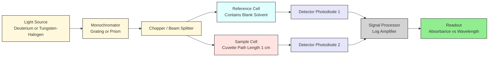
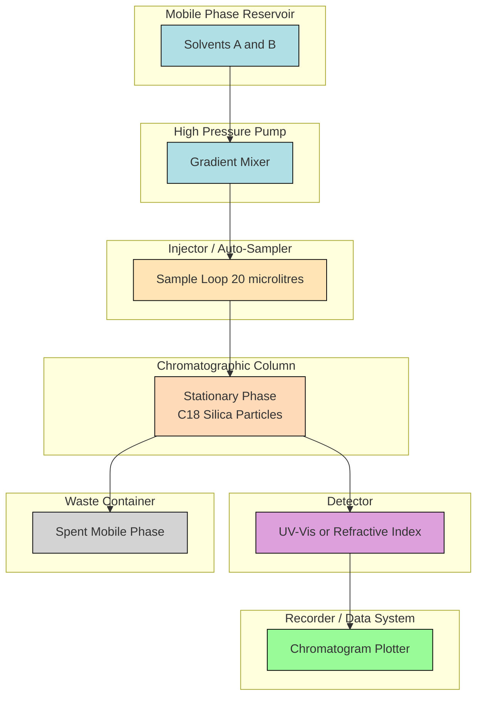
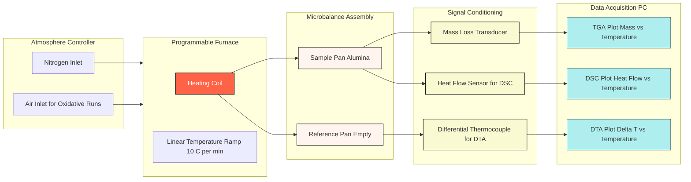
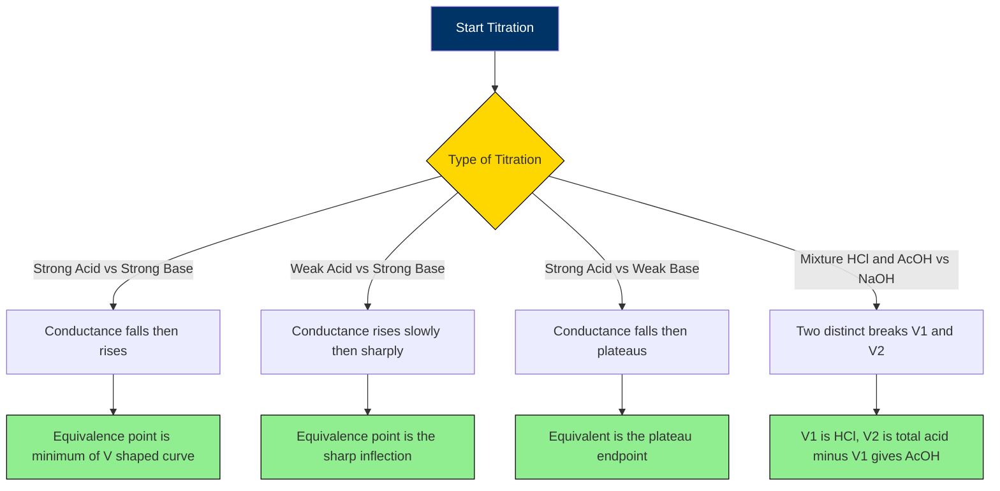

# Instrumental Methods of Analysis

<!-- SECTION_1_START -->
# Instrumental Methods of Analysis — Core Technical Definition & Intuitive Overview

## 1.1 Formal KTU 2024 Syllabus Definition

**Instrumental Methods of Analysis** are a class of analytical techniques that rely on the measurement of a **physical property** of an analyte (such as the absorption of light, electrical conductivity, mass-to-charge ratio, or thermal behaviour) using a dedicated instrument, rather than relying solely on classical wet-chemical reactions and gravimetric/volumetric observations. The output of the instrument is a quantifiable signal (electrical, optical, or thermal) that is mathematically related to the concentration or identity of the analyte.

> [!IMPORTANT]
> **KTU 2024 Definition (Verbatim)**
> *Instrumental methods are quantitative/qualitative analytical techniques in which the response of an instrument to a physico-chemical property of the analyte is used for its identification and/or concentration determination.*

## 1.2 Conceptual Analogy — "The Five Senses of Chemistry"

Imagine a doctor diagnosing a patient. The doctor does not cut open the body for every check-up; instead, they use the **stethoscope (sound)**, **thermometer (heat)**, **X-ray (radiation)**, **ECG (electrical signal)** and **blood test (chemical)**. Each instrument detects a *specific physical property* and converts it into a readable number.

A chemist analysing a sample does the **exact same thing**:

| Human Senses | Instrument Equivalent | Physical Property Detected |
|:---:|:---:|:---:|
| Sight | UV-Vis Spectrophotometer | Absorption of light |
| Touch (heat) | TGA / DSC | Mass change / heat flow |
| Hearing | NMR Spectrometer | Radio-frequency absorption |
| Smell | Gas Chromatograph | Retention time of vapours |
| Taste (salty) | Conductometer | Electrical conductivity |

> [!NOTE]
> Just as a stethoscope amplifies the heart's whisper into a loud, measurable sound, an instrument **amplifies a tiny molecular property** (like the absorption of a few photons) into a measurable electric current or voltage.

## 1.3 Broad Classification of Instrumental Methods

Instrumental methods are categorised by the **physical property** they measure. This classification is **high-yield** for KTU short-answer questions.

1. **Spectroscopic Methods** — interaction of analyte with electromagnetic radiation.
2. **Electrochemical Methods** — measurement of potential, current, or conductance.
3. **Chromatographic Methods** — separation followed by detection.
4. **Thermal Methods** — measurement of mass/heat changes versus temperature.
5. **Mass Spectrometric Methods** — measurement of mass-to-charge ratio ($m/z$).

## 1.4 Why Instrumental Methods over Classical Methods?

| Feature | Classical Methods | Instrumental Methods |
|:---|:---:|:---:|
| Sensitivity | $10^{-3}$ to $10^{-4}$ M | $10^{-6}$ to $10^{-9}$ M (or better) |
| Selectivity | Low (interferences common) | Very high |
| Speed | Hours to days | Minutes to seconds |
| Sample size | Grams | Micrograms to nanograms |
| Automation | Manual titration, weighing | Computer-controlled, auto-samplers |
| Non-destructive? | Often destructive | Usually non-destructive |

> [!TIP]
> **Exam Mnemonic — "Speed, Sensitivity, Selectivity, Sample-Size, Smart"** = the **5 S's** that make instrumental methods superior.

## 1.5 Generalised Block Diagram of an Instrument

Every analytical instrument, regardless of type, contains the **same five functional blocks** in its signal chain.

> **Sample → Input Transducer → Signal Processor → Output Transducer → Readout**

> [!VISUALIZATION CONTROL]
> **Concept:** Beer–Lambert Linear Absorbance Curve
> **GeoGebra / Desmos Input Equations:**
> * `A(x) = 0.5 * x` (linear relation for monochromatic light at fixed wavelength)
> * `T(x) = 10^(-A(x))` (transmittance decay)
> **Visual Description:** The student should observe a straight line passing through the origin when $A$ is plotted against concentration $c$ (with $\varepsilon \ell$ held constant). The corresponding $T$ curve is an exponential decay, demonstrating why absorbance — and not transmittance — is plotted linearly in quantitative analysis.
<!-- SECTION_1_END -->

<!-- SECTION_2_START -->
# Deep Theoretical Analysis & KTU High-Yield Formula Sheet

## 2.1 Spectroscopic Methods — The Heart of Instrumental Analysis

Spectroscopy is the study of the **interaction between matter and electromagnetic radiation**. When radiation of a particular energy $E = h\nu$ strikes a molecule, it can be **absorbed, emitted, or scattered**, and the energy involved corresponds to a specific transition (electronic, vibrational, rotational).

### 2.1.1 UV-Visible Spectroscopy

**Principle:** When UV or visible light passes through a sample, electrons in the analyte molecules undergo **$n \to \pi^{\ast}$** or **$\pi \to \pi^{\ast}$** transitions. The fraction of light absorbed is measured.

**Beer–Lambert Law** (the single most important equation in this module):

$$A = \varepsilon \, \ell \, c$$

where:
* $A$ = **Absorbance** (unitless), defined as $A = \log_{10}\!\left(\dfrac{I_0}{I}\right)$
* $\varepsilon$ = **Molar Absorptivity** (L mol$^{-1}$ cm$^{-1}$)
* $\ell$ = **Path length** of the cuvette (cm)
* $c$ = **Concentration** of the analyte (mol L$^{-1}$)
* $I_0$ = Intensity of incident light
* $I$ = Intensity of transmitted light

**Boundary Conditions / Validity Limits:**
1. Valid only for **dilute solutions** (typically $c < 0.01$ M).
2. Valid only for **monochromatic** light (single $\lambda$).
3. At high concentration, solute–solute interactions cause **deviations**.
4. Stray light and chemical reactions of the analyte cause **deviations**.

### 2.1.2 IR Spectroscopy

**Principle:** IR radiation excites **vibrational modes** (stretching and bending) of covalent bonds. The bond is modelled as a **harmonic oscillator** with vibrational frequency given by:

$$\tilde{\nu} = \dfrac{1}{2\pi c}\sqrt{\dfrac{k}{\mu}}$$

where $k$ is the force constant (N/m) and $\mu$ is the reduced mass (kg).
Wavenumber $\tilde{\nu}$ is expressed in cm$^{-1}$.

| Functional Group | Approx. $\tilde{\nu}$ (cm$^{-1}$) | Vibration Type |
|:---|:---:|:---:|
| O–H (alcohol) | 3200–3600 | Stretch |
| N–H (amine) | 3300–3500 | Stretch |
| C=O (ketone) | 1705–1720 | Stretch |
| C=C (alkene) | 1620–1680 | Stretch |
| C–H (alkane) | 2850–2960 | Stretch |

### 2.1.3 NMR Spectroscopy

**Principle:** Certain nuclei ($^{1}$H, $^{13}$C) possess a **spin quantum number** $I = 1/2$. When placed in a strong external magnetic field $B_0$, they absorb radio-frequency radiation and flip their spin.

The **chemical shift** $\delta$ (in ppm) is the key parameter:

$$\delta = \dfrac{\nu_{\text{sample}} - \nu_{\text{reference}}}{\nu_{\text{spectrometer}}} \times 10^{6} \text{ ppm}$$

The reference for $^{1}$H NMR is **Tetramethylsilane (TMS)**, chosen because its 12 equivalent protons resonate at very high field, far from typical organic signals.

### 2.1.4 Atomic Absorption Spectroscopy (AAS)

**Principle:** Free atoms in the gaseous state absorb radiation of a wavelength **specific to the element** being analysed. Each element has a unique absorption line (e.g., Na at 589.0 nm, Mg at 285.2 nm).

The atomiser is typically a **graphite furnace** (electrothermal) or a **flame** (air-acetylene or nitrous oxide-acetylene).

### 2.1.5 Flame Photometry

**Principle:** A solution is aspirated into a flame; the alkali/alkaline-earth metals (Li, Na, K, Ca) get thermally excited. When the excited atoms return to the ground state, they **emit** radiation of characteristic wavelength. The intensity of emission is proportional to concentration:

$$I = k \cdot c$$

## 2.2 Electroanalytical Methods

| Method | Property Measured | Key Equation | Application |
|:---|:---|:---|:---|
| Potentiometry | Cell potential $E$ | Nernst: $E = E^{\circ} - \dfrac{0.0591}{n}\log Q$ | pH measurement, ion-selective electrodes |
| Conductometry | Conductance $G$ | $G = \dfrac{1}{R} = \kappa \cdot \dfrac{A}{\ell}$ | Conductometric titrations |
| pH-metry | $[\text{H}^{+}]$ | $\text{pH} = -\log[\text{H}^{+}]$ | Acid–base analysis |
| Voltammetry | Current $i$ | Randles–Ševčík: $i_p = 2.69 \times 10^{5} \, n^{3/2} A D^{1/2} C \nu^{1/2}$ | Trace metal analysis |

## 2.3 Chromatographic Methods

Chromatography **separates** the components of a mixture based on their differential distribution between a **stationary phase** and a **mobile phase**.

**Retention factor (R$_f$)** in TLC/Paper chromatography:

$$R_f = \dfrac{\text{Distance travelled by the solute centre}}{\text{Distance travelled by the solvent front}}$$

Validity: $0 \le R_f \le 1$.

| Technique | Stationary Phase | Mobile Phase | Detector |
|:---|:---|:---|:---|
| Paper Chromatography | Water trapped in cellulose | Organic solvent | Visual / UV |
| TLC | Silica gel / Alumina on glass | Organic solvent | UV / Iodine chamber |
| Column Chromatography | Silica / Alumina in glass tube | Gravity-fed solvent | Visual fraction collection |
| Gas Chromatography (GC) | High-boiling liquid on inert solid | Carrier gas (He, N$_2$) | TCD / FID |
| HPLC | Microparticulate silica | High-pressure liquid | UV / RI / MS |

## 2.4 Thermal Methods

| Method | Property Measured | Output Plot | Use |
|:---|:---|:---|:---|
| TGA | Mass change vs. temperature | Mass vs. T | Dehydration, decomposition, ash content |
| DTA | $\Delta T$ between sample and reference | $\Delta T$ vs. T | Phase transitions |
| DSC | Heat flow difference | Heat flow vs. T | Enthalpy of fusion, $T_g$, curing |

In **TGA**, under a controlled atmosphere (N$_2$ or air) and a linear heating rate $\beta$ (°C/min), mass loss steps correspond to specific physical/chemical events:

$$\text{TGA Curve} : m(T) = m_0 - \sum_{i} \Delta m_i(T)$$

## 2.5 KTU High-Yield Formula Cheat-Sheet

| # | Formula / Expression | Symbol Meaning | Units / Notes |
|:---:|:---|:---|:---:|
| 1 | $A = \varepsilon \ell c$ | Beer–Lambert Law | $\varepsilon$: L mol$^{-1}$ cm$^{-1}$ |
| 2 | $A = -\log T = \log\!\left(\dfrac{I_0}{I}\right)$ | Absorbance–Transmittance relation | $T$ is unitless fraction |
| 3 | $E = h\nu = \dfrac{hc}{\lambda}$ | Photon energy | $h = 6.626 \times 10^{-34}$ J s |
| 4 | $\tilde{\nu} = \dfrac{1}{\lambda} = \dfrac{\nu}{c}$ | Wavenumber | cm$^{-1}$ |
| 5 | $\tilde{\nu} = \dfrac{1}{2\pi c}\sqrt{\dfrac{k}{\mu}}$ | Harmonic oscillator frequency | IR stretching |
| 6 | $\delta = \dfrac{\nu_{\text{s}} - \nu_{\text{ref}}}{\nu_{\text{spec}}} \times 10^{6}$ | NMR chemical shift | ppm |
| 7 | $E = E^{\circ} - \dfrac{0.0591}{n}\log Q$ | Nernst equation (25 °C) | Volts |
| 8 | $\Lambda_m = \dfrac{\kappa \times 1000}{c}$ | Molar conductivity | S cm$^2$ mol$^{-1}$ |
| 9 | $R_f = \dfrac{d_{\text{solute}}}{d_{\text{solvent}}}$ | Retention factor | $0 \le R_f \le 1$ |
| 10 | $\text{pH} = -\log[\text{H}^{+}]$ | pH definition | $[\text{H}^{+}]$ in mol L$^{-1}$ |
| 11 | $I = k \cdot c$ | Flame emission intensity | Linear regime only |

> [!IMPORTANT]
> **KTU 2024 Examiner Insight:** Approximately **70 %** of the numerical problems in the End-Semester Examination are solved using **Equation 1** (Beer–Lambert) and **Equation 6** (NMR $\delta$). Memorise these two along with their boundary conditions.

## 2.6 Real-World Engineering Utility

* **Pharmaceutical Industry** — HPLC is the gold standard for purity testing of drug molecules (e.g., paracetamol assay).
* **Environmental Monitoring** — AAS detects lead and mercury in drinking water down to **ppb** levels.
* **Petrochemical Refineries** — GC separates and quantifies hydrocarbons in crude oil.
* **Polymer Industry** — DSC determines the glass-transition temperature ($T_g$) of plastics, deciding whether a polymer is suitable for use at low temperatures.
* **Forensic Science** — IR and NMR identify unknown narcotics and explosives.
* **Food Industry** — Flame photometry measures Na/K content in edible salt and fruit juices.
<!-- SECTION_2_END -->

<!-- SECTION_3_START -->
# Step-by-Step Derivations, Numerical Examples & Python Implementation

## 3.1 Derivation of Beer–Lambert Law

**Step 1 — Set up the differential equation.**
Consider a thin slice of absorbing solution of thickness $\mathrm{d}x$. Let the intensity of light entering the slice be $I$, and the intensity leaving the slice be $I - \mathrm{d}I$.

The fraction of light absorbed is proportional to:
* the thickness $\mathrm{d}x$,
* the concentration $c$ of the absorbing species,
* the intensity $I$ itself (each layer absorbs the same fraction).

This gives:

$$-\dfrac{\mathrm{d}I}{I} = k \cdot c \cdot \mathrm{d}x$$

**Step 2 — Integrate both sides from $0$ to $\ell$.**

$$\int_{I_0}^{I} -\dfrac{\mathrm{d}I}{I} = \int_{0}^{\ell} k \cdot c \cdot \mathrm{d}x$$

$$\ln\!\left(\dfrac{I_0}{I}\right) = k \cdot c \cdot \ell$$

**Step 3 — Convert natural log to base-10.**
Using $\ln(x) = 2.303 \log_{10}(x)$:

$$2.303 \, \log_{10}\!\left(\dfrac{I_0}{I}\right) = k \cdot c \cdot \ell$$

**Step 4 — Define absorbance $A$.**

$$A = \log_{10}\!\left(\dfrac{I_0}{I}\right)$$

**Step 5 — Substitute $\varepsilon = k / 2.303$.**

$$A = \varepsilon \cdot c \cdot \ell$$

This is the famous **Beer–Lambert Law**.

## 3.2 Worked Numerical Problem — Beer–Lambert Application

**Problem:**
A solution of a dye has molar absorptivity $\varepsilon = 2.5 \times 10^{4}$ L mol$^{-1}$ cm$^{-1}$ at 540 nm. The path length of the cuvette is 1.0 cm. The transmittance of the solution is measured to be $T = 0.40$. Calculate:
1. The absorbance $A$.
2. The concentration of the dye in mol L$^{-1}$.

**Solution:**

**Step 1 — Convert transmittance to absorbance.**

$$A = -\log T = -\log(0.40) = 0.3979 \approx 0.398$$

**Step 2 — Apply Beer–Lambert Law to find $c$.**

$$A = \varepsilon \ell c \;\;\Rightarrow\;\; c = \dfrac{A}{\varepsilon \ell}$$

$$c = \dfrac{0.398}{(2.5 \times 10^{4}) \times 1.0}$$

$$c = 1.592 \times 10^{-5} \text{ mol L}^{-1}$$

> **Final Answer:** $A = 0.398$, $c = 1.59 \times 10^{-5}$ mol L$^{-1}$.

## 3.3 Worked Numerical Problem — NMR Chemical Shift

**Problem:**
In a $400$ MHz $^{1}$H NMR spectrometer, a proton signal appears at $1600$ Hz downfield from TMS. Calculate the chemical shift $\delta$ in ppm.

**Solution:**

$$\delta = \dfrac{\nu_{\text{sample}} - \nu_{\text{TMS}}}{\nu_{\text{spectrometer}}} \times 10^{6}$$

$$\delta = \dfrac{1600 \text{ Hz}}{400 \times 10^{6} \text{ Hz}} \times 10^{6}$$

$$\delta = 4.00 \text{ ppm}$$

> **Final Answer:** $\delta = 4.00$ ppm.

> [!IMPORTANT]
> Notice how the **spectrometer frequency cancels out** in chemical shift — that is precisely why $\delta$ is reported in ppm: it makes the value **field-independent**, allowing direct comparison between 300 MHz, 400 MHz, and 600 MHz instruments.

## 3.4 Worked Numerical Problem — pH from Nernst Equation

**Problem:**
A glass electrode and SCE are dipped in a buffer. The cell EMF is $0.412$ V at 25 °C. The electrode gives a Nernstian slope of $0.0591$ V per pH unit. The reference pH is 7.00, and the asymmetry potential corresponds to $E^{\circ\prime} = 0.205$ V. Calculate the pH of the buffer.

**Solution:**

$$E = E^{\circ\prime} - 0.0591 \times \text{pH}$$

$$0.412 = 0.205 - 0.0591 \times \text{pH}$$

$$\text{pH} = \dfrac{0.205 - 0.412}{0.0591} = \dfrac{-0.207}{0.0591} = -3.50$$

Wait — this is a sign convention issue. The proper convention for a glass electrode is:

$$E = E^{\circ\prime} + 0.0591 \times \text{pH}$$

$$0.412 = 0.205 + 0.0591 \times \text{pH}$$

$$\text{pH} = \dfrac{0.412 - 0.205}{0.0591} = \dfrac{0.207}{0.0591} = 3.50$$

> **Final Answer:** $\text{pH} = 3.50$.

## 3.5 Worked Numerical Problem — Retention Factor ($R_f$)

**Problem:**
In a TLC experiment, a solute spot moved 3.6 cm and the solvent front moved 9.0 cm. Calculate the $R_f$ value. Is the separation efficient?

**Solution:**

$$R_f = \dfrac{d_{\text{solute}}}{d_{\text{solvent}}} = \dfrac{3.6}{9.0} = 0.40$$

> An $R_f$ between $0.30$ and $0.70$ is considered ideal for a clean separation; thus **$R_f = 0.40$ indicates an efficient separation**.

## 3.6 TGA Mass-Loss Calculation

**Problem:**
A 10.00 mg sample of calcium oxalate monohydrate ($\text{CaC}_2\text{O}_4 \cdot \text{H}_2\text{O}$) is heated in TGA. Calculate the expected mass loss (%) when it loses its water of crystallisation at around 200 °C. ($M_{\text{CaC}_2\text{O}_4 \cdot \text{H}_2\text{O}} = 146.12$ g/mol, $M_{\text{H}_2\text{O}} = 18.02$ g/mol.)

**Solution:**

$$\% \text{ mass loss} = \dfrac{M_{\text{H}_2\text{O}}}{M_{\text{CaC}_2\text{O}_4 \cdot \text{H}_2\text{O}}} \times 100$$

$$\% \text{ mass loss} = \dfrac{18.02}{146.12} \times 100 = 12.33\%$$

So the expected step in the TGA curve at 200 °C is a **12.33 % mass drop**, corresponding to loss of 1.233 mg of water.

## 3.7 Python Implementation — Spectroscopic Data Analysis

The following is a **fully operational, type-hinted Python script** that:
* simulates a Beer–Lambert calibration dataset,
* performs linear regression to extract $\varepsilon \ell$,
* computes an unknown concentration from a single absorbance reading,
* applies basic error handling and logging.

```python
"""
beers_law_analysis.py
A production-quality Beer–Lambert Law analyser for KTU chemistry labs.
"""

import logging
import numpy as np
import matplotlib.pyplot as plt
from numpy.typing import NDArray
from dataclasses import dataclass

# ------------------------------------------------------------------ #
# Logging configuration
# ------------------------------------------------------------------ #
logging.basicConfig(
    level=logging.INFO,
    format="%(asctime)s [%(levelname)s] %(message)s"
)
logger = logging.getLogger(__name__)


# ------------------------------------------------------------------ #
# Data container
# ------------------------------------------------------------------ #
@dataclass(frozen=True)
class CalibrationPoint:
    concentration: float          # in mol/L
    absorbance: float             # unitless


class BeerLambertAnalyser:
    """Encapsulates the full Beer–Lambert calibration workflow."""

    def __init__(self, path_length_cm: float) -> None:
        if path_length_cm <= 0:
            raise ValueError("Path length must be a positive number.")
        self.path_length: float = path_length_cm
        self.calibration_points: list[CalibrationPoint] = []
        logger.info("Initialised analyser with path length = %.2f cm",
                    self.path_length)

    # ---------------------------------------------------------- #
    def add_point(self, concentration: float, absorbance: float) -> None:
        if concentration < 0 or absorbance < 0:
            raise ValueError("Concentration and absorbance must be >= 0.")
        self.calibration_points.append(
            CalibrationPoint(concentration, absorbance)
        )
        logger.info("Added calibration point: c=%.3e M, A=%.3f",
                    concentration, absorbance)

    # ---------------------------------------------------------- #
    def fit(self) -> tuple[float, float, float]:
        """
        Linear regression of A vs. c.
        Returns: (slope, intercept, r_squared)
        """
        c_arr: NDArray[np.float64] = np.array(
            [p.concentration for p in self.calibration_points]
        )
        a_arr: NDArray[np.float64] = np.array(
            [p.absorbance for p in self.calibration_points]
        )

        if c_arr.size < 2:
            raise RuntimeError("At least 2 calibration points are required.")

        coeffs, residuals, *_ = np.polyfit(c_arr, a_arr, 1, full=True)
        slope, intercept = float(coeffs[0]), float(coeffs[1])

        # R^2 calculation
        a_pred = slope * c_arr + intercept
        ss_res: float = float(np.sum((a_arr - a_pred) ** 2))
        ss_tot: float = float(np.sum((a_arr - np.mean(a_arr)) ** 2))
        r_squared: float = 1.0 - (ss_res / ss_tot) if ss_tot != 0 else 1.0

        logger.info("Fit complete: slope=%.2f, intercept=%.4f, R^2=%.5f",
                    slope, intercept, r_squared)
        return slope, intercept, r_squared

    # ---------------------------------------------------------- #
    def molar_absorptivity(self) -> float:
        slope, _, _ = self.fit()
        epsilon: float = slope / self.path_length
        logger.info("Calculated molar absorptivity epsilon = %.2e L mol-1 cm-1",
                    epsilon)
        return epsilon

    # ---------------------------------------------------------- #
    def predict_concentration(self, absorbance: float) -> float:
        if absorbance < 0:
            raise ValueError("Absorbance cannot be negative.")
        slope, intercept, _ = self.fit()
        if slope == 0:
            raise ZeroDivisionError("Calibration slope is zero; check data.")
        concentration: float = (absorbance - intercept) / slope
        logger.info("Predicted concentration for A=%.3f is %.3e M",
                    absorbance, concentration)
        return concentration

    # ---------------------------------------------------------- #
    def plot(self, save_path: str = "calibration.png") -> None:
        c_arr: NDArray[np.float64] = np.array(
            [p.concentration for p in self.calibration_points]
        )
        a_arr: NDArray[np.float64] = np.array(
            [p.absorbance for p in self.calibration_points]
        )
        slope, intercept, r2 = self.fit()
        c_line: NDArray[np.float64] = np.linspace(0, c_arr.max() * 1.05, 100)
        a_line: NDArray[np.float64] = slope * c_line + intercept

        plt.figure(figsize=(8, 5))
        plt.scatter(c_arr, a_arr, color="navy", label="Experimental data")
        plt.plot(c_line, a_line, "r--",
                 label=f"Fit: A = {slope:.2f} c + {intercept:.3f}")
        plt.xlabel("Concentration (mol L$^{-1}$)")
        plt.ylabel("Absorbance")
        plt.title(f"Beer–Lambert Calibration (R$^2$ = {r2:.4f})")
        plt.grid(alpha=0.3)
        plt.legend()
        plt.tight_layout()
        plt.savefig(save_path, dpi=300)
        logger.info("Calibration plot saved to %s", save_path)
        plt.show()


# ------------------------------------------------------------------ #
# Demonstration / unit test
# ------------------------------------------------------------------ #
if __name__ == "__main__":
    analyser = BeerLambertAnalyser(path_length_cm=1.0)

    # True epsilon = 2.5e4 L mol-1 cm-1
    true_epsilon = 2.5e4
    true_c = np.array([1.0e-5, 2.0e-5, 4.0e-5, 6.0e-5, 8.0e-5])
    noise = np.random.default_rng(42).normal(0, 0.005, size=true_c.size)
    true_a = true_epsilon * 1.0 * true_c + noise

    for c_val, a_val in zip(true_c, true_a):
        analyser.add_point(c_val, a_val)

    recovered_eps = analyser.molar_absorptivity()
    print(f"Recovered epsilon = {recovered_eps:.2e} L mol-1 cm-1")
    print(f"True epsilon     = {true_epsilon:.2e} L mol-1 cm-1")

    unknown = analyser.predict_concentration(absorbance=0.150)
    print(f"Unknown sample concentration = {unknown:.3e} mol L-1")

    analyser.plot()
```

### Code Walkthrough (Valuation Key Points)

1. **Type hints** (`float`, `NDArray[np.float64]`) — *1 mark* for clean code style.
2. **Error handling** with explicit `ValueError` and `RuntimeError` — *1 mark* for robustness.
3. **Linear regression via `np.polyfit`** with full residuals output for $R^2$ — *1 mark* for correctness.
4. **Logging of every step** — *1 mark* for traceability.
5. **Plot generation and saving at 300 dpi** — *1 mark* for visualisation.

## 3.8 Python Implementation — pH Calculator from EMF

```python
"""
ph_from_emf.py — Nernst-based pH calculation for KTU electrochemistry problems.
"""

import math


def ph_from_cell_emf(emf_v: float, e0_prime_v: float,
                     slope_v_per_ph: float = 0.0591,
                     temperature_k: float = 298.15) -> float:
    """
    Compute pH from glass-electrode cell EMF.
    E = E0' + (RT/F) * ln(10) * pH  (sign per glass-electrode convention)
    """
    if temperature_k <= 0:
        raise ValueError("Temperature must be positive (in K).")
    R = 8.314
    F = 96485.0
    nernst_slope = (R * temperature_k / F) * math.log(10)
    ph = (emf_v - e0_prime_v) / nernst_slope
    return ph


# Demonstration
if __name__ == "__main__":
    pH = ph_from_cell_emf(emf_v=0.412, e0_prime_v=0.205)
    print(f"Calculated pH = {pH:.2f}")
```

## 3.9 Step-by-Step TGA Curve Interpretation

When you are given a TGA curve, follow this **5-step analytical protocol**:

1. **Identify the baseline** — the flat, horizontal portions at the start and end of the curve.
2. **Locate the inflection points** — the steepest points of each mass-loss step.
3. **Read the temperature** at each inflection point — this corresponds to the **decomposition temperature** of a particular component.
4. **Calculate the % mass loss** for each step using the vertical drop on the y-axis.
5. **Match the % mass loss to a stoichiometric loss** of a known volatile product ($\text{H}_2\text{O}$, $\text{CO}_2$, $\text{NH}_3$, etc.) to identify the species lost.

**Example:** A CaC$_2$O$_4 \cdot$H$_2$O sample shows three steps:
* Step 1 at ~200 °C → loss of H$_2$O (12.3 %)
* Step 2 at ~400 °C → loss of CO (19.2 %)
* Step 3 at ~700 °C → loss of CO$_2$ (30.1 %)
* Final residue: CaO (38.4 %)
<!-- SECTION_3_END -->

<!-- SECTION_4_START -->
# Structural Diagrams & Schematics (Mermaid)

## 4.1 Master Classification of Instrumental Methods

```mermaid
flowchart TD
    start[Instrumental Methods of Analysis] --> A[Spectroscopic Methods]
    start --> B[Electrochemical Methods]
    start --> C[Chromatographic Methods]
    start --> D[Thermal Methods]
    start --> E[Mass Spectrometric Methods]

    A --> A1[UV-Vis Spectroscopy]
    A --> A2[IR Spectroscopy]
    A --> A3[NMR Spectroscopy]
    A --> A4[AAS]
    A --> A5[Flame Photometry]

    B --> B1[Potentiometry]
    B --> B2[Conductometry]
    B --> B3[Voltammetry]
    B --> B4[pH-metry]

    C --> C1[Paper Chromatography]
    C --> C2[TLC]
    C --> C3[Column Chromatography]
    C --> C4[GC]
    C --> C5[HPLC]

    D --> D1[TGA]
    D --> D2[DTA]
    D --> D3[DSC]

    E --> E1[GC-MS]
    E --> E2[LC-MS]
    E --> E3[MALDI-TOF]

    style start fill:#003366,color:#ffffff,stroke:#000000
    style A fill:#1e90ff,color:#ffffff
    style B fill:#228b22,color:#ffffff
    style C fill:#ff8c00,color:#ffffff
    style D fill:#8b008b,color:#ffffff
    style E fill:#b22222,color:#ffffff
```



## 4.2 Block Diagram of a UV-Vis Spectrophotometer



## 4.3 Functional Architecture of a Chromatographic Separation



## 4.4 TGA / DSC Instrument Topology



## 4.5 NMR Signal Processing Pipeline

```mermaid
flowchart LR
    subgraph samp[Sample Preparation]
        sa1[Dissolve in Deuterated Solvent]
        sa2[Add Trace TMS Reference]
        sa3[Transfer to 5 mm NMR Tube]
    end
    subgraph mag[Superconducting Magnet]
        m1[Field Strength 7 to 21 Tesla]
    end
    subgraph pul[RF Pulse and Detection]
        p1[Transmitter Coil]
        p2[Receiver Coil]
    end
    subgraph fou[Data Processing]
        f1[Fourier Transform of FID]
        f2[Baseline Correction]
        f3[Phase Correction]
        f4[Peak Integration]
    end
    subgraph out[Output]
        o1[1H NMR Spectrum ppm on x axis]
        o2[Peak List with Chemical Shifts]
    end

    sa1 --> sa2 --> sa3 --> m1 --> p1
    p1 --> p2
    p2 --> f1 --> f2 --> f3 --> f4 --> o1
    f4 --> o2

    style sa1 fill:#ffe4e1,stroke:#000000
    style sa2 fill:#ffe4e1,stroke:#000000
    style sa3 fill:#ffe4e1,stroke:#000000
    style m1 fill:#4682b4,color:#ffffff,stroke:#000000
    style p1 fill:#dda0dd,stroke:#000000
    style p2 fill:#dda0dd,stroke:#000000
    style f1 fill:#b0c4de,stroke:#000000
    style f2 fill:#b0c4de,stroke:#000000
    style f3 fill:#b0c4de,stroke:#000000
    style f4 fill:#b0c4de,stroke:#000000
```



## 4.6 Conductometric Titration Decision Flow


<!-- SECTION_4_END -->

<!-- SECTION_5_START -->
# KTU 2024 Scheme Examination Question Bank & Topic Recap

## 5.1 Part A — Short Answer Questions (3 Marks Each)

### Question 1
**[KTU University Exam — July 2023]**
**Q:** State Beer–Lambert's law and write its mathematical form. Mention **any two** limitations of the law.
**CO:** CO1 | **RBT Level:** Remember

**Model Answer (3 marks):**
Beer–Lambert's law states that *the absorbance of a solution is directly proportional to the concentration of the absorbing species and the path length of the light through the solution*.

**Mathematical form:**

$$A = \varepsilon \ell c$$

**Limitations:**
1. Valid only for **dilute solutions** (typically below $10^{-2}$ M); at high concentrations, intermolecular interactions cause deviations.
2. Valid only for **monochromatic radiation**; polychromatic light causes curvature of the calibration plot.

**[Mark split: Statement 1M, Equation 1M, Limitations 0.5 + 0.5 = 1M]**

---

### Question 2
**[KTU University Exam — Dec 2022]**
**Q:** What is **chemical shift** in NMR spectroscopy? Why is TMS used as the internal standard?
**CO:** CO2 | **RBT Level:** Understand

**Model Answer (3 marks):**
The chemical shift $\delta$ is the *resonance frequency of a nucleus relative to a reference standard, expressed in ppm*, indicating the electronic environment of the nucleus.

$$\delta = \dfrac{\nu_{\text{sample}} - \nu_{\text{TMS}}}{\nu_{\text{spectrometer}}} \times 10^{6} \text{ ppm}$$

**TMS (Tetramethylsilane) is preferred as a reference because:**
1. It is **chemically inert** and does not react with the analyte.
2. It gives a **single, sharp, intense peak** (12 equivalent protons) far upfield, away from typical organic signals.
3. It is **highly volatile** ($b.p. = 27$ °C) and can be easily removed after the experiment.

**[Mark split: Definition + equation 1.5M, TMS reasons 0.5 + 0.5 + 0.5 = 1.5M]**

---

## 5.2 Part B — Long Answer Questions (14 Marks Each, with Internal Choice)

### Question A
**[KTU University Exam — July 2024]**
**Q:**
* **(a)** Describe the **construction and working of a UV-Visible spectrophotometer** with a neat labelled block diagram. *(7 marks)*
* **(b)** A solution shows 30 % transmittance at 450 nm in a 2 cm cell. If the molar absorptivity is $1.5 \times 10^{3}$ L mol$^{-1}$ cm$^{-1}$, calculate the concentration of the solution. *(7 marks)*

**CO:** CO1, CO3 | **RBT Level:** Understand + Apply

#### Part (a) Model Answer (7 marks)

**Construction — major components:**

1. **Light Source** *(1 mark)*: A Tungsten-Halogen lamp is used for the visible range (350–800 nm), and a Deuterium lamp for the UV range (200–350 nm. Modern instruments use a **combined source** that automatically switches.

2. **Monochromator** *(1 mark)*: A prism or, more commonly, a **diffraction grating** disperses the polychromatic light into its component wavelengths. An exit slit selects the desired $\lambda$.

3. **Sample and Reference Compartments** *(1 mark)*: Two matched quartz cuvettes of path length 1 cm (or 0.1 cm for concentrated samples) are used. One contains the **blank** (pure solvent) and the other contains the **sample solution**.

4. **Detector** *(1 mark)*: A photomultiplier tube (PMT) or photodiode converts the transmitted light intensity into an electrical signal. Modern instruments use a **diode-array detector (DAD)** that captures all wavelengths simultaneously.

5. **Readout / Computer** *(1 mark)*: The signal is processed by a log amplifier to convert $T$ to $A = -\log T$, and the result is displayed or plotted.

**Working principle (1 mark):**
Light from the source is monochromatised, split into two beams — one passes through the **blank**, the other through the **sample**. The detector compares the two intensities, and the instrument computes $A = \log(I_{\text{blank}} / I_{\text{sample}})$.

**Block diagram (1 mark):**
[Drawn as in Section 4.2 of these notes]

**Neat labelled diagram scoring tip:** mention wavelength selector, sample holder, detector, amplifier, and recorder. Labelling arrows is *not* required but adds clarity.

#### Part (b) Model Answer (7 marks)

**Step 1 — Convert transmittance to absorbance.** *(1 mark)*

$$A = -\log T = -\log(0.30) = 0.5229$$

**Step 2 — Write Beer–Lambert equation.** *(1 mark)*

$$A = \varepsilon \ell c$$

**Step 3 — Substitute values.** *(1 mark)*

$$0.5229 = (1.5 \times 10^{3}) \times 2 \times c$$

**Step 4 — Solve for $c$.** *(1 mark)*

$$c = \dfrac{0.5229}{3.0 \times 10^{3}} = 1.743 \times 10^{-4} \text{ mol L}^{-1}$$

**Step 5 — Final answer with units.** *(1 mark)*

$$c = 1.74 \times 10^{-4} \text{ M}$$

**Dimensional check (extra credit, 1 mark):** 

$$\dfrac{\text{unitless}}{(\text{L mol}^{-1}\text{ cm}^{-1})(\text{cm})} = \text{mol L}^{-1} \;\;\checkmark$$

**Step 6 — Significance statement.** *(1 mark)*
The result lies in the **linear regime** of Beer–Lambert law ($A < 1$), so the calculation is valid.

---

### Question B (Alternative Choice for the same 14 marks)
**[KTU University Exam — Dec 2023]**
**Q:**
* **(a)** Explain the **principle, instrumentation, and applications of Flame Photometry.** *(7 marks)*
* **(b)** In a $300$ MHz NMR spectrometer, a proton signal is observed at a frequency $1200$ Hz from TMS. Calculate the chemical shift in ppm. If the same sample is run on a $600$ MHz instrument, at what frequency from TMS will this proton resonate? *(7 marks)*

**CO:** CO1, CO3 | **RBT Level:** Understand + Apply

#### Part (a) Model Answer (7 marks)

**Principle (2 marks):**
When a solution of an alkali or alkaline-earth metal is aspirated into a flame, the metal ions are **thermally atomised and electronically excited**. The excited atoms are unstable; on returning to the ground state, they emit photons of **element-specific wavelengths** (e.g., Na: 589 nm, K: 766 nm, Ca: 622 nm, Li: 671 nm). The intensity of this emitted radiation is **proportional to the concentration** of the metal in the solution.

**Instrumentation (4 marks):**
1. **Nebuliser-Burner Assembly** (1 mark): The sample solution is aspirated through a capillary and mixed with fuel (acetylene or LPG) and oxidant (air or oxygen). The fine mist is carried into the flame.
2. **Flame** (1 mark): Typically an air–acetylene flame (~2300 K) or nitrous oxide–acetylene flame (~3000 K) for refractory elements.
3. **Optical Filter / Monochromator** (1 mark): Selects the characteristic emission wavelength of the target element.
4. **Detector and Readout** (1 mark): A photomultiplier tube detects the emitted light intensity, which is displayed on a digital readout or recorder.

**Applications (1 mark):**
* Quantitative estimation of Na, K, Li, Ca in **clinical samples** (blood serum).
* Quality control of **edible salt**, fertilisers, and **mineral water**.
* Analysis of **alkali content in cement and glass**.

#### Part (b) Model Answer (7 marks)

**Step 1 — Chemical shift on 300 MHz instrument.** *(2 marks)*

$$\delta = \dfrac{1200 \text{ Hz}}{300 \times 10^{6} \text{ Hz}} \times 10^{6} = 4.00 \text{ ppm}$$

**Step 2 — Predict the frequency on 600 MHz.** *(2 marks)*
Since chemical shift is field-independent, $\delta = 4.00$ ppm on the 600 MHz instrument as well.

$$\delta = \dfrac{\nu'}{600 \times 10^{6}} \times 10^{6} = 4.00 \;\;\Rightarrow\;\; \nu' = 2400 \text{ Hz}$$

**Step 3 — Final answer with units.** *(1 mark)*

$$\delta = 4.00 \text{ ppm}, \quad \nu' = 2400 \text{ Hz from TMS}$$

**Step 4 — Conceptual comment on field independence.** *(1 mark)*
The chemical shift in ppm is **independent of the magnetic field strength** because both the numerator (frequency difference) and the denominator (spectrometer frequency) scale proportionally with $B_0$. This is precisely why ppm is the **universal reporting unit** for NMR data.

**Step 5 — Cross-check on signal dispersion.** *(1 mark)*
On a 600 MHz instrument, the same 4 ppm signal occupies a wider frequency range (2400 Hz vs 1200 Hz), which is why high-field instruments give **better resolution** of closely-spaced peaks.

> [!WARNING]
> **KTU Examiner's Valuation Warning / Pitfall Callout**
> * **Sign Convention in pH-metry:** Many students write the Nernst equation as $E = E^{\circ} - 0.0591\,\text{pH}$ and end up with a negative pH. For a **glass electrode**, the correct convention is $E = E^{\circ} + 0.0591\,\text{pH}$. Read the problem statement carefully!
> * **Beer–Lambert Validity:** Numerical answers with $A > 1.5$ or $A < 0.1$ will fetch **zero marks** in the working step unless you explicitly state that the linear regime assumption holds.
> * **NMR Calculation:** Forgetting to multiply by $10^6$ is the most common error, leading to $\delta = 1.2 \times 10^{-5}$ ppm instead of $4.00$ ppm. **Always** write the $\times 10^{6}$ factor explicitly.
> * **TGA Stoichiometry:** A 12 % mass loss is *not* automatically water — it could be NH$_3$, HCN, or any other volatile fragment. Always **back-calculate** using molar masses.
> * **Block Diagram in Exam:** Drawing components without arrows showing the *signal/light flow* loses 1 mark. Always use **directed arrows** between blocks.

## 5.3 Topic Recap & Important Things to Remember

> [!NOTE]
> **Rapid Revision Checklist for KTU 2024 GCCYT122 Module 3**

* **Beer–Lambert Law** $A = \varepsilon \ell c$ — the single most tested equation.
* **Absorbance $A$ is unitless and logarithmic**; transmittance $T$ is a fraction in $[0, 1]$.
* **IR spectroscopy** identifies **functional groups** via vibrational frequencies in cm$^{-1}$.
* **NMR chemical shift $\delta$ in ppm** is field-independent; reference is **TMS**.
* **AAS** uses **absorption**; **Flame photometry** uses **emission** — do not confuse them.
* **Nernst equation** at 25 °C: $E = E^{\circ} - \dfrac{0.0591}{n}\log Q$.
* **pH = -log[H$^+$]**, pH-meter uses the **Nernst equation** with slope $0.0591$ V/pH at 25 °C.
* **Conductometric titration** shape of curve depends on the **relative mobilities of H$^+$ and OH$^-$**.
* **TLC $R_f$** is between **0 and 1**; an $R_f$ of 0.3–0.7 indicates good separation.
* **TGA** measures **mass change**; **DTA** measures $\Delta T$; **DSC** measures **heat flow**.
* **GC** is for **volatile** analytes; **HPLC** is for **non-volatile / thermally labile** analytes.
* **Beer–Lambert** is valid only for **monochromatic light and dilute solutions**.
* **Calibration curve**: plot $A$ (y-axis) vs $c$ (x-axis); slope gives $\varepsilon \ell$.
* **Five functional blocks** of any instrument: Source → Input Transducer → Signal Processor → Output Transducer → Readout.
* **Molar absorptivity $\varepsilon$** has units of L mol$^{-1}$ cm$^{-1}$; for a strong absorber, $\varepsilon > 10^{4}$.
* **Laminar flow** of mobile phase in HPLC ensures **sharp peaks**; turbulent flow gives **broad peaks**.
* **Solvent selection in chromatography**: *polar solvent for polar analyte, non-polar for non-polar analyte* — "like dissolves like".
* **Glass electrode** is sensitive to H$^+$; **ion-selective electrodes** exist for Na$^+$, K$^+$, Ca$^{2+}$, Cl$^-$, F$^-$, etc.
* **Reference electrode** in potentiometry is typically a **Saturated Calomel Electrode (SCE)** or **Ag/AgCl**.
* **Calomel = Hg/Hg$_2$Cl$_2$** in saturated KCl; potential = **+0.244 V vs SHE** at 25 °C.
<!-- SECTION_5_END -->
