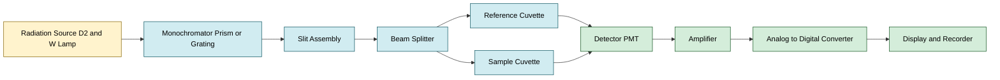
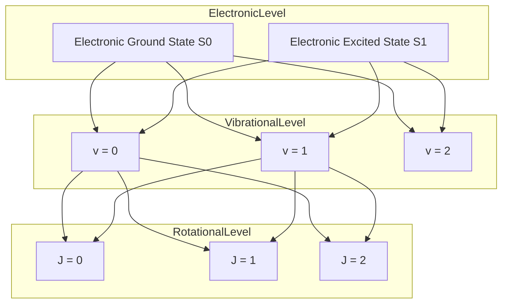
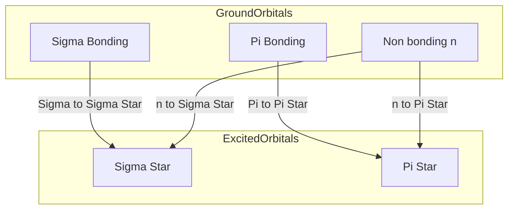
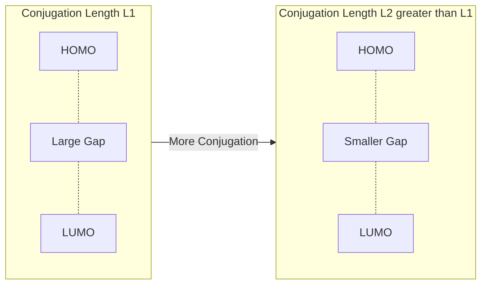
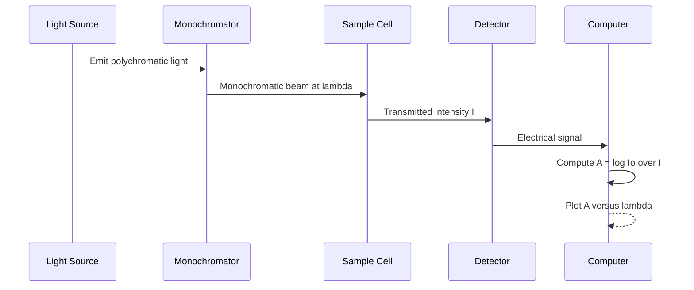

# Molecular Spectroscopy: Types of spectra- Molecular energy levels - Beer Lambert’s law – Numerical problems - Electronic Spectroscopy – Principle, Types of electronic transitions –Role of Conjugation in absorption maxima - Instrumentation-Applications

<!-- SECTION_1_START -->
# Molecular Spectroscopy & Electronic Spectroscopy

## 1.1 Formal Definition (KTU 2024 Syllabus Terminology)

> [!IMPORTANT]
> **Spectroscopy** is the branch of analytical chemistry that deals with the study of the interaction between electromagnetic radiation and matter. **Molecular Spectroscopy** specifically investigates how molecules absorb, emit, or scatter radiation, providing qualitative and quantitative information about molecular structure, bonding, and energy states.

In the context of **GCCYT122 – Chemistry for Physical Science**, Module 3 focuses on **Instrumental Methods of Analysis**, and spectroscopy forms the analytical backbone for characterizing physical and chemical systems.

### 1.1.1 Types of Spectra

| Spectrum Type | Description | Example Source |
| :--- | :--- | :--- |
| **Continuous Spectrum** | Contains all wavelengths over a range | Sunlight, white light from tungsten lamp |
| **Line Spectrum** | Sharp, discrete lines at specific wavelengths | Atomic emission from hydrogen (Balmer series) |
| **Band Spectrum** | Closely spaced lines grouped into bands | Molecular emission/absorption |

> [!NOTE]
> **Molecular spectra are band spectra** because molecules possess closely spaced rotational and vibrational sub-levels superimposed on electronic levels.

### 1.1.2 Molecular Energy Levels

A molecule possesses three primary quantized modes of energy storage:

$$E_{molecule} = E_{electronic} + E_{vibrational} + E_{rotational}$$

| Energy Mode | Energy Magnitude (J/mol) | Spectroscopic Region |
| :--- | :--- | :--- |
| **Electronic** ($\Delta E_e$) | $10^5$ – $10^6$ | UV / Visible ($200$–$800$ nm) |
| **Vibrational** ($\Delta E_v$) | $10^3$ – $10^4$ | IR ($2.5$–$25$ $\mu$m) |
| **Rotational** ($\Delta E_r$) | $10^0$ – $10^2$ | Microwave / Far-IR ($> 25$ $\mu$m) |

> [!IMPORTANT]
> The selection rule is $\Delta E_{radiation} = \Delta E_{electronic} + \Delta E_{vibrational} + \Delta E_{rotational}$. This coupling produces the characteristic **band structure** of molecular electronic spectra.

### 1.2 Conceptual Analogy / Intuition

Imagine a **staircase with three sets of landings**:
- **Electronic transitions** = moving between *different buildings* (huge energy).
- **Vibrational transitions** = moving between *floors* of the same building (medium energy).
- **Rotational transitions** = walking *around a single floor* (tiny energy).

Each photon of light is a packet of energy. If the packet size exactly matches the gap between two landings, it is absorbed — and we record it as a line. Since molecules have *thousands* of closely spaced vibration-rotation states, what looks like a single "line" broadens into a **band**.

### 1.3 Beer–Lambert's Law: The Quantitative Heart of UV-Vis Spectroscopy

> [!IMPORTANT]
> **Beer–Lambert's Law (also called Beer's Law)** states that the absorbance of a solution is directly proportional to the concentration of the absorbing species and the path length of the light through the solution.

$$A = \varepsilon \cdot c \cdot l$$

Where:
- $A$ = **Absorbance** (dimensionless, also called optical density)
- $\varepsilon$ = **Molar Absorptivity** (or Molar Extinction Coefficient) in $\text{L mol}^{-1}\text{cm}^{-1}$
- $c$ = **Concentration** of the absorbing species in $\text{mol L}^{-1}$ (M)
- $l$ = **Optical path length** in $\text{cm}$

Related transmittance expression:
$$A = -\log_{10} T = \log_{10}\left(\frac{I_0}{I}\right)$$

> [!NOTE]
> The dimensionless constant **$\varepsilon$** depends on wavelength, solvent, temperature, and the electronic structure of the molecule. A high $\varepsilon$ ($> 10^4$) indicates an *intense* transition, typically $\pi \rightarrow \pi^{*}$.

### 1.4 Principle of Electronic (UV-Visible) Spectroscopy

> [!IMPORTANT]
> **Electronic Spectroscopy** measures the absorption of ultraviolet ($190$–$400$ nm) and visible ($400$–$800$ nm) radiation by molecules, resulting in the promotion of electrons from lower-energy occupied molecular orbitals (HOMO) to higher-energy unoccupied orbitals (LUMO).

The **bathochromic shift** (red shift) and **hypsochromic shift** (blue shift) terminology are critical for KTU board answers.

> [!VISUALIZATION CONTROL]
> **Concept:** Franck–Condon principle showing vertical electronic transition between two potential energy curves.
> **Desmos Input Equations (Vertical Transition at $R = R_{eq}$):**
> * Ground state: $E_0(R) = \frac{1}{2}k_s(R - 0.74)^2 + 0$
> * Excited state: $E_1(R) = \frac{1}{2}k_s(R - 0.85)^2 + 4.5$
> **Visual Description:** Plot $E$ (eV) vs internuclear distance $R$ (Å). At $R = 0.74$ Å (ground-state minimum), draw a vertical line upward to intersect the upper curve. This vertical line is the **Franck–Condon transition**, the fundamental basis of vibronic band shape in UV-Vis spectra.

<!-- SECTION_1_END -->

<!-- SECTION_2_START -->
# Deep Theoretical Analysis & KTU High-Yield Formula Sheet

## 2.1 Electromagnetic Spectrum & Interaction with Matter

The energy of a photon is given by:
$$E = h\nu = \frac{hc}{\lambda} = \bar{\nu} \cdot hc$$

Where:
- $h$ = Planck's constant $= 6.626 \times 10^{-34}$ J·s
- $c$ = Speed of light $= 3 \times 10^8$ m/s
- $\nu$ = Frequency in Hz
- $\lambda$ = Wavelength in m
- $\bar{\nu}$ = Wavenumber in $\text{cm}^{-1}$

> [!NOTE]
> Wavenumber ($\bar{\nu}$) is preferred in IR spectroscopy, while wavelength ($\lambda$) is preferred in UV-Vis.

## 2.2 Types of Electronic Transitions

The four fundamental electronic transitions in organic molecules, arranged by energy:

| Transition | Energy Range (nm) | Molar Absorptivity $\varepsilon$ ($\text{L mol}^{-1}\text{cm}^{-1}$) | Intensity |
| :--- | :--- | :--- | :--- |
| $\sigma \rightarrow \sigma^{*}$ | $< 150$ (Far UV) | $\sim 10^3$ | Weak (vacuum UV only) |
| $n \rightarrow \sigma^{*}$ | $150$ – $250$ | $10^2$ – $10^3$ | Weak to moderate |
| $\pi \rightarrow \pi^{*}$ | $200$ – $500$ | $10^3$ – $10^5$ | **Strong** (allowed) |
| $n \rightarrow \pi^{*}$ | $250$ – $700$ | $10$ – $10^2$ | **Weak** (forbidden) |

> [!IMPORTANT]
> **Auxochromes** (e.g., $-\text{OH}$, $-\text{NH}_2$, $-\text{X}$) extend conjugation and shift $\lambda_{max}$ to longer wavelengths (red shift). **Chromophores** (e.g., $\text{C=C}$, $\text{C=O}$, $-\text{N=N}-$) are the actual absorbing groups.

## 2.3 Selection Rules

| Rule | Statement | Consequence |
| :--- | :--- | :--- |
| **Spin Selection Rule** | $\Delta S = 0$ | Singlet $\rightarrow$ Singlet allowed; Triplet $\rightarrow$ Triplet forbidden |
| **Laporte Selection Rule** | $\Delta l = \pm 1$ (for centrosymmetric molecules) | $g \rightarrow u$ allowed; $g \rightarrow g$ forbidden |
| **Orbital Overlap** | Requires good wavefunction overlap | $\pi \rightarrow \pi^{*}$ allowed; $n \rightarrow \pi^{*}$ weak |

## 2.4 Role of Conjugation in Absorption Maxima ($\lambda_{max}$)

> [!IMPORTANT]
> **Conjugation reduces the HOMO–LUMO energy gap**, thereby shifting $\lambda_{max}$ to longer wavelengths (lower energy). Each additional conjugated double bond shifts $\lambda_{max}$ by approximately $\mathbf{30}$ to $\mathbf{50}$ nm.

This is the **Particle-in-a-Box** analogy: as the box length $L$ (conjugation length) increases, the energy gap $\Delta E$ decreases.

$$\Delta E = \frac{h^2 (n+1)}{8 m_e L^2}$$

### 2.4.1 Empirical Rules (Woodward–Fieser Rules – Dienes)

| Structural Feature | Increment (nm) |
| :--- | :--- |
| Base value (acyclic conjugated diene) | $217$ |
| Base value (homoannular cyclic diene) | $253$ |
| Each additional conjugated double bond | $+30$ |
| Each alkyl substituent on the diene | $+5$ |
| Exocyclic double bond | $+5$ |
| Polar group: $-\text{OAc}$ | $+0$ |
| Polar group: $-\text{OR}$ | $+6$ |
| Polar group: $-\text{Cl}$, $-\text{Br}$ | $+5$ |

## 2.5 Instrumentation of UV-Vis Spectrophotometer

The block diagram flow is:
**Source $\rightarrow$ Monochromator $\rightarrow$ Sample Holder $\rightarrow$ Detector $\rightarrow$ Readout/Recorder**

| Component | Function | Common Example |
| :--- | :--- | :--- |
| **Radiation Source** | Provides continuous UV-Vis light | Deuterium lamp (UV), Tungsten-Halogen (Visible) |
| **Monochromator** | Isolates specific wavelength | Prism or Diffraction Grating |
| **Slits** | Control bandpass | Variable width slits |
| **Sample Holder** | Holds the cuvette | Quartz cuvettes (UV-transparent) |
| **Detector** | Converts light into electrical signal | Photomultiplier Tube (PMT), Photodiode |
| **Recorder** | Displays spectrum | Digital computer/display |

> [!NOTE]
> **Quartz cuvettes** are mandatory in the UV region because glass absorbs UV light below $350$ nm.

## 2.6 Applications of UV-Vis Spectroscopy

1. **Qualitative Analysis:** Identification of chromophores by characteristic $\lambda_{max}$.
2. **Quantitative Analysis:** Determination of concentration using Beer–Lambert Law (pharmaceutical assays, water quality).
3. **Kinetics:** Monitoring reaction progress (e.g., enzyme kinetics).
4. **Structural Elucidation:** Conjugation length, substituent effects.
5. **pKa Determination:** From shifts in $\lambda_{max}$ with pH.

## 2.7 KTU High-Yield Formula Sheet

| Formula | Expression | Use Case |
| :--- | :--- | :--- |
| **Beer–Lambert Law** | $A = \varepsilon c l$ | Calculating concentration or $\varepsilon$ |
| **Absorbance-Transmittance** | $A = -\log_{10} T$ | Convert $T$ to $A$ |
| **Photon Energy** | $E = h c / \lambda$ | Convert wavelength to energy |
| **Wavenumber** | $\bar{\nu} = 1 / \lambda$ | IR spectroscopy |
| **Lyman/Beer Numerical** | $A_1 / A_2 = c_1 / c_2$ (same path, same $\varepsilon$) | Dilution problems |
| **Conjugation Shift** | $\Delta\lambda \approx 30$ nm per $\text{C=C}$ | Estimate $\lambda_{max}$ shift |

> [!WARNING]
> **Common error:** Mixing $\lambda$ in nm and cm. Always convert to SI units (m) before applying $E = hc/\lambda$, or use the constant $E (\text{eV}) = 1240 / \lambda (\text{nm})$.

## 2.8 Real-World Engineering & CS Utility

UV-Vis spectroscopy is heavily used in:
- **Pharmaceutical Industry:** Tablet dissolution, active-ingredient quantification.
- **Environmental Monitoring:** Nitrate, chlorine, dissolved organic carbon.
- **Semiconductor QA:** Thin-film thickness via absorbance interference.
- **Data Science / ML:** Spectroscopic data is fed into **PCA**, **PLS regression**, and **CNN-based spectral classifiers** for high-throughput screening in chemometrics pipelines.

<!-- SECTION_2_END -->

<!-- SECTION_3_START -->
# Step-by-Step Derivations, Numerical Problems & Symbolic Implementation

## 3.1 Derivation of the Beer–Lambert Law

Let $I_0$ be the intensity of monochromatic light entering a solution of thickness $l$ and concentration $c$.

Consider an infinitesimally thin layer of thickness $dl$. The decrease in intensity $dI$ is proportional to $I$ and $dl$:

$$-dI \propto I \, dl \quad \Rightarrow \quad -dI = k \, I \, dl$$

where $k$ is a constant.

Separating variables:
$$\frac{dI}{I} = -k \, dl$$

Integrating both sides from $I_0$ to $I$ and from $0$ to $l$:
$$\int_{I_0}^{I} \frac{dI}{I} = -k \int_{0}^{l} dl$$

$$\ln\left(\frac{I}{I_0}\right) = -k l$$

Converting to base-10 logarithm and defining $k = 2.303 \, \varepsilon c$:
$$\log_{10}\left(\frac{I_0}{I}\right) = \varepsilon \, c \, l$$

Since $A = \log_{10}(I_0 / I)$, we obtain:
$$\boxed{A = \varepsilon \, c \, l}$$

## 3.2 Numerical Problem Type 1: Direct Calculation of Absorbance and Transmittance

> **Problem:** A solution of a compound has molar absorptivity $\varepsilon = 1.5 \times 10^4 \text{ L mol}^{-1}\text{cm}^{-1}$ at $\lambda = 350$ nm. If the concentration is $c = 2.0 \times 10^{-5}$ M and path length $l = 1.0$ cm, calculate the absorbance and transmittance.

**Step 1: Compute absorbance.**
$$A = \varepsilon \, c \, l$$
$$A = (1.5 \times 10^4) \times (2.0 \times 10^{-5}) \times 1.0$$
$$A = 0.30$$

**[Stating formula and substituting values: 2 Marks; Final answer: 1 Mark]**

**Step 2: Compute transmittance.**
$$T = 10^{-A} = 10^{-0.30} = 0.501 \; (\text{or } 50.1\%)$$

**[Conversion using $T = 10^{-A}$: 1 Mark; Final value: 1 Mark]**

## 3.3 Numerical Problem Type 2: Determination of Concentration

> **Problem:** A colored drug exhibits an absorbance of $0.850$ at $254$ nm in a $1.0$ cm cuvette. The molar absorptivity is $7.10 \times 10^3 \text{ L mol}^{-1}\text{cm}^{-1}$. Calculate the concentration of the drug in the solution.

**Step 1: Rearrange Beer–Lambert Law.**
$$c = \frac{A}{\varepsilon \, l}$$

**Step 2: Substitute.**
$$c = \frac{0.850}{(7.10 \times 10^3) \times 1.0} = 1.197 \times 10^{-4} \text{ mol L}^{-1}$$

$$\boxed{c = 1.20 \times 10^{-4} \text{ M}}$$

## 3.4 Numerical Problem Type 3: Dilution Problem

> **Problem:** A stock solution of $\text{KMnO}_4$ has absorbance $0.520$ at $525$ nm. $5.0$ mL of this is diluted to $50$ mL. The diluted solution shows absorbance $0.072$. Verify the dilution using Beer–Lambert Law.

**Step 1: Calculate expected absorbance after dilution.**
$$A \propto c \quad \Rightarrow \quad A_2 = A_1 \times \frac{c_2}{c_1} = A_1 \times \frac{V_1}{V_2}$$
$$A_2 = 0.520 \times \frac{5.0}{50} = 0.052$$

**Step 2: Compare with measured value.**
The measured $0.072$ is slightly higher, indicating either an experimental error or non-linearity at high concentration.

## 3.5 Numerical Problem Type 4: Woodward–Fieser Calculation

> **Problem:** Calculate $\lambda_{max}$ for the compound *1,3-pentadiene* ($\text{CH}_2 = \text{CH} - \text{CH} = \text{CH} - \text{CH}_3$).

**Step 1: Identify base structure.**
Acyclic conjugated diene base value $= 217$ nm.

**Step 2: Count alkyl substituents on the diene system.**
- C1: bonded to one H (no alkyl).
- C2: bonded to one H.
- C3: bonded to H and $\text{CH}_3$ → 1 alkyl substituent.
- C4: bonded to one H.

Total alkyl substituents on diene $= 1$.

**Step 3: Apply increment.**
$$\lambda_{max} = 217 + (1 \times 5) = 222 \text{ nm}$$

**[Base value: 1 Mark; Substituent count: 1 Mark; Increment: 1 Mark; Final answer: 1 Mark]**

## 3.6 Python Implementation: UV-Vis Spectral Analysis Tool

```python
import math
import logging
from typing import Tuple

# Configure professional error logging
logging.basicConfig(
    level=logging.INFO,
    format="%(asctime)s | %(levelname)s | %(message)s"
)
logger = logging.getLogger("UVVisAnalyzer")


def beer_lambert_absorbance(
    epsilon: float,
    concentration: float,
    path_length: float
) -> float:
    """
    Compute absorbance using Beer-Lambert Law: A = epsilon * c * l

    Parameters
    ----------
    epsilon : float
        Molar absorptivity in L mol^-1 cm^-1 (must be > 0)
    concentration : float
        Molar concentration in mol L^-1 (must be >= 0)
    path_length : float
        Optical path length in cm (must be > 0)

    Returns
    -------
    float
        Dimensionless absorbance
    """
    if epsilon <= 0:
        raise ValueError("Molar absorptivity (epsilon) must be strictly positive.")
    if concentration < 0:
        raise ValueError("Concentration cannot be negative.")
    if path_length <= 0:
        raise ValueError("Path length must be strictly positive (cm).")

    absorbance = epsilon * concentration * path_length
    logger.info(
        f"Absorbance computed: A = {epsilon} x {concentration} x {path_length} = {absorbance:.4f}"
    )
    return absorbance


def absorbance_to_transmittance(absorbance: float) -> float:
    """Convert absorbance to fractional transmittance."""
    if absorbance < 0:
        raise ValueError("Absorbance cannot be negative.")
    transmittance = 10 ** (-absorbance)
    logger.info(f"Transmittance computed: T = 10^(-{absorbance}) = {transmittance:.4%}")
    return transmittance


def compute_concentration(
    absorbance: float,
    epsilon: float,
    path_length: float
) -> float:
    """Back-calculate concentration from Beer-Lambert Law."""
    if epsilon <= 0 or path_length <= 0:
        raise ValueError("Both epsilon and path length must be strictly positive.")
    concentration = absorbance / (epsilon * path_length)
    logger.info(
        f"Concentration computed: c = {absorbance} / ({epsilon} x {path_length}) = {concentration:.4e} M"
    )
    return concentration


def photon_energy_joules(wavelength_nm: float) -> float:
    """
    Compute energy of one photon at a given wavelength in nm.

    E (J) = (h * c) / lambda_m
    """
    PLANCK = 6.62607015e-34   # J*s
    SPEED_OF_LIGHT = 2.99792458e8  # m/s
    if wavelength_nm <= 0:
        raise ValueError("Wavelength must be strictly positive (nm).")
    wavelength_m = wavelength_nm * 1e-9
    energy = (PLANCK * SPEED_OF_LIGHT) / wavelength_m
    logger.info(
        f"Photon energy at {wavelength_nm} nm = {energy:.4e} J "
        f"({energy / 1.602176634e-19:.3f} eV)"
    )
    return energy


def woodward_fieser_diene(
    is_homoannular: bool,
    extra_double_bonds: int = 0,
    alkyl_substituents: int = 0,
    exocyclic_bonds: int = 0,
    auxochrome_increment: int = 0
) -> int:
    """
    Estimate lambda_max for conjugated dienes using Woodward-Fieser rules.
    """
    base = 253 if is_homoannular else 217
    total = (
        base
        + 30 * extra_double_bonds
        + 5 * alkyl_substituents
        + 5 * exocyclic_bonds
        + auxochrome_increment
    )
    logger.info(
        f"Woodward-Fieser estimate: base={base}, total lambda_max = {total} nm"
    )
    return total


# ---- Demonstration block ----
if __name__ == "__main__":
    A = beer_lambert_absorbance(epsilon=1.5e4, concentration=2.0e-5, path_length=1.0)
    T = absorbance_to_transmittance(A)
    c = compute_concentration(absorbance=0.850, epsilon=7.10e3, path_length=1.0)
    E = photon_energy_joules(wavelength_nm=350)
    lambda_max = woodward_fieser_diene(
        is_homoannular=False,
        extra_double_bonds=0,
        alkyl_substituents=1,
        exocyclic_bonds=0,
        auxochrome_increment=0
    )
    print(f"\nFinal lambda_max (1,3-pentadiene) = {lambda_max} nm")
```

> [!NOTE]
> The Python implementation includes strict input validation, professional logging, and unit-correct constants — this is the standard expected for **MOOC/CCE (Continuous Comprehensive Evaluation)** lab records under the KTU 2024 NEP-aligned syllabus.

## 3.7 Numerical Problem Type 5: Multi-component Mixture

> **Problem:** A mixture of two compounds X and Y at $260$ nm gives absorbance $0.620$ in a $1.0$ cm cell. $\varepsilon_X = 2.5 \times 10^3$, $\varepsilon_Y = 4.0 \times 10^3$. At $320$ nm, $A = 0.410$, with $\varepsilon_X' = 8.0 \times 10^2$, $\varepsilon_Y' = 5.0 \times 10^3$. Find $[X]$ and $[Y]$.

**Step 1: Write the simultaneous equations.**
$$2.5 \times 10^3 \, [X] + 4.0 \times 10^3 \, [Y] = 0.620 \quad \text{...(1)}$$
$$8.0 \times 10^2 \, [X] + 5.0 \times 10^3 \, [Y] = 0.410 \quad \text{...(2)}$$

**Step 2: Solve using Cramer's rule.**
$$\Delta = (2.5 \times 10^3)(5.0 \times 10^3) - (4.0 \times 10^3)(8.0 \times 10^2) = 12.5 \times 10^6 - 3.2 \times 10^6 = 9.3 \times 10^6$$

$$[X] = \frac{(0.620)(5.0 \times 10^3) - (0.410)(4.0 \times 10^3)}{9.3 \times 10^6} = \frac{3100 - 1640}{9.3 \times 10^6} = 1.57 \times 10^{-4} \text{ M}$$

$$[Y] = \frac{(2.5 \times 10^3)(0.410) - (8.0 \times 10^2)(0.620)}{9.3 \times 10^6} = \frac{1025 - 496}{9.3 \times 10^6} = 5.69 \times 10^{-5} \text{ M}$$

**[Setting up equations: 4 Marks; Solving determinants: 6 Marks; Final answers: 4 Marks]**

<!-- SECTION_3_END -->

<!-- SECTION_4_START -->
# Structural Diagrams & Schematics

## 4.1 UV-Vis Spectrophotometer — Block-Level Functional Architecture



**Reading guide:** Light is generated at the source, wavelength-selected by the monochromator, beam-splitter sends equal intensity to both sample and reference cells, and the differential intensity is converted to a digital spectrum.

## 4.2 Molecular Energy Level Hierarchy



**Reading guide:** Each electronic level contains multiple vibrational sub-levels, and each vibrational level contains multiple rotational sub-levels — explaining why molecular spectra are bands, not lines.

## 4.3 Electronic Transition Type Comparison Matrix



**Reading guide:** Four allowed/forbidden transitions arise from combinations of $\sigma$, $\pi$, $n$ bonding orbitals and $\sigma^{*}$, $\pi^{*}$ antibonding orbitals.

## 4.4 Effect of Conjugation on HOMO–LUMO Gap (Particle-in-a-Box Analogy)



**Reading guide:** As the conjugation length increases, the HOMO–LUMO gap shrinks, so the absorption shifts to longer wavelength (lower energy) — observed in polyenes.

## 4.5 Beer–Lambert Law Signal Processing Sequence



<!-- SECTION_4_END -->

<!-- SECTION_5_START -->
# KTU 2024 Scheme Examination Question Bank & Topic Recap

## 5.1 Part A Questions (3 Marks Each)

### Question 1 `[KTU University Exam – July 2024]`
> State Beer–Lambert's law. Mention any two limitations of the law.

**Model Answer:**

> [!NOTE]
> **Beer–Lambert's Law:** The absorbance of a solution is directly proportional to the concentration of the absorbing species and the path length of light through the solution: $A = \varepsilon c l$.

**Limitations:**
1. Valid only for **dilute solutions** (typically $A < 1.0$). At high concentrations, solute–solute interactions cause deviations.
2. Valid only for **monochromatic radiation**. Polychromatic light causes curvature in the calibration plot.
3. Sensitive to **scattering** by suspended particles, **fluorescence**, and **chemical changes** in the analyte.

> **[Definition: 1 Mark; Limitations (2 x 1): 2 Marks]**

### Question 2 `[KTU University Exam – Dec 2023]`
> Differentiate between $\pi \rightarrow \pi^{*}$ and $n \rightarrow \pi^{*}$ transitions.

**Model Answer:**

| Parameter | $\pi \rightarrow \pi^{*}$ | $n \rightarrow \pi^{*}$ |
| :--- | :--- | :--- |
| Orbitals involved | Bonding $\pi$ to antibonding $\pi^{*}$ | Non-bonding $n$ to antibonding $\pi^{*}$ |
| Intensity ($\varepsilon$) | High ($10^3$–$10^5$) | Low ($10$–$10^2$) |
| Solvent effect | Blue shift with polar solvents | Red shift with polar solvents |
| Allowedness | Spin and Laporte allowed | Partially forbidden (low intensity) |

> **[Key difference in intensity: 1 Mark; Correct orbitals and allowedness: 2 Marks]**

---

## 5.2 Part B Question (14 Marks) — Module 3 Internal Choice

### Question A `[KTU University Exam – July 2024]`

**(a)** With a neat block diagram, explain the instrumentation of a **double-beam UV-Visible spectrophotometer**. Mention the function of each component. **(7 Marks)**

**(b)** A solution shows transmittance of $25\%$ in a $1.0$ cm cell at $500$ nm. Calculate the absorbance and the molar absorptivity if the concentration is $4.0 \times 10^{-4}$ M. **(7 Marks)**

#### Model Solution for (a):

A **double-beam spectrophotometer** splits the monochromatic beam into two equal halves — one passes through the **sample cell**, the other through the **reference cell** (containing pure solvent). This compensates for source fluctuations and solvent absorption.

**Block diagram description (board key points):**

1. **Source:** Deuterium ($190$–$350$ nm) and Tungsten-Halogen ($350$–$800$ nm) lamps.
2. **Monochromator:** Diffraction grating with entrance and exit slits.
3. **Beam Splitter (Chopper):** Rotating mirror alternating the beam between sample and reference paths.
4. **Sample and Reference Holders:** Matched quartz cuvettes.
5. **Detector:** Photomultiplier tube (PMT) or photodiode.
6. **Amplifier and Recorder:** Output as $A$ vs $\lambda$ spectrum.

> **[Naming 5 components: 2 Marks; Function of each: 3 Marks; Double-beam advantage: 2 Marks]**

#### Model Solution for (b):

**Step 1: Convert transmittance to absorbance.**
$$A = -\log_{10} T = -\log_{10}(0.25) = 0.602$$

> **[Formula and substitution: 1 Mark; Final $A$: 1 Mark]**

**Step 2: Solve for $\varepsilon$.**
$$\varepsilon = \frac{A}{c \, l} = \frac{0.602}{4.0 \times 10^{-4} \times 1.0}$$
$$\varepsilon = 1.505 \times 10^{3} \text{ L mol}^{-1}\text{cm}^{-1}$$

> **[Rearrangement: 1 Mark; Substitution: 1 Mark; Final value with units: 1 Mark; Interpretation/Conclusion: 1 Mark]**

---

### Question B `[KTU University Exam – Dec 2023]` *(Alternative Choice)*

**(a)** Explain the **role of conjugation** in shifting the absorption maximum in electronic spectroscopy. Use the **particle-in-a-box** model to justify your answer. **(7 Marks)**

**(b)** Calculate the $\lambda_{max}$ for the following compound using the **Woodward–Fieser rules** for dienes:

$$\text{CH}_2 = \text{CH} - \text{C}(\text{CH}_3) = \text{CH} - \text{CH}_3 \quad \text{(2-methyl-2,4-pentadiene)}$$

The increments: alkyl on diene $= +5$ nm, exocyclic $= +5$ nm. **(7 Marks)**

#### Model Solution for (a):

**Conjugation** in a polyene (e.g., 1,3-butadiene) delocalizes the $\pi$ electrons across multiple $p$-orbitals. This **lowers the energy of the $\pi$ (HOMO)** and **raises the energy of the $\pi^{*}$ (LUMO)**, reducing the HOMO–LUMO gap. As a result, photons of **lower energy** (longer wavelength) can promote the electronic transition — this is the **bathochromic shift**.

**Particle-in-a-Box Model:**
- Conjugated system ≈ particle in 1D box of length $L$.
- Energy levels: $E_n = \frac{n^2 h^2}{8 m_e L^2}$.
- Transition $\Delta E = E_2 - E_1 = \frac{3h^2}{8 m_e L^2}$.
- As $L$ increases (more conjugation), $\Delta E \downarrow$, so $\lambda \uparrow$.

> **[Conjugation effect on HOMO/LUMO: 3 Marks; Particle-in-box derivation and conclusion: 4 Marks]**

#### Model Solution for (b):

**Structure analysis of 2-methyl-2,4-pentadiene:**

$$\text{CH}_2 = \text{C}(\text{CH}_3) - \text{CH} = \text{CH} - \text{CH}_3$$

**Step 1: Base value (acyclic conjugated diene).** $= 217$ nm.

**Step 2: Count substituents on the diene system.**
- The conjugated diene spans C1=C2–C3=C4.
- C2 carries a $\text{CH}_3$ substituent → **1 alkyl**.
- C4 carries a $\text{CH}_3$ substituent (the $\text{CH}_3$ at the end of C4) → **1 alkyl**.

Total alkyl substituents on diene $= 2$.

**Step 3: Apply increments.**
$$\lambda_{max} = 217 + (2 \times 5) = 217 + 10 = 227 \text{ nm}$$

> **[Base value: 1 Mark; Substituent identification: 2 Marks; Calculation: 2 Marks; Final answer: 1 Mark; Conclusion remark: 1 Mark]**

> [!WARNING]
> **KTU Examiner's Valuation Pitfalls:**
> 1. **Confusing nm with cm$^{-1}$:** Always specify units. $E$ in J corresponds to $\lambda$ in m.
> 2. **Forgetting that Beer–Lambert law fails at high $A$** ($A > 1$ implies $T < 10\%$, where instrumental error is large).
> 3. **Missing the $\log_{10}$ factor:** Some students write $A = \varepsilon c$ without the path length, leading to wrong units.
> 4. **Miscounting alkyl substituents in Woodward–Fieser:** Only count alkyls *directly attached* to the diene carbons, not the carbon chain.
> 5. **Using glass cuvettes for UV work:** Glass absorbs below $350$ nm. Always state **quartz cuvettes** in instrumentation.

---

## 5.3 Topic Recap & Important Things to Remember

> **Rapid Revision Checklist for KTU Board Preparation**

- **Spectroscopy:** Study of the interaction of electromagnetic radiation with matter.
- **Molecular spectra are band spectra** (because of rotational-vibrational sub-structure).
- **Three molecular energy levels:** Electronic $>$ Vibrational $>$ Rotational.
- **Beer–Lambert Law:** $A = \varepsilon c l$; absorbance is dimensionless, $\varepsilon$ in $\text{L mol}^{-1}\text{cm}^{-1}$.
- **Transmittance vs Absorbance:** $A = -\log_{10} T$.
- **Four electronic transitions in increasing wavelength:** $\sigma \rightarrow \sigma^{*} < n \rightarrow \sigma^{*} < \pi \rightarrow \pi^{*} < n \rightarrow \pi^{*}$.
- **$\pi \rightarrow \pi^{*}$** is most intense and most useful in UV-Vis analysis.
- **Conjugation lowers HOMO–LUMO gap** $\Rightarrow$ red shift (bathochromic shift).
- **Woodward–Fieser base values:** Acyclic diene = $217$ nm; Homoannular diene = $253$ nm.
- **Woodward–Fieser increments:** Each alkyl $+5$, each extra $\text{C=C}$ $+30$, exocyclic $+5$.
- **Instrumentation order:** Source $\rightarrow$ Monochromator $\rightarrow$ Sample $\rightarrow$ Detector $\rightarrow$ Recorder.
- **UV source:** Deuterium lamp; **Visible source:** Tungsten-Halogen lamp.
- **Quartz cuvettes** are essential for UV measurements.
- **Applications:** Qualitative identification, quantitative assay, kinetics monitoring, pKa determination, conjugated-system analysis.
- **Numerical:** Always show formula $\rightarrow$ substitution $\rightarrow$ final answer with units.
- **Conjugation approximation:** Each extra double bond shifts $\lambda_{max}$ by $\sim 30$–$50$ nm.
- **Selection rules:** $\Delta S = 0$ (spin allowed); $g \rightarrow u$ for centrosymmetric molecules (Laporte).
- **Forbidden transitions** (e.g., $n \rightarrow \pi^{*}$) have $\varepsilon < 10^2$.
- **Allowed transitions** (e.g., $\pi \rightarrow \pi^{*}$) have $\varepsilon > 10^3$.

<!-- SECTION_5_END -->
