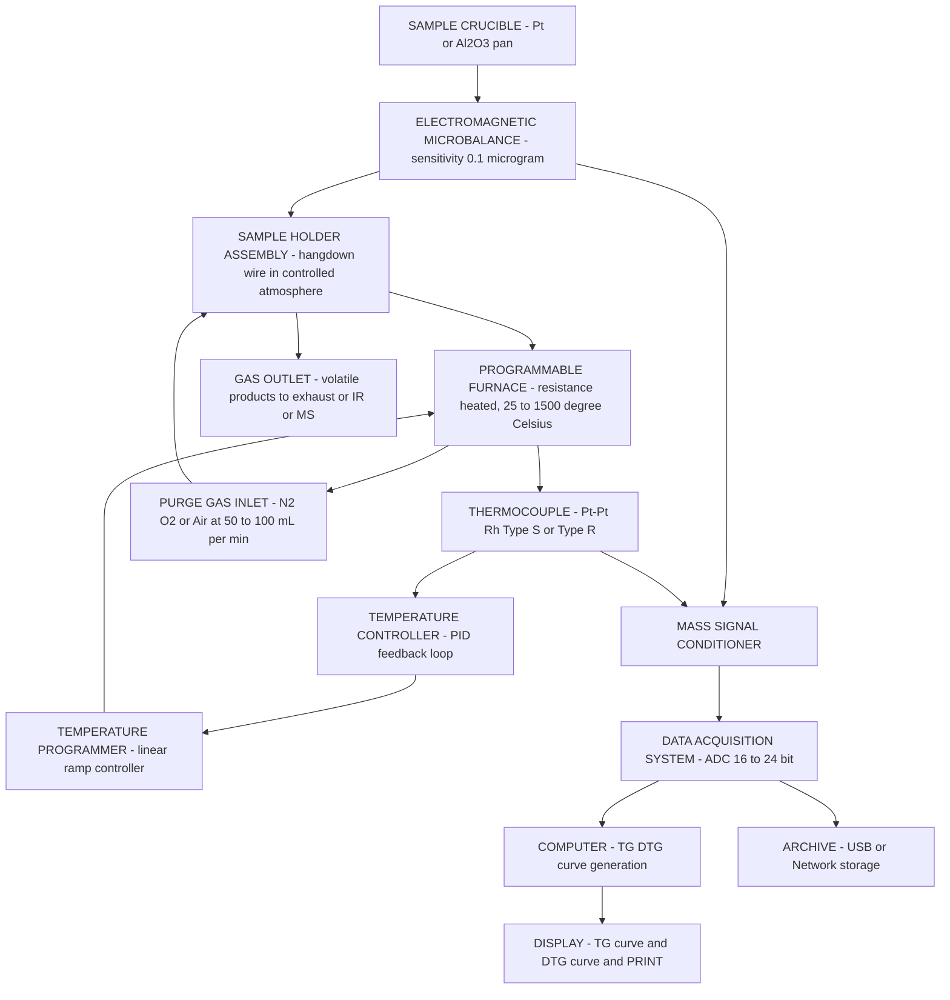
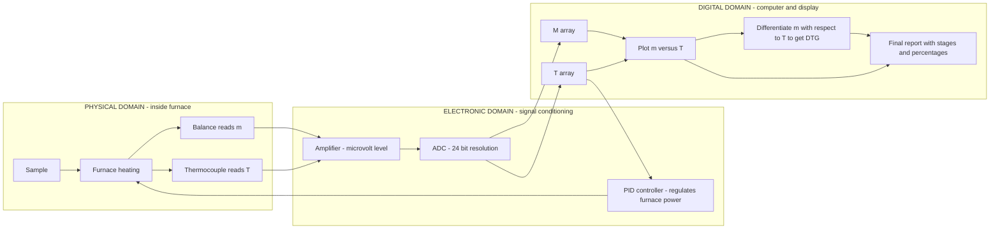
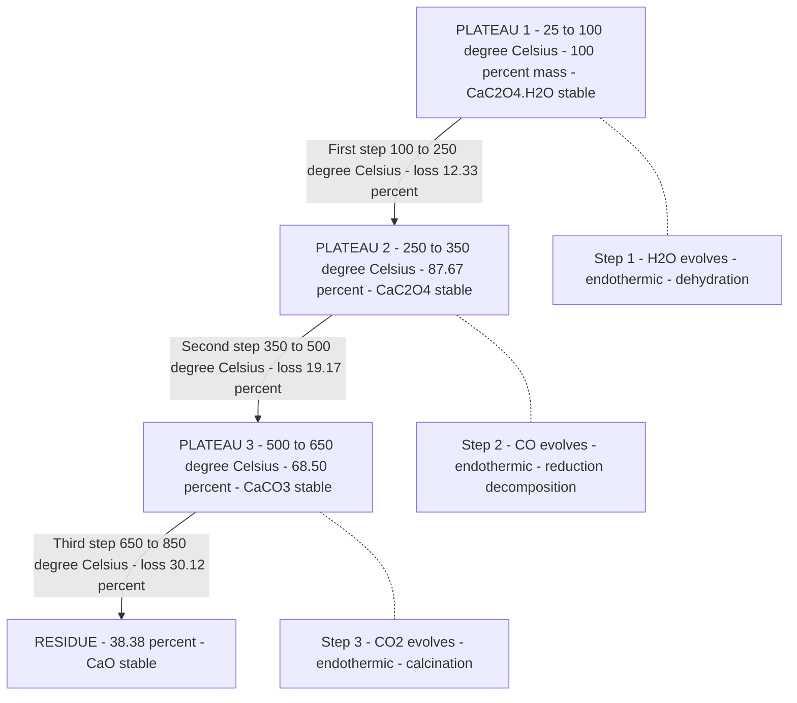
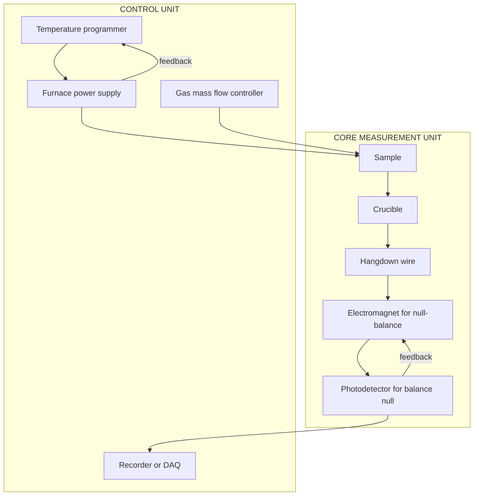

# Thermal analysis: –TGA- Principle, instrumentation (block diagram) and applications – TGA of CaC 2O4.H2O and polymers.

<!-- SECTION_1_START -->
# ⚖️ Thermal Gravimetric Analysis (TGA) — KTU Module 3 Comprehensive Notes

## 1.1 Core Technical Definition

> [!IMPORTANT]
> **Formal Definition (KTU 2024 Syllabus Aligned):**
> **Thermogravimetric Analysis (TGA)** is a branch of thermal analysis in which the **mass of a sample is measured as a function of temperature or time** while the sample is subjected to a controlled temperature programme under a specified atmosphere (inert, oxidising, or reducing). The technique quantitatively detects mass changes associated with thermal events such as dehydration, decomposition, oxidation, and sublimation, and is recorded as a continuous trace called a **thermogravimetric (TG) curve** or **thermogram**.

The instrument used is called a **Thermobalance**, which combines a highly sensitive microgram-level electronic balance with a programmable furnace, a temperature programmer, and a data acquisition system.

| Parameter | Standard Value / Unit |
|---|---|
| Sample mass range | **1 mg – 100 mg** |
| Temperature range | **Ambient to 1500 °C** (typical: 25 °C – 1000 °C) |
| Heating rate (β) | **1 – 20 °C/min** (standard: 10 °C/min) |
| Atmosphere | **N₂, Air, O₂, Ar, He** (flow rate 50 – 100 mL/min) |
| Balance sensitivity | **± 0.1 μg** (modern) / ± 1 μg (older) |
| Universal gas constant | **R = 8.314 J mol⁻¹ K⁻¹** |

### 1.2 Conceptual Analogy & Intuitive Understanding

> [!NOTE]
> **"The Precision Kitchen Scale of Chemists"**
> Imagine placing a pinch of sugar on a super-sensitive digital kitchen scale and slowly heating it on a stove. As the sugar caramelises, then chars, then turns to ash, the displayed weight keeps dropping. If you were to plot weight (y-axis) against time/temperature (x-axis), the resulting curve would tell you *exactly when* and *how much* was lost. **TGA is essentially this — but performed under milligram precision, with computer-controlled heating ramps, and under a chosen gas atmosphere.** Each "step-down" in the thermogram corresponds to a specific chemical event (loss of water, decomposition of carbonate, etc.), and the **height of the step = the mass lost**, while the **horizontal position = the temperature at which it occurred**.

This makes TGA a **"fingerprint" technique** for solids — the *shape* of the curve uniquely identifies the substance, while the *mass losses* give stoichiometric information.

> [!VISUALIZATION CONTROL]
> **Concept:** Schematic TGA curve with characteristic plateaus and steps
> **Idealised Curve (X-Y mapping):**
> * X-axis (Temperature): `T = 25 °C → 1000 °C`
> * Y-axis (Mass %): `m(T) = 100 - Σ(Δmᵢ × sigmoid(T - Tᵢ))`
> * Three characteristic **plateaus** (flat regions where mass is constant) separated by three **inflection steps** (sloped regions of mass loss).
> **Visual Description:** The student should see a staircase-like descent — horizontal flat lines (chemical stability zones) interrupted by smooth downward S-curves (decomposition events). The *first derivative* of this curve (DTG) shows sharp peaks at the inflection points of every step.

---

### 1.3 Two Modes of TGA Operation

> [!IMPORTANT]
> **Isothermal (Static) TGA:** The sample is held at a **constant temperature** and the mass is recorded as a function of **time**. Used to study **kinetics of decomposition** at a fixed temperature.
> **Non-Isothermal (Dynamic) TGA:** The sample is heated at a **linear heating rate β = dT/dt**, and the mass is recorded as a function of **temperature**. This is the **most common mode** and the one used for routine fingerprinting and compositional analysis.

### 1.4 The Thermogram — Anatomy of a TGA Curve

A typical TG curve is plotted with:
- **Y-axis:** Mass (mg) or **Mass percentage (%)** — relative to the initial mass.
- **X-axis:** Temperature (°C) or Time (min).

Key features:
1. **Plateau (horizontal segment):** Region of thermal stability where no mass change occurs.
2. **Step (sloped segment):** Region of mass loss corresponding to a specific chemical reaction.
3. **Inflection point (midpoint of a step):** Characteristic temperature for that event.
4. **Final residual mass:** Non-volatile matter (e.g., metal oxide, ash).

> [!NOTE]
> The **first derivative of the TG curve** is called the **Derivative Thermogravimetry (DTG) curve**: $\text{DTG} = \dfrac{dm}{dT}$. DTG peaks correspond to maximum rates of mass loss and provide sharper, more easily resolvable event temperatures than the TG curve itself.

---

<!-- SECTION_2_START -->
# 🔬 Deep Theoretical Analysis — TGA Principles, KTU Formula Sheet & Engineering Utility

## 2.1 Fundamental Principle — Mass, Heat, and Atmosphere

A thermogravimetric experiment relies on **three independent variables** being controlled or measured:

1. **Mass (m)** of the sample — measured continuously by an electromagnetic microbalance.
2. **Temperature (T)** of the sample — measured by a thermocouple placed as close to the sample as possible (NOT measuring furnace wall temperature).
3. **Time (t)** — implicit axis, because the furnace follows a programmed heating rate.

> [!IMPORTANT]
> **The Core Governing Relationship:**
> When a sample loses mass during heating, the change occurs because volatile products leave the sample pan. TGA assumes that **only volatile products escape** and that **non-volatile residues remain in the crucible**. The TG curve thus obeys:
> $$m(T) \;=\; m_0 \;-\; \sum_{i=1}^{n} \Delta m_i(T)$$
> where $m_0$ is the initial mass, $\Delta m_i$ is the mass lost in the $i^{th}$ step, and the sum runs over all thermal events up to temperature $T$.

The **percentage mass loss** at any temperature is:
$$\% \; \text{loss} \;=\; \frac{m_0 - m(T)}{m_0} \times 100$$

## 2.2 Step-by-Step Logic of a TGA Experiment

1. **Sample Preparation:** A small, finely-ground, homogeneous sample (typically **5–15 mg**) is placed in a pre-tared **platinum, alumina, or quartz crucible**. The sample is distributed as a **thin, even layer** to avoid temperature gradients.
2. **Atmosphere Selection:** A purge gas (N₂ for inert, O₂/air for oxidative, forming gas for reduction) flows at a controlled rate to sweep away volatile products and prevent re-condensation on cooler parts.
3. **Temperature Programming:** The furnace follows a linear ramp: $T(t) = T_0 + \beta t$, where $\beta$ is the heating rate (°C/min).
4. **Continuous Monitoring:** Mass and temperature are recorded digitally every fraction of a second.
5. **Data Output:** The instrument plots $m$ vs. $T$ (or $t$) — this is the **TG curve**. The first derivative (DTG) is also computed.
6. **Interpretation:** Each step is assigned a chemical reaction, the mass loss is calculated, and the **residual mass** is identified.

## 2.3 Crucial "Why" Questions Answered

> **Q1. Why use a small sample mass?**
> Small mass ensures (a) uniform temperature throughout the sample (no thermal lag), (b) avoids diffusion limitations of evolved gases, and (c) prevents overloading the balance.

> **Q2. Why is the heating rate important?**
> Higher β shifts decomposition temperatures to higher values (kinetic lag). Lower β gives sharper, well-resolved steps but takes longer. **β = 10 °C/min** is the KTU-recognised standard.

> **Q3. Why use a controlled atmosphere?**
> The atmosphere determines the chemistry. CaC₂O₄ in N₂ gives CaO + CO + CO₂, but in pure O₂ it may oxidise differently. Polymers in N₂ undergo **pyrolysis**, while in air they undergo **thermo-oxidative degradation**.

> **Q4. Why is a DTG curve useful?**
> DTG peaks pinpoint the temperature of **maximum rate of mass loss** $(d^2m/dT^2 = 0)$, making overlapping events easier to deconvolute than on the raw TG trace.

## 2.4 KTU High-Yield Formula Sheet

> [!IMPORTANT]
> Below is the **consolidated formula bank** for TGA — all values are SI/standard; escape any `|` symbols with `\vert` for safe table rendering.

| # | Formula / Concept | Mathematical Expression | Engineering Meaning |
|---|---|---|---|
| 1 | Percentage mass loss | $\%\,L = \dfrac{m_0 - m(T)}{m_0} \times 100$ | Direct quantitative output from TG curve |
| 2 | Linear temperature ramp | $T(t) = T_0 + \beta\,t$ | Furnace programme; β in °C/min |
| 3 | DTG (rate of mass loss) | $\text{DTG} = \dfrac{dm}{dT} \;=\; \dfrac{1}{\beta}\dfrac{dm}{dt}$ | First derivative; peak = inflection T |
| 4 | Arrhenius decomposition rate | $\dfrac{d\alpha}{dt} = k(T)\,[1-\alpha]^n = A\,e^{-E_a/RT}\,[1-\alpha]^n$ | Kinetics of solid-state decomposition |
| 5 | Extent of reaction | $\alpha = \dfrac{m_0 - m(T)}{m_0 - m_f}$ | Fractional conversion (0 → 1) |
| 6 | Kissinger equation (peak T) | $\ln\!\left(\dfrac{\beta}{T_p^{\,2}}\right) = -\dfrac{E_a}{R}\dfrac{1}{T_p} + \text{const}$ | Activation energy from DTG peaks |
| 7 | Coats–Redfern integral | $\ln\!\left[\dfrac{-\ln(1-\alpha)}{T^{\,2}}\right] = \ln\!\left(\dfrac{AR}{\beta E_a}\right) - \dfrac{E_a}{RT}$ | Eₐ from a single TG curve |
| 8 | Molar mass of evolved gas | Calculated from $\Delta m$ using stoichiometry | Identifies volatile product |
| 9 | Initial decomposition temp | $T_i$ — where $\Delta m$ first exceeds baseline noise | Thermal stability index |
| 10 | Final decomposition temp | $T_f$ — where curve returns to plateau | End of event |
| 11 | Char yield / ash content | $Y_{ash} = \dfrac{m_{\infty}}{m_0}\times 100$ | Polymer flame-retardancy indicator |
| 12 | Universal gas constant | $R = 8.314 \; \text{J mol}^{-1}\text{K}^{-1}$ | Used in all kinetic expressions |

> **Engineering Utility (Why TGA matters):**
> In polymer industry, TGA determines **processing temperature windows**, **filler content**, and **flame-retardant efficacy**. In pharma, it ensures **drug-excipient stability** and detects **residual solvents**. In metallurgy, it characterises **ore calcination** and **corrosion product analysis**. In cement industry, TGA of hydrated cement quantifies **Ca(OH)₂, CaCO₃, and CSH phases**. In environmental science, TGA fingerprints **microplastics** and **biomass components** (cellulose, hemicellulose, lignin).

---

<!-- SECTION_3_START -->
# 🧪 Exhaustive Derivations, Worked Examples & Step-by-Step Solutions

## 3.1 The TGA of Calcium Oxalate Monohydrate — CaC₂O₄·H₂O

Calcium oxalate monohydrate is the **textbook standard** for demonstrating TGA because it undergoes **three well-separated, distinct decomposition stages**, each giving a quantifiable gaseous product. Molar masses: $M(\text{CaC}_2\text{O}_4\cdot\text{H}_2\text{O}) = 146.11 \; \text{g/mol}$, $M(\text{H}_2\text{O}) = 18.02$, $M(\text{CO}) = 28.01$, $M(\text{CO}_2) = 44.01$, $M(\text{CaO}) = 56.08$.

### **Stage 1: Dehydration (≈ 100 °C – 250 °C)**

$$\text{CaC}_2\text{O}_4\cdot\text{H}_2\text{O} \;\xrightarrow{\Delta}\; \text{CaC}_2\text{O}_4 \;+\; \text{H}_2\text{O}\uparrow$$

**Theoretical mass loss calculation:**
$$\%\Delta m_1 = \frac{18.02}{146.11} \times 100 = 12.33\,\%$$

> **Reasoning:** One mole of water (18.02 g) is released per mole of monohydrate (146.11 g). Hence the mass drop should be **12.33 %**.

### **Stage 2: Decomposition of Anhydrous Oxalate to Carbonate (≈ 350 °C – 500 °C)**

$$\text{CaC}_2\text{O}_4 \;\xrightarrow{\Delta}\; \text{CaCO}_3 \;+\; \text{CO}\uparrow$$

**Theoretical mass loss calculation:**
$$\%\Delta m_2 = \frac{28.01}{146.11} \times 100 = 19.17\,\%$$

> **Reasoning:** One mole of carbon monoxide (28.01 g) is released, leaving calcium carbonate behind. The mass drop is **19.17 %**.

### **Stage 3: Decomposition of Carbonate to Oxide (≈ 650 °C – 850 °C)**

$$\text{CaCO}_3 \;\xrightarrow{\Delta}\; \text{CaO} \;+\; \text{CO}_2\uparrow$$

**Theoretical mass loss calculation:**
$$\%\Delta m_3 = \frac{44.01}{146.11} \times 100 = 30.12\,\%$$

> **Reasoning:** One mole of carbon dioxide (44.01 g) is released, leaving calcium oxide. The mass drop is **30.12 %**.

### **Total Theoretical Mass Loss & Residual**

$$\%\Delta m_{\text{total}} = 12.33 + 19.17 + 30.12 = 61.62\,\%$$

$$\%\;\text{Residual (CaO)} = 100 - 61.62 = 38.38\,\%$$

This **38.38 %** is exactly equal to $\dfrac{56.08}{146.11}\times 100 = 38.38\,\%$, confirming mass balance.

### 3.1.1 KTU-Style Numerical Problem — Full Solved Model Answer

> **[KTU University Exam – July 2024 Style]**
> A 12.5 mg sample of CaC₂O₄·H₂O is subjected to TGA in a nitrogen atmosphere. The masses recorded at the end of each plateau are:
> * After Stage 1: **11.0 mg**
> * After Stage 2: **8.6 mg**
> * After Stage 3: **4.8 mg**
>
> **Identify each stage, calculate the experimental % mass losses, and identify the final residue.**

**Model Solution (Step-by-Step):**

Let initial mass $m_0 = 12.5 \; \text{mg}$.

**Step 1: Calculate experimental percentage losses for each stage.**

Stage 1 loss:
$$\%\Delta m_1^{\text{exp}} = \frac{12.5 - 11.0}{12.5} \times 100 = \frac{1.5}{12.5}\times 100 = 12.00\,\%$$

Stage 2 loss:
$$\%\Delta m_2^{\text{exp}} = \frac{11.0 - 8.6}{12.5} \times 100 = \frac{2.4}{12.5}\times 100 = 19.20\,\%$$

Stage 3 loss:
$$\%\Delta m_3^{\text{exp}} = \frac{8.6 - 4.8}{12.5} \times 100 = \frac{3.8}{12.5}\times 100 = 30.40\,\%$$

**Step 2: Compare with theoretical values.**

| Stage | Reaction | Theoretical % Loss | Experimental % Loss | Volatile Gas |
|---|---|---|---|---|
| 1 | CaC₂O₄·H₂O → CaC₂O₄ + H₂O | 12.33 | 12.00 | H₂O |
| 2 | CaC₂O₄ → CaCO₃ + CO | 19.17 | 19.20 | CO |
| 3 | CaCO₃ → CaO + CO₂ | 30.12 | 30.40 | CO₂ |

**Step 3: Identify final residue.**

$$\text{Final residue} = 4.8 \; \text{mg} \;=\; 38.40\,\% \;\text{of initial mass}$$

$$\text{Theoretical CaO residue} = 38.38\,\%$$

The final residue is **calcium oxide, CaO**. The match (38.40 % vs 38.38 %) confirms the compound.

> **Valuation Key Points (KTU Examiner's Pattern):**
> * [Staging identification with temperature ranges: 3 Marks]
> * [Each reaction equation correctly written: 2 Marks each × 3 = 6 Marks]
> * [Numerical computation of % losses: 3 Marks]
> * [Identification of residue: 2 Marks]

---

## 3.2 TGA of Polymers — Detailed Conceptual Walkthrough

### 3.2.1 What TGA Reveals About Polymers

TGA on polymers provides information in **six categories**:

1. **Thermal Stability** — the temperature at which **5 % mass loss occurs** (denoted $T_{d,5\%}$) is a standard stability index. Higher $T_{d,5\%}$ = more thermally stable polymer.
2. **Decomposition Profile** — single-step vs multi-step degradation indicates whether the polymer is homo, co, or blend.
3. **Composition of Blends/Copolymers** — the size of each mass-loss step is proportional to the mass fraction of each component.
4. **Char Yield** — mass remaining at 700 °C–800 °C under N₂ indicates the polymer's tendency to form **carbonaceous char** (important for flame retardancy).
5. **Kinetic Parameters** — activation energy $E_a$, pre-exponential factor $A$, and reaction order $n$ via Kissinger or Coats–Redfern methods.
6. **Effect of Additives/Stabilisers** — shift in $T_d$ quantifies stabiliser efficiency.

### 3.2.2 Typical TGA Behaviour of Common Polymers (KTU High-Yield Table)

| Polymer | $T_{d,5\%}$ (°C, in N₂) | Char Yield at 700 °C (%) | Degradation Mode |
|---|---|---|---|
| **Polyethylene (PE)** | 380 – 410 | < 1 | Random scission → unzipping |
| **Polypropylene (PP)** | 350 – 380 | < 1 | Chain scission → volatile hydrocarbons |
| **Polystyrene (PS)** | 360 – 400 | < 2 | Backbone scission → styrene monomer |
| **Poly(vinyl chloride) (PVC)** | 250 – 280 (Stage 1) | 5 – 10 | **Two-step:** dehydrochlorination → polyene, then polyene cracking |
| **Poly(methyl methacrylate) (PMMA)** | 300 – 340 | < 2 | Unzipping → MMA monomer (chain end initiation) |
| **Polyimide (Kapton)** | 500 – 550 | 50 – 60 | Highly stable, high char |
| **Nylon 6,6** | 380 – 410 | < 5 | Backbone scission → caprolactam, amines |
| **PET** | 380 – 410 | 10 – 15 | Chain scission → benzoic acid, acetaldehyde |
| **Cellulose** | 300 – 340 | 5 – 15 | Two-step: depolymerisation + charring |
| **Phenolic resin** | 350 – 400 | 50 – 65 | High char (flame retardant) |

### 3.2.3 PVC — A Classic Two-Step TGA Curve

PVC is the **most-taught** polymer TGA example. It degrades in **two well-defined stages**:

**Stage 1 (200 °C – 350 °C): Dehydrochlorination**
$$-\bigl[\text{CH}_2\text{-CHCl}\bigr]_n- \;\xrightarrow{\Delta}\; -\bigl[\text{CH}=\text{CH}\bigr]_n- \;+\; n\,\text{HCl}\uparrow$$

**Theoretical HCl loss:** $\%\,\Delta m = \dfrac{n \times 36.46}{n \times 62.49} \times 100 \approx 58.4\,\%$

**Stage 2 (400 °C – 550 °C): Polyene Cracking**

The conjugated polyene chain undergoes **cross-linking and chain scission** releasing aromatic and aliphatic hydrocarbons. The remaining char is typically 5–10 %.

> [!IMPORTANT]
> **Engineering Insight:** The first stage (HCl loss) is the major concern for PVC processing — HCl is corrosive to metal extruders and toxic. Stabilisers (Pb, Sn, Ca/Zn) shift $T_{d,1}$ to higher temperatures, measurable precisely by TGA.

### 3.2.4 Worked Example — Determining Copolymer Composition from TGA

> **[KTU Typical Question Pattern]**
> A styrene–butadiene rubber (SBR) copolymer gives two mass-loss steps in TGA under N₂:
> * Step 1 (250 °C – 400 °C): 25.0 % mass loss (butadiene units degrade first)
> * Step 2 (400 °C – 500 °C): 70.0 % mass loss (styrene units degrade)
> * Final residue: 5.0 %
>
> **Estimate the butadiene:styrene mass ratio in the original SBR.**

**Solution:**

Butadiene fraction ≈ 25.0 / (25.0 + 70.0) = 25 / 95 = **26.32 % by mass**

Styrene fraction ≈ 70.0 / 95 = **73.68 % by mass**

> **Approximate mole ratio (using $M_{BD} = 54 \; \text{g/mol}$, $M_{ST} = 104 \; \text{g/mol}$):**
> Moles of BD per 100 g sample: $26.32 / 54 = 0.487$ mol
> Moles of ST per 100 g sample: $73.68 / 104 = 0.708$ mol
> Mole ratio BD : ST = $0.487 : 0.708 = 1 : 1.45$

### 3.2.5 Activation Energy by Coats–Redfern Method — Symbolic Derivation

For a first-order reaction ($n=1$), integration of the Arrhenius expression $\dfrac{d\alpha}{dt} = A\,e^{-E_a/RT}\,(1-\alpha)$ with $T = T_0 + \beta t$ gives:

$$\int_0^{\alpha} \frac{d\alpha}{1-\alpha} = \frac{A}{\beta}\int_{T_0}^{T} e^{-E_a/RT}\,dT$$

Using the approximation $\int_0^T e^{-E_a/RT} dT \approx \dfrac{R T^2}{E_a} e^{-E_a/RT}$ (valid when $E_a / RT \gg 1$):

$$-\ln(1-\alpha) = \frac{ART^2}{\beta E_a} e^{-E_a/RT}$$

Taking natural logarithm:

$$\ln\!\left[\frac{-\ln(1-\alpha)}{T^2}\right] = \ln\!\left(\frac{AR}{\beta E_a}\right) - \frac{E_a}{R}\cdot\frac{1}{T}$$

> **This is the Coats–Redfern linear equation.** A plot of $\ln\!\left[\dfrac{-\ln(1-\alpha)}{T^2}\right]$ (y-axis) versus $\dfrac{1}{T}$ (x-axis) yields a straight line with:
> $$\text{slope} = -\dfrac{E_a}{R} \quad \text{and} \quad \text{intercept} = \ln\!\left(\dfrac{AR}{\beta E_a}\right)$$

From the slope, $E_a$ is calculated, and from the intercept, $A$ is computed.

> [!NOTE]
> **KTU Board Pattern:** Examiners often give three or four $(\alpha, T)$ data points and ask the student to compute $E_a$ from the slope, or simply recognise the linear form of the Coats–Redfern equation.

### 3.2.6 Kissinger Method (Multi-heating-rate approach)

If a sample is run at **multiple heating rates** $\beta_1, \beta_2, \beta_3$ and the DTG peak temperatures $T_{p,1}, T_{p,2}, T_{p,3}$ are recorded, then:

$$\ln\!\left(\frac{\beta_i}{T_{p,i}^{\,2}}\right) = -\frac{E_a}{R}\cdot\frac{1}{T_{p,i}} + \text{const}$$

Plotting $\ln\!\left(\dfrac{\beta_i}{T_{p,i}^{\,2}}\right)$ vs. $\dfrac{1}{T_{p,i}}$ gives slope $= -\dfrac{E_a}{R}$.

---

<!-- SECTION_4_START -->
# 🧩 Structural Diagrams — Instrumentation & Process Schematics

## 4.1 Mermaid Block Diagram of a Thermobalance (KTU Standard)

## 4.2 Process Flow Architecture — Signal Path & Data Flow

## 4.3 TGA Curve Topology for CaC₂O₄·H₂O — Visual Logic Map

## 4.4 Instrument Component Inter-Relationship (KTU Block Topology)

---

<!-- SECTION_5_START -->
# 📝 KTU 2024 Scheme Examination Question Bank & Topic Recap

## 5.1 Part A — Short Answer Questions (3 Marks Each)

### **Question A1 (3 Marks)** `[KTU University Exam – Dec 2023]`
**Define thermogravimetric analysis. Mention the essential components of a thermobalance.**

**Model Answer (3 Marks Distribution):**

> [!NOTE]
> **Definition (2 Marks):** TGA is a thermal analysis technique in which the **mass of a sample is continuously recorded as a function of temperature** (or time) under a controlled atmosphere. It provides quantitative information on mass changes due to dehydration, decomposition, oxidation, or reduction.
>
> **Essential Components (1 Mark):** (i) **Electromagnetic microbalance**, (ii) **Programmable furnace**, (iii) **Temperature programmer/controller**, (iv) **Purge gas system**, (v) **Data recorder/computer**.

### **Question A2 (3 Marks)** `[KTU University Exam – July 2024]`
**Distinguish between TG and DTG curves.**

**Model Answer (3 Marks Distribution):**

| Feature | TG Curve | DTG Curve |
|---|---|---|
| **Definition** | Mass vs. Temperature | Rate of mass loss $\dfrac{dm}{dT}$ vs. Temperature |
| **Shape** | Step-like (descending staircase) | Peak-like (Gaussian-shaped peaks) |
| **Information** | Total mass change, residue | Temperature of **maximum decomposition rate**, sharp resolution of overlapping events |
| **Quantitative** | Yes (% mass loss) | Semi-quantitative (relative rates) |
| **Origin** | Directly measured | Computed as $\dfrac{dm}{dT} = \dfrac{1}{\beta}\dfrac{dm}{dt}$ |

---

## 5.2 Part B — Long Answer Questions (14 Marks, Internal Choice)

### **Question B1 (14 Marks)** `[KTU University Exam – Dec 2023]`

**(a) [7 Marks]** With the help of a **labelled block diagram**, describe the **instrumentation of a thermobalance**. Explain the role of each component.

**Model Answer (7 Marks Detailed):**

The instrumentation of a thermobalance consists of the following integrated units:

1. **Electromagnetic Microbalance (2 Marks):**
   The balance is the heart of the instrument. Modern TGA uses a **null-type electromagnetic balance** where a permanent magnet and a coil precisely counterbalance the sample's weight. A photodetector senses any deflection of the balance beam, sends a feedback current to the coil, restoring null. The magnitude of the restoring current is proportional to the mass change. Sensitivity is typically **0.1 μg**. This arrangement decouples the balance from the furnace thermally and mechanically.

2. **Furnace (1 Mark):**
   A resistance-heated furnace (Pt-Rh wire or SiC element) surrounds the sample. Operating range: **ambient to 1500 °C**, with heating rates programmable from 1 to 50 °C/min. Modern instruments use **infrared or halogen lamp heating** for faster response.

3. **Temperature Programmer & Controller (1 Mark):**
   A **PID-controlled programmer** generates a linear temperature ramp: $T(t) = T_0 + \beta t$. The actual sample temperature is measured by a **Pt–Pt/Rh (Type S/R) thermocouple** placed within 1–2 mm of the crucible, NOT at the furnace wall.

4. **Purge Gas System (1 Mark):**
   A **mass flow controller** delivers inert (N₂, Ar), oxidising (O₂, air), or reactive (H₂) gas at a constant rate (50–100 mL/min). The gas sweeps evolved volatiles away, preventing re-condensation and secondary reactions.

5. **Data Acquisition & Display (1 Mark):**
   A computer with 16–24 bit ADC records $m$ and $T$ continuously, plots the TG and DTG curves, and computes derivative, mass losses, and residual.

6. **Crucible & Sample Holder (1 Mark):**
   Made of **platinum, alumina (Al₂O₃), or quartz** — chosen to be inert to the sample. Crucible geometry is shallow and wide to maximise surface area and minimise diffusion paths.

> **Block Diagram (1 Mark):** Refer to **Section 4.1 (Mermaid diagram)** of these notes for the standard block topology.

---

**(b) [7 Marks]** Explain the **TGA of CaC₂O₄·H₂O** in detail. Write the chemical equations for each stage and calculate the **theoretical percentage mass loss** in each step.

**Model Answer (7 Marks Detailed):**

Calcium oxalate monohydrate is a **trihydrate-stage TGA standard** decomposing in three well-defined steps:

**Step 1 — Dehydration (1.5 Marks for reaction + 1 Mark for calculation):**

$$\text{CaC}_2\text{O}_4\cdot\text{H}_2\text{O} \;\xrightarrow{100\text{–}250\,°\text{C}}\; \text{CaC}_2\text{O}_4 \;+\; \text{H}_2\text{O}\uparrow$$

$$\%\Delta m_1 = \frac{18.02}{146.11}\times 100 = \mathbf{12.33\,\%}$$

**Step 2 — Oxalate to Carbonate (1.5 Marks for reaction + 1 Mark for calculation):**

$$\text{CaC}_2\text{O}_4 \;\xrightarrow{350\text{–}500\,°\text{C}}\; \text{CaCO}_3 \;+\; \text{CO}\uparrow$$

$$\%\Delta m_2 = \frac{28.01}{146.11}\times 100 = \mathbf{19.17\,\%}$$

**Step 3 — Carbonate to Oxide (1.5 Marks for reaction + 1 Mark for calculation):**

$$\text{CaCO}_3 \;\xrightarrow{650\text{–}850\,°\text{C}}\; \text{CaO} \;+\; \text{CO}_2\uparrow$$

$$\%\Delta m_3 = \frac{44.01}{146.11}\times 100 = \mathbf{30.12\,\%}$$

**Summary of Results (0.5 Marks):**

Total mass loss = 12.33 + 19.17 + 30.12 = **61.62 %**; Final residue = **38.38 % CaO**.

> **Valuation Key (Examiner's Pattern):**
> * [Three balanced chemical equations: 4.5 Marks]
> * [Three correct mass-loss calculations with units: 2.5 Marks]

---

### **Question B2 (14 Marks — ALTERNATIVE)** `[KTU University Exam – July 2024]`

**(a) [7 Marks]** Discuss the **applications of TGA in the characterisation of polymers**. List at least **five distinct applications** with brief explanations.

**Model Answer (7 Marks Detailed):**

1. **Determination of Thermal Stability (1.5 Marks):** TGA identifies the **onset decomposition temperature** $T_d$ (typically $T_{d,5\%}$) of polymers. Higher $T_d$ implies greater thermal stability — critical for selecting polymers for high-temperature applications (e.g., polyimide for aerospace).

2. **Compositional Analysis of Copolymers/Blends (1.5 Marks):** Each component in a blend/copolymer degrades at a characteristic temperature, producing distinct TG steps. The mass loss of each step is directly proportional to the **weight fraction** of that component. Example: SBR rubber analysis as shown in Section 3.2.4.

3. **Determination of Filler/Additive Content (1 Mark):** In filled polymers (carbon black in rubber, glass fibre in composites, CaCO₃ in PVC), the **non-volatile residue** at 700–800 °C gives the filler content directly. E.g., ash content in carbon-black-filled tyre rubber.

4. **Study of Decomposition Kinetics (1 Mark):** Using the **Coats–Redfern** or **Kissinger** methods, $E_a$, $A$, and $n$ are determined, which help predict the polymer's **service lifetime** at any operating temperature.

5. **Evaluation of Flame Retardancy via Char Yield (1 Mark):** Polymers with high char yield at 700 °C under N₂ (e.g., phenolic resins ~60 %, polyimides ~55 %) form protective carbon layers, indicating **inherent flame retardancy** without added retardants.

6. **Determination of Moisture and Volatile Content (0.5 Mark):** Initial low-temperature mass loss (25–150 °C) quantifies absorbed moisture; useful for hygroscopic polymers like nylons.

7. **Accelerated Ageing and Stabiliser Screening (0.5 Mark):** The shift in $T_{d,5\%}$ upon adding stabilisers (antioxidants, UV stabilisers) is a quick measure of stabiliser effectiveness.

---

**(b) [7 Marks]** A polymer sample of mass **10.0 mg** shows the following TGA data in nitrogen:

| Temperature (°C) | Mass (mg) |
|---|---|
| 100 | 10.0 |
| 300 | 9.6 |
| 400 | 9.0 |
| 500 | 5.5 |
| 600 | 1.2 |
| 800 | 1.0 |

**Calculate the percentage mass loss in each step and identify the polymer's char yield at 800 °C.**

**Model Answer (7 Marks Detailed):**

Initial mass $m_0 = 10.0 \; \text{mg}$.

**Step 1 (100 °C → 400 °C) — Loss of moisture and small volatile fragments (2 Marks):**

$$\%\Delta m_1 = \frac{10.0 - 9.0}{10.0}\times 100 = 10.0\,\%$$

> *Reasoning:* This could be absorbed water and plasticiser loss in a polymer like polyamide or polyester.

**Step 2 (400 °C → 600 °C) — Main chain scission (2 Marks):**

$$\%\Delta m_2 = \frac{9.0 - 1.2}{10.0}\times 100 = 78.0\,\%$$

> *Reasoning:* Major mass loss = main polymer backbone degradation. Large step indicates a polymer that degrades almost completely (e.g., polyethylene, polypropylene, PMMA — non-charring).

**Step 3 (600 °C → 800 °C) — Slow char oxidation/residual fragmentation (1 Mark):**

$$\%\Delta m_3 = \frac{1.2 - 1.0}{10.0}\times 100 = 1.0\,\%$$

**Char Yield at 800 °C (2 Marks):**

$$Y_{ash} = \frac{1.0}{10.0}\times 100 = \mathbf{10.0\,\%}$$

> **Interpretation:** A 10 % char yield with 89 % cumulative loss by 800 °C suggests a polymer like **PET (polyethylene terephthalate)** which typically leaves 10–15 % aromatic char. The two-step profile (modest initial loss + huge main loss) is consistent with a polyester or polyolefin.

---

## 5.3 ⚠️ KTU Examiner's Valuation Warning & Common Pitfalls

> [!WARNING]
> **Pitfalls where KTU students lose marks:**
> 1. **Writing "CaC₂O₄ → CaO + 2CO₂"** — This is **WRONG**. The correct pathway is **CaC₂O₄ → CaCO₃ + CO** (loss of CO, not CO₂). Examiners deduct 2–3 marks for this error.
> 2. **Forgetting the "+ H₂O" term** when writing CaC₂O₄·H₂O formula. Always include the dot and water of crystallisation.
> 3. **Using furnace temperature instead of sample temperature** — the thermocouple must be **at the sample**, not the furnace wall.
> 4. **Confusing TGA with DTA** — TGA measures **mass**, DTA measures **temperature difference** (ΔT). They are different.
> 5. **Using `|α|` notation in tables** — the markdown pipe symbol breaks tables. Use `\vert` in LaTeX instead.
> 6. **Failing to specify the atmosphere** in TG experiments — always mention **N₂, O₂, or air** explicitly.
> 7. **Forgetting to convert °C to K** in Arrhenius/Kissinger equations — kinetic formulas **require absolute temperature in Kelvin** (K = °C + 273.15).
> 8. **Reporting mass loss with incorrect significant figures** — keep 2–3 significant figures; do not overstate precision.

---

## 5.4 📌 Topic Recap & Important Things to Remember (Rapid Revision Checklist)

> **🔑 KEY DEFINITIONS**
> * **TGA = Thermogravimetric Analysis = mass vs. temperature/time under controlled atmosphere.**
> * **DTG = first derivative of TG curve = rate of mass loss vs. temperature.**
> * **Thermobalance = instrument combining microbalance + furnace + programmer + recorder.**
> * **β = heating rate (°C/min); standard = 10 °C/min.**
> * **$T_{d,5\%}$ = temperature of 5 % mass loss = thermal stability index.**
> * **Char yield = mass remaining at 700–800 °C under N₂.**

> **🔑 CA-C₂-O₄·H₂O STAGES (MUST MEMORISE)**
> * **Stage 1 (100–250 °C):** $\text{CaC}_2\text{O}_4\cdot\text{H}_2\text{O} \to \text{CaC}_2\text{O}_4 + \text{H}_2\text{O}\uparrow$ → **12.33 %**
> * **Stage 2 (350–500 °C):** $\text{CaC}_2\text{O}_4 \to \text{CaCO}_3 + \text{CO}\uparrow$ → **19.17 %**
> * **Stage 3 (650–850 °C):** $\text{CaCO}_3 \to \text{CaO} + \text{CO}_2\uparrow$ → **30.12 %**
> * **Residue:** CaO = **38.38 %**

> **🔑 INSTRUMENT BLOCK DIAGRAM (MEMORISE IN ORDER)**
> Sample → Crucible → Electromagnetic balance → Furnace (with thermocouple) → Temperature programmer → Purge gas system → Recorder/DAQ → Computer display (TG + DTG curves).

> **🔑 POLYMER TGA — KEY FACTS**
> * **PVC** = two-step (HCl loss then polyene cracking); $T_{d,1} \approx 250\,°\text{C}$.
> * **PMMA** = single-step unzipping back to monomer; $T_{d,5\%} \approx 300\,°\text{C}$.
> * **PE/PP** = single-step random scission; minimal char (< 1 %).
> * **Polyimide** = high char yield (~55–60 %); $T_{d,5\%} > 500\,°\text{C}$.
> * **TGA in N₂** = pyrolysis; **TGA in air/O₂** = thermo-oxidative degradation.

> **🔑 KINETIC EQUATIONS (MUST KNOW)**
> * **Arrhenius:** $\dfrac{d\alpha}{dt} = A\,e^{-E_a/RT}\,(1-\alpha)^n$
> * **Coats–Redfern:** $\ln\!\left[\dfrac{-\ln(1-\alpha)}{T^2}\right] = \ln\!\left(\dfrac{AR}{\beta E_a}\right) - \dfrac{E_a}{RT}$ → slope $= -E_a/R$
> * **Kissinger:** $\ln\!\left(\dfrac{\beta}{T_p^{\,2}}\right) = -\dfrac{E_a}{R}\dfrac{1}{T_p} + \text{const}$
> * **R = 8.314 J mol⁻¹ K⁻¹** (universally required in all kinetic equations).
> * **Convert all temperatures to Kelvin (K) before substitution into kinetic equations.**

> **🔑 FACTORS AFFECTING TGA (KTU Frequently Asked)**
> 1. **Heating rate (β):** Higher β → apparent shift to higher $T_d$.
> 2. **Atmosphere:** N₂ vs. O₂ changes the chemistry entirely.
> 3. **Sample mass:** Smaller mass → sharper, more accurate steps.
> 4. **Particle size:** Finer powder → better reproducibility.
> 5. **Crucible material:** Must be inert (Pt, Al₂O₃, quartz).
> 6. **Gas flow rate:** Affects removal of volatile products.

> **🔑 DISTINCTION: TGA vs. DTA vs. DSC (Frequently Confused)**
> * **TGA:** measures **mass change** → volatile loss, decomposition.
> * **DTA:** measures **temperature difference** (ΔT) → endothermic/exothermic events.
> * **DSC:** measures **heat flow difference** → enthalpy changes, $C_p$, transitions.

<!-- SECTION_5_END -->
