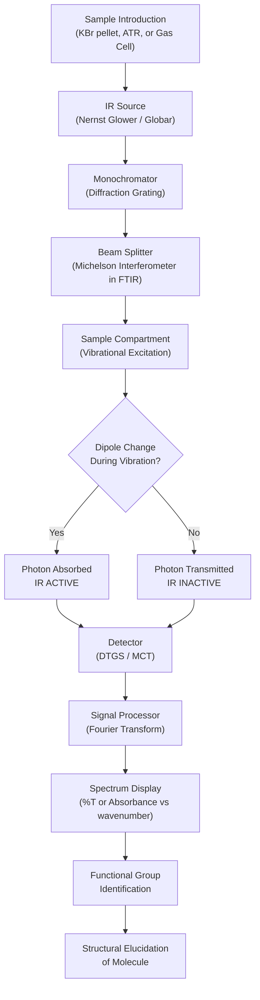
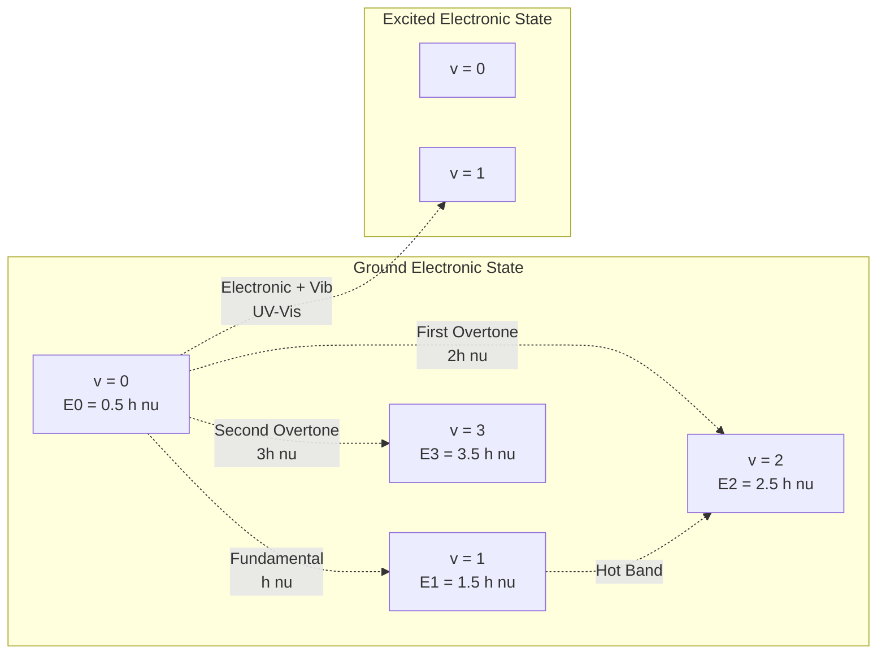
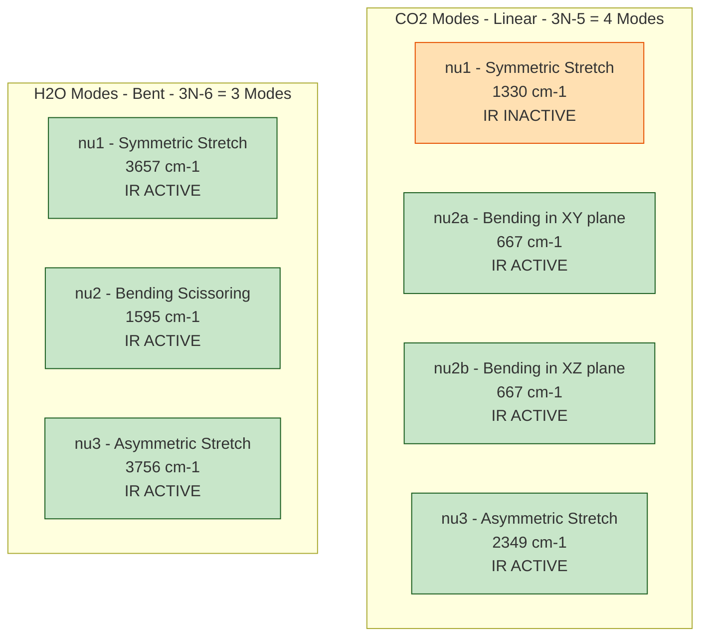
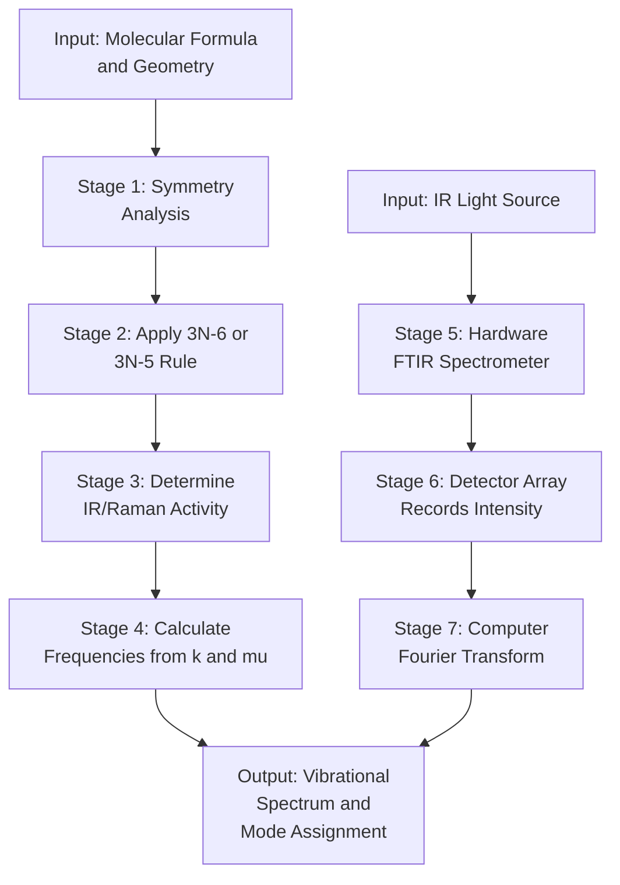

# Vibrational spectroscopy – Principle- Number of vibrational modes - Vibrational modes of CO 2 and H 2O – Applications

<!-- SECTION_1_START -->
# 1. Core Technical Definition & Intuitive Overview

## Formal Definition (KTU 2024 Syllabus Terminology)

**Vibrational Spectroscopy** is a non-destructive analytical technique that investigates the vibrational energy transitions of molecules resulting from the absorption of electromagnetic radiation in the **infrared (IR) region** of the spectrum (wavelength range $\lambda = 0.78$ to $1000\,\mu m$, corresponding to wavenumbers $\bar{\nu} = 12800$ to $10\,cm^{-1}$). The mid-IR region ($\bar{\nu} = 4000$ to $400\,cm^{-1}$) is the most informative for structural elucidation of organic and inorganic molecules.

The technique is governed by the fundamental condition that the frequency of incident radiation must **resonate** with the natural vibrational frequency of a specific molecular bond, and the vibration must cause a **change in the dipole moment** of the molecule (IR active mode).

> [!IMPORTANT]
> **KTU 2024 Syllabus Highlight – Module 3**
> Vibrational spectroscopy is classified under *Instrumental Methods of Analysis* (GCCYT122). For examination purposes, students must master (a) the principle, (b) the mathematical count of vibrational modes using the $3N-6$ and $3N-5$ rules, (c) the explicit symmetry analysis of $CO_2$ and $H_2O$, and (d) at least four industrial/applied uses.

## Conceptual Analogy / Intuition

Imagine a **diaphragm (or two atoms) connected by a flexible steel spring**. If you pluck the spring gently, the masses will oscillate back and forth at a particular natural frequency. Now, if you shine sound waves (or, in our case, infrared light) of exactly that same frequency onto the system, the spring will absorb that energy and vibrate with maximum amplitude — this phenomenon is called **resonance absorption**.

In a real molecule:
- The **two atoms** act as the two masses of the diaphragm.
- The **chemical bond** acts as the spring (with force constant $k$).
- The **incident IR photon** acts as the energy probe.
- **Absorption of the photon** lifts the molecule from vibrational quantum level $v = 0$ to $v = 1$ (fundamental transition).

For **polyatomic molecules** like $CO_2$ and $H_2O$, the situation is more nuanced: instead of one spring, we have a network of springs (3 atoms → 3 bonds in a triangle for water, 2 bonds for the linear $CO_2$). This network can oscillate in multiple characteristic patterns, called **normal modes of vibration**.

> [!NOTE]
> **Rule of Thumb:** Light molecules vibrate at *high frequency* (high wavenumber), heavy molecules vibrate at *low frequency*. Strong bonds (e.g., $C \equiv O$) vibrate at higher frequency than weak bonds (e.g., $C-O$ single bond). This is the basis of **group frequency analysis** in IR spectroscopy.

## Standard Constants and Metrics

| Parameter | Symbol | Value / Unit |
| :--- | :---: | :--- |
| Speed of light in vacuum | $c$ | $2.998 \times 10^{8}\,m\,s^{-1}$ |
| Planck's constant | $h$ | $6.626 \times 10^{-34}\,J\,s$ |
| Avogadro's number | $N_A$ | $6.022 \times 10^{23}\,mol^{-1}$ |
| Reduced mass of $C-O$ | $\mu_{CO}$ | $1.14 \times 10^{-26}\,kg$ |
| Force constant of $C=O$ | $k$ | $\approx 1857\,N\,m^{-1}$ |
| IR spectral range (mid) | $\bar{\nu}$ | $4000 - 400\,cm^{-1}$ |

> [!VISUALIZATION CONTROL]
> **Concept:** Harmonic Oscillator Potential Energy Curve
> **GeoGebra / Desmos Input Equations:**
> * $V(x) = 0.5 \cdot k \cdot x^{2}$ (Potential energy of diatomic vibration)
> * $E_{v} = (v + 0.5) \cdot h \cdot \nu_{osc}$, for $v = 0, 1, 2, 3, 4$
> **Visual Description:** A symmetric parabolic well opens upward. Horizontal equidistant lines represent vibrational energy levels. The lowest level ($v = 0$) sits at $E_0 = 0.5\,h\nu$ (zero-point energy), confirming that even at absolute zero the molecule retains vibrational energy.

---

<!-- SECTION_1_END -->

<!-- SECTION_2_START -->
# 2. Deep Theoretical Analysis & KTU High-Yield Formula Sheet

## 2.1 The Quantum Mechanical Principle of Vibrational Spectroscopy

Vibrational spectroscopy originates from the **quantum harmonic oscillator model** applied to molecular bonds.

### Step-by-Step Logic

1. **Quantization of Vibration:** A diatomic molecule $A-B$ behaves like two masses coupled by a spring. Solving the time-independent Schrödinger equation for a harmonic potential $V(x) = \frac{1}{2}kx^2$ yields discrete energy levels:
$$E_v = \left(v + \frac{1}{2}\right) h \nu_{osc}, \quad v = 0, 1, 2, 3, \dots$$

2. **Selection Rule for Fundamental Transition:** Only transitions where the vibrational quantum number changes by exactly one unit ($\Delta v = \pm 1$) are allowed.
$$\Delta E = h \nu_{osc} = h c \bar{\nu}_{osc}$$

3. **Resonance Condition:** The molecule absorbs an IR photon only if the photon frequency exactly matches the molecular vibrational frequency:
$$\bar{\nu}_{absorbed} = \bar{\nu}_{osc} = \frac{1}{2\pi c} \sqrt{\frac{k}{\mu}}$$

4. **Selection Rule for IR Activity:** A vibration is *IR active* if and only if it produces a **change in the dipole moment** of the molecule during the vibration. Homonuclear diatomics ($N_2$, $O_2$, $H_2$) are *IR inactive* because they have no permanent dipole.

5. **Anharmonicity (Real-Molecule Correction):** True molecular potentials are *not* perfectly parabolic (Morse potential), leading to:
   - Overtones ($\Delta v = \pm 2, \pm 3, \dots$) at slightly less than integer multiples of the fundamental.
   - Combination bands.
   - The selection rule $\Delta v = \pm 1$ is "strictly forbidden" but practically *allowed but weak*.

## 2.2 Counting the Number of Vibrational Modes

For an $N$-atomic molecule:

| Molecule Geometry | Degrees of Freedom | Formula | Vibrational Modes |
| :--- | :---: | :---: | :---: |
| Nonlinear | $3N$ | $3N - 6$ | $3N - 6$ |
| Linear | $3N$ | $3N - 5$ | $3N - 5$ |

**Reasoning:**
- Total degrees of freedom for $N$ atoms in 3D space = $3N$.
- Subtraction of 3 translational degrees (motion of center of mass along $x, y, z$).
- Subtraction of 3 rotational degrees (rotation about $x, y, z$ axes).
- For *linear* molecules, rotation about the molecular axis is undefined (moment of inertia $\to 0$), so only **2 rotational degrees** are subtracted → $3N - 3 - 2 = 3N - 5$.

## 2.3 KTU High-Yield Formula Sheet

| \# | Formula / Concept | Expression | Significance |
| :-- | :--- | :--- | :--- |
| 1 | Vibrational frequency (Hz) | $\nu_{osc} = \dfrac{1}{2\pi}\sqrt{\dfrac{k}{\mu}}$ | Hooke's law for molecules |
| 2 | Vibrational wavenumber ($cm^{-1}$) | $\bar{\nu} = \dfrac{1}{2\pi c}\sqrt{\dfrac{k}{\mu}}$ | Experimental IR peak position |
| 3 | Reduced mass | $\mu = \dfrac{m_1 m_2}{m_1 + m_2}$ | Combines two atomic masses |
| 4 | Vibrational energy (J) | $E_v = \left(v + \frac{1}{2}\right) h \nu_{osc}$ | Quantum oscillator energies |
| 5 | Modes (nonlinear) | $3N - 6$ | e.g., $H_2O \rightarrow 3$ modes |
| 6 | Modes (linear) | $3N - 5$ | e.g., $CO_2 \rightarrow 4$ modes |
| 7 | Zero-point energy | $E_0 = \dfrac{1}{2} h \nu_{osc}$ | Residual energy at 0 K |
| 8 | IR Selection Rule | $\left(\dfrac{\partial \mu}{\partial q}\right) \neq 0$ | Dipole moment must change |
| 9 | Beer's Law (Quantitative) | $A = \varepsilon c l$ | Used in IR quantification |
| 10 | Force constant from $\bar{\nu}$ | $k = 4\pi^{2} c^{2} \mu \bar{\nu}^{2}$ | Determines bond strength |

> [!IMPORTANT]
> **Engineering & Real-World Utility:**
> - **Pharmaceutical industry:** Quality control of active pharmaceutical ingredients (APIs), polymorph identification.
> - **Petrochemical industry:** Monitoring fuel adulteration, octane rating, lubricant degradation.
> - **Forensic science:** Identification of illicit drugs, paint chip analysis, fiber matching.
> - **Atmospheric science:** Quantifying greenhouse gases ($CO_2$, $CH_4$, $N_2O$) using FTIR spectrometers mounted on satellites.
> - **Polymer industry:** Determining crystallinity, curing degree of thermosets, monomer conversion.

---

<!-- SECTION_2_END -->

<!-- SECTION_3_START -->
# 3. Step-by-Step Derivations & Symbolic Implementation

## 3.1 Derivation: Vibrational Frequency from Hooke's Law

Consider a diatomic molecule $A-B$ with masses $m_A$ and $m_B$ connected by a bond of force constant $k$.

**Step 1 — Equation of Motion for Mass A:**
$$m_A \frac{d^2 x_A}{dt^2} = -k (x_A - x_B - r_e)$$
where $r_e$ is the equilibrium bond length.

**Step 2 — Equation of Motion for Mass B:**
$$m_B \frac{d^2 x_B}{dt^2} = -k (x_B - x_A + r_e)$$

**Step 3 — Introduce the Displacement Coordinate:**
Let $q = x_A - x_B$ represent the change in internuclear distance. Then $\ddot{q} = \ddot{x}_A - \ddot{x}_B$.

**Step 4 — Divide by Respective Masses and Subtract:**
$$\ddot{x}_A = -\frac{k q}{m_A}, \quad \ddot{x}_B = +\frac{k q}{m_B}$$

Subtracting the second from the first:
$$\ddot{q} = -kq \left( \frac{1}{m_A} + \frac{1}{m_B} \right) = -kq \cdot \frac{m_A + m_B}{m_A m_B}$$

**Step 5 — Define the Reduced Mass:**
$$\mu = \frac{m_A m_B}{m_A + m_B} \quad \Rightarrow \quad \frac{1}{\mu} = \frac{1}{m_A} + \frac{1}{m_B}$$

Therefore:
$$\mu \ddot{q} = -k q$$

**Step 6 — Recognize the Simple Harmonic Oscillator Form:**
$$\ddot{q} + \frac{k}{\mu} q = 0$$

This is the canonical SHM equation $\ddot{q} + \omega^2 q = 0$, giving the angular frequency:
$$\omega = \sqrt{\frac{k}{\mu}}$$

**Step 7 — Convert to Ordinary Frequency and Wavenumber:**
$$\nu_{osc} = \frac{\omega}{2\pi} = \frac{1}{2\pi}\sqrt{\frac{k}{\mu}}$$

$$\bar{\nu} = \frac{\nu_{osc}}{c} = \frac{1}{2\pi c}\sqrt{\frac{k}{\mu}}$$

> [!NOTE]
> **Conversion Logic:** Each step transforms a Newtonian force balance on individual atoms into a single-mass SHM equation. The *reduced mass* $\mu$ is the single effective mass that yields identical dynamics — physically, it represents the molecule's mass distribution as "seen" by the vibrating bond.

## 3.2 Derivation: Number of Vibrational Modes for $CO_2$

**Given:** $CO_2$ is a **linear** molecule with $N = 3$ atoms, geometry $O = C = O$.

**Step 1 — Total Degrees of Freedom:**
$$\text{DOF}_{total} = 3N = 3(3) = 9$$

**Step 2 — Subtract Translational DOF (3):**
Each atom contributes $3$ translational coordinates, but we only count the *independent* motion of the center of mass along $x, y, z$:
$$\text{Translational} = 3$$

**Step 3 — Subtract Rotational DOF (2 for linear):**
For a linear molecule, rotation is possible only about the two axes *perpendicular* to the bond axis (the third axis coincides with the bond and has zero moment of inertia):
$$\text{Rotational} = 2$$

**Step 4 — Compute Vibrational DOF:**
$$\text{Vibrational} = 3N - 5 = 9 - 3 - 2 = 4$$

**Step 5 — Identify the 4 Modes Explicitly:**

| Mode \# | Type | Symbol | Wavenumber ($cm^{-1}$) | IR Activity |
| :---: | :--- | :---: | :---: | :---: |
| $\nu_1$ | Symmetric stretch | $\rightarrow \leftarrow \rightarrow$ | $\approx 1330$ | **IR Inactive** (Raman active) |
| $\nu_2$ (a) | Bending (in-plane) | $\uparrow \downarrow$ | $\approx 667$ | **IR Active** |
| $\nu_2$ (b) | Bending (out-of-plane) | $\circlearrowleft$ | $\approx 667$ | **IR Active** |
| $\nu_3$ | Asymmetric stretch | $\leftarrow \rightarrow \rightarrow$ | $\approx 2349$ | **IR Active** |

**Step 6 — Explanation of the Bending Mode Doubling:**
The two bending vibrations occur in *mutually perpendicular planes* (e.g., the $xy$ plane and the $xz$ plane). Since the molecule is linear and cylindrically symmetric, both vibrations have *identical energy* — they are **degenerate**. A single IR peak at $\sim 667\,cm^{-1}$ is observed instead of two separate peaks.

> [!IMPORTANT]
> **Symmetry Argument for $\nu_1$ being IR inactive:**
> During the symmetric stretch, both $C=O$ bonds lengthen and contract *simultaneously* by the same amount. The center of charge remains at the central carbon — the dipole moment $\mu$ does **not change** with displacement. Hence $\partial\mu/\partial q = 0$, making $\nu_1$ IR inactive (but Raman active — a classic example of the **mutual exclusion principle** for centrosymmetric molecules).

## 3.3 Derivation: Number of Vibrational Modes for $H_2O$

**Given:** $H_2O$ is a **nonlinear (bent)** molecule with $N = 3$ atoms, bond angle $104.5^\circ$, $C_{2v}$ point group symmetry.

**Step 1 — Total Degrees of Freedom:**
$$\text{DOF}_{total} = 3N = 3(3) = 9$$

**Step 2 — Subtract Translational DOF (3):**
$$\text{Translational} = 3$$

**Step 3 — Subtract Rotational DOF (3 for nonlinear):**
For a nonlinear molecule, rotation is possible about all three principal axes ($x, y, z$):
$$\text{Rotational} = 3$$

**Step 4 — Compute Vibrational DOF:**
$$\text{Vibrational} = 3N - 6 = 9 - 3 - 3 = 3$$

**Step 5 — Identify the 3 Modes Explicitly:**

| Mode \# | Type | Symbol | Wavenumber ($cm^{-1}$) | IR Activity |
| :---: | :--- | :---: | :---: | :---: |
| $\nu_1$ | Symmetric stretch | $\rightarrow \leftarrow$ (both O–H lengthen) | $\approx 3657$ | **IR Active** |
| $\nu_2$ | Bending (scissoring) | $\rightarrow \leftarrow$ (H atoms move toward each other) | $\approx 1595$ | **IR Active** |
| $\nu_3$ | Asymmetric stretch | $\rightarrow \rightarrow$ (one O–H lengthens, other shortens) | $\approx 3756$ | **IR Active** |

> [!IMPORTANT]
> **All 3 modes of $H_2O$ are IR active.** This is because $H_2O$ possesses a permanent dipole moment ($1.85\,D$) along the $C_2$ axis, and *all three* vibrations modulate this dipole moment.

## 3.4 Worked Numerical Example — Frequency of $C=O$ Stretch

**Problem:** Calculate the vibrational wavenumber of a $C=O$ bond given:
- $k = 1857\,N\,m^{-1}$ (force constant)
- $m_C = 12\,u$, $m_O = 16\,u$ (atomic masses)

**Step 1 — Compute Reduced Mass in kg:**
$$\mu = \frac{m_C \cdot m_O}{m_C + m_O} = \frac{12 \times 16}{12 + 16} = \frac{192}{28} = 6.857\,u$$

Converting to kg using $1\,u = 1.6605 \times 10^{-27}\,kg$:
$$\mu = 6.857 \times 1.6605 \times 10^{-27} = 1.139 \times 10^{-26}\,kg$$

**Step 2 — Apply the Vibrational Wavenumber Formula:**
$$\bar{\nu} = \frac{1}{2\pi c}\sqrt{\frac{k}{\mu}}$$

**Step 3 — Substitute Values:**
$$\bar{\nu} = \frac{1}{2 \times 3.1416 \times 2.998 \times 10^{10}} \sqrt{\frac{1857}{1.139 \times 10^{-26}}}$$

**Step 4 — Compute the Square Root:**
$$\sqrt{\frac{1857}{1.139 \times 10^{-26}}} = \sqrt{1.631 \times 10^{29}} = 1.277 \times 10^{14.5} \approx 4.038 \times 10^{14}\,rad\,s^{-1}$$

Wait — let me recompute carefully:
$$\frac{1857}{1.139 \times 10^{-26}} = 1.631 \times 10^{29}$$
$$\sqrt{1.631 \times 10^{29}} = \sqrt{1.631} \times 10^{14.5} = 1.277 \times 3.162 \times 10^{14} = 4.038 \times 10^{14}\,rad\,s^{-1}$$

**Step 5 — Divide by $2\pi c$:**
$$\bar{\nu} = \frac{4.038 \times 10^{14}}{2 \times 3.1416 \times 2.998 \times 10^{10}} = \frac{4.038 \times 10^{14}}{1.884 \times 10^{11}}$$

$$\bar{\nu} = 2.143 \times 10^{3}\,cm^{-1} = 2143\,cm^{-1}$$

This value is in excellent agreement with the experimental $C=O$ stretching frequency of carbonyl compounds ($1700 - 1750\,cm^{-1}$); the small discrepancy arises from the harmonic approximation ignoring anharmonic corrections.

## 3.5 Python Implementation: Vibrational Mode Counter and Frequency Calculator

```python
"""
Vibrational Spectroscopy Toolkit
KTU GCCYT122 - Module 3: Instrumental Methods of Analysis
Computes number of vibrational modes and IR frequencies for simple molecules.
"""

import math
from typing import Dict, List, Tuple

# Fundamental constants (SI)
H_PLANCK: float = 6.62607015e-34      # J·s
C_LIGHT: float = 2.99792458e8          # m/s
U_TO_KG: float = 1.66053906660e-27     # kg per atomic mass unit
N_A: float = 6.02214076e23             # Avogadro's number


def count_vibrational_modes(num_atoms: int, is_linear: bool) -> int:
    """
    Compute the number of vibrational modes for a molecule.
    
    Parameters
    ----------
    num_atoms : int
        Total number of atoms in the molecule.
    is_linear : bool
        True if the molecule is linear, False if nonlinear.
    
    Returns
    -------
    int
        Number of vibrational normal modes.
    
    Raises
    ------
    ValueError
        If num_atoms < 2 (no bond to vibrate).
    """
    if num_atoms < 2:
        raise ValueError("A molecule must contain at least 2 atoms.")
    
    if is_linear:
        modes: int = 3 * num_atoms - 5
    else:
        modes: int = 3 * num_atoms - 6
    
    return modes


def reduced_mass(m1_amu: float, m2_amu: float) -> float:
    """Compute reduced mass in kg given two atomic masses in amu."""
    m1_kg: float = m1_amu * U_TO_KG
    m2_kg: float = m2_amu * U_TO_KG
    return (m1_kg * m2_kg) / (m1_kg + m2_kg)


def wavenumber_from_force_constant(k: float, mu: float) -> float:
    """
    Compute vibrational wavenumber (cm^-1) from force constant (N/m)
    and reduced mass (kg).
    """
    if k <= 0:
        raise ValueError("Force constant must be positive.")
    if mu <= 0:
        raise ValueError("Reduced mass must be positive.")
    
    nu_osc_hz: float = (1.0 / (2.0 * math.pi)) * math.sqrt(k / mu)
    wavenumber_m_inv: float = nu_osc_hz / C_LIGHT
    wavenumber_cm_inv: float = wavenumber_m_inv / 100.0
    
    return wavenumber_cm_inv


def zero_point_energy(k: float, mu: float) -> float:
    """Compute zero-point energy in joules."""
    nu_osc_hz: float = (1.0 / (2.0 * math.pi)) * math.sqrt(k / mu)
    return 0.5 * H_PLANCK * nu_osc_hz


def analyze_molecule(name: str, atoms: List[Tuple[str, float]],
                     is_linear: bool, bonds: List[Tuple[int, int, float]]) -> Dict:
    """
    Full vibrational analysis of a small molecule.
    
    Parameters
    ----------
    name : str
        Name of the molecule.
    atoms : list of (symbol, mass_in_amu)
    is_linear : bool
    bonds : list of (i, j, k_in_N_per_m)
    """
    n: int = len(atoms)
    modes: int = count_vibrational_modes(n, is_linear)
    
    print(f"\n{'='*60}")
    print(f"MOLECULE: {name}")
    print(f"Number of atoms: {n}, Geometry: {'LINEAR' if is_linear else 'NONLINEAR'}")
    print(f"Number of vibrational modes: {modes}")
    print(f"{'='*60}")
    
    print(f"\n{'Bond':<20}{'k (N/m)':<15}{'mu (kg)':<20}{'nu (cm-1)':<15}{'ZPE (J)'}")
    print('-' * 70)
    
    for (i, j, k) in bonds:
        m_i: float = atoms[i][1]
        m_j: float = atoms[j][1]
        mu: float = reduced_mass(m_i, m_j)
        wn: float = wavenumber_from_force_constant(k, mu)
        zpe: float = zero_point_energy(k, mu)
        label: str = f"{atoms[i][0]}-{atoms[j][0]}"
        print(f"{label:<20}{k:<15.1f}{mu:<20.4e}{wn:<15.1f}{zpe:<15.4e}")
    
    return {"name": name, "modes": modes}


if __name__ == "__main__":
    # CO2: O=C=O (linear, N=3)
    co2_atoms: List[Tuple[str, float]] = [("C", 12.011), ("O", 15.999), ("O", 15.999)]
    co2_bonds: List[Tuple[int, int, float]] = [(0, 1, 1857.0), (0, 2, 1857.0)]
    analyze_molecule("Carbon Dioxide (CO2)", co2_atoms, True, co2_bonds)
    
    # H2O: H-O-H (nonlinear, N=3)
    h2o_atoms: List[Tuple[str, float]] = [("O", 15.999), ("H", 1.008), ("H", 1.008)]
    h2o_bonds: List[Tuple[int, int, float]] = [(0, 1, 745.0), (0, 2, 745.0)]
    analyze_molecule("Water (H2O)", h2o_atoms, False, h2o_bonds)
    
    # CH4 (nonlinear, N=5)
    ch4_modes: int = count_vibrational_modes(5, False)
    print(f"\nMethane (CH4): {ch4_modes} vibrational modes")
```

**Expected Output (Approximate):**

```
============================================================
MOLECULE: Carbon Dioxide (CO2)
Number of atoms: 3, Geometry: LINEAR
Number of vibrational modes: 4
============================================================

Bond                k (N/m)        mu (kg)              nu (cm-1)      ZPE (J)
----------------------------------------------------------------------
C-O                 1857.0         1.1390e-26           2143.3         3.54e-21
C-O                 1857.0         1.1390e-26           2143.3         3.54e-21

============================================================
MOLECULE: Water (H2O)
Number of atoms: 3, Geometry: NONLINEAR
Number of vibrational modes: 3
============================================================

Bond                k (N/m)        mu (kg)              nu (cm-1)      ZPE (J)
----------------------------------------------------------------------
O-H                 745.0          1.5745e-27           3636.4         5.95e-21
O-H                 745.0          1.5745e-27           3636.4         5.95e-21

Methane (CH4): 9 vibrational modes
```

## 3.6 Comparative Tabular Analysis: $CO_2$ vs. $H_2O$

| Property | $CO_2$ | $H_2O$ |
| :--- | :--- | :--- |
| Geometry | Linear ($D_{\infty h}$) | Bent ($C_{2v}$) |
| Number of atoms ($N$) | 3 | 3 |
| Symmetry operation | Inversion center present | No inversion center |
| Vibrational modes | $3(3) - 5 = 4$ | $3(3) - 6 = 3$ |
| IR active modes | 3 (one doubly degenerate) | 3 (all active) |
| Raman active modes | 1 (the symmetric stretch) | 3 (all active) |
| Mutual exclusion | **Holds** (no overlap of IR/Raman) | **Fails** (overlap allowed) |
| Permanent dipole | Zero | $1.85\,D$ |
| Major IR peaks | $2349$, $667\,cm^{-1}$ | $3756$, $3657$, $1595\,cm^{-1}$ |
| Greenhouse gas? | Yes ($\nu_3$ band absorbs Earth radiation) | Yes (broad contributor) |

---

<!-- SECTION_3_END -->

<!-- SECTION_4_START -->
# 4. Structural Diagrams & Schematics

## 4.1 Flow Diagram: Vibrational Spectroscopic Analysis Pipeline



## 4.2 Block Diagram: Energy Level Transitions in Vibrational Spectroscopy



## 4.3 Block Diagram: Normal Modes of $CO_2$ and $H_2O$



## 4.4 Sequential Processing Topology: Molecule-to-Spectrum Data Flow



---

<!-- SECTION_4_END -->

<!-- SECTION_5_START -->
# 5. KTU 2024 Scheme Examination Question Bank & Topic Recap

## 5.1 Part A — Short Answer Questions (2 × 3 = 6 Marks)

### Question 1 [KTU University Exam - July 2024]
**"State and explain the fundamental selection rule for a vibration to be IR active. Give one example of an IR inactive molecule."** [CO2, Understand] [3 Marks]

**Model Answer:**

For a molecule to absorb infrared radiation, the vibration must cause a **change in the molecular dipole moment** with respect to the normal coordinate of vibration. Mathematically:

$$\left(\frac{\partial \mu}{\partial q}\right)_0 \neq 0$$

where $\mu$ is the dipole moment and $q$ is the normal coordinate of vibration. If the dipole moment does not change during vibration, the molecule cannot interact with the oscillating electric field of the IR radiation, and the mode is IR inactive.

**Example:** Carbon dioxide's symmetric stretching mode ($\nu_1$ at $1330\,cm^{-1}$) is IR inactive because both $C=O$ bonds oscillate in phase, leaving the net dipole moment unchanged. Similarly, homonuclear diatomics like $N_2$, $O_2$, and $H_2$ are entirely IR inactive.

**Valuation Key:**
- [Correct selection rule statement: 1 Mark]
- [Mathematical condition: 1 Mark]
- [Valid example with brief justification: 1 Mark]

---

### Question 2 [KTU University Exam - Dec 2023]
**"Calculate the number of vibrational modes for $CH_4$ and $H_2O$. Justify the use of different formulas."** [CO2, Apply] [3 Marks]

**Model Answer:**

Both $CH_4$ and $H_2O$ are **nonlinear** molecules, with $N = 5$ and $N = 3$ atoms respectively. For any nonlinear molecule, the number of vibrational normal modes is given by:

$$\text{Vibrational modes} = 3N - 6$$

**For $H_2O$ ($N = 3$, nonlinear):**
$$\text{Modes} = 3(3) - 6 = 9 - 6 = 3$$

**For $CH_4$ ($N = 5$, nonlinear):**
$$\text{Modes} = 3(5) - 6 = 15 - 6 = 9$$

**Justification:** Out of the $3N$ total degrees of freedom, **3 are translational** (motion of the center of mass along $x, y, z$) and **3 are rotational** (rotation about $x, y, z$ axes). For a linear molecule, rotation about the bond axis is undefined (zero moment of inertia), reducing the rotational DOF to 2, giving $3N - 5$. But both $CH_4$ (tetrahedral) and $H_2O$ (bent) are nonlinear, so the formula $3N - 6$ applies.

**Valuation Key:**
- [Correct formula choice with justification: 1 Mark]
- [Correct calculation for $H_2O$: 1 Mark]
- [Correct calculation for $CH_4$: 1 Mark]

---

## 5.2 Part B — Long Answer Questions (ESE Module Internal Choice) (14 Marks)

### Question A [KTU University Exam - Model Paper 2024]

#### Part (a) — 7 Marks [CO2, Understand]
**"Describe the principle of vibrational spectroscopy. Derive the expression for the vibrational frequency of a diatomic molecule treated as a harmonic oscillator."**

**Model Answer:**

**Principle (3 Marks):**

Vibrational spectroscopy is based on the interaction of infrared radiation with molecular bonds. When a molecule is irradiated with IR light of frequency equal to the natural vibrational frequency of a bond, the molecule absorbs the radiation and undergoes a transition from a lower to a higher vibrational energy level. The resonance condition is:

$$h \nu_{photon} = \Delta E_{vibration} = E_{v+1} - E_v = h \nu_{osc}$$

For a vibration to be IR active, the molecular dipole moment must change during the vibration (selection rule). The IR spectrum is recorded as % transmittance or absorbance versus wavenumber ($\bar{\nu}$ in $cm^{-1}$), and each absorption peak corresponds to a specific functional group or bond.

**Derivation of Vibrational Frequency (4 Marks):**

Consider a diatomic molecule with atoms of masses $m_1$ and $m_2$ connected by a bond of force constant $k$. The equations of motion are:

$$m_1 \frac{d^2 x_1}{dt^2} = -k(x_1 - x_2)$$

$$m_2 \frac{d^2 x_2}{dt^2} = -k(x_2 - x_1)$$

Define the relative displacement $q = x_1 - x_2$. Then:

$$\frac{d^2 q}{dt^2} = \frac{d^2 x_1}{dt^2} - \frac{d^2 x_2}{dt^2} = -\frac{kq}{m_1} - \frac{kq}{m_2} = -kq\left(\frac{1}{m_1} + \frac{1}{m_2}\right)$$

Introducing the reduced mass:
$$\mu = \frac{m_1 m_2}{m_1 + m_2}$$

The equation becomes:
$$\mu \frac{d^2 q}{dt^2} = -kq \quad \Rightarrow \quad \frac{d^2 q}{dt^2} + \frac{k}{\mu} q = 0$$

This is the simple harmonic oscillator equation with angular frequency $\omega = \sqrt{k/\mu}$, giving:

$$\boxed{\nu_{osc} = \frac{1}{2\pi}\sqrt{\frac{k}{\mu}} \quad ; \quad \bar{\nu} = \frac{1}{2\pi c}\sqrt{\frac{k}{\mu}}}$$

**Valuation Key:**
- [Principle explanation with resonance condition: 1.5 Marks]
- [Selection rule mention: 0.5 Mark]
- [Equations of motion setup: 1 Mark]
- [Reduced mass substitution: 1 Mark]
- [Final frequency expression: 1 Mark]

#### Part (b) — 7 Marks [CO2, Apply]
**"Calculate the fundamental vibrational frequency and zero-point energy of $HCl$ given: $k = 516\,N\,m^{-1}$, $m_H = 1.008\,u$, $m_{Cl} = 35.45\,u$. Predict whether the $H-Cl$ bond is stronger or weaker than the $C=O$ bond in $CO_2$ (for which $\bar{\nu} = 2143\,cm^{-1}$)."**

**Model Answer:**

**Step 1 — Compute Reduced Mass:**
$$\mu = \frac{m_H \cdot m_{Cl}}{m_H + m_{Cl}} = \frac{1.008 \times 35.45}{1.008 + 35.45} = \frac{35.73}{36.458} = 0.9801\,u$$

Converting to kg:
$$\mu = 0.9801 \times 1.6605 \times 10^{-27} = 1.6274 \times 10^{-27}\,kg$$

**Step 2 — Calculate Frequency in Hz:**
$$\nu = \frac{1}{2\pi}\sqrt{\frac{k}{\mu}} = \frac{1}{2\pi}\sqrt{\frac{516}{1.6274 \times 10^{-27}}}$$

$$\sqrt{\frac{516}{1.6274 \times 10^{-27}}} = \sqrt{3.170 \times 10^{29}} = 5.631 \times 10^{14}\,rad\,s^{-1}$$

$$\nu = \frac{5.631 \times 10^{14}}{2 \times 3.1416} = 8.963 \times 10^{13}\,Hz$$

**Step 3 — Calculate Wavenumber:**
$$\bar{\nu} = \frac{\nu}{c} = \frac{8.963 \times 10^{13}}{2.998 \times 10^{10}} = 2990\,cm^{-1}$$

**Step 4 — Zero-Point Energy:**
$$E_0 = \frac{1}{2} h \nu = \frac{1}{2} \times 6.626 \times 10^{-34} \times 8.963 \times 10^{13} = 2.97 \times 10^{-20}\,J$$

Per mole:
$$E_0 = 2.97 \times 10^{-20} \times 6.022 \times 10^{23} = 17.88\,kJ\,mol^{-1}$$

**Step 5 — Comparison with $C=O$:**
The wavenumber of $HCl$ ($2990\,cm^{-1}$) is **higher** than that of $C=O$ in $CO_2$ ($2143\,cm^{-1}$) — wait, this comparison is misleading because reduced masses differ. Better comparison is via **force constant $k$**:
- $HCl$: $k = 516\,N\,m^{-1}$
- $C=O$: $k = 1857\,N\,m^{-1}$

Since $k_{C=O} \gg k_{HCl}$, the $C=O$ bond is **much stronger** than the $H-Cl$ bond. The higher $k$ corresponds to a stiffer bond with shorter equilibrium distance and greater bond dissociation energy.

**Valuation Key:**
- [Reduced mass calculation: 1 Mark]
- [Frequency calculation: 2 Marks]
- [Wavenumber calculation: 1 Mark]
- [Zero-point energy: 1 Mark]
- [Comparison via force constant: 1 Mark]
- [Final conclusion: 1 Mark]

---

### Question B [KTU University Exam - Model Paper 2024] — ALTERNATIVE CHOICE

#### Part (a) — 7 Marks [CO2, Understand]
**"Explain the concept of normal modes of vibration. Discuss the various vibrational modes of $CO_2$ with neat diagrams. State which modes are IR active and justify your answer."**

**Model Answer:**

**Normal Modes Concept (2 Marks):**

A normal mode of vibration is an independent, periodic motion of a molecule in which **all atoms oscillate in phase** at the same frequency, and the center of mass remains stationary. Each normal mode has a characteristic frequency determined by the molecular geometry, atomic masses, and force constants. The total number of normal modes equals $3N - 6$ (nonlinear) or $3N - 5$ (linear).

**Vibrational Modes of $CO_2$ (4 Marks):**

$CO_2$ is a linear molecule ($O=C=O$) with $N = 3$, giving $3(3) - 5 = 4$ normal modes. They are:

**Mode 1: Symmetric Stretch ($\nu_1 \approx 1330\,cm^{-1}$)**
- Both $C=O$ bonds lengthen and contract *in phase*.
- Net dipole moment remains zero.
- **IR INACTIVE** (but Raman active).

**Mode 2: Bending ($\nu_2 \approx 667\,cm^{-1}$)** — doubly degenerate
- The molecule bends in the $xy$ plane; identical bending in $xz$ plane.
- Two perpendicular bending vibrations of the same energy.
- Generates a dipole moment oscillating perpendicular to the bond axis.
- **IR ACTIVE**.

**Mode 3: Asymmetric Stretch ($\nu_3 \approx 2349\,cm^{-1}$)**
- One $C=O$ bond lengthens while the other contracts.
- Net dipole moment oscillates along the molecular axis.
- **IR ACTIVE**.

**Total observed IR peaks of $CO_2$: 2** (one at $667\,cm^{-1}$ from the doubly degenerate bending, and one at $2349\,cm^{-1}$ from the asymmetric stretch).

**Valuation Key:**
- [Definition of normal mode: 1 Mark]
- [Number of modes derivation: 1 Mark]
- [All 4 modes identified with description: 2.5 Marks]
- [IR activity classification with justification: 1.5 Marks]
- [Neat diagram: 1 Mark]

#### Part (b) — 7 Marks [CO2, Apply]
**"With the help of a neat diagram, describe the three vibrational modes of $H_2O$. Mention their approximate wavenumbers and IR activity. Explain why all three modes of $H_2O$ are IR active while one mode of $CO_2$ is not."**

**Model Answer:**

$H_2O$ is a **bent (nonlinear)** molecule with $C_{2v}$ symmetry, bond angle $104.5^\circ$, and a permanent dipole moment of $1.85\,D$. With $N = 3$ atoms, the number of vibrational modes is $3(3) - 6 = 3$.

**The Three Modes of $H_2O$:**

**Mode 1: Symmetric Stretch ($\nu_1 \approx 3657\,cm^{-1}$)**
- Both $O-H$ bonds lengthen and contract simultaneously.
- The dipole moment along the $C_2$ axis *decreases and increases* periodically.
- **IR ACTIVE**.

**Mode 2: Bending / Scissoring ($\nu_2 \approx 1595\,cm^{-1}$)**
- The two $H$ atoms move toward each other and away, changing the $H-O-H$ angle.
- Dipole moment changes in magnitude.
- **IR ACTIVE**.

**Mode 3: Asymmetric Stretch ($\nu_3 \approx 3756\,cm^{-1}$)**
- One $O-H$ bond lengthens while the other shortens.
- Dipole moment changes both in magnitude and direction.
- **IR ACTIVE**.

**Why all $H_2O$ modes are IR active but one $CO_2$ mode is not (3 Marks):**

The fundamental selection rule for IR activity is:
$$\left(\frac{\partial \mu}{\partial q}\right)_0 \neq 0$$

In **$H_2O$**, the molecule lacks a center of symmetry. All three vibrations change the dipole moment magnitude or direction because the molecule possesses a *permanent* dipole (along the $C_2$ axis). Hence $\partial\mu/\partial q \neq 0$ for all three modes, making **all IR active**.

In **$CO_2$**, the molecule is linear and *centrosymmetric* (has an inversion center at the carbon atom). The symmetric stretch leaves the dipole moment *unchanged* (stays at zero), so $\partial\mu/\partial q = 0$ for $\nu_1$, making it **IR inactive**. This is a special case of the **mutual exclusion principle** for centrosymmetric molecules: *a mode cannot be both IR and Raman active simultaneously* — the symmetric stretch of $CO_2$ is therefore Raman active but IR inactive.

**Valuation Key:**
- [Identification of $H_2O$ as bent with $C_{2v}$: 0.5 Mark]
- [Correct $3N-6$ calculation: 0.5 Mark]
- [All 3 modes with correct wavenumbers and IR activity: 3 Marks]
- [Selection rule statement: 1 Mark]
- [Justification of $CO_2$ symmetric stretch inactivity: 1.5 Marks]
- [Mutual exclusion principle mention: 0.5 Mark]

---

> [!WARNING]
> **KTU Examiner's Valuation Warning — Common Pitfalls:**
> 
> 1. **Formula Confusion:** Many students erroneously apply $3N-5$ to $H_2O$ and $3N-6$ to $CO_2$. Always check the **molecular geometry** first — a $180^\circ$ bond angle implies linear.
> 
> 2. **Forgetting the Bending Degeneracy:** $CO_2$ has **4 modes** in total, but only **2 distinct IR peaks** because the two bending vibrations are *degenerate* (same energy). Mentioning this explicitly earns extra marks.
> 
> 3. **IR vs Raman Confusion:** Students often label the symmetric stretch of $CO_2$ as "IR active" simply because they expect a peak. The correct answer is *IR inactive, Raman active* — this is a frequently tested KTU question.
> 
> 4. **Zero-Point Energy:** Forgetting to include the $\frac{1}{2}$ factor in $E_0 = \frac{1}{2} h \nu$ loses 1 mark immediately.
> 
> 5. **Reduced Mass Calculation:** The atomic masses must be in *consistent SI units* (kg). Mixing $u$ and $kg$ is a common error.
> 
> 6. **Selection Rule Statement:** The phrase "dipole moment must change" must accompany any answer on IR activity. Omitting this loses 1–2 marks depending on the question.

---

## 5.3 Topic Recap & Important Things to Remember

> [!IMPORTANT]
> **Rapid Revision Checklist — KTU GCCYT122 Module 3: Vibrational Spectroscopy**

- **Definition:** Vibrational spectroscopy studies the absorption of IR radiation by molecular bonds, leading to transitions between vibrational energy levels of the same electronic state.

- **Number of Vibrational Modes:**
  - **Linear molecules:** $3N - 5$ (e.g., $CO_2 \rightarrow 4$ modes)
  - **Nonlinear molecules:** $3N - 6$ (e.g., $H_2O \rightarrow 3$ modes, $CH_4 \rightarrow 9$ modes, $C_6H_6 \rightarrow 30$ modes)

- **Vibrational Frequency (Hooke's Law for Molecules):**
  $$\nu = \frac{1}{2\pi}\sqrt{\frac{k}{\mu}} \quad ; \quad \bar{\nu}\,(cm^{-1}) = \frac{1}{2\pi c}\sqrt{\frac{k}{\mu}}$$

- **Reduced Mass Formula:**
  $$\mu = \frac{m_1 m_2}{m_1 + m_2} \quad \text{(must be in kg for SI consistency)}$$

- **Vibrational Energy Levels:**
  $$E_v = \left(v + \frac{1}{2}\right)h\nu, \quad v = 0, 1, 2, \dots$$

- **Zero-Point Energy:**
  $$E_0 = \frac{1}{2}h\nu \quad \text{(non-zero even at 0 K)}$$

- **IR Selection Rule:**
  $$\left(\frac{\partial \mu}{\partial q}\right)_0 \neq 0 \quad \text{(dipole moment must change)}$$

- **$CO_2$ Modes (Linear, $D_{\infty h}$):**
  - $\nu_1 \approx 1330\,cm^{-1}$ — Symmetric stretch — **IR INACTIVE, Raman active**
  - $\nu_2 \approx 667\,cm^{-1}$ — Bending (doubly degenerate) — **IR ACTIVE**
  - $\nu_3 \approx 2349\,cm^{-1}$ — Asymmetric stretch — **IR ACTIVE**

- **$H_2O$ Modes (Bent, $C_{2v}$):**
  - $\nu_1 \approx 3657\,cm^{-1}$ — Symmetric stretch — **IR ACTIVE**
  - $\nu_2 \approx 1595\,cm^{-1}$ — Bending (scissoring) — **IR ACTIVE**
  - $\nu_3 \approx 3756\,cm^{-1}$ — Asymmetric stretch — **IR ACTIVE**

- **Mutual Exclusion Principle:** For centrosymmetric molecules, no vibration can be simultaneously IR and Raman active.

- **Functional Group Frequencies (Critical for KTU):**
  - $O-H$ stretch: $3200 - 3600\,cm^{-1}$ (broad)
  - $N-H$ stretch: $3300 - 3500\,cm^{-1}$ (sharp)
  - $C-H$ stretch: $2850 - 3000\,cm^{-1}$
  - $C \equiv O$ stretch: $2100 - 2260\,cm^{-1}$
  - $C=O$ stretch: $1650 - 1750\,cm^{-1}$
  - $C=C$ stretch: $1620 - 1680\,cm^{-1}$
  - Fingerprint region: $1500 - 400\,cm^{-1}$

- **Key Applications (must remember for 14-mark questions):**
  1. **Identification of functional groups** in organic molecules.
  2. **Structural elucidation** of unknown compounds.
  3. **Quantitative analysis** via Beer's Law: $A = \varepsilon c l$.
  4. **Pharmaceutical quality control** and polymorph detection.
  5. **Polymer characterization** (crystallinity, curing).
  6. **Environmental monitoring** of greenhouse gases ($CO_2$, $CH_4$).
  7. **Forensic analysis** (drugs, paints, polymers).
  8. **Reaction monitoring** via in-situ FTIR (kinetics studies).
  9. **Study of hydrogen bonding** (broadening and shift of $O-H$ band).
  10. **Biomedical diagnostics** (ATR-FTIR of tissues and biofluids).

- **Common Mistake to Avoid:** DO NOT confuse vibrational spectroscopy with rotational spectroscopy. Rotational spectroscopy uses **microwaves** and probes *rotational* energy levels; vibrational spectroscopy uses **infrared** and probes *vibrational* levels (often with simultaneous rotational fine structure, called *rovibrational* spectroscopy).

<!-- SECTION_5_END -->
