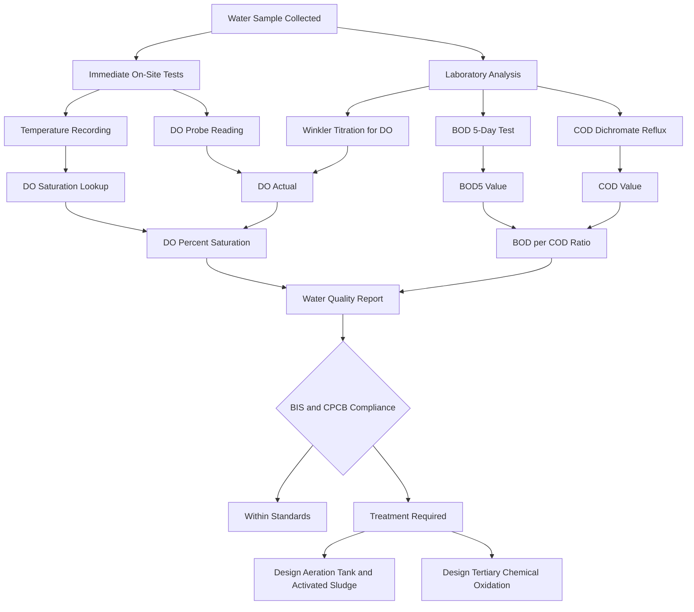
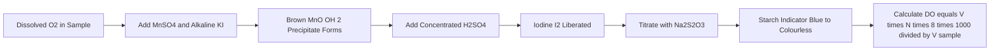
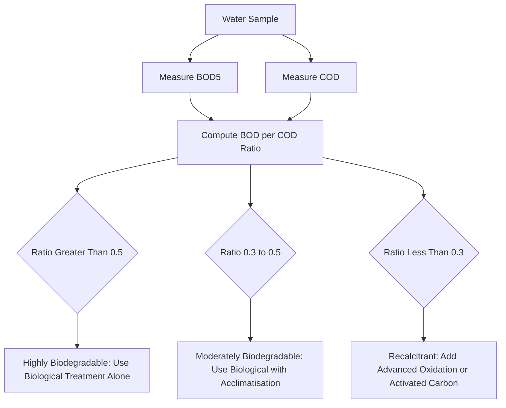

# Dissolved oxygen (DO), BOD and COD-Definition & Significance

<!-- SECTION_1_START -->
# Dissolved Oxygen, BOD & COD — Core Technical Foundation

> [!IMPORTANT]
> **KTU 2024 Scheme | GCCYT122 — Module 4: Environmental Chemistry**
> This module directly tests your ability to *interpret water quality data* and *relate theoretical oxygen-demand concepts* to real-world pollution monitoring. KTU examiners frequently use numerical problems on Winkler's method and BOD kinetics.

---

## 1.1 Dissolved Oxygen (DO) — Formal Definition

**Dissolved Oxygen (DO)** is the volume of molecular oxygen ($O_2$), measured in **milligrams per litre (mg/L)** or as a **percentage saturation (%),** physically held in aqueous solution under the prevailing temperature and pressure conditions of the water body.

Mathematically, the saturation concentration of DO in water at sea level is empirically related to temperature ($T$ in $^\circ C$) by the APHA standard relationship:

$$
DO_{sat}(mg/L) = 14.652 - 0.41022T + 0.007991T^2 - 0.000077774T^3
$$

> [!NOTE]
> **Why temperature matters:** Warm water holds *less* oxygen. This is why thermal pollution from industries (power plants, nuclear reactors) is catastrophic for aquatic ecosystems — even if no chemicals are released, the *drop* in DO suffocates fish.

### Conceptual Analogy — The "Underwater Aquarium" Intuition

Imagine a sealed glass tank full of water. The air above the water contains **21% oxygen** by volume. Tiny oxygen molecules constantly cross the air–water interface and dissolve. The amount that "fits" inside is the **DO**. Cold water is like a *tightly packed suitcase* — it holds more; hot water is an *overstuffed backpack* — it expels oxygen.

- **Cold mountain stream** → High DO (~12–14 mg/L)
- **Tropical stagnant pond** → Low DO (~2–4 mg/L)

---

## 1.2 Biochemical Oxygen Demand (BOD) — Formal Definition

**Biochemical Oxygen Demand (BOD)** is the mass of dissolved oxygen (in mg/L) consumed by aerobic microorganisms during the biochemical oxidation of biodegradable organic matter in a water sample, under standard conditions of **20 °C** and **5 days** of incubation in the dark. The standard measure is denoted **$BOD_5$**.

> [!IMPORTANT]
> **The 5-Day Rule (Standard):** KTU examiners expect you to know that BOD is universally reported as $BOD_5$ (5 days at 20 °C). This time window was chosen historically because it represents the maximum carbonaceous biochemical oxygen demand in most municipal wastewaters, before nitrification (nitrogenous BOD) sets in.

### Conceptual Analogy — The "Bacterial Buffet" Intuition

Picture a petri dish full of hungry bacteria. You pour in your water sample — the sample is the **food** (organic matter). The bacteria start eating and breathing oxygen to digest the food. The *amount of oxygen they gobble up in 5 days* is the **BOD**.

- A sample with **lots of organic waste** (sewage, food industry effluent) → bacteria feast → **high BOD**
- A sample with **little organic waste** (clean river water) → bacteria starve → **low BOD**

---

## 1.3 Chemical Oxygen Demand (COD) — Formal Definition

**Chemical Oxygen Demand (COD)** is the mass of oxygen (in mg/L) consumed during the chemical oxidation of *both biodegradable and non-biodegradable* organic and inorganic matter in a water sample, by a strong oxidising agent (typically **potassium dichromate, $K_2Cr_2O_7$**, in sulphuric acid medium), under reflux conditions for **2 hours**.

> [!NOTE]
> **Why Dichromate?** Potassium dichromate is the oxidant of choice because it is a powerful, well-standardised oxidiser that attacks *almost* all organic compounds (except a few like benzene, pyridine, and some straight-chain aliphatic hydrocarbons). It provides a *reproducible* measure of the *total* oxidisable load.

### Conceptual Analogy — The "Chemical Burn" Intuition

If BOD is a slow *bacterial digestion*, COD is an *aggressive chemical fire*. You pour a powerful acid + oxidant (dichromate) onto the water sample and essentially *burn* everything that can be oxidised. The oxygen consumed in this controlled burn is the **COD**.

---

## 1.4 Significance Snapshot Table

| Parameter | What it Measures | What High Value Indicates | Standard for Clean Water |
|---|---|---|---|
| **DO** | Oxygen *available* to aquatic life | Healthy, oxygen-rich ecosystem | $> 5$ mg/L (BIS drinking water) |
| **BOD** | *Biodegradable* organic pollution | Sewage contamination, food waste | $< 2$ mg/L (BIS) |
| **COD** | *Total* (bio + non-bio) oxidisable load | Industrial pollution, toxic waste | $< 10$ mg/L (BIS drinking water) |

> [!VISUALIZATION CONTROL]
> **Concept:** BOD Decay / Oxygen-Uptake Curve over Time
> **GeoGebra / Desmos Input Equations:**
> * `BOD_t(x) = 250 * (1 - exp(-0.23 * x))` *(ultimate BOD = 250 mg/L, k = 0.23/day)*
> * `x-axis: t (days)`, `y-axis: BOD_t (mg/L)`
> **Visual Description:** Students should observe an exponential *asymptotic* rise that plateaus near 250 mg/L. The point on the curve at `x = 5` represents **$BOD_5$** — the standard reporting value. This curve also visually represents the *oxygen demand* placed on a receiving water body if the sample were discharged untreated.

---

<!-- SECTION_1_END -->

<!-- SECTION_2_START -->
# Deep Theoretical Analysis & KTU High-Yield Formula Sheet

## 2.1 Why DO, BOD and COD form the "Water Quality Trinity"

In environmental engineering, these three parameters are the **first line of analytical screening** for any water body. They answer three different but interlocking questions:

1. **DO** — *"How much oxygen is left for the fish?"*
2. **BOD** — *"How much organic waste did the bacteria eat (and how much oxygen did that cost)?"*
3. **COD** — *"How much chemical oxidant would it take to burn everything in here?"*

The **relationship** $BOD \leq COD$ always holds, because COD oxidises *everything* BOD does *plus* additional non-biodegradable and inorganic matter. The **ratio** $BOD/COD$ is itself a powerful diagnostic:

$$
\text{BOD/COD Ratio} = \frac{\text{Biodegradable organic load}}{\text{Total oxidisable load}}
$$

| BOD/COD Ratio | Interpretation |
|---|---|
| $> 0.5$ | **Highly biodegradable** — amenable to biological treatment (e.g., municipal sewage) |
| $0.3 - 0.5$ | **Moderately biodegradable** — needs acclimatised microbes |
| $< 0.3$ | **Recalcitrant** — contains toxic/non-biodegradable compounds (e.g., industrial dyes) |

---

## 2.2 KTU High-Yield Formula Sheet

> [!IMPORTANT]
> **Memorise this table — it is the single most-tested numerical framework in this module.** All standard 14-mark problems derive from these equations.

| # | Formula / Relationship | Variables & Units | Physical Meaning |
|---|---|---|---|
| 1 | $DO_{sat}(mg/L) = 14.652 - 0.41022T + 0.007991T^2 - 0.000077774T^3$ | $T$ = temperature in $^\circ C$ | Theoretical maximum DO at temperature $T$ |
| 2 | $BOD_t = L_0(1 - e^{-kt})$ | $L_0$ = ultimate BOD (mg/L), $k$ = deoxygenation rate constant (day$^{-1}$), $t$ = time (days) | Oxygen demand exerted up to time $t$ (first-order kinetics) |
| 3 | $BOD_5 = L_0(1 - e^{-5k})$ | All in standard 5-day units | Standard reported BOD |
| 4 | $L_0 = \dfrac{BOD_5}{1 - e^{-5k}}$ | Rearranged form of (3) | Ultimate BOD from $BOD_5$ |
| 5 | $BOD_5 = \dfrac{(D_1 - D_2) - (B_1 - B_2) \times f}{P}$ | $D_1, D_2$ = DO of diluted sample (initial, after 5 days); $B_1, B_2$ = DO of dilution blank (initial, after 5 days); $P$ = decimal volumetric fraction of sample; $f$ = (vol. of dilution water in blank) / (vol. of dilution water in sample) | Laboratory BOD calculation |
| 6 | $COD = \dfrac{(V_b - V_s) \times N \times 8 \times 1000}{V_{sample}}$ (mg/L) | $V_b$ = blank titre (mL); $V_s$ = sample titre (mL); $N$ = normality of FAS (eq/L); $V_{sample}$ = sample volume (mL); $8$ = equivalent weight of $O_2$ in g/eq | Dichromate reflux COD |
| 7 | $BOD/COD$ | Dimensionless ratio | Biodegradability index |
| 8 | $DO\% \text{ saturation} = \dfrac{DO_{actual}}{DO_{sat}} \times 100$ | Both in mg/L at same $T$ | Water body health metric |

> [!NOTE]
> **The constant "8" in COD formula** is the *equivalent weight of oxygen* in g/eq, because $O_2$ accepts 4 electrons ($O_2 + 4H^+ + 4e^- \rightarrow 2H_2O$); equivalent weight $= 32/4 = 8$ g/eq.

---

## 2.3 Step-by-Step Reasoning Behind Each Equation

### 2.3.1 The First-Order BOD Equation ($BOD_t = L_0(1 - e^{-kt})$)

- **Step 1:** BOD exertion follows *first-order kinetics* with respect to the remaining organic matter.
- **Step 2:** Let $L_t$ be the *remaining* (unoxidised) organic load at time $t$.
- **Step 3:** The rate of disappearance is $\dfrac{dL_t}{dt} = -kL_t$, whose solution is $L_t = L_0 e^{-kt}$.
- **Step 4:** The *oxygen consumed* up to time $t$ is the *initial* load minus the *remaining* load: $BOD_t = L_0 - L_t = L_0(1 - e^{-kt})$.

### 2.3.2 Why the Dichromate Method Gives COD

- **Step 1:** Dichromate ion ($Cr_2O_7^{2-}$) is the oxidant; it is reduced to $Cr^{3+}$.
- **Step 2:** The half-reaction in acid is: $Cr_2O_7^{2-} + 14H^+ + 6e^- \rightarrow 2Cr^{3+} + 7H_2O$.
- **Step 3:** Organic carbon is oxidised to $CO_2$; $H$ becomes $H_2O$; $N$ becomes $NH_3$ (or $NH_4^+$); $S$ becomes $SO_4^{2-}$.
- **Step 4:** Excess dichromate is back-titrated with **Ferrous Ammonium Sulphate (FAS)**: $Cr_2O_7^{2-} + 6Fe^{2+} + 14H^+ \rightarrow 2Cr^{3+} + 6Fe^{3+} + 7H_2O$.
- **Step 5:** The *difference* between blank and sample titres gives the *actual* dichromate consumed by the sample → converted to oxygen equivalent via the 8 g/eq factor.

### 2.3.3 Real-World Engineering Utility

| Field | Application |
|---|---|
| **Municipal Sewage Treatment** | $BOD_5$ of raw sewage (~200–400 mg/L) sets the design load for activated-sludge aeration tanks. |
| **Industrial Effluent Discharge** | CPCB (Central Pollution Control Board, India) mandates $BOD < 30$ mg/L and $COD < 250$ mg/L for discharge into inland surface waters. |
| **Aquaculture / Fisheries** | DO must remain $> 5$ mg/L; below 3 mg/L causes *hypoxic fish kills*. |
| **River Self-Purification Studies** | The Streeter–Phelps equation models DO sag curves downstream of pollution discharge, integrating BOD exertion and atmospheric re-aeration. |
| **Drinking-Water Treatment** | Raw water with high COD may produce disinfection by-products (DBPs) on chlorination. |

---

<!-- SECTION_2_END -->

<!-- SECTION_3_START -->
# Step-by-Step Derivations, Procedures & Numerical Solutions

## 3.1 Winkler's Iodometric Method — Determination of DO (Complete Procedure)

### 3.1.1 Principle

The Winkler method is based on the quantitative reaction of **dissolved $O_2$** with **manganous hydroxide** $Mn(OH)_2$ to form a higher oxidation state of manganese. The oxidised manganese then liberates **iodine** ($I_2$) from **potassium iodide (KI)** in acidic medium, in an amount *stoichiometrically equivalent* to the original DO. The liberated $I_2$ is then titrated with standard **sodium thiosulphate** ($Na_2S_2O_3$) using starch as indicator.

### 3.1.2 Reagent-by-Reagent Reactions

**Stage 1 — Fixation of DO (in the BOD bottle itself, immediately after sampling):**

$$
Mn^{2+} + 2OH^- \rightarrow Mn(OH)_2 \text{ (white precipitate)}
$$

$$
2Mn(OH)_2 + O_2 \rightarrow 2MnO(OH)_2 \text{ (brown precipitate, manganese IV oxyhydroxide)}
$$

> This *fixes* the dissolved oxygen as a stable brown precipitate, preventing further oxygen exchange with the atmosphere.

**Stage 2 — Acidification & Iodide Liberation:**

$$
MnO(OH)_2 + 2I^- + 4H^+ \rightarrow Mn^{2+} + I_2 + 3H_2O
$$

The $I_2$ released is *molar-equivalent* to the original $O_2$ (ratio $I_2 : O_2 = 1 : 1$).

**Stage 3 — Thiosulphate Titration:**

$$
I_2 + 2S_2O_3^{2-} \rightarrow 2I^- + S_4O_6^{2-}
$$

End-point: blue starch-iodine complex disappears → colourless.

### 3.1.3 DO Calculation

Let $V$ mL of sample be titrated; $V_T$ mL of $Na_2S_2O_3$ of normality $N$ are consumed.

$$
DO (mg/L) = \frac{V_T \times N \times 8 \times 1000}{V}
$$

> **Why "8"?** Each mole of $O_2$ (32 g) liberates 2 moles of $I_2$ (2 × 254 g), and each mole of $I_2$ reacts with 2 moles of $S_2O_3^{2-}$. Therefore, 1 mL of 1 N $Na_2S_2O_3$ ≡ $\frac{32}{4} \times \frac{1}{1000} = 8 \times 10^{-3}$ g = 8 mg of $O_2$. This is the *8 mg of $O_2$ per milli-equivalent* relationship.

---

## 3.2 BOD Test — Complete 5-Day Procedure

### 3.2.1 Dilution Principle

Because municipal/industrial samples have BOD far exceeding the DO of dilution water (~9 mg/L), the sample must be **diluted with oxygen-saturated, nutrient-buffered dilution water** so that the resulting BOD exertion is *measurable* and *proportional*.

**Rule of thumb (KTU standard):** Choose dilution such that the DO depletion ($D_1 - D_2$) is *at least* 2 mg/L *and* residual DO ($D_2$) is *at least* 1 mg/L. For typical sewage, dilutions of **1% to 5%** are common.

### 3.2.2 BOD Calculation Derivation

The BOD exerted *by the sample alone* must subtract the *background* BOD of the dilution water.

$$
BOD_5 (mg/L) = \frac{(D_1 - D_2) - (B_1 - B_2) \times f}{P}
$$

Where:
- $D_1$ = DO of diluted sample at day 0 (mg/L)
- $D_2$ = DO of diluted sample at day 5 (mg/L)
- $B_1$ = DO of dilution water blank at day 0 (mg/L)
- $B_2$ = DO of dilution water blank at day 5 (mg/L)
- $P$ = decimal volumetric fraction of the sample (e.g., for 5 mL sample in 295 mL bottle, $P = 5/300 = 0.0167$)
- $f$ = ratio of dilution water volume in *blank* bottle to that in *sample* bottle (typically 1.0 if same bottle geometry)

> [!NOTE]
> The "$B_1 - B_2$" correction accounts for the *small but non-zero* BOD of the dilution water itself (due to traces of organic matter in distilled water and added nutrients).

### 3.2.3 Worked Example — $BOD_5$ Determination

**Problem:** A 10 mL sewage sample is diluted in a 290 mL BOD bottle with dilution water. Initial DO ($D_1$) = 8.5 mg/L. After 5 days, DO ($D_2$) = 3.2 mg/L. Blank readings: $B_1 = 8.6$ mg/L, $B_2 = 8.3$ mg/L. Calculate $BOD_5$.

**Solution (with valuation key markers):**

**[Decimal fraction: 1 Mark]**

$$
P = \frac{V_{sample}}{V_{bottle}} = \frac{10}{300} = 0.0333
$$

**[Depletion of sample: 1 Mark]**

$$
D_1 - D_2 = 8.5 - 3.2 = 5.3 \text{ mg/L}
$$

**[Blank correction: 1 Mark]**

$$
B_1 - B_2 = 8.6 - 8.3 = 0.3 \text{ mg/L}; \quad f = 1.0
$$

**[Final substitution: 2 Marks]**

$$
BOD_5 = \frac{5.3 - 0.3 \times 1.0}{0.0333} = \frac{5.0}{0.0333} = 150 \text{ mg/L}
$$

> **[Final answer with units: 2 Marks]**
>
> **$BOD_5$ of the sewage sample = 150 mg/L** (typical of medium-strength domestic sewage; CPCB discharge limit is 30 mg/L → this sample requires significant treatment before discharge).

---

## 3.3 COD Test — Dichromate Reflux Method (Complete Procedure)

### 3.3.1 Reagents and Reactions

1. **Standard $K_2Cr_2O_7$ (0.25 N)** in 50% $H_2SO_4$.
2. **Reflux** with sample for 2 hours at ~150 °C in presence of **$Ag_2SO_4$ catalyst** (catalyses oxidation of straight-chain aliphatic compounds) and **$HgSO_4$** (complexes chloride ion, $Cl^-$, which otherwise interferes).
3. **Cool, dilute**, add **ferroin indicator**.
4. **Back-titrate excess dichromate** with **FAS (0.1 N)** until colour changes from blue-green to reddish-brown.

### 3.3.2 Worked Example — COD Determination

**Problem:** A 50 mL water sample is refluxed with 25 mL of 0.25 N $K_2Cr_2O_7$. After cooling, titration with 0.1 N FAS required **8.5 mL** for the sample and **12.0 mL** for the blank. Calculate COD.

**Solution (with valuation key markers):**

**[Blank titre identification: 1 Mark]** $V_b = 12.0$ mL
**[Sample titre identification: 1 Mark]** $V_s = 8.5$ mL

**[Titre difference: 1 Mark]**

$$
V_b - V_s = 12.0 - 8.5 = 3.5 \text{ mL}
$$

**[Substitution into COD formula: 2 Marks]**

$$
COD = \frac{(V_b - V_s) \times N \times 8 \times 1000}{V_{sample}} = \frac{3.5 \times 0.1 \times 8 \times 1000}{50}
$$

**[Step-by-step arithmetic: 1 Mark]**

$$
COD = \frac{3.5 \times 0.8 \times 1000}{50} = \frac{2800}{50} = 56 \text{ mg/L}
$$

**[Final answer with units: 1 Mark]**
$$
\boxed{COD = 56 \text{ mg/L}}
$$

> **Interpretation:** This is moderately polluted industrial water (BIS drinking-water limit is 10 mg/L; CPCB effluent limit is 250 mg/L).

---

## 3.4 Worked Example — Ultimate BOD from $BOD_5$

**Problem:** A water sample has $BOD_5 = 200$ mg/L. The deoxygenation rate constant $k = 0.23$ /day (base $e$). Calculate the *ultimate BOD* ($L_0$).

**Solution (with valuation key markers):**

**[Stating the governing equation: 1 Mark]**

$$
BOD_5 = L_0 (1 - e^{-k \times 5}) = L_0 (1 - e^{-1.15})
$$

**[Exponential evaluation: 2 Marks]**

$$
e^{-1.15} = 0.3166
$$

**[Algebraic rearrangement: 1 Mark]**

$$
L_0 = \frac{BOD_5}{1 - e^{-5k}} = \frac{200}{1 - 0.3166}
$$

**[Final calculation: 2 Marks]**

$$
L_0 = \frac{200}{0.6834} = 292.65 \text{ mg/L}
$$

**[Final answer with units: 1 Mark]**
$$
\boxed{L_0 \approx 292.65 \text{ mg/L}}
$$

> **Engineering meaning:** Even after 5 days, the *full* oxidisable load is not yet exerted; another 92.65 mg/L of oxygen demand remains to be satisfied over the next ~20–30 days. This matters for designing aeration-tank residence times in treatment plants.

---

## 3.5 Comparative Reference Table — DO / BOD / COD

| Property | DO | BOD | COD |
|---|---|---|---|
| **Oxygen is being...** | *supplied* (in solution) | *consumed* (by microbes) | *consumed* (by chemicals) |
| **Time scale** | Instantaneous | 5 days (standard) | 2 hours (reflux) |
| **Test type** | Physical-chemical | Biological | Chemical |
| **Oxidising agent** | None (measured directly) | Microbes (catalysts) | $K_2Cr_2O_7$ |
| **Interferences** | Temperature, salinity, atmospheric pressure | Toxic substances, nitrification suppression needed | Chlorides (removed by $HgSO_4$) |
| **Typical clean river value** | 8–10 mg/L | 1–3 mg/L | 5–15 mg/L |
| **Typical raw sewage value** | 0–1 mg/L | 200–400 mg/L | 400–800 mg/L |

---

<!-- SECTION_3_END -->

<!-- SECTION_4_START -->
# Structural Diagrams & Schematics

## 4.1 Mermaid Diagram — Water Quality Assessment Flow

## 4.2 Mermaid Diagram — Winkler Method Reaction Sequence

## 4.3 Mermaid Diagram — BOD Versus COD Decision Logic

## 4.4 Conceptual Block — Streeter-Phelps DO Sag Model (Block Architecture)

The **Streeter–Phelps equation** models how dissolved oxygen in a river drops downstream of a pollution discharge point and then *recovers* due to atmospheric re-aeration. Although a full Mermaid graph cannot render the parabolic *DO sag curve* itself, the **functional flow architecture** of the model is:

| Stage Block | Process | Dominant Rate |
|---|---|---|
| **Stage 1: Discharge Point** | Effluent (high BOD, low DO) enters river | Mixing zone |
| **Stage 2: Decomposition Zone** | Microbial BOD exertion consumes DO; re-aeration adds DO back | $r_D = k_d \times L$ (deoxygenation) |
| **Stage 3: Critical Point** | Net DO deficit reaches maximum (the *DO sag*) | $D_c = \dfrac{k_d \times L_0}{k_r - k_d} \times e^{-k_d t_c}$ |
| **Stage 4: Recovery Zone** | Re-aeration dominates; DO climbs back to saturation | $r_R = k_r \times D$ |
| **Stage 5: Saturation** | River returns to ~100% saturation far downstream | Equilibrium |

Where $k_d$ = deoxygenation constant, $k_r$ = re-aeration constant, $D$ = DO deficit.

> [!IMPORTANT]
> **For KTU exams:** You are not expected to derive the full Streeter–Phelps equation in the exam, but you **must** be able to *label* the DO sag curve (critical point, decomposition zone, recovery zone) and *state* the relationship between $k_d$ and $k_r$ at the critical point: $t_c = \dfrac{1}{k_r - k_d} \ln\!\left(\dfrac{k_r}{k_d}\right)$.

---

<!-- SECTION_4_END -->

<!-- SECTION_5_START -->
# KTU 2024 Scheme Examination Question Bank & Topic Recap

## 5.1 Part A — Short Answer Questions (3 Marks Each)

### Question 1 — `[KTU University Exam — July 2023]`
**Define BOD. Why is it measured over 5 days at 20 °C?**

**Model Answer (3 Marks, CO1, Remember/Understand):**

> **BOD (Biochemical Oxygen Demand)** is the amount of dissolved oxygen (in mg/L) consumed by aerobic microorganisms to oxidise the biodegradable organic matter present in a water sample, under standard conditions. **[1 Mark]**
>
> BOD is measured over **5 days at 20 °C** because: (a) 5 days represents the standard *carbonaceous* oxygen demand before significant *nitrification* begins, ensuring reproducibility; (b) 20 °C is the conventional reference temperature at which microbial activity is well-characterised; (c) historically, 5 days was the longest transit time observed in British rivers — the standard was set to mimic worst-case travel time. **[2 Marks]**

### Question 2 — `[KTU University Exam — Dec 2023]`
**Differentiate between BOD and COD. Why is COD always greater than BOD?**

**Model Answer (3 Marks, CO2, Understand):**

> | Aspect | BOD | COD |
> |---|---|---|
> | Oxidation by | Aerobic microbes (5 days) | Chemical oxidant $K_2Cr_2O_7$ (2 hours) |
> | Oxidises | Only *biodegradable* organics | Both biodegradable *and* non-biodegradable organics |
> | Time | 5 days | 2 hours |
> | Interferences | Toxic substances inhibit microbes | Chlorides interfere (removed by $HgSO_4$) |
>
> **[1 Mark for differences]**
>
> COD is always greater than (or equal to) BOD because the *chemical* dichromate oxidant is more aggressive and attacks *all* organic compounds — including those that microbes *cannot* degrade within 5 days (e.g., lignin, cellulose, certain aromatics, some aliphatic hydrocarbons). Additionally, dichromate oxidises some *inorganic* matter (e.g., $S^{2-}$, $Fe^{2+}$, $NO_2^-$) that microbes ignore. **[2 Marks for the "why" part]**

---

## 5.2 Part B — 14-Mark Questions (Module Internal Choice)

### Question A (14 Marks) — `[KTU University Exam — July 2024]`

**(a) Define dissolved oxygen. Explain the Winkler iodometric method for the determination of DO in water, with all relevant equations.** *(7 Marks, CO1 + CO2, Understand + Apply)*

**Model Solution:**

> **Definition (1 Mark):** Dissolved Oxygen (DO) is the amount of molecular oxygen ($O_2$) physically dissolved in water, expressed in mg/L. It is essential for the survival of aerobic aquatic life.
>
> **Principle (2 Marks):** The Winkler method is based on the iodometric titration of oxygen fixed as manganese(IV) oxyhydroxide. Oxygen oxidises $Mn(OH)_2$ (white) to $MnO(OH)_2$ (brown) in alkaline medium; on acidification, the brown precipitate liberates $I_2$ from $KI$ in an amount *chemically equivalent* to the original oxygen. The $I_2$ is then titrated with standard $Na_2S_2O_3$ using starch indicator.
>
> **Key Equations (2 Marks):**
>
> **Stage 1 — Fixation:**
>
> $$Mn^{2+} + 2OH^- \rightarrow Mn(OH)_2 \text{ (white ppt)}$$
>
> $$2Mn(OH)_2 + O_2 \rightarrow 2MnO(OH)_2 \text{ (brown ppt)}$$
>
> **Stage 2 — Acidification:**
>
> $$MnO(OH)_2 + 2I^- + 4H^+ \rightarrow Mn^{2+} + I_2 + 3H_2O$$
>
> **Stage 3 — Titration:**
>
> $$I_2 + 2S_2O_3^{2-} \rightarrow 2I^- + S_4O_6^{2-}$$
>
> **Calculation (2 Marks):**
>
> $$DO (mg/L) = \frac{V_T \times N \times 8 \times 1000}{V_{sample}}$$
>
> where $V_T$ is the volume of $Na_2S_2O_3$ used, $N$ is its normality, and the constant **8** is the equivalent weight of $O_2$ in g/eq.

---

**(b) A water sample on Winkler titration gave the following data: 200 mL of sample required 12.4 mL of 0.025 N $Na_2S_2O_3$ solution. Calculate the DO of the sample in mg/L and as percentage saturation, given that the water temperature is 25 °C.** *(7 Marks, CO3, Apply)*

**Model Solution:**

> **[Stating formula and identifying variables: 1 Mark]**
>
> $$DO = \frac{V_T \times N \times 8 \times 1000}{V_{sample}} = \frac{12.4 \times 0.025 \times 8 \times 1000}{200}$$
>
> **[Substitution and arithmetic: 2 Marks]**
>
> $$DO = \frac{12.4 \times 0.025 \times 8000}{200} = \frac{2480}{200} = 12.4 \text{ mg/L}$$
>
> **[Stating saturation formula: 1 Mark]**
>
> $$DO_{sat}(25^\circ C) = 14.652 - 0.41022(25) + 0.007991(25)^2 - 0.000077774(25)^3$$
>
> **[Calculating each term: 2 Marks]**
>
> $$DO_{sat} = 14.652 - 10.2555 + 4.9944 - 1.2144 = 8.18 \text{ mg/L}$$
>
> **[Final percentage saturation: 1 Mark]**
>
> $$DO\% = \frac{12.4}{8.18} \times 100 \approx 151.6\%$$
>
> **Interpretation:** A value $> 100\%$ suggests either photosynthetic supersaturation (algal bloom) or sampling error; KTU expects the student to *comment* that this is above saturation, which is unusual.

---

### Question B (14 Marks) — Alternative Choice

**(a) What is COD? Describe the dichromate reflux method for the determination of COD with all the chemical reactions involved.** *(7 Marks, CO2, Understand + Remember)*

**Model Solution:**

> **Definition (1 Mark):** COD (Chemical Oxygen Demand) is the amount of oxygen (in mg/L) consumed by a strong chemical oxidant to oxidise the organic and inorganic matter in a water sample.
>
> **Principle (1 Mark):** The sample is refluxed with a known excess of $K_2Cr_2O_7$ in 50% $H_2SO_4$ for 2 hours. The dichromate oxidises organic matter; the *unreacted* excess dichromate is back-titrated with standard Ferrous Ammonium Sulphate (FAS).
>
> **Reactions (3 Marks):**
>
> **Reflux oxidation (representative):**
>
> $$Cr_2O_7^{2-} + 14H^+ + 6e^- \rightarrow 2Cr^{3+} + 7H_2O$$
>
> $$C_aH_bO_c + \text{ dichromate } \rightarrow aCO_2 + \tfrac{b}{2}H_2O$$
>
> **Back-titration:**
>
> $$Cr_2O_7^{2-} + 6Fe^{2+} + 14H^+ \rightarrow 2Cr^{3+} + 6Fe^{3+} + 7H_2O$$
>
> **Roles of special reagents (2 Marks):**
>
> - **$Ag_2SO_4$** = catalyst for oxidation of straight-chain aliphatic compounds.
> - **$HgSO_4$** = complexes $Cl^-$ to prevent chloride interference (without it, $Cl^-$ would also reduce dichromate, giving falsely high COD).
> - **Ferroin indicator** = 1,10-phenanthroline–iron(II) complex; sharp colour change at end-point from blue-green to reddish-brown.

---

**(b) A 25 mL water sample was refluxed with 10 mL of 0.25 N $K_2Cr_2O_7$. After cooling, the excess dichromate required 6.2 mL of 0.1 N FAS. A blank titration required 10.0 mL of the same FAS. Calculate the COD of the sample in mg/L.** *(7 Marks, CO3, Apply)*

**Model Solution:**

> **[Formula statement: 1 Mark]**
>
> $$COD (mg/L) = \frac{(V_b - V_s) \times N_{FAS} \times 8 \times 1000}{V_{sample}}$$
>
> **[Identifying given values: 1 Mark]**
>
> $V_b = 10.0$ mL, $V_s = 6.2$ mL, $N = 0.1$ N, $V_{sample} = 25$ mL
>
> **[Computing titre difference: 1 Mark]**
>
> $$V_b - V_s = 10.0 - 6.2 = 3.8 \text{ mL}$$
>
> **[Substitution: 2 Marks]**
>
> $$COD = \frac{3.8 \times 0.1 \times 8 \times 1000}{25} = \frac{3040}{25}$$
>
> **[Final answer: 2 Marks]**
>
> $$\boxed{COD = 121.6 \text{ mg/L}}$$
>
> **Interpretation:** This is moderately polluted; well below the CPCB industrial discharge limit of 250 mg/L but well above the 10 mg/L BIS drinking-water standard.

---

> [!WARNING]
> **KTU Examiner's Valuation Pitfalls — Read Before Writing Your Exam:**
>
> 1. **Unit mismatch trap:** Many students write the $BOD_5$ in mg/L but forget the **blank correction** $(B_1 - B_2) \times f$. The blank consumes oxygen too. Losing this = 1–2 marks.
> 2. **The "8 mg" misconception:** Do *not* use 32 (molecular weight of $O_2$) directly in the DO/COD formula. Use **8** (equivalent weight). Many students confuse the two.
> 3. **Sample dilution mishap:** In BOD, remember $P$ is the *decimal* fraction, not the percentage. Writing 5% instead of 0.05 = 100× wrong answer.
> 4. **COD ≠ BOD numerically:** Students often report COD = BOD. Always state that $COD \geq BOD$, and explain why in one line.
> 5. **No explanation = no marks:** KTU follows step-marking. A final answer without intermediate steps scores 0–1 mark, even if numerically correct.
> 6. **Mercury safety question trap:** If a question mentions $HgSO_4$, examiners expect a 1-line note on its *role* (chloride complexation) and *toxicity* (waste disposal concern). Skipping this costs 1 mark.

---

## 5.3 Topic Recap & Important Things to Remember

- **DO (Dissolved Oxygen)** is the *available* oxygen in water; measured by the **Winkler iodometric method** (3-stage reaction: fixation → acidification → thiosulphate titration).
- **BOD (Biochemical Oxygen Demand)** measures *biodegradable* organic pollution; standard value is $BOD_5$ at 20 °C, calculated as $BOD_5 = \dfrac{(D_1 - D_2) - (B_1 - B_2) f}{P}$.
- **COD (Chemical Oxygen Demand)** measures *total* (bio + non-bio) oxidisable pollution via **dichromate reflux**; calculated as $COD = \dfrac{(V_b - V_s) \times N \times 8 \times 1000}{V_{sample}}$.
- **BOD kinetics** follow *first-order* behaviour: $BOD_t = L_0(1 - e^{-kt})$; ultimate BOD $L_0 = \dfrac{BOD_5}{1 - e^{-5k}}$.
- **Inherent inequality:** $BOD \leq COD$ always; ratio $BOD/COD > 0.5$ → highly biodegradable; $< 0.3$ → recalcitrant.
- **BIS drinking-water limits:** DO $> 5$ mg/L; BOD $< 2$ mg/L; COD $< 10$ mg/L.
- **CPCB effluent limits:** BOD $< 30$ mg/L; COD $< 250$ mg/L (for inland surface water discharge).
- **The "8" constant** in DO/COD formulas is the *equivalent weight of $O_2$* (32 ÷ 4 electrons).
- **Winkler method key reagents:** $MnSO_4$ + alkaline KI → $Mn(OH)_2$ → $MnO(OH)_2$ → $I_2$ → titrate with $Na_2S_2O_3$.
- **COD method key reagents:** $K_2Cr_2O_7$ (oxidant), $H_2SO_4$ (acid medium), $Ag_2SO_4$ (catalyst), $HgSO_4$ (chloride mask), FAS (back-titrant), ferroin (indicator).
- **Interferences to remember:** Temperature (DO), toxic substances (BOD), chlorides (COD), nitrification (BOD — suppressed by allylthiourea).
- **First-order kinetics basis:** Bacterial growth and substrate utilisation both follow Monod-type kinetics, which under substrate-excess conditions reduce to first-order in substrate.
- **Streeter–Phelps context:** $k_d$ (deoxygenation) vs $k_r$ (re-aeration); critical point where $k_d L = k_r D$ (rates balance).
- **Numerical safety:** Always carry units; always state the formula before substitution; always comment on the *magnitude* of the final answer against regulatory standards.
- **Always define every acronym** in your answer (DO, BOD, COD, BIS, CPCB) — first-time spell-out fetches 0.5 marks in KTU's rigorous marking scheme.
- **Practice order-of-magnitude estimation:** A typical municipal sewage BOD is ~250 mg/L; industrial effluents range 500–10,000 mg/L; clean river BOD is < 3 mg/L. If your calculated answer is outside this range, recheck your arithmetic.

---

<!-- SECTION_5_END -->
