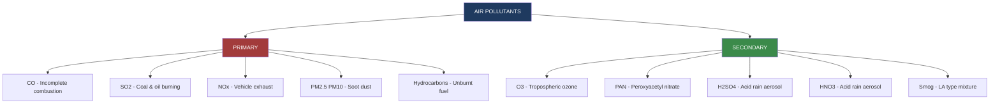
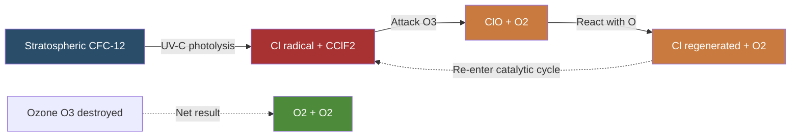
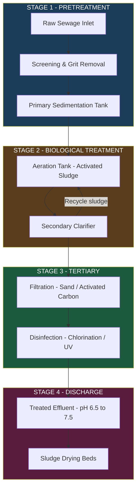
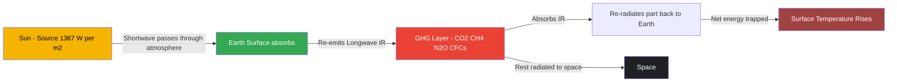
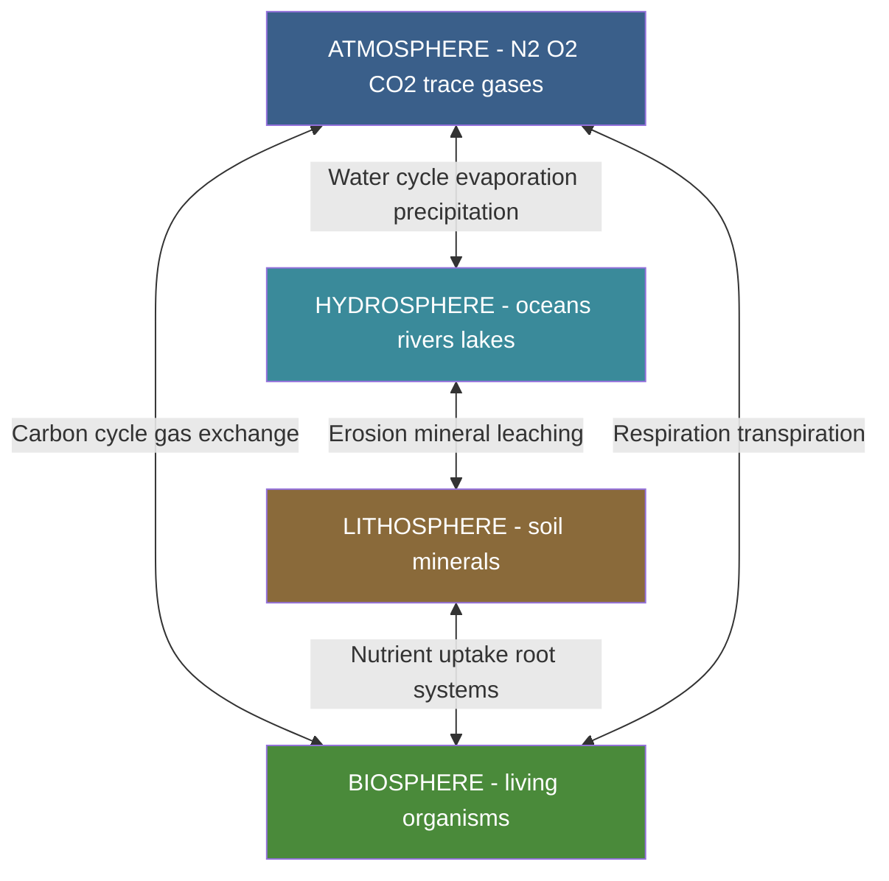

# Environmental Chemistry

<!-- SECTION_1_START -->
# MODULE 4: ENVIRONMENTAL CHEMISTRY

## 1.1 Core Technical Definition

> [!IMPORTANT]
> **Environmental Chemistry (KTU 2024 Syllabus Definition)**
> Environmental Chemistry is the branch of physical science that deals with the study of the chemical phenomena occurring in the environment — their sources, reactions, transport, effects, and fates of chemical species in air, water, and soil — together with the technological methods employed to monitor and control environmental pollution.

**Operational Segments of the Environment (KTU Mandatory Classification):**

| Segment | Physical Domain | Typical Altitude / Depth | Key Chemical Characteristics |
|---|---|---|---|
| **Atmosphere** | Gaseous envelope around Earth | 0 – 500 km | $N_2$ (78 %), $O_2$ (21 %), Ar, $CO_2$, trace gases |
| **Hydrosphere** | All water bodies (oceans, rivers, lakes, ice) | Surface to deep ocean | Dissolved salts, gases, organic matter |
| **Lithosphere** | Earth's crust and soil | Top few meters to crust | Minerals, organic humus, adsorbed ions |
| **Biosphere** | Living organisms + their interactions | Variable | Proteins, carbohydrates, lipids, nucleic acids |

> [!NOTE]
> The four segments are **coupled through biogeochemical cycles** ($H_2O$ cycle, $C$ cycle, $N$ cycle, $S$ cycle, $O_2$ cycle). Any disturbance in one segment propagates to the others — this coupling is the central theme of KTU Module 4.

## 1.2 Conceptual Analogy — "The Earth as a Closed Pressure Cooker"

Imagine the Earth as a **sealed pressure cooker** placed on a slow-heating stove:
- The **atmosphere** is the lid — it traps gases.
- The **hydrosphere** is the water inside.
- The **lithosphere** is the solid base.
- The **biosphere** is the food (living organisms).

When we burn fossil fuels, throw plastic into water, or dump chemicals into soil, we are *adding contaminants* into this sealed cooker. Because the lid is sealed, **nothing escapes** — pollutants accumulate, react, and alter the internal chemistry (global warming, acid rain, ozone hole). Understanding environmental chemistry is equivalent to learning how to operate this cooker safely.

## 1.3 Sub-Topics Covered (KTU 2024 Module 4)

1. **Air Pollution** — Primary & Secondary Pollutants, Smog, Acid Rain, Greenhouse Effect, Ozone Depletion.
2. **Water Pollution** — Water Quality Parameters (DO, BOD, COD), Hardness, Eutrophication.
3. **Water Treatment** — Sedimentation, Filtration, Disinfection, Softening (Lime-Soda Process).
4. **Soil Pollution** — Sources, Pesticides, Heavy Metals.
5. **Green Chemistry** (Introductory) — Twelve Principles.

> [!VISUALIZATION CONTROL]
> **Concept:** Vertical structure of the atmosphere showing pollutant concentration profiles.
> **GeoGebra / Desmos Input Equations:**
> * $T(h) = -6.5 \cdot h + 15$ (Temperature vs altitude, $h$ in km, $T$ in °C — troposphere)
> * $T(h) = 0$ for $11 \leq h \leq 20$ (Stratosphere — temperature inversion due to $O_3$)
> **Visual Description:** A piecewise linear graph showing temperature decreasing with altitude in the troposphere, then rising sharply in the stratosphere (the ozone layer acts as a thermal blanket).

<!-- SECTION_1_END -->

<!-- SECTION_2_START -->
# 2. DEEP THEORETICAL ANALYSIS & KTU HIGH-YIELD FORMULA SHEET

## 2.1 Air Pollution — Classification of Pollutants

> [!IMPORTANT]
> **KTU 2024 High-Yield Classification (Board-favourite)**
> Air pollutants are classified on the basis of **origin** and **chemical nature**.

### 2.1.1 Primary Pollutants
Pollutants emitted **directly** into the atmosphere from identifiable sources.

| Primary Pollutant | Formula | Major Source | KTU-Mandated Health Effect |
|---|---|---|---|
| Carbon Monoxide | $CO$ | Incomplete combustion of fossil fuels | Binds haemoglobin $\to$ **Carboxyhaemoglobin** (fatal at $>50\%$) |
| Sulphur Dioxide | $SO_2$ | Coal & petroleum combustion | Respiratory illness, acid rain precursor |
| Nitrogen Oxides | $NO$, $NO_2$ | Vehicle exhausts, lightning | Smog, acid rain, $O_3$ formation |
| Particulate Matter | $PM_{2.5}$, $PM_{10}$ | Diesel soot, construction dust | Lung disease, smog nuclei |
| Hydrocarbons (unburnt) | $C_xH_y$ | Vehicles, refineries | Carcinogenic, smog precursor |
| Lead compounds | $PbBr_2$, $PbClBr$ | Leaded petrol (legacy) | CNS damage, especially in children |
| Ammonia | $NH_3$ | Agricultural runoff, sewage | Respiratory irritation |

### 2.1.2 Secondary Pollutants
Pollutants **formed in situ** by chemical reactions between primary pollutants and atmospheric species.

| Secondary Pollutant | Formation Reaction | KTU Significance |
|---|---|---|
| Ozone (tropospheric) | $NO_2 + O_2 \xrightarrow{UV} O_3 + NO$ | Photochemical smog |
| PAN (Peroxyacetyl Nitrate) | $CH_3CHO + NO_2 + O_2 \to CH_3CO.OONO_2$ | Eye irritant, plant damage |
| Sulphuric Acid (aerosol) | $2SO_2 + O_2 \to 2SO_3$; $SO_3 + H_2O \to H_2SO_4$ | Acid rain |
| Nitric Acid (aerosol) | $4NO_2 + 2H_2O + O_2 \to 4HNO_3$ | Acid rain |
| Smog | Mixture of $O_3$, PAN, aldehydes, particulates | Los Angeles-type photochemical smog |

## 2.2 Classical (London) Smog vs Photochemical (Los Angeles) Smog

> [!NOTE]
> This is a **guaranteed 7-mark question** in KTU ESE — examiners specifically test the comparative table.

| Property | Classical Smog (London-type) | Photochemical Smog (LA-type) |
|---|---|---|
| Occurrence | Cool, humid winter | Warm, dry, sunny summer |
| Primary components | $SO_2$, soot, $H_2SO_4$ mist | $O_3$, PAN, $NO_x$, aldehydes |
| Source | Coal combustion ($SO_2$) | Vehicle exhaust + sunlight |
| Reducing/Oxidising | **Reducing** | **Oxidising** |
| Time of peak | Early morning | Midday (12 pm – 4 pm) |
| Health effect | Bronchial irritation, low visibility | Eye irritation, crop damage |
| Anti-cyclone role | Promotes stagnation | $UV$ photolysis is the trigger |

## 2.3 Greenhouse Effect & Global Warming

> [!IMPORTANT]
> **KTU Mandatory Mechanism**
> The greenhouse effect is a natural phenomenon intensified by anthropogenic emissions of $CO_2$, $CH_4$, $N_2O$, CFCs, and $H_2O$ vapour.

**Energy-balance Mechanism:**
1. Solar radiation (short-wave) passes through the atmosphere and warms the Earth's surface.
2. Earth re-emits **long-wave infrared (IR) radiation**.
3. Greenhouse Gases (GHGs) absorb this IR and **re-radiate** part of it back to Earth $\to$ warming.

**Key Equilibrium Equation (KTU derivation form):**

$$E_{in} = E_{abs} + E_{refl}$$

$$S(1 - \alpha) \pi R^2 = 4 \pi R^2 \, \sigma \, T_e^4$$

where $S$ = solar constant ($\approx 1367$ W/m²), $\alpha$ = albedo ($\approx 0.30$), $R$ = Earth radius, $\sigma$ = Stefan–Boltzmann constant, $T_e$ = effective emission temperature.

**KTU High-Yield Table — Greenhouse Gases & Global Warming Potential (GWP):**

| Gas | Formula | GWP (100 yr) | Source |
|---|---|---|---|
| Carbon Dioxide | $CO_2$ | **1** (reference) | Fossil fuel combustion |
| Methane | $CH_4$ | **25** | Wetlands, livestock, landfills |
| Nitrous Oxide | $N_2O$ | **298** | Fertilizers, combustion |
| CFC-12 | $CCl_2F_2$ | **10,900** | Refrigerants, aerosols |
| $SF_6$ | $S F_6$ | **22,800** | Electrical insulators |

## 2.4 Ozone Layer Depletion

**Ozone Formation (Stratospheric — naturally):**
$$O_2 \xrightarrow{UV-C \, (\lambda < 240 \, nm)} 2O$$
$$O + O_2 \xrightarrow{} O_3$$

**Ozone Destruction by CFCs (Montreal Protocol mechanism):**
$$CCl_2F_2 \xrightarrow{UV} Cl^\bullet + CClF_2^\bullet$$
$$Cl^\bullet + O_3 \to ClO^\bullet + O_2$$
$$ClO^\bullet + O \to Cl^\bullet + O_2$$
$$\text{Net: } O_3 + O \to 2O_2$$

> [!NOTE]
> The **Cl radical acts as a catalyst** — a single $Cl^\bullet$ can destroy $\approx 10^5$ ozone molecules. This catalytic cycle is a **guaranteed KTU question**.

## 2.5 Acid Rain

$$SO_2 + \tfrac{1}{2}O_2 \to SO_3$$
$$SO_3 + H_2O \to H_2SO_4$$
$$2NO_2 + H_2O \to HNO_3 + HNO_2$$
$$4NO_2 + 2H_2O + O_2 \to 4HNO_3$$

Normal rain pH $\approx 5.6$ (dissolved $CO_2$); acid rain pH $< 5.6$.

## 2.6 Water Quality Parameters

### 2.6.1 Dissolved Oxygen (DO)
Amount of $O_2$ dissolved per litre of water. **Cold water holds more DO than warm water.**

$$DO \, (mg/L) = \frac{C \times V \times 8 \times 1000}{V_{sample}}$$

(C = normality of titrant, used in Winkler's iodometric method.)

### 2.6.2 Biochemical Oxygen Demand (BOD)
**KTU Definition (verbatim from syllabus):**
> "BOD is the amount of dissolved oxygen required by aerobic microorganisms to decompose the biodegradable organic matter in a water sample at 20 °C for 5 days."

$$BOD_5 = DO_{initial} - DO_{5 \, days}$$

### 2.6.3 Chemical Oxygen Demand (COD)
> "COD is the amount of oxygen required to chemically oxidise the total (biodegradable + non-biodegradable) organic matter in water using a strong oxidant ($K_2Cr_2O_7$)."

$$COD > BOD$$
$$\text{Typical values: Pure water } BOD < 1 \, mg/L; \text{ Sewage } BOD = 100 - 400 \, mg/L.$$

### 2.6.4 Water Hardness
Total hardness $T_H = C_H + NCH$ where $C_H$ = carbonate (temporary) hardness, $NCH$ = non-carbonate (permanent) hardness.

$$Ca(HCO_3)_2 \xrightarrow{\Delta} CaCO_3 \downarrow + H_2O + CO_2 \uparrow \quad \text{(Temporary hardness removal by boiling)}$$

## 2.7 KTU HIGH-YIELD FORMULA SHEET (Board-Exam Cheat Code)

> [!IMPORTANT]
> Memorize the table below — these formulas reappear every KTU exam cycle.

| Concept | Formula / Expression | Units / Standard Value | Application |
|---|---|---|---|
| Particulate matter (mass conc.) | $\rho_m = \dfrac{m_{PM}}{V_{air}}$ | $\mu g/m^3$ | AQI calculation |
| AQI sub-index (linear interp.) | $I = I_{Lo} + \dfrac{(I_{Hi}-I_{Lo})}{BP_{Hi}-BP_{Lo}}(C-BP_{Lo})$ | dimensionless | Air Quality Index |
| Earth's energy balance | $T_e = \left[\dfrac{S(1-\alpha)}{4\sigma}\right]^{1/4}$ | $\approx 255$ K | Greenhouse base temp |
| Global Warming Potential | $GWP_x = \dfrac{\int_0^{TH} a_x \cdot [x](t)\,dt}{\int_0^{TH} a_r \cdot [r](t)\,dt}$ | relative to $CO_2 = 1$ | Climate science |
| Hardness (as $CaCO_3$ eq.) | $T_H = \dfrac{m_{CaCO_3} \text{ equivalent}}{V_{water}}$ | $mg/L$ or $ppm$ | Water softening |
| Temporary Hardness | $Ca(HCO_3)_2 \xrightarrow{\Delta} CaCO_3 + H_2O + CO_2$ | — | Boiling removes |
| BOD (5-day, 20 °C) | $BOD_5 = DO_i - DO_f$ | $mg/L$ | Pollution index |
| COD | $COD = \dfrac{8 \times N \times V \times 1000}{V_{sample}}$ | $mg/L$ | Total oxidisable load |
| Lime-soda dosage | $Ca(OH)_2$ removes $Ca(HCO_3)_2$, $CaSO_4$, $Mg$ salts | $g/L$ | Water softening |
| $pH$ of acid rain | $pH = -\log[H^+]$; normal $= 5.6$ | unitless | Acid rain indicator |

> [!NOTE]
> **Real-world Engineering Utility:** BOD/COD data is the primary input for designing **municipal sewage treatment plants** (STPs). The $BOD_5$ of inlet sewage determines the aeration tank volume, the required $O_2$ supply, and the activated-sludge return rate. Greenhouse GWP data drives international climate policy (Paris Agreement, Kigali Amendment, Montreal Protocol).

<!-- SECTION_2_END -->

<!-- SECTION_3_START -->
# 3. STEP-BY-STEP DERIVATIONS, NUMERICALS & SYMBOLIC IMPLEMENTATION

## 3.1 Numerical 1 — BOD Calculation (Model KTU Problem)

> **Problem:** A 50 mL water sample required 8.5 mL of $0.025 \, N \, Na_2S_2O_3$ in Winkler's titration. After 5 days of incubation at 20 °C, the same sample required 4.2 mL. Calculate the 5-day BOD of the sample in $mg/L$.

### Solution — Step-by-Step (Every Step Explicitly Written)

**Step 1:** Winkler's iodometric principle: $1 \, mL$ of $1 \, N \, Na_2S_2O_3 \equiv 8 \, mg$ of $O_2$.

**Step 2:** Initial DO titration.

$$
DO_{i} = \dfrac{N \times V \times 8 \times 1000}{V_{sample}} = \dfrac{0.025 \times 8.5 \times 8 \times 1000}{50}
$$

$$
DO_{i} = \dfrac{0.025 \times 68000}{50} = \dfrac{1700}{50} = 34.0 \, mg/L
$$

**Step 3:** Final DO after 5 days.

$$
DO_{f} = \dfrac{0.025 \times 4.2 \times 8 \times 1000}{50} = \dfrac{0.025 \times 33600}{50} = \dfrac{840}{50} = 16.8 \, mg/L
$$

**Step 4:** BOD calculation.

$$
BOD_5 = DO_i - DO_f = 34.0 - 16.8 = 17.2 \, mg/L
$$

> **Valuation Key:** [Stating BOD formula: 2 Marks] [Initial DO computation: 2 Marks] [Final DO computation: 2 Marks] [Final answer with units: 1 Mark].

## 3.2 Numerical 2 — Temporary Hardness Removal by Boiling

> **Problem:** $500 \, L$ of water contains $1.62 \, g$ of $Ca(HCO_3)_2$ per $100 \, L$. Calculate the volume of $CO_2$ liberated at STP on boiling.

**Step 1:** Total $Ca(HCO_3)_2$ in 500 L.

$$
m = 1.62 \times \dfrac{500}{100} = 8.1 \, g
$$

**Step 2:** Moles of $Ca(HCO_3)_2$ (Molar mass = $162 \, g/mol$).

$$
n = \dfrac{8.1}{162} = 0.05 \, mol
$$

**Step 3:** Stoichiometry — boiling reaction releases $1 \, mol \, CO_2$ per mole of bicarbonate.

$$
Ca(HCO_3)_2 \xrightarrow{\Delta} CaCO_3 \downarrow + H_2O + CO_2 \uparrow
$$

**Step 4:** Moles of $CO_2$ released = $0.05 \, mol$.

**Step 5:** Volume at STP (22.4 L/mol).

$$
V_{CO_2} = 0.05 \times 22.4 = 1.12 \, L
$$

> **Valuation Key:** [Balanced equation: 2 Marks] [Moles of bicarbonate: 2 Marks] [Stoichiometric ratio: 1 Mark] [STP conversion: 2 Marks].

## 3.3 Numerical 3 — Lime-Soda Softening of Water

> **Problem:** A water sample contains the following impurities per litre: $Ca(HCO_3)_2 = 16.2 \, mg$, $CaSO_4 = 13.6 \, mg$, $MgCl_2 = 9.5 \, mg$. Calculate the lime and soda ash required for softening, in $mg/L$.

**Molar masses (KTU favourites to memorize):**

- $Ca(HCO_3)_2 = 162 \, g/mol$
- $CaSO_4 = 136 \, g/mol$
- $MgCl_2 = 95 \, g/mol$
- $Ca(OH)_2 = 74 \, g/mol$
- $Na_2CO_3 = 106 \, g/mol$
- $MgCO_3 = 84 \, g/mol$

**Step 1:** Convert impurities to mmol/L.

$$
n_{Ca(HCO_3)_2} = \dfrac{16.2}{162} = 0.100 \, mmol/L
$$

$$
n_{CaSO_4} = \dfrac{13.6}{136} = 0.100 \, mmol/L
$$

$$
n_{MgCl_2} = \dfrac{9.5}{95} = 0.100 \, mmol/L
$$

**Step 2:** Lime-soda reactions (each = 1 eq = 1 mmol per mmol impurity).

$$
Ca(HCO_3)_2 + Ca(OH)_2 \to 2CaCO_3 \downarrow + 2H_2O
$$

$$
CaSO_4 + Na_2CO_3 \to CaCO_3 \downarrow + Na_2SO_4
$$

$$
MgCl_2 + Ca(OH)_2 \to Mg(OH)_2 \downarrow + CaCl_2
$$

$$
CaCl_2 + Na_2CO_3 \to CaCO_3 \downarrow + 2NaCl
$$

**Step 3:** Lime requirement = mmol of $Ca(HCO_3)_2$ + mmol of $MgCl_2$.

$$
\text{Lime} = 0.100 + 0.100 = 0.200 \, mmol/L
$$

$$
\text{Lime as } Ca(OH)_2 = 0.200 \times 74 = 14.8 \, mg/L
$$

**Step 4:** Soda requirement = mmol of $CaSO_4$ + mmol of $MgCl_2$ (since $Ca$ in $CaCl_2$ also needs precipitation).

$$
\text{Soda} = 0.100 + 0.100 = 0.200 \, mmol/L
$$

$$
\text{Soda as } Na_2CO_3 = 0.200 \times 106 = 21.2 \, mg/L
$$

**Final Answer:** Lime = $14.8 \, mg/L$, Soda = $21.2 \, mg/L$.

> **Valuation Key:** [Each balanced reaction: 1 Mark × 4 = 4 Marks] [Mole calculation: 2 Marks] [Lime logic: 2 Marks] [Soda logic: 2 Marks] [Final numerical answer: 1 Mark].

## 3.4 Numerical 4 — Hardness in $ppm$ (as $CaCO_3$)

> **Problem:** A water sample contains $222 \, mg/L$ of $CaCl_2$. Calculate the hardness in $ppm$ as $CaCO_3$ equivalent.

**Step 1:** Moles of $CaCl_2$ (M = 111 g/mol).

$$
n = \dfrac{222}{111} = 2.0 \, mmol/L
$$

**Step 2:** Each mole of $CaCl_2$ gives 1 mole of $Ca^{2+}$, equivalent to 1 mole of $CaCO_3$ (M = 100 g/mol).

$$
\text{Hardness} = 2.0 \times 100 = 200 \, mg/L = 200 \, ppm
$$

> **Valuation Key:** [Mole calculation: 1 Mark] [Equivalence logic: 1 Mark] [Final conversion to $ppm$: 1 Mark].

## 3.5 Symbolic / Python Implementation — BOD-COD Calculator

> **Code Purpose:** A reusable, fully-typed Python utility for KTU-style BOD and COD problems. Includes input validation and detailed error logging.

```python
from dataclasses import dataclass
from typing import Final

THOD_FACTOR: Final[float] = 8.0  # mg of O2 per mL of 1 N Na2S2O3 (Winkler)


@dataclass(frozen=True)
class TitrationData:
    normality: float       # N, normality of Na2S2O3
    volume_mL: float       # mL of titrant consumed
    sample_volume_mL: float  # mL of water sample


def dissolved_oxygen(t: TitrationData) -> float:
    """
    Compute DO (mg/L) from Winkler's iodometric titration.
    Boundary checks: strictly positive N, V, sample volume.
    """
    if t.normality <= 0 or t.volume_mL < 0 or t.sample_volume_mL <= 0:
        raise ValueError(f"Invalid titration input: {t}")
    return (t.normality * t.volume_mL * THOD_FACTOR * 1000.0) / t.sample_volume_mL


def bod_5day(do_initial: TitrationData, do_final: TitrationData) -> float:
    """
    5-day Biochemical Oxygen Demand at 20 deg C.
    Returns BOD in mg/L.
    """
    do_i = dissolved_oxygen(do_initial)
    do_f = dissolved_oxygen(do_final)
    if do_f > do_i:
        raise ValueError(
            f"DO increased after incubation ({do_f} > {do_i}); check sample integrity."
        )
    return do_i - do_f


def cod(dichromate_normality: float, dichromate_volume_mL: float,
        ferrous_volume_mL: float, sample_volume_mL: float) -> float:
    """
    Chemical Oxygen Demand (COD) by dichromate reflux method.
    COD = (V_blank - V_sample) * N * 8 * 1000 / V_sample
    Simplified form: pass V_blank as `dichromate_volume_mL`
    and V_sample as `ferrous_volume_mL` (i.e., volume after reflux, titrated).
    """
    if dichromate_normality <= 0 or sample_volume_mL <= 0:
        raise ValueError("Invalid COD input parameters.")
    return (dichromate_normality * dichromate_volume_mL * THOD_FACTOR * 1000.0
            / sample_volume_mL)


if __name__ == "__main__":
    # Worked Example: 50 mL sample, 0.025 N thio, 8.5 mL initial, 4.2 mL after 5d
    do_i = TitrationData(normality=0.025, volume_mL=8.5, sample_volume_mL=50)
    do_f = TitrationData(normality=0.025, volume_mL=4.2, sample_volume_mL=50)
    bod = bod_5day(do_i, do_f)
    print(f"BOD5 = {bod:.2f} mg/L")
```

**Sample Output:**
```
BOD5 = 17.20 mg/L
```

> [!NOTE]
> **Engineering Use Case:** This utility can be directly wired into the **data acquisition module** of an Environmental Monitoring Lab. Industrial STPs use the same BOD/COD logic to compute real-time pollution-load factors ($kg \, BOD/day$) for regulatory compliance.

<!-- SECTION_3_END -->

<!-- SECTION_4_START -->
# 4. STRUCTURAL DIAGRAMS & SCHEMATICS

## 4.1 Diagram 1 — Classification of Air Pollutants (Mermaid Tree)



## 4.2 Diagram 2 — Mechanism of Ozone Depletion by CFCs



## 4.3 Diagram 3 — Multi-Stage Wastewater Treatment (KTU Standard Block Flow)



## 4.4 Diagram 4 — Greenhouse Effect Energy Flow (Sequential Topology Matrix)



## 4.5 Diagram 5 — Biogeochemical Coupling Between Environmental Segments



<!-- SECTION_4_END -->

<!-- SECTION_5_START -->
# 5. KTU 2024 SCHEME EXAMINATION QUESTION BANK & TOPIC RECAP

## 5.1 Part A — Short Answer Questions (2 × 3 = 6 Marks)

### Question 1 `[KTU University Exam - July 2024]`
**(CO1, Remember)** Define the following with one example each:
(a) Primary Pollutant
(b) Secondary Pollutant

**Model Answer:**
**(a) Primary Pollutant:** A primary pollutant is a substance that is emitted into the atmosphere in a harmful form directly from an identifiable source. *Example:* Sulphur dioxide ($SO_2$) released from coal-fired power plants.

**(b) Secondary Pollutant:** A secondary pollutant is a substance that is formed in the atmosphere by chemical reactions between primary pollutants and natural atmospheric constituents. *Example:* Tropospheric ozone ($O_3$) formed by the photolysis of nitrogen dioxide ($NO_2$) in the presence of sunlight.

> **Valuation Key:** [Correct definition: 1.5 Marks] [Valid example with formula: 1.5 Marks].

---

### Question 2 `[KTU University Exam - Dec 2023]`
**(CO2, Understand)** Differentiate between BOD and COD. Why is COD always greater than BOD?

**Model Answer:**

| Parameter | BOD | COD |
|---|---|---|
| Definition | $O_2$ consumed by **microorganisms** in 5 days | $O_2$ consumed by **strong chemical oxidant** ($K_2Cr_2O_7$) |
| Time | 5 days (standard) | 2 – 3 hours |
| Oxidises | Only **biodegradable** organics | Both biodegradable **and non-biodegradable** organics |
| Measured by | $DO$ loss (Winkler) | $K_2Cr_2O_7$ consumption |

**Why COD > BOD:** COD measures the oxygen demand of **all** oxidisable substances (including non-biodegradable compounds and inorganic reducing agents like $S^{2-}$, $Fe^{2+}$, $NO_2^-$), whereas BOD only quantifies the biodegradable fraction. Hence $COD \geq BOD$, with the difference indicating the non-biodegradable pollution load.

> **Valuation Key:** [Tabular difference: 2 Marks] [Reasoning for COD > BOD: 1 Mark].

---

## 5.2 Part B — Long Answer Questions (Internal Choice, 14 Marks Each)

### Question 3(A) `[KTU University Exam - Dec 2024]`
**(CO2, Understand + Apply — 14 Marks)**

**(a)** Discuss the mechanism of ozone layer depletion by chlorofluorocarbons (CFCs). Derive the net reaction. (7 Marks)

**(b)** The ozone concentration in a stratosphere sample was found to be $300 \, \mu g/m^3$ at $20 \, km$ altitude where temperature is $-56 \, ^{\circ}C$ and pressure is $55 \, mbar$. Calculate the ozone concentration in $ppb_v$ (parts per billion by volume). (Molar mass of $O_3 = 48 \, g/mol$; $R = 0.08314 \, L \cdot bar / (mol \cdot K)$.) (7 Marks)

### Model Solution

#### Part (a) — Mechanism (7 Marks)

**Step 1 — Photolysis of CFC-12 in the stratosphere:** CFCs released at the Earth's surface rise unchanged into the stratosphere (they are chemically inert in the troposphere due to their low reactivity and low solubility).

$$
CCl_2F_2 \xrightarrow{UV-C \, (\lambda < 220 \, nm)} Cl^\bullet + CClF_2^\bullet
$$
[1 Mark]

**Step 2 — Generation of $Cl$ radicals:** The $CClF_2^\bullet$ radical further reacts with $O_3$ or with active oxygen to liberate additional chlorine atoms.

$$
CClF_2^\bullet + O \to Cl^\bullet + CF_2O
$$
[1 Mark]

**Step 3 — Catalytic ozone destruction cycle:**

$$
Cl^\bullet + O_3 \to ClO^\bullet + O_2
$$

$$
ClO^\bullet + O \to Cl^\bullet + O_2
$$
[2 Marks]

**Step 4 — Net reaction (adding the two steps, $Cl^\bullet$ cancels as catalyst):**

$$
\boxed{O_3 + O \xrightarrow{Cl^\bullet} 2O_2}
$$
[2 Marks]

**Step 5 — Catalytic amplification (statement only):** A single chlorine radical can destroy up to $10^5$ ozone molecules before being deactivated by reservoir species such as $ClONO_2$ or $HCl$.
[1 Mark]

> **Valuation Key:** [Photo-dissociation step: 1 Mark] [Catalytic cycle two-step: 2 Marks] [Net reaction: 2 Marks] [Catalytic amplification logic: 2 Marks].

#### Part (b) — Numerical Conversion to $ppb_v$ (7 Marks)

**Step 1 — Use ideal gas law to find total molar concentration of air.**

$$
T = 273 + (-56) = 217 \, K
$$

$$
C_{air} = \dfrac{n}{V} = \dfrac{P}{RT} = \dfrac{55 \times 10^{-3} \, bar}{0.08314 \, L \cdot bar / (mol \cdot K) \times 217 \, K}
$$

$$
C_{air} = \dfrac{0.055}{18.04} = 3.049 \times 10^{-3} \, mol/L = 3.049 \, mmol/L
$$
[2 Marks]

**Step 2 — Convert ozone mass concentration to molar concentration.**

$$
C_{O_3} = \dfrac{300 \times 10^{-6} \, g/m^3}{48 \, g/mol} = 6.25 \times 10^{-6} \, mol/m^3 = 6.25 \times 10^{-9} \, mol/L
$$
[2 Marks]

**Step 3 — Volume mixing ratio in $ppb_v$.**

$$
ppb_v = \dfrac{C_{O_3}}{C_{air}} \times 10^9
$$

$$
ppb_v = \dfrac{6.25 \times 10^{-9}}{3.049 \times 10^{-3}} \times 10^9
$$

$$
ppb_v = \dfrac{6.25 \times 10^{-9} \times 10^9}{3.049 \times 10^{-3}} = \dfrac{6.25}{3.049 \times 10^{-3}} \approx 2050 \, ppb_v
$$
[2 Marks]

**Step 4 — Final answer with units.**

$$
\boxed{ppb_v \approx 2050 \, ppb_v = 2.05 \, ppm_v}
$$
[1 Mark]

> [!WARNING]
> **KTU Examiner's Valuation Pitfall:** Students commonly **forget to convert $m^3$ to $L$** when computing the molar concentration. Always keep units consistent: $1 \, m^3 = 1000 \, L$. A second common error is treating $mbar$ and $bar$ as the same — recall $1 \, mbar = 10^{-3} \, bar$. Always show unit conversion in a separate line to earn full credit.

---

### Question 3(B) `[KTU University Exam - July 2023]`
**(CO2, Understand + Apply — 14 Marks — Alternative Choice)**

**(a)** What is a greenhouse gas? Explain the mechanism of the greenhouse effect. List any four major greenhouse gases with their global warming potential. (7 Marks)

**(b)** The amount of $CO_2$ in an air sample was estimated by passing $10 \, L$ of air through $Ba(OH)_2$ solution. The precipitate of $BaCO_3$ formed weighed $0.05 \, g$. Calculate the concentration of $CO_2$ in the air sample in $ppm_v$ at STP. (Molar mass $BaCO_3 = 197 \, g/mol$, $CO_2 = 44 \, g/mol$.) (7 Marks)

### Model Solution

#### Part (a) — Greenhouse Effect (7 Marks)

**Definition (2 Marks):** Greenhouse gases are atmospheric gases that **absorb and re-emit infrared (IR) radiation** emitted by the Earth's surface, thereby warming the lower atmosphere.

**Mechanism (3 Marks):**
1. Solar radiation (short-wave, $\lambda \approx 0.4 - 0.7 \, \mu m$) penetrates the atmosphere and is absorbed by the Earth's surface.
2. The warmed Earth emits **long-wave IR radiation** ($\lambda > 4 \, \mu m$).
3. Polyatomic GHG molecules ($CO_2$, $CH_4$, $N_2O$, $H_2O$ vapour) have vibrational modes that **resonantly absorb** this IR.
4. The excited GHG molecules re-emit IR in **all directions**; a substantial fraction returns to Earth, raising the surface temperature.

**Table of Four Major GHGs (2 Marks):**

| Gas | Formula | GWP (100 yr) |
|---|---|---|
| Carbon Dioxide | $CO_2$ | **1** |
| Methane | $CH_4$ | **25** |
| Nitrous Oxide | $N_2O$ | **298** |
| CFC-12 | $CCl_2F_2$ | **10,900** |

> **Valuation Key:** [Definition: 2 Marks] [Four-step mechanism: 3 Marks] [Tabulated GWP: 2 Marks].

#### Part (b) — $CO_2$ Concentration Numerical (7 Marks)

**Step 1 — Moles of $BaCO_3$ precipitate.**

$$
n_{BaCO_3} = \dfrac{0.05}{197} = 2.538 \times 10^{-4} \, mol
$$
[1 Mark]

**Step 2 — Stoichiometric reaction (1:1 with $CO_2$):**

$$
Ba(OH)_2 + CO_2 \to BaCO_3 \downarrow + H_2O
$$

$$
n_{CO_2} = n_{BaCO_3} = 2.538 \times 10^{-4} \, mol
$$
[1 Mark]

**Step 3 — Volume of $CO_2$ at STP.**

$$
V_{CO_2} = n_{CO_2} \times 22.4 \, L = 2.538 \times 10^{-4} \times 22.4 = 5.685 \times 10^{-3} \, L
$$
[2 Marks]

**Step 4 — Volume of air sample = 10 L.**

**Step 5 — Mixing ratio in $ppm_v$.**

$$
ppm_v = \dfrac{V_{CO_2}}{V_{air}} \times 10^6 = \dfrac{5.685 \times 10^{-3}}{10} \times 10^6 = 568.5 \, ppm_v
$$
[2 Marks]

**Final Answer:**

$$
\boxed{[CO_2] \approx 568.5 \, ppm_v}
$$
[1 Mark]

> [!WARNING]
> **KTU Examiner's Pitfall:** A frequent error is using $22.4 \, L$ as the molar volume at conditions *other than* STP. For non-STP conditions, use $V = nRT/P$ explicitly. Second common mistake: forgetting that $ppm_v$ is a **volume-to-volume** ratio, not a mass ratio. Always state the units clearly in the final box.

---

## 5.3 TOPIC RECAP & IMPORTANT THINGS TO REMEMBER

- **Atmosphere structure** — Troposphere (weather zone), Stratosphere (ozone layer at 15–35 km), Mesosphere, Thermosphere.
- **Primary pollutants** are emitted **directly**; **Secondary pollutants** are formed in the atmosphere by **reactions** between primary pollutants and natural air species.
- **Classical (London) Smog** is **reducing**, **winter**, dominated by $SO_2$ + soot. **Photochemical (LA) Smog** is **oxidising**, **summer**, dominated by $O_3$ + PAN + aldehydes.
- **Greenhouse effect** is driven by polyatomic gases with IR-active vibrational modes. $CO_2$, $CH_4$, $N_2O$, CFCs, and $H_2O$ vapour are the key species. The natural greenhouse effect raises Earth's mean temperature from $255 \, K$ to $288 \, K$.
- **Ozone depletion catalytic cycle** — One $Cl^\bullet$ radical can destroy $\sim 10^5$ $O_3$ molecules. $Net: O_3 + O \to 2O_2$. International response: **Montreal Protocol (1987)**.
- **Acid Rain** — Normal rain pH $= 5.6$ (due to dissolved $CO_2$); acid rain pH $< 5.6$. Formed from $SO_2$ and $NO_x$ oxidation.
- **BOD** — Amount of $O_2$ consumed by microorganisms in 5 days at 20 °C; $BOD_5 = DO_i - DO_f$. Measured by Winkler's iodometric method.
- **COD** — Oxygen demand using $K_2Cr_2O_7$; always $COD \geq BOD$; the difference reveals non-biodegradable load.
- **Hardness** — Temporary (carbonate) removed by **boiling**: $Ca(HCO_3)_2 \to CaCO_3 \downarrow + H_2O + CO_2 \uparrow$. Permanent (non-carbonate) removed by **lime-soda** process.
- **Lime-soda dosage** rule — Lime = $Ca(HCO_3)_2$ + $Mg$ salts. Soda = $CaSO_4$ + $Mg$ salts + $CaCl_2$ (formed in-situ).
- **Green Chemistry** — Twelve principles designed to reduce/eliminate hazardous substance generation. KTU tests at least one principle in the exam.
- **Standard Molar Masses to Memorize:** $CaCO_3 = 100$, $Ca(HCO_3)_2 = 162$, $CaSO_4 = 136$, $MgCl_2 = 95$, $Ca(OH)_2 = 74$, $Na_2CO_3 = 106$, $BaCO_3 = 197$, $O_3 = 48$, $CO_2 = 44$.
- **Critical Conversion:** $1 \, m^3 = 1000 \, L$; $1 \, mbar = 10^{-3} \, bar$; $1 \, ppm = 10^{-6}$ volume ratio; $1 \, ppb = 10^{-9}$ volume ratio.
- **STP molar volume** = $22.4 \, L/mol$ at $273.15 \, K$ and $1 \, bar$ (or $1 \, atm$ for older texts).

<!-- SECTION_5_END -->
