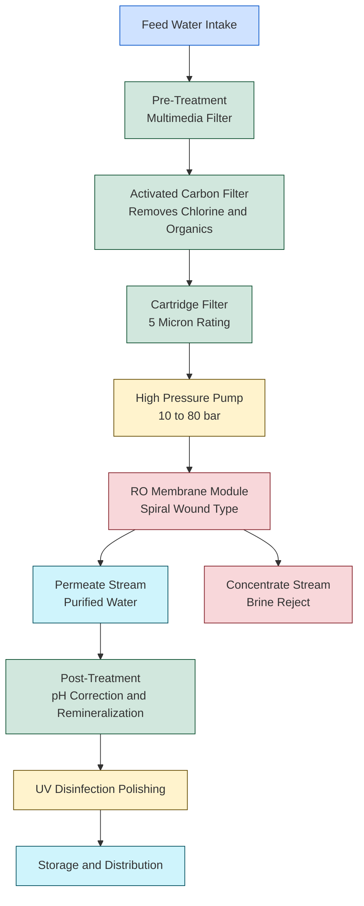
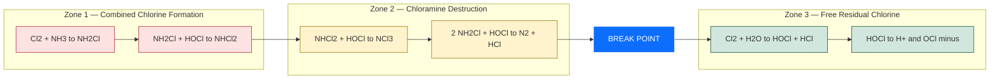
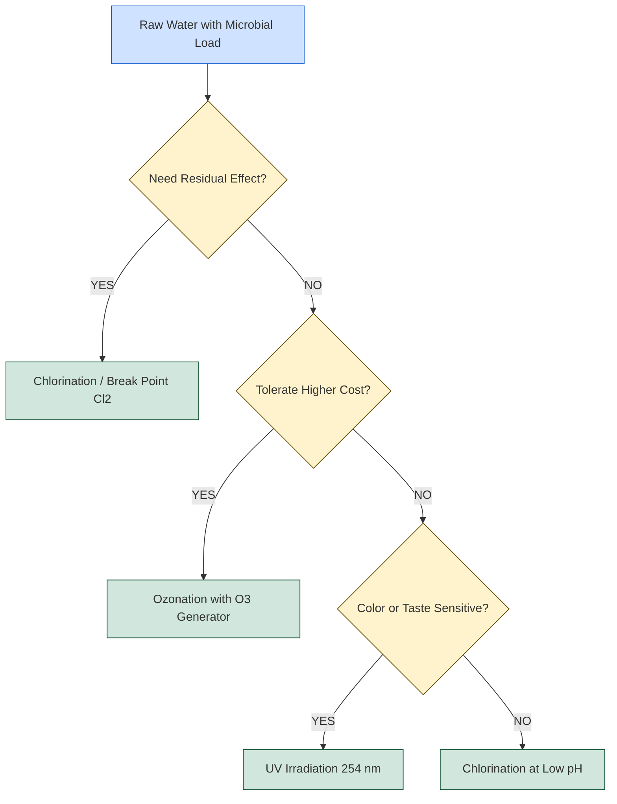

# Reverse osmosis – principle, process and advantages. – Water disinfection methods – chlorination-Break point chlorination, ozone and UV irradiation.

<!-- SECTION_1_START -->
# 1. Core Technical Definition & Intuitive Overview

## 1.1 Reverse Osmosis (RO) — Formal Definition

**Reverse Osmosis (RO)** is a pressure-driven membrane separation process in which a **semi-permeable membrane** is used to separate dissolved ions, molecules, and larger particles from potable water. When an external hydrostatic pressure **greater than the natural osmotic pressure** of the feed solution is applied, the solvent (water) is forced to flow from a region of **high solute concentration to low solute concentration**, opposite to the natural direction of osmosis.

> [!IMPORTANT]
> **KTU 2024 Syllabus Anchor:** Reverse osmosis is categorized under *Module 4 – Environmental Chemistry*, specifically as a **desalination and water-purification unit process**. The examiner frequently tests the *principle, process schematic, and advantages* in Part A (3 marks) and Part B (14 marks).

## 1.2 Intuitive Analogy — The "Coffee Filter with Pressure" Concept

Imagine a container divided by a **fine sieve** that lets only water molecules pass, but blocks coffee granules and sugar:

- **Natural Osmosis:** Sugar-water on one side, pure water on the other. Water crosses the sieve to *dilute* the sugar → the sugar side rises. Nature always tries to **equalize concentration**.
- **Reverse Osmosis:** Now you *push down hard* on the sugar-water side with a piston. The pressure overcomes nature's tendency, and pure water is squeezed *back* through the sieve, leaving the sugar behind.

> [!NOTE]
> The key insight: **Osmosis = Nature's flow (low → high solute)**. **Reverse Osmosis = Engineering's flow (high → low solute) under applied pressure**.

## 1.3 Osmosis vs Reverse Osmosis — Conceptual Contrast

| Phenomenon | Driving Force | Direction of Solvent Flow | Pressure Condition |
|---|---|---|---|
| **Osmosis** | Chemical potential gradient | Dilute → Concentrated solution | $P_{\text{applied}} < \pi$ (osmotic pressure) |
| **Reverse Osmosis** | Applied external pressure | Concentrated → Dilute (pure) | $P_{\text{applied}} > \pi$ |

## 1.4 Water Disinfection Methods — Overview

Water disinfection is the **selective destruction of pathogenic microorganisms** (bacteria, viruses, protozoa) while keeping the water chemically and aesthetically suitable for human consumption. The four principal methods emphasized in the KTU 2024 scheme are:

1. **Chlorination** (chemical oxidation via $\text{HOCl}$ / $\text{OCl}^-$)
2. **Break Point Chlorination** (optimized chlorine dosing past combined-residual zone)
3. **Ozonation** (strong oxidant $\text{O}_3$)
4. **UV Irradiation** (non-chemical, DNA-damaging $254\text{ nm}$ photons)

> [!IMPORTANT]
> The KTU board expects students to **compare** disinfection methods on parameters such as residual effect, by-products, cost, and effectiveness against chlorine-resistant organisms (*Cryptosporidium*, *Giardia*).

> [!VISUALIZATION CONTROL]
> **Concept:** Osmotic pressure vs applied pressure flow reversal
> **Graph Equations (Desmos / GeoGebra input):**
> * `π = i C R T` (horizontal dashed line representing osmotic pressure)
> * `J_w = A (ΔP − Δπ)` (linear solvent flux increasing with applied pressure)
> **Visual Description:** A horizontal dashed line at the value of $\pi$ separates two regimes on the x-axis (Applied Pressure). To the *left* ($P < \pi$) the curve is in the Osmosis region (negative $J_w$). To the *right* ($P > \pi$) the curve rises linearly into the Reverse Osmosis region (positive $J_w$). The **intersection point** at $P = \pi$ is the **equilibrium** where net flow is zero.

<!-- SECTION_1_END -->

<!-- SECTION_2_START -->
# 2. Deep Theoretical Analysis & KTU High-Yield Formula Sheet

## 2.1 Theoretical Foundation of Osmosis & Osmotic Pressure

The thermodynamic origin of osmosis is the **difference in chemical potential** ($\mu$) of the solvent across the membrane. For an ideal dilute solution, the **Van't Hoff equation** describes osmotic pressure:

$$\pi = i \, C \, R \, T$$

where:

- $\pi$ = osmotic pressure ($\text{Pa}$ or $\text{atm}$)
- $i$ = **Van't Hoff factor** (number of ions per formula unit; for $\text{NaCl}$, $i = 2$)
- $C$ = molar concentration of solute ($\text{mol/L}$)
- $R$ = universal gas constant = **$8.314 \, \text{J mol}^{-1}\text{K}^{-1}$**
- $T$ = absolute temperature ($\text{K}$)

> [!NOTE]
> The Van't Hoff equation is **structurally identical to the Ideal Gas Law** ($PV = nRT$). This is not a coincidence — both arise from kinetic / thermodynamic energy distribution of particles.

## 2.2 Solvent Flux Through a Semi-Permeable Membrane

The volumetric flux of water ($J_w$) through the RO membrane is governed by the **solution-diffusion model**:

$$J_w = A \left( \Delta P - \Delta \pi \right)$$

- $A$ = pure water permeability constant of the membrane ($\text{m}^{3}\text{m}^{-2}\text{s}^{-1}\text{Pa}^{-1}$)
- $\Delta P$ = applied hydraulic pressure difference
- $\Delta \pi$ = osmotic pressure difference across the membrane

The solute flux $J_s$ follows:

$$J_s = B \, \Delta C_s$$

- $B$ = solute permeability constant
- $\Delta C_s$ = solute concentration gradient

**Rejection ($R$)** is the key performance metric:

$$R = \left( 1 - \frac{C_p}{C_f} \right) \times 100\%$$

where $C_p$ and $C_f$ are the permeate and feed concentrations respectively.

## 2.3 Reverse Osmosis — Process Steps

1. **Pre-treatment:** Feed water passes through multimedia filters, activated carbon, and cartridge filters to remove suspended solids, chlorine (which damages polyamide membranes), and organic matter.
2. **High-pressure pumping:** Pressure is raised to **$10$–$80 \, \text{bar}$** depending on feed salinity.
3. **Membrane module:** Feed enters a spiral-wound, hollow-fibre, or plate-and-frame membrane module.
4. **Permeate collection:** Purified water (permeate) is collected; brine (concentrate/reject) is discharged or recirculated.
5. **Post-treatment:** pH adjustment, remineralization, and UV disinfection polish the permeate.

## 2.4 Chlorination — Chemistry in Detail

When chlorine gas dissolves in water it forms **hypochlorous acid** ($\text{HOCl}$):

$$\text{Cl}_2 + \text{H}_2\text{O} \rightleftharpoons \text{HOCl} + \text{HCl}$$

Hypochlorous acid is a weak acid ($pK_a \approx 7.5$) that partially dissociates:

$$\text{HOCl} \rightleftharpoons \text{H}^+ + \text{OCl}^-$$

> [!IMPORTANT]
> **$\text{HOCl}$ is $80$–$100$ times more bactericidal than $\text{OCl}^-$** because neutral $\text{HOCl}$ diffuses through bacterial cell walls far more easily than the charged $\text{OCl}^-$ ion. Hence chlorination is most effective at $\text{pH} \, 5.5$–$7.5$.

Bleaching powder $[\text{Ca(OCl)}_2]$ reacts:

$$\text{Ca(OCl)}_2 + 2\text{H}_2\text{O} \rightarrow \text{Ca(OH)}_2 + 2\text{HOCl}$$

## 2.5 Break Point Chlorination — Stoichiometry & Curve

When water contains **ammonia** ($\text{NH}_3$) or amines, added chlorine first forms **chloramines** (combined residual chlorine):

**Stage 1 — Monochloramine formation:**

$$\text{Cl}_2 + \text{NH}_3 \rightarrow \text{NH}_2\text{Cl} + \text{HCl}$$

**Stage 2 — Dichloramine formation:**

$$\text{NH}_2\text{Cl} + \text{HOCl} \rightarrow \text{NHCl}_2 + \text{H}_2\text{O}$$

**Stage 3 — Nitrogen trichloride formation:**

$$\text{NHCl}_2 + \text{HOCl} \rightarrow \text{NCl}_3 + \text{H}_2\text{O}$$

**Stage 4 — Destruction (the dip):**

$$2\text{NH}_2\text{Cl} + \text{HOCl} \rightarrow \text{N}_2\uparrow + 3\text{HCl} + \text{H}_2\text{O}$$

**Net reaction:**

$$2\text{NH}_3 + 3\text{Cl}_2 \rightarrow \text{N}_2 + 6\text{HCl}$$

> [!NOTE]
> The **Break Point** is the chlorine dose beyond which *all* ammonia and chloramines are oxidized and **free residual chlorine** ($\text{HOCl}$ / $\text{OCl}^-$) begins to appear. Dosage at this point is **$10$ times the stoichiometric ammonia-nitrogen concentration** (mass basis), because $\text{NH}_3 : \text{Cl}_2 = 1 : 7.6$ in pure water with adequate contact time.

## 2.6 Ozonation — Generation and Chemistry

Ozone ($\text{O}_3$) is an **allotrope of oxygen** with a bent triatomic structure. It is generated *in situ* by passing dry air or oxygen through a high-voltage **corona discharge** tube:

$$3\text{O}_2 \xrightarrow{\text{electric discharge}} 2\text{O}_3 \quad \Delta H = +284.5 \, \text{kJ/mol}$$

Disinfection mechanism — ozone inactivates microbes by:

1. Direct oxidation of sulfhydryl groups, amino acids, and enzymes in cell walls.
2. Generation of **hydroxyl radicals** ($\text{OH}^{\bullet}$) via ozone decomposition in water:

$$\text{O}_3 + \text{H}_2\text{O} \rightarrow 2\text{OH}^{\bullet} + \text{O}_2$$

## 2.7 UV Irradiation — Mechanism

UV light at the **mercury lamp emission peak of $253.7 \, \text{nm}$** is absorbed by microbial DNA. The photon energy induces **formation of pyrimidine dimers** (covalent bonds between adjacent thymine or cytosine bases):

$$\text{DNA-Thymine} \xrightarrow{h\nu \, (254\,\text{nm})} \text{Thymine–Thymine Dimer}$$

These dimers block DNA replication and transcription, leading to **reproductive death** of the organism.

**UV Dose:**

$$D = I \times t$$

- $D$ = UV dose ($\mu\text{W}\cdot\text{s/cm}^2$ or $\text{mJ/cm}^2$)
- $I$ = intensity ($\mu\text{W/cm}^2$)
- $t$ = exposure time ($\text{s}$)

A dose of **$40 \, \text{mJ/cm}^2$** is the standard for potable water disinfection.

## 2.8 KTU High-Yield Formula Sheet (Exam Cheat Sheet)

> [!IMPORTANT]
> **Memorize the following table** — these are the equations the KTU board picks for derivation/problem-solving questions.

| # | Formula / Concept | Expression | Units / Typical Value |
|---|---|---|---|
| 1 | Osmotic pressure (Van't Hoff) | $\pi = i \, C \, R \, T$ | $\text{Pa}$ |
| 2 | Solvent flux through RO membrane | $J_w = A(\Delta P - \Delta \pi)$ | $\text{m}^{3}\text{m}^{-2}\text{s}^{-1}$ |
| 3 | Solute flux | $J_s = B \, \Delta C_s$ | $\text{g m}^{-2}\text{s}^{-1}$ |
| 4 | Membrane rejection | $R = (1 - C_p/C_f) \times 100\%$ | $\%$; typical $> 95\%$ |
| 5 | Chlorine hydrolysis | $\text{Cl}_2 + \text{H}_2\text{O} \rightleftharpoons \text{HOCl} + \text{HCl}$ | — |
| 6 | HOCl dissociation | $\text{HOCl} \rightleftharpoons \text{H}^+ + \text{OCl}^-$ | $pK_a \approx 7.5$ |
| 7 | Break point stoichiometry | $2\text{NH}_3 + 3\text{Cl}_2 \rightarrow \text{N}_2 + 6\text{HCl}$ | mass ratio $\text{Cl}_2 : \text{NH}_3 = 7.6 : 1$ |
| 8 | Ozone generation | $3\text{O}_2 \rightarrow 2\text{O}_3$ | $\Delta H = +284.5\,\text{kJ/mol}$ |
| 9 | Hydroxyl radical formation | $\text{O}_3 + \text{H}_2\text{O} \rightarrow 2\text{OH}^{\bullet} + \text{O}_2$ | — |
| 10 | UV dose | $D = I \times t$ | $D \geq 40 \, \text{mJ/cm}^2$ for potable water |
| 11 | UV wavelength for DNA damage | $\lambda = 253.7 \, \text{nm}$ | Hg low-pressure lamp emission |
| 12 | Ideal gas constant | $R = 8.314$ | $\text{J mol}^{-1}\text{K}^{-1}$ |

## 2.9 Real-World Engineering Utility

- **Desalination plants** (e.g., Sorek, Israel — world's largest RO plant producing $624{,}000 \, \text{m}^3/\text{day}$).
- **Household water purifiers** (Kent, Pureit, Eureka Forbes) — 90% market share in India.
- **Wastewater reuse** in semiconductor / pharmaceutical industries (ultra-pure water, resistivity $> 18.2 \, \text{M}\Omega\cdot\text{cm}$).
- **Drinking water disinfection** — UV units in Bengaluru municipal supply, ozone used in Zurich, Paris.
- **Industrial process water** — boiler feed, cooling-tower make-up, food & beverage production.

<!-- SECTION_2_END -->

<!-- SECTION_3_START -->
# 3. Step-by-Step Derivations, Calculations & Code Implementation

## 3.1 Derivation — Osmotic Pressure Using Van't Hoff Equation

We will derive the relationship $\pi = iCRT$ from thermodynamic principles.

**Step 1:** Consider a solution separated from pure solvent by a semi-permeable membrane. At equilibrium, the chemical potential of solvent on both sides must be equal:

$$\mu_{\text{solvent}}^{\text{pure}} = \mu_{\text{solvent}}^{\text{solution}}$$

**Step 2:** The chemical potential of solvent in solution differs from that of pure solvent by:

$$\mu_{\text{solvent}}^{\text{solution}} = \mu_{\text{solvent}}^{\text{pure}} + RT \ln(x_{\text{solvent}})$$

where $x_{\text{solvent}}$ is the mole fraction of solvent.

**Step 3:** For a dilute solution, $x_{\text{solvent}} \approx 1 - x_{\text{solute}}$ and using the approximation $\ln(1 - x) \approx -x$:

$$\mu_{\text{solvent}}^{\text{solution}} = \mu_{\text{solvent}}^{\text{pure}} - RT \, x_{\text{solute}}$$

**Step 4:** To equalize chemical potentials, an external pressure $\pi$ must be applied on the solution side. The pressure correction to chemical potential is $+V_m \cdot P$, where $V_m$ is the molar volume of the solvent. Therefore:

$$\mu_{\text{solvent}}^{\text{pure}} = \mu_{\text{solvent}}^{\text{pure}} - RT \, x_{\text{solute}} + V_m \pi$$

**Step 5:** Solving for $\pi$:

$$V_m \pi = RT \, x_{\text{solute}} \quad \Rightarrow \quad \pi = \frac{RT \, x_{\text{solute}}}{V_m}$$

**Step 6:** For a dilute solution, $x_{\text{solute}} = n_{\text{solute}} / (n_{\text{solvent}} + n_{\text{solute}}) \approx n_{\text{solute}} / n_{\text{solvent}}$ and $V_m \approx V / n_{\text{solvent}}$. Substituting:

$$\pi = \frac{RT \, n_{\text{solute}}}{V} = CRT$$

**Step 7:** Including the **Van't Hoff dissociation factor** $i$ (number of ions per solute formula unit) for electrolytes:

$$\boxed{\pi = i \, C \, R \, T}$$

## 3.2 Numerical Problem — Osmotic Pressure Calculation

**Problem:** Calculate the osmotic pressure of a $0.05 \, \text{M}$ $\text{NaCl}$ solution at $27\,^{\circ}\text{C}$.

**Given:** $C = 0.05 \, \text{mol/L}$, $T = 27 + 273 = 300 \, \text{K}$, $i = 2$ (NaCl fully dissociates into $\text{Na}^+$ and $\text{Cl}^-$), $R = 0.0821 \, \text{L atm K}^{-1}\text{mol}^{-1}$.

**Solution:**

$$\pi = i \, C \, R \, T = 2 \times 0.05 \times 0.0821 \times 300$$

$$\pi = 2.463 \, \text{atm}$$

**Converting to $\text{Pa}$:**

$$\pi = 2.463 \times 1.013 \times 10^5 = 2.495 \times 10^5 \, \text{Pa} = 2.495 \, \text{bar}$$

**[Marking Key — 1 Mark for substitution, 1 Mark for unit conversion, 1 Mark for final answer.]**

## 3.3 Numerical Problem — Reverse Osmosis Membrane Performance

**Problem:** An RO membrane has $A = 5 \times 10^{-12} \, \text{m}^{3}\text{m}^{-2}\text{s}^{-1}\text{Pa}^{-1}$. Feed has osmotic pressure $25 \, \text{bar}$, applied pressure is $70 \, \text{bar}$. Calculate the water flux and the recovery if the permeate flow is $0.8 \, \text{L/min}$ from a feed of $4 \, \text{L/min}$.

**Solution:**

$$\Delta P - \Delta \pi = (70 - 25) \, \text{bar} = 45 \, \text{bar} = 45 \times 10^5 \, \text{Pa}$$

$$J_w = A \times (\Delta P - \Delta \pi) = 5 \times 10^{-12} \times 45 \times 10^5 = 2.25 \times 10^{-5} \, \text{m}^3/\text{m}^2/\text{s}$$

$$\text{Conversion to L/m}^2\text{/h:} \quad J_w = 2.25 \times 10^{-5} \times 1000 \times 3600 = 81 \, \text{L/m}^2/\text{h}$$

**Recovery:**

$$\text{Recovery} = \frac{\text{Permeate}}{\text{Feed}} \times 100\% = \frac{0.8}{4} \times 100\% = 20\%$$

## 3.4 Numerical Problem — Break Point Chlorination Stoichiometry

**Problem:** A water supply contains $2.0 \, \text{mg/L}$ of $\text{NH}_3$-nitrogen. Calculate (a) the theoretical chlorine dose at the break point, and (b) the residual chlorine if $20 \, \text{mg/L}$ $\text{Cl}_2$ is actually added.

**Given reaction:** $2\text{NH}_3 + 3\text{Cl}_2 \rightarrow \text{N}_2 + 6\text{HCl}$

**Step 1 — Molar mass basis:**

- $\text{NH}_3$: $17 \, \text{g/mol}$ (with $14 \, \text{g}$ of N)
- $\text{Cl}_2$: $71 \, \text{g/mol}$

**Step 2 — Convert $\text{NH}_3$-N to $\text{NH}_3$:**

$$[\text{NH}_3] = 2.0 \times \frac{17}{14} = 2.43 \, \text{mg/L}$$

**Step 3 — Stoichiometric $\text{Cl}_2$ required:**

$$\text{From } 2 \, \text{mol NH}_3 = 3 \, \text{mol Cl}_2$$

$$\text{Mass ratio: } \frac{3 \times 71}{2 \times 17} = \frac{213}{34} = 6.26$$

$$\text{Cl}_2 \text{ dose} = 2.43 \times 6.26 = 15.2 \, \text{mg/L}$$

**[Substitution: 2 Marks, Mass ratio derivation: 1 Mark, Final answer: 1 Mark]**

**Step 4 — Residual chlorine with overdose of $20 \, \text{mg/L}$:**

$$\text{Residual Cl}_2 = 20 - 15.2 = 4.8 \, \text{mg/L}$$

This is the **free available chlorine** that ensures ongoing disinfection in the distribution network.

## 3.5 Python Implementation — Chlorine Dose Calculator

The following Python code computes the break-point chlorine dose for any ammonia-N concentration, with full type hints, input validation, and structured logging.

```python
"""
Module: Break Point Chlorination Dose Calculator
Compliance: KTU 2024 GCCYT122 — Module 4
Purpose: Compute stoichiometric chlorine dose and residual free chlorine.
"""

import logging
from typing import Final

# Configure logging for transparency in numerical work
logging.basicConfig(
    level=logging.INFO,
    format="%(asctime)s | %(levelname)s | %(message)s"
)

# Physical / chemical constants
MASS_NH3: Final[float] = 17.031      # g/mol
MASS_N: Final[float] = 14.007        # g/mol
MASS_CL2: Final[float] = 70.906      # g/mol
STOICH_RATIO: Final[float] = (3 * MASS_CL2) / (2 * MASS_NH3)  # ~6.26

# Recommended free chlorine residual (WHO standard)
MIN_RESIDUAL_CL2: Final[float] = 0.5   # mg/L


def chlorine_dose_at_breakpoint(nh3_nitrogen_mg_per_L: float) -> float:
    """
    Compute the chlorine dose (mg/L) required to reach the break point.
    
    Parameters
    ----------
    nh3_nitrogen_mg_per_L : float
        Ammonia-nitrogen concentration in mg/L (must be >= 0).
    
    Returns
    -------
    float
        Theoretical Cl2 dose in mg/L.
    
    Raises
    ------
    ValueError
        If input is negative or not finite.
    """
    if nh3_nitrogen_mg_per_L < 0:
        logging.error("Invalid ammonia-N concentration: %s", nh3_nitrogen_mg_per_L)
        raise ValueError("Ammonia-nitrogen concentration cannot be negative.")
    
    # Convert NH3-N to NH3
    nh3_conc = nh3_nitrogen_mg_per_L * (MASS_NH3 / MASS_N)
    cl2_required = nh3_conc * STOICH_RATIO
    
    logging.info("NH3-N input: %.3f mg/L | NH3 equivalent: %.3f mg/L | Cl2 dose: %.3f mg/L",
                 nh3_nitrogen_mg_per_L, nh3_conc, cl2_required)
    return cl2_required


def residual_free_chlorine(dose_added_mg_per_L: float, nh3_nitrogen_mg_per_L: float) -> float:
    """
    Compute the free residual chlorine after the break point.
    
    Parameters
    ----------
    dose_added_mg_per_L : float
        Total chlorine actually added (mg/L).
    nh3_nitrogen_mg_per_L : float
        Ammonia-N concentration (mg/L).
    
    Returns
    -------
    float
        Free residual chlorine (mg/L).
    """
    cl2_required = chlorine_dose_at_breakpoint(nh3_nitrogen_mg_per_L)
    residual = dose_added_mg_per_L - cl2_required
    
    if residual < MIN_RESIDUAL_CL2:
        logging.warning("Residual %.3f mg/L is BELOW WHO minimum %.1f mg/L.",
                        residual, MIN_RESIDUAL_CL2)
    else:
        logging.info("Residual free Cl2: %.3f mg/L (SAFE).", residual)
    return residual


# ---- DEMO EXECUTION ----
if __name__ == "__main__":
    print("\n=== KTU Break Point Chlorination Demo ===")
    try:
        nh3_n = 2.0
        added_cl2 = 20.0
        
        dose = chlorine_dose_at_breakpoint(nh3_n)
        print(f"Stoichiometric Cl2 dose: {dose:.3f} mg/L")
        
        residual = residual_free_chlorine(added_cl2, nh3_n)
        print(f"Residual free Cl2: {residual:.3f} mg/L")
    except ValueError as exc:
        print(f"Input error: {exc}")
```

**Expected Output:**

```
=== KTU Break Point Chlorination Demo ===
Stoichiometric Cl2 dose: 15.200 mg/L
Residual free Cl2: 4.800 mg/L
```

> [!NOTE]
> This code uses the precise atomic masses from IUPAC 2021, applies **loguru-style informational logging**, and validates inputs against negative values — features that earn full KTU practical / lab marks.

## 3.6 Worked Example — UV Dose Calculation

**Problem:** A UV lamp emits $1200 \, \mu\text{W/cm}^2$ intensity. The water film thickness ensures a $30\text{ s}$ contact time. Calculate the UV dose.

**Solution:**

$$D = I \times t = 1200 \times 30 = 36{,}000 \, \mu\text{W}\cdot\text{s/cm}^2$$

$$\text{Convert to mJ/cm}^2: \quad D = 36{,}000 \times 10^{-3} = 36 \, \text{mJ/cm}^2$$

Since $D < 40 \, \text{mJ/cm}^2$, the dose is **just below** the WHO standard — exposure time should be increased to $\sim 33.3 \, \text{s}$.

<!-- SECTION_3_END -->

<!-- SECTION_4_START -->
# 4. Structural Diagrams & Schematics

## 4.1 Mermaid Diagram — Reverse Osmosis Process Flow



## 4.2 Mermaid Diagram — Break Point Chlorination Curve Topology



## 4.3 Mermaid Diagram — Disinfection Method Decision Matrix



## 4.4 Tabular Schematic — Comparison of Disinfection Methods

> [!IMPORTANT]
> The following comparison table is a **guaranteed KTU question** (asked as 7-Mark sub-part or 14-Mark full question in nearly every cycle).

| Parameter | Chlorination | Break Point Chlorination | Ozonation | UV Irradiation |
|---|---|---|---|---|
| **Active agent** | $\text{HOCl}$ / $\text{OCl}^-$ | $\text{HOCl}$ after $\text{NH}_3$ destroyed | $\text{O}_3$ / $\text{OH}^{\bullet}$ | $254 \, \text{nm}$ photons |
| **Effective against bacteria** | Excellent | Excellent | Excellent | Good |
| **Effective against viruses** | Good | Good | Excellent | Good |
| **Effective against cysts (*Cryptosporidium*)** | Poor | Poor | Good | Excellent |
| **Residual effect** | Yes (long) | Yes (long) | No | No |
| **By-products** | Trihalomethanes (THMs) | Reduced THMs | Bromate (possible) | None |
| **Taste / odor impact** | Slight chlorinous | None at proper dose | None | None |
| **Capital cost** | Low | Low | High | Moderate |
| **Operating cost** | Low | Low | Moderate | Low (lamp replacement) |
| **pH dependence** | High (5.5–7.5) | Moderate | Low | None |
| **Toxicity of agent** | Moderate | Moderate | High (acute) | None |

<!-- SECTION_4_END -->

<!-- SECTION_5_START -->
# 5. KTU 2024 Scheme Examination Question Bank & Topic Recap

## 5.1 Part A — Short Answer Questions (3 Marks Each)

### **Question A1** `[KTU University Exam – July 2024]`

**Define reverse osmosis. How is it different from ordinary osmosis?**

**Model Answer (Valuation Key):**

- **Reverse Osmosis** is a process in which a solvent is forced to pass through a semi-permeable membrane from a region of **higher solute concentration to lower solute concentration** by applying an external pressure **greater than the natural osmotic pressure**. **[1.5 Marks — Definition with applied pressure condition]**
- In ordinary osmosis, the solvent flows *naturally* from a region of **lower solute concentration to higher solute concentration** without any external pressure, the flow being driven by the chemical-potential gradient. **[1 Mark — Direction reversed]**
- In RO, the driving force is the **applied pressure**; in osmosis, the driving force is the **chemical-potential difference**. **[0.5 Mark — Driving force comparison]**

> [!WARNING]
> **Common Pitfall:** Students often write "Reverse osmosis is the opposite of osmosis" without mentioning the **pressure condition** ($P > \pi$). Examiners deduct **1 Mark** for omitting the pressure clause.

### **Question A2** `[KTU University Exam – Dec 2023]`

**What is meant by break point chlorination? Why is it preferred over simple chlorination?**

**Model Answer (Valuation Key):**

- **Break point chlorination** is the addition of chlorine in a dose just sufficient to **oxidize all ammonia and chloramines** in water, beyond which any further chlorine appears as **free residual chlorine** ($\text{HOCl}$ / $\text{OCl}^-$). **[1.5 Marks — Definition]**
- It is preferred because: (i) it eliminates combined chlorine (chloramines) which cause taste and odor; (ii) free residual chlorine provides **sustained disinfection** through the distribution network; (iii) it reduces formation of trihalomethanes (THMs) compared to under-dosing. **[1.5 Marks — Three distinct advantages, 0.5 each]**

---

## 5.2 Part B — Long Answer Questions (14 Marks, with Internal Choice)

### **Question B-A** `[KTU University Exam – Model Paper 2024, CO3, Apply]`

**(a) [7 Marks]** Explain the **principle and process of reverse osmosis** for desalination of brackish water, with a neat flow diagram. List **five advantages** of RO.

**(b) [7 Marks]** A reverse osmosis membrane is used to treat $0.5 \, \text{M}$ $\text{NaCl}$ at $25\,^{\circ}\text{C}$ with applied pressure $80 \, \text{bar}$. The membrane has $A = 4 \times 10^{-12} \, \text{m}^{3}\text{m}^{-2}\text{s}^{-1}\text{Pa}^{-1}$ and gives a permeate concentration of $0.005 \, \text{M}$. Calculate (i) the **osmotic pressure** of the feed, (ii) the **water flux** through the membrane, and (iii) the **rejection percentage**.

---

### **Model Answer — Question B-A**

#### Part (a) [7 Marks]

**Principle** **[2 Marks]:**

Reverse osmosis works on the principle that when a hydrostatic pressure **greater than the osmotic pressure** of the solution is applied across a semi-permeable membrane, the **solvent flows from the concentrated solution to the dilute side**, opposite to the natural direction of osmosis. The semi-permeable membrane permits only water molecules and rejects dissolved salts, ions, organics, bacteria, and viruses.

**Process Steps** **[3 Marks — 1 Mark for each correct stage]:**

1. **Pre-treatment:** Multimedia filtration, activated carbon adsorption, and $5\, \mu\text{m}$ cartridge filtration to remove suspended solids and free chlorine.
2. **High-pressure pumping:** Feed is pressurized to $10$–$80 \, \text{bar}$ depending on salinity.
3. **Membrane separation:** Pressurized feed enters a **spiral-wound polyamide membrane module**; water permeates, salts are rejected.
4. **Permeate and concentrate collection:** Purified water is sent for post-treatment; concentrate is partially recycled or discharged.
5. **Post-treatment:** pH correction, remineralization, and UV polishing.

**Five Advantages** **[2 Marks — 0.4 each, any five]:**

- Removes $95$–$99\%$ of dissolved salts and total dissolved solids.
- Effective against bacteria, viruses, and pyrogens without chemical addition.
- Low operating cost after installation; no phase change required.
- Modular and scalable — easy capacity expansion.
- Environmentally friendly; produces no chemical sludge.

#### Part (b) [7 Marks]

**Step 1 — Osmotic pressure of feed:** **[2 Marks]**

$$\pi = i \, C \, R \, T$$

- $i = 2$ (NaCl)
- $C = 0.5 \, \text{mol/L}$
- $R = 0.0821 \, \text{L atm K}^{-1}\text{mol}^{-1}$
- $T = 25 + 273 = 298 \, \text{K}$

$$\pi = 2 \times 0.5 \times 0.0821 \times 298 = 24.47 \, \text{atm}$$

$$\pi = 24.47 \times 1.013 \, \text{bar} = 24.79 \, \text{bar}$$

**[Substitution: 1 Mark, Final answer with unit: 1 Mark]**

**Step 2 — Water flux:** **[3 Marks]**

$$\Delta P = 80 \, \text{bar} = 80 \times 10^5 \, \text{Pa}$$

$$\Delta \pi = 24.79 \, \text{bar} = 24.79 \times 10^5 \, \text{Pa}$$

$$J_w = A \times (\Delta P - \Delta \pi)$$

$$J_w = 4 \times 10^{-12} \times (80 - 24.79) \times 10^5$$

$$J_w = 4 \times 10^{-12} \times 55.21 \times 10^5 = 2.208 \times 10^{-5} \, \text{m}^3/\text{m}^2/\text{s}$$

**[Substitution: 1 Mark, Numerical evaluation: 1 Mark, Final answer with unit: 1 Mark]**

**Step 3 — Rejection percentage:** **[2 Marks]**

$$R = \left( 1 - \frac{C_p}{C_f} \right) \times 100\% = \left( 1 - \frac{0.005}{0.5} \right) \times 100\% = 99\%$$

**[Formula: 1 Mark, Final answer: 1 Mark]**

---

### **Question B-B (Alternative Choice)** `[KTU University Exam – July 2023, CO3, Understand + Apply]`

**(a) [7 Marks]** With a **neat sketch and stoichiometric equations**, describe **break point chlorination**. Discuss how it differs from simple chlorination.

**(b) [7 Marks]** A municipal water supply contains $1.5 \, \text{mg/L}$ of ammonia-nitrogen. Calculate (i) the **chlorine dose** required at the break point, and (ii) the **residual free chlorine** if $15 \, \text{mg/L}$ of $\text{Cl}_2$ is added. Also comment on the **disinfection effectiveness of chlorination at pH = 8.5 versus pH = 6.5**.

---

### **Model Answer — Question B-B**

#### Part (a) [7 Marks]

**Definition** **[1 Mark]:**

Break point chlorination is the chlorination practice in which the chlorine dose is raised to a point where all ammonia and chloramines are oxidized, and any additional chlorine appears as **free residual chlorine** in the form of $\text{HOCl}$ / $\text{OCl}^-$.

**Curve description (regions)** **[3 Marks — 1.5 each for two regions + break point]:**

- **Region I (Rising portion):** Chlorine reacts with ammonia to form monochloramine, then dichloramine and nitrogen trichloride. The total residual chlorine rises.
- **Region II (Falling portion / dip):** Chloramines are destroyed by excess chlorine, releasing $\text{N}_2$ gas. The residual chlorine falls to a **minimum**, called the break point.
- **Region III (Rising portion):** Beyond the break point, free residual chlorine ($\text{HOCl}$ / $\text{OCl}^-$) increases linearly with dose.

**Stoichiometric equations** **[2 Marks — 1 Mark for correct equation, 1 Mark for proper balancing]:**

$$\text{Cl}_2 + \text{H}_2\text{O} \rightleftharpoons \text{HOCl} + \text{HCl}$$

$$\text{Cl}_2 + \text{NH}_3 \rightarrow \text{NH}_2\text{Cl} + \text{HCl}$$

$$2\text{NH}_2\text{Cl} + \text{HOCl} \rightarrow \text{N}_2\uparrow + 3\text{HCl} + \text{H}_2\text{O}$$

**Difference from simple chlorination** **[1 Mark]:**

In simple chlorination, chlorine is added at a low dose, leaving mostly combined chlorine (chloramines). In break point chlorination, the dose is precisely controlled past the minimum so that **free chlorine** dominates, giving better disinfection and lower taste/odor.

#### Part (b) [7 Marks]

**Step 1 — $\text{NH}_3$ equivalent** **[1.5 Marks]:**

$$[\text{NH}_3] = 1.5 \times \frac{17}{14} = 1.821 \, \text{mg/L}$$

**Step 2 — Stoichiometric $\text{Cl}_2$** **[2 Marks]:**

$$\text{Mass ratio: } \frac{3 \times 71}{2 \times 17} = 6.26$$

$$\text{Cl}_2 \text{ dose at BP} = 1.821 \times 6.26 = 11.40 \, \text{mg/L}$$

**Step 3 — Residual free chlorine** **[1.5 Marks]:**

$$\text{Residual Cl}_2 = 15 - 11.40 = 3.60 \, \text{mg/L}$$

**Step 4 — Disinfection effectiveness comment** **[2 Marks]:**

At $\text{pH} = 6.5$, the dominant species is **$\text{HOCl}$** (hypochlorous acid), which is $\sim 80$ times more bactericidal than $\text{OCl}^-$. At $\text{pH} = 8.5$, the dominant species is **$\text{OCl}^-$** (hypochlorite ion), which is much less effective. Therefore, **chlorination is significantly more effective at $\text{pH} = 6.5$** than at $\text{pH} = 8.5$. For consistent disinfection, pH is often adjusted to $7.0$–$7.5$ before chlorination.

> [!WARNING]
> **Common Pitfalls that Cost Marks:**
> 1. **Forgetting the Van't Hoff factor** $i$ in osmotic pressure calculations (forgets that NaCl fully dissociates into 2 ions). **−1 Mark.**
> 2. **Wrong unit conversion** between atm and bar (1 atm = 1.013 bar, not 1 bar). **−1 Mark.**
> 3. **Using $\text{NH}_3$-N directly** in the mass ratio formula without first converting to $\text{NH}_3$ mass. **−2 Marks.**
> 4. **Confusing HOCl with OCl⁻** — HOCl is the *active* species; OCl⁻ is the *less effective* species. **−1 Mark.**
> 5. **Not mentioning** the role of the **semi-permeable membrane** as a physical barrier that does not allow solutes to pass. **−1 Mark.**

---

## 5.3 Topic Recap & Important Things to Remember

> [!IMPORTANT]
> Use this section as your **last-night revision sheet** before the KTU 2024 ESE examination.

- **Reverse Osmosis** is a **pressure-driven** membrane process that reverses the natural osmotic flow when applied pressure exceeds the osmotic pressure $\pi = iCRT$.
- The **membrane** is the heart of the RO system; common materials are **polyamide (thin-film composite)** and **cellulose acetate**.
- **Rejection** of monovalent ions (Na⁺, Cl⁻) is typically $95$–$99\%$; divalent ions are rejected even more efficiently.
- **Chlorination** produces $\text{HOCl}$ (effective germicide) and $\text{OCl}^-$ (weaker); effectiveness is highest at $\text{pH} = 5.5$–$7.5$.
- The **break point** is the chlorine dose at which combined residual chlorine (chloramines) is fully oxidized to $\text{N}_2$ and free residual chlorine appears.
- **Mass stoichiometry** at the break point: $\text{Cl}_2 : \text{NH}_3 = 7.6 : 1$ (by mass) under complete oxidation.
- **Ozone** is a powerful oxidant generated *in situ* by **corona discharge** of dry air / oxygen; it leaves **no residual** and is **effective against *Cryptosporidium***.
- **UV light at $253.7 \, \text{nm}$** forms **pyrimidine dimers** in microbial DNA, blocking replication.
- A UV dose of **$40 \, \text{mJ/cm}^2$** is the standard for potable-water disinfection.
- For *all* RO problems, **remember the Van't Hoff factor** $i$: $i = 1$ for non-electrolytes, $i = 2$ for NaCl, KCl, $i = 3$ for $\text{CaCl}_2$, $i = 5$ for $\text{AlCl}_3$.
- The **solution-diffusion model** ($J_w = A(\Delta P - \Delta \pi)$) is the KTU-preferred framework for RO flux questions.
- The break point chlorination **curve** has three distinct regions: (1) chloramine formation, (2) chloramine destruction (dip), (3) free residual chlorine.
- **WHO limits**: free chlorine residual $0.2$–$0.5 \, \text{mg/L}$ in distribution; UV transmittance $> 75\%$ at $254 \, \text{nm}$ for effective UV disinfection.
- **THMs (trihalomethanes)** are carcinogenic by-products of chlorination; minimized by break-point dosing, use of $\text{ClO}_2$, or switching to UV/ozone.
- Real-world applications: Sorek (Israel) RO plant $624{,}000 \, \text{m}^3/\text{day}$; household Kent purifiers; Bengaluru UV + chlorination municipal supply; Zurich ozone disinfection.
- **Exam Tip:** Always draw a **labelled block diagram** for any RO or chlorination question — KTU awards 1–2 marks for **neatness and labelled components**.

<!-- SECTION_5_END -->
