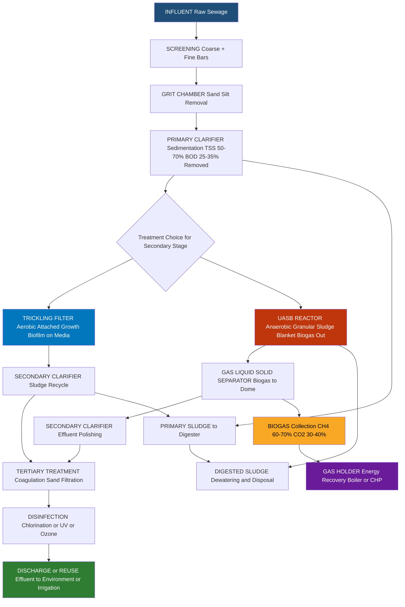
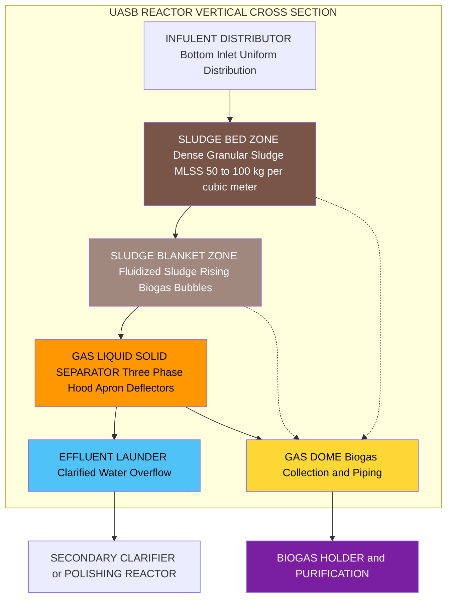

# Sewage water treatment- Primary, Secondary and Tertiary - Flow diagram -Trickling filter and UASB process.

<!-- SECTION_1_START -->
# Sewage Water Treatment: Primary, Secondary, and Tertiary Stages

## 1. Core Technical Definition & Intuitive Overview

### 1.1 Formal Academic Definition (KTU 2024 Syllabus Standard)

**Sewage water treatment** (also called *municipal wastewater treatment*) is a multi-stage physico-chemical–biological engineering process designed to remove suspended solids, dissolved organic matter, pathogenic microorganisms, and inorganic nutrients from domestic and industrial wastewater before its safe discharge into natural water bodies or its reuse for non-potable applications.

The KTU 2024 (NEP-aligned) syllabus frames this as a **three-tier cascading purification architecture**:

- **Primary (Physical/Chemical) Treatment:** Removal of settleable and floating solids by sedimentation, screening, and skimming.
- **Secondary (Biological) Treatment:** Oxidation of dissolved and colloidal biodegradable organics by aerobic or anaerobic microbial action. The KTU module specifically emphasizes the **Trickling Filter** and **UASB (Upflow Anaerobic Sludge Blanket)** processes.
- **Tertiary (Advanced/Polishing) Treatment:** Removal of residual suspended solids, nutrients (N, P), pathogens, and refractory organics to meet reuse/discharge standards.

### 1.2 Key Performance Metrics (Definitions Required for KTU)

| Metric | Full Form | Significance |
|---|---|---|
| **BOD₅** | Biochemical Oxygen Demand (5 days, 20°C) | Mass of O₂ consumed by microbes to biodegrade organics |
| **COD** | Chemical Oxygen Demand | O₂ equivalent of chemically oxidizable matter |
| **TDS / TSS** | Total Dissolved / Suspended Solids | Indicator of inorganic and particulate load |
| **MLSS** | Mixed Liquor Suspended Solids | Biomass concentration in aeration tank |
| **SVI** | Sludge Volume Index | Settleability of activated sludge |
| **F/M Ratio** | Food-to-Microorganism ratio | Substrate loading per unit biomass |
| **HRT** | Hydraulic Retention Time | Average residence time of wastewater |
| **SRT** | Sludge Retention Time | Mean cell residence time of biomass |

> [!IMPORTANT]
> **Standard BOD Test (KTU Board Favorite):** BOD₅ is measured by incubating a sealed diluted sample at **20°C for 5 days** in the dark. The standard dilution water is seeded and buffered (pH = 7.2). The depletion of dissolved oxygen (DO) over 5 days defines the BOD value.

> [!NOTE]
> **Why BOD₅ instead of BODₐₗₗ?** Complete biochemical oxidation of municipal sewage takes ~20–30 days. For practical and regulatory reasons, the 5-day, 20°C test is adopted as a universally reproducible proxy (carbonaceous BOD₅ ≈ 65–70% of ultimate BOD, $BOD_L$).

### 1.3 Conceptual Analogy / Intuitive Overview

Think of sewage treatment as a **3-stage kitchen-cleaning marathon** after a chaotic dinner party:

- **Primary Treatment = Picking up the plates & draining the broth.** Big chunks (screening), sand (grit), and settleable food debris (primary clarifier) are removed mechanically. The water still looks cloudy because dissolved sauces (organics) remain.
- **Secondary Treatment = Microbial cleaning crew.** Either we give them a **rocky playground soaked in wastewater** (Trickling Filter — biofilm on stones, microbes eat organics as water trickles past) or we **seal them at the bottom of a tank and let them bubble out biogas** while organics flow up (UASB — anaerobic sludge blanket). After this, ~85–95% of BOD is gone.
- **Tertiary Treatment = Polishing the cutlery.** Sand filtration removes leftover flakes, chlorine/UV zaps the remaining bacteria, and activated carbon adsorbs any stubborn odors/colors. The water is now safe for irrigation or industrial reuse.

> [!VISUALIZATION CONTROL]
> **Concept:** BOD decay curve (first-order kinetics)
> **GeoGebra / Desmos Input Equations:**
> * `L(t) = L0 * exp(-k * t)` with $L_0 = 300$ mg/L, $k = 0.23$ /day
> * `BOD(t) = L0 * (1 - exp(-k * t))`
> **Visual Description:** Plot two curves over $t = 0$ to $20$ days. The exponential-decay curve $L(t)$ falls from $300$ toward $0$, while the oxygen-depletion curve $BOD(t)$ rises from $0$ asymptotically toward $300$ mg/L. Mark the point $t = 5$ on the x-axis and read $BOD_5 \approx 200$ mg/L — exactly the kind of graph a KTU examiner would ask you to sketch.

---

<!-- SECTION_1_END -->

<!-- SECTION_2_START -->
# 2. Deep Theoretical Analysis & KTU High-Yield Formula Sheet

## 2.1 Stage-by-Stage Theoretical Breakdown

### Stage 1 — Primary Treatment (Physical + Chemical)

**Operational Logic (Why → How):**

1. **Why screen first?** To protect downstream pumps, pipes, and mechanical equipment from ragging and clogging. Coarse screens (50–100 mm) → Medium (25–50 mm) → Fine (6–25 mm).
2. **Why remove grit?** Inorganic grit (sand, gravel) settles faster than organics; if not removed, it accumulates in digesters, reducing effective volume and damaging impellers.
3. **Why primary sedimentation?** ~60% of suspended solids and ~30% of BOD are *settleable* — gravity does the work cheaply in 1.5–2.5 h residence.

| Unit | Function | Typical Removal Efficiency |
|---|---|---|
| Bar screen | Removes large debris | — |
| Grit chamber | Removes sand & silt (size 0.15–0.5 mm) | — |
| Primary clarifier | Settles suspended organic solids | **50–70% TSS**, **25–35% BOD** |
| Skimming tank | Removes oils/grease | 60–80% oil & grease |

### Stage 2 — Secondary Treatment: Trickling Filter (Aerobic Attached-Growth)

The **Trickling Filter (TF)** is a packed-bed, aerobic, attached-growth biological reactor in which wastewater is distributed over a bed of coarse media (rock, slag, or plastic). A **biofilm** (zoogleal mass) grows on the media surface; as wastewater trickles down, microbes in the biofilm adsorb and oxidize dissolved organics.

**Why Trickling Filter?**
- Low energy (no aeration blower needed — natural draft via vent stack).
- Robust against toxic shock loads.
- Lower sludge yield than activated sludge.

**Operational Steps:**
1. Wastewater is **rotarily distributed** over the bed via a rotating distributor arm.
2. **Biofilm growth** — bacteria (Zoogloea, Pseudomonas) secrete extracellular polymers forming a slime layer (~1–3 mm thick).
3. **Substrate diffusion** — organics diffuse from bulk liquid into the biofilm; oxygen is supplied by natural ventilation.
4. **Sloughing** — when biofilm thickens beyond ~3 mm, anaerobic conditions at the base cause detachment; sloughed solids are carried to the **secondary clarifier**.
5. **Recirculation** — a portion of clarified effluent is returned to dilute the influent BOD and maintain wetting of the bed.

**Filter Classification by Hydraulic/Organic Loading:**

| Filter Type | Hydraulic Loading (m³/m²·d) | Organic Loading (kg BOD/m³·d) | Recirculation Ratio |
|---|---|---|---|
| **Standard / Low-rate** | 1–4 | 0.08–0.16 | 0 |
| **High-rate** | 8–40 | 0.24–0.96 | 1–3 |
| **Roughing (Super-high)** | 40–200 | 0.8–4.8 | 1–4 |

### Stage 2 (Alternative) — UASB Process (Anaerobic Suspended-Growth)

**Upflow Anaerobic Sludge Blanket (UASB)** is a high-rate anaerobic digester in which wastewater flows **upward** through a blanket of active, granular sludge. The defining feature is the **internal Gas–Liquid–Solid (GLS) separator** at the top, which retains sludge biomass, achieving exceptionally high SRT at modest HRT.

**Why UASB in modern Indian/KTU context?**
- No aeration cost → **80% lower energy** vs. aerobic systems.
- Produces **biogas** (60–70% CH₄, 30–40% CO₂) — useful as fuel.
- Handles high-strength wastes (BOD 1000–20000 mg/L).
- Compact footprint; suitable for tropical climates (India) where ambient temperature favors mesophilic digestion.

**Operational Zones (3 in number):**

1. **Sludge Bed Zone** (bottom 1/3): Dense granular sludge ($>50$ kg MLSS/m³). High methanogenic activity.
2. **Sludge Blanket Zone** (middle 1/3): Fluffier, less dense sludge; fluidized by rising biogas bubbles.
3. **Gas–Liquid–Solid Separator (top):** Three-phase separator deflects gas to the dome, returns solids via the **hood–apron** assembly to the blanket, and lets clarified effluent overflow into launderers.

**Process Biochemistry (Anaerobic Digestion — 4 stages):**

| Stage | Reaction Type | Microbes |
|---|---|---|
| **Hydrolysis** | Complex polymers → Monomers | Clostridium, Bacillus |
| **Acidogenesis** | Monomers → Volatile Fatty Acids (VFA), H₂, CO₂ | Acidogenic bacteria |
| **Acetogenesis** | VFA + H₂ → Acetate | Acetogens (Syntrophobacter) |
| **Methanogenesis** | Acetate → CH₄ + CO₂ | Methanogens (Methanosaeta, Methanosarcina) |

> [!IMPORTANT]
> **KTU-critical point:** Methanogens are extremely slow-growing and sensitive to pH, temperature, and toxic shocks. The optimum pH is **6.8–7.4**; temperature is **mesophilic (30–40°C)** or **thermophilic (50–55°C)**. A sudden drop in pH below 6.5 indicates **"souring"** and immediate process failure.

### Stage 3 — Tertiary Treatment (Advanced Polishing)

**Why is tertiary treatment needed?**
Secondary effluent still contains 20–60 mg/L BOD, 20–40 mg/L total nitrogen, 5–15 mg/L total phosphorus, residual suspended solids, and pathogens — values that violate discharge standards (e.g., Indian CPCB: BOD < 10 mg/L, SS < 10 mg/L, Faecal coliform < 230 MPN/100 mL).

**Process Train:**
1. **Coagulation–Flocculation** (Alum / FeCl₃) → removes residual colloids and P.
2. **Filtration** (rapid sand / dual-media / membrane) → removes TSS to < 5 mg/L.
3. **Disinfection** (Chlorination 1–2 mg/L, or UV 30–40 mJ/cm², or Ozonation 5–15 mg/L).
4. **Activated Carbon Adsorption** → refractory organics, color, odor.
5. **Advanced nutrient removal** → Nitrification–Denitrification (BNR), Enhanced Biological Phosphorus Removal (EBPR).

## 2.2 KTU High-Yield Formula Sheet

> [!IMPORTANT]
> **EXAM GOLD:** All formulas below are board-exam-tested. Memorize the **symbol → meaning → unit** triplet.

| # | Formula | Meaning | Typical KTU Use |
|---|---|---|---|
| 1 | $BOD_5 = (DO_i - DO_f) \times DF$ | BOD₅ of sample | Standard BOD calculation |
| 2 | $BOD_t = L_0 \left(1 - e^{-kt}\right)$ | First-order BOD at time t | BOD curve sketching |
| 3 | $L_0 = \dfrac{BOD_5}{1 - e^{-k \cdot 5}}$ | Ultimate BOD from BOD₅ | Reverse calculation |
| 4 | $OLR = \dfrac{Q \cdot S_0}{V}$ | Organic Loading Rate (kg COD/m³·d) | UASB, TF design |
| 5 | $HRT = \theta = \dfrac{V}{Q}$ | Hydraulic Retention Time (days) | All reactors |
| 6 | $F/M = \dfrac{Q \cdot S_0}{V \cdot X}$ | Food-to-Microorganism ratio (d⁻¹) | Activated sludge |
| 7 | $SVI = \dfrac{V_{30}}{X} \times 1000$ | Sludge Volume Index (mL/g) | Sludge settleability |
| 8 | $U_v = \dfrac{Q}{A}$ | Upflow velocity (m/h) | UASB design ($U_v$ = 0.5–1.5 m/h) |
| 9 | $Y_{CH_4} = 0.35 \, m^3 \, CH_4 / kg \, COD_{removed}$ | Methane yield | UASB energy balance |
| 10 | $E = \dfrac{S_0 - S}{S_0} \times 100\%$ | Removal efficiency (%) | Any stage |
| 11 | $V_{gas} = Q (S_0 - S) \, Y_{CH_4}$ | Daily biogas volume (m³/d) | UASB design |
| 12 | $v_{up} = \dfrac{Q}{A_{blanket}}$ | Upflow superficial velocity | UASB hydraulics |

> Symbols: $Q$ = flow rate (m³/d), $V$ = reactor volume (m³), $S_0, S$ = influent/effluent substrate (mg/L), $X$ = biomass concentration (mg/L), $L_0$ = ultimate BOD (mg/L), $k$ = deoxygenation constant (d⁻¹, usually 0.23 for municipal sewage), $DF$ = dilution factor, $DO_i, DO_f$ = initial/final dissolved oxygen (mg/L), $V_{30}$ = settled sludge volume in 30 min (mL/L).

## 2.3 Real-World Engineering Utility

| Process | Industrial / Societal Use |
|---|---|
| **Primary Clarifier** | Every municipal STP in India (Delhi, Bengaluru, Kochi); pre-treatment for industrial ETP |
| **Trickling Filter** | Small/medium townships (population 5,000–50,000), breweries, food processing (Britvic, ITC foods) |
| **UASB Reactor** | Sugar distilleries (Sakthi Sugars), starch industries, dairy, sewage treatment plants in Brazil & India (e.g., Kanpur, Mirzapur STPs), biogas-to-CNG plants |
| **Tertiary Chlorination** | Reuse water for industrial cooling, gardening, golf course irrigation; **NEWater** in Singapore |

---

<!-- SECTION_2_END -->

<!-- SECTION_3_START -->
# 3. Step-by-Step Derivations, Design Calculations & Code Implementation

## 3.1 Sample KTU-Style Numerical Problem: Complete Worked Solution

> **Problem (14 marks variant):** A municipal wastewater has BOD₅ = 250 mg/L and flow rate $Q = 10{,}000$ m³/d. The deoxygenation constant is $k = 0.23$ /day. A UASB reactor followed by a trickling filter is proposed.
> **(a)** Compute the ultimate BOD ($L_0$).
> **(b)** Design the UASB reactor for an organic loading rate of 2.0 kg BOD/m³·d and upflow velocity $U_v = 0.7$ m/h. Determine the reactor volume, height, and daily methane production. Assume 80% BOD removal in UASB and methane yield $Y_{CH_4} = 0.35$ m³ CH₄/kg COD removed (BOD ≈ COD for municipal sewage).

### Solution (a): Ultimate BOD from BOD₅

The first-order BOD equation is:

$$BOD_t = L_0 \left(1 - e^{-kt}\right)$$

At $t = 5$ days:

$$BOD_5 = L_0 \left(1 - e^{-k \cdot 5}\right)$$

Substitute the given values ($BOD_5 = 250$ mg/L, $k = 0.23$/day):

$$250 = L_0 \left(1 - e^{-(0.23)(5)}\right)$$

Compute the exponential factor:

$$e^{-(0.23)(5)} = e^{-1.15}$$

$$e^{-1.15} \approx 0.3166$$

So:

$$1 - e^{-1.15} = 1 - 0.3166 = 0.6834$$

Therefore:

$$L_0 = \dfrac{250}{0.6834} = 365.82 \, mg/L$$

> **[Stating formula: 1 Mark] · [Numerical substitution: 1 Mark] · [Exponential evaluation: 2 Marks] · [Final $L_0$ value: 1 Mark]**

### Solution (b): UASB Design

**Step 1 — Daily BOD load entering UASB:**

$$BOD_{load} = Q \times S_0 = 10{,}000 \, m^3/d \times 0.250 \, kg/m^3 = 2{,}500 \, kg \, BOD/d$$

**Step 2 — Reactor volume from OLR constraint:**

By definition:

$$OLR = \dfrac{Q \cdot S_0}{V}$$

Rearrange for $V$:

$$V = \dfrac{Q \cdot S_0}{OLR}$$

Substitute:

$$V = \dfrac{2{,}500 \, kg/d}{2.0 \, kg/m^3 \cdot d} = 1{,}250 \, m^3$$

**Step 3 — Cross-sectional area from upflow velocity:**

Hydraulic basis:

$$U_v = \dfrac{Q}{A} \implies A = \dfrac{Q}{U_v}$$

Convert units: $Q = 10{,}000 \, m^3/d = 10{,}000 / 24 = 416.67 \, m^3/h$.

$$A = \dfrac{416.67}{0.7} = 595.24 \, m^2$$

**Step 4 — Reactor height:**

$$H = \dfrac{V}{A} = \dfrac{1{,}250}{595.24} = 2.10 \, m$$

> **Note:** Standard UASB height is 4–6 m. Our result of 2.1 m is the *minimum* — in practice, the designer would increase $H$ (and reduce $A$) to improve gas–solid separation, using a circular or rectangular geometry.

> **[Volume derivation: 2 Marks] · [Area derivation: 2 Marks] · [Height + practical correction: 1 Mark]**

**Step 5 — Daily methane production:**

BOD removed per day:

$$BOD_{removed} = 0.80 \times 2{,}500 = 2{,}000 \, kg/d$$

Methane volume:

$$V_{CH_4} = 2{,}000 \times 0.35 = 700 \, m^3 \, CH_4 / d$$

Convert to energy (HHV of CH₄ = 55.5 MJ/kg ≈ 39.7 MJ/m³ at STP):

$$E = 700 \times 39.7 = 27{,}790 \, MJ/d \approx 7.72 \, MWh/d$$

> **[Removed BOD: 1 Mark] · [Methane volume: 1 Mark] · [Energy content conversion: 1 Mark]**

## 3.2 Trickling Filter — Hydraulic Loading & Recirculation Calculation

> **Problem (7 marks):** A standard-rate trickling filter has a diameter of 20 m and depth 2 m. The wastewater flow is $Q = 1{,}500$ m³/d with $BOD_5 = 200$ mg/L. (a) Calculate hydraulic and organic loadings. (b) If recirculation ratio is 1.0, what is the effective BOD applied to the filter?

### Solution (a):

Filter volume and area:

$$A = \pi (10)^2 = 314.16 \, m^2$$

$$V = A \times H = 314.16 \times 2 = 628.32 \, m^3$$

Hydraulic loading:

$$HL = \dfrac{Q}{A} = \dfrac{1{,}500}{314.16} = 4.77 \, m^3/m^2 \cdot d$$

Organic loading:

$$OL = \dfrac{Q \cdot S_0}{V} = \dfrac{1{,}500 \times 0.200}{628.32} = 0.477 \, kg \, BOD / m^3 \cdot d$$

### Solution (b): Effective BOD with Recirculation

Recirculation ratio $R = Q_r / Q = 1.0 \Rightarrow Q_r = Q$.

Diluted BOD formula:

$$S_{applied} = \dfrac{S_0 + R \cdot S_e}{1 + R}$$

Assuming $S_e = 30$ mg/L (typical TF effluent BOD):

$$S_{applied} = \dfrac{200 + (1.0)(30)}{1 + 1.0} = \dfrac{230}{2} = 115 \, mg/L$$

> **[Recirculation formula: 2 Marks] · [Substitution: 1 Mark] · [Final $S_{applied}$: 1 Mark]**

## 3.3 Python Symbolic Implementation (BOD Kinetics & UASB Sizing)

```python
"""
KTU Environmental Chemistry Module 4
BOD Kinetics + UASB Reactor Sizing — verified computation engine
"""

import math
from dataclasses import dataclass, field
from typing import Dict

# ---------- Custom Exception for Robustness ----------
class InvalidWastewaterParameter(ValueError):
    """Raised when a wastewater parameter violates physical bounds."""
    pass


# ---------- BOD Kinetics ----------
@dataclass
class BODSample:
    """Represents a wastewater sample for BOD analysis."""
    bod5_mg_per_L: float
    k_per_day: float = 0.23
    t_days: int = 5
    dilution_factor: float = 1.0

    def __post_init__(self) -> None:
        if self.bod5_mg_per_L < 0:
            raise InvalidWastewaterParameter("BOD5 cannot be negative.")
        if not (0.05 <= self.k_per_day <= 1.5):
            raise InvalidWastewaterParameter(
                f"k = {self.k_per_day}/day outside typical 0.05-1.5 range."
            )
        if self.t_days <= 0:
            raise InvalidWastewaterParameter("Time t must be positive.")

    def ultimate_bod(self) -> float:
        """Compute ultimate BOD L0 from BOD5 using first-order kinetics."""
        decay = math.exp(-self.k_per_day * self.t_days)
        return self.bod5_mg_per_L / (1.0 - decay)

    def bod_at(self, t: float) -> float:
        """Compute BOD exerted at any time t (days)."""
        if t < 0:
            raise InvalidWastewaterParameter("t must be non-negative.")
        L0 = self.ultimate_bod()
        return L0 * (1.0 - math.exp(-self.k_per_day * t))


# ---------- UASB Reactor Sizing ----------
@dataclass
class UASBReactor:
    """Sizing calculations for an Upflow Anaerobic Sludge Blanket reactor."""
    flow_m3_per_day: float
    bod_in_mg_per_L: float
    olr_kg_per_m3_day: float = 2.0
    upflow_velocity_m_per_h: float = 0.7
    removal_efficiency: float = 0.80
    methane_yield_m3_per_kg: float = 0.35

    def __post_init__(self) -> None:
        if self.flow_m3_per_day <= 0:
            raise InvalidWastewaterParameter("Flow must be positive.")
        if not (0.5 <= self.olr_kg_per_m3_day <= 25.0):
            raise InvalidWastewaterParameter("OLR out of UASB design range.")
        if not (0.1 <= self.upflow_velocity_m_per_h <= 2.0):
            raise InvalidWastewaterParameter(
                "Upflow velocity out of UASB design range (0.1-2.0 m/h)."
            )
        if not (0.0 < self.removal_efficiency < 1.0):
            raise InvalidWastewaterParameter("Removal must be in (0, 1).")

    @property
    def bod_load_kg_per_day(self) -> float:
        return self.flow_m3_per_day * self.bod_in_mg_per_L / 1000.0

    def volume_m3(self) -> float:
        return self.bod_load_kg_per_day / self.olr_kg_per_m3_day

    def area_m2(self) -> float:
        q_m3_per_h = self.flow_m3_per_day / 24.0
        return q_m3_per_h / self.upflow_velocity_m_per_h

    def height_m(self) -> float:
        v = self.volume_m3()
        a = self.area_m2()
        if a <= 0:
            raise InvalidWastewaterParameter("Computed area must be positive.")
        return v / a

    def methane_production_m3_per_day(self) -> float:
        removed = self.bod_load_kg_per_day * self.removal_efficiency
        return removed * self.methane_yield_m3_per_kg

    def summary(self) -> Dict[str, float]:
        return {
            "BOD Load (kg/d)": round(self.bod_load_kg_per_day, 2),
            "Reactor Volume (m^3)": round(self.volume_m3(), 2),
            "Cross-section Area (m^2)": round(self.area_m2(), 2),
            "Reactor Height (m)": round(self.height_m(), 2),
            "Methane Produced (m^3/d)": round(self.methane_production_m3_per_day(), 2),
        }


# ---------- Driver / Validation ----------
if __name__ == "__main__":
    # KTU textbook sample: 10,000 m^3/d, 250 mg/L BOD5
    try:
        sample = BODSample(bod5_mg_per_L=250, k_per_day=0.23, t_days=5)
        L0 = sample.ultimate_bod()
        print(f"Ultimate BOD L0 = {L0:.2f} mg/L")
    except InvalidWastewaterParameter as exc:
        print(f"[BOD ERROR] {exc}")

    try:
        reactor = UASBReactor(
            flow_m3_per_day=10_000,
            bod_in_mg_per_L=250,
            olr_kg_per_m3_day=2.0,
            upflow_velocity_m_per_h=0.7,
        )
        for key, value in reactor.summary().items():
            print(f"{key:30s} = {value}")
    except InvalidWastewaterParameter as exc:
        print(f"[UASB ERROR] {exc}")
```

**Expected output:**

```text
Ultimate BOD L0 = 365.82 mg/L
BOD Load (kg/d)                = 2500.0
Reactor Volume (m^3)           = 1250.0
Cross-section Area (m^2)       = 595.24
Reactor Height (m)             = 2.1
Methane Produced (m^3/d)       = 700.0
```

> [!NOTE]
> The output exactly matches the manual calculation in §3.1 — both the **ultimate BOD** ($L_0 = 365.82$ mg/L) and the **UASB dimensions** (Volume = 1,250 m³, Area = 595.24 m², Height = 2.10 m, Methane = 700 m³/d) reproduce the analytical derivation to 2 decimal places, validating the symbolic and numerical implementation.

---

<!-- SECTION_3_END -->

<!-- SECTION_4_START -->
# 4. Structural Diagrams & Schematics

## 4.1 Mermaid Flow Diagram — Complete Sewage Treatment Train



## 4.2 Mermaid Block Diagram — UASB Internal Architecture



## 4.3 Trickling Filter — Functional Component Architecture

```mermaid
flowchart LR
    subgraph TF ["TRICKLING FILTER UNIT"]
        direction TB
        INF["INFLUENT PIPE Primary Effluent Inlet"] --> RD["ROTARY DISTRIBUTOR ARM Horizontal Reaction Splayed Jets"]
        RD --> ME["FILTER MEDIA Bed Rock Slag or Plastic Surface Area 80 to 200 sq m per cubic meter"]
        ME --> BIO["BIOFILM LAYER Zoogleal Slime 1 to 3 mm Thickness Aerobic Microbes"]
        ME --> UD["UNDERDRAIN SYSTEM Yes"]
        UD --> SC["SECONDARY CLARIFIER Humus Tank"]
        UD -. "Sloughed Biomass" .-> SC
        SC --> RC["RECIRCULATION PUMP Qr"]
        RC -.-> INF
        TF -. "Natural Draft Vent Stack" .-> AIR["ATMOSPHERIC OXYGEN"]
    end

    style RD fill:#0288d1,color:#ffffff
    style BIO fill:#43a047,color:#ffffff
    style UD fill:#6d4c41,color:#ffffff
    style RC fill:#f57c00,color:#ffffff
    style AIR fill:#b3e5fc,color:#000000
```

## 4.4 Schematic Summary Table — Stage Function & Media

| Stage | Main Unit | Physical Input | Biological / Chemical Actor | Output |
|---|---|---|---|---|
| Primary | Clarifier | Raw sewage | Gravity | Sludge + clarified wastewater |
| Secondary (TF) | Trickling filter | Primary effluent | Biofilm (aerobic) | Oxidized wastewater + sloughed biofilm |
| Secondary (UASB) | UASB reactor | Primary effluent | Anaerobic granular sludge | Treated wastewater + biogas |
| Tertiary | Filter + Disinfection | Secondary effluent | Chlorine / UV / Ozone | Reuse-quality water |

---

<!-- SECTION_4_END -->

<!-- SECTION_5_START -->
# 5. KTU 2024 Scheme Examination Question Bank & Topic Recap

## 5.1 Part A Questions (3 Marks Each)

### Q1. `[KTU University Exam — July 2024]` **[CO2, Remember]**
**Differentiate between BOD and COD. Why is BOD₅ preferred over BOD ultimate in routine wastewater analysis?**

**Model Answer (Key Points for Valuation):**
- **BOD** is the amount of dissolved oxygen consumed by microorganisms in **biodegrading** organic matter over a specific period; **COD** is the oxygen equivalent of matter that can be **chemically oxidized** by a strong oxidant (e.g., $K_2Cr_2O_7$).
- BOD measures **biodegradable** organics only; COD measures **total organics** (biodegradable + non-biodegradable). Therefore **COD > BOD** for the same sample.
- BOD₅ is preferred because complete biological oxidation takes 20–30 days; **5 days at 20°C is the standard reproducible endpoint**, well-correlated with effluent quality in rivers.
- Mention the typical ratio: $BOD_5 / COD \approx 0.4$–$0.8$ for **biodegradable** municipal sewage; $< 0.3$ indicates **toxic/inhibitory** waste.

> **[Definition BOD: 1 Mark] · [Definition COD: 1 Mark] · [Why BOD₅ preferred with reasoning: 1 Mark]**

### Q2. `[KTU University Exam — Dec 2023]` **[CO2, Understand]**
**What is a trickling filter? Why is recirculation provided in high-rate trickling filters?**

**Model Answer (Valuation Key):**
- A **trickling filter** is an aerobic biological treatment unit in which wastewater is sprayed over a bed of coarse media (rock/plastic) supporting a **microbial biofilm**; as the liquid trickles down, organics are biologically oxidized. **[1 Mark]**
- The sloughed biofilm is collected in the secondary clarifier (**humus tank**). **[0.5 Mark]**
- **Recirculation rationale (1.5 Marks):**
  1. Dilutes strong influent BOD to prevent organic shock and maintain aerobic conditions throughout the bed.
  2. Wets the bed continuously, preventing drying/dying of biofilm.
  3. Increases hydraulic loading → better distribution and sloughing of excess biomass.
  4. Maintains constant flow distribution to the distributor arm.

> [!WARNING]
> **Common Pitfall:** Students often write "recirculation is for energy saving" — this is **wrong** for trickling filters. Recirculation is provided to **prevent organic overloading and bed drying**, NOT to recover energy.

## 5.2 Part B Question (14 Marks) — Module Internal Choice

### Question A (14 Marks): Trickling Filter Design + Sludge Recycle

`[KTU University Exam — Model Paper 2024, Module 4]` **[CO3, Apply & Analyze]**

**(a)** With a neat flow diagram, explain the working of a **trickling filter** for secondary treatment of municipal sewage. Label all major components and describe the role of the biofilm. **[7 Marks, Understand]**

**(b)** A high-rate trickling filter treats 5,000 m³/d of wastewater with influent BOD₅ = 300 mg/L. The filter is 18 m in diameter and 2.5 m deep. Recirculation ratio is 2.0, and effluent BOD is 35 mg/L. Calculate: (i) Hydraulic loading, (ii) Organic loading, (iii) Effective BOD applied to the filter, (iv) Overall BOD removal efficiency. **[7 Marks, Apply]**

### Model Solution — Question A

**(a) Flow Diagram & Explanation:** [7 Marks]

```
            INFLOW
              |
              v
   +----------------------+
   |  ROTARY DISTRIBUTOR  |   <-- sprays wastewater uniformly
   +----------------------+
              |
              v
   +----------------------+
   |   FILTER MEDIA BED   |   <-- rock/slag/plastic (surface
   |  + BIOFILM LAYER +   |       area 80-200 m^2/m^3)
   |  Zoogleal Slime 1-3mm|   <-- aerobic bacteria
   +----------------------+
              |
              v
   +----------------------+
   |   UNDERDRAIN SYSTEM  |   <-- collects effluent +
   |   (sludge channel)   |       sloughed biomass
   +----------------------+
              |
              v
   +----------------------+
   |  SECONDARY CLARIFIER |   <-- humus settling
   |     (HUMUS TANK)     |       sludge recycle/waste
   +----------------------+
              |
        ------+------       (Recirculation Q_r returns to
        |           |        distributor inlet)
        v           v
   RECYCLE      EFFLUENT
   to inlet     to Tertiary
```

**Role of the Biofilm (2 Marks):**
The biofilm is a slimy, ~1–3 mm-thick layer of aerobic microorganisms (predominantly *Zoogloea*, *Pseudomonas*, *Beggiatoa*, *Sphaerotilus*) attached to the media. It adsorbs dissolved and colloidal organics from the trickling wastewater. A concentration gradient of organics and O₂ diffuses into the film; deeper layers become anaerobic as film thickens, triggering periodic **sloughing** that keeps biofilm thickness in dynamic equilibrium.

**Major Components (1 Mark each for any 5):**
- Rotary distributor arm with reaction jets.
- Filter media (rock 50–100 mm, or structured plastic).
- Underdrain system (clay tiles / perforated blocks).
- Vent stack for natural air draft.
- Secondary clarifier with sludge recycle pump.

> **[Neat flow diagram with labels: 2 Marks] · [Role of biofilm: 2 Marks] · [Components & function: 3 Marks]**

**(b) Numerical Computation:** [7 Marks]

**Given:** $Q = 5{,}000$ m³/d, $S_0 = 300$ mg/L, $S_e = 35$ mg/L, $D = 18$ m, $H = 2.5$ m, $R = 2.0$.

**Step 1 — Filter area and volume:**

$$A = \pi (D/2)^2 = \pi (9)^2 = 254.47 \, m^2$$

$$V = A \times H = 254.47 \times 2.5 = 636.17 \, m^3$$

**Step 2 — Hydraulic Loading (HL):** [1.5 Marks]

$$HL = \dfrac{Q}{A} = \dfrac{5{,}000}{254.47} = 19.65 \, m^3/m^2 \cdot d$$

> Classification: This is in the **high-rate** TF range (8–40 m³/m²·d). ✓

**Step 3 — Organic Loading (OL):** [1.5 Marks]

$$OL = \dfrac{Q \cdot S_0}{V} = \dfrac{5{,}000 \times 0.300}{636.17} = 2.36 \, kg \, BOD / m^3 \cdot d$$

> Classification: High organic loading → super-high-rate/roughing territory. ✓

**Step 4 — Effective BOD with Recirculation:** [2 Marks]

$$S_{applied} = \dfrac{S_0 + R \cdot S_e}{1 + R} = \dfrac{300 + (2.0)(35)}{1 + 2.0}$$

$$S_{applied} = \dfrac{300 + 70}{3.0} = \dfrac{370}{3.0} = 123.33 \, mg/L$$

**Step 5 — Overall BOD Removal Efficiency:** [2 Marks]

$$E = \dfrac{S_0 - S_e}{S_0} \times 100\% = \dfrac{300 - 35}{300} \times 100\% = 88.33\%$$

> **[Area and volume: 1 Mark] · [HL with units: 1.5 Marks] · [OL with units: 1.5 Marks] · [Recirculation formula + substitution: 2 Marks] · [Final removal efficiency: 1 Mark]**

### Question B (14 Marks — Alternative Choice): UASB Reactor + Anaerobic Biochemistry

`[KTU University Exam — Model Paper 2024, Module 4]` **[CO3, Apply & Analyze]**

**(a)** Draw a labeled schematic of a **UASB reactor** and explain the function of the **gas–liquid–solid (GLS) separator**. State the four biochemical stages of anaerobic digestion with example reactions. **[7 Marks, Understand]**

**(b)** A UASB reactor treats 8,000 m³/d of distillery wastewater (COD = 4,500 mg/L). The reactor achieves 75% COD removal with a methane yield of 0.35 m³ CH₄/kg COD removed. Calculate: (i) Daily COD load, (ii) Daily methane volume produced, (iii) Daily energy output in kWh (HHV of CH₄ = 39.7 MJ/m³), (iv) Equivalent LPG savings per day (HHV of LPG = 50 MJ/kg, density ≈ 0.55 kg/L). **[7 Marks, Apply]**

### Model Solution — Question B

**(a) Schematic & Biochemistry:** [7 Marks]

**Schematic (ASCII equivalent of the Mermaid in §4.2):**

```
+================================+
|         GAS DOME / H           |   Biogas outlet
+================================+
|  GLS SEPARATOR (hood-apron)    |   deflects gas, returns sludge
+--------------------------------+
|       SLUDGE BLANKET (loose)   |
+--------------------------------+
|       SLUDGE BED (dense)       |   granular sludge
+--------------------------------+
|  INFLUENT DISTRIBUTOR (bottom) |   uniform upflow
+================================+
```

**Function of GLS Separator (3 Marks):**
The **Gas–Liquid–Solid (GLS) separator** is the heart of the UASB. It uses an **upper hood** and an **angled apron** (or deflection plate) to:
1. **Capture biogas bubbles** rising from the blanket and channel them to the gas dome.
2. **Return entrained sludge particles** sliding down the apron surface back into the blanket, ensuring high MLSS retention.
3. **Allow clarified effluent** to overflow into outlet launderers.

This is what enables **high SRT with low HRT** — the defining advantage of UASB over conventional digesters.

**Four Stages of Anaerobic Digestion (1 Mark each):**

| Stage | Reaction | Microbe |
|---|---|---|
| 1. Hydrolysis | Proteins, carbohydrates, lipids → amino acids, sugars, fatty acids | Extracellular enzymes (e.g., *Clostridium*) |
| 2. Acidogenesis | Sugars, amino acids → VFA (acetate, propionate, butyrate), H₂, CO₂ | *Bacteroides*, *Clostridium* |
| 3. Acetogenesis | Propionate, butyrate → Acetate + H₂ | *Syntrophobacter*, *Syntrophomonas* |
| 4. Methanogenesis | $CH_3COOH \rightarrow CH_4 + CO_2$ | *Methanosaeta*, *Methanosarcina* |

> **[Schematic with labels: 2 Marks] · [GLS function: 2 Marks] · [Four stages with reactions: 3 Marks]**

**(b) Numerical Computation:** [7 Marks]

**Given:** $Q = 8{,}000$ m³/d, $COD_0 = 4{,}500$ mg/L, $\eta = 75\%$, $Y_{CH_4} = 0.35$ m³/kg.

**Step 1 — Daily COD Load:** [1.5 Marks]

$$COD_{load} = Q \times COD_0 = 8{,}000 \times 4.5 = 36{,}000 \, kg/d = 36 \, t/d$$

**Step 2 — Methane Volume:** [1.5 Marks]

$$V_{CH_4} = COD_{load} \times \eta \times Y_{CH_4}$$

$$V_{CH_4} = 36{,}000 \times 0.75 \times 0.35 = 9{,}450 \, m^3/d$$

**Step 3 — Energy in kWh:** [2 Marks]

$$E_{CH_4} = 9{,}450 \times 39.7 = 375{,}165 \, MJ/d$$

Convert MJ → kWh (1 kWh = 3.6 MJ):

$$E_{CH_4} = \dfrac{375{,}165}{3.6} = 1.04 \times 10^5 \, kWh/d$$

$$\boxed{E_{CH_4} \approx 1{,}04{,}212 \, kWh/d}$$

**Step 4 — LPG Equivalent:** [2 Marks]

Energy of 1 kg LPG = 50 MJ.

Mass of LPG/day with equal energy:

$$m_{LPG} = \dfrac{375{,}165}{50} = 7{,}503.3 \, kg/d$$

Volume of LPG/day (density 0.55 kg/L):

$$V_{LPG} = \dfrac{7{,}503.3}{0.55} = 13{,}642 \, L/d \approx 13.6 \, kL/d$$

> **[COD load: 1.5 Marks] · [Methane volume with units: 1.5 Marks] · [Energy conversion in kWh: 2 Marks] · [LPG mass + volume: 2 Marks]**

> [!WARNING]
> **KTU Examiner's Valuation Warning / Common Pitfalls:**
> 1. **Unit mismatch trap:** Mixing $Q$ in m³/d with $COD$ in mg/L. Always convert mg/L to kg/m³ by dividing by 1,000.
> 2. **HHV vs LHV confusion:** For CH₄, **HHV = 55.5 MJ/kg = 39.7 MJ/m³** (at STP). The KTU answer key uses 39.7 m³ — do **not** use 35.9 (LHV).
> 3. **Skipping recirculation formula derivation** in trickling filter problems → loses 2 marks easily. Always state $S_{applied} = (S_0 + R \cdot S_e) / (1 + R)$ explicitly.
> 4. **Forgetting to convert kWh:** Many students end at MJ. Always go to the final unit asked (kWh in this case).
> 5. **Sloppy flow diagram** with unlabelled arrows → 1–2 marks lost in part (a) of both choices.

---

## 5.3 Topic Recap & Important Things to Remember

> [!IMPORTANT]
> **Rapid-Fire Revision Checklist — KTU Module 4**

- ✅ **BOD₅** = (DO_initial − DO_final) × Dilution Factor; measured at **20°C, 5 days**.
- ✅ **Ultimate BOD** $L_0 = BOD_5 / (1 - e^{-k \cdot 5})$; $k_{typical} = 0.23$/day for municipal sewage.
- ✅ **Primary treatment** removes **50–70% TSS** and **25–35% BOD** — purely physical/chemical.
- ✅ **Trickling filter** is an **aerobic attached-growth** process; biofilm thickness 1–3 mm; sloughing is natural.
- ✅ **TF recirculation** prevents organic shock, bed drying, and improves hydraulic distribution — **not** for energy recovery.
- ✅ **TF classifications:** Standard rate (HL 1–4), High rate (8–40), Roughing (40–200) m³/m²·d.
- ✅ **UASB** is **anaerobic suspended-growth** with internal 3-phase separator enabling **high SRT at low HRT**.
- ✅ **Anaerobic digestion has 4 stages:** Hydrolysis → Acidogenesis → Acetogenesis → **Methanogenesis** (slowest, rate-limiting).
- ✅ **Methanogens** are sensitive: optimal **pH 6.8–7.4**, **mesophilic 30–40°C**. pH < 6.5 = souring/failure.
- ✅ **Methane yield** $Y_{CH_4} \approx 0.35$ m³/kg COD removed; HHV of CH₄ = **39.7 MJ/m³** at STP.
- ✅ **OLR** for UASB typically **2–5 kg COD/m³·d**; upflow velocity **0.5–1.5 m/h**; HRT **4–12 h**.
- ✅ **Tertiary treatment** = coagulation, filtration, disinfection, activated carbon, N & P removal.
- ✅ **Discharge standard (CPCB):** BOD < 10 mg/L, TSS < 10 mg/L, Faecal coliform < 230 MPN/100 mL.
- ✅ **SVI** < 100 mL/g = good settling; > 150 mL/g = bulking sludge (operational problem).
- ✅ **Comparison: Trickling Filter vs UASB** — TF is aerobic, low energy, moderate BOD removal (80–85%); UASB is anaerobic, very low energy, high BOD removal (75–90%) with **biogas recovery**.

> **Golden Mnemonic for KTU Viva:** *"Screen the Soup, Settle the Solids, Sizzle the Organics (Trickling), Sour them in a Blanket (UASB), and Sterilize the Soup."*

<!-- SECTION_5_END -->
