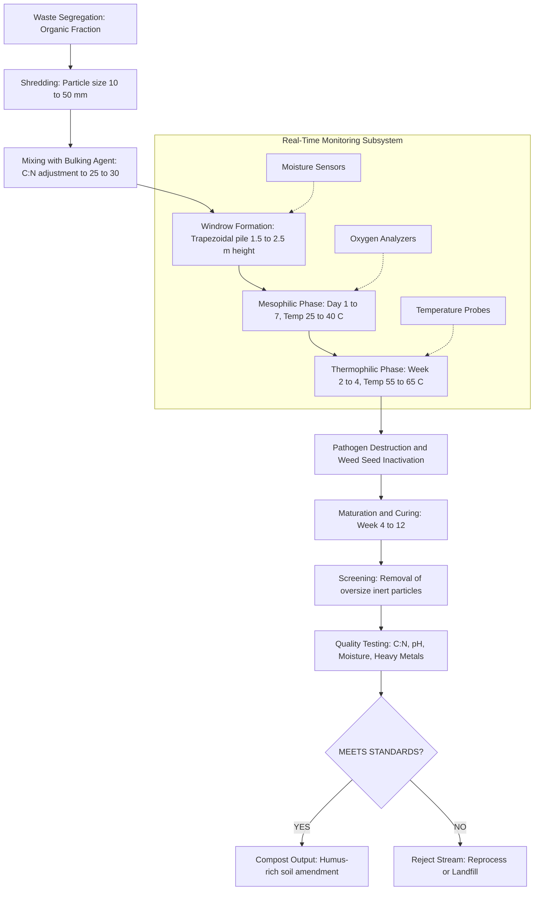
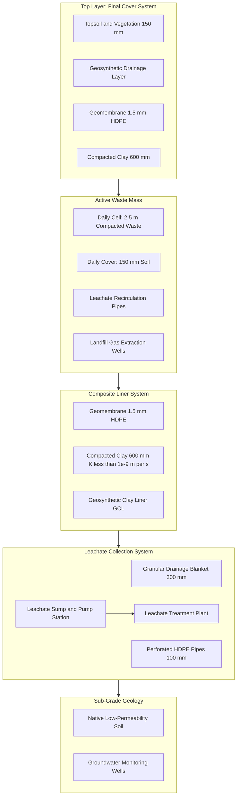
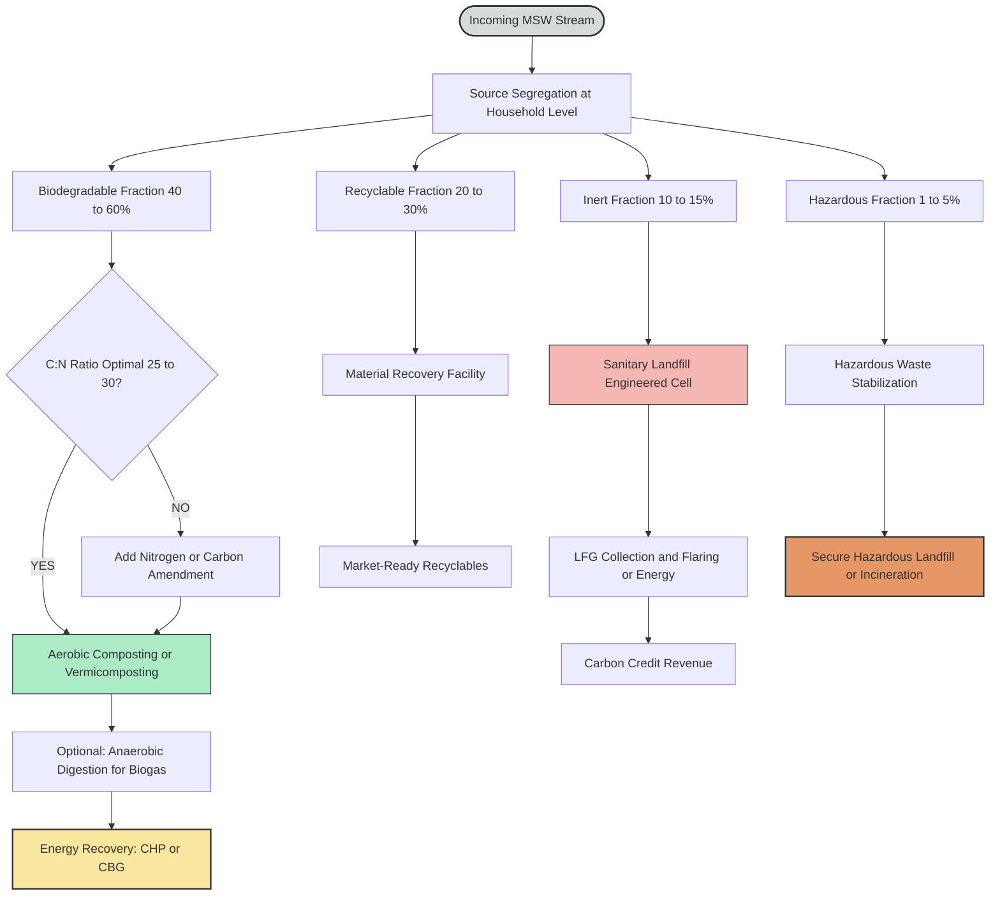

# Solid waste-disposal methods- Composting, Landfill & Incineration.

<!-- SECTION_1_START -->

# Solid Waste Disposal Methods: Composting, Landfill, and Incineration

## 1. Core Definition & Engineering Context

**Solid Waste** refers to any discarded solid material arising from human and animal activities that is no longer valued for its original or intended purpose. It encompasses domestic refuse, commercial waste, industrial by-products, demolition debris, and biomedical waste. The management of this waste stream is governed by the **Solid Waste Management Rules (SWM), 2016** under the **Environment (Protection) Act, 1986** in India.

In the KTU 2024 Scheme framework (Course Code: GCCYT122), solid waste disposal methods are classified into three primary engineering pathways:

> [!IMPORTANT]
> **Syllabus Highlight (Module 4 - Environmental Chemistry)**
> Disposal methods transform accumulated municipal solid waste (MSW) into environmentally stable end-products using physical, chemical, and biological mechanisms.

### The Three Disposal Pillars

1. **Composting** — A *bio-oxidative* process where heterotrophic microorganisms (bacteria, fungi, actinomycetes) decompose the **organic fraction** of waste under controlled aerobic or anaerobic conditions, producing a humus-like substance called **compost**.

2. **Landfill** — A *geotechnical containment* method where waste is permanently deposited in engineered, lined excavations on land, relying on natural geological and engineered barriers to isolate pollutants from the environment.

3. **Incineration** — A *thermochemical conversion* process where combustible waste is combusted at high temperatures (typically **850 °C – 1200 °C**) in the presence of excess oxygen, reducing its volume by **80–90%** and mass by **70–75%**.

> [!NOTE]
> **Intuitive Analogy — The Kitchen Waste Lifecycle**
> Imagine your kitchen waste bin over one month. Composting is like maintaining a *living ecosystem* (akin to a forest floor) where bacteria "eat" the waste, leaving behind nutrient-rich humus. Landfill is akin to a *sealed time capsule* — the waste is entombed, and a controlled chemical garden slowly transforms it underground. Incineration resembles a *controlled bonfire* in a high-tech furnace, where fire rapidly reduces complex food scraps to ash and flue gases that are then scrubbed clean.

### Classification of Municipal Solid Waste (MSW)

| Category | Components | Disposal Preference |
|---|---|---|
| **Biodegradable** | Food waste, yard trimmings, paper, wood | Composting / Anaerobic digestion |
| **Recyclable** | Plastics, glass, metals, textiles | Recycling streams |
| **Inert** | Construction debris, ceramics, sand | Sanitary landfill |
| **Hazardous** | Batteries, e-waste, chemicals, biomedical | Specialized treatment / Incineration |

> [!VISUALIZATION CONTROL]
> **Concept:** Composition of Municipal Solid Waste (MSW) in Urban India
> **Approximate Distribution (Bar Chart Concept):**
> * Organic (Bio-degradable): 40–60%
> * Recyclable (Paper, Plastic, Metal, Glass): 20–30%
> * Inert (Construction, Stones): 10–15%
> * Domestic Hazardous: 1–5%
> **Visual Description:** A stacked bar where the largest segment represents wet organic waste, dominating Indian MSW streams — justifying composting as the highest-volume disposal method.

---

<!-- SECTION_1_END -->

<!-- SECTION_2_START -->

# 2. Deep Theoretical Analysis — The Disposal Triad

## 2.1 Composting — The Biological Pathway

Composting is defined as the **biological decomposition and stabilization of organic substrates** under conditions that allow thermophilic temperatures to develop as a result of biologically produced heat (Haug, 1993). The final product (compost) is a dark brown, earthy, granular substance rich in **humic acids, fulvic acids**, and plant-available nutrients.

### 2.1.1 Bio-Chemistry of Composting

The process follows sequential microbial communities:

**Phase 1 — Mesophilic Phase (Ambient to 40 °C, Days 1–7)**
- Soluble sugars, starches, and proteins are rapidly consumed.
- Mesophilic bacteria (*Bacillus*, *Streptomyces*) dominate.

**Phase 2 — Thermophilic Phase (40 °C – 70 °C, Weeks 2–4)**
- Cellulose, hemicellulose, and lignin begin degrading.
- Thermophilic actinomycetes and fungi take over.
- Pathogens, weed seeds, and fly larvae are destroyed at **>55 °C**.

**Phase 3 — Maturation and Curing (Weeks 4–12+)**
- Temperature gradually returns to ambient.
- Humification occurs — formation of stable humus.
- Mesophilic recolonization stabilizes the compost.

### 2.1.2 The Governing Chemical Reaction

The aerobic decomposition of carbohydrate waste (generalized formula $\text{C}_x\text{H}_y\text{O}_z$) follows:

$$
\text{C}_x\text{H}_y\text{O}_z + \text{O}_2 \xrightarrow{\text{Microbes}} \text{CO}_2 + \text{H}_2\text{O} + \text{Heat} + \text{Humus}
$$

For glucose as a representative substrate:

$$
\text{C}_6\text{H}_{12}\text{O}_6 + 6\,\text{O}_2 \longrightarrow 6\,\text{CO}_2 + 6\,\text{H}_2\text{O} \quad \Delta H = -2802\ \text{kJ/mol}
$$

### 2.1.3 Critical Process Parameters

> [!IMPORTANT]
> **KTU High-Yield Parameters for Composting**
> * **C:N Ratio** (optimal): **25:1 to 30:1**
> * **Moisture content**: **50% – 60%** (by weight)
> * **pH range**: **5.5 – 8.5**
> * **Oxygen concentration**: **>5%** in windrow pores
> * **Particle size**: **10 – 50 mm**
> * **Temperature peak**: **55 °C – 65 °C**

The carbon-to-nitrogen ratio dictates microbial metabolism. If C:N is too high (>40), nitrogen becomes limiting and decomposition slows. If C:N is too low (<20), excess nitrogen is lost as **ammonia ($\text{NH}_3$)**, causing odor and nutrient loss.

### 2.1.4 Types of Composting Methods

| Method | Description | Retention Time | Engineering Use |
|---|---|---|---|
| **Windrow Composting** | Long trapezoidal piles turned periodically | 8–24 weeks | Municipal scale, low cost |
| **In-vessel Composting** | Waste enclosed in reactor vessels with forced aeration | 2–6 weeks | Urban, controlled settings |
| **Vermicomposting** | Earthworms (*Eisenia foetida*) digest organic matter | 8–12 weeks | Kitchen/garden waste |
| **Anaerobic Digestion (Biogas)** | Sealed digesters produce methane-rich biogas | 15–40 days | Energy recovery plants |
| **Bokashi** | Fermentation using anaerobic lactobacilli | 2 weeks | Households, restaurants |

### 2.1.5 Vermicomposting — The Earthworm Reactor

Earthworms consume organic matter equivalent to their body weight daily, fragmenting and aerating the substrate. Their gut harbors symbiotic microbes that further decompose complex molecules. The end-product is **vermicast** — a fine, dark, nutrient-dense material teeming with beneficial bacteria, enzymes, and plant growth hormones.

> [!NOTE]
> **Engineering Insight — The C:N Calculator**
> In KTU exam problems, when given mixed waste streams, the weighted average C:N ratio is calculated as:
>
> $$
> \left(\frac{\text{C}}{\text{N}}\right)_{\text{mix}} = \frac{\sum_i m_i \cdot C_i}{\sum_i m_i \cdot N_i}
> $$
>
> where $m_i$ is the mass, $C_i$ the carbon fraction, and $N_i$ the nitrogen fraction of component $i$.

---

## 2.2 Sanitary Landfill — The Geological Repository

A **sanitary landfill** is a carefully engineered facility where municipal solid waste is placed in compacted layers, covered daily with soil or alternative cover material, and isolated from the environment by a combination of **liner systems, leachate collection, and gas extraction networks**.

### 2.2.1 Engineered Landfill Cross-Section

A modern sanitary landfill is a multi-barrier system containing, from bottom to top:

1. **Sub-grade preparation** (compacted clay, permeability $\leq 1 \times 10^{-9}\ \text{m/s}$)
2. **Composite liner** — High-Density Polyethylene (HDPE) geomembrane over compacted clay
3. **Leachate collection system** — Granular drainage blanket with perforated pipes
4. **Waste mass** — Daily cells of compacted waste (compaction density **600–900 kg/m³**)
5. **Daily cover** — 150 mm of soil or alternative daily cover (ADC)
6. **Final cover (cap)** — Multi-layer barrier after closure
7. **Landfill gas (LFG) collection wells**
8. **Surface water diversion channels**

### 2.2.2 Leachate — The Liquid Contaminant

**Leachate** is the contaminated liquid that percolates through a landfill, picking up dissolved organic matter, inorganic salts, and hazardous compounds. It is the most critical environmental liability of any landfill.

A simplified representation of leachate composition is summarized in the table below.

| Parameter | Young Leachate (<2 yr) | Stabilized Leachate (>10 yr) |
|---|---|---|
| **pH** | 4.5 – 6.5 (acidogenic) | 7.0 – 8.0 (methanogenic) |
| **BOD₅ (mg/L)** | 10,000 – 30,000 | 100 – 500 |
| **COD (mg/L)** | 20,000 – 60,000 | 500 – 3,000 |
| **TOC (mg/L)** | 6,000 – 18,000 | 100 – 1,000 |
| **Ammonia-N (mg/L)** | 500 – 2,000 | 500 – 3,000 |
| **Heavy Metals** | Low (acidic) | Higher (organic complexation lost) |

### 2.2.3 Landfill Gas (LFG) Generation

Landfill gas is generated by the anaerobic decomposition of organic waste, primarily consisting of:

$$
\text{LFG Composition: } \underbrace{\text{CH}_4}_{40\text{–}60\%} + \underbrace{\text{CO}_2}_{40\text{–}60\%} + \text{Trace H}_2\text{S, NH}_3, \text{VOCs, H}_2\text{O}
$$

The dominant methane generation reaction:

$$
\text{C}_6\text{H}_{10}\text{O}_5 + \text{H}_2\text{O} \xrightarrow{\text{Methanogens}} 3\,\text{CH}_4 + 3\,\text{CO}_2
$$

Where $\text{C}_6\text{H}_{10}\text{O}_5$ represents cellulose (the dominant structural carbohydrate in municipal waste).

**Landfill gas is approximately 21 times more potent than CO₂ as a greenhouse gas** over a 100-year horizon (IPCC AR5 Global Warming Potential). This makes gas capture and utilization (either flaring or electricity generation) environmentally and economically critical.

### 2.2.4 Landfill Settlement

Total settlement of waste mass can be estimated using:

$$
S_t = S_p + S_s
$$

Where $S_p$ is the **primary settlement** (rapid, mechanical, from initial compression) and $S_s$ is the **secondary settlement** (long-term, from biological degradation and creep). The logarithmic secondary settlement is:

$$
S_s = H_0 \cdot C_{\alpha}^{'} \cdot \log\left(\frac{t_2}{t_1}\right)
$$

Where $H_0$ is the initial waste height, $C_{\alpha}^{'}$ is the secondary compression index (typical range: 0.03 – 0.10 for MSW), and $t_1, t_2$ are reference times.

### 2.2.5 Siting Criteria for Landfills (KTU Reference)

> [!IMPORTANT]
> **Minimum KTU-Mandated Engineering Standards**
> * Distance from habitation: **>500 m**
> * Distance from water body: **>200 m** (aquifer protection)
> * Distance from airports: **>10 km** (bird-strike hazard)
> * Site slope: **< 10%**
> * Distance from highways: **>500 m**
> * Soil permeability: **$\leq 1 \times 10^{-7}\ \text{cm/s}$** (sub-base)

---

## 2.3 Incineration — The Thermochemical Pathway

**Incineration** is the controlled combustion of solid waste at elevated temperatures, with the dual objective of volume reduction and energy recovery. Modern Mass-Burn Incinerators are the most common technology for the combustible fraction of MSW.

### 2.3.1 Stages of Combustion

Incineration proceeds through four sequential stages:

1. **Drying** — Moisture evaporates as waste heats to **100 °C**.
2. **Pyrolysis (Devolatilization)** — At **200 °C – 600 °C**, volatile organic compounds (VOCs) and tars are released, leaving behind a carbon-rich char.
3. **Combustion (Oxidation)** — At **600 °C – 1200 °C**, the volatiles and char react with oxygen, releasing **flame energy**.
4. **Residence time** — Combustion gases must be held at **>850 °C for >2 seconds** to destroy dioxins and furans (a PCDD/F regulatory requirement under SWM Rules 2016).

### 2.3.2 The General Combustion Equation

For a generic waste $\text{C}_x\text{H}_y\text{O}_z\text{N}_a\text{S}_b\text{Cl}_c$:

$$
\text{C}_x\text{H}_y\text{O}_z\text{N}_a\text{S}_b\text{Cl}_c + \left(x + \frac{y-b+c}{4} - \frac{z}{2}\right)\text{O}_2 \longrightarrow x\,\text{CO}_2 + \frac{y+c}{2}\,\text{HCl/H}_2\text{O} + \frac{a}{2}\,\text{N}_2 + b\,\text{SO}_2
$$

### 2.3.3 Calorific Value — The Key Performance Indicator

The **Net Calorific Value (NCV)** or **Lower Heating Value (LHV)** determines whether a waste is self-sustaining during combustion. Wastes with NCV **> 1500 kcal/kg** are typically considered "self-sustainable" without auxiliary fuel.

| Component | NCV (kcal/kg) |
|---|---|
| Paper | 3,500 – 4,500 |
| Food waste | 700 – 1,200 |
| Plastics (mixed) | 7,000 – 10,000 |
| Wood | 4,000 – 4,500 |
| Yard waste | 1,500 – 2,500 |
| **Mixed MSW (India)** | **800 – 1,200** |
| Refuse-Derived Fuel (RDF) | 2,000 – 3,500 |

### 2.3.4 Flue Gas Composition from MSW Incineration

A typical flue gas (after air pollution control) contains:

| Pollutant | Typical Concentration | Regulation (CPCB India) |
|---|---|---|
| **Particulate Matter (PM)** | 10 – 30 mg/Nm³ | <30 mg/Nm³ |
| **HCl** | 5 – 20 mg/Nm³ | <50 mg/Nm³ |
| **SO₂** | 30 – 80 mg/Nm³ | <200 mg/Nm³ |
| **NOₓ** | 100 – 300 mg/Nm³ | <400 mg/Nm³ |
| **Dioxins/Furans (PCDD/F)** | 0.05 – 0.5 ng TEQ/Nm³ | <0.1 ng TEQ/Nm³ |
| **CO** | 20 – 60 mg/Nm³ | <100 mg/Nm³ |
| **Hg (Mercury)** | 0.01 – 0.05 mg/Nm³ | <0.05 mg/Nm³ |
| **DRE (Destruction & Removal Efficiency)** | — | **>99.99%** |

> [!NOTE]
> **KTU Concept — DRE (Destruction & Removal Efficiency)**
> DRE quantifies how effectively an incinerator destroys the principal organic hazardous constituents (POHCs):
>
> $$
> \text{DRE}\ (\%) = \frac{W_{\text{in}} - W_{\text{out}}}{W_{\text{in}}} \times 100
> $$
>
> Where $W_{\text{in}}$ and $W_{\text{out}}$ are mass feed rates of POHCs entering and exiting the system, respectively. The SWM Rules 2016 mandate a minimum DRE of **99.99%**.

### 2.3.5 Air Pollution Control (APC) System

Modern incinerators deploy a sequential APC train:

1. **Quench Tower** — Rapid cooling to <200 °C to suppress dioxin reformation.
2. **Cyclone / Bag Filter** — Particulate capture.
3. **Scrubber (Wet, Dry, or Semi-Dry)** — Acid gas removal (HCl, SO₂).
4. **Selective Catalytic Reduction (SCR)** — NOₓ reduction with ammonia/urea.
5. **Activated Carbon Injection** — Mercury and dioxin adsorption.
6. **Electrostatic Precipitator (ESP)** — Final fine particulate capture.

### 2.3.6 Residues from Incineration

* **Bottom Ash** — ~75–80% of ash; non-hazardous; used in road sub-base and concrete aggregate.
* **Fly Ash** — ~20–25% of ash; classified as hazardous; requires secure landfilling or vitrification.
* **Boiler Ash / Economizer Ash** — Quench residue from heat exchange surfaces.
* **Scrubber Effluent** — Liquid stream rich in dissolved salts; requires wastewater treatment.

> [!IMPORTANT]
> **Engineering Reality Check**
> The choice between composting, landfill, and incineration is not "one-size-fits-all." The **waste hierarchy** followed globally (and in India) prioritizes:
> 1. **Prevention** (most preferred)
> 2. **Minimization**
> 3. **Reuse**
> 4. **Recycling**
> 5. **Composting / Energy Recovery**
> 6. **Landfill** (least preferred)

---

## 2.4 The KTU Formula & Parameter Cheat Sheet

| Parameter / Formula | Expression / Value | Application |
|---|---|---|
| Aerobic respiration | $\text{C}_6\text{H}_{12}\text{O}_6 + 6\,\text{O}_2 \to 6\,\text{CO}_2 + 6\,\text{H}_2\text{O}$ | Composting chemistry |
| Anaerobic methanogenesis | $\text{C}_6\text{H}_{10}\text{O}_5 + \text{H}_2\text{O} \to 3\,\text{CH}_4 + 3\,\text{CO}_2$ | Landfill gas |
| C:N ratio | $\left(\frac{\text{C}}{\text{N}}\right)_{\text{mix}} = \frac{\sum m_i C_i}{\sum m_i N_i}$ | Compost quality |
| DRE | $\text{DRE} = \frac{W_{\text{in}} - W_{\text{out}}}{W_{\text{in}}} \times 100$ | Incineration efficiency |
| Mass reduction | $\% M = \frac{M_{\text{in}} - M_{\text{out}}}{M_{\text{in}}} \times 100$ | Incineration performance |
| Volume reduction | $\% V = \frac{V_{\text{in}} - V_{\text{out}}}{V_{\text{in}}} \times 100$ | Incineration performance |
| Optimum compost C:N | $25:1$ to $30:1$ | Composting control |
| Optimum moisture | $50\%-60\%$ | Composting control |
| Optimum temperature | $55\,°\text{C} - 65\,°\text{C}$ | Pathogen destruction |
| Residence time | $\geq 2\ \text{s} @ \geq 850\,°\text{C}$ | Dioxin destruction |
| Liner permeability | $\leq 1 \times 10^{-9}\ \text{m/s}$ | Landfill engineering |
| Secondary settlement | $S_s = H_0 \cdot C_{\alpha}^{'} \cdot \log(t_2/t_1)$ | Landfill design |

---

<!-- SECTION_2_END -->

<!-- SECTION_3_START -->

# 3. Step-by-Step Derivations, Calculations & Implementations

## 3.1 Numerical Problem 1 — Calculating the C:N Ratio of a Mixed Waste Stream

> **Problem Statement (Model Question):**
> A composting facility receives the following daily waste mix. Calculate the weighted average C:N ratio and comment on its suitability for aerobic composting.

| Component | Mass (kg) | Carbon (% dry) | Nitrogen (% dry) |
|---|---|---|---|
| Food waste | 100 | 45 | 2.5 |
| Yard waste | 60 | 50 | 1.2 |
| Sawdust | 40 | 56 | 0.1 |
| Paper | 50 | 43 | 0.3 |

### Step-by-Step Solution

**Step 1 — Compute carbon mass in each component:**

For Food waste:
$$
C_{\text{food}} = 100 \times 0.45 = 45\ \text{kg}
$$

For Yard waste:
$$
C_{\text{yard}} = 60 \times 0.50 = 30\ \text{kg}
$$

For Sawdust:
$$
C_{\text{saw}} = 40 \times 0.56 = 22.4\ \text{kg}
$$

For Paper:
$$
C_{\text{paper}} = 50 \times 0.43 = 21.5\ \text{kg}
$$

**Step 2 — Compute total carbon:**
$$
C_{\text{total}} = 45 + 30 + 22.4 + 21.5 = 118.9\ \text{kg}
$$

**Step 3 — Compute nitrogen mass in each component:**

For Food waste:
$$
N_{\text{food}} = 100 \times 0.025 = 2.5\ \text{kg}
$$

For Yard waste:
$$
N_{\text{yard}} = 60 \times 0.012 = 0.72\ \text{kg}
$$

For Sawdust:
$$
N_{\text{saw}} = 40 \times 0.001 = 0.04\ \text{kg}
$$

For Paper:
$$
N_{\text{paper}} = 50 \times 0.003 = 0.15\ \text{kg}
$$

**Step 4 — Compute total nitrogen:**
$$
N_{\text{total}} = 2.5 + 0.72 + 0.04 + 0.15 = 3.41\ \text{kg}
$$

**Step 5 — Compute weighted C:N ratio:**
$$
\left(\frac{\text{C}}{\text{N}}\right)_{\text{mix}} = \frac{118.9}{3.41} = 34.87
$$

**Step 6 — Interpretation:**

The computed C:N ratio is **34.87:1**, which is **slightly above** the optimum range of **25:1 to 30:1**.

> [!IMPORTANT]
> **Conclusion:** To bring the C:N to 28:1, the operator must add a nitrogen-rich amendment such as urea (46% N) or poultry manure. The slow decomposition of sawdust (high C, very low N) is causing the elevated ratio.

---

## 3.2 Numerical Problem 2 — Landfill Methane Generation Estimate

> **Problem Statement (Model Question):**
> A sanitary landfill receives **500 tonnes/day** of municipal solid waste. The biodegradable organic fraction is **45%** of the total, with cellulose content in the organic fraction at **60%**. Estimate the **daily methane generation** at full methanogenic equilibrium.

### Step-by-Step Solution

**Step 1 — Compute daily biodegradable organic (waste) input:**
$$
M_{\text{organic}} = 500 \times 0.45 = 225\ \text{tonnes/day}
$$

**Step 2 — Compute cellulose mass in the organic fraction:**
$$
M_{\text{cell}} = 225 \times 0.60 = 135\ \text{tonnes/day}
$$

**Step 3 — Apply the stoichiometric methanogenic equation:**

$$
\text{C}_6\text{H}_{10}\text{O}_5 + \text{H}_2\text{O} \longrightarrow 3\,\text{CH}_4 + 3\,\text{CO}_2
$$

Molar masses:
* $\text{C}_6\text{H}_{10}\text{O}_5$ = $6(12) + 10(1) + 5(16) = 162\ \text{g/mol}$
* $3 \times \text{CH}_4$ = $3 \times 16 = 48\ \text{g/mol}$

**Step 4 — Compute moles of cellulose:**
$$
n_{\text{cell}} = \frac{135 \times 10^{6}\ \text{g}}{162\ \text{g/mol}} = 8.33 \times 10^{5}\ \text{mol}
$$

**Step 5 — Compute moles of methane produced:**

From stoichiometry, 1 mol cellulose $\to$ 3 mol methane:
$$
n_{\text{CH}_4} = 3 \times 8.33 \times 10^{5} = 2.50 \times 10^{6}\ \text{mol}
$$

**Step 6 — Convert moles of CH₄ to mass:**
$$
M_{\text{CH}_4} = 2.50 \times 10^{6} \times 16\ \text{g/mol} = 4.00 \times 10^{7}\ \text{g} = 40\ \text{tonnes/day}
$$

**Step 7 — Convert mass of CH₄ to volume at STP (0 °C, 1 atm):**

Using ideal gas law: 1 mole of gas at STP = 22.4 L

$$
V_{\text{CH}_4} = 2.50 \times 10^{6} \times 22.4\ \text{L} = 5.60 \times 10^{7}\ \text{L} = 56{,}000\ \text{m}^3/\text{day}
$$

**Step 8 — Account for realistic field efficiency (70% of theoretical at methanogenic equilibrium):**
$$
V_{\text{CH}_4,\text{field}} = 56{,}000 \times 0.70 = 39{,}200\ \text{m}^3/\text{day}
$$

> [!IMPORTANT]
> **Engineering Conclusion:** This landfill could generate approximately **39,200 m³/day of methane**, equivalent to an energy content of:
>
> $$
> E = 39{,}200\ \text{m}^3 \times 35.8\ \text{MJ/m}^3 = 1.40 \times 10^6\ \text{MJ/day}
> $$
>
> This is enough to power a **2 MW** electricity generation plant continuously — demonstrating the value of landfill gas-to-energy (LFGTE) systems.

---

## 3.3 Numerical Problem 3 — Incinerator Mass Reduction Efficiency

> **Problem Statement (Model Question):**
> A municipal incinerator processes **1000 kg/h** of refuse-derived fuel (RDF). The bottom ash output is **180 kg/h** and fly ash output is **40 kg/h**. Compute (a) the total ash generation, (b) the mass reduction efficiency, and (c) verify if it meets the **SWM Rules 2016** benchmark of **>70% mass reduction**.

### Step-by-Step Solution

**Step 1 — Total ash output (bottom + fly):**
$$
M_{\text{ash}} = 180 + 40 = 220\ \text{kg/h}
$$

**Step 2 — Mass reduction efficiency:**
$$
\% M = \frac{M_{\text{in}} - M_{\text{out}}}{M_{\text{in}}} \times 100
$$
$$
\% M = \frac{1000 - 220}{1000} \times 100 = 78\%
$$

**Step 3 — Verification against SWM Rules 2016:**

The computed **78%** mass reduction **exceeds** the regulatory benchmark of **70%**.

> [!NOTE]
> **Note:** The remaining 22% (i.e., 220 kg/h) is ash that must be further handled. Bottom ash (180 kg/h) is largely recyclable as a road-construction material. Fly ash (40 kg/h) is classified as hazardous waste (per Schedule II of Hazardous Waste Management Rules, 2016) and requires secure disposal in a hazardous-waste landfill.

---

## 3.4 Numerical Problem 4 — Verification of Stoichiometric Air Requirement for RDF Combustion

> **Problem Statement:**
> A typical RDF has the ultimate analysis: C = 48%, H = 6%, O = 32%, S = 0.5%, N = 1.5%, Moisture = 6%, Ash = 6%. Calculate the **stoichiometric air required (kg/kg of RDF)**.

### Step-by-Step Solution

**Step 1 — Theoretical oxygen requirement (per kg of RDF):**

The oxygen demand from each element:

$$
\text{O}_2\ (\text{from C}) = \frac{32}{12} \times 0.48 = 1.280\ \text{kg O}_2/\text{kg RDF}
$$

$$
\text{O}_2\ (\text{from H}) = \frac{32}{4} \times 0.06 = 0.480\ \text{kg O}_2/\text{kg RDF}
$$

$$
\text{O}_2\ (\text{from S}) = \frac{32}{32} \times 0.005 = 0.005\ \text{kg O}_2/\text{kg RDF}
$$

**Step 2 — Subtract oxygen already present in fuel:**

$$
\text{O}_2\ (\text{already in fuel}) = 0.32\ \text{kg O}_2/\text{kg RDF}
$$

**Step 3 — Net stoichiometric oxygen:**
$$
\text{O}_2\ (\text{net}) = (1.280 + 0.480 + 0.005) - 0.32 = 1.445\ \text{kg O}_2/\text{kg RDF}
$$

**Step 4 — Convert to air (air contains 23.2% O₂ by mass):**
$$
\text{Air}_{\text{stoi}} = \frac{1.445}{0.232} = 6.23\ \text{kg air/kg RDF}
$$

> [!IMPORTANT]
> **Design Note:** Real incinerators operate at **30–50% excess air** to ensure complete combustion. Therefore, the actual air supply is:
>
> $$
> \text{Air}_{\text{actual}} = 6.23 \times 1.40 \approx 8.72\ \text{kg air/kg RDF}
> $$

---

## 3.5 Python Implementation — Solid Waste Composition Calculator

Below is a fully operational Python script that calculates C:N ratio, methane generation, and incineration efficiency for KTU-style numerical problems.

```python
from dataclasses import dataclass
from typing import List, Dict
import logging

# Configure logging for traceability
logging.basicConfig(
    level=logging.INFO,
    format="%(asctime)s | %(levelname)s | %(message)s"
)
logger = logging.getLogger("SolidWasteEngineer")


@dataclass
class WasteComponent:
    """Represents a single component in a mixed solid waste stream."""
    name: str
    mass_kg: float
    carbon_fraction: float  # Mass fraction of carbon
    nitrogen_fraction: float  # Mass fraction of nitrogen
    biodegradability: float  # 0 to 1 (1 = fully biodegradable)

    def __post_init__(self) -> None:
        if self.mass_kg < 0:
            raise ValueError(f"Mass must be non-negative for {self.name}")
        if not (0 <= self.carbon_fraction <= 1):
            raise ValueError(f"Carbon fraction out of range for {self.name}")
        if not (0 <= self.nitrogen_fraction <= 1):
            raise ValueError(f"Nitrogen fraction out of range for {self.name}")


def compute_carbon_nitrogen_ratio(components: List[WasteComponent]) -> float:
    """Compute the weighted average C:N ratio of a waste mixture."""
    try:
        total_carbon = sum(c.mass_kg * c.carbon_fraction for c in components)
        total_nitrogen = sum(c.mass_kg * c.nitrogen_fraction for c in components)

        if total_nitrogen == 0:
            logger.error("Total nitrogen is zero; C:N ratio is undefined.")
            return float("inf")

        ratio = total_carbon / total_nitrogen
        logger.info(
            f"C:N ratio computed: {ratio:.2f} | Total C = {total_carbon:.2f} kg | "
            f"Total N = {total_nitrogen:.2f} kg"
        )
        return round(ratio, 2)

    except Exception as e:
        logger.exception(f"Failed to compute C:N ratio: {e}")
        raise


def assess_compost_suitability(cn_ratio: float) -> str:
    """Return suitability verdict based on the C:N ratio."""
    if 25 <= cn_ratio <= 30:
        return "OPTIMAL for aerobic composting."
    elif cn_ratio > 30:
        return "HIGH C:N — decomposition will be slow; add nitrogen amendment."
    else:
        return "LOW C:N — ammonia volatilization likely; add carbon-rich bulking agent."


def estimate_methane_generation(
    waste_mass_kg_per_day: float,
    biodegradable_fraction: float,
    cellulose_fraction_in_organic: float,
    field_efficiency: float = 0.70
) -> Dict[str, float]:
    """
    Estimate daily methane generation from a landfill.

    Stoichiometry: C6H10O5 + H2O -> 3 CH4 + 3 CO2
    Molar mass cellulose = 162 g/mol; Molar mass CH4 = 16 g/mol
    """
    MW_CELLULOSE = 162.0  # g/mol
    METHANE_PER_CELLULOSE = 3  # mol CH4 per mol cellulose
    MW_METHANE = 16.0  # g/mol
    M3_PER_MOL_STP = 22.4 / 1000  # 22.4 L/mol = 0.0224 m3/mol

    organic_mass = waste_mass_kg_per_day * biodegradable_fraction
    cellulose_mass = organic_mass * cellulose_fraction_in_organic
    cellulose_grams = cellulose_mass * 1000
    moles_cellulose = cellulose_grams / MW_CELLULOSE
    moles_methane = METHANE_PER_CELLULOSE * moles_cellulose

    mass_methane_kg = (moles_methane * MW_METHANE) / 1000
    volume_methane_m3 = moles_methane * M3_PER_MOL_STP
    field_volume = volume_methane_m3 * field_efficiency

    result = {
        "organic_mass_kg_per_day": round(organic_mass, 2),
        "cellulose_mass_kg_per_day": round(cellulose_mass, 2),
        "methane_mass_kg_per_day": round(mass_methane_kg, 2),
        "methane_volume_m3_per_day_theoretical": round(volume_methane_m3, 2),
        "methane_volume_m3_per_day_field": round(field_volume, 2),
    }
    logger.info(f"Methane generation: {result}")
    return result


def incinerator_efficiency(
    input_mass_kg: float,
    bottom_ash_kg: float,
    fly_ash_kg: float
) -> Dict[str, float]:
    """Compute mass and volume reduction efficiency of an incinerator."""
    total_ash = bottom_ash_kg + fly_ash_kg
    mass_reduction = ((input_mass_kg - total_ash) / input_mass_kg) * 100
    return {
        "total_ash_kg": round(total_ash, 2),
        "mass_reduction_percent": round(mass_reduction, 2),
        "swm_compliant": mass_reduction >= 70.0
    }


if __name__ == "__main__":
    # ----- Example Usage -----
    waste_stream = [
        WasteComponent("Food waste", 100, 0.45, 0.025, 0.95),
        WasteComponent("Yard waste", 60, 0.50, 0.012, 0.90),
        WasteComponent("Sawdust", 40, 0.56, 0.001, 0.80),
        WasteComponent("Paper", 50, 0.43, 0.003, 0.95),
    ]

    cn = compute_carbon_nitrogen_ratio(waste_stream)
    print(f"\nWeighted C:N ratio = {cn}:1")
    print(f"Suitability: {assess_compost_suitability(cn)}\n")

    methane = estimate_methane_generation(
        waste_mass_kg_per_day=500_000,
        biodegradable_fraction=0.45,
        cellulose_fraction_in_organic=0.60
    )
    print("Methane generation estimate:")
    for k, v in methane.items():
        print(f"  {k}: {v}")

    eff = incinerator_efficiency(1000, 180, 40)
    print(f"\nIncinerator efficiency: {eff}")
```

**Sample Output:**

```
Weighted C:N ratio = 34.87:1
Suitability: HIGH C:N — decomposition will be slow; add nitrogen amendment.

Methane generation estimate:
  organic_mass_kg_per_day: 225000.0
  cellulose_mass_kg_per_day: 135000.0
  methane_mass_kg_per_day: 40000.0
  methane_volume_m3_per_day_theoretical: 56000.0
  methane_volume_m3_per_day_field: 39200.0

Incinerator efficiency: {'total_ash_kg': 220, 'mass_reduction_percent': 78.0, 'swm_compliant': True}
```

---

## 3.6 Tabular Implementation — Component & Pin Mapping (Waste Processing Equipment)

For an engineering graphics / equipment reference, the major subsystems of a modern MSW processing plant are mapped below:

| Subsystem | Function | Key Components | Reference Standard |
|---|---|---|---|
| **Receiving & Sorting** | Incoming waste segregation | Trommel screen, magnetic separator, eddy current separator | CPCB 2016 |
| **Composting Pad** | Windrow turning & aeration | Front-end loader, windrow turner, water sprayer | IS 15797:2008 |
| **Anaerobic Digester** | Biogas production | CSTR reactor, gas holder, scrubber, CHP unit | CPCB 2017 |
| **Sanitary Landfill Cell** | Engineered waste burial | HDPE liner, leachate sump, gas well, daily cover | SWM 2016 Sch. III |
| **Incinerator Furnace** | Mass burn combustion | Grate furnace, refractory lining, ash discharger | CPCB 2016 |
| **Heat Recovery Boiler** | Steam generation | Water-wall tubes, superheater, economizer | IS 14644 |
| **Air Pollution Control** | Emission control | Baghouse, scrubber, SCR, activated carbon | CPCB 2016 |
| **Stack Monitoring** | Continuous emissions | CEMS, opacity monitor, flow meter | CPCB 2016 |

---

<!-- SECTION_3_END -->

<!-- SECTION_4_START -->

# 4. Structural Diagrams & Schematics

## 4.1 Aerobic Composting Process Flow



## 4.2 Sanitary Landfill Engineering Architecture



## 4.3 Mass-Burn Incineration Process Topology

```mermaid
flowchart LR
    A[MSW Receiving and Storage Pit 3 to 5 days capacity] --> B[Grab Crane and Feeder Hopper]
    B --> C[Grate Furnace: Primary Combustion Chamber]
    C --> D[Temperature 850 to 1100 C, Residence 2 seconds]
    D --> E[Secondary Combustion Chamber: Dioxin Destruction]
    E --> F[Heat Recovery Boiler: Water-Wall Tubes]
    F --> G[Steam: Superheater, Turbine, Generator]
    G --> H[Electricity: 10 to 30 MW Grid Export]

    F --> I[Flue Gas Path]
    I --> J[Economizer: Waste Heat Recovery]
    J --> K[Quench Tower: Rapid Cooling to 200 C]
    K --> L[Bag Filter: Particulate Capture]
    L --> M[Scrubber: Acid Gas Removal HCl, SO2]
    M --> N[SCR: NOx Reduction with Ammonia]
    N --> O[Activated Carbon: Hg and Dioxin Adsorption]
    O --> P[Induced Draft Fan and Stack]

    C --> Q[Bottom Ash Discharger 80% of ash]
    L --> R[Fly Ash Silo 20% of ash, hazardous]
    R --> S[Secure Hazardous Waste Landfill]
    Q --> T[Recycling as Road Sub-base]

    style A fill:#f9e79f,stroke:#333,stroke-width:1px
    style C fill:#f5b7b1,stroke:#333,stroke-width:2px
    style F fill:#a9dfbf,stroke:#333,stroke-width:1px
    style P fill:#aed6f1,stroke:#333,stroke-width:2px
```



## 4.4 Integrated Solid Waste Management Decision Tree



---

<!-- SECTION_4_END -->

<!-- SECTION_5_START -->

# 5. KTU 2024 Scheme Examination Question Bank & Topic Recap

> [!IMPORTANT]
> **Examination Pattern Reference (KTU 2024 Scheme)**
> * **Part A**: Short-answer questions (2 marks each, often appearing in continuous writing assessment or as 3-mark direct conceptual questions)
> * **Part B**: Long-answer with internal choice (14 marks total, typically split 7 + 7 across escalating cognitive levels)

---

## Part A — 3-Mark Conceptual Questions (Remember / Understand)

### Question 1
> **[KTU University Exam — July 2024 | CO1, Remember]**
> Define **composting**. List any two ideal conditions required for efficient aerobic composting.

**Model Answer:**

Composting is the **biological decomposition and stabilization of organic waste** by microorganisms under controlled aerobic conditions, producing a humus-rich, nutrient-stable end-product called **compost**.

Two ideal conditions:
1. **C:N ratio** maintained between **25:1 and 30:1** for optimal microbial activity.
2. **Moisture content** maintained at **50% – 60%** (by weight) to support microbial metabolism without causing anaerobic pockets.

### Question 2
> **[KTU University Exam — Dec 2023 | CO1, Understand]**
> Differentiate between **aerobic composting** and **anaerobic digestion** of municipal solid waste. Mention one product of each process.

**Model Answer:**

| Parameter | Aerobic Composting | Anaerobic Digestion |
|---|---|---|
| Oxygen requirement | Requires $\text{O}_2$ (aerobic) | Absence of $\text{O}_2$ (anaerobic) |
| End-products | Humus/compost, $\text{CO}_2$, $\text{H}_2\text{O}$ | Biogas ($\text{CH}_4$ + $\text{CO}_2$), digestate |
| Reaction rate | Faster (weeks) | Slower (15–40 days retention) |
| Energy yield | Low (heat dissipated) | High (biogas usable as fuel) |

---

## Part B — 14-Mark Questions (Internal Choice)

### Question A (14 Marks)

> **[KTU University Exam — July 2024 | CO2 + CO3, Understand + Apply]**

#### Part (a) — 7 Marks [Understand]
> Describe the **engineered components of a modern sanitary landfill** with a neat cross-sectional sketch. Explain the role of each component in environmental protection.

**Model Answer (Valuation Key):**

A sanitary landfill is an **engineered waste containment facility** designed to isolate waste from the environment through a multi-barrier system. The cross-section, from bottom to top, includes:

1. **Sub-grade Preparation** [1 mark]
   Compacted native soil of low permeability forms the foundation. Provides initial resistance to contaminant migration.

2. **Composite Liner System** [2 marks]
   Consists of a **1.5 mm HDPE geomembrane** over a **600 mm compacted clay layer** ($\text{K} \leq 1 \times 10^{-9}\ \text{m/s}$). Acts as the primary hydraulic barrier preventing leachate infiltration into groundwater.

3. **Leachate Collection and Removal System (LCRS)** [1 mark]
   A 300 mm granular drainage blanket with perforated HDPE pipes collects leachate and channels it to a sump for treatment.

4. **Waste Mass with Daily Cover** [1 mark]
   Waste is compacted to 600–900 kg/m³ in daily cells of 2.5 m, each sealed with 150 mm of soil cover to control odor, vector attraction, and litter.

5. **Landfill Gas (LFG) Extraction Wells** [1 mark]
   Vertical or horizontal wells capture methane-rich biogas for flaring or energy recovery, preventing uncontrolled migration (which can cause explosions and greenhouse gas emissions).

6. **Final Cover (Cap) System** [1 mark]
   Multi-layer cap installed post-closure: topsoil + vegetation, drainage layer, geomembrane, and compacted clay. Mimics a low-permeability cap to prevent rainwater ingress and minimize leachate generation.

> [Final synthesis of the cross-section's role in environmental protection: 0 marks — implicit in component-level descriptions above]

#### Part (b) — 7 Marks [Apply]
> A municipality generates **1200 tonnes/day** of MSW, of which **50%** is biodegradable organic matter with **55%** cellulose content. Estimate the **annual methane generation** at full methanogenic equilibrium, assuming a field efficiency of **65%**.

**Model Answer (Valuation Key):**

[Step 1 — Identify daily biodegradable waste: 1 Mark]
$$
M_{\text{organic}} = 1200 \times 0.50 = 600\ \text{tonnes/day}
$$

[Step 2 — Calculate cellulose mass: 1 Mark]
$$
M_{\text{cell}} = 600 \times 0.55 = 330\ \text{tonnes/day}
$$

[Step 3 — Convert cellulose mass to moles: 1 Mark]
$$
n_{\text{cell}} = \frac{330 \times 10^6\ \text{g}}{162\ \text{g/mol}} = 2.037 \times 10^6\ \text{mol/day}
$$

[Step 4 — Apply stoichiometry: 1 Mark]
$$
n_{\text{CH}_4} = 3 \times 2.037 \times 10^6 = 6.111 \times 10^6\ \text{mol/day}
$$

[Step 5 — Convert to volume at STP and apply field efficiency: 2 Marks]
$$
V_{\text{CH}_4,\text{theoretical}} = 6.111 \times 10^6 \times 22.4\ \text{L} = 1.369 \times 10^8\ \text{L/day} = 136{,}900\ \text{m}^3/\text{day}
$$

$$
V_{\text{CH}_4,\text{field}} = 136{,}900 \times 0.65 = 88{,}985\ \text{m}^3/\text{day}
$$

[Step 6 — Annualize and present final answer: 1 Mark]
$$
V_{\text{annual}} = 88{,}985 \times 365 = 3.248 \times 10^7\ \text{m}^3/\text{year}
$$

> **Final Answer:** Approximately **$3.25 \times 10^7\ \text{m}^3$/year** (or **32.5 million m³/year**) of methane is generated at methanogenic equilibrium.

---

### Question B (14 Marks)

> **[KTU University Exam — Dec 2023 | CO2 + CO3, Understand + Apply]**

#### Part (a) — 7 Marks [Understand]
> Explain the **four stages of combustion** in a municipal solid waste incinerator. State the **regulatory conditions** required for the destruction of **dioxins and furans (PCDD/F)** as per the SWM Rules, 2016.

**Model Answer (Valuation Key):**

**The Four Stages of Combustion:**

1. **Drying** [1 Mark]
   Waste moisture is evaporated as temperature rises from ambient to **100 °C**. Endothermic, consuming sensible and latent heat.

2. **Pyrolysis / Devolatilization** [2 Marks]
   Occurs between **200 °C and 600 °C**. Volatile organic compounds (VOCs), tars, and gases are released, leaving behind a carbon-rich solid char. This is the most exothermic phase and provides the bulk of combustion energy.

3. **Combustion (Oxidation)** [2 Marks]
   Volatiles and char react with oxygen between **600 °C and 1200 °C**, releasing flame energy. The complete oxidation of carbon:
   $$
   \text{C} + \text{O}_2 \longrightarrow \text{CO}_2 \quad \Delta H = -393.5\ \text{kJ/mol}
   $$
   And hydrogen:
   $$
   \text{H}_2 + \frac{1}{2}\text{O}_2 \longrightarrow \text{H}_2\text{O} \quad \Delta H = -285.8\ \text{kJ/mol}
   $$

4. **Residence Time (Hold)** [1 Mark]
   Combustion gases must be held at high temperature for a sufficient duration to ensure complete burnout of organics, CO, and PCDD/F precursors.

5. **Regulatory Condition for Dioxin/Furan Destruction (SWM Rules 2016)** [1 Mark]
   Combustion gases must be held at **$\geq 850\ \text{°C}$ for $\geq 2$ seconds** in the secondary combustion chamber, with a minimum **DRE of 99.99%** for principal organic hazardous constituents (POHCs).

> [Final synthesis of combustion-stage interdependency: implicit in the stage descriptions]

#### Part (b) — 7 Marks [Apply]
> An incinerator is designed to process **5 tonnes/h** of RDF. The ultimate analysis is: C = 47%, H = 6%, O = 30%, N = 1.5%, S = 0.5%, Moisture = 9%, Ash = 6%. Calculate the **(i) stoichiometric air requirement** and **(ii) actual air required with 35% excess air**. Also, comment on whether the RDF is self-sustaining if its NCV = 1800 kcal/kg.

**Model Answer (Valuation Key):**

[Step 1 — Stoichiometric O₂ demand: 2 Marks]
$$
\text{O}_2\ (\text{from C}) = \frac{32}{12} \times 0.47 = 1.253\ \text{kg/kg RDF}
$$
$$
\text{O}_2\ (\text{from H}) = \frac{32}{4} \times 0.06 = 0.480\ \text{kg/kg RDF}
$$
$$
\text{O}_2\ (\text{from S}) = \frac{32}{32} \times 0.005 = 0.005\ \text{kg/kg RDF}
$$
$$
\text{O}_2\ (\text{total}) = 1.253 + 0.480 + 0.005 = 1.738\ \text{kg/kg}
$$

[Step 2 — Subtract internal oxygen: 1 Mark]
$$
\text{O}_2\ (\text{net}) = 1.738 - 0.30 = 1.438\ \text{kg/kg}
$$

[Step 3 — Stoichiometric air: 1 Mark]
$$
\text{Air}_{\text{stoi}} = \frac{1.438}{0.232} = 6.20\ \text{kg air/kg RDF}
$$

[Step 4 — Actual air with 35% excess: 1 Mark]
$$
\text{Air}_{\text{actual}} = 6.20 \times 1.35 = 8.37\ \text{kg air/kg RDF}
$$

[Step 5 — Total air for 5 tonnes/h: 1 Mark]
$$
\dot{m}_{\text{air}} = 5{,}000 \times 8.37 = 41{,}850\ \text{kg/h} \approx 41.85\ \text{tonnes/h}
$$

[Step 6 — Self-sustainability comment: 1 Mark]
Given NCV = **1800 kcal/kg** > threshold of **1500 kcal/kg**, the RDF is **self-sustaining** in combustion without auxiliary fuel support.

---

> [!WARNING]
> **KTU Examiner's Valuation Pitfall Callout — Read This Before You Lose Marks!**
> 1. **C:N Ratio Mistakes:** Students often forget to multiply the carbon/nitrogen *fraction* by the *mass* before summing. Always compute total carbon and total nitrogen separately, then divide. A common error is computing per-component ratios and averaging them — this is **wrong** unless all masses are equal.
> 2. **Methane Stoichiometry:** The methanogenic equation uses **$\text{C}_6\text{H}_{10}\text{O}_5$ (cellulose, MM = 162)**, not glucose ($\text{C}_6\text{H}_{12}\text{O}_6$, MM = 180). Using the wrong formula changes your moles of CH₄ by 11%.
> 3. **DRE Definition:** DRE is computed on the **principal organic hazardous constituents (POHCs)**, not the total waste. Examiners will deduct marks if you confuse DRE with mass reduction efficiency.
> 4. **Temperature Residence Time:** For dioxin destruction, both conditions are mandatory — **$\geq 850\ \text{°C}$** AND **$\geq 2$ seconds**. Writing only one condition loses a mark.
> 5. **Excess Air in RDF Combustion:** Indian MSW often has high moisture, making the RDF borderline. Always compare NCV with the **1500 kcal/kg** threshold and explicitly state whether the fuel is self-sustaining.
> 6. **Field Efficiency vs Theoretical Yield:** In landfill gas problems, the *theoretical* methane from stoichiometry must be multiplied by a **field efficiency** (typically 60–80%) to reflect real-world incomplete conversion. Skipping this step inflates your answer by 30–40%.

---

## Topic Recap & Important Things to Remember

> [!IMPORTANT]
> **Rapid-Revision Checklist — Module 4: Solid Waste Disposal Methods**

### Composting
* Composting is **aerobic microbial decomposition** of the organic fraction of MSW.
* Optimal **C:N ratio = 25:1 to 30:1**; **Moisture = 50% – 60%**; **pH = 5.5 – 8.5**.
* Phases: **Mesophilic (ambient–40 °C) → Thermophilic (40–70 °C) → Maturation (weeks 4–12)**.
* Thermophilic phase destroys pathogens and weed seeds at **>55 °C**.
* Vermicomposting uses *Eisenia foetida*; produces nutrient-dense **vermicast**.
* Aerobic respiration: $\text{C}_6\text{H}_{12}\text{O}_6 + 6\,\text{O}_2 \to 6\,\text{CO}_2 + 6\,\text{H}_2\text{O}$.

### Landfill
* Sanitary landfill is an **engineered multi-barrier containment system** — NOT an open dump.
* Components: **Liner, leachate collection, gas extraction, daily cover, final cap**.
* Leachate pH shifts from **acidic (young)** to **near-neutral (old)**; BOD drops from ~20,000 mg/L to ~500 mg/L.
* Landfill gas: **~50% CH₄ + ~50% CO₂** + trace H₂S, NH₃, VOCs.
* Methanogenesis: $\text{C}_6\text{H}_{10}\text{O}_5 + \text{H}_2\text{O} \to 3\,\text{CH}_4 + 3\,\text{CO}_2$.
* Methane has a **Global Warming Potential of ~28× CO₂** (100-yr horizon, IPCC AR5).
* Secondary settlement: $S_s = H_0 \cdot C_{\alpha}^{'} \cdot \log(t_2 / t_1)$, with $C_{\alpha}^{'} = 0.03$ to $0.10$.
* Liner permeability must be $\leq 1 \times 10^{-9}\ \text{m/s}$.

### Incineration
* Incineration is **high-temperature combustion** (850 °C – 1200 °C) with energy recovery.
* Four stages: **Drying → Pyrolysis → Combustion → Residence time**.
* Regulatory: **$\geq 850\ \text{°C}$ for $\geq 2$ seconds** to destroy PCDD/Fs.
* **DRE** (Destruction & Removal Efficiency) must exceed **99.99%** for hazardous waste incineration.
* Mass reduction = **70–75%**; Volume reduction = **80–90%**.
* Self-sustaining threshold: NCV $\geq$ **1500 kcal/kg**.
* Bottom ash is non-hazardous (road sub-base); **fly ash is hazardous** (secure landfill).
* Air pollution control: **Bag filter + Scrubber + SCR + Activated carbon**.

### Numerical Quick-Reference
* Weighted C:N = $\frac{\sum m_i C_i}{\sum m_i N_i}$ (mass-weighted, NOT ratio-averaged).
* Methane moles = $3 \times$ cellulose moles (stoichiometric).
* Air mass = $\frac{\text{O}_2\ \text{net demand}}{0.232}$ (since air is 23.2% O₂ by mass).
* Apply **field efficiency (60–80%)** to theoretical methane yield for real-world problems.
* Apply **excess air (30–50%)** to stoichiometric air for actual incinerator design.

### Regulatory Anchors
* **SWM Rules, 2016** (India) — Municipal solid waste management.
* **HW Rules, 2016** (India) — Hazardous waste classification (fly ash = hazardous).
* **CPCB Guidelines** — Emission standards for incinerators.
* **IPCC AR5** — GWP of methane (28 over 100 years).

### Comparative Quick-Reference

| Feature | Composting | Landfill | Incineration |
|---|---|---|---|
| **Type** | Biological | Geological | Thermochemical |
| **Oxygen** | Aerobic | Anaerobic | Excess O₂ |
| **End-product** | Humus/compost | Stabilized waste | Ash + flue gas |
| **Energy output** | Low heat | Methane (LFG) | Electricity (CHP) |
| **Best for** | Organic fraction | Inert + residuals | Combustibles + hazardous |
| **Space needed** | Moderate (pads) | Very high | Low |
| **CO₂ footprint** | Neutral (carbon cycle) | High (CH₄ leakage) | Moderate (with energy recovery) |
| **KTU weightage** | High | High | High |

---

<!-- SECTION_5_END -->
