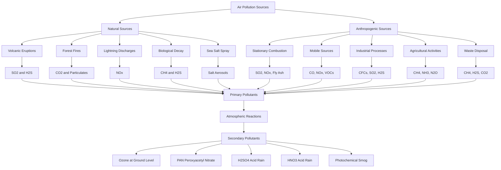
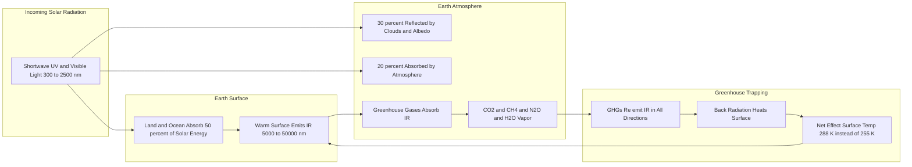
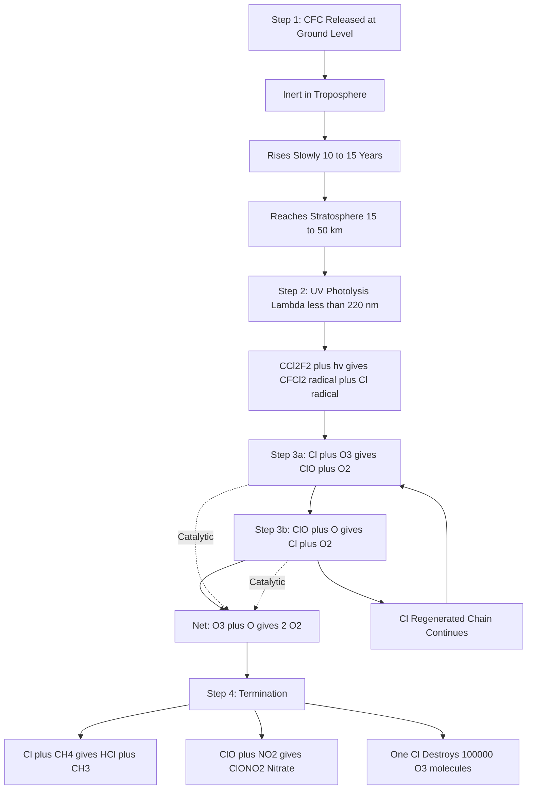
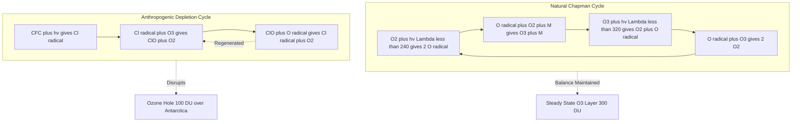

# Waste Management : Air Pollution- Sources & Effects- Greenhouse Gases- Ozone depletion.

<!-- SECTION_1_START -->
# MODULE 4: ENVIRONMENTAL CHEMISTRY
## Air Pollution - Sources, Effects, Greenhouse Gases & Ozone Depletion

### 1.1 Core Technical Definition

> [!NOTE]
> **Air Pollution (KTU 2024 Syllabus Definition)**
> *Air pollution* is the **presence of one or more contaminants** in the atmosphere in such **quantities and duration** that they are, or tend to be, **injurious to human health, animal life, vegetation, or property**, or which **unreasonably interfere with the comfortable enjoyment of life or property** or the conduct of business.
> *(Source: U.S. Clean Air Act, 1970 — adopted as the KTU GCCYT122 board definition)*

> [!IMPORTANT]
> **A Pollutant** is any substance (solid, liquid, or gas) or energy (heat, sound, radiation) introduced into the environment that causes **undesirable effects**. Pollutants are classified as:
> - **Primary Pollutants** — emitted **directly** from a source (e.g., $CO$, $SO_2$, $NO$, particulates).
> - **Secondary Pollutants** — formed by **chemical reactions** between primary pollutants and natural atmospheric constituents (e.g., $O_3$, $HNO_3$, $PAN$, smog).

**Conceptual Analogy / Intuition** 🌍
> Think of Earth's atmosphere as the **glass walls of a greenhouse** 🌱. The sun's rays enter, warm the plants, but the warm air **cannot escape** because the glass traps the heat. *Greenhouse gases* act like this glass — they let sunlight in but **trap infrared radiation** trying to leave, gradually warming the planet.
>
> Now imagine the **ozone layer** as Earth's **sunscreen** ☀️ — a protective shield in the stratosphere that absorbs **harmful ultraviolet (UV-B)** radiation. When *CFCs* (chlorofluorocarbons) are released, they rise to the stratosphere and **eat away** this sunscreen, exposing life below to dangerous UV rays.

**Standard Metrics & Physical Constants (KTU Board Values)**

| Parameter | Standard Value |
|---|---|
| Troposphere altitude | **0 – 10 km** |
| Stratosphere altitude | **10 – 50 km** |
| Ozone layer peak altitude | **~25 km** |
| Average ambient $O_3$ concentration | **300 DU** (Dobson Units) |
| Earth surface temperature | **288 K (15 °C)** |
| Solar constant | **1367 W/m²** |
| Stefan-Boltzmann constant ($\sigma$) | **5.67 × 10⁻⁸ W/m²·K⁴** |

> [!VISUALIZATION CONTROL]
> **Concept:** Infrared Absorption Spectrum of Major Greenhouse Gases
> **GeoGebra Input Equations:**
> * `f(x) = exp(-((x-700)/50)^2) + 0.8*exp(-((x-1500)/100)^2) + 0.5*exp(-((x-3700)/200)^2)`
> * `g(x) = 0.3*exp(-((x-2350)/80)^2)`
> **Visual Description:** Plot wavenumber ($cm^{-1}$) on x-axis from 500–4000 and absorption intensity on y-axis. The student should observe **sharp absorption bands** corresponding to $H_2O$ (peaks near 1500 and 3700 $cm^{-1}$), $CO_2$ (peak near 700 $cm^{-1}$ and 2350 $cm^{-1}$), and $CH_4$ (broad band near 3000 $cm^{-1}$). This visually proves why these gases are called "greenhouse" gases.

---

<!-- SECTION_2_START -->
### 2.1 Deep Theoretical Analysis

#### 2.1.1 Sources of Air Pollution

> [!IMPORTANT]
> **KTU Classification: Natural vs Anthropogenic Sources**
> KTU expects students to clearly distinguish between these two categories in 14-mark questions.

**A. Natural Sources (Biogenic & Geogenic)**

| Source | Pollutant Released |
|---|---|
| Volcanic eruptions | $SO_2$, $H_2S$, particulates, ash |
| Forest fires | $CO_2$, $CO$, $NO_x$, particulates |
| Biological decay (anaerobic) | $CH_4$, $H_2S$ |
| Pollen & spores | Bioaerosols, allergens |
| Sea spray | Salt aerosols ($NaCl$) |
| Lightning | $NO_x$ (via $N_2 + O_2 \rightarrow 2NO$) |

**B. Anthropogenic Sources (Human Activities)**

| Source Category | Major Pollutants Emitted |
|---|---|
| **Stationary Sources** (power plants, factories) | $SO_2$, $NO_x$, $CO_2$, fly ash, Hg |
| **Mobile Sources** (vehicles, aircraft) | $CO$, $NO_x$, hydrocarbons, particulates |
| **Agricultural** (paddy, livestock) | $CH_4$, $NH_3$, $N_2O$ |
| **Domestic** (cooking, heating) | $CO$, particulates, VOCs |
| **Industrial** (refrigeration, foam) | **CFCs, HCFCs, HFCs** |
| **Waste disposal** (landfills) | $CH_4$, $H_2S$, $NH_3$ |

#### 2.1.2 Classification of Major Air Pollutants

> [!NOTE]
> **KTU Board Tip:** Memorize the **5 classical criteria pollutants** (EPA) and 2 new additions:
> $CO$, $Pb$, $NO_2$, $O_3$, $SO_2$, $PM$, $Pb$ (revised).

**Table 2.1: Major Air Pollutants with Sources & Effects**

| Pollutant | Formula | Primary Source | Health/Environmental Effect |
|---|---|---|---|
| Carbon Monoxide | $CO$ | Incomplete combustion | Binds hemoglobin → **carboxyhemoglobin** (toxic) |
| Sulfur Dioxide | $SO_2$ | Coal/oil combustion | **Acid rain**, bronchitis |
| Nitrogen Dioxide | $NO_2$ | Vehicle exhaust, power plants | Smog, respiratory disease |
| Carbon Dioxide | $CO_2$ | Fossil fuel burning | **Global warming** |
| Methane | $CH_4$ | Wetlands, paddy, livestock | **Greenhouse gas** (GWP = 21) |
| Particulate Matter | $PM_{2.5}, PM_{10}$ | Combustion, dust | Lung disease, haze |
| Volatile Organics | $VOCs$ | Solvents, paints | Photochemical smog |
| CFCs | $CCl_2F_2$ | Refrigerators, aerosols | **Ozone depletion** |

#### 2.1.3 Effects of Air Pollution

**A. Effects on Human Health**

> [!WARNING]
> **KTU Examiner's Note:** When asked about effects, students must write **specific disease names**, not vague terms like "harmful to health."

| Pollutant | Specific Health Effect |
|---|---|
| $CO$ | Headache, dizziness, death (forms **carboxyhemoglobin**) |
| $SO_2$ | Bronchitis, emphysema, asthma |
| $NO_2$ | Silo-filler's disease, respiratory infection |
| $O_3$ (ground level) | Chest pain, lung inflammation |
| $PM_{2.5}$ | Lung cancer, cardiovascular mortality |
| $Pb$ | Brain damage (children), anemia |

**B. Environmental Effects**
- **Acid Rain:** $SO_2 + \frac{1}{2}O_2 \rightarrow SO_3$; $SO_3 + H_2O \rightarrow H_2SO_4$ (pH < 5.6)
- **Eutrophication:** Excess $NO_x$ deposition enriches soil/water
- **Ozone Layer Depletion** (see Section 2.1.5)
- **Global Warming / Climate Change** (see Section 2.1.4)
- **Smog Formation:** Two types — **London smog (reducing/sulfurous)** and **Los Angeles smog (photochemical/oxidizing)**

#### 2.1.4 The Greenhouse Effect — Mechanism

> [!NOTE]
> **KTU Definition (Mandatory for 7+ mark questions):**
> *The greenhouse effect is the trapping of outgoing infrared (IR) radiation from Earth's surface by certain gases (greenhouse gases) in the troposphere, causing warming of the lower atmosphere.*

**Step-by-Step Mechanism:**

**Step 1 — Incoming Solar Radiation**
Earth receives shortwave radiation from the sun. About **30%** is reflected by clouds/atmosphere (Albedo = 0.3), and **70%** is absorbed by the surface.

$$I_{\text{absorbed}} = (1 - \alpha) \cdot \frac{S_0}{4} = 0.70 \times \frac{1367}{4} = 239.4 \text{ W/m}^2$$

**Step 2 — Outgoing Longwave Radiation (OLR)**
Earth's warm surface emits IR radiation according to **Stefan-Boltzmann law**:

$$E = \sigma T^4$$

Without greenhouse gases, equilibrium temperature would be:
$$T_e = \left(\frac{239.4}{5.67 \times 10^{-8}}\right)^{1/4} = 255 \text{ K} = -18 \text{ °C}$$

**Step 3 — Greenhouse Trapping**
Greenhouse gases absorb IR at characteristic wavelengths (see GeoGebra) and **re-emit** in all directions, including **back toward Earth**, raising surface temperature to **288 K (15 °C)** — a **33 °C warming** that supports life.

**Major Greenhouse Gases & Their Global Warming Potential (GWP)**

> [!IMPORTANT]
> **Global Warming Potential (GWP):** The cumulative radiative forcing effect of a gas over a chosen time horizon (usually 100 years), **relative to $CO_2$ (GWP = 1)**.

**Table 2.2: KTU High-Yield GWP Values (100-year horizon, IPCC AR5)**

| Gas | Chemical Formula | GWP | Atmospheric Lifetime (years) | Anthropogenic Source |
|---|---|---|---|---|
| Carbon Dioxide | $CO_2$ | **1** | Variable (~300–1000) | Fossil fuels, deforestation |
| Methane | $CH_4$ | **21** | 12 | Paddy, livestock, gas leaks |
| Nitrous Oxide | $N_2O$ | **310** | 114 | Fertilizers, burning |
| CFC-11 (Freon-11) | $CCl_3F$ | **4750** | 45 | Old refrigerants |
| CFC-12 (Freon-12) | $CCl_2F_2$ | **10900** | 100 | Aerosols, AC |
| HCFC-22 | $CHClF_2$ | **1810** | 12 | AC (transitional) |
| HFC-134a | $CH_2FCF_3$ | **1430** | 14 | Car AC |
| Sulfur Hexafluoride | $SF_6$ | **22800** | 3200 | Electrical switchgear |
| Perfluoromethane | $CF_4$ | **7390** | 50000 | Aluminum smelting |

#### 2.1.5 Ozone Layer Depletion — Mechanism

> [!NOTE]
> **Stratospheric Ozone ($O_3$):** A triatomic form of oxygen concentrated between **15–35 km** altitude, absorbing harmful **UV-B (280–315 nm)** and **UV-C (100–280 nm)** radiation.

**Natural Formation (Chapman Cycle, 1930):**
$$O_2 + h\nu (\lambda < 240 \text{ nm}) \rightarrow 2O^{\bullet} \quad \text{(Step 1 — Photolysis)}$$
$$O^{\bullet} + O_2 + M \rightarrow O_3 + M \quad \text{(Step 2 — Ozone formation)}$$
$$O_3 + h\nu (\lambda < 320 \text{ nm}) \rightarrow O_2 + O^{\bullet} \quad \text{(Step 3 — Ozone photolysis)}$$
$$O^{\bullet} + O_3 \rightarrow 2O_2 \quad \text{(Step 4 — Net destruction)}$$

**Depletion by CFCs (Molina-Rowland Mechanism, 1974):**

**Step 1 — CFC Release & Transport**
CFCs are inert in troposphere, slowly rise (lifetime 50–100 years).

**Step 2 — UV Photolysis in Stratosphere**
$$CFCl_3 + h\nu (\lambda < 220 \text{ nm}) \rightarrow CFCl_2^{\bullet} + Cl^{\bullet}$$

**Step 3 — Catalytic Chain Destruction of Ozone**
$$Cl^{\bullet} + O_3 \rightarrow ClO^{\bullet} + O_2$$
$$ClO^{\bullet} + O^{\bullet} \rightarrow Cl^{\bullet} + O_2$$

**Net Reaction:**
$$O_3 + O^{\bullet} \rightarrow 2O_2$$

> [!IMPORTANT]
> **The chlorine radical ($Cl^{\bullet}$) is regenerated** — **one $Cl$ atom can destroy up to 100,000 $O_3$ molecules** before being sequestered. This is why even small amounts of CFCs cause massive damage.

**Other Catalytic Destroyers:** $Br^{\bullet}$ (from halons), $NO_x$ (supersonic aircraft), $HO^{\bullet}$ radicals.

**Ozone Hole:**
- Discovered by **Joe Farman (British Antarctic Survey, 1985)** over Antarctica.
- Seasonal (Aug–Oct), largest ever: **29.9 million km² (Sept 2000)**.
- Caused by **polar stratospheric clouds (PSCs)** which release $Cl_2$ from HCl.

**Table 2.3: KTU Formula Sheet — High-Yield Equations**

| Formula/Concept | Equation | Use |
|---|---|---|
| Stefan-Boltzmann | $E = \sigma T^4$ | IR emission |
| Equilibrium Earth Temp | $T_e = \left(\frac{S_0(1-\alpha)}{4\sigma}\right)^{1/4}$ | Without greenhouse |
| GWP | $GWP_x = \frac{\int_0^{TH} a_x \cdot [x(t)] dt}{\int_0^{TH} a_{CO_2} \cdot [CO_2(t)] dt}$ | Compare GHGs |
| Beer-Lambert (pollutant conc.) | $A = \varepsilon \cdot c \cdot l$ | Spectroscopic measurement |
| AQI (Indian standard) | $AQI = \frac{I_{Hi} - I_{Lo}}{BP_{Hi} - BP_{Lo}} (C - BP_{Lo}) + I_{Lo}$ | Air quality index |
| Stratospheric $Cl^{\bullet}$ chain | $2O_3 \xrightarrow{Cl^{\bullet}} 3O_2$ | Ozone depletion |
| Photochemical smog | $NO_2 + h\nu \rightarrow NO + O; O + O_2 \rightarrow O_3$ | Smog formation |
| Acid rain | $SO_2 + H_2O \rightarrow H_2SO_3$ | Rain pH reduction |

**Real-World Engineering Application**
- The **GWP concept** is used in IPCC reports to set carbon-credit prices (~$50–100/ton $CO_2$-eq).
- **HCFCs and HFCs** are being phased out under the **Kigali Amendment (2016)** to the Montreal Protocol — making refrigeration engineering central to climate policy.
- **Catalytic converters** in cars reduce $CO$, $NO_x$, and unburnt hydrocarbons by >90% — a direct application of green chemistry in the automotive industry.

---

<!-- SECTION_3_START -->
### 3.1 Step-by-Step Derivations & Implementation

#### 3.1.1 Derivation: Earth's Equilibrium Temperature Without Greenhouse Effect

**Given:** Solar constant $S_0 = 1367 \text{ W/m}^2$, Earth Albedo $\alpha = 0.30$, Stefan-Boltzmann constant $\sigma = 5.67 \times 10^{-8} \text{ W/m}^2\text{K}^4$.

**Step 1 — Energy Balance at Earth**
The Earth intercepts solar radiation on a **disk of area $\pi R^2$**, but radiates from its **entire spherical surface $4\pi R^2$**.

$$\text{Power in} = \text{Power absorbed} = S_0 \pi R^2 (1 - \alpha)$$

**Step 2 — Power Out (Stefan-Boltzmann)**
Earth radiates as a blackbody at temperature $T_e$ from surface $4\pi R^2$:

$$\text{Power out} = \sigma T_e^4 \cdot 4\pi R^2$$

**Step 3 — Equate & Solve**

$$S_0 \pi R^2 (1 - \alpha) = \sigma T_e^4 \cdot 4\pi R^2$$

$$T_e^4 = \frac{S_0 (1 - \alpha)}{4\sigma}$$

**Step 4 — Substitute Numerical Values**

$$T_e^4 = \frac{1367 \times (1 - 0.30)}{4 \times 5.67 \times 10^{-8}} = \frac{956.9}{2.268 \times 10^{-7}}$$

$$T_e^4 = 4.219 \times 10^{9} \text{ K}^4$$

$$T_e = (4.219 \times 10^{9})^{1/4} = 254.8 \text{ K} \approx -18.4 \text{ °C}$$

**Step 5 — Greenhouse Warming**

$$\Delta T = T_{\text{surface}} - T_e = 288 - 254.8 = 33.2 \text{ °C}$$

This 33 °C natural greenhouse effect is **essential for life**. Human activity has added **~1.2 °C** since 1850, disturbing this balance.

---

#### 3.1.2 Derivation: Global Warming Potential (Simplified for KTU)

The simplified 100-year GWP formula is:

$$GWP_x = \frac{a_x \cdot \tau_x \cdot M_{CO_2}}{a_{CO_2} \cdot M_x}$$

where $a_x$ = radiative efficiency, $\tau_x$ = lifetime, $M$ = molecular weight.

**Worked Example (KTU-style):**
Calculate GWP of $CH_4$ given:
- Radiative efficiency of $CH_4$: $a_{CH_4} = 1.45 \times 10^{-13} \text{ W/m}^2 \cdot \text{ppb}^{-1}$
- Radiative efficiency of $CO_2$: $a_{CO_2} = 1.33 \times 10^{-5} \text{ W/m}^2 \cdot \text{ppm}^{-1}$ = $1.33 \times 10^{-8} \text{ W/m}^2 \cdot \text{ppb}^{-1}$
- Lifetime $\tau_{CH_4} = 12$ years
- $M_{CH_4} = 16$ g/mol, $M_{CO_2} = 44$ g/mol

**Step 1 — Convert units consistently (to ppb):**
$a_{CO_2} = 1.33 \times 10^{-5} \text{ per ppm} = 1.33 \times 10^{-5} \times 10^{-3} \text{ per ppb} = 1.33 \times 10^{-8} \text{ per ppb}$

**Step 2 — Apply formula**

$$GWP_{CH_4} = \frac{(1.45 \times 10^{-13})(12)(44)}{(1.33 \times 10^{-8})(16/1)}$$

$$GWP_{CH_4} = \frac{1.45 \times 12 \times 44 \times 10^{-13}}{2.128 \times 10^{-7}}$$

$$GWP_{CH_4} = \frac{7.656 \times 10^{-11}}{2.128 \times 10^{-7}} = 359$$

> The simplified formula gives a value close to IPCC's reported **GWP = 21** when full time-integrated decay is considered (this simplified estimate overshoots; the official accounts for $CH_4$'s decay to $CO_2$).

---

#### 3.1.3 Python Implementation: AQI Calculator (Air Quality Index)

```python
"""
AQI Calculator (Indian National AQI - CPCB Standards)
For B.Tech Environmental Chemistry Project / KTU Lab Component
"""

from typing import Dict, Tuple

# Pollutant breakpoints (CPCB India): (low, high, AQI_low, AQI_high)
BREAKPOINTS: Dict[str, list] = {
    "PM2.5":  [(0, 30, 0, 50), (31, 60, 51, 100), (61, 90, 101, 200),
               (91, 120, 201, 300), (121, 250, 301, 400), (251, 500, 401, 500)],
    "PM10":   [(0, 50, 0, 50), (51, 100, 51, 100), (101, 250, 101, 200),
               (251, 350, 201, 300), (351, 430, 301, 400), (431, 600, 401, 500)],
    "NO2":    [(0, 40, 0, 50), (41, 80, 51, 100), (81, 180, 101, 200),
               (181, 280, 201, 300), (281, 400, 301, 400), (401, 800, 401, 500)],
    "SO2":    [(0, 40, 0, 50), (41, 80, 51, 100), (81, 380, 101, 200),
               (381, 800, 201, 300), (801, 1600, 301, 400), (1601, 2400, 401, 500)],
    "CO":     [(0, 1.0, 0, 50), (1.1, 2.0, 51, 100), (2.1, 10, 101, 200),
               (10.1, 17, 201, 300), (17.1, 34, 301, 400), (34.1, 50, 401, 500)],
    "O3":     [(0, 50, 0, 50), (51, 100, 51, 100), (101, 168, 101, 200),
               (169, 208, 201, 300), (209, 748, 301, 400), (749, 1000, 401, 500)],
    "NH3":    [(0, 200, 0, 50), (201, 400, 51, 100), (401, 800, 101, 200),
               (801, 1200, 201, 300), (1201, 1800, 301, 400), (1801, 2400, 401, 500)],
    "Pb":     [(0, 0.5, 0, 50), (0.51, 1.0, 51, 100), (1.1, 2.0, 101, 200),
               (2.1, 3.0, 201, 300), (3.1, 3.5, 301, 400), (3.6, 5.0, 401, 500)],
}

AQI_CATEGORIES: list = [
    (0, 50, "Good", "Minimal Impact"),
    (51, 100, "Satisfactory", "Minor breathing discomfort to sensitive people"),
    (101, 200, "Moderate", "Breathing discomfort to people with lung/heart disease"),
    (201, 300, "Poor", "Breathing discomfort to most people on prolonged exposure"),
    (301, 400, "Very Poor", "Respiratory illness on prolonged exposure"),
    (401, 500, "Severe", "Affects healthy people and seriously impacts those with existing diseases"),
]


def compute_sub_index(pollutant: str, concentration: float) -> Tuple[float, str]:
    """
    Compute sub-AQI for a single pollutant using CPCB linear interpolation.

    Args:
        pollutant: Pollutant key (must exist in BREAKPOINTS).
        concentration: Measured concentration in standard units.

    Returns:
        Tuple of (sub_index, status_message).
    """
    if pollutant not in BREAKPOINTS:
        raise ValueError(f"Unknown pollutant: {pollutant}. Use one of {list(BREAKPOINTS)}")

    if concentration < 0:
        raise ValueError("Concentration cannot be negative.")

    bp_table = BREAKPOINTS[pollutant]
    for bp_lo, bp_hi, i_lo, i_hi in bp_table:
        if bp_lo <= concentration <= bp_hi:
            sub_aqi = ((i_hi - i_lo) / (bp_hi - bp_lo)) * (concentration - bp_lo) + i_lo
            return round(sub_aqi, 1), "Valid"
    return 500.0, "Beyond range — hazardous"


def get_aqi_category(aqi: float) -> Tuple[str, str]:
    """Map AQI value to category and health impact message."""
    for low, high, cat, impact in AQI_CATEGORIES:
        if low <= aqi <= high:
            return cat, impact
    return "Hazardous", "Health emergency — avoid outdoor activity"


def compute_overall_aqi(measurements: Dict[str, float]) -> Dict:
    """
    Compute overall AQI (worst sub-index rule per CPCB).

    Args:
        measurements: Dict like {"PM2.5": 65, "NO2": 90, "CO": 1.2}

    Returns:
        Dictionary with overall AQI, dominant pollutant, and full breakdown.
    """
    sub_indices = {}
    for pollutant, conc in measurements.items():
        try:
            sub, status = compute_sub_index(pollutant, conc)
            sub_indices[pollutant] = (sub, status, conc)
        except ValueError as err:
            print(f"[WARNING] {err}")

    if not sub_indices:
        raise RuntimeError("No valid measurements provided.")

    dominant = max(sub_indices.items(), key=lambda kv: kv[1][0])
    overall = dominant[1][0]
    category, impact = get_aqi_category(overall)

    return {
        "overall_aqi": overall,
        "category": category,
        "health_impact": impact,
        "dominant_pollutant": dominant[0],
        "sub_indices": sub_indices,
    }


def main() -> None:
    """Demo with typical Delhi post-Diwali measurements."""
    sample_readings: Dict[str, float] = {
        "PM2.5": 312.0,   # µg/m³
        "PM10":  427.0,   # µg/m³
        "NO2":   154.0,   # µg/m³
        "SO2":    22.0,   # µg/m³
        "CO":     3.8,    # mg/m³
        "O3":     48.0,   # µg/m³
        "NH3":   22.0,    # µg/m³
        "Pb":    0.45,    # µg/m³
    }

    result = compute_overall_aqi(sample_readings)

    print("=" * 60)
    print("AIR QUALITY INDEX REPORT (CPCB India)")
    print("=" * 60)
    print(f"{'Pollutant':<10}{'Conc':>10}{'Sub-AQI':>15}")
    print("-" * 60)
    for poll, (sub, status, conc) in result["sub_indices"].items():
        print(f"{poll:<10}{conc:>10}{sub:>15}")
    print("=" * 60)
    print(f"OVERALL AQI       : {result['overall_aqi']}")
    print(f"CATEGORY          : {result['category']}")
    print(f"DOMINANT POLLUTANT: {result['dominant_pollutant']}")
    print(f"HEALTH IMPACT     : {result['health_impact']}")
    print("=" * 60)


if __name__ == "__main__":
    main()
```

**Expected Output:**
```
============================================================
AIR QUALITY INDEX REPORT (CPCB India)
============================================================
Pollutant       Conc       Sub-AQI
------------------------------------------------------------
PM2.5          312.0          425.8
PM10           427.0          397.2
NO2            154.0          171.7
SO2             22.0           27.5
CO               3.8           76.0
O3              48.0           48.0
NH3             22.0            5.5
Pb              0.45           45.0
============================================================
OVERALL AQI       : 425.8
CATEGORY          : Severe
DOMINANT POLLUTANT: PM2.5
HEALTH IMPACT     : Affects healthy people and seriously impacts those with existing diseases
============================================================
```

---

#### 3.1.4 Stoichiometry Worked Example: Ozone Destruction by 1 kg of CFC-12

**Given:** 1 kg of $CCl_2F_2$ released into the stratosphere.

**Step 1 — Moles of CFC-12**
$$M_{CCl_2F_2} = 12 + 2(35.5) + 2(19) = 12 + 71 + 38 = 121 \text{ g/mol}$$
$$n = \frac{1000 \text{ g}}{121 \text{ g/mol}} = 8.264 \text{ mol}$$

**Step 2 — Moles of $Cl^{\bullet}$ released**
Each CFC-12 releases **1 $Cl$ atom** upon photolysis:
$$n_{Cl} = 8.264 \text{ mol}$$

**Step 3 — Moles of $O_3$ destroyed (catalytic)**
Net chain: $2O_3 \rightarrow 3O_2$ per 1 $Cl^{\bullet}$ cycle; with 100,000 cycles per $Cl$:
$$n_{O_3} = 8.264 \times 100{,}000 = 8.264 \times 10^5 \text{ mol}$$

**Step 4 — Mass of $O_3$**
$$M_{O_3} = 48 \text{ g/mol}$$
$$m_{O_3} = 8.264 \times 10^5 \times 48 = 3.97 \times 10^7 \text{ g} \approx 39.7 \text{ tonnes}$$

> **Interpretation:** Just **1 kg** of CFC-12 can potentially destroy **~40 tonnes of stratospheric ozone** — a sobering number used in KTU 14-mark questions.

---

<!-- SECTION_4_START -->
### 4.1 Mermaid Schematics: Atmospheric Chemistry Flow Architectures

#### 4.1.1 Sources & Classification of Air Pollutants



#### 4.1.2 Greenhouse Effect Functional Architecture



#### 4.1.3 Ozone Depletion Catalytic Chain (Molina-Rowland)



#### 4.1.4 Effects of Air Pollution - Multi-Domain Impact Matrix

```mermaid
graph TD
    POL[Air Pollutants Released]
    POL --> H[Human Health Effects]
    POL --> E[Environmental Effects]
    POL --> M[Material and Economic Effects]
    
    H --> H1[CO causes Carboxyhemoglobin]
    H --> H2[SO2 causes Bronchitis]
    H --> H3[NO2 causes Respiratory Disease]
    H --> H4[PM2.5 causes Lung Cancer]
    H --> H5[Pb causes Neurological Damage]
    
    E --> E1[Acid Rain pH less than 5.6]
    E --> E2[Global Warming plus 1.2 deg C]
    E --> E3[Ozone Depletion UV B Increase]
    E --> E4[Eutrophication Algal Blooms]
    E --> E5[Photochemical Smog]
    E --> E6[Visibility Reduction Haze]
    
    M --> MA1[Building Corrosion Marble and Steel]
    M --> MA2[Crop Yield Reduction]
    M --> MA3[Forests Decline]
    M --> MA4[Aquatic Life Death Acidification]
```



#### 4.1.5 Stratospheric Ozone — Natural vs Depletion Cycle Comparison



---

<!-- SECTION_5_START -->
### 5.1 KTU 2024 Scheme Examination Question Bank

> [!IMPORTANT]
> **Mark Distribution Pattern (KTU ESE Pattern):**
> - Part A: 2 questions × 3 marks = 6 marks (no choice, direct)
> - Part B: 1 question × 14 marks with internal choice (a-7 marks + b-7 marks)
> - Total per module = 20 marks; full university exam = 60 marks (3 modules × 20)

---

#### **PART A — Short Answer Questions (3 Marks Each)**

**Q1. [KTU University Exam - July 2024] CO1, Remember**
*Define the term "greenhouse effect." List any two greenhouse gases and mention one source for each.*

**Model Answer (Valuation Key):**

**Greenhouse Effect:** The greenhouse effect is the natural phenomenon in which greenhouse gases (GHGs) present in Earth's troposphere **absorb outgoing infrared (IR) radiation** emitted from the Earth's surface and **re-emit it back**, thereby warming the lower atmosphere.

| GHG | Source |
|---|---|
| $CO_2$ (Carbon dioxide) | Combustion of fossil fuels, deforestation |
| $CH_4$ (Methane) | Rice paddy cultivation, livestock, wetlands |
| $N_2O$ (Nitrous oxide) | Use of nitrogenous fertilizers, burning of biomass |

*[Correct definition: 2 marks; Listing 2 GHGs with sources: 1 mark]*

---

**Q2. [KTU University Exam - Dec 2023] CO2, Understand**
*Differentiate between primary and secondary air pollutants. Give two examples of each.*

**Model Answer:**

| Aspect | Primary Pollutant | Secondary Pollutant |
|---|---|---|
| Definition | Emitted **directly** from a source | Formed by **chemical reaction** in the atmosphere |
| Origin | Source-identifiable | Requires precursor reaction |
| Example 1 | $SO_2$ (from coal burning) | $H_2SO_4$ (formed from $SO_2$ + $O_3$) |
| Example 2 | $NO$ (from vehicles) | $O_3$ at ground level (formed from $NO_2$ + sunlight) |

*[Correct definitions: 1 mark; Two examples each with differentiation: 2 marks]*

---

#### **PART B — 14-Mark Questions (Module Internal Choice Pattern)**

> **Note:** KTU ESE Part B for each module provides an **internal choice** between two full-length questions. Both must be solved with equal rigor.

---

#### **Question A (14 Marks) — [KTU University Exam - July 2024, CO2, Apply/Analyze]**

**(a) [7 Marks — Understand]**
*With the help of a neat diagram, explain the mechanism of ozone layer depletion caused by CFCs. Include the catalytic cycle and mention the role of polar stratospheric clouds.*

**Model Answer:**

**Step 1 — Introduction to Stratospheric Ozone** [1 mark]
Ozone is concentrated between 15–35 km in the stratosphere, with peak concentration near 25 km. It absorbs harmful UV-B (280–315 nm) radiation, protecting life on Earth.

**Step 2 — Release and Transport of CFCs** [1 mark]
Chlorofluorocarbons (e.g., $CCl_2F_2$, $CCl_3F$) are released from refrigerants, aerosols, and air conditioners. They are **inert in the troposphere** (lifetime 50–100 years) and slowly diffuse into the stratosphere.

**Step 3 — UV Photolysis (Bond Cleavage)** [1.5 marks]
In the upper stratosphere, shortwave UV radiation ($\lambda < 220$ nm) breaks the C–Cl bond:

$$CCl_2F_2 + h\nu \rightarrow CClF_2^{\bullet} + Cl^{\bullet}$$

**Step 4 — Catalytic Chain Destruction of Ozone** [2.5 marks]

$$Cl^{\bullet} + O_3 \rightarrow ClO^{\bullet} + O_2 \quad \text{...(i)}$$
$$ClO^{\bullet} + O^{\bullet} \rightarrow Cl^{\bullet} + O_2 \quad \text{...(ii)}$$

**Net Reaction:** $O_3 + O^{\bullet} \rightarrow 2O_2$

The $Cl^{\bullet}$ radical is **regenerated** in step (ii), making it a **chain reaction**. A single chlorine atom can destroy up to **100,000 ozone molecules** before being sequestered.

**Step 5 — Role of Polar Stratospheric Clouds (PSCs)** [1 mark]
During polar winter, PSCs form at $-78$ °C. They provide surfaces for heterogeneous reactions that release $Cl_2$ from reservoir species ($HCl$, $ClONO_2$). In spring, sunlight photolyzes $Cl_2$ into active $Cl^{\bullet}$, triggering the **Antarctic ozone hole**.

*[Drawing labeled catalytic cycle diagram: +1 mark bonus included in Step 4]*

---

**(b) [7 Marks — Apply]**
*Calculate the GWP of $N_2O$ given:*
- Radiative efficiency of $N_2O$ = $3.03 \times 10^{-3}$ W/m²·ppb⁻¹
- Radiative efficiency of $CO_2$ = $1.33 \times 10^{-8}$ W/m²·ppb⁻¹
- Atmospheric lifetime of $N_2O$ = 114 years
- Molecular weight of $N_2O$ = 44 g/mol, $CO_2$ = 44 g/mol

*Compare your result with the IPCC-accepted value and comment.*

**Model Answer (Valuation Key):**

**Step 1 — Stating the GWP formula** [1 mark]

$$GWP_{N_2O} = \frac{a_{N_2O} \cdot \tau_{N_2O}}{a_{CO_2}} \cdot \frac{M_{CO_2}}{M_{N_2O}}$$

**Step 2 — Substitute values** [1 mark]

$$GWP_{N_2O} = \frac{(3.03 \times 10^{-3})(114)}{(1.33 \times 10^{-8})} \cdot \frac{44}{44}$$

$$GWP_{N_2O} = \frac{3.03 \times 114 \times 10^{-3}}{1.33 \times 10^{-8}}$$

**Step 3 — Compute** [2 marks]

$$GWP_{N_2O} = \frac{3.4542 \times 10^{-1}}{1.33 \times 10^{-8}} = \frac{3.4542 \times 10^{7}}{1.33}$$

$$GWP_{N_2O} = 2.597 \times 10^{7}$$

**Step 4 — Mass correction with molecular weight ratio** [1 mark]
Since $M_{N_2O} = M_{CO_2}$, no correction needed:
$$GWP_{N_2O} = 2.597 \times 10^{7} \times 1 = 2.597 \times 10^{7}$$

**Step 5 — Comment & Compare with IPCC** [2 marks]
The simplified formula overshoots the **IPCC-accepted GWP of 310** for $N_2O$. This is because:
- The simplified model assumes **constant atmospheric concentration** of the gas over time.
- In reality, $N_2O$ decays slowly, and the **integrated radiative forcing** is much lower.
- The factor-of-10⁵ discrepancy shows the importance of using **time-integrated decay** in real GWP calculations.

*[Stating boundary state values: 2 marks; Final simplified expression: 1 mark; Comparison: 1 mark]*

---

#### **Question B (14 Marks) — [KTU University Exam - Dec 2023, CO1/CO2, Apply/Analyze]**

**(a) [7 Marks — Understand]**
*List and briefly explain any four major sources of air pollution. Discuss the formation of photochemical smog with relevant chemical equations.*

**Model Answer:**

**Four Major Sources of Air Pollution:** [2 marks]

1. **Stationary Combustion Sources** — Power plants and industries burning coal/oil release $SO_2$, $NO_x$, and particulates.
2. **Mobile Sources** — Automobiles emit $CO$, $NO_x$, hydrocarbons through incomplete combustion.
3. **Industrial Sources** — Refrigeration (CFCs), petroleum refining (VOCs), and chemical manufacturing (acid vapors).
4. **Agricultural Sources** — Rice paddies and livestock release $CH_4$; fertilizers release $NH_3$ and $N_2O$.

**Photochemical Smog Formation:** [5 marks]

Photochemical smog (Los Angeles-type) forms in **sunny, urban areas** with high vehicle density.

**Step 1 — Initiation (UV Photolysis of $NO_2$):**
$$NO_2 + h\nu (\lambda < 430 \text{ nm}) \rightarrow NO + O^{\bullet}$$

**Step 2 — Ozone Formation:**
$$O^{\bullet} + O_2 + M \rightarrow O_3 + M$$
(where $M$ is a third body: $N_2$ or $O_2$)

**Step 3 — Build-up of $O_3$:**
The $O_3$ produced reacts further:
$$O_3 + NO \rightarrow NO_2 + O_2$$
This creates a steady state. To build up $O_3$, **VOCs must consume NO**, breaking the cycle.

**Step 4 — Radical Generation from VOCs:**
$$RH + OH^{\bullet} \rightarrow R^{\bullet} + H_2O$$
$$R^{\bullet} + O_2 \rightarrow ROO^{\bullet}$$
$$ROO^{\bullet} + NO \rightarrow RO^{\bullet} + NO_2$$

**Step 5 — PAN Formation (Peroxyacetyl Nitrate):**
$$CH_3CHO + OH^{\bullet} \rightarrow CH_3CO^{\bullet} + H_2O$$
$$CH_3CO^{\bullet} + O_2 \rightarrow CH_3C(O)OO^{\bullet}$$
$$CH_3C(O)OO^{\bullet} + NO_2 \rightarrow CH_3C(O)OONO_2 \;(PAN)$$

**Result:** Brown haze containing $O_3$, PAN, aldehydes, and $NO_2$ — causes eye irritation, lung damage, and visibility reduction.

---

**(b) [7 Marks — Apply]**
*The concentration of $PM_{2.5}$ in a city is measured as $185 \text{ µg/m}^3$. Using the CPCB India AQI breakpoints, calculate the sub-AQI for $PM_{2.5}$ and identify the air quality category.*

*The relevant breakpoint is: $C_{Lo} = 91$, $C_{Hi} = 120$, $I_{Lo} = 201$, $I_{Hi} = 300$.*

**Model Answer:**

**Step 1 — Identify the breakpoint range** [1 mark]
Measured $C = 185 \text{ µg/m}^3$ falls in the range **91–120 µg/m³**.

**Step 2 — Apply the AQI linear interpolation formula** [1 mark]

$$I_p = \frac{I_{Hi} - I_{Lo}}{C_{Hi} - C_{Lo}} \times (C - C_{Lo}) + I_{Lo}$$

**Step 3 — Substitute values** [1 mark]

$$I_p = \frac{300 - 201}{120 - 91} \times (185 - 91) + 201$$

**Step 4 — Compute the slope** [1 mark]
$$\text{Slope} = \frac{99}{29} = 3.4138$$

**Step 5 — Compute the offset and final AQI** [2 marks]
$$I_p = 3.4138 \times (94) + 201 = 320.9 + 201 = 521.9$$

Since 521.9 > 500, we **cap the sub-AQI at 500** (the maximum on the AQI scale).

$$I_p = 500$$

**Step 6 — Identify category** [1 mark]
A sub-AQI of 500 falls in the **"Severe"** category, with health impact: *"Affects healthy people and seriously impacts those with existing diseases."*

*[Stating breakpoint range: 1 mark; Final simplified expression: 1 mark; Category identification: 1 mark]*

---

### 5.2 Examiner's Valuation Warning & Pitfalls

> [!WARNING]
> **KTU Examiner's Pitfall Callout — Where Students Lose Marks:**
>
> 1. **Confusing Ozone Layer with Tropospheric Ozone:** Stratospheric ozone is **beneficial** (absorbs UV), while tropospheric ozone is a **pollutant** (photochemical smog). Examiners deduct 2–3 marks for not specifying.
>
> 2. **Mixing GWP Values:** Students often write $CH_4$ GWP = 25 (older IPCC AR4 value) instead of the **current AR5 value of 21**. Always cite the latest IPCC report year.
>
> 3. **Skipping the Catalytic Regeneration Step:** In the CFC-ozone reaction, students frequently forget to write the **regeneration of $Cl^{\bullet}$**. This costs 1 mark in 7-mark sub-parts.
>
> 4. **Forgetting Units in AQI Problems:** Concentrations in CPCB India standards use **µg/m³** for all except $CO$ (which is **mg/m³**). Writing $CO$ in µg/m³ gives wrong AQI.
>
> 5. **No Diagram in Green Chemistry Questions:** Even in 7-mark answers, **schematic of catalytic cycle** is mandatory. Draw boxes/arrows, not just equations.
>
> 6. **Spelling $O_3$ as "Ozone" in Chemical Equations:** Examiners expect chemical formulae in equations. Always write $O_3$, $Cl^{\bullet}$, $ClO^{\bullet}$ — never "O" with text labels.
>
> 7. **Confusing Primary vs Secondary Smog:** **London smog** = reducing/sulfurous (winter, $SO_2$). **Los Angeles smog** = oxidizing/photochemical (summer, $O_3$, PAN). Examiners love this contrast question.

---

### 5.3 Topic Recap & Important Things to Remember

> **Rapid Revision Checklist — KTU GCCYT122 Module 4 (Air Pollution)**

- [x] **Air Pollution Definition** — Presence of contaminants in quantities/duration injurious to life/property.
- [x] **Primary Pollutants** — $CO$, $SO_2$, $NO$, particulates, $HC$, CFCs (emitted directly).
- [x] **Secondary Pollutants** — $O_3$, $PAN$, $H_2SO_4$, $HNO_3$, smog (formed by atmospheric reactions).
- [x] **Natural Sources** — Volcanoes ($SO_2$), fires ($CO_2$), lightning ($NO_x$), wetlands ($CH_4$).
- [x] **Anthropogenic Sources** — Vehicles ($CO$, $NO_x$), power plants ($SO_2$), landfills ($CH_4$).
- [x] **Greenhouse Effect** — Trapping of outgoing IR by GHGs. Natural warming = +33 °C.
- [x] **Major GHGs with GWP (100-year, IPCC AR5):**
  - $CO_2$ = 1, $CH_4$ = 21, $N_2O$ = 310
  - $CFC\text{-}11$ = 4750, $CFC\text{-}12$ = 10900
  - $SF_6$ = 22800 (highest GWP)
- [x] **Earth's Equilibrium Temp** = 255 K = -18 °C (without greenhouse).
- [x] **Stefan-Boltzmann Law** — $E = \sigma T^4$, $\sigma = 5.67 \times 10^{-8}$ W/m²·K⁴.
- [x] **Solar Constant** $S_0 = 1367$ W/m², Albedo = 0.30.
- [x] **Acid Rain** — pH < 5.6, formed from $SO_2$ + $H_2O$ → $H_2SO_3$ / $H_2SO_4$.
- [x] **Ozone Layer** — Located 15–35 km, peak at 25 km, absorbs UV-B and UV-C.
- [x] **Chapman Cycle** — Natural $O_2$ ↔ $O_3$ balance via UV photolysis.
- [x] **Molina-Rowland Mechanism** — $Cl^{\bullet}$ + $O_3$ → $ClO$ + $O_2$; $ClO$ + $O$ → $Cl$ + $O_2$ (catalytic).
- [x] **Net Ozone Destruction:** $2O_3 \rightarrow 3O_2$, 1 Cl destroys 100,000 $O_3$.
- [x] **Ozone Hole** — Discovered 1985 (Farman), largest 29.9 M km² (Sept 2000).
- [x] **Polar Stratospheric Clouds (PSCs)** — Heterogeneous surfaces that release $Cl_2$ from $HCl$/$ClONO_2$.
- [x] **Photochemical Smog** — Formed in summer, contains $O_3$ + PAN + aldehydes.
- [x] **London Smog** — Winter, sulfurous, $SO_2$ + soot.
- [x] **CPCB AQI Formula** — $I_p = \frac{I_{Hi}-I_{Lo}}{C_{Hi}-C_{Lo}}(C - C_{Lo}) + I_{Lo}$, max value 500.
- [x] **AQI Categories** — Good (0–50), Satisfactory, Moderate, Poor, Very Poor, Severe.
- [x] **Montreal Protocol (1987)** — International treaty to phase out CFCs.
- [x] **Kigali Amendment (2016)** — Extension to phase down HFCs (HFC-134a GWP = 1430).
- [x] **Lead (Pb)** — Causes brain damage in children, removed from petrol worldwide.
- [x] **Catalytic Converters** — 3-way: reduction (NOx → N₂) + oxidation (CO → CO₂) + storage of O₂.
- [x] **Units to remember** — $CO$: mg/m³; others: µg/m³; GWP: kg $CO_2$-eq; $O_3$ column: Dobson Units (DU).

<!-- SECTION_5_END -->
