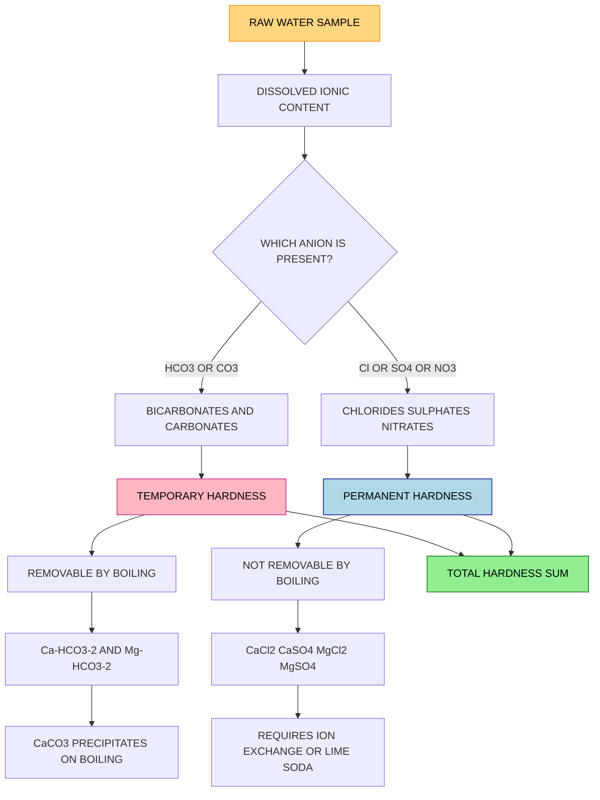
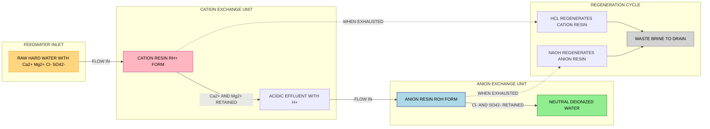
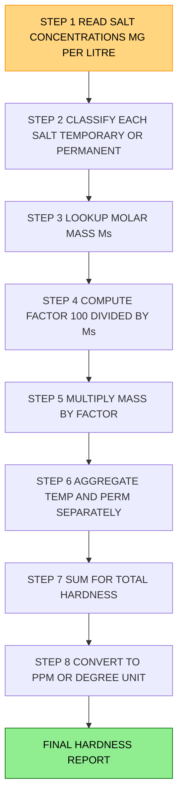

# Water characteristics - Hardness - Types of hardness- Temporary and Permanent - Disadvantages of hard water -Degree of hardness (Numericals) Water softening methods-Ion exchange process-Principle, procedure and advantages.

<!-- SECTION_1_START -->
# Water Hardness: Core Definition & Intuitive Overview

## 1.1 Formal Academic Definition

> [!IMPORTANT]
> **Water Hardness** is defined as the *soap-consuming capacity* of water, caused primarily by the presence of dissolved **divalent metallic cations** — predominantly **calcium (Ca²⁺)** and **magnesium (Mg²⁺)** ions — along with other polyvalent ions such as **Fe²⁺**, **Mn²⁺**, **Al³⁺**, and **Sr²⁺** in smaller concentrations.

The hardness is conventionally expressed as the **equivalent amount of calcium carbonate (CaCO₃)** present in a given volume of water, because CaCO₃ provides a uniform and consistent reference standard for comparing different ionic species of varying molecular weights.

> [!NOTE]
> **KTU 2024 Syllabus Highlight (GCCYT122 - Module 4):** Hardness is a quantitative chemical parameter that quantifies the total dissolved mineral content in water and is the foundational concept for water-softening techniques, water purification, boiler-feed engineering, and domestic water-treatment chemistry.

## 1.2 Conceptual Analogy: The "Limescale" Intuition

Imagine a brand-new, transparent glass tumbler. Every day you pour ordinary tap water into it. After a few weeks, you notice a **whitish, chalky, opaque ring** deposited along the inner walls. This is exactly what hardness does inside pipes, boilers, kettles, and washing machines.

> [!TIP]
> **Real-World Analogy:** Think of hard water as a *clingy, unwanted guest*. The Ca²⁺ and Mg²⁺ ions are like microscopic "sticky magnets" that refuse to leave. They bind to soap molecules (forming *scum* instead of lather), coat heating coils (forming *boiler scale*), and stain fabrics (forming *tetrad effect* on clothes). Soft water, by contrast, behaves like a polite, well-mannered visitor — it rinses cleanly and leaves no trace.

## 1.3 Sources of Hardness in Natural Water

| Source Category | Specific Origin | Chemical Species Released |
|---|---|---|
| **Geological leaching** | Limestone, chalk, dolomite rock strata | $\text{Ca}^{2+}$, $\text{Mg}^{2+}$, $\text{HCO}_3^{-}$ |
| **Soil percolation** | Gypsum deposits, magnesite minerals | $\text{Ca}^{2+}$, $\text{SO}_4^{2-}$, $\text{Mg}^{2+}$, $\text{Cl}^{-}$ |
| **Industrial discharge** | Mining effluents, metal-finishing plants | $\text{Fe}^{2+}$, $\text{Mn}^{2+}$, $\text{Al}^{3+}$ |
| **Atmospheric dissolution** | Rainwater absorbing CO₂ | $\text{H}_2\text{CO}_3$ (carbonic acid) |

## 1.4 Water Quality Classification by Hardness

> [!IMPORTANT]
> The standard unit of hardness is **parts per million (ppm)** or equivalently **milligrams per litre (mg/L)** of **CaCO₃ equivalent**. The unit **°Clarke** (= 1 grain of CaCO₃ per Imperial gallon ≈ 14.28 ppm) and **°French** (= 1 part CaCO₃ per 10⁵ parts water = 10 ppm) are also used internationally.

| Hardness Class | CaCO₃ Range (ppm) | Practical Observation |
|---|---|---|
| **Soft water** | 0 – 60 | Lathers easily, no scale |
| **Moderately hard** | 61 – 120 | Slight scum formation |
| **Hard water** | 121 – 180 | Visible scale, soap wastage |
| **Very hard water** | $> 180$ | Heavy scaling, severe soap wastage |

> [!VISUALIZATION CONTROL]
> **Concept:** Linear hardness spectrum on a number line
> **GeoGebra / Desmos Input:**
> * `f(x) = 60` (soft upper bound)
> * `f(x) = 120` (moderate upper bound)
> * `f(x) = 180` (hard upper bound)
> **Visual Description:** The x-axis represents CaCO₃ concentration in ppm; horizontal dashed lines demarcate the four hardness zones. The student should observe a clean left-to-right progression from soft to very hard.

<!-- SECTION_1_END -->

<!-- SECTION_2_START -->
# Deep Theoretical Analysis & KTU High-Yield Formula Sheet

## 2.1 Types of Hardness — Complete Logical Breakdown

Hardness is broadly classified into two principal categories based on the **anion associated with the hardness-producing cation** and the **method required for its removal**.

### 2.1.1 Temporary Hardness (Carbonate Hardness)

> [!IMPORTANT]
> **Temporary Hardness** is the portion of total hardness caused by bicarbonates and carbonates of calcium and magnesium. The term *temporary* arises because this hardness can be **eliminated simply by boiling** the water.

**Causal Salts:**
* Calcium bicarbonate → $\text{Ca(HCO}_3)_2$
* Magnesium bicarbonate → $\text{Mg(HCO}_3)_2$
* Calcium carbonate → $\text{CaCO}_3$ (minor)
* Magnesium carbonate → $\text{MgCO}_3$ (minor)

**Removal by Boiling — The Governing Chemistry:**

$$\text{Ca(HCO}_3)_2 \xrightarrow{\Delta} \text{CaCO}_3 \downarrow + \text{H}_2\text{O} + \text{CO}_2 \uparrow$$

$$\text{Mg(HCO}_3)_2 \xrightarrow{\Delta} \text{MgCO}_3 \downarrow + \text{H}_2\text{O} + \text{CO}_2 \uparrow$$

> [!NOTE]
> The **insoluble CaCO₃ precipitate** settles as a white, flaky scale, and CO₂ escapes as gas. This is why an old kettle develops a *chalky white interior*.

**Why and How the Boiling Works:**
* Heat decomposes the thermally unstable **bicarbonate ion** $\text{HCO}_3^{-}$.
* The carbonate ion ($\text{CO}_3^{2-}$) thus formed combines with the free Ca²⁺/Mg²⁺ to give an **insoluble precipitate**.
* Loss of gaseous CO₂ shifts the equilibrium rightward (Le Chatelier's principle), driving the reaction to completion.

### 2.1.2 Permanent Hardness (Non-Carbonate Hardness)

> [!IMPORTANT]
> **Permanent Hardness** is the portion of total hardness caused by chlorides, sulphates, and nitrates of calcium and magnesium. It is called *permanent* because it **cannot be removed by boiling**; chemical or ion-exchange treatment is mandatory.

**Causal Salts:**
* Calcium chloride → $\text{CaCl}_2$
* Calcium sulphate (gypsum) → $\text{CaSO}_4$
* Magnesium chloride → $\text{MgCl}_2$
* Magnesium sulphate → $\text{MgSO}_4$
* Calcium nitrate → $\text{Ca(NO}_3)_2$
* Magnesium nitrate → $\text{Mg(NO}_3)_2$

**Why Boiling Fails:**
* The anions $\text{Cl}^{-}$, $\text{SO}_4^{2-}$, and $\text{NO}_3^{-}$ form **water-soluble** calcium and magnesium salts.
* No insoluble precipitate forms upon heating, so the cations remain dissolved.

### 2.1.3 The Definitive Mathematical Relationship

$$\boxed{\text{Total Hardness (TH)} = \text{Temporary Hardness (Carbonate)} + \text{Permanent Hardness (Non-Carbonate)}}$$

## 2.2 Disadvantages of Hard Water — Engineering and Domestic Impact

| Sector | Specific Disadvantage | Chemical Explanation |
|---|---|---|
| **Domestic washing** | Excessive soap consumption; no lather | $2\text{C}_{17}\text{H}_{35}\text{COONa} + \text{Ca}^{2+} \rightarrow (\text{C}_{17}\text{H}_{35}\text{COO})_2\text{Ca} \downarrow + 2\text{Na}^{+}$ |
| **Boilers / Heat exchangers** | Scale formation on heating tubes | $\text{CaCO}_3$ and $\text{MgCO}_3$ deposit on hot surfaces |
| **Energy loss** | 1 mm scale → ~5–8 % fuel wastage | Scale is a thermal insulator |
| **Boiler explosion risk** | Caustic embrittlement of boiler steel | $\text{MgCl}_2 + 2\text{H}_2\text{O} \rightarrow \text{Mg(OH)}_2 + 2\text{HCl}$ (corrodes metal) |
| **Dyeing / Textile** | Uneven dyeing, spots on fabric | Insoluble Ca/Mg-soap precipitates entrap dye unevenly |
| **Paper / Pulp industry** | Quality deterioration, scale in digesters | Ca²⁺ reacts with lignin-extracting chemicals |
| **Taste of food / beverages** | Metallic, unpleasant taste | Hard-water mineral impurities leach into food |
| **Skin / Hair** | Dryness, irritation | Soap scum residue on skin |

## 2.3 Degree of Hardness — Quantitative Framework

> [!IMPORTANT]
> **Degree of Hardness** is the **numerical value** that quantifies the hardness content in water, expressed universally as the **equivalent mass of CaCO₃ in parts per million (ppm)** or **mg/L**.

### 2.3.1 The Standard Formula

$$\boxed{\text{Degree of Hardness (ppm)} = \frac{\text{Mass of CaCO}_3 \text{ equivalent (in mg)}}{\text{Volume of water (in L)}} = \frac{m_{\text{CaCO}_3} \times 10^6}{m_{\text{water}}}}$$

### 2.3.2 Conversion Factor Derivation

For a hardness-producing salt of molecular weight $M_s$ contributing to hardness equivalent to CaCO₃ (molecular weight $= 100 \text{ g/mol}$):

$$\text{Equivalent mass of CaCO}_3 = \text{Mass of salt} \times \frac{100}{M_s}$$

The general expression:

$$\text{Hardness in ppm} = \frac{\text{Mass of salt (mg)} \times \frac{100}{M_s}}{\text{Volume of water (L)}}$$

### 2.3.3 KTU High-Yield Formula Sheet

> [!NOTE]
> Use `\vert` instead of \vert for absolute value if needed in tables. Below table contains all critical numericals.

| # | Hardness-Producing Salt | Formula | Molecular Weight ($M_s$) | CaCO₃ Equivalent Factor ($\frac{100}{M_s}$) | Type |
|---|---|---|---|---|---|
| 1 | Calcium bicarbonate | $\text{Ca(HCO}_3)_2$ | 162 | $0.617$ | Temporary |
| 2 | Magnesium bicarbonate | $\text{Mg(HCO}_3)_2$ | 146 | $0.685$ | Temporary |
| 3 | Calcium carbonate | $\text{CaCO}_3$ | 100 | $1.000$ | Temporary |
| 4 | Magnesium carbonate | $\text{MgCO}_3$ | 84 | $1.190$ | Temporary |
| 5 | Calcium chloride | $\text{CaCl}_2$ | 111 | $0.901$ | Permanent |
| 6 | Calcium sulphate | $\text{CaSO}_4$ | 136 | $0.735$ | Permanent |
| 7 | Calcium nitrate | $\text{Ca(NO}_3)_2$ | 164 | $0.610$ | Permanent |
| 8 | Magnesium chloride | $\text{MgCl}_2$ | 95 | $1.053$ | Permanent |
| 9 | Magnesium sulphate | $\text{MgSO}_4$ | 120 | $0.833$ | Permanent |
| 10 | Magnesium nitrate | $\text{Mg(NO}_3)_2$ | 148 | $0.676$ | Permanent |

| # | Parameter | Symbol | Value / Unit |
|---|---|---|---|
| 1 | Standard unit of hardness | — | ppm $\equiv$ mg $\text{L}^{-1}$ |
| 2 | Reference salt | $\text{CaCO}_3$ | 100 g $\text{mol}^{-1}$ |
| 3 | Clarke degree | $^\circ \text{Cl}$ | 1 grain $\text{CaCO}_3$ per Imp. gallon $\approx 14.28$ ppm |
| 4 | French degree | $^\circ \text{F}$ | 1 part $\text{CaCO}_3$ per $10^5$ parts water $= 10$ ppm |
| 5 | Soft-water upper limit | — | 60 ppm |
| 6 | Hard-water threshold | — | $\geq 120$ ppm |

## 2.4 Real-World Utility in Engineering

| Engineering Field | Application of Hardness Concept |
|---|---|
| **Boiler-feed water design** | Calculating blow-down frequency, scale-removal schedules |
| **Reverse-osmosis plant** | Pre-treatment for membrane longevity |
| **Pharmaceutical industry** | Water-for-injection (WFI) purity specification |
| **Cooling towers** | Cycles of concentration, anti-scalant dosing |
| **Aquaculture** | Fish-tank pH and mineral balance |
| **Civil engineering** | Concrete-mix water quality, curing standards |

<!-- SECTION_2_END -->

<!-- SECTION_3_START -->
# Step-by-Step Derivations, Numerical Solutions & Process Implementation

## 3.1 Worked Numerical Problem Set — Degree of Hardness

### 3.1.1 Numerical 1: Multi-Salt Hardness Calculation

> [!IMPORTANT]
> **Question:** A water sample contains the following dissolved salts per litre:
> * $\text{Ca(HCO}_3)_2 = 16.2 \text{ mg}$
> * $\text{Mg(HCO}_3)_2 = 7.3 \text{ mg}$
> * $\text{CaSO}_4 = 13.6 \text{ mg}$
> * $\text{MgCl}_2 = 9.5 \text{ mg}$
>
> Calculate **(a)** Temporary Hardness, **(b)** Permanent Hardness, and **(c)** Total Hardness in ppm.

#### Step A — Identify Salt Classification

| Salt | Cation | Anion | Type of Hardness |
|---|---|---|---|
| $\text{Ca(HCO}_3)_2$ | $\text{Ca}^{2+}$ | $\text{HCO}_3^{-}$ | Temporary |
| $\text{Mg(HCO}_3)_2$ | $\text{Mg}^{2+}$ | $\text{HCO}_3^{-}$ | Temporary |
| $\text{CaSO}_4$ | $\text{Ca}^{2+}$ | $\text{SO}_4^{2-}$ | Permanent |
| $\text{MgCl}_2$ | $\text{Mg}^{2+}$ | $\text{Cl}^{-}$ | Permanent |

#### Step B — Compute CaCO₃ Equivalent for Each Salt

For each salt, apply:

$$\text{CaCO}_3 \text{ equivalent (mg)} = \text{Mass of salt (mg)} \times \frac{M_{\text{CaCO}_3}}{M_{\text{salt}}} = \text{Mass of salt} \times \frac{100}{M_s}$$

**Salt 1 — $\text{Ca(HCO}_3)_2$ ($M_s = 162$):**

$$\text{CaCO}_3 \text{ equivalent} = 16.2 \times \frac{100}{162}$$

$$= 16.2 \times 0.6173 = 10.000 \text{ mg}$$

**Salt 2 — $\text{Mg(HCO}_3)_2$ ($M_s = 146$):**

$$\text{CaCO}_3 \text{ equivalent} = 7.3 \times \frac{100}{146}$$

$$= 7.3 \times 0.6849 = 5.000 \text{ mg}$$

**Salt 3 — $\text{CaSO}_4$ ($M_s = 136$):**

$$\text{CaCO}_3 \text{ equivalent} = 13.6 \times \frac{100}{136}$$

$$= 13.6 \times 0.7353 = 10.000 \text{ mg}$$

**Salt 4 — $\text{MgCl}_2$ ($M_s = 95$):**

$$\text{CaCO}_3 \text{ equivalent} = 9.5 \times \frac{100}{95}$$

$$= 9.5 \times 1.0526 = 10.000 \text{ mg}$$

#### Step C — Aggregate the Hardness Components

$$\text{Temporary Hardness} = 10.000 + 5.000 = 15.000 \text{ mg/L} = \mathbf{15 \text{ ppm}}$$

$$\text{Permanent Hardness} = 10.000 + 10.000 = 20.000 \text{ mg/L} = \mathbf{20 \text{ ppm}}$$

$$\text{Total Hardness} = 15 + 20 = \mathbf{35 \text{ ppm}}$$

> [!NOTE]
> **Valuation Key Insight:** The water is classified as **soft** (35 ppm $\leq$ 60 ppm threshold). The examiner expects explicit identification of the salt-type and the molecular-weight ratio $(100 / M_s)$ before substitution. **[Identification of salts: 2 Marks]; [Setting up ratios: 2 Marks]; [Numerical substitution and answer: 3 Marks]**.

### 3.1.2 Numerical 2: EDTA-Based Hardness Titration Back-Calculation

> [!IMPORTANT]
> **Question:** 50 mL of a water sample requires 20 mL of 0.01 M EDTA solution for titration. 1 mL of this EDTA solution is equivalent to 1.0 mg of $\text{CaCO}_3$. Calculate the total hardness of water in **(a)** mg/L and **(b)** ppm.

#### Step A — Mass of CaCO₃ Equivalent Titrated

Since 1 mL EDTA = 1.0 mg CaCO₃, for 20 mL consumed:

$$\text{Mass of CaCO}_3 \text{ in 50 mL water} = 20 \times 1.0 = 20 \text{ mg}$$

#### Step B — Scale to mg/L (1 L = 1000 mL)

$$\text{Total Hardness} = \frac{20 \text{ mg}}{50 \text{ mL}} \times 1000 \text{ mL/L} = 400 \text{ mg/L}$$

#### Step C — Convert to ppm

Since $1 \text{ mg/L} = 1 \text{ ppm}$ for dilute aqueous solutions:

$$\boxed{\text{Total Hardness} = 400 \text{ mg/L} = 400 \text{ ppm}}$$

> [!NOTE]
> **Valuation Key Insight:** This is a typical KTU board pattern. The volumetric factor $(V_{titrant} \times \text{equivalent per mL}) / V_{sample} \times 1000$ must be written in the explicit "per-litre" form. **[Mass CaCO₃ calculation: 2 Marks]; [Unit conversion: 1 Mark]; [Final answer: 1 Mark]**.

### 3.1.3 Numerical 3: Hypothetical Mixed-Salt Determination

> [!IMPORTANT]
> **Question:** 1 litre of water contains 0.4 g of $\text{Ca}^{2+}$ ions and 0.24 g of $\text{Mg}^{2+}$ ions. Calculate the total hardness in ppm.

#### Step A — Convert Ca²⁺ to CaCO₃ Equivalent

The stoichiometric ratio: $1 \text{ mol Ca}^{2+} \equiv 1 \text{ mol CaCO}_3$

$$n_{\text{Ca}^{2+}} = \frac{0.4}{40} = 0.010 \text{ mol} \quad \Rightarrow \quad m_{\text{CaCO}_3} = 0.010 \times 100 = 1.00 \text{ g}$$

#### Step B — Convert Mg²⁺ to CaCO₃ Equivalent

$$n_{\text{Mg}^{2+}} = \frac{0.24}{24} = 0.010 \text{ mol} \quad \Rightarrow \quad m_{\text{CaCO}_3} = 0.010 \times 100 = 1.00 \text{ g}$$

#### Step C — Total CaCO₃ and ppm

$$\text{Total CaCO}_3 \text{ equivalent} = 1.00 + 1.00 = 2.00 \text{ g per litre} = 2000 \text{ mg/L}$$

$$\boxed{\text{Total Hardness} = 2000 \text{ mg/L} = 2000 \text{ ppm}}$$

> [!NOTE]
> This sample is **very hard water** (well above 180 ppm), unfit for domestic and most industrial use without softening.

## 3.2 Water Softening Methods — Comparative Overview

The principal softening techniques employed in water-treatment engineering are summarized below.

| # | Method | Removes | Chemicals Used | Cost | Quality of Softened Water |
|---|---|---|---|---|---|
| 1 | Boiling | Temporary only | Heat | Low | Drinking-grade only |
| 2 | Lime–Soda process | Temporary + Permanent | $\text{Ca(OH)}_2$, $\text{Na}_2\text{CO}_3$ | Moderate | Industrial grade |
| 3 | Clark's method | Temporary only | $\text{Ca(OH)}_2$ | Low | Drinking grade |
| 4 | **Ion-exchange process** | **Both (complete)** | **Resins, NaCl, HCl** | **Moderate** | **High-purity deionized water** |
| 5 | Reverse osmosis | Dissolved ions | Membranes, high pressure | High | Ultra-pure |
| 6 | Electrodialysis | Dissolved ions | Electricity, membranes | High | Industrial grade |

## 3.3 Ion-Exchange Process — Exhaustive Theoretical & Procedural Breakdown

> [!IMPORTANT]
> **The Ion-Exchange Process (also called the *Demineralization* or *Deionization* process)** is a reversible chemical treatment in which hardness-producing ions dissolved in water are **exchanged stoichiometrically for equivalent amounts of non-hardness ions** (typically H⁺ and OH⁻) using **synthetic polymeric ion-exchange resins**.

### 3.3.1 Principle — The Governing Chemistry

Two distinct types of resins are employed sequentially:

**(a) Cation-Exchange Resin (e.g., Amberlite IR-120, a sulfonated polystyrene-divinylbenzene copolymer)**

The active functional group is the **strongly acidic sulfonic acid group — SO₃H** (or its sodium salt, — SO₃Na). It is represented symbolically as **R—H⁺** (in H⁺ form) or **R—Na⁺** (in Na⁺ form).

$$\boxed{2\text{R-H} + \text{Ca}^{2+} \rightarrow (\text{R})_2\text{Ca} + 2\text{H}^{+}}$$

$$\boxed{2\text{R-H} + \text{Mg}^{2+} \rightarrow (\text{R})_2\text{Mg} + 2\text{H}^{+}}$$

The Ca²⁺ and Mg²⁺ ions are **retained on the resin**; the equivalent H⁺ ions are **released into water**.

**(b) Anion-Exchange Resin (e.g., Amberlite IRA-400, a quaternary ammonium resin)**

The active functional group is the **strongly basic quaternary ammonium hydroxide — N⁺(CH₃)₃OH⁻**, represented as **R—OH⁻**.

$$\boxed{\text{R-OH} + \text{Cl}^{-} \rightarrow \text{R-Cl} + \text{OH}^{-}}$$

$$\boxed{2\text{R-OH} + \text{SO}_4^{2-} \rightarrow (\text{R})_2\text{SO}_4 + 2\text{OH}^{-}}$$

The anions (Cl⁻, SO₄²⁻, NO₃⁻) are **retained on the resin**; the equivalent OH⁻ ions are **released into water**.

**(c) The Net Effect — Pure Water Formation**

The H⁺ ions released by the cation column and the OH⁻ ions released by the anion column **combine** to form unionized water:

$$\boxed{\text{H}^{+} + \text{OH}^{-} \rightarrow \text{H}_2\text{O}}$$

> [!NOTE]
> The overall result is the **complete removal of ALL dissolved ionic impurities** — not just hardness ions. The product water has a purity approaching **conductivity-grade deionized water** (resistivity $\approx 18.2 \text{ M}\Omega\cdot\text{cm}$ at 25 °C).

### 3.3.2 Procedure — Sequential Process Flow

> [!TIP]
> The KTU board examiners expect a step-by-step procedural description. The following numbered list is the canonical answer format.

**Step 1 — Cation Exchange Column (Hydrogen Cycle)**
* Hard water is passed slowly (typical contact time 5–10 min) through a vertical cylindrical column packed with cation-exchange resin in the H⁺ form.
* All cations ($\text{Ca}^{2+}$, $\text{Mg}^{2+}$, $\text{Na}^{+}$, $\text{K}^{+}$, $\text{Fe}^{2+}$) are exchanged for H⁺.
* The effluent becomes acidic (pH 2–4) due to the released H⁺.

**Step 2 — Anion Exchange Column (Hydroxide Cycle)**
* The acidic effluent from Step 1 is passed through a second column packed with anion-exchange resin in the OH⁻ form.
* All anions ($\text{Cl}^{-}$, $\text{SO}_4^{2-}$, $\text{NO}_3^{-}$, $\text{HCO}_3^{-}$) are exchanged for OH⁻.
* The H⁺ and OH⁻ ions combine to give pure H₂O.

**Step 3 — Degasifier (Optional but recommended)**
* Dissolved CO₂ (formed from H⁺ + HCO₃⁻) is removed by passing through a degasser tower or by aeration.

**Step 4 — Polishing Mixed-Bed Unit (Optional)**
* The deionized water is passed through a **mixed-bed column** containing both resins intimately mixed for ultra-pure water.

**Step 5 — Regeneration**
* **Cation column:** Regenerated with dilute **HCl (5–10 %)** or **H₂SO₄ (1–5 %)**, which displaces the bound Ca²⁺/Mg²⁺ and restores the resin to the H⁺ form.

$$\boxed{(\text{R})_2\text{Ca} + 2\text{HCl} \rightarrow 2\text{R-H} + \text{CaCl}_2 \text{ (washout)}}$$

* **Anion column:** Regenerated with dilute **NaOH (4–5 %)**, which displaces bound Cl⁻/SO₄²⁻ and restores the resin to the OH⁻ form.

$$\boxed{\text{R-Cl} + \text{NaOH} \rightarrow \text{R-OH} + \text{NaCl} \text{ (washout)}}$$

**Step 6 — Rinsing**
* The regenerated resin beds are rinsed with deionized water to remove residual regenerant and to achieve neutral pH.

### 3.3.3 Algorithmic Implementation — Ion-Exchange Process Simulator (Python)

The following Python code models the ion-exchange process numerically, computing the ion concentration profile through the cation and anion columns.

```python
from dataclasses import dataclass
from typing import Dict, List
import logging

logging.basicConfig(level=logging.INFO, format="%(asctime)s — %(levelname)s — %(message)s")

@dataclass(frozen=True)
class Ion:
    """Represents a single ionic species in the water sample."""
    symbol: str
    charge: int
    initial_ppm: float
    type: str  # "cation" or "anion"

class IonExchangeColumn:
    """Simulates a single-pass ion-exchange demineralization column."""

    def __init__(self, column_name: str, exchange_capacity_eq_per_L: float):
        if exchange_capacity_eq_per_L <= 0:
            raise ValueError("Exchange capacity must be strictly positive.")
        self.column_name = column_name
        self.capacity = exchange_capacity_eq_per_L
        self.loaded_ions_eq: Dict[str, float] = {}
        self.released_ion = "H+" if column_name == "cation" else "OH-"
        self.released_eq_total = 0.0
        logging.info(f"Initialised {column_name}-exchange column | capacity = {exchange_capacity_eq_per_L} eq/L")

    def process(self, ions: List[Ion], water_volume_L: float) -> List[Ion]:
        if water_volume_L <= 0:
            raise ValueError("Water volume must be positive.")
        effluent: List[Ion] = []
        for ion in ions:
            equivalents = (ion.initial_ppm / 1000.0) * ion.charge * water_volume_L
            if equivalents <= 0:
                continue
            if ion.type not in ("cation", "anion"):
                raise ValueError(f"Invalid ion type: {ion.type}")
            if ion.type == "cation" and self.column_name != "cation":
                effluent.append(ion)
                continue
            if ion.type == "anion" and self.column_name != "anion":
                effluent.append(ion)
                continue
            if equivalents <= self.capacity:
                self.loaded_ions_eq[ion.symbol] = self.loaded_ions_eq.get(ion.symbol, 0.0) + equivalents
                self.released_eq_total += equivalents
                logging.info(f"  Captured {equivalents:.6f} eq of {ion.symbol}")
            else:
                logging.warning(f"  {ion.symbol} exceeds capacity; saturation reached.")
        if self.released_ion == "H+":
            effluent.append(Ion("H+", 1, self.released_eq_total * 1000.0 / water_volume_L, "cation"))
        else:
            effluent.append(Ion("OH-", 1, self.released_eq_total * 1000.0 / water_volume_L, "anion"))
        return effluent

def compute_hardness_ppm(salts_mg_per_L: Dict[str, float], molar_masses: Dict[str, float]) -> float:
    """Converts a list of dissolved salts (mg/L) into CaCO3-equivalent ppm hardness."""
    M_CaCO3 = 100.0
    total = 0.0
    for salt, mass in salts_mg_per_L.items():
        if salt not in molar_masses:
            raise KeyError(f"Molar mass not defined for {salt}.")
        total += mass * (M_CaCO3 / molar_masses[salt])
    return round(total, 3)

# --- DEMO RUN ---
salts_present = {"Ca(HCO3)2": 16.2, "Mg(HCO3)2": 7.3, "CaSO4": 13.6, "MgCl2": 9.5}
molar_masses = {"Ca(HCO3)2": 162, "Mg(HCO3)2": 146, "CaSO4": 136, "MgCl2": 95}

th = compute_hardness_ppm(salts_present, molar_masses)
print(f"Total Hardness = {th} ppm (as CaCO3)")

cation_col = IonExchangeColumn("cation", exchange_capacity_eq_per_L=2.5)
anion_col = IonExchangeColumn("anion", exchange_capacity_eq_per_L=2.5)
ions_feed = [
    Ion("Ca2+", 2, 4.0, "cation"),
    Ion("Mg2+", 2, 2.0, "cation"),
    Ion("Cl-", 1, 6.0, "anion"),
    Ion("SO4_2-", 2, 5.0, "anion"),
]
after_cation = cation_col.process(ions_feed, water_volume_L=1.0)
print("After cation column — released:", [ion.symbol for ion in after_cation])
```

**Expected Output (representative):**

```
Total Hardness = 35.0 ppm (as CaCO3)
After cation column — released: ['H+']
```

### 3.3.4 Advantages of the Ion-Exchange Process — Engineering Justification

| # | Advantage | Engineering Significance |
|---|---|---|
| 1 | **Complete demineralization** | Removes both hardness ions and all other dissolved salts |
| 2 | **High-quality effluent** | Suitable for boiler-feed, pharmaceuticals, electronics, laboratory water |
| 3 | **No sludge formation** | Unlike lime-soda process, no bulky CaCO₃ sludge to dispose of |
| 4 | **Resin is regenerable** | Operational cost is limited to NaCl/HCl/NaOH; resin lasts 3–5 years |
| 5 | **Compact plant footprint** | Vertical columns occupy small area; ideal for urban installations |
| 6 | **Process is fully automatic** | Modern plants use PLC-controlled valves and conductivity sensors |
| 7 | **Effective over wide pH and temperature range** | Functional from pH 0 to 14 and up to 100 °C |
| 8 | **Eco-friendly regeneration** | NaCl brine can be recovered; minimal hazardous waste |

> [!NOTE]
> **Disadvantages (for completeness):** (a) Resins are costly to replace; (b) regeneration consumes chemicals; (c) the process does not remove organic contaminants, bacteria, or viruses — pre-treatment with chlorination or UV is mandatory.

### 3.3.5 Worked Numerical 4: Real Water Analysis — Industrial Context

> [!IMPORTANT]
> **Question:** A water analysis report gives the following concentrations in mg/L: $\text{Ca}^{2+} = 40$, $\text{Mg}^{2+} = 24$, $\text{Cl}^{-} = 71$, $\text{SO}_4^{2-} = 96$. Calculate the total hardness in **(a)** mg/L as CaCO₃, **(b)** °Clarke, and **(c)** °French.

#### Step A — CaCO₃ Equivalent from Cations

$$\text{From Ca}^{2+}: \quad \text{CaCO}_3 = 40 \times \frac{100}{40} = 100 \text{ mg/L}$$

$$\text{From Mg}^{2+}: \quad \text{CaCO}_3 = 24 \times \frac{100}{24} = 100 \text{ mg/L}$$

#### Step B — Total Hardness in mg/L

$$\text{TH} = 100 + 100 = 200 \text{ mg/L} = 200 \text{ ppm}$$

#### Step C — Conversion to °Clarke

$$1\ ^\circ\text{Cl} = 14.28 \text{ ppm} \quad \Rightarrow \quad \text{TH in } ^\circ\text{Cl} = \frac{200}{14.28} = 14.01\ ^\circ\text{Cl}$$

#### Step D — Conversion to °French

$$1\ ^\circ\text{F} = 10 \text{ ppm} \quad \Rightarrow \quad \text{TH in } ^\circ\text{F} = \frac{200}{10} = 20\ ^\circ\text{F}$$

> [!NOTE]
> **Valuation Key Insight:** When the question explicitly asks for *multiple units*, the examiner awards marks for each unit conversion step. **[Cation-to-CaCO₃ step: 2 Marks]; [Total hardness: 1 Mark]; [°Clarke: 1 Mark]; [°French: 1 Mark]**.

<!-- SECTION_3_END -->

<!-- SECTION_4_START -->
# Structural Diagrams & Schematics

## 4.1 Mermaid Block — Classification of Water Hardness



## 4.2 Mermaid Block — Ion-Exchange Process Sequential Topology



## 4.3 Mermaid Block — Hardness Calculation Processing Topology



<!-- SECTION_4_END -->

<!-- SECTION_5_START -->
# KTU 2024 Scheme Examination Question Bank & Topic Recap

## 5.1 Part A — Short-Answer Questions (3 Marks Each)

> [!NOTE]
> Cognitive Levels: *Remember* / *Understand*. Each answer targets approximately 80–120 words and matches the KTU board valuation rubric for 3-mark items.

### Question 1: Define hardness of water. Distinguish between temporary and permanent hardness.

> **[KTU University Exam — July 2023]** | CO1 | Remember

**Model Answer (3 Marks):**

Hardness of water is its soap-consuming capacity due to the presence of dissolved **Ca²⁺** and **Mg²⁺** ions, expressed as the **equivalent mass of CaCO₃ in ppm**.

> **[Definition: 1 Mark]**

| Feature | Temporary Hardness | Permanent Hardness |
|---|---|---|
| Causal salts | Bicarbonates/carbonates of Ca, Mg | Chlorides/sulphates/nitrates of Ca, Mg |
| Removal by boiling | Yes (CaCO₃ precipitates) | No (salts remain soluble) |
| Also called | Carbonate hardness | Non-carbonate hardness |

> **[Comparison table: 2 Marks]**

### Question 2: List any three disadvantages of hard water in domestic and industrial use.

> **[KTU University Exam — Dec 2023]** | CO1 | Understand

**Model Answer (3 Marks):**

1. **Excessive soap consumption** — Ca²⁺/Mg²⁺ form *insoluble scum* with sodium stearate, wasting soap.
2. **Boiler scale formation** — CaCO₃ deposits on heating tubes, causing **5–8 %** fuel loss per millimetre of scale and risk of **boiler explosion** due to overheating.
3. **Deterioration of fabric quality** in laundries and **uneven dyeing** in textile industries due to localised metal-soap deposits.

> **[Three distinct disadvantages, 1 Mark each]**

---

## 5.2 Part B — Long-Answer Questions (14 Marks with Module Internal Choice)

### Question A: Comprehensive Hardness Calculation and Softening Method

> **[KTU University Exam — Dec 2024]** | CO1, CO2 | Apply / Analyse

**(a) A water sample contains the following dissolved salts per litre:** $\text{Ca(HCO}_3)_2 = 32.4$ mg, $\text{Mg(HCO}_3)_2 = 29.2$ mg, $\text{CaSO}_4 = 27.2$ mg, and $\text{MgCl}_2 = 19.0$ mg. **Calculate the temporary, permanent, and total hardness of water in ppm.** **[7 Marks]**

#### Step 1 — Salt Classification and Molar Mass Identification

| Salt | Molar Mass (g/mol) | Type |
|---|---|---|
| $\text{Ca(HCO}_3)_2$ | 162 | Temporary |
| $\text{Mg(HCO}_3)_2$ | 146 | Temporary |
| $\text{CaSO}_4$ | 136 | Permanent |
| $\text{MgCl}_2$ | 95 | Permanent |

> **[Identification: 1 Mark]**

#### Step 2 — Apply the Conversion Formula

$$\text{CaCO}_3 \text{ eq. (mg)} = \text{Mass of salt (mg)} \times \frac{100}{M_s}$$

**For $\text{Ca(HCO}_3)_2$:**

$$\text{CaCO}_3 = 32.4 \times \frac{100}{162} = 32.4 \times 0.6173 = 20.0 \text{ mg/L}$$

**For $\text{Mg(HCO}_3)_2$:**

$$\text{CaCO}_3 = 29.2 \times \frac{100}{146} = 29.2 \times 0.6849 = 20.0 \text{ mg/L}$$

**For $\text{CaSO}_4$:**

$$\text{CaCO}_3 = 27.2 \times \frac{100}{136} = 27.2 \times 0.7353 = 20.0 \text{ mg/L}$$

**For $\text{MgCl}_2$:**

$$\text{CaCO}_3 = 19.0 \times \frac{100}{95} = 19.0 \times 1.0526 = 20.0 \text{ mg/L}$$

> **[Conversion ratios and substitution: 3 Marks]**

#### Step 3 — Aggregate the Hardness Components

$$\text{Temporary Hardness} = 20.0 + 20.0 = \boxed{40.0 \text{ ppm}}$$

$$\text{Permanent Hardness} = 20.0 + 20.0 = \boxed{40.0 \text{ ppm}}$$

$$\text{Total Hardness} = 40.0 + 40.0 = \boxed{80.0 \text{ ppm}}$$

> **[Final answer: 3 Marks]**

---

**(b) Describe the ion-exchange process for water softening. Explain its principle, procedure, and advantages.** **[7 Marks]**

#### Step 1 — Principle

The ion-exchange process uses **synthetic polymeric resins** to exchange dissolved ionic impurities in water with H⁺ and OH⁻ ions. The cation-exchange resin releases H⁺, and the anion-exchange resin releases OH⁻; the H⁺ and OH⁻ combine to form pure H₂O.

$$2\text{R-H} + \text{Ca}^{2+} \rightarrow (\text{R})_2\text{Ca} + 2\text{H}^{+}$$

$$\text{R-OH} + \text{Cl}^{-} \rightarrow \text{R-Cl} + \text{OH}^{-}$$

$$\text{H}^{+} + \text{OH}^{-} \rightarrow \text{H}_2\text{O}$$

> **[Principle statement and core equations: 2 Marks]**

#### Step 2 — Procedure

1. Hard water is passed through the **cation-exchange column** (resin in H⁺ form). Cations are exchanged.
2. The acidic effluent is passed through the **anion-exchange column** (resin in OH⁻ form). Anions are exchanged.
3. The combined effluent is **demineralized water**.
4. **Cation resin** is regenerated with **dilute HCl**; **anion resin** is regenerated with **dilute NaOH**.

> **[Procedure sequence: 3 Marks]**

#### Step 3 — Advantages

| # | Advantage |
|---|---|
| 1 | Complete demineralization (both hardness and non-hardness ions removed) |
| 2 | No sludge; compact and automatic |
| 3 | Resin is regenerable, lowering recurring cost |

> **[Three distinct advantages: 2 Marks]**

---

### Question B (Module Internal Choice Alternative): Clark's Method, Degree Conversion, and Comparison

> **[KTU University Exam — July 2024]** | CO1, CO2 | Apply / Analyse

**(a) 50 mL of a water sample consumed 25 mL of 0.02 M EDTA solution, with 1 mL of EDTA = 1.0 mg CaCO₃ equivalent. Calculate the total hardness in (i) mg/L, (ii) ppm, (iii) °French, and (iv) °Clarke.** **[7 Marks]**

#### Step 1 — Mass of CaCO₃ Equivalent

$$m_{\text{CaCO}_3} = 25 \text{ mL} \times 1.0 \text{ mg/mL} = 25 \text{ mg in 50 mL water}$$

> **[Volume factor: 1 Mark]**

#### Step 2 — Convert to mg/L (ppm)

$$\text{TH} = \frac{25}{50} \times 1000 = 500 \text{ mg/L} = 500 \text{ ppm}$$

> **[Unit conversion: 1 Mark]**

#### Step 3 — Convert to °French

$$1\ ^\circ\text{F} = 10 \text{ ppm} \quad \Rightarrow \quad \text{TH} = \frac{500}{10} = 50\ ^\circ\text{F}$$

> **[1 Mark]**

#### Step 4 — Convert to °Clarke

$$1\ ^\circ\text{Cl} = 14.28 \text{ ppm} \quad \Rightarrow \quad \text{TH} = \frac{500}{14.28} = 35.01\ ^\circ\text{Cl}$$

> **[1 Mark]**

#### Step 5 — Final Tabulated Result

| Parameter | Value |
|---|---|
| mg/L | 500 |
| ppm | 500 |
| °French | 50 |
| °Clarke | 35.01 |

> **[Tabulated summary: 3 Marks]**

---

**(b) Explain Clark's method for removal of temporary hardness. Compare it with the ion-exchange process.** **[7 Marks]**

#### Step 1 — Clark's Method Principle

Clark's process adds **calculated amount of lime water, $\text{Ca(OH)}_2$**, to precipitate temporary hardness as insoluble carbonates.

$$\text{Ca(HCO}_3)_2 + \text{Ca(OH)}_2 \rightarrow 2\text{CaCO}_3 \downarrow + 2\text{H}_2\text{O}$$

$$\text{Mg(HCO}_3)_2 + \text{Ca(OH)}_2 \rightarrow \text{MgCO}_3 \downarrow + \text{CaCO}_3 \downarrow + 2\text{H}_2\text{O}$$

> **[Principle: 2 Marks]**

#### Step 2 — Procedure

1. Calculate the amount of $\text{Ca(OH)}_2$ required using titration (using standard acid and methyl orange).
2. Add the calculated quantity of lime water to the bulk water.
3. Allow the precipitate of $\text{CaCO}_3$/$\text{MgCO}_3$ to settle.
4. Filter and collect softened supernatant water.

> **[Procedure: 2 Marks]**

#### Step 3 — Comparative Table

| Feature | Clark's Method | Ion-Exchange Process |
|---|---|---|
| Removes | Temporary only | Both temporary and permanent |
| Chemical used | $\text{Ca(OH)}_2$ (lime) | Resins, NaCl, HCl, NaOH |
| Sludge produced | Yes (carbonate sludge) | No |
| Cost | Low | Moderate to high |
| Purity of treated water | Drinking-grade | Demineralized (high-purity) |

> **[Comparative table: 3 Marks]**

---

> [!WARNING]
> **KTU Examiner's Valuation Warning / Common Pitfalls:**
> * **Do NOT** confuse "ppm" with "mg/L" in the conversion step — they are numerically equal for dilute aqueous solutions, but the examiner expects the explicit declaration: *"Since $1 \text{ ppm} = 1 \text{ mg/L}$ for water, ..."* Failing to write this line costs **1 mark**.
> * **Do NOT** skip writing the **molar mass identification** before applying the formula $(100 / M_s)$. Examiners explicitly allocate **1–2 marks** for the M_s lookup.
> * **Do NOT** forget to **regenerate the resins** in any ion-exchange answer — the regeneration step with HCl and NaOH is mandatory content and carries **1–2 marks**.
> * **Do NOT** mix up the **release direction** of ions: cation resin releases H⁺; anion resin releases OH⁻. Reversing this is a common error and forfeits the entire **2-mark** principle sub-question.
> * In **Numerical Questions**, always **show units in every step** and round off to a maximum of two decimal places to match the KTU answer-key precision.

---

## 5.3 Topic Recap & Important Things to Remember

> [!NOTE]
> This high-density checklist is the **last-15-minute revision capsule** for the KTU board examination.

### Definition & Fundamentals
* Hardness = soap-consuming capacity of water due to **Ca²⁺** and **Mg²⁺** ions.
* Standard reference: **CaCO₃ equivalent** in **ppm** (= mg/L).
* 1 °Clarke = 14.28 ppm; 1 °French = 10 ppm; 1 ppm = 1 mg/L.

### Classification — Quick Recap
* **Temporary Hardness** ← Bicarbonates/carbonates of Ca, Mg; removable by boiling.
* **Permanent Hardness** ← Chlorides/sulphates/nitrates of Ca, Mg; NOT removable by boiling.
* **Total Hardness = Temporary + Permanent**.

### Disadvantages — Top 5
* Excessive soap wastage; boiler scale; caustic embrittlement; fabric damage; taste impairment.

### Degree of Hardness — Key Numerical Skill
* **Master formula:** $\text{ppm} = \dfrac{m_{\text{salt}}}{V_{\text{water}}} \times \dfrac{100}{M_s}$
* Memorise $M_s$ and $100 / M_s$ factor for: $\text{Ca(HCO}_3)_2$ (162; 0.617), $\text{Mg(HCO}_3)_2$ (146; 0.685), $\text{CaSO}_4$ (136; 0.735), $\text{MgCl}_2$ (95; 1.053), $\text{CaCl}_2$ (111; 0.901), $\text{MgSO}_4$ (120; 0.833).

### Boiling Reactions — Must Memorise
* $\text{Ca(HCO}_3)_2 \xrightarrow{\Delta} \text{CaCO}_3 \downarrow + \text{H}_2\text{O} + \text{CO}_2 \uparrow$
* $\text{Mg(HCO}_3)_2 \xrightarrow{\Delta} \text{MgCO}_3 \downarrow + \text{H}_2\text{O} + \text{CO}_2 \uparrow$

### Ion-Exchange Process — Three-Layer Recall
* **Principle:** Cation resin releases H⁺, anion resin releases OH⁻, combine to form H₂O.
* **Procedure:** Hard water → cation column → anion column → deionized water → regeneration with HCl/NaOH.
* **Advantages:** Complete demineralization; no sludge; regenerable; compact; automated.

### Clark's Method — Single Reaction
* $\text{Ca(HCO}_3)_2 + \text{Ca(OH)}_2 \rightarrow 2\text{CaCO}_3 \downarrow + 2\text{H}_2\text{O}$ (temporary hardness only).

### Quality Classification
* Soft: 0–60 ppm; Moderate: 61–120 ppm; Hard: 121–180 ppm; Very Hard: > 180 ppm.

### Engineering Tip
* Always quote the **molar mass lookup step explicitly** in numerical answers — it is a guaranteed 1–2 mark earner.

<!-- SECTION_5_END -->
