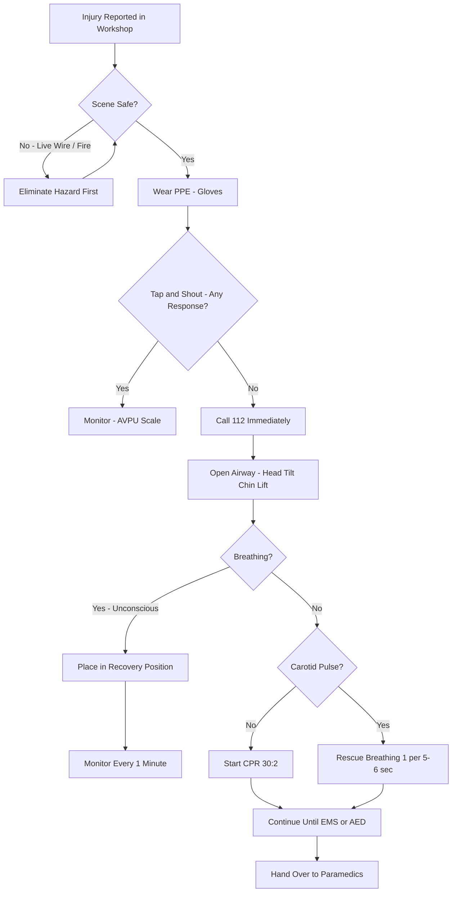
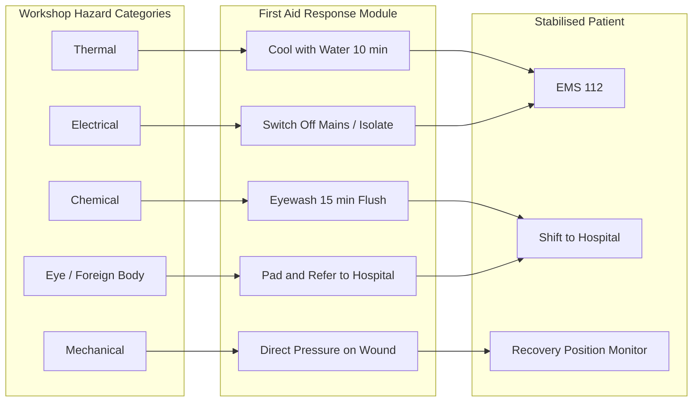
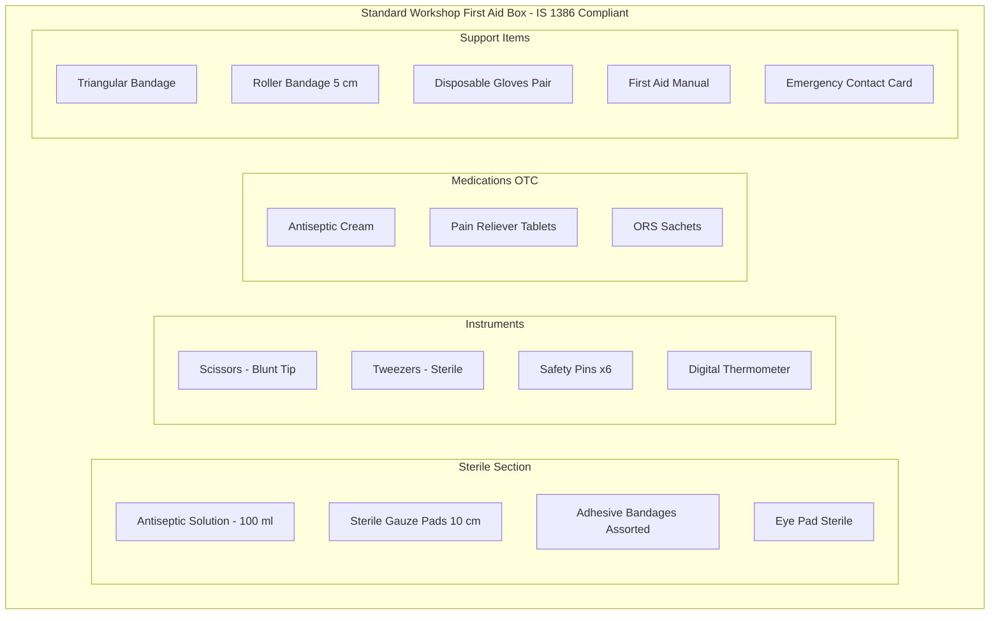

# Basic First Aid knowledge

<!-- SECTION_1_START -->

# Basic First Aid Knowledge

## 1.1 Core Technical Definition

> [!IMPORTANT]
> **First Aid (KTU 2024 Definition):** First aid is the *immediate, temporary, and basic medical assistance* given to a person who is injured or suddenly taken ill, using the materials and facilities available at the scene, before the arrival of qualified medical help or transportation to a hospital.

In the context of the **KTU 2024 Scheme GCESL106 – Engineering Workshop** syllabus, first aid forms a critical life-safety competency under Module 1. It deals with the systematic response to common workshop hazards such as electric shock, thermal burns from soldering/machining, chemical splashes, mechanical cuts, and eye injuries caused by flying metallic particles.

> [!NOTE]
> **Syllabus Highlight (GCESL106 – Module 1):** Students must be able to identify the contents of a standard workshop first aid box, demonstrate primary response procedures (DR-ABC), and apply the correct bandaging/immobilization technique for at least three simulated workshop injury scenarios.

## 1.2 Conceptual Analogy / Intuition

Think of first aid as the **"emergency buffer layer"** in a computer system. Just as a RAM buffer temporarily holds data before the processor (doctor) handles it permanently, first aid *stabilises* the patient so that no permanent damage occurs before professional medical intervention arrives. If the buffer fails (no first aid), the system crashes (the patient deteriorates).

A simpler analogy: **First aid is the "pit stop" in Formula 1 racing.** The car (victim) is damaged; the pit crew (first aider) performs quick, essential repairs on the spot so the car can continue to the main workshop (hospital) without total breakdown.

## 1.3 Key Terminology

| Term | Meaning |
| :--- | :--- |
| **DR-ABC** | Danger, Response, Airway, Breathing, Circulation — the universal primary survey |
| **CPR** | Cardiopulmonary Resuscitation — chest compressions + rescue breaths |
| **AVPU** | Alert, Voice, Pain, Unresponsive — a quick consciousness scale |
| **RICE** | Rest, Ice, Compression, Elevation — soft-tissue injury protocol |
| **Recovery Position** | A stable side-lying posture that keeps the airway clear in an unconscious but breathing victim |

> [!TIP]
> The **"Three P's" of First Aid** are universally accepted:
> * **Preserve Life** – of the victim, the rescuer, and bystanders
> * **Prevent Worsening** – keep the victim's condition from deteriorating
> * **Promote Recovery** – provide comfort, reassurance, and skilled assistance

## 1.4 Standard First Aid Kit Metrics

> [!IMPORTANT]
> The **standard industrial first aid kit (as per Indian Factory Act / KTU workshop norm)** must contain the following baseline items, all of which are graded in the ESE practical viva.

The minimal expected contents are tabulated in the next section. The student must memorise at least **8 mandatory items** for a 3-mark short answer.

<!-- SECTION_1_END -->

<!-- SECTION_2_START -->

# Deep Theoretical Analysis

## 2.1 The Universal First Aid Protocol — DR-ABC

Every workshop first aid response, irrespective of the injury type, follows a fixed sequential logic. Skipping any step is graded as a *valuation error* in the KTU ESE.

**D — Danger:** Scan the scene. Ensure there is no live electrical wire, spilled solvent, fire, or moving machine part that can harm you or the victim. *Self-preservation is step zero.*

**R — Response:** Tap the victim's shoulder firmly and shout *"Are you okay?"*. If no response, the case is escalated.

**A — Airway:** Gently tilt the head back and lift the chin. This lifts the tongue off the back of the throat and opens the air passage.

**B — Breathing:** Look, Listen, and Feel for 10 seconds. Watch the chest rise, listen for breath sounds, feel exhaled air on your cheek.

**C — Circulation:** Check for a carotid pulse. Look for severe bleeding and control it with direct pressure.

> [!NOTE]
> If the victim is **not breathing and has no pulse**, the next protocol is **CPR (30:2 ratio)** — 30 chest compressions followed by 2 rescue breaths.

## 2.2 Workshop-Specific Injury Matrix

The following table is the **high-yield cheat sheet** for KTU 2024. Master this and you can answer nearly any workshop first aid question.

| Injury Type | Workshop Cause | Immediate First Aid Action | Do NOT Do |
| :--- | :--- | :--- | :--- |
| **Thermal Burn** (1st/2nd degree) | Hot soldering iron, sparks, molten metal | Cool under running water $\ge$ 10 min; cover with sterile gauze; **do not apply ice** | Do not apply butter, toothpaste, or oil |
| **Electrical Shock** | Live terminals, capacitor discharge, faulty earthing | **Do not touch victim**; switch off mains first; use dry wooden stick to separate; check breathing | Do not touch with bare hands while current is on |
| **Chemical Splash (Eye)** | Acid/alkali from batteries, etchants | Use an **eyewash station**; flush with clean water continuously for **15 minutes**; tilt head so contaminated water does not reach the other eye | Do not rub the eye; do not apply any drops without prescription |
| **Deep Cut / Laceration** | Hand tools, lathe swarf, hacksaw slip | Apply firm direct pressure with a sterile pad; elevate the limb above heart level; secure with bandage | Do not remove embedded objects; do not use tourniquet unless life-threatening limb bleed |
| **Foreign Body in Eye** | Grinding, drilling, chipping | Do not rub; blink several times; irrigate gently; if metal fragment, cover with sterile pad and refer to hospital | Do not attempt to remove a metal splinter from the cornea |
| **Fracture / Sprain** | Falling tools, dropped heavy parts | Immobilise the joint; apply a **splint** and a cold pack over the cloth; keep limb at rest | Do not attempt to realign the bone |
| **Fainting (Syncope)** | Heat, low ventilation, fatigue, shock | Lay person flat; raise legs $\approx$ 30 cm; loosen tight clothing; ensure fresh air | Do not splash cold water; do not give food or drink if semi-conscious |

## 2.3 KTU Formula / Protocol Sheet

> [!IMPORTANT]
> The following table replaces a traditional formula sheet. It summarises the **numerical thresholds and procedural ratios** a student must memorise for the ESE.

| Parameter | Standard Value | KTU Significance |
| :--- | :--- | :--- |
| CPR Compression Rate | **100 to 120 per minute** | Matches the rhythm of *"Stayin' Alive"* — accepted mnemonics |
| CPR Compression-to-Breath Ratio (Adult) | **30 : 2** | Standard adult protocol |
| Chest Compression Depth (Adult) | **At least 5 cm, not exceeding 6 cm** | Hard push, full recoil |
| Burn Cooling Time | **Minimum 10 minutes** under cool running water | Stops the burning process |
| Eye Irrigation Time (Chemical) | **15 minutes minimum** | Acids and alkalis need prolonged dilution |
| Recovery Position Leg Angle | **$\approx 90^\circ$** | Top leg bent prevents rolling onto stomach |
| Elevation Angle for Bleeding Limb | **Above heart level** | Reduces arterial pressure at wound |
| First Aid Kit Replenishment | **Every 6 months** | Items have expiry dates (especially antiseptics) |
| Emergency Helpline (India) | **112** (Universal) / **108** (Ambulance) | To be displayed in every workshop |

## 2.4 Real-World Engineering Utility

First aid is a **mandatory statutory requirement** under the **Indian Factory Act, 1948 (Section 45)** and the **Kerala Shops and Commercial Establishments Act**. Any engineering workshop, fabrication unit, or industrial site that fails to provide a trained first-aider for every **50 employees** is in legal violation.

In the modern industry, this skill is integrated into:
* **OSHA (Occupational Safety and Health Administration)** compliance audits
* **ISO 45001:2018** — Occupational Health and Safety Management Systems
* **Six-Sigma Lean Manufacturing** — where every minute of downtime, including injury-related, is a measurable loss
* **IoT-enabled Smart Workshops** — automated AED (Automated External Defibrillator) kits and emergency alert wearables

<!-- SECTION_2_END -->

<!-- SECTION_3_START -->

# Step-by-Step Procedures & Implementation

This section converts the protocols into a **practical, hands-on step-by-step** format suitable for the KTU practical record and the lab viva.

## 3.1 Procedure: Primary Assessment using DR-ABC

| Step | Action | Logical Reasoning |
| :---: | :--- | :--- |
| 1 | **D** — Survey the scene for hazards (live wires, fire, gas, sharp tools) | Prevents the rescuer from becoming a second victim |
| 2 | Wear **PPE** (gloves from first aid kit) if available | Universal precaution against blood-borne pathogens |
| 3 | **R** — Tap the victim's shoulders and shout *"Are you okay?"* | Stimulates the reticular activating system; tests consciousness |
| 4 | If unresponsive, call for help and dial **112** | Activate emergency medical services (EMS) immediately |
| 5 | **A** — Place one hand on forehead, two fingers under chin; tilt head back gently | Opens the airway by lifting the epiglottis |
| 6 | **B** — Look (chest rise), Listen (breath sounds), Feel (air on cheek) for **10 seconds** | A normal adult breathes 12–20 times/min; 10 s is the safe diagnostic window |
| 7 | **C** — Check carotid pulse for **no more than 10 seconds** | Absence of pulse + no breathing = cardiac arrest |
| 8 | If no pulse: start **CPR** (go to procedure 3.2) | Brain death begins within 4–6 minutes of cardiac arrest |
| 9 | If pulse present but no breathing: start **Rescue Breathing** (1 breath every 5–6 s) | Maintains oxygenation until spontaneous breathing resumes |
| 10 | If breathing and pulse are present but victim is unconscious: place in **Recovery Position** (procedure 3.3) | Prevents tongue obstruction and aspiration of vomit |

## 3.2 Procedure: Adult CPR (30:2)

| Step | Action |
| :---: | :--- |
| 1 | Place victim flat on a hard, non-yielding surface (workshop floor) |
| 2 | Kneel beside the victim's chest |
| 3 | Locate the lower half of the sternum (centre of the chest, between the nipples) |
| 4 | Place the **heel of one hand** in the centre, the **other hand on top**, interlock fingers, keep arms straight |
| 5 | Push down **at least 5 cm, no more than 6 cm** at a rate of **100–120 compressions/min** |
| 6 | Allow complete chest recoil after each compression (do not lean on the chest) |
| 7 | After 30 compressions, tilt the head back, pinch the nose, give **2 rescue breaths** (1 s each, chest should rise) |
| 8 | Continue the cycle of **30 : 2** until an AED is available, EMS arrives, or the rescuer is exhausted |

> [!WARNING]
> **Valuation Pitfall:** Forgetting to count aloud and not allowing full chest recoil is the most common reason for failed compressions in practical tests. The KTU examiner will explicitly check the **straight-arm, vertical-push** posture.

## 3.3 Procedure: Recovery Position

| Step | Action |
| :---: | :--- |
| 1 | Kneel beside the victim; straighten both legs |
| 2 | Place the victim's **near arm** at right angles to the body, elbow bent, palm up |
| 3 | Bring the **far arm** across the chest; place the back of the hand against the near cheek |
| 4 | With your other hand, bend the **far leg** at the knee, keeping the foot flat on the floor |
| 5 | Roll the victim towards you by pulling on the bent knee |
| 6 | Adjust the top leg so that both the **hip and knee are at right angles ($\approx 90^\circ$)** to stabilise the body |
| 7 | Tilt the head back slightly to keep the airway open |
| 8 | Monitor breathing every minute until EMS arrives |

## 3.4 Procedure: Controlling Severe Bleeding

| Step | Action |
| :---: | :--- |
| 1 | Put on disposable gloves from the first aid kit |
| 2 | Apply a **sterile dressing pad** directly over the wound |
| 3 | Apply **firm, direct pressure** with the palm of your hand for **at least 10 minutes** without lifting it |
| 4 | If blood soaks through, **add more pads on top** — do not remove the soaked ones |
| 5 | Once bleeding slows, **elevate the injured limb above heart level** |
| 6 | Secure the dressing with a **bandage** — firm but not cutting off circulation |
| 7 | Check the distal pulse (radial or pedal) to ensure circulation is intact |
| 8 | Treat for shock: lay the victim flat, raise the legs, keep them warm with a blanket |

## 3.5 Procedure: Treating a Thermal Burn (Workshop Context)

| Step | Action |
| :---: | :--- |
| 1 | Remove the victim from the heat source; **switch off** soldering iron, gas torch, or machine |
| 2 | Cool the burn under **lukewarm running water for at least 10 minutes** |
| 3 | Remove any jewellery or tight clothing near the burn (but **not** if it is stuck to the skin) |
| 4 | Cover loosely with a **sterile, non-fluffy dressing** or cling film lengthways |
| 5 | Do not break blisters; do not apply ice, butter, or ointments |
| 6 | For burns larger than the palm of the victim's hand, or any burn on face/hands/joints, **refer to a hospital immediately** |

## 3.6 Procedure: Eye Irrigation for Chemical Splash

| Step | Action |
| :---: | :--- |
| 1 | Lead the victim to the nearest **eyewash station** or clean water source |
| 2 | Tilt the victim's head so the affected eye is **lower** than the unaffected one (prevents cross-contamination) |
| 3 | Hold the eyelid open gently with fingers |
| 4 | Pour a **steady, gentle stream** of clean water from the inner to the outer corner of the eye |
| 5 | Continue flushing for a **minimum of 15 minutes** |
| 6 | Cover the eye with a sterile pad loosely |
| 7 | Transport the victim (and the chemical's **MSDS sheet** / container label) to a hospital |

> [!IMPORTANT]
> **MSDS** = Material Safety Data Sheet. Always carry the chemical container to the hospital so doctors know whether it is acidic (pH $<$ 7) or alkaline (pH $>$ 7). Alkali burns are typically more severe than acid burns.

## 3.7 Procedure: Responding to Electric Shock

| Step | Action |
| :---: | :--- |
| 1 | **Do NOT touch the victim** while they are still in contact with the electrical source |
| 2 | Switch off the **main power supply / MCB** immediately |
| 3 | If the switch is inaccessible, use a **dry, non-conductive object** (wooden broom handle, rubber mat) to separate the victim from the source |
| 4 | Stand on a **dry, insulating surface** (rubber mat, wooden board, dry newspaper) |
| 5 | Once separated, assess responsiveness using **AVPU** scale |
| 6 | Check breathing and pulse; begin CPR if needed (procedure 3.2) |
| 7 | Look for **entry and exit burn wounds** (usually on hands and feet); cover with sterile dressing |
| 8 | Treat for shock; **call 112 / 108 immediately** — electric shock can cause delayed cardiac arrhythmia |

<!-- SECTION_4_START -->

# Structural Diagrams & Schematics

## 4.1 Primary Survey Decision Flow (Mermaid)

## 4.2 Workshop Injury Response Topology

## 4.3 Standard First Aid Kit Layout (Mermaid Block)

> [!NOTE]
> The diagram above represents a **Block-Level Functional Architecture Flow** of a standard Indian workshop first aid kit, conforming to the layout specified in **IS 1386:1993** and the KTU GCESL106 lab manual.

<!-- SECTION_4_END -->

<!-- SECTION_5_START -->

# KTU 2024 Scheme Examination Question Bank

## Part A — 3 Mark Questions

### Question 1
**[KTU University Exam – July 2023]**
**Define First Aid. List any four contents of a standard workshop First Aid Box.**

*Model Answer (3 Marks):*
**First Aid** is the immediate and temporary medical assistance given to a person who is injured or suddenly falls ill, using the materials available at the scene, before professional medical help arrives. *(Definition: 1.5 Marks)*

Four contents of a standard workshop First Aid Box:
1. Sterile gauze pads and adhesive bandages *(0.5 Marks)*
2. Antiseptic solution (e.g., Dettol / Savlon) *(0.5 Marks)*
3. Triangular and roller bandages *(0.5 Marks)*

* **Course Outcome:** CO1 | **RBT Level:** Remember

---

### Question 2
**[KTU University Exam – Dec 2023]**
**State the "Three P's" of First Aid. Mention the emergency helpline number in India.**

*Model Answer (3 Marks):*
The **Three P's** of First Aid are:
1. **Preserve Life** — of the victim, the rescuer, and bystanders *(0.5 Marks)*
2. **Prevent Worsening** — keep the condition from deteriorating *(0.5 Marks)*
3. **Promote Recovery** — provide comfort and skilled assistance *(0.5 Marks)*

The universal emergency helpline number in India is **112** *(0.5 Marks)*. The dedicated ambulance number is **108** *(0.5 Marks)*.

* **Course Outcome:** CO1 | **RBT Level:** Remember

---

## Part B — 14 Mark Questions (Internal Choice)

### Question A — 14 Marks

**[KTU University Exam – July 2024, Model Question Paper]**
**(a)** Describe the **DR-ABC** primary survey procedure in First Aid. Explain what action must be taken if the victim is found unresponsive and not breathing. *(7 Marks)*

**(b)** A student in your mechanical workshop accidentally touches a **live 230 V electrical terminal** and collapses. Outline the step-by-step First Aid response you would execute, including the rationale for each step. *(7 Marks)*

### Model Solution — Question A

**Part (a) — DR-ABC Primary Survey** *(7 Marks)*

DR-ABC stands for **Danger, Response, Airway, Breathing, Circulation**. It is the universal first assessment performed before any specific treatment.

1. **D — Danger:** Assess the environment for ongoing hazards — live wires, fire, chemical spill, falling objects. Do not enter if the scene is unsafe. *[1 Mark]*
2. **R — Response:** Tap the victim's shoulders firmly and shout *"Are you okay?"* A lack of response indicates a serious condition. *[1 Mark]*
3. **A — Airway:** Place one hand on the forehead and two fingers under the chin, tilt the head back gently to open the airway. This lifts the tongue from the back of the throat. *[1 Mark]*
4. **B — Breathing:** Lean down, look for chest movement, listen for breath sounds, and feel for exhaled air on your cheek for **10 seconds**. *[1 Mark]*
5. **C — Circulation:** Check the **carotid pulse** on the side of the neck for no more than 10 seconds. Look for severe bleeding. *[1 Mark]*

If the victim is unresponsive and not breathing, immediately call **112** and begin **CPR** with chest compressions at a rate of **100–120/min** at a depth of **5–6 cm**, in a ratio of **30 compressions to 2 rescue breaths**. *[Final integrated action: 2 Marks]*

* **Course Outcome:** CO2 | **RBT Level:** Understand / Apply

**Part (b) — Step-by-Step Electric Shock Response** *(7 Marks)*

1. **Do NOT touch the victim** while they are still in contact with the live source — your body will conduct the current. *[1 Mark — Stating self-preservation]*
2. **Switch off the mains supply** (MCB / main isolator) immediately. If not reachable, use a **dry, non-conductive object** (wooden broom, rubber mat) to separate the victim. *[1 Mark — Isolation]*
3. Stand on a **dry, insulating surface** (rubber mat, wooden plank). *[0.5 Marks]*
4. Once separated, assess responsiveness on the **AVPU** scale (Alert, Voice, Pain, Unresponsive). *[0.5 Marks]*
5. Open the airway (head-tilt, chin-lift) and check breathing and pulse for 10 seconds each. *[1 Mark]*
6. If no pulse and no breathing → begin **CPR (30:2)** until EMS arrives. *[1 Mark]*
7. Look for **entry and exit burn marks** (typically hands and feet); cover with sterile, non-adherent dressing. Do not break blisters. *[1 Mark]*
8. Treat for **shock**: lay the victim flat, raise legs $\approx$ 30 cm, and cover with a blanket. Call **112 / 108** and transport to a hospital even if the victim seems recovered — electric shock can cause **delayed cardiac arrhythmia**. *[1 Mark]*

* **Course Outcome:** CO3 | **RBT Level:** Apply

---

### Question B — 14 Marks (Alternative Choice)

**(a)** Differentiate between **acid burns** and **alkali burns**. Outline the **First Aid procedure for chemical splash to the eye**, including the minimum irrigation time. *(7 Marks)*

**(b)** Explain the **Recovery Position** with the help of a stepwise procedure. State the rationale for placing an unconscious but breathing victim in this position. *(7 Marks)*

### Model Solution — Question B

**Part (a) — Acid vs Alkali Burns and Eye Irrigation** *(7 Marks)*

| Property | Acid Burn | Alkali Burn |
| :--- | :--- | :--- |
| Mechanism | Coagulative necrosis — forms a protective eschar that limits depth | Liquefactive necrosis — penetrates deeper, more destructive |
| Depth of Damage | Usually **superficial** | Often **deep** and progressive |
| Common Sources | Battery acid, HCl, H$_2$SO$_4$ | Bleach, ammonia, cement, NaOH |

*[Tabular differentiation: 3 Marks]*

**Eye Irrigation Procedure:** *[4 Marks]*

1. Lead the victim to the **eyewash station**; do not let them rub the eye. *[0.5 Marks]*
2. Tilt the head so the affected eye is **lower** than the unaffected eye to avoid cross-contamination. *[0.5 Marks]*
3. Hold the eyelids open and pour a **steady stream of clean water from inner to outer corner**. *[1 Mark]*
4. Continue flushing for a **minimum of 15 minutes**. *[1 Mark — Minimum time]*
5. Cover the eye with a sterile pad and transport the victim to a hospital with the **MSDS sheet** of the chemical. *[1 Mark]*

* **Course Outcome:** CO2 | **RBT Level:** Understand / Apply

**Part (b) — Recovery Position** *(7 Marks)*

The **Recovery Position** is a stable, side-lying posture used for an unconscious victim who is breathing normally. It prevents the tongue from blocking the airway and stops vomit from being inhaled. *[Rationale: 2 Marks]*

**Stepwise Procedure:** *[5 Marks]*

1. Kneel beside the victim and straighten both legs. *[0.5 Marks]*
2. Place the **near arm** at right angles to the body, elbow bent, palm facing up. *[0.5 Marks]*
3. Bring the **far arm** across the chest**; back of the hand placed against the near cheek. *[1 Mark]*
4. Bend the **far leg** at the knee, keeping the foot flat on the floor. *[0.5 Marks]*
5. Roll the victim towards you by pulling on the bent knee. *[1 Mark]*
6. Adjust the top leg so the hip and knee are at **right angles ($\approx 90^\circ$)** to stabilise the body. *[0.5 Marks]*
7. Tilt the head back to keep the airway open; monitor breathing every 1 minute. *[1 Mark]*

* **Course Outcome:** CO2 | **RBT Level:** Understand / Apply

---

> [!WARNING]
> **KTU Examiner's Valuation Warning — Common Pitfalls:**
> 1. **Do not skip the "D" in DR-ABC.** Many students rush into CPR without scanning for danger — a frequent 1-mark deduction in the practical record.
> 2. **Do not state "apply ice to a burn."** This is an automatic 1-mark cut as it causes tissue damage.
> 3. **Do not touch an electric shock victim** without isolating the mains first — the examiner will mark you down for violating self-preservation.
> 4. **Do not give food or water** to an unconscious or semi-conscious victim — risk of choking and aspiration.
> 5. **Always carry the chemical's MSDS sheet** to the hospital; omitting this loses a key 1-mark application point.

---

## Topic Recap & Important Things to Remember

> [!IMPORTANT]
> **Rapid Revision Checklist — Must Memorise for KTU 2024 GCESL106 ESE**

* **Definition:** First Aid is the *immediate, temporary* care given before professional help arrives.
* **Three P's:** **P**reserve Life, **P**revent Worsening, **P**romote Recovery.
* **DR-ABC:** Danger, Response, Airway, Breathing, Circulation — the primary survey.
* **CPR Ratio (Adult):** **30 compressions : 2 breaths**.
* **CPR Rate:** **100–120 compressions/min**; depth **5–6 cm**.
* **Burn Cooling:** **10 minutes** under running water; no ice, no butter, no toothpaste.
* **Eye Irrigation (Chemical):** **15 minutes minimum**, tilt head so affected eye is lower.
* **Bleeding Control:** Direct pressure + elevation; never use a tourniquet unless life-threatening limb bleed.
* **Electric Shock Rule:** **Never touch the victim until the mains is switched off.** Use a dry, non-conductive object.
* **Recovery Position:** Used for unconscious but breathing victims; top leg at **$90^\circ$**.
* **RICE Protocol:** Rest, Ice, Compression, Elevation — for sprains and soft-tissue injuries.
* **Emergency Numbers:** **112** (Universal), **108** (Ambulance).
* **First Aid Kit Standard:** Conforms to **IS 1386:1993**; must include antiseptic, sterile gauze, bandages, gloves, scissors, tweezers, triangular bandage, and a first aid manual.
* **Statutory Law:** First aid is mandatory under **Section 45 of the Indian Factory Act, 1948** — one trained first-aider for every **50 workers**.
* **AVPU Scale:** Alert, Voice, Pain, Unresponsive — used for quick consciousness assessment.
* **MSDS Sheet:** Always carry the chemical container/MSDS to the hospital for unknown splashes.
* **Key Workshop Hazards:** Thermal (soldering, sparks), Electrical (live terminals), Chemical (battery acid, etchants), Mechanical (lathes, swarf), Eye (grinding dust).

<!-- SECTION_5_END -->
