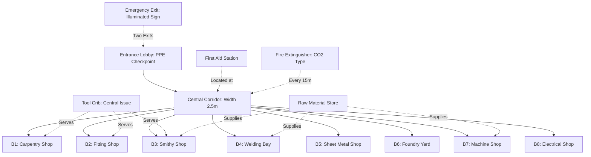
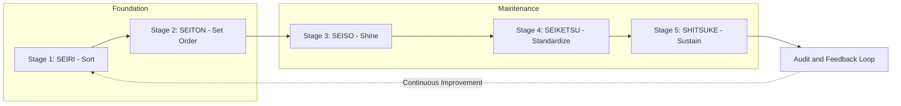
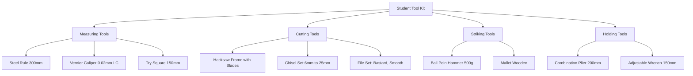

# General: Introduction to workshop practice

<!-- SECTION_1_START -->
# General Introduction to Workshop Practice

## 1.1 Formal Definition (KTU 2024 Syllabus Terminology)

**Workshop Practice** is a foundational, hands-on engineering discipline that introduces first-year B.Tech students to the **fundamental manufacturing processes**, **material handling techniques**, **standard hand tools**, **measuring instruments**, and **safety protocols** used across various engineering trades. As per the **KTU 2024 Scheme (Course Code: GCESL106)**, the workshop serves as a *practical laboratory* where theoretical concepts from engineering drawing, mechanics, and materials science are physically realized through structured fabrication, assembly, and testing activities.

> [!IMPORTANT]
> **KTU 2024 Syllabus Highlight:** Engineering Workshop is a *hands-on, activity-based* course evaluated primarily through **Continuous Evaluation (CE)** components such as viva-voce, practical records, and skill demonstrations, with no traditional End Semester Theory Examination.

### Core Objectives of Workshop Practice

1. **Skill Acquisition:** Develop manual dexterity and proficiency in operating basic engineering tools.
2. **Process Familiarization:** Expose students to **primary manufacturing processes** such as casting, forming, joining, and material removal.
3. **Safety Awareness:** Instill industrial-grade safety habits and **PPE (Personal Protective Equipment)** usage discipline.
4. **Material Literacy:** Introduce the physical, mechanical, and machining properties of **ferrous** and **non-ferrous** materials.
5. **Design Translation:** Bridge the gap between engineering drawings (GD\&P) and physical fabricated products.

---

## 1.2 Conceptual Analogy & Intuitive Overview

> [!NOTE]
> **Think of a Workshop as a "Kitchen for Engineers."**
> Just as a chef uses knives, pots, stoves, and ingredients to prepare a meal, an engineer uses chisels, saws, furnaces, and raw materials (wood, metal) to "cook up" a mechanical component. The *recipes* are the **manufacturing processes**, the *ingredients* are the **raw materials**, and the *utensils* are the **tools and machines**.

### Geometric / Spatial Intuition

Imagine a workshop as a **concentric activity zone**:

$$
\text{Workshop} = \underbrace{Z_1}_{\text{Storage}} \cup \underbrace{Z_2}_{\text{Machining}} \cup \underbrace{Z_3}_{\text{Assembly}} \cup \underbrace{Z_4}_{\text{Quality Check}}
$$

Where each $Z_i$ represents a *specialized working bay* dedicated to a specific manufacturing trade. The student (akin to an apprentice) must rotate through each zone, similar to a medical intern rotating through hospital departments.

---

## 1.3 Core Terminology Standard Metrics

| Term | Definition | Standard Unit |
|---|---|---|
| **PPE** | Personal Protective Equipment | Set (Helmet, Gloves, Goggles, Apron) |
| **Tolerance** | Permissible dimensional deviation | Millimetres ($\text{mm}$) or Micrometres ($\mu\text{m}$) |
| **Bench Vice** | Holding device fixed to a workbench | Capacity in $\text{mm}$ (e.g., $100\,\text{mm}$) |
| **MS** | Mild Steel (low-carbon steel, $0.15\text{--}0.25\%\,\text{C}$) | Grade designation |
| **GTAW** | Gas Tungsten Arc Welding (TIG) | Process name |

> [!VISUALIZATION CONTROL]
> **Concept:** Workshop Spatial Layout (Top-Down View)
> **GeoGebra / Desmos Input Equations:**
> * Define rectangular zones: $x \in [0,\, 30],\, y \in [0,\, 20]$ (overall workshop in metres).
> * Sub-zones: Carpentry $x \in [0,\,10]$; Fitting $x \in [10,\,20]$; Welding $x \in [20,\,27]$; Smithy $x \in [27,\,30]$.
> **Visual Description:** Students should observe a rectangular floor plan partitioned into colour-coded bays, with central aisles of width $\geq 2\,\text{m}$ for emergency evacuation.

---

<!-- SECTION_1_END -->

<!-- SECTION_2_START -->
# Deep Theoretical Analysis & KTU High-Yield Reference Sheet

## 2.1 Classification of Engineering Workshops

Modern engineering workshops are systematically classified based on the **primary manufacturing trade** they house. KTU 2024 syllabus mandates exposure to a minimum of **8 distinct trades** in a single semester.

### 2.1.1 Trades and Their Primary Processes

* **Carpentry Shop:** Primary process is *wood joining* using saws, planes, chisels, and measuring tapes. End products include wooden joints (Mortise \& Tenon, Dovetail, etc.).
* **Fitting Shop:** Material *removal* process using files, hacksaws, chisels, and bench vices to achieve precise dimensional tolerances (typically $\pm\,0.5\,\text{mm}$).
* **Smithy / Forging Shop:** *Forming* process — hot/cold deformation of MS rods into hooks, squares, hexagons, and chisels using a forge, hammer, and anvil.
* **Welding Shop:** *Joining* process — fusion of metals using **Arc Welding (SMAW)**, **Gas Welding (Oxy-Acetylene)**, or modern **GTAW/GMAW** techniques.
* **Sheet Metal Shop:** *Forming* of thin metal sheets (GI, Aluminium) into trays, funnels, and boxes using shears, rollers, and rivets.
* **Foundry Shop:** *Casting* process — molten metal poured into sand moulds to produce intricate shapes.
* **Machine Shop:** *Material removal* using power-driven machines (Lathe, Drilling, Milling, Grinding).
* **Electrical \& Electronics Shop:** Wiring practices, PCB soldering, circuit testing using multimeters and CROs.

---

## 2.2 The 5S Methodology (Industry Standard)

> [!IMPORTANT]
> The **5S** framework, originating from Japanese manufacturing (Toyota Production System), is the *gold standard* for workshop organization. KTU examiners frequently test this concept.

$$
\text{5S} = \text{Seiri} + \text{Seiton} + \text{Seiso} + \text{Seiketsu} + \text{Shitsuke}
$$

1. **Seiri (Sort):** Remove unnecessary items from the workbench.
2. **Seiton (Set in Order):** Arrange tools at *fixed, labelled locations* (Shadow Boards).
3. **Seiso (Shine):** Clean the workspace after every operation.
4. **Seiketsu (Standardize):** Apply uniform procedures and visual markers.
5. **Shitsuke (Sustain):** Develop self-discipline to maintain the above four S's.

---

## 2.3 KTU Formula / Concept Sheet (Cheat Sheet)

> [!NOTE]
> This is the **high-density reference table** for last-minute KTU exam revision. All quantities are in **SI Units** unless otherwise specified.

| Concept / Quantity | Formula / Definition | Standard Value / Unit |
|---|---|---|
| Workshop Illumination (Standard) | $E = \frac{\Phi}{A}$ | $\geq 300\,\text{lux}$ (General), $\geq 500\,\text{lux}$ (Precision work) |
| Air Changes per Hour (ACH) | $\text{ACH} = \frac{Q_{\text{vent}}}{V_{\text{room}}}$ | $\geq 15$ for Welding bays |
| Fire Extinguisher Reach Radius | $r_{\text{max}}$ | $\leq 15\,\text{m}$ (Class A) |
| Standard PPE Set | Helmet + Goggles + Gloves + Apron + Safety Shoes | 5 items mandatory |
| First Aid Response Time | $t_{\text{FA}}$ | $\leq 4\,\text{minutes}$ |
| Hacksaw Blade TPI (Teeth Per Inch) | $\text{TPI}$ for MS $14\text{--}18$, for Aluminium $24$ | $14\text{--}32$ |
| Forge Temperature (MS) | $T_{\text{forge}}$ | $800\text{--}1000\,^{\circ}\text{C}$ (Cherry Red) |
| Welding Arc Temperature (SMAW) | $T_{\text{arc}}$ | $3000\text{--}6000\,^{\circ}\text{C}$ |

> [!WARNING]
> **KTU Board Pitfall:** Students often confuse the units of *illumination* (lux) with *luminous flux* (lumen). Recall: $1\,\text{lux} = 1\,\text{lumen/m}^2$.

---

## 2.4 Real-World Engineering Utility

Workshop practice forms the **bedrock of the following industrial sectors**:

* **Automotive Manufacturing:** Body panel fabrication (Sheet Metal), chassis welding (SMAW), engine block casting (Foundry).
* **Aerospace:** Precision fitting of turbine blades, CNC machining, and composite layups.
* **Civil Construction:** Carpentry for formwork, bar bending (Smithy), and structural welding.
* **Electronics Manufacturing:** PCB soldering, cable harnessing, and prototyping.

The skills taught in a workshop are **directly transferable** to **Industry 4.0** environments, where knowledge of physical processes is essential for *digital twin* simulation and *additive manufacturing* (3D Printing) workflows.

---

<!-- SECTION_2_END -->

<!-- SECTION_3_START -->
# Step-by-Step Procedures & Implementation

## 3.1 Standard Workshop Safety Protocol (10-Point Checklist)

Every KTU workshop session **must** begin with a safety briefing. The following exhaustive checklist is the industry-standard adopted by the **Bureau of Indian Standards (BIS)** and aligned with the **Factories Act, 1948 (India)**.

### Step-by-Step Verification Sequence

1. **PPE Inspection:** Verify that *every* student is wearing:
   * **Helmet** (if overhead crane operation is active)
   * **Safety Goggles** (ANSI Z87.1 rated)
   * **Cut-resistant Gloves** (Level 3 EN388)
   * **Leather Apron** (for welding/forge work)
   * **Steel-toed Safety Shoes** (IS 15298)

2. **Tool Inventory Check:** Each tool is logged in the *Tool Issue Register* with student name, roll number, and timestamp.

3. **Workbench Clearance:** Ensure a minimum $\geq 600\,\text{mm}$ of clear space on the benchtop for safe tool operation.

4. **Electrical Safety Audit:** Verify that all machine tools are properly **earthed** (resistance $\leq 1\,\Omega$) and that **ELCB (Earth Leakage Circuit Breaker)** of rating $30\,\text{mA}$ is functional.

5. **Fire Extinguisher Verification:** Check the pressure gauge on $\text{CO}_2$ extinguishers ($\geq 50\,\text{bar}$) and ensure they are within the *expiry date* (typically $5\text{--}10$ years).

6. **Ventilation Assessment:** For welding bays, confirm exhaust fans are operational (ACH $\geq 15$).

7. **First Aid Kit Audit:** Verify contents — *antiseptic, cotton, bandages, burnol, scissors, tweezers* — and the presence of an **eyewash station**.

8. **Material Storage Check:** Flammable liquids (thinners, kerosene) must be stored in **flammable cabinets** (FM Approved) away from heat sources.

9. **Emergency Exit Verification:** All exit doors must be **unobstructed**, with **illuminated EXIT signage** (green, running man symbol).

10. **Instructor's Final Go/No-Go:** The shop instructor must announce *"Bay Clear, Operation Authorized"* before any tool is engaged.

> [!IMPORTANT]
> **Disciplinary Action:** Failure to comply with **any** of the above steps can lead to immediate suspension from the workshop session and a **zero mark** in the Continuous Evaluation component.

---

## 3.2 Detailed Comparative Matrix: Workshop Trades

The following exhaustive table maps each trade to its **primary process**, **typical tools**, **materials handled**, **safety hazards**, and **KTU practical exam artifacts**.

| Trade | Primary Process | Key Tools | Materials | Top Hazard | KTU Exam Artefact |
|---|---|---|---|---|---|
| **Carpentry** | Joining / Cutting | Saw, Plane, Chisel, Try-Square | Teak, Pine, Plywood | Splinters, Kickback | Mortise \& Tenon joint |
| **Fitting** | Material Removal | Hacksaw, File, V-Block, Vernier | MS Flat $50 \times 25\,\text{mm}$ | Sharp edges, Eye injury | Male-Female / V-Block job |
| **Smithy** | Hot Forming | Hammer, Anvil, Tongs, Swage | MS Rod $\phi\,12\,\text{mm}$ | Burns, Spark splash | Square cross-section forging |
| **Welding** | Fusion Joining | Arc Welder, Electrode Holder, Helmet | MS Plate $3\,\text{mm}$ | Arc-flash, UV radiation, Fumes | Lap / Butt joint bead |
| **Sheet Metal** | Cold Forming | Shear, Stake, Mallet, Rivet Set | GI Sheet $0.5\,\text{mm}$ | Edge cuts, Crush injury | Square tray / Funnel |
| **Foundry** | Casting | Moulding Box, Patterns, Riddle | Green Sand, MS Scrap | Explosion (moisture), Burn | Sand mould with pattern |
| **Machine Shop** | Subtractive | Lathe, Drill, Grinder | MS Cylinder $\phi\,40\,\text{mm}$ | Entanglement, Chips | Stepped shaft (Lathe) |
| **Electrical** | Wiring / Soldering | Wire Stripper, Soldering Iron, Multimeter | Copper wire, PCB | Electric shock, Lead fumes | House-wiring circuit |

---

## 3.3 Standard Operating Procedure (SOP): Filing Operation

> [!NOTE]
> This is a **canonical KTU practical exam procedure** for the Fitting Shop. Students are graded on *methodology* and *dimensional accuracy*.

### Phase 1: Marking (3 minutes)

1. Clean the MS flat using an emery cloth (grit $80$).
2. Apply marking blue (dye) uniformly over a $50 \times 25\,\text{mm}$ region.
3. Use a **scriber** and **steel rule** to mark the required dimensions with an accuracy of $\pm 0.5\,\text{mm}$.
4. Use a **height gauge** or **surface plate** to transfer the line precisely.

### Phase 2: Sawing (5 minutes)

1. Clamp the workpiece in a **bench vice** with jaws $\geq 10\,\text{mm}$ above the cutting line.
2. Select a hacksaw blade: $\text{TPI} = 18$ for MS.
3. Apply $30\text{--}40$ strokes per minute with even, moderate pressure.
4. Maintain a **stroke length of $50\text{--}60\,\text{mm}$**; full blade utilization prevents breakage.

### Phase 3: Filing (10 minutes)

1. Mount the **file** in a wooden handle (mandatory).
2. Use a **double-cut bastard file** for rough removal, followed by a **single-cut smooth file** for finishing.
3. File across the workpiece in a *diagonal* direction; lift on the return stroke.
4. Periodically check flatness on the **surface plate** using a **scriber line-up test**.

### Phase 4: Inspection (2 minutes)

1. Measure the final dimensions using a **Vernier Caliper** (LC $= 0.02\,\text{mm}$).
2. Verify flatness using a **try-square** (squareness) and **feeler gauge** (flatness).
3. Tolerance grade: $\pm 0.5\,\text{mm}$ is the **KTU 2024 minimum benchmark**; $\pm 0.1\,\text{mm}$ earns full marks.

---

<!-- SECTION_3_END -->

<!-- SECTION_4_START -->
# Structural Diagrams & Schematics

## 4.1 Workshop Layout Architecture (Block Topology)

The following **Mermaid flowchart** depicts the canonical top-down spatial architecture of a multi-bay KTU engineering workshop.

**Key Observations for Students:**

* All $8$ specialized bays (*B1 to B8*) are accessible from the *Central Corridor* $B$.
* The *Tool Crib* $D1$ is a **shared resource hub** — a typical *hub-and-spoke* logistical model.
* *Safety infrastructure* ($E1, E2, E3$) is **redundantly distributed** to ensure that no workstation is more than $15\,\text{m}$ from a fire extinguisher.

---

## 4.2 Sequential Processing Topology: 5S Implementation

The following **Mermaid sequence diagram** illustrates the *temporal flow* of implementing the **5S methodology** in a workshop environment.

**Engineering Interpretation:**

* The system exhibits a **cyclical (closed-loop) control architecture**, analogous to a *PID controller* in classical control theory.
* The *Foundation* subgraph ($P1, P2$) is a *one-time setup* phase.
* The *Maintenance* subgraph ($P3, P4, P5$) is a *continuous execution* phase requiring *sustained discipline*.

---

## 4.3 Tool-Kit Inventory Block Diagram

**Notes on Tool Selection:**

* **Least Count (LC)** is a critical parameter. For a Vernier Caliper:
$$
\text{LC} = \frac{\text{Smallest Main Scale Division (MSD)}}{\text{Number of Vernier Scale Divisions (VSD)}}
$$
For a standard metric Vernier: $\text{LC} = \frac{1\,\text{mm}}{50} = 0.02\,\text{mm}$.

---

<!-- SECTION_4_END -->

<!-- SECTION_5_START -->
# KTU 2024 Scheme Examination Question Bank

## 5.1 Part A: Short-Answer Questions (3 Marks Each)

> [!NOTE]
> **KTU Pattern:** Direct conceptual questions from the module syllabus. Answer length: $3\text{--}5$ lines.

### Q1. `[KTU University Exam - July 2024]` (CO1, Remember)

**Define the term "Workshop Practice" and list any four types of engineering workshops.**

**Model Answer (Valuation Key - 3 Marks):**

* **Definition (1 Mark):** *Workshop Practice is a practical engineering discipline that imparts hands-on training in various manufacturing trades, focusing on the use of hand tools, machines, and materials to fabricate components as per engineering drawings and specifications.*
* **Four Workshops (2 Marks — 0.5 each):**
  1. **Carpentry Shop** — Wood joining and cutting.
  2. **Fitting Shop** — Precision material removal and assembly.
  3. **Smithy / Forging Shop** — Hot/cold forming of metals.
  4. **Welding Shop** — Fusion joining of metals.

---

### Q2. `[KTU University Exam - Dec 2023]` (CO1, Understand)

**What is PPE? List any four personal protective equipment items used in a workshop.**

**Model Answer (Valuation Key - 3 Marks):**

* **PPE Definition (1 Mark):** *PPE stands for Personal Protective Equipment — specialized clothing or gear worn by workers to minimize exposure to specific occupational hazards in a workshop.*
* **Four PPE Items (2 Marks — 0.5 each):**
  1. **Safety Goggles** — protect eyes from flying chips and arc-flash.
  2. **Cut-resistant Gloves** — protect hands from sharp edges and hot metal.
  3. **Leather Apron** — protects the torso from sparks and spatter.
  4. **Safety Shoes (Steel-toed)** — protect feet from heavy falling objects.

---

## 5.2 Part B: Long-Answer Questions (14 Marks Each)

> [!IMPORTANT]
> **KTU Pattern:** Each Part B question carries $14$ marks and contains **two sub-parts (a) and (b)** of $7$ marks each. Students must answer **either full Question A or full Question B**.

---

### Question A (14 Marks) `[KTU University Exam - July 2024]` (CO1, Understand + Apply)

#### Part (a) — 7 Marks (Understand)

**Explain the 5S methodology of workshop organization. Mention the full form and purpose of each 'S'.**

**Model Answer (Valuation Key - 7 Marks):**

The **5S methodology** is a systematic approach to workplace organization, originating from the Japanese Toyota Production System.

* **1. Seiri — Sort (1.5 Marks):** *Purpose:* Remove all unnecessary items from the workplace. Keep only what is required for the immediate task. *Example:* Discarding broken tools, obsolete manuals.
* **2. Seiton — Set in Order (1.5 Marks):** *Purpose:* Arrange necessary items in a logical, labelled, and easily accessible manner. *Example:* Shadow boards, labelled drawers, FIFO racks.
* **3. Seiso — Shine (1 Mark):** *Purpose:* Clean the workplace thoroughly after every operation. *Example:* Wiping the machine bed, sweeping chips, and lubricating moving parts.
* **4. Seiketsu — Standardize (1.5 Marks):** *Purpose:* Establish uniform standards and visual management for the first three S's. *Example:* Colour-coded bins, standard operating procedures (SOPs), checklists.
* **5. Shitsuke — Sustain (1.5 Marks):** *Purpose:* Develop the discipline and habit to consistently follow the 5S practices. *Example:* Regular audits, training sessions, and management commitment.

#### Part (b) — 7 Marks (Apply)

**A workshop is to be designed for a college lab housing 60 students per batch. As a safety engineer, propose a layout plan covering 8 trades, with proper safety infrastructure. Justify the placement of fire extinguishers and ventilation requirements for the welding bay.**

**Model Answer (Valuation Key - 7 Marks):**

* **Overall Workshop Layout (2 Marks):** The workshop should be a rectangular hall of dimensions $\approx 30\,\text{m} \times 20\,\text{m}$ with a *central corridor* of width $2.5\,\text{m}$. Each of the $8$ trades (Carpentry, Fitting, Smithy, Welding, Sheet Metal, Foundry, Machine Shop, Electrical) occupies a separate bay of $\approx 7.5\,\text{m} \times 10\,\text{m}$.
* **Fire Extinguisher Placement (2 Marks):** *Justification:* As per the **National Building Code of India (NBC 2016)**, fire extinguishers must be placed such that the travel distance from any point to an extinguisher does **not exceed $15\,\text{m}$**. Hence, place *Class A* extinguishers at $15\,\text{m}$ intervals along the corridor, and dedicated *Class B* (CO$_2$) extinguishers within the welding bay for electrical and flammable liquid fires.
* **Welding Bay Ventilation (2 Marks):** *Justification:* The welding process generates hazardous fumes (ozone, nitrogen oxides, and metal particulates) and **UV radiation**. The welding bay must have:
  * **Local Exhaust Ventilation (LEV)** at the source (fume extraction arm).
  * **General ventilation** of $\geq 15$ **air changes per hour (ACH)**, calculated as:
$$
\text{ACH} = \frac{Q_{\text{vent}}}{V_{\text{room}}} \geq 15
$$
For a $7.5 \times 10 \times 4\,\text{m}$ bay: $V_{\text{room}} = 300\,\text{m}^3$. Therefore, $Q_{\text{vent}} \geq 4500\,\text{m}^3/\text{hr}$ (or $\geq 1250\,\text{L/s}$).
* **First Aid and Emergency Exits (1 Mark):** A *First Aid Station* must be located at the central corridor, with **two clearly marked emergency exits** at opposite ends, fitted with *illuminated EXIT signage* and *panic bars*.

---

### Question B (14 Marks) `[KTU University Exam - Dec 2023]` (CO2, Understand + Apply)

#### Part (a) — 7 Marks (Understand)

**List and explain the major manufacturing processes studied in an engineering workshop. Differentiate between forming and joining processes with one example each.**

**Model Answer (Valuation Key - 7 Marks):**

* **Major Manufacturing Processes (4 Marks):**
  1. **Casting (Foundry):** Molten metal is poured into a sand mould to obtain a desired shape. *Example:* Sand casting of an engine block.
  2. **Forming (Smithy):** Metal is plastically deformed under heat or pressure. *Example:* Forging a square rod into a chisel.
  3. **Joining (Welding):** Two metal pieces are fused together using heat. *Example:* SMAW arc welding of MS plates.
  4. **Material Removal (Fitting/Machining):** Excess material is removed to achieve dimensions. *Example:* Filing a flat surface to $\pm 0.1\,\text{mm}$ tolerance.
  5. **Sheet Metal Forming:** Thin sheets are cut, bent, and joined. *Example:* Making a GI square tray.
* **Difference: Forming vs. Joining (3 Marks):**

| Parameter | Forming Process | Joining Process |
|---|---|---|
| Definition | Plastic deformation of a single piece | Permanent union of two or more pieces |
| Material Change | Shape change, mass conserved | No mass change at joint; filler may be added |
| Temperature | Hot, cold, or warm | High (fusion) or ambient (adhesive) |
| Example | Forging a hook from MS rod | Arc welding two MS plates by lap joint |

#### Part (b) — 7 Marks (Apply)

**During a fitting operation, a student is required to fabricate a $50\,\text{mm} \times 25\,\text{mm}$ MS flat with a tolerance of $\pm 0.5\,\text{mm}$. Describe the step-by-step procedure and list the tools required with their functions.**

**Model Answer (Valuation Key - 7 Marks):**

* **Step-by-Step Procedure (4 Marks):**
  1. **Cleaning (0.5 Marks):** Clean the MS flat with emery cloth to remove rust and scale.
  2. **Marking (1 Mark):** Apply marking blue; use a steel rule and scriber to mark the $50 \times 25\,\text{mm}$ outline with a $\pm 0.5\,\text{mm}$ accuracy.
  3. **Sawing (1 Mark):** Clamp the workpiece in a bench vice; use a hacksaw ($18$ TPI) to cut along the marked line. Maintain $30\text{--}40$ strokes/min.
  4. **Filing (1 Mark):** Use a double-cut bastard file for bulk removal, followed by a single-cut smooth file for finishing. Check periodically on a surface plate.
  5. **Inspection (0.5 Marks):** Measure final dimensions using a Vernier Caliper (LC $= 0.02\,\text{mm}$). Verify squareness using a try-square.
* **Tools Required with Functions (3 Marks — 0.5 each):**

| Tool | Function |
|---|---|
| **Bench Vice** | Holds the workpiece rigidly during cutting and filing |
| **Steel Rule ($300\,\text{mm}$)** | Linear measurement up to $1\,\text{mm}$ accuracy |
| **Hacksaw Frame + Blades** | Cuts MS flat along the marked line |
| **Files (Bastard + Smooth)** | Removes metal to achieve final dimensions and surface finish |
| **Vernier Caliper (LC $0.02\,\text{mm}$)** | Measures final dimensions with high precision |
| **Try-Square ($150\,\text{mm}$)** | Verifies squareness of edges (perpendicularity) |

> [!WARNING]
> **KTU Examiner's Valuation Pitfall:**
> * Do **not** skip writing the *least count* of the Vernier Caliper. Examiners deduct $0.5\text{--}1$ mark if LC is omitted.
> * Failing to mention *safety goggles* during sawing and filing results in loss of marks in the CE component.
> * Students often confuse *hacksaw blade TPI* selection: $18$ TPI is correct for MS; $32$ TPI is for thin sheets.

---

## 5.3 Topic Recap & Important Things to Remember

> [!NOTE]
> **High-Density Revision Checklist** for the KTU 2024 Engineering Workshop Module 1.

* **Workshop Definition:** A practical lab for hands-on training in manufacturing trades.
* **Primary Trades (8):** Carpentry, Fitting, Smithy, Welding, Sheet Metal, Foundry, Machine Shop, Electrical.
* **PPE = 5 Items:** Helmet, Goggles, Gloves, Apron, Safety Shoes.
* **5S = Seiri + Seiton + Seiso + Seiketsu + Shitsuke** (Sort, Set, Shine, Standardize, Sustain).
* **Hacksaw TPI:** $18$ for MS, $24$ for Aluminium, $32$ for thin sheets.
* **Forge Temperature (MS):** $800\text{--}1000\,^{\circ}\text{C}$ (cherry red).
* **Welding Arc Temp (SMAW):** $3000\text{--}6000\,^{\circ}\text{C}$.
* **Fire Extinguisher Reach:** $\leq 15\,\text{m}$ (Class A).
* **Welding Bay Ventilation:** $\text{ACH} \geq 15$ (general), LEV at source.
* **Vernier Caliper LC:** $0.02\,\text{mm}$ (standard metric, $50$ VSDs).
* **Earth Resistance:** $\leq 1\,\Omega$ for machine tools.
* **ELCB Rating:** $30\,\text{mA}$ for personnel protection.
* **First Aid Response:** $\leq 4\,\text{minutes}$.
* **Illumination:** $\geq 300\,\text{lux}$ (general), $\geq 500\,\text{lux}$ (precision).
* **Primary Processes:** Casting, Forming, Joining, Material Removal.
* **KPI for Quality:** Dimensional tolerance ($\pm 0.5\,\text{mm}$ minimum for fitting).
* **Safety First Rule:** *No PPE = No Workshop Entry.*
* **BIS Standard:** All safety equipment must conform to BIS / IS specifications (e.g., IS 15298 for safety shoes).
* **Factories Act 1948:** Statutory requirement for all industrial workshop safety protocols in India.
* **Industry 4.0 Bridge:** Workshop skills form the physical foundation for digital twin simulation, CNC, and 3D printing.

---

<!-- SECTION_5_END -->
