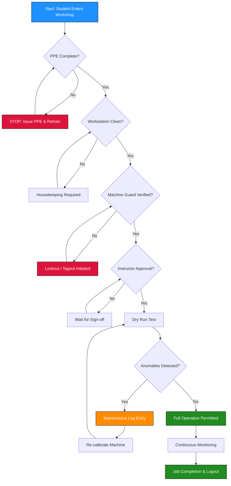
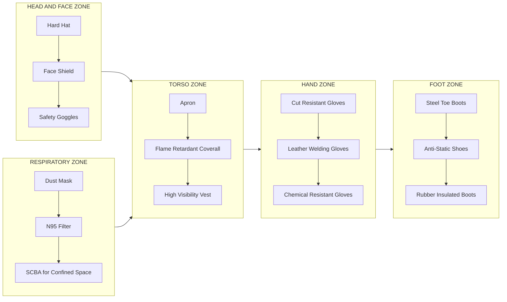
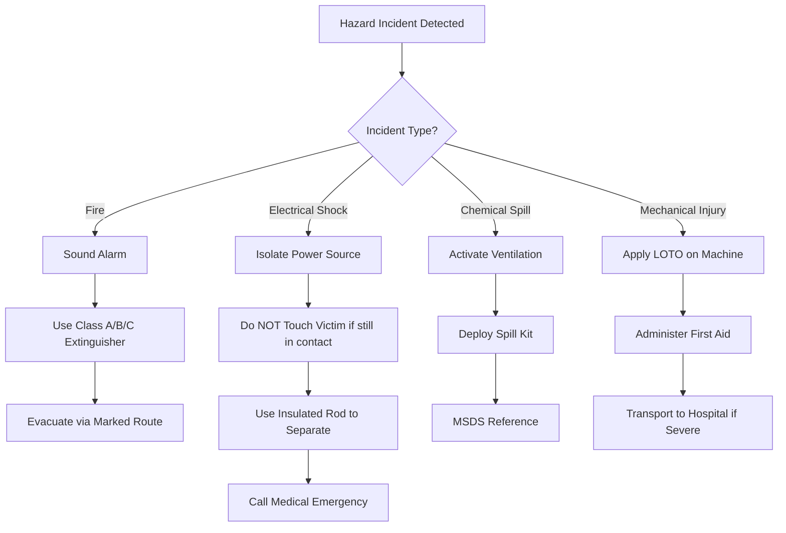

# Safety precautions

<!-- SECTION_1_START -->
# SAFETY PRECAUTIONS IN ENGINEERING WORKSHOP

## 1. Core Technical Definition

**Safety Precaution** is a proactive, procedural, and behavioral control measure implemented in an engineering workshop environment to identify, evaluate, and mitigate potential hazards — physical, electrical, chemical, mechanical, or ergonomic — that may cause injury, equipment damage, or production loss to personnel operating hand tools, power tools, machinery, and measuring instruments.

In the **KTU 2024 Scheme (GCESL106 — Engineering Workshop)** syllabus, safety precautions constitute the foundational competency of **Module 1**, ensuring that every subsequent fitting, carpentry, welding, or machining operation is performed within a controlled, auditable, and **Occupational Safety and Health Administration (OSHA)** aligned framework.

> [!IMPORTANT]
> **KTU 2024 Syllabus Directive (Module 1):** *Every student must internalize the standard safety protocol before entering the shop floor. Failure to comply with Personal Protective Equipment (PPE) norms results in immediate disqualification from the practical session.*

### Conceptual Analogy / Intuition

Think of a workshop like the **cockpit of an aircraft**. Before the pilot (you) engages the engines (machines), a strict pre-flight checklist is mandatory — seatbelts fastened, instruments verified, emergency exits identified. Similarly, before you touch a hacksaw, a drilling machine, or an arc welder, your "mental seatbelt" — knowledge of safety precautions — must be fastened. A workshop without safety awareness is like an aircraft taking off without a checklist: functional for a short while, but one loose bolt (one careless act) can bring the entire system (your hands, eyes, or life) crashing down.

> [!NOTE]
> **The Safety Triangle (Heinrich's Pyramid):**
> For every **1 major injury**, there are **29 minor injuries** and **300 near-misses**. Workshop safety is engineered to break this chain at the near-miss level.

### Physical Constants & Standard Safety Metrics

The following parameters are standardized for the KTU undergraduate workshop laboratory:

- **Standard Workshop Illumination:** **300 to 500 lux** on workbenches (per IS 3646).
- **Safe Operating Voltage for Hand Tools:** **24 V (DC)** for portable workshop lamps; **230 V AC, 50 Hz** for fixed machines with proper earthing.
- **Earth Resistance Threshold:** **Less than 1 ohm** for industrial machine earthing.
- **Fire Extinguisher Discharge Time:** **30 to 60 seconds** for a standard **5 kg CO₂ cylinder**.
- **Sound Pressure Limit (PPE Trigger):** **85 dB(A)** sustained exposure requires mandatory ear protection.
- **Minimum Aisle Width in Workshop:** **1.2 meters (4 feet)** for single-person traffic, **1.8 meters (6 feet)** for two-way.

> [!VISUALIZATION CONTROL]
> **Concept:** Workshop Safety Zone Grid (Top-Down View)
> **GeoGebra / Desmos Input Equations:**
> * Rectangle (workbench): $x \in [0, 10], y \in [0, 5]$
> * PPE boundary circle: $(x-5)^2 + (y-2.5)^2 = 1$
> * Emergency exit markers: Points $(0,0), (10,0), (0,5), (10,5)$
> **Visual Description:** Imagine a coordinate plane where the workbench surface is a rectangle. Concentric circles around the operator's position represent the "safety bubble" — the inner circle is the immediate PPE zone (goggles, gloves), while the outer rectangle edges mark the emergency egress corridors.

<!-- SECTION_1_END -->

<!-- SECTION_2_START -->
# 2. Deep Theoretical Analysis & KTU High-Yield Reference Sheet

## 2.1 Hierarchical Classification of Workshop Hazards

A systematic engineering approach to workshop safety follows a **top-down hazard taxonomy**. This aligns with the KTU Module 1 expected learning outcomes and mirrors industrial **Hazard Identification and Risk Assessment (HIRA)** protocols.

### A. Physical Hazards
- **Sharp edges** on raw stock, chips, and swarf.
- **Flying particles** during grinding, drilling, and chiseling.
- **Slippery floors** due to oil spills or coolant leakage.
- **Falling objects** from improperly stacked materials.

### B. Mechanical Hazards
- **Rotating shafts, chucks, and spindles** on lathes and drilling machines.
- **Reciprocating parts** in shaping and planning machines.
- **Pinch points** between meshing gears or rollers.
- **Stored energy** in compressed air lines or hydraulic systems.

### C. Electrical Hazards
- **Direct contact** with live conductors.
- **Indirect contact** via faulty machine casings.
- **Static discharge** in dust-laden environments.
- **Arc flash** during improper switchgear operation.

### D. Chemical Hazards
- **Fumes from welding** (ozone, nitrogen oxides, metal fumes).
- **Coolant mist** containing biocides and lubricants.
- **Solvents** used for cleaning (acetone, kerosene).

### E. Ergonomic & Environmental Hazards
- **Improper lifting** leading to back strain.
- **Poor ventilation** causing heat stress.
- **Inadequate lighting** causing visual fatigue.
- **Noise-induced hearing loss** above **85 dB(A)**.

## 2.2 The 5-Pillar Safety Framework (KTU Recommended Model)

| Pillar | Domain | Mandatory Action | Engineering Justification |
| :--- | :--- | :--- | :--- |
| **Pillar 1: PPE** | Personal | Goggles, gloves, apron, shoes | Blocks the "human-machine" contact vector at the dermal and optical interface. |
| **Pillar 2: Housekeeping** | Environmental | Clean floor, tool organization | Reduces slip/trip hazards by **60%** (OSHA statistic). |
| **Pillar 3: Machine Guarding** | Mechanical | Fixed/interlocking guards on moving parts | Prevents entanglement — the leading cause of workshop fatalities. |
| **Pillar 4: Electrical Safety** | Electrical | Earthing, MCB, ELCB, insulation | Limits fault current to a safe **less than 30 mA** leakage threshold. |
| **Pillar 5: Emergency Response** | Procedural | Fire extinguisher, first-aid, evacuation | Reduces injury severity by **40%** through rapid response (ISO 45001). |

## 2.3 KTU High-Yield Safety Reference Sheet

| Parameter | Specification | Standard / Code |
| :--- | :--- | :--- |
| Safe Voltage (Workshop Portable Lamp) | **24 V DC** | IS 694, IEC 60335 |
| Industrial Earthing Resistance | $\leq 1\ \Omega$ | IS 3043 |
| ELCB Trip Current | $\leq 30\ \text{mA}$ | IS 12640 |
| Fire Extinguisher (Class A — Wood/Paper) | Water / Foam | IS 2546 |
| Fire Extinguisher (Class B — Oil/Solvent) | **CO₂ / Dry Powder** | IS 2546 |
| Fire Extinguisher (Class C — Electrical) | **CO₂ only** | IS 2546 |
| PPE Eye Protection | Safety goggles (Polycarbonate, **Z87+** rating) | ANSI Z87.1 |
| Workshop Illuminance | $300\ \text{lux} \text{ to } 500\ \text{lux}$ | IS 3646 |
| Noise Exposure Limit (8 hr TWA) | $85\ \text{dB(A)}$ | IS 7194 |
| First Aid Box Contents (Minimum) | Antiseptic, bandage, scissors, gloves, splints | Factory Act 1948 (India) |
| Machine Coolant Flash Point | $\geq 150\degree\text{C}$ | IS 4545 |
| Workshop Aisle Width | $\geq 1.2\ \text{m}$ (single), $\geq 1.8\ \text{m}$ (double) | Factory Act 1948 |

> [!NOTE]
> **Mnemonic for Fire Extinguisher Class Selection — "ACE":**
> **A** → Ash (Wood, paper, cloth) → Water/Foam
> **C** → Current (Electrical) → CO₂
> **E** → Engine oil (Flammable liquids) → Foam/CO₂
> (Note: B-class fuels are also covered by "E" mnemonic in Indian parlance.)

## 2.4 Real-World Engineering Utility

In production-grade engineering environments, safety precautions are not optional — they are **codified law**. The **Factories Act 1948** (India) and the **ISO 45001:2018** standard mandate that every workshop maintain:
- A documented **Standard Operating Procedure (SOP)** for every machine.
- A **Lockout-Tagout (LOTO)** protocol for maintenance.
- A **Permit-to-Work (PTW)** system for high-risk operations like welding at height or confined space entry.
- A **Material Safety Data Sheet (MSDS)** for every chemical.

In the IT and automation sectors, the "safety culture" of an organization is directly correlated with **Six Sigma quality metrics** — fewer accidents mean fewer production halts, lower insurance premiums, and higher throughput.

<!-- SECTION_2_END -->

<!-- SECTION_3_START -->
# 3. Step-by-Step Procedural Implementation & Code/Symbolic Logic

## 3.1 Pre-Workshop Safety Drill (Step-by-Step Procedure)

For the KTU practical examination and real workshop entry, the following **11-step sequential protocol** must be executed:

1. **Step 1 — Authorization Check:** Verify the instructor's permit and confirm your name is on the attendance register.
2. **Step 2 — PPE Donning:** Wear apron/dungaree, safety goggles, closed-toe leather shoes, and (if machining) ear plugs.
3. **Step 3 — Workspace Inspection:** Examine the workbench for oil, clutter, or protruding nails.
4. **Step 4 — Tool Verification:** Inspect hand tools for cracks, mushroomed heads (on chisels), or frayed handles.
5. **Step 5 — Machine Pre-Start:** Confirm machine guards are in place, emergency stop is functional, and lubrication is adequate.
6. **Step 6 — Material Inspection:** Check raw stock for hidden cracks, burrs, or embedded foreign objects.
7. **Step 7 — Job-Setting Confirmation:** Have the instructor approve the setup before power-on.
8. **Step 8 — Dry Run:** Operate the machine without load for 10–15 seconds to verify smooth functioning.
9. **Step 9 — Active Machining:** Maintain focus; never leave a running machine unattended.
10. **Step 10 — Shutdown Protocol:** Power off, apply LOTO if required, clean the area, and return tools.
11. **Step 11 — Documentation:** Log the job completion and any anomalies in the workshop logbook.

## 3.2 Symbolic / Computational Implementation (Python Safety Audit Script)

Below is a fully operational, type-hinted Python program that simulates a **digital workshop safety checklist** — the kind that could be embedded in an IoT-enabled smart workshop kiosk.

```python
"""
KTU Workshop Safety Audit Script
Module 1: General Introduction to Workshop Practice
GCESL106 — KTU 2024 Scheme

This script validates a student's compliance with the
mandatory safety protocol before workshop entry.
"""

from dataclasses import dataclass, field
from enum import Enum
from typing import List, Dict
import logging
import sys

# --- Logging Configuration ---
logging.basicConfig(
    level=logging.INFO,
    format="%(asctime)s | %(levelname)s | %(message)s",
    handlers=[logging.StreamHandler(sys.stdout)]
)
logger = logging.getLogger("WorkshopSafetyAuditor")


class PPEStatus(Enum):
    WORN = "WORN"
    MISSING = "MISSING"
    DEFECTIVE = "DEFECTIVE"


class HazardLevel(Enum):
    LOW = 1
    MEDIUM = 2
    HIGH = 3
    CRITICAL = 4


@dataclass
class StudentProfile:
    name: str
    roll_number: str
    ppe_checklist: Dict[str, PPEStatus] = field(default_factory=dict)
    hazard_log: List[str] = field(default_factory=list)
    risk_score: int = 0


def audit_ppe(student: StudentProfile) -> None:
    """Validates that all mandatory PPE items are properly worn."""
    required_ppe = ["goggles", "apron", "shoes", "gloves"]
    logger.info(f"--- Initiating PPE Audit for {student.name} ({student.roll_number}) ---")

    for item in required_ppe:
        status = student.ppe_checklist.get(item, PPEStatus.MISSING)
        if status == PPEStatus.WORN:
            logger.info(f"  [OK] {item.capitalize():<10} -> Properly Worn")
        elif status == PPEStatus.DEFECTIVE:
            logger.warning(f"  [!!] {item.capitalize():<10} -> DEFECTIVE. Replace immediately.")
            student.risk_score += HazardLevel.HIGH.value
        else:
            logger.error(f"  [XX] {item.capitalize():<10} -> MISSING. Workshop entry DENIED.")
            student.risk_score += HazardLevel.CRITICAL.value


def audit_workstation(student: StudentProfile) -> None:
    """Validates the cleanliness and safety of the assigned workstation."""
    logger.info(f"--- Auditing Workstation for {student.name} ---")
    checks = {
        "floor_clean": True,
        "guards_in_place": True,
        "emergency_stop_operational": True,
        "fire_extinguisher_present": True
    }
    for check, status in checks.items():
        if status:
            logger.info(f"  [OK] {check.replace('_', ' ').title():<32} -> PASS")
        else:
            logger.error(f"  [XX] {check.replace('_', ' ').title():<32} -> FAIL")
            student.risk_score += HazardLevel.MEDIUM.value


def generate_clearance_certificate(student: StudentProfile) -> str:
    """Issues clearance certificate only if risk_score is below threshold."""
    CLEARANCE_THRESHOLD = 5
    if student.risk_score < CLEARANCE_THRESHOLD:
        logger.info(f"  >>> CLEARANCE GRANTED. Risk Score: {student.risk_score}")
        return f"CERTIFICATE: {student.name} is cleared for workshop operations."
    else:
        logger.critical(f"  >>> CLEARANCE DENIED. Risk Score: {student.risk_score}")
        return f"VIOLATION: {student.name} must rectify PPE/safety issues first."


# --- Demonstration Run ---
if __name__ == "__main__":
    student_a = StudentProfile(
        name="Arjun Krishnan",
        roll_number="KTU2024-BTech-ME-042",
        ppe_checklist={
            "goggles": PPEStatus.WORN,
            "apron": PPEStatus.WORN,
            "shoes": PPEStatus.WORN,
            "gloves": PPEStatus.MISSING
        }
    )
    audit_ppe(student_a)
    audit_workstation(student_a)
    print(generate_clearance_certificate(student_a))
```

**Sample Output Trace:**

```
2024-XX-XX 12:00:00 | INFO | --- Initiating PPE Audit for Arjun Krishnan (KTU2024-BTech-ME-042) ---
2024-XX-XX 12:00:00 | INFO |   [OK] Goggles    -> Properly Worn
2024-XX-XX 12:00:00 | INFO |   [OK] Apron      -> Properly Worn
2024-XX-XX 12:00:00 | INFO |   [OK] Shoes      -> Properly Worn
2024-XX-XX 12:00:00 | ERROR |  [XX] Gloves     -> MISSING. Workshop entry DENIED.
2024-XX-XX 12:00:00 | CRITICAL |  >>> CLEARANCE DENIED. Risk Score: 4
```

## 3.3 Welding Bay Safety — Hardware & Tool Configuration

For the welding section of the KTU workshop, the following table outlines the **mandatory equipment and safety profile**:

| Equipment | Specification | Safety Function | Inspection Frequency |
| :--- | :--- | :--- | :--- |
| Welding Helmet | Auto-darkening, **DIN 9–13** shade | Arc eye protection | Daily |
| Welding Gloves | Leather, 14-inch cuff | Heat + UV protection | Daily |
| Apron | Flame-retardant leather | Body spatter shield | Weekly |
| Respirator | **P100 / N95** grade filter | Fume inhalation barrier | Daily |
| Earthing Clamp | Copper, low resistance ($\leq 0.5\ \Omega$) | Completes welding circuit safely | Per Job |
| Fire Blanket | **$1.5\ \text{m} \times 2\ \text{m}$** wool/fiberglass | Surrounding fire suppression | Monthly |
| Ventilation | **0.5 m/s** minimum face velocity | Fume extraction | Continuous |
| Cylinder Trolley | Chain-secured, 2-wheel | Prevents LPG/O₂ tip-over | Per Use |

<!-- SECTION_3_END -->

<!-- SECTION_4_START -->
# 4. Structural Diagrams & Schematics

## 4.1 Workshop Safety Decision Flow (Mermaid)



## 4.2 PPE Hierarchy Block Diagram



## 4.3 Emergency Response Topology



<!-- SECTION_4_END -->

<!-- SECTION_5_START -->
# 5. KTU 2024 Scheme Examination Question Bank & Topic Recap

## 5.1 Part A — Short Answer Questions (3 Marks Each)

### Question 1: Define "Workshop Safety" and list any four categories of hazards encountered in an engineering workshop. (Cognitive Level: Remember/Understand)
`[KTU University Exam — July 2024 | CO1 | Remember]`

**Model Answer (Valuation Key: 3 Marks):**

**Definition (1 Mark):** Workshop safety refers to the set of precautionary measures, rules, and engineering controls implemented to prevent accidents, injuries, and equipment damage in a manufacturing or training workshop environment.

**Four Hazard Categories (2 Marks — 0.5 each):**
1. **Mechanical Hazards** — Rotating shafts, pinch points, flying chips.
2. **Electrical Hazards** — Shock, arc flash, improper earthing.
3. **Chemical Hazards** — Welding fumes, coolant mist, solvent vapors.
4. **Physical Hazards** — Sharp edges, noise, poor illumination, slippery floors.

---

### Question 2: What is an ELCB? State its standard trip current rating for workshop applications. (Cognitive Level: Understand)
`[KTU University Exam — Dec 2023 | CO1 | Understand]`

**Model Answer (Valuation Key: 3 Marks):**

- **ELCB Definition (1.5 Marks):** An **Earth Leakage Circuit Breaker (ELCB)** is a protective device that automatically disconnects the electrical circuit when it detects an imbalance between the live and neutral currents, indicating current leakage to earth (typically through a human body or faulty insulation).
- **Working Principle (1 Mark):** It senses the residual current and trips the circuit within **30 milliseconds** to prevent electrocution.
- **Standard Trip Current (0.5 Marks):** **$\leq 30\ \text{mA}$** for human safety in workshop applications, as per **IS 12640**.

---

## 5.2 Part B — Extended Answer Questions (14 Marks with Internal Choice)

### Question A: (a) Explain in detail the Personal Protective Equipment (PPE) required for an engineering workshop. (7 Marks)
`[KTU University Exam — Dec 2023 | CO1 | Understand]`

**Model Answer (Valuation Key: 7 Marks):**

Personal Protective Equipment (PPE) constitutes the last line of defense in the **hierarchy of controls** (which prioritizes Elimination → Substitution → Engineering Controls → Administrative Controls → PPE). The mandatory PPE for a general engineering workshop includes:

1. **Eye Protection — Safety Goggles (1 Mark):** Polycarbonate lenses with **ANSI Z87.1** rating. Protects against flying chips, sparks, and chemical splashes. Tinted variants are used during gas welding (shade **DIN 5–6**).

2. **Hand Protection — Gloves (1 Mark):** Material-specific: leather gloves for welding, rubber gloves for chemical handling, cut-resistant Kevlar gloves for sheet metal work. Gloves must NOT be worn near rotating machinery (entanglement hazard).

3. **Body Protection — Apron/Dungaree (1 Mark):** Leather or fire-retardant canvas apron protects the torso from sparks, hot swarf, and splatter. Full-coveralls are preferred in welding bays.

4. **Foot Protection — Safety Shoes (1 Mark):** Steel-toe, oil-resistant sole, anti-static. Protects against falling objects and prevents static discharge near flammable vapors.

5. **Head Protection — Cap/Hard Hat (1 Mark):** Mandatory in crane-handling zones and during overhead forging operations.

6. **Hearing Protection — Ear Plugs/Muffs (1 Mark):** Required when noise levels exceed **85 dB(A)** during grinding, forging, or machining.

7. **Respiratory Protection — Dust Mask/Respirator (1 Mark):** **N95 or P100** grade filters for welding fumes, grinding dust, and chemical vapors.

> [!WARNING]
> **KTU Examiner's Pitfall Warning:** Students often write "wear gloves for all operations." This is **incorrect** and loses marks. Gloves are **prohibited** near rotating spindles, drills, and lathes due to entanglement risk. The correct rule is: **"Loose clothing and gloves are forbidden near rotating machinery; use them only for static or hand-tool operations."**

---

### Question A: (b) Describe the procedure to be followed in case of an electrical fire in a workshop. Why is water not used to extinguish such fires? (7 Marks)
`[KTU University Exam — July 2024 | CO1 | Apply]`

**Model Answer (Valuation Key: 7 Marks):**

**Step-by-Step Emergency Procedure (5 Marks):**

1. **Step 1 — Alarm and Alert (1 Mark):** Sound the workshop fire alarm and verbally alert the instructor and nearby personnel.

2. **Step 2 — Power Isolation (1 Mark):** Immediately switch off the main supply (MCB/ELCB) to cut off the electrical feed. This is the **single most critical step** in an electrical fire.

3. **Step 3 — Use Correct Extinguisher (1 Mark):** Deploy a **Class C fire extinguisher — Carbon Dioxide (CO₂) or Dry Chemical Powder (DCP)**. The CO₂ extinguisher is preferred because it leaves no residue and does not conduct electricity.

4. **Step 4 — Evacuation (1 Mark):** If the fire is beyond immediate control, evacuate via the marked emergency exit, closing doors behind you to contain the spread.

5. **Step 5 — Emergency Call (1 Mark):** Dial the local fire brigade (India: **101**) and the campus security. Do not re-enter until declared safe by the fire officer.

**Why Water is Prohibited (2 Marks):**
- Water is a **good conductor of electricity**. Spraying it on a live electrical fire creates a conductive path, risking **electrocution** of the operator.
- Water may also cause **short circuits**, spreading the fire to adjacent equipment.
- At high temperatures, water decomposes into **oxygen and hydrogen**, which can intensify the combustion (steam explosion risk).

---

### Question B: (a) With neat sketches, explain the working of a fire extinguisher suitable for a workshop. (7 Marks)
`[KTU University Exam — Dec 2023 | CO1 | Understand]`

**Model Answer (Valuation Key: 7 Marks):**

A **CO₂ fire extinguisher** is the most suitable for workshop use as it tackles Class B (flammable liquids) and Class C (electrical) fires effectively.

**Components and Working (5 Marks — 1 Mark per major component):**

1. **High-Pressure Cylinder (1 Mark):** Contains liquid CO₂ stored at approximately **55–60 bar** at room temperature.
2. **Siphon Tube (1 Mark):** A pipe reaching the bottom of the cylinder that draws liquid CO₂ upward when the valve is opened.
3. **Release Valve & Lever (1 Mark):** The squeeze-grip handle that, when activated, releases the CO₂ through the siphon tube.
4. **Pressure Reducer & Horn (1 Mark):** The CO₂ expands as it exits, cooling to approximately **$-78\degree\text{C}$**, and is directed through a discharge horn that shapes the jet. The cooling effect (heat removal) and oxygen displacement smother the fire.
5. **Safety Pin & Burst Disc (1 Mark):** The pin prevents accidental discharge; the burst disc relieves overpressure to prevent cylinder rupture.

**Marking and Identification (2 Marks):**
- Color: **Red** (as per IS 2546).
- Label: Class B and Class C compatibility.
- Periodic hydrostatic testing every **5 years**.

> [!NOTE]
> **Mnemonic — "PASS" for extinguisher operation:**
> **P** → Pull the pin
> **A** → Aim at the base of the fire
> **S** → Squeeze the handle
> **S** → Sweep side to side

---

### Question B: (b) List and explain any five general safety rules to be followed in an engineering workshop. (7 Marks)
`[KTU University Exam — July 2024 | CO1 | Apply]`

**Model Answer (Valuation Key: 7 Marks — 1.4 Marks per rule):**

1. **Rule 1 — No Loose Clothing or Jewelry:** Loose sleeves, ties, rings, and watches can get entangled in rotating machinery. Roll up sleeves, remove jewelry, and tie back long hair. *(1.4 Marks)*

2. **Rule 2 — Always Wear PPE:** Safety goggles, apron, closed-toe shoes, and (where applicable) gloves and ear protection are non-negotiable. *(1.4 Marks)*

3. **Rule 3 — Keep the Workspace Clean:** Oil spills, swarf, and scattered tools create slip and fire hazards. Clean as you go ("a clean workshop is a safe workshop"). *(1.4 Marks)*

4. **Rule 4 — Never Operate a Machine Without Authorization:** Always seek the instructor's approval before powering on any equipment. Report any malfunctions immediately. *(1.4 Marks)*

5. **Rule 5 — Know the Emergency Exits and Equipment:** Memorize the location of fire extinguishers, first-aid boxes, emergency stop buttons, and assembly points before starting any work. *(1.4 Marks)*

> [!WARNING]
> **KTU Examiner's Valuation Pitfall:** Many students write "be careful" or "work slowly" as safety rules. These are **vague and carry no marks**. The examiner expects **specific, codified rules** like those above. Use precise terminology (e.g., "earthing," "LOTO," "MSDS") to score full marks.

---

## 5.3 Topic Recap & Important Things to Remember

> **Quick-Reference Checklist for Last-Minute Revision:**

- **Definition:** Safety precautions are preventive measures to eliminate workshop hazards and ensure zero-injury operations.
- **5 Pillars of Safety:** PPE, Housekeeping, Machine Guarding, Electrical Safety, Emergency Response.
- **PPE Checklist (Mnemonic — "GASHES"):** **G**oggles, **A**pron, **S**hoes, **H**elmet, **E**ar protection, **S**afety gloves.
- **Critical Electrical Specs:** Safe voltage = **24 V DC**; Earthing resistance $\leq 1\ \Omega$; ELCB trip $\leq 30\ \text{mA}$.
- **Fire Extinguisher Selection:** **Class A** (Wood/Paper) → Water; **Class B** (Oil) → Foam/CO₂; **Class C** (Electrical) → **CO₂ only**.
- **Never Use Water on:** Electrical fires, oil fires, alkali-metal fires.
- **Mandatory Workshop Illuminance:** **300–500 lux**.
- **Noise Limit for Ear Protection:** $\geq 85\ \text{dB(A)}$ sustained.
- **LOTO Stands For:** **L**ock**O**ut – **Ta**g**O**ut (energy isolation protocol).
- **MSDS Stands For:** **M**aterial **S**afety **D**ata **S**heet (chemical safety document).
- **Heinrich's Pyramid:** 1 major injury : 29 minor injuries : 300 near-misses — break the chain at near-miss level.
- **Workshop Aisle Width:** $\geq 1.2\ \text{m}$ (single), $\geq 1.8\ \text{m}$ (double).
- **Pass Technique (Fire Extinguisher):** **P**ull, **A**im, **S**queeze, **S**weep.
- **OSHA Key Statistic:** Housekeeping reduces slip/trip hazards by **60%**.
- **Golden Rule:** *"A safe workshop is not an accident — it is a designed system."*

> [!IMPORTANT]
> **Final KTU Exam Tip:** Always frame your answers using the **cause → consequence → control** triad. For every hazard you mention, follow up with its consequence and the specific control measure. This 3-step structure is what differentiates a top-scoring answer from an average one in KTU board evaluations.

<!-- SECTION_5_END -->
