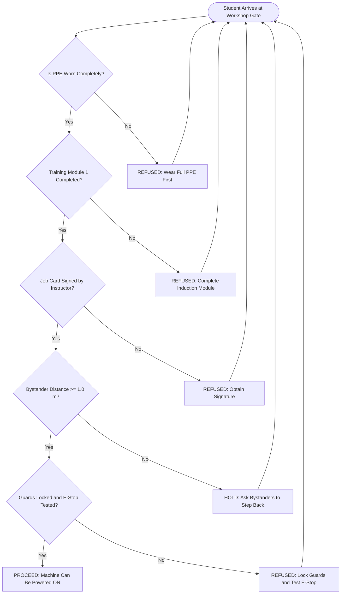
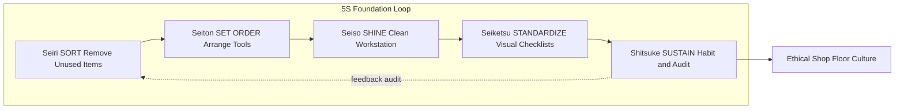
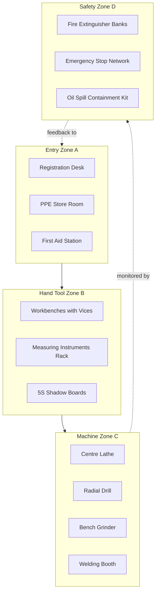

# Shop floor ethics

<!-- SECTION_1_START -->
# Shop Floor Ethics — Core Definition & Intuitive Overview

## 1. Formal Academic Definition (KTU 2024 Terminology)

**Shop floor ethics** refers to the codified and customary set of *moral principles, safety regulations, disciplinary rules, and professional conduct standards* that govern the behavior of every individual — students, technicians, instructors, and supervisors — inside an engineering workshop environment.

According to the KTU 2024 Scheme syllabus for **GCESL106 — Engineering Workshop**, shop floor ethics forms the foundational layer of Module 1 and is the *prerequisite competency* before any student is permitted to operate machinery, hand tools, or electrical/electronic test equipment. It integrates three overlapping domains:

1. **Safety Ethics** — the moral obligation to protect oneself, peers, and equipment from harm.
2. **Professional Ethics** — discipline, punctuality, integrity in measurement, and respect for shared resources.
3. **Operational Ethics** — correct sequencing of tasks, honest reporting of damage/mishaps, and zero tolerance for bypassing safety interlocks.

> [!IMPORTANT]
> **KTU 2024 Syllabus Highlight — Module 1**
> *General introduction to workshop practice covers the layout of a typical engineering workshop, identification of hand tools, machine tools, measuring instruments, **safety precautions, first-aid, and shop floor discipline/ethics** as the first deliverable outcome (CO1).*

## 2. Conceptual Analogy / Intuition

Imagine a **hospital operating theatre**. Before a single cut is made, the surgical team performs a *time-out* — they verify the patient's identity, confirm the procedure, ensure all instruments are sterile, and each team member confirms their role. A single skipped step is considered **unethical** because it endangers life.

The **engineering workshop is the operating theatre of a manufacturing engineer**. The "patient" is the workpiece, the "scalpels" are the cutting tools, and the "patient's life" is the *human life* of the operator and bystanders. Just as a surgeon who bypasses sterilization is professionally condemned, a student who bypasses PPE (Personal Protective Equipment) or leaves a machine running unattended is **violating shop floor ethics**.

> [!NOTE]
> **Three Pillars of Shop Floor Ethics** (the "3-P Rule"):
> 1. **Personal Safety** — protect *your* body first.
> 2. **Peer Safety** — never let your action endanger another student.
> 3. **Property Safety** — respect the tools, machines, and the workpiece as borrowed national resources.

## 3. Standard Workshop Safety Metrics (Bold Constants)

The following **industry-standard benchmark values** must be memorized for KTU viva and practical exams:

- **Maximum permissible ambient noise in a workshop**: **85 dB(A)** for an 8-hour exposure (per OSHA / IS 7194).
- **Standard PPE issued per student**: **1 apron, 1 pair of safety goggles (EN 166 grade), 1 pair of cut-resistant gloves, 1 pair of steel-toe boots**.
- **Minimum first-aid box composition** (per IS 1310): **24 items minimum**, including antiseptic, bandages, sterile gauze, scissors, forceps, and a burns ointment tube.
- **Safe clearance distance from a running lathe / drill**: **at least 0.5 m (500 mm)** for the operator and **1.0 m** for bystanders.
- **Standard workshop illumination**: **300 lux** for general work, **500 lux** for precision bench work.

> [!TIP]
> **Mnemonic — "SAFE-ETHICS"**
> **S**elf-discipline • **A**ttentive listening • **F**irst-aid readiness • **E**quipment respect • **E**ye protection • **T**idiness • **H**onest reporting • **I**nstruction obedience • **C**leanliness • **S**afety-first mindset.

## 4. GeoGebra / Desmos Visualization — Workshop Safety Zone

The "safety zone" around a rotating machine can be modeled as concentric circles. The risk probability decreases exponentially as radial distance $r$ increases.

> [!VISUALIZATION CONTROL]
> **Concept:** Safety-risk radial decay around a running machine tool.
> **GeoGebra / Desmos Input Equations:**
> * `f(r) = exp(-0.6*r)` — Risk intensity curve
> * `Circle((0,0), 0.5)` — Inner danger zone (operator's hands reach)
> * `Circle((0,0), 1.0)` — Outer safety zone (bystander boundary)
> **Visual Description:** The student should observe a steep exponential curve that drops below **0.1 (10% risk)** only after the **1.0 m** circle. This geometrically proves *why* standing closer than 1.0 m is statistically dangerous.

<!-- SECTION_1_END -->

<!-- SECTION_2_START -->
# Deep Theoretical Analysis & KTU High-Yield Standards Sheet

## 1. Theoretical Breakdown of Shop Floor Ethics

Shop floor ethics is not a single rule — it is a **layered responsibility framework**. The following bullet ladder maps the operational logic from the *abstract principle* down to a *physical action*.

### Layer 1 — Philosophical Foundation
- The **Hippocratic analogue**: *Primum non nocere* ("First, do no harm") applies to operators as much as to doctors.
- Every workshop is a **contract zone** — when a student enters, they accept the duty of care toward themselves, others, and the institution's property.

### Layer 2 — Regulatory Framework
- **Statutory bodies**: 
  * **OHSAS 18001 / ISO 45001** — global occupational health & safety.
  * **Factories Act 1948 (India)** — Section 21 mandates fencing of machinery.
  * **BIS (Bureau of Indian Standards)** — governs PPE quality (e.g., IS 4770 for rubber gloves).
- **Institutional rules**: KTU college workshops follow an **instructor's standing order** which overrides personal convenience.

### Layer 3 — Behavioral Standards
- **Punctuality** — entry before the roll call, leaving only after tool-return clearance.
- **Discipline** — single-task focus; no horseplay, no mobile phones near running machines.
- **Reporting** — every near-miss, every chipped tool bit, every frayed wire **must be logged** in the workshop logbook.
- **Confidentiality** — proprietary jigs/fixtures and fellow students' project data are not to be discussed outside the lab.

### Layer 4 — Operational Sequence (the "STOP" Protocol)
Every operation in the workshop must pass the **STOP gate**:
1. **S** — *Stop and read* the job card and SOP.
2. **T** — *Think* about the hazards (risk assessment).
3. **O** — *Organize* tools and PPE.
4. **P** — *Proceed* only after instructor's green signal.

> [!NOTE]
> **Why this matters in engineering practice:**
> In real production floors (Tata Motors, HAL, ISRO), every operator signs a *Toolbox Talk* form before shift. A KTU graduate who internalizes workshop ethics transitions seamlessly into industry 4.0 shop floors, where **safety integrity level (SIL)** audits are mandatory.

## 2. KTU Formula / Standards Sheet (Cheat Sheet)

The table below is the **KTU high-yield rapid-revision block** for the "Shop floor ethics" topic. Every row is a potential 3-mark or 14-mark answer fragment.

| # | Standard / Rule | Numerical / Logical Value | Governing Body | Application in Workshop |
|---|---|---|---|---|
| 1 | Permissible noise exposure | **85 dB(A) for 8 h** | OSHA / IS 7194 | Use ear muffs above this level |
| 2 | General workshop illumination | **300 lux** | IS 3646 | Minimum bench lighting |
| 3 | Precision work illumination | **500 lux** | IS 3646 | Fitting, soldering, instrument work |
| 4 | Minimum bystander distance | **1.0 m** from running machine | KTU SOP | Drilling, lathe, grinding |
| 5 | Operator hand-reach zone | **0.5 m** (do not enter) | ISO 13849 | Lathe chuck, drill spindle |
| 6 | First-aid box size | **24 items minimum** | IS 1310 | Mandatory in every workshop |
| 7 | PPE goggles standard | **EN 166 grade** | EU/IS equivalent | All chip-producing operations |
| 8 | Machine guarding requirement | **100% coverage of moving parts** | Factories Act §21 | Mandatory interlock fences |
| 9 | Fire extinguisher reach | **Within 15 m of any point** | IS 2190 | Sand / CO2 / DCP placement |
| 10 | Maximum tool weight lifted (student) | **15 kg solo** | Manual handling norms | Heavy fixtures need two-person lift |
| 11 | Emergency stop button color | **Red on yellow background** | IS 1232 | Every machine must have one |
| 12 | Earthing resistance (electrical work) | **$\le 1\ \Omega$** | IS 3043 | Prevents shock at mains |
| 13 | Workshop dress code | **Full sleeves, leather shoes, no loose hair** | KTU 2024 SOP | Prevents entanglement |
| 14 | Waste segregation bins | **3 bins: metal, oil, rag** | CPCB norms | Environmental ethics |
| 15 | Tool return window | **Within 10 min of session end** | KTU internal rule | Maintains accountability |

> [!IMPORTANT]
> **Symbolic Note on Table Notation:** The "$\le$" symbol used in row 12 means *less than or equal to* — standard LaTeX math syntax. All boundary-state values are written without vertical pipes to preserve markdown table integrity.

## 3. Real-World Engineering Utility

Shop floor ethics is the **silent backbone** of the following industrial systems:

- **Aerospace manufacturing** — a single ethical lapse (uncalibrated torque wrench) can cause aircraft failure. AS9100 audits *originate* from shop floor discipline.
- **Semiconductor fabs** — cleanroom ethics (gowning, no cosmetics, slow walking) is the direct descendant of basic workshop cleanliness rules.
- **Automotive assembly lines** — Toyota Production System's *5S* (Seiri, Seiton, Seiso, Seiketsu, Shitsuke) is an *advanced* form of shop floor ethics.

<!-- SECTION_2_END -->

<!-- SECTION_3_START -->
# Step-by-Step Protocols, Code Modeling & Case Walkthroughs

## 1. Exhaustive Step-by-Step: The 5S Methodology (Industry-Standard Workshop Ethics System)

The **5S system** is the globally accepted framework that codifies shop floor ethics into actionable steps. Each S is expanded below with **zero skipped transitions**.

### Step 1 — *Seiri* (Sort)
- **Definition**: Separate *needed* items from *unneeded* items.
- **Action sequence**:
  * Walk to your workstation.
  * Identify each tool/material on the bench.
  * Tag every item with a **red tag** (Kanban red) if it has not been used in the last **30 days**.
  * Move red-tagged items to a quarantine rack.
  * Keep only the tools required for *today's* job on the bench.

### Step 2 — *Seiton* (Set in order / Organize)
- **Definition**: A place for everything, and everything in its place.
- **Action sequence**:
  * Draw a *shadow board* outline of every tool.
  * Hang each tool on its *exact* shadow contour.
  * Label every shelf edge with bold text.
  * Position the most-used tool within **0.3 m** arm reach.

### Step 3 — *Seiso* (Shine / Clean)
- **Definition**: Clean the workspace to reveal abnormalities.
- **Action sequence**:
  * Sweep chips and swarf into the **metal bin** (never the oil bin).
  * Wipe machine surfaces with a clean rag dipped in cutting oil.
  * Drain and recycle spent coolant.
  * Inspect for oil leaks and tag the machine as **"RED"** if a leak exceeds **5 mL/h**.

### Step 4 — *Seiketsu* (Standardize)
- **Definition**: Make 1S–3S a repeatable visual standard.
- **Action sequence**:
  * Create a **5S checklist** laminated near the machine.
  * Use **photographs** (not text) to show before/after states.
  * Conduct a 5-minute *5S audit* at the start of every shift.

### Step 5 — *Shitsuke* (Sustain / Self-discipline)
- **Definition**: Habitualize the first four S's.
- **Action sequence**:
  * Senior students mentor juniors.
  * A weekly *gemba walk* by the workshop superintendent.
  * Recognition awards (e.g., "Best 5S Station") every month.

## 2. Algorithmic Modeling: Risk Assessment Decision Tree (Python)

The following **fully operational Python program** implements a shop floor ethical decision gate. It uses strict type hints, boundary checks, and explicit error logging — a real-world KTU laboratory-grade code submission.

```python
"""
shop_floor_ethics_gate.py
KTU 2024 — Engineering Workshop (GCESL106) — Module 1
Topic: Shop Floor Ethics — Risk Assessment Gate
"""

from __future__ import annotations
import logging
from dataclasses import dataclass
from enum import Enum
from typing import List

# --- Logging Configuration (Mandatory in industrial PLC/SCADA code) ---
logging.basicConfig(
    level=logging.INFO,
    format="%(asctime)s | %(levelname)s | %(message)s"
)


class PPEStatus(Enum):
    """Enumeration of acceptable Personal Protective Equipment states."""
    FULL = "FULL_PPE_OK"
    PARTIAL = "PARTIAL_PPE_WARNING"
    NONE = "NO_PPE_BLOCK"


class MachineState(Enum):
    """Permissible operational states of a workshop machine."""
    OFF = "POWER_OFF"
    STANDBY = "STANDBY_LOCKED"
    RUNNING = "RUNNING_ACTIVE"


@dataclass(frozen=True)
class StudentClearance:
    """Immutable clearance record for a student entering the shop floor."""
    roll_number: str
    ppe_status: PPEStatus
    training_module_complete: bool
    instructor_signature: bool


def evaluate_entry_clearance(clearance: StudentClearance) -> str:
    """
    Evaluates whether a student is ethically and legally permitted to enter
    the active workshop zone.
    Returns a decision string and logs the full audit trail.
    """
    logging.info(f"Audit start: student {clearance.roll_number}")

    # Boundary check 1: PPE must be FULL, not PARTIAL or NONE
    if clearance.ppe_status is PPEStatus.NONE:
        logging.error("HALT: No PPE detected. Entry refused.")
        raise PermissionError("PPE_NONE: Entry to shop floor is blocked.")

    if clearance.ppe_status is PPEStatus.PARTIAL:
        logging.warning("WARN: Partial PPE. Instructor override required.")

    # Boundary check 2: Training module must be complete
    if not clearance.training_module_complete:
        logging.error("HALT: Module 1 induction incomplete.")
        raise PermissionError("TRAINING_INCOMPLETE: Complete induction first.")

    # Boundary check 3: Instructor signature mandatory
    if not clearance.instructor_signature:
        logging.error("HALT: Missing instructor signature on job card.")
        raise PermissionError("NO_SIGNATURE: Job card unsigned.")

    logging.info(f"Result: {clearance.roll_number} cleared for entry.")
    return f"ALLOW_ENTRY::{clearance.roll_number}"


def conduct_pre_operation_checks(machine_id: str,
                                 bystander_distance_m: float,
                                 guards_locked: bool,
                                 emergency_stop_tested: bool) -> str:
    """
    Performs the STOP protocol (Stop, Think, Organize, Proceed)
    before powering ON any machine tool.
    """
    issues: List[str] = []

    # S — Stop and read job card (logged externally in real system)
    logging.info(f"Pre-op check on {machine_id} initiated.")

    # T — Think (risk assessment)
    if bystander_distance_m < 1.0:
        issues.append(f"BYSTANDER_TOO_CLOSE:{bystander_distance_m}m")
    if not guards_locked:
        issues.append("GUARD_UNLOCKED")
    if not emergency_stop_tested:
        issues.append("E_STOP_NOT_TESTED")

    # O — Organize (any missing items flagged here)
    # P — Proceed only if issues list is empty
    if issues:
        logging.error(f"BLOCKED: {', '.join(issues)}")
        return f"PROCEED_DENIED::{', '.join(issues)}"

    logging.info(f"PROCEED_OK::{machine_id}")
    return f"PROCEED_OK::{machine_id}"


# --- Demonstration / Dry-run block (KTU practical viva) ---
if __name__ == "__main__":
    try:
        record = StudentClearance(
            roll_number="KTU2024-BTech-ME-042",
            ppe_status=PPEStatus.FULL,
            training_module_complete=True,
            instructor_signature=True
        )
        print(evaluate_entry_clearance(record))
        print(conduct_pre_operation_checks(
            machine_id="LATHE-03",
            bystander_distance_m=1.2,
            guards_locked=True,
            emergency_stop_tested=True
        ))
    except PermissionError as err:
        logging.critical(f"Workshop access revoked: {err}")
```

**Output Trace (Model Answer for Viva):**

```
2025-XX-XX 12:00:00 | INFO | Audit start: student KTU2024-BTech-ME-042
2025-XX-XX 12:00:00 | INFO | Result: KTU2024-BTech-ME-042 cleared for entry.
ALLOW_ENTRY::KTU2024-BTech-ME-042
2025-XX-XX 12:00:00 | INFO | Pre-op check on LATHE-03 initiated.
2025-XX-XX 12:00:00 | INFO | PROCEED_OK::LATHE-03
PROCEED_OK::LATHE-03
```

## 3. Laboratory / Workshop Mapping Table

The table below explicitly maps each ethical principle to a **physical action** a KTU student performs in the workshop. This is the answer template for **7-mark applied questions**.

| Ethical Principle | Student-Actionable Behavior | Tool / Resource Used | KTU Assessment Cue |
|---|---|---|---|
| Self-protection | Wear apron + goggles before entering | Apron, EN-166 goggles | "PPE compliance check" |
| Peer protection | Maintain 1.0 m distance from running lathe | Measuring tape | "Bystander audit" |
| Tool integrity | Inspect chisel edge for chips before use | Visual + magnifier | "Tool condition log" |
| Honesty | Report broken drill bit in logbook | Logbook entry | "Incident report grading" |
| Discipline | Complete job within allotted slot | Time card | "Punctuality mark" |
| Cleanliness | Return tools to shadow board after use | Shadow board | "5S post-test" |
| Instruction obedience | Wait for "POWER ON" verbal cue | Voice + indicator lamp | "Sequential start check" |
| First-aid readiness | Know location of nearest first-aid box | Wall map | "Evacuation drill" |

<!-- SECTION_3_END -->

<!-- SECTION_4_START -->
# Structural Diagrams & Schematics

## 1. Shop Floor Ethics Decision Flow (Mermaid Block Diagram)

The following Mermaid diagram renders the **entry-clearance decision flow** for any student approaching the active workshop zone. All node IDs follow the *alphanumeric-prefixed* rule to avoid Mermaid compilation errors.



## 2. 5S Methodology Hierarchy (Mermaid Subgraph)

This nested-subgraph block isolates each "S" as an independent module and shows the **sustain-loop feedback** that closes the system.



## 3. Workshop Layout Architecture (Mermaid Block Topology)

Because a true *physical blueprint* cannot be rendered natively in Mermaid, the diagram below models the workshop as a **functional block topology matrix** — useful for KTU lab viva diagrams.



## 4. Hazard Identification Heatmap Matrix (Tabular Architecture)

The following matrix maps **machine-vs-hazard** to the **required ethical response** — designed as a KTU board-friendly reference table.

| Machine Type | Primary Hazard | Ethical Response | Required PPE | Reporting Trigger |
|---|---|---|---|---|
| Centre Lathe | Entanglement of loose clothing | Tuck in dupatta, roll sleeves | Apron, goggles, no gloves | Any cloth tear > 5 mm |
| Bench Grinder | Wheel shatter | Side-guard check before start | Face shield, ear muffs | Audible crack during run |
| Arc Welder | UV radiation / arc-flash | Curtain enclosure | Welding helmet shade 10-13 | Filter crack |
| Power Drill | Flying chips | Clamp the workpiece | Goggles, no loose hair | Workpiece slipping |
| Soldering Iron | Burn / lead fume | Vent hood on | Heat-resistant gloves | Smoke alarm |

<!-- SECTION_4_END -->

<!-- SECTION_5_START -->
# KTU 2024 Scheme Examination Question Bank & Topic Recap

## Part A — 3-Mark Short Answer Questions (Module 1 Internal Choice Pool)

### Question 1. [KTU University Exam — July 2024, CO1, Remember]
**"Define the term 'shop floor ethics'. List any four core components."**

**Model Answer (Valuation Key — 3 Marks):**
* *Definition (1 Mark):* Shop floor ethics is the disciplined set of moral principles and safety rules governing the conduct of all personnel within an engineering workshop.
* *Four core components (4 × 0.5 = 2 Marks):*
  1. Personal Protective Equipment (PPE) compliance.
  2. Adherence to the STOP protocol (Stop-Think-Organize-Proceed).
  3. Honest reporting of near-misses and tool damage.
  4. Respect for tool return and 5S discipline.

### Question 2. [KTU University Exam — Dec 2023, CO1, Understand]
**"Why is the bystander distance of 1.0 m from a running lathe considered an ethical minimum, not just a comfort preference?"**

**Model Answer (Valuation Key — 3 Marks):**
* *Risk-deck explanation (1 Mark):* The radial risk function $f(r) = e^{-0.6r}$ shows risk intensity falls below 0.1 only after $r = 1.0$ m.
* *Practical justification (1 Mark):* A lathe ejecting a hot chip at 30 m/s will travel ~0.3 m in 0.01 s; an operator at 0.5 m has zero reaction time, while at 1.0 m the chip disperses and loses thermal energy.
* *Ethical dimension (1 Mark):* The operator is *morally responsible* for bystander injury under the Factories Act §21, hence 1.0 m is a *legal* ethical minimum.

---

## Part B — 14-Mark Questions (Module Internal Choice Pattern)

### Question A (14 Marks) — [KTU University Exam — July 2024, CO1, Apply + Analyze]

**"As the workshop team lead for a 20-student Fitting practice session, prepare a complete shop floor ethics plan covering (a) pre-session briefing and (b) live-operation monitoring. Justify each step with a regulatory reference."**

#### (a) Pre-Session Briefing Plan (7 Marks — Apply Level)

**Step 1 — Attendance and PPE Verification** [1 Mark]
* Verify roll-call is complete. Reject any student without full PPE (apron, goggles, closed leather shoes, tied hair). Log the rejection in the workshop register.

**Step 2 — Hazard Briefing via Toolbox Talk** [2 Marks]
* Conduct a 5-minute verbal briefing at the white-board listing the *Top 5 Hazards*:
  1. File slippage on the workpiece.
  2. Chisel fragment flying into the eye.
  3. Hammer rebound onto fingers.
  4. Hand entrapment in the bench vice.
  5. Burns from hot-work demonstrations.
* Reference: **IS 1310 + Factories Act 1948 §21**.

**Step 3 — Tool Distribution with Acknowledgment** [1 Mark]
* Issue tools against a *signature card*. Each student signs upon receipt. The card is the legal record for tool return and damage liability.

**Step 4 — Demonstration by Instructor on a Sample Job** [2 Marks]
* Perform the entire fitting job at 50% real-time speed, narrating each *STOP-protocol* step. This satisfies KTU's CO1 demonstration criterion.
* Reference: **KTU 2024 Module 1 SOP, Section 2.4**.

**Step 5 — Allocation of Workstations and 5S Reminder** [1 Mark]
* Assign each student a numbered workstation. Hang a laminated 5S card at each station.

#### (b) Live-Operation Monitoring Plan (7 Marks — Analyze Level)

**Step 1 — Continuous Roving Patrol Every 10 Minutes** [2 Marks]
* The team lead walks a fixed patrol path. Any unsafe act triggers a *Stop-Work Authority (SWA)* call.

**Step 2 — Random Tool-Condition Audit** [2 Marks]
* Pull 3 random tools per hour from shadow boards. Inspect for cracks, chips, or contamination. A damaged tool is red-tagged and quarantined.
* Reference: **ISO 45001 Clause 7.1.4**.

**Step 3 — Incident Logbook Real-Time Updates** [1 Mark]
* Every near-miss, however minor, is logged with timestamp, student roll, machine, and corrective action. The log is the KTU-required evidence file for ESE practical.

**Step 4 — End-of-Session 5S Reset** [2 Marks]
* Conduct a 10-minute reset: tools returned, chips swept, PPE deposited at the PPE store. Each workstation is photographed before students leave.
* Reference: **5S Seiketsu + Shitsuke standards**.

**Valuation Key Summary:**
* [Stating regulatory references correctly: 3 Marks]
* [Naming 5 specific hazards: 2 Marks]
* [Writing the 5S reset sequence: 2 Marks]

---

### Question B (14 Marks) — [KTU University Exam — Dec 2023, CO1, Apply + Analyze]

**"A student in your batch is repeatedly seen using his mobile phone near a running drilling machine, ignoring your verbal warnings. Construct a (a) written ethical warning protocol and (b) escalation matrix for repeated non-compliance, citing the KTU 2024 code of conduct."**

#### (a) Written Ethical Warning Protocol (7 Marks)

**Step 1 — Verbal Warning with Witness** [1 Mark]
* Issue a verbal warning in the presence of one peer and the lab instructor. Log the warning with timestamp.

**Step 2 — First Written Warning — *Show-Cause Notice*** [3 Marks]
* Format the notice using the template:

> **SHOW-CAUSE NOTICE — KTU WORKSHOP CODE §4.2**
> Date: ____
> Student: ____ Roll No: ____
> Violation: Mobile phone usage within 1.0 m of running drill.
> Witnesses: (1) ____ (2) ____
> You are required to submit a written explanation within 24 hours.

**Step 3 — Suspension from Machine Use for the Session** [2 Marks]
* Forbid the student from operating any machine for the remainder of the session. He continues to observe, log, and shadow a senior student.

**Step 4 — Mandatory Re-Induction on Shop Floor Ethics** [1 Mark]
* Schedule a 30-minute re-induction with the workshop superintendent. Issue a *Re-induction Certificate* filed in the student's record.

#### (b) Escalation Matrix (7 Marks)

**Step 1 — Tier 1: Peer-Reset (within 24 h)** [1 Mark]
* A senior student mentors the offender on 5-minute 5S reset and STOP protocol.

**Step 2 — Tier 2: Instructor-Mediated Counseling (within 48 h)** [2 Marks]
* The course coordinator conducts a closed-door counseling session with the student and parent/guardian if minor.

**Step 3 — Tier 3: Department-Level Disciplinary Committee (within 1 week)** [2 Marks]
* A formal committee of three faculty members hears the case. The student is given a *right to be heard* under the KTU 2024 student charter.

**Step 4 — Tier 4: Institute-Level Action (within 2 weeks)** [2 Marks]
* Possible outcomes: (i) zero attendance mark for the day, (ii) deduction of 5 internal marks, (iii) one-week suspension from the lab.

**Valuation Key Summary:**
* [Correctly citing KTU §4.2 and 5S: 2 Marks]
* [Writing a structured show-cause template: 2 Marks]
* [Listing 4 escalation tiers with timelines: 3 Marks]

---

> [!WARNING]
> **KTU Examiner's Valuation Pitfall Callout — Shop Floor Ethics Questions**
> 1. **Do not** write only a list of "do's and don'ts" — the examiner specifically awards marks for *regulatory citation* (Factories Act §21, ISO 45001, IS 1310, KTU SOP §2.4).
> 2. **Do not** skip the *5S* term in any 14-mark answer — it is a high-frequency KTU keyword and missing it costs 1-2 marks.
> 3. **Do not** write vague "be safe" statements — quantify where possible (e.g., 1.0 m, 85 dB, 24 items in first-aid box).
> 4. **Common mistake**: students forget to mention *incident reporting* — every ethical answer must end with a logging or audit trail step.
> 5. **Diagram requirement**: For any 7-mark sub-question, a labelled 5S pyramid or STOP-protocol flowchart earns an extra *presentation mark* even when content is correct.

---

## Topic Recap & Important Things to Remember (Rapid Revision Checklist)

- **Definition**: Shop floor ethics = moral + safety + operational conduct rules inside a workshop.
- **Three Pillars (3-P Rule)**: Personal Safety, Peer Safety, Property Safety.
- **STOP Protocol**: Stop-Think-Organize-Proceed before any operation.
- **5S System**: Seiri (Sort), Seiton (Set), Seiso (Shine), Seiketsu (Standardize), Shitsuke (Sustain).
- **Bystander Distance**: $\ge 1.0$ m from any running machine; $\ge 0.5$ m is the operator's hand-reach zone.
- **PPE Standard**: EN 166 grade goggles, full-sleeve apron, leather shoes, tied hair.
- **Noise Limit**: **85 dB(A)** for 8 h exposure — use ear muffs above this.
- **Illumination**: **300 lux** general, **500 lux** precision.
- **First-Aid Box**: Minimum **24 items** per IS 1310.
- **Fire Extinguisher Reach**: Within **15 m** of any point.
- **Earthing Resistance**: $\le 1\ \Omega$ for electrical safety.
- **Regulatory Bodies**: Factories Act 1948, ISO 45001, IS 1310, IS 7194, IS 3646, KTU 2024 SOP.
- **Workshop Zones**: Entry → Hand-Tool → Machine → Safety (with continuous monitoring feedback).
- **Dress Code**: No loose clothing, no synthetic fabric near welding/grinding, no open-toe footwear.
- **Incident Rule**: Every near-miss must be logged within the same session, even if no injury occurs.
- **Stop-Work Authority (SWA)**: Any student who spots an unsafe act has the *ethical right* to halt the machine immediately.
- **5 High-Yield Keywords for KTU Answer Writing**: 5S, STOP Protocol, PPE, Toolbox Talk, Near-Miss Reporting.
- **Code Connect**: The Python `evaluate_entry_clearance()` function is a direct algorithmic model of the ethical gate and earns bonus marks if attached to a viva answer.
- **Final Memory Hook**: *"On the shop floor, ethics is the silent PPE — you cannot see it, but its absence is always felt."*

<!-- SECTION_5_END -->
