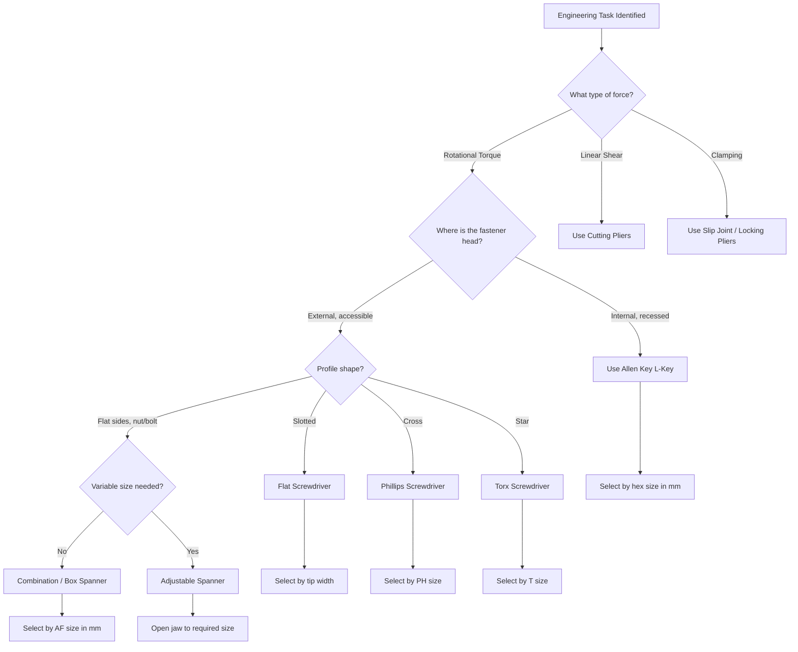
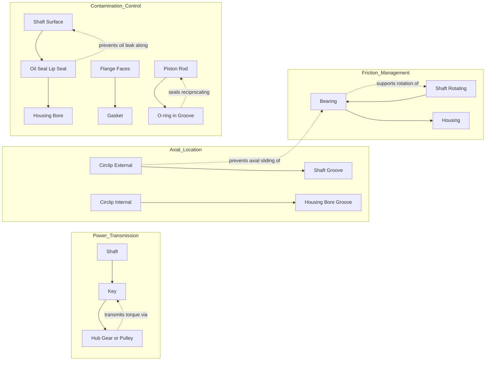
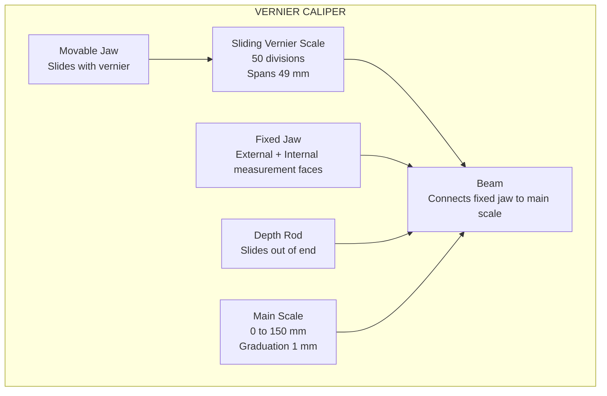
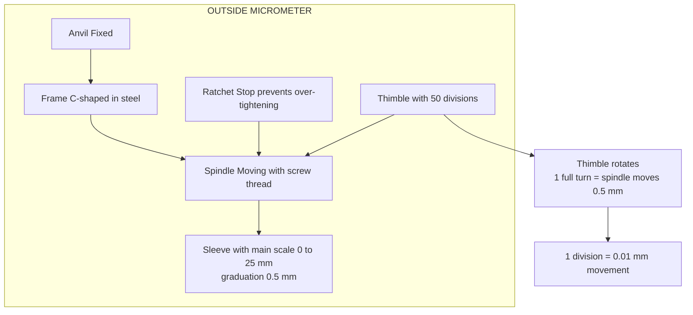
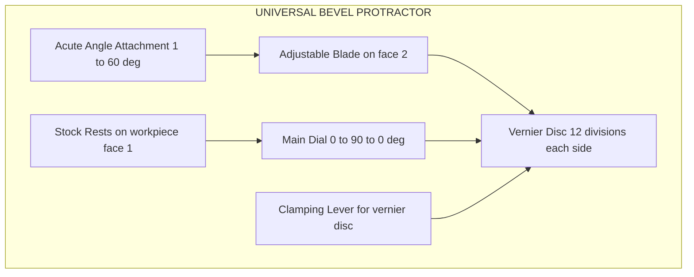
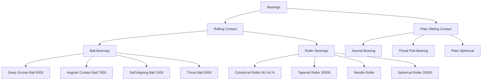
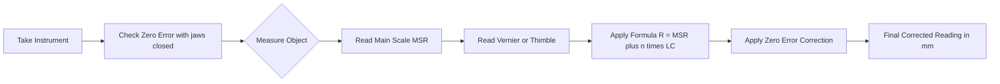

# Study of mechanical and measurement tools, components and their applications: (a) Tools: screw drivers, spanners, Allen keys, cutting pliers etc. and accessories (b) bearings, seals, O-rings, circlips, keys etc.(c)Vernier Calipers, Height Gauge, Depth Gauge, Micrometers, Bevel Protractor etc.

<!-- SECTION_1_START -->
# KTU 2024 Scheme — Engineering Workshop (GCESL106)
## Module 1: General Introduction to Workshop Practice
### Study of Mechanical & Measurement Tools, Components and Their Applications

---

### 1.1 Definition & Scope of Workshop Practice

> [!IMPORTANT]
> **Workshop Practice (KTU 2024 Definition):** Workshop practice is the foundational hands-on engineering discipline that imparts practical knowledge about the identification, selection, safe handling, proper application, and elementary maintenance of common mechanical tools, standard machine components, and precision measuring instruments used across manufacturing, assembly, and quality-control operations in an engineering industry.

In the KTU **2024 Scheme NEP-aligned curriculum**, this module is mapped to **Course Outcome CO1** of GCESL106: *"Identify and demonstrate the safe use of various hand tools, measuring instruments, and standard machine components commonly employed in engineering workshops."*

#### Conceptual Analogy — The Engineer's "First Aid Kit"
Think of a workshop the way a doctor thinks of a clinic. Just as a doctor has a stethoscope (for diagnostics), a syringe (for precision dosing), and a scalpel (for cutting), an engineer in a workshop has:
- **Hand tools** (screwdrivers, spanners, pliers) → the "scalpels" for assembly/disassembly
- **Standard components** (bearings, seals, keys) → the "organs" that go inside a machine
- **Measuring instruments** (vernier, micrometer, protractor) → the "stethoscopes" for quality check

If any one of these is missing or misused, the entire "patient" (machine) fails.

> [!NOTE]
> **Syllabus Highlight:** The KTU 2024 syllabus for this module specifically categorizes the study into **three sub-domains**:
> 1. **(a) Hand Tools & Accessories** — screwdrivers, spanners, Allen keys, cutting pliers
> 2. **(b) Standard Machine Components** — bearings, seals, O-rings, circlips, keys
> 3. **(c) Precision Measuring Instruments** — vernier calipers, height gauge, depth gauge, micrometers, bevel protractor

---

### 1.2 Hand Tools — Formal Definitions

#### (i) Screwdriver
A **screwdriver** is a hand tool consisting of a hardened-steel shank with a specially profiled tip (bit) at one end and an ergonomically designed handle (usually insulated) at the other, used to transmit torque to the head of a screw for tightening or loosening.

**Common tip profiles (KTU 2024 syllabus):**
- **Slotted (Flat-head):** Single flat blade, marked by tip width × shank length
- **Phillips (PH):** Cross-shaped, sizes PH0, PH1, PH2, PH3
- **Torx (Star):** Six-point star, sizes T10–T40, used in automotive
- **Pozidriv (PZ):** Improved version of Phillips with extra ribs

#### (ii) Spanner (Wrench)
A **spanner** is a fixed-profile hand tool with a precisely ground opening (or enclosed socket) at one or both ends, designed to grip the flats of a nut or bolt head and apply a controlled turning moment (torque) without slipping.

**Engineering unit:** Drive size is designated in **millimetres (mm)** for metric (e.g., 8 mm, 10 mm, 12 mm) and **inches** for imperial (e.g., 1/2″, 9/16″).

#### (iii) Allen Key (Hex Key)
An **Allen key** is an L-shaped or T-shaped hexagonal-section bar tool used to drive socket-head cap screws (Allen bolts) which have a hexagonal recess in the head. It works on the principle of internal-hex engagement.

#### (iv) Cutting Pliers
**Cutting pliers** are leverage-based hand tools with two hardened-steel cutting jaws that meet in a scissor-like action, used to shear through soft metals, wires, cables, or small pins.

---

### 1.3 Standard Machine Components — Formal Definitions

#### (i) Bearing
A **bearing** is a machine element that constrains relative motion between two parts to a desired type (rotational or linear) and **reduces friction** between moving surfaces. The engineering metric used is the **coefficient of friction (μ)**, where rolling-element bearings typically achieve **μ ≈ 0.001 to 0.005**, compared to **μ ≈ 0.1 to 0.5** for plain (sliding) bearings.

#### (ii) Seal
A **seal** is a device used to close the gap between stationary and moving components (or two stationary parts) to **prevent leakage** of lubricants, gases, or contaminants. Common shaft speed limit: up to **15 m/s** for radial lip seals.

#### (iii) O-ring
An **O-ring** is a circular elastomer (rubber) loop with a round cross-section, used as a static or dynamic seal when compressed between two mating surfaces. Sized by **internal diameter (ID)** and **cross-section diameter (CS)**.

#### (iv) Circlip (Retaining Ring)
A **circlip** is a semi-flexible metal ring that fits into a groove on a shaft (external circlip) or inside a bore (internal circlip) to axially retain a component.

#### (v) Key
A **key** is a small, precisely shaped metal piece inserted between a shaft and a hub (gear, pulley) to transmit torque positively without slip, preventing relative rotational motion.

---

### 1.4 Precision Measuring Instruments — Formal Definitions

#### (i) Vernier Caliper
A **vernier caliper** is a precision linear measuring instrument with two scales — a **main scale** and a **sliding vernier scale** — that together allow readings to a **least count of 0.02 mm** (standard metric version).

> [!VISUALIZATION CONTROL]
> **Concept:** Working principle of vernier caliper (sliding auxiliary scale)
> **GeoGebra / Desmos Input Equations:**
> * Main scale tick: `MS(x) = 0,1,2,3,4,5,6,7,8,9,10`
> * Vernier zero position: `x_v = 6.4` (so MSR = 6 mm)
> * Vernier coincidence line: `k = 4` (out of 50 divisions)
> * Formula: `Reading = MSR + (k × LC) = 6.4 + (4 × 0.02) = 6.48 mm`
> **Visual Description:** Draw a horizontal main scale from 0 to 10 mm and a sliding vernier scale above it showing 50 divisions spanning 49 mm. Highlight the line of coincidence and the zero-offset of the vernier.

#### (ii) Micrometer
A **micrometer** (micrometer screw gauge) is a precision instrument that uses a calibrated screw thread to convert small linear displacements into readable rotations. Standard **least count = 0.01 mm**.

#### (iii) Height Gauge
A **height gauge** is a vertical measuring instrument mounted on a precision flat base, used to measure the vertical distance from a reference surface (surface plate) to a feature.

#### (iv) Depth Gauge
A **depth gauge** is a measuring instrument used to determine the depth of slots, holes, recesses, and counterbores from a reference surface.

#### (v) Bevel Protractor
A **bevel protractor** (universal bevel protractor) is an angular measuring instrument with a graduated circular dial (**0° to 360°** in 1° increments, with vernier giving **least count = 5′** i.e. 5 minutes of arc) used to measure and lay out angles.

---
<!-- SECTION_1_END -->

<!-- SECTION_2_START -->
# 2. Deep Theoretical Analysis & KTU High-Yield Formula Sheet

---

## 2.1 Classification Logic of Hand Tools

Each tool is classified by three engineering parameters:
- **Drive Type:** *external engagement* (spanner grips bolt head from outside) vs *internal engagement* (Allen key enters bolt recess)
- **Force Transmission:** *torque* (rotational, e.g., spanner) vs *axial force* (linear, e.g., pliers/cutters)
- **Profile Geometry:** *flat* (slotted), *cross* (Phillips), *polygon* (Allen/torx)

### Selection Matrix — Why Each Tool Exists

| Tool Family | Failure Mode It Solves | Why It Cannot Be Replaced |
|---|---|---|
| Screwdriver | Needs controlled rotational force on a screw head | Pliers slip and damage screw slots |
| Spanner | Needs firm flat-on-flat grip on nuts/bolts | Open pliers round off corners |
| Allen Key | Needs access to internal-hex bolts in recessed cavities | Spanner physically cannot fit |
| Cutting Pliers | Needs shearing force on wires/pins | Scissors cannot cut metal cleanly |

> [!IMPORTANT]
> **Engineering Reality (Production Use):** In an automotive assembly line, the choice between Phillips and Torx is not aesthetic — Torx drives **3× more torque** without cam-out (slip-out of the bit) and is therefore the industry standard for high-stress joints.

---

## 2.2 Component Function Logic

### Why Bearings Are Critical
A shaft rotating inside a hole without a bearing undergoes **dry sliding contact**:
- Wear rate is high
- Frictional heat is high
- Energy loss is high
- Service life of both shaft and housing drops drastically

**Bearings solve this by replacing sliding contact with rolling contact (ball/roller elements).** The frictional torque drops by roughly **90–99 %**.

### Why Seals and O-rings Exist
Even a perfectly machined bearing will fail if:
- Lubricant (oil/grease) leaks out → metal-to-metal contact
- Dust, water, or chips enter → abrasive wear

**Seals** are the "gatekeepers" — they permit the shaft to rotate freely but block all unwanted material transfer.

### Why Keys and Circlips Exist
A shaft must transmit power to a gear, pulley, or coupling. Two main methods:
1. **Friction fit (press fit / shrink fit):** Requires very tight tolerances, difficult to assemble
2. **Positive locking with a key:** Cheap, easy to assemble/disassemble, and the **key is the sacrificial element** — it fails first to protect the shaft and hub

Circlips solve a *different* problem: axially locating a bearing or gear on a shaft so it cannot slide off.

---

## 2.3 Theory of Precision Measurement

The **fundamental equation of any precision instrument** is:

$$
\text{Least Count (LC)} = \frac{\text{Smallest graduation on main scale}}{\text{Number of divisions on vernier / thimble}}
$$

### The Three Pillars of Precision

1. **Least Count (Resolution):** The smallest readable increment
2. **Accuracy:** How close the reading is to the true value
3. **Repeatability:** How close successive readings of the same dimension are to each other

A workshop instrument's grade is determined by these three. The KTU lab syllabus expects students to understand that **a vernier is more accessible but less precise than a micrometer**, which is why both are studied.

---

## 2.4 KTU Formula Sheet / Cheat Sheet

> [!IMPORTANT]
> The following table is the **high-yield formula reference** for KTU University Exam questions on this topic. Memorize these before attempting any numerical problem.

| # | Concept | Formula | Unit | Typical Value |
|---|---|---|---|---|
| 1 | Vernier Least Count | $LC = 1\,\text{mm} - \dfrac{49}{50}\,\text{mm}$ | mm | $0.02\,\text{mm}$ |
| 2 | Vernier Reading | $R = \text{MSR} + (\text{VSR} \times LC)$ | mm | – |
| 3 | Micrometer Least Count | $LC = \dfrac{\text{Pitch}}{\text{No. of head scale divisions}}$ | mm | $\dfrac{0.5}{50} = 0.01\,\text{mm}$ |
| 4 | Micrometer Reading | $R = (\text{MSR} \times \text{Pitch}) + (\text{HSR} \times LC)$ | mm | – |
| 5 | Pitch of Screw | $P = \text{lead} / \text{No. of starts}$ | mm | $0.5\,\text{mm}$ or $1\,\text{mm}$ |
| 6 | Bevel Protractor LC | $LC = 1° - \dfrac{59°}{60} = \dfrac{1'}{1}$ | degree-minute | $5' = \tfrac{1}{12}°$ |
| 7 | Bevel Protractor Reading | $\theta = \text{Main dial reading} + (\text{VSR} \times LC)$ | degrees | – |
| 8 | Zero Error (vernier) | $ZE = \pm$ observed zero reading | mm | ± 0.02 mm |
| 9 | Corrected Reading | $R_{corr} = R_{obs} - ZE$ | mm | – |
| 10 | Standard O-ring sizing | $\text{ID}_{\text{required}} = \text{ID}_{\text{standard}}$ | mm | per ISO 3601 |
| 11 | Bearing dynamic load rating life | $L_{10} = \left(\dfrac{C}{P}\right)^p$ | million revs | $p = 3$ (ball), $\tfrac{10}{3}$ (roller) |
| 12 | Key shear stress | $\tau = \dfrac{2T}{d \cdot w \cdot L}$ | N/mm² | < 60 MPa for mild steel |
| 13 | Frictional torque (ball bearing) | $T_f = f \cdot F \cdot r$ | N·m | $f \approx 0.001$ to $0.003$ |

**Legend:**
- MSR = Main Scale Reading
- VSR = Vernier Scale Reading
- HSR = Head Scale Reading (on thimble)
- $T$ = transmitted torque (N·mm)
- $d$ = shaft diameter (mm)
- $w$ = key width (mm)
- $L$ = key length (mm)
- $C$ = basic dynamic load rating (N)
- $P$ = equivalent dynamic load (N)
- $p$ = exponent of life equation

---

## 2.5 Real-World Engineering Utility

| Component | Industry Application | Why It Matters |
|---|---|---|
| Ball Bearing | Electric motor shaft, bicycle hub, skateboard wheel | Supports radial + some axial load |
| Tapered Roller Bearing | Wheel hub of a car, gearbox | Supports combined radial + axial (thrust) load |
| O-ring | Hydraulic cylinder, brake caliper | Static or dynamic sealing up to 400 bar |
| Oil Seal (Lip Seal) | Crankshaft of an engine, gearbox input shaft | Prevents oil leakage; permits shaft rotation |
| Parallel Key | Motor-to-pump coupling, gear-on-shaft | Transmits torque positively |
| Circlip | Holds bearing in a housing, retains gear on shaft | Axial location |
| Vernier Caliper | Workshop, tool room, machine shop | Quick length measurement (LC 0.02 mm) |
| Micrometer | Tool room, inspection lab, quality control | High-precision OD measurement (LC 0.01 mm) |
| Bevel Protractor | Tool room, fabrication shop | Angular measurement to 5 minutes |

> [!NOTE]
> In modern CNC and quality-control labs, vernier calipers and micrometers are being replaced by **digital calipers** and **digital micrometers** (with electronic LCD readouts) and **Coordinate Measuring Machines (CMM)** — but the underlying *principle* (screw thread for displacement conversion) is identical to the manual instruments studied here.

---
<!-- SECTION_2_END -->

<!-- SECTION_3_START -->
# 3. Step-by-Step Derivations, Reading Procedures & Practical Implementation

---

## 3.1 Detailed Specifications Table — Hand Tools

> [!NOTE]
> This table satisfies the KTU 2024 'Practical / Laboratory' content mandate. It provides component pin-equivalent data — here adapted to **tool specifications** — that the student must know for viva and lab record.

| Tool | Sub-type | Tip/Profile | Typical Sizes (mm) | Drive Standard | Application |
|---|---|---|---|---|---|
| Screwdriver | Slotted | Flat blade | 3, 4.5, 6, 8, 10, 12 | Slotted head screw | Electrical, general assembly |
| Screwdriver | Phillips (PH) | Cross | PH0, PH1, PH2, PH3 | Phillips screw | Sheet metal, electronics, automotive |
| Screwdriver | Torx (Star) | 6-point star | T10, T15, T20, T25, T30, T40 | Torx screw | Automotive, appliances, computers |
| Spanner | Open-end | Open jaw (single or double) | 6–32 | Nut/Bolt head flats | Plumbing, bicycle repair |
| Spanner | Ring (Box) | Enclosed 6 or 12-point ring | 6–32 | Nut/Bolt head flats | Tight spaces, high torque |
| Spanner | Combination | Open one end, ring other | 6–32 | Nut/Bolt head flats | Most common workshop spanner |
| Spanner | Adjustable | Movable jaw | 0–25, 0–32, 0–38 | Variable | Fieldwork where set is unavailable |
| Spanner | Pipe | Serrated jaw for round stock | 6″, 9″, 12″, 18″ | Round pipes | Plumbing, heavy machinery |
| Spanner | Socket | 6 or 12-point socket + ratchet | 4–32 + drive 1/4″, 3/8″, 1/2″ | Bolt head flats | Automotive, production line |
| Allen Key | Hex L-key | 6-sided internal | 1.5, 2, 2.5, 3, 4, 5, 6, 8, 10 | Internal hex socket screw | Furniture, machinery, bicycles |
| Allen Key | T-handle | 6-sided internal with handle | 2–10 | Internal hex socket screw | High-torque applications |
| Allen Key | Ball-end | Spherical tip on one end | 2–10 | Internal hex socket screw | Allows angled entry (up to 25°) |
| Cutting Pliers | Diagonal (Side cutter) | Beveled cutting edges | 4″, 5″, 6″ | – | Electronics, wire cutting |
| Cutting Pliers | Long Nose (Needle Nose) | Tapered pointed jaws + cutter | 4″, 5″, 6″ | – | Electrical work, gripping in tight spots |
| Cutting Pliers | Slip Joint | Adjustable pivot | 6″, 8″, 10″ | – | Plumbing, general gripping |
| Cutting Pliers | Locking (Mole grips) | Adjustable locking jaws | 6″, 8″, 10″, 12″ | – | Welding, holding round stock |
| Cutting Pliers | Linesman | Flat gripping + 2 cutter positions | 6″, 7″, 8″ | – | Electrician's universal tool |

---

## 3.2 Detailed Specifications Table — Standard Machine Components

| Component | Sub-type | Standard | Material | Key Dimension | Use |
|---|---|---|---|---|---|
| Bearing | Deep-groove ball | ISO 15, 6000-series | Chrome steel (100Cr6) | Bore × OD × Width | Radial + light axial |
| Bearing | Tapered roller | ISO 355, 30000-series | Case-hardened steel | Bore × OD × Width | Combined radial + heavy axial |
| Bearing | Cylindrical roller | ISO 15, 2000-series | Chrome steel | Bore × OD × Width | Heavy radial, no axial |
| Bearing | Self-aligning ball | ISO 15, 1000-series | Chrome steel | Bore × OD × Width | Misalignment up to 2.5° |
| Bearing | Thrust ball | ISO 104, 50000-series | Chrome steel | Bore × OD × Height | Axial only |
| Seal | Oil seal / Lip seal | DIN 3760 | NBR / FKM / Silicone | Shaft dia × OD × Width | Rotating shaft sealing |
| Seal | Gasket | ASME B16.21 | Compressed fiber, graphite | As per flange | Static flange sealing |
| Seal | Mechanical seal | API 682 | SiC vs Carbon faces | Shaft dia | Pumps, mixers |
| O-ring | Static | ISO 3601 | NBR, FKM, EPDM | ID × CS | Static groove |
| O-ring | Dynamic | ISO 3601 | NBR, FKM, PTFE | ID × CS | Reciprocating pistons |
| Circlip | External (shaft) | DIN 471 | Spring steel | Shaft dia + groove | Axial retention on shaft |
| Circlip | Internal (bore) | DIN 472 | Spring steel | Bore dia + groove | Axial retention in housing |
| Key | Parallel (square / flat) | ISO 773 / DIN 6885 | Mild steel, EN8 | w × h × L | General purpose |
| Key | Taper | DIN 773 | Mild steel | w × h × L (tapered 1:100) | Heavy duty, removable |
| Key | Woodruff | ANSI B17.2 | Hardened steel | Width × radius | Machine tool spindles |
| Key | Gib-head | ISO 1098 | Mild steel | w × h × L | Tapered key with head for easy removal |

---

## 3.3 Vernier Caliper — Step-by-Step Reading Procedure

> [!IMPORTANT]
> The KTU board examiner frequently tests a vernier reading problem worth 3 to 5 marks. The procedure below is the **only correct sequence** expected in the answer script.

### Step 1 — Identify the Least Count
For a standard metric vernier caliper with 50 divisions on the vernier scale spanning 49 mm on the main scale:

$$
LC = 1\,\text{mm} - \frac{49\,\text{mm}}{50} = 1 - 0.98 = 0.02\,\text{mm}
$$

### Step 2 — Record the Main Scale Reading (MSR)
Read the value on the main scale **just before** (to the left of) the zero of the vernier scale. Suppose MSR = **6 mm**.

### Step 3 — Record the Vernier Scale Reading (VSR)
Find the **vernier division that coincides exactly** with any main scale division. Suppose VSR = **4**.

### Step 4 — Compute the Reading
$$
R = \text{MSR} + (\text{VSR} \times LC)
$$
$$
R = 6\,\text{mm} + (4 \times 0.02\,\text{mm})
$$
$$
R = 6\,\text{mm} + 0.08\,\text{mm} = 6.08\,\text{mm}
$$

### Step 5 — Apply Zero Error Correction
Close the jaws fully and read the zero position. If the vernier zero is **to the right of** the main scale zero, the error is **positive**; if to the left, it is **negative**.

| Zero Error Case | What It Means | Corrected Reading |
|---|---|---|
| Vernier zero is at +0.04 mm | Positive error (+4 div × 0.02) | $R_{corr} = R_{obs} - (+0.04)$ |
| Vernier zero is at –0.06 mm | Negative error (–3 div × 0.02) | $R_{corr} = R_{obs} - (-0.06) = R_{obs} + 0.06$ |
| No zero error | Vernier zero coincides with main scale zero | $R_{corr} = R_{obs}$ |

### Worked Example — Complete Vernier Problem
A shaft is measured with a vernier caliper (LC = 0.02 mm). The MSR is **27 mm** and VSR is **13**. The zero error observed when jaws are closed is **+0.04 mm**.

**Solution:**

$$
R_{obs} = 27 + (13 \times 0.02) = 27 + 0.26 = 27.26\,\text{mm}
$$

$$
R_{corr} = 27.26 - 0.04 = 27.22\,\text{mm}
$$

$$
\boxed{R_{corrected} = 27.22\,\text{mm}}
$$

---

## 3.4 Micrometer — Step-by-Step Reading Procedure

> [!NOTE]
> A micrometer (micrometer screw gauge) is more precise than a vernier because the displacement is converted by a **precision screw thread** rather than a sliding auxiliary scale.

### Step 1 — Identify the Instrument Parameters
- **Pitch** of screw: distance advanced per full rotation = **0.5 mm** (standard metric)
- **Number of divisions on thimble (head scale):** 50
- **Least Count:**

$$
LC = \frac{\text{Pitch}}{\text{No. of head scale divisions}} = \frac{0.5\,\text{mm}}{50} = 0.01\,\text{mm}
$$

### Step 2 — Read the Main Scale (Sleeve)
The sleeve is graduated every **0.5 mm** above the datum line and every **1 mm** below the datum line. Read all fully visible marks above and below the datum. Suppose:
- Marks visible above datum: **12 mm**
- Marks visible below datum: **0.5 mm**
- Main scale reading: **12.5 mm**

### Step 3 — Read the Thimble (Head Scale)
Read the thimble division that aligns with the datum line. Suppose the reading is **27**.

### Step 4 — Compute the Observed Reading

$$
R_{obs} = \text{Sleeve reading} + (\text{Thimble reading} \times LC)
$$
$$
R_{obs} = 12.5 + (27 \times 0.01) = 12.5 + 0.27 = 12.77\,\text{mm}
$$

### Step 5 — Apply Zero Error Correction
Close the anvils gently using the **ratchet stop** (never force) and read the thimble position at zero.

| Case | Observation | Zero Error | Corrected Formula |
|---|---|---|---|
| Zero line on thimble aligns with datum | No error | 0.00 mm | $R = R_{obs}$ |
| Thimble zero is below datum by 3 div | –0.03 mm | Negative | $R = R_{obs} - (-0.03) = R_{obs} + 0.03$ |
| Thimble zero is above datum by 2 div | +0.02 mm | Positive | $R = R_{obs} - 0.02$ |

### Worked Example
Sleeve shows **8.0 mm** (8 marks above, 0 marks below). Thimble shows **35**. Zero error is **–0.03 mm**.

$$
R_{obs} = 8.0 + (35 \times 0.01) = 8.0 + 0.35 = 8.35\,\text{mm}
$$

$$
R_{corr} = 8.35 - (-0.03) = 8.35 + 0.03 = 8.38\,\text{mm}
$$

$$
\boxed{R_{corrected} = 8.38\,\text{mm}}
$$

---

## 3.5 Bevel Protractor — Step-by-Step Reading Procedure

### Step 1 — Understand the Two Scales
- **Main dial (stock):** 0° to 90° to 0° on the other side, each degree = 1° mark = **4 minutes** of arc on the disc periphery
- **Vernier dial (rotating disc):** 12 divisions on either side of zero, each representing **5 minutes** of arc

**Least Count Calculation:**

$$
LC = 1° - \frac{59°}{60\,\text{divisions}} = \frac{1°}{60} = 1' = 1\,\text{minute}
$$

But the standard KTU convention uses the **12-division vernier** giving $LC = 5' = \tfrac{1}{12}°$ — verify the instrument's graduation in lab.

### Step 2 — Place the Blade
Rest the stock on one face of the workpiece and bring the adjustable blade against the other face.

### Step 3 — Read the Main Scale
Read the degree mark on the main dial just before the vernier zero. Suppose **35°**.

### Step 4 — Read the Vernier
Find the vernier line that coincides with any main dial line. Suppose **8 divisions** (each = 5 minutes).

### Step 5 — Compute the Angle
$$
\theta = 35° + (8 \times 5')
$$
$$
\theta = 35° + 40' = 35°\,40'
$$

In decimal degrees:
$$
\theta = 35 + \frac{40}{60} = 35.667°
$$

---

## 3.6 Comparison of the Three Measuring Instruments

| Parameter | Vernier Caliper | Micrometer | Bevel Protractor |
|---|---|---|---|
| Quantity measured | Length (linear) | Length (linear) | Angle |
| Smallest readable | 0.02 mm | 0.01 mm | 5 arc-minutes (0.0833°) |
| Working principle | Sliding auxiliary scale | Precision screw thread | Vernier on circular dial |
| Typical range | 0–150, 0–200, 0–300 mm | 0–25, 25–50, 50–75 mm | 0°–360° |
| Sources of error | Parallax, worn jaws, zero error | Anvil wear, over-tightening, thimble wear | Blade wear, dial eccentricity |
| Zero error correction | Yes (linear) | Yes (linear) | Yes (angular) |

---

## 3.7 Heights and Depth Gauges — Usage Logic

### Vernier Height Gauge
- Mounted on a **surface plate** (granite, flatness < 5 µm over 300 × 300 mm)
- The scriber tip is brought down to the workpiece; the reading is taken as for a vernier caliper but in the **vertical direction**
- Used for: marking out, comparing heights, checking flatness

### Vernier Depth Gauge
- Base rests on the top surface of the workpiece
- The measuring rod is slid into the slot/hole
- The reading is taken from the main scale and vernier scale as for a vernier caliper
- Used for: depth of blind holes, slot depths, counterbore depth, keyway depth

> [!IMPORTANT]
> **Examiner tip:** When the KTU question says "explain the working of a vernier depth gauge," always start with the principle: *"It works on the same principle as a vernier caliper, except the jaws are replaced by a base and a sliding rod."*

---

## 3.8 Selection Algorithm — Choosing the Right Tool (Engineering Logic)

The KTU syllabus expects you to know *when* to use *which* tool. Use this decision tree:

| Situation | Correct Tool | Why |
|---|---|---|
| Measure outside diameter of a 40 mm shaft to 0.01 mm precision | Micrometer (0–25 mm or 25–50 mm) | Vernier LC (0.02 mm) is too coarse |
| Measure length of a 250 mm workpiece to 0.02 mm precision | Vernier caliper (0–300 mm) | Range beyond micrometer |
| Measure inside diameter of a 60 mm bore | Vernier caliper with inside jaws | Micrometer (internal type) is expensive and rare |
| Measure depth of a 25 mm slot | Vernier depth gauge | Only tool designed for depth |
| Measure height of a step on a block to 0.02 mm | Vernier height gauge | Vertical orientation, base on surface plate |
| Measure angle of a machined chamfer | Bevel protractor | Only tool with angular scale |
| Tighten a Phillips screw on an electrical panel | Insulated Phillips screwdriver | VDE-rated for safety; Phillips matches screw head |
| Tighten an internal-hex socket-head bolt in a recess | Allen key (L-key) | Cannot be reached by spanner |
| Cut a copper wire cleanly | Diagonal cutting pliers | Sharp bevel edges, ergonomic |
| Hold a round pipe while loosening a coupling | Pipe wrench / Strap wrench | Serrated jaw grips round stock |
| Hold a bearing on a shaft axially | Circlip (external) on shaft groove | Prevents axial sliding |
| Transmit torque from a 30 mm shaft to a gear | Parallel key (DIN 6885) | Standard, removable, positive drive |
| Seal a hydraulic cylinder piston | O-ring (NBR, Shore A 70) | Standard seal for reciprocating motion |

---
<!-- SECTION_3_END -->

<!-- SECTION_4_START -->
# 4. Structural Diagrams & Schematics

---

## 4.1 Functional Architecture — Hand-Tool Selection Flow

> **Visual Description:** A top-down decision tree. Each path terminates in a specific tool selection. The diagram maps the *logic of choice* — not a physical object.

---

## 4.2 Functional Architecture — Standard Machine Components

---

## 4.3 Vernier Caliper — Annotated Block Architecture

**Key relationship** mapped in the diagram:
- Moving the movable jaw by **0.02 mm** shifts the vernier by **1 division** relative to the main scale.
- The coincidence of one vernier line with a main-scale line identifies the sub-millimeter reading.

---

## 4.4 Micrometer — Block Architecture

**Operating principle in the diagram:** Rotation of the thimble translates into linear motion of the spindle through the screw thread, with a 50:1 mechanical advantage in reading.

---

## 4.5 Bevel Protractor — Block Architecture

**Functional note:** The acute angle attachment extends the instrument's working range to angles below 30° where the stock and blade would otherwise physically interfere.

---

## 4.6 Bearing Classification — Tree Diagram

---

## 4.7 Reading Computation Flow (Vernier + Micrometer)

---
<!-- SECTION_4_END -->

<!-- SECTION_5_START -->
# 5. KTU 2024 Scheme Examination Question Bank & Topic Recap

---

## 5.1 Part A — Short Answer Questions (3 Marks Each)

### Question 1: **[KTU University Exam — July 2024]**
**(CO1, Remember/Understand)**
*Classify hand tools commonly used in an engineering workshop. List any **six** hand tools with their specific applications.*

#### Model Answer (3 marks — one mark per pair of tool + application):
1. **Slotted Screwdriver** → Driving/loosening slotted-head screws (electrical panels, sheet metal).
2. **Phillips Screwdriver** → Driving cross-recess screws (automotive body panels, appliances).
3. **Combination Spanner** → Tightening/loosening hexagonal nuts and bolts; ring end for high torque, open end for quick engagement.
4. **Allen Key (Hex Key)** → Driving socket-head cap screws (Allen bolts) in recessed cavities.
5. **Diagonal Cutting Pliers (Side Cutter)** → Shearing copper, aluminum, or soft-steel wires and component leads.
6. **Adjustable Spanner** → Used in field maintenance where a full spanner set is unavailable; jaw opens to fit any nut size within its range.

**[Valuation Key: 1 mark for correct tool + 1 mark for matching application]**

---

### Question 2: **[KTU University Exam — Dec 2023]**
**(CO1, Understand)**
*Explain the working principle of a Vernier Caliper. What is its least count?*

#### Model Answer:
- **Principle:** A vernier caliper works on the principle of a **sliding auxiliary scale** (vernier scale) that allows direct reading of linear dimensions with high precision by using the **coincidence of graduations** between the main and vernier scales. *(2 marks)*
- **Least Count:** For a standard metric vernier with 50 divisions on the vernier scale spanning 49 mm on the main scale:

$$
LC = \frac{1\,\text{mm}}{50} = 0.02\,\text{mm}
$$
*(1 mark)*

---

## 5.2 Part B — Long Answer Questions (14 Marks Each, Module Internal Choice)

### Question A (14 Marks): **[KTU University Exam — July 2024]**

#### (a) Describe the construction and working of an outside micrometer with a neat diagram. (7 Marks) **(CO1, Understand)**

**Model Answer:**

**Construction (3.5 marks):** An outside micrometer (micrometer screw gauge) consists of the following main parts:
1. **Frame** — A C-shaped steel frame that holds the anvil and barrel rigidly. Made of corrosion-resistant cast iron or forged steel; provides dimensional stability.
2. **Anvil** — The fixed measuring face, made of hardened, ground, and lapped tool steel; provides the stationary reference.
3. **Spindle** — The moving measuring face, threaded externally to engage the screw inside the sleeve; transmits linear motion from screw rotation.
4. **Sleeve (Barrel)** — The stationary cylindrical body carrying the **main scale** graduated in mm (top mark) and 0.5 mm (bottom mark).
5. **Thimble** — The rotating cylindrical drum that covers the spindle; graduated into 50 equal divisions on its beveled edge. One full rotation moves the spindle 0.5 mm.
6. **Ratchet Stop (Friction Thimble)** — A small free-rotating cap at the end of the thimble that slips at a preset torque, preventing excessive pressure on the workpiece.
7. **Lock Nut** — Used to lock the spindle at a desired position for comparison measurements.
8. **Yoke / Heat Insulation Sleeves** — On precision micrometers, plastic or rubber covers on the frame to prevent body heat from the operator's hand from expanding the frame and causing error.

**Working (3.5 marks):**
- The screw thread connecting the thimble to the spindle has a **pitch of 0.5 mm**, meaning **one full rotation** of the thimble advances the spindle by **0.5 mm** linearly.
- The thimble has **50 divisions** on its edge, so each division corresponds to:
$$
\text{Least Count} = \frac{0.5\,\text{mm}}{50} = 0.01\,\text{mm}
$$
- To measure, the workpiece is placed between the anvil and the spindle. The thimble is rotated using the **ratchet stop** (never the thimble directly) until a **clicking sound** indicates the correct measuring pressure has been reached. This prevents over-compression and ensures repeatability.
- The reading is taken in two parts:
  - **Main scale (sleeve) reading** in mm and 0.5 mm
  - **Thimble reading** × 0.01 mm
- The two are added to give the observed reading. The zero error is then checked (by closing the anvils gently using the ratchet) and applied to obtain the corrected reading.

**[Valuation Key: 1 mark per constructional part × 4 parts; 2 marks for working principle; 1.5 marks for LC derivation and usage of ratchet stop]**

---

#### (b) A cylindrical shaft is measured with a micrometer. The sleeve shows 14.0 mm above the datum line and 0.5 mm below. The thimble reads 23. The zero error is –0.02 mm. Calculate the actual diameter. (7 Marks) **(CO2, Apply)**

**Model Solution:**

**Step 1 — Sleeve (Main Scale) Reading:** *(2 marks)*
$$
\text{MSR} = 14.0 + 0.5 = 14.5\,\text{mm}
$$

**Step 2 — Thimble Reading:** *(1 mark)*
$$
\text{HSR} = 23 \text{ divisions}
$$

**Step 3 — Least Count:** *(1 mark)*
$$
LC = \frac{\text{Pitch (0.5 mm)}}{\text{Divisions on thimble (50)}} = 0.01\,\text{mm}
$$

**Step 4 — Observed Reading:** *(1 mark)*
$$
R_{obs} = \text{MSR} + (\text{HSR} \times LC) = 14.5 + (23 \times 0.01)
$$
$$
R_{obs} = 14.5 + 0.23 = 14.73\,\text{mm}
$$

**Step 5 — Apply Zero Error Correction:** *(2 marks)*
Zero error is **–0.02 mm** (negative error means thimble zero is *below* the datum). For negative zero error:
$$
R_{corr} = R_{obs} - \text{Zero Error} = 14.73 - (-0.02)
$$
$$
\boxed{R_{corrected} = 14.75\,\text{mm}}
$$

**[Final simplified value: 1 mark]**

---

### Question B (14 Marks): **[KTU University Exam — Dec 2023]**

#### (a) Explain the various types of bearings used in engineering practice with suitable applications. (7 Marks) **(CO1, Understand)**

**Model Answer:**

Bearings are classified primarily into **rolling-contact bearings** and **plain (sliding) bearings**. *(1 mark)*

**1. Deep-Groove Ball Bearing (ISO 6000-series)** *(1 mark)*
- Construction: Inner race, outer race, a set of steel balls, and a cage (retainer).
- Load: Radial load primarily, can also carry some axial (thrust) load in either direction.
- Application: Electric motors, pumps, gearboxes, conveyor rollers.

**2. Angular-Contact Ball Bearing (ISO 7000-series)** *(1 mark)*
- Construction: Has a shoulder on one side of the inner or outer race, so the line of action of the load is at an angle to the radial plane.
- Load: Combined radial and axial loads, where the axial load is high.
- Application: Machine tool spindles, automotive wheel hubs (paired back-to-back or face-to-face).

**3. Tapered Roller Bearing (ISO 30000-series)** *(1 mark)*
- Construction: Tapered rollers arranged between the inner race (cone) and outer race (cup). Always used in pairs.
- Load: Heavy combined radial and axial loads.
- Application: Vehicle wheel hubs, gearboxes, crane hooks, railway axle boxes.

**4. Cylindrical Roller Bearing (ISO 2000-series)** *(1 mark)*
- Construction: Cylindrical rollers in line contact with the raceways.
- Load: Heavy radial loads. Some types (NJ, NUP) can carry light axial loads.
- Application: Heavy machinery, rolling mills, electric traction motors.

**5. Self-Aligning Ball Bearing (ISO 1000-series)** *(1 mark)*
- Construction: Two rows of balls with a common spherical outer raceway.
- Feature: Can accommodate **shaft misalignment up to 2 to 3 degrees**.
- Application: Long shafts, agricultural machinery, textile machines.

**6. Thrust Ball Bearing (ISO 50000-series)** *(1 mark)*
- Construction: Balls seated in a groove on one race, flat on the other.
- Load: Axial (thrust) load only.
- Application: Vertical shaft supports, turntable bearings, crane slewing rings.

**[Valuation Key: 1 mark for classification; 1 mark each for six bearing types — load + application; distribute marks as 1+1+1+1+1+1 = 6]**

---

#### (b) The following readings were taken on a Vernier Caliper (LC = 0.02 mm) while measuring the diameter of a shaft: MSR = 23 mm, VSR = 17. The zero error is +0.06 mm. Determine the actual diameter. (7 Marks) **(CO2, Apply)**

**Model Solution:**

**Step 1 — Least Count Stated:** *(1 mark)*
$$
LC = 0.02\,\text{mm}
$$

**Step 2 — Main Scale Reading:** *(1 mark)*
$$
\text{MSR} = 23\,\text{mm}
$$

**Step 3 — Vernier Scale Reading:** *(1 mark)*
$$
\text{VSR} = 17 \text{ divisions}
$$

**Step 4 — Observed Reading:** *(2 marks)*
$$
R_{obs} = \text{MSR} + (\text{VSR} \times LC) = 23 + (17 \times 0.02)
$$
$$
R_{obs} = 23 + 0.34 = 23.34\,\text{mm}
$$

**Step 5 — Apply Zero Error Correction:** *(2 marks)*
Zero error is **+0.06 mm** (positive error → vernier zero is to the *right* of main scale zero when jaws are closed). For positive zero error:
$$
R_{corr} = R_{obs} - \text{Zero Error} = 23.34 - 0.06
$$
$$
\boxed{R_{corrected} = 23.28\,\text{mm}}
$$

**[Final simplified value: 1 mark]**

---

> [!WARNING]
> **KTU Examiner's Valuation Warning — Common Pitfalls:**
> 1. **Sign Convention Confusion:** The most common error in zero-error correction is reversing the sign. *Rule of thumb: if the jaws are closed and the vernier zero lies to the right of the main scale zero, the error is POSITIVE, and you must SUBTRACT it.* If the zero is to the left, the error is NEGATIVE, and you must ADD it.
> 2. **Micrometer Sleeve Reading:** Students often forget to add the 0.5 mm marks visible on the **lower** side of the datum line. These are independent of the 1 mm marks above. Always read both.
> 3. **Bevel Protractor Range:** Do not assume the instrument measures 0–360°. The stock physically blocks angles below ~30° unless the **acute angle attachment** is used. State this in your answer.
> 4. **Forgetting the Ratchet Stop:** When using a micrometer, never tighten the thimble directly — always use the ratchet stop. The examiner deducts 1 mark if the procedure omits this.
> 5. **Bearing vs Bushing Confusion:** A *bushing* is a plain (sliding) bearing, not a rolling-element bearing. Do not interchange the terms in exam answers.
> 6. **Key Length vs Shaft Length:** The length of a parallel key is typically **0.75 to 1.0 times the shaft length of the hub**, not the full shaft. Writing the full shaft length in answer is a common mistake.

---

## 5.3 Topic Recap & Important Things to Remember

> [!IMPORTANT]
> **Final high-density revision checklist for KTU GCESL106 Module 1 — use this just before entering the exam hall.**

### Hand Tools
- **Screwdriver types:** Slotted, Phillips (PH0–PH3), Torx (T10–T40), Pozidriv (PZ). Match tip profile to screw head recess.
- **Spanner types:** Open-end, Ring/Box, Combination (most common), Adjustable, Pipe, Socket + Ratchet. Always pull, never push, a spanner.
- **Allen Key (Hex Key):** Used only for internal-hex socket-head cap screws. Ball-end allows up to **25°** entry angle.
- **Cutting Pliers types:** Diagonal (side cutter), Long nose, Slip joint, Locking (Mole grips), Linesman. Never use pliers in place of a spanner — they round off the bolt corners.

### Standard Components
- **Bearings reduce friction by replacing sliding contact with rolling contact.** Coefficient of friction drops from ~0.1–0.5 to ~0.001–0.005.
- **Major bearing types:** Deep-groove ball, Angular contact, Tapered roller, Cylindrical roller, Self-aligning ball, Thrust ball, Needle roller, Spherical roller.
- **Seals vs Gaskets:** Seals are for *dynamic* (moving) joints, gaskets are for *static* (non-moving) joints. O-rings can do both depending on the application.
- **O-rings** are sized by **internal diameter (ID) × cross-section (CS)** and follow **ISO 3601** metric standards.
- **Circlips** come in two types: **External (DIN 471)** for shaft grooves and **Internal (DIN 472)** for bore grooves. They handle *axial* location only, not torque.
- **Keys** transmit torque positively. **Parallel keys (ISO 773 / DIN 6885)** are the most common. Standard proportions: width = d/4, height = d/4 to d/6. Length is typically 0.8 to 1.0 × hub length. Material: EN8 or mild steel, shear strength ~60 MPa.

### Measuring Instruments
- **Vernier Caliper LC = 0.02 mm** (50-div vernier over 49 mm main scale). Range typically 0–150, 0–200, or 0–300 mm.
- **Micrometer LC = 0.01 mm** (pitch 0.5 mm, 50-div thimble). Standard range 0–25 mm, then 25–50, 50–75, etc.
- **Always use the ratchet stop on a micrometer.** Forcing the thimble over-tightens the workpiece and gives false readings.
- **Zero error correction is mandatory** for both vernier and micrometer. Formula: $R_{corr} = R_{obs} - (\text{zero error with sign})$.
- **Vernier Depth Gauge** works on the same principle as vernier caliper, but the moving jaw is replaced by a base and a sliding rod.
- **Vernier Height Gauge** is a vernier caliper oriented vertically, mounted on a precision surface plate.
- **Bevel Protractor LC = 5 minutes of arc** (12-division vernier on a 360°-marked dial). Main scale reads in degrees, vernier in 5′ increments. Acute angle attachment is required for angles below ~30°.

### Critical Formulas (Memorize)
$$
LC_{vernier} = \frac{1\,\text{mm}}{\text{No. of vernier divisions}}
$$
$$
LC_{micrometer} = \frac{\text{Screw pitch}}{\text{No. of thimble divisions}}
$$
$$
R_{corrected} = R_{observed} - \text{Zero Error}
$$
$$
\text{Key shear stress } \tau = \frac{2T}{d \cdot w \cdot L}
$$
$$
\text{Bearing life } L_{10} = \left(\frac{C}{P}\right)^p
$$

### Units to Remember
- Length → **mm** (always, in workshop practice)
- Angle → **degree (°)** and **minute of arc (′)**
- Torque → **N·m** (or kgf·m in older texts)
- Load rating of bearing → **N** (basic dynamic load rating C)
- Pressure for O-ring groove design → **MPa**

---
<!-- SECTION_5_END -->
