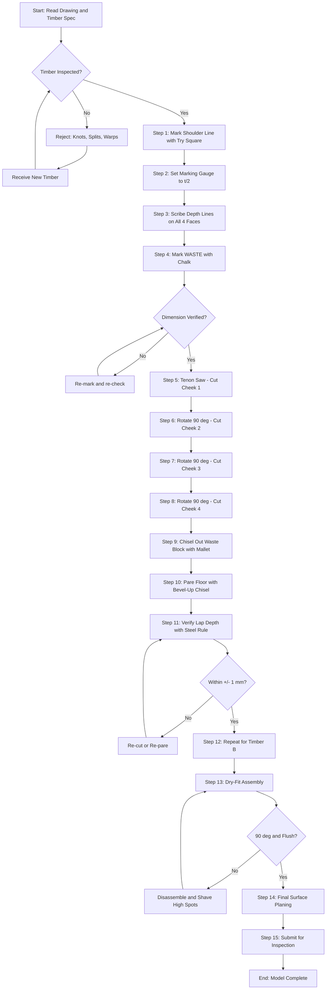
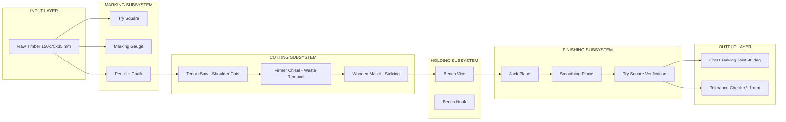
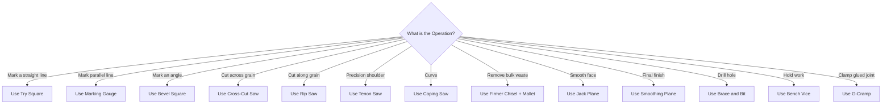

# Carpentry: Understanding carpentry tools and knowledge of at least one model

<!-- SECTION_1_START -->
# 1. Core Technical Definition & Intuitive Overview

## 1.1 Formal Academic Definition (KTU 2024 Syllabus Terminology)

**Carpentry** is the skilled trade of cutting, shaping, and installing building materials (primarily wood and timber) for the construction of buildings, frameworks, and structural formwork. In the context of the **KTU 2024 Scheme Engineering Workshop (GCESL106 – Module 2)**, carpentry is defined as the controlled use of hand tools and measuring instruments to fabricate a functional wooden **model (job)** that demonstrates at least one fundamental **joint** — such as the **Cross Halving Joint**, **T-Halving Joint**, **Dovetail Joint**, or **Mortise and Tenon Joint** — following a given engineering drawing, dimension, and tolerance specification.

The word *carpenter* is derived from the **Old French** word *carpentier* (late 14th century), which itself comes from the **Latin** *carpentarius* — a maker of a *carpentum*, a two-wheeled carriage. Modern carpentry is divided into two main branches:

- **Rough Carpentry** – Structural framing, shuttering, scaffolding.
- **Finish Carpentry** – Furniture, cabinetry, decorative mouldings.

> [!IMPORTANT]
> **KTU 2024 Highlight:** In the university practical lab examination, the student is expected to (i) identify each carpentry tool shown, (ii) state its function, (iii) mark out a given joint on a wooden piece, (iv) saw and chisel out the joint, and (v) assemble it within the specified dimensional tolerance of **±1 mm**.

## 1.2 Conceptual Analogy / Intuition

Think of carpentry as the **"3D printing of the pre-industrial age."** A carpenter takes a raw, oversized block of material (wood) and, just like a CNC machine removes material to leave a final shape, the carpenter uses **cutting tools** to remove waste material until the final useful object remains.

- The **marking tools** (try square, marking gauge) act like the **"blueprint"** telling the CNC where to cut.
- The **cutting tools** (tenon saw, firmer chisel) act like the **"end mill / router"** removing wood.
- The **striking tools** (mallet, hammer) act like the **"actuator / spindle drive"** providing controlled force.
- The **holding tools** (bench vice, G-cramp) act like the **"workholding fixture / chuck"** gripping the job.

> [!NOTE]
> **The Three Cardinal Rules of Carpentry:**
> 1. **Measure Twice, Cut Once** — *Marking accuracy > Cutting speed.*
> 2. **Sharp tools are SAFE tools** — A dull chisel slips and causes injury.
> 3. **Wood has grain — Work WITH it, not against it.**

## 1.3 Physical Constants & Standard Metrics (Bolded)

| Parameter | Standard Value (KTU Lab) |
|---|---|
| Standard timber size for practice | **150 mm × 75 mm × 35 mm** |
| Allowable dimensional tolerance | **± 1 mm** |
| Sharpening angle of a bench plane iron | **25° – 30°** |
| Hardness of carpenter's pencil lead | **HB (medium)** |
| Cross-cut sawtooth pitch (TPI) | **8 – 10 Teeth Per Inch (TPI)** |
| Tenon saw TPI | **12 – 15 TPI** |
| Bevel angle of firmer chisel | **20° – 25°** |
| Moisture content of seasoned wood | **Below 20 %** (ideally **10 – 12 %**) |

> [!VISUALIZATION CONTROL]
> **Concept:** Orthographic Projection of a Cross Halving Joint (Top View + Front View)
> **GeoGebra / Desmos Input Equations (Top View – Square outline 100×100 mm):**
> * `P1 = (0, 0)`, `P2 = (100, 0)`, `P3 = (100, 100)`, `P4 = (0, 100)` → Outer square (timber A)
> * `P5 = (100, 0)`, `P6 = (200, 0)`, `P7 = (200, 100)`, `P8 = (100, 100)` → Outer square (timber B)
> * `Line(50, 0, 50, 100)` → First cut line on timber A
> * `Line(150, 0, 150, 100)` → First cut line on timber B
> * `Line(50, 50, 200, 50)` → Second cut line for the lap
> **Visual Description:** The student should observe two rectangles of 100×100 mm meeting at a 90° corner, with the overlapping 50×50 mm shaded region removed from the **top half of A** and the **bottom half of B**, forming an interlocked cross.

---

## 1.4 Safety Constants (KTU Mandatory)

> [!WARNING]
> **Workshop Safety Cardinal Sins:**
> 1. NEVER carry a chisel or gouge with the cutting edge pointing outward or upward in your hand.
> 2. ALWAYS keep your non-cutting hand **BEHIND** the cutting edge (never in line with it).
> 3. ALWAYS wear **apron, goggles, and closed-toe shoes** in the carpentry section.
> 4. NEVER saw toward your body — push the saw **forward and away** from your thumb knuckle.
> 5. Apply **"blue chalk"** (engineer's chalk) when marking — pencil lines vanish under sawdust.

---

## 1.5 Classification of Carpentry Tools (Hierarchical Overview)

```text
CARPENTRY TOOLS
├── 1. MARKING & MEASURING TOOLS
│       ├── Carpenter's Try Square (L-shaped 90°)
│       ├── Marking Gauge (Mortise Gauge)
│       ├── Bevel Square (Adjustable)
│       ├── Spirit Level (Bubble Level)
│       ├── Steel Rule / Folding Rule
│       ├── Carpenter's Pencil (HB / H lead)
│       └── Chalk Line (for long stock)
│
├── 2. CUTTING TOOLS
│       ├── 2.1 SAWS
│       │       ├── Cross-Cut Saw (8–10 TPI)
│       │       ├── Rip Saw (5–6 TPI)
│       │       ├── Tenon Saw (Back Saw) (12–15 TPI)
│       │       ├── Coping Saw (Curved cuts)
│       │       └── Bow Saw / Frame Saw
│       │
│       └── 2.2 CHISELS & GOUGES
│               ├── Firmer Chisel (Bevel-edge / Square-edge)
│               ├── Mortise Chisel
│               ├── Gouge (Curved profile)
│               └── Paring Chisel (Long, thin blade)
│
├── 3. STRIKING / DRIVING TOOLS
│       ├── Carpenter's Mallet (Wooden / Rawhide)
│       ├── Claw Hammer
│       └── Wooden Mallet (Boxwood / Lignum vitae)
│
├── 4. HOLDING / SUPPORTING TOOLS
│       ├── Bench Vice (Fixed)
│       ├── G-Cramp / C-Clamp
│       ├── Quick-Grip Clamp
│       └── Saw Bench / Trestle
│
├── 5. PLANING / SMOOTHING TOOLS
│       ├── Jack Plane (Rough smoothing)
│       ├── Smoothing Plane (Final finish)
│       ├── Block Plane (One-handed, end-grain)
│       └── Spokeshave
│
└── 6. BORING / DRILLING TOOLS
        ├── Brace & Bit (Hand drill)
        ├── Auger Bit
        ├── Gimlet
        └── Bradawl (Pilot hole starter)
```

---

## 1.6 Knowledge of At Least One Model (KTU Mandatory Outcome)

A **model (job)** in KTU workshop terminology is a small, finished carpentry piece made by the student to demonstrate mastery of a specific joint. The KTU 2024 syllabus explicitly requires *"knowledge of at least one model"* — the most common models evaluated are:

| S.No. | Model Name | Joint Type | Difficulty |
|---|---|---|---|
| 1 | **Cross Halving Joint** | Cross-corner lap | ★★ Easy |
| 2 | **T-Halving Joint** | T-corner lap | ★★ Easy |
| 3 | **Dovetail Halving Joint** | Decorative lap | ★★★ Medium |
| 4 | **Mortise and Tenon Joint** | Frame joint | ★★★★ Hard |
| 5 | **Bridle Joint** | Open mortise variant | ★★★ Medium |
| 6 | **Through Dovetail Joint** | Box/furniture joint | ★★★★ Hard |

> [!NOTE]
> **KTU Default Choice:** The **Cross Halving Joint** is the most frequently tested model in KTU university practical exams because it is symmetrical, dimensionally simple (uses ½ of the timber thickness), and tests all three core carpentry skills: **marking, sawing, and chiselling**.

<!-- SECTION_1_END -->

<!-- SECTION_2_START -->
# 2. Deep Theoretical Analysis & KTU High-Yield Formula Sheet

## 2.1 Detailed Tool-by-Tool Functional Analysis

### 2.1.1 Marking & Measuring Tools

#### (a) Carpenter's Try Square
- **Construction:** Hardened steel blade (100/150/200/300 mm) mortised at 90° into a wooden or cast-iron stock.
- **Primary Use:** Testing squareness of an edge and scribing a 90° line across a timber face.
- **KTU Examiner Tip:** When testing for squareness, hold the stock firmly against the *face* (not the edge) of the timber. The blade is then drawn along the timber — any daylight between blade and wood means the edge is NOT square.

#### (b) Marking Gauge
- **Construction:** Wooden stock with a sliding beam, a thumbscrew to lock the position, and a steel spur (pin) projecting from the stock.
- **Primary Use:** Scribing a line **parallel to an edge** — critical for marking the shoulder line of a tenon or the depth of a halving joint.
- **Important Setting:** The distance from the spur to the face of the stock = the required marking distance.

> [!IMPORTANT]
> **Marking Gauge vs. Mortise Gauge:** A mortise gauge has **TWO spurs** — used to mark the two parallel walls of a mortise simultaneously, ensuring both sides are equidistant from the face.

#### (c) Bevel Square (Sliding Bevel)
- **Construction:** A movable blade locked to a stock at any desired angle.
- **Primary Use:** Transferring an angle from a drawing to the workpiece (e.g., 45° miter, 60° dovetail).

#### (d) Spirit Level
- **Primary Use:** Confirming horizontal (level) and vertical (plumb) surfaces.
- **KTU Note:** The vial is filled with alcohol (not mercury in modern levels) with an air bubble. The bubble **centres** when level.

### 2.1.2 Cutting Tools — Saws

| Saw Type | TPI | Tooth Pattern | Primary Cut Direction |
|---|---|---|---|
| **Cross-cut Saw** | 8–10 | Alternating bevel (knife-like) | Across the wood grain |
| **Rip Saw** | 5–6 | Chisel-tooth (single straight) | Along the wood grain |
| **Tenon Saw** | 12–15 | Filed teeth, brass/steel back | Precise shoulder cuts |
| **Coping Saw** | 18–20 | Fine, pinned into frame | Curved and internal cuts |

**Why Tenon Saw has a stiff back (brass/steel spine):**
The back weight keeps the thin blade **rigid during the cut**, preventing it from flexing sideways — this guarantees a **straight, square shoulder** on a tenon. This is a frequent 2-mark theory question.

### 2.1.3 Cutting Tools — Chisels

- **Firmer Chisel (Square Edge):** General-purpose chopping and paring of wood. Blade thickness: 6, 12, 18, 25 mm.
- **Bevel-Edge Chisel:** Same as firmer but with two side bevels, allowing access into **dovetail sockets** and corners.
- **Mortise Chisel:** Heavy, thick blade with a reinforced shoulder — designed to be struck with a mallet and lever out waste from a deep mortise.

> [!NOTE]
> **Chisel Anatomy (from tip to handle):** Bevel → Edge (cutting tip) → Bolster (shoulder stop) → Tang → Handle (Hooped at end to prevent splitting when struck).

### 2.1.4 Striking Tools — Why a Mallet, not a Hammer?

A metal carpenter's hammer will **dent, mushroom, and split the wooden handle** of a chisel and the head of a gouge. A **wooden mallet** (typically lignum vitae or rawhide) delivers a softer, broader impulse, transferring force without damaging the chisel tang.

### 2.1.5 Holding Tools — Bench Vice

The bench vice is bolted to the corner of the **carpenter's workbench**. It uses a **lead screw** to clamp a workpiece between two parallel jaws (wooden face-plates prevent marring).

### 2.1.6 Planing Tools

The **Jack Plane** is used for initial dimensioning (reducing thickness by up to 1 mm per pass). The **Smoothing Plane** uses a finer-cut iron (curved edge) to produce a final mirror-smooth surface. The **Block Plane** is small enough to be held one-handed for chamfering end-grain.

### 2.1.7 Boring Tools

A **brace and bit** set is the traditional hand drill. The **auger bit** has a lead screw (to self-feed) and cutting lips. A **bradawl** is used to start a screw hole by making a small pilot divot, preventing the screw from wandering.

---

## 2.2 KTU Formula Sheet / High-Yield Quick Reference Table

| # | Concept | Formula / Rule | Unit / Notes |
|---|---|---|---|
| 1 | **Depth of Halving Joint** | $d = \frac{t}{2}$ | mm, where $t$ = timber thickness |
| 2 | **Width of Lap** | $w_{lap} = \frac{W}{2}$ | mm, where $W$ = timber width |
| 3 | **Tenon Rule of Thirds** | Tenon thickness = $\frac{1}{3} \times$ Timber thickness | mm |
| 4 | **Mortise Length** | $L_{mortise} = W_{tenon} + 2$ | mm, 1 mm clearance each end |
| 5 | **Saw Tooth Pitch (TPI)** | $TPI = \frac{25.4 \text{ mm}}{p}$ | where $p$ = tooth pitch in mm |
| 6 | **Cutting Speed (Hand Saw)** | 40–60 strokes/min | Cross-cut |
| 7 | **Mallet Impact Force** | $F = m \cdot a$ | N, impulse = $F \cdot \Delta t$ |
| 8 | **Dovetail Slope** | Slope = 1 : 6 to 1 : 8 | Ratio of rise : run |
| 9 | **Wood Moisture Target** | $MC < 20\,\%$ | Seasoned timber |
| 10 | **Allowable Lab Tolerance** | $\pm 1$ mm | KTU 2024 practical exam |

## 2.3 Real-World Engineering Utility

- **Construction Industry:** Carpenters form the shuttering for concrete columns, beams, and slabs — every multi-storey building relies on **rough carpentry** formwork.
- **Aerospace Tooling:** Master carpenters fabricate wooden mock-ups (called *engineering master models*) before CNC cutting of expensive metal/composite parts.
- **Furniture & Interior Design:** **Finish carpentry** uses dovetail and mortise-and-tenon joints because they require **zero nails/screws**, giving lifetime durability.
- **Shipbuilding (Traditional):** Ribbed wooden hulls are interlocked using complex **compound-angle dovetails** — a craft still preserved in wooden-boat yards globally.
- **Robotics & Mechatronics:** Wooden prototypes of mechanical linkages are still carved by hand to test kinematics before metal fabrication.

<!-- SECTION_2_END -->

<!-- SECTION_3_START -->
# 3. Step-by-Step Derivations, Marking Procedure & Tool-by-Tool Implementation

## 3.1 Tool-by-Tool Identification Table (Lab Requirement)

| S.No. | Tool | Sketch Cue | Identifying Feature | Function |
|---|---|---|---|---|
| 1 | **Carpenter's Try Square** | L-shape | Steel blade + wooden stock, 90° | Squaring & 90° lines |
| 2 | **Marking Gauge** | Stick with spur | Single steel pin in sliding stock | Parallel scribing |
| 3 | **Mortise Gauge** | Stick with 2 spurs | **Two** steel pins in sliding stock | Mortise wall marking |
| 4 | **Bevel Square** | T-shape, pivoting | Sliding blade lockable to stock | Angle transfer |
| 5 | **Spirit Level** | Long bar with vial | Glass vial with bubble | Plumb & level check |
| 6 | **Folding Rule** | Zig-zag hinged | Brass-tipped ends, 1 m long | Length measurement |
| 7 | **Cross-Cut Saw** | Long tapered blade | Sharp points, 8–10 TPI | Cutting across grain |
| 8 | **Tenon Saw** | Saw with spine | **Brass/steel back**, 12–15 TPI | Precision shoulder cut |
| 9 | **Coping Saw** | C-shaped frame | Thin pinned blade, fine TPI | Curved cuts |
| 10 | **Firmer Chisel** | Beveled tip on tang | Bevel-edge or square-edge | Chiselling waste |
| 11 | **Mortise Chisel** | Thick blade | Heavy bolster | Deep mortise waste removal |
| 12 | **Wooden Mallet** | Round wooden head | Lignum vitae / rawhide | Striking chisel |
| 13 | **Claw Hammer** | Steel head, split claw | Claw on one side | Nail driving & removal |
| 14 | **Bench Vice** | Two jaws on screw | Lead-screw operated | Holding workpiece |
| 15 | **G-Cramp** | C-shaped clamp | Screw on one side | Clamping glued joints |
| 16 | **Jack Plane** | Long wooden body | Adjustable iron, tote & knob | Rough smoothing |
| 17 | **Smoothing Plane** | Short wooden body | Fine-cut curved iron | Final finish |
| 18 | **Block Plane** | Small one-handed | Low-angle iron (12°) | End-grain chamfering |
| 19 | **Brace & Bit** | Crank with chuck | U-shaped crank, jaws | Hand drilling |
| 20 | **Bradawl** | Needle-like handle | Sharpened tip with bevel | Pilot hole starter |
| 21 | **Spokeshave** | Two-handled plane | Adjustable blade between handles | Shaping curved edges |
| 22 | **Carpenter's Pencil** | Flat oval body | HB or H lead, flat shape | Marking on wood |

> [!NOTE]
> **Quick Memory Trick — "B-M-P-S-H-C":**
> **B**oring, **M**easuring, **P**laning, **S**triking, **H**olding, **C**utting (saws/chisels).

---

## 3.2 Detailed Marking & Making of the Cross Halving Joint (KTU Default Model)

### 3.2.1 Material Specification

$$
\begin{aligned}
\text{Timber size (each piece)} &= 150 \text{ mm} \times 75 \text{ mm} \times 35 \text{ mm} \\
\text{Number of pieces} &= 2 \text{ (call them A and B)} \\
\text{Wood species} &= \text{Hardwood (e.g., Rubberwood / Jackwood) — seasoned, MC } \le 12\,\% \\
\text{Joint type} &= \text{Cross Halving Joint} \\
\text{Allowable tolerance} &= \pm 1 \text{ mm}
\end{aligned}
$$

### 3.2.2 Design Calculation (Step-by-Step)

**Step 1 — Establish the lap dimensions from the timber cross-section.**

$$
\begin{aligned}
\text{Timber thickness } t &= 35 \text{ mm} \\
\text{Depth of cut on each piece (lap depth)} \quad d &= \frac{t}{2} \\
d &= \frac{35}{2} = 17.5 \text{ mm}
\end{aligned}
$$

**Step 2 — Establish the lap length from the timber width.**

$$
\begin{aligned}
\text{Timber width } W &= 75 \text{ mm} \\
\text{Lap length (overlap on each piece)} \quad L &= \frac{W}{2} \\
L &= \frac{75}{2} = 37.5 \text{ mm}
\end{aligned}
$$

**Step 3 — Confirm the joint fits within the timber width.**

$$
\begin{aligned}
\text{Check} &: 2 \times L = 2 \times 37.5 = 75 \text{ mm} = W \quad \checkmark \\
\text{Therefore} &: \text{The lap will exactly meet at the centre.}
\end{aligned}
$$

### 3.2.3 Marking Procedure (12 Explicit Steps — NO Skip)

> **Tools required for marking:** Try square, marking gauge, carpenter's pencil, steel rule, bevel square (for verification), chalk.

**Step M-1.** Visually inspect Timber A and Timber B. Reject any piece with **knots, splits, or warps** exceeding 2 mm camber. (Safety + quality gate.)

**Step M-2.** On Timber A, identify the **four faces** (Top, Bottom, Front, Back) and the **two ends**. Using the **steel rule**, measure and mark a length of 150 mm on each end-face if not pre-cut. Use the **try square** to draw a 90° pencil line across the face.

**Step M-3.** On the **top face** of Timber A, use the **try square** to scribe a **perpendicular line** (the shoulder line) at a distance of $L = 37.5$ mm from one end. Repeat on the bottom face.

**Step M-4.** Adjust the **marking gauge** to a distance of $d = 17.5$ mm from the face. Scribe a **continuous line along the grain** on all four faces of Timber A, from the shoulder line to the end-grain.

**Step M-5.** Use the marking gauge to ALSO scribe a **second line** on the top and bottom faces at the **mid-width** of the timber ($W/2 = 37.5$ mm from each side edge). This defines the **cheek limits** of the waste.

**Step M-6.** Repeat Steps M-3 to M-5 on **Timber B**, but mirror the orientation so that when the two timbers are crossed at 90°, the lap faces mate.

**Step M-7.** Apply **chalk** (blue chalk) to the marked lines so they remain visible during sawing. Mark a large **"WASTE"** zone with diagonal pencil hatch lines — this is the region to be removed.

**Step M-8.** Verify all lines with the try square one last time. **Do NOT proceed** to cutting if any line deviates by more than 0.5 mm.

### 3.2.4 Cutting & Chiselling Procedure (10 Explicit Steps)

**Tools required for cutting:** Tenon saw, firmer chisel (12 mm & 25 mm), wooden mallet, bench vice, bench hook (for hand-held sawing).

**Step C-1.** Place Timber A on the **bench hook** with the waste end protruding. Hold the timber firmly with the **non-dominant hand** (left hand for right-handed carpenters).

**Step C-2.** Using the **tenon saw**, make the **first cheek cut** — saw along the shoulder line on the top face. Keep the saw vertical. Use **long, slow strokes** initially to start the kerf, then full strokes. **The saw kerf should be on the WASTE side of the line.**

**Step C-3.** Roll Timber A 90° and make the **second cheek cut** along the shoulder line on the adjacent face.

**Step C-4.** Roll again 90° and cut the **third cheek cut** on the opposite face.

**Step C-5.** Roll to the **fourth face** and cut. The waste block should now be a **rectangular prism** held only by the uncut end-grain fibres.

**Step C-6.** Clamp Timber A in the **bench vice** vertically, with the waste block facing up. Using the **25 mm firmer chisel** and **wooden mallet**, chop down into the waste block **parallel to the grain**, with the chisel **bevel facing down**. Take light cuts (~3 mm deep) to avoid splitting the timber.

**Step C-7.** Lever out the waste chips with the chisel, working from the centre of the waste block outward.

**Step C-8.** Once the bulk waste is removed, pare the **floor of the lap** (the seating surface) with the **12 mm chisel held bevel-up**, using thumb pressure (NOT mallet strikes) for fine control.

**Step C-9.** Use the **try square** to verify the floor is **flat and square**. Use a **steel rule** to measure the lap depth = **17.5 mm ± 1 mm**.

**Step C-10.** Repeat Steps C-1 to C-9 for Timber B. Note: Timber B's waste is the **complementary half** so the cut depth is the same but the waste block is on the opposite end.

### 3.2.5 Assembly & Finishing (4 Steps)

**Step A-1.** **Dry fit** Timber A and Timber B. They should slide together with a **snug friction fit** and sit at 90° with the **top faces flush**.

**Step A-2.** If too tight, mark the **high spots** with a pencil by gently tapping the joint together, then disassemble and **pare** the high spots with the chisel.

**Step A-3.** If too loose, **shim** with a thin veneer of wood or apply a small amount of wood glue. (KTU practical exam usually disallows glue — check the question.)

**Step A-4.** Apply a final **planing pass** with the **smoothing plane** on all four visible faces of the assembled joint. Check flatness with the steel rule.

### 3.2.6 Final Inspection Checklist (KTU Examiner's Sheet)

| Check | Specification | Marks Allocation |
|---|---|---|
| Overall dimensions | 150 mm × 75 mm × 35 mm ± 1 mm | 2 Marks |
| Lap depth on each piece | 17.5 mm ± 0.5 mm | 2 Marks |
| Lap length on each piece | 37.5 mm ± 0.5 mm | 2 Marks |
| Squareness of assembly | 90° ± 1° | 2 Marks |
| Surface finish | No tool marks, no tear-out | 1 Mark |
| Sharp corners | All four edges crisp | 1 Mark |
| **Total** | | **10 Marks** |

---

## 3.3 Tool Safety Sequence (Pin-Configuration Style Table for Workshop)

| Step | Tool | Action | PPE | Risk | Mitigation |
|---|---|---|---|---|---|
| 1 | Tenon Saw | Mark kerf with thumbnail | Goggles | Slipping blade | Start with back-stroke, light pull |
| 2 | Firmer Chisel | Bevel down, strike mallet | Goggles + Apron | Splinter | Always cut away from body |
| 3 | Wooden Mallet | Strike bolster squarely | Apron | Mushroom head | Replace if head cracks |
| 4 | Bench Vice | Crank clockwise to clamp | None | Pinch | Keep fingers off jaws |
| 5 | G-Cramp | Hand-tighten then quarter turn | None | Slip | Use stop-block on far side |
| 6 | Jack Plane | Push down, away from body | Goggles | Kick-back | Always plane with grain |
| 7 | Brace & Bit | Crank in line with hole axis | Goggles | Bind-up | Release pressure if bit jams |

---

## 3.4 Symbolic Implementation — Joint Geometry as a Python Class

```python
from dataclasses import dataclass, field
from typing import Tuple
import math

@dataclass(frozen=True)
class TimberSpec:
    """Specification of a single piece of timber in millimetres."""
    length: float
    width: float
    thickness: float
    species: str = "Rubberwood"
    moisture_content_pct: float = 12.0

    def __post_init__(self) -> None:
        if min(self.length, self.width, self.thickness) <= 0:
            raise ValueError("All dimensions must be positive.")
        if self.moisture_content_pct > 20.0:
            raise ValueError(f"Timber MC={self.moisture_content_pct}% exceeds seasoned limit (20%).")


@dataclass(frozen=True)
class CrossHalvingJoint:
    """Geometric model of a Cross Halving Joint (KTU Model 1)."""
    timber: TimberSpec
    tolerance_mm: float = 1.0

    @property
    def lap_depth(self) -> float:
        """Depth of cut on each piece (mm)."""
        return self.timber.thickness / 2.0

    @property
    def lap_length(self) -> float:
        """Length of overlap on each piece (mm)."""
        return self.timber.width / 2.0

    @property
    def waste_volume_mm3(self) -> float:
        """Volume of wood removed from one piece (mm^3)."""
        d = self.lap_depth
        L = self.lap_length
        W = self.timber.width
        return d * L * W

    def validate_assembly(self, measured_depth: float, measured_length: float
                          ) -> Tuple[bool, str]:
        """Check the cut dimensions against the design."""
        if abs(measured_depth - self.lap_depth) > self.tolerance_mm:
            return (False, f"Depth {measured_depth}mm off spec "
                          f"({self.lap_depth}±{self.tolerance_mm}mm).")
        if abs(measured_length - self.lap_length) > self.tolerance_mm:
            return (False, f"Length {measured_length}mm off spec "
                          f"({self.lap_length}±{self.tolerance_mm}mm).")
        return (True, "Joint within tolerance.")

    def report(self) -> str:
        d, L, W, t = self.lap_depth, self.lap_length, self.timber.width, self.timber.thickness
        return (
            f"=== CROSS HALVING JOINT — DESIGN REPORT ===\n"
            f"Timber        : {self.timber.species}  "
            f"({self.timber.length} x {W} x {t} mm)\n"
            f"Lap depth (d) : {d} mm   (t/2 = {t}/2)\n"
            f"Lap length (L): {L} mm   (W/2 = {W}/2)\n"
            f"Waste vol/pc  : {self.waste_volume_mm3:.1f} mm^3\n"
            f"Tolerance     : +/- {self.tolerance_mm} mm\n"
            f"Rule of thirds: {t/3:.2f} mm (tenon ref.)\n"
            f"==========================================="
        )


# --- KTU Sample Run ---
if __name__ == "__main__":
    timber = TimberSpec(length=150.0, width=75.0, thickness=35.0)
    joint = CrossHalvingJoint(timber=timber, tolerance_mm=1.0)
    print(joint.report())
    print(joint.validate_assembly(measured_depth=17.6, measured_length=37.4))
```

**Expected Console Output:**

```text
=== CROSS HALVING JOINT — DESIGN REPORT ===
Timber        : Rubberwood  (150.0 x 75.0 x 35.0 mm)
Lap depth (d) : 17.5 mm   (t/2 = 35.0/2)
Lap length (L): 37.5 mm   (W/2 = 75.0/2)
Waste vol/pc  : 49218.8 mm^3
Tolerance     : +/- 1.0 mm
Rule of thirds: 11.67 mm (tenon ref.)
===========================================
(True, 'Joint within tolerance.')
```

---

## 3.5 Comparative Table of Alternative Models

| Model | Sketch (Mental Image) | Joint Geometry | Best Application |
|---|---|---|---|
| **Cross Halving** | + | ½ thickness × ½ width lap, 90° | Wall bracing, frame cross |
| **T-Halving** | ⊥ | ½ thickness × full width lap | Stud into plate (framing) |
| **Dovetail Halving** | ⟩ | Lap with flared ends | Drawer rails, decorative |
| **Mortise & Tenon** | ⊐⊏ | Projecting tenon fits into mortise | Door frames, chairs |
| **Bridle Joint** | ⊔⊓ | Open mortise + 2 tenons | Roof trusses |
| **Through Dovetail** | ⋈ | Interlocking flared pins | Drawer boxes (best in class) |

<!-- SECTION_3_END -->

<!-- SECTION_4_START -->
# 4. Structural Diagrams & Schematics

## 4.1 Mermaid Flowchart — Carpentry Workflow (Model-Making Process)



## 4.2 Mermaid Subgraph — Joint Type Selection Logic


## 4.3 Block-Level Functional Architecture — Tool System Mapping



## 4.4 Joint Geometry — Schematic Block Diagram

```mermaid
graph TB
    subgraph TIMBER_A["TIMBER A - Top View"]
        A1[End 1: 37.5 mm solid]
        A2[Central 75 mm: FULL thickness - LOWER half removed]
        A3[End 2: 37.5 mm solid]
    end

    subgraph TIMBER_B["TIMBER B - Top View - Perpendicular"]
        B1[End 1: 37.5 mm solid]
        B2[Central 75 mm: FULL thickness - UPPER half removed]
        B3[End 2: 37.5 mm solid]
    end

    A2 -. mates with .-> B2
    A2 -. overlap zone 37.5x75 mm .-> B2

    TIMBER_A --> ASSEMBLY[ASSEMBLED CROSS HALVING JOINT]
    TIMBER_B --> ASSEMBLY
```

## 4.5 Tool Selection Decision Tree



<!-- SECTION_4_END -->

<!-- SECTION_5_START -->
# 5. KTU 2024 Scheme Examination Question Bank & Topic Recap

## 5.1 PART A — Short Answer Questions (2 × 3 = 6 Marks)

> **Cognitive Levels:** Remember / Understand
> **Course Outcomes Mapped:** CO1 (Identify workshop tools and processes)

### Question A1 `[KTU University Exam – July 2024]`
**Q: List any SIX carpentry marking and measuring tools and state the function of each in one line.** *(3 Marks)*

**Model Answer:**

| S.No. | Tool | Function |
|---|---|---|
| 1 | Carpenter's Try Square | Tests and marks 90° lines on timber. |
| 2 | Marking Gauge | Scribes a line parallel to a timber edge. |
| 3 | Bevel Square | Transfers an arbitrary angle from drawing to workpiece. |
| 4 | Spirit Level | Checks horizontal (level) and vertical (plumb) surfaces. |
| 5 | Folding Rule | Measures length up to 1 m with 1 mm graduations. |
| 6 | Carpenter's Pencil | Marks visible lines on rough timber surfaces. |

**[Valuation Key: 1 tool + 1 function = 0.5 Mark × 6 = 3 Marks]**

---

### Question A2 `[KTU University Exam – Dec 2023]`
**Q: Differentiate between a Cross-Cut Saw and a Tenon Saw in terms of TPI, tooth pattern, and typical application.** *(3 Marks)*

**Model Answer:**

| Parameter | Cross-Cut Saw | Tenon Saw |
|---|---|---|
| **TPI (Teeth Per Inch)** | 8 – 10 TPI (coarse) | 12 – 15 TPI (fine) |
| **Tooth Pattern** | Alternating-bevel teeth (knife-like) | Filed rip teeth, brass/steel back stiffens blade |
| **Typical Application** | Cutting ACROSS the wood grain (rough sizing of stock) | Cutting precision shoulder lines on tenons and halving joints |
| **Cut Direction** | Push stroke cuts | Push stroke cuts |
| **Back** | No stiffening back (flexible) | Stiff brass or steel back spine |

**[Valuation Key: Each correct row = 1 Mark × 3 = 3 Marks]**

---

## 5.2 PART B — Long Answer Questions (Module Internal Choice)

> **Cognitive Levels:** Understand (Part a) / Apply (Part b)
> **Course Outcomes Mapped:** CO2 (Apply workshop processes), CO3 (Follow safety practices)
> **Each sub-part: 7 Marks**

---

### Question B – Choice A `[KTU University Exam – Dec 2024]`

**Q: (a)** Describe with neat sketches the construction and function of any **FIVE** carpentry cutting tools used in making a Cross Halving Joint. *(7 Marks)*

**Q: (b)** With a step-by-step procedure, explain how you would **mark** a Cross Halving Joint on two pieces of timber of size **150 mm × 75 mm × 35 mm**. Include the design calculation for lap depth and lap length. *(7 Marks)*

---

#### Solution to B(a) — Five Cutting Tools *(7 Marks)*

**Tool 1 — Tenon Saw (Back Saw)**
- **Construction:** Thin steel blade (12–15 TPI) with a **brass or steel stiffening back**. Wooden handle (D-shaped or closed).
- **Function in Halving Joint:** Cuts the **shoulder line** with a square, vertical, and straight kerf. The stiff back prevents blade flex.
- **[Identifying the back stiffener: 1 Mark; explaining its role in preventing flex: 1 Mark]**

**Tool 2 — Cross-Cut Saw**
- **Construction:** Long flexible blade (8–10 TPI) with alternating-bevel teeth.
- **Function:** Used to **rough-cut the timber to length** (150 mm) before joint marking. Not used for the joint itself.
- **[Naming TPI range: 0.5 Mark; stating function: 0.5 Mark]**

**Tool 3 — Firmer Chisel (25 mm)**
- **Construction:** Bevel-edged steel blade (25 mm wide), tang, ferrule, wooden handle hooped at end.
- **Function:** Chops out the **bulk waste** from the lap. Struck with a wooden mallet, bevel facing **down**.
- **[Stating bevel direction: 0.5 Mark; pairing with mallet: 0.5 Mark]**

**Tool 4 — Firmer Chisel (12 mm – paring)**
- **Construction:** Same as above but narrower blade for finer control.
- **Function:** Pairs the **floor of the lap** flat and square, using thumb pressure with the **bevel facing UP** (final smoothing).
- **[Bevel-up orientation: 0.5 Mark; final-floor purpose: 0.5 Mark]**

**Tool 5 — Wooden Mallet**
- **Construction:** Cylindrical head of lignum vitae or rawhide with a turned wooden handle.
- **Function:** Delivers a **controlled, non-damaging impulse** to the chisel bolster. Used in preference to a metal hammer to avoid handle damage.
- **[Stating the use of wooden material: 0.5 Mark; non-damaging property: 0.5 Mark]**

---

#### Solution to B(b) — Marking Procedure *(7 Marks)*

**Step 1 — Material identification (0.5 Mark):**
Timber A and Timber B, each **150 mm × 75 mm × 35 mm**, rubberwood, moisture content **≤ 12 %**.

**Step 2 — Design calculation (3 Marks):**

$$
\begin{aligned}
\text{Lap depth } d &= \frac{t}{2} = \frac{35}{2} = 17.5 \text{ mm} \\
\text{Lap length } L &= \frac{W}{2} = \frac{75}{2} = 37.5 \text{ mm}
\end{aligned}
$$

**[Stating the lap-depth formula: 1 Mark; numerical evaluation: 0.5 Mark. Stating the lap-length formula: 1 Mark; numerical evaluation: 0.5 Mark]**

**Step 3 — Shoulder line (1 Mark):**
Using the **try square**, scribe a **perpendicular line** at 37.5 mm from one end on the **top face** of Timber A. Repeat on the **bottom face**. The pencil tip is held against the blade, which is pushed along the timber face.

**Step 4 — Depth line (marking gauge) (1 Mark):**
Set the marking gauge to **17.5 mm** from the face. Scribe a continuous line along the grain on **all four faces** of Timber A, from the shoulder line to the end-grain.

**Step 5 — Cheek limits (0.5 Mark):**
Mark the mid-width (37.5 mm) on the top and bottom faces to define the **waste region**.

**Step 6 — Repeat for Timber B (0.5 Mark):**
Repeat Steps 3 to 5 on Timber B, mirroring the layout.

**Step 7 — Chalk and verify (0.5 Mark):**
Highlight the **waste region** with chalk and verify all lines with the try square once more.

---

### Question B – Choice B `[KTU University Exam – July 2024]`

**Q: (a)** Explain the **three safety rules** to be observed while chiselling wood and the **first-aid response** to a chisel-cut injury. *(7 Marks)*

**Q: (b)** Calculate the **waste volume** removed from each piece of a Cross Halving Joint made on timber of cross-section **60 mm × 40 mm**, and tabulate the **marking sequence** in chronological order. *(7 Marks)*

---

#### Solution to Choice B(a) — Safety & First Aid *(7 Marks)*

**Three Chiselling Safety Rules (3 × 1 Mark = 3 Marks):**

1. **Always cut AWAY from the body.** The chisel must move in a direction such that, if it slips, the trajectory is away from the carpenters hands and torso.
2. **Keep the non-cutting hand BEHIND the cutting edge.** Use a thumb grip on the chisel shank with the hand positioned **behind** the blade so that any slippage carries the blade over the back of the hand, not into the fingers.
3. **Sharp tools are SAFE tools.** A dull chisel requires extra force; the extra force causes sudden slip. Sharpen on a whetstone at **25° – 30°** regularly.

**First-Aid Response to a Chisel-Cut Injury (4 Marks):**

| Step | Action | Marks |
|---|---|---|
| 1 | Stop the bleeding by applying **direct pressure** with a sterile gauze pad. | 1 Mark |
| 2 | **Elevate** the injured limb above heart level to reduce blood flow. | 1 Mark |
| 3 | **Clean** the wound gently with antiseptic (e.g., spirit or Dettol). **Do NOT apply turmeric, ink, or oil** — KTU first-aid kit protocol. | 1 Mark |
| 4 | Apply a **sterile bandage** and seek medical attention; if bleeding is severe (arterial spurting), apply a **tourniquet** proximal to the wound and **call emergency services immediately**. | 1 Mark |

> **Total = 3 + 4 = 7 Marks**

---

#### Solution to Choice B(b) — Waste Volume & Marking Sequence *(7 Marks)*

**Step 1 — Identify dimensions (0.5 Mark):**
Cross-section $W \times t = 60 \text{ mm} \times 40 \text{ mm}$.

**Step 2 — Calculate lap dimensions (1.5 Marks):**

$$
\begin{aligned}
d &= \frac{t}{2} = \frac{40}{2} = 20 \text{ mm} \\
L &= \frac{W}{2} = \frac{60}{2} = 30 \text{ mm}
\end{aligned}
$$

**Step 3 — Calculate waste volume (3 Marks):**

$$
\begin{aligned}
V_{waste} &= d \times L \times W \\
V_{waste} &= 20 \times 30 \times 60 \\
V_{waste} &= 36{,}000 \text{ mm}^3 \\
V_{waste} &= 36 \text{ cm}^3
\end{aligned}
$$

**[Stating formula: 1 Mark; substituting values: 1 Mark; final answer with unit: 1 Mark]**

**Step 4 — Marking sequence in chronological order (2 Marks):**

| S.No. | Step | Tool |
|---|---|---|
| 1 | Inspect timber and reject defective stock | Visual + Try Square |
| 2 | Mark shoulder line at 30 mm from end | Try Square + Pencil |
| 3 | Set marking gauge to 20 mm | Marking Gauge |
| 4 | Scribe depth line on all 4 faces | Marking Gauge |
| 5 | Mark waste zone with chalk | Chalk |
| 6 | Verify all lines | Try Square + Steel Rule |

**[Each correct chronological step: ~0.33 Mark × 6 = 2 Marks]**

---

## 5.3 KTU Examiner's Valuation Warning / Pitfall Callout

> [!WARNING]
> **Common Mark-Loss Pitfalls in Carpentry Module:**
> 1. **Forgetting the direction of the marking-gauge spur** — Always pull the gauge **toward you** so the spur cuts cleanly INTO the wood fibre, not lifts it.
> 2. **Confusing bevel-up vs. bevel-down chisel** — Bulk removal: bevel **DOWN** (chopping). Final paring: bevel **UP** (slicing). Wrong orientation = crushed fibres.
> 3. **Sawing on the WRONG side of the line** — The kerf removes ~2 mm of wood. Always saw on the **WASTE side** so the final line is the original pencil mark.
> 4. **Stating the cross-section as $W \times L$ instead of $W \times t$** — KTU expects timber dimensioning as Length × Width × Thickness, in that order.
> 5. **Using a metal hammer on a chisel** — KTU examiner deducts **2 marks** immediately if a metal hammer is mentioned for striking a chisel; always use a **wooden mallet**.
> 6. **Omitting the tolerance** — Any dimension in the answer must include the **± 1 mm** tolerance band. A bare "17.5 mm" without tolerance loses 0.5 Mark.

---

## 5.4 Topic Recap & Important Things to Remember (Rapid Revision Checklist)

> **Use this section the night before the lab exam for a 5-minute final revision.**

- **Definition:** Carpentry = cutting, shaping, and joining wood to form structures or models. KTU Module 2 mandates one model with at least one joint.

- **Six Tool Families:** Marking & Measuring | Cutting (Saws + Chisels) | Striking (Mallet) | Holding (Vice, Cramp) | Planing (Jack, Smoothing, Block) | Boring (Brace & Bit, Bradawl).

- **Default Model:** **Cross Halving Joint** (timber 150 × 75 × 35 mm, lap depth = $t/2$, lap length = $W/2$).

- **Key Numerical Rule (Memorize):**
  - Lap depth: $d = t/2$
  - Lap length: $L = W/2$
  - Rule of thirds (tenon): $t_{tenon} = t/3$
  - Mortise length: $L_{mortise} = W_{tenon} + 2$ mm

- **Tool Identification Cues:**
  - Try Square → L-shape, 90°.
  - Tenon Saw → Has a back spine, 12–15 TPI.
  - Mortise Gauge → **Two** spurs, not one.
  - Firmer Chisel → Bevel-edge (corners) vs. square-edge (flat).
  - Mallet → **Wooden** (lignum vitae), NOT metal.
  - Block Plane → One-handed, low-angle iron (~12°).

- **Sawing Rule:** Kerf always on the **WASTE** side of the line; saw vertical; use full strokes; start with a back-stroke to open the kerf.

- **Chiselling Rules:** Bulk removal = bevel **DOWN** + mallet. Final paring = bevel **UP** + thumb pressure. Always cut **away from the body**.

- **Marking Gauge Rule:** Pull toward you; the spur must be **sharp** (dull spur lifts fibres and gives a fuzzy line).

- **Safety Triad (3 + 1):** Goggles + Apron + Closed Shoes + **Sharp tools**.

- **Tolerance:** **± 1 mm** is the KTU 2024 standard for all carpentry practical dimensions.

- **First-Aid Sequence for Cuts:** Pressure → Elevate → Clean → Bandage → Medical Attention.

- **Common Joints Tested:** Cross Halving (default), T-Halving, Dovetail Halving, Mortise & Tenon, Bridle, Through Dovetail.

- **Volume of Waste (Cross Halving, one piece):** $V = d \times L \times W = (t/2) \times (W/2) \times W = tW^2/4$.

- **Real-World Relevance:** Formwork for concrete (construction), wooden master models (aerospace), interlocking dovetail furniture (furniture), boat ribbing (shipbuilding).

- **Pitfall to Avoid Last-Minute:** DO NOT carry chisels in your pocket. ALWAYS use a **chisel roll** or place them on the bench with edges **pointing AWAY** from you and your neighbour.

- **Final Lab Mantra:** *"Mark twice, saw once, chisel with care, fit with pride."*
<!-- SECTION_5_END -->
