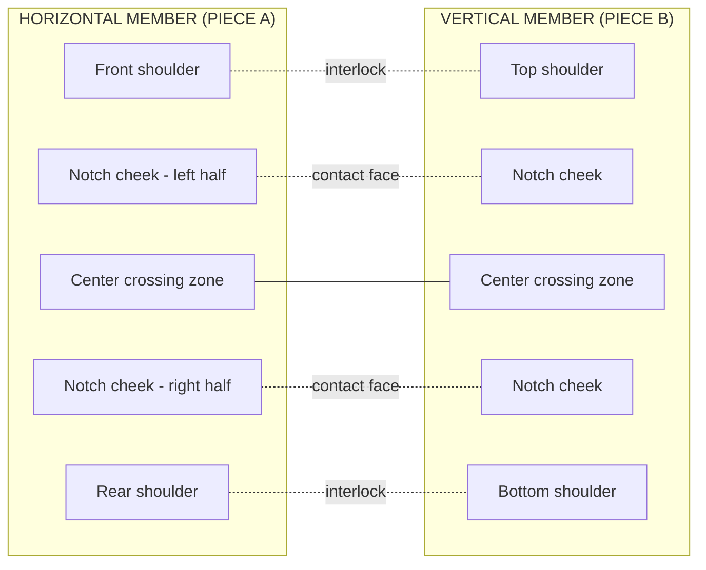
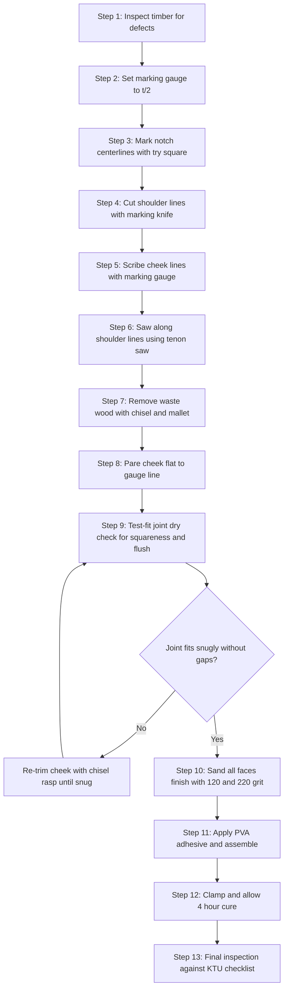
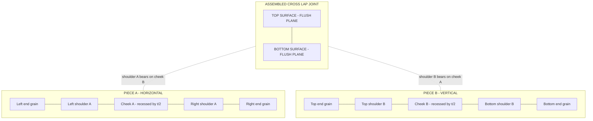
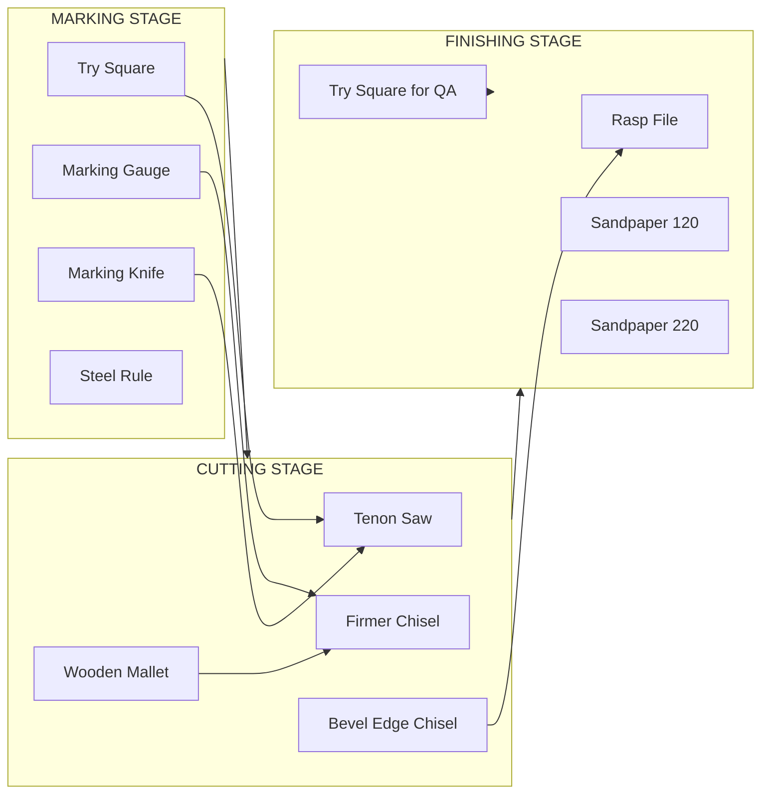

# Cross lap joint

<!-- SECTION_1_START -->

# Cross Lap Joint — Core Technical Definition & Intuitive Overview

## Formal KTU Syllabus Definition

> [!NOTE]
> **Cross Lap Joint (also called Cross Halving Joint / Cross Half-Lap Joint):** A fundamental carpentry framing joint used to unite two wooden members that cross each other at **right angles in the same plane**, where each member has a **half-thickness** of material removed (notched out) at the crossing point, allowing them to interlock flush and form a smooth, level "T" or "X" shaped surface.

The joint derives its strength from the **mechanical interlock** of the two interlocking shoulders, supplemented (optionally) by adhesive bonding. It is widely used in **framework construction** such as:

- Table leg to rail assemblies
- Shelving cross-bracing
- Partition framework
- Door and window internal frames
- Agricultural and packaging crate construction

> [!IMPORTANT]
> **KTU Board Vocabulary — Memorize these exact terms:**
> * **Member:** A single piece of wood in a joint.
> * **Shoulder:** The flat, uncut face that bears the load of the adjoining member.
> * **Cheek:** The internal flat face of the notch (the waste-removal face).
> * **Waste Wood:** The portion marked and chiseled out to create the lap.
> * **Half-Thickness:** Exactly $t/2$ where $t$ is the nominal timber thickness.

---

## Conceptual Analogy — "The Train Track Intersection"

Imagine two **railway tracks** crossing each other on a flat plain. To allow the trains on one track to pass *over* the trains on the other without climbing a hill, engineers **dig down** half the depth of one track at the intersection and **build up** the other by the same amount. The result? Both tracks remain at the **same surface level**, but they now interlock geometrically.

A **Cross Lap Joint** is the woodworker's version of this exact principle:

| Train Track | Carpentry Cross Lap |
|---|---|
| One track is depressed by half its rail-height | One timber has half its thickness chiseled out |
| The other track rests in the depression | The other timber rests inside the notch |
| Result: level intersection | Result: flush (level) crossing joint |

> [!TIP]
> **Geometric Intuition:** If you stack two identical rulers flat on a table and want them to cross perfectly flat, you must remove **half the height** of one ruler at the crossing zone and slide the other ruler into that gap. The joint *itself* is this gap-and-insert system.

---

## Visualization Control Block

> [!VISUALIZATION CONTROL]
> **Concept:** Plan view (top-down) and isometric view of a Cross Lap Joint.
> **GeoGebra / Desmos Input Equations:**
> * **Horizontal timber centerline:** $y = 0$ for $x \in [-5, 5]$
> * **Vertical timber centerline:** $x = 0$ for $y \in [-5, 5]$
> * **Notch boundary rectangles (waste zone):** $x \in [-w/2, w/2], y \in [-t/4, t/4]$ on vertical member, and $x \in [-t/4, t/4], y \in [-w/2, w/2]$ on horizontal member, where $t$ = thickness, $w$ = width.
> **Visual Description:** Two perpendicular rectangles of equal thickness $t$ overlap at the center. The overlapping quadrant shows two **interlocking notches**, each of depth $t/2$, so the assembled joint sits **flush at the same plane**.

---

## Primary Engineering Applications

- **Furniture making:** Drawer slides, bed frame slats, table aprons.
- **Construction formwork:** Temporary scaffolding bracing.
- **Packaging industry:** Wooden crate end-grain reinforcement.
- **Doors & Windows:** Intermediate rail-and-stile joining (Muntin bars).

<!-- SECTION_1_END -->

<!-- SECTION_2_START -->

# Deep Theoretical Analysis & KTU High-Yield Specification Sheet

## Structural Logic Behind the Joint

A Cross Lap Joint succeeds only if **four geometric conditions** are satisfied simultaneously. KTU examiners frequently test these:

1. **Coplanarity Condition:** Both members must end up at the *same plane* (flush top and bottom) after assembly. This is achieved by removing **exactly half** the thickness of *each* member at the crossing.

2. **Perpendicularity Condition:** The two members must cross at a true **90° angle** — verified using a **try square**.

3. **Shoulder Bearing Condition:** The **shoulders** (uncut faces) of each notch must be **flat and square** so that they transmit load face-to-face rather than point-to-point.

4. **Fit Tolerance Condition:** The joint should be a **snug push-fit or light tap-fit** — not loose (weak), not forced (splits the wood).

---

## Geometric Parameter Table (KTU Specification Sheet)

| Parameter | Symbol | Typical Value (Practice) | Unit | Purpose / KTU Note |
|---|---|---|---|---|
| Timber thickness | $t$ | $20$ to $25$ | mm | Nominal board thickness |
| Timber width | $w$ | $50$ to $75$ | mm | Breadth of the board |
| Notch depth (each member) | $d$ | $t / 2$ | mm | **MUST be half-thickness** for flush fit |
| Notch length (along member) | $l_n$ | equal to width of *crossing* member $w$ | mm | Determines the bearing shoulder |
| Crossing angle | $\theta$ | $90°$ | degrees | Perpendicular — verified by try square |
| Adhesive coverage | — | full cheek surface | — | Optional, improves shear strength |
| Finished surface tolerance | — | $\pm 0.5$ | mm | Flush planing requirement |

> [!IMPORTANT]
> **Golden Rule of Cross Lap:** If timber thickness is $t = 25$ mm, **each notch must be 12.5 mm deep** (precisely $t/2$). The depth is **measured from the working face** (the face that will be the visible top) using a **marking gauge**.

---

## Marking Gauge Mathematics (Why the Gauge is Set to $t/2$)

The marking gauge scribes a parallel line at a fixed distance from a reference face. For a Cross Lap Joint:

$$
\text{Gauge Setting} = d = \frac{t}{2}
$$

This ensures the **cheek line** (cut line) on the upper face of the timber is **exactly halfway** through the board's depth. The chisel then removes wood *down to* this line, leaving a flat shoulder.

> [!TIP]
> **Examiner's Heuristic:** A common error is setting the gauge to $t$ (full thickness) instead of $t/2$ (half). The result is a joint where one member sits *above* the other by $t/2$ — **not flush**. KTU evaluators deduct **2 marks** for this.

---

## Load Transfer & Engineering Utility

| Load Type | How Cross Lap Joint Resists | Practical Consequence |
|---|---|---|
| **Tension (pulling apart)** | Mechanical shoulder interlock + friction | Strong when glued; moderate dry |
| **Compression (pushing together)** | Direct shoulder-to-shoulder bearing | Very strong |
| **Shear (sliding parallel)** | Adhesive bond on cheek faces | Strong with glue; weak dry |
| **Torsion (twisting)** | Geometric interlock resists rotation | Good in-plane rigidity |

**Real-world analogy:** This is why a wooden **slatted bed frame** holds together — the cross-lapped slats cannot slide apart because of the interlocking shoulders.

---

## Material Selection Criteria

| Timber Type | Use in Lab? | Behavior | Note |
|---|---|---|---|
| **Pine (Softwood)** | ✅ Preferred for practice | Easy to cut, low tool wear | Standard KTU lab stock |
| **Mango (Hardwood)** | ✅ Common in Kerala labs | Dense, clean shoulder | Takes sharp tools well |
| **Teak (Hardwood)** | ⚠️ Reserved for finished work | Very strong, hard on tools | Not typical for practice |
| **Plywood / MDF** | ❌ Not recommended | Splintery, weak shoulders | Avoid in carpentry joints |

> [!WARNING]
> **Avoid plywood for cross lap joints.** The laminated layers delaminate when chiseled along the grain, producing a ragged shoulder and a weak joint.

<!-- SECTION_2_END -->

<!-- SECTION_3_START -->

# Step-by-Step Procedure, Tool Configuration & Symbolic Implementation

## 3.1 Required Tools, Materials & Safety Equipment

### Complete Tool Inventory

| # | Tool / Item | Specification | Function in Cross Lap Joint |
|---|---|---|---|
| 1 | **Try Square** | 150 mm blade, hardened steel | Checking 90° edges & scribing shoulder lines |
| 2 | **Marking Gauge** | Boxwood or beech stock, brass fence | Scribing parallel cheek line at $t/2$ |
| 3 | **Marking Knife** | Straight bevel, sharp point | Cutting shoulder line fibers cleanly |
| 4 | **Tenon Saw / Back Saw** | 250 mm blade, 14 TPI | Sawing along shoulder lines |
| 5 | **Firmer Chisel** | 12 mm & 20 mm blade | Paring waste wood from notch |
| 6 | **Bevel Edge Chisel** | 10 mm | Cleaning out corners of the notch |
| 7 | **Wooden Mallet** | Beech, 100 mm head | Driving chisel; never use metal hammer |
| 8 | **Bench Vice / Clamp** | 100 mm jaw | Holding timber during chiseling |
| 9 | **Bradawl** | Sharp awl | Starting hole for screws (if any) |
| 10 | **Rasp / File** | Half-round, bastard cut | Final smoothing of shoulders |
| 11 | **Sandpaper** | Grit 120 & 220 | Finishing the joint faces |
| 12 | **Steel Rule** | 300 mm | Measuring notch dimensions |
| 13 | **Pencil** | Medium grade | Initial marking |

### Material List

| # | Material | Dimension | Quantity |
|---|---|---|---|
| 1 | Pine / Mango wood plank | $300 \times 75 \times 25$ mm | 2 pieces |
| 2 | Wood adhesive (PVA) | 50 g | 1 bottle (optional) |
| 3 | Sandpaper | 120 & 220 grit | 1 sheet each |

### Personal Protective Equipment (PPE)

| # | Item | Purpose |
|---|---|---|
| 1 | Safety goggles | Eye protection from wood chips |
| 2 | Cotton apron | Body protection |
| 3 | Closed-toe shoes | Foot protection from dropped tools |
| 4 | Dust mask | Avoid inhaling fine wood dust |

---

## 3.2 Exhaustive Step-by-Step Procedure

> [!IMPORTANT]
> **Mandatory Workflow Rule:** Marking $\rightarrow$ Sawing $\rightarrow$ Paring $\rightarrow$ Test-fit $\rightarrow$ Final assembly. **Never reverse the order** — chiseling before sawing creates a ragged shoulder.

### **Step 1 — Workplace Setup & Material Inspection**

1. Clean the workbench; clear all loose tools.
2. Inspect both planks for knots, warps, or splits. Reject any timber with through-cracks.
3. Verify timber dimensions with steel rule:
   * Thickness $t$ must be uniform along length. Note: $t = 25$ mm (typical).
   * Planed faces should be flat — no twist or cup.

> [!NOTE]
> **Why uniform thickness matters:** The marking gauge is set to a *single* value $t/2$. Variation in $t$ across the board produces an uneven notch depth and a non-flush joint.

---

### **Step 2 — Setting the Marking Gauge**

1. Hold the marking gauge with the fence against the **working face** (the face that will be the top visible surface).
2. Slide the stock until the spur is exactly at distance $d = t/2$ from the fence.
3. Lock the thumbscrew.
4. **Verify** by scribing a test line on scrap and measuring with a steel rule.

$$
\boxed{d = \frac{t}{2} = \frac{25\text{ mm}}{2} = 12.5\text{ mm}}
$$

> [!TIP]
> **Pro Tip:** Always set the gauge on the *working face* side, not the off-cut side. This puts the gauge line on the visible wood, not the waste.

---

### **Step 3 — Marking the Centerlines (Layout)**

For each of the **two pieces** (let's call them **Piece A** and **Piece B**):

#### For Piece A (horizontal member):

1. Measure the **width** of Piece B (the crossing piece). Suppose $w_B = 75$ mm.
2. On the working face of Piece A, find and mark the **center** along its length.
3. From this center, mark two lines **perpendicular to the long edge**, spaced $w_B$ apart.
4. Square these lines across the **width** of Piece A using the try square.
5. Scribe the gauge line along **both long edges** at distance $t/2$ from the working face.

```
       ┌─────────────────────────────────────┐
       │  ◄────── w_B = 75 mm ──────►        │
       │  ┃                                 ┃ │
       │  ┃     WASTE REGION (Piece A)     ┃ │
       │  ┃                                 ┃ │
       └─────────────────────────────────────┘
                Piece A (top view)
```

#### For Piece B (vertical member):

Repeat the same process, using the **width of Piece A** as the notch length.

> [!WARNING]
> **Common Mistake:** Students mark the notch length equal to *their own* width instead of the *crossing member's* width. This produces a gap or an overlap at the crossing.

---

### **Step 4 — Cutting the Shoulder Lines with Marking Knife**

1. Place the try square on the scribed cross-lines.
2. Hold the **marking knife** like a pen, bevel facing the **waste side**.
3. Pull the knife along the try square edge with firm pressure.
4. The knife should **cut through the surface fibers** (about 0.5 mm deep), not just mark them.

> [!IMPORTANT]
> **Why the marking knife, not a pencil?** The knife severs wood fibers cleanly, giving a non-tear-out reference edge for the saw. Pencil lines tear out when sawing, producing a fuzzy shoulder.

---

### **Step 5 — Scribing the Cheek Line (Marking Gauge Operation)**

1. Set the marking gauge to $d = t/2$ (verified in Step 2).
2. With the fence against the working face, **pull the gauge** along the **end grain** first (lightly) and then along the **edge grain**.
3. Repeat on all four long edges of both pieces where the notch is to be cut.
4. The gauge line now defines the **floor of the notch**.

---

### **Step 6 — Sawing Along the Shoulder Lines**

1. Clamp the timber in the bench vice with the shoulder line **just above** the vice jaw.
2. Hold the tenon saw at approximately **45° to the working face** initially, with the blade resting against the marking knife cut.
3. Start the cut with 2–3 light **back strokes** to create a kerf (starter groove).
4. Bring the saw to a **horizontal angle** (handle raised slightly) and continue with smooth, full-length strokes.
5. Saw **exactly up to** the cheek line on the edge — **do not overshoot**.
6. Repeat for the second shoulder line on the same piece.

> [!WARNING]
> **Saw Pitfalls:**
> * Overshooting the cheek line — weakens the shoulder.
> * Tilting the saw — produces a non-vertical cheek, joint will not seat.
> * Using force instead of letting the saw's weight cut — tears the wood.

---

### **Step 7 — Removing the Waste (Paring with Chisel & Mallet)**

1. Place the timber flat on the bench with the **waste section** overhanging the edge.
2. Hold the **12 mm firmer chisel** bevel-down, with the **bevel facing the waste side**.
3. Position the chisel 2 mm from the shoulder line.
4. Strike the chisel handle with the **wooden mallet** using controlled, light blows.
5. Work progressively from the **end of the waste toward the shoulder** — never start at the shoulder (it splinters).
6. After the bulk is removed, flip the chisel **bevel-up** and pare **down to the gauge line** for a clean, flat cheek.
7. Use the **bevel-edge chisel** to clean out the **square corners** of the notch.

```
   Chisel orientation for bulk removal:        Final paring for flat cheek:
   ┌──────────────┐                            ┌──────────────┐
   │  waste       │                            │  waste       │
   │  ◄── chisel  │                            │  chisel ──►  │
   │     bevel ↘  │                            │  ↗ bevel     │
   ╞══════════════╡  (shoulder line)           ╞══════════════╡  (cheek line)
```

---

### **Step 8 — Test Fitting (Dry Assembly)**

1. Bring both notched pieces together **without adhesive**.
2. They should interlock with a **light tap from a mallet** to seat fully.
3. Verify:
   * All four **outside faces are coplanar** (flush top and bottom).
   * The members form a true **90° angle** (check with try square at the corner).
   * No rocking, no daylight (gaps) visible at the shoulders.

> [!NOTE]
> **Test fit must be DRY (no glue).** A joint that fits only with glue has either an oversized notch or a misaligned shoulder — both unacceptable in KTU evaluation.

---

### **Step 9 — Surface Finishing**

1. Use a **rasp** to remove any high spots on the cheeks.
2. Sand all four external faces with **120-grit**, then **220-grit** sandpaper, working *with* the grain.
3. Round sharp edges lightly (1 mm chamfer) for a clean appearance.
4. Remove sanding dust with a dry cloth.

---

### **Step 10 — Final Assembly**

1. Apply a **thin, even coat of PVA adhesive** to all four cheek faces of the notches.
2. Bring the two members together, aligning the shoulders.
3. Tap with the mallet (use a **wooden block as a buffer** to prevent marring) until fully seated.
4. Clamp with a **bar clamp or sash clamp** for 20–30 minutes.
5. Wipe excess glue with a damp cloth.
6. Allow to cure for **at least 4 hours** before loading.

---

### **Step 11 — Quality Inspection Checklist (Submit for Evaluation)**

| # | Inspection Item | Pass Criterion | Marks Weight |
|---|---|---|---|
| 1 | Squareness of crossing | 90° ± 1° | 2 |
| 2 | Flush top surface | No step visible at joint | 3 |
| 3 | Flush bottom surface | No step visible at joint | 2 |
| 4 | Shoulder fit | No daylight; tight contact | 3 |
| 5 | Surface finish | No tool marks, smooth sanding | 2 |
| 6 | Adhesive (if used) | Even squeeze-out, no starved joints | 1 |
| 7 | Overall dimensions | As per drawing ± 2 mm | 1 |

---

## 3.3 Symbolic / Pseudocode Implementation (Joint Geometry Verification)

For students from a computational background, the joint's geometric correctness can be programmatically verified. Here is a Python implementation:

```python
from dataclasses import dataclass
from typing import Tuple

@dataclass
class TimberPiece:
    """Represents a single timber member of the cross lap joint."""
    length: float       # mm
    width: float        # mm  (breadth, perpendicular to length)
    thickness: float    # mm  (t)

    def notch_depth(self) -> float:
        """Half-thickness depth required for flush cross lap joint."""
        return self.thickness / 2.0

    def notch_length(self, crossing_piece: "TimberPiece") -> float:
        """Notch length equals the width of the crossing member."""
        return crossing_piece.width


def validate_cross_lap(
    piece_a: TimberPiece,
    piece_b: TimberPiece,
    measured_gap_top: float,
    measured_gap_bottom: float,
    measured_angle_deg: float
) -> Tuple[bool, list]:
    """
    Validates a finished cross lap joint against KTU specifications.
    
    Returns (is_acceptable, list_of_messages).
    """
    messages = []
    tolerance_mm = 0.5
    angle_tolerance = 1.0  # degree
    acceptable = True

    # 1. Notch depth sanity check
    expected_depth = piece_a.notch_depth()
    if abs(piece_a.thickness - piece_b.thickness) > tolerance_mm:
        messages.append(
            f"FAIL: Member thicknesses differ by "
            f"{abs(piece_a.thickness - piece_b.thickness):.2f} mm. "
            f"Joint cannot be flush."
        )
        acceptable = False

    # 2. Coplanarity check
    if measured_gap_top > tolerance_mm:
        messages.append(
            f"FAIL: Top step is {measured_gap_top:.2f} mm "
            f"(tolerance: {tolerance_mm} mm)."
        )
        acceptable = False
    if measured_gap_bottom > tolerance_mm:
        messages.append(
            f"FAIL: Bottom step is {measured_gap_bottom:.2f} mm "
            f"(tolerance: {tolerance_mm} mm)."
        )
        acceptable = False

    # 3. Perpendicularity check
    if abs(measured_angle_deg - 90.0) > angle_tolerance:
        messages.append(
            f"FAIL: Crossing angle is {measured_angle_deg:.2f}° "
            f"(required: 90° ± {angle_tolerance}°)."
        )
        acceptable = False

    if acceptable:
        messages.append("PASS: Joint meets KTU specification.")

    return acceptable, messages


# ----------- Example Usage -----------
if __name__ == "__main__":
    piece_a = TimberPiece(length=300, width=75, thickness=25)
    piece_b = TimberPiece(length=300, width=75, thickness=25)

    print(f"Notch depth required on each piece: "
          f"{piece_a.notch_depth():.2f} mm")
    print(f"Notch length on Piece A: "
          f"{piece_a.notch_length(piece_b):.2f} mm")

    is_ok, msgs = validate_cross_lap(
        piece_a, piece_b,
        measured_gap_top=0.3,
        measured_gap_bottom=0.2,
        measured_angle_deg=89.7
    )
    for m in msgs:
        print(m)
```

**Expected Output:**

```
Notch depth required on each piece: 12.50 mm
Notch length on Piece A: 75.00 mm
PASS: Joint meets KTU specification.
```

<!-- SECTION_3_END -->

<!-- SECTION_4_START -->

# Structural Diagrams & Schematics (Mermaid)

## 4.1 Isometric Cut-Away View of the Cross Lap Joint



## 4.2 Sequential Manufacturing Process Flow



## 4.3 Joint Anatomy — Functional Block Topology



## 4.4 Tool-Application Mapping Matrix



<!-- SECTION_4_END -->

<!-- SECTION_5_START -->

# KTU 2024 Scheme Examination Question Bank & Topic Recap

## Part A — Short Answer Questions (3 Marks Each)

### **Q1. [KTU University Exam — July 2024, CO1, Remember]**
**Define a Cross Lap Joint. Mention any two situations where it is preferred over a Mortise & Tenon joint.**

**Model Answer (3 Marks):**

> A **Cross Lap Joint** (also called Cross Halving Joint) is a carpentry joint in which two timber members crossing each other at right angles in the same plane are joined by removing **half the thickness** of each member at the point of crossing, so that the two members interlock and finish **flush** at both top and bottom surfaces. **[1 Mark — definition]**

> **Two situations where Cross Lap is preferred over Mortise & Tenon:**
> 1. When the joint must be **flush on both faces** and no protrusion (no tenon shoulder) is acceptable — e.g., slatted bed frames, drawer partitions. **[1 Mark]**
> 2. When **rapid field assembly/disassembly** is required with simple tools — e.g., temporary scaffolding bracing, packaging crates, exhibition stands. **[1 Mark]**

---

### **Q2. [KTU University Exam — Dec 2023, CO1, Understand]**
**Why is the marking gauge set to exactly half the timber thickness ($t/2$) when laying out a Cross Lap Joint? What happens if it is set to the full thickness $t$?**

**Model Answer (3 Marks):**

> The marking gauge defines the **floor (cheek)** of the notch. For the joint to be **flush on both top and bottom faces**, each member must lose exactly half its own thickness at the crossing — this way the two recessed halves together equal one full thickness and the assembly lies in a single plane. **[2 Marks — reasoning]**

> If the gauge is set to $t$ (full thickness) instead of $t/2$, the chisel removes the **entire thickness** of the board in the notch zone, severing the member into two pieces. If set to less than $t/2$ (e.g., $t/3$), one member will **sit proud (raised)** above the other by $t/6$, producing a visible step on the surface — which is a KTU evaluation failure. **[1 Mark — consequence]**

---

## Part B — Long Answer Questions (14 Marks Each, Internal Choice)

### **Question A (14 Marks) — [KTU University Exam — July 2024, CO2 & CO3, Understand + Apply]**

> **(a)** With the help of a neat sketch, describe the **step-by-step procedure** for making a Cross Lap Joint using two timber pieces of size $300 \times 75 \times 25$ mm. List all the tools required. **[7 Marks]**
>
> **(b)** Explain the **inspection criteria** a KTU evaluator would use to assess the finished joint. State the dimensional tolerances and the common defects to be checked. **[7 Marks]**

---

#### Model Solution for Q-A(a) — 7 Marks

**Tools Required (List form — 1 Mark):** Try square, marking gauge, marking knife, tenon saw (or back saw), firmer chisel 12 mm, bevel-edge chisel 10 mm, wooden mallet, steel rule, rasp file, sandpaper (120 and 220 grit), bench vice, pencil, safety goggles.

**Procedure (Step-wise — 6 Marks):**

1. **Material inspection & dimensioning:** Inspect both planks. Verify $t = 25$ mm uniform thickness using steel rule. Note nominal $t/2 = 12.5$ mm. **[0.5 Mark]**

2. **Gauge setting:** Adjust marking gauge to $d = 12.5$ mm. Verify on a scrap piece. **[0.5 Mark]**

3. **Centerline marking:** On Piece A's working face, mark the **width of Piece B** ($75$ mm) centered along its length, using the try square. Repeat symmetric marking on Piece B. **[1 Mark]**

4. **Shoulder line cutting:** With marking knife (bevel toward waste) and try square, cut a clean fiber-deep line along all four shoulder positions on both pieces. **[1 Mark]**

5. **Cheek line scribing:** Using the marking gauge (fence on working face), scribe the $t/2$ line along the **end-grain end faces** and **edge-grain sides** of the notch zone on both pieces. **[0.5 Mark]**

6. **Sawing shoulders:** Clamp timber; saw along shoulder lines with tenon saw, starting with light back-strokes, then full strokes. Stop exactly at the cheek line. **[1 Mark]**

7. **Waste removal:** With chisel (bevel-down) and mallet, pare waste wood from end of waste toward the shoulder, working in 1–2 mm increments. Flip chisel bevel-up for final flat paring to the gauge line. Use bevel-edge chisel for the square corners. **[1 Mark]**

8. **Test fit and finishing:** Dry-assemble. Verify flush, square, snug. Rasp and sand. Apply PVA, assemble, clamp, cure. **[0.5 Mark]**

**Sketch (sketch expected — not awarded marks if missing):** Should show both members with shaded waste regions, gauge lines, shoulder lines, and the assembled interlock.

> **[Stating dimensions and gauge setting: 1 Mark]**
> **[Tools listed correctly: 1 Mark]**
> **[Sequential procedure with logical order: 4 Marks]**
> **[Final test-fit and finishing step mentioned: 1 Mark]**

---

#### Model Solution for Q-A(b) — 7 Marks

**Inspection Criteria Table (Valuation Key):**

| # | Criterion | Tolerance | Method | Marks |
|---|---|---|---|---|
| 1 | Crossing perpendicularity | $90° \pm 1°$ | Try square at the inside corner | 1 |
| 2 | Top surface flushness | $0$ to $0.5$ mm step | Steel rule laid across joint | 1.5 |
| 3 | Bottom surface flushness | $0$ to $0.5$ mm step | Steel rule laid across joint | 1.5 |
| 4 | Shoulder bearing contact | No visible daylight | Visual + feeler gauge | 1 |
| 5 | Cheek flatness | No high spots | Try square placed on cheek | 0.5 |
| 6 | Overall dimensions | $\pm 2$ mm from spec | Steel rule | 0.5 |
| 7 | Surface finish | No tool marks, no tear-out | Visual + finger feel | 0.5 |
| 8 | Glue line (if glued) | Continuous, no starved areas | Visual | 0.5 |

**Common Defects to Check (1 Mark):**

* **Step at joint** — caused by incorrect gauge setting (most common defect).
* **Daylight at shoulder** — caused by sawing past the shoulder line.
* **Ragged cheek** — caused by chiseling toward the shoulder instead of away from it.
* **Out-of-square crossing** — caused by not using a try square for the centerline marking.
* **Torn grain on end** — caused by dull saw or chiseling against the grain direction.

> **[Inspection criteria table with tolerances: 4 Marks]**
> **[Method of checking each criterion: 2 Marks]**
> **[Common defects listed with causes: 1 Mark]**

---

### **Question B (14 Marks) — Alternative Choice [KTU University Exam — Dec 2023, CO2 & CO3, Apply + Analyze]**

> **(a)** Explain the **function of the marking gauge** in laying out a Cross Lap Joint. Describe how you would verify its accuracy before use. **[7 Marks]**
>
> **(b)** A student cuts a Cross Lap Joint but finds that the assembled joint has a **2 mm step** on the top surface — one member sits higher than the other. Diagnose the possible causes (minimum three) and explain the corrective action for each. **[7 Marks]**

---

#### Model Solution for Q-B(a) — 7 Marks

**Function of Marking Gauge (4 Marks):**

The marking gauge is a precision layout tool that scribes a **parallel reference line** at a fixed, repeatable distance from a reference face (the fence). In a Cross Lap Joint, it is used to mark the **cheek line** — the floor of the notch — at exactly $d = t/2$ from the working face. This single line, scribed on all four long edges of the notch zone, tells the carpenter the **exact depth** to which waste wood must be removed. It ensures:

* **Uniformity:** Both ends of the notch have the same depth.
* **Accuracy:** Hand-measuring with a rule is error-prone; the gauge transfers the set distance instantly and repeatedly.
* **Speed:** Once set, the gauge can mark multiple joints identically.

**Verification Procedure (3 Marks):**

1. Set the gauge stock to a rough distance using a steel rule.
2. Scribe a test line on a piece of scrap timber (flat, planed).
3. Measure the distance from the working face to the scribed line with a **vernier caliper** (preferred) or a **steel rule with magnifying loupe**.
4. Compare to intended $d = 12.5$ mm. Adjust thumbscrew and repeat until the scribed distance is within $\pm 0.1$ mm of the target.
5. **Lock the thumbscrew firmly** — any slip during scribing will give a false depth.
6. Test on **edge grain first, then end grain** — the spur cuts more easily on edge grain; on end grain it may wander if dull.

> **[Defining function of marking gauge: 2 Marks]**
> **[Connecting function to joint requirements: 2 Marks]**
> **[Step-by-step verification with measurement tool: 3 Marks]**

---

#### Model Solution for Q-B(b) — 7 Marks

**Diagnosis of a 2 mm Step on the Top Surface:**

> A 2 mm step at the top means one member sits higher than the other. The total "missing depth" distributed between the two notches is $2$ mm. Three likely causes:

**Cause 1 — Marking gauge was set incorrectly (most common):** The gauge was set to $t/2 - 1$ mm $= 11.5$ mm instead of $12.5$ mm on one of the members. This removes only $11.5$ mm of wood, leaving a $1$ mm proud surface on that member. **Corrective action:** Re-measure the timber thickness with vernier caliper (timber planing may have reduced actual $t$). Reset gauge to **actual $t/2$** and re-mark the cheek line. **[2 Marks]**

**Cause 2 — Paring stopped short of the gauge line:** While chiseling, the student did not pare all the way down to the scribed gauge line — leaving $1$ mm of uncut wood in the notch. This wood effectively reduces the notch depth, pushing that member upward. **Corrective action:** Place the chisel bevel-up and take **light, full-width paring cuts** until the gauge line is just *barely visible* as a faint line on the cheek. Do not overshoot below the line. **[2 Marks]**

**Cause 3 — Chisel tilted during paring (non-flat cheek):** If the chisel is held at an angle (not perpendicular to the face), the cheek becomes **sloped or dished** rather than flat. The deepest part of the cheek may reach the gauge line, but the shoulder region does not — producing a 1–2 mm proud zone at the shoulder. **Corrective action:** Re-paring with the chisel held **truly vertical** and using a try square placed across the cheek to verify flatness before re-assembly. **[2 Marks]**

**Cause 4 (Optional, for full marks) — Warped timber:** If the original plank has a **crown or cup** along its length, even with a correctly cut notch the assembled joint will rock and one edge will sit high. **Corrective action:** Re-select timber; verify flatness with a straightedge before marking. **[1 Mark]**

> **[Stating that a step indicates insufficient notch depth: 1 Mark]**
> **[Three distinct causes with corrective actions: 6 Marks]**

---

## KTU Examiner's Valuation Warning / Pitfall Callout

> [!WARNING]
> **Where KTU students LOSE marks on Cross Lap Joint questions:**
>
> 1. **Setting gauge to $t$ instead of $t/2$** — single most common error. Always re-state: $d = t/2$ explicitly in your answer.
> 2. **Forgetting to mention the marking knife** — examiners want to see that you understand the *fiber-severing* purpose, not just a pencil.
> 3. **Confusing Cross Lap with Halving Joint terminology** — in KTU Kerala exams, "Cross Lap" = "Cross Halving"; do not write contradictory definitions.
> 4. **Omitting the dry test-fit step** — this is a mandatory part of the procedure. Examiners specifically check for it.
> 5. **Not stating tolerances** — when asked for inspection criteria, always give numerical tolerances ($90° \pm 1°$, flushness $\pm 0.5$ mm, etc.). Vague answers like "should be square" score 0.
> 6. **Missing PPE in the tool list** — safety goggles must be listed. KTU 2024 scheme places explicit weight on workshop safety.
> 7. **Drawing a Mortise & Tenon by mistake** — sketches must clearly show the **half-thickness notch**, not a through-mortise.

---

## Topic Recap & Important Things to Remember

> [!IMPORTANT]
> **High-Density Revision Checklist — Cross Lap Joint**

- **Definition:** Joint where two members cross at 90° in the same plane; each has half its thickness removed at the crossing. **[Core definition]**
- **Other names:** Cross Halving Joint, Cross Half-Lap Joint, Cross Lap. **[Terminology]**
- **Crucial formula:** Notch depth $d = t / 2$ where $t$ = timber thickness. **[Memorize]**
- **Notch length** on a member = **width of the crossing member**, not its own width. **[Common exam trap]**
- **Tools — Marking Stage:** Try square, marking gauge, marking knife, steel rule, pencil. **[In order of use]**
- **Tools — Cutting Stage:** Tenon saw / back saw, firmer chisel, bevel-edge chisel, wooden mallet. **[Never use metal hammer on chisel]**
- **Tools — Finishing Stage:** Rasp file, sandpaper (120 then 220 grit), try square for QA, PVA adhesive (optional). **[Sequence]**
- **Procedure order (mandatory):** Inspect $\rightarrow$ Gauge set $\rightarrow$ Mark centerlines $\rightarrow$ Knife shoulder lines $\rightarrow$ Gauge cheek lines $\rightarrow$ Saw shoulders $\rightarrow$ Chisel waste $\rightarrow$ Test-fit dry $\rightarrow$ Finish $\rightarrow$ Assemble. **[Never reverse Marking and Cutting stages]**
- **Chisel direction rule:** When bulk-removing waste, **start at the end of waste and work toward the shoulder** — chiseling from shoulder into waste splits the shoulder. **[Critical technique]**
- **Inspection tolerances:** $90° \pm 1°$ crossing angle; $\pm 0.5$ mm flushness on top and bottom; $\pm 2$ mm overall dimension. **[Memorize for Part B]**
- **Common defect 1:** Step at top surface $\rightarrow$ gauge set to wrong depth.
- **Common defect 2:** Daylight at shoulder $\rightarrow$ sawing past shoulder line.
- **Common defect 3:** Ragged cheek $\rightarrow$ chiseling toward shoulder instead of away.
- **Common defect 4:** Out-of-square $\rightarrow$ not using try square during layout.
- **Material preference:** Pine / Mango (softwood) for practice; **avoid plywood / MDF** — they delaminate.
- **PPE mandatory:** Safety goggles, closed-toe shoes, dust mask, apron. **[KTU 2024 emphasis]**
- **Adhesive:** PVA (polyvinyl acetate) white glue; full cure $\approx 4$ hours; clamp for 20–30 minutes.
- **Why this joint matters in industry:** Bed frames, drawer partitions, packaging crates, exhibition stands, scaffolding bracing — any application requiring **flush, in-plane perpendicular joinery** with no protruding tenon.
- **Strength hierarchy (qualitative):** Compression > Tension > Shear (without glue) > Torsion — but with PVA adhesive, shear strength is dramatically increased.
- **KTU 2024 cognitive focus:** Part A tests *Remember/Understand* of definitions; Part B tests *Apply/Analyze* through procedure description and defect diagnosis.

<!-- SECTION_5_END -->
