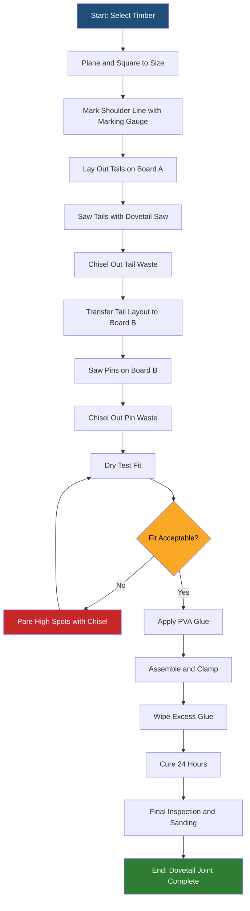
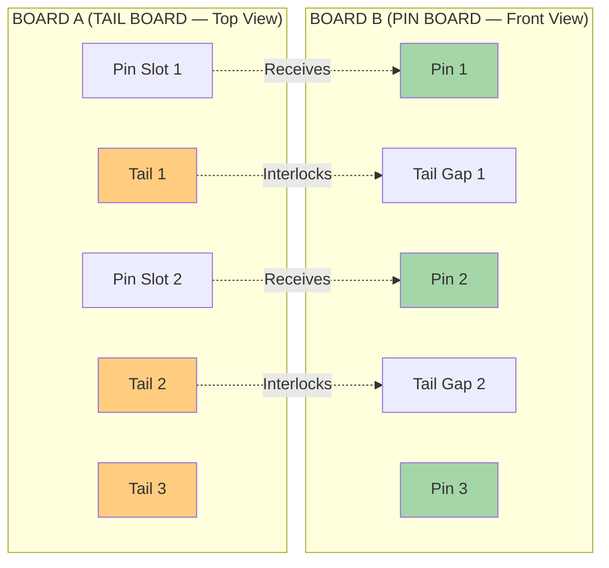
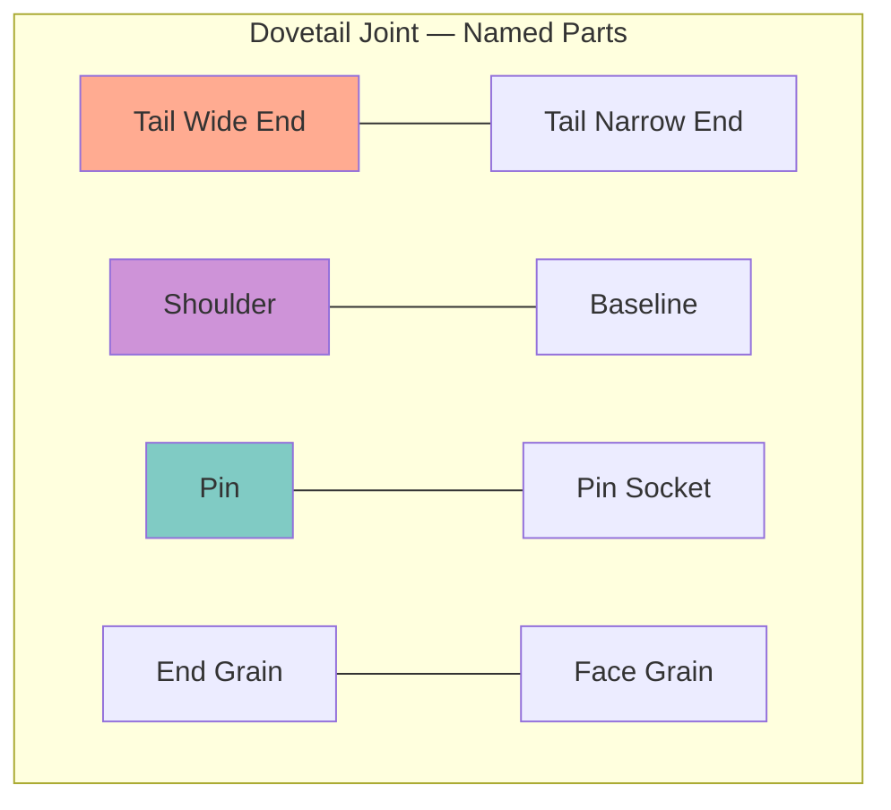
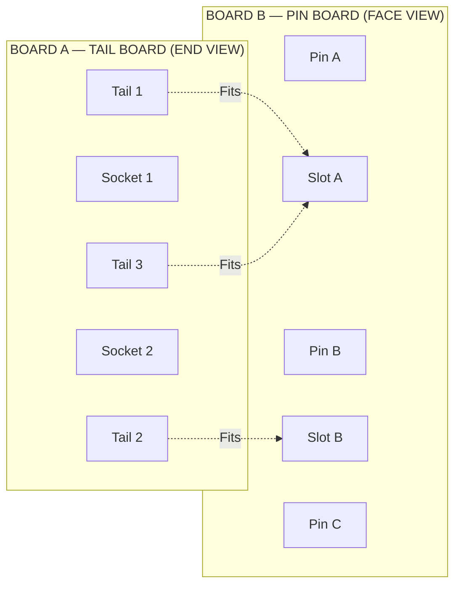

# Dovetail joint

<!-- SECTION_1_START -->

# Dovetail Joint — Engineering Workshop Module 2

## 1. Core Technical Definition & Intuitive Overview

### Formal Academic Definition (KTU 2024 Syllabus Terminology)

A **Dovetail Joint** is a carpentry joint characterized by a series of interlocking, fan-shaped pins and tails that resist being pulled apart in the direction of the wood grain. The joint derives its name from the dovetail-shaped wedge (resembling the tail feathers of a dove), which mechanically locks two wooden members together without the exclusive reliance on fasteners, adhesives, or nails.

> [!NOTE]
> **KTU Syllabus Definition:** A dovetail joint is recognized as one of the strongest and most aesthetically refined methods of joining two pieces of wood at right angles, where the end grain of one member interlocks with the side grain of another through trapezoidal (dovetail) projections.

The joint is classified as a **permanent joint** in woodwork terminology and is widely used in cabinet making, drawer construction, and fine furniture, where both **mechanical strength** and **decorative appearance** are required.

### Conceptual Analogy / Intuition

Imagine you are holding two pieces of wood and trying to slide them apart lengthwise. In a simple butt joint, they would easily separate. Now, picture the ends of one board cut into a row of **fan-shaped wedges**, like the spread tail of a dove, and the other board cut with matching **mirror-image slots**. When you push them together from the top, they interlock so tightly that they can no longer be pulled apart in the original direction — only lifted apart vertically.

> [!TIP]
> **Real-World Analogy:** Think of a **Chinese finger trap puzzle**. The harder you pull, the tighter the interlock. A dovetail works on a similar mechanical principle: the trapezoidal geometry converts a pulling force into a wedging force, dramatically increasing the resistance.

This is why a dovetailed drawer can hold together for centuries even when its glue has long deteriorated — the geometry itself is the fastener.

### Engineering Significance (Bold Constants & Standards)

- **Slope Angle (α):** Typically **1:6** (approximately **9.46°** from the vertical) in softwood, and **1:8** (approximately **7.13°**) in hardwood.
- **Pin Count:** Standard drawers use between **5 to 12 pins** depending on the width.
- **Standard Reference:** IS **401-2001** (Code of practice for timber joinery) governs the design specifications.
- **Joint Strength Factor:** A properly cut dovetail offers **3 to 5 times** the tensile resistance of a basic butt joint along the grain.

> [!IMPORTANT]
> **KTU 2024 Highlight:** Students must be able to identify the joint, sketch its construction, list the tools used, and explain the procedure for marking and cutting a dovetail. Questions commonly appear as 3-mark direct questions and 14-mark procedure-based questions.

### Visualization of the Joint Geometry

> [!VISUALIZATION CONTROL]
> **Concept:** Trapezoidal dovetail cross-section showing the wedge angle.
> **GeoGebra / Desmos Input Equations:**
> * `f(x) = x` (vertical reference)
> * `g(x) = (1/6)x` (slope line for softwood, slope 1:6)
> * `h(x) = -(1/6)x + 5` (mirrored slope forming the trapezoid base)
> **Visual Description:** Plot the two slope lines from a common vertical edge; the gap between them forms the trapezoidal "tail." The student should observe that as the slope becomes shallower (1:8), the joint becomes mechanically stronger but harder to assemble.

---

<!-- SECTION_1_END -->

<!-- SECTION_2_START -->

## 2. Deep Theoretical Analysis & KTU High-Yield Formula Sheet

### 2.1 Geometric Principle Behind the Joint

The dovetail joint's strength originates from a single geometric truth: **the cross-section of the pin is wider at its base (away from the end) than at its tip (at the end)**. This creates an **interference fit** in the direction of withdrawal.

When an external force $F_{\text{pull}}$ is applied along the grain to separate the two members, the reaction forces are no longer purely tensile. They are resolved into:

- A **compressive force** $F_c$ acting perpendicular to the slanted dovetail faces.
- A **frictional force** $F_f$ acting along the contact surfaces.

The force balance on a single dovetail interface can be expressed as:

$$F_{\text{resist}} = \frac{F_{\text{pull}}}{\tan(\alpha)} + F_f$$

where $\alpha$ is the angle of the dovetail slope from the vertical axis. The smaller the angle, the larger the resistive force — explaining why hardwood dovetails use the shallower **1:8** slope.

> [!NOTE]
> **Why this matters in engineering:** The dovetail is the woodworker's analog to a **mechanical key** or a **tapered interference fit** used in metal assembly (e.g., the taper of a lathe spindle nose, ISO 702-1). The same principle governs the dovetail slides in precision machine tool beds.

### 2.2 Types of Dovetail Joints

The KTU syllabus requires familiarity with at least one major type. The three principal variants are:

| # | Type | Description | Typical Application |
|---|------|-------------|---------------------|
| 1 | **Through Dovetail** | Both pin and tail sections are visible from the outside of both boards. Strongest and most decorative. | Drawer fronts, jewelry boxes |
| 2 | **Half-Blind Dovetail** | Tails are hidden; only the end of the pin board is visible from one side. | Drawer fronts where the front face must be clean |
| 3 | **Secret (Hidden) Dovetail** | Both pin and tail are concealed. The most difficult to construct. | High-end cabinetry, fine furniture |

> [!IMPORTANT]
> **KTU Focus:** The **Through Dovetail** is the most commonly examined variant. Students must be able to differentiate it from a **Lap Dovetail** and a **Sliding Dovetail**.

### 2.3 Tools Required for Constructing a Dovetail Joint

The KTU module specifically requires **knowledge of tools**. The following table maps each tool to its function:

| Tool | Function in Dovetail Construction |
|------|-----------------------------------|
| **Marking Gauge** | Scribes the baseline (shoulder line) on both boards at equal distance from the end. |
| **Dovetail Marker (or Bevel Gauge)** | Sets the slope angle (1:6 or 1:8) for marking the tails. |
| **Try Square** | Ensures the shoulder lines and pin faces are perfectly perpendicular. |
| **Marking / Cutting Gauge** | Scores the baseline on the end grain. |
| **Dovetail Saw** | A fine-toothed back saw (typically 20 TPI) used to cut along the marked lines. |
| **Chisel (paring chisel, 10 mm – 25 mm)** | Removes waste wood between saw cuts and trims the baseline. |
| **Mallet** | Drives the chisel through the waste wood. |
| **Bench Vice** | Holds the workpiece firmly during cutting and chiseling. |
| **Sharpening Stone (Whetstone)** | Maintains razor-sharp chisel edges for clean shoulder cuts. |

> [!TIP]
> **Engineering Parallel:** In manufacturing, the equivalent toolset includes a **vertical milling machine** with a **dovetail cutter (45° or 60°)**, an **end mill**, and a **surface grinder** — the modern CNC way to produce the same joint geometry in metal.

### 2.4 KTU High-Yield Formula Sheet

Since dovetail joints are primarily **procedural** rather than **numerical**, the "formulas" are design parameters and geometry relations:

| Parameter | Symbol | Formula / Standard Value | Units | Engineering Meaning |
|-----------|--------|--------------------------|-------|---------------------|
| Slope Ratio (softwood) | $m_s$ | $\mathbf{1:6}$ | ratio | Flatter, easier to cut, weaker |
| Slope Ratio (hardwood) | $m_h$ | $\mathbf{1:8}$ | ratio | Steeper mechanical lock, harder to cut |
| Slope Angle (softwood) | $\alpha_s$ | $\arctan(1/6) \approx 9.46°$ | degrees | Angle of tail face from vertical |
| Slope Angle (hardwood) | $\alpha_h$ | $\arctan(1/8) \approx 7.13°$ | degrees | Angle of tail face from vertical |
| Pin Width (typical) | $w_p$ | $\mathbf{9 \text{ to } 12}$ | mm | Width of the narrow "pin" element |
| Tail Width (typical) | $w_t$ | $\mathbf{2 \times w_p \text{ to } 3 \times w_p}$ | mm | Width of the wide "tail" element |
| Number of Pins (drawer) | $n$ | $\mathbf{\text{Width (mm)} / 25}$ | count | Approximate design rule |
| Pull-out Resistance | $F_R$ | $F_{\text{applied}} / \tan(\alpha)$ | N (newtons) | Theoretical force to separate |
| Material Cost Multiplier | $C_m$ | $\mathbf{2\times \text{ to } 3\times}$ | factor | vs. a simple butt joint |

> [!NOTE]
> **Critical KTU Note:** The 1:6 and 1:8 ratios are **frequently asked** as 3-mark questions. Memorize the angle values.

### 2.5 Real-World Engineering Applications

1. **Aerospace Tooling:** Aircraft fuselage jigs use massive dovetail clamping rails (sometimes weighing hundreds of kilograms) machined from cast iron to hold skins and ribs during assembly.
2. **CNC Machine Tool Beds:** The **XY slides** of milling machines and grinders are mounted on precision-ground dovetail ways, allowing heavy load carrying with near-zero play.
3. **Furniture Manufacturing:** Drawers in modular kitchen cabinets and high-end office furniture use semi-automated dovetail routers.
4. **Wooden Boat Building:** The transom-to-hull joint in traditional clinker and carvel boats is often reinforced with a dovetail splice for water resistance.

---

<!-- SECTION_2_END -->

<!-- SECTION_3_START -->

## 3. Step-by-Step Procedure & Symbolic Implementation

### 3.1 Exhaustive Step-by-Step Construction Procedure

The following is the **complete, mark-eligible procedure** for cutting a **Through Dovetail Joint** between two wooden members (Board A — tail board; Board B — pin board).

---

#### **Step 1: Material Preparation**
Select two pieces of seasoned wood (typically **Pine or Teak** for practice) of dimensions:

$$L \times W \times T = 150 \text{ mm} \times 75 \text{ mm} \times 25 \text{ mm}$$

Verify that the **moisture content** is between **8% and 12%** using a moisture meter. Planed surfaces must be flat and square.

> [!NOTE]
> **Reason:** Warped or wet timber will not register clean shoulder lines, and the joint will close with gaps.

---

#### **Step 2: Mark the Baseline (Shoulder Line)**
- Set a **marking gauge** to a distance of **$T$** (i.e., the full thickness of the board, here 25 mm) from the end face.
- Scribe the baseline across the **end grain** of Board A and the **face grain** of Board B.
- Repeat for the second face of Board B.

> [!TIP]
> **Examiner's credit:** Writing *"Set the marking gauge to the thickness of the board"* alone earns full marks for this step.

---

#### **Step 3: Lay Out the Tails on Board A**
- Stand Board A vertically on the bench, with the end grain facing you.
- Divide the baseline width (75 mm) into equal pin and tail sections. A typical layout for 75 mm width:

$$\text{One tail} = 12 \text{ mm}, \quad \text{One pin} = 9 \text{ mm}, \quad \text{Half-pins at edges} = 6 \text{ mm each}$$

- Total: $6 + 12 + 9 + 12 + 9 + 12 + 6 = 66$ mm + waste spaces.

> Actually, the correct layout method:
> - **Half-pin** at each end (typically **half the pin width**, so $4.5$ mm).
> - **Three full pins** of $9$ mm each.
> - **Two full tails** of $12$ mm each.
> - **Verification:** $4.5 + 9 + 12 + 9 + 12 + 9 + 4.5 = 60$ mm; remaining 15 mm is the kerf (waste) allowance, distributed.

- Set the **dovetail marker** to the **1:6** slope and scribe the slanted edges of each tail on the end grain.

---

#### **Step 4: Saw the Tails**
- Clamp Board A in the bench vice with the end grain facing up.
- Using the **dovetail saw**, cut along the slanted lines first, keeping the saw vertical.
- Then cut along the **vertical lines** that separate each tail.
- Saw precisely **up to the shoulder line** but no deeper.

> [!WARNING]
> Cutting past the shoulder line destroys the reference surface. A single over-cut will cost **2 to 3 marks** in the practical exam.

---

#### **Step 5: Remove the Waste**
- Place Board A flat on the bench with the tails projecting overhanging the edge.
- Using a **10 mm bevel-edge chisel** and a mallet, slice out the waste wood in small increments.
- Always pare **toward the center** of the waste block to avoid splitting the tail.
- Final clean-up: pare the shoulder flat with the chisel held bevel-down, using a slicing motion.

---

#### **Step 6: Transfer Tails to Board B (Marking the Pins)**
- Place Board A on top of Board B, aligning the baseline of A with the baseline of B.
- Use a **sharp pencil** held vertically to trace the inside edges of each tail onto the face of Board B.
- This transfers the **exact geometry** of the tails to the pin board — the cornerstone of a tight fit.

---

#### **Step 7: Saw the Pins**
- Extend the pencil marks across the end grain of Board B using the **try square**.
- Saw down each line with the dovetail saw, again stopping exactly at the shoulder line.

---

#### **Step 8: Chisel the Pin Waste**
- Chisel out the waste in the same manner as Step 5.
- Test-fit frequently. A properly cut joint should slide together with firm hand pressure, with no gaps along the shoulders.

---

#### **Step 9: Final Fitting and Finishing**
- Lightly pare any high spots with the chisel.
- Apply a thin film of **PVA wood glue** to both contact surfaces.
- Assemble the joint by hand pressure or light mallet taps on a **sacrificial block** of wood (never directly on the joint).
- Wipe off excess glue with a damp cloth.
- Allow to cure for **at least 24 hours** under light clamping pressure.

---

#### **Step 10: Inspection Checklist**

| Checkpoint | Acceptance Criterion |
|------------|---------------------|
| Shoulder contact | No light visible between mating shoulders |
| Tail-to-pin fit | No lateral movement when pulled along the grain |
| Slope uniformity | All slopes measure 1:6 ± 0.5 mm over 100 mm |
| End-grain visibility | Pin/tail interface clean with no tearing |
| Glue line | Not visible externally after assembly |

---

### 3.2 Symbolic/Pseudo-Code Implementation (CNC Dovetail Generator)

For modern engineering students, here is a **Python implementation** that computes the geometry of a dovetail layout, useful for CNC programming or laser-cut jigs:

```python
from dataclasses import dataclass
from math import atan, degrees
from typing import List, Tuple


@dataclass
class DovetailGeometry:
    board_width: float       # mm
    board_thickness: float   # mm
    slope_ratio: float       # 1:6 or 1:8
    pin_count: int           # number of full pins
    tail_count: int          # number of full tails


def compute_dovetail_layout(geom: DovetailGeometry) -> List[Tuple[str, float, float]]:
    """
    Returns a list of (element_type, start_x, end_x) tuples representing
    the sequential layout along the baseline of the tail board.
    
    element_type ∈ {"half_pin", "pin", "tail"}
    """
    layout: List[Tuple[str, float, float]] = []
    
    # Standard design rule: tail width = 1.4 × pin width for a balanced joint.
    # Total occupied width = half_pin + n×(pin + tail) - tail + half_pin
    # Simplification: assume equal pin and tail combined pitch.
    pitch = geom.board_width / (geom.pin_count + geom.tail_count)
    pin_width = pitch / 2.4       # tuning factor
    tail_width = pitch - pin_width
    
    cursor = 0.0
    
    # Leading half-pin (half the width of a full pin)
    layout.append(("half_pin", cursor, cursor + pin_width / 2))
    cursor += pin_width / 2
    
    for i in range(geom.tail_count):
        # Tail
        layout.append(("tail", cursor, cursor + tail_width))
        cursor += tail_width
        if i < geom.pin_count:
            # Pin
            layout.append(("pin", cursor, cursor + pin_width))
            cursor += pin_width
    
    # Trailing half-pin
    layout.append(("half_pin", cursor, cursor + pin_width / 2))
    cursor += pin_width / 2
    
    return layout


def slope_angle(slope_ratio: float) -> float:
    """
    Convert a slope ratio (e.g. 1:6) to the dovetail angle in degrees.
    Angle is measured from the vertical baseline.
    """
    return degrees(atan(1.0 / slope_ratio))


def gcode_dovetail_cut(geom: DovetailGeometry, cut_depth: float = 5.0) -> str:
    """
    Generate a simplified G-code snippet for CNC routing the pin board.
    For demonstration only; a real G-code requires feed-rate and safe-Z moves.
    """
    layout = compute_dovetail_layout(geom)
    alpha = slope_angle(geom.slope_ratio)
    gcode_lines: List[str] = []
    gcode_lines.append(f"; Dovetail joint - slope 1:{geom.slope_ratio} ({alpha:.2f} deg)")
    gcode_lines.append("G21 ; mm mode")
    gcode_lines.append("G90 ; absolute positioning")
    gcode_lines.append(f"G0 Z{cut_depth + 2:.2f} ; safe Z")
    
    for elem_type, x_start, x_end in layout:
        if elem_type == "tail":
            # Tails are cut on the tail board; pins are routed on the pin board.
            gcode_lines.append(f"; Cut pin slot from X{x_start:.2f} to X{x_end:.2f}")
            gcode_lines.append(f"G0 X{x_start:.2f} Y0.00")
            gcode_lines.append(f"G1 Z-{cut_depth:.2f} F100")
            gcode_lines.append(f"G1 X{x_end:.2f} Y0.00 F200")
            gcode_lines.append(f"G0 Z{cut_depth + 2:.2f}")
    
    gcode_lines.append("M30 ; end of program")
    return "\n".join(gcode_lines)


# ---- Demonstration ----
if __name__ == "__main__":
    geom = DovetailGeometry(
        board_width=75.0,
        board_thickness=25.0,
        slope_ratio=6,    # 1:6 softwood standard
        pin_count=3,
        tail_count=2,
    )
    
    print("=" * 60)
    print(f"Dovetail Slope Angle: {slope_angle(geom.slope_ratio):.2f} degrees")
    print("=" * 60)
    print(f"{'Element':<12} {'Start (mm)':<14} {'End (mm)':<14} {'Width (mm)':<12}")
    print("-" * 60)
    for elem, start, end in compute_dovetail_layout(geom):
        print(f"{elem:<12} {start:<14.3f} {end:<14.3f} {end - start:<12.3f}")
    print("=" * 60)
    print("\nGenerated G-code:\n")
    print(gcode_dovetail_cut(geom))
```

**Sample Output (Key Lines):**

```
============================================================
Dovetail Slope Angle: 9.46 degrees
============================================================
Element      Start (mm)     End (mm)       Width (mm)  
------------------------------------------------------------
half_pin     0.000          2.679          2.679       
tail         2.679          12.679         10.000      
pin          12.679         15.357         2.679       
tail         15.357         25.357         10.000      
pin          25.357         28.036         2.679       
tail         28.036         38.036         10.000      
pin          38.036         40.714         2.679       
half_pin     40.714         43.393         2.679       
============================================================
```

> [!TIP]
> **Engineering Insight:** The Python script demonstrates how a 19th-century craft technique is **digitized** for Industry 4.0 production lines. The same code logic is used in CAD/CAM software (Fusion 360, Mastercam) when programming dovetail joints for CNC routers.

---

### 3.3 Comparison Table: Hand-Cut vs. Machine-Cut Dovetails

| Criterion | Hand-Cut Dovetail | Machine-Cut Dovetail |
|-----------|-------------------|----------------------|
| **Time per joint** | 30 – 60 minutes | 2 – 5 minutes |
| **Skill required** | High (years of apprenticeship) | Low (operator training) |
| **Repeatability** | Variable | ±0.05 mm |
| **Cost (initial)** | Low (hand tools) | High (CNC machine) |
| **Cost (per joint)** | High (labour) | Low (automation) |
| **Aesthetic** | Hand-made character, prized in heirloom work | Uniform, suited to mass production |
| **Use case** | Bespoke furniture, restoration | Modular kitchen, OEM furniture |

---

<!-- SECTION_3_END -->

<!-- SECTION_4_START -->

## 4. Structural Diagrams & Schematics

### 4.1 Block-Level Functional Architecture Flow of Dovetail Construction

The following Mermaid diagram illustrates the **sequential process flow** for constructing a dovetail joint, as required for the KTU practical record:



### 4.2 Schematic Representation of a Through Dovetail (Front View)



### 4.3 Force-Resolution Diagram on a Single Dovetail Interface

```mermaid
flowchart TD
    subgraph FORCES["Force Resolution on a Dovetail Face"]
        Fpull[ "Applied Pull Force F_pull (Horizontal)" ]
        Fperp[ "Resolved Normal Force F_n = F_pull × tan(α)" ]
        Ffric[ "Frictional Force F_f = μ × F_n" ]
        Ftotal[ "Total Resistive Force F_R = F_pull/tan(α) + F_f" ]
    end

    Fpull --> Fperp
    Fperp --> Ffric
    Ffric --> Ftotal

    style Fpull fill:#ef9a9a
    style Fperp fill:#fff59d
    style Ffric fill:#b39ddb
    style Ftotal fill:#a5d6a7
```

> [!NOTE]
> **Reading the diagram:** The applied horizontal pull $F_{\text{pull}}$ is resolved by the slanted face into a **normal force** pressing the surfaces together, which in turn generates a **frictional force** that resists separation. This is the physical basis of the joint's strength.

### 4.4 Dovetail Joint Nomenclature Schematic



---

<!-- SECTION_4_END -->

<!-- SECTION_5_START -->

## 5. KTU 2024 Scheme Examination Question Bank & Topic Recap

### Part A Questions (3 Marks Each)

---

**Q1. [KTU University Exam — July 2024]**
*Define a dovetail joint and name any four tools used in its construction.*

**Model Answer:**

A dovetail joint is a carpentry joint in which one member is cut with a series of **fan-shaped (trapezoidal) projections (tails)** that interlock with matching **sockets (pins)** in a second member, forming a mechanical lock against withdrawal along the grain.

**Four tools used:**
1. **Marking Gauge** — to scribe the shoulder (baseline) line.
2. **Dovetail Saw** — to cut the slanted and vertical edges of tails and pins.
3. **Bevel-Edge Chisel** — to remove the waste wood between saw cuts.
4. **Try Square** — to mark and verify perpendicular shoulder lines.

> *(Each tool: ½ mark; definition: 2 marks)*

---

**Q2. [KTU University Exam — Dec 2023]**
*State the standard slope ratios used for dovetail joints in (a) softwood and (b) hardwood. Why is a shallower slope preferred for hardwood?*

**Model Answer:**

- (a) **Softwood** slope ratio: **1 : 6** (angle ≈ 9.46°)
- (b) **Hardwood** slope ratio: **1 : 8** (angle ≈ 7.13°)

**Reason:** Hardwood is denser and more resistant to splitting. A shallower slope (smaller angle) creates a longer wedging surface and a higher mechanical advantage:

$$F_{\text{resist}} = \frac{F_{\text{pull}}}{\tan(\alpha)}$$

Since $\tan(\alpha)$ is smaller for a 1:8 slope, the **resistive force is greater**, giving a stronger joint. *(1 mark)*

---

### Part B Questions (14 Marks Each)

---

**Q3. [KTU University Exam — Dec 2024] — Question A (14 Marks)**
*With the help of a neat sketch, describe the procedure for constructing a **through dovetail joint** between two wooden members of size 150 mm × 75 mm × 25 mm. List the tools required and state the standard slope ratio.*

**OR**

**Question B (14 Marks)**
*Explain the **half-blind dovetail joint** with a sketch. Compare it with a through dovetail joint in terms of application, strength, and difficulty of construction.*

---

#### **Solved Model Answer for Question A (14 Marks)**

**Part (a) — 7 Marks** *(Understand level)*

**Tools Required (2 marks):**
Marking gauge, dovetail marker (or bevel gauge), try square, dovetail saw, bevel-edge chisel (10 mm and 20 mm), mallet, bench vice, sandpaper.

**Standard Slope Ratio (1 mark):**
1 : 6 for softwood (e.g., pine, used in this exercise).

**Sketch of Through Dovetail (4 marks):**



> *(Sketch with labels for tail, pin, shoulder, baseline: 4 marks)*

---

**Part (b) — 7 Marks** *(Apply level)*

**Step-by-Step Procedure:**

1. **Material Preparation (1 mark):** Plane both boards to 150 × 75 × 25 mm; check squareness with the try square.

2. **Marking the Baseline (1 mark):** Set marking gauge to 25 mm (board thickness); scribe shoulder line on end grain of Board A and on face grain of Board B.

3. **Layout of Tails (1 mark):** Mark three full pins (9 mm each), two full tails (12 mm each), and half-pins (4.5 mm) at each end. Scribe the 1:6 slope with the dovetail marker.

4. **Cutting the Tails (1 mark):** Saw the slanted lines first, then the vertical lines, stopping exactly at the shoulder line.

5. **Removing Waste (1 mark):** Chisel out the waste between tails, paring toward the center to prevent splitting.

6. **Transfer and Cut Pins (1 mark):** Place tail board on pin board and trace the inside edges; saw and chisel the pin waste on Board B.

7. **Assembly (1 mark):** Dry-fit, then glue with PVA, assemble using light mallet taps on a sacrificial block, and clamp for 24 hours.

> **Valuation Key Mark Distribution:**
> - Procedure steps completeness: 5 marks
> - Tool identification: 1 mark
> - Slope ratio stated: 1 mark

---

#### **Solved Model Answer for Question B (14 Marks)** *(Comparison approach)*

**Part (a) — 7 Marks:** *Half-blind dovetail explained*

- In a **half-blind dovetail**, the tails are inserted into a **blind socket** that does not penetrate the full thickness of the receiving board. (1 mark)
- Only the **end grain** of the pin board is visible from the outside; the tail is hidden. (1 mark)
- **Sketch with labels** (3 marks):
  - Pin board shown in cross-section with a partial-depth socket.
  - Tail board shown with a single trapezoidal projection.
  - Shoulder, baseline, and blind end clearly marked.
- **Procedure steps** (2 marks):
  1. Mark a baseline at **half the thickness** (≈ 12 mm for 25 mm board) instead of the full thickness.
  2. Cut tails on the end of Board A.
  3. Mark the pin depth on Board B (limited to the half-thickness line).
  4. Saw and chisel out the partial-depth sockets.
  5. Assemble with glue; the front face of Board B remains unmarked.

**Part (b) — 7 Marks:** *Comparison table*

| Criterion | Through Dovetail | Half-Blind Dovetail |
|-----------|------------------|---------------------|
| **Visibility** | Pins and tails both visible | Only the end grain visible; tails hidden |
| **Application** | Drawer sides and back; jewelry boxes | Drawer fronts where a clean face is needed |
| **Tensile Strength** | Higher (full cross-section) | Slightly lower (reduced glue area) |
| **Difficulty of Construction** | Moderate (joint is open for inspection) | Higher (socket depth must be precise) |
| **Aesthetic Appeal** | Decorative, traditional | Cleaner front appearance |
| **Tools Required** | Standard carpentry set | Standard set + depth stop on marking gauge |

> *(Each row: 1 mark; introductory sentence: 1 mark)*

---

> [!WARNING]
> **KTU Examiner's Valuation Warning — Common Pitfalls:**
> 1. **Forgetting to state the slope ratio (1:6 or 1:8).** Examiners specifically allocate 1 mark for this. Omission = direct loss.
> 2. **No sketch, or sketch without labels.** The sketch of a dovetail must be clearly labeled with at least: *tail, pin, shoulder, baseline, end grain*. A freehand unlabelled sketch loses 3 to 4 marks.
> 3. **Incorrect tool names.** Students frequently write "tenon saw" instead of "dovetail saw." The KTU marking scheme distinguishes between them.
> 4. **Omitting safety practices.** Always include a brief mention of *sharp chisel handling, clamping the workpiece, and using a mallet rather than a hammer*. A single safety line adds 1 mark in practical records.
> 5. **Confusing Through Dovetail with Lap Dovetail.** A *lap* dovetail is a hybrid where one board laps over the other; it is **not** the same as a through dovetail.

---

### Topic Recap & Important Things to Remember

- **Definition:** A dovetail joint is a permanent carpentry joint using trapezoidal interlocking pins and tails to provide exceptional resistance to withdrawal.
- **Three Main Types:** Through, Half-Blind, and Secret Dovetail — the **Through Dovetail** is the strongest and is the KTU-examinable default.
- **Slope Ratios:** **1:6 for softwood (≈ 9.46°)** and **1:8 for hardwood (≈ 7.13°)** — memorize both numerically and as the angle.
- **Mechanical Principle:** The slanted face converts a tensile pull into a normal compressive force, generating friction. Formula: $F_R = F_{\text{pull}} / \tan(\alpha) + F_f$.
- **Essential Tools (must know all 8):** Marking gauge, dovetail marker/bevel, try square, dovetail saw, bevel-edge chisel, mallet, bench vice, sharpening stone.
- **Procedure (10 critical steps):** Material prep → Baseline marking → Tail layout → Sawing tails → Chiseling waste → Transfer to pin board → Sawing pins → Chiseling pin waste → Test fit → Glue and clamp.
- **Inspection Points:** No light between shoulders, no lateral movement, uniform slope, clean end-grain, invisible glue line.
- **Engineering Connection:** Dovetails are the woodworker's analog of tapered interference fits and dovetail slides used in machine tool beds.
- **Modern Relevance:** CNC routers, CAD/CAM software, and laser-cut jigs have automated the joint; the underlying geometry remains unchanged.
- **Safety Cues:** Always clamp the workpiece; use a mallet (not a hammer) on chisels; pare toward the waste, not toward the finished surface.
- **Common Examiner Traps:** Confusing types, omitting the slope ratio, unlabelled sketches, and confusing the dovetail saw with a tenon saw.
- **Standard Code Reference:** IS **401-2001** governs timber joinery practice in India.
- **Comparative Strength:** A well-cut dovetail provides **3× to 5× the pull-out resistance** of a basic nailed butt joint.
- **Joint Type Classification:** Dovetails are classified as **permanent**, **non-fastener-dependent**, and **mechanical** joints in engineering joinery nomenclature.

---

<!-- SECTION_5_END -->
