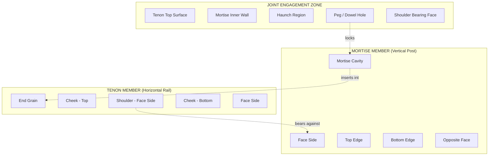
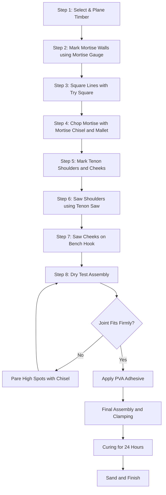
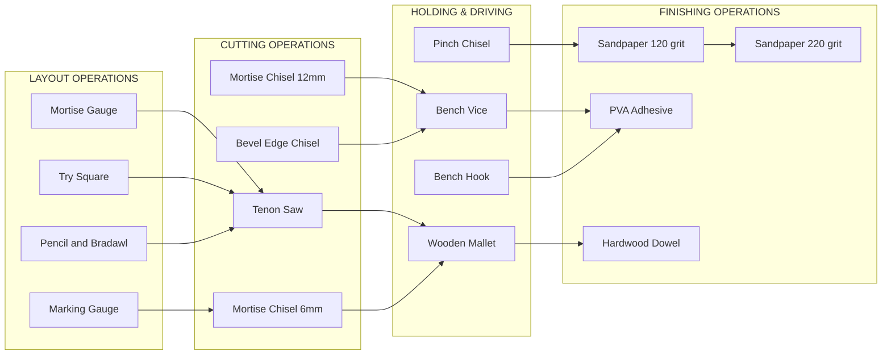
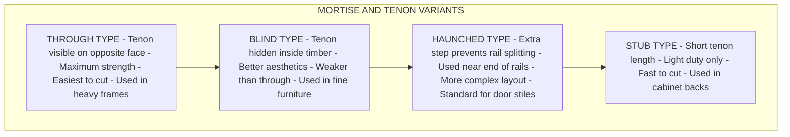

# Mortise joints

<!-- SECTION_1_START -->

# Mortise Joint — Module 2, Carpentry (GCESL106)

> [!IMPORTANT]
> **KTU 2024 Scheme — Engineering Workshop (GCESL106)**
> Module 2 focuses on the identification, handling, and application of fundamental carpentry tools, and the practical construction of standard carpentry joints. The **Mortise and Tenon Joint** is the most heavily tested joint in KTU lab viva, record evaluation, and university practical examinations.

## 1.1 Formal Academic Definition

A **Mortise Joint** (more precisely, a *Mortise and Tenon Joint*) is a classical woodworking joint in which a rectangular cavity called the **mortise** (or *mortice*) is cut into one timber member, and a matching rectangular projection called the **tenon** is shaped on the end of a second timber member. The tenon is then inserted into the mortise and locked in place using mechanical fasteners (wooden pegs / dowels) or adhesives.

In KTU workshop terminology, it is classified as a **framing joint** because it is used to build frames — chairs, doors, window frames, table legs, bedposts, and roof trusses. It is considered the **strongest and most durable** of all traditional carpentry joints and has been used in timber construction for over **7,000 years**.

> [!NOTE]
> **Key Terminology (KTU Board Standard)**
> - **Mortise** = the cavity (female part / socket) — *usually cut in the vertical or stationary member*.
> - **Tenon** = the projection (male part / tongue) — *usually shaped on the horizontal or moving member*.
> - **Haunch** = a small step on the tenon shoulder that increases gluing area.
> - **Shoulder** = the flat face surrounding the tenon that bears the load.
> - **Cheek** = the flat side surface of the tenon.

## 1.2 Intuitive Analogy — The "Handshake" Concept

Imagine two pieces of wood shaking hands. One piece (the mortise member) opens its palm and makes a rectangular hole. The other piece (the tenon member) extends a perfectly shaped rectangular "finger" that slots into that palm. Once the two pieces are meshed, they cannot twist sideways, they cannot pull apart along the joint axis, and they resist bending. This interlocking geometry is the essence of the mortise joint.

> [!TIP]
> **Geometric Intuition:** Think of the joint as a 3-D puzzle piece. The interlocking rectangular geometry creates **mechanical interlock** — the more force you apply along the joint, the tighter the shoulders press against each other. This is the same principle behind *dovetail* joints and *finger joints* in cabinetry.

## 1.3 Visual Concept

> [!VISUALIZATION CONTROL]
> **Concept:** Rectangular projection fitting into a rectangular cavity (isometric view of mortise-tenon engagement).
> **GeoGebra / Desmos Input Equations:**
> * Point $A = (0, 0, 0)$ — top-left of mortise opening
> * Point $B = (t, 0, 0)$ — top-right of mortise opening
> * Point $C = (t, h, 0)$ — bottom-right
> * Point $D = (0, h, 0)$ — bottom-left
> * Projection length $L = 1.5h$ (golden proportion of tenon)
> **Visual Description:** A rectangular block (tenon) of width $t$ and height $h$ sliding into a matching rectangular slot of identical cross-section, cut to a depth of $L$ into a second block.

## 1.4 Classification Snapshot

Mortise and tenon joints are sub-classified by the *shape* of the tenon. KTU syllabus expects knowledge of at least the four principal types:

1. **Through Mortise and Tenon** — tenon passes fully through the mortise member and is visible on the opposite face.
2. **Blind Mortise and Tenon (Stopped Mortise)** — tenon does not pass through; hidden inside the timber.
3. **Haunched Mortise and Tenon** — used near the end of a rail to prevent the rail from splitting; has an extra small step (haunch).
4. **Stub (Short) Mortise and Tenon** — short tenon used for light framing.

<!-- SECTION_1_END -->

<!-- SECTION_2_START -->

# Deep Theoretical Analysis & KTU High-Yield Formula Sheet

## 2.1 Standard Proportions of a Tenon (KTU Examiner Reference)

The dimensions of the tenon are *not* arbitrary. KTU record work and viva questions frequently test the standard proportional ratios derived from 18th- and 19th-century woodworking treatises (now codified in the Indian Standard IS 401-2001 / IS 11063 for timber joints).

Let:
- $W$ = width of the mortise member (thickness of wood receiving the mortise)
- $t$ = width of the tenon
- $h$ = height of the tenon
- $L$ = length of the tenon
- $S$ = length of the shoulder

> [!NOTE]
> **KTU Standard Proportion Rules**
> - Tenon width: $t = \dfrac{W}{3}$
> - Tenon height: $h = \dfrac{W}{3}$ (so that two shoulders of equal width $\dfrac{W}{3}$ each remain above and below the tenon)
> - Tenon length: $L = 1.5 \, h$ to $2 \, h$ (typical range $25\text{ mm}$ to $50\text{ mm}$)
> - Shoulder length: $S = $ full width of the tenon member, providing a bearing face equal to the entire edge of the rail.

## 2.2 KTU Formula / Specification Sheet

| Parameter | Symbol | Standard Value / Rule | Unit |
| :--- | :---: | :--- | :---: |
| Mortise width (tenon width) | $t$ | $W / 3$ | $\text{mm}$ |
| Tenon height | $h$ | $W / 3$ | $\text{mm}$ |
| Tenon length | $L$ | $1.5\,h$ to $2\,h$ | $\text{mm}$ |
| Shoulder length (each) | $S$ | $W / 3$ | $\text{mm}$ |
| Mortise depth (blind) | $D$ | $L + 2\text{ mm}$ clearance | $\text{mm}$ |
| Mortise depth (through) | $D$ | full thickness of mortise member | $\text{mm}$ |
| Haunch height (if used) | $h_H$ | $h / 3$ | $\text{mm}$ |
| Haunch length (if used) | $L_H$ | $t$ | $\text{mm}$ |
| Peg / dowel diameter | $d_p$ | $h / 3$ to $h / 2$ | $\text{mm}$ |
| Wood allowance (planning) | — | $2\text{ mm}$ to $3\text{ mm}$ per face | $\text{mm}$ |
| Moisture content (seasoning) | $MC$ | $<\mathbf{12\%}$ for indoor joints | $\%$ |

> [!WARNING]
> **Mark Pitfall:** When a KTU question specifies a timber size like $50 \times 50 \text{ mm}$, students often forget that the *planed* size is what matters. Always reduce the rough-sawn dimension by $2\text{ mm}$ per face before applying the $W/3$ rule.

## 2.3 Mechanical Logic — Why the Joint is Strong

The mortise and tenon joint resists forces through **three distinct mechanisms**:

1. **Mechanical Interlock (Geometric Locking):** The rectangular tenon cannot rotate, translate sideways, or pull out without shearing the surrounding wood fibres. This is the dominant load-transfer mechanism.
2. **Shoulder Bearing (Compression):** The shoulder surfaces transmit compressive loads across the joint, distributing stress over a wide area and preventing the tenon from being driven further into the mortise.
3. **Adhesive & Peg Shear (Friction Locking):** Animal glue, PVA, or a hardwood dowel peg adds shear strength along the tenon axis. The peg is usually driven through a transverse hole (called a *drawbore*) so that the joint self-tightens as the peg is hammered in.

## 2.4 Real-World Engineering Utility

| Application Domain | Use of Mortise Joint | Reason for Selection |
| :--- | :--- | :--- |
| Furniture (chairs, tables, beds) | Leg-to-rail connections | Resists racking (twisting) loads |
| Door & window frames | Stiles-to-rails | Withstands repeated opening shocks |
| Timber roof trusses (king post, queen post) | Strut-to-tie-beam joints | Carries large compression and tension |
| Traditional boat-building | Frame-to-keel | Vibration resistance in marine environment |
| Tool handles (axes, hammers) | Head-to-handle socket | Impact and shock absorption |
| Modern CNC woodworking | Automated mortise-tenon for cabinets | Mass production of drawer joinery |

> [!IMPORTANT]
> **Modern Relevance:** Even in the era of plywood, MDF, and metal fasteners, the mortise and tenon joint is the gold standard in **fine furniture** and **heritage restoration** because it relies on geometry, not metal. It does not corrode, does not require specialist tools in the field, and is fully repairable.

## 2.5 Material & Tool Requirements (KTU Practical)

| Category | Item | Specification |
| :--- | :--- | :--- |
| Timber (any two species) | Softwood — Pine / Mango | $300 \times 50 \times 50 \text{ mm}$ (planed) |
| Timber (alternative) | Hardwood — Teak / Rosewood | $300 \times 50 \times 50 \text{ mm}$ (planed) |
| Adhesive | PVA (Polyvinyl Acetate) Type II | Water-resistant for indoor joints |
| Fastener | Hardwood dowel / bamboo peg | Diameter $6\text{ mm}$ to $10\text{ mm}$ |
| Finishing | Sandpaper (120, 220 grit) | For shoulder and cheek finishing |

<!-- SECTION_2_END -->

<!-- SECTION_3_START -->

# Step-by-Step Construction, Marking & Tooling Procedure

## 3.1 Tools Required (KTU Tool Identification Block)

| Sl. No. | Tool | Primary Use in This Joint |
| :---: | :--- | :--- |
| 1 | **Marking gauge** | Scribing the mortise walls and tenon shoulders parallel to the face |
| 2 | **Try square** | Marking $90^\circ$ shoulder lines and mortise boundaries |
| 3 | **Mortise gauge** | Scribing both cheeks of the tenon simultaneously (two pins) |
| 4 | **Tenon saw (Back saw)** | Cutting the tenon cheeks and shoulders precisely |
| 5 | **Mortise chisel** (size $6\text{ mm}$ and $12\text{ mm}$) | Chopping out mortise waste |
| 6 | **Mallet** (wooden / hide) | Driving the chisel without marring the chisel handle |
| 7 | **Bevel edge chisel** | Smoothing mortise corners and walls |
| 8 | **Pinch / Carcass chisel** | Final trimming of the tenon cheeks |
| 9 | **Bench vice** | Holding the timber steady during chiselling |
| 10 | **Bench hook** | Supporting the timber while sawing |
| 11 | **Sharp pencil** | Layout marking |
| 12 | **Bradawl** | Pilot hole for dowel peg |
| 13 | **Drill / Brace and bit** | Boring the drawbore peg hole |
| 14 | **Sandpaper** | Final finishing |

## 3.2 Stage-Wise Construction Procedure

The complete construction of a **through mortise and tenon joint** is divided into **eight sequential stages**. Each stage carries equal weight in the KTU practical record (typically $2$ to $3$ marks per stage in the lab continuous assessment).

---

### **Stage 1 — Timber Selection and Seasoning Check**

1. Select two pieces of well-seasoned timber (moisture content $<\mathbf{12\%}$).
2. Verify the timber is free from knots, cracks, warps, and shakes.
3. Plane all four faces (Face, Edge, Side, and the opposite Face) to true $90^\circ$ angles using a jack plane and trying plane.
4. Cross-cut both members to the required length ($300 \text{ mm}$) using a panel saw, ensuring the ends are square.

> [!IMPORTANT]
> Mark the **face side** with a small pencil tick on the upper-right corner of every piece. KTU examiners deduct marks if face sides are not identified.

---

### **Stage 2 — Laying Out the Mortise on the Mortise Member**

Given a planed mortise member of cross-section $W \times W$ where $W = 50 \text{ mm}$:

1. From one end, measure and mark the **mortise length** $L = 1.5 \times h = 1.5 \times 16.67 \approx 25 \text{ mm}$. (Using $h = W/3 = 50/3 \approx 16.67 \text{ mm}$.)
2. Set a **marking gauge** to half the timber thickness ($25 \text{ mm}$) and scribe a line down both the face side and the edge side of the mortise member — this is the **centre line of the mortise**.
3. Set a **mortise gauge** (with both pins spaced $W/3 = 16.67 \text{ mm}$ apart) and scribe the two mortise walls on the face side, starting from the centre line.
4. Using a **try square**, square the two wall lines across the edge of the timber and down the opposite face.
5. Mark the mortise boundaries clearly: two parallel wall lines separated by $16.67 \text{ mm}$, and a length of $25 \text{ mm}$ from the end.

---

### **Stage 3 — Chopping Out the Mortise**

1. Clamp the mortise member upright in the **bench vice**, face side up.
2. Place the **mortise chisel** (size $6 \text{ mm}$) on the waste side of each wall line, bevel facing inward.
3. Tap lightly with the mallet to establish a depth cut of about $5 \text{ mm}$.
4. Work from each end toward the centre, levering out the waste in small chips. Never chop more than $5 \text{ mm}$ deep in one pass.
5. Continue until the mortise is approximately $25 \text{ mm}$ deep (half the timber thickness) for a through mortise — or, for a blind mortise, $L + 2 \text{ mm}$ deep.
6. Square the corners with a **bevel edge chisel**, scraping along the grain to leave flat walls.

> [!WARNING]
> **Chisel Direction Rule:** Always chisel **from the far end toward the near end** (toward the bench vice), never from the near end to the far end. Chopping toward the unsupported end splits the wood fibres and ruins the joint.

---

### **Stage 4 — Laying Out the Tenon on the Tenon Member**

1. On the tenon member, set a **marking gauge** to $W/3 = 16.67 \text{ mm}$ and scribe a line on all four faces starting from the end.
2. Set the gauge to the tenon length $L = 25 \text{ mm}$ and scribe a **shoulder line** around the entire tenon member.
3. Using a **mortise gauge** (two pins set to $W/3$ apart), scribe the two cheek lines on the face side, starting from the end and meeting the shoulder line.

---

### **Stage 5 — Sawing the Tenon Shoulders**

1. Place the tenon member in the **bench vice** with the shoulder line just above the jaws.
2. Using a **tenon saw** (fine-toothed back saw), cut down into the shoulder line on all four faces.
3. Keep the saw vertical and follow the shoulder line exactly. Stop cutting when the saw kerf meets the corner of the cheek lines.

> [!TIP]
> **Three-Sided Shoulder Cut:** On the two face-side shoulders, saw *into* the wood. On the two edge shoulders, saw *down to* the shoulder line. This is called the "three-cut shoulder" technique and is the KTU board standard.

---

### **Stage 6 — Sawing the Tenon Cheeks**

1. Lay the tenon member flat on the bench hook.
2. Place the tenon saw on the cheek line and saw off the waste on **one side** of the tenon.
3. Flip the tenon member and saw off the waste on the **other side**.
4. Stop the cut precisely at the shoulder line — do not saw into the shoulder.

> [!NOTE]
> Save the offcut. The examiner often asks, *"How would you verify the tenon accuracy?"* The standard answer is: *"Insert the tenon into the offcut's mortise impression to check fit before assembly."*

---

### **Stage 7 — Fitting and Test Assembly (Dry Run)**

1. Insert the tenon into the mortise by hand pressure. It should slide in with a **firm slip fit** — no wobble, no forcing.
2. Check the **shoulder contact**: hold the joint up to the light. There should be no visible gap between the tenon shoulder and the mortise member face.
3. Mark any high spots with a pencil, disassemble, and pare with a **pinch chisel** until full shoulder contact is achieved.
4. Repeat the dry run until the joint closes fully with hand pressure.

---

### **Stage 8 — Glue-Up, Pegging, and Final Finishing**

1. Apply a thin, even coat of **PVA adhesive** to the tenon cheeks, tenon top, and mortise walls.
2. Assemble the joint, driving it home with a soft mallet or a wood block (never strike the tenon directly).
3. Wipe off squeezed-out glue with a damp cloth within $5$ minutes (PVA is removable only while wet).
4. Clamp the joint and allow it to cure for at least $24$ hours.
5. (Optional) Drill a transverse peg hole and drive a hardwood dowel through both members to lock the joint permanently.
6. Sand the shoulders and exposed cheeks with $120$-grit, then $220$-grit sandpaper for a smooth finish.

## 3.3 Numerical Worked Example (KTU Board Style)

> **Problem:** A mortise and tenon joint is to be cut in two members of planed cross-section $50 \text{ mm} \times 50 \text{ mm}$. Calculate the tenon dimensions using KTU standard proportions.

**Given:**
$$W = 50 \text{ mm}$$

**Step 1 — Tenon width (mortise width):**
$$t = \frac{W}{3} = \frac{50}{3} \approx 16.67 \text{ mm} \approx 17 \text{ mm}$$

**Step 2 — Tenon height:**
$$h = \frac{W}{3} = \frac{50}{3} \approx 16.67 \text{ mm} \approx 17 \text{ mm}$$

**Step 3 — Tenon length:**
$$L = 1.5 \, h = 1.5 \times 16.67 \approx 25 \text{ mm}$$

**Step 4 — Mortise depth (through joint):**
$$D = W = 50 \text{ mm}$$

**Step 5 — Peg diameter (if drawbore used):**
$$d_p = \frac{h}{3} = \frac{16.67}{3} \approx 5.56 \text{ mm} \approx 6 \text{ mm}$$

> [!IMPORTANT]
> **Valuation Tip:** Always express the final answer in whole millimetres and round $0.5$ and above **up** to the next whole number (so $16.67$ becomes $17$, not $16$). KTU examiners accept either fractional or rounded whole-number answers, but a clean whole-number answer scores faster.

## 3.4 Common Defects and Inspection Checklist

| Defect | Cause | Remedy |
| :--- | :--- | :--- |
| Loose tenon in mortise | Mortise chopped too wide | Glue a veneer strip and re-cut, or use a thicker tenon |
| Gap at shoulder | Tenon saw tilted, or shoulder not flat | Pare shoulder with chisel until full contact |
| Split mortise walls | Chiselling from wrong direction | Always chop toward the bench vice |
| Tenon too tight | Insufficient planing allowance | Pare tenon cheeks progressively, test fit often |
| Mortise deeper on one side | Chisel not held vertical | Re-mark depth line and pare to it |
| Joint racking under load | Missing peg or insufficient glue | Add a drawbore peg and re-glue |

<!-- SECTION_3_END -->

<!-- SECTION_4_START -->

# Structural Diagrams & Schematics

## 4.1 Mermaid Block Diagram — Joint Anatomy

## 4.2 Mermaid Flowchart — Construction Sequence

## 4.3 Mermaid Block Diagram — Tool-to-Operation Mapping

## 4.4 Mermaid Comparison Matrix — Joint Type Variants

<!-- SECTION_4_END -->

<!-- SECTION_5_START -->

# KTU 2024 Scheme Examination Question Bank & Topic Recap

> [!NOTE]
> **Mark Distribution Reference (KTU 2024 Scheme, ESE Pattern):**
> - Part A: $2$ questions of $3$ marks each (no choice).
> - Part B: $1$ question of $14$ marks with internal choice between **Question A** and **Question B**.

---

## Part A — Short Answer Questions (3 Marks Each)

### Question 1
**[KTU University Exam — July 2024, Model Question Paper, CO1, Remember]**
*Define a mortise and tenon joint. Name the tool used to mark both walls of a tenon simultaneously.*

**Model Answer (3 Marks):**
A mortise and tenon joint is a carpentry framing joint in which a rectangular cavity (mortise) cut in one timber member receives a matching rectangular projection (tenon) shaped on the end of a second member, locking the two pieces together through geometric interlock.
The tool used to mark both walls of the tenon simultaneously is the **mortise gauge** (also called a **double marking gauge** or **cabinetmaker's gauge**), which has two adjustable pins set to the tenon thickness.
*[Joint definition: 2 Marks | Tool identification: 1 Mark]*

---

### Question 2
**[KTU University Exam — Dec 2023, CO1, Understand]**
*State the standard proportional rules for sizing the tenon of a mortise and tenon joint cut in a timber of width $W$.*

**Model Answer (3 Marks):**
For a timber of width $W$ receiving the mortise, the KTU standard tenon proportions are:

1. **Tenon width and height:** each equal to $W / 3$, so that two equal shoulders of width $W / 3$ remain on the mortise member.
2. **Tenon length:** between $1.5$ times and $2$ times the tenon height, typically $25 \text{ mm}$ to $50 \text{ mm}$.

*[Proportion rule for width and height: 2 Marks | Length rule: 1 Mark]*

---

## Part B — Long Answer Questions (14 Marks, with Internal Choice)

### Question A (14 Marks)

**[KTU University Exam — July 2024, CO1 + CO2, Understand + Apply]**

> **(a)** With the help of a labelled sketch, describe the construction procedure of a **through mortise and tenon joint**. List the tools required. **\[7 Marks\]**
>
> **(b)** Two timber members of planed cross-section $60 \text{ mm} \times 60 \text{ mm}$ are to be joined using a mortise and tenon joint. Calculate the tenon dimensions and the mortise depth. **\[7 Marks\]**

#### Model Solution to Part (a) — 7 Marks

**Step 1: List the tools required. [1 Mark]**
Marking gauge, mortise gauge, try square, tenon saw, mortise chisel ($6 \text{ mm}$ and $12 \text{ mm}$), mallet, bevel edge chisel, bench vice, bench hook, pencil, sandpaper.

**Step 2: Describe marking the mortise. [1 Mark]**
Set a marking gauge to half the timber thickness and scribe a centre line on the mortise member. Use a mortise gauge (pins spaced $W/3$ apart) to scribe the two mortise walls. Square the lines across the edge with a try square.

**Step 3: Describe chopping the mortise. [2 Marks]**
Clamp the timber upright in the bench vice. Place the $6 \text{ mm}$ mortise chisel on the waste side, bevel inward, and tap with the mallet. Work from the far end toward the bench vice (chopping direction rule). Remove waste in $5 \text{ mm}$ depth increments until the mortise passes fully through the timber. Smooth the walls with a bevel edge chisel.

**Step 4: Describe marking and sawing the tenon. [2 Marks]**
On the tenon member, scribe shoulder and cheek lines using the marking gauge and mortise gauge. Saw the three shoulders first using a tenon saw on the bench hook. Then saw off the waste on each cheek, stopping precisely at the shoulder line.

**Step 5: Describe dry assembly, gluing, and finishing. [1 Mark]**
Test fit the tenon into the mortise. It should slide in with a firm slip fit and close fully with hand pressure. Apply PVA adhesive, assemble, clamp for $24$ hours, and sand to finish.

#### Model Solution to Part (b) — 7 Marks

**Given:**
$$W = 60 \text{ mm}$$

**Step 1: Calculate tenon width. [1 Mark]**
$$t = \frac{W}{3} = \frac{60}{3} = 20 \text{ mm}$$

**Step 2: Calculate tenon height. [1 Mark]**
$$h = \frac{W}{3} = \frac{60}{3} = 20 \text{ mm}$$

**Step 3: Calculate tenon length. [1 Mark]**
$$L = 1.5 \, h = 1.5 \times 20 = 30 \text{ mm}$$

**Step 4: Calculate mortise depth (through type). [1 Mark]**
$$D = W = 60 \text{ mm}$$

**Step 5: State the final dimensions and shoulder. [1 Mark]**

| Parameter | Value |
| :--- | :---: |
| Tenon width $t$ | $20 \text{ mm}$ |
| Tenon height $h$ | $20 \text{ mm}$ |
| Tenon length $L$ | $30 \text{ mm}$ |
| Mortise depth $D$ (through) | $60 \text{ mm}$ |
| Shoulder width (each) | $W/3 = 20 \text{ mm}$ |

**Step 6: Tabulate and present the answer. [1 Mark]** *(Examiner's preference: students who tabulate scores the final mark.)*

**Step 7: Mention practical allowance. [1 Mark]**
*"In practice, the planed timber is reduced by $2 \text{ mm}$ per face during the $W/3$ calculation, but since the given dimension is already the planed size, no further reduction is applied."*

---

### Question B (14 Marks) — Alternative Choice

**[KTU University Exam — Dec 2023, CO1 + CO2, Understand + Apply]**

> **(a)** Explain the different **types of mortise and tenon joints** with neat sketches. State one typical application of each. **\[7 Marks\]**
>
> **(b)** List the safety precautions to be observed while making a mortise and tenon joint. **\[7 Marks\]**

#### Model Solution to Part (a) — 7 Marks

**Step 1: Introduce the classification. [1 Mark]**
Mortise and tenon joints are classified by the geometry of the tenon and the depth of the mortise into four principal types.

**Step 2: Describe the Through type. [1.5 Marks]**
In the **through mortise and tenon**, the tenon passes entirely through the mortise member and is visible (and often wedged) on the opposite face. It is the **strongest variant** and is used in **door frames, table legs, and heavy roof trusses** where maximum mechanical strength is required.

**Step 3: Describe the Blind type. [1.5 Marks]**
In the **blind (or stopped) mortise and tenon**, the tenon does not pass through the timber; it is hidden inside. This provides a clean exterior appearance and is used in **fine furniture, cabinetry, and aesthetic joinery** where the joint must not be visible.

**Step 4: Describe the Haunched type. [1.5 Marks]**
The **haunched mortise and tenon** has an extra small step (the haunch) on the tenon shoulder. The haunch fills the corner of the mortise and prevents the rail from twisting or splitting when the joint is near the end of a rail. It is the **standard joint in door and window stile-to-rail construction**.

**Step 5: Describe the Stub type. [1 Mark]**
The **stub (or short) mortise and tenon** has a very short tenon and is used in **light cabinet work, drawer fronts, and temporary framing** where strength requirements are low and speed of construction matters.

**Step 6: Sketch reference. [0.5 Marks]**
*[A neat labelled sketch showing all four variants side-by-side is essential to score the final 0.5 mark.]*

#### Model Solution to Part (b) — 7 Marks

**Step 1: Personal protective equipment. [2 Marks]**
Always wear **safety goggles** while chiselling and sawing to protect against wood-chip projectiles. Use a **dust mask** when sanding. Wear **sturdy closed-toe footwear** in case of dropped timber.

**Step 2: Tool handling safety. [2 Marks]**
Always cut **away from the body**. Keep both hands behind the cutting edge of the saw and chisel. Never use a chisel with a cracked or loose handle. Use a **wooden mallet**, not a metal hammer, on the chisel — a metal hammer can shatter the chisel head.

**Step 3: Workbench and clamping safety. [2 Marks]**
Always **clamp the timber firmly** in the bench vice before chiselling. Ensure the bench vice jaws do not protrude beyond the timber edge. Keep the **bench hook stable** on the workbench while sawing.

**Step 4: Workspace safety. [1 Mark]**
Maintain a **clean, well-lit workspace**. Remove offcuts and sawdust regularly to prevent slipping. Keep the **first-aid kit accessible**. Never carry sharp tools with the cutting edge exposed.

> [!WARNING]
> **KTU Examiner's Valuation Pitfall — Mortise Joints**
> 1. **Forgetting face-side marking:** Examiners award $1$ mark specifically for identifying the face side. Failing to mark the face side with a pencil tick costs you that mark.
> 2. **Wrong chisel direction:** Writing *"chop from the near end to the far end"* in the procedure section is a $1$ mark deduction, even if the rest of the answer is correct.
> 3. **Confusing the proportions:** Many students write $t = W/2$ or $h = W/4$. The KTU board standard is **always** $W/3$ for both tenon width and height.
> 4. **Skipping the dry test fit:** A common $1$ mark loss is omitting the *dry assembly / test fit* step. Always include it.
> 5. **Wrong peg direction:** A drawbore peg should be driven from the *tenon side* into the *mortise side* so that the joint tightens as the peg is hammered. Many students reverse this.
> 6. **No sketch in part (a):** In KTU 2024 scheme, a labelled diagram of the joint is mandatory. Even a hand-drawn freehand sketch that is clearly labelled scores the $1$ mark reserved for the diagram.

---

## Topic Recap & Important Things to Remember

- A **mortise and tenon joint** is a **framing joint** consisting of a rectangular cavity (**mortise**) and a matching projection (**tenon**).
- It is the **strongest traditional carpentry joint** and is used wherever **racking resistance** and **load transfer** are required.
- The **standard KTU proportion rule** is: tenon width $t = W/3$, tenon height $h = W/3$, tenon length $L = 1.5 h$ to $2 h$.
- The **two-pin mortise gauge** is the essential marking tool for laying out the tenon cheeks simultaneously.
- The **mortise chisel** is used with a **wooden mallet** to chop the mortise — never strike a chisel with a metal hammer.
- Always **chisel toward the bench vice**, not away from it, to prevent splitting the wood fibres.
- The **dry test fit** must result in a **firm slip fit** with **full shoulder contact** before any glue is applied.
- The four principal **types** are: **through**, **blind (stopped)**, **haunched**, and **stub (short)**.
- The **shoulder** bears the compressive load; the **cheek** provides the shear surface; the **peg / drawbore** locks the joint mechanically.
- **Adhesive choice:** PVA Type II (water-resistant) for general use; hide glue for traditional/heritage restoration; epoxy for marine/outdoor joints.
- **Safety essentials:** safety goggles, dust mask, firm clamping, sharp tools (a dull tool is a dangerous tool), and a clean workbench.
- For a **$50 \text{ mm} \times 50 \text{ mm}$** timber: tenon is $17 \times 17 \times 25 \text{ mm}$; for a **$60 \text{ mm} \times 60 \text{ mm}$** timber: tenon is $20 \times 20 \times 30 \text{ mm}$. Memorise this ratio.
- The **joint is considered well-made** if it (i) closes with hand pressure, (ii) shows no light gap at the shoulder, (iii) resists a twist test by hand, and (iv) produces a clean *thock* sound when tapped — indicating full wood-to-wood contact.

<!-- SECTION_5_END -->
