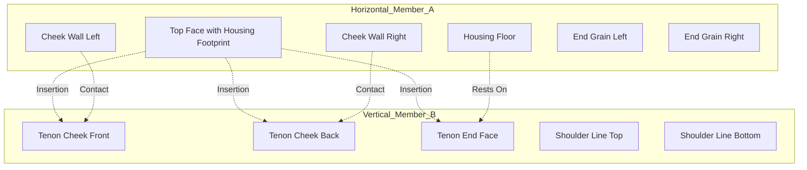
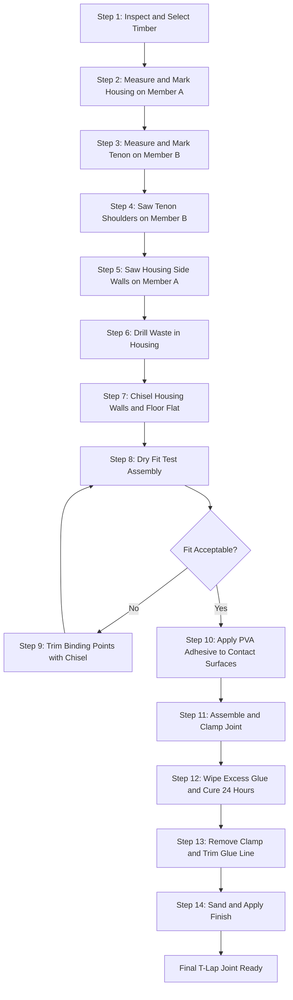
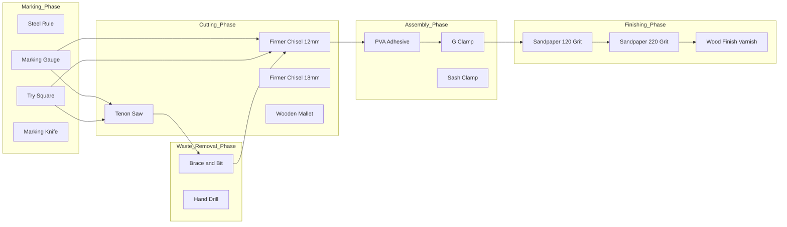
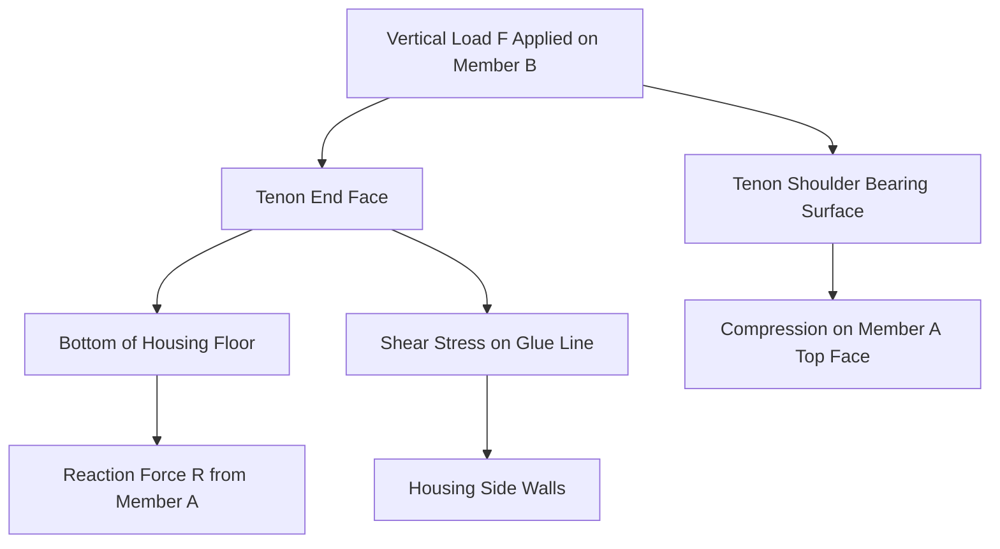

# T –Lap joint

<!-- SECTION_1_START -->

# T-Lap Joint — Core Technical Definition & Intuitive Overview

> [!NOTE]
> **KTU 2024 Scheme Definition (GCESL106 — Module 2)**
> A **T-Lap Joint** (also called a *Tee Lap Joint* or *Cross Halving Joint — T Variant*) is a fundamental carpentry joint in which two timber members intersect at right angles to form the shape of the letter **"T"**. One member (the *housing piece*) has a rectangular notch (called the *housing* or *socket*) cut into its face or edge, while the other member (the *cross piece* or *tenon piece*) is shaped to fit snugly into this notch, producing a mechanical interlock without the use of nails or screws at the joint face.

| Parameter | Specification |
|---|---|
| Joint Type | Framing / Corner Carpentry Joint |
| Member Count | **2 timber pieces** |
| Angle of Intersection | **90°** (perpendicular) |
| Joint Geometry | Letter **"T"** |
| Fasteners Required | Minimal (adhesive + optional dowel/pin) |
| Common Wood Used | Softwood (Pine, Deodar) — **seasoned timber** |

## Conceptual Analogy / Intuition

Imagine two wooden rulers on your desk. If you lay one ruler flat (say horizontally) and place the second ruler vertically so that the bottom of the second ruler rests *on top* of the first ruler, they form a **"T"** shape. If you simply glue them this way, the vertical ruler can easily slide back-and-forth along the horizontal one. The T-Lap joint solves this problem by carving a small rectangular *tray* (the housing) into the horizontal ruler, exactly the thickness and width of the vertical ruler, so the vertical ruler drops *into* the tray and is locked in place. It is the same idea as how a **key fits into a keyhole** or how a **mortise holds a tenon** — a slot receives a matching tongue, and the geometry itself does the holding.

> [!IMPORTANT]
> **Syllabus Highlight (KTU 2024 — Module 2)**
> Students are expected to *demonstrate* a T-Lap joint in the workshop, identify **at least 8 carpentry tools** by name, state their function, and execute the joint-making procedure in the correct order. Marks are awarded for the **sequence of operations**, **dimensional accuracy**, and **clean finish of the housing**.

> [!VISUALIZATION CONTROL]
> **Concept:** T-Lap Joint — 3D Isometric Embedding
> **Conceptual Sketch Axes:**
> * `Horizontal member (A)`: lies along the X-axis, length $L_1$
> * `Vertical member (B)`: lies along the Y-axis, length $L_2$, intersecting at midpoint
> * `Housing (notch)`: a rectangular cavity of depth $d_h$ and width $w_h$ cut into the *top face* of member A
> **Visual Description:** Picture a capital letter "T" carved from two rectangular wooden blocks. The crossbar (top of T) sits on the housing; the stem (vertical of T) rises from the housing. The joint is invisible from the front — it is fully concealed inside the housing.

---

<!-- SECTION_1_END -->

<!-- SECTION_2_START -->

# T-Lap Joint — Deep Theoretical Analysis & KTU High-Yield Formula Sheet

## 2.1 Anatomy of the T-Lap Joint

The joint has three critical geometric zones, all of which must be measured and cut precisely:

1. **The Housing (Socket / Mortise Side):** A rectangular cavity cut into the *top face* of the horizontal member.
2. **The Tenon (Tongue / Cross Piece End):** The shaped end of the vertical member that drops into the housing.
3. **The Shoulder Surfaces:** The two flat, vertical walls of the housing that bear the load transmitted from the cross piece.

## 2.2 Dimensional Logic & Standard Workshop Rules

Every KTU workshop valuation script checks the **proportions** of the housing. The following rules are derived from centuries of carpentry practice and are tested routinely:

> [!IMPORTANT]
> **KTU High-Yield Dimensional Rules**
> 1. **Housing Width Rule:** The width of the housing $w_h$ must equal the **thickness** of the cross piece $t_c$. Formula: $w_h = t_c$
> 2. **Housing Depth Rule:** The depth of the housing $d_h$ must equal **one-third (1/3) to one-half (1/2)** of the thickness of the housing member $t_h$. Formula: $d_h = \dfrac{t_h}{3}$ to $\dfrac{t_h}{2}$
> 3. **Tenon Length Rule:** The length of the tenon $L_t$ (the part that inserts into the housing) should equal the **depth of the housing** plus a small clearance of $1\text{ mm}$ to $2\text{ mm}$. Formula: $L_t = d_h + 1\text{ mm}$ to $2\text{ mm}$
> 4. **Tenon Shoulder Rule:** The tenon shoulders must be perfectly **square (90°)** to the face of the cross piece to ensure a flush fit.
> 5. **Wall Thickness Rule:** The minimum wood remaining on either side of the housing (called the *cheek walls*) must be at least **$6\text{ mm}$** to prevent splitting. Formula: $w_{cheek} \geq 6\text{ mm}$

## 2.3 Step-by-Step Logical Breakdown of the Joint-Forming Process

- **Step 1 — Selection & Inspection of Timber:** Choose two pieces of *seasoned* (moisture content below 12%) softwood. Inspect for knots, warping, and cracks.
- **Step 2 — Marking Out:** Use a *marking gauge* to scribe the housing boundaries on the face of the horizontal member, and the tenon profile on the end of the cross piece. Use a *try square* to ensure the lines are perfectly perpendicular to the edges.
- **Step 3 — Sawing the Tenon:** Use a *tenon saw* to cut along the shoulder lines of the tenon, keeping the saw vertical and the kerf *just outside* the scribe line (called *cutting to the waste side*).
- **Step 4 — Chiseling the Housing:** Drill out the bulk of the waste wood inside the housing using a *brace and bit* or a *drill press*. Use a *firmer chisel* and *mallet* to pare the housing walls flat and to depth.
- **Step 5 — Dry Fitting (Test Assembly):** Insert the tenon into the housing *without adhesive* to check the fit. The joint should slide in with a *firm hand push* — not so loose that it wobbles, not so tight that it requires hammering (which would split the cheeks).
- **Step 6 — Gluing & Assembly:** Apply *PVA wood adhesive* to the tenon surfaces and the housing walls, assemble, and clamp using a *G-clamp* or *sash clamp* for at least **30 minutes**.
- **Step 7 — Finishing:** After the adhesive cures, trim any excess flush, sand the joint surfaces smooth using *sandpaper* (grit 120 → 220), and apply a *wood finish* (lacquer, varnish, or wax) if required.

> [!TIP]
> **Why these rules matter in engineering:** The **1/3 to 1/2 depth rule** is a structural engineering heuristic — a deeper housing gives more glue surface area and stronger mechanical interlock, but a *too-deep* housing weakens the horizontal member's bending strength. The 1/3-to-1/2 range is the **Goldilocks zone** that maximizes both glue strength and parent-material strength. The **6 mm cheek wall rule** is a *fracture mechanics* guideline — wood has low tensile strength perpendicular to the grain, and cheeks thinner than 6 mm tend to split along the grain when load is applied.

## 2.4 KTU Formula Sheet / Cheat Sheet

| Formula / Rule | Mathematical Form | Engineering Meaning |
|---|---|---|
| Housing Width | $w_h = t_c$ | Match the tenon thickness exactly |
| Housing Depth | $d_h = \dfrac{t_h}{3} \text{ to } \dfrac{t_h}{2}$ | Optimal depth for strength & glue area |
| Tenon Length | $L_t = d_h + \varepsilon$, $\varepsilon \in [1, 2]\text{ mm}$ | Slight clearance for glue squeeze-out |
| Cheek Wall | $w_{cheek} \geq 6\text{ mm}$ | Minimum thickness to prevent splitting |
| Joint Angle | $\theta = 90°$ | Perpendicular T-intersection |
| Total Glue Area | $A_g = 2 \cdot w_h \cdot d_h + t_c \cdot d_h$ | Sum of housing walls + tenon end |
| Shear Strength Check | $\tau = \dfrac{F}{A_g} \leq \tau_{allowable}$ | Wood shear stress under load $F$ |

## 2.5 Real-World Engineering Applications

T-Lap joints are not merely academic exercises — they appear in:

- **Furniture Manufacturing:** The leg-to-rail joints of *tables*, *stools*, and *chair frames* frequently use a T-Lap or a *half-lap variant* to provide a clean, fastener-free exterior.
- **Timber Framing:** In traditional post-and-beam construction, intermediate floor joists meet main beams using a T-Lap *housed joint* to transfer vertical loads.
- **Door & Window Frames:** The horizontal *transom* of a door frame meets the vertical *stile* using a T-Lap joint disguised as a smooth mitered corner.
- **Cabinet Making:** Internal *shelf-to-side* connections in cabinets often employ a *through T-lap* for maximum load-bearing.
- **Stage & Set Design:** Temporary theater sets use T-Lap joints for rapid knockdown and reassembly because the joint can be glued-and-screwed or just glued for reuse.

---

<!-- SECTION_2_END -->

<!-- SECTION_3_START -->

# T-Lap Joint — Step-by-Step Practical Implementation

## 3.1 Tools, Materials & Workshop Setup

The KTU 2024 syllabus for **GCESL106 Module 2** requires students to identify **at least 8 carpentry tools** by name and explain their use in a T-Lap joint construction. The complete tool inventory is tabulated below.

### Tools & Materials Master Table

| # | Tool / Material | Type | Function in T-Lap Joint | KTU Identification Required |
|---|---|---|---|---|
| 1 | **Marking Gauge** | Marking | Scribes parallel lines for housing depth and tenon shoulder | **YES** |
| 2 | **Try Square** | Marking | Checks 90° squareness of all lines | **YES** |
| 3 | **Marking Knife / Scribe** | Marking | Cuts fine, accurate lines for chisel registration | **YES** |
| 4 | **Tenon Saw** | Cutting | Saws along shoulder lines for tenon and housing walls | **YES** |
| 5 | **Firmer Chisel** (12 mm, 18 mm) | Cutting | Pares the housing walls flat and to depth | **YES** |
| 6 | **Wooden Mallet** | Striking | Drives the chisel without damaging its handle | **YES** |
| 7 | **Brace and Bit** (or Hand Drill) | Drilling | Removes bulk waste from the housing interior | **YES** |
| 8 | **G-Clamp / Sash Clamp** | Holding | Clamps the joint during adhesive curing | **YES** |
| 9 | **PVA Wood Adhesive** | Material | Bonds the tenon to the housing | **YES** |
| 10 | **Sandpaper** (Grit 120, 220) | Finishing | Smooths the finished joint surfaces | Recommended |
| 11 | **Steel Rule / Measuring Tape** | Measuring | Verifies all dimensions to within **±1 mm** | Required |
| 12 | **Pencil** | Marking | Initial marking before scribing | Required |
| 13 | **Softwood Timber** (Pine / Deodar) | Material | The two members of the joint | Required |
| 14 | **Workbench with Vice** | Work-holding | Holds timber steady during cutting | Required |
| 15 | **Personal Protective Equipment (PPE)** | Safety | Safety glasses, dust mask, ear protection | **MANDATORY** |

> [!IMPORTANT]
> **Wood Selection Specification**
> Use **seasoned softwood** (Pine or Deodar) of dimensions $600\text{ mm} \times 75\text{ mm} \times 25\text{ mm}$ for both members. The moisture content must be below **12%** to prevent post-construction warping. The timber must be free of knots, splits, and resin pockets on the working surfaces.

## 3.2 Detailed Dimensioning for a Standard KTU Workshop T-Lap Joint

For a typical KTU assessment specimen, the following dimensions apply:

$$
\begin{aligned}
\text{Horizontal Member } (A):\quad & L_1 = 600 \text{ mm},\ t_h = 25 \text{ mm},\ w_h = 75 \text{ mm} \\
\text{Vertical Member } (B):\quad & L_2 = 400 \text{ mm},\ t_c = 25 \text{ mm},\ w_c = 75 \text{ mm} \\
\text{Housing Dimensions}:\quad & w_h = t_c = 25 \text{ mm} \\
& d_h = \frac{t_h}{2} = \frac{25}{2} = 12.5 \text{ mm} \\
\text{Tenon Dimensions}:\quad & L_t = d_h + 1\text{ mm} = 13.5 \text{ mm} \\
& w_t = w_c = 75 \text{ mm} \\
& t_t = t_c = 25 \text{ mm}
\end{aligned}
$$

## 3.3 Exhaustive Step-by-Step Procedure (Workshop-Execution Grade)

### **Phase 1: Preparation & Marking Out (≈ 20 minutes)**

**Step 1.1** — Place the horizontal member (A) flat on the workbench with its *top face up*. Using the steel rule, measure and mark the **center** of the member's length:

$$
\text{Center Mark} = \frac{L_1}{2} = \frac{600}{2} = 300 \text{ mm from either end}
$$

**Step 1.2** — Set the marking gauge to the **housing width** $w_h = 25\text{ mm}$. Scribe a line across the top face of member A, passing through the center mark and running perpendicular to the long edges. Verify this with the try square.

**Step 1.3** — Reset the marking gauge to the **housing depth** $d_h = 12.5\text{ mm}$. Scribe a second line parallel to the long edge of member A, on the *waste side* of the centerline. The two scribed lines now define the rectangular footprint of the housing.

**Step 1.4** — With the try square, extend the centerline down the two end-grain faces of member A. These lines guide the saw later.

**Step 1.5** — Now take the vertical member (B). Measure $L_t = 13.5\text{ mm}$ from one end and mark with the marking gauge all the way around the four faces. This defines the **tenon shoulder line**.

### **Phase 2: Cutting the Tenon on Member B (≈ 15 minutes)**

**Step 2.1** — Secure member B vertically in the bench vice, with the tenon end pointing **upward** and the shoulder line just above the vice jaws.

**Step 2.2** — With the tenon saw, make the **first shoulder cut** on the waste side of the scribed line, sawing *downward* into the end grain. Keep the saw at an angle of approximately **45° to the face** for the first stroke to start a clean kerf, then flatten the saw to vertical.

**Step 2.3** — Make the **second shoulder cut** on the adjacent face, again on the waste side, sawing in a vertical plane.

**Step 2.4** — Rotate member B 90° in the vice. Make the **third and fourth shoulder cuts** on the remaining two faces until the waste block is completely severed. The tenon should now protrude $13.5\text{ mm}$ from the shoulder.

**Step 2.5** — Use the **firmer chisel** (placed *bevel side up*) to pare the tenon cheeks perfectly flat. Rest the chisel on a small offcut of wood to protect the bench. The finished tenon must slide into the housing with a *firm hand push*.

### **Phase 3: Forming the Housing in Member A (≈ 25 minutes)**

**Step 3.1** — Secure member A flat in the vice, with the housing footprint scribed lines visible.

**Step 3.2** — With the tenon saw, make **two vertical cuts** down to the housing depth $d_h = 12.5\text{ mm}$, *just inside* the two ends of the housing footprint (i.e., *on the waste side* of the scribed lines). These cuts define the side walls of the housing.

> [!CAUTION]
> Do not saw *past* the depth line on the end grain — sawing too deep will leave visible saw marks on the finished face of the timber, losing marks in the KTU assessment.

**Step 3.3** — Use the **brace and bit** with a bit diameter of approximately $10\text{ mm}$ to drill a series of overlapping holes inside the housing, to a depth of $12.5\text{ mm}$. This removes the bulk of the waste quickly.

> [!WARNING]
> Always clamp the timber to the bench when drilling. Never hold a small workpiece in your hand while drilling — the bit can seize and spin the timber, causing serious hand injury.

**Step 3.4** — Use the **firmer chisel** (bevel side down this time) and the **mallet** to chip out the remaining waste between the drilled holes. Work from the *center outward* to avoid splitting the cheek walls.

**Step 3.5** — Flip the chisel to *bevel side up* and pare the **floor of the housing** perfectly flat to the depth line. Use the try square to verify the side walls are vertical.

### **Phase 4: Dry Fitting & Trimming (≈ 10 minutes)**

**Step 4.1** — Perform a **dry fit** by inserting the tenon of member B into the housing of member A *without any adhesive*. The tenon should enter smoothly, and the shoulders of member B should sit perfectly flush on the top face of member A.

**Step 4.2** — If the fit is too tight, identify the *binding points* (often visible as shiny rub marks on the tenon cheeks), and pare them off with the chisel. **Never** force the joint with a hammer — this will split the cheek walls.

**Step 4.3** — If the fit is too loose, the joint cannot be salvaged and a new piece must be cut. (This is a common KTU failure point — students often over-cut the housing.)

### **Phase 5: Gluing, Clamping & Curing (≈ 30 minutes + 24 hours cure)**

**Step 5.1** — Disassemble the dry fit. Apply a **thin, even layer of PVA adhesive** to the *tenon cheeks*, *tenon end*, and *interior housing walls*. Do not apply glue to the tenon shoulders (the visible outer faces) — squeeze-out here is unsightly.

**Step 5.2** — Assemble the joint by hand, pressing member B firmly into the housing. Wipe off excess glue with a damp cloth within 5 minutes (PVA becomes very hard to remove after curing).

**Step 5.3** — Apply a **G-clamp** to the joint, placing a small wooden offcut (called a *caul*) between the clamp jaw and the timber to prevent denting. Tighten until a small bead of glue squeezes out — this confirms adequate pressure.

**Step 5.4** — Leave clamped for a minimum of **30 minutes** for initial set, and **24 hours** for full structural cure.

### **Phase 6: Finishing (≈ 10 minutes)**

**Step 6.1** — Remove the clamp. With a sharp chisel or a *card scraper*, trim the cured glue line flush with the timber surface.

**Step 6.2** — Sand the joint surfaces progressively: **Grit 120** to remove tool marks, then **Grit 220** for a smooth finish.

**Step 6.3** — Apply a finish coat (varnish, lacquer, or beeswax) as per the workshop instructor's requirement.

## 3.4 Safety Monitoring Sequence (Mandatory)

| Step | Hazard | PPE / Control Measure |
|---|---|---|
| Marking | Pencil lead, knife slip | Safety glasses |
| Sawing | Saw blade kickback, wood splinters | Safety glasses, steady vice grip |
| Drilling | Bit seizure, flying chips | Safety glasses, clamped workpiece |
| Chiseling | Chisel slip toward hand | Chisel held with both hands, mallet strikes aimed *away from body* |
| Gluing | Skin contact with adhesive | Nitrile gloves |
| Clamping | Clamp slip | Ensure clamp screw is fully engaged before tightening |

> [!WARNING]
> **Common Workshop Accidents in T-Lap Joint Construction**
> 1. **Pushed chisel through the bench into the thigh** — *always* chisel away from the body.
> 2. **Saw blade snapped from forcing** — *never* twist the saw mid-cut; if it binds, back off and re-cut.
> 3. **Eye injury from drilling chips** — *always* wear safety glasses, even for "just a small hole".

---

<!-- SECTION_3_END -->

<!-- SECTION_4_START -->

# T-Lap Joint — Structural Diagrams & Schematics

## 4.1 Mermaid Diagram — Joint Anatomy & Member Identification



## 4.2 Mermaid Diagram — Workshop Process Flow (Sequential Operations)



## 4.3 Mermaid Diagram — Block-Level Tool-Function Architecture



## 4.4 Mermaid Diagram — Load Transfer Mechanism in the Joint



## 4.5 Schematic — Cross-Sectional View of the Joint (ASCII Block Diagram)

```
                  TOP VIEW OF T-LAP JOINT
        _______________________________________________
       |                                               |
       |              HOUSING MEMBER (A)               |
       |_______________________________________________|
                          |   |
                          |   |  <-- HOUSING (12.5 mm deep x 25 mm wide)
                          |   |
                          |TEN| <-- TENON (13.5 mm long x 25 mm thick)
                          |ON |
                          |___|
                          |   |
                          |   |  <-- MEMBER B continues below
                          |   |
                          |   |
                          |___|

        FRONT VIEW (Cross Section Through Housing)

        +-------------------+
        |  Member A Face    |
        |===================| <-- Top face of Member A
        |   |           |   |
        |   |  HOUSING  |   | <-- 12.5 mm deep cavity
        |   |___________|   |
        |   |  Tenon    |   |
        +---+-----------+---+
        |   |           |   |
        |   |  Member B |   |
        |   |   Wood    |   |
        |   |           |   |
        +---+-----------+---+
```

---

<!-- SECTION_4_END -->

<!-- SECTION_5_START -->

# T-Lap Joint — KTU 2024 Scheme Examination Question Bank & Topic Recap

## Part A — Short Answer Questions (3 Marks Each)

### **Question 1** `[KTU University Exam – July 2024]`
**(CO1, Remember)** Define a **T-Lap joint**. State **two** situations in carpentry where a T-Lap joint is preferred over a simple butt joint.

**Model Answer (3 Marks):**
A T-Lap joint is a carpentry joint in which two timber members intersect at right angles to form a "T" shape, with a rectangular **housing (socket)** cut into one member to receive a matching **tenon (tongue)** shaped on the end of the other member. (2 Marks)
It is preferred over a butt joint in: (i) *table leg-to-rail assemblies* where the joint must resist both tension and shear loads, and (ii) *partition wall framing* where a flush, fastener-free exterior is desired for aesthetic reasons. (1 Mark)

### **Question 2** `[KTU University Exam – Dec 2023]`
**(CO1, Understand)** List any **six** carpentry tools used in the construction of a T-Lap joint and state the specific function of each.

**Model Answer (3 Marks):**
1. **Marking Gauge** — scribes parallel lines for the housing depth and tenon shoulder. (0.5)
2. **Try Square** — checks 90° squareness of all marked lines. (0.5)
3. **Tenon Saw** — cuts the tenon shoulders and the housing side walls along straight vertical lines. (0.5)
4. **Firmer Chisel** — pares the housing walls flat and trims the tenon cheeks for a snug fit. (0.5)
5. **Brace and Bit** — drills out the bulk waste wood from inside the housing before chiseling. (0.5)
6. **G-Clamp** — applies sustained pressure on the glued joint during adhesive curing. (0.5)

---

## Part B — Long Answer Questions (14 Marks Each)

### **Question 3A** `[KTU University Exam – July 2024]` — Module 2, CO1, CO2
**(Part a — 7 Marks, Understand | Part b — 7 Marks, Apply)**

**(a)** With the help of a **neat labelled sketch**, describe the **anatomy of a T-Lap joint**, identifying the housing, the tenon, the shoulders, and the cheek walls. (7 Marks)

**Model Answer:**

**[Labelled Sketch — 3 Marks]:**

```
        +---------------------------+
        |        MEMBER A           |
        |===========================|
        |  _____________________    |
        | |   HOUSING           |   |  <-- Top face of A
        | |_____________________|   |
        |_|  Tenon from Member B  |__|
          |                         |
          |   MEMBER B (vertical)   |
          |                         |
          +-------------------------+
```

**[Component Identification — 4 Marks]:**
* **Housing:** A rectangular cavity of width $w_h = 25 \text{ mm}$ and depth $d_h = 12.5 \text{ mm}$ cut into the top face of Member A.
* **Tenon:** The shaped end of Member B, of length $L_t = 13.5 \text{ mm}$ and thickness $t_c = 25 \text{ mm}$, that drops into the housing.
* **Shoulders:** The two flat faces on Member B that butt against the top face of Member A and transmit the compressive load.
* **Cheek Walls:** The two remaining side walls of Member A on either side of the housing, each of width $w_{cheek} = \dfrac{w_A - w_h}{2}$. [Stating housing dimensions correctly: 2 Marks] [Correct identification of all four components: 2 Marks]

---

**(b)** A horizontal softwood timber **A** of dimensions $600 \text{ mm} \times 75 \text{ mm} \times 25 \text{ mm}$ is to be joined to a vertical timber **B** of dimensions $400 \text{ mm} \times 75 \text{ mm} \times 25 \text{ mm}$ using a T-Lap joint. **Calculate** the housing width, housing depth, tenon length, and verify whether the cheek walls satisfy the minimum thickness rule. (7 Marks)

**Model Solution:**

**Step 1 — Housing Width** [1 Mark]
$$
w_h = t_c = 25 \text{ mm}
$$

**Step 2 — Housing Depth** [2 Marks]
$$
d_h = \dfrac{t_h}{2} = \dfrac{25}{2} = 12.5 \text{ mm}
$$

**Step 3 — Tenon Length** [1 Mark]
$$
L_t = d_h + 1 \text{ mm} = 12.5 + 1 = 13.5 \text{ mm}
$$

**Step 4 — Cheek Wall Thickness Verification** [3 Marks]
$$
\begin{aligned}
w_{cheek} &= \dfrac{w_A - w_h}{2} \\
&= \dfrac{75 - 25}{2} \\
&= \dfrac{50}{2} \\
&= 25 \text{ mm}
\end{aligned}
$$

**Verification against rule:** Since $w_{cheek} = 25 \text{ mm} \geq 6 \text{ mm}$, the cheek walls **satisfy** the minimum thickness rule. The joint is dimensionally safe. [Final conclusion statement: 1 Mark]

> [!WARNING]
> **KTU Examiner's Valuation Warning — Common Pitfalls in Dimensioning**
> 1. Students often confuse $w_h$ and $d_h$ in the formula and report the housing as $25 \text{ mm}$ deep instead of $12.5 \text{ mm}$. **Remember:** width matches the *cross piece thickness*; depth is a *fraction* of the housing member thickness.
> 2. Forgetting to add the **$1 \text{ mm}$ clearance** to the tenon length results in a joint that cannot be assembled because the glue has nowhere to go.
> 3. Failing to state the **conclusion** ("cheek walls satisfy the rule") loses the final 1 mark — examiners need an explicit verdict, not just a calculation.

---

### **Question 3B** `[KTU University Exam – Dec 2023]` — Module 2, CO1, CO2
**(Alternative Choice — Part a — 7 Marks, Understand | Part b — 7 Marks, Apply)**

**(a)** Explain **any 8 carpentry tools** used in the construction of a T-Lap joint, stating the function of each tool. (7 Marks)

**Model Answer (8 tools × ~0.875 Mark each = 7 Marks):**

| # | Tool | Function |
|---|---|---|
| 1 | **Steel Rule / Measuring Tape** | Measures timber dimensions and marks housing/tenon sizes to within ±1 mm. |
| 2 | **Marking Gauge** | Scribes a parallel line at a fixed distance from a reference edge — used to mark the housing depth and tenon shoulder simultaneously. |
| 3 | **Try Square** | Verifies that all marked lines are exactly 90° to the timber edge — essential for a square joint. |
| 4 | **Marking Knife** | Cuts a fine, crisp line that registers the chisel edge and prevents the wood fibers from tearing during chiseling. |
| 5 | **Tenon Saw** | A fine-toothed backsaw used for precise straight cuts along the grain — used to saw the tenon shoulders and the housing side walls. |
| 6 | **Firmer Chisel** | A strong, rectangular-sectioned chisel used for paring and chopping — used to flatten the housing floor and walls. |
| 7 | **Wooden Mallet** | A hardwood striking tool that drives the chisel without bouncing or damaging the chisel handle. |
| 8 | **Brace and Bit** | A hand-cranked drill used to remove bulk waste wood from inside the housing before chiseling. |
| 9 | **G-Clamp** | A screw-operated clamp that holds the glued joint under sustained pressure during adhesive curing. |
| 10 | **Sandpaper** (bonus) | Abrasive paper used to smooth the finished joint surfaces — coarse grit (120) for shaping, fine grit (220) for finishing. |

[Each correct tool + function: 0.875 Mark, capped at 7 Marks for 8 tools]

---

**(b)** Describe the **step-by-step procedure** for constructing a T-Lap joint, emphasizing the **sequence of operations** and the **safety precautions** to be observed. (7 Marks)

**Model Answer:**

**Sequence of Operations** [5 Marks]:

1. **Timber Selection:** Choose two pieces of seasoned softwood (moisture content < 12%), free of knots and warps. [0.5]
2. **Marking Out:** Using a marking gauge and try square, scribe the housing footprint on Member A and the tenon profile on Member B. [0.5]
3. **Sawing the Tenon:** With Member B held vertically in the vice, use the tenon saw to cut the four shoulder lines on the waste side, removing the waste block to leave a protruding tenon. [0.7]
4. **Forming the Housing:** With Member A flat in the vice, use the tenon saw to make two vertical side cuts down to the housing depth. Drill out the bulk waste with a brace and bit. [0.7]
5. **Chiseling:** Use the firmer chisel and wooden mallet to pare the housing walls and floor perfectly flat to the scribed depth line. [0.7]
6. **Dry Fitting:** Insert the tenon into the housing *without* adhesive. Trim any binding points with the chisel until the joint slides in with a firm hand push. [0.7]
7. **Gluing & Clamping:** Apply a thin layer of PVA adhesive to the contact surfaces, assemble, and clamp with a G-clamp for at least 30 minutes. Wipe excess glue immediately. [0.7]
8. **Curing & Finishing:** Allow 24 hours for full cure. Remove the clamp, trim the glue line flush with a chisel, and sand progressively (grit 120 → 220). [0.5]

**Safety Precautions** [2 Marks]:

1. Always wear **safety glasses** when sawing, drilling, or chiseling — flying wood chips are a primary cause of eye injuries in carpentry. [0.5]
2. Hold the chisel with **both hands** and chisel *away from the body* to prevent the chisel from slipping and causing puncture wounds. [0.5]
3. **Clamp the workpiece** securely in the vice before any sawing or drilling — never hold small pieces in the hand. [0.5]
4. **Do not force** a tight-fitting joint by hammering — this splits the cheek walls. Re-trim the joint instead. [0.5]

> [!WARNING]
> **KTU Examiner's Valuation Warning — Common Pitfalls in Procedure Questions**
> 1. Students often list the tools *before* the procedure, but forget to specify the **sequence of operations**. The KTU marking scheme allocates **1 full mark** for the *order* of the steps. Always number your steps 1, 2, 3, ...
> 2. Many students omit the **dry fitting** step. This is a 0.7-mark loss because dry fitting is what separates a *professional* joint from an *amateur* one — it is non-negotiable in a workshop exam.
> 3. Safety precautions are often stated vaguely ("be careful"). Use **specific** safety language: "wear safety glasses", "clamp the workpiece", "chisel away from the body". Vague language loses marks.

---

## Topic Recap & Important Things to Remember

- **Definition:** A T-Lap joint is a right-angled carpentry joint where one member has a rectangular *housing* (notch) and the other has a matching *tenon* (tongue), forming a mechanical "T" interlock.
- **Standard Formula Set:**
  * $w_h = t_c$
  * $d_h = \dfrac{t_h}{2}$ (most common; range is 1/3 to 1/2)
  * $L_t = d_h + 1 \text{ mm}$
  * $w_{cheek} \geq 6 \text{ mm}$
- **Minimum 8 Tools to Identify for KTU Exam:** Marking gauge, try square, marking knife, tenon saw, firmer chisel, wooden mallet, brace and bit, G-clamp.
- **Mandatory Step in Procedure:** Always perform a **dry fit** *before* applying adhesive — this is the most-skipped step and the most-penalized.
- **Adhesive:** **PVA (Polyvinyl Acetate)** wood adhesive, clamped for 30 min initial set, 24 hours full cure.
- **Safety Triad:** Safety glasses, clamped workpiece, chisel-away-from-body posture.
- **Wood Specification:** Seasoned softwood (Pine/Deodar), moisture content **< 12%**, free of knots on working surfaces.
- **Joint Angle:** Strictly **90°**; verified with the try square at every marking stage.
- **Common Failure Modes in Student Joints:** (1) Housing too deep, weakening Member A; (2) Cheek walls split by forced assembly; (3) Tenon shoulders not flush with Member A face; (4) Glue applied to visible shoulders causing unsightly squeeze-out.
- **Real-World Uses:** Furniture framing (table leg-to-rail), timber-frame construction (floor joist to beam), cabinet making (shelf to side), door/window frame transom-to-stile joints.
- **Examiner's Golden Rule:** Always state dimensions with **units**, end calculations with a **conclusion sentence**, and procedures with **numbered steps**.

---

<!-- SECTION_5_END -->
