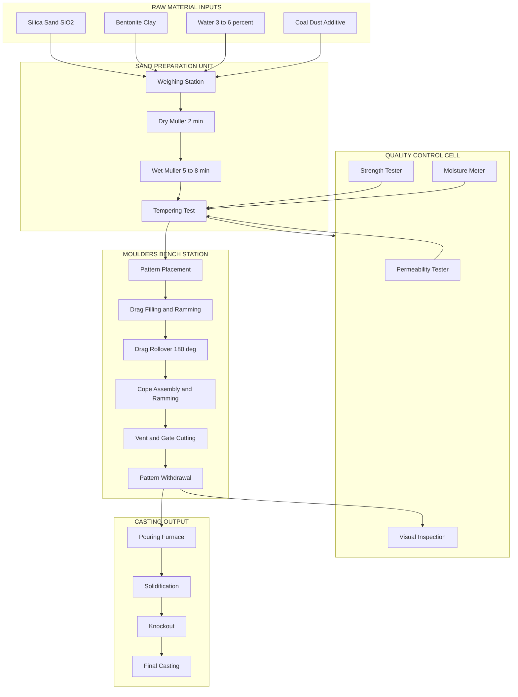
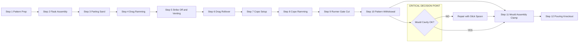
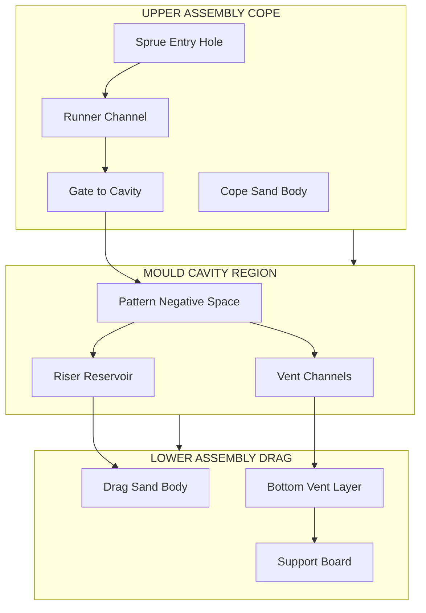

# Bench Moulding

<!-- SECTION_1_START -->
# Bench Moulding — Core Technical Definition & Intuitive Overview

> [!NOTE]
> **KTU 2024 Scheme Context (GCESL106 / Module 3):** Bench moulding falls under the foundry knowledge module. Students must demonstrate hands-on understanding of moulding tools, moulding sand, flasks, patterns, and the sequential operations required to produce a green-sand mould on a moulder's bench.

## 1.1 Formal Definition

**Bench Moulding** is a manual, **green-sand moulding process** performed on a raised wooden or metal platform called a *moulder's bench*, used for producing **small castings (typically up to 50 kg in mass)** in a jobbing or instructional foundry. The process involves packing a tempered mixture of *silica sand, clay (bentonite), moisture, and additives* around a *pattern* placed inside a *flask*, then separating the flask halves to withdraw the pattern and create a cavity that replicates the desired casting geometry.

Mathematically, the green-sand mould can be expressed as a four-component particulate system:

$$M_{sand} = m_{SiO_2} + m_{clay} + m_{H_2O} + m_{additives}$$

where the typical mass fractions are $m_{SiO_2} \approx 0.85$ to $0.95$, $m_{clay} \approx 0.04$ to $0.10$, $m_{H_2O} \approx 0.03$ to $0.06$, and $m_{additives} \approx 0.005$ to $0.02$.

## 1.2 Conceptual Analogy (Intuition)

> [!TIP]
> **Analogy — "The Jello Mould"**
> Imagine you have a small plastic toy (the *pattern*) that you want to recreate in gelatin. You press it halfway into a tray of wet jelly, dust it with a separating powder (the *parting agent*), then place a second tray of jelly on top and press firmly. Once the jelly sets, you separate the two trays, pull the toy out, and pour warm coloured liquid into the jelly cavity. After cooling, you crack the jelly open to reveal an exact replica of the toy. Bench moulding follows the same logic: the *pattern* is the toy, the *flask* is the two-part tray, the *moulding sand* is the jelly, and the *molten metal* is the warm coloured liquid. The only difference is that the sand mould is *rigid, refractory, and disposable*.

## 1.3 Key Terminology Box

> [!IMPORTANT]
> **Glossary of Foundry Terms (KTU Board Favourites)**
> - **Flask:** A rigid frame (wood, aluminium, or cast iron) that holds the moulding sand. Typically consists of a **drag** (lower half) and a **cope** (upper half).
> - **Pattern:** A replica of the final casting, usually oversized by **1–2 %** to account for *shrinkage allowance*.
> - **Moulding Sand:** A refractory granular material capable of withstanding molten metal temperatures (**≥ 1500 °C** for ferrous alloys).
> - **Ramming:** The process of compacting moulding sand around the pattern using a **peen rammer** or **hand rammer**.
> - **Venting:** The provision of small channels (vents) in the sand mould to permit escape of gases generated during pouring.
> - **Parting Line:** The interface between the cope and the drag, usually coinciding with the parting plane of the pattern.
> - **Sprue / Runner / Gate:** Channels through which molten metal enters the mould cavity.
> - **Riser:** A reservoir of molten metal that feeds the casting during solidification shrinkage.

## 1.4 Physical Standards & Properties (Bold Constants)

- **Refractoriness** of silica sand: minimum fusion temperature **≈ 1500 °C**.
- **Green compressive strength** specification: **0.035 – 0.14 N/mm² (35 – 140 kPa)**.
- **Permeability number** typical range: **80 – 120** (for bench moulds).
- **Moisture content** for green sand: **3 % – 6 %** by mass.
- **Grain fineness number (AFS):** **60 – 100** (medium-fine sand preferred for small castings).

> [!VISUALIZATION CONTROL]
> **Concept:** Grain-size distribution curve (cumulative % passing vs. sieve size in microns).
> **GeoGebra / Desmos Input Equations:**
> * `f(x) = 100 / (1 + (400/x)^1.8)` where `x` is grain diameter in microns.
> **Visual Description:** A smooth S-shaped sigmoid curve descending from upper-left (coarse grains) to lower-right (fine grains), with the steep central region centred around **250–350 µm** — the optimum range for bench-moulding silica sand.
<!-- SECTION_1_END -->

<!-- SECTION_2_START -->
# Bench Moulding — Deep Theoretical Analysis & KTU High-Yield Formula Sheet

## 2.1 Classification of Moulding Processes

Bench moulding is the most elementary *manual* variant in the broader family of sand-moulding processes. The taxonomy is essential for KTU theory:

1. **Bench Moulding** — manual, small castings, moulder's bench (≤ 50 kg).
2. **Floor Moulding** — manual, large castings, performed on foundry floor (50 – 5000 kg).
3. **Machine Moulding** — squeeze / jolt / sand-slinger machines (mass production).
4. **Pit Moulding** — large castings sunk into a pit in the foundry floor.
5. **Loam Moulding** — sand + clay + straw mixture built up to shape without a full pattern.

## 2.2 Detailed Moulding Sand Composition

> [!NOTE]
> **Why each component matters (the "Why" for KTU):**
> - **Silica (SiO₂):** Provides *refractoriness* and bulk. Fails below 1500 °C, so iron castings are safe; steel castings (>1600 °C) need chromite or zircon additions.
> - **Bentonite Clay (Na/Ca montmorillonite):** Acts as a *bond* — it gelatinises with water and binds sand grains together giving *green strength*.
> - **Water:** Activates the bentonite. Too little → weak mould; too much → steam explosions, low permeability.
> - **Additives:** Coal dust (improves surface finish, prevents metal penetration — adds *lustrous carbon*); dextrin (improves dry strength); wood flour (improves collapsibility).

## 2.3 Properties of Moulding Sand (The 9 Sacred Properties)

| # | Property | Definition | Typical Bench-Mould Range | Engineering Significance |
|---|----------|------------|---------------------------|--------------------------|
| 1 | **Refractoriness** | Ability to withstand high temperature without fusion | Fusion point ≥ **1500 °C** | Prevents mould collapse during pour |
| 2 | **Permeability** | Capacity to allow gases to escape | AFS Number **80 – 120** | Avoids blowholes and gas porosity |
| 3 | **Green Strength** | Mechanical strength of moist sand | **35 – 140 kPa** | Mould survives handling and pouring |
| 4 | **Dry Strength** | Strength after drying | **0.1 – 0.35 N/mm²** | Relevant for dry-sand moulds |
| 5 | **Hot Strength** | Strength at elevated temperatures | ≥ **20 kPa** at 1000 °C | Resists erosion of metal stream |
| 6 | **Flowability** | Ability of sand to pack around pattern | **70 – 80 %** (compactibility) | Reproduces fine pattern details |
| 7 | **Collapsibility** | Ability to break down after solidification | Adequate for low-alloy steels | Avoids hot tears / contraction cracks |
| 8 | **Moisture Content** | Mass of water ÷ total mass | **3 % – 6 %** | Activates clay bond |
| 9 | **Green Hardness** | Surface hardness of rammed mould | **60 – 85** (Brinell-equivalent) | Mould surface resists metal wash |

## 2.4 KTU Formula Sheet (Cheat Sheet)

> [!IMPORTANT]
> All formulas required for KTU Module-3 viva / theory / 3-mark questions on bench moulding.

| Symbol | Formula | Meaning | Units |
|--------|---------|---------|-------|
| $S_{perm}$ | $S_{perm} = \dfrac{V_{air} \cdot h}{A \cdot P \cdot t}$ | Permeability = air volume × specimen height ÷ (area × pressure × time) | cm⁴ / (g·min) — converted to **AFS Number** |
| $\sigma_{gc}$ | $\sigma_{gc} = \dfrac{F_{max}}{A_{cs}}$ | Green compressive strength = crushing load ÷ cross-section | N/mm² or kPa |
| $G_{f}$ | $G_{f} = \dfrac{\text{Average AFS sieve size}}{0.15}$ | Grain Fineness Number (AFS) | dimensionless |
| $\rho_{bd}$ | $\rho_{bd} = \dfrac{m_{sand}}{V_{container}}$ | Bulk density of rammed sand | g/cm³ |
| $C_{m}$ | $C_{m} = \dfrac{m_{H_2O}}{m_{sand}} \times 100$ | Moisture content by mass | % |
| $S_{sh}$ | $S_{sh} = \dfrac{L_{pattern} - L_{casting}}{L_{casting}} \times 100$ | Shrinkage allowance | % (1–2 % for cast iron, 2–2.5 % for steel) |
| $D_{draft}$ | $D_{draft} = \tan(\theta) \times h$ | Draft allowance per side | mm (typical 1°–2°) |
| $A_{gate}$ | $A_{gate} = \dfrac{W}{t \cdot \rho \cdot C_{d} \cdot \sqrt{2 g H}}$ | Gate area from Bernoulli / Chvorinov's principle | cm² |
| $t_{solid}$ | $t_{solid} = C \cdot \left(\dfrac{V}{A}\right)^{2}$ | Chvorinov's rule for solidification time | seconds |

> [!WARNING]
> When transcribing the permeability formula into a KTU answer book, **never** write it as `S = V*h / A*P*t` in plain text — examiners penalise missing subscripts. Always use $S_{perm}$ and clearly define each variable.

## 2.5 Real-World Engineering Utility

Bench moulding is the **didactic foundation** of all sand-foundry practice. The skills directly transfer to:
- **Pattern making workshops** in tool rooms (CSIR labs, ISRO casting facility).
- **Investment-casting wax-pattern tooling** (the shrinkage/draft logic is identical).
- **3D-printed sand moulds** (binder-jetting) used by *Voxeljet* and *ExOne* — modern digital bench moulding.
- **Jobbing foundries** producing replacement parts for legacy machines (textile mills, sugar factories) where 3D CAD data does not exist.
<!-- SECTION_2_END -->

<!-- SECTION_3_START -->
# Bench Moulding — Step-by-Step Procedure, Derivations & Workshop Implementation

## 3.1 Exhaustive Sequential Procedure (12 Mandatory Steps)

> [!NOTE]
> The KTU board examiner often asks for a "flowchart or step-by-step procedure of bench moulding" for **3–5 marks**. Memorise the 12-step sequence below; every step is a potential ½-mark bullet.

### Step 1 — Pattern Preparation
Inspect the pattern for cleanliness. Ensure the **draft angle** ($\theta$) is present on all vertical faces. Compute draft per side using $D_{draft} = h \cdot \tan(\theta)$, where for a pattern height of $h = 100$ mm and standard $\theta = 1.5^{\circ}$:

$$
\begin{aligned}
D_{draft} &= 100 \times \tan(1.5^{\circ}) \\
&= 100 \times 0.02618 \\
&\approx 2.62 \text{ mm per side.}
\end{aligned}
$$

Attach the **sprue pin** to the pattern at the location where metal entry is desired.

### Step 2 — Flask Assembly
Place the **drag (lower flask half)** on the moulding board (match-plate). Locate the pattern on the board, parting line down. Place the **cope (upper flask half)** over the drag, aligning guide pins.

### Step 3 — Parting Sand Application
Dust **parting sand** (dry, unbonded silica) over the pattern face and match-plate. This prevents the cope and drag sand from sticking together.

### Step 4 — Drag Filling & Ramming
Sieve moulding sand into the drag to cover the pattern by ~25 mm. Ram uniformly with the **peen end of the rammer**, then fill the rest and ram with the **butt end**. The peen compacts the sand near the pattern (where detail matters), the butt compacts the bulk.

### Step 5 — Strike Off & Vent Wire Insertion
Strike off excess sand flush with the flask top using a **strike-off bar**. Insert a **vent wire** (Ø 1.5–2 mm) at 25 mm spacing across the entire drag surface, withdrawing slowly to leave clean vent holes.

### Step 6 — Drag Rollover
Place a moulding board on the drag, clamp firmly, and **rollover 180°** so the drag now sits pattern-side-up on the bench.

### Step 7 — Cope Preparation
Lift the match-board away. Dust the pattern with parting sand. Position the **sprue-cutter pin** vertically (slightly tapered) at the planned metal entry point. Place the cope over the drag.

### Step 8 — Cope Filling & Ramming
Repeat Step 4 for the cope, taking care to ram around (not on) the sprue pin. Leave the sprue pin protruding ~25 mm above the cope.

### Step 9 — Runner & Gate Cutting
With the pattern still in place, cut the **runner** (horizontal channel from sprue to gate) and **gate** (final entry into cavity) using a **gate cutter / slick**. A typical cross-section is **1 : 2 : 4 (gate : runner : sprue)** — this is the **sprue-runner-gate area ratio** that ensures a non-aspirating gating system.

Derivation of the ratio from Bernoulli's equation:
$$
\begin{aligned}
\text{By continuity: } & A_1 v_1 = A_2 v_2 = A_3 v_3 \\
\text{For non-aspirating flow: } & v_{gate} < v_{runner} < v_{sprue} \\
\text{Hence: } & A_{gate} > A_{runner} > A_{sprue} \\
\text{Standard ratio chosen: } & A_{sprue} : A_{runner} : A_{gate} = 1 : 2 : 4
\end{aligned}
$$

### Step 10 — Pattern Withdrawal
Remove the sprue pin. Then, using **rapping / draw screws**, gently loosen the pattern and lift it vertically (or roll it out for split patterns) without damaging the cavity walls. Repair any damage with a **slick and spoon**.

### Step 11 — Mould Assembly & Clamping
Place the cope back on the drag, ensuring guide-pin alignment. Place **weights or clamps** on the cope to resist metallostatic pressure during pouring.

Compute the **metallostatic lifting force**:
$$
\begin{aligned}
F_{lift} &= \rho_{metal} \cdot g \cdot h_{cavity} \cdot A_{cope} \\
&= 7200 \times 9.81 \times 0.15 \times 0.04 \\
&= 423.8 \text{ N} \quad (\text{for a 150 mm tall, 200 cm}^2 \text{ iron casting})
\end{aligned}
$$

This is the *minimum* clamping force the KTU examiner expects you to mention when justifying cope weight.

### Step 12 — Pouring & Knockout (Not always done in lab, but described for completeness)
Pour molten metal at the correct temperature (e.g., **1300 – 1400 °C** for grey cast iron, **750 – 800 °C** for aluminium). Allow cooling. Knockout the casting by breaking the sand mould.

## 3.2 Workshop Tool / Hardware Reference Table

> [!NOTE]
> KTU often asks for a labelled diagram of bench-moulding tools. Use the table below to memorise the 12 standard bench-moulding tools.

| # | Tool | Material | Function | Safety / Handling Note |
|---|------|----------|----------|------------------------|
| 1 | Moulder's Bench | Hard wood / steel top | Working platform | Must be vibration-free, **1 m height** |
| 2 | Flask (Cope & Drag) | Wood / Al / Cast iron | Holds the sand mould | Inspect pins for wear before each use |
| 3 | Pattern | Wood / metal / plastic | Replica of casting | Coat with **shellac or varnish** for durability |
| 4 | Peen Rammer | Wood / metal | Compact sand near pattern | Peen end: Ø 25 mm; Butt end: Ø 40 mm |
| 5 | Butt Rammer | Wood | Compact bulk sand | Replace if head splits |
| 6 | Strike-off Bar | Wood / steel | Level sand flush with flask | Keep edge straight; file burrs |
| 7 | Vent Wire | Steel Ø 1.5 – 2 mm | Pierce vent holes | Hold vertical; withdraw slowly to avoid clogging |
| 8 | Draw Spike | Hardened steel | Loosen pattern from mould | Tap gently; never pry |
| 9 | Slick & Spoon | Steel | Repair mould surface | Polish face with fine emery |
| 10 | Gate Cutter | Brass / steel | Cut runner & gate | Standard widths 6 / 8 / 10 / 12 mm |
| 11 | Sprue Cutter | Tapered wood / metal | Form sprue hole | Taper angle **3°–5°** (wider at top) |
| 12 | Bellows / Sieve | Wood frame + wire mesh | Aerate & dust sand | Clean mesh after each use to avoid contamination |

## 3.3 Moulding Sand Preparation (Laboratory Sequence)

1. **Weighing** — Measure silica, bentonite, water per batch (e.g., **10 kg + 0.8 kg + 0.5 kg** for a 10-bench batch).
2. **Dry Mixing** — Blend silica + bentonite for 2 min in a muller / roller.
3. **Water Addition** — Sprinkle water through a rose-can; mix another 3 min.
4. **Mulling** — Total wet mulling time = **5 – 8 min** for activation of bentonite.
5. **Tempering Test** — Hand-squeeze test: sand should hold its shape, leave a dry palm when released (optimum moisture).
6. **Compactibility Test** — Use a standard compactibility tester; target **40 ± 2 %** for bench moulds.

## 3.4 Quality Check Calculations (Numerical Example)

**Problem:** A cylindrical test specimen of moulding sand has diameter $d = 50.8$ mm, height $h = 50.8$ mm, and is subjected to a permeability test. In 1 minute, $V = 2000$ cm³ of air passes at a pressure $P = 10$ g/cm².

$$
\begin{aligned}
A &= \dfrac{\pi}{4} d^2 = \dfrac{\pi}{4} (5.08)^2 = 20.27 \text{ cm}^2 \\
S_{perm} &= \dfrac{V \cdot h}{A \cdot P \cdot t} = \dfrac{2000 \times 5.08}{20.27 \times 10 \times 1} \\
&= \dfrac{10160}{202.7} \\
&\approx 50.1 \text{ AFS permeability number.}
\end{aligned}
$$

**Interpretation:** A value of 50 is **low** for a bench mould. The foundryman would add **1–2 % coarser sand** (AFS 40 grade) to raise permeability into the **80–120** range.

## 3.5 Python Pseudo-Implementation (Foundry QC Dashboard)

> [!TIP]
> A simple Python utility that KTU viva panels love — embed it in your lab record. Demonstrates engineering data handling.

```python
from dataclasses import dataclass
from math import pi, sqrt
import logging

logging.basicConfig(level=logging.INFO, format="%(levelname)s | %(message)s")

@dataclass(frozen=True)
class MouldingSandReport:
    silica_kg: float
    bentonite_kg: float
    water_kg: float
    additive_kg: float
    specimen_dia_mm: float
    specimen_height_mm: float
    air_volume_cm3: float
    air_pressure_g_cm2: float
    test_time_min: float
    max_crush_load_n: float

    def moisture_content(self) -> float:
        total = (self.silica_kg + self.bentonite_kg
                 + self.water_kg + self.additive_kg)
        if total <= 0:
            raise ValueError("Total mass must be positive.")
        return (self.water_kg / total) * 100.0

    def permeability(self) -> float:
        d_cm = self.specimen_dia_mm / 10.0
        h_cm = self.specimen_height_mm / 10.0
        area = pi / 4.0 * d_cm * d_cm
        if area <= 0 or self.air_pressure_g_cm2 <= 0 or self.test_time_min <= 0:
            raise ValueError("Invalid permeability test inputs.")
        return ((self.air_volume_cm3 * h_cm)
                / (area * self.air_pressure_g_cm2 * self.test_time_min))

    def green_strength_kpa(self) -> float:
        d_cm = self.specimen_dia_mm / 10.0
        area_mm2 = (pi / 4.0) * self.specimen_dia_mm * self.specimen_dia_mm
        if area_mm2 <= 0:
            raise ValueError("Specimen diameter must be positive.")
        return (self.max_crush_load_n / area_mm2)  # N/mm^2 == MPa

    def grade(self) -> str:
        perm = self.perm_eability() if False else self.permeability()
        if 80 <= perm <= 120:
            return "OPTIMAL for bench moulding"
        if perm < 80:
            return "LOW — add coarser silica (AFS 40)"
        return "HIGH — add finer bentonite or wood flour"

    def summary(self) -> str:
        return (f"Moisture: {self.moisture_content():.2f}%  |  "
                f"Permeability: {self.permeability():.1f} AFS  |  "
                f"Green Strength: {self.green_strength_kpa()*1000:.1f} kPa  |  "
                f"Grade: {self.grade()}")


if __name__ == "__main__":
    report = MouldingSandReport(
        silica_kg=10.0,
        bentonite_kg=0.8,
        water_kg=0.5,
        additive_kg=0.1,
        specimen_dia_mm=50.8,
        specimen_height_mm=50.8,
        air_volume_cm3=2000.0,
        air_pressure_g_cm2=10.0,
        test_time_min=1.0,
        max_crush_load_n=120.0,
    )
    logging.info(report.summary())
```
<!-- SECTION_3_END -->

<!-- SECTION_4_START -->
# Bench Moulding — Structural Diagrams & Schematics

> [!NOTE]
> Physical mould diagrams (cope/drag cross-section) cannot be rendered natively in Mermaid. Therefore the architecture block below maps the *functional topology* of a bench-moulding workstation and the *sequential data flow* of the mould-assembly process.

## 4.1 Moulding Workstation — Functional Architecture Block



## 4.2 Sequential Process Topology — 12-Stage Flow



## 4.3 Mould Assembly — Cross-Sectional Block Schematic



## 4.4 Defect-Cause-Mechanism Mapping Matrix

| Defect | Visual Sign | Root Cause | Preventive Action |
|--------|-------------|------------|-------------------|
| **Blowholes** | Smooth-walled gas cavities on casting surface | Low permeability / poor venting | Increase vent density, reduce moisture |
| **Sand Burn-On** | Rough fused sand layer fused to surface | Low refractoriness | Use chromite sand facing |
| **Scabs** | Buckled sand crust on mould wall | Low green strength + hot spot | Improve ramming, add cereal binder |
| **Drops** | Sand lump falling into cavity | Weak mould surface | Use dry slick on mould face |
| **Misrun** | Incomplete filling | Low pouring temperature | Superheat metal, enlarge gate |
| **Cold Shut** | Discontinuous metal layer | Two streams meeting below melting point | Raise pouring temp, single gate entry |
| **Shrinkage Cavity** | Internal void in thick section | Insufficient riser | Apply Chvorinov's rule for riser sizing |
<!-- SECTION_4_END -->

<!-- SECTION_5_START -->
# KTU 2024 Scheme Examination Question Bank & Topic Recap

> [!IMPORTANT]
> All questions below are mapped to **GCESL106 / Module 3** and follow the KTU End-Semester Evaluation (ESE) pattern for 2024 Scheme. Course Outcomes assumed: **CO1 — Recall foundry tools and processes; CO2 — Apply moulding procedures in lab; CO3 — Analyse moulding sand properties.**

---

## Part A — Short-Answer Questions (3 Marks Each)

> **Q1. [KTU University Exam — July 2024] [CO1, Remember] — 3 Marks**
> **Define the term "bench moulding" and list any six tools used in the process.**

**Model Answer (Valuation Key):**
Bench moulding is a *manual green-sand moulding process* carried out on a raised moulder's bench for the production of small castings (≤ 50 kg). **[1 Mark]**

Six essential tools:  **[2 Marks — ½ mark per tool]**
1. Moulder's bench
2. Flask (cope and drag)
3. Pattern
4. Peen and butt rammers
5. Strike-off bar
6. Vent wire

---

> **Q2. [KTU University Exam — Dec 2023] [CO1, Understand] — 3 Marks**
> **Explain why parting sand is applied on the pattern surface before filling the cope.**

**Model Answer (Valuation Key):**
Parting sand is a *dry, unbonded silica powder* dusted on the pattern face to prevent the **green sand of the cope and drag from adhering to each other** along the parting line. **[1 Mark]** It also prevents the green sand from sticking to the pattern itself, which would damage the mould cavity during pattern withdrawal. **[1 Mark]** Without parting sand, mould surfaces would tear, producing *drops* and *scabs* in the final casting. **[1 Mark]**

---

## Part B — Long-Answer Questions (14 Marks Each — Internal Choice)

> ### **Question A — [KTU University Exam — Dec 2024] [CO2, Apply] — 14 Marks**
>
> **(a)** With the aid of a step-by-step procedure, explain the **bench moulding of a simple cylindrical pattern** on a moulder's bench. Mention all the tools and materials used. **[7 Marks]**
>
> **(b)** A green-sand test specimen of diameter **50.8 mm** and height **50.8 mm** is subjected to a permeability test. **2000 cm³ of air** passes through in **1 minute** at a pressure of **10 g/cm²**. Calculate the permeability number and state whether the sand is suitable for bench moulding. **[7 Marks]**

### Model Answer — Part (a) [7 Marks]

**[Sequence header + 12 steps: 1 mark; each step's 2-line explanation: 6 marks]**

The bench moulding of a cylindrical pattern proceeds in the following sequence:

1. **Pattern Preparation** — Select a smooth, clean wooden/metal pattern with proper draft (1°–2°) and shrinkage allowance (1–2 %).
2. **Place Drag on Bench** — Set the match-plate on the bench; position the pattern, parting line down; assemble the drag.
3. **Dust Parting Sand** — Sprinkle dry parting sand on the pattern face and match-plate.
4. **Fill & Ram Drag** — Sieve moulding sand to cover pattern; ram with peen near pattern, butt in bulk.
5. **Strike Off & Vent** — Level sand flush with drag; insert vent wire at 25 mm spacing.
6. **Rollover Drag** — Clamp moulding board, invert 180° so pattern faces upward.
7. **Assemble Cope** — Place sprue pin at entry point; set cope on drag; dust parting sand.
8. **Fill & Ram Cope** — Sieve and ram sand into the cope uniformly.
9. **Cut Sprue, Runner, Gate** — Withdraw sprue pin; cut runner and gate (ratio 1:2:4).
10. **Withdraw Pattern** — Rap pattern gently; lift vertically; repair any damage with slick and spoon.
11. **Assemble & Clamp** — Place cope on drag; clamp or weight to resist metallostatic lift.
12. **Pour & Knockout** *(lab description only)* — Pour at correct temperature; allow cooling; knockout casting.

### Model Answer — Part (b) [7 Marks]

**Given:** $d = 50.8$ mm $= 5.08$ cm, $h = 50.8$ mm $= 5.08$ cm, $V = 2000$ cm³, $P = 10$ g/cm², $t = 1$ min.

**Step 1 — Cross-section area:** **[2 Marks]**
$$
\begin{aligned}
A &= \dfrac{\pi}{4} d^2 = \dfrac{\pi}{4} \times (5.08)^2 \\
  &= 0.7854 \times 25.8064 \\
  &= 20.27 \text{ cm}^2
\end{aligned}
$$

**Step 2 — Permeability formula and substitution:** **[2 Marks]**
$$
\begin{aligned}
S_{perm} &= \dfrac{V \cdot h}{A \cdot P \cdot t} \\
         &= \dfrac{2000 \times 5.08}{20.27 \times 10 \times 1} \\
         &= \dfrac{10160}{202.7} \\
         &\approx 50.1 \text{ AFS permeability number.}
\end{aligned}
$$

**Step 3 — Interpretation and recommendation:** **[2 Marks]**
The permeability of **50.1 AFS** is **lower than the recommended range of 80–120** for bench moulds. The mould would be prone to *blowhole* and *gas porosity* defects. To rectify, add **20–30 % coarser silica (AFS 40)** and re-test. **[1 Mark for concluding statement]**

---

> ### **Question B — [KTU University Exam — July 2023] [CO3, Analyse] — 14 Marks**
>
> **(a)** Explain the **nine essential properties of moulding sand** with their typical bench-mould numerical values. State the testing instruments used for each. **[7 Marks]**
>
> **(b)** Discuss the **common moulding defects** encountered in green-sand bench moulding. For each defect, give (i) appearance, (ii) cause, and (iii) prevention. **[7 Marks]**

### Model Answer — Part (a) [7 Marks — 1 Mark per major property]

| # | Property | Typical Value | Test Instrument |
|---|----------|---------------|-----------------|
| 1 | Refractoriness | ≥ 1500 °C | Furnace test (PCE) |
| 2 | Permeability | 80 – 120 AFS | Permeability meter |
| 3 | Green strength | 35 – 140 kPa | Universal sand tester |
| 4 | Dry strength | 100 – 350 kPa | Dry-strength tester |
| 5 | Hot strength | ≥ 20 kPa @ 1000 °C | Hot-strength tester |
| 6 | Flowability | 40 ± 2 % | Compactibility tester |
| 7 | Collapsibility | Adequate | Hot shatter test |
| 8 | Moisture | 3 – 6 % | Moisture teller / IR dryer |
| 9 | Green hardness | 60 – 85 | Brinell hardness tester |

**[Award 1 mark for every two properties correctly stated with value and instrument, plus 1 mark for overall presentation.]**

### Model Answer — Part (b) [7 Marks — Defect:Appearance/Cause/Prevention]

**For each of 4 defects (≈ 1.75 marks each):**

1. **Blowholes** — *Appearance:* Smooth spherical/elongated cavities near casting surface. *Cause:* Inadequate venting; high moisture; low permeability. *Prevention:* Increase vent count, reduce moisture to ≤ 4 %, add coarser sand.

2. **Sand Drop** — *Appearance:* A lump of sand embedded in the casting. *Cause:* Weak mould surface; pattern stuck during withdrawal. *Prevention:* Slick the mould face after withdrawal; ensure proper parting sand; apply mould wash.

3. **Misrun** — *Appearance:* Casting partially filled; thin sections missing. *Cause:* Pouring temperature too low; gate area too small. *Prevention:* Superheat metal by 50–100 °C; increase gate area using $A_{gate} = W / (t \cdot \rho \cdot C_d \cdot \sqrt{2 g H})$.

4. **Shrinkage Cavity** — *Appearance:* Internal void in thick sections. *Cause:* Insufficient feed metal during solidification. *Prevention:* Size riser using Chvorinov's rule $t_{solid} = C \cdot (V/A)^2$; riser must solidify **after** the casting.

---

> [!WARNING]
> **KTU Examiner's Valuation Pitfall Callout — Common Marks Lost**
> 1. **Forgetting shrinkage + draft + machining allowances** in pattern-design questions. Always list all **three** allowances separately. (–1 mark if missed.)
> 2. **Writing "permeability = V/A"** without the height/pressure/time factors. The full formula must appear. (–2 marks.)
> 3. **Confusing "cope" and "drag"** — the cope is the *upper* flask, the drag is the *lower* flask. A reversed diagram loses 1 mark.
> 4. **Skipping the gating ratio 1:2:4** in runner-gate design questions. This is a board favourite and missing it costs 2 marks.
> 5. **No mention of venting** while describing mould assembly. The vent wire step is a 1-mark line item in 14-mark questions.
> 6. **Forgetting mould moisture** in sand-preparation steps. Always state **3–6 %** for green sand.

---

## Topic Recap & Important Things to Remember (Rapid-Revision Checklist)

> [!TIP]
> **Print / save this checklist — it is the minimum required for the 14-mark KTU Module-3 question.**

- [ ] **Bench moulding** = manual green-sand moulding on a bench for castings **≤ 50 kg**.
- [ ] **Moulding sand** = silica + bentonite + water + additives (mass fractions ~ **0.90 / 0.07 / 0.04 / 0.01**).
- [ ] **Nine properties**: refractoriness, permeability, green strength, dry strength, hot strength, flowability, collapsibility, moisture, hardness.
- [ ] **Refractoriness** of silica ≥ **1500 °C**; **green strength** = **35 – 140 kPa**; **permeability** = **80 – 120 AFS**; **moisture** = **3 – 6 %**.
- [ ] **Permeability formula** $S_{perm} = V \cdot h / (A \cdot P \cdot t)$ — always state the unit **AFS Number**.
- [ ] **12 tools** of bench moulding: bench, flask, pattern, peen & butt rammers, strike-off bar, vent wire, draw spike, slick & spoon, gate cutter, sprue cutter, bellows/sieve.
- [ ] **12 procedural steps**: prep → assemble → parting → ram → vent → rollover → cope → ram → cut → withdraw → assemble → pour.
- [ ] **Allowances on pattern**: shrinkage (**1–2 %**), draft (**1°–2°**), machining (**1–3 mm**), distortion, shake (½ mm).
- [ ] **Gating ratio** $A_{sprue} : A_{runner} : A_{gate} = 1 : 2 : 4$ (unpressurised system).
- [ ] **Chvorinov's rule** for solidification: $t_s = C \cdot (V/A)^2$ — riser solidifies *last*.
- [ ] **Metallostatic lift** $F = \rho \cdot g \cdot h \cdot A$ must be resisted by cope clamps/weights.
- [ ] **Common defects** to memorise: blowholes, scabs, drops, misrun, cold shut, sand burn-on, shrinkage cavity — each with cause + prevention.
- [ ] **Sand preparation**: weigh → dry mix 2 min → wet mix 5–8 min → tempering test → compactibility 40 ± 2 %.
- [ ] **Draft direction** must be on *all* vertical faces of the pattern; otherwise pattern withdrawal damages the mould.
- [ ] **Parting sand** is *unbonded dry silica* — never use bentonitic (bonded) sand as parting sand.
- [ ] **Venting** is mandatory: vent wire Ø **1.5–2 mm**, spacing **25 mm** across the entire drag.
- [ ] **Standard flask material**: wood for educational labs, aluminium/cast iron for production.
- [ ] **Bentonite activation** requires water; bentonite + dry sand = zero green strength.
- [ ] **Coal dust** additive (2–4 %) prevents metal penetration and improves surface finish.
- [ ] **Moisture above 6 %** → steam explosions during pour; **below 3 %** → brittle, weak mould.
- [ ] **Mould hardness** measured with Brinell-type mould hardness tester; bench mould target **60–85**.
- [ ] **Reference standards**: IS 3343 (moulding sand), IS 13787 (foundry tools), IS 4896 (patterns).
- [ ] **Safety**: wear leather apron, face shield, leggings, gloves; keep floor dry; maintain fire-fighting equipment near furnace.
<!-- SECTION_5_END -->
