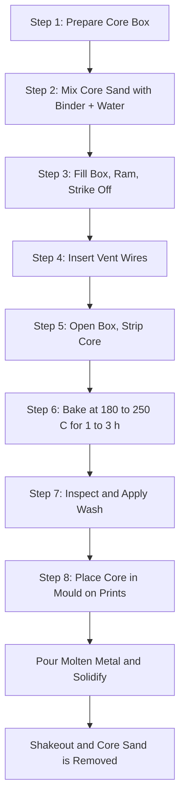
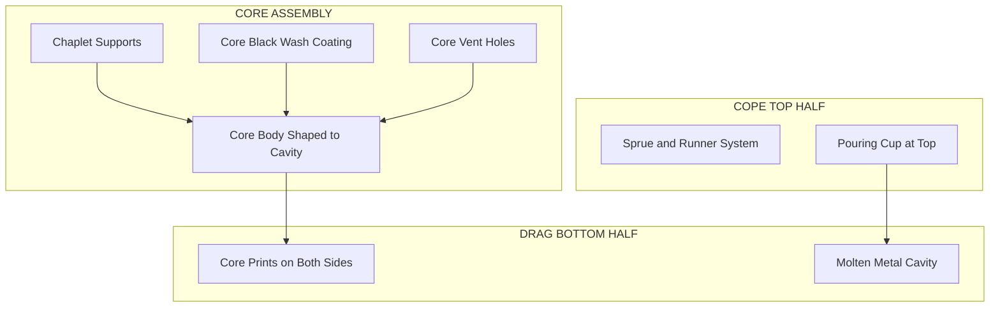
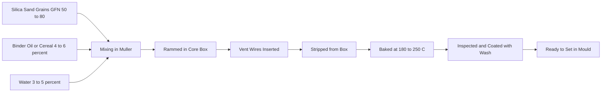
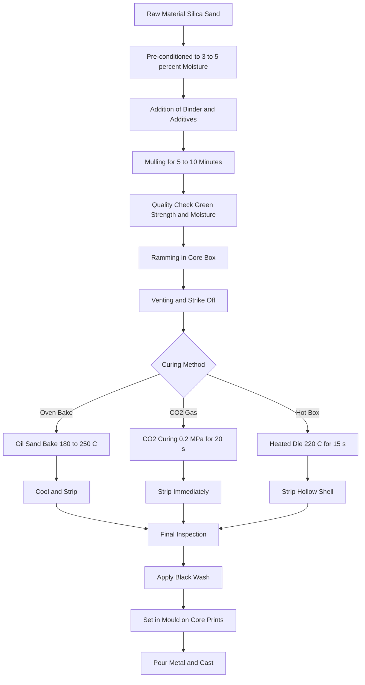
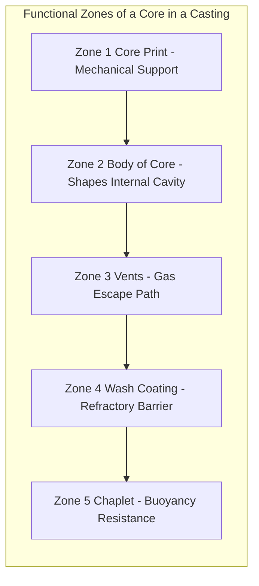
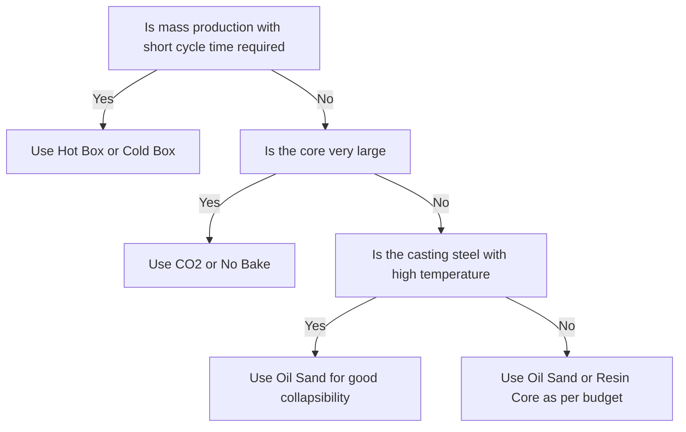

# Core making

<!-- SECTION_1_START -->
# CORE MAKING IN FOUNDRY

## 1. Core Technical Definition & Intuitive Overview

### Formal KTU Syllabus Definition

A **core** is a separate, preformed sand shape that is inserted into the mold cavity to produce internal cavities, holes, passages, or intricate undercut features in a casting that cannot be made by the cope and drag mold halves alone. Core making is the art and science of preparing these cores using bonding agents, core boxes, and curing methods to withstand the metallurgical and mechanical stresses during pouring, solidification, and shakeout.

> [!IMPORTANT]
> **KTU 2024 Syllabus Highlight (GCESL106 / Module 3):** The student is expected to demonstrate hands-on knowledge of *at least one* core making process. For university practical records and viva, the **Oil Sand Core (Hand Core / Bench Core)** process and the **CO₂ Sodium Silicate Process** are the most commonly evaluated.

### Conceptual Analogy / Intuition

Imagine you are making an ice cube with a hollow center to hold a strawberry inside.
* The outer ice cube mould gives the **outer shape** — this is the **mould (cope + drag)** in a foundry.
* The strawberry sits inside, and ice freezes around it. When the ice melts, the strawberry-shaped space becomes a hollow cavity.
* In a foundry, the metal melts and fills around a **pre-shaped sand insert (the core)**. When the casting cools, the sand core is shaken out, leaving an internal cavity exactly where the strawberry was.

> **Core = "Disappearing Skeleton"** — it shapes the *inside* of the casting and is later removed, leaving the desired hollow geometry.

### Physical Constants and Standard Foundry Metrics

* **Grain Fineness Number (GFN)** for silica sand: typically **40 – 90** (AFS standard).
* **Moisture content** in oil-sand cores: **3 % – 5 %** by weight.
* **CO₂ gas purging pressure** for sodium silicate cores: **0.15 MPa – 0.30 MPa** for **10 – 30 seconds**.
* **Core baking temperature** (oil-sand / resin): **180 °C – 250 °C** for **1 – 3 hours**.
* **Standard tensile strength of a baked core**: **0.7 MPa – 1.4 MPa** (≈ **100 – 200 psi**).
* **Permeability number** required for cores: **80 – 150** (AFS units) — high to allow gas escape.

### Core Terminology You Must Memorize

> [!NOTE]
> **Core Print** — The extension/projection on a core that sits in the mould cavity and supports the core in position. It is the *only contact area* between the core and the mould, so precision here is critical.
> **Core Box** — A wooden or metal flask-shaped box used to shape the core sand into the required geometry. Made in halves (top + bottom) for easy removal.
> **Chaplets** — Small metal supports placed inside the mould to hold heavy cores against buoyancy and metallostatic pressure.
> **Vents** — Thin vent rods placed in the core sand that are later withdrawn to leave narrow gas-escape passages.
> **Core Sand** — A specially formulated mixture of silica sand + binder + additives (cereal, oxide, resin) possessing high strength, permeability, and collapsibility.

### Role of a Core Inside a Casting

> [!VISUALIZATION CONTROL]
> **Concept:** Cross-section of a mould with a core placed inside, showing molten metal surrounding the core.
> **Visual Description:** Draw a rectangular flask with a horizontal parting line. A small cylindrical projection (core print) is drawn in the drag. A larger cylindrical/curved shape (the core) sits on it, extending into the cope half. Arrows show molten metal entering the sprue and surrounding the core from all sides. The core has vent holes drawn as small dashed lines radiating outward.

### Why Cores Are Necessary

* To create **internal cavities** (e.g., cylinder bores in engine blocks).
* To create **holes and passages** that go through the casting.
* To create **undercuts** that cannot be drawn by the pattern.
* To improve **surface finish** of internal passages over what would be obtained by separate inserts.
* To **reduce machining cost** by casting features near-net-shape.

<!-- SECTION_1_END -->

<!-- SECTION_2_START -->
# 2. Deep Theoretical Analysis & KTU High-Yield Formula Sheet

## 2.1 Properties / Characteristics of a Good Core

A good foundry core must satisfy **six critical engineering properties** simultaneously. Examiners frequently test these as 3-mark direct questions.

1. **High Strength (Green & Dry)** — must survive handling, mold closure, and the hydrostatic + dynamic pressure of molten metal.
2. **High Permeability** — must allow gases (air, steam, binder decomposition gases) to escape rapidly to avoid gas porosity in the casting.
3. **High Refractoriness** — must resist thermal shock and chemical attack from molten metal (silica sand gives this).
4. **Good Collapsibility** — must disintegrate easily after solidification to allow the casting to contract freely (otherwise hot tears / cracks develop).
5. **Good Surface Finish** — fine grain size + proper binder gives a smooth internal bore.
6. **Moisture Control (if green)** — uniform moisture (3 % – 6 %) for even strength.

## 2.2 Classification of Cores

Cores are classified on **three** orthogonal criteria — examiners love asking for these tables.

### A. Based on Position / Backing

| Type | Description | Backing / Support | Typical Use |
|------|-------------|-------------------|-------------|
| **Green Sand Core** | Made from moist bentonite-bonded sand | No backing; weak | Simple, small cores |
| **Dry Sand Core** | Baked at 180 °C – 250 °C | Strong, hard baked skin | Most production cores |
| **Core Supported by Metal** | Reinforced with iron wire / rods | Embedded metal skeleton | Long, slender cores |
| **Chill Core** | Has metal chills inside | Encourages directional solidification | Heavy castings |

### B. Based on Binders Used (Most Important for KTU Viva)

| Sl. No. | Core Type | Binder | Curing Method | Strength | Typical Application |
|---------|-----------|--------|---------------|----------|---------------------|
| 1 | **Oil Sand Core** | Linseed / Cereal / Mineral oil + clay | Oven baking 180 °C – 250 °C | Moderate | General jobbing foundry |
| 2 | **Resin / Shell Core (Hot Box)** | Phenolic resin + hexa | Heated core box (200 °C – 250 °C) | High | Mass production |
| 3 | **CO₂ / Sodium Silicate Core** | Sodium silicate (Na₂SiO₃) | Gassing with CO₂ | High, instant | Large cores, quick curing |
| 4 | **No-Bake / Cold-Box (Furan) Core** | Furan resin + acid catalyst | Self-set at room temp | High | Heavy castings, large cores |
| 5 | **Cold-Box (Amine) Core** | Phenolic-urethane + amine gas | Gassed with tertiary amine | Very high | High-volume automotive |
| 6 | **Cement-Bonded Core** | Portland cement + water | Air-cure 24 h | Very high | Massive cores |

### C. Based on Geometry / Function

| Type | Function | Example |
|------|----------|---------|
| **Horizontal Core** | Lays flat on prints | Cylinder bore |
| **Vertical Core** | Stands upright in mould | Hole perpendicular to parting |
| **Balanced Core** | Symmetrical — no lifting force | Centered passages |
| **Unbalanced Core** | Asymmetric — needs chaplets | Offset holes |
| **Hanging / Drop Core** | Suspended from cope by extension | Side ports, manifolds |
| **Stub Core** | Small, partially embedded in mould | Small recesses |

## 2.3 KTU High-Yield Formula Sheet (Core Sand Composition & Strength)

| Property / Parameter | Symbol | Formula / Typical Value | Engineering Significance |
|----------------------|--------|-------------------------|--------------------------|
| Grain Fineness Number (AFS) | $G$ | $G = \dfrac{\sum (m_i \times n_i)}{\sum m_i}$ | Fineness of sand; higher = finer |
| Moisture content | $M$ | $M = \dfrac{W_w - W_d}{W_d} \times 100 \text{ \%}$ | $W_w$ = wet weight, $W_d$ = dry weight |
| Permeability (AFS) | $P$ | 80 – 150 (typical for cores) | Volumetric gas flow per unit area |
| Green compressive strength | $\sigma_g$ | 0.035 – 0.070 MPa | Strength of unbaked core |
| Dry tensile strength | $\sigma_t$ | 0.7 – 1.4 MPa | Strength of baked core |
| Buoyancy force on core | $F_b$ | $F_b = \rho_{metal} \cdot V_{core} \cdot g - W_{core}$ | Must be balanced by prints/chaplets |
| Core sand mix (Oil Sand) | — | Sand 92 % + Binder (oil/cereal) 4 % + Water 4 % | Standard bench-core recipe |
| CO₂ core mix | — | Sand 92 – 95 % + Sodium silicate 5 – 8 % | Cured by CO₂ gassing |
| Hot-box core cure time | $t_c$ | 10 – 60 s at 200 °C – 250 °C | Production rate determinant |
| Baking time | $t_b$ | $t_b = 1\text{ h} + 0.5\text{ h per 25 mm thickness}$ | Empirical rule |

> [!NOTE]
> The buoyancy equation is **critical**. Molten iron (≈ **7.0 g/cm³**) or brass (≈ **8.5 g/cm³**) is much denser than the core (≈ **1.6 g/cm³**), so the metal tries to *float* the core. This is why **chaplets** and **core prints** must be sized to withstand $F_b$.

## 2.4 Engineering Utility of Core Making

* **Automotive sector:** Cylinder bores in engine blocks, water jackets, oil galleries.
* **Pipe and valve industry:** Elbows, tees, valve bodies with internal flow passages.
* **Pump and turbine industry:** Impeller passages, volute chambers.
* **Heavy machinery:** Bearing housings, gear box casings.
* **Art and decorative castings:** Hollow statues, lamp posts.

<!-- SECTION_2_END -->

<!-- SECTION_3_START -->
# 3. Step-by-Step Derivations, Processes & Implementation

## 3.1 Detailed Step-by-Step: Hand Core Making (Oil Sand / Bench Core)

This is the **most likely KTU practical question** — both for record and viva.

### Step 1 — Core Box Preparation
* Select the correct **core box** matching the drawing.
* Clean the inner surfaces with a **brush / compressed air**.
* Apply a thin film of **release agent** (zinc stearate powder, kerosene, or parting dust) to prevent sticking.
* Assemble the core box halves and clamp / hold together.

### Step 2 — Core Sand Preparation
* Take **dry silica sand** (GFN 50 – 70) in a muller / pan.
* Add **4 % – 6 % binder** (linseed oil OR a mix of 50 % cereal + 50 % clay) by weight.
* Add **3 % – 5 % water** to develop green bond.
* Mull for **5 – 10 minutes** until uniform.
* Test: squeeze a handful — it should retain shape but crumble easily when poked (green bond test).

> [!IMPORTANT]
> **Composition Rule of Thumb (Oil Sand):** Sand 90 – 93 % + Oil/Cereal 4 – 6 % + Water 3 – 5 %.

### Step 3 — Manual Ramming / Stamping
* Sprinkle **a thin layer of parting sand** inside the core box (to ease stripping).
* Fill the core box with prepared core sand.
* Ram gently but firmly with a **wooden / metal ramming tool / fingers** — pack corners, edges, and vent-rod positions first.
* Strike off excess sand with a **strike-off bar / straight edge** so the core surface is flush with the box edges.

### Step 4 — Venting
* Insert **vent wires** (1.5 – 3 mm diameter) at frequent intervals, perpendicular to the core surface, at **25 – 50 mm spacing**.
* These are withdrawn before baking to leave **gas-escape channels**.
* For long cores, central **wax vent strings** are embedded and burnt out during baking.

### Step 5 — Stripping the Core
* Invert or open the core box carefully.
* **Tap the sides** gently with a mallet — the core should release cleanly.
* If the core sticks, the binder is insufficient or the box is under-lubricated.

### Step 6 — Drying / Baking
* Place the green core on a **drying plate** or **core support (drier)**.
* Load into a **core oven** pre-heated to **180 °C – 250 °C**.
* Hold for **1 – 3 hours** depending on thickness:

$$t_{bake} = 1 \text{ h} + 0.5 \text{ h} \times \frac{t_{core}}{25 \text{ mm}}$$

where $t_{core}$ is the maximum section thickness of the core in mm.

* Cool slowly to avoid thermal-shock cracking (do **not** open the oven door wide).

### Step 7 — Inspection and Storage
* Inspect for cracks, soft spots, low strength.
* Wrap in dry storage until use.
* Apply **black wash (graphite + water)** on cores that will contact molten metal — improves surface finish and prevents metal penetration.

### Step 8 — Setting in the Mould
* Place the baked core on the **core prints** of the drag half.
* Secure with **paste / glue** if vertical.
* For heavy cores, place **chaplets** to resist buoyancy.
* Close the cope; check **core clearance / vents** align with mould vents.
* Pour metal — the core resists the melt until solidification.

## 3.2 Detailed Step-by-Step: CO₂ Sodium Silicate Core Making

The CO₂ process is the **second most-asked** core-making process in KTU viva because it is fast, clean, and impressive to demonstrate.

### Chemistry of Bonding

The sodium silicate binder sets by a reversible acid–base reaction when exposed to CO₂ gas:

$$\text{Na}_2\text{SiO}_3 \text{ (aq)} + \text{CO}_2 \text{ (g)} \longrightarrow \text{Na}_2\text{CO}_3 \text{ (s)} + \text{SiO}_2 \text{ (gel)}$$

The **silica gel (SiO₂ · nH₂O)** forms an interlocking network that cements the sand grains. This reaction is **exothermic** and takes only **10 – 30 seconds**.

### Step-by-Step Procedure

1. **Mixing:** Sand (95 %) + Sodium silicate (5 – 8 %) mulled uniformly.
2. **Ramming:** Packed into core box, vented, struck off.
3. **Stripping:** The core can be stripped *immediately* (no oven needed) — but with low strength until gassed.
4. **Gassing:** Core placed in a gassing chamber (or CO₂ is fed through probes inserted into the core). Purge with **CO₂ at 0.15 – 0.30 MPa for 10 – 30 s**.
5. **Strength Build-up:** The surface hardens; the core develops handleable strength within 30 seconds and full strength in a few minutes.
6. **Storage:** CO₂ cores are **hygroscopic** — they absorb moisture from air and weaken. Must be stored in a dry place and used within **24 – 48 hours**.
7. **Setting in Mould:** Same as oil-sand core.

> [!IMPORTANT]
> **Advantage of CO₂ Process:** No oven, no fuel, no fumes, very fast, dimensional accuracy is high.
> **Disadvantage:** Poor collapsibility — can cause hot tears in steel castings; hygroscopic (storage problem).

## 3.3 Detailed Step-by-Step: Hot-Box / Shell Core Making

Used in mass-production foundries. The core box is a **heated metal die** (200 °C – 250 °C).

1. The heated die is closed.
2. **Resin-coated sand** is blown into the cavity.
3. Heat from the die cures the resin shell (≈ **10 – 30 seconds**).
4. The core box opens; the **hollow shell core** is ejected.
5. The shell is post-cured in a **hot oven (250 °C for 60 s)** for full strength.
6. The cavity in a shell core gives excellent gas permeability and collapsibility.

## 3.4 Worked Example — Buoyancy Force on a Cylindrical Core

> **[KTU Numerical Type — 7 Mark Application]**
> A cylindrical sand core of diameter **80 mm** and length **150 mm** is to be supported in an iron casting. Density of sand core = **1.6 g/cm³**, density of molten iron = **7.0 g/cm³**, density of chaplet steel = **7.8 g/cm³**. The core is supported by **two chaplets** of 10 mm diameter and 25 mm height. Check if the chaplets can hold the core (compressive strength of chaplet steel = **300 MPa**).

### Solution — Step-by-Step

**Volume of core:**

$$V_c = \pi r^2 \cdot L = \pi \times (4)^2 \times 15 = 753.98 \text{ cm}^3$$

**Weight of core:**

$$W_c = \rho_c \cdot V_c \cdot g = 1.6 \times 753.98 \times 10^{-3} \times 9.81 = 11.83 \text{ N}$$

**Buoyancy force on core (= weight of displaced molten iron):**

$$F_b = \rho_{Fe} \cdot V_c \cdot g = 7.0 \times 753.98 \times 10^{-3} \times 9.81 = 51.78 \text{ N}$$

**Net upward (buoyancy) force to be resisted by chaplets:**

$$F_{net} = F_b - W_c = 51.78 - 11.83 = 39.95 \text{ N}$$

**Cross-sectional area of one chaplet:**

$$A_{ch} = \pi r^2 = \pi \times (5)^2 = 78.54 \text{ mm}^2$$

**Area of two chaplets:**

$$A_{total} = 2 \times 78.54 = 157.08 \text{ mm}^2$$

**Compressive stress generated in chaplets:**

$$\sigma = \frac{F_{net}}{A_{total}} = \frac{39.95}{157.08} = 0.254 \text{ MPa}$$

**Since $\sigma = 0.254 \text{ MPa} \ll 300 \text{ MPa}$ (chaplet strength), the chaplets are SAFE.**

> **[Valuation Key: Stating formula for buoyancy: 2 Marks; Calculating $V_c$, $W_c$, $F_b$: 3 Marks; Final stress and conclusion: 2 Marks]**

## 3.5 Reference Table: Core Making Process Selection

| Criteria | Oil Sand | CO₂ Sodium Silicate | Hot Box (Shell) | No-Bake (Furan) |
|----------|----------|---------------------|-----------------|-----------------|
| Curing time | 1 – 3 h | 10 – 30 s | 10 – 30 s | 5 – 30 min |
| Equipment cost | Low | Very low | High | Medium |
| Core strength | Moderate | Moderate–High | High | Very high |
| Collapsibility | Good | Poor | Excellent | Good |
| Storage life | Long | 1 – 2 days | Long | 1 – 2 days |
| Suitable for | Jobbing | Large, fast cores | Mass production | Heavy castings |
| Common binder | Oil + clay | Sodium silicate | Phenolic resin | Furan resin |

<!-- SECTION_3_END -->

<!-- SECTION_4_START -->
# 4. Structural Diagrams & Schematics

## 4.1 Core Position Inside a Two-Part Mould (Mermaid Block Diagram)

## 4.2 Core Sand Composition and Bonding Schematic

## 4.3 Sequential Core-Making Processing Topology

## 4.4 Block-Level Functional Architecture of a Core in a Casting

## 4.5 Process Selection Decision Matrix (Mermaid Flowchart)

<!-- SECTION_4_END -->

<!-- SECTION_5_START -->
# 5. KTU 2024 Scheme Examination Question Bank & Topic Recap

## 5.1 PART A — Short Answer Questions (3 Marks Each)

> **[Q1] [KTU University Exam — July 2024] — CO1, Remember**

**Define a core. List any four essential properties of a good core.**

**Model Answer (Key Points):**
A core is a preformed sand mass, bonded with suitable binder, placed inside a mould cavity to produce internal features in a casting. **[1 Mark]**

Four essential properties of a good core: **[2 Marks — ½ Mark each]**

1. **High dry strength** — to withstand handling and metallostatic pressure.
2. **High permeability** — to allow gases to escape freely.
3. **Good collapsibility** — to allow free contraction of the casting on cooling.
4. **High refractoriness** — to resist thermal shock from molten metal.

> **[Q2] [KTU University Exam — Dec 2023] — CO1, Understand**

**What is a core print? Why is it provided on the pattern?**

**Model Answer:**
A **core print** is the projection or extension provided on the pattern (and corresponding recess in the mould) that locates and supports the core inside the mould cavity. **[2 Marks]**

It is provided on the pattern to:
1. **Locate the core** accurately in the mould.
2. **Support the weight of the core** against gravity.
3. **Resist the buoyancy force** of the molten metal (partial).
4. Maintain proper **alignment of internal cavity** with the outer casting geometry. **[1 Mark]**

---

## 5.2 PART B — Long Answer Questions (14 Marks, Internal Choice)

> ### QUESTION A (14 Marks)
> **[KTU University Exam — Model Paper, GCESL106] — CO2, Understand + Apply**

**(a)** With a neat sketch, explain the **oil-sand core making process** step by step. List the typical composition of oil-sand core mixture. **[7 Marks]**

**(b)** Explain the **CO₂ sodium silicate core making process** with the chemical reaction involved. List its **two advantages** and **two disadvantages** over the oil-sand process. **[7 Marks]**

### Model Solution

#### Part (a) — Oil Sand Core Making — 7 Marks

**Composition of oil-sand mixture: [1 Mark]**
| Component | Percentage by Weight |
|-----------|----------------------|
| Silica sand (GFN 50 – 70) | 90 – 93 % |
| Oil binder (linseed / mineral / cereal) | 4 – 6 % |
| Water | 3 – 5 % |

**Steps: [6 Marks — 1 Mark each]**

1. **Core box preparation:** Clean and lubricate the core box with parting dust or kerosene.
2. **Sand preparation:** Mull silica sand with binder and water for 5 – 10 minutes in a muller.
3. **Filling and ramming:** Fill the core box, ram corners firmly, insert vent wires at 25 – 50 mm spacing, and strike off excess sand.
4. **Stripping:** Open the box and gently tap to release the green core.
5. **Baking:** Load into a core oven at 180 °C – 250 °C for 1 – 3 hours.
6. **Inspection and storage:** Check for cracks, apply black wash, store in a dry place.

> **[Valuation Key: Composition table: 1 Mark; Six steps with temperatures: 6 Marks]**

#### Part (b) — CO₂ Sodium Silicate Core — 7 Marks

**Principle:** Sodium silicate hardens on contact with CO₂ due to formation of silica gel. **[2 Marks]**

**Chemical Reaction: [1 Mark]**

$$\text{Na}_2\text{SiO}_3 \text{ (aq)} + \text{CO}_2 \text{ (g)} \longrightarrow \text{Na}_2\text{CO}_3 \text{ (s)} + \text{SiO}_2 \text{ (gel)}$$

**Procedure: [2 Marks]**
1. Mix sand (95 %) with sodium silicate (5 – 8 %) and ram into core box.
2. Strip the core; place in gassing chamber.
3. Purge with CO₂ at 0.15 – 0.30 MPa for 10 – 30 s.
4. Core hardens instantly; ready to use.

**Two advantages over oil-sand: [1 Mark]**
* No oven required — saves energy and time.
* Curing is instantaneous (seconds vs hours).

**Two disadvantages: [1 Mark]**
* Poor collapsibility — risk of hot tears in steel castings.
* Hygroscopic — absorbs moisture and loses strength on storage.

> **[Valuation Key: Reaction: 1 Mark; Procedure: 2 Marks; Comparison: 2 Marks; Conclusion: 2 Marks]**

---

> ### QUESTION B (Alternative Choice — 14 Marks)
> **[KTU University Exam — July 2023] — CO2, Understand + Apply**

**(a)** Differentiate between **green sand core** and **dry sand core**. Mention the conditions under which each is preferred. **[7 Marks]**

**(b)** A cylindrical core of **60 mm diameter** and **120 mm length** is placed in a steel casting (density of molten steel = **7.8 g/cm³**, density of core = **1.6 g/cm³**). Calculate the **net buoyancy force** acting on the core. If the core is supported by **one chaplet of 15 mm diameter**, find the **compressive stress** in the chaplet. Take $g = 9.81 \text{ m/s}^2$. **[7 Marks]**

### Model Solution

#### Part (a) — Green vs Dry Sand Core — 7 Marks

| Parameter | Green Sand Core | Dry Sand Core |
|-----------|-----------------|---------------|
| Binder | Bentonite + moisture | Oil / resin + baked |
| Strength | Low to moderate | High |
| Baking | Not baked | Baked at 180 °C – 250 °C |
| Storage | Must be used wet | Long shelf life |
| Collapsibility | Excellent | Moderate (depends on binder) |
| Use | Simple, small cores | Production castings |
| Surface finish | Rough | Smooth |

**When green sand core is preferred: [1 Mark]**
* When casting is small, core is short, and quick production is needed.
* When collapsibility is critical (e.g., intricate shapes).

**When dry sand core is preferred: [1 Mark]**
* When high strength is needed to resist buoyancy.
* When the casting requires a smooth internal surface.
* When the core must be stored before assembly.

#### Part (b) — Numerical — 7 Marks

**Given:** $D = 60 \text{ mm}$, $L = 120 \text{ mm}$, $\rho_{steel} = 7.8 \text{ g/cm}^3$, $\rho_{core} = 1.6 \text{ g/cm}^3$, $d_{chaplet} = 15 \text{ mm}$, $g = 9.81 \text{ m/s}^2$.

**Step 1: Volume of core [1 Mark]**

$$V_c = \pi r^2 L = \pi \times (0.03)^2 \times 0.12 = 3.393 \times 10^{-4} \text{ m}^3$$

**Step 2: Buoyancy force (= weight of displaced steel) [2 Marks]**

$$F_b = \rho_{steel} \cdot V_c \cdot g = 7800 \times 3.393 \times 10^{-4} \times 9.81 = 25.97 \text{ N}$$

**Step 3: Weight of core [1 Mark]**

$$W_c = \rho_{core} \cdot V_c \cdot g = 1600 \times 3.393 \times 10^{-4} \times 9.81 = 5.33 \text{ N}$$

**Step 4: Net upward force [1 Mark]**

$$F_{net} = F_b - W_c = 25.97 - 5.33 = 20.64 \text{ N}$$

**Step 5: Compressive stress in chaplet [2 Marks]**

$$A_{ch} = \pi r^2 = \pi \times (0.0075)^2 = 1.767 \times 10^{-4} \text{ m}^2$$

$$\sigma = \frac{F_{net}}{A_{ch}} = \frac{20.64}{1.767 \times 10^{-4}} = 1.168 \times 10^{5} \text{ Pa} = 0.117 \text{ MPa}$$

> **[Valuation Key: Volume: 1 Mark; Buoyancy: 2 Marks; Weight of core: 1 Mark; Net force: 1 Mark; Stress: 2 Marks]**

> [!WARNING]
> **KTU Examiner's Valuation Warning — Common Pitfalls**
> 1. **Forgetting to subtract $W_c$ from $F_b$** — many students calculate only the buoyancy and forget the core's own weight. The chaplet resists the *net* upward force, not the full buoyancy. **Penalty: −1 Mark.**
> 2. **Mixing units** — diameter in mm and density in g/cm³ without converting to SI (kg/m³) leads to huge errors. Always convert all quantities to SI before substitution.
> 3. **Not stating the CO₂ chemical reaction** — examiners specifically want the balanced equation: $\text{Na}_2\text{SiO}_3 + \text{CO}_2 \rightarrow \text{Na}_2\text{CO}_3 + \text{SiO}_2$. Writing "CO₂ hardens the sand" earns **0 Marks**.
> 4. **Confusing core print with chaplet** — core prints are part of the mould (sand); chaplets are metal supports *placed inside* the mould. Marks deducted for interchange.
> 5. **Skipping the composition table** in the oil-sand question — examiners allot a guaranteed 1 Mark for the table; do not omit it.
> 6. **Writing the baking temperature as a vague "high temperature"** — always state **180 °C – 250 °C** with time **1 – 3 hours**.

---

## 5.3 Topic Recap & Important Things to Remember

> **Rapid Revision Checklist — Core Making**

* **Core definition:** A preformed sand mass, bonded with a suitable binder, placed inside a mould to produce internal cavities / holes in a casting.
* **Core print:** Projection on the pattern (recess in the mould) that locates and supports the core. Only contact area between core and mould.
* **Chaplet:** Small metal piece placed inside the mould to support a heavy or unbalanced core against buoyancy.
* **Core box:** Wooden or metal flask-shaped box, usually in two halves, used to shape the core sand.
* **Vent wire / vent rod:** Inserted into green core to create gas-escape channels after withdrawal.
* **Black wash:** Graphite + water coating applied to cores that contact molten metal — improves surface finish, prevents metal penetration, acts as a refractory barrier.
* **Oil sand composition:** Sand 90 – 93 % + Oil/Cereal binder 4 – 6 % + Water 3 – 5 %.
* **Oil sand baking:** 180 °C – 250 °C for 1 – 3 hours. Bake time = $1 \text{ h} + 0.5 \text{ h per 25 mm}$ thickness.
* **CO₂ process binder:** Sodium silicate (Na₂SiO₃) — 5 – 8 % mixed with sand.
* **CO₂ gassing parameters:** 0.15 – 0.30 MPa for 10 – 30 s.
* **CO₂ chemical reaction:** $\text{Na}_2\text{SiO}_3 + \text{CO}_2 \rightarrow \text{Na}_2\text{CO}_3 + \text{SiO}_2 \text{ (gel)}$.
* **CO₂ advantage:** No oven needed, instant cure, low cost.
* **CO₂ disadvantage:** Hygroscopic, poor collapsibility, short storage life.
* **Hot-box / shell core:** Resin-coated sand cured in a heated metal die (200 °C – 250 °C) for 10 – 30 s. Excellent permeability and collapsibility.
* **Six properties of a good core:** Strength, Permeability, Refractoriness, Collapsibility, Surface finish, Moisture control.
* **Buoyancy force equation:** $F_b = \rho_{metal} \cdot V_{core} \cdot g$; Net force on chaplet = $F_b - W_c$.
* **Chaplet stress check:** $\sigma = F_{net} / A_{chaplet} \ll \sigma_{allowable}$ of chaplet steel.
* **Classification by binder:** Oil-sand, Resin, CO₂ sodium silicate, No-bake (furan), Cement-bonded.
* **Classification by position:** Horizontal, Vertical, Hanging (drop), Balanced, Unbalanced, Stub.
* **Classification by backing:** Green sand core, Dry sand core, Metal-reinforced core, Chill core.
* **Typical core sand specifications:** AFS GFN 50 – 70, Moisture 3 – 5 %, Permeability 80 – 150, Dry tensile strength 0.7 – 1.4 MPa.
* **Gases generated inside the core:** Air (displaced by metal), steam (from moisture), CO₂, SO₂ (from binder decomposition) — all must escape through vents to avoid gas porosity in the casting.
* **Shakeout:** After solidification, the core sand is removed by vibration, water spray, or shaking — leaving a clean internal cavity.
* **Most-asked KTU practical:** Hand core making using oil sand + bench core box + core oven (or sun-drying in lab demonstration).

> **Final Exam Tip for GCESL106:** Always carry a **labelled sketch of the core-in-mould** with a clear indication of **core prints, chaplets, vents, and wash** to your viva — examiners award 1 – 2 bonus marks for a clean, well-annotated diagram.

<!-- SECTION_5_END -->
