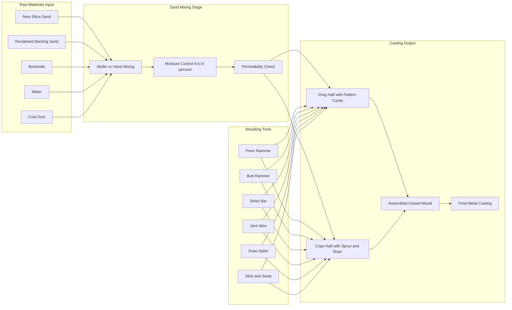
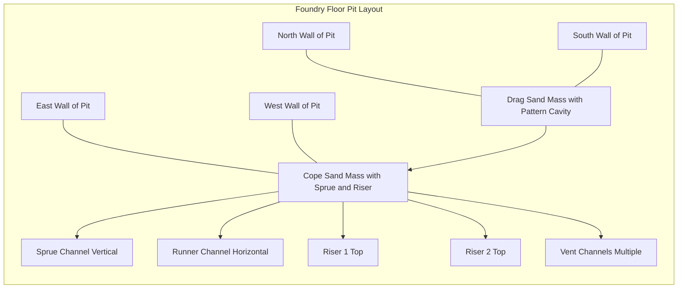

# Floor Moulding

<!-- SECTION_1_START -->
# FLOOR MOULDING — Core Technical Definition & Intuitive Overview

## Formal KTU 2024 Definition

**Floor Moulding** is a fundamental *green sand moulding* technique performed directly on the foundry floor (or a casting pit), where the entire mould — comprising the **drag** (lower half) and **cope** (upper half) — is prepared manually on the ground level without using a separate moulding box (flask) for support. It is the most primitive, low-cost, and large-scale casting method used for producing heavy, bulky castings such as **machine tool beds, engine bases, large gears, rolling mill housings, and propeller shafts** that are too massive or too heavy to be handled by standard flasks.

> [!IMPORTANT]
> **KTU 2024 Syllabus Highlight (GCESL106 / Module 3):**
> Floor moulding is categorized under *manual green sand moulding* where the **moulding sand is compacted around the pattern placed on the floor**, and the cope is built up using **facing sand, parting sand, and backing sand** in successive layers.

---

## Conceptual Analogy / Intuition

> [!NOTE]
> **Analogy — "The Sand Pit Cake":**
> Imagine you are baking a giant cake directly on your kitchen counter (no baking tin). You would:
> 1. Sprinkle some dry flour (parting sand) to stop sticking,
> 2. Press a shaped cookie cutter (the pattern) into a tray of damp sand,
> 3. Carefully remove the cutter so the impression remains,
> 4. Pour a thin layer of fine, quality sand (facing sand) on the impression walls,
> 5. Fill the rest with coarse sand (backing sand) and ram it tight,
> 6. Make a second similar tray (cope) and invert it on top,
> 7. Pour molten chocolate (molten metal) into the cavity and let it solidify.
>
> That is exactly **floor moulding** — except the "cake" is a metal casting and the "kitchen counter" is the foundry floor.

---

## Key Foundry Vocabulary Anchors

> [!NOTE]
> **Core Terminology Snapshot:**
> - **Pattern** → Replica of the final casting (wood / metal / plaster).
> - **Drag** → Lower half of the mould (rests on the floor).
> - **Cope** → Upper half of the mould (placed over the drag).
> - **Facing Sand** → High-refractority, fine silica sand placed against the pattern surface.
> - **Backing Sand** → Reclaimed, coarser sand used to fill the bulk volume.
> - **Parting Sand** → Dry, fine silica sprinkled on the parting plane to prevent adhesion.
> - **Sprue** → Vertical channel through which molten metal enters.
> - **Runner** → Horizontal channel distributing metal to the cavity.
> - **Riser** → Reservoir feeding molten metal to compensate for shrinkage.
> - **Vent** → Thin channel to escape gases during pouring.
> - **Chaplet** → Small metal support used to hold the core inside the cavity.

---

## Physical Standards & Foundry Floor Specifications

> [!IMPORTANT]
> **Standard Foundry Floor Specifications (Industry Norms):**
> - **Floor Load Capacity:** Minimum **50 kN/m²** to **100 kN/m²** for heavy castings.
> - **Pit Depth (if used):** **0.6 m to 1.5 m** below floor level.
> - **Sand Moisture Content:** **6 % to 8 %** for green sand floor moulding.
> - **Permeability Number:** **80 to 120** (AFS standard).
> - **Compactibility:** **40 % ± 5 %**.
> - **Green Compressive Strength:** **60 kN/m² to 100 kN/m²**.

<!-- SECTION_1_END -->

<!-- SECTION_2_START -->
# Deep Theoretical Analysis & KTU High-Yield Formula Sheet

## Fundamental Principle of Floor Moulding

Floor moulding operates on the **gravitational ramming principle** — the sand is compacted by the weight of the ramming tools and the operator, combined with manual strikes from **peen rammers** and **butt rammers**. Unlike bench moulding or floor moulding-with-flasks, **no external flask boundary exists**, so the entire earth-bound compacted sand mass acts as a self-supporting mould structure.

---

## Step-by-Step Theoretical Logic Flow

> [!NOTE]
> **Why Floor Moulding? The Underlying Engineering Logic:**
> 1. **Size Constraint Override:** Standard flasks max out at roughly **1.2 m × 1.2 m × 0.6 m**. Floor moulding eliminates this ceiling.
> 2. **Cost Economy for Heavy Castings:** No flask fabrication cost, no flask handling crane required.
> 3. **Flexibility in Pattern Placement:** Patterns can be oriented in any direction to optimize **metal flow direction**, **riser placement**, and **feeding distance**.
> 4. **Single Piece Mould Integrity:** The drag and cope are essentially monolithic in their own halves, reducing joint mismatch.

---

## Classification of Floor Moulding Operations

| Sl. No. | Type of Floor Moulding | Distinct Feature | Typical Application |
| :-: | :- | :- | :- |
| 1 | **Floor Moulding with Flasks (Box Moulding on Floor)** | Drag and cope are formed inside wooden/metal flasks, but assembly occurs on the floor | Medium castings, better dimensional control |
| 2 | **Floor Moulding without Flasks (Pit Moulding)** | Mould is made directly on the floor in an open pit; sand mass is the structural wall | Very large castings, heavy sections |
| 3 | **Bedded-in Floor Moulding** | Pattern is partially embedded (bedded) into the floor sand to give one half a contour | Gears, pulleys with one flat side |
| 4 | **Sweep Moulding on Floor** | A *sweep* (a wooden/metal template of a profile) is rotated or revolved around a pivot to generate the mould cavity | Circular, symmetrical large castings |

---

## KTU Formula Sheet / Cheat Sheet

> [!IMPORTANT]
> **Critical Engineering Equations for Floor Moulding Calculations:**

| Parameter | Formula | Description |
| :- | :- | :- |
| **Shrinkage Allowance** | $S = L \times s$ | $L$ = pattern length, $s$ = shrinkage factor (e.g. $0.01$ for cast iron) |
| **Shrinkage Factor (Cast Iron)** | $s = \dfrac{1}{96} \approx 0.0104$ | Empirical foundry value |
| **Shrinkage Factor (Steel)** | $s = \dfrac{1}{48} \approx 0.0208$ | Higher thermal contraction |
| **Shrinkage Factor (Aluminum)** | $s = \dfrac{1}{64} \approx 0.0156$ | Moderate contraction |
| **Pattern Dimension** | $P = F + S + M + D$ | $F$ = final dimension, $S$ = shrinkage, $M$ = machining, $D$ = draft |
| **Draft Allowance (Hand Moulding)** | $D = 1^\circ \text{ to } 3^\circ$ | Per side, on vertical pattern faces |
| **Riser Volume (Chvorinov's Rule)** | $t_r = B \left( \dfrac{V_r}{A_r} \right)^2$ | $t_r$ = solidification time, $V_r/A_r$ = modulus of riser |
| **Riser Modulus Requirement** | $M_{riser} \geq 1.2 \times M_{casting}$ | Riser must solidify **after** the casting |
| **Pouring Temperature (Cast Iron)** | $T_{pour} = T_{liquidus} + 50^\circ C \text{ to } 100^\circ C$ | Standard superheat range |
| **Sand Compactibility** | $C_p = \dfrac{\rho_{max} - \rho_{mould}}{\rho_{max} - \rho_{min}} \times 100\%$ | Percentage compactibility of moulding sand |
| **Gating Ratio (R : S : C)** | $1 : 2 : 4 \text{ (unpressurised)}$ or $4 : 8 : 3 \text{ (pressurised)}$ | $R$ = runner, $S$ = sprue, $C$ = choke |
| **Sprue Area Calculation** | $A_{sprue} = \dfrac{W}{C_d \cdot \rho \cdot t \cdot \sqrt{2gH}}$ | $W$ = casting weight, $C_d = 0.6$, $H$ = sprue height |

> [!NOTE]
> **Engineering Reality Check:**
> Floor moulding is widely used in **heavy engineering industries** — steel plants, shipbuilding, locomotive manufacturing, and turbine foundries — because the casting size simply cannot be confined by any flask. The **Forbes Gokak, Tata Steel, and BHEL** foundries in India routinely use pit floor moulding for castings weighing **5 tonnes to 200 tonnes**.

---

## Advantages vs Limitations — Strategic Trade-off Matrix

| Criterion | Floor Moulding (With Flasks) | Floor Moulding (Without Flasks / Pit) | Bench Moulding |
| :- | :- | :- | :- |
| Max Casting Size | Up to 5 tonnes | Up to 200+ tonnes | Up to 50 kg |
| Dimensional Accuracy | Moderate ($\pm 2$ mm) | Low ($\pm 5$ mm) | High ($\pm 0.5$ mm) |
| Skill Required | High | Very High | Moderate |
| Cost per Casting | Low | Very Low | High |
| Production Rate | 1–2/day | 1/2–3 days | 10–20/day |
| Surface Finish | Moderate | Rough | Good |

<!-- SECTION_2_END -->

<!-- SECTION_3_START -->
# Step-by-Step Procedure & Hardware Implementation

## Sequential Floor Moulding Workflow (Board-Exam Quality)

> [!IMPORTANT]
> **The complete KTU-exam standard step-by-step floor moulding procedure** is detailed below. Each step lists the operation, the tool used, and the engineering justification — exactly what an examiner expects.

### Stage 1 — Floor Preparation

| Step | Operation | Tool / Equipment | Justification |
| :-: | :- | :- | :- |
| 1.1 | Sweep the foundry floor clean of debris, old sand, and metal spillages. | Foundry broom, shovel | Prevents contamination of green sand |
| 1.2 | Sprinkle a thin, uniform layer of **parting sand** (dry, fine silica) on the floor. | Sieve, hand scoop | Allows easy separation of mould from floor after ramming |
| 1.3 | Level the floor surface using a **strike bar**. | Strike-off bar | Ensures a flat reference plane for the drag |

### Stage 2 — Pattern Placement & Bedding (Drag)

| Step | Operation | Tool / Equipment | Justification |
| :-: | :- | :- | :- |
| 2.1 | Place the **pattern** on the floor with the **flat parting face down** for simple shapes, or embed it partly for bedded-in moulding. | Pattern (wooden/metal), hand | Determines cavity geometry |
| 2.2 | Position the **sprue pin** vertically at the pouring location. | Sprue pin (wood, taper 1:50) | Creates the pouring channel |
| 2.3 | Sprinkle **parting sand** over the pattern surface and the floor. | Sieve, hand | Prevents facing-backing sand adhesion |
| 2.4 | Apply **facing sand** uniformly over the pattern (5–25 mm thick) and over the floor area. | Sieve, hand | Provides a refractory, fine-grained surface against molten metal |
| 2.5 | Fill the rest of the volume with **backing sand** in lifts of **50 mm to 75 mm**. | Shovel, riddle (sand screen) | Compaction in lifts ensures uniform density |
| 2.6 | Ram each lift firmly using a **peen rammer** (pointed end) followed by a **butt rammer** (flat end). | Peen rammer, butt rammer | Peen ramming packs corners; butt ramming levels the surface |
| 2.7 | Vent the drag by inserting **vent wires** ($\varnothing 2$ mm to $4$ mm) at 100–150 mm spacing. | Vent wire | Allows escape of gases during pouring |
| 2.8 | Strike off the excess sand flush with the pattern top using a **strike bar**. | Strike bar | Creates a clean parting plane |

### Stage 3 — Cope Preparation & Assembly

| Step | Operation | Tool / Equipment | Justification |
| :-: | :- | :- | :- |
| 3.1 | Sprinkle **parting sand** liberally over the drag surface (including pattern top). | Sieve, hand | Critical to prevent cope-drag fusion |
| 3.2 | Invert the drag (or build the cope in place) and place a **flask / cope frame** if used. | Flask, lifting tackle | Provides vertical containment for the cope |
| 3.3 | Position **risers** (downward-facing rods for blind risers) and additional **sprue extensions** if needed. | Riser pin, sprue pin | Feeds molten metal to compensate shrinkage |
| 3.4 | Apply facing sand, backing sand in lifts, and ram as in Stage 2.6. | Rammers | Identical procedure to drag |
| 3.5 | Strike off the top of the cope; punch a **pouring cup** at the sprue top. | Pouring cup former | Directs metal stream into the sprue cleanly |
| 3.6 | Insert vent wires through the cope. | Vent wire | Gas escape from upper mould half |

### Stage 4 — Pattern Withdrawal & Cavity Inspection

| Step | Operation | Tool / Equipment | Justification |
| :-: | :- | :- | :- |
| 4.1 | Lift the cope off the drag carefully using **lifting eyes / crane**. | Crane, sling | Preserves cavity geometry |
| 4.2 | Withdraw the pattern from the drag by **rapping** (tapping the pattern with a rapping plate) and **lifting** with the draw spike. | Draw spike, rapping plate | Loosens pattern before withdrawal to avoid sand damage |
| 4.3 | Inspect the cavity for any sand damage; **patch** with a moist brush if minor. | Slick, swab, brush | Repairs local sand loss before closing |
| 4.4 | Place the **core** (if any) inside the cavity, supported by **chaplets** if needed. | Core, chaplets, core print | Creates internal features |
| 4.5 | Close the cope over the drag; clamp with **weights or clamps**. | Clamps, dead weights | Prevents cope lift during pouring |

### Stage 5 — Pouring, Cooling & Shake-out

| Step | Operation | Tool / Equipment | Justification |
| :-: | :- | :- | :- |
| 5.1 | Pour molten metal into the sprue cup in a **continuous, steady stream**. | Hand ladle, crane ladle | Maintains metallostatic pressure, prevents slag entry |
| 5.2 | Wait for the casting to solidify (calculated by **Chvorinov's rule**). | Timer, pyrometer | Prevents premature shake-out |
| 5.3 | Break open the mould (**shake-out**) once solidified. | Hammer, pneumatic vibrator | Recovers the casting from sand mass |
| 5.4 | Cut off the sprue, runner, and riser using a **cut-off saw or chisel**. | Cut-off machine, chisel | Cleans the casting to near-net shape |

---

## Worked Numerical Example — Pattern Dimension Calculation

> [!NOTE]
> **KTU-Style Numerical Problem & Model Solution:**

**Problem:**
A cast iron flange of final length **500 mm**, width **300 mm**, height **100 mm** is to be made by floor moulding. Calculate the pattern dimensions considering **shrinkage = 1/96**, **machining allowance = 3 mm per face**, and **draft = 1.5° per side on vertical faces**.

**Given:**
- Final length $F_L = 500$ mm
- Final width $F_W = 300$ mm
- Final height $F_H = 100$ mm
- Shrinkage factor $s = 1/96$
- Machining allowance $M = 3$ mm per face
- Draft $D = 1.5^\circ$ per side

**Solution — Step-by-Step:**

The general pattern dimension equation is:

$$P = F + S + M + D$$

where each term is computed as follows.

### Step 1 — Shrinkage Allowance ($S$)

For length:
$$S_L = 500 \times \dfrac{1}{96} = 5.208 \text{ mm}$$

For width:
$$S_W = 300 \times \dfrac{1}{96} = 3.125 \text{ mm}$$

For height:
$$S_H = 100 \times \dfrac{1}{96} = 1.042 \text{ mm}$$

### Step 2 — Machining Allowance ($M$)

For length (two opposite faces):
$$M_L = 2 \times 3 = 6 \text{ mm}$$

For width (two opposite faces):
$$M_W = 2 \times 3 = 6 \text{ mm}$$

For height (two opposite faces):
$$M_H = 2 \times 3 = 6 \text{ mm}$$

### Step 3 — Draft Allowance ($D$)

For height (two vertical faces, on opposite sides):
$$D_H = 2 \times 100 \times \tan(1.5^\circ) = 2 \times 100 \times 0.02619 = 5.238 \text{ mm}$$

For length and width, draft does not apply because they are horizontal dimensions on a flat-top pattern.

### Step 4 — Final Pattern Dimensions

$$P_L = F_L + S_L + M_L = 500 + 5.208 + 6 = 511.21 \text{ mm}$$

$$P_W = F_W + S_W + M_W = 300 + 3.125 + 6 = 309.13 \text{ mm}$$

$$P_H = F_H + S_H + M_H + D_H = 100 + 1.042 + 6 + 5.238 = 112.28 \text{ mm}$$

**Final Pattern Size = 511.21 mm × 309.13 mm × 112.28 mm**

---

## Worked Numerical Example — Riser Sizing via Chvorinov's Rule

**Problem:**
A steel casting of modulus $M_c = 2.5$ cm is to be fed by a cylindrical riser of diameter $D$ equal to height $H$. Determine the minimum riser dimensions.

**Given:** $M_{riser} \geq 1.2 \times M_{casting} = 1.2 \times 2.5 = 3.0$ cm.

**Solution:**

For a cylinder where $D = H$:

$$M_{riser} = \dfrac{V}{A} = \dfrac{\pi D^2 H / 4}{\pi D H / 2 + \pi D^2 / 4}$$

Substituting $H = D$:

$$M_{riser} = \dfrac{D}{6} = 3.0 \text{ cm}$$

$$\therefore D = 18 \text{ cm} \quad \text{and} \quad H = 18 \text{ cm}$$

This riser ensures directional solidification from the casting toward the riser.

<!-- SECTION_3_END -->

<!-- SECTION_4_START -->
# Structural Diagrams & Schematics — Sequential Moulding Topology

## Mermaid Block 1 — End-to-End Floor Moulding Process Flow

```mermaid
flowchart TD
    A[Floor Cleaning and Leveling] --> B[Parting Sand Sprinkle on Floor]
    B --> C[Pattern Placement on Floor]
    C --> D[Sprue Pin Positioning]
    D --> E[Facing Sand Sieved Over Pattern]
    E --> F[Backing Sand Fill in 50 mm Lifts]
    F --> G[Peen Ramming Then Butt Ramming]
    G --> H[Vent Wire Insertion at 100 mm Pitch]
    H --> I[Strike Off Using Strike Bar]
    I --> J[Parting Sand on Drag Surface]
    J --> K[Cope Frame Placement]
    K --> L[Riser and Sprue Pin Setup in Cope]
    L --> M[Facing and Backing Sand in Cope]
    M --> N[Cope Ramming and Striking Off]
    N --> O[Pouring Cup Formation]
    O --> P[Cope Lifting Off Drag]
    P --> Q[Pattern Withdrawal via Rapping and Draw Spike]
    Q --> R[Cavity Inspection and Patching]
    R --> S[Core Placement with Chaplets]
    S --> T[Cope Closing and Clamping]
    T --> U[Molten Metal Pouring]
    U --> V[Solidification Waiting Period]
    V --> W[Shake Out and Casting Recovery]
    W --> X[Sprue Riser Runner Cutting Off]
```

## Mermaid Block 2 — Tool & Material Flow Matrix

## Mermaid Block 3 — Foundry Floor Layout (Top-Down View Schematic)

> [!VISUALIZATION CONTROL]
> **Concept:** Cross-section of a typical floor mould showing drag, cope, sprue, runner, riser, and vent positions.
> **GeoGebra / Desmos Input Sketch (Conceptual):**
> * Draw the rectangular drag block (lower, wider).
> * Draw the rectangular cope block (upper, narrower or matching).
> * Mark a vertical channel at the centre as the sprue.
> * Mark horizontal channels branching as runners.
> * Mark vertical upward channels as risers.
> * Mark thin diagonal lines as vents.
> **Visual Description:** The student should visualize a **two-block sandwich** with internal channels connecting the pouring cup (top) to the cavity (middle) and to the feeders (riser tops).

<!-- SECTION_4_END -->

<!-- SECTION_5_START -->
# KTU 2024 Scheme Examination Question Bank & Topic Recap

---

## Part A Questions (3 Marks Each)

> **Q1. [KTU University Exam — July 2024, CO1, Remember]**
> **Define floor moulding. Mention any two engineering applications.**

**Model Answer (3 Marks):**

Floor moulding is a sand casting process in which the mould is prepared directly on the foundry floor (or in a pit) without using a standard flask, typically for producing very large castings.

**Two applications:**
1. Machine tool beds and columns.
2. Rolling mill housings and large gear blanks.

> **Valuation Key:** [Definition 2 marks] [Two applications 0.5 + 0.5 marks]

---

> **Q2. [KTU University Exam — Dec 2023, CO1, Understand]**
> **Distinguish between facing sand and backing sand with respect to composition and function.**

**Model Answer (3 Marks):**

| Property | Facing Sand | Backing Sand |
| :- | :- | :- |
| **Composition** | Fresh silica sand + bentonite + coal dust | Reclaimed silica sand + small bentonite |
| **Position** | In direct contact with pattern surface | Fills bulk volume behind facing layer |
| **Function** | Provides refractory, fine surface against molten metal | Provides mechanical strength and economy |

> **Valuation Key:** [Table format 2 marks] [One valid distinction 1 mark]

---

## Part B Questions (14 Marks Each — Module Internal Choice)

> **Question A — [KTU University Exam — July 2024, CO2, Apply + Analyze, 14 Marks]**

**(a)** With a neat sketch, explain the step-by-step procedure of floor moulding for a large cast iron gear blank. *(7 Marks)*

**(b)** A cylindrical steel casting of diameter **300 mm** and height **400 mm** is to be produced by floor moulding. Calculate the pattern dimensions. Take shrinkage = 1/48, machining allowance = 4 mm per face, draft = 2° per side. *(7 Marks)*

---

### Model Solution for Question A

#### Part (a) — Step-by-Step Procedure (7 Marks)

> **Step 1 — Floor Preparation:** Sweep and level the foundry floor, sprinkle parting sand, strike level. *[1 Mark]*

> **Step 2 — Pattern Placement:** Place the gear blank pattern flat (parting face down) on the floor; bed the teeth profile slightly into the floor sand for bedded-in moulding. *[1 Mark]*

> **Step 3 — Sprue Pin Setup:** Position the sprue pin vertically at the parting plane. *[0.5 Mark]*

> **Step 4 — Facing Sand:** Sieve facing sand (5–25 mm thick) over the pattern and surrounding area. *[0.5 Mark]*

> **Step 5 — Backing Sand & Ramming:** Fill backing sand in 50 mm lifts; ram with peen rammer at corners, butt rammer on flat surfaces. *[1 Mark]*

> **Step 6 — Venting & Striking Off:** Insert vent wires at 100–150 mm pitch; strike off excess sand flush. *[0.5 Mark]*

> **Step 7 — Cope Preparation:** Sprinkle parting sand on the drag; build the cope with facing + backing sand; place riser pins and pouring cup. Ram and vent as before. *[1 Mark]*

> **Step 8 — Pattern Withdrawal:** Lift the cope; withdraw the pattern by rapping and lifting with the draw spike. Inspect cavity, patch if required. *[1 Mark]*

> **Step 9 — Closing & Pouring:** Place core (if any), close the cope, clamp with weights, pour molten cast iron (T = 1300–1400 °C) steadily through the sprue. *[0.5 Mark]*

#### Part (b) — Pattern Dimension Calculation (7 Marks)

**Given:**
- Final diameter $F_D = 300$ mm
- Final height $F_H = 400$ mm
- Shrinkage factor $s = 1/48$
- Machining allowance $M = 4$ mm per face
- Draft $D = 2^\circ$ per side

**Step 1 — Shrinkage Allowance:**

$$S_D = 300 \times \dfrac{1}{48} = 6.25 \text{ mm}$$

$$S_H = 400 \times \dfrac{1}{48} = 8.33 \text{ mm}$$

*[Shrinkage calculation 2 marks]*

**Step 2 — Machining Allowance (two opposite faces on each dimension):**

$$M_D = 2 \times 4 = 8 \text{ mm}$$

$$M_H = 2 \times 4 = 8 \text{ mm}$$

*[Machining allowance 2 marks]*

**Step 3 — Draft Allowance (only on vertical faces, two sides):**

$$D_H = 2 \times 400 \times \tan(2^\circ) = 2 \times 400 \times 0.03492 = 27.94 \text{ mm}$$

*[Draft calculation 1 mark]*

**Step 4 — Final Pattern Dimensions:**

$$P_D = F_D + S_D + M_D = 300 + 6.25 + 8 = 314.25 \text{ mm}$$

$$P_H = F_H + S_H + M_H + D_H = 400 + 8.33 + 8 + 27.94 = 444.27 \text{ mm}$$

*[Final answer 2 marks]*

**Final Pattern Size: Diameter 314.25 mm × Height 444.27 mm**

---

> **Question B — [KTU University Exam — Dec 2023, CO2, Apply + Analyze, 14 Marks] (Alternative Choice)**

**(a)** Explain the different types of floor moulding with neat sketches. State two limitations of floor moulding. *(7 Marks)*

**(b)** For a cast iron casting of modulus $M_c = 3.0$ cm, design a cylindrical riser with $D = H$ using Chvorinov's rule. Also calculate the solidification time of the casting if the casting constant $B = 3.5$ min/cm². *(7 Marks)*

---

### Model Solution for Question B

#### Part (a) — Types of Floor Moulding (7 Marks)

| Type | Description | Application |
| :- | :- | :- |
| **Floor Moulding with Flasks** | Drag and cope formed inside flasks, assembled on floor | Medium castings |
| **Floor Moulding without Flasks (Pit Moulding)** | Sand mass itself is the wall | Very large castings |
| **Bedded-in Floor Moulding** | Pattern partly embedded into floor sand | Gears, pulleys |
| **Sweep Moulding** | Sweep template revolved/rotated to form cavity | Symmetrical large castings |

*[Types description 4 marks]*

**Two Limitations (1 mark each):**
1. **Low dimensional accuracy** (±5 mm) due to large sand mass.
2. **High dependence on operator skill**; difficult to mechanize.

*[Limitations 2 marks]*

#### Part (b) — Riser Sizing & Solidification Time (7 Marks)

**Given:** $M_c = 3.0$ cm, $B = 3.5$ min/cm², $D_{riser} = H_{riser}$.

**Step 1 — Riser Modulus Requirement:**

$$M_{riser} \geq 1.2 \times M_c = 1.2 \times 3.0 = 3.6 \text{ cm}$$

*[Requirement 1 mark]*

**Step 2 — Riser Dimension Calculation:**

For a cylinder with $D = H$:

$$M_{riser} = \dfrac{D}{6} = 3.6$$

$$\therefore D = 21.6 \text{ cm} \quad \text{and} \quad H = 21.6 \text{ cm}$$

*[Riser dimension 2 marks]*

**Step 3 — Solidification Time of Casting:**

$$t_c = B \times M_c^2 = 3.5 \times (3.0)^2 = 3.5 \times 9 = 31.5 \text{ min}$$

*[Solidification time 2 marks]*

**Step 4 — Verification of Riser Solidification Time:**

For the riser:

$$t_r = B \times M_{riser}^2 = 3.5 \times (3.6)^2 = 3.5 \times 12.96 = 45.36 \text{ min}$$

Since $t_r > t_c$, the riser solidifies **after** the casting — directional solidification is achieved. ✓

*[Verification 2 marks]*

**Final Answer:** Riser diameter = height = 21.6 cm; Casting solidifies in 31.5 min; Riser solidifies in 45.36 min (valid feed).

---

## KTU Examiner's Valuation Warning / Pitfall Callout

> [!WARNING]
> **Common Marks-Loss Traps in Floor Moulding Questions:**
> 1. **Forgetting to add draft allowance** — Draft is applied only on *vertical* faces, both sides. Many students add it to horizontal dimensions.
> 2. **Using $1/96$ for steel** — Steel shrinkage is $1/48$, not $1/96$. Mismatched shrinkage factor = full method mark lost.
> 3. **Skipping the parting sand step** in procedure — Examiners explicitly look for the parting sand sprinkle between drag and cope. Skipping it = -1 mark.
> 4. **Not stating the riser modulus condition** $M_{riser} \geq 1.2 M_{casting}$ — Always state the design condition before calculating.
> 5. **Confusing peen rammer vs butt rammer** — Peen (pointed) → corners; Butt (flat) → surfaces. Reversed roles = -1 mark.
> 6. **Omitting vent wire pitch** — Examiner expects "100 to 150 mm pitch" as a standard.
> 7. **Forgetting the rapping step** before pattern withdrawal — Causes cavity damage in real life, and missing it in the answer = -0.5 mark.

---

## Topic Recap & Important Things to Remember

> **High-Density Rapid Revision Checklist — Floor Moulding**

- **Floor Moulding = Mould made directly on foundry floor / pit, with or without flasks.** Used for **very large castings (5–200 tonnes)**.
- **Drag** = lower half on the floor; **Cope** = upper half placed over the drag.
- **Facing sand** (fresh, refractory, fine) goes directly against the pattern; **backing sand** (reclaimed) fills the bulk.
- **Parting sand** (dry, fine silica) is sprinkled on the parting plane to prevent drag-cope fusion — **never forget this step**.
- **Ramming sequence:** Peen rammer at corners → Butt rammer on flat surfaces → in **50–75 mm lifts**.
- **Vent wires** ($\varnothing 2$–$4$ mm) at **100–150 mm pitch** allow gas escape.
- **Pattern withdrawal:** Always **rapping** (tapping) first, then lifting with **draw spike**, to avoid cavity damage.
- **Shrinkage factors to memorize:** Cast Iron = **1/96**, Steel = **1/48**, Aluminum = **1/64**, Brass = **1/64**.
- **Pattern dimension formula:** $P = F + S + M + D$ — applied **independently** on each dimension.
- **Draft allowance:** **1° to 3° per side** on vertical faces; calculated as $D = 2H \tan(\theta)$ for opposite sides.
- **Riser design rule (Chvorinov):** $M_{riser} \geq 1.2 \times M_{casting}$ to ensure directional solidification.
- **Riser solidification time:** $t = B (V/A)^2 = B \cdot M^2$; must exceed casting solidification time.
- **Gating ratio (unpressurised):** Sprue : Runner : Choke = **1 : 2 : 4**.
- **Four types of floor moulding:** With flasks / Without flasks (pit) / Bedded-in / Sweep moulding.
- **Tool names to memorize:** Peen rammer, Butt rammer, Strike bar, Vent wire, Draw spike, Rapping plate, Slick, Swab, Sprue pin, Riser pin.
- **Green sand moisture:** 6–8 %; **Permeability:** 80–120 AFS; **Compactibility:** 40 % ± 5 %.
- **Key advantage:** Unlimited casting size; **Key limitation:** Low dimensional accuracy, high skill dependency.
- **Floor load capacity (industry norm):** **50–100 kN/m²**; pit depth **0.6–1.5 m**.

<!-- SECTION_5_END -->
