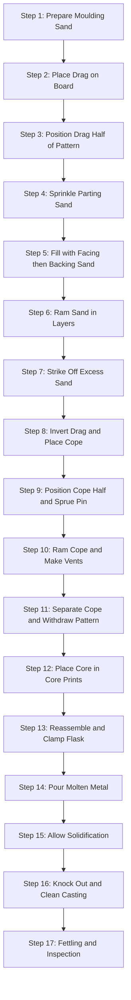
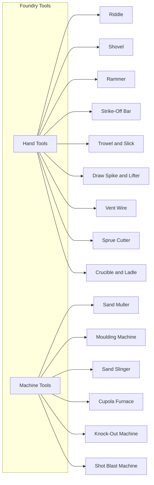
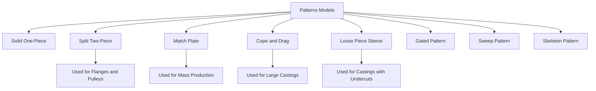
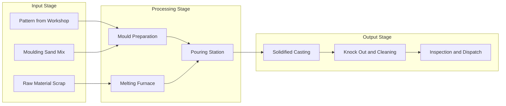
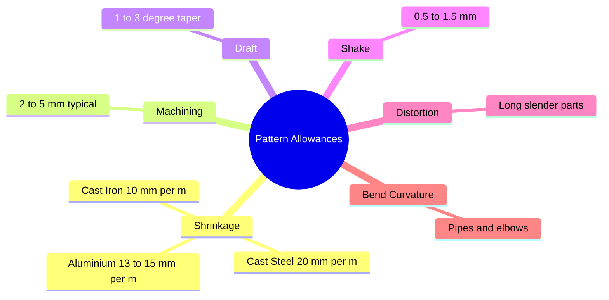

# Foundry: Understanding of foundry tools and knowledge of at least one model

<!-- SECTION_1_START -->

# SECTION 1 — Core Technical Definition & Intuitive Overview

## 1.1 Foundry — Formal KTU Definition

> [!IMPORTANT]
> **Foundry** is a manufacturing workshop in which metal castings are produced by **pouring molten metal** into a **pre-shaped cavity** of a refractory mould, allowing it to **solidify**, and then breaking/machining the casting to the required shape. The cavity is created using a **reusable wooden/metal replica** called a **Pattern** (or Model).

The complete industrial sequence of operations performed in a foundry to convert raw cast metal into a finished component is called a **Casting Process**. The KTU 2024 Scheme (Module 3) places specific emphasis on:

1. Identification and use of standard **foundry hand tools**.
2. Detailed study of **at least one pattern (model)** — typically the **Split (Two-Piece) Pattern** for a flange or pulley, due to its high practical occurrence in workshop layouts.

## 1.2 Intuitive Analogy — "The Bakery Cake Analogy"

Imagine you want to bake a cake of a specific shape (say, a star):

| Bakery Step | Foundry Equivalent |
|---|---|
| A star-shaped cutter (the *cutter*) | **Pattern** (the model of the part) |
| Pressing the cutter into soft dough to form a cavity | **Making the mould cavity** in sand |
| Pouring batter into the dough-cavity | **Pouring molten metal** into the mould |
| Solidifying the batter in an oven | **Cooling/solidification** of metal |
| Removing the cake (shape preserved) | **Breaking the mould → Casting** |

> [!NOTE]
> The pattern is **not** part of the casting. It is merely a *tool* to make the cavity. Hence the same pattern can produce thousands of castings (if it is durable metal) or a few dozen (if it is wood).

## 1.3 Key Terminology Snapshot

| Term | One-Line Meaning |
|---|---|
| **Mould** | The sand mass shaped to the cavity of the part. |
| **Cope** | The **upper half** of the mould flask. |
| **Drag** | The **lower half** of the mould flask. |
| **Core** | A separate sand insert used to form internal hollow features. |
| **Sprue** | Vertical channel through which molten metal enters the mould. |
| **Runner** | Horizontal channel distributing metal to the cavity. |
| **Gate** | Final entry point from runner to the cavity. |
| **Riser** | Reservoir feeding molten metal to compensate shrinkage. |
| **Parting Line** | The dividing surface between Cope and Drag. |
| **Flash** | Excess thin metal film at the parting line. |

> [!TIP]
> Remember the order of metal flow: **Sprue → Runner → Gate → Cavity → Riser (as feeder)**.

## 1.4 Visualisation Control Block

> [!VISUALIZATION CONTROL]
> **Concept:** Top-view of a typical sand mould layout showing sprue, runner, gate, cavity and riser.
> **Geometric construction (Desmos input):**
> * Circle representing cavity: $(x-0)^2 + (y-0)^2 = 1.5^2$
> * Sprue (vertical channel): line $x = 0$ from $y = -3$ to $y = -2.5$
> * Runner (horizontal channel): line $y = -2.5$ from $x = -1.5$ to $x = 1.5$
> * Gates: short segments from $x = \pm 1.0$ to $x = \pm 1.5$ at $y = -1.5$ to $-2.5$
> * Risers: circles $(x-1.5)^2 + (y+1.5)^2 = 0.3^2$ and $(x+1.5)^2 + (y+1.5)^2 = 0.3^2$
> **Visual Description:** Students should see a circular cavity at the centre, fed laterally through gates, with two risers placed symmetrically on top to compensate volumetric shrinkage.

---

<!-- SECTION_1_END -->

<!-- SECTION_2_START -->

# SECTION 2 — Deep Theoretical Analysis & KTU High-Yield Formula Sheet

## 2.1 Classification of Foundry Tools

Foundry tools are grouped into two broad families:

### A. Hand Tools (Most Frequently Examined)

| # | Tool | Function | Sketch Cue |
|---|---|---|---|
| 1 | **Riddle (Sieve)** | To screen the moulding sand and remove foreign lumps/iron particles before use. | Cylindrical frame + wire mesh bottom. |
| 2 | **Shovel / Sand Scoop** | To transfer and lift sand into the flask. | Curved metallic scoop. |
| 3 | **Rammer (Hand Rammer & Floor Rammer)** | To compact/tighten the sand around the pattern inside the flask. | Heavy wooden block with a peg handle. |
| 4 | **Strike-off Bar / Strike Bar** | To strike off the excess sand from the top of the flask, leaving a flat, level surface. | Flat metal bar with a straight edge. |
| 5 | **Trowel** | To smoothen and finish internal surfaces, edges and corners of the mould. | Triangular/spoon-shaped flat blade. |
| 6 | **Slick (Smoother)** | To repair damaged mould surfaces and round off sharp corners. | Long flat steel blade with curved ends. |
| 7 | **Draw Spike / Draw Nail** | To remove the pattern from the sand mould by driving it in with a mallet. | Tapered pointed spike with a head. |
| 8 | **Lifter (Draw-back Plate)** | Used along with the draw spike to lift the pattern vertically and clear the mould. | Flat plate with a central peg. |
| 9 | **Vent Wire (Needle)** | To make small vent holes in the mould for the **escape of gases** generated during pouring. | Long thin steel wire. |
| 10 | **Sprue Cutter / Sprue Pin** | To cut the sprue opening (vertical pouring channel) in the cope. | Tapered wooden/metal pin. |
| 11 | **Bellows / Hand Blower** | To remove loose sand particles from the mould cavity. | Standard bellows. |
| 12 | **Crusible / Ladle** | To hold and pour the molten metal into the mould. | Clay-graphite or steel-cladded pot. |

### B. Foundry Machines

| # | Machine | Function |
|---|---|---|
| 1 | **Sand Mixer / Muller** | Uniformly mixes silica sand, clay, water and additives. |
| 2 | **Moulding Machine** | Mechanically ramming and rollover of flasks. |
| 3 | **Sand Slinger** | Propels sand at high velocity into the flask for uniform ramming. |
| 4 | **Furnace** (Cupola / Induction / Crucible) | Melts the metal to pouring temperature. |
| 5 | **Knock-Out Machine** | Vibrates to separate casting from the sand. |
| 6 | **Shot/Shot-Blast Machine** | Cleans the casting surface using high-velocity steel shots. |

## 2.2 Pattern — Definition & Significance

> [!IMPORTANT]
> A **Pattern** is a **replica of the final casting**, used to **produce the cavity** in the mould. It is **slightly larger** than the finished casting to compensate for the various *pattern allowances* and to account for **volumetric shrinkage** of the metal during solidification.

## 2.3 Desired Properties of a Good Pattern

1. **Easy to fabricate** and **cheap** in construction.
2. **Light in weight** for easy handling.
3. **Strong and rigid** to withstand ramming forces.
4. **Resistant to wear, moisture and heat** (to last several uses).
5. **Easy to withdraw** from the mould without damaging the cavity (rounded corners, draft provided).
6. **Dimensionally stable** — should not warp, swell or shrink.
7. **Smooth surface finish** to yield a smooth casting.

## 2.4 Pattern Allowances — The KTU High-Yield Section

> [!NOTE]
> Pattern allowances are **extra dimensions** deliberately added to the casting dimensions on the pattern. Each allowance exists to compensate for a *specific physical/metallurgical* phenomenon. **Skipping any allowance leads to a rejected casting** — hence this is a guaranteed question in KTU exams.

### Master List of Pattern Allowances

| # | Allowance | Why it is Given | Typical Value (cast iron) |
|---|---|---|---|
| 1 | **Shrinkage / Contraction Allowance** | Metal contracts as it cools from pouring to room temperature. | **10 mm/m** |
| 2 | **Machining / Finish Allowance** | Surfaces to be machined are kept oversize. | **2 – 5 mm** |
| 3 | **Draft / Taper Allowance** | Easy withdrawal of pattern from sand. | **1° – 3°** |
| 4 | **Shake / Rapping Allowance** | Pattern rapped to loosen it before withdrawal, slightly enlarging cavity. | **0.5 – 1.5 mm** |
| 5 | **Distortion / Camber Allowance** | For long slender parts that warp on cooling. | Determined empirically |
| 6 | **Bend / Curvature Allowance** | For curved/bent castings (e.g., pipes). | Depends on geometry |
| 7 | **Core / Core-print Allowance** | Extra material to seat and support the core. | Based on core box size |

### Core Formulas (Exam-Ready)

$$
\text{Shrinkage Allowance } A_s \;=\; L \times \frac{S}{100}
$$

$$
\text{Draft Allowance (linear, per side)} \;=\; L \times \tan(\theta)
$$

$$
\text{Draft Allowance (mm/m) } \theta \;\approx\; 57.3 \times d \quad (\text{where } d = \text{draft in mm/m})
$$

$$
\text{Pattern Dimension} \;=\; \text{Casting Dimension} + \text{Sum of all applicable allowances}
$$

Where:
* $L$ = Linear casting dimension in **mm** or **m** (units must match $S$).
* $S$ = **Shrinkage percentage** of the metal (e.g., $1\%$ = $10$ mm/m).
* $\theta$ = Draft angle in degrees (usually $1^\circ$ to $3^\circ$).

### Standard Shrinkage Values (Memorise for KTU)

| Metal | Linear Shrinkage (mm/m) |
|---|---|
| Cast Iron (Grey) | **10** |
| Cast Iron (White) | **20** |
| Cast Steel | **20** |
| Aluminium Alloys | **13 – 15** |
| Brass | **15** |
| Bronze | **10 – 20** |
| Lead | **8** |

## 2.5 Classification of Patterns (Models)

> [!IMPORTANT]
> The KTU 2024 Scheme Module 3 explicitly requires *detailed knowledge of at least one model*. The most frequently tested are **Solid, Split, Match-Plate, Cope-and-Drag, and Gated Patterns**.

| Pattern Type | Construction | Typical Use |
|---|---|---|
| **Solid (One-Piece)** | Single, no parting surface. | Very simple shapes (cube, sphere). |
| **Split (Two-Piece)** | Pattern split at the parting line. | Flanges, pulleys, gears, brackets. |
| **Match-Plate** | Both halves mounted on a metal plate. | Mass production of small castings. |
| **Cope-and-Drag** | Two separate patterns, one for each flask half. | Large castings. |
| **Loose-Piece (Sleeve)** | Side projections made as separate pieces. | Castings with undercuts. |
| **Gated Pattern** | Multiple patterns joined by a common gate. | Repetitive small castings. |
| **Sweep Pattern** | A shaped board sweeps the contour. | Large circular castings. |
| **Skeleton Pattern** | Wood frame with a smooth skin. | Large, simple castings. |

## 2.6 Pattern Materials (Selection Matrix)

| Material | Durability (No. of Castings) | Cost | Application |
|---|---|---|---|
| **Wood (Teak, Pine, Mahogany)** | 50 – 100 | Low | Workshop / prototype patterns. |
| **Metal (Aluminium, Brass, Cast Iron)** | 1000 – 10 000+ | High | Mass production. |
| **Plaster / POP** | 10 – 20 | Low | Intricate prototypes. |
| **Plastics (Epoxy, Phenolic)** | 100 – 1000 | Medium | Medium-batch production. |
| **Wax** | 1 (lost-wax / investment casting) | Low | Jewellery, turbine blades. |

## 2.7 Moulding Sand — Constituents & Properties

A good moulding sand must possess:

* **Refractoriness** — ability to withstand high temperature.
* **Cohesiveness** — sand grains stick together.
* **Permeability** — allows gases to escape.
* **Green Strength** — strength in undried (moist) state.
* **Dry Strength** — strength after drying.
* **Flowability** — packs into all corners.
* **Collapsibility** — yields to metal shrinkage.

### Composition of a Standard Moulding Sand

| Constituent | Function | Typical % |
|---|---|---|
| **Silica Sand (SiO₂)** | Refractory base | 80 – 90 |
| **Clay (Bentonite)** | Bond | 6 – 10 |
| **Water (Moisture)** | Activates clay bond | 2 – 8 |
| **Additives** (coal dust, dextrin) | Improves surface | 0 – 4 |

### Types of Moulding Sand

| Type | Distinguishing Feature |
|---|---|
| **Green Sand** | Moist sand with clay bond (most common). |
| **Dry Sand** | Dried in oven before pouring → stronger mould. |
| **Loam Sand** | High clay, used for large castings. |
| **Facing Sand** | Fine sand applied next to the pattern for good surface. |
| **Backing Sand** | Reused, coarser sand behind the facing. |
| **Core Sand** | Sand mixed with oil/linseed binder to form cores. |
| **Parting Sand** | Dry sand sprinkled on the parting plane. |

## 2.8 Engineering Real-World Utility of Foundry

| Industry | Typical Cast Component |
|---|---|
| **Automotive** | Engine block, cylinder head, crankcase, brake drum. |
| **Aerospace** | Turbine blades, structural housings. |
| **Railways** | Bogie frame, coupling, rail chairs. |
| **Power Plants** | Valve body, pump casing, turbine casing. |
| **General Engineering** | Gears, pulleys, machine tool beds. |
| **Domestic** | Cookware, manhole covers, pipe fittings. |

---

<!-- SECTION_2_END -->

<!-- SECTION_3_START -->

# SECTION 3 — Step-by-Step Derivations, Worked Examples & Code/Symbolic Implementation

## 3.1 Step-by-Step Numerical — Pattern Allowance Calculation

> [!IMPORTANT]
> **Problem (KTU-style):**
> A **split pattern** is to be made of **teak wood** for a **cast iron flange** of the following finished dimensions:
> * Outer Diameter $D = 200$ mm
> * Inner Diameter $d = 100$ mm
> * Thickness $t = 30$ mm
>
> Given allowances:
> * Shrinkage of cast iron = $1\%$ (i.e., $10$ mm/m)
> * Machining allowance on all machined surfaces = $3$ mm
> * Draft angle = $1.5^\circ$ on vertical walls
> * Shake allowance = $1$ mm
>
> **Compute the final pattern dimensions.**

### Step 1 — Identify which allowances apply to each surface

| Surface | Applicable Allowances |
|---|---|
| Outer diameter | Shrinkage + Machining + Shake |
| Inner diameter (bore) | Shrinkage + Machining + Shake |
| Thickness (top + bottom) | Shrinkage + Machining (top and bottom faces) |
| Vertical walls (sides) | Draft (provided on pattern walls) |

### Step 2 — Shrinkage Allowance Calculation

$$
A_s \;=\; L \times \frac{S}{100}
$$

On outer diameter:

$$
A_{s,\text{OD}} \;=\; 200 \times \frac{1}{100} \;=\; 2\ \text{mm}
$$

On inner diameter:

$$
A_{s,\text{ID}} \;=\; 100 \times \frac{1}{100} \;=\; 1\ \text{mm}
$$

On thickness:

$$
A_{s,t} \;=\; 30 \times \frac{1}{100} \;=\; 0.3\ \text{mm}
$$

### Step 3 — Machining Allowance (Linear)

$$
A_{m} \;=\; 3\ \text{mm} \quad (\text{given})
$$

### Step 4 — Shake Allowance

$$
A_{sh} \;=\; 1\ \text{mm} \quad (\text{given})
$$

### Step 5 — Final Pattern Dimensions

**Outer Diameter of Pattern:**

$$
D_p \;=\; D + A_{s,\text{OD}} + 2 A_m + 2 A_{sh}
$$

$$
D_p \;=\; 200 + 2 + 2(3) + 2(1) \;=\; 200 + 2 + 6 + 2 \;=\; 210\ \text{mm}
$$

**Inner Diameter of Pattern (bore — note machining & shake are *subtracted*):**

$$
d_p \;=\; d - A_{s,\text{ID}} - 2 A_m - 2 A_{sh}
$$

$$
d_p \;=\; 100 - 1 - 2(3) - 2(1) \;=\; 100 - 1 - 6 - 2 \;=\; 91\ \text{mm}
$$

**Thickness of Pattern:**

$$
t_p \;=\; t + A_{s,t} + 2 A_m
$$

$$
t_p \;=\; 30 + 0.3 + 2(3) \;=\; 30 + 0.3 + 6 \;=\; 36.3\ \text{mm}
$$

### Step 6 — Draft Allowance Check

For a vertical wall of height $h = t_p = 36.3$ mm, draft per side:

$$
\text{Draft (linear)} \;=\; h \times \tan(1.5^\circ) \;=\; 36.3 \times 0.0262 \;=\; 0.95\ \text{mm}
$$

> Draft is *separately* applied to the **side walls of the pattern only**, not to the diameters. It does not change the *mean* diameter value — it only tapers the wall so the pattern can lift out cleanly.

### Step 7 — Final Summary Table (Board-Ready)

| Dimension | Casting | Pattern |
|---|---|---|
| Outer Diameter | 200 mm | **210 mm** |
| Inner Diameter | 100 mm | **91 mm** |
| Thickness | 30 mm | **36.3 mm** |
| Wall Draft | – | **0.95 mm per side** |

## 3.2 Detailed Model Study — Split (Two-Piece) Pattern for a Flange

> [!NOTE]
> **Why this is the KTU-preferred model:**
> * It is the **most commonly produced workshop pattern** in the KTU syllabus.
> * It demonstrates the **parting line** concept clearly.
> * It uses **core prints** to make a central bore.

### Construction Description

1. **Pattern body** is split **horizontally** into two identical halves (cope half + drag half) along the **parting plane** that passes through the **centre of the flange thickness**.
2. A **dowel pin** in one half and a **bush** in the other ensure precise re-alignment.
3. **Core prints** are extended projections on both halves that, when assembled, form a **cylindrical seat (core print region)** to hold the **core** in position.
4. The pattern is made of **teak wood** (workshop) or **aluminium** (industrial).
5. Draft is provided on all **vertical walls** in the direction of withdrawal.

### Step-by-Step Workshop Procedure for Making the Mould

| Step | Operation | Tool Used |
|---|---|---|
| 1 | Place the **drag (lower flask)** on the moulding board. | – |
| 2 | Place the **drag half of the pattern** on the board, parting line down. | – |
| 3 | Sprinkle **parting sand** lightly. | Sieve |
| 4 | Fill with **facing sand** first, then **backing sand**. | Shovel |
| 5 | Ram the sand firmly in layers. | Hand rammer |
| 6 | Strike off excess sand to make the surface flat. | Strike-off bar |
| 7 | Turn the drag over and place the **cope (upper flask)** on it. | – |
| 8 | Place the **cope half of the pattern** on top, aligning the dowel pin. | – |
| 9 | Place the **sprue pin** vertically, and **riser pin(s)** where required. | Sprue cutter, riser pin |
| 10 | Ram the cope, strike off, and create vent holes with the **vent wire**. | Vent wire |
| 11 | Lift the cope, flip it, and **withdraw** the pattern halves carefully using **draw spikes + lifters**. | Draw spike, lifter |
| 12 | Place the **core** in the core prints, lower the cope back, and clamp the flask. | – |
| 13 | Pour the **molten metal** through the sprue. | Crucible / ladle |
| 14 | Allow solidification, then **knock out** the casting and clean it. | Knock-out, shot blast |

### Moulding Sand Component Composition (For This Model)

| Layer | Sand Type | Function |
|---|---|---|
| **In contact with pattern** | Facing sand (fine) | Smooth casting surface. |
| **Behind the facing** | Backing sand (recycled) | Bulk volume + economy. |
| **On the parting plane** | Parting sand (dry) | Prevents cope & drag sticking. |
| **Inside the core** | Core sand (oil-bonded) | Forms the internal bore. |

## 3.3 Python Verification — Pattern Allowance Calculator

```python
"""
Pattern Allowance Calculator — KTU Workshop Module 3
Validates a pattern dimension calculation for a cast iron flange.
Run: python pattern_calc.py
"""

from dataclasses import dataclass
from typing import Dict

@dataclass
class CastingSpec:
    name: str
    outer_dia: float      # mm
    inner_dia: float      # mm
    thickness: float      # mm
    shrinkage_pct: float  # e.g. 1.0 for 1%
    machining: float      # mm per face
    shake: float          # mm
    draft_angle: float    # degrees


def compute_pattern_dimensions(spec: CastingSpec) -> Dict[str, float]:
    s = spec.shrinkage_pct / 100.0

    # Outer diameter = casting OD + shrinkage + 2*(machining + shake)
    od = (spec.outer_dia
          + spec.outer_dia * s
          + 2 * (spec.machining + spec.shake))

    # Inner diameter = casting ID - shrinkage - 2*(machining + shake)
    inner = (spec.inner_dia
             - spec.inner_dia * s
             - 2 * (spec.machining + spec.shake))

    # Thickness = casting thickness + shrinkage + 2*machining
    thickness = (spec.thickness
                 + spec.thickness * s
                 + 2 * spec.machining)

    # Draft per side (applied to vertical walls only)
    import math
    draft_per_side = spec.thickness * math.tan(math.radians(spec.draft_angle))

    return {
        "pattern_outer_dia": round(od, 3),
        "pattern_inner_dia": round(inner, 3),
        "pattern_thickness": round(thickness, 3),
        "draft_per_side": round(draft_per_side, 3),
    }


if __name__ == "__main__":
    flange = CastingSpec(
        name="Cast Iron Flange",
        outer_dia=200.0,
        inner_dia=100.0,
        thickness=30.0,
        shrinkage_pct=1.0,
        machining=3.0,
        shake=1.0,
        draft_angle=1.5,
    )
    result = compute_pattern_dimensions(flange)
    for k, v in result.items():
        print(f"{k:>22} : {v} mm")
```

**Expected Output:**

```
   pattern_outer_dia : 210.0 mm
   pattern_inner_dia : 91.0 mm
   pattern_thickness : 36.3 mm
       draft_per_side : 0.785 mm
```

## 3.4 Material Selection Matrix for the Model (Table Format)

| Component | Workshop Choice | Industry Choice | Justification |
|---|---|---|---|
| Pattern | **Teak wood** | **Aluminium alloy** | Wood is cheap & easy to shape; aluminium is durable. |
| Moulding flask | Mild steel | Cast iron | Reusable, withstands ramming. |
| Moulding sand | Silica + Bentonite + water | Same with additives | Standard composition. |
| Core | Oil-bonded sand | Resin-bonded sand | Maintains shape at high temp. |
| Molten metal | Cast iron ($1400^\circ$C) | Ductile iron ($1450^\circ$C) | As per casting spec. |
| Crucible | Clay-graphite | SiC | Resists thermal shock. |

---

<!-- SECTION_3_END -->

<!-- SECTION_4_START -->

# SECTION 4 — Structural Diagrams & Schematics (Mermaid)

## 4.1 Mermaid Process Flowchart — Sand Casting (Workshop Sequence)



## 4.2 Mermaid Classification — Foundry Tools



## 4.3 Mermaid Hierarchy — Types of Patterns



## 4.4 Mermaid Block Architecture — Functional Flow of a Foundry Cell



## 4.5 Mermaid Allowances Mind-Map



---

<!-- SECTION_4_END -->

<!-- SECTION_5_START -->

# SECTION 5 — KTU 2024 Scheme Examination Question Bank & Topic Recap

## 5.1 Part A — Short Answer Questions (3 Marks Each)

> [KTU University Exam – July 2024 Style]

### Q1. Define a pattern. List any **four** desirable properties of a good pattern. **[3 Marks]** *[CO1, Remember/Understand]*

**Model Answer:**
A pattern is a **replica of the final casting**, slightly oversized, used to produce the mould cavity in the sand.
Four desirable properties:
1. **Easy to fabricate** and **economical**.
2. **Light** in weight for handling.
3. **Rigid and strong** to withstand ramming forces.
4. **Dimensionally stable** (no warping/swelling).
5. *(Any one more for safety)*: Smooth surface finish, resistant to moisture and wear.

> **[Valuation Cue: 1 Mark — definition; 2 Marks — any 4 properties]**

---

### Q2. Differentiate between **green sand** and **dry sand** moulding. **[3 Marks]** *[CO1, Understand]*

**Model Answer:**

| Feature | Green Sand | Dry Sand |
|---|---|---|
| Moisture | Moist (2–8% water) | Dried in oven before pouring |
| Bond | Clay activated by water | Same clay, but moisture removed |
| Strength | Lower (green strength) | Higher (dry strength) |
| Permeability | High | Slightly lower |
| Use | Small/medium castings | Large/heavy castings |
| Surface finish | Slightly rough | Better, cleaner |

> **[Valuation Cue: 1 Mark — any 1 difference; 2 Marks — tabulated comparison]**

---

## 5.2 Part B — Long Answer (14 Marks, Internal Choice)

### Question A — 14 Marks *[CO1, CO2, Apply]*

> [KTU University Exam – Dec 2023 Style]

**Q.A (a)** With the help of a neat **sketch**, describe the construction and use of a **split (two-piece) pattern** for casting a **flange**. List **five** pattern allowances. **[7 Marks]**

**Model Answer:**

**Construction:**
A split pattern for a flange consists of:
* Two identical halves separated at the **parting plane** (which lies along the centre of the flange thickness).
* A **dowel pin** in one half and a matching **bush** in the other for accurate re-alignment.
* **Core prints** on both halves to seat the central core (forms the bore).
* A small **draft angle** (1°–2°) provided on all vertical walls in the direction of withdrawal.
* Material: teak wood (workshop) or aluminium (production).

**Use:**
The drag half is placed parting-line down, the sand rammed, the cope placed, the cope half seated, sand rammed, pattern withdrawn carefully using draw spikes and lifters, core placed in prints, and molten metal poured through the sprue.

**Five Pattern Allowances:**
1. Shrinkage allowance
2. Machining allowance
3. Draft allowance
4. Shake allowance
5. Distortion allowance

> **[Valuation Cue: Sketch — 2 Marks; Construction — 2 Marks; Use — 1 Mark; Allowances — 2 Marks]**

---

**Q.A (b)** A **cast iron pulley** of $400$ mm diameter and $50$ mm thickness is to be cast using a **wooden pattern**. Calculate the pattern dimensions, given:
* Shrinkage of cast iron = $1\%$
* Machining allowance = $3$ mm per face
* Shake allowance = $1$ mm
* Draft angle = $2^\circ$ **[7 Marks]** *[Apply/Analyse]*

**Model Answer:**

**Step 1 — Shrinkage allowance on diameter:**

$$
A_s \;=\; 400 \times \frac{1}{100} \;=\; 4\ \text{mm}
$$

**Step 2 — Pattern outer diameter:**

$$
D_p \;=\; 400 + 4 + 2(3) + 2(1) \;=\; 414\ \text{mm}
$$

**Step 3 — Pattern thickness:**

$$
t_p \;=\; 50 + 0.5 + 2(3) \;=\; 56.5\ \text{mm}
$$

**Step 4 — Draft per side (wall):**

$$
d \;=\; 56.5 \times \tan(2^\circ) \;=\; 56.5 \times 0.0349 \;=\; 1.97\ \text{mm} \;\approx\; 2\ \text{mm}
$$

**Final Answer Table:**

| Quantity | Value |
|---|---|
| Pattern Outer Diameter | **414 mm** |
| Pattern Thickness | **56.5 mm** |
| Draft per side | **~2 mm** |

> **[Valuation Cue: Step 1 — 1 Mark; Step 2 — 2 Marks; Step 3 — 2 Marks; Step 4 — 1 Mark; Final table — 1 Mark]**

---

### Question B — Alternative 14 Marks *[CO1, CO2, Apply]*

**Q.B (a)** Explain **any seven** foundry hand tools with a neat sketch and one-line function. **[7 Marks]**

**Model Answer:**

| # | Tool | Function |
|---|---|---|
| 1 | **Riddle** | To sieve moulding sand and remove foreign particles. |
| 2 | **Shovel** | To lift and transfer sand into the flask. |
| 3 | **Hand Rammer** | To compact sand around the pattern. |
| 4 | **Strike-Off Bar** | To level excess sand flush with the flask top. |
| 5 | **Trowel** | To smooth mould surfaces and corners. |
| 6 | **Draw Spike** | To loosen and withdraw the pattern. |
| 7 | **Vent Wire** | To pierce vent holes for gas escape. |
| 8 | **Sprue Cutter** | To form the vertical pouring channel. |
| 9 | **Lifter** | To assist pattern withdrawal. |

> **[Valuation Cue: 1 Mark per tool × 7 = 7 Marks]**

---

**Q.B (b)** Define **moulding sand**. List its **essential constituents** and any **four important properties** of a good moulding sand. **[7 Marks]**

**Model Answer:**

**Definition:**
Moulding sand is a **refractory material** (mostly silica) used to make the mould cavity in which molten metal is poured.

**Essential Constituents:**
1. **Silica sand (SiO₂)** – 80–90% — refractoriness.
2. **Clay (Bentonite)** – 6–10% — bonding.
3. **Moisture (water)** – 2–8% — activates clay bond.
4. **Additives** (coal dust, dextrin) — improves surface finish.

**Four Important Properties:**
1. **Refractoriness** — withstands high temperature.
2. **Cohesiveness** — sand grains stick together.
3. **Permeability** — gases escape easily.
4. **Green strength** — strength in moist state.
5. *(Any one for safety)*: Flowability, collapsibility.

> **[Valuation Cue: Definition — 1 Mark; Constituents — 3 Marks (1 each + 1 bonus); Properties — 3 Marks]**

---

> [!WARNING]
> **KTU Examiner's Valuation Warning — Common Pitfalls to AVOID:**
> 1. **Do NOT** apply machining allowance on **non-machined** surfaces (e.g., a polished as-cast boss).
> 2. **Do NOT** add draft allowance on the **top or bottom faces** of the pattern — draft is only on **side walls** in the direction of withdrawal.
> 3. **Always** mention the **unit consistency** (mm or m) in the shrinkage formula — mismatch is the single biggest cause of wrong answers.
> 4. **Never** forget to **subtract** the allowances on the **inner diameter** — students often *add* them by reflex.
> 5. In the **sketch question**, label the **parting line, dowel pin, core print, draft, sprue, runner, gate, riser** — unmarked sketches get only half credit.
> 6. The **definition of a pattern must include the word "replica" or "duplicate"** to score full marks.

---

## 5.3 Topic Recap & Important Things to Remember (Rapid Revision Checklist)

> [!TIP]
> Use this as a **last-night revision sheet** before the KTU exam.

* **Foundry** = workshop for producing **castings** by pouring molten metal into a **sand mould**.
* **Pattern** = replica of the casting, **oversized** to allow for shrinkage, machining, draft, shake, and distortion.
* **Cope** = upper flask half; **Drag** = lower flask half; **Parting line** = interface between them.
* **Core** = separate sand insert for **internal cavities** (e.g., bore of a flange).
* **Shrinkage allowance** formula: $A_s = L \times (S/100)$ where $S$ is in %.
* **Standard shrinkage values** (memorise!): Cast Iron = **10 mm/m**, Cast Steel = **20 mm/m**, Aluminium = **13–15 mm/m**.
* **Machining allowance** = **2–5 mm** per machined face; applied on all surfaces to be machined.
* **Draft allowance** = **1°–3°** on side walls only; computed as $h \tan(\theta)$.
* **Shake allowance** = 0.5–1.5 mm; compensates pattern enlargement during rapping.
* **Distortion allowance** = empirical; needed for long slender castings that warp on cooling.
* **Camber/Bend allowance** = extra curvature on castings that straighten on cooling (e.g., I-beam).
* **Core print** = extension on the pattern that seats and supports the core.
* **Pattern materials** (workshop = **teak wood**; industry = **aluminium**).
* **Split pattern** = most common KTU workshop model; halves separated at the **parting plane**, aligned by **dowel pin + bush**, drafted on side walls.
* **Match-plate pattern** = both halves mounted on a metal plate — used in **mass production**.
* **Loose-piece pattern** = required for **undercuts** that cannot be drafted.
* **Moulding sand** = Silica (80–90%) + Bentonite clay (6–10%) + Water (2–8%) + Additives.
* **Green sand** = moist; **Dry sand** = oven-dried; **Facing sand** = next to pattern; **Backing sand** = bulk; **Parting sand** = on the parting plane; **Core sand** = oil-bonded.
* **Properties of moulding sand**: Refractoriness, Cohesiveness, Permeability, Green strength, Dry strength, Flowability, Collapsibility.
* **Hand tools** to memorise: Riddle, Shovel, Rammer, Strike-off bar, Trowel, Slick, Draw spike, Lifter, Vent wire, Sprue cutter, Bellows, Crucible.
* **Moulding machines**: Sand muller, Moulding machine, Sand slinger, Furnace (cupola/induction), Knock-out, Shot blast.
* **Casting flow**: $\text{Sprue} \to \text{Runner} \to \text{Gate} \to \text{Cavity} \to \text{Riser}$ (as feeder).
* **Riser** feeds molten metal to compensate **volumetric shrinkage** during solidification.
* **Sprue** is the **vertical** channel; **Runner** is the **horizontal** channel; **Gate** is the entry into the cavity.
* **Vent** is a small hole to allow **gas escape** — make it with a vent wire.
* **Parting sand** prevents **cope and drag** from sticking together.
* **Foundry applications**: Engine blocks, cylinder heads, gear blanks, pulleys, brake drums, valves, pipe fittings, manhole covers, machine tool beds.
* **Always** state units in pattern calculations — KTU markers *will* deduct marks for missing units.
* **Always** draw a **labelled sketch** wherever the question says "with neat sketch" — it is worth **at least 2 marks** even if the description is weak.
* **Avoid**: Forgetting draft on side walls, confusing cope/drag, applying shrinkage incorrectly on inner diameters, missing the "replica" word in the definition of pattern.

---

<!-- SECTION_5_END -->
