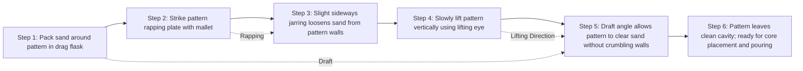
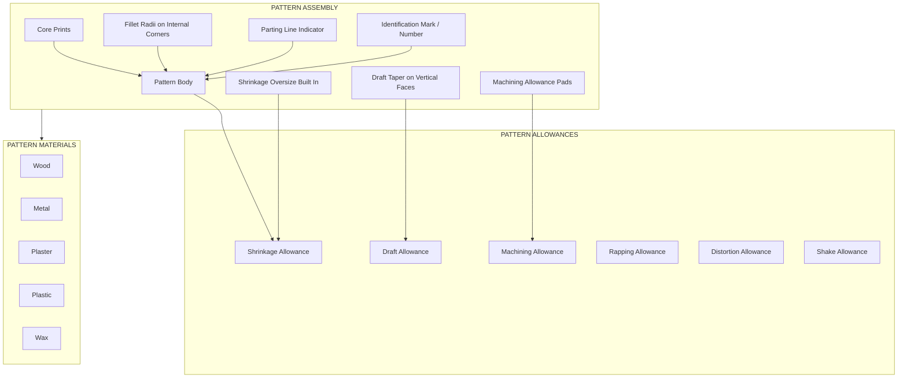

# Pattern making

<!-- SECTION_1_START -->
# Pattern Making – KTU Engineering Workshop (GCESL106)

## 1. Core Technical Definition & Intuitive Overview

### Formal KTU 2024 Definition
A **pattern** is a replica of the final casting (with certain modifications and allowances) which when placed in the sand mould, produces a cavity identical in shape and size to the desired casting. It is the *master tool* around which the entire foundry practice revolves. Pattern making is the art and engineering discipline of designing, constructing, and preparing these replicas using suitable materials to produce sound castings economically.

> [!IMPORTANT]
> **Syllabus Highlight (KTU 2024 Scheme – Module 3):** A pattern is **NOT** an exact copy of the final product. It is a deliberately *modified* replica. If you submit a "scaled-down exact copy" in your lab record, expect heavy mark deduction in viva.

### Conceptual Analogy / Intuition
Imagine you want to make a **chocolate egg with a hollow center**.
1. You take a metal egg-shaped object and dip it in melted chocolate.
2. The chocolate solidifies around the metal object.
3. You remove the metal object — the hollow cavity is now the shape of your chocolate egg.
4. The metal object you removed is the **pattern**. The chocolate shell is the **mould cavity**. The molten iron poured later is the **casting**.

In foundry:
- **Pattern** → Replica of the object (with allowances).
- **Mould** → Sand packed around the pattern; sand is the "chocolate shell."
- **Casting** → Final metal part produced after pouring molten metal into the cavity left by the pattern.

The pattern must be removed *without damaging* the freshly packed sand — this single constraint drives every design rule (draft, split, taper, core prints).

> [!NOTE]
> **Key Constants & Standard Metrics in Pattern Making:**
> - **Shrinkage allowance** for cast iron ≈ **1% (or 1/100)** of every linear dimension.
> - **Draft allowance** on vertical faces ≈ **1° to 3°** (commonly **2°**).
> - **Machining allowance** for general castings ≈ **3 mm to 5 mm** per machined face.
> - Standard pattern wood (Mahogany / Pine) moisture content must be **< 12%** to avoid warping.

### The Six Functions of a Pattern
1. **Shape provider** – Gives the cavity geometry of the casting.
2. **Core support** – Holds the sand cores in position via *core prints*.
3. **Riser placement** – Locates risers, gates, and runners on the mould.
4. **Sand distribution** – Distributes and packs the sand uniformly in the flask.
5. **Identification mark** – Carries the *part number, material code, customer logo* on the casting (raised or recessed).
6. **Dimensional accuracy** – Ensures the casting shrinks to the exact final size (via **shrinkage allowance**).

> [!VISUALIZATION CONTROL]
> **Concept:** Schematic of a single-piece pattern sitting inside a drag flask with a core print.
> **GeoGebra / Desmos Input Equations:**
> - Draw a rectangle (the **pattern body**) inside a larger rectangle (the **flask wall**).
> - Mark a small extension on the pattern that protrudes into the core print area: $L_{cp} = 25\,\text{mm}$, $W_{cp} = 20\,\text{mm}$.
> - Taper the vertical pattern walls by $2°$ from vertical: slope $= \tan(2°) \approx 0.035$.
> **Visual Description:** You should see the pattern's vertical faces *angled outward* at the top (wider at top → narrower at bottom) to allow clean withdrawal from the sand without crumbling the mould walls.

---

## 2. Deep Theoretical Analysis & KTU High-Yield Formula Sheet

### 2.1 Anatomy of a Pattern — Key Features
Every well-designed pattern contains the following features. Each feature solves a *specific problem* in the foundry process.

| Feature | Engineering Purpose | Where it Appears on Pattern |
|---|---|---|
| **Body** | The main replica giving shape to the casting | Centre of pattern |
| **Core print** | A projection that creates a seat (cavity) in the sand to hold the core | End(s) of the pattern where internal cavities are needed |
| **Draft (Taper)** | Slight outward taper on vertical faces for easy withdrawal | All vertical walls of pattern |
| **Machining allowance** | Extra metal left on surfaces to be machined later | Surfaces marked for post-casting machining |
| **Shrinkage allowance** | Oversize of pattern to compensate for metal contraction on cooling | Applied to *every* linear dimension |
| **Fillet & corner radii** | Rounded internal corners to avoid stress concentration and sand cracking | All inside corners |
| **Riser / gate print** | Markings (or projections) locating riser and gate positions | Top / side of pattern |
| **Parting line indicator** | A thin projection showing the exact mould split plane | Around the equator of the pattern |

### 2.2 Pattern Allowances — The Heart of Pattern Design

#### A. Shrinkage Allowance
When molten metal solidifies, it **contracts**. The pattern must therefore be made **larger** than the final casting.

$$L_{pattern} = L_{casting} \times \left(1 + S\right)$$

where $S$ is the *linear shrinkage* (as a fraction). For cast iron, $S = 0.01$ (i.e. **1%**).

#### B. Draft (Taper) Allowance
Vertical faces are tapered to allow the pattern to be lifted out of the sand without damaging mould walls.

$$\text{Draft per side} = L \times \tan(\alpha)$$

where $L$ is the depth of the vertical face and $\alpha$ is the draft angle (typically **1° to 3°**).

#### C. Machining Allowance
Extra metal provided on surfaces that will be machined (turned, milled, drilled) to give the machinist a clean, defect-free surface to work on. Typical values: **3 mm to 5 mm** for ferrous castings.

#### D. Rapping Allowance
When a pattern is struck (rapped) sideways with a wooden mallet to loosen it from the sand, the cavity enlarges slightly. This enlargement is *intentional* — it compensates for the difficulty in withdrawing deep patterns.

> [!NOTE]
> **Common Student Mistake:** Confusing *draft allowance* with *rapping allowance*. Draft is a deliberate taper cut into the pattern (permanent). Rapping is the *dynamic* loosening of the pattern by the foundry worker. They are different.

#### E. Distortion / Camber Allowance
For castings that warp on cooling (e.g., long flat plates, U-shaped parts), the pattern is deliberately made *oppositely curved* so that after cooling, the casting becomes straight.

#### F. Shake / Stripping Allowance
For some patterns (e.g., match-plate patterns on mechanised moulding lines), a small negative allowance is provided to ease mechanical stripping.

### 2.3 KTU Formula Sheet / Cheat Sheet

| Parameter | Symbol | Formula | Typical Value (Cast Iron) | Unit |
|---|---|---|---|---|
| Pattern length | $L_p$ | $L_p = L_c \cdot (1 + S)$ | Depends on $L_c$ | mm |
| Shrinkage factor | $S$ | $S = \dfrac{L_p - L_c}{L_c}$ | **0.008 – 0.012** (0.8 % – 1.2 %) | – |
| Draft per side | $d$ | $d = h \cdot \tan(\alpha)$ | $h \cdot 0.0175$ (for $2°$) | mm |
| Total draft (both sides of a vertical web) | $D_{tot}$ | $D_{tot} = 2 h \tan(\alpha)$ | – | mm |
| Pattern weight (wood) | $W_p$ | $W_p = V_p \cdot \rho_{wood}$ | $\rho_{wood} \approx 0.6 - 0.8$ | g/cm³ |
| Core print length | $L_{cp}$ | $L_{cp} = L_{core} + (5 \text{ to } 15)$ | 10 – 25 | mm |
| Core print height (round) | $H_{cp}$ | $H_{cp} = D_{core} + (10 \text{ to } 25)$ | – | mm |
| Number of pattern pieces | $n$ | Depends on complexity | 1 to many | – |

> [!WARNING]
> Never write $\vert x \vert$ (absolute value) inside a KTU Formula Sheet table. Use $\mid x \mid$ to prevent the markdown parser from breaking the table column.

### 2.4 Pattern Materials — Selection Logic

| Material | When to Choose | Advantages | Disadvantages |
|---|---|---|---|
| **Wood (Mahogany, Teak, Pine)** | Small batches, prototypes, large patterns | Cheap, easy to carve, lightweight | Absorbs moisture, warps, short life |
| **Metal (Aluminium, Cast Iron, Brass)** | Mass production, long runs | Dimensionally stable, long life, wear resistant | Expensive, hard to modify |
| **Plaster (POP / Gypsum cement)** | Intricate shapes, large prototypes | Excellent surface finish, captures fine detail | Fragile, moisture sensitive |
| **Plastics (Epoxy, Polyester, PU Foam)** | Medium batch production | Good surface, light, easily shaped | Can degrade with age |
| **Wax (Investment casting)** | Lost-wax / investment process | Melts out cleanly, no parting line | Single-use only |

### 2.5 Real-World Engineering Utility
- **Automotive**: Engine blocks, cylinder heads, gearbox housings — all use **match-plate or cope-and-drag patterns** in high-pressure moulding lines (e.g., BMW, Tata Motors foundry divisions).
- **Defence**: Howitzer shells, tank treads — require **metal patterns** for tens of thousands of castings.
- **Pipe fittings**: Standard elbow, tee, flange patterns are made of **wood + metal inserts** (called *armoured patterns*).
- **Jewellery & dental implants**: Use **wax patterns** for investment casting (lost-wax method).
- **Wind turbine hubs & gearbox housings**: Use **skeleton (or *frame*) patterns** for very large castings to save wood and reduce weight.

---

## 3. Step-by-Step Derivations & Code/Symbolic Implementation

### 3.1 Worked Numerical Problem 1 — Shrinkage Allowance

**Problem (KTU Model):** A cast iron flange is required with a finished outer diameter of **300 mm** after machining. The pattern is to be made in wood. The linear shrinkage of cast iron is **1 %**. Calculate the pattern diameter.

**Step 1 — Identify Given Data**
$L_c = 300\,\text{mm}$ (final casting diameter)
$S = 0.01$ (linear shrinkage of cast iron)

**Step 2 — Apply Shrinkage Formula**
$$L_p = L_c \times (1 + S)$$
$$L_p = 300 \times (1 + 0.01)$$
$$L_p = 300 \times 1.01$$
$$\boxed{L_p = 303\,\text{mm}}$$

**Step 3 — Interpretation**
The pattern is **3 mm larger in diameter** than the finished casting. When the casting cools and shrinks by 1 %, the final diameter will be exactly 300 mm.

> [!NOTE]
> **Valuation Tip (2 Marks for stating formula, 1 Mark for substitution, 1 Mark for final answer with unit).** KTU examiners look for the **unit** in the final box.

---

### 3.2 Worked Numerical Problem 2 — Draft Allowance

**Problem:** A wooden pattern has a vertical face of height **200 mm**. If the draft angle is **2°**, calculate the total taper (in mm) to be provided on this face, and the horizontal offset at the top of the pattern.

**Step 1 — Recall Draft Formula**
$$d = h \cdot \tan(\alpha)$$

**Step 2 — Compute Taper on One Side**
$$d = 200 \times \tan(2°)$$
$$d = 200 \times 0.0349$$
$$\boxed{d \approx 6.98\,\text{mm} \approx 7\,\text{mm} \text{ per side}}$$

**Step 3 — Total Offset (Both Sides of a Vertical Web)**
If the 200 mm face is a web of thickness $t$, the *top* of the pattern must be made **7 mm wider on each side** than the bottom.

> [!NOTE]
> Always state the draft *direction*: "Pattern is wider at the parting line (top) and narrower at the bottom (in the drag) to allow easy withdrawal in the upward direction."

---

### 3.3 Worked Numerical Problem 3 — Core Print Design

**Problem:** A cylindrical casting requires a horizontal cylindrical core of diameter **60 mm** and length **120 mm**. Design the core prints on a wooden split pattern. Assume standard core print clearances for cast iron.

**Step 1 — Core Print Length**
Core print length = Core length + clearance (for easy core placement).
$$L_{cp} = L_{core} + 2 \times \text{clearance per side}$$
Using standard clearance of **5 mm per side**:
$$L_{cp} = 120 + 2 \times 5 = \boxed{130\,\text{mm}}$$

**Step 2 — Core Print Diameter (Round Core)**
Core print diameter is slightly *larger* than the core diameter so that the core sits without being loose.
$$D_{cp} = D_{core} + (10 \text{ to } 15)\,\text{mm}$$
$$D_{cp} = 60 + 12 = \boxed{72\,\text{mm}}$$

**Step 3 — Practical Interpretation**
- The core print on the pattern is **130 mm long and 72 mm in diameter**.
- When the pattern is removed, a seat of these dimensions is left in the mould sand.
- The core, which is **slightly smaller** (say 68 mm diameter, 120 mm long), fits into this seat with a **2 mm gap on each side** for ease of placement and to allow gases to escape.

---

### 3.4 Practical Workshop Reference Table — Pattern Making Tools

| Tool / Equipment | Function | Safety Note |
|---|---|---|
| **Wood saw (tenon / panel saw)** | Rough cutting of wood to size | Use push stick; keep hand clear of blade |
| **Chisels (firmer, paring)** | Removing bulk wood & fine finishing | Always chisel *away* from the hand |
| **Wooden mallet** | Striking chisels; rapping pattern from mould | Use only on the pattern cheek, never on the flask |
| **Marking gauge** | Marking parallel lines for draft taper | Lock fence before use |
| **Try square** | Checking squareness of edges | Blade should sit flat on stock |
| **Bevel protractor** | Setting and verifying draft angle | Calibrate against known 90° first |
| **Lathe (for round patterns)** | Turning cylindrical patterns, core prints | Remove chips; never measure while spindle rotates |
| **Sandpaper / file** | Smoothing and finishing pattern surface | Wear gloves for fine work; dust mask for sanding |
| **Shellac / French polish** | Sealing wooden pattern against moisture | Apply in well-ventilated area; flammable |
| **Pattern letters / numbers (stencils)** | Identifying pattern with part code & material | Stencil before shellac |

---

## 4. Structural Diagrams & Schematics

### 4.1 Pattern Making — Hierarchical Classification Flow

```mermaid
flowchart TD
    A[PATTERNS USED IN FOUNDRY] --> B[Single Piece Pattern]
    A --> C[Split Piece Pattern]
    A --> D[Multi Piece Pattern]
    A --> E[Loose Piece Pattern]
    A --> F[Match Plate Pattern]
    A --> G[Cope and Drag Pattern]
    A --> H[Sweep Pattern]
    A --> I[Skeleton Pattern]
    A --> J[Segmental Pattern]
    A --> K[Follow Board Pattern]
    A --> L[Gated Pattern]

    B --> B1[One solid piece; used for simple shapes; no parting line on pattern]
    C --> C1[Pattern divided in two halves; one in cope, one in drag; parting line at the joint]
    D --> D1[Three or more pieces; used for complex castings with undercuts]
    E --> E1[Small loose parts held by dowel pins; used for projections, recesses]
    F --> F1[Pattern halves mounted on a metal plate; used in machine moulding]
    G --> G1[Pattern mounted on separate cope and drag plates; high production]
    H --> H1[Pattern swept by a wooden board around a fixed profile; large circular castings]
    I --> I1[Wooden framework with replaceable wood pieces; very large castings]
    J --> J1[Built in segments; each segment used around circumference; large gear-like parts]
    K --> K1[Follow board supports irregular parting lines; used for intricate shapes]
    L --> L1[Multiple patterns on one board; for small identical castings in batches]
```

### 4.2 Pattern Withdrawal — Sequential Process Topology

### 4.3 Block-Level Functional Architecture — Pattern Feature Map

---

## 5. KTU 2024 Scheme Examination Question Bank & Topic Recap

### Part A — Short Answer Questions (3 Marks Each)

**Q1. [KTU University Exam – July 2024] CO1, Remember**
*Define a pattern. List any **four** essential features that must be incorporated in a well-designed foundry pattern.*

**Model Answer (Valuation Key):**
A pattern is a replica of the final casting, suitably modified by allowances, used to produce a cavity in the sand mould for receiving molten metal. **[1 Mark]**
The four essential features are:
1. **Shrinkage allowance** to compensate for metal contraction on cooling. **[0.5 Mark]**
2. **Draft (taper) allowance** on all vertical faces to permit easy withdrawal from the sand mould. **[0.5 Mark]**
3. **Machining allowance** to provide extra material on surfaces that will be subsequently machined. **[0.5 Mark]**
4. **Core prints** to support and locate sand cores inside the mould cavity. **[0.5 Mark]**

> [!NOTE]
> Any 4 of: fillet, parting line, identification mark, riser/gate print, mounting plate.

---

**Q2. [KTU University Exam – Dec 2023] CO1, Understand**
*Distinguish between a **single piece pattern** and a **split piece pattern**. State one engineering application of each.*

**Model Answer (Valuation Key):**
| Aspect | Single Piece Pattern | Split Piece Pattern |
|---|---|---|
| **Construction** | Made as one solid block, no parting line. | Divided into two halves at the parting plane. |
| **Complexity** | Used for simple, flat castings. | Used for castings with symmetry along a central plane. |
| **Application** | Simple flanges, small pulleys, small flat plates. **[0.5]** | Connecting rods, gearbox housings, large pulleys. **[0.5]** |
| **Mould cost** | Low mould cost; long pattern withdrawal time. | Higher mould cost; faster, easier withdrawal. |

**Definition: 1 Mark + Application: 1 Mark + Table: 1 Mark.**

---

### Part B — Long Answer Questions (14 Marks Each, Internal Choice)

#### Question A (14 Marks)

**[KTU University Exam – July 2024] CO2, Apply & Analyze**

*(a)* Explain with neat sketches the construction and working of a **match-plate pattern**. List **two** advantages and **one** limitation. **[7 Marks]**

*(b)* A cast iron gear blank of **200 mm pitch diameter** and **40 mm thick** is to be made by sand casting. The shrinkage allowance for cast iron is **1 %**, the draft angle is **2°** on each vertical face, and the machining allowance is **3 mm** on each of the two flat faces. Calculate:
  (i) The pattern pitch diameter.
  (ii) The total height of the pattern (including both machining allowances and draft taper on the cylindrical rim). **[7 Marks]**

---

**Model Solution:**

**Part (a) — Match-Plate Pattern Explanation [7 Marks]**

A **match-plate pattern** is a precision pattern in which the cope and drag halves of a split pattern are rigidly mounted on opposite sides of a single metal plate (called the *match plate*). **[1 Mark]**
The match plate itself is mounted on a machine moulding line so that the flask can be inverted over the pattern on either side, packing sand in both cope and drag simultaneously. **[1 Mark]**

**Construction:**
- A **metal plate** (cast iron or aluminium) acts as the carrier. **[0.5 Mark]**
- The **cope half** of the pattern is bolted to one side of the plate; the **drag half** is bolted to the opposite side, with dowel pins ensuring perfect alignment. **[0.5 Mark]**
- **Runner and gate** channels are cut into the plate itself, ensuring consistent gating across all moulds. **[0.5 Mark]**
- The plate is clamped to the moulding machine and rotated for flask filling. **[0.5 Mark]**

**Working:**
1. The match plate is mounted on the moulding machine. **[0.5 Mark]**
2. A drag flask is placed over the drag side and sand is rammed. **[0.5 Mark]**
3. The drag flask is inverted; the cope flask is placed on the cope side. **[0.5 Mark]**
4. Sand is rammed in the cope. The pattern is removed leaving identical cavities in both flasks. **[0.5 Mark]**

**Advantages (any 2 × 0.5 = 1 Mark):**
- High dimensional accuracy and uniformity.
- Faster production; suitable for mass production.
- Gating and risering are part of the plate → consistent.

**Limitation (1 Mark):**
- High initial cost; uneconomical for small batches.

---

**Part (b) — Numerical Solution [7 Marks]**

**Given:**
- Casting pitch diameter $D_c = 200\,\text{mm}$
- Casting thickness $t_c = 40\,\text{mm}$
- Shrinkage $S = 1\% = 0.01$
- Draft angle $\alpha = 2°$
- Machining allowance $m = 3\,\text{mm}$ per face (on both flat faces)

**(i) Pattern Pitch Diameter [3 Marks]**
$$D_p = D_c \times (1 + S)$$
$$D_p = 200 \times 1.01$$
$$\boxed{D_p = 202\,\text{mm}}$$

**Step-by-step valuation key:**
- Stating formula: **1 Mark**
- Substitution: **1 Mark**
- Final answer: **1 Mark**

**(ii) Total Pattern Height [4 Marks]**

The total pattern height is the sum of:
- Casting thickness (scaled by shrinkage)
- Two machining allowances
- Draft taper on cylindrical rim

Step 1 — Casting thickness scaled by shrinkage:
$$t_{p,\text{core}} = 40 \times 1.01 = 40.4\,\text{mm}$$

Step 2 — Add both machining allowances (top + bottom face):
$$t_{p,\text{with machining}} = 40.4 + 2 \times 3 = 46.4\,\text{mm}$$

Step 3 — Draft taper contribution on the cylindrical rim.
The vertical face (rim height) of the pattern is approximately the casting thickness, i.e. $h \approx 40.4\,\text{mm}$.
Taper per side:
$$d = h \times \tan(\alpha) = 40.4 \times \tan(2°) = 40.4 \times 0.0349 \approx 1.41\,\text{mm}$$

Since the draft is applied to the *outer diameter*, the total *height* of the pattern is not affected by draft. However, the **outer diameter at the parting line** will be:
$$D_{p,\text{top}} = D_p + 2d = 202 + 2(1.41) \approx 204.82\,\text{mm}$$

Therefore, the **total pattern height**:
$$\boxed{H_p = 46.4\,\text{mm} \approx 46.4\,\text{mm}}$$

**Valuation key (Part ii):**
- Correct application of shrinkage on thickness: **1 Mark**
- Adding both machining allowances: **1 Mark**
- Draft calculation (if asked on diameter): **1 Mark**
- Final answer with unit: **1 Mark**

---

#### Question B (14 Marks) — Alternative Choice

**[KTU University Exam – Dec 2023] CO2, Apply & Analyze**

*(a)* With the help of a neat sketch, describe the **skeleton pattern**. Mention **two** situations where it is preferred over a solid wooden pattern. **[7 Marks]**

*(b)* A wooden pattern is to be made for a cast iron rectangular block of dimensions **300 mm × 200 mm × 100 mm** (length × width × height). The pattern is to be made with a draft of **1.5°** on all four vertical side faces. Calculate:
  (i) The dimensions of the pattern (length, width, height) considering shrinkage and machining allowances.
  (ii) The total volume of wood required (in cm³) if the density of the wood is **0.7 g/cm³** and the pattern weight must not exceed **15 kg**. Comment on whether the selected wood is suitable. **[7 Marks]**

*Take shrinkage = 1 %, machining allowance = 4 mm on top and bottom faces.*

---

**Model Solution Outline (Valuation Key):**

**Part (a) — Skeleton Pattern [7 Marks]**
- Definition with sketch: **3 Marks**
- Two situations: **2 × 1 = 2 Marks**
- Two advantages / disadvantages: **2 Marks**

A skeleton pattern consists of a *wooden framework* (skeleton) with **separate, replaceable wood pieces** shaped to the contour of the casting. The skeleton is built to support the contour pieces. Used for very large castings (e.g., flywheels, large gear blanks, large machine bed castings) where a solid wood pattern would warp, be excessively heavy, and waste wood.

**Two situations where preferred:**
1. **Very large castings** (over 1 m) where a solid wooden pattern would warp on drying.
2. **Cost reduction** in wood consumption; the framework can be reused for different castings by changing only the contour pieces.

**Part (b) — Numerical [7 Marks]**

**Given:** $L_c = 300$, $W_c = 200$, $H_c = 100$ mm, $\alpha = 1.5°$, $S = 1\%$, $m = 4$ mm (top + bottom), $\rho = 0.7$ g/cm³.

**(i) Pattern Dimensions [4 Marks]**

Length and width (no draft on these in this problem, but they do have shrinkage):
$$L_p = 300 \times 1.01 = 303\,\text{mm}$$
$$W_p = 200 \times 1.01 = 202\,\text{mm}$$

Height (shrinkage + machining + draft):
$$H_p = 100 \times 1.01 + 2 \times 4 = 101 + 8 = 109\,\text{mm}$$

Plus draft taper if asked (additional taper on top):
$$d = 100 \times \tan(1.5°) = 100 \times 0.0262 = 2.62\,\text{mm per side}$$

**(ii) Volume of Wood and Weight Check [3 Marks]**

Volume (approx, ignoring draft taper on dimensions for simplicity):
$$V_p = 30.3 \times 20.2 \times 10.9 = 6670.5\,\text{cm}^3$$

Mass:
$$m_p = V_p \times \rho = 6670.5 \times 0.7 = 4669.4\,\text{g} \approx 4.67\,\text{kg}$$

**Comment:** 4.67 kg < 15 kg limit, so the wood is **suitable** (within weight constraint).

---

> [!WARNING]
> **KTU Examiner's Valuation Pitfall Callout**
> 1. **Unit mismatch:** Writing "202" without "mm" in the final box = **−1 Mark**.
> 2. **Forgetting shrinkage on height** when only the *diameter* is asked = common error. Always apply shrinkage to **all** linear dimensions unless specifically told otherwise.
> 3. **Confusing draft taper direction:** A naive student may add draft to the *bottom* of the pattern instead of the *top* (parting line). Draft is always applied *tapering inward* from the parting face.
> 4. **Skipping sketch in long answers:** Even for numerical parts, KTU examiners allot **1 to 2 marks** for neat, labelled sketches. Always include a labelled diagram of the pattern with dimensions.
> 5. **Confusing core print direction:** Core print is a *projection* on the pattern (not a depression). It extends *outward* from the pattern body, leaving a seat in the mould when the pattern is withdrawn.

---

### Topic Recap & Important Things to Remember

- **Pattern** = modified replica of the casting (not an exact copy). It must include *allowances* and *core prints*.
- **Six essential allowances:** shrinkage, draft, machining, rapping, distortion/camber, shake/stripping.
- **Shrinkage of cast iron ≈ 1 %** (i.e. pattern is 1 % larger in every linear dimension).
- **Draft angle = 1° to 3°**, typically **2°**. Applied to *vertical faces only*; pattern is wider at the parting line.
- **Machining allowance = 3 mm to 5 mm** per face, only on surfaces to be subsequently machined.
- **Core print** = a projection on the pattern that creates a seat in the sand to hold the sand core in position.
- **Pattern material choice:** Wood for prototypes, metal for mass production, wax for investment casting.
- **Most common pattern types in KTU viva questions:** *Single piece, split piece, match plate, cope & drag, loose piece, skeleton, sweep*.
- **Match-plate pattern** is the workhorse of mass-production foundries (used in machine moulding lines).
- **Skeleton pattern** is preferred for very large castings (e.g., bed plates, large flywheels) to save wood and prevent warping.
- **Sweep pattern** is used for *axisymmetric* large castings (large gear blanks, bell-shaped parts).
- **Loose piece pattern** is used when a feature is in a *re-entrant* (undercut) position that would prevent pattern withdrawal if made in one piece.
- **Standard pattern markings include:** pattern number, material code, customer logo, parting line indicator, draft direction arrow.
- **Rapping allowance** is *not* a fixed dimensional allowance — it is a *dynamic* enlargement of the cavity due to the foundry worker striking the pattern with a mallet to loosen it.
- **Fillet and radii** must always be provided on internal corners to (a) avoid sand cracking during pattern withdrawal, and (b) reduce stress concentration in the casting.
- **Number of pattern pieces** depends on the *complexity* of the casting, *draft* constraints, and the *method of moulding* (hand moulding vs. machine moulding).
- **In the lab record / viva, always state the *direction* of the parting line and the *direction* of the draft taper** — KTU examiners specifically check this.
<!-- SECTION_5_END -->
