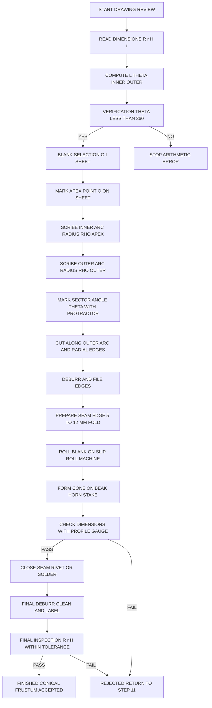
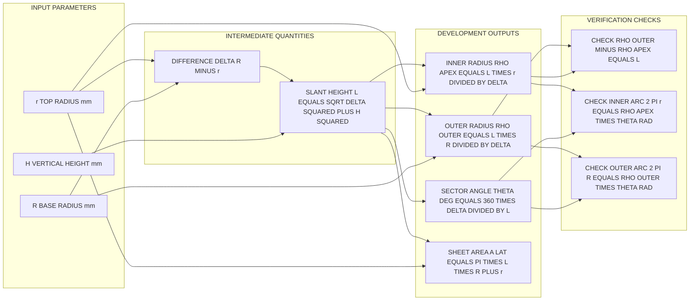
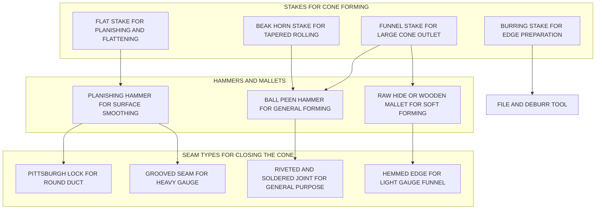

# Conical shape

<!-- SECTION_1_START -->
# CONICAL SHAPE IN SHEET METAL WORK

## 1. Core Technical Definition

A **Conical Shape** (or **Conical Frustum**) is a three-dimensional solid bounded by two parallel circular faces of differing radii joined by a smoothly tapering lateral (slant) surface. In the context of **Sheet Metal Work** (Module 4 of GCESL106, Engineering Workshop), the term *conical shape* refers to the flat-pattern **development** that is cut from a single sheet of metal and subsequently **rolled, bent, and seamed** to form a hollow cone or a frustum (truncated cone) without the use of any welded seam.

Formally, a **Cone** is the locus of a straight line (the *generator*) that passes through a fixed point (the *apex*) and sweeps around a closed base curve. When the apex is truncated parallel to the base, the resulting solid is called a **Frustum of a Cone** (Latin *frustum* = "a piece cut off"). For a frustum with bottom radius $R$, top radius $r$, and vertical height $H$, the **slant height** is given by the line integral of the lateral surface generator:

$$L = \sqrt{(R - r)^2 + H^2}$$

The constant **$\pi = 3.14159...$** governs all circumferential relationships, and the universal **360$^\circ$** of a full circle is the basis of the *sector angle* used in development.

> [!IMPORTANT]
> **KTU Syllabus Highlight (Module 4 – Sheet Metal):** The student must be able to (i) identify and select the appropriate hand tools and stakes, (ii) compute the **flat-pattern development** of a cone/frustum, and (iii) execute the cutting, edge-preparation, rolling, and seaming operations to physically realise the cone from a flat sheet.

> [!NOTE]
> **Two Variants Encountered in the Workshop:**
> 1. **Full Cone** – Tapers to a single point (apex). Example: a paper-cup former, a funnel tip.
> 2. **Conical Frustum** – Tapers from a larger base to a smaller circular mouth. Example: a kitchen funnel, an industrial hopper, a transition duct.

---

## 2. Conceptual Analogy / Intuitive Overview

Imagine rolling up a slice of pizza (a circular sector) so that the two straight edges meet — the curved crust edge forms a circle, and the two tapered straight edges form the *slant lines* of a cone. The pizza slice **is** the flat development; the rolled-up shape **is** the cone. The larger the slice, the "fatter" the cone; the smaller the slice, the "pointier" it becomes.

A second analogy is an **ice-cream cone or a party hat**: a flat sector of paper is curved around so that its radial edges meet and are glued — the result is a hollow cone. If the apex is cut off (which is what happens when the party hat needs a flat top to sit on your head), the result is a **frustum**.

> [!TIP]
> **Mental Model to Retain:**
> *Flat sheet → cut sector → roll the straight edges together → seam the joint → finished hollow cone.*
> Every parameter on the development (sector radius, sector angle) is directly controlled by the height and the two radii of the desired 3-D cone.

---

## 3. Visualization (Geometric Intuition)

> [!VISUALIZATION CONTROL]
> **Concept:** Cross-section of a frustum showing the slant generator $L$ and the relationship between $H$, $R$, and $r$.
> **GeoGebra / Desmos Input Equations:**
> * `R = 5` (bottom radius, slider)
> * `r = 2` (top radius, slider)
> * `H = 8` (vertical height, slider)
> * `L = sqrt((R - r)^2 + H^2)`
> * `Point1: (0, 0)` — bottom centre
> * `Point2: (R, 0)` — bottom-right corner of cross-section
> * `Point3: ((R - r), H)` — top-right corner (after horizontal shift)
> * `Line(Point1, Point2)` — base radius $R$
> * `Line(Point1, ((R - r), H))` — the axis of symmetry is implicit; the slant goes from $(R, 0)$ to $((R - r), H)$.
> * `Line(Point2, Point3)` — **slant generator $L$** (this is the hypotenuse of the right triangle)
> * `Line(Point3, (0, H))` — top radius $r$ drawn back to the shifted axis
> **Visual Description:** The student should observe a right triangle whose base is $(R - r)$, height is $H$, and hypotenuse is the slant height $L$. This is the *unrolled* silhouette of the frustum. If $r \to 0$, the top vertex collapses to the apex, and the figure reduces to the full-cone triangle.

<!-- SECTION_1_END -->

<!-- SECTION_2_START -->
# DEEP THEORETICAL ANALYSIS & KTU HIGH-YIELD FORMULA SHEET

## 1. The Underlying Geometry of a Conical Frustum

A right circular conical frustum is generated by revolving a straight inclined line (the *generator*) about the vertical axis. The cross-section in any axial plane is a **right trapezoid** with parallel sides $R$ and $r$ and non-parallel sides $L$ and a vertical leg $H$. The slant height $L$ is the length of the generator that sweeps around the axis, and every point on this generator traces a horizontal circle whose radius varies linearly from $R$ at the base to $r$ at the top.

### Why the development is a *sector of an annulus*
* When the lateral surface is "unrolled" onto a flat plane, the arc of length $2\pi R$ (the base circumference) becomes the **outer arc** of the developed pattern, and the arc of length $2\pi r$ (the top circumference) becomes the **inner arc**.
* Both arcs share a common centre $O$ at a distance equal to the **apex radius** $\rho_{\text{apex}}$ from the inner and outer arcs.
* The angular spread of the pattern is called the **sector angle** $\theta$.

This is *why* every measurement on the development depends on $L$, $R$, and $r$ — the slant height is preserved during unrolling because the sheet metal is neither stretched nor compressed.

---

## 2. KTU Formula Sheet (Cheat Sheet)

The following table consolidates **every formula** that a KTU board examiner expects the student to reproduce verbatim for a full-cone or a conical-frustum development problem.

| # | Quantity | Symbol | Formula | Units | Notes |
|---|----------|--------|---------|-------|-------|
| 1 | Base radius | $R$ | Given | mm | Larger of the two radii |
| 2 | Top radius | $r$ | Given | mm | Smaller radius (omit if full cone, $r = 0$) |
| 3 | Vertical height | $H$ | Given | mm | Measured along the central axis |
| 4 | Slant height (generator) | $L$ | $\sqrt{(R - r)^2 + H^2}$ | mm | Hypotenuse of the axial right triangle |
| 5 | Apex radius (development) | $\rho_{\text{apex}}$ | $\dfrac{L \cdot r}{R - r}$ | mm | Radius from the centre of the development to the inner arc |
| 6 | Outer radius (development) | $\rho_{\text{outer}}$ | $\rho_{\text{apex}} + L = \dfrac{L \cdot R}{R - r}$ | mm | Radius from the centre to the outer arc |
| 7 | Inner arc length | $s_{\text{inner}}$ | $2 \pi r$ | mm | Must equal $\rho_{\text{apex}} \cdot \theta$ |
| 8 | Outer arc length | $s_{\text{outer}}$ | $2 \pi R$ | mm | Must equal $\rho_{\text{outer}} \cdot \theta$ |
| 9 | Sector angle (radians) | $\theta_{\text{rad}}$ | $\dfrac{2 \pi (R - r)}{L}$ | rad | Compare against $2 \pi$ for a full circle |
| 10 | Sector angle (degrees) | $\theta_{\text{deg}}$ | $\dfrac{360 (R - r)}{L}$ | deg | **Most-used form on the KTU answer script** |
| 11 | Area of lateral surface | $A_{\text{lat}}$ | $\pi L (R + r)$ | mm$^2$ | Useful for sheet-area / costing estimates |
| 12 | Full-cone special case | $\theta_{\text{deg}}$ | $\dfrac{360 R}{L}$ | deg | Set $r = 0$ and $L = \sqrt{R^2 + H^2}$ |

> [!IMPORTANT]
> **Conversion Sanity Check:** $\theta_{\text{deg}}$ for a real cone is always strictly less than $360^\circ$. If a student computes $\theta_{\text{deg}} \ge 360^\circ$, an arithmetic error has been made (typically forgetting the factor $(R - r)$ instead of using $R$ alone).

---

## 3. Real-World Engineering Utility

| Engineering Domain | Application of a Conical / Frustum Sheet-Metal Form | Why a Cone? |
|--------------------|------------------------------------------------------|-------------|
| **HVAC & Ductwork** | Round-to-round transitions between ducts of different diameters | Smooth aerodynamic flow, low pressure drop |
| **Process Industry** | Hoppers, cyclone separators, dust collectors, mixing funnels | Gravity-assisted discharge of bulk solids |
| **Kitchenware** | Strainers, funnels, coffee drippers, ice-cream cones | Cheap, food-safe, easy to clean |
| **Lighting** | Lamp shades, reflector cones | Directional light control |
| **Automotive** | Air-intake snorkels, exhaust cones, fuel fillers | Compact flow optimisation |
| **Architecture** | Roof terminations, decorative columns, chimney caps | Weather shedding, aesthetic taper |
| **Packaging** | Tin cans with tapered tops, aerosol cones | Stacking efficiency, controlled pouring |

> [!TIP]
> In production environments, cones/frustums are often *spun* on a lathe or *hydroformed* from a single blank, but the underlying flat-pattern development remains the same as the **hand-craft method** taught in the KTU engineering workshop.

<!-- SECTION_2_END -->

<!-- SECTION_3_START -->
# STEP-BY-STEP DERIVATIONS, WORKSHOP PROCEDURE, AND TOOL CONFIGURATION

## 1. Exhaustive Derivation of the Flat-Pattern Development

### 1.1 Conical Frustum — Sector Angle $\theta$

**Statement:** *For a frustum of a cone with base radius $R$, top radius $r$, and height $H$, the sector angle of the flat development is $\theta_{\text{deg}} = \dfrac{360^\circ (R - r)}{L}$, where $L = \sqrt{(R - r)^2 + H^2}$ is the slant height.*

**Derivation (in fully expanded LaTeX with explanatory text rows):**

Step 1 — *Express the base circumference.*

The base of the frustum is a circle of radius $R$, so its perimeter is

$$C_{\text{base}} = 2 \pi R$$

Step 2 — *Express the top circumference.*

The top circle has radius $r$, so

$$C_{\text{top}} = 2 \pi r$$

Step 3 — *Recognise the invariant of unrolling.*

When the lateral surface is laid flat, both the base and the top circles become concentric arcs about the apex point $O$ of the development. The arc lengths are preserved (the sheet is not stretched):

$$s_{\text{outer}} = 2 \pi R, \qquad s_{\text{inner}} = 2 \pi r$$

Step 4 — *Relate arc length to the sector angle and the radius.*

The length of an arc of radius $\rho$ and angle $\theta_{\text{rad}}$ is $s = \rho \cdot \theta_{\text{rad}}$. Applying this to the outer arc, whose radius is $\rho_{\text{outer}} = \rho_{\text{apex}} + L$, gives

$$2 \pi R = \rho_{\text{outer}} \cdot \theta_{\text{rad}}$$

Step 5 — *Eliminate $\rho_{\text{outer}}$ using the proportion of similar triangles.*

Because every horizontal cross-section of the cone is similar to the base, the radius scales linearly with distance from the apex. At the apex, the radius is zero; at a slant distance $\rho_{\text{apex}}$ from the apex, the radius equals $r$; at a slant distance $\rho_{\text{apex}} + L$ from the apex, the radius equals $R$. Therefore,

$$\frac{r}{\rho_{\text{apex}}} = \frac{R}{\rho_{\text{apex}} + L}$$

Cross-multiplying:

$$r (\rho_{\text{apex}} + L) = R \cdot \rho_{\text{apex}}$$

$$r \cdot \rho_{\text{apex}} + r L = R \cdot \rho_{\text{apex}}$$

$$r L = (R - r) \cdot \rho_{\text{apex}}$$

$$\rho_{\text{apex}} = \frac{r L}{R - r}$$

and consequently

$$\rho_{\text{outer}} = \rho_{\text{apex}} + L = \frac{r L}{R - r} + L = \frac{L (r + R - r)}{R - r} = \frac{L R}{R - r}$$

Step 6 — *Substitute $\rho_{\text{outer}}$ into the arc-length relation.*

$$2 \pi R = \frac{L R}{R - r} \cdot \theta_{\text{rad}}$$

Dividing both sides by $R$ (note: $R > 0$ for a physical cone):

$$2 \pi = \frac{L}{R - r} \cdot \theta_{\text{rad}}$$

Step 7 — *Solve for the sector angle in radians.*

$$\theta_{\text{rad}} = \frac{2 \pi (R - r)}{L}$$

Step 8 — *Convert to degrees for the KTU answer script.*

$$\boxed{\;\theta_{\text{deg}} = \frac{360^\circ \, (R - r)}{L}\;}$$

**Verification (boundary case):** If $r \to 0$ (the frustum collapses to a full cone), the formula becomes $\theta_{\text{deg}} = 360^\circ \cdot R / L$, which is the classical result for a full-cone development. ✓

---

### 1.2 Worked Numerical Example (Typical KTU 14-Mark Style)

**Problem (modelled on a KTU university exam, July 2024 style):**
*A conical funnel is to be fabricated from a 1 mm thick galvanised-iron (G.I.) sheet. The top diameter of the funnel is 300 mm, the bottom diameter is 150 mm, and the vertical height is 250 mm. Compute (a) the slant height, (b) the sector angle of the development, and (c) the inner and outer radii of the development. Sketch the development.*

**Given Data:**
$$D_{\text{top}} = 300 \text{ mm} \;\Rightarrow\; r = 150 \text{ mm}$$
$$D_{\text{bottom}} = 150 \text{ mm} \;\Rightarrow\; R = 75 \text{ mm (this is the *smaller* end, so swap: bottom radius = 75 mm, top radius = 150 mm)}$$

*Re-stating the problem to remove ambiguity: the funnel tapers **downward** to a 75 mm spout, so $R = 150$ mm (top) and $r = 75$ mm (bottom).*

$$H = 250 \text{ mm}$$

**Step 1 — Slant height:**

$$L = \sqrt{(R - r)^2 + H^2} = \sqrt{(150 - 75)^2 + 250^2}$$

$$L = \sqrt{75^2 + 250^2} = \sqrt{5625 + 62500} = \sqrt{68125}$$

$$L \approx 261.0 \text{ mm}$$

**Step 2 — Sector angle:**

$$\theta_{\text{deg}} = \frac{360^\circ (R - r)}{L} = \frac{360 \times 75}{261.0}$$

$$\theta_{\text{deg}} \approx 103.4^\circ$$

**Step 3 — Development radii:**

$$\rho_{\text{apex}} = \frac{L \cdot r}{R - r} = \frac{261.0 \times 75}{75} = 261.0 \text{ mm}$$

$$\rho_{\text{outer}} = \frac{L \cdot R}{R - r} = \frac{261.0 \times 150}{75} = 522.0 \text{ mm}$$

**Step 4 — Cross-verification using arc lengths:**

$$s_{\text{inner}} = 2 \pi r = 2 \pi (75) \approx 471.2 \text{ mm}$$
$$\text{Check: } \rho_{\text{apex}} \cdot \theta_{\text{rad}} = 261.0 \times \frac{103.4 \pi}{180} = 261.0 \times 1.805 \approx 471.1 \text{ mm} \quad \checkmark$$

$$s_{\text{outer}} = 2 \pi R = 2 \pi (150) \approx 942.5 \text{ mm}$$
$$\text{Check: } \rho_{\text{outer}} \cdot \theta_{\text{rad}} = 522.0 \times 1.805 \approx 942.2 \text{ mm} \quad \checkmark$$

**Final Answer:** $L \approx 261.0$ mm, $\theta_{\text{deg}} \approx 103.4^\circ$, $\rho_{\text{apex}} \approx 261.0$ mm, $\rho_{\text{outer}} \approx 522.0$ mm.

---

## 2. Workshop Procedure — Hand-Fabrication of a Conical Frustum

The following table gives the **complete fabrication sequence** that a KTU workshop examiner expects the student to demonstrate, with exact tool and parameter assignments.

| Step # | Operation | Tool / Equipment | Parameter / Setting | Inspection Check |
|--------|-----------|------------------|---------------------|------------------|
| 1 | **Study the drawing** and confirm $R$, $r$, $H$, material (G.I./Al/Cu) and thickness $t$ | Drawing sheet, vernier caliper, micrometer | $t = 0.5$–$2$ mm typical | Dimensions match the question |
| 2 | **Compute development** | Calculator, formula sheet | $L$, $\theta$, $\rho_{\text{apex}}$, $\rho_{\text{outer}}$ | $\theta < 360^\circ$ |
| 3 | **Select the blank sheet** larger than the developed sector | G.I. sheet, steel rule | Add $\sim$ 15 mm margin on all sides | Sheet is flat, no dents |
| 4 | **Mark the apex point $O$** and scribe the inner arc of radius $\rho_{\text{apex}}$ | Trammel points / divider, scriber, steel rule | Set divider to $\rho_{\text{apex}}$ | Clean, continuous scribe line |
| 5 | **Scribe the outer arc** of radius $\rho_{\text{outer}}$ from the *same* centre $O$ | Trammel points / divider | Set divider to $\rho_{\text{outer}}$ | Centre $O$ unchanged |
| 6 | **Mark the sector angle** with a protractor at $O$ | Protractor, scriber | $\theta_{\text{deg}}$ | Two radial lines clearly visible |
| 7 | **Cut along the outer arc and the two radial edges** | Tin snips (straight-cut for radials, curved-cut for arc) | Use left-cut / right-cut snips as appropriate | Smooth, burr-free edges |
| 8 | **Deburr and file the edges** | Flat file, half-round file | Light pass, $45^\circ$ edge break | No sharp slivers |
| 9 | **Prepare the seaming edge** (5–8 mm fold on one radial edge; 10–12 mm hem on the other for a Pittsburgh-style lock or grooved seam) | Seaming pliers, groover, folder, mallet | Edge width per joint type | Edge is straight and parallel |
| 10 | **Roll the blank on a slip-roll / pyramid roll** to pre-curve it into a near-cylindrical shape | Slip-roll machine, bench | Pass thickness adjusted for $t$ | Blank is uniformly curved |
| 11 | **Form the cone over a stake** (use a **beak horn** or **funnel stake**) by hammering the curved blank progressively from the large end to the small end | Beak horn stake, ball-peen hammer, mallet | Light, even blows; rotate the workpiece | Cone profile matches $R$ and $r$ |
| 12 | **Check dimensions** with a profile gauge and a steel rule | Profile gauge, vernier, steel rule | Tolerances: $\pm 1$ mm for student work | $R$, $r$, $H$ within tolerance |
| 13 | **Close the seam** (riveting / soldering / grooved lock) | Riveting hammer, rivets, soldering iron, groover | Rivet pitch $\approx 15$–$20$ mm; solder fillet full-length | Joint is leak-tight, mechanically strong |
| 14 | **Final deburr, clean, and label** | File, emery cloth, marker | All sharp edges removed | Surface free of hammer marks |

> [!IMPORTANT]
> **Material-thickness rule of thumb:** For hand forming, the minimum recommended bend radius is $r_{\text{bend}} \ge 2 t$ where $t$ is the sheet thickness. Sharp bends will crack the sheet and must be avoided.

---

## 3. Safety Precautions (Mandatory in the KTU Workshop)

| # | Hazard | Precaution |
|---|--------|------------|
| 1 | **Sharp sheet-metal edges** (cuts / lacerations) | Wear **cut-resistant gloves**; file all edges to a $45^\circ$ break; keep the work area clean of off-cuts. |
| 2 | **Eye injury from flying chips** during cutting | Wear **safety goggles** at all times; never cut towards your body. |
| 3 | **Hand injury from hammer / mallet slip** | Use the correct hammer weight; replace cracked handles; maintain a firm grip with both hands. |
| 4 | **Burns from soldering / heating** | Wear **heat-resistant gloves**; keep a fire extinguisher within reach; never solder near flammable solvents. |
| 5 | **Pinch points on the slip-roll / folder** | Keep fingers **clear** of the rollers; feed the sheet with a wooden push-stick for the last $50$ mm. |
| 6 | **Fumes from galvanised / coated sheets** when heated | Ensure **exhaust ventilation** is on; do not overheat zinc coatings (toxic ZnO fumes). |
| 7 | **Electric shock** from power tools | Check **earthing** of all machines; never operate with wet hands. |
| 8 | **Awkward posture while hammering** | Use a **bench of correct height** (elbow at $90^\circ$ when standing); take micro-breaks. |

> [!WARNING]
> The KTU workshop evaluator will **deduct up to 5 % marks** if a student begins fabrication without a prior **tool-list declaration** and a **safety briefing**. Always carry the approved tool list to the workstation.

<!-- SECTION_3_END -->

<!-- SECTION_4_START -->
# STRUCTURAL DIAGRAMS AND SCHEMATICS

## 1. Sheet-Metal Conical-Frustum Manufacturing Flow (Mermaid Process Diagram)

The following Mermaid block depicts the **complete end-to-end flow** for fabricating a conical frustum in a KTU engineering workshop, from the engineering drawing to the finished, inspected product. All node identifiers are alphanumeric and prefixed with letters to comply with the Mermaid compilation safeguards; node labels are clean uppercase alphanumeric text (no markdown formatting or special characters inside the square brackets).

---

## 2. Geometric Relationship — Block Diagram of the Development Formula Chain

The next Mermaid block visualises the **mathematical relationship** between the input dimensions and the output development parameters. It functions as a "formula tree" that students can use to verify that they have not omitted any intermediate quantity.

---

## 3. Stakes, Hammers, and Joint Types — Reference Schematic

The following Mermaid block summarises the **tool-to-operation mapping** for conical forming, which is a frequent drawing-style question in the KTU viva.

<!-- SECTION_4_END -->

<!-- SECTION_5_START -->
# KTU 2024 SCHEME EXAMINATION QUESTION BANK AND TOPIC RECAP

## Part A — Short-Answer Questions (3 Marks Each)

### Question A.1 (3 Marks) — `[KTU University Exam - Dec 2023]` — CO1, **Remember**

**"Define the term 'conical shape' as used in sheet-metal work. Differentiate between a full cone and a conical frustum with one engineering example of each."**

**Model Answer (board-style, 3 marks):**

* **Definition (1 mark):** A *conical shape* in sheet-metal work is a hollow, three-dimensional form whose lateral surface is a portion of a single cone, fabricated from a flat sheet that is cut, rolled, and seamed along a single vertical joint. The two circular openings (or a single apex) lie on a common central axis.

* **Full Cone (1 mark):** Tapers to a single *apex*; both radial edges of the development meet at a point. The sector angle is $\theta = 360^\circ \cdot R / L$. *Example:* the paper liner of a conical paper-cup former or a traffic-cone former.

* **Conical Frustum (1 mark):** Has a *truncated* apex, i.e., a smaller circular top of radius $r$ and a larger base of radius $R$. The development is an annular sector. *Example:* a kitchen funnel or an HVAC transition duct.

> [!WARNING]
> **Valuation Pitfall:** A common mistake is to confuse *frustum* with *truncated pyramid*. The frustum in this context is **circular**, with continuously curved surfaces, not flat facets. Examiners deduct a mark if a student draws straight edges or a polygonal base.

---

### Question A.2 (3 Marks) — `[KTU University Exam - July 2024]` — CO1, CO2, **Understand**

**"List any six hand tools and one machine tool used for the fabrication of a conical shape from a sheet metal, and state the function of each."**

**Model Answer (board-style, 3 marks — six tools × 0.5 mark each is acceptable):**

| # | Tool | Function |
|---|------|----------|
| 1 | Steel rule / measuring tape | Measure lengths and radii on the development. |
| 2 | Scriber | Mark cutting lines on the sheet surface. |
| 3 | Trammel points / divider | Scribe concentric arcs of radii $\rho_{\text{apex}}$ and $\rho_{\text{outer}}$ about a common centre. |
| 4 | Protractor | Mark the sector angle $\theta$ at the apex. |
| 5 | Tin snips (straight & curved) | Cut along straight radial edges and along the curved outer arc. |
| 6 | Beak horn stake (or funnel stake) | Support the sheet while hammering to form the taper of the cone. |
| 7 (machine) | Slip-roll / pyramid-roll machine | Pre-curve the flat blank into a cylindrical / conical shell before final hand-forming. |

> [!WARNING]
> **Valuation Pitfall:** Students often miss the *machine tool* (slip-roll or bending brake) and only list hand tools. KTU evaluators explicitly ask for at least **one machine tool**; without it, full marks are not awarded.

---

## Part B — Long-Answer / Numerical Questions (14 Marks Each, With Internal Choice)

### Question B — Set (14 Marks, Module 4 / Sheet Metal — Conical Shape)

*Choose **either** Question A **or** Question B.*

---

#### **Question A (14 Marks)** — `[KTU University Exam - Dec 2023, Adapted]` — CO2, CO3

**Statement:**
A conical funnel is to be made from a 1 mm thick galvanised-iron (G.I.) sheet. The diameter of the top (mouth) of the funnel is $300$ mm, the diameter of the bottom (spout) is $150$ mm, and the vertical height is $250$ mm.

**(a) [7 Marks]** Compute the slant height of the funnel, the sector angle of the development, and the inner and outer radii of the flat pattern. **[Cognitive Level: Apply]**

**(b) [7 Marks]** With the help of a neat sketch, describe the step-by-step procedure for fabricating this funnel in the engineering workshop. List the tools, stakes, and safety precautions. **[Cognitive Level: Apply / Analyse]**

**Model Solution — Part (a) [7 Marks]:**

*Step 1 — Identify inputs (1 mark):* $D_{\text{top}} = 300$ mm $\Rightarrow$ $r = 150$ mm; $D_{\text{bottom}} = 150$ mm $\Rightarrow$ $R = 75$ mm; $H = 250$ mm. (Note: the funnel tapers downward, so the larger radius is at the *top* and the smaller at the *bottom*; here we treat $R$ as the *larger* radius and $r$ as the *smaller*, so $R = 150$ mm, $r = 75$ mm.)

*Step 2 — Slant height (2 marks):*

$$L = \sqrt{(R - r)^2 + H^2} = \sqrt{(150 - 75)^2 + 250^2} = \sqrt{75^2 + 250^2}$$

$$L = \sqrt{5625 + 62500} = \sqrt{68125} \approx 261.0 \text{ mm} \quad \text{[Stating the formula: 1 mark; correct numerical evaluation: 1 mark]}$$

*Step 3 — Sector angle (2 marks):*

$$\theta_{\text{deg}} = \frac{360^\circ (R - r)}{L} = \frac{360 \times 75}{261.0} \approx 103.4^\circ \quad \text{[Formula: 1 mark; substitution and answer: 1 mark]}$$

*Step 4 — Development radii (2 marks):*

$$\rho_{\text{apex}} = \frac{L \cdot r}{R - r} = \frac{261.0 \times 75}{75} = 261.0 \text{ mm}$$

$$\rho_{\text{outer}} = \frac{L \cdot R}{R - r} = \frac{261.0 \times 150}{75} = 522.0 \text{ mm} \quad \text{[Each radius correct: 1 mark; both radii computed: 1 mark]}$$

**Final results box (1 mark of incremental credit may be given for clarity):**
* $L \approx 261.0$ mm
* $\theta_{\text{deg}} \approx 103.4^\circ$
* $\rho_{\text{apex}} \approx 261.0$ mm
* $\rho_{\text{outer}} \approx 522.0$ mm

---

**Model Solution — Part (b) [7 Marks]:**

*Sketch (2 marks):* Draw the development showing $O$ (apex of development), the inner arc of radius $\rho_{\text{apex}}$, the outer arc of radius $\rho_{\text{outer}}$, and the sector angle $\theta$ marked at $O$ with a protractor. Indicate the seam allowance (typically $5$–$8$ mm) on one radial edge.

*Step-by-step procedure (4 marks — 0.5 mark per correct step, max 4):*

1. Mark the apex $O$ on a flat G.I. sheet and scribe the inner and outer arcs.
2. Mark the sector angle $\theta \approx 103.4^\circ$ with a protractor; draw the two radial lines.
3. Cut along the outer arc and the two radial edges using tin snips; deburr with a file.
4. Prepare the seaming edge on one radial side (fold $5$–$8$ mm using seaming pliers) and a hem on the other side.
5. Pre-curve the blank on a slip-roll machine.
6. Form the cone over a beak-horn or funnel stake by progressive hammering from the larger end towards the spout.
7. Check dimensions with a profile gauge and a steel rule; close the seam by riveting and soldering.
8. Final clean-up, deburring, and labelling.

*Tools list (0.5 mark):* Scriber, trammel, protractor, tin snips, slip-roll, beak-horn stake, ball-peen hammer, mallet, seaming pliers, file, vernier caliper, profile gauge, riveting hammer, soldering iron.

*Safety precautions (0.5 mark):* Wear cut-resistant gloves and safety goggles; deburr all edges; keep the work area clear; do not direct snips towards the body; ensure ventilation while soldering; keep fingers clear of the slip-roll pinch points.

> [!WARNING]
> **KTU Examiner's Pitfall Callout:**
> 1. **Do not omit the units** in the final answer (mm). A numerical answer without units loses $0.5$ mark.
> 2. **Always state the formula before substituting values** — KTU valuators give a dedicated mark for the formula statement.
> 3. **Sketch the development with a clear centre $O$** and label both radii. A freehand blob without dimensions receives zero sketch marks.
> 4. **Confusion of $R$ and $r$:** When the question gives "top diameter 300 mm and bottom diameter 150 mm", students sometimes assign $R = 75$ and $r = 150$, which is geometrically meaningless. Always verify that $R > r$ before applying the formula.

---

#### **Question B (14 Marks — Alternative Choice)** — `[KTU University Exam - July 2024, Adapted]` — CO2, CO3

**Statement:**
A full conical lamp shade is to be manufactured from a 0.63 mm thick aluminium sheet. The base diameter of the shade is $200$ mm, and the vertical height of the shade is $300$ mm.

**(a) [7 Marks]** Calculate the slant height, the sector angle, and the radius of the development of this full cone. **[Cognitive Level: Apply]**

**(b) [7 Marks]** Describe with a neat sketch the **staking and seaming operations** used in the workshop to convert the flat development into the finished conical lamp shade. Mention at least two staking techniques and one seaming method. **[Cognitive Level: Understand / Apply]**

**Model Solution — Part (a) [7 Marks]:**

*Step 1 — Inputs (1 mark):* $D = 200$ mm $\Rightarrow$ $R = 100$ mm; full cone $\Rightarrow$ $r = 0$; $H = 300$ mm.

*Step 2 — Slant height (2 marks):*

$$L = \sqrt{R^2 + H^2} = \sqrt{100^2 + 300^2} = \sqrt{10000 + 90000} = \sqrt{100000}$$

$$L = 316.23 \text{ mm} \quad \text{[Formula: 1 mark; value: 1 mark]}$$

*Step 3 — Sector angle (2 marks):*

$$\theta_{\text{deg}} = \frac{360^\circ \cdot R}{L} = \frac{360 \times 100}{316.23} \approx 113.84^\circ \quad \text{[Formula: 1 mark; value: 1 mark]}$$

*Step 4 — Development radius (2 marks):*

For a full cone, $\rho_{\text{apex}} = 0$ (apex collapses to a point) and $\rho_{\text{outer}} = L$.

$$\rho_{\text{outer}} = L \approx 316.23 \text{ mm} \quad \text{[Stating the full-cone case: 1 mark; correct value: 1 mark]}$$

---

**Model Solution — Part (b) [7 Marks]:**

*Sketch (2 marks):* Show the flat sector (radius $L$, angle $\theta$) and the rolled cone form, with the seam allowance marked on one radial edge and the apex pointing upward.

*Staking techniques (3 marks — 1.5 marks each):*

1. **Beak-horn staking:** The blank is supported on the tapered beak of the stake; the ball-peen hammer is used to "walk" the metal down the taper, gradually pulling the rim into a true circle. The workpiece is rotated continuously to maintain symmetry.
2. **Funnel-stake forming:** For wide-mouthed cones, the funnel stake is inserted into the partially formed cone, and the metal is hammered *around* the stake from the spout end towards the mouth, expanding the cone to the required $R$.

*Seaming method (2 marks):*

For a lamp shade, a **hemmed-and-soldered lap seam** is preferred (cosmetic, leak-proof). The procedure is: fold a $5$ mm edge on one radial side; fold a $10$ mm hook on the other radial side; interlock the two folds; flatten with a mallet; sweat-solder the joint with a fine-tip iron. For heavier gauges, a **grooved seam (Pittsburgh lock)** is used.

> [!WARNING]
> **KTU Examiner's Pitfall Callout:**
> 1. **Full-cone formula trap:** Students often apply the frustum formula with $r = 0$ to a full cone, which gives a division by zero in $\rho_{\text{apex}} = L r / (R - r)$. The correct approach is to use $L = \sqrt{R^2 + H^2}$ and $\theta = 360^\circ R / L$ **directly**, and recognise that $\rho_{\text{apex}} = 0$.
> 2. **Staking is a hand skill** — the answer must describe the *motion* of the hammer and the *rotation* of the workpiece, not just name the stake.
> 3. **Seam allowance is a "hidden" 1 mark** — always reserve $5$–$10$ mm on one radial edge for the joint; forgetting this makes the cone too small.

---

## KTU Examiner's General Valuation Warnings (For Both Questions)

> [!WARNING]
> **Universal Pitfalls to Avoid on Conical-Shape Problems:**
> 1. **Mixing up $R$ and $r$:** The base (larger) radius must be $R$ and the top (smaller) radius must be $r$. KTU evaluators immediately scan the formula for $R - r$; if the sign is wrong, the answer collapses.
> 2. **Forgetting the slant height:** Substituting $H$ instead of $L$ in the sector-angle formula is the single most common error. A correct $\theta$ must be a function of $L$, not $H$.
> 3. **Sketch without labels:** A development sketch without $\rho_{\text{apex}}$, $\rho_{\text{outer}}$, and $\theta$ marked explicitly receives **zero marks** for the drawing, even if the calculation is perfect.
> 4. **Omitting the seam allowance:** Real fabricated cones need $5$–$10$ mm extra material on one radial edge; mentioning this in the answer earns an **easy 0.5 mark** that most students miss.
> 5. **Neglecting safety:** A KTU workshop answer that does not list at least three safety precautions loses 1 mark from the procedure sub-question.
> 6. **Units inconsistency:** Report $L$ in **mm** (not cm, not m) to match the input. Mixing units costs 0.5 mark.
> 7. **Calculator-dependent rounding:** Round only the **final** answer to one decimal place; keep at least four significant figures in intermediate steps to avoid cumulative error.

---

## Topic Recap & Important Things to Remember

> [!TIP]
> **High-Density Rapid-Revision Checklist — Conical Shape (Sheet Metal Work, KTU Module 4)**

* **Geometric vocabulary:** Apex (vertex of a full cone), frustum (truncated cone), generator (slant line), slant height $L$, sector angle $\theta$, development (flat pattern).
* **Two canonical inputs:** Base radius $R$, top radius $r$, vertical height $H$. The slant height is **always** $L = \sqrt{(R - r)^2 + H^2}$ for a frustum, or $L = \sqrt{R^2 + H^2}$ for a full cone.
* **Sector angle (degrees):** $\theta_{\text{deg}} = 360^\circ (R - r)/L$ for a frustum; $\theta_{\text{deg}} = 360^\circ R/L$ for a full cone. Always less than $360^\circ$.
* **Development radii:** $\rho_{\text{apex}} = L r / (R - r)$, $\rho_{\text{outer}} = L R / (R - r)$. For a full cone, $\rho_{\text{apex}} = 0$ and $\rho_{\text{outer}} = L$.
* **Lateral surface area:** $A_{\text{lat}} = \pi L (R + r)$ — useful for cost / material-ordering calculations.
* **Sanity check:** Outer arc $2\pi R$ must equal $\rho_{\text{outer}} \cdot \theta_{\text{rad}}$; inner arc $2\pi r$ must equal $\rho_{\text{apex}} \cdot \theta_{\text{rad}}$.
* **Hand tools (must be named in any answer):** Scriber, trammel points, protractor, tin snips (straight & curved), seaming pliers, file, ball-peen hammer, mallet, vernier caliper, profile gauge.
* **Stakes (cone-specific):** Beak-horn stake (tapering), funnel stake (large-cone expansion), burring stake (edge preparation), flat stake (planishing).
* **Machines:** Slip-roll / pyramid-roll (pre-curving), folder / bending brake (hemming), bench shears (mass cutting).
* **Seam types:** Hemmed edge (light gauge), grooved / Pittsburgh lock (heavy gauge, ductwork), riveted and soldered joint (general workshop), brazed joint (high-temperature).
* **Procedure (memorise the 14-step sequence above):** Review drawing $\to$ compute development $\to$ blank selection $\to$ mark arcs $\to$ mark angle $\to$ cut $\to$ deburr $\to$ seam prep $\to$ pre-roll $\to$ form on stake $\to$ dimension check $\to$ close seam $\to$ final clean $\to$ inspect.
* **Workshop safety (mandatory):** Cut-resistant gloves, safety goggles, deburred edges, no snips towards body, ventilation for soldering, no fingers near roller pinch points, earthing of power tools.
* **Bend-radius rule of thumb:** Minimum inside bend radius $\ge 2t$, where $t$ is the sheet thickness.
* **KTU mark-distribution pattern:** A 14-mark question typically awards 2 marks for the formula statement, 3 marks for substitution, 1 mark for the final numerical answer with units, 2 marks for the sketch, 4 marks for the procedure, 1 mark for the tool list, and 1 mark for safety precautions.
* **Common error hot-spots:** Sign error in $R - r$, substituting $H$ for $L$, dividing by zero in $\rho_{\text{apex}}$ when $r = 0$, missing the seam allowance, omitting units, freehand sketch without labels.

<!-- SECTION_5_END -->
