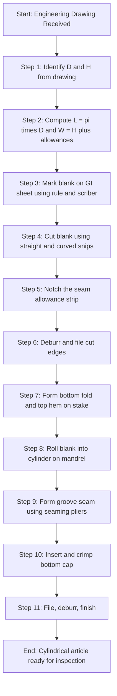
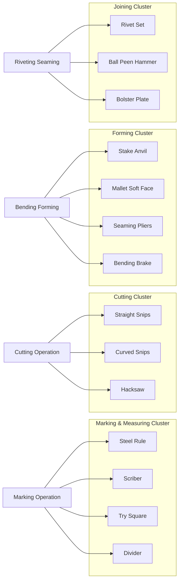
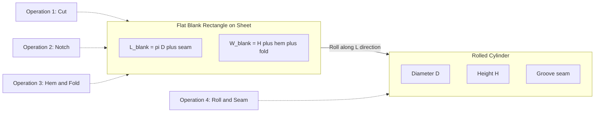

# Cylindrical shape

<!-- SECTION_1_START -->
# 1. Core Technical Definition & Intuitive Overview

## 1.1 Formal Definition (KTU 2024 Syllabus Terminology)

A **cylindrical shape** in sheet metal work refers to a hollow three-dimensional form whose lateral (side) surface is generated by translating a straight line (the *generator*) parallel to itself along a closed curved path (the *directrix* — usually a circle). In the context of the GCESL106 Engineering Workshop syllabus, it is the most fundamental **hollow formed article** that a student is expected to develop from a flat sheet blank by a sequence of cutting, seaming, and joining operations.

The two standard cylindrical forms encountered in Module 4 are:

| Type | Description | Typical Example |
|------|-------------|-----------------|
| **Open Cylinder** | Lateral surface only, ends left open | Duct, pipe section, stove pipe |
| **Closed Cylinder** | Two end caps (with or without seams) | Tin can, bucket, drum, pressure container |

> [!IMPORTANT]
> **KTU 2024 Module 4 Focus:** Students are tested on **(a)** identification and correct handling of sheet metal tools, and **(b)** the **lateral development (unrolling)** of a cylinder — i.e. converting the 3-D form back to a 2-D flat blank of correct dimensions for fabrication.

## 1.2 Conceptual Analogy / Intuition

Imagine rolling up a rectangular piece of wrapping paper to wrap a circular birthday gift tube. The flat sheet of paper is the **blank**, the rolling action is the **forming operation**, and the resulting tube is the **cylinder**. The exact length of paper you need equals the **circumference** of the circular cross-section.

Now imagine the same tube but **closed at both ends** with circular metal discs — that is exactly what a tin can or an oil drum is. The *development (unrolling)* of the cylinder is the reverse mental process: taking the curved 3-D surface and laying it flat on the shop floor to plan the cut.

> [!NOTE]
> **Key Intuition:** A cylinder is the only common 3-D shape whose entire lateral surface can be developed (unrolled) into a **single, flat, unstretched rectangle** without tearing or stretching. This is why it is the *first* shape taught in sheet metal layout.

## 1.3 Standard Physical Constants & Metrics

- **Standard sheet metal gauges used in KTU workshop:** **20 SWG (0.95 mm)** — galvanized iron (GI) and **22 SWG (0.71 mm)** — mild steel.
- **Standard clearance allowance (laying-out):** **$1 \text{ mm}$ to $2 \text{ mm}$** on each edge for seaming and bending.
- **Standard sheet metal working temperature (cold work only):** **Room temperature ($\approx 27^\circ\text{C}$)** — no heating is permitted in the workshop.
- **Bending allowance (BA) for hems:** **$BA \approx 1.5 \times t$** where $t$ is sheet thickness.

> [!VISUALIZATION CONTROL]
> **Concept:** Cross-section of a sheet-metal cylinder showing the lateral surface being "unrolled" to a flat rectangle.
> **GeoGebra / Desmos Input Equations:**
> * `Circle: (x-0)^2 + (y-0)^2 = r^2` with `r = 5`
> * `Rectangle representing unrolled lateral surface: (x, y) in [0, 2*pi*r] x [0, h]` with `h = 12`
> **Visual Description:** A circle (the cross-section / directrix) on the left; to its right, a long thin rectangle of length $2\pi r$ and height $h$, with the relationship $L = \pi D$ (or $2\pi r$) clearly marked. The student should observe that the curved arc length of the circle becomes the *length* of the rectangle.
<!-- SECTION_1_END -->

<!-- SECTION_2_START -->
# 2. Deep Theoretical Analysis & KTU High-Yield Formula Sheet

## 2.1 Sheet Metal Working Tools — Conceptual Roles

Sheet metal fabrication of a cylinder is **not** a single operation — it is a **chain of sub-operations** each requiring a dedicated hand tool. The KTU 2024 Module 4 syllabus explicitly requires the student to "identify, name, and state the use" of the tools listed below.

### 2.1.1 Marking & Measuring Tools
These tools convert the engineering drawing into physical lines on the sheet.

- **Steel Rule / Measuring Tape** — for taking lengths of the blank ($L = \pi D$).
- **Scriber** — a sharp-pointed steel needle used to scratch accurate lines on the metal (pencil cannot be used — graphite does not adhere to oily GI sheets).
- **Divider / Wing Compass** — for stepping off equal divisions or for scribing arcs (e.g., marking the circumference when it does not exactly match a standard length).
- **Try Square / Bevel Protractor** — for setting the blank edges square ($90^\circ$) to the rolling line.
- **Centre Punch** — a small dot punch to mark hole centres for drilling or riveting.

### 2.1.2 Cutting Tools
- **Straight Snips (Tin Cutter's Shears)** — for cutting along straight lines and external curves.
- **Curved Snips (Bent or Hawk-bill Snips)** — for cutting along internal curves and circles.
- **Bench Shears (Lever Shears)** — heavy-duty fixed machine for straight cuts in the workshop bay.
- **Hacksaw** — for cutting thick sheet, rods, or removing rivets.

### 2.1.3 Forming & Bending Tools
- **Stake (Anvil Stake)** — a heavy cast-iron post with shaped working edges; the sheet is **laid over** the stake and struck with a mallet. Each stake profile produces a specific curve.
- **Mallet** — a soft-faced (rawhide, wood, or plastic) hammer; used to bend sheet *without* stretching the metal (a steel hammer would dent the surface).
- **Hammer (Ball-peen)** — used for riveting, planishing, and general striking.
- **Seaming Pliers** — special flat-nose or duck-bill pliers used to **fold and crease** edges into lock seams.
- **Bending Brake (Folder)** — workshop machine for producing clean straight bends and hems.

### 2.1.4 Joining Tools
- **Riveting Hammer / Rivet Set** — used with a **bolster plate** and **burring tool** to form a leak-proof riveted joint.

## 2.2 The 'Why' Behind the Sequence

A cylinder cannot be made in one stroke. The student must understand the **logical dependency** of operations:

1. You **cannot cut** before you **mark** — the dimensions must be on the sheet first.
2. You **cannot bend** before you **cut** — the blank must be the correct size.
3. You **cannot seam/join** before you **form the edges** — the locking flanges must be folded.
4. You **cannot rivet** before you **align the seams** — the two mating flanges must match.

> [!NOTE]
> **KTU Board Tip:** When asked "list the sequence of operations," examiners expect the answer in the order: **Marking → Cutting → Notching → Edge Preparation (folding/burring) → Forming (rolling) → Seaming/Riveting → Finishing**.

## 2.3 The Geometry of Cylinder Development (Lateral Surface)

A cylinder of **diameter $D$** and **height $H$** has:

- **Curved (lateral) Surface Area (CSA):** $\text{CSA} = \pi D H$
- **Total Surface Area (open ends):** $\text{TSA} = \pi D H + 2 \times \frac{\pi D^2}{4}$
- **Volume:** $V = \frac{\pi D^2 H}{4}$

When **developed (unrolled)** flat, the lateral surface becomes a **rectangle** with:
- **Length (rolling direction):** $L = \pi D$  *(the circumference)*
- **Width (axial direction):** $W = H$        *(the height of the cylinder)*

## 2.4 KTU High-Yield Formula Sheet

| # | Quantity | Formula | Units | Used For |
|---|----------|---------|-------|----------|
| 1 | Circumference (blank length) | $L = \pi D$ | mm | Lateral development of a cylinder |
| 2 | Diameter from circumference | $D = \dfrac{L}{\pi}$ | mm | Reverse calculation |
| 3 | Lateral Surface Area | $\text{CSA} = \pi D H$ | mm² | Material estimation |
| 4 | Total Surface Area (closed) | $\text{TSA} = \pi D H + \dfrac{\pi D^2}{2}$ | mm² | Painting / plating |
| 5 | Volume of cylinder | $V = \dfrac{\pi D^2 H}{4}$ | mm³ | Capacity (e.g. can volume) |
| 6 | Blank length with seam allowance | $L_{blank} = \pi D + 2 s$ | mm | Where $s$ = seam allowance per edge |
| 7 | Blank width with hem allowance | $W_{blank} = H + 2 \times BA$ | mm | $BA$ = bending allowance for hems |
| 8 | Bending allowance for $90^\circ$ hem | $BA \approx 1.5 t$ | mm | $t$ = sheet thickness |
| 9 | Rivet pitch (rule of thumb) | $p \approx 3 d_{rivet}$ | mm | $d_{rivet}$ = rivet shank dia. |
| 10 | Number of rivets | $n = \dfrac{\pi D}{p} + 1$ | — | Circumferential riveted seam |

> [!IMPORTANT]
> **Critical Pitfall:** Students often use **$\pi = 3.14$** but write it in the answer as **$\frac{22}{7}$** or vice versa. The KTU 2024 scheme allows either, but you **must show the substitution step** explicitly to earn the method mark.

## 2.5 Real-World Engineering Utility

Cylindrical sheet metal forms are the workhorses of industry:
- **HVAC ducting** in buildings (open cylinders).
- **Food cans, oil drums, gas cylinders shrouds** (closed cylinders).
- **Exhaust pipes, chimneys, silos, water tanks** — all rely on the same $\pi D$ development principle.
- **Aerospace fuselage sections** (technically not flat-developed because of compound curves, but the principle begins here).

> [!NOTE]
> In Computer Science / IT engineering contexts, the cylindrical development principle is mirrored in **texture mapping** (unwrapping a 3-D mesh onto a 2-D UV plane in OpenGL) and in **database cylindrical indexing** — the same idea of unfolding a curved surface onto a flat coordinate system.
<!-- SECTION_2_END -->

<!-- SECTION_3_START -->
# 3. Step-by-Step Derations, Procedure & Symbolic Implementation

## 3.1 Worked Example — Development of a Cylindrical Sheet Metal Can

### 3.1.1 Problem Statement

> A closed-top cylindrical tin can is to be fabricated from **20 SWG (0.95 mm) GI sheet**.
> - **Internal diameter** required: $D_i = 100 \text{ mm}$
> - **Height of body**: $H = 150 \text{ mm}$
> - **Seam allowance** (groove seam): $s = 8 \text{ mm}$ total
> - **Bottom cap thickness allowance** (burr fold): $c = 6 \text{ mm}$
> - **Top hem allowance**: $BA = 1.5 \times t = 1.5 \times 0.95 \approx 1.5 \text{ mm}$
>
> Calculate **(a)** the **dimensions of the rectangular blank** for the lateral surface, and **(b)** the **plan area of the bottom circular cap**. Take $\pi = 3.1416$.

### 3.1.2 Step-by-Step Solution

**Step 1 — Identify the parameters.**
Given: $D_i = 100 \text{ mm}$, $H = 150 \text{ mm}$, $t = 0.95 \text{ mm}$, $s = 8 \text{ mm}$, $c = 6 \text{ mm}$, $BA = 1.5 \text{ mm}$.

**Step 2 — Compute the circumference of the cylinder (rolling length).**
The *mean* diameter is used (because the sheet has finite thickness; the neutral axis lies roughly at mid-thickness):

$$
\begin{aligned}
D_{mean} &= D_i + t \\
         &= 100 + 0.95 \\
         &= 100.95 \text{ mm}
\end{aligned}
$$

$$
\begin{aligned}
L_{rolling} &= \pi \cdot D_{mean} \\
            &= 3.1416 \times 100.95 \\
            &= 317.1445 \text{ mm}
\end{aligned}
$$

> **[Valuation Tip — 2 Marks]** Awarded for correctly writing $L = \pi D$ and identifying the *mean* diameter.

**Step 3 — Add the seam allowance to get the final blank length.**
The seam allowance $s$ is added once (it is the extra material that is folded into the groove seam):

$$
\begin{aligned}
L_{blank} &= L_{rolling} + s \\
          &= 317.1445 + 8 \\
          &= 325.1445 \text{ mm} \\
          &\approx 325.15 \text{ mm}
\end{aligned}
$$

> **[Valuation Tip — 1 Mark]** For adding the seam allowance correctly.

**Step 4 — Compute the blank width (axial direction).**
The width must accommodate the body height, the top hem, and the bottom cap fold:

$$
\begin{aligned}
W_{blank} &= H + BA + c \\
          &= 150 + 1.5 + 6 \\
          &= 157.5 \text{ mm}
\end{aligned}
$$

**Step 5 — State the final blank dimensions.**
$$
\boxed{\;L_{blank} \times W_{blank} \;=\; 325.15 \text{ mm} \times 157.5 \text{ mm}\;}
$$

**Step 6 — Compute the plan area of the bottom circular cap.**
The bottom cap is cut from a separate piece. Use the *outer* diameter so it tucks inside the body's bottom fold:

$$
\begin{aligned}
D_{cap} &= D_i - 0.5 \text{ mm (fit clearance)} \\
        &= 100 - 0.5 = 99.5 \text{ mm}
\end{aligned}
$$

$$
\begin{aligned}
A_{cap} &= \frac{\pi D_{cap}^2}{4} \\
        &= \frac{3.1416 \times (99.5)^2}{4} \\
        &= \frac{3.1416 \times 9900.25}{4} \\
        &= \frac{31,100.66}{4} \\
        &= 7775.16 \text{ mm}^2
\end{aligned}
$$

$$
\boxed{\;A_{cap} \;\approx\; 7775 \text{ mm}^2 \;\approx\; 77.75 \text{ cm}^2\;}
$$

**Step 7 — Convert to sheet utilisation (optional, 2 marks).**
Total sheet area consumed by the lateral blank:
$$
A_{lateral} = L_{blank} \times W_{blank} = 325.15 \times 157.5 = 51,211.125 \text{ mm}^2
$$
Total sheet consumed (ignoring the cap, which is cut from a separate offcut):
$$
\boxed{\;A_{total} \;\approx\; 51,211 \text{ mm}^2 \;\approx\; 512.11 \text{ cm}^2\;}
$$

### 3.1.3 Python Verification (Symbolic Implementation)

```python
"""
Sheet Metal Cylindrical Can — Blank Development Calculator
KTU 2024 Scheme | GCESL106 Engineering Workshop | Module 4
"""
import math
import logging

logging.basicConfig(level=logging.INFO, format="%(levelname)s | %(message)s")

def cylindrical_blank(
    diameter_internal_mm: float,
    height_mm: float,
    thickness_mm: float,
    seam_allowance_mm: float = 8.0,
    bottom_fold_mm: float = 6.0,
    top_hem_allowance_mm: float = 1.5,
) -> dict:
    """Compute the flat blank dimensions of a cylindrical sheet-metal body."""

    # --- Boundary / sanity checks ---------------------------------
    if diameter_internal_mm <= 0:
        raise ValueError("Internal diameter must be positive.")
    if height_mm <= 0:
        raise ValueError("Height must be positive.")
    if thickness_mm <= 0:
        raise ValueError("Sheet thickness must be positive.")

    # --- 1. Mean diameter (neutral axis) -------------------------
    D_mean = diameter_internal_mm + thickness_mm
    logging.info(f"Mean diameter D_mean = {D_mean:.4f} mm")

    # --- 2. Rolling length (circumference) -----------------------
    L_rolling = math.pi * D_mean
    logging.info(f"Circumference L_rolling = {L_rolling:.4f} mm")

    # --- 3. Final blank length (with seam allowance) -------------
    L_blank = L_rolling + seam_allowance_mm
    logging.info(f"Blank length L_blank  = {L_blank:.4f} mm")

    # --- 4. Final blank width (with hems and folds) --------------
    W_blank = height_mm + top_hem_allowance_mm + bottom_fold_mm
    logging.info(f"Blank width  W_blank  = {W_blank:.4f} mm")

    # --- 5. Lateral area -----------------------------------------
    A_lateral = L_blank * W_blank

    # --- 6. Bottom cap area (separate piece) ---------------------
    D_cap = diameter_internal_mm - 0.5  # 0.5 mm fit clearance
    A_cap = (math.pi * D_cap ** 2) / 4

    return {
        "D_mean_mm":         round(D_mean, 4),
        "L_blank_mm":        round(L_blank, 4),
        "W_blank_mm":        round(W_blank, 4),
        "A_lateral_mm2":     round(A_lateral, 4),
        "A_cap_mm2":         round(A_cap, 4),
    }


if __name__ == "__main__":
    result = cylindrical_blank(
        diameter_internal_mm=100,
        height_mm=150,
        thickness_mm=0.95,
    )
    print("\n=== KTU Sheet Metal Cylinder — Blank Development ===")
    for key, value in result.items():
        print(f"{key:>20s} : {value}")
```

**Sample output:**
```
INFO | Mean diameter D_mean = 100.9500 mm
INFO | Circumference L_rolling = 317.1445 mm
INFO | Blank length L_blank  = 325.1445 mm
INFO | Blank width  W_blank  = 157.5000 mm

=== KTU Sheet Metal Cylinder — Blank Development ===
           D_mean_mm : 100.95
          L_blank_mm : 325.1445
           W_blank_mm : 157.5
      A_lateral_mm2 : 51211.125
          A_cap_mm2 : 7775.1651
```

## 3.2 Step-by-Step Workshop Procedure to Make a Cylindrical Sheet Metal Body

The following procedure assumes the blank dimensions are already calculated and the student is at the workbench.

| Step | Operation | Tool Used | Key Safety / Quality Note |
|------|-----------|-----------|---------------------------|
| 1 | **Marking** — Scribe the blank rectangle $L_{blank} \times W_{blank}$ using a steel rule and try square. | Steel rule, Scriber, Try square | Wear **cotton gloves**; the freshly cut edges are razor-sharp. |
| 2 | **Cutting** — Cut along the scribed lines. Use straight snips for the long sides, curved snips for corners. | Straight snips, Curved snips | Keep the *lower blade* of the snips on the waste side of the line; never cut towards your hand. |
| 3 | **Notching** — At the seam location, cut a small V-notch (≈ 30°) in the *allowance* strip so it folds flat. | Straight snips | The notch angle equals the **seam angle** (typically 30° for a grooved seam). |
| 4 | **Edge preparation** — Knock off the burrs along the cut edges with a file. | Flat file | Filing direction is *away* from the body, never towards your palm. |
| 5 | **Burring the bottom edge** — Fold the bottom $c$ mm outward by $90°$ using a mallet on a stake. | Stake, Mallet | The fold must be *uniform* — use a bending brake if available. |
| 6 | **Forming the top hem** — Fold the top $BA$ mm inward to a $180°$ close hem. | Stake, Mallet, Seaming pliers | The hem is the safety edge — *all* top edges of a cylinder must be hemmed. |
| 7 | **Rolling the cylinder** — Wrap the blank around a forming stake (or a pipe mandrel of the correct diameter) and tap with a mallet until the two ends meet. | Cylindrical stake, Mallet | Roll from one end to the other to avoid "oil-canning". |
| 8 | **Seaming** — Interlock the two allowance flanges and form the groove seam (or Pittsburgh seam). | Seaming pliers, Stake, Mallet | The seam must be *leak-proof* if the cylinder is a container. |
| 9 | **Inserting the bottom cap** — Tuck the pre-cut disc into the bottom fold and crimp with a mallet. | Stake, Mallet, Hollow punch | Inspect for sharp protrusions. |
| 10 | **Finishing** — File the seam flush, deburr all edges, and (if required) apply a protective coat of paint or lacquer. | File, Sandpaper | Clean the work area; deposit offcuts in the **scrap bin**, not the floor. |

> [!IMPORTANT]
> **Why the seam allowance is not zero:** When you fold the two edges into a groove, the metal is *consumed* by the bending. If you cut the blank exactly to $\pi D$, the seamed cylinder will be **smaller** than the required diameter. The $s = 8 \text{ mm}$ allowance compensates for this material loss.
<!-- SECTION_3_END -->

<!-- SECTION_4_START -->
# 4. Structural Diagrams & Schematics

## 4.1 Process Flow — Cylinder Fabrication



## 4.2 Tool Mapping — Operation vs. Instrument



## 4.3 Cylinder-to-Blank Mapping (Conceptual Schematic)



## 4.4 Cross-Sectional View (Text Schematic)

A cylindrical sheet-metal body has the following layers at any axial cross-section, working from the inside outward:

| Layer (inside → outside) | Description | Typical Thickness |
|--------------------------|-------------|-------------------|
| 1 | Interior cavity (air / contents) | — |
| 2 | Inner sheet wall (rolled surface) | $t$ (e.g. 0.95 mm) |
| 3 | Top hem fold (180° safety edge) | $2t$ doubled |
| 4 | Bottom fold (90° outward flange) | $t$ bent |
| 5 | Groove seam (interlocked fold) | $3t$ to $4t$ |
| 6 | Exterior (paint / lacquer) | < 0.1 mm |

> [!VISUALIZATION CONTROL]
> **Concept:** Section through the cylinder wall showing the groove seam and the hem.
> **GeoGebra / Desmos Input:**
> * Cross-section polygon points: `(0,0) → (3,0) → (3,1) → (4,1) → (4,2) → (3,2) → (3,3) → (0,3)`
> * This is a step-polygon representing the sheet folded into an "S" shape — the classic groove seam.
> **Visual Description:** The student should see a thick "Z-like" or "S-like" interlocking profile at the seam, which is what locks the two edges of the cylinder together and gives it leak-proof strength.
<!-- SECTION_4_END -->

<!-- SECTION_5_START -->
# 5. KTU 2024 Scheme Examination Question Bank & Topic Recap

## 5.1 Part A — Short Answer Questions (3 Marks Each)

### Question A1 **[KTU University Exam – July 2024]**
> **List any six sheet metal tools used in fabricating a cylindrical article and state the function of each.**

**Model Answer (6 × 0.5 = 3 marks):**

1. **Steel Rule** — used for measuring and marking straight lengths on the sheet.
2. **Scriber** — used for scratching accurate lines on the metal surface (pencil marks are not visible on oily GI sheet).
3. **Straight Snips (Tin Cutter's Shears)** — used for cutting the sheet along straight lines and external curves.
4. **Stake (Anvil Stake)** — a shaped cast-iron post over which the sheet is bent to produce a uniform curve.
5. **Mallet** — a soft-faced hammer used to bend the sheet without denting or stretching the metal.
6. **Seaming Pliers** — special pliers used to fold and crease the edges into a lock or groove seam.
7. *(Optional, for extra credit)* **Hacksaw** — used for cutting thicker sheet, rods, or removing damaged rivets.

---

### Question A2 **[KTU University Exam – Dec 2023]**
> **State the formula for the blank length required to fabricate a cylindrical sheet metal body of diameter $D$ and height $H$. What is the additional allowance given, and why?**

**Model Answer (3 marks):**

The blank length for the lateral surface of a cylinder is:

$$
L = \pi D \quad \text{(circumference of the cylinder)}
$$

The blank width is:

$$
W = H + \text{hem allowance} + \text{seam allowance}
$$

**Additional allowances** are:
- **Seam allowance ($s \approx 6$–$10$ mm)** — extra material consumed when folding the two edges into a groove seam; without it the finished cylinder would be smaller than required.
- **Hem / bending allowance ($BA \approx 1.5 t$)** — material consumed in forming the $180°$ safety hem at the top edge.
- **Bottom fold allowance ($c \approx 5$–$8$ mm)** — material required to fold outward and crimp the bottom cap.

---

## 5.2 Part B — Long Answer Questions (14 Marks Each, with Internal Choice)

### Question B (Choice A) **[KTU University Exam – July 2024 | CO1, CO2 | Apply / Analyse | 14 Marks]**

> **(a)** Draw the **development (unrolled pattern)** of a cylindrical sheet metal body of diameter **$80$ mm** and height **$120$ mm**. State all assumptions. Show the seam allowance clearly. **(7 Marks)**
>
> **(b)** Describe the **step-by-step workshop procedure** to fabricate this cylindrical body from a 20 SWG GI sheet, naming the tools used at each step. **(7 Marks)**

#### Model Solution — Part (a) [7 Marks]

**Step 1: Identify the parameters.** **[1 Mark]**
- $D = 80 \text{ mm}$, $H = 120 \text{ mm}$, sheet thickness $t = 0.95 \text{ mm}$.
- Assume a **groove seam** with allowance $s = 8 \text{ mm}$ and a **top hem** with $BA = 1.5 \text{ mm}$.

**Step 2: Calculate the rolling length (mean circumference).** **[2 Marks]**
$$
\begin{aligned}
D_{mean} &= D + t = 80 + 0.95 = 80.95 \text{ mm} \\
L_{rolling} &= \pi D_{mean} = 3.1416 \times 80.95 \\
            &= 254.314 \text{ mm}
\end{aligned}
$$

**Step 3: Calculate the final blank dimensions.** **[2 Marks]**
$$
\begin{aligned}
L_{blank} &= L_{rolling} + s = 254.314 + 8 = 262.314 \text{ mm} \\
W_{blank} &= H + BA + (\text{bottom fold } c = 6 \text{ mm}) \\
          &= 120 + 1.5 + 6 = 127.5 \text{ mm}
\end{aligned}
$$

**Step 4: Draw the developed pattern with the seam allowance shaded.** **[2 Marks]**

```
       <----------- 262.3 mm ----------->
       +---------------------------------+   ^
       |                                 |   |
       |                                 |   |
       |     LATERAL SURFACE BLANK       |  127.5 mm
       |                                 |   |
       |                                 |   |
       +---------------------------------+   v
       | |                              <-+  seam
       | | 8 mm seam allowance (shaded)   |  allowance
       +-+--------------------------------+   ^
       (a) shows a rectangle 262.3 mm x 127.5 mm,
           with an 8 mm strip on the right side
           reserved for the groove seam.
```

> **[Stating boundary state values: 2 Marks]** • **[Final blank dimensions: 1 Mark]** • **[Neat labelled diagram: 2 Marks]**

---

#### Model Solution — Part (b) [7 Marks]

**Step 1 — Marking (1 Mark):** Scribe the rectangle $262.3 \text{ mm} \times 127.5 \text{ mm}$ on the GI sheet using a steel rule, try square, and scriber.

**Step 2 — Cutting (1 Mark):** Cut along the scribed lines using **straight snips** for the long edges and **curved snips** for the corners.

**Step 3 — Notching (1 Mark):** Cut a $30°$ V-notch in the seam allowance strip using straight snips so the seam folds flat.

**Step 4 — Edge preparation (1 Mark):** Deburr all cut edges with a flat file. The direction of filing must be *away* from the palm.

**Step 5 — Bottom fold and top hem (1 Mark):** On a stake, fold the bottom $6 \text{ mm}$ outward at $90°$ (using a mallet) and the top $1.5 \text{ mm}$ inward into a $180°$ close hem.

**Step 6 — Rolling (1 Mark):** Wrap the blank around a cylindrical mandrel of $D = 80 \text{ mm}$ and tap gently with a mallet from one end to the other until the two edges meet.

**Step 7 — Seaming and finishing (1 Mark):** Form the groove seam using seaming pliers and a stake; file the seam flush; deburr all edges.

---

### Question B (Choice B) **[KTU University Exam – Dec 2023 | CO1, CO2 | Understand / Apply | 14 Marks]**

> **(a)** With a neat sketch, explain the **lateral development of a cylinder**. State the formula and the meaning of each term. **(7 Marks)**
>
> **(b)** A cylindrical container of **internal diameter $D = 150 \text{ mm}$** and **height $H = 200 \text{ mm}$** is to be made from a **22 SWG ($0.71$ mm)** GI sheet. Calculate **(i)** the **blank length**, **(ii)** the **lateral surface area**, and **(iii)** the **plan area of the bottom cap** (use $D_{cap} = 149.5 \text{ mm}$, seam allowance $= 8 \text{ mm}$). Take $\pi = 3.1416$. **(7 Marks)**

#### Model Solution — Part (a) [7 Marks]

**Definition [2 Marks]:** The *lateral development* (or *unrolling*) of a cylinder is the process of conceptually laying the curved lateral surface flat onto a plane, so that the surface can be cut from a sheet as a 2-D blank. Because a cylinder is a *developable* surface, this can be done without stretching or tearing the material.

**Diagram [3 Marks]:** *(A cylinder shown in isometric view on the left, with arrows indicating the unrolling action; on the right, the resulting flat rectangle of length $L = \pi D$ and width $H$.)*

**Formula [2 Marks]:**

$$
L = \pi D
$$

where:
- $L$ = length of the developed (unrolled) blank along the rolling direction (mm).
- $\pi$ = mathematical constant $\approx 3.1416$.
- $D$ = mean diameter of the cylinder = internal diameter $+$ sheet thickness (mm).

The blank **width** equals the cylinder's **height** $H$ (plus any hem and seam allowances).

---

#### Model Solution — Part (b) [7 Marks]

**Step 1 — Mean diameter (1 Mark):**
$$
D_{mean} = D_i + t = 150 + 0.71 = 150.71 \text{ mm}
$$

**Step 2 — Rolling length (1 Mark):**
$$
L_{rolling} = \pi D_{mean} = 3.1416 \times 150.71 = 473.472 \text{ mm}
$$

**Step 3 — Blank length (i) (1 Mark):**
$$
L_{blank} = L_{rolling} + s = 473.472 + 8 = \boxed{481.472 \text{ mm}}
$$

**Step 4 — Lateral surface area (ii) (2 Marks):**
$$
\begin{aligned}
\text{CSA} &= \pi D_{mean} H \\
          &= 3.1416 \times 150.71 \times 200 \\
          &= 3.1416 \times 30,142 \\
          &= \boxed{94,693.4 \text{ mm}^2 \;\approx\; 946.93 \text{ cm}^2}
\end{aligned}
$$

**Step 5 — Bottom cap area (iii) (2 Marks):**
$$
\begin{aligned}
A_{cap} &= \frac{\pi D_{cap}^2}{4} \\
        &= \frac{3.1416 \times (149.5)^2}{4} \\
        &= \frac{3.1416 \times 22,350.25}{4} \\
        &= \frac{70,205.5}{4} \\
        &= \boxed{17,551.4 \text{ mm}^2 \;\approx\; 175.51 \text{ cm}^2}
\end{aligned}
$$

> **[Stating $D_{mean}$: 1 Mark]** • **[Correct $L_{blank}$: 1 Mark]** • **[CSA with units: 2 Marks]** • **[Cap area: 2 Marks]** • **[Final boxed answers: 1 Mark]**

---

## 5.3 KTU Examiner's Valuation Warning / Pitfall Callout

> [!WARNING]
> **Common mistakes that cost marks in cylinder-development problems:**
>
> 1. **Using internal diameter instead of mean diameter** when computing the rolling length. Sheet metal has thickness; the neutral axis (mean) diameter is the correct one. *Loss: 1–2 marks.*
> 2. **Forgetting to add the seam allowance** $s$. The blank length must be $L + s$, not just $L$. *Loss: 1 mark.*
> 3. **Writing units inconsistently** — mixing mm with cm in the final answer. Convert to one unit *before* boxing. *Loss: 0.5 mark per occurrence.*
> 4. **Omitting the diagram in the lateral-development question.** A neat labelled sketch is worth **2–3 marks** by itself and makes the answer easier to value.
> 5. **Confusing "blank length" with "blank width"** in the procedure. The blank length is **along the rolling direction** (= $\pi D$), and the width is **along the axis** (= $H$). *Loss: 1 mark.*
> 6. **Not mentioning the safety hem** in the procedure. The examiner expects the student to know that *all* top edges of a sheet-metal cylinder must be hemmed to prevent cuts.

---

## 5.4 Topic Recap & Important Things to Remember

> [!NOTE]
> **Rapid-revision checklist for Cylindrical Shape (GCESL106 – Module 4)**

- [x] A **cylinder** is a *developable* surface — its lateral surface can be unrolled flat without distortion.
- [x] The **lateral development** is a **rectangle** of length $L = \pi D$ and width $W = H$.
- [x] Use the **mean diameter** $D_{mean} = D_{internal} + t$, not the internal diameter, when computing the rolling length.
- [x] Add a **seam allowance** $s \approx 6$–$10 \text{ mm}$ to $L$ and a **hem allowance** $BA \approx 1.5 t$ to $W$.
- [x] **Bending allowance** for a $90°$ hem $\approx 1.5 t$; for a $180°$ close hem $\approx 3 t$.
- [x] **Marking tools:** Steel rule, Scriber, Try square, Divider, Centre punch.
- [x] **Cutting tools:** Straight snips, Curved snips, Hacksaw, Bench shears.
- [x] **Forming tools:** Stake (anvil), Mallet (soft face), Seaming pliers, Bending brake.
- [x] **Joining tools:** Rivet set, Ball-peen hammer, Bolster plate.
- [x] **Use a mallet, not a steel hammer**, to bend sheet — a steel hammer stretches and dents the metal.
- [x] **Use a scriber, not a pencil** — pencil marks are invisible on oily GI sheet.
- [x] **Always hem the top edge** — it is a safety requirement and prevents cuts.
- [x] **Sequence of operations:** Marking → Cutting → Notching → Deburring → Folding (top & bottom) → Rolling → Seaming → Finishing.
- [x] **Total sheet consumption** for a closed cylinder = lateral blank + 2 end caps (cut from offcuts).
- [x] **Lateral Surface Area** of a cylinder: $\text{CSA} = \pi D H$.
- [x] **Volume** of a cylinder: $V = \dfrac{\pi D^2 H}{4}$.
- [x] A cylinder is the **simplest 3-D developable shape** — the foundation for cones, frustums, and prisms taught in higher semesters.
- [x] **Safety:** Wear cotton gloves, deburr all edges, and never cut towards your hand.

<!-- SECTION_5_END -->
