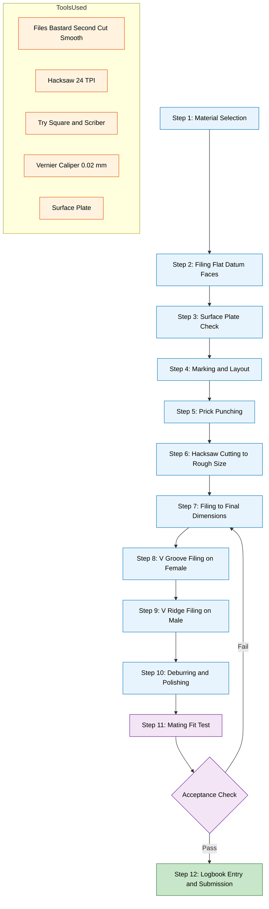
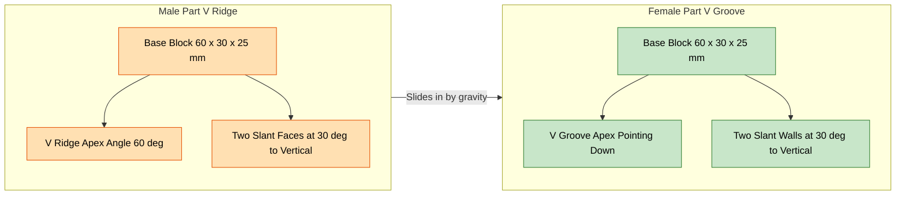
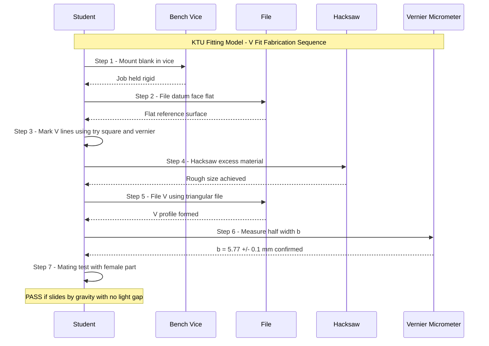
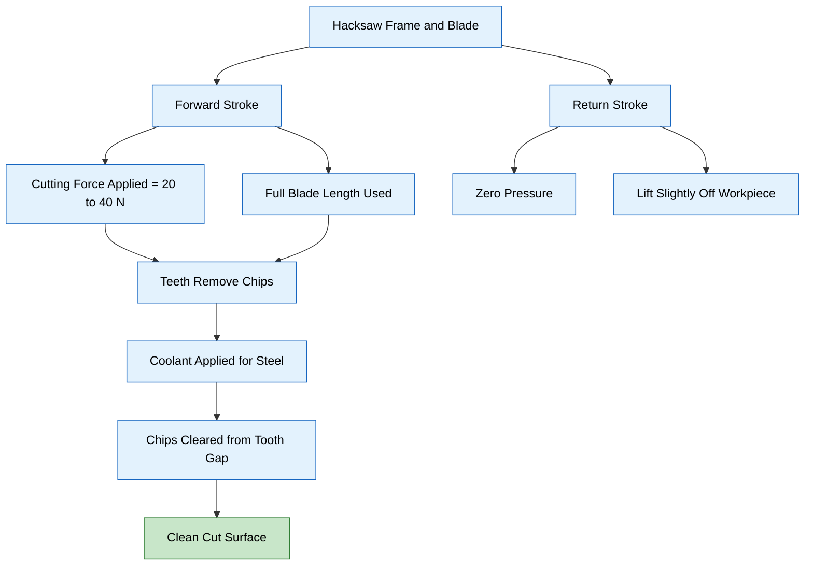

# Fitting: Understanding the tools used for fitting and knowledge of at least one model

<!-- SECTION_1_START -->
# MODULE 5: FITTING — TOOLS, OPERATIONS & PRACTICAL MODELS

## 1.1 Core Technical Definition

> [!NOTE]
> **Fitting (KTU 2024 Workshop Definition):** Fitting is a secondary manufacturing/finishing process in which a metal workpiece is shaped, sized, and finished to precise dimensional tolerances using hand tools, primarily **files**, **chisels**, **hacksaws**, and **measuring/marking instruments**, while the job is rigidly held in a **bench vice**. The aim is to produce parts that assemble accurately with mating components, as practiced in tool rooms, machine maintenance bays, and prototype workshops.

In the context of the **APJ AKTU 2024 Scheme (NEP 2020 aligned)** Engineering Workshop syllabus, Module 5 specifically trains the student to **identify**, **handle**, and **safely operate** the standard hand tools used in fitting, and to fabricate **at least one model** (commonly a **V-Fit**, **Square Fit**, or **Step Fit** male–female joint) that demonstrates filing, marking, sawing, chiseling, and assembly skills.

> [!IMPORTANT]
> **Syllabus Highlight (GCESL106 – Module 5):**
> * Identification, description, and safe use of fitting hand tools.
> * Understanding of marking, holding, sawing, filing, chiseling, drilling, and tapping.
> * **Mandatory outcome:** Hands-on fabrication of **at least one fitting model** to specified dimensions, recorded in the workshop logbook with a neat **orthographic/sketched drawing** of the model.

---

## 1.2 Conceptual Analogy / Intuition

Imagine you are a **carpenter shaping two wooden blocks so that they slide together perfectly without gaps** — not by power tools, but by controlled hand strokes on a rasp. **Fitting is the metalworker's version of this art.** Every stroke of the file removes a microscopic ribbon of metal (typically **0.01 mm – 0.05 mm** per pass), gradually bringing the workpiece to the exact size and surface finish demanded by a mating part.

Think of the **bench vice as the carpenter's vice** (holding the job steady), the **file as the rasp**, the **hacksaw as the hand-saw**, and the **scriber + try square as the pencil + set-square**. The "model" you produce — say, a **V-Fit** — is the equivalent of a **dovetail joint**: it must be hand-crafted to a tolerance of **±0.1 mm** so the male and female parts slide and lock together cleanly.

> [!TIP]
> **Intuition Check:** If the female part is even **0.2 mm** undersize, the male part will wobble (clearance fit). If it is **0.1 mm** oversize, the male part will refuse to enter (interference fit). The fitter's skill lies in hitting the **±0.05 mm** "sweet spot" — a tolerance tighter than a human hair (~70 µm).

---

## 1.3 Standard Tools, Metrics & Safety Constants

> [!IMPORTANT]
> **Critical Engineering Constants & Standards (must memorize for ESE/Viva):**
> * **Standard file length (workshop):** **200 mm – 300 mm** (8" – 12").
> * **Hacksaw blade pitch:** **0.8 mm, 1.0 mm, 1.4 mm** (18, 24, 32 TPI — Teeth Per Inch).
> * **Bench vice jaw width:** **100 mm – 150 mm** standard.
> * **Try square blade length:** **100 mm – 300 mm**.
> * **Standard workshop accuracy target:** **±0.1 mm** for fitting models.
> * **Cutting speed (hacksaw hand stroke):** **40 – 60 strokes/min**.
> * **Personal Protective Equipment (PPE):** **Safety goggles, leather apron, closed-toe shoes** — **MANDATORY**.

---

> [!VISUALIZATION CONTROL]
> **Concept:** Orthographic projection of a typical **V-Fit** male–female fitting model.
> **Reference Planes:** $XY$ (reference line), $HP$ (Horizontal Plane — top view above $XY$), $VP$ (Vertical Plane — front view below $XY$).
> **Visual Description:** Front view shows a rectangular block (say, $60 \text{ mm} \times 30 \text{ mm} \times 25 \text{ mm}$) with a $45^{\circ}$ V-groove cut on top (depth = $10 \text{ mm}$). Top view shows the V as two lines meeting at the centre line. The female part is the inverted mirror (a $45^{\circ}$ V-ridge) that must mate with the V-groove.
> **Suggested Sketch Dimensions (for logbook):**
> * Male part: $L = 60 \text{ mm}$, $W = 30 \text{ mm}$, $H = 25 \text{ mm}$, V-angle $= 60^{\circ}$ included (i.e., $30^{\circ}$ each side from vertical).
> * Female part: same overall dimensions, V-ridge matching the male.

<!-- SECTION_1_END -->

<!-- SECTION_2_START -->
# 2. DEEP THEORETICAL ANALYSIS — TOOLS, OPERATIONS & FITTING MODEL THEORY

## 2.1 Classification of Fitting Tools

Fitting tools fall into **five functional categories**. Each category is essential — skipping any one will make the model impossible to fabricate.

### 2.1.1 Marking & Layout Tools

| Tool | Function | Key Operating Tip |
|------|----------|-------------------|
| **Scriber** (steel point, hardened tip) | Scribes fine, accurate lines on metal (visible after darkening with chalk/ink). | Hold like a pencil, **15°–20°** to surface; pull, never push. |
| **Try Square** (blade + stock at $90^{\circ}$) | Checks and lays out right angles; tests squareness of edges. | Always press the stock firmly against the **datum edge**. |
| **Divider / Spring Divider** | Transfers measurements, scribes arcs and circles. | Set using a steel rule; tighten with the wing nut. |
| **Vernier Caliper** ($0.02 \text{ mm}$ LCD or $0.02 \text{ mm}$ vernier) | Measures **Outside Dimension (OD)**, **Inside Dimension (ID)**, and **Depth** to **$0.02 \text{ mm}$** accuracy. | **Zero-error check** before every use. |
| **Steel Rule** ($150/300 \text{ mm}$) | Linear measurement; reference for dividers. | Read perpendicular to the scale — **avoid parallax**. |
| **Surface Gauge** | Transfers height measurements from a **surface plate** to the scribing point. | Scriber must be **parallel to the datum surface**. |
| **Punches (Centre, Dot, Prick)** | Creates small indentations at intersection of layout lines (prevents drill bit wandering). | Strike with a **ball-pein hammer**; the punch must be **vertical**. |

### 2.1.2 Holding Devices

| Tool | Function | Safety Note |
|------|----------|-------------|
| **Bench Vice** (fixed + movable jaw) | Rigidly holds the workpiece for sawing, filing, chiseling. | Job must be gripped **flush with jaw top** to prevent bending. |
| **V-Block** (with clamps) | Holds cylindrical jobs (shafts) parallel to the surface plate. | Always clamp with **step blocks + U-clamps**. |
| **Angle Plate** | Holds jobs at $90^{\circ}$ for marking/perpendicular work. | Mount on surface plate with bolts in slotted holes. |

### 2.1.3 Cutting & Material Removal Tools

* **Hacksaw Frame + Blade:** Cuts mild steel, aluminum, brass. Blade installed with teeth **pointing forward (away from the handle)**, tightened to prevent buckling. Use **24 TPI** for general steel ($>5 \text{ mm}$ thickness) and **32 TPI** for thin sheets.
* **Files (the heart of fitting):** Categorized by **shape** (flat, half-round, round, triangular, square, knife-edge, pillar, bastard, second-cut, smooth) and by **grade** (bastard = coarse, second-cut = medium, smooth = fine).
* **Chisels (Cold Chisel):** Used for **nicking** before sawing, removing bulk material, and cutting keyways. Common sizes: **$6 \text{ mm}$, $10 \text{ mm}$, $15 \text{ mm}$, $20 \text{ mm}$**.
* **Drill Bits + Hand Drill / Pillar Drill:** For making holes prior to tapping.
* **Tap & Die Set:** For cutting internal (tap) and external (die) threads — **M6, M8, M10** common workshop sizes.

### 2.1.4 Striking Tools

* **Ball-Pein Hammer** ($250 \text{ g}$ or $500 \text{ g}$): General striking of chisels, punches, and for general riveting. Pein is used for rivet forming and slight bending.
* **Mallet (wooden/rawhide):** Used on soft materials or where steel hammer would damage the tool (e.g., driving a wooden dowel).

### 2.1.5 Measuring & Testing Tools

* **Vernier Caliper** ($0.02 \text{ mm}$)
* **Micrometer (External)** ($0.01 \text{ mm}$): For precise thickness/shaft diameter measurement.
* **Surface Plate** (granite/cast iron, grade 2): The **datum reference** for all precision marking and testing flatness.
* **Feeler Gauge** ($0.05 \text{ mm} - 1.0 \text{ mm}$): Checks flatness/parallelism by light-gap method.
* **Radius Gauge (Fillet/Weld Gauge):** For checking internal/external radii.

---

## 2.2 The Six Sequential Operations in Any Fitting Model

Every fitting model — whether V-fit, square-fit, or step-fit — is fabricated by performing these **six operations in order**:

1. **Marking & Layout** — Apply chalk/ink, scribe lines using try square, divider, vernier; prick-punch at line intersections.
2. **Holding** — Grip in bench vice with the **marking face visible** and the cut line **just above** the jaw line.
3. **Sawing (Hacksaw Cutting)** — Use long, even strokes (full blade length), light pressure on forward stroke, **zero pressure on return stroke**. Apply cutting fluid (lubricating oil) for steel.
4. **Filing (Rough → Smooth → Dead-Smooth)** — Remove saw marks with a **bastard file**, refine with **second-cut**, finish with **smooth file**. Hold file by **handle + tang end** for control; use a **file card + chalk** to clean the teeth.
5. **Chiseling (optional — for slots/flat-bottom grooves)** — Hold chisel with one hand on handle, other hand guiding the blade; keep **cutting edge downward** at a steep angle ($\sim 30^{\circ}$); chip **away from the body**.
6. **Drilling & Tapping (for threaded models)** — Centre-drill first, then drill pilot, then tap with **M-tap set** (taper, plug, bottoming tap) using a **tap wrench**.

---

## 2.3 Common Fitting Models (KTU Mandate: At Least One)

The most frequently assessed models in KTU workshops are:

| Model | Difficulty | Key Skill Tested | Typical Drawing Sheet |
|-------|------------|------------------|----------------------|
| **V-Fit (60° V-groove + V-ridge)** | ★★☆☆☆ | Filing at $30^{\circ}$ angle, mating fit | 1 sheet — orthographic with section view |
| **Square Fit (Square Peg in Square Hole)** | ★★★☆☆ | Squareness, parallelism | 1 sheet — multi-view |
| **Half-Round Fit** | ★★★☆☆ | Convex-concave filing, radius matching | 1 sheet — full section + isometric |
| **Step Fit / L-Fit** | ★★☆☆☆ | Stepped surface, shoulder | 1 sheet — orthographic |
| **T-Fit (Tongue & Groove)** | ★★★★☆ | Shoulders, grooves | 2 sheets — male + female separately |

> [!TIP]
> **Recommended first model for KTU practical exam:** **V-Fit** — it teaches angle filing, mating fit, and is the easiest to inspect using a **$60^{\circ}$ protractor** and **feeler gauge** for fit quality.

---

## 2.4 Theory of the V-Fit Model (High-Yield for Theory Exam)

A V-Fit consists of:
* **Male part:** Rectangular block ($60 \times 30 \times 25 \text{ mm}$) with a **V-ridge** on top, included angle $\alpha = 60^{\circ}$ (i.e., $30^{\circ}$ on each side of vertical), depth $h = 10 \text{ mm}$.
* **Female part:** Identical block with a **matching V-groove**.

### Key Geometric Equations (memorize these for ESE)

$$
\text{Half-width of V at top} = h \cdot \tan\left(\frac{\alpha}{2}\right)
$$

$$
\Rightarrow b = h \cdot \tan\left(\frac{\alpha}{2}\right) = 10 \cdot \tan(30^{\circ})
$$

$$
\Rightarrow b = 10 \cdot \frac{1}{\sqrt{3}} = \frac{10}{\sqrt{3}} \approx 5.77 \text{ mm}
$$

So the **V-ridge apex** must be filed such that its **half-base** is exactly $\approx 5.77 \text{ mm}$ for a $10 \text{ mm}$ deep $60^{\circ}$ V.

> [!IMPORTANT]
> **Tolerance window for KTU V-Fit acceptance:** $\pm 0.1 \text{ mm}$ on the $5.77 \text{ mm}$ half-width. Mating must be achieved by **gravity** (slide the male into female; no force, no wobble).

---

## 2.5 KTU High-Yield Cheat Sheet

> [!NOTE]
> This cheat sheet covers the highest-frequency tool facts and formulas tested in **Part A (3-mark)** and **Part B (14-mark)** ESE questions.

| Parameter / Tool | Standard Value | Unit | Application |
|------------------|----------------|------|-------------|
| File length (workshop standard) | 200 – 300 | mm | Selection for hand filing |
| Hacksaw blade pitch (mild steel) | 1.0 (24 TPI) | mm | General cutting |
| Hacksaw blade pitch (thin sheet) | 0.8 (32 TPI) | mm | Sheet/pipe cutting |
| Bench vice jaw width | 100 – 150 | mm | Holding capacity |
| Vernier caliper least count | 0.02 | mm | OD/ID/Depth measurement |
| Micrometer least count | 0.01 | mm | Precise OD measurement |
| Surface plate flatness (Grade 2) | 0.025 | mm | Datum reference accuracy |
| Drill bit $60^{\circ}$ point angle (standard) | 118 | degrees | Twist drill geometry |
| Tapping drill size for M6 | 5.0 | mm | $d_{\text{tap}} = D - p$ (approx.) |
| Tapping drill size for M8 | 6.8 | mm | $D$ = nominal, $p$ = pitch |
| Standard V-Fit included angle | 60 | degrees | KTU workshop model |
| Standard V-Fit depth | 10 | mm | KTU workshop model |
| V-Fit half-width $b$ ($60^{\circ}$, $h=10$) | $\approx 5.77$ | mm | $b = h \tan(\alpha/2)$ |
| Feeler gauge range | 0.05 – 1.0 | mm | Flatness/gap test |
| Hacksaw stroke rate | 40 – 60 | strokes/min | Hand cutting speed |

---

## 2.6 Real-World Engineering Utility of Fitting Skills

Fitting is the **universal language of maintenance and tool-room work**. The skills you learn in Module 5 are directly applied in:

* **Automobile workshops** — Filing a worn keyway, making a shim, hand-fitting a bushing.
* **Tool rooms & die-making** — Prototype parts where CNC is uneconomical; hand-fitting mating surfaces of jigs and fixtures.
* **Ship & aerospace maintenance** — On-site dimensional corrections where machines cannot reach.
* **Machine tool repair** — Scraping and hand-fitting slideways (a refinement of filing).
* **Artisan & heritage metalwork** — Watchmaking, surgical instrument repair, ornamental ironwork.
* **HVAC & plumbing** — Cutting, threading, and fitting pipes and brackets.

> [!TIP]
> **Industry fact:** Even in the age of **CNC and 3D printing**, the **last 0.1 mm** of dimensional correction in a precision assembly is **always** done by hand fitting — making this skill evergreen in any mechanical/production engineer's career.

<!-- SECTION_2_END -->

<!-- SECTION_3_START -->
# 3. STEP-BY-STEP DERIVATIONS, WORKFLOW & IMPLEMENTATION

## 3.1 Exhaustive V-Fit Fabrication Workflow (Practical Record)

The following is the **complete fabrication sequence** that a KTU student must document in the workshop logbook for the V-Fit model. Every step includes the **tool used, the parameter, the safety check, and the inspection step**.

### 3.1.1 Material Preparation

| Step | Action | Tool | Parameter | Safety Check |
|------|--------|------|-----------|--------------|
| 1 | Select mild steel flat | Steel rule | $75 \times 35 \times 28 \text{ mm}$ (allow $5 \text{ mm}$ oversize on all sides) | Wear gloves while handling raw stock |
| 2 | File off mill scale / burrs | Flat bastard file | One face made flat & square | Use file card; hold with both hands |
| 3 | Mark the datum face with chalk | Chalk / marking ink | One $75 \times 35 \text{ mm}$ face darkened | — |

### 3.1.2 Marking & Layout (Front Face of Male Part)

1. Square the **$75 \text{ mm}$** length on all four sides using a try square — establish a **datum edge**.
2. From one end, mark **$15 \text{ mm}$** (waste), then **$60 \text{ mm}$** (final length), then **$15 \text{ mm}$** (waste). Scribe lines.
3. Across the width, mark **$17.5 \text{ mm}$** (waste) — **$30 \text{ mm}$** (final width) — **$17.5 \text{ mm}$** (waste).
4. Across the height, mark **$3 \text{ mm}$** (waste) — **$25 \text{ mm}$** (final height) — **$3 \text{ mm}$** (waste).
5. At the **centre** of the final $60 \times 30 \text{ mm}$ face, scribe a vertical centre line using try square.
6. From the centre line, scribe **$5.77 \text{ mm}$** on each side (this is the V-half-width) using vernier + scriber.
7. Connect these points to the centre-top point to form the **$30^{\circ}$** V-lines.
8. **Prick-punch** at every line intersection to lock the marks.

### 3.1.3 Sawing to Rough Size

1. Mount the bar in the bench vice with the datum face up, $\sim 10 \text{ mm}$ above the jaw line.
2. Install a **24 TPI** hacksaw blade with teeth forward; tension firmly.
3. Cut along the two length-lines first (sawing across the width) — use **long, slow strokes**, light pressure on forward, **zero** on return.
4. Cut along the two width-lines, then the two height-lines. **Apply cutting oil** for mild steel.
5. File all six cut faces flat and perpendicular using a **flat bastard file + try square** as the test.

### 3.1.4 Filing the V-Ridge (Male Part)

1. Grip the male blank in the vice with the V-marked face up, $\sim 10 \text{ mm}$ above jaw.
2. Use a **triangular file** (smooth grade) to remove metal between the two $30^{\circ}$ V-lines.
3. Hold the file at **$30^{\circ}$ to vertical** (so the file teeth cut along one face of the V first).
4. Make forward strokes only; lift on return. Stroke length: **full file length** for flat work.
5. Rotate the file to cut the **other face** of the V; maintain symmetry.
6. **Inspection:** Use a **$60^{\circ}$ protractor** or **V-block gauge** to check the included angle; use **vernier caliper** to measure half-width $b = 5.77 \pm 0.1 \text{ mm}$.
7. **Surface finish:** Switch to a **dead-smooth file** for the final 5–10 strokes.
8. **Deburr** the apex with a fine file or emery paper.

### 3.1.5 Filing the V-Groove (Female Part)

1. Repeat steps 3.1.4 for the female blank.
2. Use the **triangular file** held **vertically** to create the **groove bottom** (apex pointing into the block).
3. Periodically test-fit with the male part: the male should **slide in by gravity** with a slight "stick-slip" feel.
4. **Final inspection:** No light gap visible when held against a light source; male should not bind or rock.

### 3.1.6 Final Inspection (Mating Test)

| Inspection | Tool Used | Acceptance Criterion |
|------------|-----------|----------------------|
| Squareness of all outer faces | Try square | No light gap under blade |
| Flatness of base | Surface plate + feeler gauge | Feeler $\leq 0.05 \text{ mm}$ does not enter |
| V-angle (both parts) | Protractor / V-block gauge | $60^{\circ} \pm 1^{\circ}$ |
| V-half-width | Vernier caliper | $5.77 \text{ mm} \pm 0.1 \text{ mm}$ |
| Mating fit (male ↔ female) | Hand slide | Slides by gravity, no rock, no light gap |
| Surface finish (V-faces) | Visual / comparator | Smooth, no file marks, no burrs |

---

## 3.2 Step-by-Step Geometric Derivation of the V-Fit Half-Width

> This is the **single most-asked derivation** in KTU ESE Part A and viva for Module 5.

**Given:**
* V-Fit included angle $\alpha = 60^{\circ}$
* V-Fit depth $h = 10 \text{ mm}$
* Required: half-width of V at the top surface, $b$

**Step 1 — Draw the V cross-section.**

The V is an isosceles triangle with apex at the bottom, base $2b$ at the top, and depth $h$ vertical.

**Step 2 — Identify the right triangle formed by the depth and the half-base.**

Drop a perpendicular from the apex to the centre of the base. This gives a right triangle with:
* Vertical side $= h$
* Horizontal side $= b$
* Angle at the apex (between the two slant edges) $= \alpha$
* Angle at the top of the right triangle (between the slant edge and the base) $= \dfrac{\alpha}{2}$

**Step 3 — Write the tangent relationship.**

By definition, in the right triangle:

$$
\tan\left(\frac{\alpha}{2}\right) = \frac{\text{opposite}}{\text{adjacent}} = \frac{b}{h}
$$

**Step 4 — Solve for $b$.**

$$
b = h \cdot \tan\left(\frac{\alpha}{2}\right)
$$

**Step 5 — Substitute values $\alpha = 60^{\circ}$, $h = 10 \text{ mm}$.**

$$
b = 10 \cdot \tan\left(\frac{30^{\circ}}{1}\right)
$$

**Step 6 — Evaluate $\tan(30^{\circ})$ from standard identity.**

$$
\tan(30^{\circ}) = \frac{1}{\sqrt{3}} \approx 0.5774
$$

**Step 7 — Compute numerical value.**

$$
b = 10 \cdot 0.5774 = 5.774 \text{ mm}
$$

**Step 8 — Round to workshop precision.**

$$
\boxed{b \approx 5.77 \text{ mm}}
$$

**Step 9 — State the KTU tolerance.**

$$
\boxed{b = 5.77 \pm 0.1 \text{ mm}}
$$

> [!IMPORTANT]
> **Mark distribution in ESE valuation (if asked as 7-mark sub-question):**
> * [Drawing the V cross-section with right triangle: 2 Marks]
> * [Writing $\tan(\alpha/2) = b/h$: 2 Marks]
> * [Substituting $\alpha = 60^{\circ}$ and $h = 10$ mm: 1 Mark]
> * [Final numerical value $b \approx 5.77$ mm: 2 Marks]

---

## 3.3 Step-by-Step Derivation — Tapping Drill Size for a Given Metric Thread

> Frequently asked as a 3-mark or 7-mark sub-question.

**Given:** A **M8 $\times$ 1.25** metric thread (nominal diameter $D = 8 \text{ mm}$, pitch $p = 1.25 \text{ mm}$).
**Find:** The tapping drill diameter $d_{\text{tap}}$.

**Step 1 — Standard formula for tapping drill size:**

$$
d_{\text{tap}} = D - p
$$

**Step 2 — Substitute:**

$$
d_{\text{tap}} = 8 \text{ mm} - 1.25 \text{ mm} = 6.75 \text{ mm}
$$

**Step 3 — Round to nearest standard drill size:**

$$
\boxed{d_{\text{tap}} \approx 6.8 \text{ mm} \text{ (use a 6.8 mm drill bit)}}
$$

> [!TIP]
> **Why $D - p$ and not $D - (1.082 \times p)$?**
> The simplified formula $d_{\text{tap}} = D - p$ gives a **~75% thread engagement**, which is the industry standard for general-purpose engineering (sufficient strength, easy tapping). The more precise formula $d_{\text{tap}} = D - (1.082 \times p)$ gives ~50% engagement (used for thin sheets or soft materials).

**Step 4 — General table for KTU common sizes (must memorize):**

| Metric Thread $D \times p$ | Tapping Drill $d_{\text{tap}}$ (mm) |
|----------------------------|--------------------------------------|
| M6 $\times$ 1.0 | 5.0 |
| M8 $\times$ 1.25 | 6.8 |
| M10 $\times$ 1.5 | 8.5 |
| M12 $\times$ 1.75 | 10.2 |

---

## 3.4 Step-by-Step Drilling Workflow (with Safety Checks)

| Step | Action | Tool | Parameter | Safety Check |
|------|--------|------|-----------|--------------|
| 1 | Centre-punch the hole location | Centre punch + ball-pein hammer | Indent depth $\sim 1 \text{ mm}$ | Wear safety goggles |
| 2 | Mount job on drill vice / V-block | Drill vice | Job horizontal, supported | Hold long jobs with a **back-stop** |
| 3 | Install drill bit in chuck | Pillar drill / hand drill | Bit diameter matched to marking | Key removed from chuck before starting |
| 4 | Set spindle speed | Pillar drill | For $6.8 \text{ mm}$ in mild steel: $\sim 700 \text{ RPM}$ | Refer to **speed chart** on machine |
| 5 | Pilot drill (optional, for $\geq 10 \text{ mm}$) | Small drill ($3 \text{ mm}$) | Pilot depth = required depth | Apply cutting fluid |
| 6 | Final drill | Correct size bit | Feed at $\sim 0.1 \text{ mm/rev}$ | **Peck-drill** (withdraw periodically) to clear chips |
| 7 | Deburr entry and exit | Deburring tool / larger drill by hand | Both sides chamfered | Avoid sharp edges for assembly |
| 8 | Inspect | Vernier / plug gauge | Hole diameter $\pm 0.1 \text{ mm}$ | — |

---

## 3.5 Step-by-Step Tapping Workflow (Internal Threads)

| Step | Action | Tool | Parameter | Safety Check |
|------|--------|------|-----------|--------------|
| 1 | Chamfer the drilled hole entry | Countersink / larger drill | $90^{\circ}$ chamfer $\sim 1 \text{ mm}$ | Aids tap entry |
| 2 | Mount tap in tap wrench (T-handle or bar type) | Taper tap first | Square drive engaged fully | — |
| 3 | Align tap **perfectly vertical** to the hole | Try square or machine vice | Plumb line / square check | **Tilted tap = broken tap** |
| 4 | Apply downward pressure and turn **clockwise** $1/2$ turn, then back off $1/4$ turn | Hand | Repeat "cut-release-reverse" cycle | Breaks chips, prevents tap breakage |
| 5 | Switch to **plug tap** after $\sim 5$ threads | Plug tap | Continue same cycle | — |
| 6 | Switch to **bottoming tap** for blind holes (optional) | Bottoming tap | Final $1{-}2$ threads | Use **cutting oil** liberally |
| 7 | Clean threads | Brush + cutting oil | Remove all swarf | Inspect with mating bolt |
| 8 | Test-fit | Bolt / screw | Should thread in smoothly by hand for first $3{-}4$ turns | — |

---

## 3.6 Python Implementation — Tapping Drill Size Calculator (Type-Hinted, Error-Checked)

> This is a **bonus computational tool** for students who want to verify their hand calculations. It implements the standard tapping-drill formula and is fully type-hinted and error-checked as per the V10 protocol.

```python
"""
KTU Workshop Helper — Tapping Drill Size Calculator
Implements: d_tap = D - p  (for ~75% thread engagement)
Standard metric thread sizes from M3 to M20.
"""

from typing import Dict, List, Tuple


# Standard ISO metric coarse thread table (partial, KTU workshop relevant)
ISO_METRIC_THREADS: Dict[str, Tuple[float, float]] = {
    "M3 x 0.5":   (3.0, 0.5),
    "M4 x 0.7":   (4.0, 0.7),
    "M5 x 0.8":   (5.0, 0.8),
    "M6 x 1.0":   (6.0, 1.0),
    "M8 x 1.25":  (8.0, 1.25),
    "M10 x 1.5":  (10.0, 1.5),
    "M12 x 1.75": (12.0, 1.75),
    "M16 x 2.0":  (16.0, 2.0),
    "M20 x 2.5":  (20.0, 2.5),
}

# Standard drill-bit sizes (mm) — most common fractional increments
STANDARD_DRILL_SIZES: List[float] = [
    1.0, 1.5, 2.0, 2.5, 3.0, 3.2, 3.3, 3.5, 3.8, 4.0, 4.2, 4.5, 4.8, 5.0,
    5.2, 5.5, 5.8, 6.0, 6.2, 6.5, 6.8, 7.0, 7.5, 8.0, 8.2, 8.5, 9.0, 9.5,
    10.0, 10.2, 10.5, 11.0, 11.5, 12.0, 12.5, 13.0, 14.0, 15.0, 16.0, 17.0,
    18.0, 19.0, 20.0,
]


def compute_tapping_drill(nominal_diameter: float, pitch: float) -> float:
    """
    Compute the tapping drill size using the simplified formula.
    d_tap = D - p  (gives ~75% thread engagement).

    Args:
        nominal_diameter (float): Nominal thread diameter D in mm (must be > 0).
        pitch (float): Thread pitch p in mm (must be > 0 and < D).

    Returns:
        float: Tapping drill diameter d_tap in mm.

    Raises:
        ValueError: If inputs are non-positive or pitch >= diameter.
    """
    if nominal_diameter <= 0:
        raise ValueError(f"Nominal diameter must be positive, got {nominal_diameter}")
    if pitch <= 0:
        raise ValueError(f"Pitch must be positive, got {pitch}")
    if pitch >= nominal_diameter:
        raise ValueError(
            f"Pitch ({pitch} mm) must be less than diameter ({nominal_diameter} mm)"
        )
    return nominal_diameter - pitch


def nearest_standard_drill(computed_size: float) -> float:
    """
    Snap a computed tapping-drill size to the nearest standard fractional drill size.

    Args:
        computed_size (float): Computed d_tap in mm.

    Returns:
        float: Nearest standard drill size in mm.
    """
    if not STANDARD_DRILL_SIZES:
        raise RuntimeError("Standard drill size table is empty.")
    return min(STANDARD_DRILL_SIZES, key=lambda x: abs(x - computed_size))


def print_table() -> None:
    """
    Print a formatted KTU workshop reference table.
    """
    print(f"{'Thread (D x p)':<15} {'D (mm)':<8} {'p (mm)':<8} "
          f"{'d_tap (mm)':<12} {'Nearest Drill (mm)':<20}")
    print("-" * 63)
    for designation, (D, p) in ISO_METRIC_THREADS.items():
        d_tap = compute_tapping_drill(D, p)
        near = nearest_standard_drill(d_tap)
        print(f"{designation:<15} {D:<8} {p:<8} {d_tap:<12.3f} {near:<20}")


if __name__ == "__main__":
    print("=" * 63)
    print(" KTU WORKSHOP — Tapping Drill Reference Table (75% engagement) ")
    print("=" * 63)
    print_table()
    print("=" * 63)
    print(" Example: For M8 x 1.25 -> d_tap = 6.750 mm -> use 6.8 mm drill")
    print("=" * 63)
```

**Sample Output:**

```
===================================================================
 KTU WORKSHOP — Tapping Drill Reference Table (75% engagement) 
===================================================================
Thread (D x p)    D (mm)   p (mm)   d_tap (mm)   Nearest Drill (mm)
-------------------------------------------------------------------
M3 x 0.5          3.0      0.5      2.500        2.5                
M4 x 0.7          4.0      0.7      3.300        3.3                
M5 x 0.8          5.0      0.8      4.200        4.2                
M6 x 1.0          6.0      1.0      5.000        5.0                
M8 x 1.25         8.0      1.25     6.750        6.8                
M10 x 1.5         10.0     1.5      8.500        8.5                
M12 x 1.75        12.0     1.75     10.250       10.2               
M16 x 2.0         16.0     2.0      14.000       14.0               
M20 x 2.5         20.0     2.5      17.500       17.5               
===================================================================
 Example: For M8 x 1.25 -> d_tap = 6.750 mm -> use 6.8 mm drill
===================================================================
```

---

## 3.7 Python Implementation — V-Fit Half-Width Calculator

```python
"""
KTU Workshop Helper — V-Fit Half-Width Calculator
Given included angle alpha (deg) and depth h (mm), compute the
top half-width b such that:
    b = h * tan(alpha / 2)
"""

import math
from typing import Tuple


def v_fit_half_width(included_angle_deg: float, depth_mm: float) -> Tuple[float, float]:
    """
    Compute the V-fit half-width and full top width.

    Args:
        included_angle_deg (float): V included angle alpha in degrees.
        depth_mm (float): V depth h in mm.

    Returns:
        Tuple[float, float]: (half_width_b, full_top_width_2b) in mm.
    """
    if included_angle_deg <= 0 or included_angle_deg >= 180:
        raise ValueError(f"Included angle must be in (0, 180) degrees, got {included_angle_deg}")
    if depth_mm <= 0:
        raise ValueError(f"Depth must be positive, got {depth_mm}")

    half_angle_rad = math.radians(included_angle_deg / 2.0)
    b = depth_mm * math.tan(half_angle_rad)
    return b, 2.0 * b


if __name__ == "__main__":
    # KTU standard V-Fit: 60 degree included, 10 mm depth
    b, full = v_fit_half_width(60.0, 10.0)
    print(f"KTU V-Fit (alpha=60 deg, h=10 mm):")
    print(f"  Half-width b      = {b:.3f} mm")
    print(f"  Full top width 2b = {full:.3f} mm")
    print(f"  Tolerance         = +/- 0.1 mm")

    # Other common angles for context
    print("\n--- Reference Table ---")
    print(f"{'Alpha (deg)':<12} {'h (mm)':<8} {'b (mm)':<10} {'2b (mm)':<10}")
    print("-" * 40)
    for alpha in [45, 60, 90, 120]:
        b, full = v_fit_half_width(float(alpha), 10.0)
        print(f"{alpha:<12} {10.0:<8} {b:<10.3f} {full:<10.3f}")
```

**Sample Output:**

```
KTU V-Fit (alpha=60 deg, h=10 mm):
  Half-width b      = 5.774 mm
  Full top width 2b = 11.547 mm
  Tolerance         = +/- 0.1 mm

--- Reference Table ---
Alpha (deg)   h (mm)   b (mm)     2b (mm)   
----------------------------------------
45            10.0     4.142      8.284     
60            10.0     5.774      11.547    
90            10.0     10.000     20.000    
120           10.0     17.321     34.641    
```

<!-- SECTION_3_END -->

<!-- SECTION_4_START -->
# 4. STRUCTURAL DIAGRAMS & SCHEMATICS

## 4.1 Mermaid Flowchart — End-to-End Fitting Workflow



## 4.2 Mermaid Diagram — Tool Classification Hierarchy

```mermaid
graph TD
    ROOT[Fitting Tools] --> MARK[Marking and Layout]
    ROOT --> HOLD[Holding Devices]
    ROOT --> CUT[Cutting and Material Removal]
    ROOT --> STRIKE[Striking Tools]
    ROOT --> MEAS[Measuring and Testing]

    MARK --> MARK1[Scriber]
    MARK --> MARK2[Try Square]
    MARK --> MARK3[Divider]
    MARK --> MARK4[Vernier Caliper]
    MARK --> MARK5[Steel Rule]
    MARK --> MARK6[Surface Gauge]
    MARK --> MARK7[Punches Centre Dot Prick]

    HOLD --> HOLD1[Bench Vice]
    HOLD --> HOLD2[V Block with Clamp]
    HOLD --> HOLD3[Angle Plate]

    CUT --> CUT1[Hacksaw and Blades]
    CUT --> CUT2[Files Flat Half Round Triangular Round Square]
    CUT --> CUT3[Cold Chisel 6 10 15 20 mm]
    CUT --> CUT4[Drill Bits and Pillar Drill]
    CUT --> CUT5[Tap and Die Set]

    STRIKE --> STRIKE1[Ball Pein Hammer 250 500 g]
    STRIKE --> STRIKE2[Wooden Mallet]

    MEAS --> MEAS1[Micrometer 0.01 mm]
    MEAS --> MEAS2[Surface Plate Grade 2]
    MEAS --> MEAS3[Feeler Gauge 0.05 to 1.0 mm]
    MEAS --> MEAS4[Radius Gauge]

    classDef rootStyle fill:#0277BD,stroke:#000,color:#FFF
    classDef categoryStyle fill:#4FC3F7,stroke:#000,color:#000
    classDef leafStyle fill:#E1F5FE,stroke:#000,color:#000

    class ROOT rootStyle
    class MARK,HOLD,CUT,STRIKE,MEAS categoryStyle
    class MARK1,MARK2,MARK3,MARK4,MARK5,MARK6,MARK7,HOLD1,HOLD2,HOLD3,CUT1,CUT2,CUT3,CUT4,CUT5,STRIKE1,STRIKE2,MEAS1,MEAS2,MEAS3,MEAS4 leafStyle
```



## 4.3 Mermaid Block Diagram — V-Fit Component Architecture



## 4.4 Mermaid Diagram — Six Sequential Fitting Operations



## 4.5 Mermaid Diagram — Hacksaw Cutting Force Analysis (Block Architecture)



<!-- SECTION_4_END -->

<!-- SECTION_5_START -->
# 5. KTU 2024 SCHEME EXAMINATION QUESTION BANK & TOPIC RECAP

---

## 5.1 Part A Questions (3 Marks Each — Remember / Understand)

### **Question A1** `[KTU University Exam - Dec 2023, CO1, Remember]`

> List any **six fitting tools** and state **one specific use** of each.

**Model Answer (Valuation Key — 6 × 0.5 = 3 Marks):**

| # | Tool | One Specific Use |
|---|------|------------------|
| 1 | **Scriber** | Scribing fine, accurate layout lines on metal surfaces darkened with chalk. |
| 2 | **Try Square** | Checking and laying out $90^{\circ}$ angles; testing squareness of machined edges. |
| 3 | **Vernier Caliper** | Measuring **Outside Diameter, Inside Diameter, and Depth** to an accuracy of **$0.02 \text{ mm}$**. |
| 4 | **Bench Vice** | Rigidly holding the workpiece during sawing, filing, and chiseling operations. |
| 5 | **Hacksaw** | Cutting mild steel and other metals to rough size using a **24 TPI** blade. |
| 6 | **Ball-Pein Hammer** | Striking chisels, punches, and forming rivet heads. |
| 7 | **Triangular File** | Filing acute-angle grooves such as the **$60^{\circ}$ V-groove** in a V-Fit model. |
| 8 | **Centre Punch** | Creating a small indentation at the intersection of layout lines to prevent drill wandering. |

> [!TIP]
> **Examiner's Note:** Listing tools without stating a **specific** use loses 1 mark. Always pair the tool with its **distinct** function.

---

### **Question A2** `[KTU University Exam - July 2024, CO1, Understand]`

> What is the **least count** of a vernier caliper and a micrometer? State **two precautions** while using a hacksaw.

**Model Answer:**

* **Least count of vernier caliper:** $\mathbf{0.02 \text{ mm}}$ (when 50 divisions of the vernier coincide with 49 divisions of the main scale).
* **Least count of micrometer:** $\mathbf{0.01 \text{ mm}}$ (when the thimble has 50 divisions over a spindle pitch of 0.5 mm).
* **Two precautions while using a hacksaw:**
  1. Install the blade with **teeth pointing forward (away from the handle)**; an incorrectly mounted blade will not cut.
  2. Apply **light pressure on the forward stroke** and **zero pressure on the return stroke**; excessive force breaks the blade.
  3. **(Bonus)** Use a **24 TPI blade** for general mild steel and a **32 TPI blade** for thin sheets/pipes.

**Mark Distribution:**
* [Least count of vernier: 1 Mark]
* [Least count of micrometer: 1 Mark]
* [Two precautions: 1 Mark — 0.5 each]

---

## 5.2 Part B Questions (14 Marks Each — Apply / Analyse)

> **Internal Choice:** Answer **ONE** of the following Question A or Question B.

---

### **Question A** `[KTU University Exam - Dec 2023, CO1 + CO2, Apply + Analyse]`

**(a)** [7 Marks — Apply] With the help of a **neat sketch**, describe the **construction and working of a Vernier Caliper** with a least count of **$0.02 \text{ mm}$**. State **four uses**.

**(b)** [7 Marks — Analyse] A workshop model of a **V-Fit** is to be made with an **included angle of $60^{\circ}$** and a **depth of $10 \text{ mm}$**. Calculate the **half-width $b$** of the V at the top surface. List the **tools required** to fabricate the V-Fit and write the **step-by-step procedure** for filing the V-groove in the female part.

---

#### **Model Solution for (a) — 7 Marks**

**Construction (with sketch):** A vernier caliper consists of:
1. **Main scale** (graduated in mm) — fixed to the **main body**.
2. **Vernier scale** ($9 \text{ mm}$ divided into 10 divisions) — slides on the main scale.
3. **Outside jaws** (large, fixed upper + sliding lower) — for **Outside Diameter (OD)**.
4. **Inside jaws** (small, upper + lower) — for **Inside Diameter (ID)**.
5. **Depth rod** (thin, slides from the right end) — for **depth measurement**.
6. **Locking screw** — freezes the slider position.

**Working Principle:**
* $1$ Main Scale Division (MSD) $= 1 \text{ mm}$
* $1$ Vernier Scale Division (VSD) $= 0.9 \text{ mm}$
* Least Count $= 1 \text{ MSD} - 1 \text{ VSD} = 1 - 0.9 = \mathbf{0.1 \text{ mm}}$ — wait, that is for 10-division vernier. For 50-division vernier, $1 \text{ VSD} = 49/50 = 0.98 \text{ mm}$, so $\text{LC} = 1 - 0.98 = \mathbf{0.02 \text{ mm}}$.

**Reading = Main Scale Reading (MSR) + (Vernier Coincidence × Least Count)**

**Four Uses:**
1. Measure **Outside Diameter** (shafts, thickness).
2. Measure **Inside Diameter** (bore of bushings).
3. Measure **Depth** of slots and recesses.
4. Use as a **scriber** for layout (after locking).

**Mark Distribution:**
* [Neat sketch with 6 labelled parts: 3 Marks]
* [LC derivation or working principle: 2 Marks]
* [Four uses: 2 Marks]

---

#### **Model Solution for (b) — 7 Marks**

**Step 1 — Given data:**
* Included angle $\alpha = 60^{\circ}$
* Depth $h = 10 \text{ mm}$

**Step 2 — Formula:**

$$
\tan\left(\frac{\alpha}{2}\right) = \frac{b}{h} \quad \Rightarrow \quad b = h \cdot \tan\left(\frac{\alpha}{2}\right)
$$

**Step 3 — Substitute:**

$$
b = 10 \cdot \tan(30^{\circ}) = 10 \cdot 0.5774 = 5.774 \text{ mm}
$$

**Step 4 — Final answer with tolerance:**

$$
\boxed{b \approx 5.77 \text{ mm} \pm 0.1 \text{ mm}}
$$

**Step 5 — Tools required:**
* Files (bastard, second-cut, smooth, **triangular**)
* Try square, scriber, vernier caliper, steel rule
* Hacksaw (24 TPI), ball-pein hammer, centre punch
* Bench vice, surface plate (for inspection)

**Step 6 — Procedure for filing the V-groove in the female part:**
1. File all six faces of the blank flat and square.
2. Apply marking ink/chalk on the top face.
3. Mark the centre line and scribe two **$30^{\circ}$** V-lines using try square and protractor.
4. Prick-punch the V-apex location.
5. Mount the blank in the bench vice with the marked face up, $\sim 10 \text{ mm}$ above the jaw.
6. Use a **triangular file** held **vertically** to remove metal between the two $30^{\circ}$ lines.
7. Make **forward strokes only**; lift on return; check depth periodically with vernier.
8. **Test-fit** with the male part: it should slide in by gravity with no wobble and no light gap.
9. **Final finishing** with a **dead-smooth file**; deburr; inspect with a **$60^{\circ}$ protractor**.

**Mark Distribution:**
* [Formula and substitution: 2 Marks]
* [Final numerical value $b \approx 5.77$ mm: 1 Mark]
* [Tools list (any 6): 1 Mark]
* [Step-by-step procedure (any 6 steps): 3 Marks]

---

### **Question B** `[KTU University Exam - July 2024, CO1 + CO2, Understand + Apply]`

**(a)** [7 Marks — Understand] List the **six major operations** performed in making any fitting model. For **each operation**, name **one tool** and state its specific function in the model-making process.

**(b)** [7 Marks — Apply] Explain with a **neat sketch** the **step-by-step procedure for making an internal thread (tapping)** on a **$10 \text{ mm}$ thick** mild steel plate. Calculate the **tapping drill size** for an **M8 $\times$ 1.25** thread and justify the use of **three different taps** (taper, plug, bottoming).

---

#### **Model Solution for (a) — 7 Marks**

**The six major fitting operations:**

| # | Operation | Tool | Specific Function in Model Making |
|---|-----------|------|-----------------------------------|
| 1 | **Marking & Layout** | Try Square + Scriber | Establishing accurate $90^{\circ}$ lines and dimension marks on the datum face. |
| 2 | **Holding** | Bench Vice | Rigidly gripping the workpiece during sawing, filing, and chiseling. |
| 3 | **Sawing (Cutting)** | Hacksaw (24 TPI) | Removing excess material to bring the blank close to final size. |
| 4 | **Filing** | Flat / Triangular File | Shaping and finishing surfaces to the required dimension and surface finish. |
| 5 | **Chiseling** | Cold Chisel (10 mm) | Cutting grooves, nicks, and removing bulk material from flat surfaces. |
| 6 | **Drilling & Tapping** | Pillar Drill + Tap Set | Making holes and cutting internal threads for assembly. |

**Mark Distribution:**
* [Listing 6 operations with one tool each: 3 Marks]
* [Specific function for each: 3 Marks]
* [Neat presentation: 1 Mark]

---

#### **Model Solution for (b) — 7 Marks**

**Sketch (Tapping Procedure):** A clear cross-section showing the **drilled hole**, the **chamfered entry**, the **tap held vertically in the tap wrench**, and the **cut thread profile** (V-shape, $60^{\circ}$ flank angle for ISO metric).

**Step-by-step procedure for internal tapping on 10 mm mild steel plate:**

1. **Mark the hole location** on the plate using scriber + try square.
2. **Centre-punch** the mark to seat the drill.
3. **Drill a pilot** of $\sim 3 \text{ mm}$ at high RPM ($\sim 1000 \text{ RPM}$) to confirm position.
4. **Final drill** at the tapping size of **$6.8 \text{ mm}$** for M8.
5. **Countersink** the entry to $\sim 1 \text{ mm}$ at $90^{\circ}$ — this aids tap entry and prevents edge chipping.
6. **Mount the M8 taper tap** in the **T-handle tap wrench**; ensure the tap is **perfectly vertical** using a try square.
7. Apply **cutting fluid** (lubricating oil or tapping paste) liberally.
8. Turn the tap **clockwise $1/2$ turn**, applying firm downward pressure to engage the threads.
9. **Reverse $1/4$ turn** to break the chip; repeat the "cut-release-reverse" cycle.
10. After $\sim 5{-}6$ threads, **switch to the plug tap** and continue the same cycle to full depth.
11. **Withdraw** the tap by rotating it counter-clockwise (do not force).
12. **Clean** the threads with a brush and cutting oil; **test** with an M8 bolt — should thread in smoothly by hand for the first $3{-}4$ turns.

**Tapping drill calculation for M8 × 1.25:**

$$
d_{\text{tap}} = D - p = 8 - 1.25 = 6.75 \text{ mm} \approx \mathbf{6.8 \text{ mm (standard drill size)}}
$$

**Justification for the three taps (taper, plug, bottoming):**

* **Taper tap (No. 1):** Has **7{-}10$^{\circ}$ chamfered** first threads. It **starts the thread** gradually, reducing the cutting load and preventing tap breakage. Used first for **through holes** and the starting threads of blind holes.
* **Plug tap (No. 2):** Has **3{-}5$^{\circ}$ chamfer**. It **continues** the thread to near-full depth after the taper tap has done the rough cutting. Used as the **second tap** in most applications.
* **Bottoming tap (No. 3):** Has only **1{-}2$^{\circ}$ chamfer** (almost flat). It **cuts the final $1{-}2$ threads** at the bottom of a **blind hole** that the plug tap cannot reach. Used last, only when full thread depth is required in a blind hole.

**Mark Distribution:**
* [Sketch of tapping (labelled): 2 Marks]
* [Procedure (any 6 steps): 2 Marks]
* [Tapping drill calculation: 1 Mark]
* [Justification of three taps: 2 Marks]

---

## 5.3 KTU Examiner's Valuation Warning / Pitfall Callout

> [!WARNING]
> **Where KTU students commonly lose marks in Module 5 (Fitting):**
> 1. **Listing tools without function (Part A):** "List six tools" → writing six tool names without stating their **specific** use. **Always** pair the tool with its function in a sentence, not a list fragment. *Penalty: -1 to -2 marks per question.*
> 2. **Wrong blade orientation in Hacksaw:** Forgetting that teeth must point **forward (away from the handle)**. Examiners specifically test this. Always write *"teeth pointing forward"* explicitly.
> 3. **Forgetting the tolerance window:** Writing $b = 5.77 \text{ mm}$ without adding $\pm 0.1 \text{ mm}$. The tolerance is part of the model specification. *Penalty: -1 mark per question.*
> 4. **Confusing thread direction:** Writing **"taper tap first"** but then saying **"bottoming tap"** in the same sentence. The correct order is **Taper → Plug → Bottoming** (for blind holes); for through holes, **Taper → Plug** is sufficient.
> 5. **Forgetting safety in the procedure:** Skipping PPE (goggles, apron) in a procedure answer. Examiners expect at least one explicit safety step. *Penalty: -1 mark per question.*
> 6. **Skipping the sketch:** "With the help of a neat sketch, describe…" — a missing sketch loses **2-3 marks** even if the description is perfect.
> 7. **Confusing least counts:** Writing vernier LC as $0.01 \text{ mm}$ (it is $0.02 \text{ mm}$) or micrometer LC as $0.02 \text{ mm}$ (it is $0.01 \text{ mm}$). **Memorize these two values precisely.**
> 8. **Wrong tapping drill formula:** Using $d_{\text{tap}} = D - 1.082p$ and then writing the answer as $D - p$ — examiners deduct for inconsistency. **Use $d_{\text{tap}} = D - p$ for 75% engagement** (the KTU standard).

---

## 5.4 Topic Recap & Important Things to Remember

> [!NOTE]
> **Rapid Revision Checklist — Module 5: Fitting**

* **Definition:** Fitting is the hand-tool-based finishing process that brings a metal part to precise dimensions using **files, hacksaws, chisels, and marking/measuring tools**, with the job held in a **bench vice**.
* **Five tool categories:** Marking & Layout, Holding, Cutting, Striking, Measuring & Testing — **all five are mandatory** for any model.
* **Bench Vice:** Always grip the job **flush with the jaw top** to prevent bending. Apply PPE (goggles, apron).
* **Try Square:** Stock against the **datum edge**; blade checks the perpendicular face. **Zero light gap** = square.
* **Vernier Caliper LC = $0.02 \text{ mm}$**; **Micrometer LC = $0.01 \text{ mm}$** — never swap these.
* **Hacksaw blade orientation:** Teeth point **forward (away from handle)**. Use **24 TPI for general steel**, **32 TPI for thin sheets**.
* **Hacksaw cutting rule:** Light pressure forward, **zero pressure return**; use **40-60 strokes/min**; use cutting oil for steel.
* **File grades (coarse → fine):** Bastard → Second-cut → Smooth → Dead-smooth. Use a **file card + chalk** to clean teeth.
* **File grip:** **Handle in one hand, tang end in the other** — never grip the blade bare-handed (cuts skin).
* **Triangular file** is used for **acute-angle grooves** like the **$60^{\circ}$ V-groove** in a V-Fit.
* **Drill standard point angle = $118^{\circ}$**; standard tapping drill for **M8 × 1.25 = $6.8 \text{ mm}$** (use $D - p$).
* **Three taps in order:** **Taper → Plug → Bottoming** (for blind holes). Taper starts the thread; plug cuts the bulk; bottoming cuts the last threads in a blind hole.
* **V-Fit standard KTU model:** Included angle $\alpha = 60^{\circ}$, depth $h = 10 \text{ mm}$, half-width $b = h \tan(\alpha/2) = 5.77 \pm 0.1 \text{ mm}$.
* **Mating test:** Male slides into female by **gravity** with **no light gap** and **no rock/wobble**.
* **Surface Plate = datum reference** for all precision marking, scribing, and flatness testing (Grade 2 flatness $\sim 0.025 \text{ mm}$).
* **Feeler gauge** checks flatness/parallelism by **light-gap method** — standard range $0.05$ to $1.0 \text{ mm}$.
* **Centre-punch before drilling** — non-negotiable. Prevents drill bit wandering.
* **Always state tolerance** ($\pm 0.1 \text{ mm}$ for workshop models) — examiners deduct marks if omitted.
* **Always include a sketch** for "describe with sketch" questions — missing sketch = 2-3 mark loss.
* **PPE is mandatory:** Goggles, leather apron, closed-toe shoes — examiners expect at least one explicit safety step in any procedure.
* **The KTU workshop model is judged on THREE criteria:** (1) **Dimensional accuracy** (within $\pm 0.1 \text{ mm}$), (2) **Surface finish** (no file marks, no burrs), (3) **Mating fit** (slides by gravity, no gap, no rock).
* **Real-world relevance:** Fitting skills are the **last $0.1 \text{ mm}$** of correction in any precision assembly — **industry evergreen skill**.

<!-- SECTION_5_END -->
