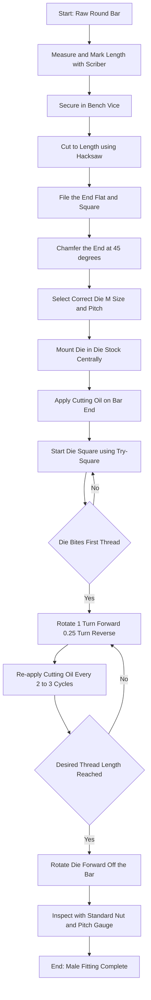
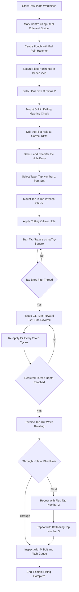
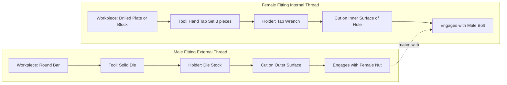

# Male and female fitting

<!-- SECTION_1_START -->
# Module 5 — Fitting: Male and Female Fitting

## 1. Core Technical Definition & Intuitive Overview

### 1.1 Formal KTU 2024 Definition

In **Fitting Shop Practice**, a **fit** is defined as the relationship between two mating parts with respect to the ease of assembly and the nature of contact between them. Within the context of threaded assemblies, two fundamental categories are defined:

**Male Fitting (External Thread):**
A **male fitting** is a threaded component in which the helical ridge (called the **crest** of the thread) is cut on the **external cylindrical surface** of a workpiece. The thread projects outward, allowing it to be inserted into a corresponding internally threaded hole. The standard tool used to produce a male fitting on a round bar in the workshop is a **Die** (also called a **Button Die** or **Solid Die**), held in a **Die Stock**.

**Female Fitting (Internal Thread):**
A **female fitting** is a threaded component in which the helical groove is cut on the **internal surface of a drilled hole**. The thread is recessed inward, and a male threaded part can be screwed into it. The standard tool used to produce a female fitting is a **Tap** (specifically, a **Hand Tap** set consisting of *Taper Tap*, *Plug Tap*, and *Bottoming Tap*), held in a **Tap Wrench** (also called a *Tap Holder*).

> [!IMPORTANT]
> **KTU 2024 Syllabus Highlight (GCESL106 / Module 5):**
> Students must be able to **identify**, **differentiate**, and **describe the stepwise procedure** for producing both male and female fittings, including the **naming, application, and safe handling** of all tools involved.

### 1.2 Conceptual Analogy / Intuition

Imagine a **wooden screw (the male)** and the **hole inside a wooden block (the female)**. The screw has ridges wrapping around it on the outside — that is the **male fitting**. The hole has matching grooves carved into its inside wall — that is the **female fitting**. When you turn the screw clockwise, the ridges slide along the grooves, pulling the screw deeper — converting **rotational motion into linear motion**.

> [!NOTE]
> **Real-World Intuition:**
> - A **bolt** is a male fitting.
> - A **nut** is a female fitting.
> - A **bottle cap** has a female thread; the **bottle neck** has a male thread.
> - A **wood screw** is male; the **pilot hole** it enters becomes female.

> [!VISUALIZATION CONTROL]
> **Concept:** Cross-sectional geometry of an ISO Metric V-thread showing crest, root, pitch, and major/minor diameter.
> **GeoGebra / Desmos Input Equations:**
> * Point $A = (0, 1)$ representing the **Major Radius** ($R_{maj}$).
> * Point $B = (0, 0.75)$ representing the **Minor Radius** ($R_{min}$).
> * Point $C = (0, 0.875)$ representing the **Pitch Radius** ($R_p$).
> * Triangle $V$ with apex at $(1.4, 0.875)$ and base angles **$60^{\circ}$** to depict the **V-profile** of a metric thread (ISO 60° flank angle).
> **Visual Description:** A vertical axis represents the bolt's central axis; concentric circles show the major, pitch, and minor diameters. The triangular V-cut (60°) gives the characteristic triangular cross-section that distinguishes an ISO Metric thread from a Whitworth (55°) or ACME (29°) thread.

### 1.3 Standards, Constants & Specifications

- **Standard thread angle for ISO Metric threads: $60^{\circ}$**
- **Standard thread angle for BSW / BSF (British Standard Whitworth / Fine) threads: $55^{\circ}$**
- **Depth of thread (h) for ISO metric:** $h = 0.6134 \times P$, where $P$ is the pitch.
- **Standard tap drill diameter for a metric thread of size $D$ and pitch $P$:** $D_{drill} = D - P$

> [!NOTE]
> **Bolt Property Classes (commonly referenced in KTU lab manuals):** Property class **4.6, 8.8, 10.9, 12.9** — the first digit is tensile strength in $\text{100 MPa}$ and the second is 10× the yield ratio.

<!-- SECTION_1_END -->

<!-- SECTION_2_START -->
# 2. Deep Theoretical Analysis & KTU High-Yield Formula Sheet

## 2.1 Anatomy of a Screw Thread

Every thread — male or female — can be described by the following geometric parameters:

| Symbol | Parameter | Description |
| :--- | :--- | :--- |
| $D$ | **Major Diameter** | The **largest diameter** of an external thread / **smallest diameter** of an internal thread (measured at the **crest** for male, at the **root** for female). |
| $D_1$ | **Minor Diameter** | The **smallest diameter** of an external thread / **largest diameter** of an internal thread (measured at the **root** for male, at the **crest** for female). |
| $D_p$ | **Pitch Diameter** | The diameter of an imaginary cylinder on which a helical line of width equal to half the pitch would lie. |
| $P$ | **Pitch** | The **axial distance** from one thread crest to the next crest, measured along the axis. |
| $L$ | **Lead** | The **axial advance** per one full rotation. For single-start threads, $L = P$. For double-start, $L = 2P$. |
| $h$ | **Depth of thread** | The radial distance from crest to root. |
| $\alpha$ | **Thread angle** | The angle between the two flanks, measured at the crest. **$60^{\circ}$** for ISO Metric, **$55^{\circ}$** for BSW. |

> [!IMPORTANT]
> **Why these parameters matter in the workshop:**
> When cutting a male thread with a die, the die is **marked** with its nominal size and pitch (e.g., **M10 × 1.5**). When drilling a pilot hole for a female thread, the drill diameter must be **D − P** so that the tap has enough material to cut full-depth threads without breaking.

## 2.2 Tools of the Fitting Shop — Naming & Function

| S.No | Tool Name | Used For | Key Safety Note |
| :---: | :--- | :--- | :--- |
| 1 | **Bench Vice** | Holding the workpiece rigidly. | Jaw faces must be clean; do not over-tighten on soft metals. |
| 2 | **Hacksaw Frame \& Blade** | Cutting round bar / sheet to length. | 18 TPI for thin material, **24–32 TPI for soft metals** like aluminium and brass. |
| 3 | **Files (Flat, Half-Round, Round, Triangular)** | Removing burrs, squaring edges, finishing surfaces. | Always use a **file card** to clean filings; never tap a file on the bench. |
| 4 | **Centre Punch \& Hammer** | Marking drill positions; creating a starting dimple. | Punch at correct angle; striking too lightly causes the drill to wander. |
| 5 | **Drilling Machine (Pillar / Pedestal)** | Drilling the pilot hole for female thread. | Clamp the workpiece; never hold by hand. |
| 6 | **Twist Drill Set** | Producing the hole before tapping. | Select **D − P** for the tap drill. |
| 7 | **Tap (Taper, Plug, Bottoming)** | Cutting **internal (female)** threads. | Always start with **Taper Tap**, then **Plug**, then **Bottoming** for blind holes. |
| 8 | **Tap Wrench (T-Handle / Bar Type)** | Holding and rotating the tap with controlled torque. | Apply **square pressure + ½ turn forward, ¼ turn back** to break the chip. |
| 9 | **Die (Solid / Split / Button)** | Cutting **external (male)** threads. | Mount in die stock with the **adjusting screws** centred. |
| 10 | **Die Stock (Die Holder)** | Holding the die and providing leverage. | Always align the die **square** to the bar axis to avoid cross-threading. |
| 11 | **Cutting Oil / Lubricant** | Reducing friction and heat during cutting. | Use **lubricating oil for steel**, **kerosene for aluminium**, **dry for cast iron**. |
| 12 | **Thread Pitch Gauge** | Identifying the pitch of an unknown thread. | Match the teeth to the thread profile snugly. |
| 13 | **Vernier Caliper / Screw Gauge** | Measuring diameter and verifying depth. | Zero the instrument before use; check for zero error. |

## 2.3 The "Why" Behind the Procedure

- **Why chamfer the bar end before using a die?** → A chamfer guides the die onto the bar, preventing the first threads from being crushed and damaged.
- **Why use a tap drill smaller than the major diameter?** → The tap itself removes material to form the thread profile; a full-diameter hole would leave no material for the thread crest.
- **Why reverse the tap ¼ turn periodically?** → To **break the chip** and prevent chip clogging, which causes tap breakage.
- **Why use cutting fluid?** → To reduce **heat generation** (which softens the tap), improve **surface finish**, and extend **tool life**.

## 2.4 KTU High-Yield Formula Sheet

| # | Formula | Use Case |
| :--- | :--- | :--- |
| 1 | $D_{drill} = D - P$ | Tap drill size for **ISO metric internal thread**. |
| 2 | $h = 0.6134 \times P$ | Theoretical thread depth (ISO metric). |
| 3 | $D_1 = D - 1.0825 \times P$ | Minor diameter of external thread (ISO metric). |
| 4 | $D_{1,\text{hole}} = D - 1.0825 \times P$ | Minor diameter for the **drilled hole** of an internal thread. |
| 5 | $L = n \times P$ | Lead = number of starts × pitch. |
| 6 | $\tan(30^{\circ}) = \dfrac{P/2}{h}$ | Relates pitch to depth for a $60^{\circ}$ V-thread. |
| 7 | $\text{Pitch (TPI)} = \dfrac{25.4}{P_{\text{mm}}}$ | Convert metric pitch to **Threads Per Inch (TPI)**. |

> [!NOTE]
> **Engineering Real-World Utility:**
> Threaded male-female assemblies are the **backbone of mechanical design** — they appear in aerospace structural joints, automotive engine blocks, hydraulic pipe fittings, electrical conduit entries, PCB mounting hardware, and consumer electronics enclosures. Mastering male-female fitting in the workshop is the first step toward understanding **fastener selection, torque-tightening procedures, and preload calculation** in design courses.

<!-- SECTION_2_END -->

<!-- SECTION_3_START -->
# 3. Step-by-Step Procedure, Tool Configurations & Safety

## 3.1 Standard Tool Pin / Specification Matrix (Workshop Reference)

> [!IMPORTANT]
> **Mapping to KTU 2024 Scheme Practical Examination:**
> The lab exam typically asks the student to (a) identify the tools, (b) name them, (c) state their function, and (d) demonstrate the **correct sequence** of operations.

| Tool / Component | Specification (Workshop Standard) | Common Sizes Used in Lab |
| :--- | :--- | :--- |
| **Hand Tap Set** | HSS, $60^{\circ}$ profile, **3 taps/set** (Taper No.1, Plug No.2, Bottoming No.3) | M6, M8, M10, M12 |
| **Solid Die** | HSS, circular, split for adjustment, **$60^{\circ}$ profile** for metric | M6, M8, M10, M12 |
| **Tap Wrench** | Adjustable jaws, bar-type for heavy taps, T-handle for small taps | Fits tap shanks 3 mm – 12 mm |
| **Die Stock** | Round frame with **3 set screws** to hold the die centrally | Fits OD of die: 25 mm, 38 mm |
| **Twist Drill** | $118^{\circ}$ point angle, HSS | 5.0 mm (for M6×1), 6.8 mm (for M8×1.25), 8.5 mm (for M10×1.5), 10.2 mm (for M12×1.75) |
| **Bench Vice** | Cast iron, fixed base, **jaw width** 100–150 mm | Standard lab size |
| **Cutting Oil** | Sulphur-based or soluble oil | For mild steel; **kerosene** for aluminium |

## 3.2 Procedure for Making a **MALE FITTING** (External Thread on a Round Bar)

> **Workpiece:** Mild steel round bar, **$\phi 10$ mm × 60 mm** length.
> **Target Thread:** **M10 × 1.5** (Major diameter 10 mm, pitch 1.5 mm).

**Step 1 — Marking and Cutting to Length**
1. Mark **60 mm** length on a 10 mm Ø mild steel bar using a steel rule and **scriber**.
2. Secure the bar in the bench vice with minimum projection.
3. Cut using a **hacksaw** with a 24 TPI bi-metal blade — strokes should be long, even, and on the forward stroke.
4. File the cut end **flat and square** using a **flat file** on a flat surface plate.

**Step 2 — Chamfering the End**
1. File a **$45^{\circ}$ chamfer** of approximately 1–1.5 mm on the end to be threaded.
2. Verify with a protractor that the chamfer is symmetrical — this guides the die onto the bar.

**Step 3 — Mounting the Die in the Die Stock**
1. Identify the die: it is stamped **M10 × 1.5** on its face.
2. Loosen the **three adjusting screws** of the die stock.
3. Insert the die such that the **mark on the die** aligns with the **mark on the stock** (or as per the stock's manual).
4. Tighten the adjusting screws evenly so the die sits **flat and concentric**.

**Step 4 — Applying Cutting Fluid**
1. Apply a thin film of **cutting oil** along the chamfered end and the leading portion of the bar.

**Step 5 — Starting the Die Square**
1. Hold the die stock with both hands, the bar vertical in the vice.
2. Place the die **square** onto the chamfer — use your **eye and a try-square** to confirm perpendicularity.
3. Apply **firm downward pressure** and rotate the die stock **clockwise**.
4. Once the die has bitten (after about ½ to 1 turn), **release the pressure** and continue turning with even force.

**Step 6 — Cutting the Thread**
1. Rotate the die stock **one full turn clockwise**.
2. Then rotate **¼ turn counter-clockwise** to **break the chip**.
3. Repeat this cycle, adding a drop of cutting oil every 2–3 cycles.
4. Stop when the die has passed the required thread length (e.g., 20 mm for an M10 nut).

**Step 7 — Removing the Die**
1. Continue rotating the die stock **clockwise** off the end of the bar.
2. **Do not reverse** the die off — this will damage the freshly cut threads.

**Step 8 — Inspection**
1. Test the thread with a **standard M10 nut** — it should screw on smoothly without force and without wobble.
2. Verify the **pitch** using a **thread pitch gauge** (should match 1.5 mm).

> [!WARNING]
> **Common Pitfalls — Male Fitting:**
> - Die started **off-square** → produces a **crooked, shallow thread** that will not engage a nut.
> - Die **reversed off** the bar → **tears** the crests of the freshly cut threads.
> - **No cutting fluid used** → die overheats, **work-hardens** the steel, and the die **glazes over** and stops cutting.

## 3.3 Procedure for Making a **FEMALE FITTING** (Internal Thread in a Drilled Hole)

> **Workpiece:** Mild steel flat plate **50 × 50 × 12 mm** with a **$\phi 8.5$ mm drilled hole**.
> **Target Thread:** **M10 × 1.5** internal thread.

**Step 1 — Marking the Centre**
1. Using a **steel rule and scriber**, mark the **centre of the plate**.
2. Place the plate on an **engineer's surface plate or anvil block**.

**Step 2 — Centre Punching**
1. Hold the **centre punch** at a slight angle initially, then **upright** over the mark.
2. Strike the punch with a **ball-pein hammer** — firm, controlled blow.
3. The dimple should be deep enough to **guide the drill point** but not so deep as to crack the material.

**Step 3 — Drilling the Tap Hole**
1. Secure the plate in the bench vice on a **V-block or parallel** so the plate sits **horizontal**.
2. Mount an **8.5 mm twist drill** in the drilling machine chuck and **tighten securely** with the chuck key.
3. Align the drill point to the centre punch mark.
4. Start the machine at **low RPM**, increase to working RPM (≈ 600–800 RPM for 8.5 mm in mild steel).
5. Apply **steady, moderate feed** — let the drill cut, do not force.
6. When the drill point **breaks through** the underside, **reduce feed** to avoid a jagged exit.
7. Retract the drill while the machine is **still running**.

**Step 4 — Deburring**
1. Use a **larger drill bit (by hand)** or a **deburring tool** to remove the burr from both sides of the hole.
2. **Chamfer the entry side** of the hole — this helps the **taper tap** start square.

**Step 5 — Mounting the Taper Tap in the Tap Wrench**
1. Select **Taper Tap (No. 1)** from the M10 tap set.
2. Insert the **square shank** of the tap into the **chuck of the tap wrench**.
3. Tighten the chuck jaws **square** and **evenly**.

**Step 6 — Starting the Tap Square**
1. Position the tap **vertically** into the chamfered hole.
2. Use a **try-square** against the tap wrench to confirm the tap is **perpendicular** to the plate.
3. Apply **firm downward axial pressure** and rotate the wrench **clockwise** slowly.
4. Once the tap has bitten (the first 1–2 threads), the tap will self-stabilise. **Release the pressure**.

**Step 7 — Cutting the Thread — The "Forward-Back" Technique**
1. Rotate the tap **½ turn clockwise** (cutting).
2. Rotate the tap **¼ turn counter-clockwise** (chip-breaking).
3. Repeat this cycle **consistently**.
4. Add **a drop of cutting oil** every 2–3 cycles.
5. After completing the thread length, **reverse the tap out** while turning counter-clockwise — keep it rotating to avoid breaking the tap.

**Step 8 — Using the Plug Tap (No. 2)**
1. Repeat Steps 5–7 using the **Plug Tap** to deepen and refine the thread.
2. For **through-holes**, this completes the operation.
3. For **blind holes**, follow up with the **Bottoming Tap (No. 3)** to cut threads to the full depth of the hole.

**Step 9 — Inspection**
1. Test by inserting a **standard M10 bolt** — it should engage smoothly.
2. Verify with a **thread plug gauge** (Go / No-Go) if available in the lab.
3. Verify the **pitch** with a thread pitch gauge.

> [!WARNING]
> **Common Pitfalls — Female Fitting:**
> - Tap started **off-square** → produces an **oversized, elliptical thread**.
> - **Force applied** instead of steady rotation → tap **breaks inside the hole** (very difficult to remove).
> - **No chip-breaking** → chip packs in the flutes → **tap breakage**.
> - **Wrong drill size** (full 10 mm instead of 8.5 mm) → **insufficient material** for full thread depth → weak, stripped threads.

## 3.4 Exhaustive Worked Numerical Example (Drill Size Verification)

**Problem (Typical KTU Numerical):**
Determine the **tap drill size** required to produce an **M12 × 1.75** internal thread in a mild steel plate. Also verify the **minor diameter** of the resulting internal thread.

**Given:**
- Nominal thread size $D = 12$ mm.
- Pitch $P = 1.75$ mm.

**Solution:**

**Step 1 — Apply the tap drill formula.**
$$D_{drill} = D - P$$
$$D_{drill} = 12 - 1.75$$
$$D_{drill} = 10.25 \text{ mm}$$

So the closest **standard drill bit** is **10.2 mm** (or **10.3 mm**, depending on tolerance class).

**Step 2 — Verify the minor diameter of the internal thread.**
$$D_{1} = D - 1.0825 \times P$$
$$D_{1} = 12 - (1.0825 \times 1.75)$$
$$D_{1} = 12 - 1.8944$$
$$D_{1} = 10.1056 \text{ mm}$$

**Step 3 — Cross-check using the geometric relationship.**

For a $60^{\circ}$ V-thread, the theoretical thread depth is:
$$h = 0.6134 \times P$$
$$h = 0.6134 \times 1.75$$
$$h = 1.0735 \text{ mm}$$

The **major diameter** of the internal thread (the smallest diameter of the hole) is:
$$D_{hole,\text{minor}} = D - 2h = 12 - 2(1.0735) = 9.853 \text{ mm}$$

This represents the theoretical crest diameter of the internal thread. Since the drilled hole is $10.25$ mm, the tap removes $10.25 - 9.853 = 0.397$ mm of material per side, which is a reasonable amount for a robust thread form.

> [!NOTE]
> **Valuation Key Points (KTU Style):**
> '[Stating formula $D_{drill} = D - P$: 1 Mark]'
> '[Substitution and calculation: 1 Mark]'
> '[Final answer with units and standard drill selection: 1 Mark]'

<!-- SECTION_3_END -->

<!-- SECTION_4_START -->
# 4. Structural Diagrams & Schematics

## 4.1 Functional Flow Architecture — Male Fitting (External Thread) Process

## 4.2 Functional Flow Architecture — Female Fitting (Internal Thread) Process

## 4.3 Comparative Block Diagram — Male vs Female Fitting

## 4.4 Tool-Kit Topology Matrix (Workshop Tray Layout)

| Slot | Tool | Used in Male? | Used in Female? |
| :---: | :--- | :---: | :---: |
| 1 | Bench Vice | Yes | Yes |
| 2 | Hacksaw Frame + 24 TPI Blade | Yes | Optional |
| 3 | Centre Punch + Hammer | No | Yes |
| 4 | Twist Drill Set | No | Yes |
| 5 | Drilling Machine | No | Yes |
| 6 | Flat File | Yes | Yes |
| 7 | Round File | No | Yes (Deburr) |
| 8 | Taper, Plug, Bottoming Tap Set | No | Yes |
| 9 | Tap Wrench | No | Yes |
| 10 | Solid Die (Split Type) | Yes | No |
| 11 | Die Stock | Yes | No |
| 12 | Cutting Oil Bottle | Yes | Yes |
| 13 | Thread Pitch Gauge | Yes (Inspect) | Yes (Inspect) |
| 14 | Vernier Caliper | Yes (Measure) | Yes (Measure) |

<!-- SECTION_4_END -->

<!-- SECTION_5_START -->
# 5. KTU 2024 Scheme Examination Question Bank & Topic Recap

## 5.1 Part A — Short Answer Questions (3 Marks Each)

### Question 1 **[KTU University Exam — July 2023]**
**(CO1, Remember)**
**Q: Differentiate between a male fitting and a female fitting. State one engineering application of each.**

**Model Answer (3 Marks):**

A **male fitting** is an **external thread** cut on the outer surface of a cylindrical workpiece, produced using a **die** mounted in a **die stock**. The thread crests project outward. *Application:* used in **bolts, screws, and studs** that fasten two components together.

A **female fitting** is an **internal thread** cut on the inner surface of a drilled hole, produced using a **hand tap** (taper, plug, bottoming) held in a **tap wrench**. The thread grooves are recessed inward. *Application:* used in **nuts, engine cylinder heads, and tapped holes in machine frames**.

*Key differentiator:* the male thread has its **crest on the outside** and engages **into** a female thread; the female thread has its **crest on the inside** and **receives** a male thread.

> **[Valuation Key: 1 Mark for each definition + ½ Mark for each application = 3 Marks]**

---

### Question 2 **[KTU University Exam — Dec 2022]**
**(CO2, Understand)**
**Q: Name the three types of hand taps used to produce an internal thread. State the order in which they are used and justify why this order is followed.**

**Model Answer (3 Marks):**

The three hand taps, used **in this order**, are:
1. **Taper Tap (No. 1)** — used **first**. It has a chamfered lead of about 7–10 threads, allowing it to start the thread gradually and align itself in the drilled hole.
2. **Plug Tap (No. 2)** — used **second**. It has a shorter chamfer (3–5 threads) and cuts the thread closer to full depth, following the path started by the taper tap.
3. **Bottoming Tap (No. 3)** — used **last**, primarily in **blind holes**. It has only 1–1½ chamfered threads, allowing it to cut threads almost to the **bottom** of a blind hole.

*Justification:* this sequence progressively removes less material with each tap, **reducing the cutting force**, **preventing tap breakage**, and producing a **full-depth, accurate thread**.

> **[Valuation Key: 1 Mark for naming + 1 Mark for order + 1 Mark for justification = 3 Marks]**

---

## 5.2 Part B — Full 14-Mark Questions (Module Internal Choice)

### Question A (Choice 1) **[KTU University Exam — July 2024]**
**(CO1, CO2 — Understand + Apply)**

**(a) [7 Marks] List all the tools required to produce a male fitting (external thread) on a round bar. Describe the step-by-step procedure with a neat functional flowchart, and state the safety precautions to be followed.**
**(b) [7 Marks] An M16 × 2.0 internal thread is to be cut in a mild steel block. Determine (i) the correct tap drill size, (ii) the minor diameter of the internal thread, and (iii) the theoretical depth of thread.**

---

#### Model Solution — Part (a) [7 Marks]

**Tools Required (2 Marks):**
1. **Bench Vice** — to hold the workpiece rigidly.
2. **Hacksaw (24 TPI blade)** — to cut the bar to required length.
3. **Flat File** — to square and chamfer the bar end.
4. **Steel Rule and Scriber** — to mark the length.
5. **Solid Die of correct size** (e.g., M16 × 2.0) — the cutting tool for external thread.
6. **Die Stock** — to hold and rotate the die.
7. **Cutting Oil** — for lubrication and cooling.
8. **Vernier Caliper** — to verify the diameter.
9. **Thread Pitch Gauge** — to verify the pitch.
10. **Standard Nut** — to test-fit the produced thread.

**Step-by-Step Procedure (4 Marks):**
1. Mark the required length on the bar using a scriber.
2. Cut the bar using a hacksaw.
3. File the cut end **flat and square**.
4. File a **$45^{\circ}$ chamfer** on the end to guide the die.
5. Mount the die in the die stock using the **three adjusting screws**.
6. Apply **cutting oil** on the chamfered end.
7. Place the die **square** on the bar (verify with try-square).
8. Apply **firm pressure** and rotate the die stock **clockwise** until it bites.
9. Once bitten, **release pressure** and rotate **1 turn forward, ¼ turn reverse** to break the chip.
10. Add cutting oil every 2–3 cycles.
11. Continue until the required thread length is achieved.
12. Rotate the die forward (do **not** reverse) to remove it from the bar.
13. Test the thread with a standard nut and verify with a pitch gauge.

**Safety Precautions (1 Mark):**
- Wear **safety goggles** to protect eyes from flying chips.
- Use a **file with a handle** — never use a bare file.
- Keep fingers **clear** of the die's cutting edge.
- Do **not** force the die — let it cut at its own pace.
- Do **not** reverse the die off the bar — this damages the freshly cut threads.
- Keep the **workbench tidy** and clean up oil spills to prevent slips.

> **[Valuation Key: Tools list: 2 Marks | Procedure: 4 Marks | Safety: 1 Mark = 7 Marks]**

---

#### Model Solution — Part (b) [7 Marks]

**Given:**
- Nominal thread size $D = 16$ mm.
- Pitch $P = 2.0$ mm.

**(i) Tap Drill Size (2 Marks):**
$$D_{drill} = D - P$$
$$D_{drill} = 16 - 2.0 = 14.0 \text{ mm}$$

**Answer:** Use a **14.0 mm** standard twist drill.

**(ii) Minor Diameter of Internal Thread (2 Marks):**
$$D_{1} = D - 1.0825 \times P$$
$$D_{1} = 16 - (1.0825 \times 2.0)$$
$$D_{1} = 16 - 2.165 = 13.835 \text{ mm}$$

**Answer:** $D_{1} = 13.835$ mm.

**(iii) Theoretical Depth of Thread (2 Marks):**
$$h = 0.6134 \times P$$
$$h = 0.6134 \times 2.0 = 1.2268 \text{ mm}$$

**Answer:** $h = 1.2268$ mm.

**Summary Statement (1 Mark):**
For an M16 × 2.0 internal thread, the recommended tap drill is **14.0 mm**, the theoretical minor diameter of the resulting internal thread is **13.835 mm**, and the thread depth is **1.2268 mm**.

> **[Valuation Key: Each sub-part formula + substitution + answer = 2 Marks; Summary = 1 Mark = 7 Marks]**

---

### Question B (Choice 2) **[KTU University Exam — Dec 2023]**
**(CO2, CO3 — Apply + Analyse)**

**(a) [7 Marks] With the help of a labelled block diagram, explain the step-by-step procedure to produce a female fitting (internal thread) in a drilled mild steel plate. List the tools required and justify why the tap drill diameter is always less than the nominal thread diameter.**
**(b) [7 Marks] An M8 × 1.25 external thread is to be cut on a round bar. (i) Identify the correct die to be used. (ii) State the importance of chamfering the bar end before using the die. (iii) Calculate the tap drill size that would be required if the same M8 × 1.25 were to be cut as an internal thread.**

---

#### Model Solution — Part (a) [7 Marks]

**Tools Required (1.5 Marks):**
- Centre punch, ball-pein hammer.
- Drilling machine with 6.8 mm HSS twist drill.
- Deburring tool.
- Taper, Plug, Bottoming Tap set (M8).
- Tap wrench.
- Cutting oil.
- Vernier caliper, thread pitch gauge.

**Procedure with Labelled Block Diagram (4 Marks):**
1. Mark the centre of the plate using a scriber and steel rule.
2. Centre-punch the marked point.
3. Secure the plate horizontally in the bench vice.
4. Mount the **6.8 mm drill bit** in the drilling machine.
5. Drill a pilot hole through the plate at moderate RPM.
6. Deburr the entry and exit sides of the hole.
7. Chamfer the entry of the hole to guide the taper tap.
8. Mount the **Taper Tap (No. 1)** in the tap wrench.
9. Position the tap vertically in the hole; verify with a try-square.
10. Apply firm axial pressure and rotate clockwise until the tap bites.
11. Use the **forward ½ turn / reverse ¼ turn** technique with cutting oil every 2–3 cycles.
12. Continue until the desired depth is reached; reverse the tap out while rotating.
13. For blind holes, repeat with **Plug Tap** and then **Bottoming Tap**.
14. Test with a standard M8 bolt; verify pitch with a pitch gauge.

**Justification — Why Tap Drill < Nominal Diameter (1.5 Marks):**
The tap drill diameter is **less than the nominal thread diameter** because the **tap itself must remove material** to form the thread crests and flanks. If the drill diameter equals the nominal size, there would be **no material left** for the tap to cut, and the resulting "thread" would have **shallow, weak crests** that strip under load. The formula $D_{drill} = D - P$ ensures the correct radial depth is available for a full-strength thread.

> **[Valuation Key: Tools: 1.5 Marks | Procedure: 4 Marks | Justification: 1.5 Marks = 7 Marks]**

---

#### Model Solution — Part (b) [7 Marks]

**(i) Correct Die to be Used (2 Marks):**
For an M8 × 1.25 external thread, the correct die is a **Solid (Split) Button Die** marked **"M8 × 1.25"**. The die must be HSS, with a **$60^{\circ}$ profile** (ISO Metric standard), and must be mounted in a die stock that fits its outer diameter (commonly 25 mm OD for small dies).

**(ii) Importance of Chamfering the Bar End (2 Marks):**
Chamfering the bar end at approximately $45^{\circ}$ serves **two critical purposes**:
1. It **guides the die onto the bar** centrally and square, preventing the die's cutting teeth from being **crushed or chipped** at the start.
2. It allows the **first few threads** of the die to engage gradually, rather than impacting a sharp 90° corner — this **reduces stress** on both the die and the bar and produces a **clean, full-form starting thread** that can accept a nut without resistance.

**(iii) Tap Drill Size for M8 × 1.25 Internal Thread (3 Marks):**
$$D_{drill} = D - P$$
$$D_{drill} = 8 - 1.25 = 6.75 \text{ mm}$$

**Closest standard drill:** **6.8 mm** (the nearest available size in standard HSS drill sets).

> **[Valuation Key: (i) Naming the die with specifications: 2 Marks | (ii) Two valid reasons: 2 Marks | (iii) Formula + substitution + answer: 3 Marks = 7 Marks]**

---

## 5.3 KTU Examiner's Valuation Warning / Pitfall Callout

> [!WARNING]
> **Top Reasons Students Lose Marks in Fitting Questions:**
> 1. **Forgetting the tap drill formula** — writing $D_{drill} = D$ instead of $D_{drill} = D - P$. Always state the formula first.
> 2. **Mixing up units** — pitch in mm vs. TPI (threads per inch). If the question gives pitch in mm, keep it in mm.
> 3. **Not listing safety precautions** — every KTU fitting question carries at least **1–2 marks** for safety; missing it is a guaranteed loss.
> 4. **Confusing Taper / Plug / Bottoming Tap order** — the order is **Taper → Plug → Bottoming**. Reversing this sequence is incorrect.
> 5. **Skipping the "why"** — when asked to *justify* a step, students often describe the *what* but not the *why*. Examiners look for engineering reasoning.
> 6. **Forgetting to specify standard drill size** — calculating $D_{drill} = 6.75$ mm is correct, but stating "use a **6.8 mm standard drill**" is the complete answer.
> 7. **Drawing the block diagram without arrows** — the KTU valuation key requires **labelled, sequential blocks connected by arrows** showing the flow of operations.

---

## 5.4 Topic Recap & Important Things to Remember

> [!IMPORTANT]
> **Rapid Revision Checklist — Male and Female Fitting (Module 5)**

- **Male fitting = external thread** on the **outside** of a bar → produced using a **die + die stock**.
- **Female fitting = internal thread** on the **inside** of a hole → produced using a **hand tap set (Taper, Plug, Bottoming) + tap wrench**.
- **Tap drill formula:** $D_{drill} = D - P$ (always **less** than the nominal thread diameter).
- **Minor diameter (theoretical):** $D_{1} = D - 1.0825 \times P$.
- **Thread depth:** $h = 0.6134 \times P$.
- **ISO Metric thread angle:** **$60^{\circ}$**; **BSW thread angle:** **$55^{\circ}$**.
- **Hand Tap order for blind holes:** **Taper Tap (No. 1) → Plug Tap (No. 2) → Bottoming Tap (No. 3)**.
- **Standard tap drill sizes (must memorise for lab exam):**
  - M6 × 1.0 → drill **5.0 mm**
  - M8 × 1.25 → drill **6.8 mm**
  - M10 × 1.5 → drill **8.5 mm**
  - M12 × 1.75 → drill **10.2 mm**
- **Forward-reverse technique:** rotate **½ turn forward + ¼ turn reverse** to break the chip — **prevents tap breakage**.
- **Die must be rotated forward only** to remove it from a finished male thread — **never reverse**.
- **Always chamfer the bar end (male) and the hole entry (female)** to guide the cutting tool.
- **Cutting fluid:** lubricating oil for steel, **kerosene for aluminium**, **dry for cast iron**.
- **Inspection tools:** Vernier caliper for diameter, **thread pitch gauge** for pitch, **standard nut/bolt** for fit.
- **Safety goggles, file handle, tidy bench, no forced cuts** — these are **mandatory valuation points**.
- **Workpiece holding:** always in a **bench vice**; never hold small threaded workpieces by hand during cutting.
- **Common failure modes to remember:** off-square start, reversed die off bar, no chip-breaking, wrong drill size — each causes a specific defect (crooked thread, torn crests, broken tap, stripped thread).

<!-- SECTION_5_END -->
